# Phase 0 — Baseline Corpus Production Flow (content-first)

**Version:** 2.0 — 2026-08-27
**Status:** ✅ Active
**Classification:** METHODOLOGY-META — describes how the baseline's analytical content is produced.
Not a numbered deliverable.
**Companion:** [`./validation/P0_baseline_audit_v0.md`](./validation/P0_baseline_audit_v0.md) v2.0.

---

## 1. Purpose

Until v2.0 of this file, the baseline production view described **how the corpus is mechanically
assembled** (generator script, snapshot commit, freeze guard). It described **what the corpus
contains** only at inventory level. Review caught the gap: the corpus's analytical value lives
in its five content layers (verbatim anchoring, hierarchical objectives, Volere requirements,
cross-regulation analysis, ambiguity registration), and a production flow that does not name
those layers cannot tell a case author which Part to cite for a given problem.

This v2.0 names the layers and the transformations between them. Tooling / freeze details move
to a compact appendix (§6) for traceability.

---

## 2. Pipeline — Six content stages

```mermaid
flowchart LR
    subgraph C1["C1 — Verbatim clause anchoring"]
        REG["In-scope regulations<br/>GDPR · CRA · NIS 2 · DORA · AI Act"]
        EX["Extract literal clauses<br/>tag per article, end with citation"]
    end

    subgraph C2["C2 — Hierarchical Security Objective"]
        HSO["HSO per sub-domain<br/>D-X.Y.0 → SO-D-X.Y.HL"]
        SUB["Sub-SO per regulation<br/>D-X.Y.1..N → SO-D-X.Y.<REG><br/>inherits_from SO-<REG>-NNN<br/>anchors PR.DS-NN / GV.SC-NN"]
    end

    subgraph C3["C3 — Volere Security Requirements"]
        CARD["One card per objective (1:1, 172/172)<br/>fit_criterion · priority ·<br/>verification_method · nist_csf"]
    end

    subgraph C4["C4 — Cross-Regulation Analysis"]
        DOM["Part 2: pairwise scope-overlap matrix<br/>(all in-scope regs × each)"]
        DEEP["Part 3: per-pair deep dives<br/>STUB for D-10.1/10.2/10.3"]
    end

    subgraph C5["C5 — Ambiguity registration"]
        REG2["Part 4 per regulation<br/>GDPR-CLNN · CRA-CLNN · NIS2-CLNN · CL19-NN"]
        INST["Instances (VAG / S3 / sentence-level)<br/>Variant readings R1 / R2 / R3"]
    end

    subgraph C6["C6 — Freeze + consumption"]
        SNAP["Snapshot 231ed3c (2026-08-26)<br/>guard denies Write|Edit<br/>dependency_graph declares protected"]
        USE["~800 downstream citations<br/>Case_01 Doc13 §1-§4 + NIST layer<br/>Case_02/03 P1-P3 · dashboards"]
    end

    REG --> EX
    EX --> HSO
    HSO --> SUB
    SUB --> CARD
    CARD --> DOM
    DOM --> DEEP
    DEEP --> REG2
    REG2 --> INST
    INST --> SNAP
    SNAP --> USE

    classDef floor fill:#f4e8e8,stroke:#a33
    classDef core fill:#e8f4e8,stroke:#333
    classDef xreg fill:#fff4e1,stroke:#b8860b
    classDef ambig fill:#f0e8f4,stroke:#633
    classDef freeze fill:#e8e8f4,stroke:#555
    classDef consume fill:#f0f0f0,stroke:#999

    class REG,EX floor
    class HSO,SUB,CARD core
    class DOM,DEEP xreg
    class REG2,INST ambig
    class SNAP freeze
    class USE consume
```



### C1 — Verbatim clause anchoring (Part 1 §1)
**Input:** the in-scope regulation texts (GDPR, CRA, NIS 2, DORA, AI Act — 5 regulations).
**Transformation:** lift each clause that touches the sub-domain as a literal blockquote, ending with an inline
citation in the canonical style (`— Art. 17(1) GDPR`, `(CRA Annex I Part I (2)(m))`).
**Output:** the verbatim-anchored §1 of each `D-X.Y.md` Part 1. Counters in D-05.3: 6 GDPR grounds (Art. 17(1)(a)–(f)),
Art. 28(3)(g), CRA Annex I Part I (2)(m), Annex II §8(d).
**Convention gap (audit §5 finding 3):** the `[VERBATIM]` header tag is present on 12/38 files (36 tag
instances) — consumers cannot programmatically distinguish verbatim text from interpretation in the
other 26 docs even though the body style matches.

### C2 — Hierarchical Security Objective (Part 1 §2)
**Input:** the verbatim clauses from C1 + the corpus baseline of `SO-<REG>-NNN` IDs (carried from
`HierarchicalSecurityObjectives/` per the deleted layout).
**Transformation:** for each sub-domain, derive one HSO and one Sub-SO per in-scope regulation. The
Sub-SO inherits from one or more corpus `SO-<REG>-NNN` ids and pins its NIST CSF anchors (e.g.
`PR.DS-10 / PR.DS-12 / GV.SC-04` for D-05.3 GDPR sub-SO).
**Output:** §2 with one `#### D-X.Y.0` header (HSO) and one `#### D-X.Y.N` header (Sub-SO) per
regulation. Counts: 38 HSO + 134 Sub-SO = 172 objective headers across the corpus.
**Provenance field:** every objective records `derivation_source:` into the deleted analytical
workspace (e.g. `../../CrossRegulation/DeepAnalysis/D-05_Data-Lifecycle/D-05.3.md §D-05.3`).

### C3 — Volere Security Requirements (Part 1 §3)
**Input:** the objective set from C2.
**Transformation:** for each objective, write one Volere YAML card whose `req_id` mirrors the
objective number (dotted-decimal local scheme — `5.3.1`, **NOT** the case-side `R-D-*` scheme).
**Output:** §3 with one card per objective (1:1, 172/172). Card fields verified from
`D-05.3.md:520`: `req_id`, `volere_section/subtype`, `derives_from.hso_sub_so`, `description`,
`fit_criterion` (~150-word testable), `priority`, `verification_method`, `dependencies`,
`nist_csf`, `applicable_if.regs/scope_overlap`.
**Important convention:** the `5.3.1` numbering is local to the baseline; case-side requirements
adopt a different scheme (`REQ-D-XX.X-NNN` per corr-008). Authors must NOT cite a baseline `req_id`
as if it were a case-side `REQ-D-*` — `Corpus_Field_Map.md` already flags Part 1 for this.

### C4 — Cross-Regulation Analysis (Parts 2 + 3)
**Input:** the requirements set from C3 + the regulation list.
**Transformation:**
- Part 2 *Domain Analysis* opens with its own document id (`AEGIS-PREPROC-CRDA-D-X.Y`), lists
  participants (incl. explicit out-of-scope rows), builds the pairwise **scope-overlap matrix**
  (all in-scope regs × each), and runs requirement cross-validation.
- Part 3 *Deep Analysis* elaborates each regulator-pair interaction individually.
**Output:** Parts 2 and 3 of every D-X.Y.md. Together they form the cross-regulation reasoning
layer that sits between raw objectives (C2) and ambiguity registration (C5).
**Structural break (audit §5 finding 1):** D-10.1, D-10.2, D-10.3 ship Parts 2 + 3 as empty stubs
(`_Domain Analysis source not found._` / `_Deep Analysis source not found._`). The whole
Monitoring & Audit domain lacks the cross-regulation reasoning layer; any case that consumes
ambiguities from these sub-domains will see Part 4 ambiguity without any pairwise backing.

### C5 — Ambiguity registration (Part 4)
**Input:** the clauses from C1, the regulations in scope, and the Berry-method anchor references
carried over from the deleted `Regulation/<REG>/Ambiguity/` tree.
**Transformation:** per in-scope regulation, register one or more ambiguity cards (blank section
where the regulation is not applicable, e.g. `## NIS2 → _No applicable NIS2 ambiguity._`).
A card at `D-05.3.md:795` shows the shape: clause header (`##### Art. 5(1)(c) — Data minimisation`),
metadata line (`Clause: GDPR-CL03 | type: principle | obligatedParty: CONTROLLER`),
Berry anchor, concrete **instances** (VAG/S3 "'adequate','relevant','necessary'"), and a
variant-readings table (`| # | Reading | Disambiguation source |` rows R1/R2/R3).
**Output:** Part 4 of every D-X.Y.md. Per-regulation clause-ID schemes differ:
`GDPR-CLNN` · `CRA-CLNN` · `NIS2-CLNN` · `DORA CL19-NN` · legacy `GDPR-CNN`.
**Counts (audit §3):** **2023 variant-reading tables** measured corpus-wide. The corpus-level
`domains/index.md:7` claims **1020** "Ambiguity sections" — no counted token reproduces 1020
exactly (per-domain `_index.md` uses a different per-domain figure, e.g. 88 for D-05 alone).
The discrepancy is unresolved (correction would require touching guard-protected `domains/**`).

### C6 — Freeze + consumption
**Input:** the full D-X.Y.md + per-subdomain `_index.md` + 10 `D-XX.manifest.json` + 623 article
copies (`articles/<REG>_Art_NN.md`, one-to-many cache from `Regulation/<REG>`).
**Transformation:** the analytical content is committed once as a snapshot
(`231ed3c`, 2026-08-26). The freeze is then operationalised by the workspace guard
(`guard-protected-files.sh` denies `Write|Edit` on `domains/**`) and by
`dependency_graph.yaml` declaring the corpus a protected dependency.
**Output:** read-only corpus available for downstream citation. Consumers (~800 refs repo-wide)
read but do not modify.

---

## 3. Per-consumer map (downstream of C6)

| Consumer | What they pull | Where they pull it |
|----------|----------------|--------------------|
| Case_01 `Doc13_Adjusted_Goals.md` §1 generic baseline | HSO + Sub-SOs verbatim | `D-X.Y.md` §2 (Layer B / C2 output) |
| Case_01 `Doc13` §2-§4 adjusted objectives | per-regulation refinement | Sub-SOs (Layer B / C2 output) |
| Case_01 `Doc13` sprint 10/11 NIST layer | CSF anchors + Volere `nist_csf` fields | §2 Sub-SOs + §3 Volere (Layers B+C / C2+C3) |
| Case_01 `Corpus_Field_Map.md` | field mapping case-side ↔ baseline | Part 1 sections (Layer A / C1 output) |
| Case_01 `00_COMMON/02_Regulatory_Mapping_Master.md` | regulation × sub-domain mapping | Part 1 §1 verbatim extracts |
| `SPEC_NIST_MATRIX_UNIFIED` + Doc19 / Doc20 NIST inputs | NIST control JSONs | `CONTROLS/NIST_AI_RMF/*.json`, `CONTROLS/NIST_PF/*.json` |
| Doc15 / Doc17 tensions reports | cross-regulation tensions | Part 2 *Domain Analysis* + Part 3 *Deep Analysis* (Layer D / C4) — **NB: D-10.x stubs do NOT contribute** |
| Case_01 Doc09 ambiguity register | 417 ambiguity cards | Part 4 (Layer E / C5) — note: only 2023 reading-tables measured, not 417 cards; mapping unclear |
| Dashboards (GDPR, CRA, NIS2) | indirect via cases | downstream of the above |
| Methodology (`dependency_graph.yaml`, `AGENTS.md`) | declares corpus as protected dependency | n/a (governance) |
| **Total measured** | | **~800 citations repo-wide** |

**Per-doc canonical Phase 1 chain:**
```
C2 (HSO + Sub-SOs) → Doc13 §1 generic baseline
C2 (Sub-SOs)        → Doc13 §2-§4 adjusted objectives per sub-domain
C3 (Volere cards)   → Doc13 sprint 10/11 NIST layer + Doc19/Doc20
C4 (Domain/Deep)    → Doc15/Doc17 tensions (excluding D-10.x)
C5 (Ambiguity)      → Case_01 Doc09 ambiguity register (mapping unresolved)
```

---

## 4. Operational Rules (DO / DO NOT)

### DO
- **Cite the path verbatim** in new case-level deliverables:
  `00_METHODOLOGY/PREPROCESSING_by_domain/domains/D-XX_<Name>/D-X.Y/`.
- **Reuse `SO-D-X.Y.{HL,GDPR,CRA,…}` IDs verbatim** — they are the frozen baseline.
- **Use `OVERLAY_*.md`** as cross-framework anchors when adding new regulatory drivers.
- **Reference `dependency_graph.yaml`** when proposing changes (P5).
- **Distinguish baseline Part / Layer** from case-side derivations when citing (e.g. don't quote a
  baseline `req_id` as a case-side `REQ-D-*`).
- **Treat ambiguous counts honestly**: the 1020 vs 2023 ambiguity number is unresolved; do not
  rely on either as a headline statistic until reconciled.

### DO NOT
- **Edit any file under `domains/`** — denied by `guard-protected-files.sh`. The corpus is
  read-only by design.
- **Edit any file under `CONTROLS/`** without a documented regeneration pipeline.
- **Re-derive HSO / Sub-SO content in case docs.** Always cite the corpus.
- **Introduce new D-X.Y IDs** without first ensuring the corpus carries them.
- **Modify `dependency_graph.yaml` protected-deps list** without a methodology-level decision.
- **Cite Part 4 ambiguity counts as 1020 or 2023** without disambiguating the underlying token.

---

## 5. Evolution Triggers

The corpus should be **re-frozen** (not edited) when:

1. A new EU regulation enters scope → adds a new `Regulation/` overlay under `MAPPINGS/OVERLAYS/`.
2. A new NIST control framework version lands → re-extract `CONTROLS/` JSONs from the new xlsx.
3. A sub-domain coverage gap is discovered in case work → backport into the corpus via a separate
   "re-freeze" PR (and resolve the D-10.x stub situation at the same time).
4. The parser pilot (`PARSE_DOMAIN_EXECUTION_BRIEF.md`) executes successfully → enables mechanical
   re-derivation of JSON sidecars without manual editing, and (if redesigned) could also re-emit
   Parts 2+3 for the D-10.x stubs.
5. **The 1020 / 2023 ambiguity-count discrepancy is reconciled** — likely requires an edit inside
   `domains/**`, which means lifting the workspace guard for one file (the index) or moving the
   count into an out-of-tree sidecar.

In all cases, the change is **freeze-then-snapshot**, not in-place edit.

---

## 6. Appendix — Operational envelope

- **Snapshot:** single commit `231ed3c` (2026-08-26); no subsequent edits to `domains/`,
  `CONTROLS/`, or `MAPPINGS/`.
- **Guard:** `guard-protected-files.sh` denies `Write|Edit` on
  `00_METHODOLOGY/PREPROCESSING_by_domain/domains/**` + KG build artefacts.
- **Methodology declaration:** `dependency_graph.yaml` declares the corpus as a protected
  dependency.
- **Tooling referenced but absent:** `reorg_by_domain_md.py` (creditor in every D-X.Y.md line 4),
  `parse_domain.py` + `filter.py` + `SCHEMA_domain_json.md` + `SCHEMA/obligated_party.yaml`
  (targets of `PARSE_DOMAIN_EXECUTION_BRIEF.md`, pilot not executed in this repo).
- **Source data present:** `nist_ai_rmf_playbook.xlsx` + `NIST-Privacy-Framework-V1.0-Core.xlsx`
  feed `CONTROLS/NIST_AI_RMF/` (72 JSONs) and `CONTROLS/NIST_PF/` (100 JSONs).
- **Raw regulation source texts:** MISSING (`Taxonomia.txt`, `Regulatory_Complementary_Mapping_*`
  referenced in Doc01 frontmatter + `00_COMMON/02_Regulatory_Mapping_Master.md` but no `.txt`
  file present).
- **KG note:** E3 graph carries `D-05.3` once only — corpus consumed via per-case derivations,
  not direct nodes.

---

## 7. Versioning

This file is METHODOLOGY-META and not a numbered deliverable. Version increments when:

- (a) a new analytical layer is added (e.g. C7) or an existing layer is reshaped;
- (b) the consumer map in §3 changes structurally (new case, new control framework);
- (c) the operational rules in §4 are amended;
- (d) an evolution trigger in §5 is activated.

Adding new content to `domains/`, `CONTROLS/`, or `MAPPINGS/` does **not** require a version bump
on this file — those changes are recorded in the snapshot commit and audited separately.
