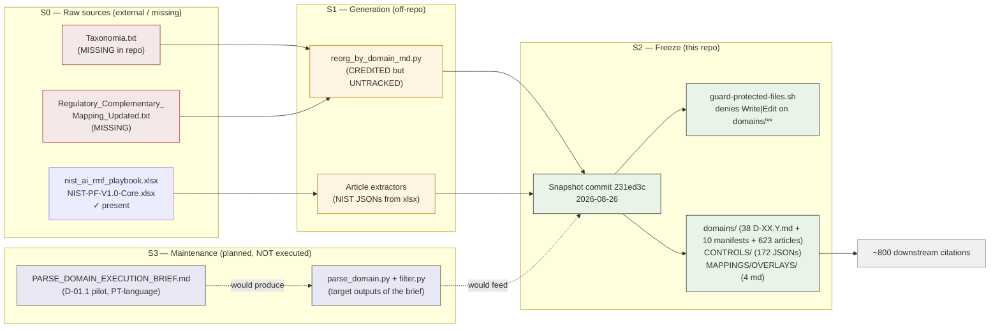

# Phase 0 — Baseline Corpus Production Flow

**Version:** 1.0 — 2026-08-27
**Status:** ✅ Active
**Classification:** METHODOLOGY-META — this file describes how the Phase 0 baseline is produced, frozen, and consumed. It is not a numbered deliverable.
**Companion:** [`./validation/P0_baseline_audit_v0.md`](./validation/P0_baseline_audit_v0.md) (the audit that motivates this flow).

---

## 1. Purpose

The Phase 0 baseline at `00_METHODOLOGY/PREPROCESSING_by_domain/` is the **most-consumed artefact of the repo (~800 citations across 3 cases × 3 phases)** and the **least-documented**. Until v1.0 of this file, three things were invisible:

- **Where the 38 D-XX.Y.md files came from** (a generator is credited inline but is not in the repo).
- **What "frozen baseline" means operationally** (a snapshot + a guard, not a re-derivation rule).
- **Who is allowed to evolve what** (read-only for `domains/**`; tooling lives elsewhere).

This file addresses all three. It does **not** propose changes to the corpus itself — that would require lifting the workspace guard and is out of scope (see audit §6).

---

## 2. Pipeline — Four Stages



### S0 — Raw sources
Two text sources are referenced as the upstream input to the corpus:
- `Taxonomia.txt` — referenced by Case_01 Doc01 (frontmatter `source:` field).
- `Regulatory_Complementary_Mapping_Updated.txt` (T6) — same provenance.

**Status:** MISSING in this repo. `find -name '*.txt'` returns zero results.

Two spreadsheet sources are present:
- `nist_ai_rmf_playbook.xlsx` (source for `CONTROLS/NIST_AI_RMF/*.json`).
- `NIST-Privacy-Framework-V1.0-Core.xlsx` (source for `CONTROLS/NIST_PF/*.json`).

### S1 — Generation (off-repo)
The 38 `D-XX.Y.md` files credit an inlined generator:
> "Generated by reorg_by_domain_md.py from PREPROCESSING/."

**Status:** UNTRACKED. The script does not live anywhere in the repo. The `scripts/` directory has only `dream/`, `kg.sh`, `install_skills.sh`, `rename_case_files.py` — none of them are this generator. The corpus is therefore a black-box snapshot.

The 172 control JSONs appear to have been extracted from the `.xlsx` files (one JSON per control). The exact extractor is also untracked.

### S2 — Freeze
The entire corpus entered the repo by single snapshot commit `231ed3c` (2026-08-26). Since then, no file under `domains/`, `CONTROLS/`, or `MAPPINGS/` has been edited (`git log --diff-filter=M -- PREPROCESSING_by_domain/` returns nothing).

The freeze is operationalised by:
- **Workspace guard:** `guard-protected-files.sh` denies `Write|Edit` on `00_METHODOLOGY/PREPROCESSING_by_domain/domains/**` and the KG build artefacts.
- **Methodology declaration:** `00_METHODOLOGY/dependency_graph.yaml:26,102` declares the corpus as a protected dependency.

### S3 — Maintenance (planned)
`PARSE_DOMAIN_EXECUTION_BRIEF.md` defines a parser pilot scoped to `D-01.1`:
- Inputs: 38 `D-XX.Y.md` files + `00_METHODOLOGY/SCHEMA/obligated_party.yaml` + style refs in the **main AEGIS repo** (explicitly not in this compact repo).
- Outputs: `parse_domain.py` + `filter.py` + `SCHEMA_domain_json.md` + JSON sidecars.
- Stack: Python 3.9+, stdlib + PyYAML only. Deterministic parser; original docs read-only.
- Pilot status in this repo: **brief only, not executed.** No `scripts/parser/` directory; no `parse_domain.py`; no `filter.py`.

The brief is in PT-language, suggesting the executor was a PT-speaking LLM session. The brief itself forbids scope creep.

---

## 3. Consumer Map (downstream of S2)

| Consumer | What they pull | Approx hits |
|----------|----------------|------------:|
| Methodology (`dependency_graph.yaml`, `AGENTS.md`, `kg/GRAPHIFY.md`) | declares corpus as protected dependency | ~10 |
| Case_01 Phase 1 RICH | D-XX.Y HSO/Sub-SOs → Doc13 §1 generic baseline; NIST controls → Doc13 sprint 10/11 layer | ~30 (Doc13 heaviest) |
| Case_01 Phase 2 / 3 | Rules_Catalog, obligations, requirements via corpus references | many (indirect) |
| Case_02 | corpus used in applicability / mapping | ~23 |
| Case_03 | corpus used (all 5/5 regulations) | ~26 |
| Dashboards (`GDPR_Dashboard.html`, `CRA_Dashboard.html`, NIS2 inspect scripts) | indirect | ~10 |
| Controls / overlays | Doc13 NIST layer (sprint 10/11), Doc15/17 tensions, Doc19/20 NIST inputs, Case SPEC_NIST_MATRIX_UNIFIED | ~388 |
| **Total** | | **~800** |

**Per-doc chain (canonical Phase 1):**
```
S2.corpus → Doc13 §1 (HSO + Sub-SOs from D-XX.Y/)
        → Doc13 §2-§4 (adjusted objectives per sub-domain)
        → Doc12 §4 (Track B tier per sub-domain)
        → Phase 2 (Doc14+ goals/rules)
```

**Per-doc chain (NIST controls):**
```
S2.CONTROLS/NIST_AI_RMF/*.json + NIST_PF/*.json
     → Doc13 sprint-10 corr-016 layer
     → Doc13 sprint-11 §3 expansion (full coverage)
     → Doc19 / Doc20 NIST framework inputs
     → Doc15 / Doc17 tensions
```

---

## 4. Operational Rules (what to do / not do)

### DO
- **Cite the corpus path verbatim** in new case-level deliverables: `00_METHODOLOGY/PREPROCESSING_by_domain/domains/D-XX_Y/D-XX.Y/`.
- **Reuse `SO-D-XX.Y.{HL,GDPR,CRA,…}` IDs verbatim** — they are the frozen baseline.
- **Use `OVERLAY_*.md`** as cross-framework anchors when adding new regulatory drivers.
- **Reference `dependency_graph.yaml`** when proposing changes (P5).
- **Add a new case-level deliverable** by linking upward to the corpus, not by rewriting it.

### DO NOT
- **Edit any file under `domains/`** — denied by `guard-protected-files.sh`. The corpus is read-only by design.
- **Edit any file under `CONTROLS/`** without a documented regeneration pipeline (the source `.xlsx` is the only authoritative extract path).
- **Re-derive HSO/Sub-SO content** in case docs. Always cite the corpus.
- **Introduce new D-XX.Y IDs** without first ensuring the corpus `domains/` carries them.
- **Modify `dependency_graph.yaml` protected-deps list** without a methodology-level decision.

---

## 5. Evolution Triggers

The corpus should be re-frozen (not edited) when:

1. A new EU regulation enters scope (currently 5: GDPR, CRA, NIS 2, DORA, AI Act) → adds a new `Regulation/` overlay under `MAPPINGS/OVERLAYS/`.
2. A new NIST control framework version lands → re-extract `CONTROLS/` JSONs from the new xlsx.
3. A sub-domain coverage gap is discovered in case work → backport into the corpus via a separate "re-freeze" PR.
4. The parser pilot (`PARSE_DOMAIN_EXECUTION_BRIEF.md`) executes successfully → the maintenance stage S3 becomes operational, enabling mechanical re-derivation of JSON sidecars without manual editing.

In all four cases, the change is **freeze-then-snapshot**, not in-place edit. The next snapshot will get its own commit; the guard is preserved.

---

## 6. Open Items (deferred, not blocking v1.0)

See `validation/P0_baseline_audit_v0.md` §5 and §6 for full detail. Highlights:

- **Tooling:** `reorg_by_domain_md.py`, `parse_domain.py`, `filter.py`, `SCHEMA_domain_json.md`, `SCHEMA/obligated_party.yaml` — all referenced, none present.
- **Raw sources:** `Taxonomia.txt`, `Regulatory_Complementary_Mapping_Updated.txt` — referenced, missing.
- **Frontmatter convention:** the 38 D-XX.Y.md use a non-parseable pseudo-frontmatter after the H1, not the canonical `---` leading-YAML. The audit notes this without proposing a fix (would require touching `domains/**`).
- **Refs to deleted layout:** pervasive dangling paths to `../../Regulation/...` and `../../CrossRegulation/...` in the body of every D-XX.Y.md. Cosmetic; not blocking.
- **KG linkage:** the E3 graph carries `D-05.3` once only — i.e., the corpus is consumed via per-case derivations, not as direct nodes. An out-of-tree enrichment would link each D-XX.Y to its case-level AG-D-XX.X-NNN nodes.

---

## 7. Versioning

This file is **METHODOLOGY-META** and not a numbered deliverable. Its version increments when:

- (a) a new freeze stage is added (e.g., S4);
- (b) the consumer map in §3 changes structurally (new case, new control framework);
- (c) the operational rules in §4 are amended;
- (d) an evolution trigger in §5 is activated.

Adding new content to `domains/`, `CONTROLS/`, or `MAPPINGS/` does **not** require a version bump on this file — those changes are recorded in the snapshot commit and audited separately.
