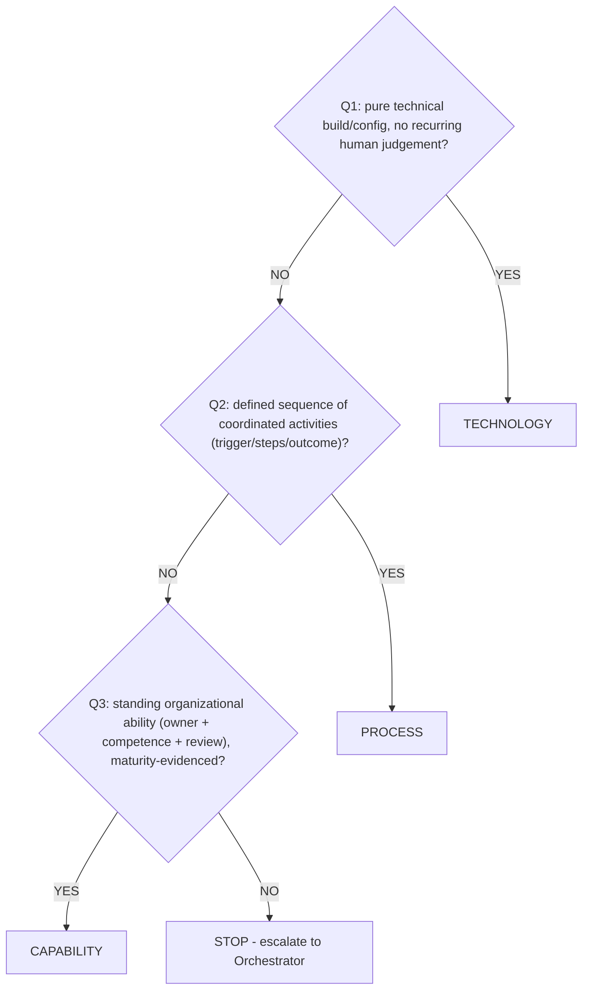

# AEGIS Realization Class Rubric (Phase 2 Rule Attribute)

> **Core Principle:** Every Phase 2 rule answers two independent questions — *what* it requires (normative intensity, verification criteria) and *how* it is realized and sustained over time. This document defines the second: a mandatory `realization_class` attribute, closed enum {`TECHNOLOGY`, `PROCESS`, `CAPABILITY`} — the AEGIS-native triad pre-figured in Phase 3: Case_01 `Doc23_Architectural_Nodes.md` labels each node with a `track=` field (values `TECH`/`TECHNOLOGY`, `PROC`/`PROCESS`, `ROLE`, `CAPABILITY_SUBREQ`); Case_02 `Doc24_Architectural_Nodes.md` and Case_03 `Doc25_Architectural_Nodes.md` express the same split through node-type sections (Process / IT System / Human Role / Technology / Capability Sub-Requirements) plus per-case Track Distribution tables (values `TECHNOLOGY`, `PROCESS`, `CAPABILITY_SUBREQ`, `IT_SYSTEM`, `HUMAN_ROLE`) rather than a literal per-node `track=` field. The Phase 3 lane campaign (§5) reconciles all these variants to the closed enum.

---

## §1 Purpose & Scope

- `realization_class` is a **Phase 2 rule attribute**, carried by every rule in the rules catalog (canonical `RULE-D-XX.X-NNN`; legacy `CR-`/`BPR-` in Case_01, see §8).
- The **D-XX.Y domain spine stays canonical.** Classes cut across sub-domains; they replace, rename or renumber nothing.
- **Rule ID sets are unchanged.** This is an additive attribute plus derived views (per-class counts, future lane allocation). **No physical split of catalogs** into per-class documents.
- Scope: Phase 2 rules catalogs and their machine mirrors — `12_Rules_Catalog.xlsx`, `control_set.yaml` (documents-only). The `phase2_ontology.yaml` location is part of the target state but is **DEFERRED** (§4) — not touched by the Case_01 pilot, per human decision 2026-09-05. Phase 3 consumes the attribute through the lane mapping (§5) in a **future** campaign.

---

## §2 The 3 Realization Classes

| Class | Definition | Positive test question | Disqualifier |
|---|---|---|---|
| `TECHNOLOGY` | Realizable by a technical or physical artefact measure (system/hardware/software build or configuration, or a physical control realised as an artefact property); no recurring constitutive human judgement needed to sustain it (§3). | Once built and configured, does it hold with no one making recurring judgement calls (only periodic re-verification)? | Sustaining it requires recurring human triage, approval, notification or escalation decisions that are **constitutive** (§3 — their outcome changes what the control accepts or permits). Periodic re-verification and exception-path corrections do not disqualify. |
| `PROCESS` | Realizable by a defined sequence of coordinated activities (SOP/SLA/escalation/workflow) with defined triggers, steps and outcomes; human and/or system steps. | Does realization consist of running a defined activity sequence — each with trigger, steps, outcome — rather than a standing artefact? | A one-time build/configuration alone satisfies the rule (→ `TECHNOLOGY`). |
| `CAPABILITY` | Requires a standing organizational ability: designated owner, competence, periodic review/authority; evidenced by MATURITY evidence, not by a passing test nor by following an SOP. | Between trigger events, must someone own the ability, keep competence current, and exercise review/authority? | Success can be shown by a passing test or by executing an SOP step-by-step (→ lower class). |

**Rationale.** `TECHNOLOGY`: the security property lives in artefacts and survives staff changes; verification is a test of the built state. `PROCESS`: the value lies in coordination and timeliness (SLA clocks, notifications, approvals), not in any single artefact. `CAPABILITY`: governance-type rules fail not for lack of tools but for lack of standing ownership and competence — P1 in evidence form: passing a test today does not prove the organization can repeat the judgement next quarter.

---

## §3 Decision Tree (normative)

Classify every rule by walking the tree **in order**; the first YES assigns the primary class.

1. **Q1** — Realizable purely by a technical control build/configuration, with no recurring human judgement needed to sustain it? → YES: `TECHNOLOGY`.
2. **Q2** — Requires a defined sequence of coordinated activities (SOP/SLA/escalation/workflow) with defined triggers, steps and outcomes? → YES: `PROCESS`.
3. **Q3** — Requires a standing organizational ability (owner + competence + periodic review/authority), evidenced by maturity? → YES: `CAPABILITY`.
4. **No YES at any step** → STOP; do not force a class. The rule is probably mis-scoped or duplicative — escalate to the Orchestrator.

<!-- Simple decision tree: walk Q1..Q3 in order, first YES wins -->

**Tie-break guidance.**
- `TECHNOLOGY` vs `PROCESS` — apply the **constitutive-step test** first. A recurring step is **constitutive** (Q1 = NO) only if its outcome changes what the control accepts or permits: an exception approval, a risk acceptance, or a containment / transfer authorisation. Operational test: the step appears in the card's **Verification Criteria**, not only in the Description's exception clause. A recurring step that only re-checks built state — periodic review, sign-off on findings, reconciliation sampling — is *periodic re-verification* and keeps Q1 = YES. Then: if the automated path alone satisfies all verification criteria → `TECHNOLOGY`; if constitutive human-coordinated steps remain (SLA clocks, notifications, approvals) → `PROCESS`.
- `PROCESS` vs `CAPABILITY`: apply the **structural indicators**, then confirm with the between-events question. *CAPABILITY indicators*: a named owner of the standing ability; maintenance of workforce competence or role curriculum; authority to accept risk or approve policy; a review cadence over people, roles or authority. *PROCESS indicators*: an SLA or clock ("within 24h/72h/7 days"); a notification or escalation duty; a per-trigger activity sequence whose execution is itself the realization. Decide `CAPABILITY` only when a CAPABILITY indicator is constitutive — the rule would still bind if the procedure were executed but ownership, competence or authority lapsed; otherwise `PROCESS`. **Standing note (Doc18):** `CR-D-08.1-001` (Annual Security Awareness) and `CR-D-08.2-001` (Role-Specific Security Competence) are `CAPABILITY` even though their verification criteria are completion records — the records evidence the workforce's standing trained-ness, not a one-pass procedure.
- **Multi-class rule:** primary class + at most one `realization_class_secondary` (same enum, secondary ≠ primary). Use it when the rule genuinely requires both, e.g. a workflow executed by a built pipeline.

---

## §4 Attribute Specification

| Field | Type | Constraint |
|---|---|---|
| `realization_class` | enum(`TECHNOLOGY` \| `PROCESS` \| `CAPABILITY`) | Mandatory; exactly one primary class per rule. |
| `realization_class_secondary` | same enum | Optional (0..1); MUST differ from the primary. |

**Storage locations** (Markdown catalog authoritative; sync governed by the Sync rule below):

| Location | Form |
|---|---|
| Rules catalog (Doc11-style, e.g. Doc18) | One `realization_class` column (+ `realization_class_secondary` where used) in **Anexo A** (per-control index); each rule card gains **field 25 `realization_class`** (mandatory) and **field 26 `realization_class_secondary`** (optional; rendered `—` when unused) |
| `12_Rules_Catalog.xlsx` | One column per field in the rules sheet |
| `control_set.yaml` | `realization_class:` (and optional `realization_class_secondary:`) per control entry |
| `phase2_ontology.yaml` | `kg_ontology.enums.RealizationClass: [TECHNOLOGY, PROCESS, CAPABILITY]` + attributes on `ComplianceRule` and `BestPracticeRule` — **DEFERRED**: not applied in the Case_01 pilot (documents-only scope, human decision 2026-09-05); to be applied in a future ontology campaign |

**Doc18 counter adjustment (campaign step).** When the fields are added: the Doc18 §3 schema table grows **24 → 26 rows** (row 25 `realization_class`, mandatory enum; row 26 `realization_class_secondary`, same enum, optional 0..1), and the Doc18 frontmatter counters change **`expected_fields_per_card: 24` → `26`** and **`fields_per_card: 24` → `26`** (25 mandatory + 1 optional; field 26 rendered `—` when unused). During the same pass the campaign may reconcile the cards' pre-existing numbering defects (92 duplicated "14. Implementation Priority" lines; no field numbered 13) against the schema table — a pre-existing Doc18 defect, not created by this rubric.

**Invariance guarantees:** rule IDs, ordering, normative intensity, legal trace and framework anchors are unchanged; no catalog is split or renumbered; per-class dashboards/lanes are *derived views*, generated — never hand-maintained duplicates. Writing these fields into the case artifacts is a separate tagging campaign, not part of this rubric.

**Sync rule.** The Markdown catalog is authoritative. Machine mirrors must carry the attribute when they are regenerated. For Case_01, the campaign adds the `realization_class` (and, where applicable, `realization_class_secondary`) column to the existing legacy `12_Rules_Catalog.xlsx` **without remediating its pre-existing staleness** — the sheet's 46 rule rows match Doc18; its NI and stub columns remain as-is, and the sheet carries a banner note marking it stale until regenerated. Cross-location consistency is required for the added columns only. The `phase2_ontology.yaml` location is likewise **not modified** by the pilot (DEFERRED per §4 table); dashboards, data mirrors (`phase2_graph.json`, `phase2_ontology.compact.json`) and the Knowledge Graph are untouched and reflect the attribute only after their own future regeneration campaigns.

---

## §5 Class → Lane Mapping

Phase 3 will organize architectural-node work into 3 realization lanes. The mapping is the **identity**:

| `realization_class` | Phase 3 realization lane |
|---|---|
| `TECHNOLOGY` | lane `TECHNOLOGY` |
| `PROCESS` | lane `PROCESS` |
| `CAPABILITY` | lane `CAPABILITY` |

Multi-class rules run in multiple lanes (primary lane from the primary class, secondary lane from `realization_class_secondary`).

**Forward pointer:** the lanes and their Phase 3 artefacts (lane views of the allocation in Doc23/25) are **FUTURE campaigns — they do not exist yet in any case**. This section fixes the mapping contract only; no Phase 3 document is modified by this rubric. Existing Phase 3 track vocabulary (Case_01 per-node `track=` field; Case_02/03 section categories + Track Distribution tables) is reconciled to this enum by the lane campaign.

## §5B Phase 3 Lane Nomenclature (normative, human decision 2026-09-05)

Phase 3 artefacts use **lane-specific ID prefixes**; the `UC-*` nomenclature is reserved
for the TECHNOLOGY lane:

| Lane | ID prefix | Form | Examples |
|---|---|---|---|
| TECHNOLOGY | `UC-*` | unchanged per case (dotted `U.C.X.Y.Z` or flat `UC-NN`) | product/system use cases |
| PROCESS | `PROC-` | `PROC-NN`, sequential per case | `PROC-01` (DSAR intake workflow) |
| CAPABILITY | `CAP-` | `CAP-NN`, sequential per case | `CAP-01` (ISMS maintenance) |
| Misuse (laneless) | `MUC-*` | unchanged | threat scenarios |

Rules:
1. **Numbering** is sequential per lane per case, assigned in ascending order of the
   superseded UC id (deterministic; mapping table is the registry).
2. **MIXED use cases** are adjudicated to their primary lane (the lane that dominates
   the realization); the adjudication table records a one-line justification each.
3. **Phantom/supporting UCs** that are system behaviours keep `UC-*` (documented).
4. This section **supersedes** the Case_01 Doc20 §6.1 ID-continuity freeze (human
   decision 2026-09-05): the freeze protected pre-product-first compliance UC ids;
   those are exactly the ids being re-laned.
5. The old→new mapping tables per case are the authoritative registry
   (`00_METHODOLOGY/validation/LANE_NAMING_CENSUS_v0.md`); renames are applied by
   `scripts/rename_lane_ids.py` (single pass, word-boundary exact, dry-run first).

## §5C Lane Card Schemas (normative)

Literature basis: process cards follow the NIST SP 800-218 (SSDF) practice/task shape;
capability cards follow the C2M2 / ISO/IEC 21827 (SSE-CMM) capability-vs-process split
and the ArchiMate Strategy-layer semantics (capability realised by processes, processes
realised by technology). Normative traceability chain: **RULE → CAP → PROC → UC**
(requirements bind; processes flow; capabilities mature).

### §5C.1 Process Card (`PROC-*`) — SSDF-style

| Field | Content |
|---|---|
| ID + Title | `PROC-NN` — title (from the catalogue card it lanes) |
| Trigger | event that starts the process |
| Activities | numbered sequence of steps (human and/or system) |
| Roles | role per step or overall owner |
| SLA / Timing | clock obligations (e.g. 30 days, 24h/72h) where applicable |
| Realises | the RULE/CR/BPR ids this process carries out (from the catalogue card) |
| Anchors | frozen referentials (SAMM stream, ASVS section) per ALT-ANCHOR §2 |
| Evidence | artefacts/metrics that prove execution (logs, registers, reports) |

Companion to the catalogue card (same ID): the catalogue keeps the narrative form; the
process card adds the operational fields the UC format lacks. Never duplicate the
catalogue text.

### §5C.2 Capability Card (`CAP-*`) — C2M2 / ArchiMate-style

| Field | Content |
|---|---|
| ID + Title | `CAP-NN` — title |
| Owner | designated role accountable for the standing ability |
| Span | contributing `PROC-*` + `UC-*` + competence/curriculum elements |
| Maturity | Scale A of the posture model (phase1_ontology v1.6 `capability` scale); current/target bound to EvidenceItems (P1 Folio VIII) in the next maturity refresh — do not invent values |
| Realises | RULE/CR/BPR ids the capability sustains |
| Anchors | frozen referentials (SAMM practice first for CAPABILITY-class) |
| Evidence | standing artefacts (registers, rosters, review records) — not one-pass tests |

### §5C.3 Placement & scope rule

Lane cards live in a per-case `DocNN_Process_Capability_Cards.md` at the Phase 3 root.
Populating them is a campaign; the pilot set is 3–4 cards per case. Cards are additive —
they never modify catalogue cards, rule cards, or gates.

---

## §6 CAPABILITY Anchor to Maturity Model

- **Anchor:** `02_CASES/Case_01_TinyTask_SaaS/01_PHASE1_CONTEXT_RICH/phase1_ontology.yaml` **v1.6**, `kg_ontology.maturity_model` (~lines 1644–1713): `scales.capability` — "Capability (CSF 2.0 native)", **Scale A**, scope `Organisation|Function`; and `EvidenceItem` relation `CITES_OUTCOME` with cardinality **"N:1 when scale=capability"** (`scale=capability` ⇒ `CITES_CLAUSE` absent).
- **Visualisation:** Folio VIII of the P1 dashboards (e.g. `00_METHODOLOGY/00_VISUALISATIONS/Case_01/Case_01_P1_Dashboard.html`).
- **Consequence:** a `CAPABILITY`-classed rule's realization should be evidencable by a **CapabilityEvidence item** — an `EvidenceItem` with `scale=capability`: one-sentence observable claim about the standing ability, `sources[]` resolving to existing graph nodes, `CITES_OUTCOME` to a CSF 2.0 subcategory. A passing TEST or a completed SOP run is *not* CAPABILITY evidence.
- **Vocabulary note:** the v1.6 block still cites `MATURITY_MODEL_CSF_STRICT.md v1.0`, superseded by `IMPLEMENTATION_POSTURE_MODEL_CSF_STRICT.md v2.0`. This rubric anchors on the structural elements (Scale A + evidence cardinality); any tier labels quoted in new content follow the posture model's current vocabulary.

---

## §7 ISO/IEC 27002:2022 Crosswalk (indicative, non-normative)

ISO/IEC 27002:2022 classifies **its own 93 controls** into themes: organizational 37, people 8, physical 14, technological 34. **ISO is NOT the classifier for `realization_class`** — this crosswalk exists for external readability only; per-rule divergences are expected and legitimate.

| AEGIS class | ISO/IEC 27002:2022 theme (indicative) | Note |
|---|---|---|
| `TECHNOLOGY` | technological theme; physical controls insofar as the realization is an artefact property | Built/configured protection. |
| `PROCESS` | organizational theme — operational/workflow part (procedures, incident operation, supplier handling execution) | Coordinated activities with triggers and outcomes. |
| `CAPABILITY` | organizational theme — governance part (policy, roles, review, risk-method ownership) + people theme | Standing ability, competence, authority. |

Divergence example: a rule ISO-anchored to A.8.10 (technological theme) can legitimately be `PROCESS`-classed in AEGIS when its recurring realization is a coordinated workflow (see `CR-D-05.3-001`, §8).

---

## §8 Worked Examples (Case_01 — Doc18)

> **ID note:** Case_01 Phase 2 uses the **legacy `CR-`/`BPR-` prefixes (deprecated corr-007; canonical corr-008 is `RULE-*`)**. Existing IDs are quoted as-is from `Doc18_Rules_Catalog.md`; **no new deprecated-prefixed IDs are introduced** by this rubric. Tagging Case_01 rules is a separate later task.

9 real C1 rules, 3 per class:

| Rule (Doc18) | Title | Class | Secondary | Why |
|---|---|---|---|---|
| `CR-D-01.1-001` | Data at Rest Encryption | `TECHNOLOGY` | — | Realized by built store encryption + segregated KMS config; verification criteria are configuration reports; no recurring judgement. |
| `CR-D-03.2-001` | Administrative MFA | `TECHNOLOGY` | — | Enforced at the managed identity provider's privileged routes; an automated test rejects sessions without a second factor. |
| `CR-D-10.2-001` | Audit Logging and Traceability | `TECHNOLOGY` | — | A built pipeline: account-wide trail, multi-region Object Lock storage, log-failure alerting, retention config. |
| `CR-D-04.3-001` | Dual Regulatory Incident Notification | `PROCESS` | — | One notification workflow: severity/trigger decision tree, 24h internal clock, per-recipient submissions, escalation contacts, tabletop-tested. |
| `CR-D-05.3-001` | Complete and Secure Data Erasure | `PROCESS` | — | Request-to-verified-erasure workflow (intake → identity verification → cascading deletion → backup tombstone → completion log) with a 7-day SLA. |
| `CR-D-02.2-001` | Automated Security Updates and Patch Remediation | `PROCESS` | `TECHNOLOGY` | Borderline — resolved below. |
| `CR-D-08.2-001` | Role-Specific Security Competence | `CAPABILITY` | — | Competency matrix + named roles + quarterly review; verified by INSPECT of the standing ability, not by a passing test. |
| `CR-D-09.1-001` | Security Governance and Technical Documentation | `CAPABILITY` | — | Standing policy architecture: owners, approvals, review records, policies reconciled to operating evidence, 10-year retention. |
| `CR-D-09.2-001` | Unified Privacy and Cybersecurity Risk Assessment | `CAPABILITY` | `PROCESS` | Borderline — resolved below. |

**Borderline 1 — `CR-D-02.2-001` (Automated Security Updates and Patch Remediation).** Q1: the patch pipeline is automated, but the card mandates "human review for failed patches, compatibility issues, and exceptions" — recurring judgement → Q1 = NO. Q2: a defined sequence with triggers and outcomes (advisory → triage → severity SLA → deploy, or exception with owner + compensating control) → YES → **`PROCESS`**, secondary `TECHNOLOGY` (the automated pipeline that executes the routine path).

**Borderline 2 — `CR-D-09.2-001` (Unified Privacy and Cybersecurity Risk Assessment).** Q1 = NO. Q2 looks like YES (trigger screen → document → analyse → assign → approve → refresh), but the tie-break applies: between assessments the rule requires designated owners, assessor competence, human risk-acceptance authority ("route unresolved scope or risk acceptance to the human decision-maker") and periodic refresh — the assurance lives in the standing ability, not in rerunning a procedure → **`CAPABILITY`** primary, `PROCESS` secondary.

---

## §9 Governance

- The enum is **closed**: {`TECHNOLOGY`, `PROCESS`, `CAPABILITY`}. Adding a value or redefining a class **requires human approval (P7)** — proposed via the Orchestrator, never decided agent-locally.
- `realization_class` is an attribute, not an ID; P5/KG impact runs are not triggered by this rubric. Mass re-tagging of a case is a campaign; cross-location consistency is governed by the Sync rule (§4).
- Disagreements on a specific rule's class are resolved by the decision tree (§3) first; irreconcilable conflicts go to the human (P7).

**Version history**

| Version | Date | Author | Change |
|---|---|---|---|
| 1.0 | 2026-09-05 | Executor | Initial release — attribute definition locked with the human, 2026-09-05. |
| 1.1 | 2026-09-05 | Executor | Applied Validator amendments A1–A7 (constitutive test, P/C indicators, storage spec correction, xlsx banner rule, preamble per-case facts) |
| 1.2 | 2026-09-05 | Orchestrator | Ontology application DEFERRED per human decision (documents-only scope): §4 storage table + Sync rule updated; Case_01 pilot touches Doc18, control_set.yaml, 12_Rules_Catalog.xlsx only |
| 1.3 | 2026-09-05 | Orchestrator | §5B Lane Nomenclature added: UC-* reserved for TECHNOLOGY; PROC-NN / CAP-NN for PROCESS / CAPABILITY (human decision 2026-09-05; supersedes Case_01 Doc20 §6.1 ID-continuity freeze) |
| 1.4 | 2026-09-05 | Orchestrator | §5C Lane Card Schemas added: PROC card (SSDF-style) and CAP card (C2M2/ArchiMate-style); traceability chain RULE → CAP → PROC → UC |
