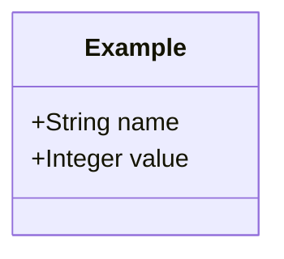

# AEGIS Methodology — Class Diagrams

## Overview

This folder contains all UML class diagrams for the AEGIS (Advanced EU Governance & Intelligence System) methodology, organized by phase. All diagrams are written in **Mermaid** format for discussion and documentation purposes.

> **Note:** Final artifacts should use the draw.io XML versions.

---

## 📁 Files

| File | Phase | Description |
|------|-------|-------------|
| [`phase1_contextual_definition.md`](./phase1_contextual_definition.md) | Phase 1 | Contextual Definition + Complementarity |
| [`phase2_elaboration_secure_design.md`](./phase2_elaboration_secure_design.md) | Phase 2 | Elaboration & Secure Design |
| [`phase3_decomposition.md`](./phase3_decomposition.md) | Phase 3 | Decomposition |
| [`phase3_risk_analysis.md`](./phase3_risk_analysis.md) | Phase 3 | Risk Analysis |

---

## 📊 Diagram Summary

### Phase 1 — Contextual Definition + Complementarity

**Core Classes:**
- Stakeholder, BusinessGoal, CompanyContext, ComplianceContext
- Regulation, RegulatoryClause, RegulatoryObligation
- SecurityControlDomain, ComplementarityAnalysis, ImplementationMapping

**Key Relationships:**
- CompanyContext → ComplianceContext → StructuredComplianceMatrix
- Regulation → RegulatoryClause → SecurityControlDomain
- ComplementarityAnalysis bridges regulations for overlap detection

**Enumerations:**
- `NormativeStrength`, `ObligatedPartyType`, `ObligationType`
- `CoverageLevel`, `GranularityLevel`, `RelationType`

---

### Phase 2 — Elaboration & Secure Design

**Bridge from Phase 1:**
- RegulatoryClause, RegulatoryObligation, ComplementarityAnalysis
- SecurityControlDomain, ImplementationMapping, Regulation

**New Classes:**
- ArchitecturalGoal (PrivacyGoal, SecurityGoal)
- AbstractRule (ComplianceRule, BestPracticeRule)
- RulesCatalog, StrategicTension, ConflictResolution
- JustificationRecord, RiskOwner

**Key Relationships:**
- RegulatoryObligation → ArchitecturalGoal → BestPracticeRule
- StrategicTension → ConflictResolution → JustificationRecord
- RulesCatalog aggregates AbstractRules

**Enumerations:**
- `OverlapType`, `RuleSource`

---

### Phase 3 — Decomposition

**Bridge from Previous Phases:**
- RulesCatalog, AbstractRule (Phase 2)
- Stakeholder, BusinessGoal (Phase 1)

**New Classes:**
- UseCase, FunctionalNode, ComplianceGate, AssetContext

**Key Relationships:**
- BusinessGoal → UseCase → FunctionalNode
- FunctionalNode → ComplianceGate (validation)
- AbstractRule constrains FunctionalNode

**Enumerations:**
- `DecompositionLevel`, `GateStatus`, `Track`

---

### Phase 3 — Risk Analysis

**Bridge from Phase 3 Decomposition:**
- FunctionalNode, AssetContext, ComplianceGate

**New Classes:**
- ThreatFramework, ThreatAnalysis, Threat, Vulnerability
- RiskAssessment, MitigationRequirement

**Key Relationships:**
- FunctionalNode → ThreatAnalysis → Threat → Vulnerability
- RiskAssessment → MitigationRequirement → FunctionalNode (feedback loop)
- Feedback: MitigationRequirement injects new FunctionalNodes for re-validation

**Enumerations:**
- `AnalysisStatus`, `FrameworkType`, `MitigationStrategy`
- `RiskDecision`, `SeverityLevel`, `ThreatSource`

---

## 🔄 Cross-Phase Traceability

```
Phase 1                          Phase 2                          Phase 3
─────────────────────────────────────────────────────────────────────────────
RegulatoryClause ──────────────→ RegulatoryClause (bridge)
RegulatoryObligation ──────────→ RegulatoryObligation (bridge)
SecurityControlDomain ─────────→ SecurityControlDomain (bridge)
ComplementarityAnalysis ───────→ ComplementarityAnalysis (bridge)
ImplementationMapping ─────────→ ImplementationMapping (bridge)
                                 ArchitecturalGoal
                                 AbstractRule ──────────────────→ AbstractRule (bridge)
                                 RulesCatalog ──────────────────→ RulesCatalog (bridge)
                                                                  UseCase
                                                                  FunctionalNode ──→ FunctionalNode (bridge)
                                                                  ComplianceGate ──→ ComplianceGate (bridge)
                                                                  AssetContext ────→ AssetContext (bridge)
                                                                  ThreatFramework
                                                                  RiskAssessment
                                                                  MitigationRequirement
```

---

## 📝 Version History

| Date | Version | Changes |
|------|---------|---------|
| 2026-04-01 | 1.0 | Mermaid corrected — cross-phase consistency + complete attributes from draw.io |

---

## 📌 Usage

### Viewing Mermaid Diagrams

1. **GitHub/GitLab:** Mermaid diagrams render automatically in Markdown
2. **VS Code:** Install "Markdown Preview Mermaid Support" extension
3. **Mermaid Live Editor:** Copy code to https://mermaid.live/

### Example



---

## 📂 Source

These diagrams were extracted from the Notion workspace:
- **Page:** Diagramas de Classes
- **Workspace:** Paulo's Notion
- **Last Sync:** 2026-04-02

---

**Author:** AEGIS Research Team  
**Last Updated:** 2026-04-02
