# Phase 1 — Contextual Definition + Complementarity

**Version:** 1.1 — 2026-07-13 (Regulatory Baseline contract + Track B proportionality + Gates added)
**Status:** ✅ ACTIVE
**Companion:** [`../fluxdiagram/phase1/phase1_contextual_definition.md`](../fluxdiagram/phase1/phase1_contextual_definition.md) (dynamic flow)

> **v1.1 additions** (additive only — v1.0 entities preserved unchanged): the 2026-07 architecture introduces Regulatory Baseline contract entities (frozen, read-only), the 3-filter pruning model entities, per-sub-domain activation, Track B proportionality, and the Gate family (GateP validates Doc 07b).

## Entities

### Core Classes (Phase 1)
- Stakeholder, InternalStakeholder, ExternalStakeholder
- BusinessGoal
- CompanyContext, ComplianceContext, StructuredComplianceMatrix
- Regulation, ResponsibilityEntry, NativeCompliance, InheritedCompliance
- StrategicImplication, RegulatoryObligation
- ConditionalExtension, RegulatoryInteraction
- ComplexityTier, InteractionType

### Complementarity Extension (Level 1)
- SecurityControlDomain, RegulatoryClause, DomainCoverageEntry, ComplementarityAnalysis, DomainElaborationEntry

### Implementation Extension (Level 2)
- ImplementationMapping

```mermaid
classDiagram

    %% ── EXISTING ENTITIES ───────────────────────────────────────────

    class Stakeholder {
        +String stakeholderId
        +String name
        +String role
    }
    class InternalStakeholder {
        +String department
        +String accessLevel
    }
    class ExternalStakeholder {
        +String organization
        +String relationshipType
    }

    class BusinessGoal {
        +String goalId
        +String description
        +String priority
        +String strategicAlignment
    }

    class CompanyContext {
        +String sector
        +String size
        +Boolean processes_personal_data
        +Boolean places_digital_products_eu
        +Boolean dora_financial_entity
        +String nis2_sector
        +Boolean aiact_high_risk_system
        +String technologicalControlPlane
        +ComplexityTier complexityTier
        +List~ConditionalExtension~ activeExtensions
        +List~RegulatoryInteraction~ regulatoryInteractions
    }

    class ComplianceContext {
        +String jurisdictionId
        +List~Regulation~ applicable_regulations
        +Date assessmentDate
    }

    class StructuredComplianceMatrix {
        +String matrixId
        +Date analysisDate
        +String version
    }

    class Regulation {
        +String regulationId
        +String name
        +String shortName
        +String jurisdiction
        +Date effectiveDate
    }

    class ResponsibilityEntry {
        +String entryId
        +String responsibilityType
        +String rationale
    }

    class NativeCompliance {
        +String implementationOwner
        +String resourceEstimate
    }

    class InheritedCompliance {
        +String providerName
        +String inheritanceMechanism
    }

    class StrategicImplication {
        +String implicationId
        +String description
        +String businessImpact
        +String complianceRisk
    }

    class RegulatoryObligation {
        +String obligationId
        +String description
        +String category
        +String targetSubDomain
        +ObligationType obligationType
        +ObligatedPartyType[] obligatedParty
        +Float normativeIntensity
    }

    %% ── COMPLEMENTARITY EXTENSION (Level 1) ─────────────────────────

    class SecurityControlDomain {
        +String domainId
        +String subDomainId
        +String name
        +String description
        +String referenceSource
    }

    class RegulatoryClause {
        +String clauseId
        +String articleReference
        +String description
        +NormativeStrength normativeStrength
        +ObligatedPartyType[] obligatedParty
        +ObligationType obligationType
        +Integer normativeWeight
        +Boolean isAtomic
        +String parentClauseId
        +String[] siblingClauseIds
        +String sanctionReference
    }

    class DomainCoverageEntry {
        +CoverageLevel coverageLevel
        +Integer clauseCount
        +GranularityLevel granularityLevel
        +Map obligatedPartyDist
        +Map obligationTypeDist
    }

    class ComplementarityAnalysis {
        +String analysisId
        +Float sharedScope
        +Float complementarityIndex
        +OverlapType overlapType
        +Date analysisDate
        +Float structuralConnectedness
    }

    class DomainElaborationEntry {
        +Float elaborationFactor
        +Regulation dominantRegulation
        +RelationType relationType
        +Float normativeIntensity
        +Float weightedScore
        +String subDomainId
        +String notes
    }

    %% ── IMPLEMENTATION EXTENSION (Level 2) ──────────────────────────

    class ImplementationMapping {
        +String implementationId
        +String primaryFramework
        +String frameworkReference
        +String rationale
        +String confidenceLevel
    }

    %% ── ENUMERATIONS ─────────────────────────────────────────────────

    class NormativeStrength {
        <<enumeration>>
        MANDATORY_UNCONDITIONAL
        MANDATORY_CONDITIONAL
        GUIDANCE
    }

    class ObligatedPartyType {
        <<enumeration>>
        CONTROLLER
        PROCESSOR
        MANUFACTURER
        IMPORTER
        DISTRIBUTOR
        ESSENTIAL_OR_IMPORTANT_ENTITY
        FINANCIAL_ENTITY
        PROVIDER
        DEPLOYER
    }

    class ObligationType {
        <<enumeration>>
        CONTINUOUS
        PERIODIC
        TRIGGERED
        ONE_TIME
    }

    class CoverageLevel {
        <<enumeration>>
        SUBSTANTIVE
        PARTIAL
        NOT_ADDRESSED
    }

    class GranularityLevel {
        <<enumeration>>
        ARTICLE
        PARAGRAPH
        SUB_PARAGRAPH
        ATOMIC
    }

    class RelationType {
        <<enumeration>>
        Overlap
        CumulativeReinforcement
        Conflict
        Gap
    }

    class ComplexityTier {
        <<enumeration>>
        LOW
        MEDIUM
        HIGH
    }

    %% ── v1.1 ADDITIONS — New enums (additive) ─────────────────────────

    class Scale {
        <<enumeration>>
        MICRO
        SMALL
        MEDIUM
        LARGE
        MAX
    }

    class ProportionalityTier {
        <<enumeration>>
        MINIMAL
        LIGHTWEIGHT
        STANDARD
        RIGOROUS
        DEFERRED
    }

    class SatisfactionPattern {
        <<enumeration>>
        INHERIT
        BUY_MANAGED
        BUILD_LIGHT
        BUILD_FULL
    }

    class VerificationMethod {
        <<enumeration>>
        INSPECT
        DEMONSTRATE
        TEST
        ANALYZE
    }

    class OwnershipType {
        <<enumeration>>
        SUPPLIER
        SHARED
        COMPANY
        COMPANY_AUDITOR
    }

    class Inheritability {
        <<enumeration>>
        INHERITABLE
        BUILD_REQUIRED
    }

    class Priority {
        <<enumeration>>
        MUST
        SHOULD
        COULD
    }

    class ScopeOverlap {
        <<enumeration>>
        Y
        CONDITIONAL
        N
    }

    class GateStatus {
        <<enumeration>>
        PASS
        FAIL
        NOT_CHECKED
    }

    class GatePStatus {
        <<enumeration>>
        PASS
        FAIL
    }

    class ConditionalExtension {
        +String blockId
        +String blockName
        +String triggerCondition
        +List~String~ questionIds
        +Boolean isActive
    }

    class RegulatoryInteraction {
        +String interactionId
        +String interactionType
        +List~Regulation~ involvedRegulations
        +String conflictDescription
        +String resolutionPrinciple
    }

    class InteractionType {
        <<enumeration>>
        TEMPORAL_CONFLICT
        REQUIREMENT_CONFLICT
        TRIGGER_MISMATCH
        NEGATIVE_ANALYSIS
    }

    %% ── RELATIONSHIPS ────────────────────────────────────────────────

    CompanyContext "1" --> "0..8" ConditionalExtension : activates
    CompanyContext "1" --> "0..*" RegulatoryInteraction : generates
    CompanyContext "1" --> "1" ComplexityTier : classified_as
    RegulatoryInteraction ..> InteractionType : uses
    ConditionalExtension ..> Regulation : triggered_by

    Stakeholder <|-- InternalStakeholder
    Stakeholder <|-- ExternalStakeholder
    Stakeholder "1..*" --> "1..*" BusinessGoal : defines

    CompanyContext "1" --> "1" ComplianceContext : determines
    CompanyContext "1" --> "1" StructuredComplianceMatrix : feeds
    ComplianceContext "1" --> "1" StructuredComplianceMatrix : feeds

    StructuredComplianceMatrix "1" *-- "1..*" ResponsibilityEntry : contains
    ResponsibilityEntry "0..*" --> "1" Regulation : references
    ResponsibilityEntry <|-- NativeCompliance
    ResponsibilityEntry <|-- InheritedCompliance

    BusinessGoal "1..*" --> "1..*" StrategicImplication : restricts / shapes
    ResponsibilityEntry "1..*" --> "1..*" StrategicImplication : generates
    StrategicImplication "1" --> "1..*" RegulatoryObligation : translates into
    RegulatoryObligation "1..*" --> "1..*" RegulatoryClause : derived from

    Regulation "1" *-- "1..*" RegulatoryClause : decomposes into
    RegulatoryClause "1..*" --> "1" SecurityControlDomain : addressed in

    Regulation "1" --> "1..*" DomainCoverageEntry : characterized by
    SecurityControlDomain "1" --> "1..*" DomainCoverageEntry : characterized by

    StructuredComplianceMatrix "1" --> "0..*" ComplementarityAnalysis : includes
    ComplementarityAnalysis "1" --> "2" Regulation : compares
    ComplementarityAnalysis "1" *-- "1..*" DomainElaborationEntry : details
    DomainElaborationEntry "1..*" --> "1" SecurityControlDomain : scoped to

    SecurityControlDomain "1" --> "1..*" ImplementationMapping : operationalized by

    RegulatoryClause ..> NormativeStrength : uses
    RegulatoryClause ..> ObligatedPartyType : uses
    RegulatoryClause ..> ObligationType : uses
    DomainCoverageEntry ..> CoverageLevel : uses
    DomainCoverageEntry ..> GranularityLevel : uses
    DomainElaborationEntry ..> RelationType : uses
    RegulatoryObligation ..> ObligationType : uses
    RegulatoryObligation ..> ObligatedPartyType : uses

    %% ── v1.1 ADDITIONS — New entities (additive, same Mermaid block) ──

    %% ── REGULATORY BASELINE CONTRACT (frozen, read-only by Phase 1) ────────────────

    class SecurityObjective {
        +String objectiveId
        +String regulationCode
        +String statement
        +String regulatorySource
        +String securityRationale
        +List~String~ subDomainIds
    }

    class HierarchicalSecurityObjective {
        +String hierarchicalObjectiveId
        +String subDomainId
        +String suffix
        +String activationCondition
        +Boolean isActive
    }

    class SubSecurityObjective {
        +String subObjectiveId
        +String regulationCode
        +List~String~ appliesTo
        +String inheritsFrom
        +String activationCondition
        +Boolean isActive
    }

    class SubDomainPipeline {
        +String subDomainId
        +String sourcePath
        +Boolean frozen
        +String crdaSection
        +String hsoSection
        +String volereSection
    }

    class SecurityRule {
        +String ruleId
        +String regulationCode
        +String statement
        +String regulatorySource
        +String securityRationale
        +List~String~ nistCsfMappings
    }

    %% ── FILTER 1 (APPLICABILITY) ──────────────────────────────────────

    class RegulatoryApplicabilityResult {
        +String resultId
        +Boolean applicable
        +String role
        +String classification
        +Boolean thresholdMet
        +Date assessmentDate
    }

    class DeclarationGap {
        +String gapId
        +String reg
        +String gapType
        +Severity severity
        +String resolutionHint
    }

    %% ── FILTER 3 (CONDITIONAL EXTENSIONS) ─────────────────────────────

    class BlockTrigger {
        +String blockId
        +String triggerCondition
        +List~String~ questionIds
        +Boolean isActive
    }

    %% ── PER-SUB-DOMAIN ACTIVATION (3-filter Filter 2 output) ───────────

    class SubDomainActivation {
        +String activationId
        +String subDomainId
        +Boolean applicable
        +ScopeOverlap scopeOverlap
        +Priority priority
        +Boolean hasEmergentTension
        +List~String~ applicableRegs
    }

    %% ── TRACK B PROPORTIONALITY ───────────────────────────────────────

    class ProportionalityProfile {
        +String profileId
        +Scale companyScale
        +Float securityFTE
        +List~ProportionalityEntry~ profileRows
        +GatePStatus gatePStatus
    }

    class ProportionalityEntry {
        +String subDomainId
        +Inheritability inheritability
        +Priority priority
        +ProportionalityTier tier
        +SatisfactionPattern satisfactionPattern
        +String evidenceDepth
        +VerificationMethod verificationMethod
        +OwnershipType ownership
        +String exampleControls
    }

    %% ── GATES ─────────────────────────────────────────────────────────

    class Gate {
        +String gateId
        +String phase
        +GateStatus status
        +String criteriaCheckResult
    }

    class GateP {
        +String documentId
        +String evaluatorPath
        +Boolean documentExists
        +Boolean activeRowsComplete
        +Boolean fiveAttributesComplete
        +Boolean rule11Satisfied
    }

    class Gate1A {
        +String inputScope
        +String applicabilityResultRef
    }

    class Gate1B {
        +String mappingScope
        +String coverageResultRef
    }

    class Gate1C {
        +String synthesisScope
        +String matrixResultRef
    }

    %% ── v1.1 RELATIONSHIPS (additive) ─────────────────────────────────

    SubDomainPipeline "1" --> "1" SecurityControlDomain : references
    SecurityObjective "1..*" --> "1" Regulation : belongs_to
    SecurityRule "1..*" --> "1" SecurityObjective : refines
    SubSecurityObjective "1..*" --> "1" SecurityObjective : derives_from
    HierarchicalSecurityObjective "1" --> "2..*" SubSecurityObjective : aggregates
    SubDomainActivation "1..*" --> "1" SecurityControlDomain : scoped_to
    SubDomainActivation "1..*" --> "1..*" Regulation : activated_by
    SubDomainActivation ..> ScopeOverlap : uses
    SubDomainActivation ..> Priority : uses
    RegulatoryApplicabilityResult "1..*" --> "1" Regulation : for
    DeclarationGap "1..*" --> "1" Regulation : flags
    BlockTrigger "1" --> "0..*" ConditionalExtension : activates
    ProportionalityProfile "1" *-- "1..*" ProportionalityEntry : contains
    ProportionalityEntry "1..*" --> "1" SecurityControlDomain : scoped_to
    ProportionalityEntry ..> Inheritability : uses
    ProportionalityEntry ..> ProportionalityTier : uses
    ProportionalityEntry ..> SatisfactionPattern : uses
    ProportionalityEntry ..> VerificationMethod : uses
    ProportionalityEntry ..> OwnershipType : uses
    GateP "1" --> "1" ProportionalityProfile : validates
    GateP ..> GatePStatus : uses
    Gate1A "1" --> "1" RegulatoryApplicabilityResult : gates
    Gate1B "1" --> "1" SubDomainActivation : gates
    Gate1C "1" --> "1" StructuredComplianceMatrix : gates
    CompanyContext "1" --> "1" Scale : classified_as
```

## Version History

| Version | Date | Author | Changes |
|---------|------|--------|---------|
| 1.1 | 2026-07-13 | AEGIS Research Team | Added Regulatory Baseline contract entities (SecurityObjective, HSO, SubSecurityObjective, SubDomainPipeline, SecurityRule). Added Scale enum (preserved alongside deprecated ComplexityTier). Added SubDomainActivation (per-sub-domain row). Added Track B entities (ProportionalityProfile, ProportionalityEntry + 5 enums). Added Gate family (Gate, GateP, Gate1A/B/C). Added DeclarationGap, RegulatoryApplicabilityResult, BlockTrigger. All v1.0 entities preserved unchanged. |
| 1.0 | 2026-04-01 | AEGIS Research Team | Mermaid corrected — cross-phase consistency + complete attributes from draw.io. Initial canonical release. |

---

## See also

- [`../fluxdiagram/phase1/phase1_contextual_definition.md`](../fluxdiagram/phase1/phase1_contextual_definition.md) — companion dynamic flow (v1.1)
- [`../../../PHASE1_STRATEGY.md`](../../../PHASE1_STRATEGY.md) — 3-filter pruning model spec
- [`../../../REGULATORY_BASELINE.md`](../../../REGULATORY_BASELINE.md) — Regulatory Baseline contract (frozen baseline)
- [`../../../REFERENCE/proportionality_model.md`](../../../REFERENCE/proportionality_model.md) — Track B decision table + 5 attributes
- [`../../../../02_CASES/Case_01_TinyTask_SaaS/01_PHASE1_CONTEXT/07b_Proportionality_Profile.md`](../../../../02_CASES/Case_01_TinyTask_SaaS/01_PHASE1_CONTEXT/07b_Proportionality_Profile.md) — Case instance of Track B
