# Phase 2 — Elaboration & Secure Design

**Version:** Mermaid corrected — 01/04/2026 (cross-phase consistency + complete attributes from draw.io)  
**Status:** ✅ Mermaid updated

## Entities

### Bridge from Phase 1
- RegulatoryClause, RegulatoryObligation, ComplementarityAnalysis, ImplementationMapping, SecurityControlDomain, Regulation

### New in Phase 2
- ArchitecturalGoal, PrivacyGoal, SecurityGoal
- AbstractRule, ComplianceRule, BestPracticeRule
- RulesCatalog, StrategicTension, ConflictResolution, JustificationRecord, RiskOwner

```mermaid
classDiagram

    %% ── BRIDGE FROM PHASE 1 ─────────────────────────────────────────

    class RegulatoryClause {
        +String clauseId
        +String articleReference
        +String description
        +NormativeStrength normativeStrength
        +ObligatedPartyType[] obligatedParty
        +ObligationType obligationType
        +Integer normativeWeight
        +Boolean isAtomic
        +String parentClauseId
        +String[] siblingClauseIds
        +String sanctionReference
    }


    class RegulatoryObligation {
        +String obligationId
        +String description
        +String category
        +String targetSubDomain
        +ObligationType obligationType
        +ObligatedPartyType[] obligatedParty
        +Float normativeIntensity
    }


    class ComplementarityAnalysis {
        +String analysisId
        +Float sharedScope
        +Float complementarityIndex
        +OverlapType overlapType
        +Date analysisDate
        +Float structuralConnectedness
    }


    class Regulation {
        +String regulationId
        +String name
        +String shortName
    }


    class ImplementationMapping {
        +String implementationId
        +String primaryFramework
        +String frameworkReference
        +String rationale
        +String confidenceLevel
    }


    class SecurityControlDomain {
        +String domainId
        +String subDomainId
        +String name
        +String description
        +String referenceSource
    }


    %% ── NEW IN PHASE 2 ──────────────────────────────────────────────

    class ArchitecturalGoal {
        +String goalId
        +String description
        +String category
        +String riskProfile
        +String assuranceLevel
    }
    class PrivacyGoal {
        +String goalStatement
        +String regulatorySource
        +String technicalImplication
    }
    class SecurityGoal {
        +String goalStatement
        +String riskProfile
        +String assuranceLevel
    }

    class AbstractRule {
        +String ruleId
        +String description
        +String targetSubDomain
        +Float normativeIntensity
        +RuleSource sourceType
    }
    class ComplianceRule {
        +String regulatoryReference
        +Boolean isMandatory
    }
    class BestPracticeRule {
        +String frameworkReference
        +String confidenceLevel
    }

    class RulesCatalog {
        +String catalogId
        +Date versionDate
        +String scope
    }

    class StrategicTension {
        +String tensionId
        +String tensionType
        +String severity
        +String resolutionStrategy
        +RelationType relationType
        +Float normativeIntensityDelta
    }

    class ConflictResolution {
        +String resolutionId
        +String resolutionType
        +String justification
        +Date resolvedDate
    }

    class JustificationRecord {
        +String recordId
        +String rationale
        +String evidenceReference
        +Date recordedDate
    }

    class RiskOwner {
        +String ownerId
        +String stakeholderRef
        +String contactInfo
    }

    %% ── ENUMERATIONS ─────────────────────────────────────────────────

    class NormativeStrength {
        <<enumeration>>
        MANDATORY_UNCONDITIONAL
        MANDATORY_CONDITIONAL
        GUIDANCE
    }

    class ObligatedPartyType {
        <<enumeration>>
        CONTROLLER
        PROCESSOR
        MANUFACTURER
        IMPORTER
        DISTRIBUTOR
        ESSENTIAL_OR_IMPORTANT_ENTITY
        FINANCIAL_ENTITY
        PROVIDER
        DEPLOYER
    }

    class ObligationType {
        <<enumeration>>
        CONTINUOUS
        PERIODIC
        TRIGGERED
        ONE_TIME
    }

    class OverlapType {
        <<enumeration>>
        FULL
        PARTIAL
        MINIMAL
    }

    class RelationType {
        <<enumeration>>
        Overlap
        CumulativeReinforcement
        Conflict
        Gap
    }

    class RuleSource {
        <<enumeration>>
        REGULATORY
        BEST_PRACTICE
        HYBRID
    }

    %% ── INHERITANCE ──────────────────────────────────────────────────

    ArchitecturalGoal <|-- PrivacyGoal
    ArchitecturalGoal <|-- SecurityGoal
    AbstractRule <|-- ComplianceRule
    AbstractRule <|-- BestPracticeRule

    %% ── RELATIONSHIPS ────────────────────────────────────────────────

    RegulatoryObligation "1..*" --> "1..*" ArchitecturalGoal : formalized as
    RegulatoryObligation "1..*" --> "0..*" StrategicTension : originates
    RegulatoryObligation "1..*" --> "1..*" RegulatoryClause : derived from
    ComplementarityAnalysis "1" --> "0..*" StrategicTension : triggers
    ComplementarityAnalysis "1" --> "2" Regulation : compares

    RegulatoryClause "1..*" --> "1..*" ComplianceRule : generates
    ArchitecturalGoal "1..*" --> "1..*" BestPracticeRule : generates
    ArchitecturalGoal "1..*" --> "1" SecurityControlDomain : operates in

    StrategicTension "1..*" --> "1" RiskOwner : assigned to
    StrategicTension "1" --> "1" ConflictResolution : requires
    ConflictResolution "1" --> "1" JustificationRecord : documented by
    ConflictResolution "1" --> "1..*" BestPracticeRule : generates harmonized

    RulesCatalog "1" *-- "1..*" AbstractRule : aggregates
    AbstractRule "0..*" --> "1" SecurityControlDomain : categorized under

    ImplementationMapping "1" --> "1..*" BestPracticeRule : informs implementation
    SecurityControlDomain "1" --> "1..*" ImplementationMapping : operationalized by

    RegulatoryClause ..> NormativeStrength : uses
    RegulatoryClause ..> ObligatedPartyType : uses
    RegulatoryClause ..> ObligationType : uses
    AbstractRule ..> RuleSource : uses
    StrategicTension ..> RelationType : uses
    ComplementarityAnalysis ..> OverlapType : uses
```

