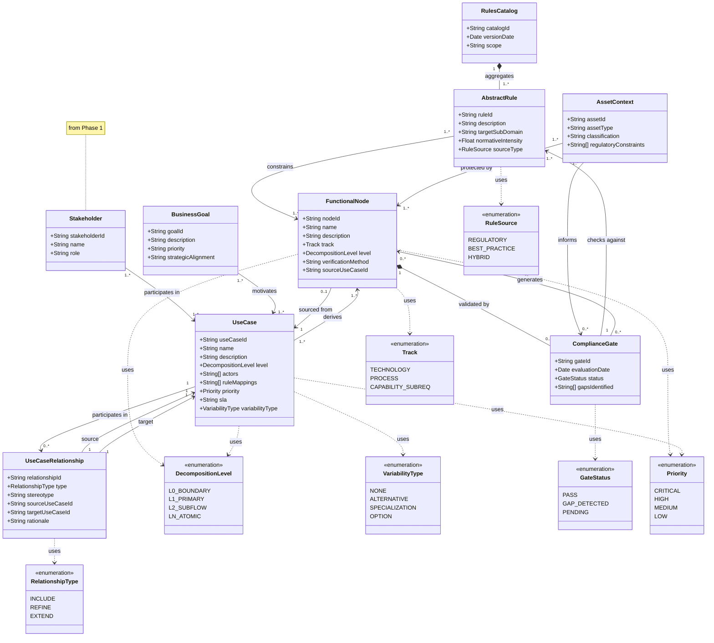

# Phase 3 — Decomposition

**Version:** 2.0 — UC-Centric Iterative Decomposition — 05/04/2026
**Status:** ✅ Updated with UseCaseRelationship, VariabilityType, multi-level support

## Entities

### Bridge from Phase 2
- RulesCatalog, AbstractRule

### Bridge from Phase 1
- Stakeholder, BusinessGoal

### New in Phase 3 Decomposition
- UseCase, UseCaseRelationship, FunctionalNode, ComplianceGate, AssetContext



## OCL Constraints

### Coexistence Constraint
A use case CANNOT have both `«include»` and `«refine»` relationships to the same target use case.

```ocl
context UseCase inv:
    if self.outgoingRelationships->exists(r | r.type = RelationshipType::INCLUDE)
        and self.outgoingRelationships->exists(r | r.type = RelationshipType::REFINE)
    then
        self.outgoingRelationships->select(r | r.type = RelationshipType::INCLUDE).target
            ->intersection(
                self.outgoingRelationships->select(r | r.type = RelationshipType::REFINE).target
            )->isEmpty()
    endif
```

### Multiple Refines Constraint
A refined use case MUST be refined by ≥2 refining use cases (unless it's a leaf).

```ocl
context UseCase inv:
    let refines : Set(UseCaseRelationship) = 
        self.incomingRelationships->select(r | r.type = RelationshipType::REFINE) in
    if refines->size() >= 2
    then
        let includes : Integer = refines->iterate(
            nextElement : UseCaseRelationship; 
            accumulator : Integer = 0 | 
            accumulator + nextElement.source.outgoingRelationships
                ->select(r | r.type = RelationshipType::INCLUDE)->size()
        ) in
        refines->size() - 1 = includes
    endif
```

### Level Consistency
`«refine»` relationships MUST go from higher to lower abstraction level.

```ocl
context UseCaseRelationship inv:
    if self.type = RelationshipType::REFINE
    then
        self.source.level.ordinal() < self.target.level.ordinal()
    endif
```

### Orphan Prevention
Every use case at Level ≥1 MUST have at least one incoming relationship (`«include»` or `«refine»`).

```ocl
context UseCase inv:
    if self.level <> DecompositionLevel::L0_BOUNDARY
    then
        self.incomingRelationships->size() >= 1
    endif
```
