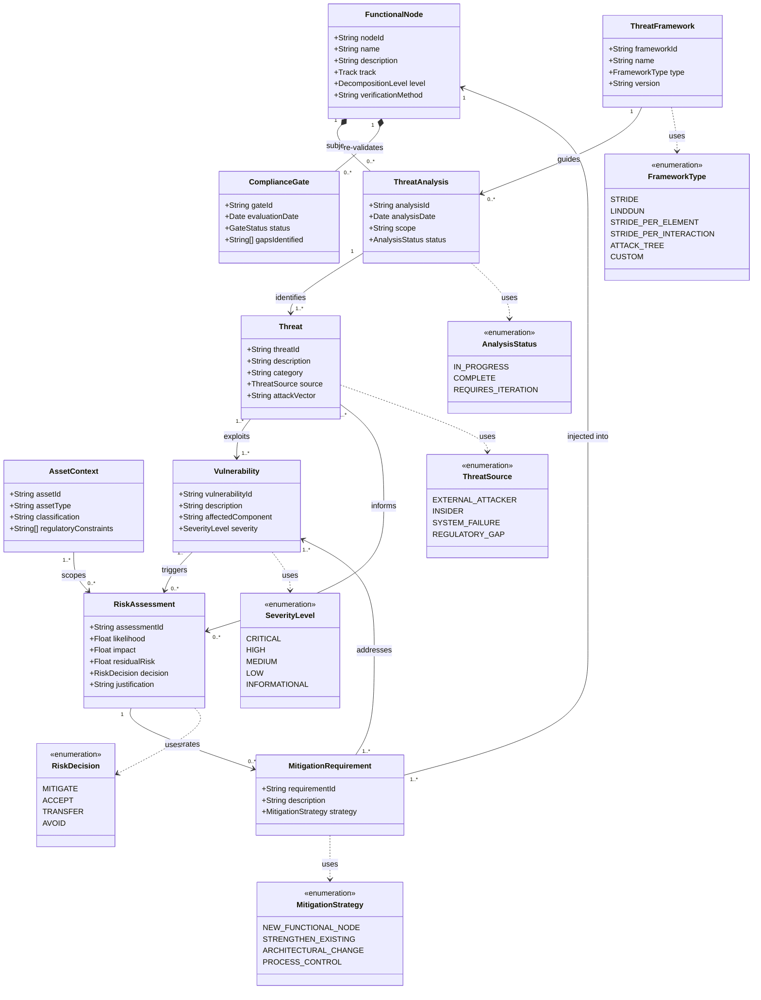

# Phase 3 — Risk Analysis

**Version:** Mermaid corrected — 01/04/2026 (cross-phase consistency + classes from draw.io)  
**Status:** ✅ Mermaid updated

## Entities

### Bridge from Phase 3 Decomposition
- FunctionalNode, AssetContext, ComplianceGate

### New in Phase 3 Risk
- ThreatFramework, ThreatAnalysis, Threat, Vulnerability, RiskAssessment, MitigationRequirement

