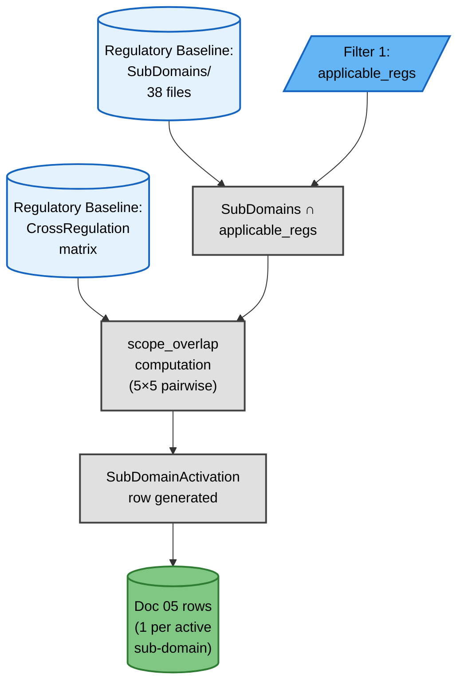
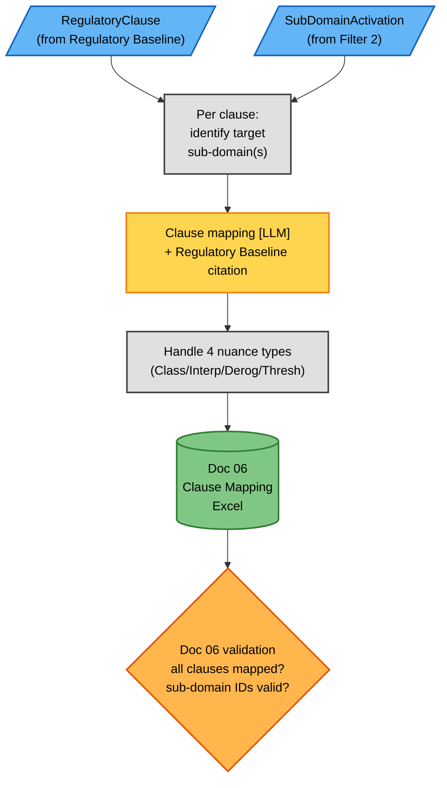

# Filter 2 — Domain Relevance (Detailed Flow)

## Overview

Filter 2 is the second of three pruning mechanisms applied during AEGIS Phase 1. It operates strictly between Filter 1 (Applicability) and the Phase 1C synthesis, reducing the 38 Regulatory Baseline sub-domains to the set that is **both** legally triggered by the company profile **and** materially relevant to the product or service under analysis.

While Filter 1 decides **which regulations apply** to a company, Filter 2 decides **which sub-domains within those applicable regulations must be operationalised**. The two filters share the `applicable_regs` artefact but solve orthogonal questions: Filter 1 is coarse-grained (regulation-level), Filter 2 is fine-grained (sub-domain-level).

Filter 2 takes three inputs:
1. The frozen Regulatory Baseline sub-domain catalogue (`SubDomains/D-XX.Y.md`, 38 files in 10 folders).
2. The `applicable_regs` vector produced by Filter 1.
3. The Regulatory Baseline 5×5 pairwise CrossRegulation matrix (`scope_overlap` for every regulation pair).

From these, it computes a `SubDomainActivation` row per sub-domain and produces two downstream artefacts:
- **Doc 05** — one row per active sub-domain (aggregation).
- **Doc 06** — clause-to-sub-domain mapping table (LLM-light, one LLM point).

Filter 2 is **deterministic by construction**: only one LLM step exists (clause classification), and even that step is anchored to Regulatory Baseline citations and a four-type nuance taxonomy that constrains interpretation.

---

## Diagram 1 — Domain Activation Pipeline

The following flowchart shows how Regulatory Baseline artefacts and Filter 1 output converge to produce per-sub-domain activation rows.

<!-- Domain activation pipeline: Regulatory Baseline + Filter 1 output → SubDomainActivation row → Doc 05 -->

---

## Diagram 2 — Clause-to-Subdomain Mapping → Doc 06

The second flowchart details how individual regulatory clauses are routed to their target sub-domain(s) and recorded in Doc 06.

<!-- Clause mapping pipeline: RegulatoryClause + SubDomainActivation → clause mapping [LLM] → Doc 06 -->

---

## Tables

### Table 1 — Sub-domain activation states

Each Regulatory Baseline sub-domain can occupy one of three activation states once Filter 2 runs.

| State | `applicable` | Meaning | Regulatory Baseline source |
|---|---|---|---|
| Active | true | The sub-domain is triggered by at least one applicable regulation AND lies on a material scope-overlap path | `applies_to ∩ applicable_regs ≠ ∅` AND `scope_overlap ≥ 1` pair is Y or Conditional |
| Inactive | false | The sub-domain is not triggered by any applicable regulation | `applies_to ∩ applicable_regs = ∅` |
| Conditional | true (flag) | The sub-domain is triggered but every applicable pair scores Conditional in the scope-overlap matrix | Flag retained; defaults to Active if any pair escalates to Y |

### Table 2 — Scope-overlap test outcomes (Y / Conditional / N)

The 5×5 CrossRegulation matrix produces one of three outcomes per regulation pair, per sub-domain.

| Outcome | Meaning | Implication for HL SO |
|---|---|---|
| Y | Pair contributes materially to the sub-domain's threat surface | Treat as a strong correlation; both regulations feed the HL synthesis |
| Conditional | Pair contributes only when a stated precondition holds (e.g. NIS2 only if essential entity) | Treat as a weak correlation; gate behind precondition check |
| N | Pair is unrelated to the sub-domain | Excluded from HL synthesis for this sub-domain |

### Table 3 — Clause mapping pipeline (5 steps)

The Doc 06 mapping is produced by a deterministic pipeline with exactly one LLM point.

| Step | Name | Type | Regulatory Baseline ref | LLM? |
|---|---|---|---|---|
| 1 | Read clause text + metadata | Deterministic | `Regulation/{REG}/02_SecurityRules_NIST.md` | No |
| 2 | Identify candidate sub-domain(s) | Lookup | `SubDomains/D-XX.Y.md` §3 | No |
| 3 | Map clause to sub-domain | LLM-light | `SubDomains/D-XX.Y.md` (citation required) | YES (1 point) |
| 4 | Detect nuance type (4 types) | LLM | `SubDomains/D-XX.Y.md` §2 (HSO) | YES |
| 5 | Validate mapping + write Doc 06 row | Deterministic | — | No |

### Table 4 — Four nuance types

Filter 2 recognises exactly four ways in which a clause can deviate from a "straight apply" pattern.

| Type | Definition | Example | Regulatory Baseline handling |
|---|---|---|---|
| Classification | Same clause applies differently to different roles | "Processor" vs "Controller" obligations | `per_reg_so` branch in §2 of sub-domain file |
| Interpretation | OJ text ambiguity requires reading | Art. 32(1)(a) "appropriate" anchored to 5 factors | §2 Considerations + SR `ambiguity_notes` |
| Derogation | Carve-out clause exempts subset | Art. 30 (records of processing activities) — SME exemption <250 emp | `per_reg_so` conditional activation |
| Threshold | Size/revenue triggers different treatment | NIS 2 size threshold (50 emp / €10M) | Filter 1 binary predicate |

### Table 5 — Filter 2 input/output contract

The contract below defines what flows in and out of Filter 2 and which steps are deterministic.

| Direction | Element | Source | Deterministic? |
|---|---|---|---|
| INPUT | `applicable_regs` | Filter 1 (Doc 05) | Yes |
| INPUT | `SubDomains/D-XX.Y.md` | Regulatory Baseline (frozen) | Yes (read-only) |
| INPUT | 5×5 pairwise `scope_overlap` matrix | Regulatory Baseline `CrossRegulation/DomainAnalysis/` | Yes |
| OUTPUT | `SubDomainActivation` (per sub-domain) | Filter 2 result | Yes |
| OUTPUT | Doc 05 row | Aggregation | Yes |
| OUTPUT | Doc 06 row | LLM-light clause mapping | Partially (1 LLM point) |

### Table 6 — Cascade rules — what propagates if Filter 2 changes

Filter 2 changes are non-trivial: every flip can ripple into Doc 05, Doc 06, Doc 07 and Doc 07b.

| Change in | Propagates to | Action |
|---|---|---|
| `scope_overlap` (Y → Conditional) | Doc 07b inheritability (I) | Re-compute I per sub-domain; re-assign tier via §5 table; re-run GATE-P |
| `SubDomainActivation.applicable` flips (false → true) | Doc 05 row added | Re-aggregate Doc 05; update Doc 07 (priority); create Doc 07b row |
| Clause mapping revision | Doc 06 row | Update Excel; re-run Doc 07 sub-domain coverage check |
| Regulatory Baseline `SubDomains` file changes (rare, frozen) | ALL downstream | Re-validate everything; cross-phase impact |

### Table 7 — Cross-case scaling (sub-domain activation)

Filter 2 was exercised across the three canonical AEGIS cases; observed activation counts are recorded below.

| Case | Applicable regs | Active sub-domains | Inactive sub-domains | `scope_overlap` Y | Conditional |
|---|---|---|---|---|---|
| Case 01 (TinyTask) | GDPR + CRA | 31/38 | 7 | majority | some (D-01.x, D-05.x) |
| Case 02 (SecureBorder) | GDPR + CRA + NIS2 + AI_Act | 35/38 | 3 | more pairs | few |
| Case 03 (OmniBank) | ALL 5 | 38/38 | 0 | all pairs | some |

---

## See also

- Parent overview: [`./phase1_contextual_definition.md`](./phase1_contextual_definition.md)
- Filter 1 detail: [`./phase1a_context_capture.md`](./phase1a_context_capture.md) + [`./phase1b_regulatory_mapping.md`](./phase1b_regulatory_mapping.md)
- Phase 1C synthesis: [`./phase1c_synthesis.md`](./phase1c_synthesis.md)
- Track B proportionality: [`./phase1c_proportionality_synthesis.md`](./phase1c_proportionality_synthesis.md)
- Per-sub-domain lanes: [`./subdomain_lanes.md`](./subdomain_lanes.md)
- Regulatory Baseline contract: [`../../../REGULATORY_BASELINE.md`](../../../REGULATORY_BASELINE.md)
- Regulatory Baseline sub-domains: [`../../../PREPROCESSING/SubDomains/index.md`](../../../PREPROCESSING/SubDomains/index.md)
- Strategy: [`../../../PHASE1_STRATEGY.md`](../../../PHASE1_STRATEGY.md)
- Class diagram: [`../../Class_Models/phase1_contextual_definition.md`](../../Class_Models/phase1_contextual_definition.md)

---

## Version History

| Version | Date | Changes |
|---|---|---|
| 1.0 | 2026-07-13 | Initial release — Filter 2 detail flow diagram introduced in Phase 1 v1.1 |