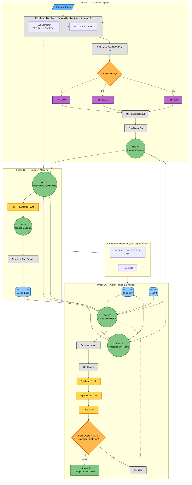

# Phase 1 — Contextual Definition (Flow Diagram)

**Version:** 1.0 — 2026-06-15
**Status:** ✅ Created
**Companion:** [`../Class_Models/phase1_contextual_definition.md`](../Class_Models/phase1_contextual_definition.md) (static structure)

---

## Overview

This flow diagram shows the **process** of running Phase 1 of the AEGIS methodology — from capturing company facts to producing the final Structured Compliance Matrix (Doc 07). It is the dynamic counterpart to the class diagram, which shows the entities but not the sequence.

Phase 1 has three internal stages with different natures:

| Stage | What happens | Nature |
|-------|-------------|--------|
| **1A — Context Capture** | Intake form, decision trees, conditional blocks | Evaluation + decisions (deterministic) |
| **1B — Regulatory Mapping** | Per-regulation analysis (4 LLM points), clause-to-sub-domain mapping, Excel generation | Lookup + LLM reasoning |
| **1C — Consolidation** | Coverage matrix, complementarity + conflicts (LLM), compound events (LLM), strategic implications (LLM), gaps (LLM), gate | Synthesis + LLM reasoning |

---

## Main Flow Diagram



---

## Decision Points Explained

### DP1: How many regulations apply?

The 5 decision trees each independently evaluate whether a regulation applies. The **number of applicable regulations** determines:
- How many conditional blocks activate (more regs → more blocks)
- The complexity tier (1=LOW, 2-3=MEDIUM, 4-5=HIGH)
- The gate criteria strictness at the end

### DP2: Gate criteria (proportional to tier)

The gate at the end of Phase 1 has **3 different checklists** depending on the complexity tier:

| Tier | Coverage required | Role Matrix |
|------|------------------|-------------|
| LOW | ≥ 60% | Optional |
| MEDIUM | ≥ 75% | Required |
| HIGH | ≥ 80% | Required |

If the gate fails, upstream documents may need updating, which triggers re-evaluation of the coverage matrix and downstream analyses.

---

## Dynamic Elements (Progressive Disclosure)

These elements **expand or contract** based on the company profile. They are shown collapsed in the main diagram and expand only when triggered:

| Element | Trigger | LOW (Case 01) | MEDIUM (Case 02) | HIGH (Case 03) |
|---------|---------|---------------|------------------|----------------|
| Decision trees returning YES | Company facts | 2 of 5 | 4 of 5 | 5 of 5 |
| Conditional blocks active | Regulations + company size | 3 (B6,B7,B8) | 7 (B1,B2,B4-B8) | 6 (B1-B4,B7,B8) |
| Overlap pairs | C(n, 2) where n = regs | 1 | 6 | 10 |
| Clause mappings | Per regulation | 54 | 112 | 150 |

---

## Detailed Sub-Phase Flows

The main diagram above collapses each sub-phase into a few nodes. The full granularity — every decision point, branch, and convergence — is expanded in dedicated detail files:

| Sub-phase | Detail file | What it expands |
|---|---|---|
| **1A — Context Capture** | [`phase1/phase1a_context_capture.md`](phase1/phase1a_context_capture.md) | 5 decision trees (internal branching), 8 block activation triggers, IR assessment, Doc 04 consolidation (2 diagrams) |
| **1B — Regulatory Mapping** | [`phase1/phase1b_regulatory_mapping.md`](phase1/phase1b_regulatory_mapping.md) | Per-regulation analysis loop (10 steps, 4 LLM reasoning points), clause mapping pipeline, Excel generation (2 diagrams) |
| **1B — Nuances & LLM** | [`phase1/phase1b_nuances_and_reasoning.md`](phase1/phase1b_nuances_and_reasoning.md) | 4 nuance types × 5 regulations with cross-case examples, LLM reasoning specifications, Master Mapping reference, Doc 05 vs Doc 07 analysis |
| **1C — Consolidation** | [`phase1/phase1c_consolidation.md`](phase1/phase1c_consolidation.md) | Coverage consolidation pipeline (deterministic), synthesis engine (4 LLM reasoning points E-H), gate criteria, Phase 2 handoff (2 diagrams) |
| **1C — Synthesis Reference** | [`phase1/phase1c_synthesis_reference.md`](phase1/phase1c_synthesis_reference.md) | Conflict classification framework (3-type taxonomy), compound event methodology (positive/negative identification), tension type catalog, resolution patterns, cross-case scaling analysis |
| **Filter 2 — Domain Relevance** | [`phase1/filter2_domain_relevance.md`](phase1/filter2_domain_relevance.md) | Regulatory Baseline lookup + scope_overlap matrix + clause mapping → Doc 06 |
| **Sub-domain Lanes** | [`phase1/subdomain_lanes.md`](phase1/subdomain_lanes.md) | Conceptual architecture — 38 parallel lanes per sub-domain from Regulatory Baseline to GATE-P |
| **Phase 1C — Proportionality Synthesis** | [`phase1/phase1c_proportionality_synthesis.md`](phase1/phase1c_proportionality_synthesis.md) | Track B decision table + 5-attribute enumeration + GATE-P criteria |

---

## Document Flow Summary

```
Company Facts ──→ Doc 04 ──→ Doc 05 ──→ Doc 06 (Excel) ──→ Doc 07
                     │           │                              ↑
                     │           │                              │
                     └───────────┴──→ Doc 07 (direct feed) ────┘
                                                        ↑
Taxonomy (00) ─────────────────────────────────────────→ │
Design Decisions (03) ─────────────────────────────────→ │
                                                         │
                                                         │     ↓
                                                  Doc 07b ←┘ (Proportionality Profile)
```

Doc 07 is the **convergence point**. It pulls from multiple sources and generates 4 new analyses that don't exist in any upstream document. It is not just an aggregation — it is a synthesis engine.

> **Rich-Mode Extension (v1.0, 2026-08-27).** This diagram shows the master spine. The case
> corpus (e.g., Case_01 Phase 1 RICH) instantiates a Rich-Mode extension that adds the
> 04a–d / 05b / 07c family (architecture & data inventory, security posture, third-party
> landscape, organisation & RACI, ambiguity register, adjusted objectives), the
> ontology → KG → dashboard infrastructure layer, and the post-rename
> (c94b840, 2026-08-26) legacy → DocNN reconciliation table. See:
>
> - [`phase1_rich_extension.md`](phase1_rich_extension.md) — sibling diagram, additive only;
>   master spine here remains authoritative.
> - `02_CASES/Case_01_TinyTask_SaaS/01_PHASE1_CONTEXT_RICH/PRODUCTION_FLOW.md` — case-side
>   production flow with trigger / inputs / transformation / outputs / consumers /
>   objectives served per doc.
> - `02_CASES/Case_01_TinyTask_SaaS/01_PHASE1_CONTEXT_RICH/validation/P1_production_flow_audit_v0.md`
>   — supporting audit matrix.

---

## What This Diagram Does NOT Show

- **Confidence check (Section 6.1 of intake form):** runs as a background quality gate — flags mismatches between client declaration and system calculation, but doesn't change the flow path
- **`phase1_ontology.yaml`:** internal machine-readable representation — not a user-facing artifact
- **Individual question details (Q39-Q75):** the 8 conditional blocks are shown as a group, not question-by-question
- **Iterative loops between Docs 05/06/07:** these documents have distinct purposes, not refinement stages
- **Nuances (Tipos 1-4):** regulatory classification, interpretation, derogation, and threshold nuances are expanded in [`phase1/phase1b_nuances_and_reasoning.md`](phase1/phase1b_nuances_and_reasoning.md)
- **LLM reasoning points:** 4 steps in Phase 1B where LLM-assisted analysis occurs (interpretation, rationale, implications, gaps) are expanded in [`phase1/phase1b_regulatory_mapping.md`](phase1/phase1b_regulatory_mapping.md)
- **Conflict classification:** the Synergistic / Structural / Contextual taxonomy for regulatory overlaps is expanded in [`phase1/phase1c_synthesis_reference.md`](phase1/phase1c_synthesis_reference.md)
- **Compound events:** factual events triggering multiple regulations and the positive/negative identification methodology are expanded in [`phase1/phase1c_synthesis_reference.md`](phase1/phase1c_synthesis_reference.md)
- **Phase 1C LLM synthesis:** 3 steps (P1C-LLM-01-OVERLAP-CLASSIFICATION per_domain_lane + P1C-LLM-02-COMPOUND-EVENT global_reduce + P1C-LLM-03-STRATEGIC-SYNTHESIS global_reduce) where cross-regulation reasoning occurs are expanded in [`phase1/phase1c_consolidation.md`](phase1/phase1c_consolidation.md)
- **Doc 07b (Proportionality Profile)** — Track B decision table + 5-attribute enumeration per sub-domain + GATE-P criteria are detailed in [`phase1/phase1c_proportionality_synthesis.md`](phase1/phase1c_proportionality_synthesis.md)
- **Per-sub-domain lanes** — the 38-lane parallel generation architecture is conceptualized in [`phase1/subdomain_lanes.md`](phase1/subdomain_lanes.md)

---

## Cross-Case Generalisation

The same flow works for all three AEGIS case studies:

| Case | Company | Regulations | Tier | Clauses | Coverage |
|------|---------|-------------|------|---------|----------|
| Case 01 | TinyTask SaaS (8 emp) | GDPR + CRA | MEDIUM | 54 | 92.1% |
| Case 02 | SecureBorder (450 emp) | GDPR + CRA + NIS 2 + AI Act | HIGH | 112 | 92.1% |
| Case 03 | OmniBank (5000+ emp) | All 5 | HIGH | 150 | 100% |

| Case | Company | Regulations | Tier | Clauses | Coverage | Track B tier distribution |
|------|---------|-------------|------|---------|----------|---------------------------|
| Case 01 | TinyTask SaaS (8 emp) | GDPR + CRA | MEDIUM | 54 | 92.1% | 31 LIGHTWEIGHT + 5 MINIMAL + 1 DEFERRED (37 ACTIVE) |

The structure is identical — only the volume of analysis scales with the number of applicable regulations.

---

### Colour Note

If the diagram appears with transparent or washed-out fills, the renderer may not support `classDef` styling. Try:
- **GitHub:** renders natively — should work
- **VS Code:** "Markdown Preview Mermaid Support" extension
- **Browser:** paste into [mermaid.live](https://mermaid.live/)
- **Dark mode:** fills are medium-saturation; text is explicit `color:#000`

---

**See also:**
- [`../Class_Models/phase1_contextual_definition.md`](../Class_Models/phase1_contextual_definition.md) for the companion static structure diagram
- [`phase1/phase1a_context_capture.md`](phase1/phase1a_context_capture.md) — Phase 1A detail (decision trees + blocks)
- [`phase1/phase1b_regulatory_mapping.md`](phase1/phase1b_regulatory_mapping.md) — Phase 1B detail (per-regulation analysis + clause mapping, 2 LLMs in v1.2)
- [`phase1/phase1b_nuances_and_reasoning.md`](phase1/phase1b_nuances_and_reasoning.md) — Phase 1B reference (nuances catalog + LLM spec)
- [`phase1/phase1c_consolidation.md`](phase1/phase1c_consolidation.md) — Phase 1C detail (coverage consolidation + synthesis engine, 3 LLMs in v1.2)
- [`phase1/phase1c_synthesis_reference.md`](phase1/phase1c_synthesis_reference.md) — Phase 1C reference (conflict framework + compound events)
- [`../PROMPTS/P1B-LLM-01-INTERPRETATION.md`](../PROMPTS/P1B-LLM-01-INTERPRETATION.md) — Phase 1B prompt template (canonical, v1.2)
- [`../PROMPTS/P1B-LLM-02-RATIONALE.md`](../PROMPTS/P1B-LLM-02-RATIONALE.md) — Phase 1B prompt template (canonical, v1.2)
- [`../PROMPTS/P1C-LLM-01-OVERLAP-CLASSIFICATION.md`](../PROMPTS/P1C-LLM-01-OVERLAP-CLASSIFICATION.md) — Phase 1C prompt template (canonical, v1.2)
- [`../PROMPTS/P1C-LLM-02-COMPOUND-EVENT.md`](../PROMPTS/P1C-LLM-02-COMPOUND-EVENT.md) — Phase 1C prompt template (canonical, v1.2)
- [`../PROMPTS/P1C-LLM-03-STRATEGIC-SYNTHESIS.md`](../PROMPTS/P1C-LLM-03-STRATEGIC-SYNTHESIS.md) — Phase 1C prompt template (canonical, v1.2)
- [`../PROMPTS/README.md`](../PROMPTS/README.md) — Prompt library index

---

## Legacy ID Cross-walk (v1.2, 2026-07-13)

| Legacy | Canonical | Where |
|---|---|---|
| LLM-A | P1B-LLM-01-INTERPRETATION | Phase 1B (per_regulation) |
| LLM-B | P1B-LLM-02-RATIONALE | Phase 1B (per_regulation) |
| LLM-C | (merged into P1B-LLM-02) | Phase 1B |
| LLM-D | (merged into P1B-LLM-02) | Phase 1B |
| LLM-E | P1C-LLM-01-OVERLAP-CLASSIFICATION | Phase 1C (per_domain_lane) |
| LLM-F | P1C-LLM-02-COMPOUND-EVENT | Phase 1C (global_reduce, runs 2nd) |
| LLM-G | P1C-LLM-03-STRATEGIC-SYNTHESIS | Phase 1C (global_reduce, runs 1st) |
| LLM-H | (REMOVED — gap aggregation out of Phase 1 scope) | — |

**Total: 8 → 5 LLMs (-37.5%) across Phase 1.** Invocation patterns: `per_regulation` × 2 + `per_domain_lane` × 1 + `global_reduce` × 2.

## Version History

| Version | Date | Changes |
|---------|------|---------|
| 1.2 | 2026-07-13 | Updated LLM-E/F/G/H references to canonical IDs (P1C-LLM-01/02/03). Phase 1 LLMs consolidated from 8 → 5 across P1B+P1C. |
| 1.1 | 2026-07-13 | Added Regulatory Baseline subgraph (L0), per-sub-domain lanes (LANES), Doc 07b as first-class output, GATE-P in gate criteria. Cross-references to new companion files added. |
| 1.0 | 2026-06-15 | Initial release — linear 1A→1B→1C flow with complexity tier pivot |
