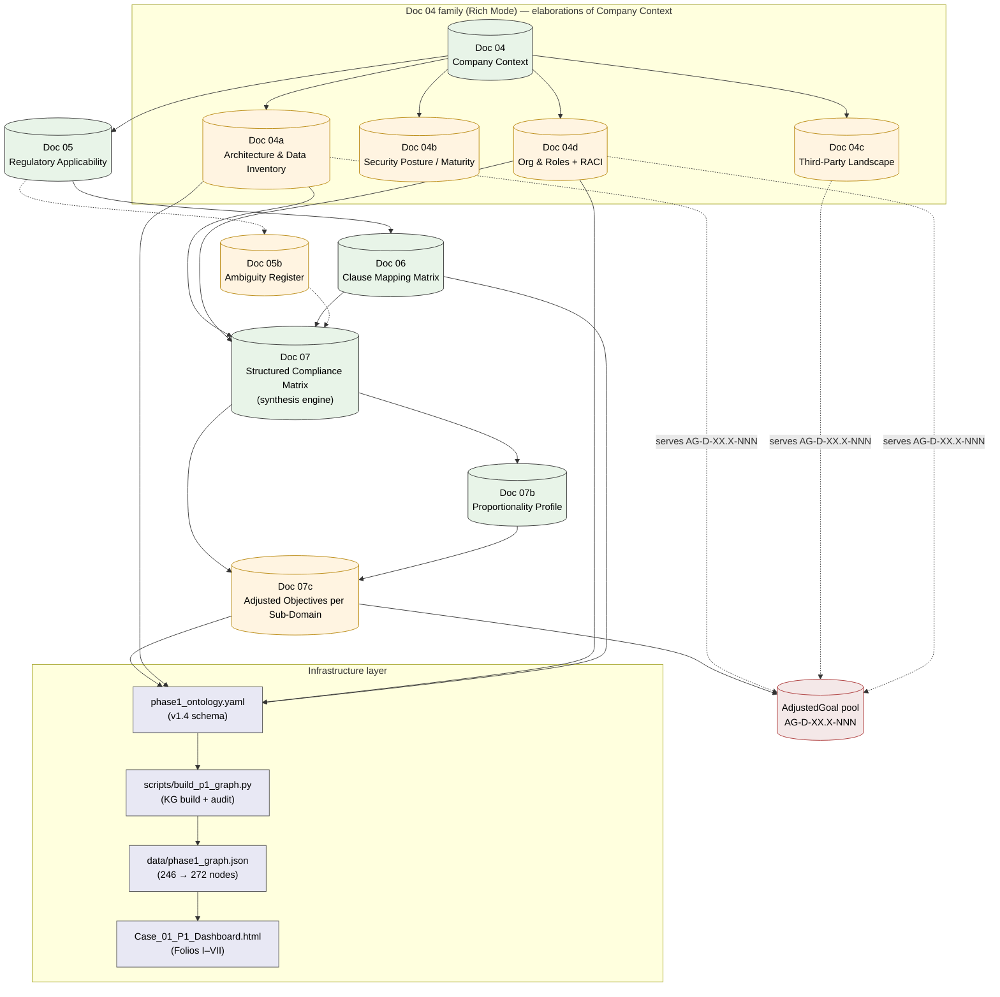

# Phase 1 — Rich-Mode Extension (Additive Flow Diagram)

**Version:** 1.0 — 2026-08-27
**Status:** ✅ Active
**Companion / parent:** [`./phase1_contextual_definition.md`](./phase1_contextual_definition.md) (v1.1 master spine — unchanged)
**Case anchor:** [`02_CASES/Case_01_TinyTask_SaaS/01_PHASE1_CONTEXT_RICH/PRODUCTION_FLOW.md`](../../../02_CASES/Case_01_TinyTask_SaaS/01_PHASE1_CONTEXT_RICH/PRODUCTION_FLOW.md)

---

## Scope and Non-Scope

**This diagram is additive.** The master spine defined in `phase1_contextual_definition.md` v1.1
(`Doc 04 → Doc 05 → Doc 06 → Doc 07 → Doc 07b`) remains authoritative for the methodology.
This sibling diagram covers three things the master does not show:

1. **Rich-Mode case extensions** — the 04a–d, 05b, 07c family that grew during 2026-07-11/13
   (legacy spine) and 2026-08-06 (Rich Mode sprints). These are case-level elaborations that
   the methodology canon does not enumerate, but which the corpus instantiates.
2. **Infrastructure layer** — the ontology / KG / dashboard pipeline that consumes the
   case documents. Without it, the doc genealogy stops at the dashboard link inside
   `phase1_contextual_definition.md` (line 93 `DASH["Dashboard"]`).
3. **Rename reconciliation** — the canonical legacy → DocNN name map produced by
   commit `c94b840` (2026-08-26, 95 renames, 0 content diff). Without it, every
   `inputs:` / `outputs:` frontmatter edge in the case points to a file that no longer
   exists by that name.

**Out of scope:**
- Phase 1A/1B/1C internal mechanics — see the master and its children
  (`phase1a_context_capture.md`, `phase1b_regulatory_mapping.md`, `phase1c_consolidation.md`).
- Phase 2 / Phase 3 flows — see `../phase2/` and `../phase3/`.
- Cross-case (Case_02, Case_03) application of the same extensions — deferred;
  this v1.0 is anchored on Case_01 evidence (see `validation/P1_cross_case_mirror_v0.md`).

---

## Rich-Mode Additive Flow Diagram

**Reading the diagram:**
- **Green nodes** are the master spine (methodology canon, unchanged).
- **Amber nodes** are Rich-Mode case extensions (this diagram is their methodology anchor).
- **Blue nodes** are the infrastructure layer (no diagram in the canon shows this; it was
  implicit in `phase1_contextual_definition.md` line 93 only as `DASH["Dashboard"]`).
- **Red node** `GOALS` is the canonical AdjustedGoal pool defined by Doc13 / Doc07c.
  Dotted edges from Doc04a / Doc04c / Doc04d to GOALS are **added per the 2026-08-27 P7
  gate**: lens docs declare which `AG-D-XX.X-NNN` objectives their content serves.
- Solid edges = structural data flow; dotted edges = cross-reference / linkage edges.

---

## Legacy → DocNN Rename Reconciliation (commit c94b840, 2026-08-26)

The commit applied 95 filename renames in the case corpus with **0 content diff**. Every
`inputs:` / `outputs:` frontmatter edge in the case still references the legacy basenames
(see `validation/P1_production_flow_audit_v0.md` §B: 63 legacy citations across 12 of 13
frontmatter blocks). The canonical mapping:

| Legacy filename (Doc NN-style) | Canonical (DocNN_) | Doc family | Notes |
|--------------------------------|--------------------|------------|-------|
| `00_Taxonomy_Reference.md` | `Doc01_Taxonomy_Reference.md` | Doc01 | root source |
| `01_INTAKE_FORM.md` | `Doc02_INTAKE_FORM.md` | Doc02 | case intake |
| `04_Company_Context_Assessment.md` | `Doc03_Company_Context_Assessment.md` | Doc03 | master spine |
| `04a_Architecture_DataInventory.md` | `Doc04_Architecture_DataInventory.md` | Doc04a | Rich extension |
| `04b_Security_Posture.md` | `Doc05_Security_Posture.md` | Doc04b | Rich extension (maturity deprecated → Phase 2) |
| `04c_ThirdParty_Landscape.md` | `Doc06_ThirdParty_Landscape.md` | Doc04c | Rich extension |
| `04d_Org_Roles_RACI.md` | `Doc07_Org_Roles_RACI.md` | Doc04d | Rich extension |
| `05_Regulatory_Applicability.md` | `Doc08_Regulatory_Applicability.md` | Doc05 | master spine |
| `05b_Ambiguity_Register.md` | `Doc09_Ambiguity_Register.md` | Doc05b | Rich extension |
| `06_Clause_Mapping_Matrix.md` | `Doc10_Clause_Mapping_Matrix.md` | Doc06 | master spine |
| `07_Structured_Compliance_Matrix.md` | `Doc11_Structured_Compliance_Matrix.md` | Doc07 | master spine |
| `07b_Proportionality_Profile.md` | `Doc12_Proportionality_Profile.md` | Doc07b | master spine (Track B) |
| `07c_Adjusted_Goals.md` | `Doc13_Adjusted_Goals.md` | Doc07c | Rich extension (objectives) |

**Phase-2 references** (`02_PHASE2_RULES_RICH/`) follow the same pattern
(Doc14 / Doc15 / … / Doc19 etc.) — see `02_CASES/README.md` for the current mapping.

---

## Document Production Stages (Rich Mode, Case_01-anchored)

The case-side companion `PRODUCTION_FLOW.md` enumerates the trigger / inputs / transformation
/ outputs / consumers / objectives served for each of the 13 deliverables. This diagram only
shows the *graph shape*. The classification the case audit arrived at (see
`validation/P1_production_flow_audit_v0.md`):

| Classification | Count | Docs |
|----------------|------:|------|
| FLOW-NATIVE (master spine or directly feeds it) | 10 | Doc01, 02, 03, 04, 06, 07, 08, 10, 11, 12 |
| JUSTIFIED-EXTENSION (case-level, justified by ontology or methodology) | 2 | Doc09 (Ambiguity Register), Doc13 (Adjusted Objectives) |
| ORPHAN-HYBRID (deprecated but still cited) | 1 | Doc05 (Security Posture / maturity — `DEPRECATED_FOR_MATURITY`, ownership moved to Phase 2 `Doc19_Framework_Mapping_Matrix.md`) |
| META-INFRA (infrastructure, not deliverables) | 6 | README, PROJECT_STATE, Citation_Index, Corpus_Field_Map, phase1_ontology.yaml, data/phase1_graph.json |

---

## Validation

- **Methodology consistency:** this diagram is consistent with `../README.md` (3-filter
  pruning, 38-lane parallel generation, GATE-P criteria) and adds nothing that contradicts
  the master.
- **Case consistency:** every node above has a corresponding artefact in
  `02_CASES/Case_01_TinyTask_SaaS/01_PHASE1_CONTEXT_RICH/` (post-rename names).
- **Audit trail:** `validation/P1_production_flow_audit_v0.md` (matrix, sections A–D) and
  `validation/P1_cross_case_mirror_v0.md` (transversal findings) are the supporting artefacts.

---

## Open Items (deferred from v1.0)

These are **not blocking** v1.0 publication but should be tracked:

1. **Phase-1 case-level adoption** — Case_02 and Case_03 have NOT yet been mapped to this
   diagram (see mirror report: zero fluxdiagram references in either case). v1.0 anchors
   on Case_01 evidence.
2. **AG- prefix vs methodology AO-** — Doc13 uses `AG-D-XX.X-NNN` (124 occurrences); the
   methodology canon (`dependency_graph.yaml` + `AGENTS.md` corr-008) names `AO-D-` as the
   canonical Phase 1 goal prefix. The 2026-08-27 P7 gate elected to keep `AG-` as the
   de-facto case canonical for now (Doc13 has 124 working IDs; migrating would be a separate
   sprint). This divergence is documented here to prevent it from being re-discovered as a
   bug.
3. **`kg.sh impact AEGIS-P1-RICH-07c` returns no unique node match** — the KG E3 graph
   keys on DocNN tokens, not on the `AEGIS-*` doc IDs. Impact queries that want to reason
   about Doc13 should use the DocNN token directly (or build an ID alias table; deferred).
4. **Doc04b maturity ownership** — Doc05 (Security Posture) is deprecated in favour of
   `02_PHASE2_RULES_RICH/Doc19_Framework_Mapping_Matrix.md` §5.1. The phase-2 ownership
   transfer has not yet been documented as a `DEPRECATED_FOR_…` annotation in
   `phase1_ontology.yaml`; the audit report flags this as an open item.
