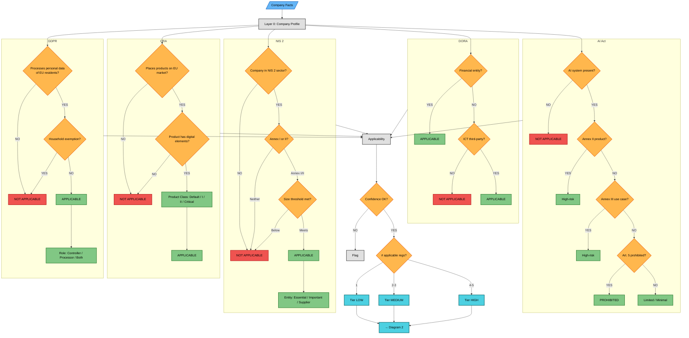
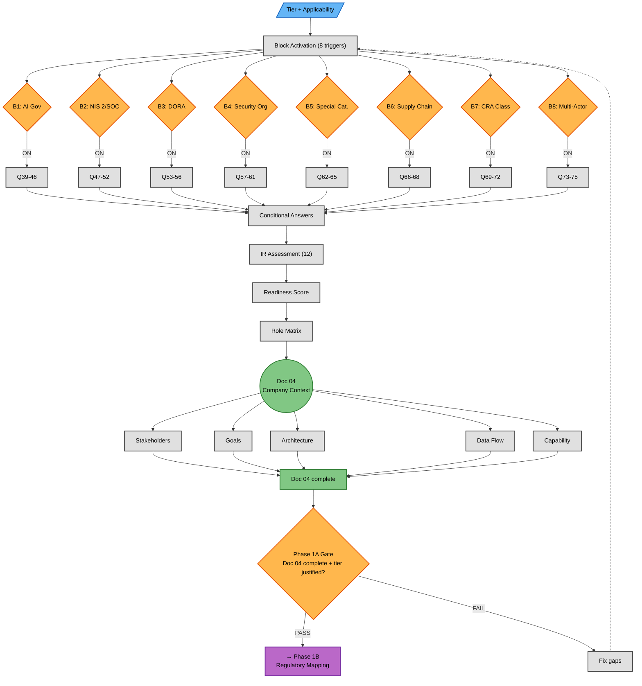

# Phase 1A — Context Capture (Detailed Flow)

**Version:** 1.0 — 2026-06-15
**Parent:** [`../phase1_contextual_definition.md`](../phase1_contextual_definition.md) (Phase 1 overview)
**Source of truth:** [`00_METHODOLOGY/TEMPLATES/01_INTAKE_FORM.md`](../../../TEMPLATES/01_INTAKE_FORM.md)

> **Filter 1 framing (v1.1).** This file is the operationalization of **Filter 1 — Applicability** in the 3-filter pruning model ([`../../../PHASE1_STRATEGY.md`](../../../PHASE1_STRATEGY.md) §5). The 5 decision trees produce the `applicable_regs` set; the per-regulation analysis loop produces the Doc 05 rows; block activation triggers (Diagram 2) are the operationalization of Filter 3 conditional extensions. See [`./phase1_contextual_definition.md`](./phase1_contextual_definition.md) for the 3-filter overview, [`./filter2_domain_relevance.md`](./filter2_domain_relevance.md) for Filter 2 detail, and [`./subdomain_lanes.md`](./subdomain_lanes.md) for the per-sub-domain architecture.

---

## Overview

This diagram expands the **Phase 1A — Context Capture** subgraph from the Phase 1 overview into full granularity. It shows every decision point, every branching path, and every convergence in the intake process.

Phase 1A takes raw company facts and produces **Doc 04 — Company Context Assessment**. The process is entirely deterministic: decision trees have defined thresholds, block activation is rule-based, and gate criteria are checklists.

**Why two diagrams:** A single flowchart with 5 decision trees (26+ nodes) plus 8 block triggers plus Doc 04 consolidation would be 70+ nodes — illegible. The split is:

- **Diagram 1:** Layer 0 + Layer 1 (decision trees) → Applicability Summary → Tier
- **Diagram 2:** Block Activation → Conditional Questions → Assessment → Doc 04 → Gate

---

## Diagram 1 — Process (Context Capture)



### Decision Tree Quick Reference

| Regulation | Step 1 | Step 2 | Step 3 | Step 4 | Terminal Output |
|---|---|---|---|---|---|
| **GDPR** | Processes EU personal data? | Household exemption? | — | — | APPLICABLE + Role (Controller/Processor/Both) |
| **CRA** | EU market placement? | Digital elements? | Product class? | — | APPLICABLE + Class (Default/I/II/Critical) |
| **NIS 2** | NIS 2 sector? | Annex I or II? | Size threshold? | — | APPLICABLE + Entity type (Essential/Important/Supplier) |
| **DORA** | Financial entity (Art. 2)? | ICT third-party? | — | — | APPLICABLE + Type (Financial/ICT) |
| **AI Act** | AI system present? | Annex II product? | Annex III use case? | Art. 5 prohibited? | Classification (Provider/Deployer/Prohibited/Minimal) |

### Confidence Check (Intake Form Section 6.1)

After the 5 trees produce results, the system cross-checks against the client's own declarations:

| Client says | System says | Confidence | Action |
|---|---|---|---|
| "GDPR applies" | GDPR: APPLICABLE | HIGH | Proceed |
| "Not sure about NIS 2" | NIS 2: APPLICABLE | MEDIUM | Note ambiguity, proceed |
| "DORA doesn't apply" | DORA: APPLICABLE | LOW | Flag for further analysis |

---

## Diagram 2 — Process (Block Activation & Consolidation)



**Note on OFF paths:** Each block diamond has an implicit OFF path — when the trigger condition is not met, the block's questions are skipped entirely. Only ON paths are shown to reduce visual clutter. The Conditional Answers Consolidation node receives answers only from active blocks.

---

## Block Activation Matrix — Full Reference

| Block | Trigger Condition | Questions | # Q | Case 01 | Case 02 | Case 03 |
|---|---|---|---|---|---|---|
| **B1: AI Governance** | AI Act applicable | Q39-Q46 | 8 | OFF | ON | ON |
| **B2: NIS 2 / SOC** | NIS 2 applicable | Q47-Q52 | 6 | OFF | ON | ON |
| **B3: DORA Financial** | DORA applicable | Q53-Q56 | 4 | OFF | OFF | ON |
| **B4: Security Org** | size ≥50 OR maturity ≥ Managed | Q57-Q61 | 5 | OFF (8 emp) | ON (450) | ON (5000+) |
| **B5: Special Category** | GDPR + Art. 9 data | Q62-Q65 | 4 | OFF | ON (biometric) | OFF (financial) |
| **B6: Supply Chain** | visibility=Low OR hardware | Q66-Q68 | 3 | ON (cloud dep) | ON (hardware) | OFF (mature) |
| **B7: CRA Classification** | CRA applicable | Q69-Q72 | 4 | ON | ON | ON |
| **B8: Multi-Actor Roles** | 2+ regs OR mixed roles | Q73-Q75 | 3 | ON (2 regs) | ON (4 regs) | ON (5 regs) |
| | | **Total** | **37** | **3 active** | **7 active** | **6 active** |

**Question count per case (conditional only):**

| Case | Active blocks | Conditional questions | Base questions (Layer 0+1) | Total intake |
|---|---|---|---|---|
| Case 01 | 3 (B6,B7,B8) | 10 | ~10 | ~20 |
| Case 02 | 7 (B1,B2,B4-B8) | 33 | ~15 | ~48 |
| Case 03 | 6 (B1-B4,B7,B8) | 30 | ~15 | ~45 |

---

## Implementation Readiness Areas (IR-01 to IR-12)

These 12 cross-cutting areas are assessed for every company regardless of which regulations apply:

| ID | Area | Assessment Question | Answer format |
|---|---|---|---|
| IR-01 | Governance | Named individual for security governance? | YES / NO / PARTIAL |
| IR-02 | DPO | DPO appointed or required? | YES / NO / NOT REQUIRED |
| IR-03 | Incident Response | Documented IR capability? | YES / NO / PARTIAL |
| IR-04 | Business Continuity | Documented BCP? | YES / NO / PARTIAL |
| IR-05 | Data Processing Register | Record of processing activities? | YES / NO / PARTIAL |
| IR-06 | Supplier Register | Register of critical suppliers? | YES / NO / PARTIAL |
| IR-07 | Security Policies | Documented security policies? | YES / NO / PARTIAL |
| IR-08 | Training | Security awareness program? | YES / NO / PARTIAL |
| IR-09 | Access Control | Formal access control policy? | YES / NO / PARTIAL |
| IR-10 | Data Classification | Data classification scheme? | YES / NO / PARTIAL |
| IR-11 | Asset Inventory | Current IT asset inventory? | YES / NO / PARTIAL |
| IR-12 | Risk Management | Documented risk management process? | YES / NO / PARTIAL |

**Scoring:** HIGH (≥9 YES) · MEDIUM (5-8) · LOW (<5)

---

## Tier Derivation

The complexity tier is derived from **two criteria** (intake form Section 8 defines three; the third — regulatory interactions — is outside this diagram's scope):

| Criterion | LOW | MEDIUM | HIGH |
|---|---|---|---|
| Applicable regulations | 1 | 2-3 | ≥4 |
| Active conditional blocks | 0-1 | 2-3 | ≥4 |

**Final tier** = highest of the two criteria.

| Case | Regs | Regs tier | Blocks active | Blocks tier | Final tier |
|---|---|---|---|---|---|
| Case 01 | 2 | MEDIUM | 3 | MEDIUM | **MEDIUM** |
| Case 02 | 4 | HIGH | 7 | HIGH | **HIGH** |
| Case 03 | 5 | HIGH | 6 | HIGH | **HIGH** |

> **Note:** The Phase 1 overview diagram uses a simplified tier table (regs count only). This detailed diagram shows the full derivation per the intake form. Case 01 classifies as MEDIUM here (2 regs + 3 blocks) even though the overview simplifies it to LOW for brevity.

---

## Gate Criteria by Tier

The Phase 1A gate verifies completeness before allowing progression to Phase 1B:

| Criterion | LOW | MEDIUM | HIGH |
|---|---|---|---|
| Layer 0 (Company Profile) complete | Required | Required | Required |
| Regulations assessed | ≥1 | ≥2 | All 5 |
| Confidence check (Section 6.1) | 1 regulation | Each regulation | All 5 regulations |
| Implementation Readiness (Section 6.2) | — | ≥6 of 12 areas | All 12 areas |
| Readiness Summary (Section 6.3) | — | — | Required |
| Decision trees completed | Required | Required | Required |
| Conditional blocks activated | 0-1 | ≥2 | All applicable |
| Role Matrix | — | Required | Required (all regs) |
| Tier derived and justified | Required | Required | Required |

If the gate fails, upstream inputs are updated and the block activation is re-evaluated (see FIX loop in Diagram 2).

---

## Doc 04 Output Sections

Doc 04 consolidates all Phase 1A outputs into a single document. Each section maps to a step in Diagram 2:

| Doc 04 Section | Source in flow | Content |
|---|---|---|
| §2 Assessment Summary | Layer 0 | Company snapshot (name, sector, size, method) |
| §3 Stakeholder Analysis (A1) | Diagram 2 → SA | Stakeholder register + influence matrix |
| §4 Business Goals Catalog (A2) | Diagram 2 → BG | Strategic goals × regulations × metrics |
| §5 Intake Form Response Summary | Diagram 1 + Diagram 2 | Layer 0/1/2 summary, tier, blocks |
| §6 Regulatory Applicability Flags | Diagram 1 → APP | 5 × (applicable, rationale, threshold) |
| §7 Architectural Implications | Diagram 2 → ARCH | Native vs inherited control implications |
| §8 Data Flow Summary | Diagram 2 → DFS | Data elements × legal basis × retention |
| §9 Compliance Capability Assessment | Diagram 2 → CAP | Current state + gap + remediation |

---

## Cross-Case Comparison Through Phase 1A

| Dimension | Case 01 (TinyTask) | Case 02 (SecureBorder) | Case 03 (OmniBank) |
|---|---|---|---|
| **Company size** | 8 emp, <€2M | 450 emp, €120M | 5000+ emp, >€1.5B |
| **Sector** | Technology/SaaS | Defense/Security | Banking/Financial |
| **Regs applicable** | GDPR, CRA (2) | GDPR, CRA, NIS 2, AI Act (4) | All 5 |
| **Tier** | MEDIUM | HIGH | HIGH |
| **Blocks active** | 3 (B6, B7, B8) | 7 (B1, B2, B4-B8) | 6 (B1-B4, B7, B8) |
| **Conditional questions** | ~10 | ~33 | ~30 |
| **Key classification** | CRA: Default class | AI Act: Annex III (border control) | AI Act: Annex III (credit scoring) |
| **GDPR role** | BOTH (controller for admin, processor for customer data) | PROCESSOR (for government) | CONTROLLER |
| **Special factors** | Micro-enterprise, cloud-dependent | Biometric Art. 9 data, hardware+software | DORA financial entity, in-house SOC |
| **Gate status** | PASS | PASS | PASS |

---

## Relationship to Parent Diagram

This detailed flow is a **zoom-in** of the Phase 1A subgraph in [`../phase1_contextual_definition.md`](../phase1_contextual_definition.md):

```
Parent diagram (overview):

    subgraph P1A["Phase 1A — Context Capture"]
        CF --> L0 --> L1 --> APP --> TIER --> BM --> CQ --> D04
    end

                         ⬇ expanded to ⬇

This file (detail):

    Diagram 1: L0 → 5 trees (internal branching) → APP → CONF → TIER
    Diagram 2: TIER → BM (8 blocks) → CQ → IR → RM → D04 (5 sections) → GATE
```

The parent collapses 5 decision trees into one node and 8 blocks into one node. This file expands both to show every decision point.

---

### Colour Note

Uses the same high-contrast palette as the parent diagram. If fills appear washed out:
- **GitHub:** renders natively
- **VS Code:** "Markdown Preview Mermaid Support" extension
- **Browser:** paste into [mermaid.live](https://mermaid.live/)
- All text uses explicit `color:#000` for dark-mode readability

---

**See also:**
- [`./filter2_domain_relevance.md`](./filter2_domain_relevance.md) — Filter 2 (Domain Relevance) detail — Regulatory Baseline lookup + clause mapping → Doc 06 (introduced v1.1)
- [`./subdomain_lanes.md`](./subdomain_lanes.md) — Per-sub-domain lanes architecture — 38 lanes from Regulatory Baseline to GATE-P (introduced v1.1)
- [`./phase1c_synthesis.md`](./phase1c_synthesis.md) — Phase 1C synthesis (Doc 07) — refactored companion to this file (introduced v1.1)
- [`./phase1c_proportionality_synthesis.md`](./phase1c_proportionality_synthesis.md) — Track B proportionality + GATE-P criteria (Doc 07b detail, introduced v1.1)
- [`../phase1_contextual_definition.md`](../phase1_contextual_definition.md) — Phase 1 overview (parent, v1.1)
- [`../../Class_Models/phase1_contextual_definition.md`](../../Class_Models/phase1_contextual_definition.md) — Static structure (class diagram, v1.1)
- [`../../../TEMPLATES/01_INTAKE_FORM.md`](../../../TEMPLATES/01_INTAKE_FORM.md) — Source template (intake form v2.0)
