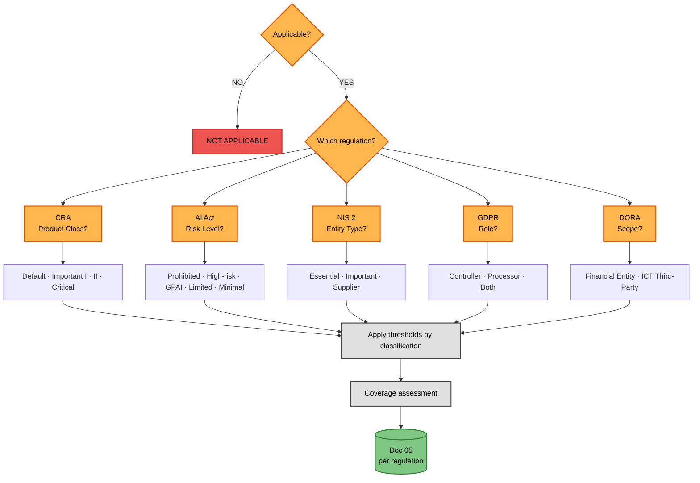

# Phase 1B — Regulatory Mapping (Detailed Flow)

**Version:** 1.0 — 2026-06-15
**Parent:** [`../phase1_contextual_definition.md`](../phase1_contextual_definition.md) (Phase 1 overview)
**Sources of truth:**
- [`../../../TEMPLATES/05_Regulatory_Applicability.md`](../../../TEMPLATES/05_Regulatory_Applicability.md) — Doc 05 template
- [`../../../TEMPLATES/06_Clause_Mapping_Matrix.md`](../../../TEMPLATES/06_Clause_Mapping_Matrix.md) — Doc 06 template
- [`phase1b_nuances_and_reasoning.md`](phase1b_nuances_and_reasoning.md) — Nuances catalog + LLM reasoning spec (companion)

---

## Overview

This diagram expands the **Phase 1B — Regulatory Mapping** subgraph from the Phase 1 overview into full granularity. It shows every step in the per-regulation analysis and clause mapping process, including the four types of regulatory nuances and the two LLM reasoning points.

Phase 1B takes Doc 04 (Company Context) and produces **Doc 05 — Regulatory Applicability** and **Doc 06 — Clause Mapping Matrix**. The process has two distinct stages:

1. **Per-regulation deep-dive** (Diagram 1): For each applicable regulation, evaluate criteria, determine classification, identify nuances, assess coverage, and generate rationale/implications/gaps. Output: Doc 05.
2. **Clause-to-subdomain mapping** (Diagram 2): Take the applicability results and filter the static Master Mapping (150 clauses mapped to 38 sub-domains) down to the company-specific subset. Output: Doc 06 (Excel).

**Key difference from Phase 1A:** Phase 1A was entirely deterministic. Phase 1B introduces **LLM reasoning** at two specific points where interpretation, synthesis, or gap analysis is required. These are not arbitrary — each LLM node has a defined purpose, input contract, instruction set, knowledge base requirement, and quality criteria (see spec tables below).

**Why two diagrams:** Diagram 1 shows the **process** (what happens in order) with LLM steps visible so the architecture can be evaluated. Diagram 2 shows the **decision tree** (what determines the per-regulation outcome) — pure logic, no LLM references. This separation keeps each diagram focused: process diagrams are for understanding flow; decision trees are for understanding branching.

> **Regulatory Baseline is read-only.** `SubDomains/D-XX_Folder/*.md` is the source of truth for sub-domain definitions. Phase 1B reads the Regulatory Baseline but does not mutate it. If a sub-domain definition appears to need updating, that change must go through the Regulatory Baseline mutation protocol (see `REGULATORY_BASELINE.md`), not through Phase 1B edits.

---

## Diagram 1 — Process (Doc 05 + Doc 06)

```mermaid
flowchart TD
    IN[/Doc 04 + Phase 1A/]
    IN --> LOOP{"For each regulation"}

    LOOP --> S1["Criteria"]
    S1 --> S2{"Applicable?"}
    S2 -->|NO| NA["Mark N/A"]
    S2 -->|YES| S3["Classification"]
    S3 --> S4["Interpretation [LLM]<br/>P1B-LLM-01"]
    S4 --> S5["Thresholds"]
    S5 --> S6["Obligated party"]
    S6 --> S7["Coverage"]
    S7 --> S8["Rationale + Implications + Gaps [LLM]<br/>P1B-LLM-02"]
    S8 --> SEC[("Doc 05 §\nper regulation")]
    NA --> LN{"More regs?"}
    SEC --> LN
    LN -->|YES| LOOP
    LN -->|NO| M1["Master Mapping"]

    M1 --> M2["Filter applicable"]
    M2 --> M3["Filter classification"]
    M3 --> M4["Annotate"]
    M4 --> M5["NI + Map"]
    M5 --> M6[("Doc 06 Excel\nClause Mapping")]
    M6 --> GATE{"Phase 1B Gate\nclauses mapped + NI + Excel?"}
    GATE -->|PASS| OUT["→ Phase 1C\nConsolidation"]
    GATE -->|FAIL| FIX["Fix gaps"]
    FIX -.-> M2

    classDef input fill:#64B5F6,stroke:#1565C0,stroke-width:2px,color:#000
    classDef decision fill:#FFB74D,stroke:#E65100,stroke-width:2px,color:#000
    classDef process fill:#E0E0E0,stroke:#424242,stroke-width:2px,color:#000
    classDef llm fill:#FFD54F,stroke:#F57F17,stroke-width:2px,color:#000
    classDef notapp fill:#EF5350,stroke:#B71C1C,stroke-width:2px,color:#000
    classDef doc fill:#81C784,stroke:#2E7D32,stroke-width:2px,color:#000
    classDef output fill:#BA68C8,stroke:#6A1B9A,stroke-width:2px,color:#000

    class IN input
    class LOOP,S2,LN,GATE decision
    class S1,S3,S5,S6,S7,M1,M2,M3,M4,M5 process
    class S4,S8 llm
    class NA notapp
    class SEC,M6,OUT doc
```



### Step Reference (Diagram 1)

| Step | Name | Type | Doc 05 / 06 Section | LLM | invocation_pattern |
|---|---|---|---|---|---|
| S1 | Criteria | Deterministic | §3 criteria | — | — |
| S2 | Applicable? | Decision | §3 result | — | — |
| S3 | Classification | Deterministic | §3 classification | — | — |
| S4 | Interpretation | **LLM** | §3 nuances | **P1B-LLM-01** | per_regulation |
| S5 | Thresholds | Deterministic | §3 thresholds | — | — |
| S6 | Obligated party | Deterministic | §3 + §5 | — | — |
| S7 | Coverage | Deterministic | §6 | — | — |
| S8 | Rationale + Implications + Gaps | **LLM** | §3 rationale, §7, §8 | **P1B-LLM-02** | per_regulation |
| M1-M5 | Clause mapping | Deterministic | Doc 06 Excel | — | — |

---

### LLM Reasoning Annotations

Each LLM node has a defined purpose, input contract, instruction set, knowledge base requirement, output format, and quality criteria. These are NOT placeholder "ask AI" steps — they are structured reasoning tasks with verifiable outputs.

---

#### P1B-LLM-01-INTERPRETATION (Step 4)

**Canonical ID:** `P1B-LLM-01-INTERPRETATION`
**invocation_pattern:** `per_regulation` (called once per applicable regulation)
**Prompt template:** [`../../PROMPTS/P1B-LLM-01-INTERPRETATION.md`](../../PROMPTS/P1B-LLM-01-INTERPRETATION.md)

**Intention:** Regulations contain articles whose application varies by company classification. The raw article text does not tell you that DORA incident deadlines come from RTS JC 2024-33 (not Art. 19), or that CRA Art. 15 is voluntary (commonly misattributed as mandatory), or that GDPR Art. 32 applies natively to both controllers AND processors. Identifying these nuances requires cross-referencing the regulation text with implementing acts, delegated acts, guidance documents, and sector-specific rules.

| Field | Specification |
|---|---|
| **Purpose** | Identify ALL interpretation nuances (Tipo 2) and derogation exceptions (Tipo 3) that apply to this company's specific classification under this regulation |
| **Why LLM (not deterministic)** | Deterministic keyword matching cannot reason about whether the NIS 2 trust-service-provider derogation applies when the company provides trust services as part of a broader portfolio. Cannot determine that DORA deadlines come from the RTS rather than Art. 19. Cannot identify that CRA Art. 15 is voluntary without understanding the article's title and context |
| **Input** | (1) Company classification result from Step 3 (2) Company context from Doc 04 (3) Full regulation text (4) ALL implementing/regulatory technical standards (5) EU guidance documents + EDPB/national authority interpretations |
| **Instructions** | Given the company's classification under [REGULATION], identify all interpretation nuances and derogation exceptions that apply. For each: (1) cite the specific article, RTS, or guidance provision; (2) explain how it applies to this company's classification specifically; (3) note any conditions or thresholds that must be met; (4) classify impact as deadline_modification, dual_reporting_flow, applicability_change, scope_restriction, or voluntary_provision. Check implementing acts and delegated acts, not just the regulation text. Flag any commonly misattributed provisions (e.g., Art. 15 CRA is voluntary, not mandatory) |
| **KB Required** | Regulation text (full articles) + RTS (JC 2024-33 for DORA, IR 2024/2690 for NIS 2) + EU Commission guidance + EDPB opinions + national authority interpretations + known-misattribution database |
| **Output Format** | Structured list: `[{ nuance_type, source_citation, description, applies_to_reasoning, impact_type, severity }]` |
| **Quality Criteria** | Every nuance must cite a primary source (article number, RTS reference, or guidance document). No nuance without regulatory basis. Cross-check against known misattributions. Must cover all 4 nuances types for this regulation (see companion file catalog) |
| **invocation_pattern** | `per_regulation` |

---

#### P1B-LLM-02-RATIONALE (Step 8 — Rationale + Implications + Gaps merged)

**Canonical ID:** `P1B-LLM-02-RATIONALE`
**invocation_pattern:** `per_regulation` (called once per applicable regulation; replaces legacy LLM-B + LLM-C + LLM-D as a single combined call)
**Prompt template:** [`../../PROMPTS/P1B-LLM-02-RATIONALE.md`](../../PROMPTS/P1B-LLM-02-RATIONALE.md)

**Intention (Rationale):** A template-based rationale ("GDPR applies because you process personal data") is useless. The rationale must explain WHY this specific regulation applies to THIS specific company, referencing the company's sector, size, data types, roles, and architecture. This grounds the compliance work in business reality and enables downstream justification.

**Intention (Implications):** "You need encryption" is not a strategic implication. A strategic implication connects the regulatory requirement to the company's actual architecture, estimates effort proportional to company size, and identifies dependencies on other regulations. This is the bridge between compliance analysis and engineering planning.

**Intention (Gaps):** Knowing what a regulation covers is half the picture. The other half is knowing what it does NOT cover — and whether those gaps create security blind spots. A gap analysis grounded in the company's actual architecture tells you where regulatory compliance leaves the company exposed.

**Why one LLM call (not three):** Rationale, implications, and gaps share the same input set (Doc 04 + classification + nuances + coverage) and produce mutually-reinforcing reasoning. Merging reduces token cost, eliminates intermediate handoff errors, and lets the model reason across all three perspectives in a single grounded pass. The output is a structured triple (rationale + implications + gaps) rather than three independent natural-language artefacts.

| Field | Specification |
|---|---|
| **Purpose** | Synthesize, in a single grounded call: (a) a company-specific rationale explaining why this regulation applies; (b) 3-5 strategic implications for this company with tier-proportional effort estimates and cross-regulation dependency flags; (c) a list of sub-domains in the 38-sub-domain taxonomy that are NOT covered (or only partially covered) by this regulation, with security risk assessment and cross-references to other applicable regulations |
| **Why LLM (not deterministic)** | Template-based reasoning cannot connect company-specific architecture facts to regulatory criteria. Cannot explain why Art. 33(2) timing matters specifically for a SaaS company that acts as both controller and processor. Cannot reason about "your microservices architecture means you need per-service identity management, which at 8 employees means a managed IAM service, not in-house Active Directory". A deterministic system can compute coverage percentages but cannot reason about "this regulation covers encryption but not key rotation, which creates a blind spot for your SaaS architecture where API keys rotate every 90 days" |
| **Input** | (1) Company context from Doc 04 (2) Applicability criteria results from Step 1 (3) Classification result from Step 3 (4) Nuances identified in Step 4 (5) Preliminary coverage matrix from Step 7 (6) Company tier from Phase 1A (7) Cross-regulation dependency map (8) Full 38-sub-domain taxonomy (9) List of other applicable regulations |
| **Instructions (Rationale)** | Generate a 2-3 paragraph rationale. Paragraph 1: why this regulation applies (reference specific company attributes that triggered applicability). Paragraph 2: what the classification means for this company (e.g., "as a Default Class product, CRA conformity assessment is self-declaration only"). Paragraph 3: which nuances modify standard application and why they matter for this company. Every sentence must reference a specific company fact from Doc 04 or a regulatory article. No generic boilerplate. Length proportional to tier (LOW: 1-2 paragraphs; MEDIUM: 2-3; HIGH: 3-4) |
| **Instructions (Implications)** | Identify the top 3-5 strategic implications. For each: (1) state the implication clearly; (2) explain the architectural/operational impact with reference to the company's specific setup from Doc 04; (3) estimate effort proportional to tier (LOW: hours/days; MEDIUM: weeks; HIGH: months/FTE); (4) identify dependencies on other regulations or existing controls; (5) flag compound obligations (when this regulation + another create a combined requirement stricter than either alone). Stay single-regulation — cross-regulation synthesis is Doc 07's job |
| **Instructions (Gaps)** | Compare this regulation's coverage against the full 38-sub-domain taxonomy. For each uncovered or partially covered sub-domain: (1) name the sub-domain; (2) explain what security risk the gap creates for THIS company specifically; (3) note if another applicable regulation covers it (cross-reference with article number); (4) recommend action proportional to tier (LOW: may document and accept; MEDIUM: address if risk is high; HIGH: address all gaps). Distinguish regulatory gaps (compliance risk) from security gaps (best-practice recommendations with no regulatory driver) |
| **KB Required** | Company context (Doc 04) + regulation text + classification criteria definitions + nuances from Step 4 + security architecture knowledge base + proportional effort guidelines per tier + cross-regulation dependency map + full 38-sub-domain taxonomy (D-01 to D-10, SD-01 to SD-38) + all 5 regulations' coverage profiles + security risk knowledge base + proportional acceptance guidelines per tier |
| **Output Format** | Structured triple: `{ rationale: "2-3 paragraphs (Markdown)", implications: [{ implication, impact_description, effort_estimate, dependencies[], compound_flags[] }], gaps: [{ sub_domain_id, sub_domain_name, coverage_level, risk_description, covered_by_other_reg, recommendation, priority }] }` |
| **Quality Criteria** | Rationale: every claim must trace to a company fact (Doc 04) or regulatory article; must reference the specific classification and at least one nuance; must be proportional to company tier. Implications: must be proportional to company tier; must reference specific company architecture from Doc 04; must not duplicate Doc 07's cross-regulation analysis; each implication must be actionable. Gaps: must cross-reference other applicable regulations; must be proportional to company tier; must distinguish regulatory gaps from security best-practice gaps; must not overlap with Doc 07's cross-regulation gap aggregation (Doc 07 takes these as input and synthesizes) |
| **invocation_pattern** | `per_regulation` |

---

### LLM vs Deterministic Classification Summary

| Step | Type | LLM | Why |
|---|---|---|---|
| 1. Criteria Evaluation | Deterministic | — | Threshold comparison (company fact vs regulation threshold) |
| 2. Applicability Determination | Deterministic | — | Boolean logic on Step 1 results |
| 3. Classification (Tipo 1) | Deterministic + lookup | — | Classification rules are defined per regulation |
| **4. Interpretation + Derogation** | **LLM** | **P1B-LLM-01** | Requires cross-referencing regulation + implementing acts + guidance |
| 5. Threshold Application (Tipo 4) | Deterministic | — | Quantitative lookup tables |
| 6. Obligated Party | Deterministic | — | Role matrix from Doc 04 |
| 7. Preliminary Coverage | Deterministic | — | Pivot of static clause mapping |
| **8. Rationale + Implications + Gaps** | **LLM** | **P1B-LLM-02** | Requires natural language synthesis + architectural reasoning + risk assessment in a single grounded call |

> **Note (v1.2):** LLM-B (Rationale), LLM-C (Implications), and LLM-D (Gaps) are merged into a single call `P1B-LLM-02-RATIONALE`. See [Legacy ID Cross-walk](#legacy-id-cross-walk) below.

---

## Diagram 2 — Decision Tree (Per-Regulation Analysis)



### Step Reference (Diagram 2)

| Step | Name | Type |
|---|---|---|
| R | Applicable? | Decision |
| Q | Which regulation? | Dispatch |
| CRA | CRA classification | Decision |
| AI | AI Act classification | Decision |
| NIS | NIS 2 classification | Decision |
| GDPR | GDPR classification | Decision |
| DORA | DORA classification | Decision |
| T | Apply thresholds | Process |
| C | Coverage assessment | Process |

**Note:** This decision tree shows the branching logic for per-regulation analysis. The nuance catalog (Tip 1-4) and clause mapping pipeline (M1-M5) are NOT shown here — they live in Diagram 1 and the reference file [`phase1b_nuances_and_reasoning.md`](phase1b_nuances_and_reasoning.md).

---

## NI Scale Reference

Normative Intensity (NI) determines the weight of each clause in priority calculations:

| NI Value | Modal Verb | Meaning | Priority Impact |
|---|---|---|---|
| 3 | Shall | Mandatory obligation — non-compliance is a violation | Must implement |
| 2 | Should | Strong recommendation — deviation requires justification | Should implement (document if not) |
| 1 | May | Permission or option — no obligation | Optional |

**Source:** NI is extracted from the regulation text itself. It is not subjective or agent-assigned. The modal verb in the article determines the NI.

---

## Coverage Levels

| Level | Symbol | Meaning | Criteria |
|---|---|---|---|
| Full | ✓ | Regulation explicitly addresses this sub-domain | 2+ clauses with NI ≥ 2 |
| Partial | (○) | Regulation touches this sub-domain tangentially | 1 clause, or all clauses NI = 1 |
| None | — | Regulation does not address this sub-domain | 0 applicable clauses |

---

## Excel Structure — Doc 06 (7 Sheets)

| Sheet | Name | Columns | Purpose |
|---|---|---|---|
| S1 | Coverage Matrix | Regulation · Domain · Sub-domain · Coverage Level · NI Sum | Quick visual: which regs cover which sub-domains |
| S2 | Clause Inventory | Clause ID · Regulation · Article · NI · Sub-domain · Obligated Party · Native/Inherited · Annotation · Nuance Flag | The filtered, annotated clause set for this company |
| S3 | NI Distribution | Regulation · Shall Count · Should Count · May Count · Avg NI | Regulatory density comparison |
| S4 | Obligated Party Matrix | Clause ID · Regulation · Controller · Processor · Both · Native · Inherited | Who owes what |
| S5 | Coverage Gaps | Sub-domain · Regulations Covering · Coverage Level · Risk | Sub-domains with no/partial coverage |
| S6 | Summary Statistics | Total Clauses · Total Sub-domains Covered · Coverage % · Avg NI · Sole-Authority Count · Shared Count | Dashboard metrics |
| S7 | Raw Data | All columns from Master Mapping + company-specific annotations | Unfiltered reference (full 150 clauses) |

---

## Doc 05 Section Mapping

| Doc 05 Section | Produced by | LLM | Content |
|---|---|---|---|
| §2 Executive Summary | Post-loop | — | Overview of applicability across all regulations |
| §3 Regulatory Applicability Analysis | Steps 1-5 + S8 rationale (per regulation) | P1B-LLM-01 + P1B-LLM-02 | Criteria, result, classification, nuances, thresholds, rationale |
| §4 Applicability Summary Matrix | Step 2 aggregation | — | 5 regulations × applicability status |
| §5 Native vs Inherited Matrix | Step 6 aggregation | — | Per regulation × per role |
| §6 Preliminary Coverage Assessment | Step 7 aggregation | — | Regulation × sub-domain coverage |
| §7 Strategic Implications (Preliminary) | Step 8 — implications component (per regulation) | P1B-LLM-02 | 3-5 implications per regulation (Doc 07 synthesizes) |
| §8 Regulatory Gaps | Step 8 — gaps component (per regulation) | P1B-LLM-02 | Gaps per regulation (Doc 07 aggregates) |

---

## Doc 05 ↔ Doc 07 Handoff

Doc 05 produces preliminary, per-regulation analysis. Doc 07 takes these as INPUT and produces cross-regulation synthesis. They are NOT duplicative — they represent different analytical perspectives:

| Analysis Type | Doc 05 (per-regulation) | Doc 07 (cross-regulation) |
|---|---|---|
| **Coverage** | §6: YES/NO simple per regulation | §3: Full matrix WITH NI weights + §4 Dashboard |
| **Strategic Implications** | §7: Per-regulation observations | §6: Same base + architectural impact synthesis |
| **Gaps** | §8: Per-regulation gaps | §7: Aggregated + severity + remediation |
| **Overlap Analysis** | — | §5: Complementarity, conflict classification, compound events |
| **Perspective** | Single regulation in isolation | All regulations together |

**Key addition in Doc 07 (not in Doc 05):** Cross-regulation overlap analysis (§5), including complementarity opportunities (one implementation satisfies multiple regulations), conflict classification (synergistic / structural tension / contextual tension), and compound event scenarios (incidents triggering multiple regulations simultaneously).

---

## Cross-Case Comparison Through Phase 1B

| Dimension | Case 01 (TinyTask) | Case 02 (SecureBorder) | Case 03 (OmniBank) |
|---|---|---|---|
| **Regs applicable** | GDPR, CRA (2) | GDPR, CRA, NIS 2, AI Act (4) | All 5 |
| **Applicable clauses (est.)** | ~54 | ~120 | ~150 |
| **LLM reasoning invocations** | 2 steps × 2 regs = 4 | 2 steps × 4 regs = 8 | 2 steps × 5 regs = 10 |
| **Key classification** | CRA: Default class | CRA: Important II; AI Act: High-risk Annex III | DORA: Financial Entity; AI Act: High-risk credit scoring |
| **Nuances identified** | ~8 | ~12 | ~15+ |
| **Coverage matrix size** | 2 × 38 | 4 × 38 | 5 × 38 |
| **Sole-authority sub-domains** | ~25 (few regs = low overlap) | ~15 | ~8 (high overlap) |
| **Shared sub-domains** | ~13 | ~23 | ~30 |
| **Excel size** | Small (~54 rows) | Medium (~120 rows) | Large (~150 rows) |
| **Doc 07 overlap pairs** | 1 (GDPR × CRA) | 6 pairs | 10 pairs |
| **Compound events** | ~3 | ~8 | ~12+ |

---

## Nuance Types Summary

A quick reference for the four nuance types. The full catalog with all examples from 3 cases is in the companion file [`phase1b_nuances_and_reasoning.md`](phase1b_nuances_and_reasoning.md).

| Type | Name | When It Happens | Who Handles It | Examples |
|---|---|---|---|---|
| **Tipo 1** | Classification | Step 3 — after applicability | Deterministic lookup | CRA Product Class; AI Act Risk Level; GDPR Role |
| **Tipo 2** | Interpretation | Step 4 — during clause analysis | **P1B-LLM-01** | DORA RTS deadlines; CRA Art. 14 dual flow; CRA Art. 15 voluntary; GDPR Art. 32 native for both |
| **Tipo 3** | Derogation | Step 4 — during clause analysis | **P1B-LLM-01** | NIS 2 TSP 24h; DORA weekend clause; DORA lex specialis; AI Act national security exemption |
| **Tipo 4** | Threshold | Step 5 — after classification | Deterministic lookup | CRA 5yr/10yr support; AI Act 15d/2d/10d reporting; DORA 4h/72h/1m; GDPR 72h; NIS 2 24h/72h/1m |

---

## Relationship to Parent Diagram

This detailed flow is a **zoom-in** of the Phase 1B subgraph in [`../phase1_contextual_definition.md`](../phase1_contextual_definition.md):

```
Parent diagram (overview):

    subgraph P1B["Phase 1B — Regulatory Mapping"]
        D04 --> D05 --> D06
    end

                     expanded to

This file (detail):

    Diagram 1 (process): Doc 04 + 1A → loop per regulation
                         → Master Mapping → filter → Doc 06 Excel → Gate
    Diagram 2 (decision tree): Applicable? → Which regulation?
                               → classification (CRA/AI/NIS/GDPR/DORA)
                               → thresholds → coverage
```

---

### Colour Note

Uses the same high-contrast palette as Phase 1A, with two new colours for Phase 1B concepts:

| Colour | Meaning | Hex |
|---|---|---|
| Blue (#64B5F6) | Input / output | — |
| Orange (#FFB74D) | Decision | — |
| Grey (#E0E0E0) | Deterministic process | — |
| Light Blue (#90CAF9) | Static reference | NEW — Master Mapping |
| **Amber (#FFD54F)** | **LLM reasoning** | **NEW — Steps 4 + 8 (merged from legacy 4/8/9/10 in v1.2)** |
| **Purple (#CE93D8)** | **Nuance step** | **NEW — Classification + annotation** |
| Cyan (#81D4FA) | Excel generation | NEW — Doc 06 sheets |
| Red (#EF5350) | Not applicable | — |
| Green (#81C784) | Output / complete | — |

If fills appear washed out:
- **GitHub:** renders natively
- **VS Code:** "Markdown Preview Mermaid Support" extension
- **Browser:** paste into [mermaid.live](https://mermaid.live/)
- All text uses explicit `color:#000` for dark-mode readability

---

## Legacy ID Cross-walk

> For migration traceability from v1.1 (4 LLMs) to v1.2 (2 LLMs). Phase 1B now invokes **2 LLMs per regulation** instead of 4.

| Legacy | Canonical | invocation_pattern | Notes |
|---|---|---|---|
| LLM-A | P1B-LLM-01-INTERPRETATION | per_regulation | Per-regulation interpretation + derogation |
| LLM-B | (merged into P1B-LLM-02) | per_regulation | Rationale — merged into single rationale+implications+gaps call |
| LLM-C | (merged into P1B-LLM-02) | per_regulation | Strategic Implications — eliminated as separate node |
| LLM-D | (merged into P1B-LLM-02) | per_regulation | Gap Identification — eliminated as separate node |

**Migration notes:**
- Total LLM invocations per regulation drop from 4 → 2.
- Cross-regulation synthesis (Doc 07) is **not** affected — it consumes Doc 05 §7/§8 outputs unchanged.
- Prompt templates live under [`../../PROMPTS/`](../../PROMPTS/) (canonical); see file links in See also.
- Companion file [`phase1b_nuances_and_reasoning.md`](phase1b_nuances_and_reasoning.md) still references legacy IDs in places — coordinated update tracked separately.

---

**See also:**
- [`phase1b_nuances_and_reasoning.md`](phase1b_nuances_and_reasoning.md) — Full nuances catalog + LLM KB requirements + overlap analysis (companion)
- [`phase1a_context_capture.md`](phase1a_context_capture.md) — Phase 1A detailed flow (predecessor)
- [`../phase1_contextual_definition.md`](../phase1_contextual_definition.md) — Phase 1 overview (parent)
- [`../../PROMPTS/P1B-LLM-01-INTERPRETATION.md`](../../PROMPTS/P1B-LLM-01-INTERPRETATION.md) — Prompt template (canonical)
- [`../../PROMPTS/P1B-LLM-02-RATIONALE.md`](../../PROMPTS/P1B-LLM-02-RATIONALE.md) — Prompt template (canonical)
- [`../../../PREPROCESSING/SubDomains/index.md`](../../../PREPROCESSING/SubDomains/index.md) — Regulatory Baseline source (canonical)
- [`../../../TEMPLATES/05_Regulatory_Applicability.md`](../../../TEMPLATES/05_Regulatory_Applicability.md) — Doc 05 template
- [`../../../TEMPLATES/06_Clause_Mapping_Matrix.md`](../../../TEMPLATES/06_Clause_Mapping_Matrix.md) — Doc 06 template
