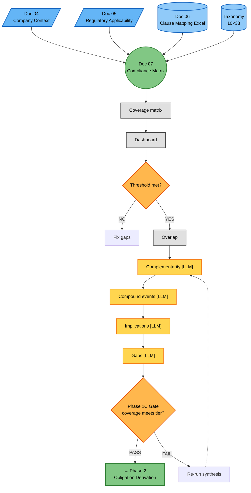
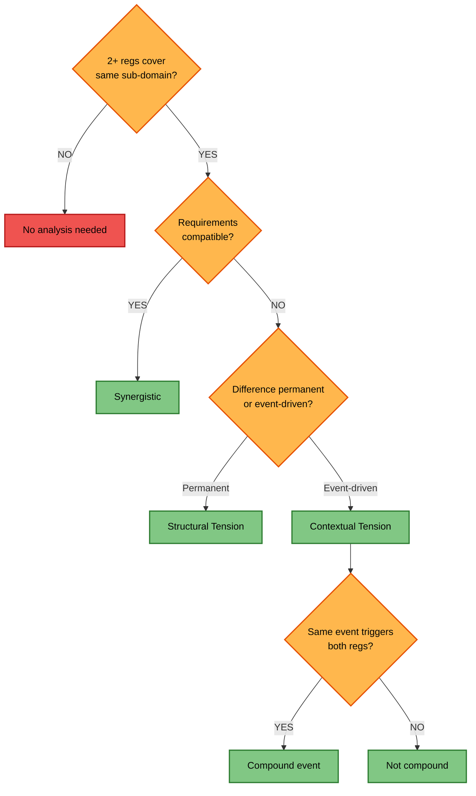

changes: |

# Phase 1C — Consolidation & Synthesis (Detailed Flow)

**Version:** 1.0 — 2026-06-15
**Parent:** [`../phase1_contextual_definition.md`](../phase1_contextual_definition.md) (Phase 1 overview)
**Source of truth:** [`../../../TEMPLATES/07_Structured_Compliance_Matrix.md`](../../../TEMPLATES/07_Structured_Compliance_Matrix.md) — Doc 07 template
**Companion:** [`phase1c_synthesis_reference.md`](phase1c_synthesis_reference.md) — Conflict framework + compound event methodology + tensions catalog

---

## Overview

This diagram expands the **Phase 1C — Consolidation & Synthesis** subgraph from the Phase 1 overview into full granularity. It shows how multiple inputs converge into Doc 07 and how the synthesis engine produces analyses that exist nowhere else in the pipeline.

> **v1.1 addition — Doc 07b.** As of 2026-07, Phase 1C produces a second first-class output: **Doc 07b — Proportionality Profile** (Track B). Doc 07b contains per-sub-domain rows with tier assignment + 5 attributes (satisfaction_pattern, evidence_depth, verification_method, ownership, example_controls) and is validated by **GATE-P** via `01_IMPLEMENTATION_TOOLS/evals/eval_proportionality.py`. Track B is 100% deterministic (no LLM) — it preserves the Regulatory Baseline frozen-objective invariant. See [`./phase1c_proportionality_synthesis.md`](./phase1c_proportionality_synthesis.md) for full detail and a worked example. The case instance is [`../../../../02_CASES/Case_01_TinyTask_SaaS/01_PHASE1_CONTEXT/07b_Proportionality_Profile.md`](../../../../02_CASES/Case_01_TinyTask_SaaS/01_PHASE1_CONTEXT/07b_Proportionality_Profile.md) (31 LIGHTWEIGHT + 5 MINIMAL + 1 DEFERRED across 37 ACTIVE sub-domains).

Phase 1C takes Docs 04 + 05 + 06 (Excel) + Taxonomy + Design Decisions and produces **Doc 07 — Structured Compliance Matrix**. The process has two distinct stages:

1. **Coverage consolidation** (Diagram 1): Build the 38-sub-domain coverage matrix, calculate dashboard metrics, and compute regulatory overlap. Entirely deterministic — pivots and aggregations of Doc 06 data.
2. **Synthesis engine** (Diagram 2): Cross-regulation analysis that produces genuinely new insights — complementarity opportunities, conflict classification, compound event scenarios, strategic implications, and consolidated gaps. This is where the 4 LLM reasoning points live.

**Key difference from Phase 1B:** Phase 1B analyzed each regulation in isolation (per-regulation loop). Phase 1C synthesizes across ALL regulations simultaneously. The complementarity analysis, conflict classification, and compound event scenarios cannot exist in Doc 05 because they require multiple regulations to be analyzed together.

**LLM numbering (v1.2):** Phase 1B uses `P1B-LLM-01-INTERPRETATION` + `P1B-LLM-02-RATIONALE` (per_regulation). Phase 1C uses `P1C-LLM-01-OVERLAP-CLASSIFICATION` (per_domain_lane × 10) + `P1C-LLM-02-COMPOUND-EVENT` + `P1C-LLM-03-STRATEGIC-SYNTHESIS` (both global_reduce). See the Legacy ID Cross-walk for migration from the legacy LLM-A..H labels.

**Why two diagrams:** Diagram 1 shows the **process** (inputs converge → coverage → synthesis → gate) with LLM steps visible so the architecture can be evaluated. Diagram 2 shows the **decision tree** for conflict classification (overlap → compatible/permanent/event-driven) — pure logic, no LLM references. Same structural pattern as Phase 1B.

---

## Diagram 1 — Process (Doc 07)



### Step Reference (Diagram 1)

| Step | Name | Type | Doc 07 Section |
|---|---|---|---|
| C1 | Coverage matrix | Deterministic | §3 |
| C2 | Dashboard | Deterministic | §4 |
| C3 | Overlap | Deterministic | §5.1 |
| E | Complementarity | **P1C-LLM-01-OVERLAP-CLASSIFICATION** (per_domain_lane) | §5.2 + §5.3 |
| F | Compound events | **P1C-LLM-02-COMPOUND-EVENT** (global_reduce, runs 2nd) | §5.4 + §5.5 |
| G | Implications | **P1C-LLM-03-STRATEGIC-SYNTHESIS** (global_reduce, runs 1st) | §6 |
| Gate | Phase 1 gate | Deterministic | §8 |

---

## Diagram 2 — Decision Tree (Conflict Classification)



### Step Reference (Diagram 2)

| Step | Name | Type |
|---|---|---|
| R | Overlap? | Decision |
| Q1 | Compatible? | Decision |
| Q2 | Permanent? | Decision |
| Q3 | Same event? | Decision |
| SYN | Synergistic | Outcome (P1C-LLM-01) |
| STR | Structural Tension | Outcome (P1C-LLM-01) |
| CTX | Contextual Tension | Outcome (P1C-LLM-01) |
| COMP | Compound event | Outcome (P1C-LLM-02) |
| NC | Not compound | Outcome (P1C-LLM-02) |

**Note:** This decision tree shows the classification logic. The LLM steps (E, F) that perform the actual reasoning are in Diagram 1. The taxonomy of conflict types (Synergistic / Structural / Contextual) and tension sub-types is detailed in [`phase1c_synthesis_reference.md`](phase1c_synthesis_reference.md) §1.

---

## LLM Reasoning Annotations

Each LLM node continues the specification series from Phase 1B (LLM-A through LLM-D). Same structure: Purpose, Why LLM, Input, Instructions, KB Required, Output Format, Quality Criteria.

---

### LLM-E: Complementarity + Conflict Classification (Step C2.2)

**Intention:** When two regulations cover the same sub-domain, they can reinforce each other (one implementation satisfies both), they can permanently differ (resolved once at design level), or they can situationally conflict (only when the same event triggers both). Identifying which pattern applies requires semantic comparison of regulatory requirements — not just keyword matching.

| Field | Specification |
|---|---|
| **Purpose** | Identify all complementarity opportunities (where one implementation satisfies multiple regulations) and classify every regulatory overlap as Synergistic, Structural Tension, or Contextual Tension |
| **Why LLM (not deterministic)** | Complementarity requires reasoning about implementation equivalence: "does AES-256 satisfy both GDPR Art. 32 'appropriate measures' AND CRA Art. 13 'secure by default'?" This is semantic, not syntactic. Conflict classification requires understanding whether requirements are permanently incompatible (Structural) or only situationally incompatible (Contextual). A deterministic system can compute overlap % but cannot reason about whether the overlapping requirements are compatible |
| **Input** | (1) Coverage matrix from C1A (2) Overlap calculation from C2.1 (3) Per-regulation analysis from Doc 05 (4) Company context from Doc 04 (5) Company tier |
| **Instructions** | Given the coverage matrix and overlap data, analyze every sub-domain covered by 2+ regulations. For complementarity: identify where a single implementation, control, or process satisfies multiple regulatory requirements simultaneously. For conflict classification: classify each shared sub-domain as Synergistic (requirements reinforce each other — implement highest standard and all are satisfied), Structural Tension (requirements permanently differ in scope, frequency, or depth — resolved once at ISMS design level via unified framework with regulation-specific annexes), or Contextual Tension (requirements may conflict only when the same factual event triggers both — resolved per-event via compound event analysis in LLM-F). For Structural Tensions: specify the design-level resolution approach. For Contextual Tensions: flag for compound event analysis |
| **KB Required** | Coverage matrix + overlap data + regulation texts (full articles) + implementation knowledge base (what controls satisfy which requirements) + conflict taxonomy definitions (see [`phase1c_synthesis_reference.md`](phase1c_synthesis_reference.md) §1) |
| **Output Format** | Two structured lists: complementarity `[{ sub_domain, regulations, type: overlap/reinforcement, description, benefit }]` and conflicts `[{ sub_domain, regulations, classification: synergistic/structural/contextual, description, resolution_approach }]` |
| **Quality Criteria** | Every classification must cite the specific requirement difference between regulations. Synergistic classifications must identify the single implementation that satisfies all. Structural Tensions must have a concrete design-level resolution. Contextual Tensions must be forwarded to LLM-F for compound event analysis. Classification counts should scale with regulatory overlap (see [`phase1c_synthesis_reference.md`](phase1c_synthesis_reference.md) §4) |

---

### LLM-F: Compound Event Identification (Step C2.3)

**Intention:** A compound event is a single factual incident that triggers obligations from multiple regulations simultaneously. These are the source of Contextual Tensions — they do not exist in the regulations themselves but emerge from the interaction between the company's operational profile and regulatory trigger conditions. Identifying compound events (and crucially, identifying events that look compound but are NOT) requires reasoning about real-world incident scenarios mapped to regulatory triggers.

| Field | Specification |
|---|---|
| **Purpose** | Identify factual events that trigger obligations from multiple regulations, classify the resulting tension, specify severity and resolution. Also identify near-miss events that appear compound but are not, and explain why |
| **Why LLM (not deterministic)** | Compound events require predictive reasoning: "if an attacker exploits a vulnerability AND exfiltrates personal data, does this trigger GDPR Art. 33 breach notification AND CRA Art. 14 vulnerability reporting?" This requires understanding both the factual scenario (what happened) and the regulatory trigger conditions (what each regulation requires). A deterministic system cannot reason about hypothetical incident scenarios or determine whether a single event satisfies multiple regulatory triggers |
| **Input** | (1) Contextual Tension sub-domains from LLM-E (2) Company operational profile from Doc 04 (3) Regulation trigger conditions (what events trigger each regulation's obligations) (4) Company tier |
| **Instructions** | Given the Contextual Tension sub-domains, identify factual events that would simultaneously trigger obligations from multiple regulations. For each POSITIVE compound event: (1) describe the event scenario concretely; (2) list which regulations are triggered and cite the specific article that creates the obligation; (3) identify the tension type — TEMPORAL_CONFLICT (different reporting deadlines), REQUIREMENT_CONFLICT (contradictory requirements like erasure vs retention), FREQUENCY_MISMATCH (different assessment frequencies), TRIGGER_MISMATCH (different triggers for similar assessments like DPIA vs FRIA), INTENSITY_GAP (different NI for same sub-domain); (4) assign severity CRITICAL/HIGH/MEDIUM/LOW based on operational impact; (5) specify resolution approach (Max-SLA Routing, Cryptographic Sharding, Unified Assessment, Higher-Bar Compliance — see reference file §2). Also identify events that appear compound but are NOT — for each NEGATIVE example, explain which regulation is triggered and why others are not. Negative examples demonstrate discrimination ability |
| **KB Required** | Regulation trigger conditions (per article) + incident scenario knowledge base + tension taxonomy + resolution pattern catalog (see [`phase1c_synthesis_reference.md`](phase1c_synthesis_reference.md) §2) + company operational profile |
| **Output Format** | Two lists: positive `[{ event_id, description, regulations[], sub_domain, tension_type, severity, resolution }]` and negative `[{ scenario, regulations_checked[], why_not_compound }]` |
| **Quality Criteria** | Every positive event must cite specific articles that create the trigger. Every positive event must have a concrete resolution. Every negative example must clearly explain why only one regulation is triggered. Compound event count should scale with regulatory overlap (2 regs: ~3 events, 4 regs: ~6, 5 regs: ~10). Tension types must follow the 5-type taxonomy (see reference file §2) |

---

### LLM-G: Strategic Implications Synthesis (Step C3.1)

**Intention:** Doc 05 produced per-regulation strategic implications (LLM-C). Doc 07 evolves these into cross-regulation strategic implications that only emerge when regulations are viewed together. "GDPR requires encryption, CRA requires secure-by-default, DORA requires ICT risk management" is three separate observations. "A unified cryptographic architecture with per-service key management satisfies GDPR Art. 32 + CRA Art. 13 + DORA Art. 9 simultaneously, reducing implementation effort by 40%" is a cross-regulation strategic implication that only Doc 07 can produce.

| Field | Specification |
|---|---|
| **Purpose** | Synthesize cross-regulation strategic implications that evolve the preliminary per-regulation analysis from Doc 05 into a consolidated architectural, resource, and risk assessment |
| **Why LLM (not deterministic)** | Strategic implications at Doc 07 level require synthesis across ALL regulations simultaneously. Multi-regulation architectural reasoning ("how do GDPR + CRA + NIS 2 + DORA + AI Act combine to shape the company's security architecture?") is inherently interpretive. Business goal alignment requires connecting regulatory deadlines to company strategy. Resource estimation requires proportional reasoning based on company tier |
| **Input** | (1) Coverage matrix from C1A (2) Complementarity analysis from LLM-E (3) Compound events from LLM-F (4) Per-regulation implications from Doc 05 §7 (5) Company context from Doc 04 (6) Company tier |
| **Instructions** | Given the coverage matrix, complementarity analysis, and compound events, synthesize the top 5-8 cross-regulation strategic implications. For each: (1) describe the cross-regulation implication — must reference 2+ regulations; (2) identify affected sub-domains; (3) estimate architectural impact proportional to company tier (LOW: days/weeks; MEDIUM: weeks/months; HIGH: months/FTE); (4) align with business goals from Doc 04; (5) identify resource implications — personnel (hire/train), process (create/align), tooling (procure/build); (6) assess risk level (regulatory non-compliance, market access, management liability, fundamental rights, operational). Must EVOLVE the per-regulation implications from Doc 05 — do NOT repeat them. Must identify synergies and conflicts that only emerge when regulations are viewed together |
| **KB Required** | Doc 05 per-regulation implications + company context (Doc 04) + security architecture knowledge base + proportional effort guidelines per tier + business goal catalog + risk assessment framework |
| **Output Format** | Structured implications `[{ id, description, affected_sub_domains[], regulations[], architectural_impact, effort_estimate, business_goal_alignment, resource_implications[], risk_level }]` |
| **Quality Criteria** | Must NOT duplicate Doc 05 per-regulation implications — each implication must reference 2+ regulations. Must be proportional to company tier (5-month FTE estimate for 8-person startup is a proportionality failure). Each implication must be actionable. Must include resource implications (not just "be compliant"). Must align with at least one business goal from Doc 04 |

---

### ~~LLM-H: Gap Aggregation + Remediation (Step C3.2)~~ — REMOVED in v1.2

> **This section is deprecated.** Gap aggregation + remediation was removed from Phase 1 in v1.2 (per `PHASE1_STRATEGY.md`: Phase 1 produces a Scope Declaration, NOT a remediation plan). Compound risk scoring, severity assignment, and tier-proportional remediation are **Phase 2/3 territory** (after obligation derivation and before architectural decomposition).
>
> **Migration:** Per-regulation gaps are still produced by `P1B-LLM-02-RATIONALE` (Doc 05 §3 synthesis.gaps[]). Cross-regulation gap aggregation moves to Phase 2B (tensions analysis) and Phase 3A (compliance gates).

---

### ~LLM-H spec table (PRESERVED FOR HISTORICAL REFERENCE — NOT INVOKED)~

The legacy LLM-H spec table is preserved below only as historical record. **It is NOT to be invoked in v1.2.**

| Field | Specification |
|---|---|
| **Purpose** | (LEGACY) Aggregate per-regulation gaps from Doc 05 into a consolidated gap analysis with compound risk scoring, severity assignment, and tier-proportional remediation recommendations |
| **Why LLM (not deterministic)** | (LEGACY) Gap aggregation requires reasoning about which gaps compound across regulations |
| **Input** | (LEGACY) Per-regulation gaps from Doc 05 §8 + coverage matrix NOT_ADDRESSED entries + company context + tier |
| **Output Format** | (LEGACY) Structured gap list `[{ gap_id, sub_domain, missing_regs[], compound_risk, severity, remediation, owner, gap_type: regulatory/security }]` |
| **Quality Criteria** | (LEGACY) Must aggregate across ALL regulations. Must be proportional to company tier. Must distinguish regulatory gaps from security gaps. |

> **Replacement:** Phase 1B's `P1B-LLM-02-RATIONALE` produces per-regulation `synthesis.gaps[]` in Doc 05 (with `gap_id, sub_domain_id, coverage_level, risk_description, covered_by_other_reg, recommendation, priority`). Track B's Doc 07b deterministically assigns priority via `tier` per sub-domain. The legacy C3.2 aggregation step is no longer called.

---

### LLM vs Determinatic Classification Summary

| Step | Type | Why |
|---|---|---|
| C1A: Coverage Matrix | Deterministic | Pivot of Doc 06 data (count, classify, assign NI) |
| C1B: Dashboard | Deterministic | COUNTIF/AVERAGE formulas on coverage matrix |
| C2.1: Overlap Calculation | Deterministic | Set intersection per regulation pair |
| **C2.2: Complementarity + Conflict** | **P1C-LLM-01-OVERLAP-CLASSIFICATION** (per_domain_lane) | Activates Regulatory Baseline CONDITIONAL entries per domain (no re-classification) |
| **C2.3: Compound Events** | **P1C-LLM-02-COMPOUND-EVENT** (global_reduce) | Cross-domain compound event identification |
| **C3.1: Strategic Implications** | **P1C-LLM-03-STRATEGIC-SYNTHESIS** (global_reduce) | Cross-lane strategic synthesis (consumes Doc 07b) |
| **C3.2: Gap Aggregation** | (REMOVED in v1.2) | Out of Phase 1 scope (per `PHASE1_STRATEGY.md`) |
| Gate | Deterministic | Checklist verification against tier thresholds |

---

## Doc 05 to Doc 07 Evolution

This table shows how preliminary per-regulation analysis (Doc 05) evolves into cross-regulation synthesis (Doc 07):

| Analysis | Doc 05 (preliminary, per-regulation) | Evolution Step | Doc 07 (final, cross-regulation) |
|---|---|---|---|
| **Coverage** | §6: YES/NO simple per regulation | C1A pivot | §3: Full matrix WITH NI weights + §4 Dashboard |
| **Strategic Implications** | §7: 3-5 per regulation (legacy LLM-C) | P1C-LLM-03 synthesizes | §6: 5-8 cross-regulation implications with resource + risk |
| **Gaps** | §8: Per regulation (legacy LLM-D) | (REMOVED — out of Phase 1 scope) | (Phase 2/3 territory) |
| **Complementarity** | Not present | P1C-LLM-01 activates | §5.2 + §5.3: NEW analysis |
| **Compound Events** | Not present | P1C-LLM-02 creates | §5.4 + §5.5: NEW analysis |
| **Perspective** | Single regulation in isolation | — | All regulations together |

---

## Conflict Types Quick Reference

Three classification types for regulatory overlaps. Full framework with criteria, examples, and resolution patterns in [`phase1c_synthesis_reference.md`](phase1c_synthesis_reference.md) §1.

| Type | Definition | Resolution | When Resolved |
|---|---|---|---|
| **Synergistic** | 2+ regulations reinforce each other with compatible requirements | Implement highest standard — satisfies all | Once, at design level |
| **Structural Tension** | 2+ regulations permanently differ in scope, frequency, or depth | Unified framework with regulation-specific annexes | Once, at ISMS design level |
| **Contextual Tension** | 2+ regulations may conflict only when same factual event triggers both | Per-event resolution (Max-SLA, Cryptographic Sharding, etc.) | Per-event, when compound event occurs |

---

## Compound Event Scaling

| Metric | Case 01 (2 regs) | Case 02 (4 regs) | Case 03 (5 regs) |
|---|---|---|---|
| Overlap pairs | 1 | 6 | 10 |
| Avg regs/sub-domain | 1.4 | 3.2 | 3.7 |
| Compound events (positive) | 3 | 6 | 10 |
| Negative examples | 3 | 4 | 4 |
| Strategic tensions | 1 | 3 | 4 (2 CRITICAL) |
| Max regs in single event | 2 | 4 | 5 |

**Scaling formula:** Overlap pairs = C(N, 2) where N = applicable regulations. Compound events grow approximately linearly with pairs (not combinatorially) because most overlaps are Synergistic or Structural, not Contextual.

---

## Gate Criteria by Tier

The Phase 1C gate verifies completeness before allowing progression to Phase 2:

| Criterion | LOW (1-2 regs) | MEDIUM (3-4 regs) | HIGH (5 regs) |
|---|---|---|---|
| Doc 04 Company Profile complete | Required | Required | Required |
| Doc 05 Applicable regulations determined | Required | Required | Required |
| Doc 06 Clause mapping complete | Required | All applicable clauses | 100% applicable clauses |
| Doc 07 Coverage % | >= 60% | >= 75% | >= 80% |
| Doc 07 Complementarity analysis | Required | Required | Required |
| Doc 07 Strategic implications | Required | Required | Required |
| Doc 07 Gaps identified + prioritized | Required | Required | Required |
| Design decisions logged (Doc 03) | Required | Required | Required (13+ decisions) |
| Role Matrix (Doc 04 §10) | Optional | Required | Required |
| No placeholder values | Recommended | Required | Required |
| **Doc 07b Proportionality Profile (GATE-P)** | **Required** | **Required** | **Required** |

- **GATE-P (Doc 07b):** validates per-sub-domain tier assignment + 5-attribute completeness + Rule 11 critical-overload. Detail in [`./phase1c_proportionality_synthesis.md`](./phase1c_proportionality_synthesis.md).

If the gate fails, the synthesis engine is re-evaluated (see FIX loop in Diagram 2).

---

## Phase 2 Handoff — 9 Artifacts

Doc 07 passes 9 artifacts to Phase 2 (Obligation Derivation):

| # | Artifact | Source | Purpose in Phase 2 |
|---|---|---|---|
| 1 | Applicable Regulations | Doc 05 / Doc 07 §2 | Filter — only applicable regulations generate obligations |
| 2 | Sub-Domain Coverage Matrix | Doc 07 §3 | Rules Catalog organization — rules grouped by sub-domain |
| 3 | Clause Mapping | Doc 06 (Excel) | AbstractNFR derivation — each clause maps to 1+ NFRs |
| 4 | Strategic Implications | Doc 07 §6 | Strategic Tension detection — tensions from overlapping requirements |
| 5 | Identified Gaps | Doc 07 §7 | Priority input — gaps become mandatory rules in Phase 2 |
| 6 | Complementarity Analysis | Doc 07 §5 | Efficiency — overlapping requirements satisfied with single rules |
| 7 | Compliance Capability Assessment | Doc 04 §9 | Baseline for obligation maturity assessment |
| 8 | Role Matrix | Doc 04 §10 | Determine obligations per role — Native vs Inherited |
| 9 | Regulatory Interactions | Doc 04 §11 | Strategic Tension detection — temporal conflicts, trigger mismatches |

---

## Cross-Case Comparison Through Phase 1C

| Dimension | Case 01 (TinyTask) | Case 02 (SecureBorder) | Case 03 (OmniBank) |
|---|---|---|---|
| **Regs applicable** | GDPR, CRA (2) | GDPR, CRA, NIS 2, AI Act (4) | All 5 |
| **Coverage %** | 92.1% | 92.1% | 100% |
| **Substantive (2+ regs)** | 16 | 24 | 32 |
| **Partial (1 reg)** | 19 | 11 | 4 |
| **Not addressed** | 3 | 3 | 0 |
| **Total clauses** | 54 | 112 | 150 |
| **Avg NI** | 2.947 | 2.8 | 2.8 |
| **Overlap pairs** | 1 | 6 | 10 |
| **Synergistic sub-domains** | ~15 | ~18 | ~20 |
| **Structural tensions** | ~2 | ~6 | ~8 |
| **Contextual tensions** | 1 | 1 | 1 |
| **Compound events** | 3 | 6 | 10 |
| **Strategic tensions** | 1 | 3 | 4 |
| **CRITICAL tensions** | 0 | 1 | 2 |
| **Sole-authority sub-domains** | 3 | 0 | 0 |
| **Phase 2 artifacts** | 5 | 7 | 9 |
| **Gate result** | PASS | PASS | PASS |

**Key observation:** Contextual Tensions remain at 1 across all cases — only D-04.3 (incident notification) produces contextual tension at scale. Most 5-regulation overlaps are Synergistic or Structural. The combinatorial explosion is in Synergistic overlaps (more regs = more synergies to exploit), not in conflicts.

---

## Relationship to Parent Diagram

This detailed flow is a **zoom-in** of the Phase 1C subgraph in [`../phase1_contextual_definition.md`](../phase1_contextual_definition.md):

```
Parent diagram (overview):

    subgraph P1C["Phase 1C — Consolidation & Synthesis"]
        D04 --> D07
        D05 --> D07
        XLS --> D07
        D07 --> COV --> DASH --> SYN --> STRAT --> GAPS --> GATE
    end

                     expanded to

This file (detail):

    Diagram 1 (process): 5 inputs → D07 → coverage matrix → dashboard
                         → overlap → P1C-LLM-01/02/03 synthesis → Gate → Phase 2
    Diagram 2 (decision tree): Overlap? → Compatible? → Permanent?
                               → Same event? → Synergistic / Structural / Contextual
```

The parent shows Phase 1C as a linear pipeline (COV → DASH → SYN → STRAT → GAPS → GATE). This file expands it to show:
- The 5-input convergence into D07
- The deterministic coverage pipeline (Diagram 1)
- The 4-step LLM synthesis chain (Diagram 2)
- The evolution arrows from Doc 05 preliminary analysis
- The 9-artifact Phase 2 handoff

---

### Colour Note

Uses the same high-contrast palette as Phase 1A and 1B:

| Colour | Meaning | Hex |
|---|---|---|
| Blue (#64B5F6) | Input | — |
| Light Blue (#90CAF9) | Static reference | — |
| Grey (#E0E0E0) | Deterministic process | — |
| **Amber (#FFD54F)** | **LLM reasoning** | **P1C-LLM-01 / P1C-LLM-02 / P1C-LLM-03** |
| Orange (#FFB74D) | Decision / gate | — |
| Green (#81C784) | Output / consolidation | — |
| Purple (#BA68C8) | Phase transition | — |

---

**See also:**
- [`phase1c_synthesis_reference.md`](phase1c_synthesis_reference.md) — Conflict framework + compound event methodology + tensions catalog (companion)
- [`./phase1c_proportionality_synthesis.md`](./phase1c_proportionality_synthesis.md) — Track B proportionality + GATE-P criteria (Doc 07b detail, introduced v1.1)
- [`./filter2_domain_relevance.md`](./filter2_domain_relevance.md) — Filter 2 (Domain Relevance) detail (introduced v1.1)
- [`./subdomain_lanes.md`](./subdomain_lanes.md) — Per-sub-domain lanes architecture (introduced v1.1)
- [`phase1b_regulatory_mapping.md`](phase1b_regulatory_mapping.md) — Phase 1B detail (predecessor, P1B-LLM-01/02)
- [`phase1b_nuances_and_reasoning.md`](phase1b_nuances_and_reasoning.md) — Phase 1B reference (Doc 05 vs Doc 07 analysis)
- [`phase1a_context_capture.md`](phase1a_context_capture.md) — Phase 1A detail (predecessor)
- [`../phase1_contextual_definition.md`](../phase1_contextual_definition.md) — Phase 1 overview (parent)
- [`../../../TEMPLATES/07_Structured_Compliance_Matrix.md`](../../../TEMPLATES/07_Structured_Compliance_Matrix.md) — Doc 07 template
- [`../../PROMPTS/P1C-LLM-01-OVERLAP-CLASSIFICATION.md`](../../PROMPTS/P1C-LLM-01-OVERLAP-CLASSIFICATION.md) — Prompt template (canonical, v1.2)
- [`../../PROMPTS/P1C-LLM-02-COMPOUND-EVENT.md`](../../PROMPTS/P1C-LLM-02-COMPOUND-EVENT.md) — Prompt template (canonical, v1.2)
- [`../../PROMPTS/P1C-LLM-03-STRATEGIC-SYNTHESIS.md`](../../PROMPTS/P1C-LLM-03-STRATEGIC-SYNTHESIS.md) — Prompt template (canonical, v1.2)
- [`../../../PREPROCESSING/SubDomains/index.md`](../../../PREPROCESSING/SubDomains/index.md) — Regulatory Baseline source (canonical)

---

## Legacy ID Cross-walk (v1.2, 2026-07-13)

| Legacy | Canonical | Invocation | Stage | Function |
|---|---|---|---|---|
| LLM-E | `P1C-LLM-01-OVERLAP-CLASSIFICATION` | per_domain_lane | Map (per-domain) | Activates Regulatory Baseline CONDITIONAL entries per domain. **NO re-classification** of frozen Regulatory Baseline relationships. |
| LLM-F | `P1C-LLM-02-COMPOUND-EVENT` | global_reduce | Reduce (runs 2nd) | Identifies cross-domain compound events. **NO resolution design** — resolution goes to Phase 2B. |
| LLM-G | `P1C-LLM-03-STRATEGIC-SYNTHESIS` | global_reduce | Reduce (runs 1st) | Cross-lane strategic implications. Consumes Doc 07b (deterministic) as constraint. |
| LLM-H | (REMOVED) | — | — | Gap aggregation + remediation moved out of Phase 1 scope (per `PHASE1_STRATEGY.md`). |

**Regulatory Baseline read-only invariant (v1.2):** `P1C-LLM-01` does **NOT** reclassify Regulatory Baseline relationships. It only **activates** Regulatory Baseline CONDITIONAL entries (`SubDomains/D-XX.Y.md §1 CRDA`) based on company facts from Doc 04. The CRDA → CRDA-deep authority chain is:

1. `REGULATORY_BASELINE.md` — architectural contract (frozen)
2. `PREPROCESSING/SubDomains/D-XX.Y.md` — Phase 1 consumption package
3. `PREPROCESSING/CrossRegulation/DeepAnalysis/D-XX.Y.md` — OJ-verified evidence
4. `PREPROCESSING/CrossRegulation/DomainAnalysis/D-XX.Y.md` — lighter overview

**Reduce stage execution order (v1.2):** P1C-LLM-03 (strategic) runs **first** (consumes Doc 07b deterministic tier assignments); P1C-LLM-02 (compound events) runs **second** (consumes LLM-03 strategic output + aggregated activations). This order prevents the more complex synthesis from being drowned by event-level reasoning.

Total: 8 → 5 LLMs across Phase 1 (-37.5%).
