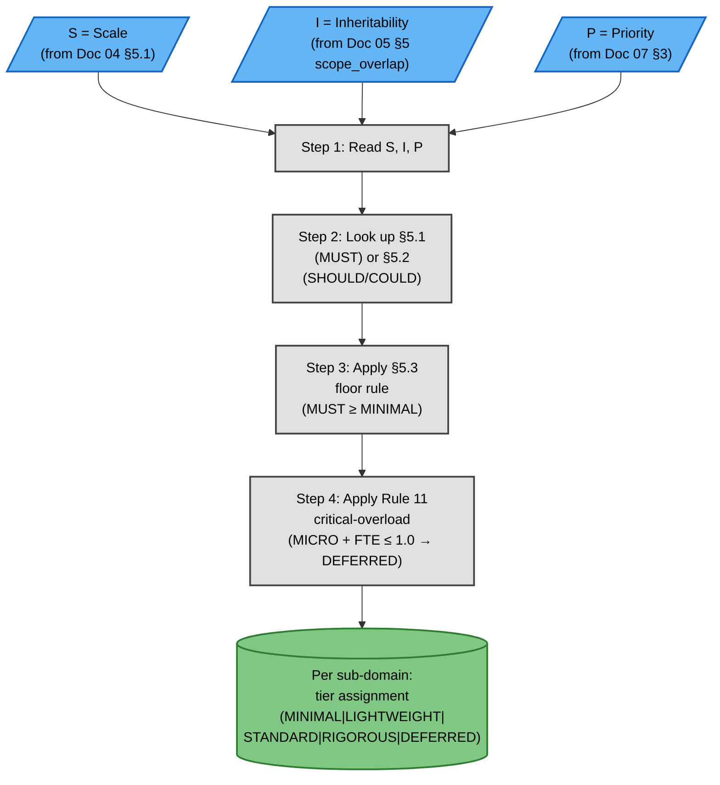
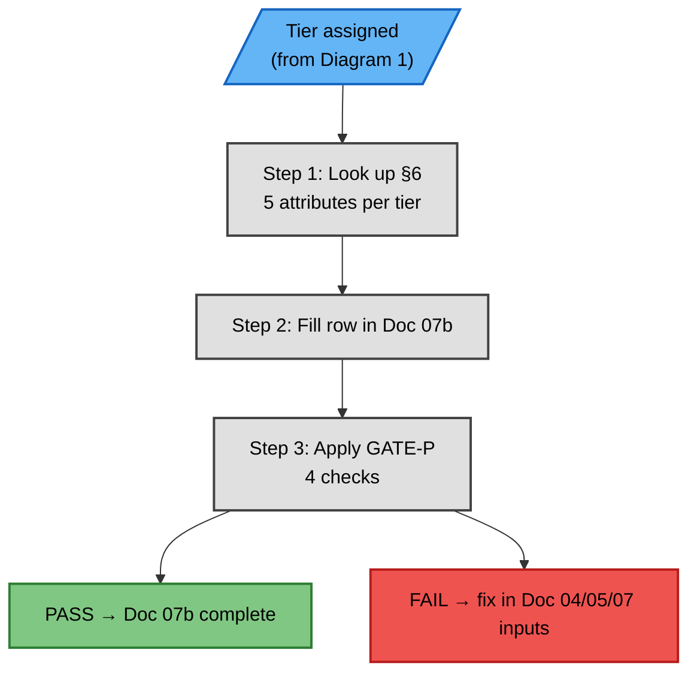

# Phase 1C — Track B Proportionality Synthesis (Detailed Flow)

## Overview

Track B applies a table-driven proportionality model to every ACTIVE sub-domain in Phase 1C. It reads company scale (`S`), inheritability (`I`), and priority (`P`), assigns a bounded tier, enumerates the five operational attributes for that tier, and records the result in Doc 07b.

The regulatory `fit_criterion` and the security objective (HSO) are never modified by Track B. Track B varies only `satisfaction_pattern`, `evidence_depth`, and `ownership`; `verification_method` and `example_controls` are deterministic enumerations associated with the assigned tier. The entire Track B path is 100% deterministic and contains zero LLM nodes.

## Why 100% deterministic

- **Regulatory Baseline invariant preservation:** No interpretation step can lower the regulatory floor or modify the frozen `fit_criterion` or HSO.
- **Reproducibility:** The same inputs always produce the same outputs, with no LLM drift between runs.
- **Auditability:** Every tier assignment is traceable to the decision tables in Track B §5.
- **Speed:** No LLM latency is introduced into the Phase 1C critical path.
- **Cross-case comparability:** Case 01, Case 02, and Case 03 use exactly the same decision logic.

## Diagram 1 — Process (Track B Decision Table Application)

This process is fully deterministic and contains no LLM nodes.



## Diagram 2 — Process (5-Attribute Enumeration per Tier)

This enumeration and gate path is fully deterministic and contains no LLM nodes.



## Table 1 — Scale (`S`) input: Doc 04 §5.1

| Scale  | Employees                        | Revenue |
|--------|----------------------------------|---------|
| MICRO  | ≤10                              | <€2M    |
| SMALL  | ≤50                              | <€10M   |
| MEDIUM | ≤250                             | <€50M   |
| LARGE  | >250                             | ≥€50M   |
| MAX    | multinational / regulated entity | n/a     |

## Table 2 — Inheritability (`I`) input: Doc 05 §5

| scope_overlap      | inheritability | Rationale                      |
|--------------------|----------------|--------------------------------|
| Y or Conditional Y | BUILD_REQUIRED | Company must implement         |
| N                  | INHERITABLE    | Third-party bears baseline     |

## Table 3 — Priority (`P`) input: Doc 07 §3

| Priority | Meaning                         |
|----------|---------------------------------|
| MUST     | Mandatory; never below MINIMAL  |
| SHOULD   | Recommended; drop one tier      |
| COULD    | Best practice; drop one tier    |

## Table 4 — §5.1 decision table (`MUST`)

| S \ I  | INHERITABLE | BUILD_REQUIRED |
|--------|-------------|----------------|
| MICRO  | MINIMAL     | LIGHTWEIGHT    |
| SMALL  | LIGHTWEIGHT | STANDARD       |
| MEDIUM | LIGHTWEIGHT | STANDARD       |
| LARGE  | STANDARD    | RIGOROUS       |
| MAX    | STANDARD    | RIGOROUS       |

## Table 5 — §5.2 decision table (`SHOULD` / `COULD`)

| Condition                              | Deterministic application                         |
|----------------------------------------|---------------------------------------------------|
| Priority is SHOULD or COULD            | Drop one tier compared with the §5.1 MUST result  |
| `S = MICRO` and `security_FTE ≤ 1.0`   | Assign `DEFERRED`                                 |

## Table 6 — §5.3 floor rule

| Constraint  | Deterministic effect                              |
|-------------|---------------------------------------------------|
| MUST floor  | A MUST requirement never goes below MINIMAL       |
| DEFERRED    | Applies only to SHOULD or COULD requirements      |

## Table 7 — Five attributes per tier (§6)

| Tier        | satisfaction_pattern                     | evidence_depth                                         | verification_method             | ownership                    | example_controls                 |
|-------------|------------------------------------------|--------------------------------------------------------|---------------------------------|------------------------------|----------------------------------|
| MINIMAL     | INHERIT                                  | Supplier attestation + 1-page internal statement       | INSPECT                         | Supplier                     | SOC 2 / ISO 27001 on file        |
| LIGHTWEIGHT | BUY_MANAGED                              | Managed-service config + annual review                 | DEMONSTRATE + INSPECT           | Shared                       | AWS KMS, Firebase MFA            |
| STANDARD    | BUILD_LIGHT or BUY with owned governance | Dedicated tooling + quarterly test                     | TEST + DEMONSTRATE              | Company with named owner     | SIEM, SAST in CI                 |
| RIGOROUS    | BUILD_FULL                               | Enterprise tooling + continuous audit + external cert  | TEST + ANALYZE + external audit | Company + external auditor   | HSM-backed KMS, ISO 27001        |
| DEFERRED    | —                                        | —                                                      | —                               | —                            | —                                |

## Table 8 — GATE-P criteria

| Check | Criterion                                                                               |
|-------|-----------------------------------------------------------------------------------------|
| 1     | Doc 07b exists                                                                          |
| 2     | Every ACTIVE sub-domain has a tier assigned                                             |
| 3     | Five attributes are non-empty for every assigned row; `—` is accepted for DEFERRED rows |
| 4     | Rule 11 critical-overload is satisfied                                                  |

## Table 9 — Worked example: D-04.3 Regulatory Notification, TinyTask

| Input                | Value                                                 |
|----------------------|-------------------------------------------------------|
| HSO (frozen)         | Notify regulator within applicable timeline           |
| S                    | MICRO (8 emp, <€2M)                                   |
| I                    | BUILD_REQUIRED                                        |
| P                    | MUST                                                  |
| Tier                 | LIGHTWEIGHT                                           |
| satisfaction_pattern | BUY_MANAGED                                           |
| evidence_depth       | Managed-service config + annual review                |
| verification_method  | DEMONSTRATE + INSPECT                                 |
| ownership            | Company (with possible shared if MSSP)                |
| example_controls     | 24h internal notification (covers GDPR 72h + CRA 24h) |

## Table 10 — Critical-overload Rule 11

```text
SHOULDs_at_LIGHTWEIGHT × 8h ≤ security_FTE × 40h × 0.3
```

| Worked case | security_FTE | SHOULDs at LIGHTWEIGHT | Deterministic result         | Overload status |
|-------------|--------------|------------------------|------------------------------|-----------------|
| TinyTask    | 0.85         | 1 (D-02.4)             | D-02.4 assigned DEFERRED     | No overload     |

## See also

- Parent: [`./phase1_contextual_definition.md`](./phase1_contextual_definition.md)
- Companion (Doc 07): [`./phase1c_synthesis.md`](./phase1c_synthesis.md)
- Reference: [`./phase1c_synthesis_reference.md`](./phase1c_synthesis_reference.md)
- Filter 2 detail: [`./filter2_domain_relevance.md`](./filter2_domain_relevance.md)
- Per-sub-domain lanes: [`./subdomain_lanes.md`](./subdomain_lanes.md)
- Track B spec: [`../../../REFERENCE/proportionality_model.md`](../../../REFERENCE/proportionality_model.md)
- Case instance: [`../../../../02_CASES/Case_01_TinyTask_SaaS/01_PHASE1_CONTEXT/07b_Proportionality_Profile.md`](../../../../02_CASES/Case_01_TinyTask_SaaS/01_PHASE1_CONTEXT/07b_Proportionality_Profile.md)
- GATE-P evaluator: [`01_IMPLEMENTATION_TOOLS/evals/eval_proportionality.py`](../../../../01_IMPLEMENTATION_TOOLS/evals/eval_proportionality.py)
- Phase 1 strategy: [`../../../PHASE1_STRATEGY.md`](../../../PHASE1_STRATEGY.md)

## Version History

| Version | Date       | Changes                                                                                 |
|---------|------------|-----------------------------------------------------------------------------------------|
| 1.0     | 2026-07-13 | Initial release — Track B proportionality detail introduced in Phase 1 v1.1             |
