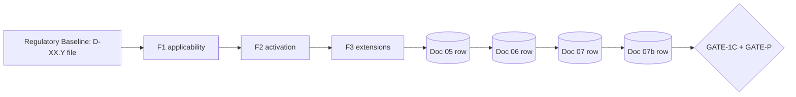

# Sub-domain Lanes — Independent Generation Architecture

## 1. Concept

A **sub-domain lane** is an isolated generation pipeline that produces all Phase 1 outputs for a single security sub-domain (D-XX.Y) — from the Regulatory Baseline source file through Doc 05/06/07/07b rows and ending at GATE-1C + GATE-P. AEGIS Phase 1 v1.1 (2026-07-13) introduces lanes as the unit of decomposition: instead of treating all 38 sub-domains as a single Phase 1 workload, the methodology treats each as an independent generation unit that can be processed concurrently and assigned a single owner.

Separation matters because it enables two structural properties. **Parallelization**: 38 independent lanes can be processed concurrently by different agents, multiplying effective throughput without coupling outputs. **Ownership**: each sub-domain has a clear owner throughout Phase 1, so the same agent follows D-XX.Y from Regulatory Baseline lookup to GATE-P validation, preserving consistency of decisions and avoiding hand-off loss.

The **cut point** is GATE-P — the Phase 1 exit gate. Within Phase 1, lanes are independent at generation time but converge at synchronization points (Doc 07, Doc 07b, GATE-1C, GATE-P). After Phase 1 exit, sub-domains **lose their independence**: Phase 2B detects compound events across sub-domain boundaries (tensions), and Phase 3 organizes architectural nodes (e.g., a shared KMS linking D-01.1 + D-01.3). The cut at GATE-P is therefore deliberate: it preserves lane independence exactly long enough to deliver clean per-sub-domain outputs, then surrenders independence to enable cross-sub-domain reasoning.

## 2. Lane Anatomy

Each of 38 sub-domains has one such lane. Lanes are independent in generation; convergence happens at Doc 07, Doc 07b, and the gates.

The lane has **9 nodes**:

| # | Node | Type | Role |
|---|------|------|------|
| 1 | Regulatory Baseline (D-XX.Y file) | Source | Frozen, read-only input |
| 2 | F1 applicability | Filter 1 | Deterministic check vs company profile |
| 3 | F2 activation | Filter 2 | Deterministic scope_overlap computation |
| 4 | F3 extensions | Filter 3 | Deterministic block trigger evaluation |
| 5 | Doc 05 row | Artifact | Per-sub-domain applicability declaration |
| 6 | Doc 06 row | Artifact | Per-sub-domain clause mapping |
| 7 | Doc 07 row | Artifact | Per-sub-domain regulatory assignment |
| 8 | Doc 07b row | Artifact | Per-sub-domain Track B profile (tier + 5 attrs) |
| 9 | GATE-1C + GATE-P | Convergence | Cross-lane validation gates |

## 3. Lane × Stage Matrix

All active sub-domains traverse all stages. The ✓ marks only indicate the lane participated; actual content depends on per-sub-domain Regulatory Baseline data.

| Sub-domain           | F1 | F2 | F3 | D05 | D06 | D07 | D07b | GATE-1C | GATE-P |
|----------------------|----|----|----|-----|-----|-----|------|---------|--------|
| D-01.1 Data at Rest  | ✓  | ✓  | ✓  | ✓   | ✓   | ✓   | ✓    | ✓       | ✓      |
| D-01.2 Data in Transit | ✓  | ✓  | ✓  | ✓   | ✓   | ✓   | ✓    | ✓       | ✓      |
| D-04.3 Cryptography  | ✓  | ✓  | ✓  | ✓   | ✓   | ✓   | ✓    | ✓       | ✓      |
| D-09.2 Incident Mgmt | ✓  | ✓  | ✓  | ✓   | ✓   | ✓   | ✓    | ✓       | ✓      |
| D-10.2 Cloud Sec     | ✓  | ✓  | ✓  | ✓   | ✓   | ✓   | ✓    | ✓       | ✓      |

All 38 sub-domains follow the same 9-node topology; the matrix is uniform across the population. Per-sub-domain variation lives **inside** each node (e.g., which regs are applicable at F1, which clauses map at Doc 06) — not in which nodes exist.

## 4. Ownership Model

The same owner follows the sub-domain from F1 to GATE-P for consistency. This avoids the hand-off loss that would occur if F1, F2, F3, and Doc 05–07b were each owned by different agents.

| Role | Responsibility | Tools |
|------|----------------|-------|
| Lane Executor | Generates Doc 04/05/07/07b rows for the sub-domain | LLM agent + Regulatory Baseline lookup |
| Lane Validator | Verifies row against criteria (completeness, consistency, Rule 11) | Deterministic rules + spot-check LLM |
| Cross-lane Orchestrator | Synchronizes all lanes, owns GATE-1C + GATE-P | workflow_gate.py + dependency_graph.yaml |

**Selection criterion**: the Lane Executor for a sub-domain must have access to the Regulatory Baseline file and to a deterministic evaluator for that sub-domain's filters. The Lane Validator must be independent of the Executor (different agent instance or different model checkpoint — no self-evaluation per AGENTS.md Design Philosophy).

The Cross-lane Orchestrator does **not** own sub-domain content; it only orchestrates synchronization points and gate evaluations. Sub-domain content remains the Executor's responsibility, even after convergence.

## 5. Synchronization Rules

Synchronization points are where lanes are required to agree. At all other stages, lanes run independently.

| Stage | Synchronization | What is shared |
|-------|-----------------|----------------|
| F1 exit (GATE-1A) | All lanes report `applicable_regs` consistently | `applicable_regs` set |
| F2 exit (GATE-1B) | All lanes report `scope_overlap` consistently | `scope_overlap` matrix |
| F3 exit | All lanes declare block triggers activated | `block_activations` set |
| Doc 06 generation | All lanes have clause mapping complete | `Doc 06 Excel` |
| Doc 07 generation | All lanes have priority assigned | `priority` per sub-domain |
| Doc 07b generation | All lanes have tier + 5 attrs | Track B profile |
| GATE-1C | All lanes pass coverage threshold | Coverage matrix |
| GATE-P | All lanes satisfy proportionality | Doc 07b |

A synchronization fails if any one lane disagrees with the consensus at the shared artifact. For deterministic artifacts (`applicable_regs`, `scope_overlap`, `block_activations`), disagreements indicate a bug in one of the lanes and trigger re-execution of the offending lane. For LLM-generated artifacts (Doc 06, Doc 07, Doc 07b), disagreements trigger Validator arbitration (independent agent per AGENTS.md Design Philosophy).

## 6. Independence Boundaries

### INDEPENDENT per lane

- Regulatory Baseline file (`SubDomains/D-XX.Y.md`) — frozen, read-only
- F1 applicability check for sub-domain's regs — deterministic
- F2 scope_overlap computation — deterministic
- F3 block activation for sub-domain's triggers — deterministic
- Doc 05/06/07 rows for this sub-domain
- Doc 07b row for this sub-domain (Track B tier + 5 attrs)

These artifacts are generated by **one** lane and consumed by **one** lane. No cross-lane read or write occurs at these points. This is what makes parallel execution safe: lanes cannot step on each other because they touch disjoint inputs.

### CROSS-LANE (synchronization points)

- `applicable_regs` (consensus across all lanes for the same regulation)
- Block activation consistency
- Doc 07 aggregation (cross-reg complementarity)
- Doc 07b aggregation (overall Track B profile, Rule 11)
- GATE-1C (all lanes must pass)
- GATE-P (all lanes must pass)

These are **read-many, write-one**: the Cross-lane Orchestrator writes the consensus artifact after aggregating all lane inputs, and downstream consumers (Phase 2, Phase 3) read from the consensus, not from any individual lane.

## 7. Cross-domain Implications AFTER Phase 1 Exit

This is **outside Phase 1 scope** but explains why the cut is at Phase 1 exit.

After GATE-P passes, the lane model dissolves. Sub-domains lose their independence and acquire cross-domain obligations:

- **Phase 2B — Compound events**: detects tensions across sub-domain boundaries (e.g., a logging sub-domain D-08.1 demands retention that conflicts with D-01.1's data minimization requirement). These cross-domain tensions cannot be detected inside a single lane; they require cross-lane state.

- **Phase 3 — Architectural nodes**: may span multiple sub-domains (e.g., a shared KMS serving D-01.1 Data at Rest, D-01.3 Key Management, and D-04.3 Cryptography). Architectural consolidation deliberately violates the lane separation, because one KMS control satisfies three sub-domains simultaneously.

The cut at GATE-P is therefore a **deliberate phase boundary**, not an arbitrary point. Phase 1 outputs are clean per-sub-domain (one owner, one lane, deterministic where possible), and Phase 2/3 outputs are cross-sub-domain (multi-owner, cross-cutting, partly non-deterministic).

---

## See also

- `./phase1_contextual_definition.md` — Phase 1 overview (v1.1)
- `./filter1_applicability.md` — conceptual Filter 1 (current detail in phase1a)
- `./filter2_domain_relevance.md` — Filter 2 detail
- `./phase1c_synthesis.md` — Phase 1C Doc 07
- `./phase1c_proportionality_synthesis.md` — Track B Doc 07b + GATE-P
- `../../../PHASE1_STRATEGY.md` — 3-filter model
- `../../../REGULATORY_BASELINE.md` — Regulatory Baseline contract

## Version History

| Version | Date       | Changes                                                                             |
|---------|------------|-------------------------------------------------------------------------------------|
| 1.0     | 2026-07-13 | Initial release — sub-domain lanes concept introduced in Phase 1 v1.1               |
