# Phase 2 — Elaboration & Secure Design (Flow Diagram)

**Version:** 1.0 — 2026-06-16
**Status:** ✅ Created
**Companion:** [`../Class_Models/phase2_elaboration_secure_design.md`](../Class_Models/phase2_elaboration_secure_design.md) (static structure)

---

## Overview

This flow diagram shows the **process** of running Phase 2 of the AEGIS methodology — from the 9 artifacts passed forward by Phase 1 to the final Rules Catalog (Doc 11 + Excel 12) that feeds Phase 3. It is the dynamic counterpart to the class diagram, which shows the entities but not the sequence.

Unlike Phase 1 (which was a linear pipeline 04→05→06→07), Phase 2 has a **fork-join topology**: Doc 08 (Obligation Derivation) feeds BOTH Doc 09 (Strategic Tensions) AND Doc 10 (Goals) in parallel. Doc 11 (Rules Catalog) is the convergence point where all prior outputs are consolidated into testable rules.

Phase 2 has three internal stages with different natures:

| Stage | What happens | Nature |
|-------|-------------|--------|
| **2A — Obligation Derivation** | Filter clauses by applicable regulations, group into obligations by sub-domain, propagate NI, assign types/actors/activation | Transformation (deterministic-heavy, LLM for grouping) |
| **2B — Strategic Tensions** | Pairwise comparison of obligations, detect conflicts, classify (7 types × structural/contextual), design resolutions (7 patterns) | Reasoning (LLM-heavy) |
| **2C — Goals & Rules** | Derive privacy/security goals from obligations, resolve privacy↔security conflicts, consolidate into testable rules, add best-practice rules, generate Excel | Operationalization (mixed deterministic + LLM) |

---

## Main Flow Diagram

```mermaid
flowchart TD
    %% ── INPUTS ─────────────────────────────────────────────
    P1[/Phase 1 Handoff\n9 artifacts/]
    TAX[(Taxonomy)]

    %% ── PHASE 2A: OBLIGATION DERIVATION ───────────────────
    subgraph P2A["Phase 2A — Obligation Derivation"]
        P1 --> FILT["Clause Filtering"]
        FILT --> GRP["Semantic Grouping LLM"]
        GRP --> DER["Derivation Engine"]
        DER --> D08(("Doc 08"))
        D08 --> GATEB{"All clauses<br/>mapped?"}
    end

    %% ── PHASE 2B: STRATEGIC TENSIONS ──────────────────────
    subgraph P2B["Phase 2B — Strategic Tensions"]
        GATEB -->|PASS| PAIR["Pairwise Comparison"]
        PAIR --> DETECT["Tension Detection"]
        DETECT --> CLASSIFY["Classification LLM"]
        CLASSIFY --> RESOLVE["Resolution Design LLM"]
        RESOLVE --> D09(("Doc 09"))
        D09 --> GATEC{"Tensions<br/>resolved?"}
    end

    %% ── PHASE 2C: GOALS & RULES ───────────────────────────
    subgraph P2C["Phase 2C — Goals & Rules"]
        D08 -->|obligations| GOALS["Goal Derivation"]
        GATEC -->|PASS| GOALS
        GOALS --> PSCONF["Privacy ↔ Security LLM"]
        PSCONF --> D10(("Doc 10"))
        D10 --> GATED{"Goals<br/>assigned?"}

        GATED -->|PASS| RULES["Rule Consolidation"]
        RULES --> BPR["Best-Practice Rules LLM"]
        BPR --> D11(("Doc 11"))
        D11 --> XLS2[(12_Rules_Catalog.xlsx)]
        XLS2 --> GATEE{"Traceability<br/>verified?"}
    end

    %% ── OUTPUT ────────────────────────────────────────────
    GATEE -->|PASS| OUT[/→ Phase 3: Docs 13, 14, 15/]

    classDef input fill:#64B5F6,stroke:#1565C0,stroke-width:2px,color:#000
    classDef doc fill:#81C784,stroke:#2E7D32,stroke-width:2px,color:#000
    classDef decision fill:#FFB74D,stroke:#E65100,stroke-width:2px,color:#000
    classDef output fill:#BA68C8,stroke:#6A1B9A,stroke-width:2px,color:#000
    classDef process fill:#E0E0E0,stroke:#424242,stroke-width:2px,color:#000
    classDef llm fill:#FFD54F,stroke:#F57F17,stroke-width:2px,color:#000
    classDef file fill:#80DEEA,stroke:#006064,stroke-width:2px,color:#000

    class P1,TAX input
    class D08,D09,D10,D11 doc
    class GATEB,GATEC,GATED,GATEE decision
    class OUT output
    class XLS2 file
    class FILT,DER,PAIR,DETECT,GOALS,RULES process
    class GRP,CLASSIFY,RESOLVE,PSCONF,BPR llm
```



---

## Decision Points Explained

### DP1: Four sequential gates (Obligation → Tension → Goal → Traceability)

Unlike Phase 1 (one gate at the end), Phase 2 has a gate after each document. Each gate is a **go/no-go checkpoint** that blocks progression if criteria are not met:

| Gate | After Doc | Criterion (proportional to tier) | If FAIL |
|------|-----------|----------------------------------|---------|
| **"All clauses mapped?"** | Doc 08 | All applicable clauses mapped to obligations; NI propagated; traceability bidirectional | Re-derive obligations |
| **"Tensions resolved?"** | Doc 09 | All HIGH-severity tensions resolved with documented rationale; risk owners assigned | Re-classify / re-resolve |
| **"Goals assigned?"** | Doc 10 | All obligations mapped to goals (privacy or security); risk profiles assigned | Re-derive goals |
| **"Traceability verified?"** | Doc 11 | Full traceability chain verified: Clause → Obligation → Goal → Rule; Excel matches Markdown | Fix traceability gaps |

### DP2: Structural vs Contextual tension classification

The single most consequential LLM decision in Phase 2. Every detected tension is classified as:

| Classification | Meaning | Resolution Timing | Example |
|----------------|---------|-------------------|---------|
| **Structural** | Permanent difference between regulations (always active) | Resolved ONCE at design level | GDPR "appropriate measures" (NI=2) vs CRA "secure by default" (NI=3) → follow higher bar |
| **Contextual** | Conflict only when same factual event triggers both | Resolved PER-EVENT | GDPR 72h vs CRA 24h notification → Max-SLA Routing (implement 24h) |

This classification determines whether a resolution becomes a **design decision** (logged once) or an **operational procedure** (applied each time the event occurs).

### DP3: The fork at Doc 08

Doc 08 produces the obligation catalog, which feeds two downstream paths:

- **Sequential path:** Doc 08 → Doc 09 (tensions) → Doc 10 (goals) — the obligations must pass through tension analysis before goals can incorporate resolution constraints
- **Direct path:** Doc 08 → Doc 10 (goals) — the raw obligations are also needed directly, because goals derive 1:1 from obligations regardless of tension outcomes

Both paths converge at the Goal Derivation node, which requires BOTH the obligation data (from Doc 08) AND the tension resolution constraints (from Doc 09).

---

## Dynamic Elements (Progressive Disclosure)

These elements **expand or contract** based on the company profile inherited from Phase 1:

| Element | Driver | LOW (Case 01) | HIGH (Case 02) | MAX (Case 03) |
|---------|--------|---------------|-----------------|----------------|
| Applicable clauses | Regulations from Phase 1 | 54 | 112 | 150 |
| Derived obligations | Sub-domain coverage | 23 | 38 | 38 |
| Clause-to-obligation ratio | Consolidation density | 2.35:1 | 2.95:1 | 3.95:1 |
| Overlap pairs for tension analysis | C(N, 2) per sub-domain | few | many | most |
| Tensions detected | Overlap + conflict semantics | 4 | 8 | 4 |
| Contextual tensions | Event-driven conflicts | 1 | 2 | 1 |
| Goals (privacy + security) | Obligation count | 30 | 38 | 33 |
| Rules (compliance + best-practice) | Goals + framework coverage | 46 | 63 | 63 |

**Key non-monotonic insight:** Tensions do NOT scale linearly with regulation count. Case 03 (5 regulations) has FEWER contextual tensions than Case 02 (4 regulations) because DORA's lex specialis rule transforms some contextual tensions into structural ones (resolved at design level, no longer event-driven). More regulations can actually REDUCE per-event complexity by consolidating conflicts into design decisions.

---

## Detailed Sub-Phase Flows

The main diagram above collapses each sub-phase into 5-8 nodes. The full granularity is expanded in dedicated detail files:

| Sub-phase | Detail file | What it expands |
|---|---|---|
| **2A — Obligation Derivation** | [`phase2/phase2a_obligation_derivation.md`](phase2/phase2a_obligation_derivation.md) | 8 derivation rules (DR-001 to DR-008), clause grouping pipeline, NI propagation (AVG vs MAX), activation classification (structural/contextual), traceability matrix construction |
| **2B — Strategic Tensions** | [`phase2/phase2b_strategic_tensions.md`](phase2/phase2b_strategic_tensions.md) | Pairwise comparison loop, tension detection heuristics, structural/contextual classification process, resolution design workflow, compound event enumeration |
| **2B — Tension Reference** | [`phase2/phase2b_tension_reference.md`](phase2/phase2b_tension_reference.md) | 7-type tension catalog with cross-case examples, 7 resolution pattern catalog, tension scaling analysis (non-monotonic), compound event methodology |
| **2C — Goals & Rules** | [`phase2/phase2c_goals_and_rules.md`](phase2/phase2c_goals_and_rules.md) | Goal derivation (privacy/security split), risk profile assignment, privacy↔security conflict resolution (CONF-NNN), rule consolidation, best-practice framework selection, Excel generation (6-7 sheets) |
| **2C — Framework Reference** | [`phase2/phase2c_framework_reference.md`](phase2/phase2c_framework_reference.md) | Framework mapping tables (ISO 27001, NIST CSF, NIST 800-53, OWASP ASVS, NIST SSDF), traceability chain verification, priority threshold reference |

---

## Document Flow Summary

```
                     Doc 08
                    /       \
                 /             \
             Doc 09          (obligations
               |             feed goals)
               |
               v
             Doc 10 <---- D08 (direct feed)
               |      ^
               |      | (company context from Doc 04)
               v
             Doc 11 <-- D08 + D09 (traceability + tension refs)
               |
               v
             Doc 12 (Excel)
```

Doc 11 is the **convergence point**. It pulls obligations (Doc 08), resolved tensions (Doc 09), and goals (Doc 10) into a single testable catalog with bidirectional traceability back to regulatory clauses. It is not just an aggregation — it operationalizes the entire Phase 2 analysis into actionable rules for Phase 3.

---

## What This Diagram Does NOT Show

- **8 Derivation Rules (DR-001 to DR-008):** the specific clause-to-obligation transformation rules (one-to-many, NI propagation, actor separation, sole authority, activation classification) — expanded in [`phase2/phase2a_obligation_derivation.md`](phase2/phase2a_obligation_derivation.md)
- **NI computation inconsistency:** Cases 01 & 03 use AVG of source clause NIs; Case 02 uses MAX. This produces different obligation NI values for the same clause set. The methodology does not prescribe one approach — expanded in [`phase2/phase2a_obligation_derivation.md`](phase2/phase2a_obligation_derivation.md)
- **7 Tension Types:** the full taxonomy (TEMPORAL_CONFLICT, REQUIREMENT_CONFLICT, RESOURCE_CONFLICT, IMPLEMENTATION_CONFLICT, INTENSITY_GAP, FREQUENCY_MISMATCH, TRIGGER_MISMATCH) — expanded in [`phase2/phase2b_tension_reference.md`](phase2/phase2b_tension_reference.md)
- **7 Resolution Patterns:** Max-SLA Routing, Cryptographic Sharding, Unified ISMS, Unified Assessment, Higher-Bar Compliance, Integrated SOC, Unified Supplier Questionnaire — expanded in [`phase2/phase2b_tension_reference.md`](phase2/phase2b_tension_reference.md)
- **Priority threshold inconsistency:** Cases 01 & 03 use P1 threshold at NI >= 2.5; Case 02 uses NI >= 2.8 (stricter) — expanded in [`phase2/phase2c_framework_reference.md`](phase2/phase2c_framework_reference.md)
- **Tension ID format inconsistency:** Cases 01 & 03 use severity-prefixed `TENSION-H/M/L-NNN`; Case 02 uses flat `T-NNN` — expanded in [`phase2/phase2b_strategic_tensions.md`](phase2/phase2b_strategic_tensions.md)
- **Framework mapping tables:** per-rule cross-references to ISO 27001 controls, NIST CSF categories, NIST 800-53 controls, OWASP ASVS sections — expanded in [`phase2/phase2c_framework_reference.md`](phase2/phase2c_framework_reference.md)
- **Compound event enumeration:** factual incident scenarios triggering multiple regulations — expanded in [`phase2/phase2b_strategic_tensions.md`](phase2/phase2b_strategic_tensions.md)
- **Excel sheet structure (Doc 12):** 6-7 sheets (COVER, RULES_CATALOG, SUB_DOMAIN_MAPPING, TRACEABILITY_MATRIX, VERIFICATION_METHODS, PRIORITY_DISTRIBUTION, + per-regulation sheets in Case 03) — expanded in [`phase2/phase2c_goals_and_rules.md`](phase2/phase2c_goals_and_rules.md)
- **Per-obligation nuance annotations:** legal interpretation paragraphs citing specific articles, implementing acts, and RTS — expanded in [`phase2/phase2a_obligation_derivation.md`](phase2/phase2a_obligation_derivation.md)
- **Implementation mode distribution:** NATIVE / INHERITED / HYBRID per case (Case 01 has INHERITED from cloud; Case 02 is 100% NATIVE; Case 03 introduces HYBRID with 0% INHERITED) — expanded in [`phase2/phase2c_goals_and_rules.md`](phase2/phase2c_goals_and_rules.md)

---

## Cross-Case Generalisation

The same flow works for all three AEGIS case studies:

| Case | Company | Regs | Clauses | Obligations | Tensions | Goals | Rules |
|------|---------|------|---------|-------------|----------|-------|-------|
| Case 01 | TinyTask SaaS (8 emp) | 2 | 54 | 23 | 4 (1 contextual) | 30 | 46 |
| Case 02 | SecureBorder (450 emp) | 4 | 112 | 38 | 8 (2 contextual) | 38 | 63 |
| Case 03 | OmniBank (5000+ emp) | 5 | 150 | 38 | 4 (1 contextual) | 33 | 63 |

The structure is identical — only the volume of analysis scales. The obligation count plateaus at 38 (one per covered sub-domain) once 100% coverage is reached. Tension count is **non-monotonic** (see Dynamic Elements above).

---

### Colour Note

If the diagram appears with transparent or washed-out fills, the renderer may not support `classDef` styling. Try:
- **GitHub:** renders natively — should work
- **VS Code:** "Markdown Preview Mermaid Support" extension
- **Browser:** paste into [mermaid.live](https://mermaid.live/)
- **Dark mode:** fills are medium-saturation; text is explicit `color:#000`

| Colour | Meaning |
|--------|---------|
| Blue (#64B5F6) | Input / output |
| Grey (#E0E0E0) | Deterministic process |
| Amber (#FFD54F) | LLM reasoning |
| Green (#81C784) | Document |
| Orange (#FFB74D) | Decision / gate | All clauses mapped? / Tensions resolved? / Goals assigned? / Traceability verified? |
| Teal (#80DEEA) | File / Excel |
| Purple (#BA68C8) | Phase transition |

---

**See also:**
- [`../Class_Models/phase2_elaboration_secure_design.md`](../Class_Models/phase2_elaboration_secure_design.md) for the companion static structure diagram
- [`phase1/phase1_contextual_definition.md`](phase1/phase1_contextual_definition.md) — Phase 1 overview (predecessor)
- [`phase2/phase2a_obligation_derivation.md`](phase2/phase2a_obligation_derivation.md) — Phase 2A detail (obligation derivation)
- [`phase2/phase2b_strategic_tensions.md`](phase2/phase2b_strategic_tensions.md) — Phase 2B detail (tension analysis)
- [`phase2/phase2b_tension_reference.md`](phase2/phase2b_tension_reference.md) — Phase 2B reference (tension catalog)
- [`phase2/phase2c_goals_and_rules.md`](phase2/phase2c_goals_and_rules.md) — Phase 2C detail (goals + rules)
- [`phase2/phase2c_framework_reference.md`](phase2/phase2c_framework_reference.md) — Phase 2C reference (framework mapping)
