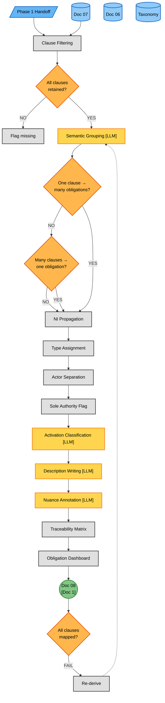
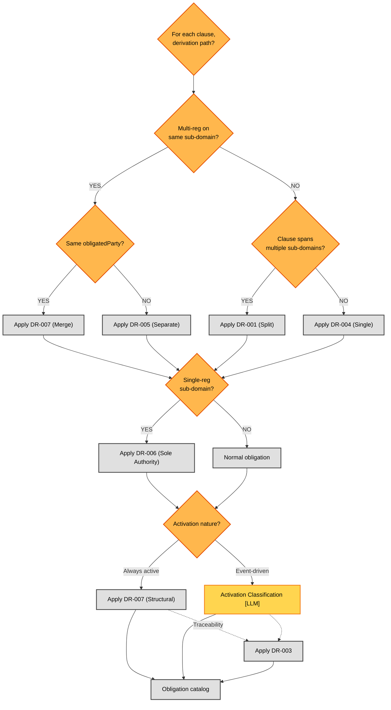

# Phase 2A — Obligation Derivation (Detailed Flow)

**Version:** 1.0 — 2026-06-16
**Parent:** [`../phase2_elaboration_secure_design.md`](../phase2_elaboration_secure_design.md) (Phase 2 overview)
**Sources of truth:**
- [`../../../TEMPLATES/08_Obligation_Derivation.md`](../../../TEMPLATES/08_Obligation_Derivation.md) — Doc 08 template
- [`../phase1/phase1c_consolidation.md`](../phase1/phase1c_consolidation.md) — Doc 07 (input for clauses and coverage)

---

## Overview

This diagram expands the **Phase 2A — Obligation Derivation** subgraph from the Phase 2 overview into full granularity. It shows the process of transforming regulatory clauses (from Phase 1's Doc 07) into abstract obligations (Doc 08).

Phase 2A produces **Doc 08 — Obligation Derivation**. The process has two distinct stages:

1. **Clause-to-Obligation pipeline** (Diagram 1): Filter applicable clauses, group them by sub-domain, derive obligations with NI propagation, assign types/actors, classify activation, build traceability.
2. **Derivation Rules logic** (Diagram 2): The 8 derivation rules (DR-001 to DR-008) that govern when to split, merge, or flag obligations — pure logic, the "decision tree" view of 2A.

**Key difference from Phase 1B:** Phase 1B analyzed each regulation in isolation (per-regulation loop). Phase 2A is a single pass over ALL applicable clauses, consolidating them into obligations that may derive from multiple regulations simultaneously.

**LLM vs Deterministic:** Phase 2A is ~70% deterministic, ~30% LLM. The 7 LLM reasoning points (GRP, NAT-classify, CONFlict-classify, plus 4 description/annotation steps) are marked with `[LLM]` badges. The remaining steps (NI propagation, type assignment, traceability, sole authority flagging) are deterministic lookups/computations.

**Why two diagrams:** Diagram 1 shows the **process** (what happens in order, left-to-right within each sub-phase). Diagram 2 shows the **decision logic** (when to split, merge, or flag obligations). This separation keeps each diagram focused: the process diagram is for understanding flow; the decision diagram is for understanding the derivation rules.

---

## Diagram 1 — Process (Doc 08)



### Step Reference (Diagram 1)

| Step | Name | Type | Doc 08 Section | LLM |
|------|------|------|----------------|-----|
| FILT | Clause Filtering | Process | §4 catalog (filter) | — |
| CHK | Coverage check | Decision | — | — |
| GRP | Semantic Grouping | LLM | §4 catalog (grouping) | [LLM] |
| SPLIT | One-to-Many test | Decision | — | — |
| DR2 | Many-to-One test | Decision | — | — |
| NI | NI Propagation | Process | §6 NI table | — |
| TYPE | Type Assignment | Process | §4 obligationType | — |
| ACTOR | Actor Separation | Process | §4 obligatedParty | — |
| SOLE | Sole Authority Flag | Process | §4 key obs | — |
| ACT | Activation Classification | LLM | §4 column + §3 nuance | [LLM] |
| DESC | Description Writing | LLM | §4 description | [LLM] |
| NUAN | Nuance Annotation | LLM | §9 Key Observations | [LLM] |
| TRACE | Traceability Matrix | Process | §5 traceability | — |
| DASH | Obligation Dashboard | Process | §7 type dist + §6 NI | — |
| D08 | Doc 08 output | — | — | — |
| GATEB | All clauses mapped? | Decision | Gate criteria | — |

---

## Diagram 2 — Derivation Rules (Decision Tree)



### Step Reference (Diagram 2)

| Step | Name | Type |
|------|------|------|
| Q | Entry point | Decision |
| C1 | Multi-reg on same sub-domain? | Decision |
| C2 | Same obligatedParty? | Decision |
| R7 | DR-007 Merge | Deterministic |
| R5 | DR-005 Keep Separate | Deterministic |
| C3 | Clause spans multiple sub-domains? | Decision |
| R1 | DR-001 Split | Deterministic |
| R4 | DR-004 Single Assignment | Deterministic |
| C4 | Single-reg sub-domain? | Decision |
| R6 | DR-006 Sole Authority | Deterministic |
| C5 | Activation nature? | Decision |
| R7a | DR-007 STRUCTURAL | Deterministic |
| R8 | DR-008 CONTEXTUAL | **LLM** (requires business understanding) |
| R3 | DR-003 Bidirectional Traceability | Deterministic |
| OUT | Obligation catalog | — |

---

## Derivation Rules (DR-001 to DR-008) — Full Detail

### DR-001: One-to-Many Split

**Rule:** When a single clause spans multiple sub-domains, derive one obligation per sub-domain.

| Field | Value |
|-------|-------|
| **Trigger** | Clause text references multiple security domains |
| **Example** | CRA Art. 13(2) "secure by default and encryption" → derives 2 obligations: secure-by-default (D-07.1) and encryption (D-01.1) |
| **NI Handling** | Each split obligation inherits the source clause's NI |
| **Type** | Deterministic (keyword/sub-domain matching) |
| **Used In** | Diagram 1 → SPLIT → DR1 |

### DR-002: NI Propagation

**Rule:** Compute obligation NI from source clause NIs using either AVG (Cases 01, 03) or MAX (Case 02).

| Field | Value |
|-------|-------|
| **Trigger** | Multiple source clauses (DR-007) |
| **Example** | Clauses with NI 2, 2, 3 → AVG = 2.667 (Cases 01, 03) or MAX = 3.000 (Case 02) |
| **Single-source** | Obligation NI = source clause NI (no averaging) |
| **Type** | Deterministic (arithmetic) |
| **Note** | Inconsistency: AVG vs MAX produces different NI for the same clause set. Noted but not resolved — the methodology does not prescribe one approach |
| **Used In** | Diagram 1 → NI |

### DR-003: Traceability (Bidirectional)

**Rule:** Every obligation must have a bidirectional link to its source clause(s).

| Field | Value |
|-------|-------|
| **Trigger** | Every obligation (mandatory) |
| **Example** | OBL-D-01.1-001 → GDPR-C04, GDPR-C14, CRA-C07 |
| **Validation** | Both forward (obligation→clause) and reverse (clause→obligation) lookups must resolve |
| **Type** | Deterministic (link table) |
| **Used In** | Diagram 1 → TRACE; Diagram 2 → R3 |

### DR-004: Sub-Domain Assignment

**Rule:** Each obligation is assigned to exactly one sub-domain (its primary domain).

| Field | Value |
|-------|-------|
| **Trigger** | Every obligation |
| **Example** | OBL-D-01.1-001 → D-01.1 (Data at Rest Encryption) |
| **ID Pattern** | OBL-D-XX.Y-NNN (sub-domain in the ID) |
| **Type** | Deterministic (lookup) |
| **Used In** | Diagram 2 → R4 |

### DR-005: Actor Separation

**Rule:** Do not merge clauses with different `obligatedParty` into the same obligation.

| Field | Value |
|-------|-------|
| **Trigger** | Multi-reg sub-domain with different actors |
| **Example** | GDPR Art. 32 (CONTROLLER + PROCESSOR) + CRA Art. 13(2) (MANUFACTURER) → keep separate obligations even if on same sub-domain |
| **Rationale** | Different actors have different obligations even if the control is the same |
| **Type** | Deterministic (actor comparison) |
| **Used In** | Diagram 2 → R5 |

### DR-006: Sole Authority Flag

**Rule:** Mark obligations whose sub-domain is covered by only ONE applicable regulation.

| Field | Value |
|-------|-------|
| **Trigger** | Sub-domain has 1 applicable regulation |
| **Example** | OBL-D-06.2-001 (CRA sole) — only CRA covers SBOM requirements |
| **Effect** | No cross-reg validation possible; flag for additional framework coverage (ISO/NIST) in Rules Catalog |
| **Type** | Deterministic (count of applicable regs per sub-domain) |
| **Used In** | Diagram 2 → R6 |

### DR-007: Multi-Regulation Consolidation / Activation (STRUCTURAL)

**Rule:** When the same sub-domain is covered by 2+ regulations with the same obligatedParty, merge into one obligation. If the activation is always-active, classify as STRUCTURAL.

| Field | Value |
|-------|-------|
| **Trigger** | Multi-reg on same sub-domain + same actor (merge); OR activation always active (classify) |
| **Example (merge)** | GDPR + CRA both require encryption for personal data → OBL-D-01.1-001 with source clauses from both |
| **Example (structural)** | GDPR "appropriate measures" + CRA "secure by default" → always-active conflict, resolved at design level |
| **Type** | Deterministic (merge) + semi-deterministic (structural classification) |
| **Used In** | Diagram 2 → R7 (merge), R7a (structural) |

### DR-008: Activation Classification (CONTEXTUAL)

**Rule:** When a conflict between regulations only materialises when a specific event triggers both, classify as CONTEXTUAL.

| Field | Value |
|-------|-------|
| **Trigger** | Conflict exists but is event-dependent |
| **Example** | GDPR 72h vs CRA 24h notification — no conflict unless a personal data breach involving a product vulnerability occurs |
| **Effect** | Resolution applied per-event (compound event analysis in Phase 2B) |
| **Type** | **LLM** — requires understanding of the company's operational profile and regulatory trigger conditions |
| **Used In** | Diagram 2 → R8; Diagram 1 → ACT (LLM-B) |

---

## NI Propagation — Inconsistency Note

**Inconsistency:** Cases 01 and 03 use **AVG** of source clause NIs. Case 02 uses **MAX**.

| Case | Example | Source NIs | AVG Result | MAX Result | Which Used |
|------|---------|-----------|------------|------------|------------|
| Case 01 (TinyTask) | OBL-D-01.1-001 | 2, 2, 3 | **2.667** | 3.000 | AVG |
| Case 02 (SecureBorder) | OBL-D-01.1-001 | 3, 3, 3 | 3.000 | **3.000** | MAX |
| Case 03 (OmniBank) | OBL-D-01.1-001 | 2, 2, 3 | **2.667** | 3.000 | AVG |

**Implication:** When all source clauses have NI=3, AVG=MAX=3 (no difference). When source NIs are mixed (e.g., 2, 2, 3), AVG=2.667 and MAX=3.000. This affects:
- Mean NI reported in Doc 08 §6 (Case 02 reports 3.000, Cases 01/03 report ~2.8-2.9)
- Priority assignment in Rules Catalog (Phase 2C): thresholds at 2.5 vs 2.8 (see Phase 2C reference)

**Resolution:** Not resolved. The methodology does not prescribe one approach. Cases 01 and 03 adopted AVG as conservative (rewards stricter clauses). Case 02 adopted MAX as strict (rewards the highest obligation).

---

## Obligation ID Structure

**Pattern:** `OBL-D-XX.Y-NNN`

| Component | Meaning | Example |
|-----------|---------|---------|
| OBL- | Fixed prefix | OBL- |
| D- | Domain prefix | D- |
| XX | Domain number (01-10) | 01 |
| .Y | Sub-domain number (1-4) | .1 |
| -NNN | Sequential number within sub-domain | -001 |

**Full example:** `OBL-D-01.1-001` = Domain 01 (Data Protection), Sub-domain 1 (Data at Rest), first obligation in that sub-domain.

**Source clause IDs** (from Doc 06, not generated in 2A):
- `GDPR-C01` through `GDPR-C28`
- `CRA-C01` through `CRA-C26`
- `NIS2-C01` through `NIS2-C29`
- `DORA-C01` through `DORA-C38`
- `AI-C01` through `AI-C29`

---

## Output Format — Doc 08 Section Mapping

| Doc 08 Section | Produced by Diagram 1 node | Content |
|---|---|---|
| §1 Document Purpose | (template) | Purpose, alignment, gate |
| §2 Metadata | (template) | Derivation ID, date, source matrix |
| §3 Methodology | (this file) | 8 derivation rules summary |
| §4 Regulatory Obligations Catalog | FILT, GRP, SPLIT/DR1/DR2/DR7, NI, TYPE, ACTOR, SOLE, ACT, DESC | 10 sub-tables (D-01 to D-10), one obligation per row |
| §5 Traceability Matrix | TRACE | Obligation → clause(s) → regulation |
| §6 NI Propagation | NI | Per-obligation NI calculation table |
| §7 Obligation Type Distribution | DASH | Counts and % by type |
| §8 Derivation Gaps | (template, rare) | Sub-domains with no applicable clauses |
| §9 Key Observations | NUAN | Nuance paragraphs, cross-case insights |

---

## Sole Authority & Activation Classification

### Sole Authority (DR-006)

**Logic:** Count distinct regulations covering each sub-domain. If count = 1, flag as Sole Authority.

| Case | Total sub-domains | Sole Authority count | Examples |
|------|-------------------|----------------------|----------|
| Case 01 (2 regs) | 38 | ~25 (few regs = low overlap) | D-06.2 (CRA only: SBOM) |
| Case 02 (4 regs) | 38 | ~15 | D-02.4 (CRA only: TLPT) |
| Case 03 (5 regs) | 38 | ~8 (high overlap) | D-04.4 (DORA only: ICT testing) |

**Effect on Phase 3:** Sole Authority obligations have no cross-reg validation, so they need explicit framework coverage (ISO 27001, NIST CSF) in the Rules Catalog to compensate.

### Activation Classification (DR-007 STRUCTURAL vs DR-008 CONTEXTUAL)

**Logic:** Determine if the obligation's activation is always-active (STRUCTURAL) or event-dependent (CONTEXTUAL).

| Classification | Activation | Resolution Timing | LLM? |
|---|---|---|---|
| **STRUCTURAL** | Always active (permanent difference) | Once at design level | Semi-deterministic (NI delta, count) |
| **CONTEXTUAL** | Event-driven (only when event triggers both) | Per-event (Phase 2B compound analysis) | **LLM** (business understanding) |

**Cross-case distribution:**

| Case | STRUCTURAL | CONTEXTUAL | Total activation flags |
|------|------------|------------|------------------------|
| Case 01 | 2 | 1 | 3 (out of 23 obligations) |
| Case 02 | 6 | 2 | 8 (out of 38) |
| Case 03 | 3 | 1 | 4 (out of 38) |

---

## Obligation Completeness Gate ("All clauses mapped?")

This gate blocks progression to Phase 2B until Doc 08 passes the following checks (proportional to tier):

| Criterion | LOW (Case 01) | HIGH (Case 02) | MAX (Case 03) |
|-----------|---------------|-----------------|----------------|
| All applicable clauses mapped to obligations | Required | Required | Required |
| NI propagated for multi-clause obligations | Required | Required | Required |
| Traceability matrix bidirectional | Required | Required | Required |
| Obligation types assigned (CONTINUOUS/TRIGGERED/...) | Required | Required | Required |
| obligatedParty column populated | Required | Required | Required |
| Sole Authority sub-domains flagged | Optional | Required | Required |
| Activation classification (STRUCTURAL/CONTEXTUAL) | Optional | Required | Required |
| Nuance annotations for complex articles | Optional | Required | Required |
| Mean NI reported | Required | Required | Required |
| Obligation type distribution reported | Required | Required | Required |
| No orphan obligations (untraced source) | Required | Required | Required |

If this gate fails, upstream re-derivation is triggered (FIX loop in Diagram 1).

---

## Cross-Case Comparison Through Phase 2A

| Dimension | Case 01 (TinyTask) | Case 02 (SecureBorder) | Case 03 (OmniBank) |
|-----------|-------------------|----------------------|-------------------|
| **Regs applicable** | 2 (GDPR, CRA) | 4 (GDPR, CRA, NIS 2, AI Act) | 5 (all) |
| **Applicable clauses** | 54 | 112 | 150 |
| **Derived obligations** | 23 | 38 | 38 |
| **Sub-domain coverage** | 20/38 (52.6%) | 38/38 (100%) | 38/38 (100%) |
| **Clause-to-obligation ratio** | 2.35:1 | 2.95:1 | 3.95:1 |
| **Mean NI** | 2.821 | 3.000 | 2.934 |
| **NI propagation** | AVG | MAX | AVG |
| **Sole Authority count** | ~3 | ~0 | ~0 |
| **Activation flags (STR + CTX)** | 3 (2 STR + 1 CTX) | 8 (6 STR + 2 CTX) | 4 (3 STR + 1 CTX) |
| **LLM invocations (Phase 2A)** | 4 (GRP, ACT, DESC, NUAN) × loop | 4 × loop | 4 × loop |
| **File size (Doc 08)** | 23 KB | 57 KB | 32 KB |

**Key insight:** Obligation count plateaus at 38 (one per covered sub-domain) once 100% coverage is reached. Case 02's larger file size (57 KB) reflects extensive multi-regulation analysis sections (Jaccard overlap, per-regulation breakdown) — not more obligations. The clause-to-obligation ratio increases with regulation count (more regs = more consolidation opportunities).

---

## What This Detail Does NOT Show

- **Individual nuance paragraphs:** The full text of legal interpretation paragraphs (citing specific articles, implementing acts, RTS) is in Doc 08 §9, not in the flow diagram. The flow shows WHEN to write them (LLM-D step), not WHAT they say.
- **Per-obligation priority assignment (P1/P2/P3):** This is done in Phase 2C (Rules Catalog) based on NI thresholds. Phase 2A only assigns the NI; priority is derived downstream.
- **Framework mapping:** Cross-references to ISO 27001, NIST CSF, OWASP happen in Phase 2C, not in 2A.
- **Coverage gap analysis:** Sub-domains with zero applicable clauses are noted in Doc 08 §8 but not detailed here.
- **Multi-regulation complementarity:** How obligations from different regulations relate (synergistic/structural/contextual overlaps) is computed in Phase 2B (Strategic Tensions), not in 2A.
- **Per-regulation breakdown (Case 02 §11):** The detailed per-regulation obligation split is a Case 02 artifact, not part of the generic 2A flow.
- **The 7 LLM reasoning points' full specifications:** Each LLM step (GRP, ACT, DESC, NUAN) has input contracts, KB requirements, and quality criteria defined in the Phase 2A LLM spec table (see appendix, if needed).

---

## LLM Reasoning Points — Full Specification

Phase 2A has **4 LLM reasoning points**. Each is specified as an implementable contract below.

### LLM-A: Semantic Grouping (GRP)

**Intention:** This step exists because raw regulatory clauses are scattered across up to five regulations, and without semantic grouping the methodology would produce one obligation per clause — yielding 54-150 obligations per case instead of the canonical 23-38. A deterministic keyword match cannot tell that GDPR Art. 32(1)(a) "appropriate technical measures" and CRA Art. 13(2) "secure by default" both address the same encryption control, nor can it tell that a single CRA clause on "secure by default and encryption" should split across two sub-domains. Without GRP, downstream NI propagation, actor separation, and traceability lose their meaning: each obligation would carry a single source clause, defeating the consolidation principle that defines Phase 2A. Worse, the clause-to-obligation ratio that characterises case complexity (2.35:1 to 3.95:1) collapses to 1:1, and Phase 2B's strategic-tension analysis cannot identify where regulations reinforce or contradict each other.

| Field | Value |
|-------|-------|
| **Purpose** | Cluster applicable regulatory clauses into obligations by sub-domain, consolidating clauses from multiple regulations that address the same security control |
| **Why LLM (not deterministic)** | Semantic clustering requires understanding whether two clauses cover the same control despite different wording (GDPR "appropriate technical measures" vs CRA "secure by default"). A keyword match cannot detect paraphrase, cannot split multi-domain clauses, and cannot decide when two same-actor clauses should merge versus stay separate |
| **Input** | (1) Applicable clauses from Doc 07, (2) Canonical taxonomy (38 sub-domains), (3) Company context from Doc 04 |
| **Instructions** | For each sub-domain, identify which applicable clauses address it. Group clauses that address the same security control even if worded differently. Apply derivation rules DR-001 (split) and DR-007 (merge) based on clause-to-sub-domain mapping. Flag multi-domain clauses for splitting. Flag same-actor multi-regulation clauses for merging |
| **KB Required** | Regulatory clause database (Doc 06), canonical taxonomy (38 sub-domains), obligation ID registry |
| **Output Format** | Set of obligation objects: `{OBL-ID, sub-domain, source clauses[], obligatedParty, NI (pre-propagation)}` |
| **Quality Criteria** | (1) Every applicable clause assigned to at least 1 obligation; (2) No obligation without at least 1 source clause; (3) Sub-domain IDs match canonical taxonomy; (4) No duplicate obligations for same sub-domain + actor; (5) DR-001 splits documented with rationale |

### LLM-B: Activation Classification (ACT)

**Intention:** This step exists because some regulatory differences are permanent (always active) and others only materialise when a specific factual event triggers both regulations together. Treating every multi-regulation obligation as either always-in-conflict or never-in-conflict produces both over-triggering (premature, hypothetical conflict resolution) and under-triggering (real conflicts that never surface). A deterministic rule cannot distinguish "GDPR and CRA both require encryption of personal data at rest" (permanent overlap, STRUCTURAL) from "GDPR 72h breach notification vs CRA 24h vulnerability disclosure" (only conflicts when a personal data breach involves a product vulnerability, CONTEXTUAL). The company's operational profile is essential input: a SaaS startup may never trigger DORA-specific events, while a bank always operates under DORA, so the same pair of regulations can be STRUCTURAL for one case and CONTEXTUAL for another. Misclassifying a CONTEXTUAL obligation as STRUCTURAL forces design-level resolution of an event that may never occur; the reverse defers a real conflict to Phase 2B where it may never be triggered.

| Field | Value |
|-------|-------|
| **Purpose** | Classify each obligation as STRUCTURAL (always active) or CONTEXTUAL (event-driven), based on whether the regulatory conflict is permanent or only materialises when a specific event triggers both regulations |
| **Why LLM (not deterministic)** | Classification requires understanding the company's operational profile and when regulations' trigger conditions overlap. A 72h vs 24h notification deadline is only a conflict when a personal data breach involving a product vulnerability occurs. The trigger conditions are semantic, not lookup-table entries |
| **Input** | (1) Obligation metadata (sub-domain, source clauses, obligatedParty), (2) Company business model from Doc 04, (3) Source regulation texts, (4) Applicable regulations from Doc 05 |
| **Instructions** | For each obligation derived from multiple regulations, assess whether the regulatory difference is permanent (STRUCTURAL — always active) or event-dependent (CONTEXTUAL — only when a specific factual event triggers both). Consider the company's business model: a SaaS startup may never trigger DORA-specific events; a bank always operates under DORA. If single-regulation obligation, classify as STRUCTURAL by default |
| **KB Required** | Regulatory trigger conditions database, company operational profile (Doc 04), compound event catalog from Phase 2B |
| **Output Format** | Per-obligation flag: `{OBL-ID, activationType: STRUCTURAL \| CONTEXTUAL, triggerCondition (if CONTEXTUAL), rationale}` |
| **Quality Criteria** | (1) Every multi-regulation obligation classified; (2) CONTEXTUAL classifications have defined trigger conditions; (3) Rationale references specific regulatory articles; (4) Consistency with company operational profile |

### LLM-C: Description Writing (DESC)

**Intention:** This step exists because obligation IDs and metadata (sub-domain, NI, type, actor) are machine-readable but not actionable for the humans who must implement the controls. A generic description such as "implement appropriate measures" fails every audience: engineers cannot derive requirements from it, auditors cannot verify it, and legal reviewers cannot trace it to specific articles. The description must bridge the regulatory text and the company's specific architecture — a bank's encryption obligation references AES-256 and HSM-backed key custody, while a startup's references cloud-provider managed encryption, even though both derive from the same GDPR article. Without this step, Phase 3's functional requirements would lack a coherent problem statement, and the traceability chain from regulation to NFR would carry a gap where the obligation's intent is left unexpressed. The constraint to active voice with the obligatedParty as subject also enforces clarity about who is accountable, which metadata alone cannot convey.

| Field | Value |
|-------|-------|
| **Purpose** | Write natural-language obligation descriptions that are company-specific, actionable, and reference the company's sector, size, and architecture |
| **Why LLM (not deterministic)** | Natural language description must be tailored to the company context — a bank's encryption obligation reads differently than a startup's, even if derived from the same GDPR article. Template fillers produce generic placeholder text that fails Phase 3's traceability gate |
| **Input** | (1) Obligation metadata (sub-domain, source clauses, NI, type, actor), (2) Company context from Doc 04 (sector, size, architecture, deployment model), (3) Source regulation article text |
| **Instructions** | Write a 1-2 sentence obligation description that: (a) states what must be done, (b) is specific to the company's sector and architecture, (c) references the applicable regulation(s) by article number, (d) uses active voice with the obligatedParty as subject. For multi-regulation obligations, mention all source regulations. Avoid generic language ("implement appropriate measures") — be specific ("encrypt all personal data at rest using AES-256") |
| **KB Required** | Company context (Doc 04), regulation article texts (Doc 06), obligation type definitions |
| **Output Format** | String (1-2 sentences per obligation) |
| **Quality Criteria** | (1) Description is company-specific (references sector/architecture); (2) Article numbers cited correctly; (3) Active voice with obligatedParty as subject; (4) No generic placeholder language; (5) Length 1-2 sentences |

### LLM-D: Nuance Annotation (NUAN)

**Intention:** This step exists because some obligations derive from regulatory articles whose meaning is contested, threshold-dependent, or shaped by implementing acts and supervisory guidance that the article text alone does not reveal. A plain reading of GDPR Art. 32 omits EDPB guidelines on encryption-key custody; a plain reading of DORA Art. 11 omits the RTS specifying ICT incident classification thresholds; a plain reading of AI Act Art. 15 omits the delegated acts on high-risk system accuracy. Without nuance annotations, downstream agents and human reviewers would treat each obligation as if its regulatory meaning were self-evident, missing derogations, transitional provisions, threshold-trigger conditions, and cross-regulation interactions that change how the obligation is implemented. The annotation is deliberately selective — only obligations with genuine legal complexity receive one — because writing a nuance paragraph for every obligation would drown the few that genuinely require interpretation in noise and inflate Doc 08 beyond proportionality.

| Field | Value |
|-------|-------|
| **Purpose** | Add legal interpretation paragraphs for complex obligations, citing specific articles, implementing acts, delegated acts, and EDPB/national guidance |
| **Why LLM (not deterministic)** | Legal interpretation requires cross-referencing regulation text with implementing acts, delegated acts, and supervisory authority guidance — this is legal reasoning, not lookup. Identifying which obligations have a genuine nuance vs a straightforward reading is itself a judgement call |
| **Input** | (1) Obligation metadata, (2) Source regulation article text, (3) Implementing/delegated acts (if any), (4) EDPB guidelines, national supervisory authority guidance, (5) Cross-case insights from Doc 09 |
| **Instructions** | For obligations with complex regulatory backgrounds (multiple source regulations, derogations, interpretation nuances, threshold-dependent applicability), write a 3-5 sentence annotation that: (a) identifies the specific legal nuance, (b) cites the relevant article(s) and implementing acts, (c) explains how the nuance affects the obligation's implementation, (d) notes cross-regulation interactions if applicable. Skip obligations with straightforward regulatory backgrounds (single source, no interpretation needed) |
| **KB Required** | Regulation full texts with implementing acts, EDPB opinion database, national supervisory authority guidance, RTS/ITS texts (for DORA) |
| **Output Format** | Paragraph (3-5 sentences) or null (if no nuance needed), stored in Doc 08 §9 |
| **Quality Criteria** | (1) Article citations are exact (article number + paragraph); (2) Implementing acts cited where applicable; (3) Interpretation is defensible (not speculative); (4) Cross-regulation interactions noted where relevant; (5) Only written for obligations that genuinely have nuances |

---

## Relationship to Parent Diagram

This detailed flow is a **zoom-in** of the Phase 2A subgraph in [`../phase2_elaboration_secure_design.md`](../phase2_elaboration_secure_design.md):

```
Parent diagram (overview):

    subgraph P2A["Phase 2A — Obligation Derivation"]
        P1 --> FILT["Clause Filtering"]
        FILT --> GRP["Semantic Grouping LLM"]
        GRP --> DER["Derivation Engine"]
        DER --> D08(("Doc 08<br/>[Doc 1]"))
    D08 --> GATEB{"All clauses<br/>mapped?"}
    end

                     expanded to

This file (detail):

    Diagram 1 (process): FILT → CHK → GRP → SPLIT/DR1/DR2/DR7
                        → NI → TYPE → ACTOR → SOLE → ACT → DESC → NUAN
                        → TRACE → DASH → D08 → GATEB
                        (17 nodes, 4 LLM points)

    Diagram 2 (decision tree): Multi-reg? → Same actor? → Split/merge?
                              → Sole authority? → STRUCTURAL/CONTEXTUAL
                              → Traceability → Obligation catalog
                              (8 derivation rules applied conditionally)
```

The parent collapses the 8 derivation rules into 1 "Semantic Grouping LLM" node and merges 4 LLM steps into the "Derivation Engine". This file expands both to show every step and decision point.

---

### Colour Note

Uses the same high-contrast palette as the parent diagram:

| Colour | Meaning | Phase 2A usage |
|--------|---------|----------------|
| Blue (#64B5F6) | Input | Phase 1 handoff |
| Light Blue (#90CAF9) | Static reference | Doc 06, Doc 07, Taxonomy |
| Grey (#E0E0E0) | Deterministic process | Filtering, NI, type, actor, traceability, dashboard |
| Amber (#FFD54F) | LLM reasoning | Grouping, activation, description, nuance |
| Green (#81C784) | Document | Doc 08 |
| Orange (#FFB74D) | Decision / gate | Split/merge tests, "All clauses mapped?" gate |

If fills appear washed out:
- **GitHub:** renders natively
- **VS Code:** "Markdown Preview Mermaid Support" extension
- **Browser:** paste into [mermaid.live](https://mermaid.live/)
- All text uses explicit `color:#000` for dark-mode readability

---

**See also:**
- [`../phase2_elaboration_secure_design.md`](../phase2_elaboration_secure_design.md) — Phase 2 overview (parent)
- [`../../../TEMPLATES/08_Obligation_Derivation.md`](../../../TEMPLATES/08_Obligation_Derivation.md) — Doc 08 template (source of truth)
- [`../phase1/phase1c_consolidation.md`](../phase1/phase1c_consolidation.md) — Phase 1C (predecessor, produces Doc 07)
- [`../Class_Models/phase2_elaboration_secure_design.md`](../Class_Models/phase2_elaboration_secure_design.md) — Static structure (class diagram)
- [`phase2b_strategic_tensions.md`](phase2b_strategic_tensions.md) — Phase 2B detail (successor, consumes Doc 08)
