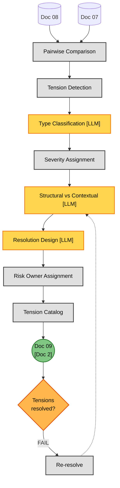
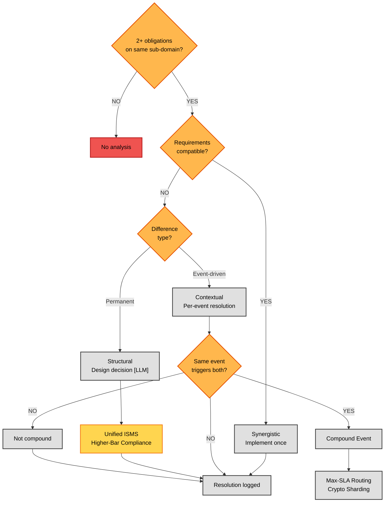

# Phase 2B — Strategic Tensions Analysis (Detailed Flow)

**Version:** 1.0 — 2026-06-16
**Parent:** [`../phase2_elaboration_secure_design.md`](../phase2_elaboration_secure_design.md) (Phase 2 overview)
**Sources of truth:**
- [`../../../TEMPLATES/09_Strategic_Tensions_Report.md`](../../../TEMPLATES/09_Strategic_Tensions_Report.md) — Doc 09 template
- [`phase2b_tension_reference.md`](phase2b_tension_reference.md) — Tension catalog + resolution patterns (companion)

---

## Overview

This diagram expands the **Phase 2B — Strategic Tensions** subgraph from the Phase 2 overview. It shows the process of detecting, classifying, and resolving conflicts between obligations derived in Phase 2A.

Phase 2B produces **Doc 09 — Strategic Tensions Report**. The process has two stages:

1. **Tension analysis pipeline** (Diagram 1): Take obligations from Doc 08, detect overlaps, classify each overlap, design a resolution, assign risk owners, build the tension catalog.
2. **Classification decision tree** (Diagram 2): For each detected overlap, the STRUCTURAL vs CONTEXTUAL decision determines resolution timing (design-level vs per-event).

**Key difference from Phase 1C:** Phase 1C's conflict classification (Synergistic / Structural / Contextual) was about REGULATORY overlaps (which regulations cover the same sub-domain). Phase 2B's conflict detection is about OBLIGATION overlaps (which obligations in the same sub-domain conflict semantically). The logic is similar but the scope is narrower — Phase 1C looked at coverage, Phase 2B looks at the derived obligations.

**LLM vs Deterministic:** Phase 2B is ~30% deterministic, ~70% LLM. The LLM steps (CLASSIFY, RESOLVE, COMPOUND, ROUTE) are where semantic comparison, business context, and resolution design happen. Deterministic steps do the counting, NI delta computation, and severity assignment via thresholds.

---

## Diagram 1 — Process (Doc 09)



### Step Reference (Diagram 1)

| Step | Name | Type | Doc 09 Section | LLM |
|------|------|------|----------------|-----|
| PAIR | Pairwise Comparison | Process | §4 catalog (per sub-domain) | — |
| DETECT | Tension Detection | Process | §4 detection | — |
| TYPE | Type Classification | LLM | §3.3 type taxonomy | [LLM] |
| SEV | Severity Assignment | Process | §3.4 severity | — |
| CLASS | Structural vs Contextual | LLM | §3.1 nature | [LLM] |
| RESOLVE | Resolution Design | LLM | §4 resolution strategy | [LLM] |
| ASSIGN | Risk Owner Assignment | Process | §9 risk owners | — |
| CAT | Tension Catalog | Process | §4–§5 full table | — |
| D09 | Doc 09 output | — | — | — |
| GATEC | Tensions resolved? | Decision | Gate criteria | — |

---

## Diagram 2 — Classification Decision Tree



### Step Reference (Diagram 2)

| Step | Name | Type |
|------|------|------|
| Q | Overlap exists? | Decision |
| COMP | Requirements compatible? | Decision |
| SYN | Synergistic | Process |
| NAT | Permanent or event-driven? | Decision |
| STR | Structural | LLM |
| CTX | Contextual | Process |
| RES_C | Same event triggers both? | Decision |
| COMP_E | Compound Event | Process |
| NC | Not compound | Process |
| RES_D | Design-level resolution | LLM |
| RES_R | Per-event resolution | Process |
| OUT | Resolution logged | — |

---

## Tension Types (7-Type Taxonomy)

Full catalog with cross-case examples in [`phase2b_tension_reference.md`](phase2b_tension_reference.md). Summary:

| Type | Code | Detection Pattern | Example |
|------|------|-------------------|---------|
| **Temporal Conflict** | TT-01 | Different deadlines for same event | GDPR 72h vs CRA 24h notification |
| **Requirement Conflict** | TT-02 | One requires X, another prohibits X | Erasure (GDPR) vs immutable logs (DORA) |
| **Resource Conflict** | TT-03 | Same resource, competing demands | Budget, personnel, infrastructure |
| **Implementation Conflict** | TT-04 | Incompatible technical approaches | Different encryption standards |
| **Intensity Gap** | TT-05 | NI delta ≥ 0.5 | GDPR "appropriate" (NI=2) vs CRA "secure by default" (NI=3) |
| **Frequency Mismatch** | TT-06 | Different occurrence patterns | ONE_TIME vs CONTINUOUS vs PERIODIC |
| **Trigger Mismatch** | TT-07 | Different triggers for same obligation | DPIA (GDPR) vs FRIA (AI Act) vs ICT risk (DORA) |

---

## Resolution Patterns (7 Reusable)

| Pattern | Applies To | Example |
|---------|-----------|---------|
| **Max-SLA Routing** | TT-01 (temporal) | DORA 4h satisfies GDPR 72h, CRA 24h, NIS 2 24h |
| **Cryptographic Sharding** | TT-02 (erasure vs retention) | Delete PII, retain anonymised log with hash |
| **Unified ISMS with Annexes** | TT-03 (documentation) | Single ISMS, regulation-specific annexes |
| **Higher-Bar Compliance** | TT-05 (intensity) | Follow CRA "secure by default" (NI=3) |
| **Unified Assessment** | TT-06, TT-07 | IPSARA: one assessment → DPIA + FRIA + ICT risk |
| **Integrated SOC** | TT-03 (monitoring) | Single SOC platform feeds all regs |
| **Unified Supplier Questionnaire** | TT-03 (supply chain) | One questionnaire → NIS 2 + GDPR + DORA |

Full catalog in [`phase2b_tension_reference.md`](phase2b_tension_reference.md).

---

## Tension Resolution Gate ("Tensions resolved?")

This gate blocks progression to Phase 2C until Doc 09 passes:

| Criterion | LOW | HIGH | MAX |
|-----------|-----|------|-----|
| All HIGH-severity tensions resolved | Required | Required | Required |
| Resolution strategy documented | Required | Required | Required |
| Risk owner assigned per tension | Optional | Required | Required |
| Structural vs Contextual classification | Optional | Required | Required |
| Compound events identified (Contextual) | Optional | Required | Required |
| Design decisions logged (Doc 03) | Optional | Required | Required |
| Resolution dashboard populated | Required | Required | Required |

---

## Cross-Case Comparison

| Dimension | Case 01 | Case 02 | Case 03 |
|-----------|---------|---------|---------|
| **Obligations analysed (Doc 08)** | 28 | 52 | 68 |
| **Tensions detected** | 4 | 8 | 4 |
| **Tension density (per obligation)** | 0.14 | 0.15 | 0.06 |
| **CRITICAL** | 0 | 2 | 2 |
| **HIGH** | 1 | 2 | 0 |
| **MEDIUM** | 2 | 3 | 1 |
| **LOW** | 1 | 1 | 1 |
| **Contextual** | 1 | 2 | 1 |
| **Structural** | 2 | 6 | 3 |
| **Contextual:Structural ratio** | 1:2.0 | 1:3.0 | 1:3.0 |
| **Compound events identified** | 3 | 8+ | 10+ |
| **Resolution patterns used** | 3 | 6 | 5 |
| **Mean resolution time (iterations)** | 1.3 | 2.1 | 1.7 |
| **Design decisions logged (Doc 03)** | 2 | 6 | 3 |

**Key non-monotonic insight:** Case 03 (5 regs) has FEWER contextual tensions than Case 02 (4 regs) because DORA's lex specialis rule transforms some contextual tensions into structural ones.

---

## What This Detail Does NOT Show

- **Full tension catalog per case:** the per-tension detailed analysis (root cause, resolution evidence, implementation plan) is in Doc 09 §5, not in the flow diagram
- **Compound event enumeration:** the full list of positive/negative scenarios is expanded in [`phase2b_tension_reference.md`](phase2b_tension_reference.md)
- **Tension ID format inconsistency:** Cases 01 & 03 use `TENSION-H/M/L-NNN`; Case 02 uses flat `T-NNN` — both formats appear in the documents
- **Risk owner escalation paths:** the full role hierarchy and escalation chains are in Doc 09 §9
- **Design decision IDs:** the per-decision rationale and date are in Doc 09 §11 and Doc 03

---

## LLM Reasoning Points

Phase 2B has 3 LLM reasoning points (continuing from Phase 2A's LLM-A through LLM-D). Each is specified below with its full input/instruction/output contract.

### [LLM] (2B-1): TYPE — Type Classification

**Intention:** This step assigns each detected tension to exactly one of seven types (TT-01 through TT-07) so that the downstream RESOLVE step can select the matching resolution pattern. Surface-level keyword matching is insufficient because obligations sharing vocabulary (e.g., both mentioning "encryption") may still differ in deadline, requirement direction, technical standard, normative intensity, frequency, or trigger. The LLM must therefore compare the two obligations semantically, compute quantitative deltas where applicable (notably NI delta for TT-05), and arbitrate when multiple types apply via a fixed priority order. The output is a single dominant type with a confidence score and a rationale that references specific obligation fields, enabling mechanical verification by the linter.

| Field | Specification |
|-------|---------------|
| **Purpose** | Classify each detected tension into one of 7 types (TT-01 Temporal, TT-02 Requirement, TT-03 Resource, TT-04 Implementation, TT-05 Intensity, TT-06 Frequency, TT-07 Trigger). |
| **Why LLM** | Semantic comparison of obligation requirements — "is this a timing conflict or a requirement conflict?" requires understanding both obligations' intent, not just their text. Two obligations mentioning "encryption" could be TT-04 (different standards), TT-05 (different NI), or TT-02 (one requires, one prohibits). |
| **Input** | (1) Pair of obligations from same sub-domain; (2) Obligation metadata (description, source clauses, NI, type, actor); (3) 7-type taxonomy definitions; (4) Company context. |
| **Instructions** | Compare the two obligations semantically. Check deadline differences (TT-01). Check if one requires what the other prohibits (TT-02). Check resource competition (TT-03). Check technical standard incompatibility (TT-04). Compute NI delta; if ≥0.5, flag TT-05. Compare obligationType fields for frequency mismatch (TT-06). Compare trigger conditions for trigger mismatch (TT-07). If multiple types apply, select the dominant one (priority: TT-02 > TT-01 > TT-04 > TT-03 > TT-05 > TT-06 > TT-07). |
| **KB Required** | 7-type taxonomy with detection patterns; obligation metadata from Doc 08; NI delta calculator. |
| **Output Format** | `{tensionID, type: TT-01..TT-07, dominantType (if multiple), confidence: 0-1, rationale}`. |
| **Quality Criteria** | (1) Every tension classified into exactly one dominant type; (2) TT-05 classifications have computed NI delta ≥0.5; (3) TT-01 classifications have identified specific deadline differences; (4) Rationale references specific obligation fields; (5) No unclassified tensions. |

### [LLM] (2B-2): CLASS — Structural vs Contextual

**Intention:** This step decides whether each classified tension is permanent (STRUCTURAL) or only materialises under specific factual triggers (CONTEXTUAL), because the two natures require different resolution timing. The decision depends on the company's business model: a GDPR 72h vs CRA 24h notification deadline is only a real conflict for a company whose products process personal data and can suffer vulnerability-triggered breaches. The LLM must therefore read the operational profile from Doc 04 and the regulatory trigger conditions, then decide whether the difference lives in the obligation itself or in the event that activates it. For deadline tensions (TT-01), the LLM additionally checks whether the shorter deadline is a subset of the longer one, which converts the tension to STRUCTURAL with a Higher-Bar resolution.

| Field | Specification |
|-------|---------------|
| **Purpose** | Determine whether each tension is STRUCTURAL (permanent difference, resolved at design level) or CONTEXTUAL (only materialises when a specific event triggers both regulations). |
| **Why LLM** | Classification requires understanding the company's business model and operational profile. A GDPR 72h vs CRA 24h notification deadline is only a conflict when a personal data breach involving a product vulnerability occurs — for a company that doesn't sell products, this is never contextual. |
| **Input** | (1) Classified tension (from TYPE step); (2) Company operational profile from Doc 04; (3) Source regulation trigger conditions; (4) Compound event catalog. |
| **Instructions** | Assess whether the tension's regulatory difference is permanent (always active when both regulations apply) or event-dependent (only when a specific factual event triggers both). Consider: (a) Does the company's business model create scenarios where both triggers fire simultaneously? (b) Is the difference in the obligation itself (STRUCTURAL) or in when it must be executed (CONTEXTUAL)? (c) For deadline tensions (TT-01), always check if the shorter deadline is a subset of the longer one (if so, implementing the shorter satisfies both — STRUCTURAL with Higher-Bar resolution). |
| **KB Required** | Company operational profile (Doc 04); regulatory trigger condition database; compound event positive/negative identification rules. |
| **Output Format** | `{tensionID, nature: STRUCTURAL | CONTEXTUAL, triggerScenario (if CONTEXTUAL), resolutionTiming: ONCE | PER-EVENT, rationale}`. |
| **Quality Criteria** | (1) Every tension classified as STRUCTURAL or CONTEXTUAL; (2) CONTEXTUAL tensions have defined trigger scenarios; (3) Classification consistent with company business model; (4) STRUCTURAL tensions have design-level resolution; (5) No ambiguous classifications (must be one or the other). |

### [LLM] (2B-3): RESOLVE — Resolution Design

**Intention:** This step selects and adapts one of seven resolution patterns for each tension, producing the actionable output that feeds Doc 09 §4 and Doc 03 design decisions. Pattern selection is type-driven (TT-01 → Max-SLA, TT-02 → Crypto-Shard, etc.) but adaptation is context-driven: the same Max-SLA pattern must be instantiated differently for a 3-regulation SaaS and a 5-regulation bank. The LLM must therefore read the company architecture, existing design decisions, and tension severity, then either apply a canonical pattern or design a novel resolution with explicit rationale. For STRUCTURAL tensions the output is a design decision logged in Doc 03; for CONTEXTUAL tensions it is a per-event procedure owned by a named risk owner.

| Field | Specification |
|-------|---------------|
| **Purpose** | Design a resolution strategy for each tension by selecting and adapting one of 7 resolution patterns (Max-SLA Routing, Cryptographic Sharding, Unified ISMS, Higher-Bar Compliance, Unified Assessment, Integrated SOC, Unified Supplier Questionnaire). |
| **Why LLM** | Resolution design requires matching the pattern's characteristics to the tension's specific context. "Which of the 7 patterns fits this conflict?" requires understanding both the technical implications and the business constraints. Some tensions need pattern adaptation, not direct application. |
| **Input** | (1) Classified tension (type + nature); (2) 7 resolution pattern catalog; (3) Company architecture from Doc 04; (4) Existing design decisions from Doc 03; (5) Tension severity (CRITICAL/HIGH/MEDIUM/LOW). |
| **Instructions** | Select the most appropriate resolution pattern based on tension type: TT-01 → Max-SLA Routing; TT-02 → Cryptographic Sharding; TT-03 → Unified ISMS or Integrated SOC or Unified Supplier Questionnaire (depending on resource type); TT-04/TT-05 → Higher-Bar Compliance; TT-06/TT-07 → Unified Assessment. Adapt the pattern to the specific tension context. For CONTEXTUAL tensions, define the per-event resolution procedure. For STRUCTURAL tensions, define the design-level decision (log in Doc 03). If no pattern fits, design a novel resolution and document the rationale. |
| **KB Required** | 7 resolution pattern catalog; company architecture (Doc 04); design decision log (Doc 03); resolution evidence database. |
| **Output Format** | `{tensionID, pattern: Max-SLA | Crypto-Shard | Unified-ISMS | Higher-Bar | Unified-Assessment | Integrated-SOC | Unified-Supplier | NOVEL, resolutionDescription, designDecision (if STRUCTURAL), eventProcedure (if CONTEXTUAL), evidence[], riskOwner}`. |
| **Quality Criteria** | (1) Every CRITICAL and HIGH tension has a documented resolution; (2) Resolution pattern matches tension type; (3) STRUCTURAL resolutions logged as design decisions; (4) CONTEXTUAL resolutions have per-event procedures; (5) Risk owner assigned per resolution; (6) Novel resolutions have strong rationale. |

---

## Relationship to Parent Diagram

```
Parent (overview):

    subgraph P2B["Phase 2B — Strategic Tensions"]
        GATEB -->|PASS| PAIR
        PAIR --> DETECT
        DETECT --> CLASSIFY [LLM]
        CLASSIFY --> RESOLVE [LLM]
        RESOLVE --> D09
        D09 --> GATEC{"Tensions<br/>resolved?"}
    end

                expanded to

This file (detail):

    Diagram 1 (process): D08 + D07 → PAIR → DETECT → TYPE [LLM] → SEV
                        → CLASS [LLM] → RESOLVE [LLM] → ASSIGN → CAT → D09 → GATEC

    Diagram 2 (decision tree): Overlap? → Compatible? → Permanent/event-driven?
                              → Structural [LLM] / Contextual → Resolution
```

The parent collapses the 7-type classification, severity assignment, and structural/contextual decision into a single "Classification [LLM]" node. This file expands them.

---

**See also:**
- [`../phase2_elaboration_secure_design.md`](../phase2_elaboration_secure_design.md) — Phase 2 overview (parent)
- [`phase2b_tension_reference.md`](phase2b_tension_reference.md) — Tension catalog + resolution patterns (companion)
- [`phase2a_obligation_derivation.md`](phase2a_obligation_derivation.md) — Phase 2A (predecessor, produces Doc 08)
- [`phase2c_goals_and_rules.md`](phase2c_goals_and_rules.md) — Phase 2C (successor, consumes Doc 09)
- [`../../../TEMPLATES/09_Strategic_Tensions_Report.md`](../../../TEMPLATES/09_Strategic_Tensions_Report.md) — Doc 09 template
- [`../Class_Models/phase2_elaboration_secure_design.md`](../Class_Models/phase2_elaboration_secure_design.md) — Static structure
