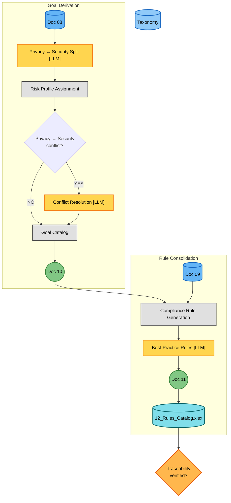
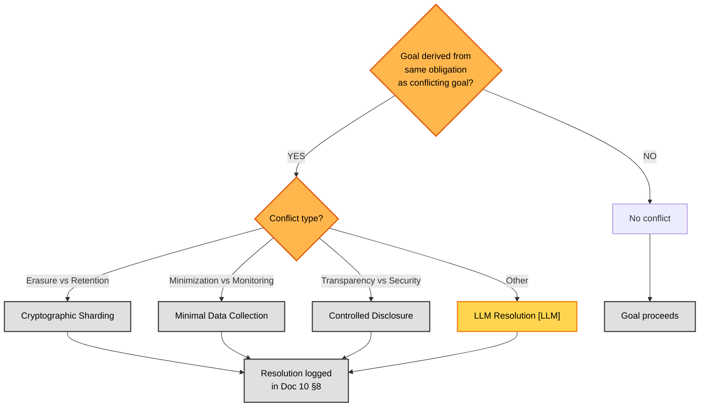

# Phase 2C — Goals & Rules (Detailed Flow)

**Version:** 1.0 — 2026-06-16
**Parent:** [`../phase2_elaboration_secure_design.md`](../phase2_elaboration_secure_design.md) (Phase 2 overview)
**Sources of truth:**
- [`../../../TEMPLATES/10_Privacy_Security_Goals.md`](../../../TEMPLATES/10_Privacy_Security_Goals.md) — Doc 10 template
- [`../../../TEMPLATES/11_Rules_Catalog.md`](../../../TEMPLATES/11_Rules_Catalog.md) — Doc 11 template
- [`phase2c_framework_reference.md`](phase2c_framework_reference.md) — Framework mapping tables (companion)

---

## Overview

This diagram expands the **Phase 2C — Goals & Rules** subgraph from the Phase 2 overview. It shows the process of transforming obligations (Doc 08) and resolved tensions (Doc 09) into privacy/security goals (Doc 10) and a consolidated testable rules catalog (Doc 11 + Excel 12).

Phase 2C produces **Doc 10 — Privacy & Security Goals Catalog**, **Doc 11 — Rules Catalog**, and **Doc 12 — Rules Catalog Excel**. The process has three distinct stages:

1. **Goal Derivation** (Diagram 1, upper): Take obligations from Doc 08, split into privacy vs security, assign risk profiles, resolve privacy↔security conflicts, produce Doc 10.
2. **Rule Consolidation** (Diagram 1, lower): Take goals from Doc 10 + resolved tensions from Doc 09, create compliance rules, add best-practice rules from frameworks, generate Excel, produce Doc 11.
3. **Conflict Resolution Decision Tree** (Diagram 2): For each privacy↔security conflict detected, classify the conflict type and select the appropriate resolution pattern.

**Key difference from Phase 2A/2B:** Phase 2C is where the methodology becomes operational. Phases 2A and 2B produce analysis documents (obligations, tensions). Phase 2C produces the actual testable rules that Phase 3 will decompose into use cases and architectural nodes. It is the convergence point of all prior Phase 2 outputs.

**LLM vs Deterministic:** Phase 2C is ~50% deterministic, ~50% LLM. The LLM steps (goal classification, conflict resolution design, best-practice rule selection) require semantic understanding. Deterministic steps do the risk profile assignment (threshold-based), rule ID generation, priority assignment (NI threshold), and Excel generation.

---

## Diagram 1 — Process (Docs 10 + 11 + 12)



### Step Reference (Diagram 1)

| Step | Name | Type | Doc Section | LLM |
|------|------|------|-------------|-----|
| SPLIT | Privacy ↔ Security Split | LLM | Doc 10 §3 + §4 | [LLM] |
| RP | Risk Profile Assignment | Process | Doc 10 §6 | — |
| PSCONF | Privacy ↔ Security conflict? | Decision | Doc 10 §8 | — |
| RESOLVE | Conflict Resolution | LLM | Doc 10 §8 | [LLM] |
| GOAL_CAT | Goal Catalog | Process | Doc 10 §3 + §4 | — |
| CR | Compliance Rule Generation | Process | Doc 11 §4 | — |
| BPR | Best-Practice Rules | LLM | Doc 11 §5 | [LLM] |

---

## Diagram 2 — Conflict Resolution Decision Tree



### Step Reference (Diagram 2)

| Step | Name | Type |
|------|------|------|
| Q | Conflict exists? | Decision |
| TYPE | Conflict type? | Decision |
| ERASE | Cryptographic Sharding | Deterministic pattern |
| MINIM | Minimal Data Collection | Deterministic pattern |
| TRANS | Controlled Disclosure | Deterministic pattern |
| OTHER | LLM Resolution | **LLM** (novel conflict) |
| LOG | Conflict logged | — |
| PASS | No conflict | — |

---

## Goal Derivation — Process Detail

### Privacy vs Security Split

Each obligation from Doc 08 is classified as leading to either a **Privacy Goal** or a **Security Goal**:

| Classification | Criteria | Example |
|----------------|----------|---------|
| **Privacy** | Obligation primarily protects personal data rights or data subject interests | Erasure, minimisation, consent, DPIA |
| **Security** | Obligation primarily protects system/data confidentiality, integrity, or availability | Encryption, access control, logging, SBOM |
| **Both** | Obligation serves both privacy and security equally | Audit logging (privacy: accountability; security: intrusion detection) |

**Cross-case distribution:**

| Case | Privacy Goals | Security Goals | Total | Both |
|------|---------------|----------------|-------|------|
| Case 01 | 12 | 18 | 30 | 0 |
| Case 02 | 14 | 24 | 38 | 0 |
| Case 03 | 13 | 20 | 33 | 0 |

### Risk Profile Assignment

Each goal receives a risk profile based on NI thresholds and company context:

| Risk Profile | NI Threshold | Likelihood | Impact | Treatment |
|--------------|-------------|------------|--------|-----------|
| **MINIMAL** | NI < 2.0 | Low | Low | Accept or monitor |
| **MODERATE** | NI 2.0–2.5 | Medium | Medium | Priority treatment |
| **SIGNIFICANT** | NI 2.5–2.8 | Medium-High | High | Immediate action |
| **CRITICAL** | NI ≥ 2.8 | High | High | Emergency response |

**Priority threshold inconsistency:** Cases 01 & 03 use P1 threshold at NI >= 2.5; Case 02 uses NI >= 2.8 (stricter). Noted but not resolved — see [`phase2c_framework_reference.md`](phase2c_framework_reference.md).

---

## Rule Consolidation — Process Detail

### Compliance Rule Generation

Each goal from Doc 10 maps to one or more compliance rules:

| Source | Rule Type | ID Pattern | Example |
|--------|-----------|------------|---------|
| Goal + Obligation | Compliance Rule | `CR-D-XX.Y-NNN` | `CR-D-01.1-001` |
| Framework lookup | Best Practice Rule | `BPR-D-XX.Y-NNN` | `BPR-D-01.1-001` |

### Best-Practice Rule Selection (LLM)

For each sub-domain with compliance rules, the LLM selects applicable best-practice rules from:

| Framework | When Used | Selection Criteria |
|-----------|-----------|-------------------|
| ISO 27001:2022 | All cases | Annex A controls mapped to sub-domain |
| NIST CSF 2.0 | All cases | Categories/functions mapped to sub-domain |
| NIST 800-53 Rev 5 | HIGH/MAX cases | Controls mapped to sub-domain |
| OWASP ASVS | Cases with web apps | Verification requirements mapped to sub-domain |
| NIST SSDF | Cases with software development | Practices mapped to D-07 sub-domain |

**Why LLM:** Best-practice rule selection requires understanding which framework controls are actually applicable given the company's architecture, tech stack, and deployment model. A startup using SaaS infrastructure needs different controls than an on-premise bank.

### Excel Generation (Doc 12)

| Sheet | Content | Source |
|-------|---------|--------|
| COVER | Case metadata, dates, versions | Template |
| RULES_CATALOG | Full rule catalog (CR + BPR) | Doc 11 §4 + §5 |
| SUB_DOMAIN_MAPPING | Rules mapped to 38 sub-domains | Doc 11 §7 |
| TRACEABILITY_MATRIX | Clause → Obligation → Goal → Rule | Doc 11 §8 |
| VERIFICATION_METHODS | TEST/INSPECT/REVIEW/DEMONSTRATE distribution | Doc 11 §9 |
| PRIORITY_DISTRIBUTION | CRITICAL/HIGH/MEDIUM/LOW counts | Doc 11 §6 |
| + per-regulation sheets | Per-regulation rule breakdown (Case 03 only) | Doc 11 §11 |

---

## Privacy ↔ Security Conflicts — Full Detail

### Conflict Types (4 Patterns)

| Pattern | Detection | Example | Resolution |
|---------|-----------|---------|------------|
| **Erasure vs Retention** | Goal requires data deletion;另一个 goal requires data retention | GDPR erasure (GOAL-PRIV-XX) vs DORA immutable logs (GOAL-SEC-XX) | Cryptographic Sharding |
| **Minimization vs Monitoring** | Goal requires minimal data collection;另一个 requires comprehensive monitoring | GDPR minimisation (GOAL-PRIV-XX) vs CRA security monitoring (GOAL-SEC-XX) | Minimal Data Collection |
| **Transparency vs Security** | Goal requires disclosure;另一个 requires secrecy | GDPR transparency (GOAL-PRIV-XX) vs security through obscurity (GOAL-SEC-XX) | Controlled Disclosure |
| **Other** | Novel conflict not matching above patterns | Varies | LLM Resolution |

### Cross-Case Conflict Summary

| Case | Total Conflicts | Erasure/Retention | Minimisation/Monitoring | Transparency/Security | Other |
|------|----------------|-------------------|------------------------|----------------------|-------|
| Case 01 | 2 | 1 | 1 | 0 | 0 |
| Case 02 | 4 | 1 | 2 | 1 | 0 |
| Case 03 | 3 | 1 | 1 | 0 | 1 |

---

## Gate Criteria — "Traceability verified?"

This gate blocks progression to Phase 3 until Doc 11 + Doc 12 pass:

| Criterion | LOW (Case 01) | HIGH (Case 02) | MAX (Case 03) |
|-----------|---------------|-----------------|----------------|
| All obligations mapped to goals | Required | Required | Required |
| All goals mapped to rules | Required | Required | Required |
| Traceability chain complete: Clause → Obligation → Goal → Rule | Required | Required | Required |
| Risk profiles assigned to all goals | Required | Required | Required |
| Privacy ↔security conflicts resolved | Required | Required | Required |
| Best-practice rules selected per sub-domain | Optional | Required | Required |
| Excel matches Markdown (Doc 11 = Doc 12) | Required | Required | Required |
| Priority distribution reported | Required | Required | Required |
| Implementation mode assigned (AUTOMATED/MANUAL/HYBRID) | Required | Required | Required |
| No orphan rules (untraced goal) | Required | Required | Required |

---

## Cross-Case Comparison

| Dimension | Case 01 | Case 02 | Case 03 |
|-----------|---------|---------|---------|
| **Goals (privacy + security)** | 30 | 38 | 33 |
| **Conflicts** | 2 | 4 | 3 |
| **Compliance rules** | 23 | 38 | 38 |
| **Best-practice rules** | 23 | 25 | 25 |
| **Total rules** | 46 | 63 | 63 |
| **Rules per obligation** | 2.0 | 1.66 | 1.66 |
| **Excel sheets** | 6 | 6 | 7 |
| **Implementation modes** | INHERITED + NATIVE | 100% NATIVE | NATIVE + HYBRID |

**Key insight:** Best-practice rules fill coverage gaps where obligations don't reach. Case 01 (2 regs) has a higher rules-per-obligation ratio (2.0) because more sub-domains lack regulatory coverage and need framework-derived rules. Cases 02/03 (4-5 regs) have 100% sub-domain coverage from obligations, so best-practice rules only add depth, not breadth.

---

## Phase 3 Handoff — Artifacts

Phase 2C passes 8 artifacts to Phase 3 (Decomposition). Phase 3 consumes these to derive use cases, allocate requirements, and generate compliance gates:

| # | Artifact | Document | Description | Used by Phase 3 for |
|---|----------|----------|-------------|---------------------|
| 1 | Rules Catalog | Doc 11 | Complete compliance + best-practice rules with NI, priority, verification method | UC derivation, allocation, gate generation |
| 2 | Rules Catalog Excel | Doc 12 | Machine-readable rules catalog (6-7 sheets) | Automated processing, traceability matrix |
| 3 | Privacy & Security Goals | Doc 10 | Goals with risk profiles, derivation paths | UC derivation, FR/NFR derivation |
| 4 | Obligation Derivation | Doc 08 | Source obligations with traceability to clauses | UC rule mapping, traceability chain |
| 5 | Strategic Tensions Report | Doc 09 | Resolved tensions with resolution patterns | UC variant design (contextual resolutions) |
| 6 | Company Context | Doc 04 | Company profile, architecture, stakeholders | UC actor assignment, node decomposition |
| 7 | Compliance Matrix | Doc 07 | Clause-to-sub-domain mapping | Traceability chain verification |
| 8 | Design Decisions Log | Doc 03 | Structural tension resolutions logged as design decisions | UC constraint derivation |

---

## What This Detail Does NOT Show

- **Full goal catalog per case:** the per-goal detailed analysis (description, source obligations, risk profile, priority) is in Doc 10 §3–§4, not in the flow diagram
- **Full rule catalog per case:** the per-rule detailed analysis (description, source obligation, NI, verification method) is in Doc 11 §4–§5, not in the flow diagram
- **Framework mapping tables:** per-rule cross-references to ISO 27001 controls, NIST CSF categories, NIST 800-53 controls, OWASP ASVS sections — expanded in [`phase2c_framework_reference.md`](phase2c_framework_reference.md)
- **Priority threshold inconsistency:** Cases 01 & 03 use P1 threshold at NI >= 2.5; Case 02 uses NI >= 2.8 — expanded in [`phase2c_framework_reference.md`](phase2c_framework_reference.md)
- **Excel sheet structure:** 6-7 sheets (COVER, RULES_CATALOG, SUB_DOMAIN_MAPPING, TRACEABILITY_MATRIX, VERIFICATION_METHODS, PRIORITY_DISTRIBUTION, + per-regulation sheets in Case 03)
- **Implementation mode distribution:** NATIVE / INHERITED / HYBRID per case
- **Per-regulation rule breakdown (Case 03 §11):** Case 03 has an additional per-regulation sheet because it spans 5 regulations
- **Assurance level definitions:** HIGH / MODERATE / BASIC levels and their verification requirements are in Doc 10 §7

---

## LLM Reasoning Points

Phase 2C has **3 LLM reasoning points** (continuing from Phase 2A's LLM-A through LLM-D and Phase 2B's 2B-1 through 2B-3):

| LLM Badge | Step | Purpose |
|-----------|------|---------|
| **[LLM] (2C-1)** | SPLIT | Classify each obligation as privacy or security goal |
| **[LLM] (2C-2)** | RESOLVE | Design resolution for privacy↔security conflicts |
| **[LLM] (2C-3)** | BPR | Select applicable best-practice rules from frameworks |

### [LLM] (2C-1) — SPLIT (Privacy ↔ Security Split)

| Field | Specification |
|-------|---------------|
| **Purpose** | Classify each obligation as leading to a Privacy Goal (protects data subject rights), a Security Goal (protects system/data CIA), or both |
| **Why LLM** | Classification requires understanding whether the primary beneficiary is the data subject (privacy) or the organisation (security). Some obligations serve both — audit logging is privacy (accountability to data subject) AND security (intrusion detection). The LLM decides the dominant classification based on the obligation's intent and the company's regulatory landscape. |
| **Input** | (1) Obligation metadata from Doc 08 (description, sub-domain, source clauses, obligatedParty); (2) Goal taxonomy (PrivacyGoal vs SecurityGoal definitions); (3) Company context from Doc 04; (4) Source regulation articles |
| **Instructions** | For each obligation, assess the primary beneficiary and protection goal: (a) If the obligation primarily protects personal data rights (erasure, access, consent, DPIA), classify as Privacy. (b) If the obligation primarily protects system confidentiality/integrity/availability (encryption, access control, logging, SBOM), classify as Security. (c) If both equally, create two goals — one Privacy, one Security — with cross-references. Assign Goal ID (`GOAL-PRIV-NN` or `GOAL-SEC-NN`). Map source obligation(s) to goal(s). |
| **KB Required** | Obligation catalog (Doc 08); PrivacyGoal/SecurityGoal class definitions from class model; company context (Doc 04) |
| **Output Format** | Set of goal objects: `{GOAL-ID, type: PRIVACY \| SECURITY, description, sourceObligations[], subDomain, riskProfile (placeholder)}` |
| **Quality Criteria** | (1) Every obligation mapped to ≥1 goal; (2) No goal without ≥1 source obligation; (3) Privacy goals protect data subject rights; (4) Security goals protect CIA; (5) Dual-purpose obligations have both goal types; (6) Goal IDs follow `GOAL-PRIV-NN` / `GOAL-SEC-NN` pattern |

### [LLM] (2C-2) — RESOLVE (Privacy ↔ Security Conflict Resolution)

| Field | Specification |
|-------|---------------|
| **Purpose** | Design a resolution for conflicts between privacy goals and security goals that arise from the same obligation or overlapping obligations |
| **Why LLM** | Conflict resolution requires designing a technical solution that satisfies both goals. The known patterns (Cryptographic Sharding, Minimal Data Collection, Controlled Disclosure) cover most cases, but novel conflicts require creative technical solutions that respect both regulatory mandates. |
| **Input** | (1) Pair of conflicting goals (one Privacy, one Security); (2) Source obligations for each goal; (3) Company architecture from Doc 04; (4) 4 conflict pattern catalog; (5) Existing design decisions from Doc 03 |
| **Instructions** | Identify the conflict type: (a) Erasure vs Retention → Cryptographic Sharding (destroy identity link, retain anonymised data). (b) Minimization vs Monitoring → Minimal Data Collection (collect only metadata, not user data). (c) Transparency vs Security → Controlled Disclosure (disclose to authorised parties only). (d) Novel conflict → design custom resolution with rationale. For each resolution, define: the technical mechanism, which goal it satisfies first, how the other goal is partially satisfied, and what evidence demonstrates compliance. |
| **KB Required** | 4 conflict pattern catalog; company architecture (Doc 04); GDPR/DORA article texts (for erasure vs retention conflicts); design decision log (Doc 03) |
| **Output Format** | `{CONF-NN, privacyGoalID, securityGoalID, conflictType, resolutionPattern, resolutionDescription, technicalMechanism, evidenceRequired, status: RESOLVED}` |
| **Quality Criteria** | (1) Every identified conflict has a documented resolution; (2) Resolution satisfies both goals (at least partially); (3) Technical mechanism is implementable given company architecture; (4) Evidence requirements are testable; (5) Novel resolutions have strong rationale |

### [LLM] (2C-3) — BPR (Best-Practice Rule Selection)

| Field | Specification |
|-------|---------------|
| **Purpose** | Select applicable best-practice rules from security frameworks (ISO 27001, NIST CSF, NIST 800-53, OWASP ASVS, NIST SSDF) to supplement compliance rules where regulatory coverage is insufficient |
| **Why LLM** | Framework control selection requires understanding which controls are applicable given the company's architecture, tech stack, and deployment model. A startup using SaaS infrastructure needs different ISO 27001 controls than an on-premise bank. The LLM must reason about architectural fit, not just keyword matching. |
| **Input** | (1) Sub-domains with compliance rules (from Doc 11); (2) Framework control catalogs (ISO 27001 Annex A, NIST CSF categories, NIST 800-53 controls, OWASP ASVS requirements, NIST SSDF practices); (3) Company architecture from Doc 04 (tech stack, deployment model, infrastructure type); (4) Sole Authority flags from Doc 08 (sub-domains covered by only 1 regulation need framework supplementation) |
| **Instructions** | For each sub-domain: (a) Check if regulatory coverage is complete (all aspects of the security control addressed by compliance rules). (b) If incomplete or Sole Authority, identify which framework controls fill the gaps. (c) Filter controls by company architecture (e.g., skip physical security controls for a cloud-only company). (d) Assign BPR IDs (`BPR-D-XX.Y-NNN`). (e) Map each BPR to the compliance rule it supports. Priority: ISO 27001 first (broadest), then NIST CSF, then domain-specific (OWASP for web apps, NIST SSDF for dev, NIST 800-53 for HIGH/MAX tier). |
| **KB Required** | Framework control catalogs (5 frameworks); company architecture (Doc 04); compliance rule catalog (Doc 11); Sole Authority registry (Doc 08) |
| **Output Format** | Set of BPR objects: `{BPR-ID, description, frameworkSource, subDomain, priority, verificationMethod, implementationMode, relatedComplianceRule}` |
| **Quality Criteria** | (1) Every Sole Authority sub-domain has ≥1 BPR; (2) BPRs are architecturally applicable (no physical controls for cloud-only); (3) Framework citations are exact (control number + name); (4) Every BPR maps to ≥1 compliance rule it supports; (5) No duplicate BPRs for the same control; (6) BPR IDs follow `BPR-D-XX.Y-NNN` pattern |

---

## Relationship to Parent Diagram

```
Parent diagram (overview):

    subgraph P2C["Phase 2C — Goals & Rules"]
        D08 -->|obligations| GOALS["Goal Derivation"]
        GATEC -->|PASS| GOALS
        GOALS --> PSCONF["Privacy ↔ Security LLM"]
        PSCONF --> D10(("Doc 10"))
        D10 --> GATED{"Goals assigned?"}
        GATED -->|PASS| RULES["Rule Consolidation"]
        RULES --> BPR["Best-Practice Rules LLM"]
        BPR --> D11(("Doc 11"))
        D11 --> XLS2[(12_Rules_Catalog.xlsx)]
        XLS2 --> GATEE{"Traceability verified?"}
    end

                     expanded to

This file (detail):

    Diagram 1 (process): D08 + D09 → SPLIT [LLM] → RP → PSCONF
                         → RESOLVE [LLM] → GOAL_CAT → D10
                         → CR → BPR [LLM] → D11 → XLS → GATEE

    Diagram 2 (decision tree): Conflict? → Type? → Pattern/LLM → Logged
```

The parent collapses the privacy/security split, conflict resolution, and rule consolidation into 3 nodes. This file expands them to show every step and decision point.

---

### Colour Note

Uses the same high-contrast palette as the parent diagram:

| Colour | Meaning | Phase 2C usage |
|--------|---------|----------------|
| Blue (#64B5F6) | Input | Doc 08, Doc 09 |
| Light Blue (#90CAF9) | Static reference | Taxonomy |
| Grey (#E0E0E0) | Deterministic process | Risk profile, rule generation, catalog |
| Amber (#FFD54F) | LLM reasoning | Privacy/security split, conflict resolution, best-practice selection |
| Green (#81C784) | Document | Doc 10, Doc 11 |
| Orange (#FFB74D) | Decision / gate | Conflict check, "Traceability verified?" gate |
| Teal (#80DEEA) | File / Excel | Doc 12 |

If fills appear washed out:
- **GitHub:** renders natively
- **VS Code:** "Markdown Preview Mermaid Support" extension
- **Browser:** paste into [mermaid.live](https://mermaid.live/)
- All text uses explicit `color:#000` for dark-mode readability

---

**See also:**
- [`../phase2_elaboration_secure_design.md`](../phase2_elaboration_secure_design.md) — Phase 2 overview (parent)
- [`../../../TEMPLATES/10_Privacy_Security_Goals.md`](../../../TEMPLATES/10_Privacy_Security_Goals.md) — Doc 10 template (source of truth)
- [`../../../TEMPLATES/11_Rules_Catalog.md`](../../../TEMPLATES/11_Rules_Catalog.md) — Doc 11 template (source of truth)
- [`phase2c_framework_reference.md`](phase2c_framework_reference.md) — Framework mapping tables (companion)
- [`phase2a_obligation_derivation.md`](phase2a_obligation_derivation.md) — Phase 2A (predecessor, produces Doc 08)
- [`phase2b_strategic_tensions.md`](phase2b_strategic_tensions.md) — Phase 2B (predecessor, produces Doc 09)
- [`../Class_Models/phase2_elaboration_secure_design.md`](../Class_Models/phase2_elaboration_secure_design.md) — Static structure (class diagram)
