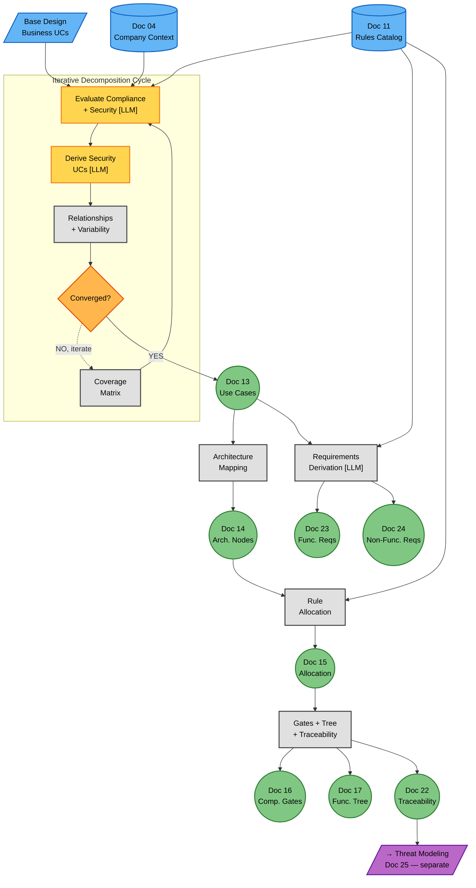

# Phase 3 — Decomposition (Flow Diagram)

**Version:** 1.0 — 2026-06-16
**Status:** ✅ Created
**Companion:** [`../Class_Models/phase3_decomposition.md`](../Class_Models/phase3_decomposition.md) (static structure)

---

## Overview

This flow diagram shows the **process** of running Phase 3 decomposition of the AEGIS methodology — transforming a base system design and the Phase 2 Rules Catalog into security use cases, architectural nodes, functional/non-functional requirements, and compliance gates.

Unlike Phases 1 and 2 (which were linear pipelines), **Phase 3 decomposition is an iterative cycle**. Use cases are not derived in one pass — they are refined through repeated evaluation of compliance and security gaps until convergence.

**Key premise:** The base system design (business use cases) is **received from outside** the methodology flow. We do not design the system — we analyse it for security and compliance, derive the security use cases that are missing, and transform that analysis into testable requirements.

### How Phase 3 differs from Phase 1/2

| Aspect | Phase 1 | Phase 2 | Phase 3 Decomposition |
|--------|---------|---------|----------------------|
| Topology | Linear | Linear + fork | **Iterative cycle + downstream** |
| Input | Regulations | Phase 1 artifacts | Base design + Rules Catalog |
| Output | Compliance matrix | Rules catalog | Security UCs + FRs/NFRs + gates |
| LLM use | Moderate (~40%) | High (~60%) | High (~60% in cycle, ~50% downstream) |
| Structure | 3 sub-phases (A→B→C) | 3 sub-phases (A→B→C) | **Cycle + 2 downstream blocks** |

---

## Main Flow Diagram



---

## Decision Points Explained

### DP1: The iterative cycle (evaluate → derive → converge)

The core of Phase 3 is not a linear pipeline but a **refinement cycle**. Each iteration:

1. **Scan coverage matrix** — identify which sub-domains and rules still lack security use cases
2. **Evaluate gaps** — for each gap, assess what security/compliance work is needed
3. **Derive security UCs** — create or refine use cases that address the gaps
4. **Map relationships + variability** — register «include»/«extend» (13a) and regulation-specific variants (13b)
5. **Check convergence** — if gaps remain, iterate again

The cycle exits when all convergence criteria are met (see below).

### DP2: Convergence gate ("Converged?")

Convergence is multi-dimensional — **not just** "all rules have a UC". Seven criteria must all pass:

| # | Criterion | What it checks |
|---|-----------|---------------|
| 1 | **Rule coverage** | Each applicable CR/BPR has ≥1 security UC |
| 2 | **Sub-domain coverage** | Each applicable sub-domain (of 38) has ≥1 UC |
| 3 | **Actor coverage** | Each security-relevant stakeholder participates in ≥1 UC |
| 4 | **Relationship closure** | All «include»/«extend» references resolve to existing UCs |
| 5 | **Variability closure** | All regulation-specific variants identified |
| 6 | **SLA coverage** | All time-bound obligations have UCs with defined SLAs |
| 7 | **No new gaps** | Last iteration found no new gaps |

If any criterion fails, the cycle continues. Expanded in [`phase3/phase3a_iterative_cycle.md`](phase3/phase3a_iterative_cycle.md).

### DP3: Fork after convergence

Converged security UCs (Doc 13) feed two parallel downstream paths:

- **Architecture path:** Doc 13 → Doc 14 (nodes) → Doc 15 (allocation)
- **Requirements path:** Doc 13 + Doc 11 → Doc 23 (FRs) + Doc 24 (NFRs)

Both paths converge at the compliance gates (Doc 16), which verify that every rule is allocated to a node with a defined verification method.

### DP4: Boundary — threat modeling is separate

Threat modeling (Doc 25 — Risk Analysis) is **NOT part of the decomposition**. It is a separate Phase 3 activity that consumes the decomposition outputs (UCs, nodes, FRs, NFRs) as input. The decomposition sends its outputs to threat modeling; it does not perform threat analysis itself.

---

## Dynamic Elements (Progressive Disclosure)

The cycle iterates a different number of times depending on company complexity:

| Element | Driver | LOW (Case 01) | HIGH (Case 02) | MAX (Case 03) |
|---------|--------|---------------|-----------------|----------------|
| Security UCs derived | Sub-domain coverage | 35 | ~50 | ~50 |
| Iterations to converge | Package count + rule density | 4-5 | 5-6 | 5-6 |
| Architectural nodes | UC count + decomposition depth | 49 | ~70 | ~70 |
| FRs derived | UC count + NFR count | 61 | ~80 | ~72 |
| NFRs derived | Goal count + regulation count | 46 | ~56 | ~50 |
| Compliance gates | Rule count + node count | ~46 | ~63 | ~63 |

**Key insight:** The iteration count does NOT scale linearly with regulation count. Case 03 (5 regs) converges in roughly the same number of iterations as Case 02 (4 regs) because the cycle targets sub-domain coverage, and there are only 38 sub-domains regardless of regulation count.

---

## Detailed Flows

The main diagram above collapses the cycle and downstream into ~15 nodes. The full granularity is expanded in dedicated detail files:

| Block | Detail file | What it expands |
|---|---|---|
| **Iterative Cycle** | [`phase3/phase3a_iterative_cycle.md`](phase3/phase3a_iterative_cycle.md) | Coverage matrix, gap evaluation, UC derivation, relationships/variability, 7 convergence criteria |
| **Requirements & Allocation** | [`phase3/phase3b_requirements.md`](phase3/phase3b_requirements.md) | Architecture mapping, FR/NFR derivation, rule-to-node allocation, gate generation, traceability matrix |

---

## Phase 2 Inputs Received

This section is the mirror of Phase 2C's "Phase 3 Handoff — Artifacts" table. It describes what Phase 3 RECEIVES from Phase 2 and other upstream phases.

| # | Input | Document | Section Read | Consumed by Phase 3 step | Purpose |
|---|-------|----------|--------------|--------------------------|---------|
| 1 | Rules Catalog | Doc 11 | §4 (Compliance Rules), §5 (Best Practice Rules), §7 (NI propagation), §11 (Key Observations) | DERIVE (3A), FR/NFR (3B), ALLOC (3B) | Source for UC derivation, FR/NFR derivation, rule allocation |
| 2 | Rules Catalog Excel | Doc 12 | All sheets, especially RULES_CATALOG and SUB_DOMAIN_MAPPING | DERIVE, ALLOC | Machine-readable rules for automated processing |
| 3 | Privacy & Security Goals | Doc 10 | §3 (Privacy Goals), §4 (Security Goals), §5 (Derivation Path), §6 (Risk Profile) | DERIVE (3A), NFR (3B) | Source for NFR derivation, risk profile mapping |
| 4 | Obligation Derivation | Doc 08 | §4 (Regulatory Obligations Catalog), §5 (Traceability Matrix), §6 (NI Propagation), §7 (Obligation Type Distribution) | DERIVE (3A) | Source obligations that UCs must cover |
| 5 | Strategic Tensions Report | Doc 09 | §4 (Tension Catalog), §3 (Structural vs Contextual), §5 (Resolution Strategy) | VAR (3A) | Resolution patterns inform UC variants and design decisions |
| 6 | Company Context | Doc 04 | §10 (Role Matrix / Stakeholders), §6 (Architecture), §8 (Business Goals) | ACTOR (3A), DECOMP (3B), FR (3B) | Source for actor assignment, node decomposition, requirement context |
| 7 | Compliance Matrix | Doc 07 | §5 (Clause-to-Sub-Domain Mapping), §6 (Coverage Analysis) | DERIVE (3A) | Cross-reference for UC-rule traceability |
| 8 | Design Decisions Log | Doc 03 | All entries (structural tension resolutions) | VAR (3A), DECOMP (3B) | Design constraints that UCs and nodes must respect |

**What Phase 3 reads from each input:** For each input, the table shows which §section is read and which Phase 3 step consumes it. This makes the data flow explicit and traceable.

**What Phase 3 does NOT read:** Phase 3 does NOT re-derive obligations (Doc 08), tensions (Doc 09), or rules (Doc 11). It assumes these are validated and complete. Phase 3 BEGINS from the converged state of Phase 2.

---

## Document Flow Summary

```
    Base Design (received)          Doc 11 (Rules Catalog)
         |                               |
         v                               v
    ┌──────── ITERATIVE CYCLE ────────┐
    │  Coverage → Evaluate → Derive    │
    │  → Relationships → Converged?    │
    │       ↑                ↓         │
    │       └── iterate ─────┘         │
    └──────────────┬──────────────────┘
                   │ (converged)
                   v
              Doc 13 (Security UCs)
              + 13a (Relationships)
              + 13b (Variability)
                   |
         ┌─────────┴─────────┐
         v                   v
     Doc 14               Doc 23 + 24
     (Nodes)              (FRs + NFRs)
         |                   |
         v                   |
     Doc 15 <────────────────┘
     (Allocation)
         |
         v
     Doc 16 + 17 + 22
     (Gates + Tree + Traceability)
         |
         v
     → Threat Modeling (Doc 25) — SEPARATE
```

Doc 13 is the **pivot** of Phase 3. Everything downstream depends on the security UCs being complete and converged. The iterative cycle exists precisely to ensure this completeness before committing to architecture and requirements.

---

## What This Diagram Does NOT Show

- **Coverage matrix structure:** the sub-domain × rule × UC × status matrix that drives the cycle — expanded in [`phase3/phase3a_iterative_cycle.md`](phase3/phase3a_iterative_cycle.md)
- **7 convergence criteria detail:** the full decision tree for the convergence gate — expanded in [`phase3/phase3a_iterative_cycle.md`](phase3/phase3a_iterative_cycle.md)
- **Node decomposition levels:** L1/L2/L3 hierarchy and track assignment (TECHNOLOGY/PROCESS/CAPABILITY_SUBREQ) — expanded in [`phase3/phase3b_requirements.md`](phase3/phase3b_requirements.md)
- **Allocation types:** DIRECT / SHARED / INHERITED decision logic — expanded in [`phase3/phase3b_requirements.md`](phase3/phase3b_requirements.md)
- **Verification methods:** TEST / INSPECT / DEMONSTRATE / ANALYZE selection criteria — expanded in [`phase3/phase3b_requirements.md`](phase3/phase3b_requirements.md)
- **Threat modeling process:** Doc 25 is produced by a separate Phase 3 activity, not shown here
- **FR/NFR derivation methodology:** how goals + UCs + rules combine into testable requirements — expanded in [`phase3/phase3b_requirements.md`](phase3/phase3b_requirements.md)

---

## Cross-Case Generalisation

The same iterative flow works for all three AEGIS case studies:

| Case | Company | Regs | Base UCs | Security UCs | Iterations | Nodes | FRs | NFRs |
|------|---------|------|----------|-------------|------------|-------|-----|------|
| Case 01 | TinyTask SaaS (8 emp) | 2 | ~15 | 35 | 4-5 | 49 | 61 | 46 |
| Case 02 | SecureBorder (450 emp) | 4 | ~25 | ~50 | 5-6 | ~70 | ~80 | ~56 |
| Case 03 | OmniBank (5000+ emp) | 5 | ~30 | ~50 | 5-6 | ~70 | ~72 | ~50 |

The structure is identical — only the iteration count and output volume scale. The cycle converges when sub-domain coverage reaches 100% (all applicable sub-domains have security UCs).

---

## Terminology Reconciliation

The Phase 3 flow diagrams, templates, and class model use slightly different terminology. This section reconciles them.

### §1 Convergence (Cycle) vs Stop Conditions (Gates)

| Flow term | Template term | Class model term | Canonical |
|-----------|---------------|------------------|-----------|
| Convergence Criterion C1-C7 (cycle exit) | Stop Condition SC1-SC5 (gate validation) | (not in class model) | **C1-C7 = cycle exit, SC1-SC5 = gate validation** |

**Mapping:** C1 ↔ SC1 (rule coverage), C5 ↔ SC4 (variability). SC3 and SC5 have no cycle equivalent.

### §2 Decomposition Levels

| Flow term | Template term | Class model term | Canonical |
|-----------|---------------|------------------|-----------|
| L1 / L2 / L3 | L1 / L2 / L3 (Doc 17) | L0_BOUNDARY / L1_PRIMARY / L2_SUBFLOW / LN_ATOMIC | **Flow uses L1/L2/L3; class model has 4 levels (L0 is the boundary/enterprise level, LN is atomic leaf)** |

**Note:** L0_BOUNDARY in the class model is the system boundary (the root of the decomposition tree). The flow's "L1" maps to the class model's "L2_SUBFLOW" because both represent the first decomposition level. L3 in the flow maps to LN_ATOMIC.

### §3 Tracks

| Flow term | Template term | Class model term | Canonical |
|-----------|---------------|------------------|-----------|
| TECHNOLOGY / PROCESS / CAPABILITY_SUBREQ | BUILD / BUY / CONFIGURE / OUTSOURCE (Doc 17 §5) | TECHNOLOGY / PROCESS / CAPABILITY_SUBREQ | **Flow + class model use T/P/C; template Doc 17 uses B/B/C/O (build vs acquire)** |

**Note:** These are different abstractions. T/P/C describes WHAT the node IS (system vs process vs role). B/B/C/O describes HOW it's acquired (built in-house vs bought vs configured vs outsourced). Both can apply to the same node (e.g., a SIEM Platform is TECHNOLOGY + BUY).

### §4 Gate Status

| Flow term | Template term | Class model term | Canonical |
|-----------|---------------|------------------|-----------|
| PASS / FAIL / PENDING | PLANNED / EXECUTED / PASSED / FAILED / PARTIAL (Doc 16) | PASS / GAP_DETECTED / PENDING | **Template's 5-state lifecycle is canonical; flow's 3-state is a simplification** |

**Mapping:** PENDING = PLANNED + EXECUTED, PASS = PASSED, FAIL = FAILED + PARTIAL (combined as GAP_DETECTED).

### §5 Relationship Types

| Flow term | Template term | Class model term | Canonical |
|-----------|---------------|------------------|-----------|
| «include» / «extend» (2 types) | (template doesn't specify) | INCLUDE / REFINE / EXTEND (3 types) | **Class model is canonical; flow's «refine» is NOT yet implemented** |

**Design gap:** Phase 3 flow diagrams only use «include» and «extend». The class model defines 3 types, with «refine» being a specialisation relationship. This is a known design gap to be addressed in future iterations.

### §6 Variability Types

| Flow term | Template term | Class model term | Canonical |
|-----------|---------------|------------------|-----------|
| ALTERNATIVE / SPECIALIZATION / OPTION (3 types) | (template doesn't specify) | NONE / ALTERNATIVE / SPECIALIZATION / OPTION (4 types) | **Class model is canonical (4 types); flow omits NONE** |

**Note:** NONE is the default — a UC with no variants. The flow doesn't need to explicitly model NONE; it's the absence of variability.

### §7 Traceability Levels

| Flow term | Template term | Class model term | Canonical |
|-----------|---------------|------------------|-----------|
| 8 levels (Reg→Clause→Rule→Goal→UC→Node→FR→Gate) | 10 levels (adds Risk + Mitigation Control) | (not specified) | **Template's 10 levels is canonical; flow's 8 is incomplete (missing Risk and Mitigation Control from Doc 25)** |

**Note:** Doc 22 is the ONLY Phase 3 document with 10 levels because it's the integration point for threat modeling. The cycle and gate flows operate on 8 levels (decomposition only).

---

## UC ID Canonical Format — Migration Status

The AEGIS methodology is migrating to canonical UC ID format. Currently, the 3 cases use different formats:

| Case | Current format | Example | Status |
|------|---------------|---------|--------|
| Case 01 | Hierarchical `U.C.X.Y.Z` | `U.C.3.1.1` (Submit Access Request) | Legacy |
| Case 02 | Domain-prefixed `UC-IAM-NN` | `UC-IAM-01` | Legacy |
| Case 03 | Flat sequential `UC-NN` | `UC-01` | **Canonical** |

**Canonical format:** `UC-NN` (flat sequential, 2-digit number, no domain prefix)

**Why canonical?**
1. **Uniqueness:** `UC-01` is globally unique (no repeated prefix means no ambiguity)
2. **Simplicity:** Single numbering scheme vs 3+ variants
3. **Cross-referencing:** Easier to reference `UC-14` than `U.C.3.1.1` or `UC-IAM-01`
4. **Consistency:** Aligns all 3 cases on the same format (Case 03 is already canonical)

**Migration script:** A renumbering script exists in `01_IMPLEMENTATION_TOOLS/scripts/renumber_ucs.py` (analogous to the FR renumbering scripts). See root `AGENTS.md` for the FR/NFR migration status table.

**Documentation impact:** This is a known migration issue, analogous to the FR/NFR one already documented in root `AGENTS.md`. The flow diagrams use the canonical format (UC-NN) throughout. When referring to legacy cases, both formats are noted for traceability.

**Renumbering scope:** Affects Doc 13, 13a, 13b, 14, 15, 16, 17, 22, 23, 24, and all cross-references. Estimated effort: ~20 documents per case × 3 cases = 60 documents.

---

### Colour Note

If the diagram appears with transparent or washed-out fills, the renderer may not support `classDef` styling. Try:
- **GitHub:** renders natively — should work
- **VS Code:** "Markdown Preview Mermaid Support" extension
- **Browser:** paste into [mermaid.live](https://mermaid.live/)
- **Dark mode:** fills are medium-saturation; text is explicit `color:#000`

| Colour | Meaning | Phase 3 usage |
|--------|---------|----------------|
| Blue (#64B5F6) | Input / output | Phase 2 inputs (Doc 11, Doc 04, etc.) |
| Grey (#E0E0E0) | Deterministic process | Coverage matrix, actor/SLA, relationship closure, node allocation |
| Amber (#FFD54F) | LLM reasoning | Gap evaluation, UC derivation, node decomposition, NFR/FR derivation |
| Green (#81C784) | Document | Doc 13, 13a, 13b, 14, 15, 16, 17, 22, 23, 24 |
| Orange (#FFB74D) | Decision / gate | Gap check, convergence gate, allocation complete? |
| Purple (#BA68C8) | Phase transition | To threat modeling (Doc 25, separate) |
| **Teal (#80DEEA)** | **File / Excel / drawio** | **Doc 22 Traceability Matrix (.xlsx), Doc 18 Functional Tree (.drawio)** |

#### LLM Numbering

Phase 3 introduces 5 LLM reasoning points, continuing the series from Phase 1 and Phase 2:

| Phase | LLM points | Naming convention |
|-------|-----------|-------------------|
| Phase 1B | LLM-A, B, C, D | Alphabetical (A-D) |
| Phase 1C | LLM-E, F, G, H | Alphabetical (E-H) |
| Phase 2A | LLM-A (GRP), B (ACT), C (DESC), D (NUAN) | Restarted alphabetical (per-phase) |
| Phase 2B | 2B-1, 2B-2, 2B-3 | Phase-numbered |
| Phase 2C | 2C-1, 2C-2, 2C-3 | Phase-numbered |
| Phase 3A | 3A-1 (EVAL), 3A-2 (DERIVE) | Phase-numbered |
| Phase 3B | 3B-1 (DECOMP), 3B-2 (NFR), 3B-3 (FR) | Phase-numbered |

**Note:** Phase 2A restarted the alphabetical series (A-D) within its own sub-phase, which breaks cross-phase continuity. Phase 2B onwards adopted phase-numbered naming. For Phase 3, we use phase-numbered naming: 3A-1, 3A-2, 3B-1, 3B-2, 3B-3.

---

**See also:**
- [`phase3_overview.md`](phase3_overview.md) — Phase 3 global overview (entry point, shows decomposition + threat modeling loop)
- [`../Class_Models/phase3_decomposition.md`](../Class_Models/phase3_decomposition.md) — Static structure (class diagram)
- [`phase2_elaboration_secure_design.md`](phase2_elaboration_secure_design.md) — Phase 2 overview (predecessor)
- [`phase3/phase3a_iterative_cycle.md`](phase3/phase3a_iterative_cycle.md) — Iterative cycle detail
- [`phase3/phase3b_requirements.md`](phase3/phase3b_requirements.md) — Requirements & allocation detail
- [`phase3_risk_analysis.md`](phase3_risk_analysis.md) — Threat modeling sub-overview (consumer of decomposition outputs)
