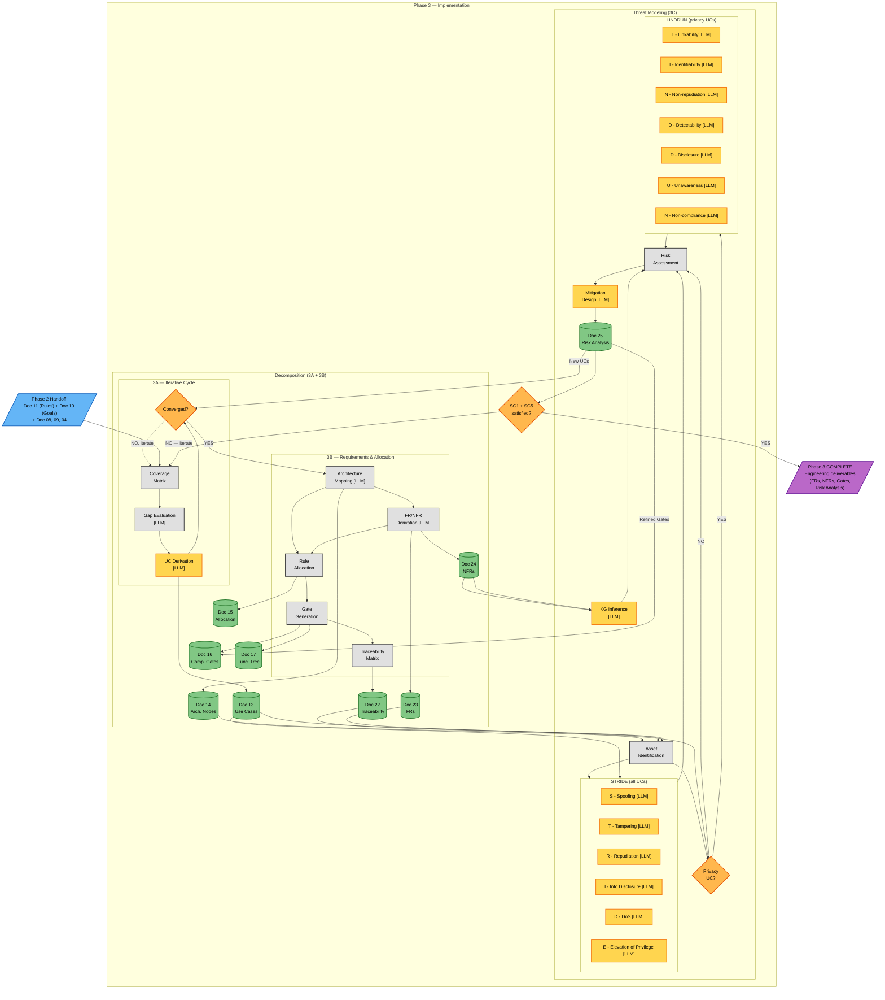
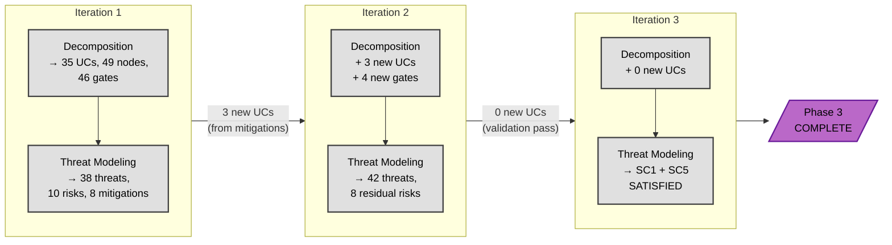

# Phase 3 — Implementation (Overview)

**Version:** 1.0 — 2026-06-17
**Status:** ✅ Created
**Companions:** [`Class_Models/phase3_decomposition.md`](../Class_Models/phase3_decomposition.md) (static structure A) and [`Class_Models/phase3_risk_analysis.md`](../Class_Models/phase3_risk_analysis.md) (static structure B)

---

## Overview

This is the **entry point for Phase 3** of the AEGIS methodology. It explains what Phase 3 does as a whole, how its two sub-phases (decomposition and threat modeling) relate, and how they loop until all stop conditions are satisfied.

**Phase 3 has two sub-phases that work in a loop:**

| Sub-phase | Purpose | Sub-folder | Detail files |
|-----------|---------|------------|---------------|
| **Decomposition** | Turn compliance rules into security use cases, architecture, requirements, and compliance gates | `phase3/` (parts A + B) | `phase3a_iterative_cycle.md`, `phase3b_requirements.md`, `phase3a_decomposition_reference.md`, `phase3b_requirements_reference.md` |
| **Threat Modeling** | Identify threats, assess risks, design mitigations, and feed new requirements back to decomposition | `phase3/` (part C) | `phase3c_threat_modeling.md`, `phase3c_risk_reference.md` |

**The loop:** Decomposition produces the system design (UCs, nodes, FRs, gates). Threat modeling analyses that design for threats, identifies risks, and designs mitigations. Some mitigations require new functionality — which means new UCs, which go BACK to decomposition. The loop converges when both **SC1** (all rules have UCs and gates) and **SC5** (all residual risks are LOW) are satisfied.

**Why a loop and not a waterfall?** Because compliance ≠ security (P1 principle). A system can pass all compliance gates and still be vulnerable to threats that nobody anticipated during requirements derivation. The feedback loop is the mechanism that ensures the system design is informed by both regulatory obligations (top-down) and threat reality (bottom-up).

**Phase 3 is the final phase of the AEGIS methodology.** Its outputs (FRs, NFRs, nodes, gates, traceability matrix, risk analysis) are the engineering artifacts that the company actually implements. The output of Phase 3 is not a "next phase input" — it IS the deliverable.

---

## Main Flow Diagram

**Reading the diagram:** Phase 2 inputs (rules, goals, context) feed into decomposition. Decomposition has two internal stages:

- **3A — Iterative Cycle:** coverage matrix → gap evaluation (LLM) → UC derivation (LLM) → convergence check. The cycle loops internally until all 7 convergence criteria are met, at which point it produces Doc 13 (Use Cases).
- **3B — Requirements & Allocation:** after the cycle converges, architecture mapping (LLM) → FR/NFR derivation (LLM) → rule allocation → gate generation → traceability matrix. This is linear and produces Docs 14, 15, 16, 17, 22, 23, 24.

Threat modeling (3C) consumes the decomposition outputs, runs STRIDE on all UCs and LINDDUN on privacy UCs in parallel, augments with KG inferences, assesses risks, designs mitigations, and produces Doc 25. Mitigations that need new functionality loop back to the decomposition cycle as a second iteration. The loop terminates when both SC1 and SC5 are satisfied — at that point, the engineering deliverables (FRs, NFRs, gates, risk analysis) are complete and ready for implementation.

---

## The Convergence Loop (in detail)

The loop between decomposition and threat modeling is **temporal, not parallel**. Each iteration follows the same sequence:

### What happens in each iteration

1. **Decomposition pass** — the cycle runs (or re-runs) over the current UC catalog. If new UCs have been added by the previous threat modeling iteration, those are decomposed into nodes, FRs, NFRs, and gates.
2. **Threat modeling pass** — STRIDE + LINDDUN are applied to the current UC catalog. Risks are scored. Mitigations are designed. Some mitigations require new UCs.
3. **Stop condition check** — both SC1 and SC5 must pass.

### Iterations (typical pattern)

**Key point:** Iteration 3 produces no new UCs because the previous iteration was a validation pass. This is the "stable state" that confirms convergence.

### Cross-case iteration counts

| Case | Company | Regs | Iterations | New UCs from mitigations | Final UC count |
|------|---------|------|------------|--------------------------|-----------------|
| Case 01 | TinyTask SaaS (8 emp) | 2 | 1-2 | 3 | 35 |
| Case 02 | SecureBorder (450 emp) | 4 | 2-3 | 5 | ~50 |
| Case 03 | OmniBank (5000+ emp) | 5 | 2-3 | 4 | ~50 |

**Pattern:** The iteration count does not scale linearly with regulation count. More regulations mean more sub-domains are covered, but the loop converges in 1-3 iterations regardless. The bottleneck is not regulation count — it's whether the first decomposition pass produced UCs that adequately cover the threat surface.

---

## Sub-phase Summaries

### Decomposition (3A + 3B)

**What it does:** Transforms the Rules Catalog (from Phase 2) into a complete system design. The process has two views:

- **3A — Iterative Cycle:** Receives the base system design + Rules Catalog. Evaluates each UC for security/compliance gaps. Derives security use cases (Doc 13) + relationships (Doc 13a) + variants (Doc 13b) iteratively until 7 convergence criteria are met.
- **3B — Requirements & Allocation:** After the cycle converges, maps UCs to architectural nodes (Doc 14), derives FRs (Doc 23) and NFRs (Doc 24), allocates rules to nodes (Doc 15), generates compliance gates (Doc 16) with acceptance criteria, builds the functional tree (Doc 17), and produces the traceability matrix (Doc 22).

**Sub-overview:** [`phase3_decomposition.md`](phase3_decomposition.md) (389 lines)

### Threat Modeling (3C)

**What it does:** Receives the decomposition outputs (Docs 13–17, 22–24), identifies assets, applies STRIDE (security) and LINDDUN (privacy) threat analysis frameworks per UC, assesses risks against a 4×4 matrix, designs mitigations (Doc 25), checks coverage (every threat → ≥1 FR), and feeds new UCs and refined gates BACK to decomposition.

**Sub-overview:** [`phase3_risk_analysis.md`](../phase3_risk_analysis.md) (272 lines)

---

## Stop Conditions

The Phase 3 loop terminates when **both** of the following are satisfied:

| Condition | Source | Criterion | Owner |
|-----------|--------|-----------|-------|
| **SC1** — Rule coverage | Decomposition (3A) | Every applicable CR/BPR from Doc 11 has ≥1 security UC, and every UC has ≥1 compliance gate with PASSED status | Decomposition cycle |
| **SC5** — Residual risk | Threat modeling (3C) | Every identified risk has a mitigation, and the residual risk score after mitigation is LOW (< 6) | Threat modeling pass |

**If only SC1 passes but SC5 fails:** the system design is complete but not threat-informed. Need another threat modeling pass (or more aggressive mitigations) to reach SC5.

**If only SC5 passes but SC1 fails:** the threats are mitigated but some rules have no UC. Need another decomposition pass to add the missing UCs.

**If both fail:** both sub-phases need to iterate. New UCs from mitigations drive a decomposition re-pass; re-derived gates drive a threat modeling re-pass.

---

## Inputs (from Phase 2)

Phase 3 receives from Phase 2:

| # | Input | Document | Used by |
|---|-------|----------|---------|
| 1 | Rules Catalog | Doc 11 | Decomposition (UC derivation, FR/NFR, allocation, gates) |
| 2 | Rules Catalog Excel | Doc 12 | Decomposition (machine-readable processing) |
| 3 | Privacy & Security Goals | Doc 10 | Decomposition (NFR derivation, risk profile) |
| 4 | Obligation Derivation | Doc 08 | Decomposition (UC traceability) |
| 5 | Strategic Tensions Report | Doc 09 | Decomposition (UC variants from contextual resolutions) |
| 6 | Company Context | Doc 04 | Both (actor assignment, asset identification, node decomposition) |
| 7 | Compliance Matrix | Doc 07 | Decomposition (UC-rule traceability) |
| 8 | Design Decisions Log | Doc 03 | Both (design constraints, architectural decisions) |

Full input breakdown in [`phase3_decomposition.md`](phase3_decomposition.md) § "Phase 2 Inputs Received".

---

## Outputs (Phase 3 Deliverables)

Phase 3 produces the following engineering artifacts. These are the methodology's final output — there is no Phase 4.

| # | Deliverable | Document | Content |
|---|-------------|----------|---------|
| 1 | Security Use Cases | Doc 13 | UC catalog with actors, SLAs, priorities |
| 2 | UC Relationships | Doc 13a | «include» / «extend» graph |
| 3 | UC Variability | Doc 13b | Regulation-specific variants |
| 4 | Architectural Nodes | Doc 14 | Process / IT System / Human Role nodes |
| 5 | Requirements Allocation | Doc 15 | Rule → Node mapping |
| 6 | Compliance Gates | Doc 16 | Verification gates with acceptance criteria |
| 7 | Functional Tree | Doc 17 | Hierarchical decomposition (L1/L2/L3) |
| 8 | Traceability Matrix | Doc 22 | Full 10-level chain (Regulation → ... → Mitigation) |
| 9 | Functional Requirements | Doc 23 | Testable FRs with verification methods |
| 10 | Non-Functional Requirements | Doc 24 | Measurable quality attributes |
| 11 | Risk Analysis | Doc 25 | Threats, risks, mitigations, residual risk |

---

## Cross-Case Generalisation

The same loop pattern works for all three case studies, with different volumes:

| Case | Company | Phase 2 output | Decomposition | Threat Modeling | Feedback loop | Final output |
|------|---------|----------------|---------------|-----------------|---------------|--------------|
| Case 01 | TinyTask SaaS (8 emp) | 46 rules, 23 obligations | 35 UCs, 49 nodes, 46 gates, 61 FRs, 46 NFRs | 38 threats, 10 risks, 8 mitigations | 1-2 iterations, 3 new UCs | All 11 deliverables |
| Case 02 | SecureBorder (450 emp) | 63 rules, 38 obligations | ~50 UCs, ~70 nodes, ~63 gates, ~80 FRs, ~56 NFRs | ~50 threats, 15 risks, 12 mitigations | 2-3 iterations, 5 new UCs | All 11 deliverables |
| Case 03 | OmniBank (5000+ emp) | 63 rules, 38 obligations | ~50 UCs, ~70 nodes, ~63 gates, ~72 FRs, ~50 NFRs | ~50 threats, 12 risks, 10 mitigations | 2-3 iterations, 4 new UCs | All 11 deliverables |

**Key observation:** Case 02 has MORE HIGH risks than Case 03 despite having fewer regulations. This is because Case 02's mix of regulations (GDPR + CRA + NIS 2 + AI Act) creates more cross-regulation threat scenarios than Case 03's mix (which includes DORA, whose lex specialis rule pre-empts several threat patterns).

---

## Detailed Flows

This overview shows the high-level loop. The detailed sub-phase flows are in dedicated files:

| Block | Sub-overview | Detail files | Reference companions |
|-------|-------------|-------------|----------------------|
| **Decomposition (3A + 3B)** | [`phase3_decomposition.md`](phase3_decomposition.md) | [`phase3a_iterative_cycle.md`](phase3a_iterative_cycle.md), [`phase3b_requirements.md`](phase3b_requirements.md) | [`phase3a_decomposition_reference.md`](phase3a_decomposition_reference.md), [`phase3b_requirements_reference.md`](phase3b_requirements_reference.md) |
| **Threat Modeling (3C)** | [`phase3_risk_analysis.md`](../phase3_risk_analysis.md) | [`phase3c_threat_modeling.md`](phase3c_threat_modeling.md) | [`phase3c_risk_reference.md`](phase3c_risk_reference.md) |

Total Phase 3 content: 8 files, ~3,700 lines (overview + sub-overviews + 3 details + 3 references + 1 global overview).

---

## What This Overview Does NOT Show

- **Decomposition cycle details:** the 7 convergence criteria, the coverage matrix, UC derivation patterns — see [`phase3a_iterative_cycle.md`](phase3a_iterative_cycle.md)
- **Architecture and requirements detail:** node decomposition, NFR taxonomy, FR derivation, traceability chain — see [`phase3b_requirements.md`](phase3b_requirements.md)
- **Threat analysis detail:** STRIDE per UC, LINDDUN per privacy UC, risk matrix, mitigation strategies — see [`phase3c_threat_modeling.md`](phase3c_threat_modeling.md)
- **Catalogs and patterns:** STRIDE patterns, LINDDUN patterns, D3FEND mapping, package structure, NFR taxonomy — see the three reference files

---

### Colour Note

| Colour | Meaning |
|--------|---------|
| Blue (#64B5F6) | Input (Phase 2 handoff) |
| Grey (#E0E0E0) | Deterministic process |
| Amber (#FFD54F) | LLM reasoning (used in sub-phase diagrams) |
| Green (#81C784) | Document (Phase 3 output) |
| Orange (#FFB74D) | Decision / stop condition |
| Purple (#BA68C8) | Phase completion (output) |

If fills appear washed out: GitHub renders natively; VS Code needs "Markdown Preview Mermaid Support" extension; browser can paste into [mermaid.live](https://mermaid.live/).

---

**See also:**
- [`phase3_decomposition.md`](phase3_decomposition.md) — Decomposition sub-overview (entry to 3A/3B)
- [`phase3_risk_analysis.md`](../phase3_risk_analysis.md) — Threat modeling sub-overview (entry to 3C)
- [`phase2_elaboration_secure_design.md`](../phase2_elaboration_secure_design.md) — Phase 2 overview (predecessor)
- [`../Class_Models/phase3_decomposition.md`](../Class_Models/phase3_decomposition.md) — Class diagram for decomposition
- [`../Class_Models/phase3_risk_analysis.md`](../Class_Models/phase3_risk_analysis.md) — Class diagram for threat modeling
