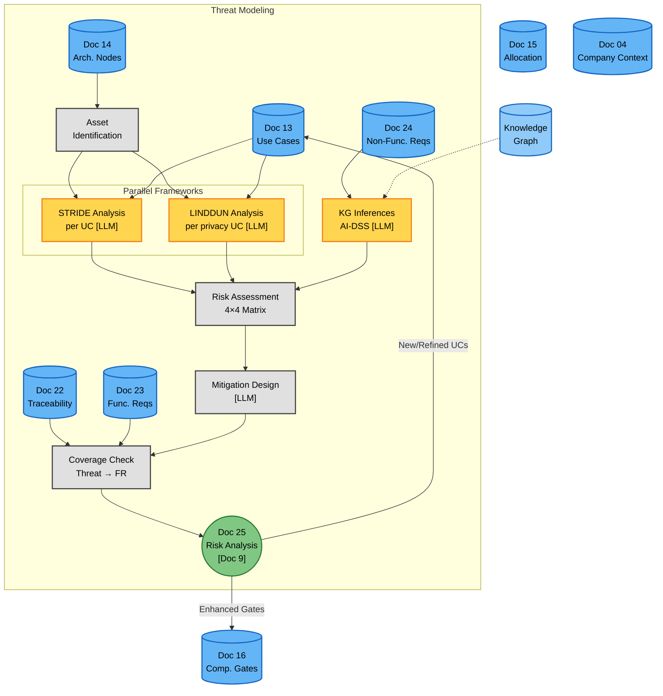

# Phase 3C — Threat Modeling (Risk Analysis) (Flow Diagram)

**Version:** 1.0 — 2026-06-16
**Status:** ✅ Created
**Companion:** [`../Class_Models/phase3_risk_analysis.md`](../Class_Models/phase3_risk_analysis.md) (static structure)

---

## Overview

This flow diagram shows the **process** of running Phase 3C — the threat modeling (risk analysis) sub-phase of the AEGIS methodology. It consumes the outputs of Phase 3A/3B decomposition (use cases, architectural nodes, FRs/NFRs, compliance gates, traceability matrix) and produces Doc 25 (Risk Analysis).

The critical innovation of Phase 3C is the **feedback loop**: mitigations do not just produce a report — they create new or refined use cases that go back through the decomposition cycle as a second iteration.

**Key premise:** Decomposition answers "what security/compliance work is needed?" Threat modeling answers "what can go wrong, how likely is it, and how do we mitigate it?" Both are needed because compliance ≠ security (P1 principle): a system can pass all compliance gates and still be vulnerable to threats that were never anticipated during requirements derivation.

### How Phase 3C differs from Phase 3A/3B

| Aspect | Phase 3A/B (Decomposition) | Phase 3C (Threat Modeling) |
|--------|---------------------------|---------------------------|
| Topology | Iterative cycle + linear downstream | Parallel frameworks + feedback loop |
| Input | Base design + Rules Catalog | Decomposition outputs (UCs, nodes, FRs, gates) |
| Output | UCs, nodes, FRs, gates, traceability | Doc 25 (Risk Analysis) + new/refined UCs (feedback) |
| Frameworks | None (methodology-internal) | STRIDE (security) + LINDDUN (privacy) + KG inferences + D3FEND |
| LLM use | ~65% (gap evaluation, UC derivation, FR writing) | ~60% (threat hypothesis, mitigation design, KG inference) |
| Key innovation | Iterative convergence (7 criteria) | Feedback loop (mitigations → re-decomposition) |

---

## Main Flow Diagram



---

## Decision Points Explained

### DP1: Parallel STRIDE + LINDDUN

Threat analysis uses two frameworks IN PARALLEL, not sequentially:

| Framework | When | Categories | Output |
|-----------|------|-----------|--------|
| **STRIDE** | Every UC (all UCs) | Spoofing, Tampering, Repudiation, Info Disclosure, DoS, Elevation of Privilege | Security threats (THR-XXX-01..06) |
| **LINDDUN** | Only UCs that process personal data | Linkability, Identifiability, Non-repudiation, Detectability, Disclosure, Unawareness, Non-compliance | Privacy threats (THR-PRIV-01..07) |

**Why parallel:** Security and privacy threats have different natures and require different mitigations. Running them sequentially would miss the interaction effects (e.g., a DoS attack that prevents data subjects from exercising their erasure right is BOTH a security AND a privacy issue).

### DP2: KG inferences augment human analysis

The knowledge graph (Neo4j) stores relationships between UCs, assets, and known threat patterns. After human analysis, the KG is queried to **infer** additional threats that the analyst may have missed.

| Inference type | Source pattern | Example |
|---------------|----------------|---------|
| **Inferred threat** | UC + Asset + known attack pattern | "UC-14 (auth) + AST-01 (credentials) → credential stuffing" |
| **Inferred mitigation** | Threat + known D3FEND countermeasure | "THR-IAM-01 (spoofing) → MFA (D3-MA)" |
| **Inferred dependency** | Component + external entity | "CI/CD Pipeline → External Repo → supply chain risk" |

**Why augment, not replace:** Human analysts understand business context (which threats are realistic given the company's sector, architecture, and threat landscape). The KG provides pattern matching that humans may forget. Both are needed.

### DP3: Risk Treatment Decision Tree

For each identified risk, one of four treatments is selected:

| Treatment | When | Action |
|-----------|------|--------|
| **MITIGATE** | Risk score ≥ 12 (HIGH) or ≥ 16 (CRITICAL) | Design control, add to mitigation list |
| **ACCEPT** | Risk score < 6 (LOW) and residual is acceptable | Document acceptance rationale |
| **TRANSFER** | Risk can be shifted to a third party (insurance, MSSP) | Document transfer mechanism |
| **AVOID** | Risk is too high and mitigation is too costly | Remove the feature/UC that creates the risk |

**Stop condition (SC5):** All residual risks after treatment must be LOW (score < 6). If any residual risk is MEDIUM or above, additional mitigations are needed.

### DP4: Feedback loop to decomposition

The critical innovation of Phase 3C is the **feedback loop**. When a mitigation requires new functionality:

1. The mitigation strategy is **NEW_FUNCTIONAL_NODE** (new UC needed)
2. The new UC enters the **decomposition cycle (Phase 3A) again** as a new iteration
3. The decomposition cycle runs a **second pass** to derive nodes, FRs, and gates for the new UC
4. The new gates re-validate the compliance coverage (SC1)
5. The loop terminates when **SC5 is satisfied** (all residual risks LOW)

| Strategy | Feedback to decomposition? | Loop count |
|----------|---------------------------|------------|
| NEW_FUNCTIONAL_NODE | Yes — new UC | +1 iteration |
| STRENGTHEN_EXISTING | Yes — refine existing UC | +0 iterations (just refinement) |
| ARCHITECTURAL_CHANGE | Yes — new node, possibly new UC | +1 iteration |
| PROCESS_CONTROL | Optional — new process node | 0 or +1 iteration |

---

## Dynamic Elements (Progressive Disclosure)

| Element | Driver | LOW (Case 01) | HIGH (Case 02) | MAX (Case 03) |
|---------|--------|---------------|-----------------|----------------|
| Assets identified | System components | ~10 | ~15 | ~20 |
| STRIDE threats | UCs × 6 categories | ~30 | ~40 | ~38 |
| LINDDUN threats | Privacy UCs × 7 categories | 7 | 7 | 7 |
| Total threats | STRIDE + LINDDUN + KG | ~38 | ~50+ | ~50+ |
| Risks assessed | Threats with likelihood/impact | ~10 | ~15 | ~12 |
| HIGH/CRITICAL risks | Risks requiring mitigation | ~7 | ~10 | ~8 |
| Mitigations | Controls designed | ~8 | ~12 | ~10 |
| Decomposition iterations | Feedback loop count | 1-2 | 2-3 | 2-3 |
| New UCs from mitigations | NEW_FUNCTIONAL_NODE strategy | ~3 | ~5 | ~4 |
| KG inferences | AI-DSS discoveries | ~10 | ~15 | ~12 |

**Key insight:** The feedback loop adds 1-2 extra decomposition iterations in most cases. This is not overhead — it is the methodology's mechanism for ensuring that threat-informed requirements are integrated into the system design, not bolted on afterwards.

---

## Detailed Flows

The main diagram above collapses the threat modeling into ~10 nodes. The full granularity is expanded in dedicated detail files:

| Block | Detail file | What it expands |
|---|---|---|
| **Threat Modeling Process** | [`phase3/phase3c_threat_modeling.md`](phase3/phase3c_threat_modeling.md) | Asset identification, STRIDE per UC, LINDDUN per privacy UC, risk assessment, mitigation design, coverage check, feedback loop process |
| **Risk Reference** | [`phase3/phase3c_risk_reference.md`](phase3/phase3c_risk_reference.md) | STRIDE pattern catalog, LINDDUN pattern catalog, risk matrix, D3FEND mapping, mitigation strategy guide, KG inference examples |

---

## Document Flow Summary

```
Decomposition outputs (input):
  Doc 13 (UCs) + Doc 14 (Nodes) + Doc 15 (Allocation)
  + Doc 16 (Gates) + Doc 22 (Traceability) + Doc 23/24 (FRs/NFRs)
  + Doc 04 (Company Context)
                    |
                    v
    ┌─────── THREAT MODELING ────────┐
    │  Assets → STRIDE ∥ LINDDUN     │
    │         → KG Augment            │
    │         → Risk Assessment       │
    │         → Mitigation Design     │
    │         → Coverage Check        │
    │         → Doc 25                │
    └──────────────┬─────────────────┘
                   |
        ┌──────────┴──────────┐
        v                     v
   Doc 25 output      Feedback to decomposition
   (Risk Analysis)    (new UCs, refined gates)
                            |
                            v
                    Second decomposition
                    iteration (Phase 3A)
                            |
                            v
                    SC5 satisfied → CONVERGED
```

---

## What This Diagram Does NOT Show

- **STRIDE pattern catalog (per UC type):** which threats are typical for each kind of UC (auth, data, dev, gov) — expanded in [`phase3/phase3c_risk_reference.md`](phase3/phase3c_risk_reference.md)
- **LINDDUN pattern catalog (per data type):** which privacy threats apply to each type of personal data processing — expanded in reference file
- **Risk matrix 4×4:** the specific score thresholds and risk level boundaries — expanded in reference file
- **D3FEND technique mapping:** how mitigations map to MITRE D3FEND techniques — expanded in reference file
- **KG inference examples:** the specific patterns the knowledge graph uses to discover threats — expanded in reference file
- **Mitigation strategy selection guide:** when to use NEW_FUNCTIONAL_NODE vs STRENGTHEN_EXISTING vs ARCHITECTURAL_CHANGE vs PROCESS_CONTROL — expanded in reference file

---

## Cross-Case Generalisation

The same threat modeling flow works for all three AEGIS case studies:

| Case | Company | UCs | Threats | Risks | HIGH/CRIT | Mitigations | Feedback iterations |
|------|---------|-----|---------|-------|-----------|-------------|---------------------|
| Case 01 | TinyTask SaaS (8 emp) | 35 | ~38 | ~10 | ~7 | ~8 | 1-2 |
| Case 02 | SecureBorder (450 emp) | ~50 | ~50+ | ~15 | ~10 | ~12 | 2-3 |
| Case 03 | OmniBank (5000+ emp) | ~50 | ~50+ | ~12 | ~8 | ~10 | 2-3 |

The structure is identical — only the volume of analysis and feedback iterations scale. Case 03 has fewer HIGH risks than Case 02 because DORA-specific controls (e.g., ICT risk framework) pre-empt several threat scenarios.

---

### Colour Note

If the diagram appears with transparent or washed-out fills, the renderer may not support `classDef` styling. Try:
- **GitHub:** renders natively — should work
- **VS Code:** "Markdown Preview Mermaid Support" extension
- **Browser:** paste into [mermaid.live](https://mermaid.live/)
- **Dark mode:** fills are medium-saturation; text is explicit `color:#000`

| Colour | Meaning |
|--------|---------|
| Blue (#64B5F6) | Input (decomposition outputs) |
| Grey (#E0E0E0) | Deterministic process |
| Amber (#FFD54F) | LLM reasoning |
| Green (#81C784) | Document (Doc 25) |
| Orange (#FFB74D) | Decision / gate |
| Light Blue (#90CAF9) | External reference (Knowledge Graph) |

---

**See also:**
- [`phase3/phase3_overview.md`](phase3/phase3_overview.md) — Phase 3 global overview (entry point, shows decomposition + threat modeling loop)
- [`../Class_Models/phase3_risk_analysis.md`](../Class_Models/phase3_risk_analysis.md) — Static structure (class diagram)
- [`phase3/phase3_decomposition.md`](phase3/phase3_decomposition.md) — Phase 3A/B overview (predecessor, produces decomposition outputs)
- [`phase3/phase3c_threat_modeling.md`](phase3/phase3c_threat_modeling.md) — Threat modeling process detail
- [`phase3/phase3c_risk_reference.md`](phase3/phase3c_risk_reference.md) — Risk reference companion
