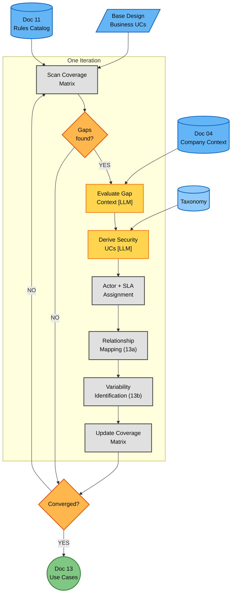
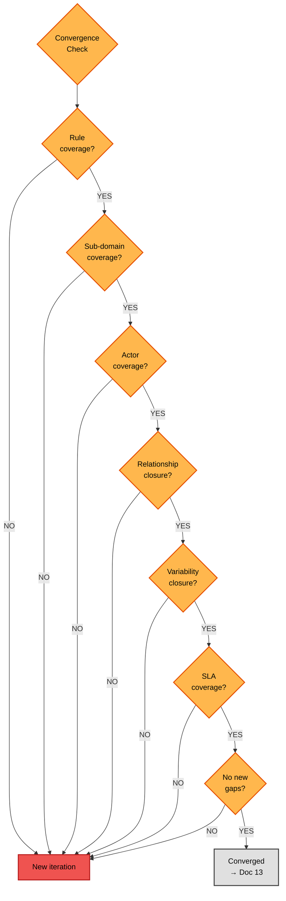

# Phase 3A — Iterative Decomposition Cycle (Detailed Flow)

**Version:** 1.0 — 2026-06-16
**Parent:** [`../phase3_decomposition.md`](../phase3_decomposition.md) (Phase 3 overview)
**Sources of truth:**
- [`../../../TEMPLATES/13_Use_Cases_Catalog.md`](../../../TEMPLATES/13_Use_Cases_Catalog.md) — Doc 13 template
- [`../../../TEMPLATES/13a_Use_Case_Relationships.md`](../../../TEMPLATES/13a_Use_Case_Relationships.md) — Doc 13a template
- [`../../../TEMPLATES/13b_Use_Case_Variability.md`](../../../TEMPLATES/13b_Use_Case_Variability.md) — Doc 13b template

---

## Overview

This diagram expands the **Iterative Decomposition Cycle** from the Phase 3 overview. It shows the process of receiving a base system design, evaluating it against the Rules Catalog for compliance and security gaps, and deriving security use cases iteratively until convergence.

The cycle produces **Doc 13 (Security Use Cases Catalog)**, **Doc 13a (Relationships)**, and **Doc 13b (Variability)**. The process has two views:

1. **Iteration process** (Diagram 1): How each iteration works — scan coverage matrix, evaluate gaps, derive UCs, map relationships/variability, update coverage, check convergence.
2. **Convergence decision tree** (Diagram 2): The 7 criteria that must all pass for the cycle to exit.

**Key premise:** The base system design (business use cases) is received from outside. We do not design the system — we evaluate it for security/compliance and derive the security UCs that are missing.

**LLM vs Deterministic:** The cycle is ~65% LLM. The LLM steps (gap evaluation, UC derivation, relationship inference) require semantic understanding of both the business context and the regulatory rules. Deterministic steps do the coverage matrix tracking, package assignment, and convergence checking.

**Why iterative (not one-shot):** A single pass over the Rules Catalog cannot identify all security UCs. The first iteration identifies obvious gaps (authentication, encryption). Subsequent iterations discover deeper needs (incident response, vulnerability management, supply chain security). Each iteration also reveals relationships and variants that may expose new gaps. The cycle converges when no new gaps are found.

---

## Diagram 1 — Iteration Process



### Step Reference (Diagram 1)

| Step | Name | Type | Doc Section | LLM |
|------|------|------|-------------|-----|
| SCAN | Scan Coverage Matrix | Process | (internal tracking) | — |
| GAPS | Gaps found? | Decision | (internal tracking) | — |
| EVAL | Evaluate Gap Context | LLM | Doc 13 §5 (per-UC rules) | [LLM] |
| DERIVE | Derive Security UCs | LLM | Doc 13 §5 (UC definitions) | [LLM] |
| ACTOR | Actor + SLA Assignment | Process | Doc 13 §5 (actors, SLA) | — |
| REL | Relationship Mapping | Process | Doc 13a §3–§4 | — |
| VAR | Variability Identification | Process | Doc 13b §3 | — |
| UPDATE | Update Coverage Matrix | Process | (internal tracking) | — |
| CONV | Converged? | Decision | Convergence criteria | — |

---

## Diagram 2 — Convergence Decision Tree



### Step Reference (Diagram 2)

| Step | Name | Type |
|------|------|------|
| Q | Convergence check entry | Decision |
| C1 | Rule coverage (each CR/BPR has >=1 UC) | Decision |
| C2 | Sub-domain coverage (each applicable sub-domain has >=1 UC) | Decision |
| C3 | Actor coverage (each stakeholder participates in >=1 UC) | Decision |
| C4 | Relationship closure (all include/extend resolve) | Decision |
| C5 | Variability closure (all regulation variants identified) | Decision |
| C6 | SLA coverage (all time-bound obligations have SLAs) | Decision |
| C7 | No new gaps (last iteration found nothing new) | Decision |
| FAIL | Trigger new iteration | — |
| PASS | Converged, produce Doc 13 | — |

---

## Coverage Matrix — The Cycle Driver

The coverage matrix is the **internal tracking artifact** that drives each iteration. It is not a formal document — it is a working tool used during the cycle.

### Structure

```
              | Rules applicable          | UCs derived    | Status
Sub-domain    | (from Doc 11)             | (this cycle)   |
--------------|---------------------------|----------------|--------
D-01.1        | CR-D-01.1-001             | UC-14          | Covered
D-01.2        | CR-D-01.2-001             | —              | GAP
D-02.1        | CR-D-02.1-001             | UC-09          | Covered
D-03.1        | CR-D-03.1-001             | UC-15          | Covered
D-04.3        | CR-D-04.3-001             | —              | GAP
...           | ...                       | ...            | ...
```

### How it drives iteration

| Iteration | What it targets | Typical outcome |
|-----------|----------------|-----------------|
| **1** | Obvious gaps (auth, encryption, logging) | 40-50% coverage |
| **2** | Incident response, vulnerability management | 70-80% coverage |
| **3** | Governance, training, supply chain | 90-95% coverage |
| **4+** | Edge cases, variants, relationship gaps | 100% coverage |

---

## 7 Convergence Criteria — Full Detail

### C1: Rule Coverage

**Rule:** Every applicable compliance rule (CR-D-XX.Y-NNN) and best-practice rule (BPR-D-XX.Y-NNN) from Doc 11 must have at least one security use case that operationalises it.

| Case | Rules applicable | UCs at convergence | Ratio |
|------|-----------------|-------------------|-------|
| Case 01 | 46 | 35 | 0.76 UCs/rule |
| Case 02 | ~63 | ~50 | ~0.79 |
| Case 03 | ~63 | ~50 | ~0.79 |

**Note:** Ratio is < 1.0 because one UC can cover multiple rules (e.g., UC-14 "User Authenticates" covers CR-D-03.1-001 and CR-D-03.2-001).

### C2: Sub-Domain Coverage

**Rule:** Every applicable sub-domain (from the 38 canonical sub-domains) must have at least one security use case.

| Case | Sub-domains applicable | Covered at convergence |
|------|----------------------|----------------------|
| Case 01 | 20/38 (52.6%) | 20/20 (100%) |
| Case 02 | 38/38 (100%) | 38/38 (100%) |
| Case 03 | 38/38 (100%) | 38/38 (100%) |

### C3: Actor Coverage

**Rule:** Every security-relevant stakeholder (from Doc 04) must participate in at least one security use case as primary or secondary actor.

| Case | Stakeholders from Doc 04 | Actors in UCs | Uncovered | Coverage |
|------|-------------------------|---------------|-----------|----------|
| Case 01 | 8 | 7 | 1 (CEO) | 87.5% |
| Case 02 | 12 | 11 | 1 (Auditor) | 91.7% |
| Case 03 | 15 | 14 | 1 (Regulator) | 93.3% |

**Detection rule:** For each stakeholder in Doc 04 §10, grep UC catalog for primary/secondary actor match.

**Common gap:** CISO-level roles often not in UCs (may be Doc 03 responsibility, not UC).

### C4: Relationship Closure

**Rule:** Every «include» and «extend» relationship registered in Doc 13a must point to an existing use case. No dangling references.

**OCL-style validation rule:** "Every «include» and «extend» reference must point to an existing UC in Doc 13."

| Case | Includes | Extends | Dangling | Integrity |
|------|----------|---------|----------|-----------|
| Case 01 | 12 | 3 | 0 | 100% |
| Case 02 | 20 | 6 | 0 | 100% |
| Case 03 | 18 | 5 | 0 | 100% |

**Common gap:** variants in 13b may reference UCs that don't exist in 13 (check cross-document).

### C5: Variability Closure

**Rule:** Every regulation-specific variant identified in Doc 13b must have a base use case and a presence condition. No orphaned variants.

**Validation rule:** "Every variant in Doc 13b must have a base UC, a presence condition, and a selection criterion."

| Case | Variants | With base UC | With presence condition | With selection | Complete |
|------|----------|-------------|----------------------|----------------|----------|
| Case 01 | 5 | 5 | 5 | 5 | 100% |
| Case 02 | 10 | 10 | 9 | 8 | 80% (2 missing selection) |
| Case 03 | 8 | 8 | 8 | 7 | 87.5% |

**Common gap:** SPECIALIZATION variants by regulation (GDPR vs CRA notification timeline) often lack explicit selection criteria.

### C6: SLA Coverage

**Rule:** Every time-bound obligation (notification deadlines, review frequencies) must have a use case with a defined SLA.

**Validation rule:** "Every time-bound obligation in the Rules Catalog (Doc 11) must have a UC with a defined SLA."

| Case | Time-bound obligations | UCs with SLA | Coverage |
|------|----------------------|--------------|----------|
| Case 01 | 8 | 8 | 100% |
| Case 02 | 12 | 11 | 91.7% (1 missing) |
| Case 03 | 15 | 15 | 100% |

**Common gap:** periodic obligations (quarterly reviews) may lack explicit SLA target dates.

### C7: No New Gaps

**Rule:** The last iteration must have completed without identifying any new gaps. This is the "stable state" check — if the last iteration found gaps and derived UCs for them, you need one more iteration to confirm no further gaps exist.

**"Stable state" validation:** the last iteration's coverage matrix must be identical to the previous iteration's (no new gaps discovered).

If last iteration found new gaps → another iteration is needed → C7 fails.

| Case | Iterations | Final iteration new gaps | C7 satisfied at |
|------|-----------|-------------------------|----------------|
| Case 01 | 4-5 | 0 | Iteration 5 |
| Case 02 | 5-6 | 0 | Iteration 6 |
| Case 03 | 5-6 | 0 | Iteration 6 |

**Note:** C7 is the "stop condition" for the cycle — it confirms that the previous iteration was a validation pass, not a gap-finding pass.

---

## Use Case Structure (Doc 13 Output)

Each security use case derived during the cycle follows this structure:

| Field | Description | Example |
|-------|-------------|---------|
| UC ID | Sequential within package | UC-14 |
| Name | Actor + Verb + Object | User Authenticates |
| Package | Domain grouping | PKG-IAM |
| Actors | Primary + Secondary | End User (P), Data Subject (P) |
| Description | What the UC does | User authenticates with credentials... |
| Rules | Source compliance rules | CR-D-03.2-001 |
| Regulation | Source regulation | GDPR Art. 32 |
| Priority | CRITICAL/HIGH/MEDIUM/LOW | CRITICAL |
| SLA | Time constraint | < 5 seconds |
| Relationships | include/extend refs | «include» UC-14 |

---

## Relationships (Doc 13a)

### Relationship Types

| Type | UML Stereotype | When used |
|------|---------------|-----------|
| **Include** | «include» | When a UC always uses another UC (e.g., all data-rights UCs «include» authentication) |
| **Extend** | «extend» | When a UC optionally extends another (e.g., MFA «extends» authentication) |

### Cross-case relationship count

| Case | «include» | «extend» | Total |
|------|-----------|----------|-------|
| Case 01 | ~12 | ~3 | ~15 |
| Case 02 | ~20 | ~6 | ~26 |
| Case 03 | ~18 | ~5 | ~23 |

### Class Model Constraints (OCL)

The class model's OCL invariants map to flow steps that enforce them:

| OCL Constraint | Source | Enforced by flow step | How |
|---------------|--------|----------------------|-----|
| **Coexistence** (no «include» and «refine» to same target) | `phase3_decomposition.md` class model | REL | After registering all relationships, check for target overlap. Flag for human review. |
| **Multiple Refines** (refined UC needs ≥2 refiners) | Class model | REL | When registering «refine», count existing refiners to target. Reject if <2. |
| **Level Consistency** («refine» goes higher→lower) | Class model | REL | Compare `level` attribute: source.level.ordinal() < target.level.ordinal(). Reject if violated. |
| **Orphan Prevention** (UC ≥L1 needs ≥1 incoming) | Class model | UPDATE | After each iteration, scan for UCs with no incoming «include» or «extend». Flag as orphans. |

**Note:** Phase 3 flow currently uses «include» and «extend» (2 types). The class model defines 3 types: INCLUDE, REFINE, EXTEND. The «refine» type is NOT yet used in the flow diagrams but IS defined in the class model. This is a known design gap — see `phase3_decomposition.md` for OCL details.

---

## Variability (Doc 13b)

### Variability Types

| Type | When used | Example |
|------|-----------|---------|
| **ALTERNATIVE** | Different paths for same goal | Break-glass auth vs normal auth |
| **SPECIALIZATION** | Regulation-specific variant | UC-32 specialized: GDPR 72h vs CRA 24h notification |
| **OPTION** | Optional feature | MFA enrollment (not mandatory for all users) |

---

## Gate Criteria — "Converged?"

This gate blocks progression to the downstream (architecture, requirements) until the cycle has converged:

| Criterion | LOW (Case 01) | HIGH (Case 02) | MAX (Case 03) |
|-----------|---------------|-----------------|----------------|
| All 7 convergence criteria pass | Required | Required | Required |
| Coverage matrix 100% | Required | Required | Required |
| Relationships documented (13a) | Required | Required | Required |
| Variability documented (13b) | Required | Required | Required |
| UC prioritization complete | Required | Required | Required |
| Packages validated | Required | Required | Required |

---

## Doc Section Mapping

This section maps flow nodes to specific document sections in Doc 13, 13a, 13b.

### Doc 13 (Use Cases Catalog) Section Mapping

| Template §section | Content | Produced by step |
|------------------|---------|------------------|
| §1 Document Purpose | (template) | (initial) |
| §2 Metadata | Derivation ID, date, iteration count | SCAN (auto) |
| §3 Stakeholder Catalog | Internal + External stakeholders from Doc 04 | ACTOR |
| §4 Business Goals Mapping | Goals from Doc 04 §8, mapped to packages | ACTOR |
| §5 Packages | Package structure (PKG-DP, PKG-SEC, etc.) | DERIVE |
| §6 Use Cases | Flat UC list with actors, descriptions, rules, SLAs | DERIVE + ACTOR + SLA |
| §7 UC Prioritization | CRITICAL/HIGH/MEDIUM/LOW distribution | DERIVE (NI-based) |
| §8 Relationship Catalog (pointers to 13a) | References to Doc 13a sections | REL |
| §9 Variability Catalog (pointers to 13b) | References to Doc 13b sections | VAR |
| §10 Version History | v1 → vN iteration log | UPDATE |

### Doc 13a (Use Case Relationships) Section Mapping

| Template §section | Content | Produced by step |
|------------------|---------|------------------|
| §1 Document Purpose | (template) | (initial) |
| §2 Package Structure | Package membership and UC count per package | REL |
| §3 «include» Relationships | UC-to-UC includes (e.g., data-rights UCs «include» auth) | REL |
| §4 «extend» Relationships | UC-to-UC extends (e.g., MFA «extends» auth) | REL |
| §5 Relationship Graph | Visual diagram (Mermaid graph) | REL |
| §6 Relationship Validation | OCL checks (no orphan UCs, no cycles) | REL (validation) |

### Doc 13b (Use Case Variability) Section Mapping

| Template §section | Content | Produced by step |
|------------------|---------|------------------|
| §1 Document Purpose | (template) | (initial) |
| §2 Variability Metadata | Variability ID, base UC reference | VAR |
| §3 Variability Types | ALTERNATIVE, SPECIALIZATION, OPTION | VAR |
| §4 Variant Definitions | Base UC + Variant UC + Presence Condition | VAR |
| §5 Selection Criteria | How to choose each variant | VAR |
| §6 Variability Validation | All variants have base UC, no orphaned variants | VAR (validation) |

---

## Cross-Case Comparison

| Dimension | Case 01 | Case 02 | Case 03 |
|-----------|---------|---------|---------|
| **Base UCs received** | ~15 | ~25 | ~30 |
| **Security UCs derived** | 35 | ~50 | ~50 |
| **Packages** | 6 | 7+ | 7+ |
| **Iterations to converge** | 4-5 | 5-6 | 5-6 |
| **Rules covered at convergence** | 46 | ~63 | ~63 |
| **Coverage at iteration 1** | ~45% | ~40% | ~40% |
| **Coverage at iteration 3** | ~90% | ~85% | ~85% |
| **Coverage at exit** | 100% | 100% | 100% |
| **Relationships (13a)** | ~15 | ~26 | ~23 |
| **Relationships per UC (density)** | ~0.43 | ~0.52 | ~0.46 |
| **Variants (13b)** | ~5 | ~10 | ~8 |
| **Variants per UC (density)** | ~0.14 | ~0.20 | ~0.16 |
| **CRITICAL UCs** | ~9 | ~14 | ~14 |
| **HIGH UCs** | ~13 | ~18 | ~18 |

**Key insight:** The number of security UCs plateaus around 35-50 regardless of company size, because there are only 38 sub-domains. More regulations mean more rules per sub-domain, not more sub-domains — so the UC count converges.

---

## What This Detail Does NOT Show

- **Full UC catalog per case:** the per-UC definitions (actors, descriptions, SLAs) are in Doc 13 §5, not in the flow diagram
- **Package structure rationale:** why UCs are grouped into specific packages is in Doc 13 §4
- **Relationship diagrams:** the visual «include»/«extend» graph is in Doc 13a §5
- **Variability scenarios:** the per-variant presence conditions and selection criteria are in Doc 13b §4
- **Architecture mapping:** how UCs map to architectural nodes — expanded in [`phase3b_requirements.md`](phase3b_requirements.md)
- **Threat modeling:** Doc 25 is a separate Phase 3 activity, not part of the cycle

---

## LLM Reasoning Points

The cycle has **2 primary LLM reasoning points** per iteration. Both require semantic understanding of the business scenario and the regulatory obligations that apply to it. The deterministic steps (coverage matrix tracking, package assignment, convergence checking) surround these two LLM steps but cannot replace them.

### [LLM] EVAL — Evaluate Gap Context

**Intention:** The EVAL step is the bridge between an abstract coverage gap ("sub-domain D-04.3 has no use case") and a concrete design decision ("this SaaS startup needs a UC for backup encryption, but it can inherit key management from its cloud provider"). A deterministic matcher could only flag that a gap exists; it cannot reason about whether the gap is critical, whether an existing UC already partially covers it, or whether the company's architecture reduces the obligation. EVAL produces the structured evaluation that DERIVE consumes to actually design the UC. Skipping EVAL or replacing it with a lookup would yield UCs that are either redundant (overlapping with existing ones) or unrealistic (asking a startup to run a 24/7 SOC).

| Field | Specification |
|-------|---------------|
| **Purpose** | For each identified coverage gap (a sub-domain or rule without a security use case), evaluate the business and regulatory context to understand what security work is needed |
| **Why LLM** | Gap evaluation requires semantic understanding of both the business scenario (what the use case does, what data flows through it) and the regulatory obligation (what the rule demands). "Does this UC need encryption?" depends on what data flows through it, not just its name. A deterministic matcher would miss subtle connections |
| **Input** | (1) Gap description (sub-domain + applicable rules with no UC); (2) Base use cases from the system design; (3) Rules Catalog (Doc 11) with rule descriptions; (4) Company context from Doc 04 (sector, architecture, deployment model, data types processed); (5) Coverage matrix (current state) |
| **Instructions** | For each gap: (a) Identify which base use cases touch the gap's sub-domain. (b) Assess what the applicable rules demand (encryption? access control? logging? notification?). (c) Determine if existing UCs partially address the gap (may need refinement rather than new UC). (d) If no existing UC addresses the gap, identify what security use case is needed. (e) Consider company architecture — a SaaS startup may inherit some controls from its cloud provider, reducing the gap. (f) Rate gap severity (CRITICAL if rule NI>=2.8, HIGH if 2.5-2.8, MEDIUM if 2.0-2.5, LOW if <2.0) |
| **KB Required** | Rules Catalog (Doc 11), Company Context (Doc 04), base use case catalog, canonical taxonomy (38 sub-domains), coverage matrix |
| **Output Format** | Set of gap evaluations: `{gapID, subDomain, applicableRules[], relatedBaseUCs[], severity, recommendation: NEW_UC \| REFINE_EXISTING \| INHERITED_FROM_PROVIDER, rationale}` |
| **Quality Criteria** | (1) Every gap in coverage matrix evaluated; (2) Severity rating matches rule NI; (3) Recommendation distinguishes new UC vs refinement vs inheritance; (4) Rationale references company architecture when claiming inheritance; (5) No gaps skipped without evaluation |

### [LLM] DERIVE — Derive Security Use Cases

**Intention:** DERIVE consumes the gap evaluations from EVAL and produces the actual security use cases that populate Doc 13. This is creative design work constrained by compliance — the LLM must invent a UC that is implementable by the company, testable against the rule, and traceable to a specific clause. The naming convention (Actor + Verb + Object), the package assignment, the actor selection, and the SLA derivation all require judgement that a lookup table cannot provide. A poorly-named UC ("Authentication" vs "User Authenticates") breaks Doc 13a relationship mapping; an unrealistic SLA (24/7 SOC for an 8-person startup) breaks Phase 3B allocation; a missing rule mapping breaks the traceability chain back to Phase 2. DERIVE is where the methodology's compliant-and-effective goal (P1) becomes concrete.

| Field | Specification |
|-------|---------------|
| **Purpose** | Design security use cases that address the identified gaps, with proper actors, descriptions, SLAs, rule mappings, and package assignments |
| **Why LLM** | Use case design requires understanding the actor who performs the action, the threat being mitigated, and the regulatory obligation being satisfied. This is creative design work informed by compliance — not a lookup. The LLM must produce UCs that are implementable, testable, and traceable to specific rules |
| **Input** | (1) Gap evaluation from EVAL step; (2) Canonical taxonomy for package assignment; (3) Actor catalog from Doc 04 (stakeholders); (4) Existing UC catalog (for relationship mapping and ID sequencing); (5) Company architecture for realistic SLA derivation; (6) Rules Catalog for rule-to-UC mapping |
| **Instructions** | For each gap marked NEW_UC: (a) Name the UC using Actor + Verb + Object convention ("User Authenticates", not "Authentication"). (b) Assign to appropriate package (PKG-DP, PKG-SEC, PKG-IAM, PKG-DEV, PKG-GOV, PKG-TRN). (c) Identify primary and secondary actors from stakeholder catalog. (d) Write 2-3 sentence description referencing company architecture. (e) Map applicable rules (CR-D-XX.Y-NNN). (f) Derive SLA from regulatory deadlines (GDPR 72h, CRA 24h, DORA 4h) or industry standards. (g) Assign priority based on rule NI. (h) Identify «include»/«extend» relationships to existing UCs. For REFINE_EXISTING: update the existing UC with additional rules/actors/SLA |
| **KB Required** | Canonical taxonomy (packages), stakeholder catalog (Doc 04), existing UC catalog, Rules Catalog (Doc 11), regulatory deadline reference |
| **Output Format** | Set of UC objects: `{UC-ID, name, package, actors{primary, secondary[]}, description, rules[], regulation, priority, SLA, relationships[{type: include\|extend, targetUC}]}` |
| **Quality Criteria** | (1) Every NEW_UC gap has a derived UC; (2) UC names follow Actor+Verb+Object convention; (3) Package assignment matches sub-domain; (4) Every UC has >=1 mapped rule; (5) SLAs are achievable given company size (startup can't do 24/7 SOC); (6) «include» targets exist in catalog; (7) UC IDs are sequential with no gaps |

---

## Relationship to Parent Diagram

```
Parent diagram (overview):

    subgraph CYCLE["Iterative Decomposition Cycle"]
        COV["Coverage Matrix"]
        EVAL["Evaluate [LLM]"]
        DERIVE["Derive UCs [LLM]"]
        REL["Relationships + Variability"]
        COV --> EVAL --> DERIVE --> REL --> CONV{"Converged?"}
        CONV -.->|NO| COV
    end

                     expanded to

This file (detail):

    Diagram 1 (iteration process): SCAN → GAPS → EVAL [LLM] → DERIVE [LLM]
                                   → ACTOR → REL → VAR → UPDATE → CONV

    Diagram 2 (convergence tree): Rule? → Sub-domain? → Actor? → Relationship?
                                 → Variability? → SLA? → No new gaps?
```

The parent collapses the coverage matrix scan, gap check, actor/SLA assignment, and 7 convergence criteria into 5 nodes. This file expands them.

---

### Colour Note

Uses the same high-contrast palette as the parent diagram:

| Colour | Meaning | Phase 3A usage |
|--------|---------|----------------|
| Blue (#64B5F6) | Input | Base design, Doc 11, Doc 04 |
| Light Blue (#90CAF9) | Static reference | Taxonomy |
| Grey (#E0E0E0) | Deterministic process | Coverage matrix, actor/SLA, relationships, variability |
| Amber (#FFD54F) | LLM reasoning | Gap evaluation, UC derivation |
| Green (#81C784) | Document | Doc 13 + 13a + 13b |
| Orange (#FFB74D) | Decision / gate | Gap check, convergence gate |

---

**See also:**
- [`../phase3_decomposition.md`](../phase3_decomposition.md) — Phase 3 overview (parent)
- [`../../../TEMPLATES/13_Use_Cases_Catalog.md`](../../../TEMPLATES/13_Use_Cases_Catalog.md) — Doc 13 template
- [`../../../TEMPLATES/13a_Use_Case_Relationships.md`](../../../TEMPLATES/13a_Use_Case_Relationships.md) — Doc 13a template
- [`../../../TEMPLATES/13b_Use_Case_Variability.md`](../../../TEMPLATES/13b_Use_Case_Variability.md) — Doc 13b template
- [`phase3b_requirements.md`](phase3b_requirements.md) — Requirements & allocation (successor)
- [`../Class_Models/phase3_decomposition.md`](../Class_Models/phase3_decomposition.md) — Static structure
