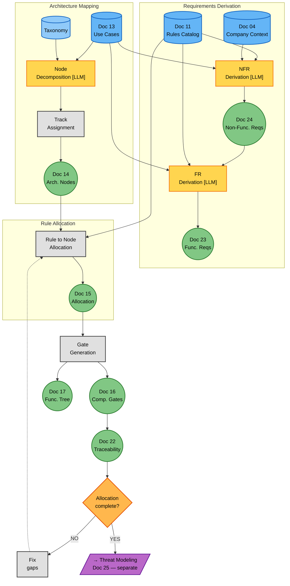
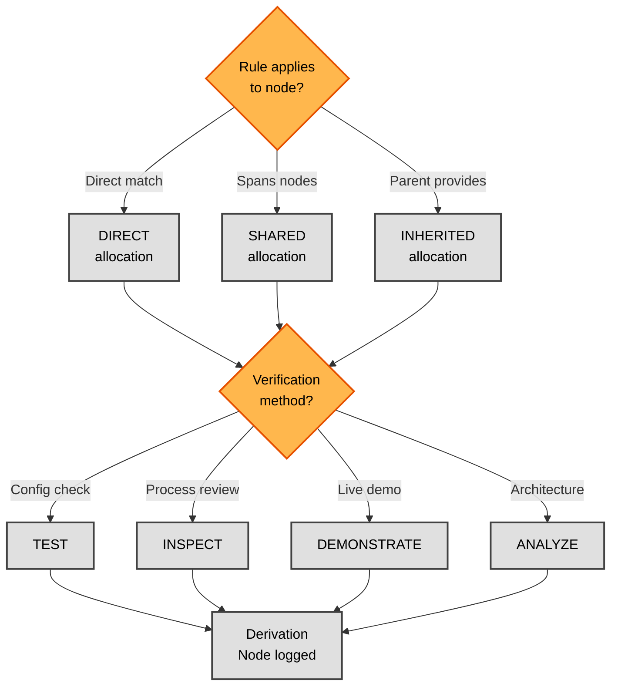

# Phase 3B — Requirements & Allocation (Detailed Flow)

**Version:** 1.0 — 2026-06-16
**Parent:** [`../phase3_decomposition.md`](../phase3_decomposition.md) (Phase 3 overview)
**Sources of truth:**
- [`../../../TEMPLATES/14_Architectural_Nodes.md`](../../../TEMPLATES/14_Architectural_Nodes.md) — Doc 14 template
- [`../../../TEMPLATES/15_Requirements_Allocation.md`](../../../TEMPLATES/15_Requirements_Allocation.md) — Doc 15 template
- [`../../../TEMPLATES/16_Compliance_Gates_Report.md`](../../../TEMPLATES/16_Compliance_Gates_Report.md) — Doc 16 template
- [`../../../TEMPLATES/23_Functional_Requirements.md`](../../../TEMPLATES/23_Functional_Requirements.md) — Doc 23 template
- [`../../../TEMPLATES/24_Non_Functional_Requirements.md`](../../../TEMPLATES/24_Non_Functional_Requirements.md) — Doc 24 template

---

## Overview

This diagram expands the **downstream block** from the Phase 3 overview — everything that happens **after** the iterative cycle converges. It shows how converged security use cases (Doc 13) and the Rules Catalog (Doc 11) are transformed into architectural nodes, functional/non-functional requirements, rule-to-node allocations, and compliance gates.

The downstream produces **Doc 14** (Architectural Nodes), **Doc 15** (Requirements Allocation), **Doc 16** (Compliance Gates), **Doc 17** (Functional Tree), **Doc 22** (Traceability Matrix), **Doc 23** (FRs), and **Doc 24** (NFRs). The process has two views:

1. **Downstream process** (Diagram 1): Architecture mapping → FR/NFR derivation → Rule allocation → Gate generation → Traceability
2. **Allocation decision tree** (Diagram 2): How each rule is allocated to a node (DIRECT / SHARED / INHERITED) and which verification method applies

**Key difference from Phase 3A:** Phase 3A is iterative; Phase 3B is **linear**. Once the UCs converge, the downstream runs as a pipeline. There is no feedback loop back to the cycle.

**LLM vs Deterministic:** The downstream is ~50% LLM. LLM steps (node decomposition, FR/NFR writing) require design judgment. Deterministic steps (allocation matrix, gate generation, traceability) are mechanical once the nodes and rules exist.

---

## Diagram 1 — Downstream Process



### Step Reference (Diagram 1)

| Step | Name | Type | Doc Section | LLM |
|------|------|------|-------------|-----|
| DECOMP | Node Decomposition | LLM | Doc 14 §4–§6 | [LLM] |
| TRACK | Track Assignment | Process | Doc 14 §8 | — |
| NFR | NFR Derivation | LLM | Doc 24 §3 | [LLM] |
| FR | FR Derivation | LLM | Doc 23 §3 | [LLM] |
| ALLOC | Rule to Node Allocation | Process | Doc 15 §4 | — |
| GATES | Gate Generation | Process | Doc 16 §3 | — |
| GATE_F | Allocation complete? | Decision | Doc 15 §6 | — |

---

## Diagram 2 — Allocation Decision Tree



### Step Reference (Diagram 2)

| Step | Name | Type |
|------|------|------|
| Q | Rule-node relationship? | Decision |
| DIRECT | Rule maps to exactly one node | Deterministic |
| SHARED | Rule spans multiple nodes | Deterministic |
| INHERITED | Rule satisfied by parent node | Deterministic |
| VM | Verification method selection | Decision |
| TEST | Automated configuration check | Deterministic |
| INSPECT | Manual process review | Deterministic |
| DEMONSTRATE | Live demonstration | Deterministic |
| ANALYZE | Architecture analysis | Deterministic |
| LOG | Derivation node recorded | — |

---

## Architecture Mapping — Process Detail

### Node Decomposition (LLM)

Each security use case is decomposed into one or more **architectural nodes**. A node represents a concrete implementation target — a process, a system, or a human role.

| Node Type | Track | When used | Example |
|-----------|-------|-----------|---------|
| **Process** | PROCESS | A defined procedure or workflow | Incident Response Process |
| **IT System** | TECHNOLOGY | A technical component or tool | SIEM Platform, IdP |
| **Human Role** | CAPABILITY_SUBREQ | A person with specific competencies | Security Analyst, DPO |

### Decomposition Levels

| Level | Meaning | Example |
|-------|---------|---------|
| **L1** | Enterprise level (high-level) | Security Operations |
| **L2** | Process/system level | Incident Response Process |
| **L3** | Detailed implementation | MFA Administration |

### Cross-case node distribution

| Case | Process | IT System | Human Role | Total |
|------|---------|-----------|------------|-------|
| Case 01 | 20 (41%) | 17 (35%) | 12 (24%) | 49 |
| Case 02 | ~30 | ~25 | ~15 | ~70 |
| Case 03 | ~30 | ~25 | ~15 | ~70 |

---

## Doc Section Mapping

This section maps flow nodes (Diagram 1 steps) to specific document sections in the Phase 3 output documents. Each downstream artifact (Doc 14, 15, 16, 17, 22, 23, 24) follows a fixed template; the table below identifies which flow step produces which template section.

### Doc 14 (Architectural Nodes) Section Mapping

| Template §section | Content | Produced by step |
|------------------|---------|------------------|
| §1 Document Purpose | (template) | (initial) |
| §2 Metadata | Catalog ID, completion date, source UC catalog | DECOMP |
| §3 Node Definition Structure | Field schema (Node ID, Type, Name, Level, Track) | DECOMP |
| §4 Process Nodes | PROCESS-type nodes (20 in Case 01) | DECOMP + TRACK |
| §5 IT System Nodes | IT_SYSTEM-type nodes (17 in Case 01) | DECOMP + TRACK |
| §6 Human Role Nodes | HUMAN_ROLE-type nodes (12 in Case 01) | DECOMP + TRACK |
| §7 Node Hierarchy | Parent-child tree (L1→L2→L3) | DECOMP |
| §8 Track Distribution | TECHNOLOGY/PROCESS/CAPABILITY_SUBREQ counts | TRACK |
| §9 Implementation Mode | NATIVE/INHERITED/HYBRID distribution | TRACK |
| §10 Version History | v1 → vN log | (manual) |

### Doc 15 (Requirements Allocation) Section Mapping

| Template §section | Content | Produced by step |
|------------------|---------|------------------|
| §1 Document Purpose | (template) | (initial) |
| §2 Metadata | Allocation ID, source rules, nodes | ALLOC |
| §3 Allocation Methodology | 4 rules (AR-001 to AR-004) | ALLOC |
| §4 Derivation Nodes Catalog | Rule→Node mapping per sub-domain | ALLOC |
| §5 Rule-to-Node Matrix | Aggregate matrix view | ALLOC |
| §6 Unallocated Rules | Should be 0 (100% coverage required) | ALLOC (validation) |
| §7 Allocation Summary Dashboard | Counts, coverage, distribution | ALLOC |
| §8 Version History | (manual) |

### Doc 16 (Compliance Gates) Section Mapping

| Template §section | Content | Produced by step |
|------------------|---------|------------------|
| §1 Document Purpose | (template) | (initial) |
| §2 Metadata | Gates report ID, source allocation | GATES |
| §3 Gate Definition Structure | 9-field gate schema | GATES |
| §4 Gate Catalog | All gates grouped by sub-domain | GATES |
| §5 Stop Conditions | SC1-SC5 validation criteria | GATES |
| §6 Asset Context Catalog | Process/System/Data assets informing gates | GATES |
| §7 Failed Gate Analysis | PARTIAL/FAILED gates with remediation | GATES |
| §8 Compliance Gaps | Gates that failed, need remediation | GATES |
| §9 Version History | (manual) |

### Doc 17 (Functional Tree) Section Mapping

| Template §section | Content | Produced by step |
|------------------|---------|------------------|
| §1 Document Purpose | (template) | (initial) |
| §2 Metadata | Tree ID, source gates, node count | (FUNCTIONAL TREE) |
| §3 Functional Tree Hierarchy | L1 categories (7) with Mermaid diagram | (FUNCTIONAL TREE) |
| §4 L2 Branches | Sub-categories (~18 in Case 01) | (FUNCTIONAL TREE) |
| §5 L3 Leaves | Detailed nodes (45+ in Case 01) | (FUNCTIONAL TREE) |
| §6 Track Summary | Per-track leaf count | (FUNCTIONAL TREE) |
| §7 Compliance Coverage | Gates per leaf, % coverage | (FUNCTIONAL TREE) |
| §8 Cross-References | Links to node IDs (NODE-XXX-NNN) | (FUNCTIONAL TREE) |
| §9 Version History | (manual) |

### Doc 22 (Traceability Matrix) Section Mapping

| Template §section | Content | Produced by step |
|------------------|---------|------------------|
| §1 Document Purpose | (template) | (initial) |
| §2 Metadata | Matrix ID, source catalogs | (TRACEABILITY) |
| §3 Traceability Chain Structure | 10 levels, ID patterns | (TRACEABILITY) |
| §4 Excel Structure | 9 sheets with columns (see §1.2 below) | (TRACEABILITY) |
| §5 Validation Rules | TR-NN rules per sheet | (TRACEABILITY) |
| §6 Completeness Checks | CHK-NN checks | (TRACEABILITY) |
| §7 Chain Verification | Forward + reverse check results | (TRACEABILITY) |
| §8 Version History | (manual) |

### Doc 23 (Functional Requirements) Section Mapping

| Template §section | Content | Produced by step |
|------------------|---------|------------------|
| §1 Document Purpose | (template) | (initial) |
| §2 Metadata | FR catalog ID, source UC, NFR, Rules | FR |
| §3 FR by Domain | 10 domain sub-sections (IAM, DP, SEC, etc.) | FR |
| §4 UC-to-FR Mapping | Each UC has ≥1 FR | FR |
| §5 Verification Methods | TEST/INSPECT/DEMONSTRATE per FR | FR |
| §6 Priority Distribution | CRITICAL/HIGH/MEDIUM/LOW counts | FR |
| §7 Version History | (manual) |

### Doc 24 (Non-Functional Requirements) Section Mapping

| Template §section | Content | Produced by step |
|------------------|---------|------------------|
| §1 Document Purpose | (template) | (initial) |
| §2 Metadata | NFR catalog ID, source goals, UCs | NFR |
| §3 NFR by Category | 5 quality categories (Confidentiality, Integrity, etc.) | NFR |
| §4 UC-to-NFR Mapping | Each UC has ≥1 NFR | NFR |
| §5 Measurement Criteria | Per-NFR measurement methodology | NFR |
| §6 Version History | (manual) |

---

## Requirements Derivation — Process Detail

### NFR Derivation (LLM)

Non-functional requirements are derived from goals (Doc 10), compliance matrix (Doc 07), and use cases (Doc 13). Each NFR specifies a **quality attribute** with measurement criteria.

| NFR Category | Source | Example |
|--------------|--------|---------|
| Confidentiality | Goals + rules | "All personal data encrypted at rest" |
| Integrity | Goals + rules | "All write operations logged" |
| Availability | Goals + rules | "99.9% uptime for auth service" |
| Accountability | Goals + rules | "All admin actions auditable" |
| Privacy | Goals + rules | "Data minimisation enforced" |

### FR Derivation (LLM)

Functional requirements are derived from use cases (Doc 13), NFRs (Doc 24), and rules (Doc 11). Each FR specifies a **testable function** the system must perform.

| FR Source | Derivation | Example |
|-----------|-----------|---------|
| Use Case | UC behaviour → FR | UC-14 → "System shall authenticate users" |
| NFR | NFR constraint → FR | NFR-03 → "System shall encrypt with AES-256" |
| Rule | Rule obligation → FR | CR-D-03.2-001 → "System shall enforce MFA" |

---

## Rule Allocation — Process Detail

### Allocation Rules

| Rule | Description |
|------|-------------|
| AR-001 | Every compliance rule must be allocated (100% coverage) |
| AR-002 | Rules may map to multiple nodes |
| AR-003 | Verification method must be defined for each allocation |
| AR-004 | Priority drives allocation order (CRITICAL first) |

### Allocation Types

| Type | When used | Example |
|------|-----------|---------|
| **DIRECT** | Rule maps to exactly one node | CR-D-01.1-001 → NODE-SYS-004 (Encryption Service) |
| **SHARED** | Rule spans multiple nodes | CR-D-02.1-001 → NODE-SYS-002 + NODE-PROC-002 + NODE-SYS-014 |
| **INHERITED** | Rule satisfied by parent node | CR-D-03.4-001 → NODE-SYS-005 (inherited from IdP parent) |

### Verification Methods

| Method | When used | Evidence |
|--------|-----------|---------|
| **TEST** | Automated configuration or behaviour check | Test results, config screenshots |
| **INSPECT** | Manual review of process or documentation | Policies, procedures, checklists |
| **DEMONSTRATE** | Live demonstration of capability | Demo recording, observation |
| **ANALYZE** | Architecture or design analysis | Architecture review, threat model |

---

## Functional Tree Construction (Doc 17)

The Functional Tree (Doc 17) is a hierarchical decomposition of all architectural nodes (Doc 14) into a navigable 3-level structure (L1 categories → L2 branches → L3 leaves). It is the primary navigation artifact for compliance review and is consumed by the Traceability Matrix (Doc 22) and Threat Modeling (Doc 25).

### §1 L1 Categories (7 canonical)

The Functional Tree has 7 L1 categories, each corresponding to a security domain grouping:

| L1 Category | Sub-domains covered | Typical leaves |
|-------------|--------------------:|----------------|
| Security Operations | D-02, D-04 | Incident Response, Vuln Mgmt, Monitoring |
| Identity & Access | D-03 | Auth, Provisioning, Access Review |
| Data Protection | D-05 | DSAR, Consent, Erasure, Minimization |
| Secure Development | D-06, D-07 | SDLC, Code Scan, Dependency Check, SBOM |
| Supply Chain | D-06.1, D-06.3 | Vendor Assessment, SBOM sharing |
| Governance | D-09, D-10 | Policy, Risk, Compliance, Audit |
| Human Factors | D-08 | Training, Awareness, Phishing |

### §2 L2 Branches (18 typical)

Each L1 has 2-4 L2 branches. Example for Security Operations:
- L1: Security Operations
  - L2: Incident Management (D-04.1, D-04.2, D-04.3, D-04.4)
  - L2: Vulnerability Management (D-02.1, D-02.2, D-02.3)
  - L2: Monitoring & Detection (D-10.1, D-10.2)

### §3 L3 Leaves (45+ typical)

L3 leaves are the specific nodes from Doc 14, attached to their parent L2. Each leaf has:
- A NODE-ID reference (e.g., NODE-SYS-001 SIEM Platform)
- Gates attached (from Doc 16)
- A verification status (PASSED/FAILED/PENDING)

### §4 Parent-Child Rules

| Rule | Description |
|------|-------------|
| PC-01 | L1 categories are fixed (7); cannot add/remove |
| PC-02 | L2 branches derive from sub-domain groupings; add only when a new sub-domain needs a home |
| PC-03 | L3 leaves = Doc 14 nodes; one leaf per node |
| PC-04 | Parent-child relationships match Doc 14 hierarchy |
| PC-05 | Every leaf has ≥1 gate (from Doc 16) |
| PC-06 | No orphan leaves (every leaf has a parent) |
| PC-07 | No orphan branches (every L2 has an L1 parent) |

### §5 Class Model OCL Constraints

The class model defines constraints that the tree must satisfy:

| OCL | Description | Enforced by |
|-----|-------------|-------------|
| Level Consistency | «refine» goes higher→lower (e.g., L1→L2, L2→L3) | Tree construction validation |
| Orphan Prevention | Every UC ≥L1 needs ≥1 incoming relationship | Tree completeness check |

### §6 Companion File

The Functional Tree is also visualised as a `.drawio` file: `18_Functional_Tree.drawio` (per template). This is a visual diagram for stakeholders who prefer graphical representation.

### §7 Cross-Case Tree Size

| Case | L1 | L2 | L3 | Total leaves | Avg gates per leaf |
|------|----|----|----|--------------|---------------------|
| Case 01 | 7 | 18 | 45+ | 45+ | ~1.0 |
| Case 02 | 7 | 22 | 60+ | 60+ | ~1.05 |
| Case 03 | 7 | 22 | 60+ | 60+ | ~1.05 |

**Note:** L1 is constant (7 categories). L2 grows with regulation count. L3 grows with sub-domain coverage and node decomposition depth.

---

## Gate Generation & Traceability

### Compliance Gates (Doc 16)

Each rule-node allocation generates a compliance gate that verifies the rule is satisfied at that node.

| Gate field | Source | Example |
|-----------|--------|---------|
| Gate ID | Allocation ID | GATE-D-01.1-001 |
| Target Node | From allocation | NODE-SYS-004 |
| Related Rules | From allocation | CR-D-01.1-001 |
| Verification Method | From allocation | TEST |
| Acceptance Criteria | From rule + node | AES-256 encryption enabled |
| Status | After verification | PASSED / FAILED / PENDING |

### Gate Types

Gates are classified by **verification method × priority**:

| Verification method | When used | Example gate |
|--------------------|-----------|--------------|
| TEST | Automated, repeatable, CI/CD integrated | "AES-256 encryption enabled on all data stores" |
| INSPECT | Manual, document review | "ISMS policy document exists and is current" |
| DEMONSTRATE | Live capability demo | "Incident response procedure demonstrated end-to-end" |
| ANALYZE | Architecture/design review | "Network segmentation architecture supports isolation" |

### Acceptance Criteria Derivation — Worked Examples

A rule obligation + node capability → testable pass/fail criterion:

| Rule | Node | Acceptance criterion | Verification |
|------|------|---------------------|--------------|
| CR-D-01.1-001 (encrypt at rest) | NODE-SYS-004 (Encryption Service) | "AES-256 enabled on 100% of data stores containing personal data" | TEST (config check) |
| CR-D-03.2-001 (MFA for privileged) | NODE-SYS-006 (MFA Service) | "100% of privileged accounts require MFA, verified by IdP config" | TEST |
| CR-D-04.3-001 (breach notification 24h) | NODE-PROC-001 (Incident Response) | "Notification procedure executes within 24h, demonstrated in tabletop exercise" | DEMONSTRATE |
| CR-D-10.2-001 (audit logging) | NODE-SYS-016 (Audit Log Repository) | "All security-relevant events logged with timestamp, actor, action; log retention ≥12 months" | INSPECT |
| CR-D-06.2-001 (SBOM per release) | NODE-SYS-014 (Dependency Scanner) | "SBOM generated automatically per release, in CycloneDX format, stored in artifact repo" | TEST |

### Gate Lifecycle

```
PLANNED → EXECUTED → PASSED / FAILED / PARTIAL
```

| Status | Meaning | Next step |
|--------|---------|-----------|
| PLANNED | Gate defined, verification not yet run | Schedule execution |
| EXECUTED | Verification run, awaiting result | Assess result |
| PASSED | All acceptance criteria met | Move to next gate |
| FAILED | One or more criteria not met | Open compliance gap, plan remediation |
| PARTIAL | Some criteria met, some not | Open partial gap, re-execute after fix |

**Feedback loop:** FAILED or PARTIAL gates trigger a gap remediation cycle. The gap is logged in Doc 16 §8 (Compliance Gaps) and the node/FR may need re-execution.

### Asset Context Catalog

Each gate is informed by the assets it protects:

| Asset type | Examples | Gate relevance |
|-----------|----------|----------------|
| Process | Incident response, SDLC, Policy management | Process gates |
| System | SIEM, IdP, Encryption Service | System gates |
| Data | Personal data, audit logs, SBOM | Data gates |

### Stop Conditions (SC1-SC5 from template Doc 16)

| SC | Description | Mapped to flow |
|----|-------------|----------------|
| SC1 | All applicable rules have ≥1 gate | 100% rule coverage |
| SC2 | All gates have defined acceptance criteria | Gate generation completeness |
| SC3 | Detail sufficient for implementation | Gate specificity check |
| SC4 | All variants accounted for | Variability closure |
| SC5 | Residual risk tolerable | (Doc 25, not Phase 3B flow) |

### Cross-Case Gate Distribution by Status

| Case | PLANNED | EXECUTED | PASSED | FAILED | PARTIAL | Total |
|------|---------|----------|--------|--------|---------|-------|
| Case 01 | 0 | 0 | 46 | 0 | 0 | 46 |
| Case 02 | 0 | 0 | 60 | 2 | 1 | 63 |
| Case 03 | 0 | 0 | 58 | 3 | 2 | 63 |

### Traceability Matrix (Doc 22)

The traceability matrix connects the full chain:

```
Regulation → Clause → Rule → Goal → Use Case → Node → FR/NFR → Gate
```

| Chain Level | Entity | ID Pattern | Source Doc |
|-------------|--------|------------|------------|
| 1 | Regulation | GDPR, CRA, ... | Phase 1 |
| 2 | Clause | GDPR-C04, CRA-C07 | Doc 06 |
| 3 | Rule | CR-D-XX.Y-NNN | Doc 11 |
| 4 | Goal | GOAL-PRIV-NN | Doc 10 |
| 5 | Use Case | UC-NN | Doc 13 |
| 6 | Node | NODE-XXX-NNN | Doc 14 |
| 7 | FR/NFR | FR-NN / NFR-NN | Doc 23/24 |
| 8 | Gate | GATE-D-XX.Y-NNN | Doc 16 |

---

## Excel Structure — Doc 22 (9 Sheets, 10 Levels)

The Traceability Matrix is delivered as an Excel file (`22_Traceability_Matrix.xlsx`) with 9 sheets, one per traceability segment, plus a consolidated view. The matrix spans 10 levels — the only Phase 3 document with 10 levels (others have 8).

### 10-Level Traceability Chain

| Level | Entity | ID Pattern | Source | Target |
|-------|--------|------------|--------|--------|
| 1 | Regulation | GDPR, CRA, NIS 2, DORA, AI Act | Phase 1 | 02_Regulatory_Mapping |
| 2 | Clause | GDPR-C04, CRA-C07 | Doc 06 | Doc 07 |
| 3 | Rule | CR-D-XX.Y-NNN / BPR-D-XX.Y-NNN | Doc 11 | Doc 15 |
| 4 | Goal | GOAL-PRIV-NN / GOAL-SEC-NN | Doc 10 | Doc 15 |
| 5 | Use Case | UC-NN | Doc 13 | Doc 14/23 |
| 6 | Node | NODE-XXX-NNN | Doc 14 | Doc 15/16 |
| 7 | FR / NFR | FR-NN / NFR-NN | Doc 23/24 | Doc 16 |
| 8 | Gate | GATE-D-XX.Y-NNN | Doc 16 | Doc 22 |
| 9 | Risk | RISK-NN | Doc 25 | Doc 22 |
| 10 | Mitigation Control | MIT-NN | Doc 25 | Doc 22 |

**Note:** Doc 22 is the ONLY Phase 3 document with 10 levels (not 8). Levels 9-10 come from threat modeling (Doc 25), which is a separate Phase 3 activity. Doc 22 is the integration point where the decomposition (levels 1-8) meets threat modeling (levels 9-10).

### Excel Sheet Structure (9 Sheets)

| Sheet | Content | Columns | Purpose |
|-------|---------|---------|---------|
| COVER | Case metadata, version, date | Case ID, Version, Date, Author, Scope | Cover sheet |
| REGULATION_TO_CLAUSE | Level 1→2 mapping | Regulation, Clause ID, Article, Text excerpt | Phase 1 traceability |
| CLAUSE_TO_RULE | Level 2→3 mapping | Clause ID, Rule ID, Source Regulation, NI | Phase 2 traceability |
| RULE_TO_GOAL | Level 3→4 mapping | Rule ID, Goal ID, Derivation Rule | Phase 2 traceability |
| GOAL_TO_UC | Level 4→5 mapping | Goal ID, UC ID, Derivation | Phase 3 traceability |
| UC_TO_FR | Level 5→7 mapping | UC ID, FR ID, Verification Method, Priority | Phase 3 traceability |
| FR_TO_NFR | Level 7↔7 cross-cutting | FR ID, NFR ID, Constraint Type | Phase 3 traceability |
| FR_TO_GATE | Level 7→8 mapping | FR ID, Gate ID, Acceptance Criteria, Status | Phase 3 traceability |
| CONSOLIDATED | Full chain (all levels) | Level 1→10, all IDs, all forward links | Full traceability view |

### Validation Rules (TR-NN)

| Rule ID | Validation | Failure handling |
|---------|-----------|------------------|
| TR-01 | Every Regulation has ≥1 Clause | Flag empty regulation |
| TR-02 | Every Clause has ≥1 Rule | Flag unmapped clause |
| TR-03 | Every Rule has ≥1 Goal | Flag orphan rule |
| TR-04 | Every Goal has ≥1 UC | Flag orphan goal |
| TR-05 | Every UC has ≥1 Node | Flag unallocated UC |
| TR-06 | Every Node has ≥1 FR or NFR | Flag unused node |
| TR-07 | Every FR has ≥1 Gate | Flag untested FR |
| TR-08 | Every Gate traces back to FR (reverse) | Flag orphan gate |
| TR-09 | Every risk (level 9) has ≥1 mitigation (level 10) | Flag unmitigated risk |
| TR-10 | Every mitigation traces to ≥1 control (FR/NFR/Gate) | Flag orphan mitigation |

### Completeness Checks (CHK-NN)

| Check ID | Check | Target |
|----------|-------|--------|
| CHK-01 | Rule coverage: % of Doc 11 rules with ≥1 UC | 100% |
| CHK-02 | Sub-domain coverage: % of applicable sub-domains with ≥1 UC | 100% |
| CHK-03 | Node coverage: % of Doc 14 nodes with ≥1 FR/NFR | 100% |
| CHK-04 | Gate coverage: % of Doc 16 gates with PASSED status | 100% |
| CHK-05 | Chain completeness: % of levels 1-10 populated | 100% |
| CHK-06 | Forward + reverse traceability: all TR-NN rules pass | 100% |

### Stop Conditions vs Convergence Criteria Mapping

The cycle's 7 convergence criteria (C1-C7) and the gate's 5 stop conditions (SC1-SC5) are related but operate at different stages:

| Gate Stop Condition (SC) | Cycle Convergence Criterion (C) | Stage |
|--------------------------|-------------------------------|-------|
| SC1: All applicable rules have ≥1 gate | C1: All applicable rules have ≥1 UC | Gate gen (after cycle) |
| SC2: All gates have defined acceptance criteria | C4: Relationship closure (variant→UC) | Gate gen |
| SC3: Detail sufficient for implementation | (no direct C equivalent) | Gate gen |
| SC4: All variants accounted for | C5: Variability closure | Cycle |
| SC5: Residual risk tolerable | (Doc 25 / Threat Modeling) | Post-Phase 3 |

**SC3 and SC5 have no cycle equivalent** because they require gate-level detail and threat modeling respectively — both are downstream of the cycle.

### Class Model OCL Constraints

The class model (`phase3_decomposition.md`) defines 4 OCL invariants that the flow must enforce:

| OCL | Source class | Flow step that enforces | How |
|-----|-------------|------------------------|-----|
| **Coexistence** | UseCase | REL (13a) | After registering relationships, check that no UC has both «include» and «refine» to the same target |
| **Multiple Refines** | UseCase | REL (13a) | When registering «refine», count existing refiners to target. Reject if <2. |
| **Level Consistency** | UseCaseRelationship | REL (13a) | «refine» source.level.ordinal() < target.level.ordinal() |
| **Orphan Prevention** | UseCase | UPDATE (cycle) | After each iteration, scan for UCs with no incoming «include» or «extend» |

**Known design gap:** Phase 3 flow currently uses «include» and «extend» (2 types). The class model defines 3 types: INCLUDE, REFINE, EXTEND. The «refine» type is NOT yet used in the flow diagrams but IS defined in the class model. This is a known design gap — see `phase3_decomposition.md` class model for OCL details.

---

## Gate Criteria — "Allocation complete?"

This gate blocks progression to threat modeling until all rules are allocated and verified:

| Criterion | LOW (Case 01) | HIGH (Case 02) | MAX (Case 03) |
|-----------|---------------|-----------------|----------------|
| 100% rule allocation (no unallocated rules) | Required | Required | Required |
| All nodes have ≥1 rule allocated | Required | Required | Required |
| Verification method defined per allocation | Required | Required | Required |
| Gates generated for all allocations | Required | Required | Required |
| FRs traceable to UCs + NFRs | Required | Required | Required |
| Traceability matrix complete (8 levels) | Required | Required | Required |
| Functional tree generated | Required | Required | Required |

---

## Cross-Case Comparison

| Dimension | Case 01 | Case 02 | Case 03 |
|-----------|---------|---------|---------|
| **Architectural nodes (total)** | 49 | ~70 | ~70 |
| **Process nodes** | 20 (41%) | ~30 | ~30 |
| **IT System nodes** | 17 (35%) | ~25 | ~25 |
| **Human Role nodes** | 12 (24%) | ~15 | ~15 |
| **FRs derived** | 61 | ~80 | ~72 |
| **NFRs derived** | 46 | ~56 | ~50 |
| **Rule-node allocations (total)** | ~46 | ~63 | ~63 |
| **DIRECT allocations** | ~30 | ~40 | ~40 |
| **SHARED allocations** | ~10 | ~15 | ~15 |
| **INHERITED allocations** | ~6 | ~8 | ~8 |
| **TEST verification method** | ~25 | ~35 | ~35 |
| **Compliance gates** | ~46 | ~63 | ~63 |
| **Traceability chain levels** | 8 | 8 | 8 |
| **Allocation coverage** | 100% | 100% | 100% |

---

## Threat Modeling Handoff — Artifacts

Phase 3B produces the artifact set consumed by **Threat Modeling (Doc 25)** — the next Phase 3 activity. The table maps each downstream artifact to its threat-modeling purpose.

| # | Artifact | Document | Description | Used by Threat Modeling for |
|---|----------|----------|-------------|----------------------------|
| 1 | Security Use Cases | Doc 13 | Converged UCs with actors, SLAs, relationships | Attack surface identification |
| 2 | Architectural Nodes | Doc 14 | Process/IT/Role nodes with hierarchy | Trust boundary mapping |
| 3 | Functional Requirements | Doc 23 | Testable FRs with verification methods | Control effectiveness assessment |
| 4 | Non-Functional Requirements | Doc 24 | Measurable quality attributes | Quality target validation |
| 5 | Requirements Allocation | Doc 15 | Rule-to-node allocation matrix | Control coverage verification |
| 6 | Compliance Gates | Doc 16 | Verification gates with acceptance criteria | Residual risk identification |
| 7 | Functional Tree | Doc 17 | Hierarchical decomposition tree | Attack tree construction |
| 8 | Traceability Matrix | Doc 22 | Full chain: Regulation → ... → Gate | Compliance gap identification |
| 9 | Company Context | Doc 04 | Architecture, stakeholders, assets | Asset valuation, threat actor profiling |
| 10 | Rules Catalog | Doc 11 | Compliance + best-practice rules | Regulatory risk assessment |

---

## What This Detail Does NOT Show

- **Full node catalog per case:** the per-node definitions (name, description, level, parent/child) are in Doc 14 §4–§6
- **Full FR/NFR catalogs:** the per-requirement definitions are in Doc 23 §3 and Doc 24 §3
- **Functional tree visualisation:** the hierarchical tree diagram is in Doc 17
- **Threat modeling process:** Doc 25 (Risk Analysis) is a separate Phase 3 activity that consumes these outputs
- **Gate execution results:** the pass/fail status of each gate after verification is in Doc 16 §4

---

## LLM Reasoning Points

The downstream has **3 LLM reasoning points**. Each is specified below with purpose, rationale, inputs, instructions, knowledge base, output format, and quality criteria.

### [LLM] DECOMP — Node Decomposition

| Field | Specification |
|-------|---------------|
| **Purpose** | Decompose each security use case into one or more architectural nodes (Process, IT System, Human Role), assigning decomposition level (L1/L2/L3) and track (TECHNOLOGY/PROCESS/CAPABILITY_SUBREQ) |
| **Why LLM** | Node decomposition requires architecture design judgment — deciding whether a UC becomes a process node, a system node, or a role node depends on the company's architecture, tech stack, and operational model. The same "incident response" UC could be a process node (for a startup with manual procedures) or multiple system nodes (for a bank with SOC platform). This is architecture design, not lookup |
| **Input** | (1) Security use cases from Doc 13; (2) Company architecture from Doc 04 (tech stack, infrastructure type, deployment model); (3) Taxonomy with track definitions; (4) Existing node catalog (for hierarchy consistency) |
| **Instructions** | For each UC: (a) Determine node type — if the UC describes a human workflow → PROCESS node; if it describes a technical capability → IT_SYSTEM node; if it describes a human competency → HUMAN_ROLE node. (b) Assign decomposition level based on enterprise architecture — L1 for enterprise-wide systems/processes, L2 for department-level, L3 for detailed implementation. (c) Assign track — TECHNOLOGY for systems/tools, PROCESS for procedures/workflows, CAPABILITY_SUBREQ for roles/competencies. (d) Establish parent-child relationships between nodes (e.g., MFA Service is child of Identity Provider). (e) Map related UCs and rules to each node. Consider company architecture: cloud-only companies inherit some nodes from their provider (mark as INHERITED) |
| **KB Required** | Company architecture (Doc 04), canonical taxonomy with track definitions, existing node catalog, UC catalog (Doc 13), Rules Catalog (Doc 11) |
| **Output Format** | Set of node objects: `{NODE-ID, name, type: PROCESS \| IT_SYSTEM \| HUMAN_ROLE, description, level: L1\|L2\|L3, track: TECHNOLOGY\|PROCESS\|CAPABILITY_SUBREQ, relatedUCs[], relatedRules[], parentNode, childNodes[], implementationMode: NATIVE\|INHERITED\|HYBRID}` |
| **Quality Criteria** | (1) Every UC mapped to ≥1 node; (2) Node types are architecturally appropriate for company model; (3) Hierarchy is consistent (L1 parents have L2/L3 children, not vice versa); (4) Track assignment matches node type (PROCESS→PROCESS, IT_SYSTEM→TECHNOLOGY, HUMAN_ROLE→CAPABILITY_SUBREQ); (5) INHERITED nodes have documented provider justification; (6) No orphan nodes (every node has related UCs or rules) |

### [LLM] NFR — NFR Derivation

| Field | Specification |
|-------|---------------|
| **Purpose** | Derive non-functional requirements from goals (Doc 10), compliance matrix (Doc 07), and use cases (Doc 13), specifying measurable quality attributes with concrete acceptance criteria |
| **Why LLM** | Writing measurable quality attributes requires translating regulatory language ("appropriate measures", "state of the art") into concrete, testable targets ("AES-256 encryption", "99.9% uptime", "<5 second authentication"). This translation depends on the company's sector, architecture, and risk appetite — a bank's "appropriate" is different from a startup's |
| **Input** | (1) Privacy & Security Goals from Doc 10 (with risk profiles); (2) Compliance Matrix from Doc 07 (clause requirements); (3) Security UCs from Doc 13 (behavioural context); (4) Company context from Doc 04 (sector standards, risk appetite); (5) Industry benchmarks for quality attributes |
| **Instructions** | For each goal: (a) Identify the quality attribute category (Confidentiality, Integrity, Availability, Accountability, Privacy, Non-Repudiation). (b) Translate the regulatory requirement into a measurable target — "Appropriate technical measures" → "AES-256 for data at rest, TLS 1.3 for data in transit". (c) Define measurement criteria (how to verify: automated test, audit, demonstration). (d) Set the target value based on company context (startup: 99.5% uptime; bank: 99.99%). (e) Assign NFR ID (sequential: NFR-01, NFR-02, ...). (f) Map source regulation and source UC. (g) Assign priority from goal risk profile |
| **KB Required** | Goals catalog (Doc 10), compliance matrix (Doc 07), UC catalog (Doc 13), company context (Doc 04), industry quality attribute benchmarks, regulation-specific encryption/security standards |
| **Output Format** | Set of NFR objects: `{NFR-ID, requirement (testable statement), measurementCriteria, sourceRegulation, sourceUC, priority}` |
| **Quality Criteria** | (1) Every goal has ≥1 derived NFR; (2) Requirements are testable (contain measurable criteria); (3) No vague language ("appropriate", "reasonable" — replace with specific values); (4) Measurement criteria are verifiable; (5) Target values match company tier (startup vs enterprise vs bank); (6) NFR IDs are sequential with no gaps; (7) Every NFR traces to ≥1 goal and ≥1 regulation |

### [LLM] FR — FR Derivation

| Field | Specification |
|-------|---------------|
| **Purpose** | Derive functional requirements from use cases, NFRs, and rules, combining behavioural specifications with quality constraints and compliance obligations into single coherent testable statements |
| **Why LLM** | Writing testable FRs requires synthesising three sources: what the UC does (behaviour), what the NFR demands (quality), and what the rule requires (compliance). "The system shall authenticate users" (UC) + "within 5 seconds" (NFR) + "using MFA for privileged accounts" (Rule) → a single FR. This synthesis is design work, not concatenation |
| **Input** | (1) Security UCs from Doc 13; (2) NFRs from Doc 24; (3) Rules Catalog from Doc 11; (4) Company context from Doc 04 |
| **Instructions** | For each UC: (a) Extract the functional behaviour (what the system must do). (b) Identify applicable NFRs (quality constraints on this behaviour). (c) Identify applicable rules (compliance obligations). (d) Synthesise into 1-3 FRs that combine all three: "The system shall [behaviour] [quality constraint] [compliance obligation]". (e) Define verification method (TEST for automated, INSPECT for documentation, DEMONSTRATE for live demo). (f) Assign FR ID (sequential: FR-01, FR-02, ...). (g) Map source UC, source NFR(s), and source rule(s). (h) Assign priority from rule NI. Ensure FRs are technology-agnostic (no specific product names) |
| **KB Required** | UC catalog (Doc 13), NFR catalog (Doc 24), Rules Catalog (Doc 11), company context (Doc 04), verification method definitions |
| **Output Format** | Set of FR objects: `{FR-ID, requirement (testable, technology-agnostic statement), sourceUC, sourceNFRs[], sourceRule, verificationMethod: TEST\|INSPECT\|DEMONSTRATE, priority}` |
| **Quality Criteria** | (1) Every UC has ≥1 derived FR; (2) FRs are testable (can be verified with defined method); (3) FRs are technology-agnostic (no product names); (4) FRs synthesise UC + NFR + Rule (not just copied from one source); (5) Verification method is appropriate for the requirement type; (6) FR IDs are sequential with no gaps; (7) Every FR traces to ≥1 UC and ≥1 NFR |

---

## Relationship to Parent Diagram

```
Parent diagram (overview):

    Doc 13 → ARCH["Architecture Mapping"] → Doc 14
    Doc 13 → REQ["Requirements [LLM]"] → Doc 23 + 24
    Doc 14 → ALLOC["Allocation"] → Doc 15
    Doc 15 → GATE → Doc 16 + 17 + 22

                     expanded to

This file (detail):

    Diagram 1 (process): DECOMP [LLM] → TRACK → Doc 14
                         NFR [LLM] → Doc 24
                         FR [LLM] → Doc 23
                         ALLOC → Doc 15 → GATES → Doc 16 + 17 + 22
                         → "Allocation complete?" → threat modeling

    Diagram 2 (allocation tree): DIRECT / SHARED / INHERITED
                                → TEST / INSPECT / DEMONSTRATE / ANALYZE
```

---

### Colour Note

Uses the same high-contrast palette as the parent diagram:

| Colour | Meaning | Phase 3B usage |
|--------|---------|----------------|
| Blue (#64B5F6) | Input | Doc 13, Doc 11, Doc 04 |
| Light Blue (#90CAF9) | Static reference | Taxonomy |
| Grey (#E0E0E0) | Deterministic process | Track assignment, allocation, gate generation |
| Amber (#FFD54F) | LLM reasoning | Node decomposition, NFR derivation, FR derivation |
| Green (#81C784) | Document | Doc 14, 15, 16, 17, 22, 23, 24 |
| Orange (#FFB74D) | Decision / gate | Allocation complete? |
| Purple (#BA68C8) | Phase transition | To threat modeling |

---

**See also:**
- [`../phase3_decomposition.md`](../phase3_decomposition.md) — Phase 3 overview (parent)
- [`phase3a_iterative_cycle.md`](phase3a_iterative_cycle.md) — Iterative cycle (predecessor, produces Doc 13)
- [`../../../TEMPLATES/14_Architectural_Nodes.md`](../../../TEMPLATES/14_Architectural_Nodes.md) — Doc 14 template
- [`../../../TEMPLATES/15_Requirements_Allocation.md`](../../../TEMPLATES/15_Requirements_Allocation.md) — Doc 15 template
- [`../../../TEMPLATES/16_Compliance_Gates_Report.md`](../../../TEMPLATES/16_Compliance_Gates_Report.md) — Doc 16 template
- [`../../../TEMPLATES/23_Functional_Requirements.md`](../../../TEMPLATES/23_Functional_Requirements.md) — Doc 23 template
- [`../../../TEMPLATES/24_Non_Functional_Requirements.md`](../../../TEMPLATES/24_Non_Functional_Requirements.md) — Doc 24 template
- [`../Class_Models/phase3_decomposition.md`](../Class_Models/phase3_decomposition.md) — Static structure
