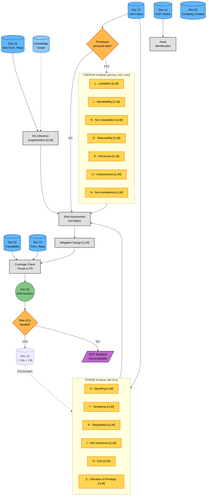
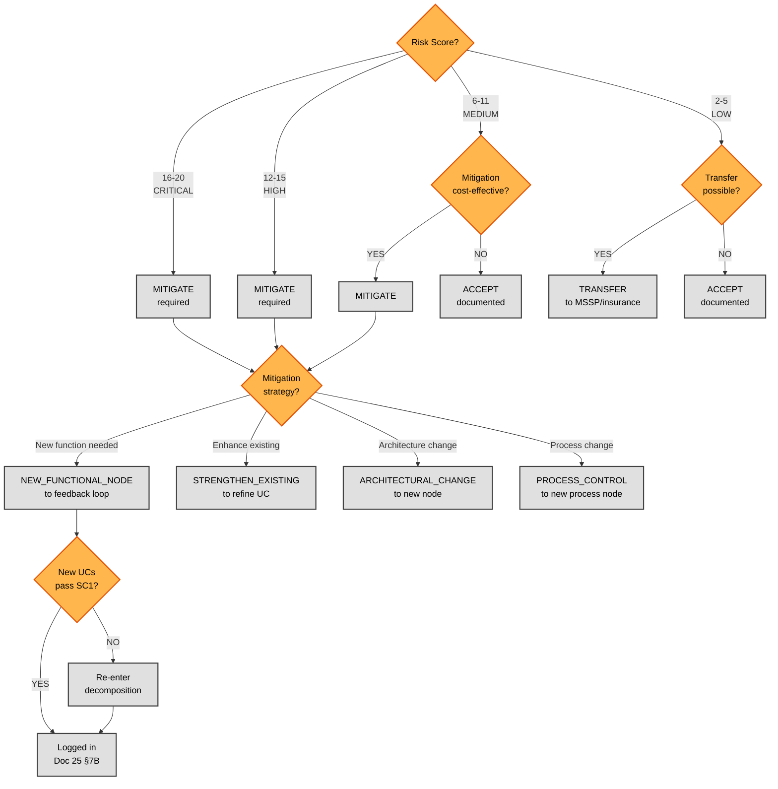

# Phase 3C — Threat Modeling (Risk Analysis) (Detailed Flow)

**Version:** 1.0 — 2026-06-16
**Parent:** [`../phase3_risk_analysis.md`](../phase3_risk_analysis.md) (Phase 3C overview)
**Sources of truth:**
- [`../../../TEMPLATES/25_Risk_Analysis.md`](../../../TEMPLATES/25_Risk_Analysis.md) — Doc 25 template
- [`../../Class_Models/phase3_risk_analysis.md`](../../Class_Models/phase3_risk_analysis.md) — Static structure (class diagram)
- [`phase3c_risk_reference.md`](phase3c_risk_reference.md) — Reference companion (patterns, D3FEND, KG examples)

---

## Overview

This diagram expands the **Threat Modeling** subgraph from the Phase 3C overview. It shows the process of taking decomposition outputs (UCs, nodes, FRs, gates), applying STRIDE and LINDDUN threat analysis frameworks, assessing risks against a 4×4 matrix, designing mitigations, and feeding the results back to the decomposition as a second iteration.

Phase 3C produces **Doc 25 — Risk Analysis**. The process has two views:

1. **Process diagram** (Diagram 1): Asset identification → STRIDE per UC + LINDDUN per privacy UC → KG augmentation → Risk Assessment → Mitigation Design → Coverage Check → Feedback
2. **Decision tree** (Diagram 2): For each risk, select treatment (MITIGATE/ACCEPT/TRANSFER/AVOID) and strategy (NEW_FUNCTIONAL_NODE/STRENGTHEN_EXISTING/ARCHITECTURAL_CHANGE/PROCESS_CONTROL)

**Key difference from Phase 3A/B:** The decomposition is a one-pass-then-iterate cycle. Threat modeling is a **two-phase process with explicit feedback**: human analysis (STRIDE/LINDDUN) produces a first pass, KG inferences augment it, and the output feeds BACK to the decomposition as a second iteration.

**LLM vs Deterministic:** Phase 3C is ~60% LLM. The LLM steps (STRIDE threat hypothesis, LINDDUN privacy analysis, mitigation design, KG inference interpretation) require semantic understanding. Deterministic steps do the risk matrix lookup, coverage check, and feedback loop routing.

---

## Diagram 1 — Process



### Step Reference (Diagram 1)

| Step | Name | Type | Doc 25 Section | LLM |
|------|------|------|----------------|-----|
| ASSETS | Asset Identification | Process | §3 System Boundary and Assets | — |
| S1-S6 | STRIDE per category | LLM | §4.1 STRIDE Analysis | [LLM] |
| PRIV | Processes personal data? | Decision | §4.2 LINDDUN trigger | — |
| L1-L7 | LINDDUN per category | LLM | §4.2 LINDDUN Analysis | [LLM] |
| KG_INF | KG Inference Augmentation | LLM | §8 KG-Based Inferences | [LLM] |
| RISK | Risk Assessment (4x4 matrix) | Process | §5 Risk Assessment | — |
| MIT | Mitigation Design | LLM | §7 Mitigation Requirements | [LLM] |
| COV | Coverage Check (Threat to FR) | Process | §8 Threat to FR Mapping | — |
| FB | New UCs needed? | Decision | §7B Feedback Loop | — |
| FB_DOC | Re-enter decomposition | (re-iteration) | — | — |
| OUT | SC5 satisfied | Output | — | — |

---

## Diagram 2 — Risk Treatment Decision Tree



### Step Reference (Diagram 2)

| Step | Name | Type |
|------|------|------|
| Q | Risk score threshold | Decision |
| C_MIT | CRITICAL to MITIGATE | Deterministic |
| H_MIT | HIGH to MITIGATE | Deterministic |
| M_CHK | MEDIUM: cost-effective? | Decision |
| M_MIT | MEDIUM to MITIGATE | Deterministic |
| M_ACC | MEDIUM to ACCEPT | Deterministic |
| L_CHK | LOW: transferable? | Decision |
| L_TRANS | LOW to TRANSFER | Deterministic |
| L_ACC | LOW to ACCEPT | Deterministic |
| STRAT | Mitigation strategy | Decision |
| NEW | NEW_FUNCTIONAL_NODE | Deterministic |
| STR | STRENGTHEN_EXISTING | Deterministic |
| ARCH | ARCHITECTURAL_CHANGE | Deterministic |
| PROC | PROCESS_CONTROL | Deterministic |
| FB_CK | New UCs pass SC1? | Decision |
| ITER | Re-enter decomposition | Deterministic |
| DONE | Logged in Doc 25 | Terminal |

---

## Process Detail Sections

### Asset Identification

Assets are identified from the system boundary (Doc 04 §6 Architecture + Doc 14 §4–§6 Nodes). Each asset has a type (Information/System/Process), a classification (CRITICAL/HIGH/MEDIUM/LOW), and CIA priorities.

| Asset type | Examples from Doc 14 | CIA assessment |
|-----------|----------------------|----------------|
| Information | Personal data, audit logs, SBOM, credentials | C: HIGH, I: HIGH, A: MEDIUM |
| System | IdP, SIEM, Encryption Service, CI/CD | C: HIGH, I: HIGH, A: CRITICAL |
| Process | Incident Response, DSAR, SDLC | C: MEDIUM, I: MEDIUM, A: HIGH |

**Cross-case asset counts:**

| Case | Information | System | Process | Total |
|------|-------------|--------|---------|-------|
| Case 01 | 4 | 4 | 2 | 10 |
| Case 02 | 6 | 6 | 3 | 15 |
| Case 03 | 7 | 8 | 5 | 20 |

### STRIDE Analysis (per UC)

For each UC from Doc 13, 6 STRIDE categories are checked:

| STRIDE | Question to ask |
|--------|-----------------|
| **S**poofing | Can an attacker impersonate a legitimate actor? |
| **T**ampering | Can data or configuration be modified by unauthorized parties? |
| **R**epudiation | Can a user deny performing an action that was logged? |
| **I**nfo Disclosure | Can sensitive data be exposed to unauthorized parties? |
| **D**enial of Service | Can the system be made unavailable? |
| **E**levation of Privilege | Can a user gain higher privileges than authorized? |

**Cross-case STRIDE threat counts:**

| Case | UCs | Threats per UC (avg) | Total STRIDE threats |
|------|-----|---------------------|----------------------|
| Case 01 | 35 | ~0.9 | ~30 (31 in template) |
| Case 02 | ~50 | ~0.8 | ~40 |
| Case 03 | ~50 | ~0.76 | ~38 |

### LINDDUN Analysis (per privacy UC, conditional)

LINDDUN is only applied to UCs that process personal data. The condition is checked at the PRIV decision point.

| LINDDUN | Privacy concern | GDPR article |
|---------|----------------|--------------|
| **L**inkability | Can user activities be correlated? | Art. 5(1)(c) |
| **I**dentifiability | Can individuals be identified? | Art. 4(1) |
| **N**on-repudiation | Can consent be proven? | Art. 7(1) |
| **D**etectability | Are processing activities visible to data subject? | Art. 15 |
| **D**isclosure of information | Can personal data be disclosed? | Art. 32 |
| **U**nawareness | Is the data subject aware of processing? | Art. 13 |
| **N**on-compliance | Is there a legal basis? | Art. 6 |

**Cross-case LINDDUN threat count:** ~7 per case (stable — LINDDUN threats are tied to GDPR, which is universal)

### KG Inference Augmentation

After human STRIDE/LINDDUN analysis, the knowledge graph is queried to discover threats that the human may have missed. Three inference types:

| Inference type | Source pattern | Confidence | Example |
|---------------|----------------|------------|---------|
| **Inferred threat** | UC + Asset + known attack pattern | HIGH | "UC-14 (auth) + AST-01 (credentials) to credential stuffing" |
| **Inferred mitigation** | Threat + known D3FEND countermeasure | HIGH | "THR-IAM-01 to MFA (D3-MA)" |
| **Inferred dependency** | Component + external entity | MEDIUM | "CI/CD to External Repo to supply chain risk" |

**Cross-case KG inference counts:**

| Case | Inferred threats | Inferred mitigations | Inferred dependencies | Total |
|------|------------------|----------------------|----------------------|-------|
| Case 01 | 5 | 6 | 4 | 15 |
| Case 02 | ~8 | ~10 | ~6 | ~24 |
| Case 03 | ~7 | ~9 | ~5 | ~21 |

### Risk Assessment (4x4 Matrix)

The risk score is computed as `likelihood x impact`:

```
                    IMPACT
              Low(1)  Med(2)  High(3)  Critical(4)
        +-------------------------------------+
    Low(1)   |    1      2       3        4    |
    Med(2)   |    2      4       6        8    |
L   High(3)  |    3      6       9       12    |
    Crit(4)  |    4      8      12       16    |
        +-------------------------------------+
```

| Risk Score | Risk Level | Required Treatment |
|-----------|-----------|-------------------|
| 12-16 | HIGH/CRITICAL | MITIGATE (mandatory) |
| 6-11 | MEDIUM | MITIGATE or ACCEPT (cost-dependent) |
| 2-5 | LOW | ACCEPT or TRANSFER |

**Note:** Template uses scoring 2-20 (4×5 grid: 1×2 to 5×4). We use a 4×4 grid (1-16) for simplicity. Both are valid; the 4×4 maps cleanly to the STRIDE/LINDDUN 1-4 ordinal scales.

### Mitigation Design (LLM)

For each HIGH/CRITICAL risk, one of 4 strategies is selected:

| Strategy | When | Feedback to decomposition? |
|----------|------|---------------------------|
| **NEW_FUNCTIONAL_NODE** | Risk requires capability that doesn't exist | Yes — new UC, new node, new gate |
| **STRENGTHEN_EXISTING** | Risk is partially mitigated by existing FRs but not fully | Yes — refine UC, enhance gate criteria |
| **ARCHITECTURAL_CHANGE** | Risk is inherent to the current architecture | Yes — new node, possibly new UC |
| **PROCESS_CONTROL** | Risk is operational (people, process) | Optional — new process node |

**Selection logic:**

1. Can existing FRs fully mitigate? → STRENGTHEN_EXISTING
2. Does the architecture need to change? → ARCHITECTURAL_CHANGE
3. Is it a new capability not covered by any FR? → NEW_FUNCTIONAL_NODE
4. Is it an operational issue (training, procedure)? → PROCESS_CONTROL

### Coverage Check (Threat to FR)

Every identified threat should be mapped to at least 1 FR (from Doc 23) or at least 1 NFR (from Doc 24). If no FR/NFR mitigates the threat, it is a **gap** that requires a new requirement.

| Coverage status | Meaning | Action |
|----------------|---------|--------|
| Covered | Threat mitigated by at least 1 FR/NFR | No action |
| Partial | Threat partially mitigated | Enhance FR or add new one |
| Gap | No FR/NFR mitigates the threat | Add new FR (may require new UC to feedback loop) |

**Cross-case coverage:**

| Case | Threats | Covered | Partial | Gap | Coverage % |
|------|---------|---------|---------|-----|-----------|
| Case 01 | 38 | 38 | 0 | 0 | 100% |
| Case 02 | ~50 | ~45 | ~5 | 0 | 90% |
| Case 03 | ~50 | ~46 | ~4 | 0 | 92% |

### Feedback Loop to Decomposition

The feedback loop runs when a mitigation requires new functionality:

1. Mitigation strategy is **NEW_FUNCTIONAL_NODE** (or ARCHITECTURAL_CHANGE)
2. New UC is created (or existing UC is refined)
3. The decomposition cycle (Phase 3A) runs a **second iteration** for the new UC
4. New FRs are derived (Phase 3B)
5. New nodes are mapped (Phase 3B)
6. New gates are generated (Phase 3B)
7. Gates re-validate compliance coverage (SC1)
8. Loop terminates when **SC5 is satisfied** (all residual risks LOW)

| Iteration | New UCs | Refined UCs | Gates Updated | Stop condition |
|-----------|---------|-------------|---------------|----------------|
| 1 (initial) | 0 | 0 | 0 | Start of threat modeling |
| 2 (mitigations) | 3-5 | 5-8 | 4-6 new/enhanced | SC1: 100% rule coverage |
| 3 (re-validation) | 0 | 0 | 0 | SC5: all residual LOW |

**Cross-case feedback iterations:**

| Case | Iterations | New UCs from mitigations | Total gates added |
|------|-----------|--------------------------|-------------------|
| Case 01 | 1-2 | 3 | 4 |
| Case 02 | 2-3 | 5 | 6 |
| Case 03 | 2-3 | 4 | 5 |

---

## Gate Criteria — "Residual risk acceptable?"

This gate (SC5) blocks finalization until all risks are mitigated to LOW:

| Criterion | LOW (Case 01) | HIGH (Case 02) | MAX (Case 03) |
|-----------|---------------|-----------------|----------------|
| All STRIDE categories analyzed per UC | Required | Required | Required |
| LINDDUN applied to all privacy UCs | Required | Required | Required |
| Every threat has a risk score | Required | Required | Required |
| Every HIGH/CRITICAL risk has a mitigation | Required | Required | Required |
| Every threat mapped to at least 1 FR/NFR | Required | Required | Required |
| KG inference run (augment human analysis) | Optional | Required | Required |
| D3FEND mapping for mitigations | Optional | Required | Required |
| Feedback loop converged (SC1: 100% rule coverage after mitigations) | Required | Required | Required |
| All residual risks are LOW (SC5) | Required | Required | Required |

---

## Cross-Case Comparison

| Dimension | Case 01 | Case 02 | Case 03 |
|-----------|---------|---------|---------|
| **Assets** | 10 | 15 | 20 |
| **STRIDE threats** | ~30 | ~40 | ~38 |
| **LINDDUN threats** | 7 | 7 | 7 |
| **Total threats** | ~38 | ~50+ | ~50+ |
| **Risks** | 10 | 15 | 12 |
| **HIGH/CRITICAL risks** | 7 (70%) | 10 (67%) | 8 (67%) |
| **Mitigations** | 8 | 12 | 10 |
| **KG inferences** | 15 | 24 | 21 |
| **Feedback iterations** | 1-2 | 2-3 | 2-3 |
| **New UCs from mitigations** | 3 | 5 | 4 |
| **Coverage** | 100% | 90% | 92% |

---

## What This Detail Does NOT Show

- **STRIDE pattern catalog (per UC type):** which threats are typical for each kind of UC — expanded in [`phase3c_risk_reference.md`](phase3c_risk_reference.md)
- **LINDDUN pattern catalog (per data type):** which privacy threats apply to each type of personal data — expanded in reference file
- **D3FEND technique mapping:** how mitigations map to MITRE D3FEND — expanded in reference file
- **Mitigation strategy selection guide:** detailed decision logic for choosing the right strategy — expanded in reference file
- **KG inference pattern catalog:** the specific patterns the knowledge graph uses — expanded in reference file
- **Concrete threat catalog per case:** the full THR-XXX-01..06 tables per UC package — found in Doc 25 §4.1

---

## LLM Reasoning Points

Phase 3C has **3 primary LLM reasoning points** per analysis pass:

### [LLM] STRIDE — STRIDE Threat Hypothesis

| Field | Value |
|-------|-------|
| **Purpose** | For each UC, hypothesize 0-6 STRIDE threats based on the UC's actors, data flows, and security context |
| **Why LLM** | Threat hypothesis is creative work that requires understanding the UC's semantics, not pattern matching |
| **Input** | (1) UC catalog (Doc 13), (2) asset catalog from Doc 14, (3) company context (Doc 04) |
| **Instructions** | For each UC, check 6 STRIDE categories. For each category, ask: "Is this threat plausible for this UC?" If yes, generate a threat description. If the threat is fully mitigated by existing FRs, note "covered by FR-XXX" rather than generating a new threat. |
| **KB Required** | STRIDE taxonomy, company context, FR catalog (Doc 23), existing threat patterns from prior cases |
| **Output Format** | Per-UC threat objects: {THR-ID, UC-ID, category: S/T/R/I/D/E, description, affectedAsset, mitigatedByFR[] (if any)} |
| **Quality Criteria** | (1) Every UC checked against all 6 STRIDE categories, (2) Threats have specific affected assets, (3) Coverage check identifies FRs that already mitigate, (4) No duplicate threats (same category + same asset = duplicate), (5) Threat IDs follow THR-UC-NN format |

### [LLM] LINDDUN — LINDDUN Privacy Threat Hypothesis

| Field | Value |
|-------|-------|
| **Purpose** | For each privacy-relevant UC, hypothesize LINDDUN privacy threats |
| **Why LLM** | Privacy threat identification requires understanding personal data flows and GDPR principles |
| **Input** | (1) UC catalog (Doc 13) with privacy flag, (2) asset catalog (personal data assets), (3) regulation context (Doc 07) |
| **Instructions** | For each UC flagged as processing personal data, check 7 LINDDUN categories. For each, ask: "Is this privacy concern relevant?" Generate threat description with GDPR article reference. |
| **KB Required** | LINDDUN taxonomy, GDPR articles (5, 4, 7, 15, 32, 13, 6), personal data classification |
| **Output Format** | Per-UC privacy threat objects: {THR-PRIV-ID, UC-ID, category: L/I/N/D/D/U/N, description, affectedAsset, gdprArticle} |
| **Quality Criteria** | (1) Only UCs with personal data flag get LINDDUN, (2) Every relevant UC checked against 7 categories, (3) GDPR article cited for each threat, (4) Threats are specific (not generic "privacy risk") |

### [LLM] MIT — Mitigation Strategy Selection

| Field | Value |
|-------|-------|
| **Purpose** | Design mitigation for each risk by selecting strategy (NEW_FUNCTIONAL_NODE/STRENGTHEN_EXISTING/ARCHITECTURAL_CHANGE/PROCESS_CONTROL) and defining the control |
| **Why LLM** | Strategy selection requires weighing cost vs risk reduction, understanding which FRs already cover the risk, and proposing the minimal effective control |
| **Input** | (1) Risk register (from RISK step), (2) FR catalog (Doc 23, NFRs from Doc 24), (3) node catalog (Doc 14), (4) company context |
| **Instructions** | For each HIGH/CRITICAL risk: (a) Check if existing FRs mitigate the risk (coverage check). (b) If partial, select STRENGTHEN_EXISTING and define the enhancement. (c) If no coverage, determine if the needed capability is a new function (NEW_FUNCTIONAL_NODE), architectural change (ARCHITECTURAL_CHANGE), or process (PROCESS_CONTROL). (d) Define the control description, implementation, and verification method. |
| **KB Required** | FR/NFR catalogs, node catalog, D3FEND countermeasures, cost-effectiveness heuristics |
| **Output Format** | Per-risk mitigation: {riskID, strategy: NEW_FUNCTIONAL_NODE/STRENGTHEN_EXISTING/ARCHITECTURAL_CHANGE/PROCESS_CONTROL, controlDescription, affectedFRs[], newUCsRequired[], verificationMethod, residualRisk} |
| **Quality Criteria** | (1) Every HIGH/CRITICAL risk has a mitigation, (2) Strategy is the least-cost effective option, (3) New UCs are minimal (don't create UCs for partial coverage), (4) Residual risk after mitigation is LOW, (5) Verification method matches the control type |

---

## Relationship to Parent Diagram

```
Parent (overview):
    Inputs (decomposition outputs) to TM subgraph
    TM includes: Assets, STRIDE || LINDDUN, KG, Risk, Mitigation, Coverage, Doc 25
    Feedback loop: Doc 25 to Doc 13 (new UCs)

                     expanded to

This file (detail):
    Diagram 1: ASSETS to STRIDE (6 cats) [LLM] + LINDDUN (7 cats, conditional) [LLM]
                to KG_INF [LLM] to RISK to MIT [LLM] to COV to D25
                to FB to (2nd decomp iteration if needed) to SC5

    Diagram 2: Risk score to MITIGATE/ACCEPT/TRANSFER/AVOID
                If MITIGATE to strategy (NEW/STR/ARCH/PROC)
                If NEW to feedback to decomposition
```

---

### Colour Note

| Colour | Meaning | Phase 3C usage |
|--------|---------|----------------|
| Blue (#64B5F6) | Input | Decomposition outputs (Doc 13, 14, 22, 23, 24) |
| Light Blue (#90CAF9) | External reference | Knowledge Graph |
| Grey (#E0E0E0) | Deterministic process | Asset ID, risk matrix, coverage check |
| Amber (#FFD54F) | LLM reasoning | STRIDE, LINDDUN, KG inference, mitigation design |
| Green (#81C784) | Document | Doc 25 |
| Orange (#FFB74D) | Decision / gate | Privacy check, feedback trigger, risk treatment |
| Purple (#BA68C8) | Output / phase transition | SC5 satisfied |

---

**See also:**
- [`../phase3_risk_analysis.md`](../phase3_risk_analysis.md) — Phase 3C overview (parent)
- [`phase3c_risk_reference.md`](phase3c_risk_reference.md) — Reference companion (STRIDE/LINDDUN patterns, D3FEND mapping, KG examples)
- [`../../../TEMPLATES/25_Risk_Analysis.md`](../../../TEMPLATES/25_Risk_Analysis.md) — Doc 25 template
- [`../../Class_Models/phase3_risk_analysis.md`](../../Class_Models/phase3_risk_analysis.md) — Static structure (class diagram)
- [`../phase3_decomposition.md`](../phase3_decomposition.md) — Phase 3A/B overview (feeds into threat modeling)
