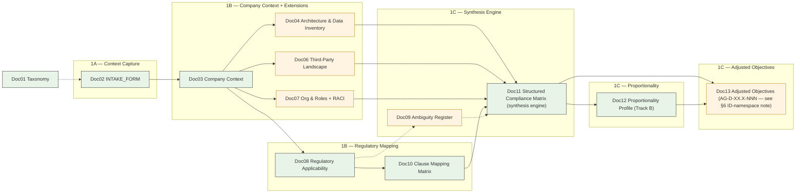
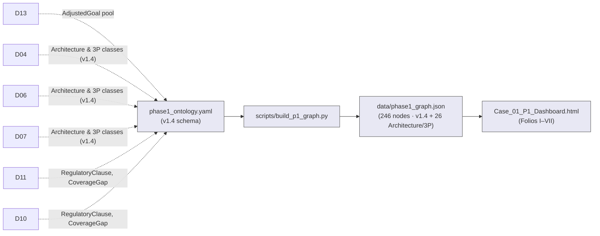

# Phase 1 (RICH) — Document Production Flow

**Version:** 1.0 — 2026-08-27
**Status:** ✅ Active
**Classification:** META — this file is not a numbered deliverable. It describes how the 13 deliverables (Doc01–Doc13) are produced, traced to objectives, and consumed.
**Companion:** [`../../../00_METHODOLOGY/diagrams/fluxdiagram/phase1/phase1_rich_extension.md`](../../../00_METHODOLOGY/diagrams/fluxdiagram/phase1/phase1_rich_extension.md) (the methodology-side sibling).

---

## 1. Purpose

Until v1.0 of this file, the Case_01 Phase 1 (RICH) corpus grew via 5 sprints in 2026-08-06
with no single document describing the production pipeline. Producers (Executor) and
reviewers (Validator) were reading the same files but had no shared map of:

- **Where each doc gets its inputs from** (the `inputs:` frontmatter edges, 63 of which
  cited legacy basenames after commit `c94b840` and were silently broken).
- **Who consumes each doc** (the `outputs:` edges — some declared consumers were never
  cited by any downstream doc).
- **Which Phase 1 objectives each doc serves** (Doc04, Doc06, Doc07 had zero goal-linkage
  before this v1.0; the 69 AdjustedGoals live in Doc13 with no inbound linkage from lens docs).
- **How the infrastructure layer (ontology → KG → dashboard) consumes the corpus**
  (the master flux diagram shows only `DASH["Dashboard"]` as a node).

This file addresses all four. It does not rewrite any of the 13 deliverables — it adds the
production view that was missing.

---

## 2. Pipeline — Two Layers

The production pipeline is **two parallel layers** running off the same corpus:

### Layer 1 — Document Flow (master spine + Rich extensions)

### Layer 2 — Infrastructure Flow

The two layers are **coupled**: the docs in Layer 1 are the canonical source of every node
and link in Layer 2's KG. A change in any of the 13 docs (especially Doc13) requires
`scripts/build_p1_graph.py` re-execution before the dashboard re-renders.

### Layer 0 — Upstream (Phase 0 baseline)

Layer 1 does not generate the HSO / Sub-SO content it cites. The frozen regulatory
baseline lives at `00_METHODOLOGY/PREPROCESSING_by_domain/` (38 D-XX.Y.md + 10 manifests +
623 article copies + 172 NIST control JSONs + 4 overlays) and has its own production flow:

- [`00_METHODOLOGY/PREPROCESSING_by_domain/PRODUCTION_FLOW.md`](../../../00_METHODOLOGY/PREPROCESSING_by_domain/PRODUCTION_FLOW.md)
  (C1 verbatim anchoring → C2 hierarchical objective → C3 Volere requirements → C4 cross-regulation analysis → C5 ambiguity registration → C6 freeze; v2.0 content-first; ~800 downstream citations).
- [`00_METHODOLOGY/PREPROCESSING_by_domain/validation/P0_baseline_audit_v0.md`](../../../00_METHODOLOGY/PREPROCESSING_by_domain/validation/P0_baseline_audit_v0.md)
  (the audit that motivated the flow).

Layer 1 docs that **cite** the baseline (not modify it): Doc08 §1 (applicability), Doc10
(clause mapping → D-XX.Y), Doc11 (synthesis engine), Doc12 §4 (Track B tier), Doc13 §1
(generic baseline HSO + Sub-SOs) + §2-§4 (adjusted objectives derived from baseline). The
baseline is read-only by design (`guard-protected-files.sh` denies Write|Edit on
`domains/**`).

---

## 3. Traceability Matrix — Docs × AdjustedGoals

The matrix below maps each of the 13 deliverables to the AdjustedGoal IDs (Doc13) it
**serves** or **is consumed by**. Lens docs (Doc04, Doc06, Doc07) declare their goal-linkage
in the new `serves_goals:` frontmatter field (added by Fase 2.5 of this work); Doc13 is the
sole producer of goals; everything downstream reads from it.

| Doc | Type | Primary sub-domains | Objectives served (AG-D-, see §6 note) | Producer / Consumer role |
|-----|------|---------------------|---------------------------|---------------------------|
| **Doc01** | FLOW-NATIVE | D-01..D-10 (all) | n/a (root taxonomy) | root source — consumed by Doc02 |
| **Doc02** | FLOW-NATIVE | all | n/a | produces Doc03 |
| **Doc03** | FLOW-NATIVE | all (BG-01..BG-05) | n/a | produces Doc04/06/07/08 |
| **Doc04** | JUSTIFIED-EXTENSION | D-01.1..1.4, D-02.1..2.4, D-03.1..3.4 (architecture, data inventory) | AG-D-01.1-001..002, AG-D-02.1-001..002, AG-D-02.2-001..002, AG-D-03.1-001..002 (8 IDs in Doc13) | lens doc → Doc11 |
| **Doc05** | ORPHAN-HYBRID | (maturity) | DEPRECATED 2026-08-07 — ownership transferred to Phase 2 `Doc19_Framework_Mapping_Matrix.md` §5.1 | historical |
| **Doc06** | JUSTIFIED-EXTENSION | D-02.1, D-02.2, D-06.1..4, D-08.3, D-10.1 | AG-D-06.1-001..002, AG-D-06.2-001..002, AG-D-08.3-001..002, AG-D-10.1-001..002 (8 IDs) | lens doc → Doc11 |
| **Doc07** | JUSTIFIED-EXTENSION | D-01.1..4, D-02.1..4, D-03.1..2, D-04.1 (RACI §9.2 maps 35 sub-domains) | AG-D-01.1-001..002, AG-D-02.1-001..002, AG-D-03.1-001..002, AG-D-04.1-001..002 (representative — full list in §9.2; see matrix §3) | lens doc → Doc11 |
| **Doc08** | FLOW-NATIVE | all applicable regs (GDPR, CRA) | n/a | produces Doc10 |
| **Doc09** | JUSTIFIED-EXTENSION | per-card (417 cards) | n/a (flags ambiguity for Doc11) | lens doc → Doc11 |
| **Doc10** | FLOW-NATIVE | all 38 sub-domains (54 clauses) | n/a | produces Doc11 |
| **Doc11** | FLOW-NATIVE | all 38 sub-domains | n/a (synthesis engine — derives Doc12/Doc13 inputs) | produces Doc12, Doc13 |
| **Doc12** | FLOW-NATIVE | per sub-domain (Track B tier) | n/a | produces Doc13 |
| **Doc13** | JUSTIFIED-EXTENSION | all 37 active sub-domains | **producer** (69 AdjustedGoal nodes) | producer — consumed by Phase 2 |

**Counts:**
- 10 docs in the master spine (FLOW-NATIVE).
- 3 lens docs / extensions (Doc04, Doc06, Doc07) + 2 case-justified extensions (Doc09, Doc13).
- 1 deprecated hybrid (Doc05).
- 6 META-INFRA items (README, PROJECT_STATE, Citation_Index, Corpus_Field_Map, ontology, KG).

---

## 4. Per-Doc Production Sheet

Each deliverable gets the same production sheet. Empty cells mean the field is **not
declared** in the source — these are explicit gaps the audit found (and Fase 2.5 will
close where the gate elected to integrate; Doc05 keeps its gap because the doc itself is
deprecated).

### Doc01 — Taxonomy Reference
- **Trigger:** Root reference; frozen baseline.
- **Inputs:** none (`inputs: []`).
- **Transformation:** Static table; no transformation.
- **Outputs declared:** `[01_INTAKE_FORM.md]` (legacy — should be `Doc02_INTAKE_FORM.md`).
- **Consumers (realised):** Doc02 (via inline reference).
- **Objectives served:** n/a (root taxonomy precedes goals).
- **Classification:** FLOW-NATIVE.

### Doc02 — INTAKE_FORM
- **Trigger:** Case onboarding.
- **Inputs declared:** `[00_Taxonomy_Reference.md]` (legacy).
- **Transformation:** Conditional Q&A into company profile.
- **Outputs declared:** `[04_Company_Context_Assessment.md]` (legacy — should be `Doc03`).
- **Consumers (realised):** Doc03 (intake → context).
- **Objectives served:** n/a (intake precedes goals).
- **Classification:** FLOW-NATIVE.
- **Note:** Audit found zero `Purpose` section — Fase 2.5 will not add one (intake forms
  don't need an internal purpose section; purpose is external).

### Doc03 — Company Context Assessment
- **Trigger:** Doc02 output.
- **Inputs declared:** `[01_INTAKE_FORM.md]` (legacy).
- **Transformation:** Consolidate into company facts + 8 stakeholders + 5 BusinessGoals.
- **Outputs declared:** `[05_Regulatory_Applicability.md]` (legacy).
- **Consumers (realised):** Doc04, Doc06, Doc07, Doc08 (each declares Doc03 as input).
- **Objectives served:** n/a (context precedes goals); but §4 anchors BG-01..BG-05 → AG-D IDs.
- **Classification:** FLOW-NATIVE.

### Doc04 — Architecture & Data Inventory (Rich Mode)
- **Trigger:** Doc03 output (architecture, data inventory are extensions of context).
- **Inputs declared:** `[04_Company_Context_Assessment.md, 04a_Architecture_DataInventory, …]` (legacy, multi-source).
- **Transformation:** Enumerate 5 systems, 3 data stores, 5 data flows, 6 personal-data
  categories, 4 data-subject categories.
- **Outputs declared:** `[04b_Security_Posture.md]` (legacy — wrong; Doc04 actually feeds
  Doc11/Doc13 indirectly via the ontology).
- **Consumers (realised):** ontology `kg_ontology.classes.{System, DataStore, DataFlow,
  PersonalDataCategory, DataSubjectCategory}` (v1.4).
- **Objectives served:** AG-D-01.1-001..002, AG-D-02.1-001..002, AG-D-02.2-001..002,
  AG-D-03.1-001..002 (see §3 matrix).
- **Classification:** JUSTIFIED-EXTENSION (architecture & data inventory are case-level
  elaborations of Doc 04 — methodology canon does not enumerate them).

### Doc05 — Security Posture / Maturity
- **Trigger:** Doc03 output (posture assessment).
- **Inputs declared:** `[04_Company_Context_Assessment.md, 04a_…, 05_…]` (legacy).
- **Outputs declared:** `[07_Structured_Compliance_Matrix.md]` (legacy — wrong).
- **Consumers (realised):** none realised in Phase 1 corpus; maturity ownership
  transferred to Phase 2 `Doc19_Framework_Mapping_Matrix.md` §5.1 (2026-08-07).
- **Objectives served:** n/a (deprecated).
- **Classification:** **ORPHAN-HYBRID** (kept for historical traceability, marked
  `DEPRECATED_FOR_MATURITY` in frontmatter; should be parked from any flow view).

### Doc06 — Third-Party Landscape (Rich Mode)
- **Trigger:** Doc03 output (third-party data flows identified).
- **Inputs declared:** `[04_Company_Context_Assessment.md, 04a_…, 01_INTAKE_FORM]` (legacy).
- **Transformation:** Enumerate 6 vendors + verbatim Art. 28/7/13 references.
- **Outputs declared:** `[04b_Security_Posture.md]` (legacy — wrong).
- **Consumers (realised):** ontology `kg_ontology.classes.ThirdParty` (v1.4).
- **Objectives served:** AG-D-06.1-001..002, AG-D-06.2-001..002, AG-D-08.3-001..002,
  AG-D-10.1-001..002 (see §3 matrix).
- **Classification:** JUSTIFIED-EXTENSION.

### Doc07 — Org & Roles + RACI (Rich Mode)
- **Trigger:** Doc03 output (roles identified in stakeholder register).
- **Inputs declared:** `[04_Company_Context_Assessment.md, 04a_…, 04c_…,
  ../00_COMMON/01_Company_Context.md]` (legacy — mixed naming conventions).
- **Transformation:** Enumerate 6 RaciRoles + 43 RaciActivities (41 active) + 206 RACI
  edges + 35 APPLIES_TO sub-domain edges.
- **Outputs declared:** `[04b_Security_Posture.md, 05_…, 06_…, 07_…]` (legacy — four
  outputs, none of which actually cite Doc07).
- **Consumers (realised):** ontology `kg_ontology.classes.{RaciRole, RaciActivity}` (v1.3).
- **Objectives served:** Per §9.2 sub-domain mapping, 35 sub-domains are touched; full
  `serves_goals:` list in frontmatter after Fase 2.5.
- **Classification:** JUSTIFIED-EXTENSION. Audit note: declared consumers never cite
  Doc07 (gap to close in Fase 2.5 by re-aligning `outputs:` to the actual graph
  consumers).

### Doc08 — Regulatory Applicability
- **Trigger:** Doc03 output (regulations applicable to this company).
- **Inputs declared:** `[04_Company_Context_Assessment.md]` (legacy).
- **Transformation:** 5-reg × per-article × per-sub-domain applicability assessment (54 rows).
- **Outputs declared:** `[06_Clause_Mapping_Matrix.md]` (legacy).
- **Consumers (realised):** Doc10 (regulatory applicability feeds clause mapping).
- **Objectives served:** n/a (applicability precedes goals).
- **Classification:** FLOW-NATIVE.

### Doc09 — Ambiguity Register (Rich Mode)
- **Trigger:** Doc08 output (interpretation ambiguities discovered during applicability).
- **Inputs declared:** none (no `inputs:` key).
- **Transformation:** Catalogue 417 ambiguity cards (top 20 detailed).
- **Outputs declared:** none.
- **Consumers (realised):** Doc11 (consumes ambiguity flags via ontology `FLAGS` verb).
- **Objectives served:** n/a (ambiguity register precedes goal derivation).
- **Classification:** JUSTIFIED-EXTENSION (case-level corpus elaboration; methodology
  canon does not enumerate it).

### Doc10 — Clause Mapping Matrix
- **Trigger:** Doc08 output (regulatory clauses need to map to sub-domains).
- **Inputs declared:** `[04_Company_Context_Assessment.md, 05_Regulatory_Applicability.md]` (legacy).
- **Transformation:** 54 clauses × sub-domain mapping (28 GDPR + 26 CRA).
- **Outputs declared:** `[07_Structured_Compliance_Matrix.md]` (legacy).
- **Consumers (realised):** Doc11.
- **Objectives served:** n/a (clause mapping precedes goals).
- **Classification:** FLOW-NATIVE.

### Doc11 — Structured Compliance Matrix (the synthesis engine)
- **Trigger:** Doc10 + Doc04 + Doc06 + Doc07 + Doc09 outputs.
- **Inputs declared:** `[04_Company_Context_Assessment.md, 05_Regulatory_Applicability.md,
  06_Clause_Mapping_Matrix.md]` (legacy — missing Doc04/Doc06/Doc07/Doc09 declarations).
- **Transformation:** Per-sub-domain coverage matrix + 4 CoverageGaps + strategic implications.
- **Outputs declared:** `[08_Obligation_Derivation.md]` (Phase 2, name outdated).
- **Consumers (realised):** Doc12 (via Track B), Doc13 (via Doc12 + direct).
- **Objectives served:** n/a (synthesis engine is the goal **deriver**, not goal **server**).
- **Classification:** FLOW-NATIVE.

### Doc12 — Proportionality Profile (Track B)
- **Trigger:** Doc11 output.
- **Inputs declared:** `[04_…, 05_…, 07_…, …/REFERENCE/proportionality_model.md (missing),
  …/PREPROCESSING_by_domain/domains/]` (legacy + dangling external ref).
- **Transformation:** 37 sub-domains × proportionality tier × 5 attributes.
- **Outputs declared:** `[08_Obligation_Derivation.md, 11_Rules_Catalog.md, 14_Architectural_Nodes.md,
  07c_Adjusted_Goals.md]` (Phase 2 names outdated; 07c is correct post-rename).
- **Consumers (realised):** Doc13.
- **Objectives served:** n/a (Track B precedes goal derivation).
- **Classification:** FLOW-NATIVE.

### Doc13 — Adjusted Objectives per Sub-Domain (Rich Mode)
- **Trigger:** Doc11 + Doc12 outputs.
- **Inputs declared:** `[04_…, 05_…, 07_…, 07b_…, 10_…, 09_… (Phase 2),
  phase1_ontology.yaml, …/REFERENCE/proportionality_model.md (missing)]` (legacy + dangling).
- **Transformation:** Derive 69 AdjustedGoals (35 HL slot-001 + 28 GDPR-driven + 34 CRA-driven
  = 69 distinct) — one AdjustedGoal pool.
- **Outputs declared:** `"phase 2 rules catalog (11_Rules_Catalog.md) consumes adjusted
  objectives"` (free text, not list).
- **Consumers (realised):** Phase 2 rules catalog + Phase 2 goals docs.
- **Objectives served:** **producer** (this is the AdjustedGoal pool — AG-D-01.1-001
  through AG-D-10.4-NNN, 69 distinct).
- **Classification:** JUSTIFIED-EXTENSION (the canonical Phase 1 goal derivation is a
  case-level construct the methodology canon hosts in corr-008 but does not enumerate
  per-case).

---

## 5. Exit Criteria — Phase 1 (RICH) Gate

A Phase 1 case is **ready to advance to Phase 2** when **all** of the following hold:

1. **Doc-level:** all 13 deliverables (Doc01–Doc13) are present and lint-clean (Doc05 is
   permitted to be `DEPRECATED_FOR_MATURITY`).
2. **Goal-linkage:** the matrix in §3 of this file is the authoritative doc↔objectives map
   for Doc04 / Doc06 / Doc07 (frontmatter remains as-is; linkage is published here, not as a
   new frontmatter field).
3. **Frontmatter integrity:** every `inputs:` / `outputs:` references a DocNN basename that
   exists in the phase directory (this v1.0 closes audit §B's 63 broken refs; dangling
   cross-phase refs are out of scope — see §6).
4. **Infrastructure:** `data/phase1_graph.json` regenerates without errors via
   `scripts/build_p1_graph.py`; `validation/P1_graph_extension_v1.X_validation.md` PASS.
5. **Bookkeeping:** `02_CASES/Case_01_TinyTask_SaaS/progress.json` carries a
   `phase_1_rich` entry (Fase 3); `02_CASES/CHANGE_LOG_CENTRAL.md` records the sprints
   0–5 and the `c94b840` rename (Fase 3).

---

## 6. Known Open Items (deferred, not blocking v1.0)

See `validation/P1_production_flow_audit_v0.md` sections A–D and
`validation/P1_cross_case_mirror_v0.md` triage for full detail. Highlights:

- **AG- vs AO- prefix:** Doc13 uses `AG-D-` (124 occurrences); methodology canon names
  `AO-D-`. The 2026-08-27 P7 gate elected to keep AG- as the case canonical for now;
  migration is a separate sprint if the methodology ever mandates AO-.
- **`kg.sh impact AEGIS-P1-RICH-07c` no-op:** the KG E3 graph keys on DocNN tokens, not
  on the `AEGIS-*` doc IDs. Impact queries wanting to reason about Doc13 must use the
  DocNN token directly until an ID alias table is added.
- **Doc04b maturity ownership transfer:** Phase-2 side has not yet documented
  `DEPRECATED_FOR_MATURITY` in `phase1_ontology.yaml` — open item.
- **Case_02 / Case_03 transversal:** zero fluxdiagram references and zero `AO-` migration
  in either case. Out of scope for this v1.0 (case-anchored).
- **Doc05 ORPHAN-HYBRID handling:** parked from this flow view; downstream readers should
  treat Doc05 as historical, not authoritative.

---

## 7. Versioning

This file is **META** and **not a numbered deliverable**. Its version increments when:

- (a) a doc is added or removed from the 13-deliverable list;
- (b) the pipeline shape (Layers 1 or 2) changes;
- (c) the exit-criteria in §5 change;
- (d) the matrix in §3 or the production sheets in §4 are amended.

Pure frontmatter repairs (legacy → DocNN name alignment) do **not** require a version bump.
