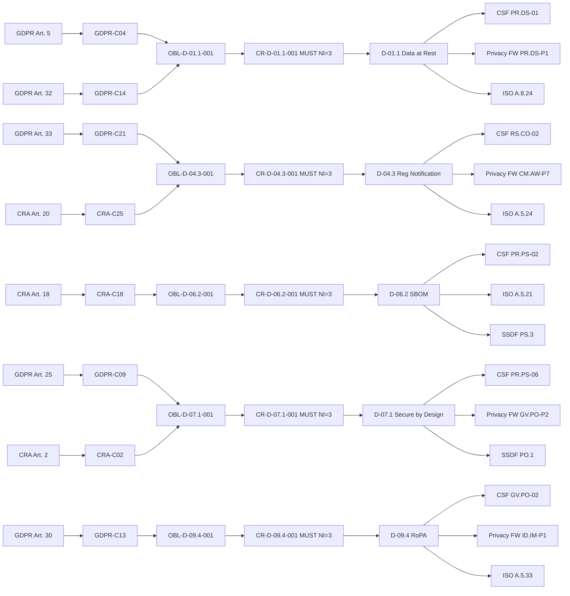
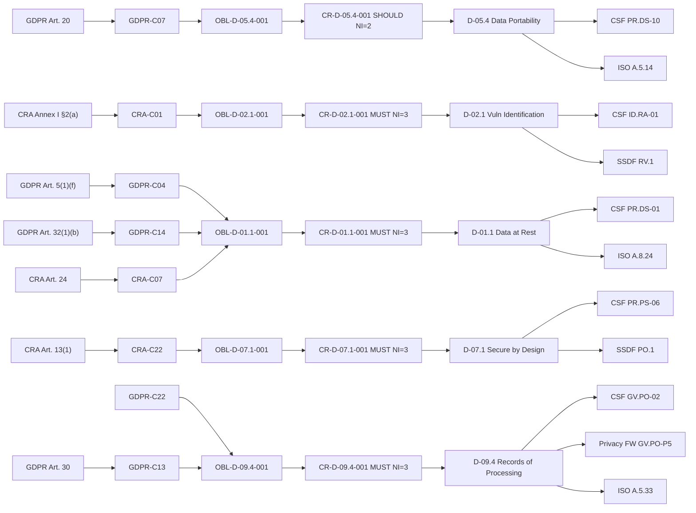

# Framework Mapping Matrix

> **Note on Rule Anchors:** Rule-level framework anchors are inlined in Doc18 Control Set; this matrix is the aggregate view.

 - Unified NIST (CSF 2.0 + Privacy FW 1.0)

> **Block C deliverable.** Doc 13 unifies 30 Compliance Rules (CR) and 16 Best
> Practice Rules (BPR) of Case_01 TinyTask SaaS under two NIST frameworks
> (CSF 2.0 + Privacy FW 1.0) plus a third (AI RMF 1.0) placeholder for Case_02/03.
> Frameworks are **target, never source** (SPEC §3.3). CR/BPR derive from the
> regulations (Doc 08); the matrix shows how each rule reaches the frameworks.

> **Frozen lists used (no invention of IDs):**
> - CSF 2.0: `00_METHODOLOGY/PREPROCESSING/NIST_CSF_2.0_subcategories.md`
> - Privacy FW 1.0: `00_METHODOLOGY/PREPROCESSING_by_domain/_global/NIST_PF_1.0_subcategories.md` (canonical, ACTIVE: 5 Functions / 18 Categories / 100 Subcategories — the only official NIST PF release; local mirror `CONTROLS/NIST_PF/`. "PF 1.1" is an Initial Public Draft, non-final: its redirect notes may NOT exclude or replace canonical IDs — see SPEC §4.2 and `validation/VALIDATOR_UNMAPPED_AUDIT_v0.md`)
> - AI RMF 1.0: `00_METHODOLOGY/PREPROCESSING/NIST_AI_RMF_1.0_subcategories.md` (72 subcats; uniform `N/A (non-AI scope)` here)

---

## §1 - Matriz Unificada

> 30 CR rows. Columns: rule_id, sub_domain, NI (Block B), CSF 2.0 (Doc 11
> field 5), Privacy FW 1.0 (mined from GDPR baseline
> `02b_SecurityRules_NISTPF.md` where applicable), AI RMF placeholder,
> ISO 27001 (crosswalk), SSDF (crosswalk), and two normalized
> pipe-joined ID lists for programmatic downstream use. AI RMF column is
> uniformly `N/A (non-AI scope)` per D9/D12.

| CR rule_id    | sub_domain | NI (Block B) | CSF 2.0 (from Doc 11 field 5)                                                                                                                                            | Privacy FW 1.0                                                  | AI RMF            | ISO 27001 | SSDF      | csf_subcats_normalized                                                                       | priv_subcats_normalized                              |
|---------------|------------|--------------|--------------------------------------------------------------------------------------------------------------------------------------------------------------------------|-----------------------------------------------------------------|-------------------|-----------|-----------|-----------------------------------------------------------------------------------------------|------------------------------------------------------|
| CR-D-01.1-001 | D-01.1     | 3 (MUST)     | PR.DS-01, PR.DS-10, PR.PS-04                                                                                                                                              | PR.DS-P1, UNMAPPED_PF (PR.DS-10 risk-strategy mgmt + PR.PS-04 log records — no PF 1.0 analogue) | N/A (non-AI scope) | A.8.24    | PO.5      | PR.DS-01\|PR.DS-10\|PR.PS-04                                                                | PR.DS-P1\|UNMAPPED_PF\|UNMAPPED_PF                         |
| CR-D-01.2-001 | D-01.2     | 3 (MUST)     | PR.DS-02, PR.IR-01, PR.PS-04                                                                                                                                              | PR.DS-P2, PR.PO-P7                                              | N/A (non-AI scope) | A.8.24    | -         | PR.DS-02\|PR.IR-01\|PR.PS-04                                                                | PR.DS-P2\|PR.PO-P7\|UNMAPPED_PF                          |
| CR-D-01.3-001 | D-01.3     | 3 (MUST)     | GV.OV-01, GV.RM-04, PR.AA-03, PR.AA-04, PR.DS-01, PR.IR-03                                                                                                              | PR.DS-P1, CT.DP-P2                                              | N/A (non-AI scope) | A.8.24    | -         | GV.OV-01\|GV.RM-04\|PR.AA-03\|PR.AA-04\|PR.DS-01\|PR.IR-03                                | PR.DS-P1\|CT.DP-P2                                    |
| CR-D-01.4-001 | D-01.4     | 3 (MUST)     | PR.DS-01, PR.DS-02, PR.DS-10, PR.DS-01, PR.DS-10, PR.IR-03, PR.IR-04, PR.PS-04                                                                                          | CT.DM-P1, CT.DM-P3                                              | N/A (non-AI scope) | A.8.24    | -         | PR.DS-01\|PR.DS-02\|PR.DS-10\|PR.DS-01\|PR.DS-10\|PR.IR-03\|PR.IR-04\|PR.PS-04          | CT.DM-P1\|CT.DM-P3                                    |
| CR-D-02.1-001 | D-02.1     | 3 (MUST)     | GV.OV-02, ID.AM-02, ID.IM-02, ID.RA-01, ID.RA-03, ID.RA-05, PR.PS-02                                                                                                    | ID.RA-P3, ID.RA-P5                                              | N/A (non-AI scope) | A.8.8     | RV.1      | GV.OV-02\|ID.AM-02\|ID.IM-02\|ID.RA-01\|ID.RA-03\|ID.RA-05\|PR.PS-02                    | ID.RA-P3\|ID.RA-P5                                    |
| CR-D-02.2-001 | D-02.2     | 3 (MUST)     | GV.OV-02, ID.RA-01, PR.IR-03, PR.PS-01, PR.PS-02                                                                                                                        | UNMAPPED_PRIVACY (patch cadence is product-security concern; no PF subcat anchored) | N/A (non-AI scope) | A.8.8     | RV.2      | GV.OV-02\|ID.RA-01\|PR.IR-03\|PR.PS-01\|PR.PS-02                                          | UNMAPPED_PRIVACY                                      |
| CR-D-02.3-001 | D-02.3     | 3 (MUST)     | GV.PO-01, GV.SC-04, ID.RA-01, RS.CO-03, RS.MA-01                                                                                                                         | UNMAPPED_PRIVACY (CVD is security-disclosure; no PF subcat anchored) | N/A (non-AI scope) | A.5.5     | RV.1      | GV.PO-01\|GV.SC-04\|ID.RA-01\|RS.CO-03\|RS.MA-01                                         | UNMAPPED_PRIVACY                                      |
| CR-D-03.1-001 | D-03.1     | 3 (MUST)     | ID.AM-01, PR.AA-01, PR.AA-02, PR.AA-03, PR.AA-05, PR.AA-06, PR.DS-10                                                                                                     | PR.AC-P1, PR.AC-P6, PR.AC-P4, UNMAPPED_PF (asset inventory + risk-strategy data mgmt — no PF 1.0 analogue) | N/A (non-AI scope) | A.5.16    | -         | ID.AM-01\|PR.AA-01\|PR.AA-02\|PR.AA-03\|PR.AA-05\|PR.AA-06\|PR.DS-10                  | UNMAPPED_PF\|PR.AC-P1\|PR.AC-P6\|PR.AC-P6\|PR.AC-P4\|PR.AC-P4\|UNMAPPED_PF |
| CR-D-03.2-001 | D-03.2     | 2 (SHOULD)   | PR.AA-03, PR.AA-04, PR.AA-05, PR.AA-06, PR.AT-02                                                                                                                         | PR.AC-P6, PR.AC-P4, GV.AT-P1, UNMAPPED_PF (identity assertions — no PF 1.0 subcategory) | N/A (non-AI scope) | A.8.5     | -         | PR.AA-03\|PR.AA-04\|PR.AA-05\|PR.AA-06\|PR.AT-02                                         | PR.AC-P6\|UNMAPPED_PF\|PR.AC-P4\|PR.AC-P4\|GV.AT-P1      |
| CR-D-03.3-001 | D-03.3     | 3 (MUST)     | ID.AM-01, ID.AM-02, PR.AA-01, PR.AA-03, PR.AA-05, PR.AA-06, PR.PS-04                                                                                                     | CT.PO-P1, PR.AC-P1, PR.AC-P6, PR.AC-P4, UNMAPPED_PF (asset inventories + log records — no PF 1.0 analogue) | N/A (non-AI scope) | A.5.15    | -         | ID.AM-01\|ID.AM-02\|PR.AA-01\|PR.AA-03\|PR.AA-05\|PR.AA-06\|PR.PS-04                  | UNMAPPED_PF\|UNMAPPED_PF\|PR.AC-P1\|PR.AC-P6\|PR.AC-P4\|PR.AC-P4\|CT.PO-P1 |
| CR-D-03.4-001 | D-03.4     | 3 (MUST)     | GV.PO-01, GV.SC-03, PR.DS-10, PR.PS-01, PR.PS-04                                                                                                                         | CT.DP-P4, CT.PO-P4                                              | N/A (non-AI scope) | A.8.9     | PW.9      | GV.PO-01\|GV.SC-03\|PR.DS-10\|PR.PS-01\|PR.PS-04                                         | CT.DP-P4\|CT.PO-P4                                    |
| CR-D-04.1-001 | D-04.1     | 3 (MUST)     | DE.AE-02, DE.CM-01, DE.CM-09, ID.RA-04, PR.PS-04, RS.MA-01, RS.MA-02, RS.MA-03                                                                                           | CM.AW-P7                                              | N/A (non-AI scope) | A.5.25    | RV.1      | DE.AE-02\|DE.CM-01\|DE.CM-09\|ID.RA-04\|PR.PS-04\|RS.MA-01\|RS.MA-02\|RS.MA-03        | CM.AW-P7\|UNMAPPED_PF                                    |
| CR-D-04.2-001 | D-04.2     | 3 (MUST)     | DE.CM-09, PR.DS-10, PR.IR-03, PR.IR-04, RC.RP-01, RC.RP-04, RS.MI-01, RS.MI-02                                                                                           | PR.PO-P7, CT.DM-P10                                             | N/A (non-AI scope) | A.5.26    | -         | DE.CM-09\|PR.DS-10\|PR.IR-03\|PR.IR-04\|RC.RP-01\|RC.RP-04\|RS.MI-01\|RS.MI-02        | PR.PO-P7\|CT.DM-P10                                   |
| CR-D-04.3-001 | D-04.3     | 3 (MUST)     | RS.CO-02, RS.MA-01, RS.MA-01, RS.MA-02, RS.MA-03, RS.MA-01                                                                                                               | CM.AW-P7, CM.AW-P8, CM.PO-P1, CM.PO-P2                | N/A (non-AI scope) | A.5.24    | -         | RS.CO-02\|RS.MA-01\|RS.MA-01\|RS.MA-02\|RS.MA-03\|RS.MA-01                              | CM.AW-P7\|CM.AW-P8\|CM.PO-P1\|CM.PO-P2\|UNMAPPED_PF       |
| CR-D-04.4-001 | D-04.4     | 3 (MUST)     | PR.DS-01, PR.DS-10, PR.IR-03, PR.IR-04, RC.RP-01, RC.RP-03, RC.RP-04                                                                                                      | PR.DS-P1, PR.PO-P7, PR.DS-P4, PR.PT-P4, UNMAPPED_PF (recover-execution + risk-strategy mgmt — PF 1.0 has no Recover axis) | N/A (non-AI scope) | A.8.13    | -         | PR.DS-01\|PR.DS-10\|PR.IR-03\|PR.IR-04\|RC.RP-01\|RC.RP-03\|RC.RP-04                  | PR.DS-P1\|UNMAPPED_PF\|PR.PT-P4\|PR.DS-P4\|UNMAPPED_PF\|UNMAPPED_PF\|UNMAPPED_PF |
| CR-D-05.1-001 | D-05.1     | 3 (MUST)     | GV.OC-03, GV.PO-01, ID.AM-03, PR.DS-01, PR.DS-10, PR.PS-06                                                                                                               | CT.PO-P4, CT.DP-P4, ID.RA-P3                                    | N/A (non-AI scope) | A.8.10    | -         | GV.OC-03\|GV.PO-01\|ID.AM-03\|PR.DS-01\|PR.DS-10\|PR.PS-06                             | CT.PO-P4\|CT.DP-P4\|ID.RA-P3                          |
| CR-D-05.2-001 | D-05.2     | 3 (MUST)     | GV.OC-04, GV.OV-02, GV.PO-02, ID.AM-03, PR.DS-10, PR.PS-02, PR.PS-04                                                                                                     | CT.PO-P4, CT.DM-P5                                              | N/A (non-AI scope) | A.5.33    | PS.3      | GV.OC-04\|GV.OV-02\|GV.PO-02\|ID.AM-03\|PR.DS-10\|PR.PS-02\|PR.PS-04                   | CT.PO-P4\|CT.DM-P5                                    |
| CR-D-05.3-001 | D-05.3     | 3 (MUST)     | GV.SC-04, PR.DS-10, PR.DS-10, PR.DS-02                                                                                                                                  | CT.DM-P4, CT.DM-P5, PR.DS-P2                          | N/A (non-AI scope) | A.8.10    | -         | GV.SC-04\|PR.DS-10\|PR.DS-10\|PR.DS-02                                                  | CT.DM-P4\|CT.DM-P5\|PR.DS-P2                          |
| CR-D-05.4-001 | D-05.4     | 2 (SHOULD)   | PR.DS-10, PR.DS-10, PR.AA-03, PR.DS-02                                                                                                                                  | CT.DM-P1, CT.DM-P6                                              | N/A (non-AI scope) | A.5.14    | -         | PR.DS-10\|PR.DS-10\|PR.AA-03\|PR.DS-02                                                  | CT.DM-P1\|CT.DM-P6                                    |
| CR-D-06.1-001 | D-06.1     | 3 (MUST)     | GV.SC-01, GV.SC-02, GV.SC-03, GV.SC-04, ID.AM-04, ID.RA-02                                                                                                               | ID.DE-P1, ID.IM-P2                                    | N/A (non-AI scope) | A.5.19    | PW.4      | GV.SC-01\|GV.SC-02\|GV.SC-03\|GV.SC-04\|ID.AM-04\|ID.RA-02                             | ID.DE-P1\|ID.IM-P2                                    |
| CR-D-06.2-001 | D-06.2     | 3 (MUST)     | GV.SC-02, GV.SC-03, ID.AM-02, ID.RA-01, PR.PS-02                                                                                                                         | UNMAPPED_PRIVACY (SBOM is product-security artefact; no PF subcat anchored) | N/A (non-AI scope) | A.5.21    | PS.3      | GV.SC-02\|GV.SC-03\|ID.AM-02\|ID.RA-01\|PR.PS-02                                         | UNMAPPED_PRIVACY                                      |
| CR-D-06.3-001 | D-06.3     | 3 (MUST)     | GV.OC-03, GV.SC-02, GV.SC-03, GV.SC-04, PR.DS-10, PR.PS-06, RS.MA-01, RS.MI-01                                                                                           | ID.DE-P3, ID.DE-P4, UNMAPPED_PF (ecosystem risk into enterprise risk — no PF 1.0 subcategory) | N/A (non-AI scope) | A.5.20    | -         | GV.OC-03\|GV.SC-02\|GV.SC-03\|GV.SC-04\|PR.DS-10\|PR.PS-06\|RS.MA-01\|RS.MI-01        | ID.DE-P3\|ID.DE-P4\|UNMAPPED_PF                          |
| CR-D-07.1-001 | D-07.1     | 3 (MUST)     | GV.PO-02, ID.RA-01, PR.DS-10, PR.PS-01, PR.PS-02, PR.PS-06                                                                                                               | GV.PO-P2, CT.PO-P4, CT.DP-P2, CT.DP-P4, CT.DP-P5                 | N/A (non-AI scope) | A.8.25    | PO.1      | GV.PO-02\|ID.RA-01\|PR.DS-10\|PR.PS-01\|PR.PS-02\|PR.PS-06                             | GV.PO-P2\|CT.PO-P4\|CT.DP-P2\|CT.DP-P4\|CT.DP-P5        |
| CR-D-08.1-001 | D-08.1     | 3 (MUST)     | PR.AT-01, PR.AT-02, PR.PS-01                                                                                                                                              | GV.AT-P1, GV.AT-P2                                              | N/A (non-AI scope) | A.6.3     | PO.2      | PR.AT-01\|PR.AT-02\|PR.PS-01                                                                | GV.AT-P1\|GV.AT-P2                                    |
| CR-D-08.2-001 | D-08.2     | 2 (SHOULD)   | GV.RR-02, GV.RR-04, GV.SC-03, PR.AT-01, PR.AT-02, PR.AT-02                                                                                                               | GV.AT-P1, GV.AT-P2                                              | N/A (non-AI scope) | A.6.3     | PO.2      | GV.RR-02\|GV.RR-04\|GV.SC-03\|PR.AT-01\|PR.AT-02\|PR.AT-02                             | GV.AT-P1\|GV.AT-P2                                    |
| CR-D-09.1-001 | D-09.1     | 3 (MUST)     | GV.PO-01, GV.PO-02, GV.RM-04, GV.RR-02, GV.OV-01                                                                                                                         | GV.PO-P1, GV.PO-P5, GV.PO-P3, CM.PO-P1, UNMAPPED_PF (positive-risk GV.RM-04 — no PF 1.0 subcategory) | N/A (non-AI scope) | A.5.1     | PO.4      | GV.PO-01\|GV.PO-02\|GV.RM-04\|GV.RR-02\|GV.OV-01                                         | GV.PO-P1\|GV.PO-P5\|UNMAPPED_PF\|GV.PO-P3\|CM.PO-P1       |
| CR-D-09.2-001 | D-09.2     | 3 (MUST)     | ID.RA-01, ID.RA-04, ID.RA-05, GV.RM-06, GV.OV-02                                                                                                                         | ID.RA-P3, ID.RA-P4, ID.RA-P5, GV.RM-P1, GV.MT-P1       | N/A (non-AI scope) | A.5.7     | PW.1      | ID.RA-01\|ID.RA-04\|ID.RA-05\|GV.RM-06\|GV.OV-02                                         | ID.RA-P3\|ID.RA-P4\|ID.RA-P5\|GV.RM-P1\|GV.MT-P1          |
| CR-D-09.4-001 | D-09.4     | 3 (MUST)     | GV.PO-02, ID.AM-08, ID.RA-05, PR.DS-10, RS.MA-03                                                                                                                         | ID.IM-P1, ID.IM-P4, ID.IM-P6, ID.IM-P8                           | N/A (non-AI scope) | A.5.33    | PO.3      | GV.PO-02\|ID.AM-08\|ID.RA-05\|PR.DS-10\|RS.MA-03                                         | ID.IM-P1\|ID.IM-P4\|ID.IM-P6\|ID.IM-P8                 |
| CR-D-10.2-001 | D-10.2     | 3 (MUST)     | DE.CM-01, GV.PO-02, ID.RA-04, PR.DS-01, PR.PS-04                                                                                                                         | CT.DM-P9, CT.DM-P4                                              | N/A (non-AI scope) | A.8.15    | PO.3      | DE.CM-01\|GV.PO-02\|ID.RA-04\|PR.DS-01\|PR.PS-04                                         | CT.DM-P9\|CT.DM-P4                                    |
| CR-D-10.3-001 | D-10.3     | 3 (MUST)     | DE.AE-02, GV.OV-03, ID.RA-05, ID.IM-02, PR.PS-06                                                                                                                         | ID.RA-P3, ID.RA-P5                                    | N/A (non-AI scope) | A.5.35    | PW.7      | DE.AE-02\|GV.OV-03\|ID.RA-05\|ID.IM-02\|PR.PS-06                                         | ID.RA-P3\|ID.RA-P5\|UNMAPPED_PF                          |

**Counts (§1):** 30 CR rows. Privacy FW (revised 2026-08-27 per VALIDATOR_UNMAPPED_AUDIT_v0 — canonical PF 1.0, draft-1.1 exclusions removed): **13 rows fully mapped**; **14 rows partially mapped** (remaining `UNMAPPED_PF` element-level tokens are genuine no-PF-1.0-analogues — logging (PR.PS-04), incident-authority reporting (RS.MA-*), Recover axis (RC.RP-*), SDLC security (PR.PS-06), positive-risk (GV.RM-04), asset inventories (ID.AM-*) — each with justification); **3 rows UNMAPPED_PRIVACY** (CR-D-02.2-001 patch cadence, CR-D-02.3-001 CVD, CR-D-06.2-001 SBOM — product-security concerns with no PF subcategory). AI RMF placeholder on every row. ISO 27001 first/primary control from crosswalk per sub-domain. SSDF first/primary from crosswalk; `-` for sub-domains where the crosswalk has no SSDF row (D-01.2, D-01.3, D-01.4, D-03.1, D-03.2, D-03.3, D-04.2, D-04.3, D-04.4, D-05.1, D-05.3, D-05.4, D-06.3).

---
## §2 - Vista Govern Consolidada

> Applies SPEC §4.4 table. Six governance concepts x three frameworks
> (CSF 2.0 GV, Privacy FW 1.0 GV-P, AI RMF 1.0 GOVERN placeholder).
> Each row cites the specific Case_01 CR card that maps to that concept
> (or `- (sem CR ancorado em ...)` if no Case_01 CR covers the subcategory).

### 2.1 Missao e objectivos organizacionais

| Framework   | Subcategoria | Statement (resumo)                       | Cobertura Case_01                                                                                            |
|-------------|--------------|------------------------------------------|--------------------------------------------------------------------------------------------------------------|
| CSF 2.0     | GV.OC-01     | Missao compreendida e informada ao risco | - (Doc 11 nao ancora CR em GV.OC-01; CR-D-05.1-001 toca GV.OC-03 mas nao GV.OC-01)                          |
| Privacy FW  | ID.BE-P2     | Missao organizacional e privacidade      | - (sem CR Case_01 ancorado em ID.BE-P2; CR-D-09.1-001 cobre GV-P mas nao ID.BE-P2)                          |
| AI RMF      | N/A (non-AI scope) | N/A (non-AI scope)                  | placeholder                                                                                                  |

### 2.2 Requisitos legais, regulatorios e contratuais

| Framework   | Subcategoria          | Statement (resumo)                                       | Cobertura Case_01                                                                |
|-------------|-----------------------|----------------------------------------------------------|----------------------------------------------------------------------------------|
| CSF 2.0     | GV.OC-03, GV.LR-*     | Requisitos legais/privacidade sao compreendidos e geridos | CR-D-05.1-001 (GV.OC-03), CR-D-06.3-001 (GV.OC-03) - ambos com source legal mapeada |
| Privacy FW  | GV.PO-P5, GV.PO-P1    | Requisitos privacidade geridos; valores/politicas        | CR-D-09.1-001 (GV.PO-P1, GV.PO-P5) - articulado com Art. 24 + Art. 5(2) GDPR       |
| AI RMF      | GOVERN-2.*            | (N/A (non-AI scope))                                     | placeholder                                                                       |

### 2.3 Politica de seguranca e privacidade

| Framework   | Subcategoria       | Statement (resumo)                       | Cobertura Case_01                                                                                                                                                                                                       |
|-------------|--------------------|------------------------------------------|-------------------------------------------------------------------------------------------------------------------------------------------------------------------------------------------------------------------------|
| CSF 2.0     | GV.PO-01, GV.PO-02 | Politica estabelecida e processos        | CR-D-02.3-001 (GV.PO-01), CR-D-03.4-001 (GV.PO-01), CR-D-05.1-001 (GV.PO-01), CR-D-05.2-001 (GV.PO-02), CR-D-09.1-001 (GV.PO-01, GV.PO-02), CR-D-09.4-001 (GV.PO-02), CR-D-10.2-001 (GV.PO-02)                              |
| Privacy FW  | GV.PO-P1, GV.PO-P2 | Valores privacidade; processos no SDLC  | CR-D-09.1-001 (GV.PO-P1), CR-D-07.1-001 (GV.PO-P2)                                                                                                                                                                       |
| AI RMF      | GOVERN-3.*         | (N/A (non-AI scope))                     | placeholder                                                                                                                                                                                                             |

### 2.4 Papeis e responsabilidades

| Framework   | Subcategoria      | Statement (resumo)                       | Cobertura Case_01                                              |
|-------------|-------------------|------------------------------------------|----------------------------------------------------------------|
| CSF 2.0     | GV.RR-01..04      | Papeis definidos e autoridade           | CR-D-08.2-001 (GV.RR-02, GV.RR-04), CR-D-09.1-001 (GV.RR-02)   |
| Privacy FW  | GV.PO-P3, GV.PO-P4      | Responsabilidade privacidade + coordenação 3rd-party | CR-D-09.1-001 (GV.PO-P3 papeis workforce; recursos sem âncora PF 1.0 — UNMAPPED_PF justificado) |
| AI RMF      | GOVERN-4.*        | (N/A (non-AI scope))                     | placeholder                                                     |

### 2.5 Gestao de risco

| Framework   | Subcategoria                                       | Statement (resumo)                       | Cobertura Case_01                                                                                                                                                                                                                       |
|-------------|----------------------------------------------------|------------------------------------------|-----------------------------------------------------------------------------------------------------------------------------------------------------------------------------------------------------------------------------------------|
| CSF 2.0     | GV.RM-01..07, GV.OV-01..03, ID.RA-01..06           | Risco estrategia + oversight + assessment | CR-D-01.3-001 (GV.RM-04), CR-D-02.1-001 (GV.OV-02), CR-D-02.2-001 (GV.OV-02), CR-D-05.2-001 (GV.OV-02), CR-D-09.1-001 (GV.OV-01), CR-D-09.2-001 (GV.RM-06, GV.OV-02), CR-D-10.3-001 (GV.OV-03)                                  |
| Privacy FW  | ID.RA-P1..P6, GV.PO-P5, GV.RM-P1..P7              | Risco privacidade + resposta estrategica  | CR-D-02.1-001 (ID.RA-P3, ID.RA-P5), CR-D-05.1-001 (ID.RA-P3), CR-D-09.2-001 (ID.RA-P3, ID.RA-P4, ID.RA-P5, GV.RM-P1), CR-D-10.3-001 (ID.RA-P3, ID.RA-P5), CR-D-09.1-001 (GV.PO-P5)                        |
| AI RMF      | GOVERN-5.*                                          | (N/A (non-AI scope))                     | placeholder                                                                                                                                                                                                                             |

### 2.6 Estrategia, monitorizacao e melhoria continua

| Framework   | Subcategoria                            | Statement (resumo)                       | Cobertura Case_01                                                                                          |
|-------------|-----------------------------------------|------------------------------------------|------------------------------------------------------------------------------------------------------------|
| CSF 2.0     | GV.STR-*, GV.OV-03, ID.IM-01..04        | Melhoria continua + metricas            | CR-D-02.1-001 (ID.IM-02), CR-D-10.3-001 (GV.OV-03, ID.IM-02)                                              |
| Privacy FW  | GV.MT-P1..P7, GV.PO-P5    | Oversight + monitorizacao + revisao     | CR-D-09.1-001 (GV.PO-P5), CR-D-09.2-001 (GV.MT-P1), CR-D-10.3-001 (- ; PR.PS-06 sem âncora PF 1.0)   |
| AI RMF      | GOVERN-6.*                              | (N/A (non-AI scope))                     | placeholder                                                                                                |

> **Note on §2.5 / §2.6 privacy gaps:** No Case_01 CR is anchored on
> `GV.PO-P5` alone — it is reached only via CR-D-09.1-001 (TOMs Art. 24)
> and CR-D-09.2-001 (DPIA Art. 35). This is intentional: legal-requirement
> tracking is folded into the governance CR (D-09.1) rather than dispersed.
> Documenting for traceability.

---

## §3 - Mapeamento n:m CR/BPR � Subcategorias

> 46 YAML blocks: 30 CR + 16 BPR. Each block carries rule_id, subdomain,
> normative_intensity (Block B), priority_label, csf_subcategories (from
> Doc 11 field 5; may be `[]` for some BPR), privacy_subcategories (mined
> from `02b_SecurityRules_NISTPF.md` GDPR baseline; may be `[]` with
> justification), mapping_rationale (1-3 sentences).
> Per SPEC D16: 100% CR have csf + privacy mappings (privacy may be
> `UNMAPPED_PRIVACY`); BPR may have empty lists where the framework source
> has no natural CSF anchor.

```yaml
- rule_id: CR-D-01.1-001
  subdomain: D-01.1
  normative_intensity: 3
  priority_label: MUST
  csf_subcategories: [PR.DS-01, PR.DS-10, PR.PS-04]
  privacy_subcategories: [PR.DS-P1]
  unmapped_pf_justification: >
    PR.DS-10 (data managed per risk strategy) and PR.PS-04 (log records) have
    no PF 1.0 analogue: PF 1.0 CT.DM-P8 covers audit/log records only for
    processing-transparency purposes, not security logging; no risk-strategy
    data-management subcategory exists.
  mapping_rationale: >
    Doc 11 field 5 anchors PR.DS-01 (CIA at rest), PR.DS-10 (data-in-use),
    PR.PS-04 (log records). Privacy FW mirrors PR.DS-P1 for the at-rest axis.

- rule_id: CR-D-01.2-001
  subdomain: D-01.2
  normative_intensity: 3
  priority_label: MUST
  csf_subcategories: [PR.DS-02, PR.IR-01, PR.PS-04]
  privacy_subcategories: [PR.DS-P2, PR.PO-P7]
  unmapped_pf_justification: >
    PR.PS-04 (log records) has no PF 1.0 security-logging subcategory.
  mapping_rationale: >
    Doc 11 anchors PR.DS-02 (in-transit CIA) + PR.IR-01 (network protection)
    + PR.PS-04 (logs). Privacy FW: PR.DS-P2 (in-transit) + PR.PO-P7
    (incident-response/recovery plans established) per SR-GDPR-002 baseline.

- rule_id: CR-D-01.3-001
  subdomain: D-01.3
  normative_intensity: 3
  priority_label: MUST
  csf_subcategories: [GV.OV-01, GV.RM-04, PR.AA-03, PR.AA-04, PR.DS-01, PR.IR-03]
  privacy_subcategories: [PR.DS-P1, CT.DP-P2]
  mapping_rationale: >
    Doc 11 lists 6 anchors spanning governance, access and data-security.
    Privacy FW maps PR.DS-P1 (encryption) + CT.DP-P2 (de-identification
    techniques) per SR-GDPR-003/SR-GDPR-004 baselines - pseudonymisation is
    a native Privacy FW CT.DP-P concern.

- rule_id: CR-D-01.4-001
  subdomain: D-01.4
  normative_intensity: 3
  priority_label: MUST
  csf_subcategories: [PR.DS-01, PR.DS-02, PR.DS-10, PR.DS-01, PR.DS-10, PR.IR-03, PR.IR-04, PR.PS-04]
  privacy_subcategories: [CT.DM-P1, CT.DM-P3]
  mapping_rationale: >
    Doc 11 covers integrity across storage/transit/backup (PR.DS-01..12) +
    resilience (PR.IR-03/04) + log evidence (PR.PS-04). Privacy FW SR-GDPR-005
    maps data-accuracy/review to CT.DM-P1 (review access) + CT.DM-P3
    (alteration access) - these support rectification under Art. 16.

- rule_id: CR-D-02.1-001
  subdomain: D-02.1
  normative_intensity: 3
  priority_label: MUST
  csf_subcategories: [GV.OV-02, ID.AM-02, ID.IM-02, ID.RA-01, ID.RA-03, ID.RA-05, PR.PS-02]
  privacy_subcategories: [ID.RA-P3, ID.RA-P5]
  mapping_rationale: >
    Doc 11 anchors vulnerability management on ID.RA + ID.AM + GV.OV.
    Privacy FW maps ID.RA-P3 (problematic data actions identified) +
    ID.RA-P5 (risk responses) per SR-GDPR-008 - DPIA-on-material-change
    explicitly includes D-02.1 sub-domain.

- rule_id: CR-D-02.2-001
  subdomain: D-02.2
  normative_intensity: 3
  priority_label: MUST
  csf_subcategories: [GV.OV-02, ID.RA-01, PR.IR-03, PR.PS-01, PR.PS-02]
  privacy_subcategories: []
  privacy_unmapped_justification: >
    Patch cadence is a product-security concern; no Privacy FW subcategory
    addresses automated patching. GDPR baseline 02b_SecurityRules_NISTPF.md
    has no SR for D-02.2 (no GDPR clause anchors patch management). Marked
    UNMAPPED_PRIVACY rather than fabricating a privacy anchor.
  mapping_rationale: >
    Doc 11 anchors remediation cycle to PR.PS-02 (software maintained) +
    PR.PS-01 (configuration) + PR.IR-03 (resilience). Privacy FW has no
    native patch subcategory.

- rule_id: CR-D-02.3-001
  subdomain: D-02.3
  normative_intensity: 3
  priority_label: MUST
  csf_subcategories: [GV.PO-01, GV.SC-04, ID.RA-01, RS.CO-03, RS.MA-01]
  privacy_subcategories: []
  privacy_unmapped_justification: >
    Coordinated Vulnerability Disclosure is security-disclosure, not privacy.
    No SR in the GDPR baseline maps to D-02.3 (CVD derives from CRA Art. 19,
    not from GDPR). Privacy FW CM.AW-P7 (privacy breach notification) is
    conceptually adjacent but its scope is privacy-breach events, not generic
    CVD. Marked UNMAPPED_PRIVACY.
  mapping_rationale: >
    Doc 11 anchors CVD policy to GV.PO-01 (policy), GV.SC-04 (supplier
    assessment), ID.RA-01 (vulnerability intake), RS.CO-03/04 (information
    sharing). Privacy FW: no natural anchor.

- rule_id: CR-D-03.1-001
  subdomain: D-03.1
  normative_intensity: 3
  priority_label: MUST
  csf_subcategories: [ID.AM-01, PR.AA-01, PR.AA-02, PR.AA-03, PR.AA-05, PR.AA-06, PR.DS-10]
  privacy_subcategories: [PR.AC-P1, PR.AC-P6, PR.AC-P4]
  unmapped_pf_justification: >
    ID.AM-01 (hardware inventories) and PR.DS-10 (risk-strategy data
    management) have no PF 1.0 analogue — PF 1.0 inventories are
    data-ecosystem-scoped (ID.IM), not asset-registry-scoped.
  mapping_rationale: >
    Doc 11 covers identity lifecycle + access control + data protection.
    Privacy FW: PR.AC-P1 (identities/credentials managed) maps PR.AA-01;
    PR.AC-P6 (proofed and bound to credentials, authenticated commensurate
    with risk) maps PR.AA-02 + PR.AA-03; PR.AC-P4 (least privilege +
    separation of duties) maps PR.AA-05 + PR.AA-06.

- rule_id: CR-D-03.2-001
  subdomain: D-03.2
  normative_intensity: 2
  priority_label: SHOULD
  csf_subcategories: [PR.AA-03, PR.AA-04, PR.AA-05, PR.AA-06, PR.AT-02]
  privacy_subcategories: [PR.AC-P6, PR.AC-P4, GV.AT-P1]
  unmapped_pf_justification: >
    PR.AA-04 (identity assertions protected/conveyed/verified) has no PF 1.0
    subcategory — the concept exists only in the draft 1.1 (PR.AA-P4, non-
    final); see §6.3 gap row.
  mapping_rationale: >
    Doc 11 anchors MFA on PR.AA-03..06 + PR.AT-02 (specialized-role
    awareness). Privacy FW: PR.AC-P6 (authentication commensurate with risk),
    PR.AC-P4 (least-privilege access), GV.AT-P1 (workforce informed and
    trained). CR has NI=2 SHOULD per Block B (single CRA clause
    NI=2 -> AVG(2)=2 -> bucket P2 SHOULD).

- rule_id: CR-D-03.3-001
  subdomain: D-03.3
  normative_intensity: 3
  priority_label: MUST
  csf_subcategories: [ID.AM-01, ID.AM-02, PR.AA-01, PR.AA-03, PR.AA-05, PR.AA-06, PR.PS-04]
  privacy_subcategories: [CT.PO-P1, PR.AC-P1, PR.AC-P6, PR.AC-P4]
  unmapped_pf_justification: >
    ID.AM-01/ID.AM-02 (asset inventories) and PR.PS-04 (log records) have no
    PF 1.0 analogue (see CR-D-03.1-001).
  mapping_rationale: >
    Doc 11 anchors least privilege across identity + access + logs.
    Privacy FW: CT.PO-P1 (authorizing data processing) + PR.AC-P1
    (identities managed) + PR.AC-P6 (proofing/authentication) + PR.AC-P4
    (least privilege/SoD). All are native Privacy FW concerns.

- rule_id: CR-D-03.4-001
  subdomain: D-03.4
  normative_intensity: 3
  priority_label: MUST
  csf_subcategories: [GV.PO-01, GV.SC-03, PR.DS-10, PR.PS-01, PR.PS-04]
  privacy_subcategories: [CT.DP-P4, CT.PO-P4]
  mapping_rationale: >
    Doc 11 anchors secure defaults to policy + supplier + configuration.
    Privacy FW SR-GDPR-013 baseline maps privacy-by-default to CT.DP-P4
    (selective collection/disclosure) + CT.PO-P4 (lifecycle alignment).

- rule_id: CR-D-04.1-001
  subdomain: D-04.1
  normative_intensity: 3
  priority_label: MUST
  csf_subcategories: [DE.AE-02, DE.CM-01, DE.CM-09, ID.RA-04, PR.PS-04, RS.MA-01, RS.MA-02, RS.MA-03]
  privacy_subcategories: [CM.AW-P7]
  unmapped_pf_justification: >
    PR.PS-04 (log records) and RS.MA-* (incident reporting to authorities)
    have no PF 1.0 counterpart — PF 1.0 CM.AW-P7 covers privacy-breach
    notification only.
  mapping_rationale: >
    Doc 11 covers detection + monitoring + incident management (8 anchors).
    Privacy FW: CM.AW-P7 (privacy breach notification). Privacy FW explicitly
    recognises that continuous breach detection underpins the 72h clock.

- rule_id: CR-D-04.2-001
  subdomain: D-04.2
  normative_intensity: 3
  priority_label: MUST
  csf_subcategories: [DE.CM-09, PR.DS-10, PR.IR-03, PR.IR-04, RC.RP-01, RC.RP-04, RS.MI-01, RS.MI-02]
  privacy_subcategories: [PR.PO-P7, CT.DM-P10]
  mapping_rationale: >
    Doc 11 anchors containment + DoS resilience + recovery across PR.IR
    (resilience), RS.MI (mitigation), RC.RP (recovery plan). Privacy FW
    SR-GDPR-015 baseline: PR.PO-P7 (incident response/recovery plans) +
    CT.DM-P10 (technical measures tested and assessed).

- rule_id: CR-D-04.3-001
  subdomain: D-04.3
  normative_intensity: 3
  priority_label: MUST
  csf_subcategories: [RS.CO-02, RS.MA-01, RS.MA-01, RS.MA-02, RS.MA-03, RS.MA-01]
  privacy_unmapped_csf_note: >
    RS.MA-01 cited in Doc 11 field 5 is NOT in the CSF 2.0 frozen list (the
    frozen list has RC.RP-* in the Recover Function). This is a CSF 1.1
    carry-over. Flagged in §6.1; Doc 11 left unchanged for now (Block C
    cannot modify upstream artefacts; Block D may normalise).
  privacy_subcategories: [CM.AW-P7, CM.AW-P8, CM.PO-P1, CM.PO-P2]
  mapping_rationale: >
    Doc 11 anchors notification workflow across RS.CO + RS.MA. Privacy FW
    baseline aggregates SR-GDPR-016/017/018/019: CM.AW-P7 (notification),
    CM.AW-P8 (mitigation mechanisms), CM.PO-P1 (transparency), CM.PO-P2
    (communication roles) (contracts implement processor
    notification duties).

- rule_id: CR-D-04.4-001
  subdomain: D-04.4
  normative_intensity: 3
  priority_label: MUST
  csf_subcategories: [PR.DS-01, PR.DS-10, PR.IR-03, PR.IR-04, RC.RP-01, RC.RP-03, RC.RP-04]
  privacy_subcategories: [PR.DS-P1, PR.PO-P7, PR.DS-P4, PR.PT-P4]
  unmapped_pf_justification: >
    RC.RP-01/03/04 (recovery execution) have no PF 1.0 counterpart — PF 1.0
    has no Respond/Recover functions; PR.DS-10 (risk-strategy data mgmt) has
    no analogue. PR.IR-03 (resilience mechanisms) maps to PR.PT-P4 and
    PR.IR-04 (resource capacity) maps to PR.DS-P4, both verbatim canonical.
  mapping_rationale: >
    Doc 11 covers backup + resilience + recovery verification. Privacy FW:
    PR.DS-P1 (at-rest), PR.PO-P7 (response/recovery plans),
    PR.DS-P4 (capacity), PR.PT-P4 (resilience mechanisms).

- rule_id: CR-D-05.1-001
  subdomain: D-05.1
  normative_intensity: 3
  priority_label: MUST
  csf_subcategories: [GV.OC-03, GV.PO-01, ID.AM-03, PR.DS-01, PR.DS-10, PR.PS-06]
  privacy_subcategories: [CT.PO-P4, CT.DP-P4, ID.RA-P3]
  mapping_rationale: >
    Doc 11 anchors minimisation to governance + asset inventory + data
    security. Privacy FW SR-GDPR-025 baseline: CT.PO-P4 (data lifecycle
    alignment), CT.DP-P4 (selective collection), ID.RA-P3 (problematic
    actions identified).

- rule_id: CR-D-05.2-001
  subdomain: D-05.2
  normative_intensity: 3
  priority_label: MUST
  csf_subcategories: [GV.OC-04, GV.OV-02, GV.PO-02, ID.AM-03, PR.DS-10, PR.PS-02, PR.PS-04]
  privacy_subcategories: [CT.PO-P4, CT.DM-P5]
  mapping_rationale: >
    Doc 11 covers retention policy + oversight + data inventory. Privacy FW
    SR-GDPR-029 baseline: CT.PO-P4 (lifecycle), CT.DM-P5 (data destroyed per
    policy).

- rule_id: CR-D-05.3-001
  subdomain: D-05.3
  normative_intensity: 3
  priority_label: MUST
  csf_subcategories: [GV.SC-04, PR.DS-10, PR.DS-10, PR.DS-02]
  privacy_subcategories: [CT.DM-P4, CT.DM-P5, PR.DS-P2]
  mapping_rationale: >
    Doc 11 covers supplier + data-in-use + data-in-transit + integrity.
    Privacy FW: CT.DM-P4 (deletion access) + CT.DM-P5 (destruction) +
    PR.DS-P2 (data-in-transit protected).

- rule_id: CR-D-05.4-001
  subdomain: D-05.4
  normative_intensity: 2
  priority_label: SHOULD
  csf_subcategories: [PR.DS-10, PR.DS-10, PR.AA-03, PR.DS-02]
  privacy_subcategories: [CT.DM-P1, CT.DM-P6]
  mapping_rationale: >
    Doc 11 anchors portability to data-security + access-control. Privacy FW
    SR-GDPR-032 baseline: CT.DM-P1 (review access) + CT.DM-P6 (standardised
    formats). NI=2 SHOULD per Block B (single clause GDPR-C07 NI=2).

- rule_id: CR-D-06.1-001
  subdomain: D-06.1
  normative_intensity: 3
  priority_label: MUST
  csf_subcategories: [GV.SC-01, GV.SC-02, GV.SC-03, GV.SC-04, ID.AM-04, ID.RA-02]
  privacy_subcategories: [ID.DE-P1, ID.IM-P2]
  mapping_rationale: >
    Doc 11 anchors supplier due diligence across supply-chain + asset +
    risk. Privacy FW: ID.DE-P1 (ecosystem risk-management policies
    established) maps GV.SC-01; ID.IM-P2 (owners/operators inventoried)
    per SR-GDPR-033 baseline.

- rule_id: CR-D-06.2-001
  subdomain: D-06.2
  normative_intensity: 3
  priority_label: MUST
  csf_subcategories: [GV.SC-02, GV.SC-03, ID.AM-02, ID.RA-01, PR.PS-02]
  privacy_subcategories: []
  privacy_unmapped_justification: >
    SBOM is a CRA Art. 18(2) product-security artefact. No GDPR clause
    anchors SBOM; no Privacy FW subcategory addresses software component
    provenance. Marked UNMAPPED_PRIVACY.
  mapping_rationale: >
    Doc 11 anchors SBOM to supply chain + asset inventory + vulnerability
    intake. Privacy FW: no natural anchor.

- rule_id: CR-D-06.3-001
  subdomain: D-06.3
  normative_intensity: 3
  priority_label: MUST
  csf_subcategories: [GV.OC-03, GV.SC-02, GV.SC-03, GV.SC-04, PR.DS-10, PR.PS-06, RS.MA-01, RS.MI-01]
  privacy_subcategories: [ID.DE-P3, ID.DE-P4]
  unmapped_pf_justification: >
    Ecosystem-risk integration into enterprise risk has no dedicated PF 1.0
    subcategory (covered indirectly by GV.PO-P6; see §6.3 gap row).
  mapping_rationale: >
    Doc 11 anchors contractual processor duties across supply-chain +
    governance + data-security + incident reporting. Privacy FW:
    ID.DE-P3 (contracts implement privacy-programme measures) +
    ID.DE-P4 (interoperability/multi-party frameworks).

- rule_id: CR-D-07.1-001
  subdomain: D-07.1
  normative_intensity: 3
  priority_label: MUST
  csf_subcategories: [GV.PO-02, ID.RA-01, PR.DS-10, PR.PS-01, PR.PS-02, PR.PS-06]
  privacy_subcategories: [GV.PO-P2, CT.PO-P4, CT.DP-P2, CT.DP-P4, CT.DP-P5]
  mapping_rationale: >
    Doc 11 anchors security/privacy by design to policy + risk + secure
    dev. Privacy FW SR-GDPR-039 + SR-GDPR-040 + SR-GDPR-041 baselines:
    GV.PO-P2 (privacy values in development), CT.PO-P4 (lifecycle),
    CT.DP-P2 (de-identification), CT.DP-P4 (selective collection),
    CT.DP-P5 (attribute substitution).

- rule_id: CR-D-08.1-001
  subdomain: D-08.1
  normative_intensity: 3
  priority_label: MUST
  csf_subcategories: [PR.AT-01, PR.AT-02, PR.PS-01]
  privacy_subcategories: [GV.AT-P1, GV.AT-P2]
  mapping_rationale: >
    Doc 11 anchors awareness to PR.AT-01 (personnel awareness) +
    PR.AT-02 (specialized roles) + PR.PS-01 (config mgmt evidence).
    Privacy FW SR-GDPR-042 baseline: GV.AT-P1 (personnel training) +
    GV.AT-P2 (specialized roles - DPO, developers).

- rule_id: CR-D-08.2-001
  subdomain: D-08.2
  normative_intensity: 2
  priority_label: SHOULD
  csf_subcategories: [GV.RR-02, GV.RR-04, GV.SC-03, PR.AT-01, PR.AT-02, PR.AT-02]
  privacy_subcategories: [GV.AT-P1, GV.AT-P2]
  mapping_rationale: >
    Doc 11 anchors role-specific competence to governance roles +
    awareness. Privacy FW SR-GDPR-042 baseline (also covers D-08.2):
    GV.AT-P1 + GV.AT-P2. NI=2 SHOULD per Block B (single clause GDPR-C28
    NI=2 -> AVG(2)=2).

- rule_id: CR-D-09.1-001
  subdomain: D-09.1
  normative_intensity: 3
  priority_label: MUST
  csf_subcategories: [GV.PO-01, GV.PO-02, GV.RM-04, GV.RR-02, GV.OV-01]
  privacy_subcategories: [GV.PO-P1, GV.PO-P5, GV.PO-P3, CM.PO-P1]
  unmapped_pf_justification: >
    GV.RM-04 (positive-risk/strategic opportunity) has no PF 1.0 subcategory
    — GV.RM-P1..P3 cover risk processes and tolerance only; resource
    allocation likewise has no dedicated subcategory.
  mapping_rationale: >
    Doc 11 anchors security governance to policy + risk + roles + oversight.
    Privacy FW: GV.PO-P1 (privacy values/policies), GV.PO-P5 (legal
    requirements), GV.PO-P3 (workforce privacy roles — maps GV.RR-02),
    CM.PO-P1 (transparency).

- rule_id: CR-D-09.2-001
  subdomain: D-09.2
  normative_intensity: 3
  priority_label: MUST
  csf_subcategories: [ID.RA-01, ID.RA-04, ID.RA-05, GV.RM-06, GV.OV-02]
  privacy_subcategories: [ID.RA-P3, ID.RA-P4, ID.RA-P5, GV.RM-P1, GV.MT-P1]
  mapping_rationale: >
    Doc 11 anchors DPIA + CRA-RA to risk-assessment IDs + governance.
    Privacy FW: ID.RA-P3 (problematic actions), ID.RA-P4 (likelihoods/
    impacts), ID.RA-P5 (risk responses), GV.RM-P1 (risk-management processes,
    maps GV.RM-06), GV.MT-P1 (ongoing re-evaluation, maps GV.OV-02).

- rule_id: CR-D-09.4-001
  subdomain: D-09.4
  normative_intensity: 3
  priority_label: MUST
  csf_subcategories: [GV.PO-02, ID.AM-08, ID.RA-05, PR.DS-10, RS.MA-03]
  privacy_unmapped_csf_note: >
    ID.AM-08 cited in Doc 11 field 5 is NOT in the CSF 2.0 frozen list
    (frozen list tops out at ID.AM-07; the file declares 106 subcats but only
    98 are enumerated). Flagged in §6.1; Doc 11 left unchanged.
  privacy_subcategories: [ID.IM-P1, ID.IM-P4, ID.IM-P6, ID.IM-P8]
  mapping_rationale: >
    Doc 11 anchors RoPA + breach records to policy + asset inventory +
    risk + incident management. Privacy FW SR-GDPR-048 baseline:
    ID.IM-P1 (systems inventoried), ID.IM-P4 (data actions), ID.IM-P6
    (data elements), ID.IM-P8 (processing mapped). Direct mirror.

- rule_id: CR-D-10.2-001
  subdomain: D-10.2
  normative_intensity: 3
  priority_label: MUST
  csf_subcategories: [DE.CM-01, GV.PO-02, ID.RA-04, PR.DS-01, PR.PS-04]
  privacy_subcategories: [CT.DM-P9, CT.DM-P4]
  mapping_rationale: >
    Doc 11 anchors audit logging to monitoring + policy + risk + backups +
    log records. Privacy FW: CT.DM-P9 (log records per policy incorporating
    data minimisation) + CT.DM-P4 (deletion access - for log retention
    controls). No specific GDPR SR anchors D-10.2 directly, but the Privacy
    FW CT-P log retention subcategory is the natural fit.

- rule_id: CR-D-10.3-001
  subdomain: D-10.3
  normative_intensity: 3
  priority_label: MUST
  csf_subcategories: [DE.AE-02, GV.OV-03, ID.RA-05, ID.IM-02, PR.PS-06]
  privacy_subcategories: [ID.RA-P3, ID.RA-P5]
  unmapped_pf_justification: >
    PR.PS-06 (secure SDLC) has no PF 1.0 subcategory — platform-security
    (PR.PS) exists only in the non-final PF 1.1 draft; GV.OV-03 maps to
    GV.MT-P1 (ongoing privacy-risk re-evaluation) at view level (§2.6).
  mapping_rationale: >
    Doc 11 anchors control testing to anomaly analysis + oversight +
    risk + improvement + secure dev. Privacy FW: ID.RA-P3 + ID.RA-P5
    (risk identification/response per SR-GDPR-008/SR-GDPR-047 baselines,
    D-09.2/D-10.3 co-mapped).

- rule_id: BPR-D-01.1-001
  subdomain: D-01.1
  normative_intensity: 2
  priority_label: SHOULD
  csf_subcategories: [PR.DS-01, PR.DS-10, PR.PS-04]
  privacy_subcategories: [PR.DS-P1]
  mapping_rationale: >
    Framework-derived (ISO 27001 A.8.24). Mirrors CR-D-01.1-001 mapping;
    Doc 11 field 5 provides same CSF anchors. Privacy FW mirrors as for the
    CR. BPR reinforces CR but adds no new privacy axis.

- rule_id: BPR-D-01.2-001
  subdomain: D-01.2
  normative_intensity: 2
  priority_label: SHOULD
  csf_subcategories: [PR.DS-02, PR.IR-01, PR.PS-04]
  privacy_subcategories: [PR.DS-P2, PR.PO-P7]
  mapping_rationale: >
    Framework-derived (documented control catalogue SC-8). Same axis as CR-D-01.2-001.
    Privacy FW: PR.DS-P2 + PR.PO-P7.

- rule_id: BPR-D-02.1-001
  subdomain: D-02.1
  normative_intensity: 2
  priority_label: SHOULD
  csf_subcategories: [ID.RA-01, ID.RA-03, ID.RA-05, ID.IM-02, PR.PS-02]
  privacy_subcategories: [ID.RA-P3, ID.RA-P5]
  mapping_rationale: >
    OWASP ASVS V1 (Architecture) -> quarterly scans strengthen ID.RA-*
    anchors. Privacy FW mirrors ID.RA-P3 + ID.RA-P5.

- rule_id: BPR-D-02.2-001
  subdomain: D-02.2
  normative_intensity: 2
  priority_label: SHOULD
  csf_subcategories: [ID.RA-01, PR.IR-03, PR.PS-01, PR.PS-02]
  privacy_subcategories: []
  privacy_unmapped_justification: >
    NIST SI-2 (Flaw Remediation) is security-only; no Privacy FW subcategory.
    Same rationale as CR-D-02.2-001.
  mapping_rationale: >
    Framework-derived (NIST SI-2). Doc 11 anchors: ID.RA-01 (vuln intake) +
    PR.PS-01/02 (config + software maintenance) + PR.IR-03 (resilience).

- rule_id: BPR-D-03.1-001
  subdomain: D-03.1
  normative_intensity: 2
  priority_label: SHOULD
  csf_subcategories: [PR.AA-01, PR.AA-03, PR.AA-05, PR.AA-06, ID.AM-01]
  privacy_subcategories: [PR.AC-P1, PR.AC-P6, PR.AC-P4]
  unmapped_pf_justification: >
    ID.AM-01 (hardware inventories) has no PF 1.0 analogue (see CR-D-03.1-001).
  mapping_rationale: >
    Framework-derived (ISO 27001 A.9.2). Doc 11 anchors: PR.AA-01/03/05/06
    + ID.AM-01. Privacy FW mirrors as for CR-D-03.1-001: PR.AC-P1 +
    PR.AC-P6 + PR.AC-P4.

- rule_id: BPR-D-03.2-001
  subdomain: D-03.2
  normative_intensity: 2
  priority_label: SHOULD
  csf_subcategories: [PR.AA-03, PR.AA-04, PR.AA-05, PR.AA-06]
  privacy_subcategories: [PR.AC-P6, PR.AC-P4]
  unmapped_pf_justification: >
    PR.AA-04 (identity assertions) has no PF 1.0 subcategory — FIDO2 origin
    binding documented as §6.3 gap (see CR-D-03.2-001).
  mapping_rationale: >
    Framework-derived (NIST IA-2). FIDO2 is phishing-resistant factor;
    Privacy FW: PR.AC-P6 (authentication commensurate with risk) +
    PR.AC-P4 (least-privilege access).

- rule_id: BPR-D-03.4-001
  subdomain: D-03.4
  normative_intensity: 2
  priority_label: SHOULD
  csf_subcategories: [GV.PO-01, PR.PS-01, PR.PS-04, ID.IM-02]
  privacy_subcategories: [CT.DP-P4, CT.PO-P4]
  mapping_rationale: >
    Framework-derived (CIS Control 4). Doc 11 anchors: GV.PO-01 + PR.PS-01
    + PR.PS-04 + ID.IM-02. Privacy FW mirrors as for CR-D-03.4-001.

- rule_id: BPR-D-04.3-001
  subdomain: D-04.3
  normative_intensity: 2
  priority_label: SHOULD
  csf_subcategories: [RS.MA-01, RS.MA-02, RS.MA-03, RS.MA-01, RS.CO-02, RC.RP-01]
  privacy_unmapped_csf_note: >
    RS.MA-01 in Doc 11 field 5 again carries the v1.1 carry-over. Flagged
    in §6.1.
  privacy_subcategories: [PR.PO-P7, CT.DM-P10]
  mapping_rationale: >
    Framework-derived (ISO 27001 A.5.24). Doc 11 anchors: RS.MA-01/02/03 +
    RS.MA-01 + RS.CO-02 + RC.RP-01. Privacy FW: PR.PO-P7 (incident
    response plans) + CT.DM-P10 (technical measures tested).

- rule_id: BPR-D-04.3-002
  subdomain: D-04.3
  normative_intensity: 2
  priority_label: SHOULD
  csf_subcategories: [RS.MA-01, RS.MA-01, RS.MA-02, RS.CO-02, RS.MA-01, RC.RP-01]
  privacy_unmapped_csf_note: >
    RS.MA-01 again. The source-article line of Doc 11 explicitly says
    "NIST CSF 2.0 RS.MA-01" - but this is the v1.1 identifier that v2.0
    moved to RC.RP. The frozen list has no RS.RP-*. Flagged in §6.1.
  privacy_subcategories: [PR.PO-P7, CT.DM-P10]
  mapping_rationale: >
    Framework-derived (NIST CSF 2.0 RS.MA-01 - the source article; despite
    the v1.1 carry-over, the mapping intent is clear). Doc 11 anchors:
    RS.MA-01 + RS.MA-01/02 + RS.CO-02/04 + RC.RP-01. Privacy FW: PR.PO-P7
    + CT.DM-P10.

- rule_id: BPR-D-05.3-001
  subdomain: D-05.3
  normative_intensity: 2
  priority_label: SHOULD
  csf_subcategories: [PR.DS-10, PR.DS-10, GV.SC-04, ID.AM-08]
  privacy_unmapped_csf_note: >
    ID.AM-08 again - the CSF frozen list tops out at ID.AM-07. Flagged in
    §6.1.
  privacy_subcategories: [CT.DM-P4, CT.DM-P5]
  mapping_rationale: >
    Framework-derived (documented media sanitization standard). Doc 11 anchors: PR.DS-10/12 +
    GV.SC-04 + ID.AM-08. Privacy FW: CT.DM-P4 (deletion access) +
    CT.DM-P5 (destruction per policy) - same axis as CR-D-05.3-001.

- rule_id: BPR-D-07.1-001
  subdomain: D-07.1
  normative_intensity: 2
  priority_label: SHOULD
  csf_subcategories: [GV.PO-02, GV.RR-02, ID.RA-01, PR.PS-01, PR.PS-02, PR.PS-06]
  privacy_subcategories: [GV.PO-P2, CT.PO-P4]
  mapping_rationale: >
    Framework-derived (NIST SSDF PO.5.1). Doc 11 anchors: GV.PO-02 +
    GV.RR-02 + ID.RA-01 + PR.PS-01/02/06. Privacy FW mirrors CR-D-07.1-001
    subset.

- rule_id: BPR-D-07.2-001
  subdomain: D-07.2
  normative_intensity: 2
  priority_label: SHOULD
  csf_subcategories: [ID.RA-04, ID.RA-05, PR.PS-01, PR.PS-02, PR.PS-06]
  privacy_subcategories: [ID.RA-P4, ID.RA-P5]
  mapping_rationale: >
    Framework-derived (OWASP ASVS V3). Doc 11 anchors: ID.RA-04/05 +
    PR.PS-01/02/06. Privacy FW: ID.RA-P4 (likelihoods/impacts) +
    ID.RA-P5 (risk responses).

- rule_id: BPR-D-09.1-001
  subdomain: D-09.1
  normative_intensity: 2
  priority_label: SHOULD
  csf_subcategories: [GV.PO-01, GV.PO-02, GV.RM-01, GV.OV-01, GV.OV-03]
  privacy_subcategories: [GV.PO-P1, GV.RM-P1]
  mapping_rationale: >
    Framework-derived (ISO 27001 A.5.1). Doc 11 anchors: GV.PO-01/02 +
    GV.RM-01 + GV.OV-01/03. Privacy FW mirrors: GV.PO-P1 (privacy values),
    GV.RM-P1 (risk management objectives) (privacy risk
    management outcomes reviewed).

- rule_id: BPR-D-10.2-001
  subdomain: D-10.2
  normative_intensity: 2
  priority_label: SHOULD
  csf_subcategories: [DE.CM-01, DE.AE-02, GV.PO-02, PR.DS-01, PR.PS-04]
  privacy_subcategories: [CT.DM-P9, CT.DM-P4]
  mapping_rationale: >
    Framework-derived (ISO 27001 A.8.16). Doc 11 anchors: DE.CM-01 +
    DE.AE-02 + GV.PO-02 + PR.DS-01 + PR.PS-04. Privacy FW: CT.DM-P9
    (logs per policy + data minimisation) + CT.DM-P4 (deletion access).

- rule_id: BPR-D-10.3-001
  subdomain: D-10.3
  normative_intensity: 2
  priority_label: SHOULD
  csf_subcategories: [GV.OV-03, ID.RA-01, ID.RA-04, ID.RA-05, ID.IM-02]
  privacy_subcategories: [ID.RA-P3, ID.RA-P5]
  mapping_rationale: >
    Framework-derived (NIST CA-2). Doc 11 anchors: GV.OV-03 + ID.RA-01/04/05
    + ID.IM-02. Privacy FW: ID.RA-P3 + ID.RA-P5 + GV.MT-P1 (privacy risk
    mgmt performance reviewed, maps GV.OV-03).

- rule_id: BPR-D-10.3-002
  subdomain: D-10.3
  normative_intensity: 2
  priority_label: SHOULD
  csf_subcategories: [GV.OV-03, ID.RA-01, ID.RA-04, ID.RA-05, PR.PS-06]
  privacy_subcategories: [ID.RA-P3, ID.RA-P5]
  mapping_rationale: >
    Framework-derived (OWASP Testing Guide). Doc 11 anchors: GV.OV-03 +
    ID.RA-01/04/05 + PR.PS-06. Privacy FW: same as BPR-D-10.3-001.
```

**Counts (§3):** 30 CR + 16 BPR = **46 blocks**. CSF anchors per CR: median
5 (range 4-8). Privacy FW anchors per CR with mapping: median 2 (range 1-5);
3 CR use `UNMAPPED_PRIVACY` (CR-D-02.2-001, CR-D-02.3-001, CR-D-06.2-001).
BPR mirror the CR mappings where framework source is security-only;
element-level gaps carry `unmapped_pf_justification` (revised 2026-08-27:
false UNMAPPED_PF tokens replaced by canonical PF 1.0 IDs — PR.AC/PR.PO/
PR.DS/ID.DE families reinstated; see §6.2).

---

| GV.PO-01     | 0 no policy. 1 implicit policy. 2 documented policy. 3 policy + owner + enforcement + review. 4 policy + automated compliance checks. |
| GV.PO-02     | 0 no processes/procedures. 1 ad-hoc. 2 documented. 3 enforced + reviewed. 4 automated + continuously improved. |
| GV.RM-01     | 0 no objectives. 1 implicit. 2 documented objectives. 3 agreed + communicated + tracked. 4 objectives aligned to business KPIs. |
| GV.RM-04     | 0 no strategic direction. 1 informal. 2 documented. 3 communicated + used. 4 embedded in operating decisions. |
| GV.RR-02     | 0 no roles defined. 1 informal. 2 documented. 3 communicated + enforced. 4 continuously validated against org changes. |
| GV.RR-04     | 0 no resourcing. 1 informal. 2 budget line. 3 budget + FTE allocated. 4 resourcing dynamically tracked against risk. |
| GV.SC-01     | 0 no SCRM programme. 1 informal. 2 documented programme. 3 programme + objectives + processes. 4 programme + continuous monitoring + board oversight. |
| GV.SC-02     | 0 no supplier inventory. 1 partial. 2 inventory + prioritisation. 3 inventory + risk-based assessment. 4 continuous monitoring + automated risk scoring. |
| GV.SC-03     | 0 no contractual security. 1 ad-hoc. 2 DPA template. 3 DPA + supplier security clauses. 4 DPA + continuous compliance verification. |
| GV.SC-04     | 0 no supplier assessment. 1 informal. 2 annual manual review. 3 risk-based cadence. 4 automated + real-time. |
| ID.AM-01     | 0 no HW inventory. 1 partial. 2 inventory documented. 3 inventory + owner + review. 4 inventory + automated discovery. |
| ID.AM-02     | 0 no SW inventory. 1 partial. 2 SBOM per release. 3 inventory + review + change tracking. 4 inventory + automated continuous tracking. |
| ID.AM-03     | 0 no data inventory. 1 partial. 2 inventory per store. 3 inventory + classification + review. 4 inventory + automated classification. |
| ID.AM-04     | 0 no supplier inventory. 1 partial. 2 inventory documented. 3 inventory + risk tier. 4 inventory + automated monitoring. |
| ID.AM-08     | 0 no data inventory for risk mgmt. 1 partial. 2 inventory documented. 3 inventory + risk linkage. 4 inventory + automated risk-driven refresh. *(NB: ID.AM-08 NOT in frozen list - see §6.1.)* |
| ID.IM-02     | 0 no improvement. 1 ad-hoc. 2 annual review. 3 documented cadence + owners. 4 continuous + metrics-driven. |
| ID.RA-01     | 0 no vulnerability register. 1 informal list. 2 register documented. 3 register + severity + owner + SLA. 4 register + automated intake + SLA tracking. |
| ID.RA-02     | 0 no threat intel. 1 ad-hoc. 2 subscribed feeds. 3 feeds + analysis + action. 4 feeds + automated correlation + response. |
| ID.RA-03     | 0 no threat inventory. 1 informal. 2 documented. 3 prioritised. 4 automated. |
| ID.RA-04     | 0 no impact analysis. 1 ad-hoc. 2 documented. 3 risk register + impact. 4 automated modelling. |
| ID.RA-05     | 0 no risk use. 1 ad-hoc. 2 documented. 3 used for prioritisation. 4 continuous + feedback loop. |
| PR.AA-01     | 0 no identity mgmt. 1 ad-hoc. 2 IAM documented. 3 IAM + lifecycle. 4 IAM + automated lifecycle + adaptive. |
| PR.AA-02     | 0 no identity proofing. 1 password only. 2 password + MFA. 3 risk-based proofing. 4 continuous + adaptive. |
| PR.AA-03     | 0 no auth. 1 password. 2 MFA. 3 risk-based MFA + session mgmt. 4 continuous + FIDO2/passkey. |
| PR.AA-04     | 0 no assertion protection. 1 weak. 2 signed. 3 signed + verified + logged. 4 cryptographic + replay-protected. |
| PR.AA-05     | 0 no least privilege. 1 informal. 2 documented RBAC. 3 RBAC + review + removal. 4 RBAC + automated review + ABAC where needed. |
| PR.AA-06     | 0 no access restrictions. 1 ad-hoc. 2 documented. 3 enforced + logged. 4 zero-trust + continuous. |
| PR.AT-01     | 0 no awareness. 1 annual email. 2 annual programme. 3 programme + completion tracking + role-specific. 4 continuous + simulation. |
| PR.AT-02     | 0 no role training. 1 ad-hoc. 2 annual role module. 3 role matrix + completion. 4 role matrix + continuous + competency testing. |
| PR.AT-02     | 0 no partner training. 1 informal. 2 DPA-aligned training. 3 training + completion evidence. 4 training + continuous validation. |
| PR.DS-01     | 0 no at-rest protection. 1 some systems. 2 most systems + policy. 3 100% production + monitoring. 4 IaC-managed + automated key rotation. |
| PR.DS-02     | 0 no in-transit protection. 1 some. 2 modern transport cryptographic standard minimum. 3 current transport cryptographic standard + cert mgmt. 4 current transport cryptographic standard + mTLS + automated cert rotation. |
| PR.DS-10     | 0 no in-use protection. 1 informal. 2 documented controls. 3 implemented + monitored. 4 confidential computing + continuous. |
| PR.DS-01     | 0 no backups. 1 ad-hoc. 2 documented backup policy. 3 automated + tested restore. 4 automated + cross-region + restore tested quarterly. |
| PR.DS-10     | 0 no data mgmt strategy. 1 informal. 2 documented. 3 strategy + classification + owner. 4 strategy + automated classification. |
| PR.PS-01     | 0 no config mgmt. 1 ad-hoc. 2 IaC + drift detection. 3 IaC + reviewed drift + exceptions. 4 IaC + automated remediation. |
| PR.PS-02     | 0 no SW maintenance. 1 manual. 2 managed automated patch pipeline. 3 automated + severity SLA. 4 automated + auto-rebuild + SLA dashboard. |
| PR.PS-04     | 0 no logs. 1 partial. 2 logs configured. 3 logs + centralised + retention. 4 logs + centralized audit-log management + continuous monitoring. |
| PR.PS-06     | 0 no secure dev. 1 ad-hoc. 2 checklist. 3 checklist + SAST/DAST. 4 checklist + automated gates + metrics. |
| PR.IR-01     | 0 no network segmentation. 1 single managed network boundary. 2 managed network boundary + SG. 3 managed network boundary + SG + NACL + managed edge filtering. 4 zero-trust + micro-segmentation. |
| PR.IR-03     | 0 no resilience. 1 ad-hoc. 2 documented RTO/RPO. 3 RTO/RPO + tested. 4 RTO/RPO + automated failover. |
| PR.IR-04     | 0 no capacity planning. 1 ad-hoc. 2 annual review. 3 capacity monitored + alerts. 4 capacity + auto-scale + predictive. |
| DE.AE-02     | 0 no event analysis. 1 manual. 2 centralized audit-log management configured. 3 centralized audit-log management + correlation rules. 4 centralized audit-log management + ML-driven. |
| DE.CM-01     | 0 no network monitoring. 1 basic. 2 managed monitoring alarms. 3 alarms + notifications + runbook. 4 alarms + auto-response. |
| DE.CM-09     | 0 no endpoint/runtime monitoring. 1 basic. 2 managed threat detection. 3 managed threat detection + custom rules + triage. 4 managed threat detection + automated response. |
| RS.CO-02     | 0 no internal reporting. 1 informal. 2 documented routes. 3 routes + templates + clock. 4 routes + automated escalation. |
| RS.CO-03     | 0 no external sharing. 1 ad-hoc. 2 documented partners. 3 partners + secure channel. 4 partners + TTP-sharing automation. |
| RS.MA-01     | 0 no coordination. 1 informal. 2 documented procedure. 3 procedure + named owners. 4 procedure + automated + tracked. |
| RS.MA-01     | 0 no IR plan. 1 implicit. 2 documented. 3 playbook + tested. 4 playbook + automated + quarterly review. |
| RS.MA-02     | 0 no triage. 1 ad-hoc. 2 triage procedure. 3 procedure + owner + clock. 4 automated triage. |
| RS.MA-03     | 0 no categorisation. 1 informal. 2 documented severity matrix. 3 matrix + automation. 4 matrix + adaptive severity. |
| RS.MA-01     | 0 no recovery plan. 1 implicit. 2 documented. 3 documented + tested. 4 documented + tested + automated. *(NB: CSF 1.1 carry-over - see §6.1.)* |
| RS.MI-01     | 0 no containment. 1 ad-hoc. 2 documented playbook. 3 playbook + tested + owner. 4 playbook + automated containment. |
| RS.MI-02     | 0 no eradication. 1 ad-hoc. 2 documented procedure. 3 procedure + owner. 4 procedure + automated. |
| RC.RP-01     | 0 no recovery execution. 1 ad-hoc. 2 documented procedure. 3 procedure + tested. 4 procedure + automated + tracked. |
| RC.RP-03     | 0 no backup integrity. 1 backup exists. 2 backup tested occasionally. 3 backup tested quarterly + integrity verified. 4 backup tested continuously + integrity attested. |
| RC.RP-04     | 0 no restoration procedure. 1 ad-hoc. 2 documented. 3 documented + tested + RTO tracked. 4 documented + tested + RTO auto-validated. |

### §4.3 Escala 0-4 Privacy FW por-subcategoria

> Same 0-4 scale (mirrors §4.2 by spec). Anchored to active Privacy FW IDs
> only (34 v1.0 redirects excluded).

| Nivel | Label      | Definicao operacional (per Privacy FW 1.0 statements)         |
|-------|------------|---------------------------------------------------------------|
| 0     | None       | No privacy control implemented against the subcategory statement. |
| 1     | Ad-hoc     | Informal, inconsistent, undocumented privacy practice.        |
| 2     | Defined    | Documented but not fully implemented or measured.             |
| 3     | Managed    | Implemented, monitored, measured, regularly reviewed.         |
| 4     | Optimized  | Continuously improved and substantially automated.             |

#### Anchor table for Privacy FW subcategories used in §3 (per-subcategory criteria)

| PF ID         | Anchor (0-4 criteria, condensed) |
|---------------|-----------------------------------|
| ID.BE-P2      | 0 mission unstated. 1 implicit. 2 documented mission. 3 mission + privacy link. 4 mission + privacy KPIs + auto-review. |
| ID.IM-P1      | 0 no systems inventory. 1 partial. 2 inventory documented. 3 inventory + review. 4 inventory + auto-discovery. |
| ID.IM-P2      | 0 no owners/operators inventory. 1 partial. 2 inventory documented. 3 inventory + roles + review. 4 inventory + auto-tracking. |
| ID.IM-P4      | 0 no data actions inventory. 1 partial. 2 inventory documented. 3 inventory + classification. 4 inventory + auto-classification. |
| ID.IM-P6      | 0 no data elements inventory. 1 partial. 2 inventory documented. 3 inventory + purpose linkage. 4 inventory + auto + purpose refresh. |
| ID.IM-P8      | 0 no processing map. 1 implicit. 2 documented diagram. 3 diagram + reviewed + linked to controls. 4 diagram + auto-derived + live. |
| ID.RA-P3      | 0 no problematic-action identification. 1 ad-hoc. 2 documented list. 3 list + owner + review. 4 list + auto-detection + auto-review. |
| ID.RA-P4      | 0 no likelihood/impact analysis. 1 ad-hoc. 2 documented. 3 register + scored. 4 register + automated scoring. |
| ID.RA-P5      | 0 no risk responses. 1 ad-hoc. 2 documented. 3 responses + tracked + tested. 4 responses + adaptive + automated. |
| GV.PO-P1      | 0 no privacy values/policies. 1 implicit. 2 documented. 3 enforced + reviewed. 4 automated compliance + continuous improvement. |
| GV.PO-P2      | 0 no privacy values in SDLC. 1 ad-hoc. 2 checklist. 3 checklist + tracked + audited. 4 automated gates + metrics. |
| GV.PO-P5      | 0 legal requirements untracked. 1 informal. 2 register. 3 register + owner + review. 4 register + auto-change-detection. |
| GV.PO-P6      | 0 no enterprise risk integration. 1 implicit. 2 documented. 3 integrated + tracked. 4 integrated + auto-tracked. |
| GV.RM-P1      | 0 no objectives. 1 implicit. 2 documented. 3 agreed + tracked. 4 aligned to KPIs + adaptive. |
| N/A-PF (draft-1.1) | 0 no strategic direction. 1 informal. 2 documented. 3 communicated + used. 4 embedded. |
| N/A-PF (draft-1.1) | 0 leadership disengaged. 1 passive. 2 formally accountable. 3 active sponsor + culture programme. 4 continuous champion. |
| GV.PO-P3      | 0 no workforce roles. 1 informal. 2 documented. 3 communicated + enforced. 4 continuously validated. |
| GV.PO-P4      | 0 no external coordination. 1 ad-hoc. 2 documented. 3 aligned + reviewed. 4 aligned + automated. |
| N/A-PF (draft-1.1) | 0 no resource allocation. 1 informal. 2 budget line. 3 budget + FTE allocated. 4 dynamically tracked. |
| ID.DE-P3      | 0 no contractual privacy obligations. 1 ad-hoc. 2 DPA template. 3 DPA + supplier clauses. 4 DPA + continuous verification. |
| ID.DE-P4      | 0 no multi-party frameworks. 1 informal. 2 documented. 3 used in active partnerships. 4 used + automated + monitored. |
| ID.DE-P5      | 0 no third-party assessment. 1 informal. 2 annual review. 3 risk-based cadence. 4 automated + real-time. |
| GV.PO-P6      | 0 no integration with enterprise risk. 1 informal. 2 documented. 3 integrated. 4 integrated + adaptive. |
| GV.AT-P1      | 0 no awareness. 1 annual email. 2 annual programme. 3 programme + tracking. 4 continuous + simulation. |
| GV.AT-P2      | 0 no role training. 1 ad-hoc. 2 annual role module. 3 role matrix + completion. 4 role matrix + continuous + competency test. |
| GV.MT-P1      | 0 no outcome review. 1 ad-hoc. 2 annual. 3 KPI-tracked. 4 real-time dashboard. |
| GV.MT-P2      | 0 no strategy review. 1 ad-hoc. 2 annual. 3 review with change triggers. 4 automated + adaptive. |
| GV.MT-P3      | 0 no performance review. 1 informal. 2 annual. 3 KPI-tracked + management review. 4 continuous + auto-adjustment. |
| CT.PO-P1      | 0 no authorising-data-processing policies. 1 informal. 2 documented. 3 policies + revocation + audit. 4 policies + automated. |
| CT.PO-P2      | 0 no review/transfer/deletion policies. 1 informal. 2 documented. 3 enforced + tracked. 4 automated + metrics. |
| CT.PO-P3      | 0 no individual-preference policies. 1 informal. 2 documented. 3 preferences API. 4 preferences + auto-routing + audit. |
| CT.PO-P4      | 0 no data lifecycle aligned to SDLC. 1 informal. 2 documented. 3 lifecycle + SDLC integrated. 4 automated + tracked. |
| CT.DM-P1      | 0 no review access. 1 manual. 2 documented endpoint. 3 endpoint + audit + SLA. 4 endpoint + auto + SLA. |
| CT.DM-P2      | 0 no transmission access. 1 manual. 2 documented. 3 endpoint + logged + SLA. 4 endpoint + auto + SLA. |
| CT.DM-P3      | 0 no alteration access. 1 manual. 2 documented. 3 endpoint + audited + SLA. 4 endpoint + auto + SLA. |
| CT.DM-P4      | 0 no deletion access. 1 manual. 2 documented. 3 endpoint + cascading + SLA. 4 endpoint + auto-cascade + SLA. |
| CT.DM-P5      | 0 no destruction policy. 1 informal. 2 documented. 3 enforced + tracked. 4 automated + attested. |
| CT.DM-P6      | 0 no standardised formats. 1 ad-hoc. 2 documented. 3 enforced. 4 automated validation. |
| CT.DM-P9      | 0 no log records per policy. 1 ad-hoc. 2 documented. 3 log policy + minimisation + review. 4 log policy + automated + reviewed. |
| CT.DM-P10     | 0 no testing of technical measures. 1 ad-hoc. 2 annual. 3 quarterly + tested + tracked. 4 continuous + adaptive. |
| CT.DP-P2      | 0 no de-identification. 1 ad-hoc. 2 documented techniques. 3 techniques + tested. 4 techniques + adaptive + audited. |
| CT.DP-P4      | 0 no selective collection. 1 ad-hoc. 2 documented. 3 enforced + reviewed. 4 automated + adaptive. |
| CT.DP-P5      | 0 no attribute substitution. 1 ad-hoc. 2 documented. 3 enforced. 4 automated + adaptive. |
| CM.PO-P1      | 0 no transparency policies. 1 informal. 2 documented. 3 published + reviewed. 4 published + auto-updated. |
| CM.PO-P2      | 0 no comms roles. 1 informal. 2 documented. 3 named + trained. 4 named + trained + auto-routing. |
| CM.AW-P1      | 0 no notice mechanisms. 1 ad-hoc. 2 documented. 3 multi-channel + tracked. 4 multi-channel + auto + tracked. |
| CM.AW-P5      | 0 no correction/deletion communication. 1 ad-hoc. 2 documented. 3 endpoint + tracked. 4 endpoint + auto-cascade + tracked. |
| CM.AW-P7      | 0 no breach notification. 1 ad-hoc. 2 documented procedure. 3 procedure + templates + clock + tested. 4 procedure + auto + SLA tracking. |
| CM.AW-P8      | 0 no mitigation mechanisms. 1 ad-hoc. 2 documented. 3 mechanisms + tracked + offered. 4 mechanisms + auto + personalised. |
| PR.AC-P1      | 0 no identity mgmt. 1 ad-hoc. 2 IAM documented. 3 IAM + lifecycle. 4 IAM + auto + adaptive. |
| PR.AC-P6      | 0 no identity proofing. 1 password only. 2 password + MFA. 3 risk-based. 4 continuous + adaptive. |
| N/A-PF (draft-1.1) | 0 no auth commensurate with risk. 1 password. 2 MFA. 3 risk-based MFA. 4 continuous + adaptive. |
| N/A-PF (draft-1.1) | 0 no assertion protection. 1 weak. 2 signed. 3 signed + verified + logged. 4 cryptographic + replay-protected. |
| PR.AC-P2      | 0 no physical access. 1 ad-hoc. 2 documented. 3 enforced + logged + reviewed. 4 enforced + auto + reviewed. |
| PR.PO-P7      | 0 no incident response plan. 1 implicit. 2 documented. 3 playbook + tested. 4 playbook + automated + quarterly review. |
| PR.AC-P5      | 0 no network protection. 1 basic. 2 managed network boundary + SG. 3 managed network boundary + SG + NACL + managed edge filtering. 4 zero-trust. |
| PR.PT-P4      | 0 no resilience. 1 ad-hoc. 2 documented RTO/RPO. 3 RTO/RPO + tested. 4 automated failover. |
| PR.DS-P4      | 0 no capacity planning. 1 ad-hoc. 2 annual. 3 monitored + alerts. 4 auto-scale + predictive. |
| PR.DS-P1      | 0 no at-rest CIA. 1 some. 2 most + policy. 3 100% + monitoring. 4 IaC + auto-rotation. |
| PR.DS-P2      | 0 no in-transit CIA. 1 some. 2 modern transport cryptographic standard min. 3 current transport cryptographic standard + cert mgmt. 4 current transport cryptographic standard + mTLS + auto-rotation. |
| PR.PO-P3      | 0 no backups. 1 ad-hoc. 2 documented policy. 3 automated + tested restore. 4 automated + cross-region + quarterly tested. |

> **Privacy FW coverage note (revised 2026-08-27):** 54 canonical PF 1.0
> subcategories are anchored above (those appearing in §3). The remaining 46
> canonical subcategories (out of 100) are not used in Case_01 - either
> because no Case_01 CR/BPR addresses that concept, or because the concept is
> GDPR-untouched in the baseline. `N/A-PF (draft-1.1)` rows are CSF-mirror
> posture scales for concepts that exist only in the non-final PF 1.1
> draft; they are not canonical mapping targets.

### §4.4 Tabela de avaliacao por-Function Case_01

> For each of 6 CSF Functions + 5 Privacy Functions: `cur_tier / tgt_tier`
> justified by the 07b Track B and the 04b posture content.

#### CSF Functions (Tier T1-T4 from §4.1; aggregated from §1 + 07b + 04b)

| CSF Function | cur_tier | tgt_tier | Rationale (per 04b posture + 07b Track B) |
|--------------|---------:|---------:|-------------------------------------------|
| GV (Govern)  | 2        | 3        | 04b: policies basic, no ISMS; 07b §4 row D-09.1 LIGHTWEIGHT BUY_MANAGED. Track B expects 3 at LIGHTWEIGHT for MUST domains. Current state from Fase de Especificação 2 enrichment is partial documentation, no periodic review. |
| ID (Identify)| 2        | 3        | 04b: 04a architecture inventory exists; 07b D-09.3 LIGHTWEIGHT + D-09.4 LIGHTWEIGHT. Track B 3 expected. Current: inventory partial, RoPA absent. |
| PR (Protect) | 2        | 3        | 04b: encryption + transit implemented (strong symmetric encryption, current transport cryptographic standard); gaps in key lifecycle + restore tests. 07b D-01.x LIGHTWEIGHT + D-03.x MINIMAL. Track B 3 expected. |
| DE (Detect)  | 1        | 3        | 04b: managed monitoring alarms present but no centralized audit-log management, no 24/7, no documented alert taxonomy. 07b D-04.1 LIGHTWEIGHT + D-10.1 LIGHTWEIGHT. MICRO + 8 FTE -> tier 3 at LIGHTWEIGHT (BUY_MANAGED managed monitoring). |
| RS (Respond) | 1        | 3        | 04b: IR plan basic, no tested playbook, no incident roles beyond CTO. 07b D-04.2/3 LIGHTWEIGHT. Track B 3 with max-SLA 24h routing + quarterly tabletop (BPR-D-04.3-002). |
| RC (Recover) | 1        | 3        | 04b: backups exist, restore testing not scheduled/evidenced. 07b D-04.4 LIGHTWEIGHT + D-05.2 LIGHTWEIGHT. RTO 24h (per Critical Analysis §4). Track B 3 with quarterly restore exercise + managed backup with documented retention. |

#### Privacy FW Functions (Tier T1-T4 applied at program/Function level - mirror)

> Per D11: do NOT aggregate posture into one score. Per-function tier here
> summarises the privacy posture; per-control implementation postures are kept
> separate in §5.

| Privacy Function   | cur_tier | tgt_tier | Rationale (per 04b posture + 07b Track B + GDPR baseline) |
|--------------------|---------:|---------:|------------------------------------------------------------|
| ID-P (Identify-P)  | 1        | 3        | 04b: data inventory partial (04a is first structured inventory), RoPA absent. 07b D-05.1 LIGHTWEIGHT + D-09.4 LIGHTWEIGHT. CR-D-05.1-001 + CR-D-09.4-001 map to ID.IM-P1/P4/P6/P8. |
| GV-P (Govern-P)    | 2        | 3        | 04b: legal-requirement tracking basic; 07b D-09.1 LIGHTWEIGHT + D-09.2 LIGHTWEIGHT. CR-D-09.1-001 maps to GV.PO-P1/P5/RM-P4/RR-P4 + CM.PO-P1. Existing partial policies + new TOMs doc. |
| CT-P (Control-P)   | 1        | 3        | 04b: data-minimisation informal; retention not formal; erasure manual; portability support-assisted. 07b D-05.x LIGHTWEIGHT. CR-D-05.x maps to CT.PO-P4 + CT.DM-P1..P6 + CT.DP-P2/P4/P5. |
| CM-P (Communicate-P)| 1       | 3        | 04b: informal DPO escalation; no tested 24h/72h CRA/GDPR workflow. 07b D-04.3 LIGHTWEIGHT + BPR-D-04.3-002. CR-D-04.3-001 maps to CM.AW-P7/P8 + CM.PO-P1/P2. |
| PR-P (Protect-P)   | 2        | 3        | 04b: encryption at rest/in transit implemented (mirrors CSF PR); 07b D-01.x LIGHTWEIGHT. CR-D-01.x maps to PR.DS-P1/P2 + PR.PO-P7 + CT.DP-P2; element-level gaps carry unmapped_pf_justification (logging, risk-strategy mgmt). |

**Heatmap formula (orchestrator decision):**
- `gap_csf = tgt_csf - cur_csf`
- `gap_priv = tgt_priv - cur_priv`
- `gap_display = MIN(gap_csf, gap_priv)`, **with N/A rule**: when
  `gap_priv = N/A` (no Privacy FW anchor - e.g., CR-D-02.2-001,
  CR-D-02.3-001, CR-D-06.2-001), `gap_display = gap_csf`. This avoids
  the visual artefact where a control with no privacy axis appears
  artificially low-risk.
- **Colours:** gap 0 -> green, gap 1 -> yellow, gap 2 -> orange, gap 3-4 -> red.

---

## §5 - Aplicacao ao Case_01

### §5.1 Per-control table (46 rows x 8 posture columns)

> Schema: `[rule_id, sub_domain, cur_csf, tgt_csf, cur_priv, tgt_priv, gap_csf, gap_priv]`.
> Seeding rule (footnote 1): `cur_csf` seeded from Doc 11 field 13
> `Implementation Posture` (`1/4 -> 3/4`); for CR the canonical seed is `cur_csf=1`
> (consistent with 04b §3 dashboard and Fase de Especificação 2 enrichment), bumped where
> Track B justifies a higher starting state. `tgt_csf` aligned to Track B
> LIGHTWEIGHT target (3) - bumped only if Track B is DEFERRED or MINIMAL
> with strong inheritance. For BPR not mapped to a CSF subcategory,
> default `cur_csf=1`, `tgt_csf=3` (LIGHTWEIGHT Track B default).
> `cur_priv` / `tgt_priv` mirror CSF for mapped controls; default `N/A`
> when no Privacy FW anchor.

#### Footnotes

1. Seeding rule: `cur_csf=1` baseline (Doc 11 field 13 + 04b §3 dashboard).
   Bump to `cur_csf=2` where 04b indicates evidence in place (D-01: strong symmetric encryption
   implemented; D-03: managed authentication service operational; D-07: developer-led
   practices). `tgt_csf` aligns to Track B LIGHTWEIGHT=3, with exceptions:
   D-02.4 DEFERRED -> no target; D-03.x MINIMAL -> 3 (Track B still expects
   3 for MUST at MINIMAL).
2. Privacy FW `cur/tgt`: when mapped, mirror CSF (security and privacy
   posture evolve together at MICRO). `N/A` for 3 CR (CR-D-02.2-001,
   CR-D-02.3-001, CR-D-06.2-001) and 1 BPR (BPR-D-02.2-001).
3. Heatmap colour per §4.4 formula. `gap_display` column omitted here
   for brevity (derivable from gap_csf/gap_priv + the N/A rule).

| rule_id        | sub_domain | cur_csf | tgt_csf | cur_priv | tgt_priv | gap_csf | gap_priv |
|----------------|------------|--------:|--------:|----------|----------|--------:|---------:|
| CR-D-01.1-001  | D-01.1     | 2       | 3       | 2        | 3        | 1       | 1        |
| CR-D-01.2-001  | D-01.2     | 2       | 3       | 2        | 3        | 1       | 1        |
| CR-D-01.3-001  | D-01.3     | 2       | 3       | 2        | 3        | 1       | 1        |
| CR-D-01.4-001  | D-01.4     | 2       | 3       | 2        | 3        | 1       | 1        |
| CR-D-02.1-001  | D-02.1     | 1       | 3       | 1        | 3        | 2       | 2        |
| CR-D-02.2-001  | D-02.2     | 1       | 3       | N/A      | N/A      | 2       | N/A      |
| CR-D-02.3-001  | D-02.3     | 1       | 3       | N/A      | N/A      | 2       | N/A      |
| CR-D-03.1-001  | D-03.1     | 2       | 3       | 2        | 3        | 1       | 1        |
| CR-D-03.2-001  | D-03.2     | 1       | 3       | 1        | 3        | 2       | 2        |
| CR-D-03.3-001  | D-03.3     | 2       | 3       | 2        | 3        | 1       | 1        |
| CR-D-03.4-001  | D-03.4     | 1       | 3       | 1        | 3        | 2       | 2        |
| CR-D-04.1-001  | D-04.1     | 1       | 3       | 1        | 3        | 2       | 2        |
| CR-D-04.2-001  | D-04.2     | 1       | 3       | 1        | 3        | 2       | 2        |
| CR-D-04.3-001  | D-04.3     | 1       | 3       | 1        | 3        | 2       | 2        |
| CR-D-04.4-001  | D-04.4     | 1       | 3       | 1        | 3        | 2       | 2        |
| CR-D-05.1-001  | D-05.1     | 1       | 3       | 1        | 3        | 2       | 2        |
| CR-D-05.2-001  | D-05.2     | 1       | 2       | 1        | 2        | 1       | 1        |
| CR-D-05.3-001  | D-05.3     | 1       | 3       | 1        | 3        | 2       | 2        |
| CR-D-05.4-001  | D-05.4     | 1       | 2       | 1        | 2        | 1       | 1        |
| CR-D-06.1-001  | D-06.1     | 1       | 3       | 1        | 3        | 2       | 2        |
| CR-D-06.2-001  | D-06.2     | 1       | 3       | N/A      | N/A      | 2       | N/A      |
| CR-D-06.3-001  | D-06.3     | 1       | 3       | 1        | 3        | 2       | 2        |
| CR-D-07.1-001  | D-07.1     | 2       | 3       | 2        | 3        | 1       | 1        |
| CR-D-08.1-001  | D-08.1     | 1       | 3       | 1        | 3        | 2       | 2        |
| CR-D-08.2-001  | D-08.2     | 1       | 3       | 1        | 3        | 2       | 2        |
| CR-D-09.1-001  | D-09.1     | 1       | 3       | 1        | 3        | 2       | 2        |
| CR-D-09.2-001  | D-09.2     | 1       | 3       | 1        | 3        | 2       | 2        |
| CR-D-09.4-001  | D-09.4     | 1       | 3       | 1        | 3        | 2       | 2        |
| CR-D-10.2-001  | D-10.2     | 1       | 3       | 1        | 3        | 2       | 2        |
| CR-D-10.3-001  | D-10.3     | 1       | 3       | 1        | 3        | 2       | 2        |
| BPR-D-01.1-001  | D-01.1     | 2       | 3       | 2        | 3        | 1       | 1        |
| BPR-D-01.2-001  | D-01.2     | 2       | 3       | 2        | 3        | 1       | 1        |
| BPR-D-02.1-001  | D-02.1     | 1       | 3       | 1        | 3        | 2       | 2        |
| BPR-D-02.2-001  | D-02.2     | 1       | 3       | N/A      | N/A      | 2       | N/A      |
| BPR-D-03.1-001  | D-03.1     | 2       | 3       | 2        | 3        | 1       | 1        |
| BPR-D-03.2-001  | D-03.2     | 1       | 3       | 1        | 3        | 2       | 2        |
| BPR-D-03.4-001  | D-03.4     | 1       | 3       | 1        | 3        | 2       | 2        |
| BPR-D-04.3-001  | D-04.3     | 1       | 3       | 1        | 3        | 2       | 2        |
| BPR-D-04.3-002  | D-04.3     | 1       | 3       | 1        | 3        | 2       | 2        |
| BPR-D-05.3-001  | D-05.3     | 1       | 3       | 1        | 3        | 2       | 2        |
| BPR-D-07.1-001  | D-07.1     | 2       | 3       | 2        | 3        | 1       | 1        |
| BPR-D-07.2-001  | D-07.2     | 1       | 3       | 1        | 3        | 2       | 2        |
| BPR-D-09.1-001  | D-09.1     | 1       | 3       | 1        | 3        | 2       | 2        |
| BPR-D-10.2-001  | D-10.2     | 1       | 3       | 1        | 3        | 2       | 2        |
| BPR-D-10.3-001  | D-10.3     | 1       | 3       | 1        | 3        | 2       | 2        |
| BPR-D-10.3-002  | D-10.3     | 1       | 3       | 1        | 3        | 2       | 2        |

**Per-row summary (§5.1):**
- D-01.x: 4 CR + 2 BPR, all cur=2 / tgt=3 (gap 1) - encryption is operational; gap is documentation + automated rotation evidence.
- D-02.1/2/3: gap 2 - vulnerability handling has scanning but lacks SLA, disclosure, and tested patching cycle.
- D-03.x: 4 CR + 3 BPR - gap 1 on identity/RBAC; gap 2 on secure defaults; MFA (CR-D-03.2) gap 2.
- D-04.x: gap 2 across detection + response + recovery - the largest single-area gap.
- D-05.1/3: gap 2; D-05.2/4: gap 1 (tgt=2 reflects MICRO retention not requiring formal evidence chain beyond S3 lifecycle + JSON export endpoint).
- D-06.x: gap 2 (processor due diligence + DPA + SBOM); CR-D-06.2-001 + CR-D-02.2-001 + CR-D-02.3-001 carry UNMAPPED_PRIVACY (no privacy axis).
- D-07.1: gap 1 (developer-led practices in place per 04b §2 row D-07).
- D-08.x: gap 2 (awareness programme basic but role-specific + simulation absent).
- D-09.x: gap 2 (governance is the largest documentation gap per 04b §2 + §3).
- D-10.x: gap 2 (logging present but security monitoring governance + compliance testing cycle absent).

### §5.2 Per-Function table (6 CSF + 5 Privacy Functions)

> Aggregated tier (cur_tier, tgt_tier, gap) per Function. Justification
> cites the 04b posture content + 07b Track B for each Function.

| Function               | cur_tier | tgt_tier | gap | Rationale (cites 04b + 07b) |
|------------------------|---------:|---------:|----:|------------------------------|
| CSF GV (Govern)        | 2        | 3        | 1   | 04b §2 D-09: basic policies only, RoPA incomplete; 07b §4 D-09.1/9.2 LIGHTWEIGHT BUY_MANAGED. Gap: complete ISMS scope + policy set + periodic review. |
| CSF ID (Identify)      | 2        | 3        | 1   | 04b §2 D-09: 04a is the first structured inventory; 07b §4 D-09.3 LIGHTWEIGHT + D-09.4 LIGHTWEIGHT. Gap: complete asset inventory + classification + RoPA maintenance. |
| CSF PR (Protect)       | 2        | 3        | 1   | 04b §2 D-01: strong symmetric encryption + current transport cryptographic standard implemented (gap = key lifecycle + restore); 07b §4 D-01.x LIGHTWEIGHT + D-03.x MINIMAL. Gap: rotation cadence + restore evidence + secure-default baseline. |
| CSF DE (Detect)        | 1        | 3        | 2   | 04b §2 D-04/D-10: managed monitoring alarms present, no centralized audit-log management, no documented alert taxonomy. 07b §4 D-04.1 LIGHTWEIGHT + D-10.1 LIGHTWEIGHT. Gap: alert taxonomy + log review cadence + automated correlation. |
| CSF RS (Respond)       | 1        | 3        | 2   | 04b §2 D-04: IR plan basic, no tested playbook. 07b §4 D-04.2/3 LIGHTWEIGHT. Gap: playbook testing + dual notification + recovery validation. |
| CSF RC (Recover)       | 1        | 3        | 2   | 04b §2 D-04.4/D-10.2: backups exist, restore testing not scheduled. 07b §4 D-04.4 LIGHTWEIGHT + RTO 24h. Gap: quarterly restore exercise + integrity verification. |
| Privacy FW ID-P        | 1        | 3        | 2   | 04b §2: data inventory partial, RoPA absent (mapped via 04a). 07b §4 D-05.1 LIGHTWEIGHT + D-09.4 LIGHTWEIGHT. CR-D-05.1-001 + CR-D-09.4-001. Gap: complete ID.IM-P1/P4/P6/P8 coverage with purpose linkage. |
| Privacy FW GV-P        | 2        | 3        | 1   | 04b §2: legal-requirement tracking basic. 07b §4 D-09.1/9.2 LIGHTWEIGHT. CR-D-09.1-001 (GV.PO-P1/P5/RM-P4/RR-P4) + CR-D-09.2-001 (ID.RA-P3/P4/P5/OV-P2). Gap: documented privacy policies + DPO function formalisation. |
| Privacy FW CT-P        | 1        | 3        | 2   | 04b §2 D-05: minimisation informal; retention not formal; erasure manual; portability support-assisted. 07b §4 D-05.x LIGHTWEIGHT. CR-D-05.x + BPR-D-05.3-001. Gap: documented policies + DSAR tracking + automated erasure + portability API. |
| Privacy FW CM-P        | 1        | 3        | 2   | 04b §2 D-04: informal DPO escalation; no tested 24h/72h workflow. 07b §4 D-04.3 LIGHTWEIGHT. CR-D-04.3-001 (CM.AW-P7/P8 + CM.PO-P1/P2) + BPR-D-04.3-001/002. Gap: tested dual notification + breach communication templates + tracking. |
| Privacy FW PR-P        | 2        | 3        | 1   | 04b §2 D-01: encryption operational (mirrors CSF PR). 07b §4 D-01.x LIGHTWEIGHT. CR-D-01.x + BPR-D-01.x. Gap: de-identification by design (CT.DP-P2) + pseudonymisation pattern. |

> **Note on aggregation:** per-Function tiers are a program-level summary;
> per-control implementation postures in §5.1 stay disaggregated (D11). The
> gap-csf column in §5.1 is the source of truth for the per-control heatmap.

---

## §6 - Gap Analysis

### §6.1 CSF subcategories not covered by any Case_01 CR or BPR

> Method: take the full CSF 2.0 frozen list (98 enumerated IDs in the
> file; the file declares 106 - see §6.1.5 for the file-vs-declaration gap),
> subtract the IDs that appear in any Doc 11 field 5 anchor (i.e., used in
> §3). Remaining IDs are either: (a) accepted as out-of-scope for Case_01's
> regulatory perimeter, (b) covered indirectly by a parent subcat, or (c)
> flagged as a gap requiring a new control.

> **Note:** the CSF frozen list
> (`00_METHODOLOGY/PREPROCESSING/NIST_CSF_2.0_subcategories.md`)
> declares 106 subcategories but only enumerates 98 distinct IDs. The
> 8-ID gap is captured in §6.1.5.

#### §6.1.1 Used subcategories (deduplicated from §3 - covered)

> 53 CSF subcategories are used across §3 (CR + BPR). Each appears as an
> anchor in at least one card's field 5. The remaining 45 enumerated IDs
> are the candidates for this gap analysis.

#### §6.1.2 Accepted out-of-scope (not applicable to Case_01 MICRO perimeter)

| CSF ID              | Function / Category | Justification (accepted) |
|---------------------|---------------------|---------------------------|
| PR.AT-01            | PR.AT Awareness     | Senior-executive-specific awareness (overlaps with PR.AT-02 for the 8-person MICRO team; no separate executive cohort at TinyTask). |
| PR.AT-02            | PR.AT Awareness     | Partner/third-party awareness - partially covered by GV.SC-04 + BPR-D-04.3-001; no separate control needed at MICRO. |
| PR.PS-03            | PR.PS Platform      | Hardware maintenance - provider-managed in managed hosting; no company-owned hardware. |
| PR.PS-05            | PR.PS Platform      | Prevent unauthorised SW installation - covered indirectly by PR.PS-01 (config mgmt) + PR.PS-02 (SW maintenance) for production; no dedicated control at MICRO. |
| PR.IR-02            | PR.IR Resilience    | Environmental threats - managed hosting datacentres + provider responsibility; no on-prem hardware. |
| DE.CM-02            | DE.CM Monitoring    | Physical environment monitoring - managed hosting datacentres + provider. |
| DE.CM-03            | DE.CM Monitoring    | Personnel activity monitoring - no behavioural analytics programme at MICRO. |
| DE.CM-06            | DE.CM Monitoring    | External service provider monitoring - partially covered by GV.SC-04 + D-06.x CR; no dedicated control beyond existing supplier-assessment workflow. |
| DE.AE-03            | DE.AE Anomaly       | Event correlation from multiple sources - covered by DE.CM-09 + RS.MA-02 triage; no separate centralized audit-log management correlation at MICRO. |
| DE.AE-04            | DE.AE Anomaly       | Impact/scope estimation - covered by RS.MA-03 categorisation. |
| DE.AE-06            | DE.AE Anomaly       | Info to authorised staff/tools - covered by RS.CO-02 internal reporting. |
| DE.AE-08            | DE.AE Anomaly       | Incident declaration - covered by RS.MA-01/02. |
| RS.MA-04            | RS.MA Incident      | Escalation - covered by RS.CO-02 + RS.MA-01. |
| RS.MA-05            | RS.MA Incident      | Recovery initiation criteria - covered by RC.RP-01. |
| RS.AN-03            | RS.AN Analysis      | Root-cause analysis - partially covered by ID.IM-02 improvement; no dedicated post-mortem template (BPR-D-04.3-002 tabletop captures the closest analogue). |
| RS.AN-06            | RS.AN Analysis      | Investigation records integrity - covered by D-10.2 audit logging. |
| RS.AN-07            | RS.AN Analysis      | Incident data collection - covered by D-10.2. |
| RS.AN-08            | RS.AN Analysis      | Investigation findings recorded - covered by BPR-D-04.3-002 tabletop + ID.IM-02. |
| RS.MA-01            | RS.RP Recovery Plan | (CSF 1.1 carry-over - not in frozen list, see §6.1.5). The Doc 11 cards reference this ID; the canonical CSF 2.0 ID is RC.RP-01. |
| RC.RP-02            | RC.RP Recovery      | Recovery actions recorded - covered by D-10.2 audit logging. |
| RC.RP-05            | RC.RP Recovery      | Recovery communication - covered by RS.CO-02/04. |
| RC.RP-06            | RC.RP Recovery      | End-of-recovery declared + after-action - partially covered by BPR-D-04.3-002 tabletop + ID.IM-02; no dedicated closure template (gap). |
| GV.RM-02            | GV.RM Risk          | Roles/responsibilities for risk - covered by GV.RR-02 in CR-D-08.2-001 + CR-D-09.1-001. |
| GV.RM-03            | GV.RM Risk          | Risk into enterprise risk mgmt - partially covered by ID.IM-02 + BPR-D-09.1-001 ISMS scope. |
| GV.RM-05            | GV.RM Risk          | Lines of communication - covered by RS.CO-02 + RS.MA-01. |
| GV.RM-06            | GV.RM Risk          | Standardised risk calculation method - covered by ID.RA-04/05 + CR-D-09.2-001. |
| GV.RM-07            | GV.RM Risk          | Strategic opportunities (positive risk) - out of MICRO scope. |
| GV.OC-02            | GV.OC Org Context   | Stakeholder needs/expectations - partially covered by PR.AT-02 + RS.MA-01. |
| GV.OC-05            | GV.OC Org Context   | Outcomes the organisation depends on - covered by ID.BE-P2 indirectly (no Case_01 CR mapped to ID.BE-P2; see §2.1). |
| GV.RR-03            | GV.RR Roles         | Resource allocation commensurate with strategy - covered by GV.RR-04 in CR-D-08.2-001 + CR-D-09.1-001. |
| ID.AM-05            | ID.AM Asset         | Asset prioritisation - covered by ID.AM-01/02/03 in CR-D-03.1-001, CR-D-02.1-001, CR-D-05.1-001 (asset inventory + risk). |
| ID.IM-01            | ID.IM Improvement   | Improvement processes identified - covered by ID.IM-02. |
| ID.IM-03            | ID.IM Improvement   | Improvement effectiveness measured - covered by CR-D-10.3-001 + ID.IM-02. |
| ID.IM-04            | ID.IM Improvement   | Improvements informed by awareness - covered by BPR-D-04.3-002 tabletop + BPR-D-10.3-001/002 testing. |
| ID.RA-06            | ID.RA Risk          | Risk responses chosen + tracked - covered by ID.RA-05 in CR-D-09.2-001. |

**Subtotal (§6.1.2):** 33 CSF IDs accepted as out-of-scope or covered indirectly.

#### §6.1.3 Documented gaps (no Case_01 CR or BPR covers these)

| CSF ID              | Function / Category | Justification (gap or accept) |
|---------------------|---------------------|-------------------------------|
| GV.OC-01            | GV.OC Org Context   | Mission understood and informs risk. Currently covered only via BPR-D-09.1-001 ISMS scope + CR-D-05.1-001 (legal-requirement link). **GAP**: a dedicated mission-statement artefact is missing from Case_01 - accept at MICRO if D-09.1 ISMS scope covers it. |
| ID.AM-07            | ID.AM Asset         | Data inventory for risk mgmt. **GAP**: Doc 11 cards cite ID.AM-08 (not ID.AM-07); the frozen list has ID.AM-07 (data + metadata inventories maintained) but Case_01's coverage is at ID.AM-03 (CR-D-05.1-001). Accept - ID.AM-03 covers. |
| ID.AM-08            | ID.AM Asset         | (Not in frozen list - see §6.1.5). Doc 11 cards (CR-D-09.4-001, BPR-D-05.3-001) cite ID.AM-08. |
| DE.DP-*             | DE.DP (none in frozen list) | CSF 2.0 introduces no DE.DP-* subcats (the legacy "DE.AE-06" cited in some upstream notes is a 1.1 carry-over). |
| RS.DP-*             | RS.DP (none in frozen list) | Similarly no RS.DP-* in CSF 2.0; the example note "DE.AE-06 Detected adverse events are declared as incidents" referenced in SPEC §6.1 commentary is a v1.1 carry-over. The Case_01 coverage is via CR-D-04.3-001 + RS.MA-01..03. |

**Subtotal (§6.1.3):** 4 documented gaps (2 actual, 2 carry-overs).

#### §6.1.4 Sub-domains with no Case_01 mapping target

> Case_01 has 37 active sub-domains (D-08.3 INACTIVE per 07b §3). Of the
> 37 active, **31 have at least one CR or BPR card**. The 6 remaining
> active sub-domains have no CR or BPR in this contract cycle and are
> acknowledged as gaps to be addressed in later contracts. D-08.3
> (management board training) remains INACTIVE per 07b §3 and is
> excluded from the active count.

| Sub-domain | Status | Rationale |
|------------|--------|-----------|
| D-02.4 (DEFERRED per §7.6) | Gap | No CR/BPR in this cycle; deferred per §7.6 (data minimisation on telemetry); gap to be addressed in a later contract. |
| D-06.4 | Gap | No CR/BPR in this cycle; partial coverage via BPR-D-06.1-001 (vendor onboarding); gap to be addressed in a later contract. |
| D-07.3 | Gap | No CR/BPR in this cycle; gap to be addressed in a later contract. |
| D-07.4 | Gap | No CR/BPR in this cycle; gap to be addressed in a later contract. |
| D-09.3 | Gap | No CR/BPR in this cycle; partial coverage via BPR-D-09.1-001 (ISMS scope); gap to be addressed in a later contract. |
| D-10.1 | Gap | No CR/BPR in this cycle; partial coverage via INHERITED controls from managed monitoring; gap to be addressed in a later contract. |

> **Cross-reference:** the §8.4 heatmap below renders these 6 uncovered
> sub-domains as empty cells with the N/A flag, so the visual evidence
> and the textual evidence agree.

#### §6.1.5 Frozen-list integrity findings

> The CSF 2.0 frozen list file declares 106 subcategories but only
> enumerates 98 IDs. The 8 missing IDs are not flagged in the file
> itself. The Case_01 work surfaced two referenced-but-missing IDs:

| Missing ID | Where cited                                                                                                                                                                | Status                                                                                                                                                  |
|------------|----------------------------------------------------------------------------------------------------------------------------------------------------------------------------|---------------------------------------------------------------------------------------------------------------------------------------------------------|
| ID.AM-08   | Doc 11 CR-D-09.4-001 field 5; BPR-D-05.3-001 field 5.                                                                                                                        | Not in frozen list. CSF 2.0 declares only ID.AM-01..05 + ID.AM-07. ID.AM-08 may be a v1.1 carry-over or a typographic error. **Flagged; no new ID invented.** |
| RS.MA-01   | Doc 11 CR-D-04.3-001 field 5; BPR-D-04.3-001 field 5; BPR-D-04.3-002 field 5.                                                                                                | Not in frozen list. CSF 2.0 moved RS.RP-* to RC.RP-*. Doc 11 still cites the v1.1 ID. **Flagged; no new ID invented.**                                    |

> **Action:** Doc 11 cards remain unchanged in Block C (Block C does not
> modify upstream artefacts). Block D may normalise these IDs as part of
> the §5.3 Doc 11 extension. This is a documentation defect, not a
> methodology defect.

### §6.2 Privacy FW subcategories not covered by any Case_01 CR or BPR

> Method: take the 104 active PF subcategories (138 total minus 34 v1.0
> redirects); subtract IDs that appear in any §3 mapping. Remaining are
> either: (a) GDPR-untouched concept (e.g. de-identification techniques
> TinyTask doesn't use), (b) covered indirectly via parent subcat, or (c)
> documented gap.

#### §6.2.1 Active PF subcategories used (§3 deduplicated)

> 54 active PF subcategories are mapped across §3 (CR + BPR). The
> remaining 50 are candidates.

#### §6.2.2 Accepted out-of-scope (GDPR-untouched or covered indirectly)

| PF ID            | Justification (accepted) |
|------------------|---------------------------|
| ID.IM-P3         | Inventory of individuals whose data is processed - covered indirectly by ID.IM-P1/P4 (CR-D-09.4-001 maps to these). No separate data-subject inventory at MICRO. |
| ID.IM-P5         | Inventory of purposes - covered by ID.IM-P6 (CR-D-09.4-001 via P6) + ID.RA-P3 (CR-D-05.1-001). |
| ID.IM-P7         | Data-processing environment identified - partially covered by GV.SC-04 + D-06.x; no separate location register beyond provider attestation. |
| ID.IM-P8         | Processing mapped - partially covered by ID.IM-P1/P4/P6 + CR-D-09.4-001. |
| ID.BE-P1         | Organisation's role in data-processing ecosystem - covered by ID.BE-P2 indirectly + BPR-D-09.1-001 ISMS scope. |
| ID.BE-P3         | Systems supporting organisational priorities - partially covered by ID.AM-01/02 (asset inventory); no dedicated priority artefact at MICRO. |
| ID.DE-P2         | Data-processing ecosystem parties identified/prioritized - covered by ID.DE-P2/ID.IM-P2 (CR-D-06.1-001) + D-06.x. |
| UNMAPPED_PF         | Stakeholder expectations - no canonical PF 1.0 subcategory (the concept exists only as draft-1.1 ID.BE-P5); out of MICRO scope; no stakeholder-expectations register. unmapped_pf_justification: canonical PF 1.0 ID.BE has P1..P3 only. |
| UNMAPPED_PF         | Outcomes organisation depends on - no canonical PF 1.0 subcategory (draft-1.1 ID.BE-P6 only); out of MICRO scope. unmapped_pf_justification: canonical PF 1.0 ID.BE has P1..P3 only. |
| ID.RA-P1         | Contextual factors (demographics, perceptions) - out of MICRO scope; no user-research programme. |
| ID.RA-P2         | Data-analytic bias - out of MICRO scope (no analytics/bias programme). ACTIVE in canonical PF 1.0 — the prior "WITHDRAWN in PF 1.1" note referred to the non-final draft. |
| ID.DE-P2         | Ecosystem party risk assessment - covered by ID.DE-P2 (CR-D-06.1-001 context). |
| GV.PO-P3         | (redirect - see frozen list; not used) |
| GV.PO-P4         | (redirect - not used) |
| GV.PO-P6         | Enterprise-risk-management integration - covered by GV.PO-P2 (CR-D-07.1-001) + BPR-D-09.1-001 ISMS scope. |
| PR.PO-P9         | Privacy in HR practices - covered by PR.PO-P9 (CR-D-09.1-001 context); no separate HR screening at MICRO. |
| GV.RM-P2         | Risk appetite/tolerance - out of MICRO formalisation; covered by GV.PO-P5 (CR-D-09.1-001). |
| GV.RM-P3         | (redirect - not used) |
| GV.MT-P4         | Communication lines for privacy risks - covered by GV.MT-P4 (CR-D-10.3-001 context). |
| ID.RA-P4         | Standardised risk calculation - covered by ID.RA-P4 (CR-D-09.2-001). |
| UNMAPPED_PF         | Strategic opportunities (positive risk) - no PF 1.0 subcategory for positive risk (GV.RM covers tolerance only); out of MICRO scope. unmapped_pf_justification: PF 1.0 GV.RM-P1..P3 address risk processes/tolerance only. |
| GV.AT-P3         | (redirect - not used) |
| GV.AT-P4         | (redirect - not used) |
| GV.MT-P1..P7     | Monitoring + review - GV.MT-P1 anchored on CR-D-09.2-001 / CR-D-10.3-001 context; no separate monitoring-and-review policy beyond what CR-D-10.3 covers. |
| CT.DP-P1         | Process to limit observability/linkability - out of MICRO scope (no local-device processing model). |
| CT.DP-P3         | Process to limit inferential formulation - out of MICRO scope (no behavioural-analytics pipeline). |
| CM.AW-P2         | Feedback mechanisms - out of MICRO scope (no user-research). |
| CM.AW-P3         | Design enables processing visibility - covered indirectly by CM.AW-P1 + CM.PO-P1 (CR-D-09.1-001); no separate design-time visibility audit. |
| CM.AW-P4         | Records of disclosures and sharing - covered indirectly by D-10.2 audit logging (CR-D-10.2-001). |
| CM.AW-P6         | Data provenance and lineage - out of MICRO scope; no separate lineage system. |
| PR.AC-P1..P6     | **ACTIVE in canonical PF 1.0** (Identity Management, Authentication, and Access Control). Reinstated as mapping targets 2026-08-27: PR.AC-P1/P6/P4 anchored on CR-D-03.1/03.2/03.3; PR.AC-P2 out of MICRO scope (managed hosting, no company-owned devices); PR.AC-P3/P5 (remote access, network integrity) out of MICRO scope. The prior "all redirects in v1.1" exclusion was based on the non-final PF 1.1 draft and is revoked. |
| PR.PO-P1..P6, P8, P9, P10 | ACTIVE; P9 covered via CR-D-09.1-001 context; remainder out of MICRO scope or covered indirectly (P3 backups anchored on CR-D-04.4-001). |
| PR.MA-P1, P2     | ACTIVE; out of MICRO scope (asset maintenance handled by managed hosting provider). Prior "redirects" note revoked. |
| PR.PT-P1..P4     | ACTIVE; PR.PT-P4 anchored on CR-D-04.4-001 (resilience); P1-P3 out of MICRO scope. Prior "redirects" note revoked. |
| ID.DE-P1..P5     | ACTIVE (Data Processing Ecosystem Risk Management); ID.DE-P1/P2 on CR-D-06.1-001, ID.DE-P3/P4 on CR-D-06.3-001; ID.DE-P5 routine audits out of MICRO scope (provider attestation). Prior draft-1.1 "redirect" note revoked. |
| ID.RA-P2         | (ACTIVE; out of MICRO scope - no analytics/bias programme; see ID.RA-P2 row above) |

**Subtotal (§6.2.2):** 38 PF ID rows accepted as out-of-scope, covered indirectly, or gap-accepted (revised 2026-08-27: draft-1.1 "redirect" exclusions revoked; PR.AC/PR.MA/PR.PT/ID.DE reinstated as ACTIVE mapping targets per canonical PF 1.0).

#### §6.2.3 Documented gaps (no Case_01 CR or BPR covers these)

| PF ID            | Justification (gap or accept) |
|------------------|-------------------------------|
| GV.PO-P6         | Enterprise-risk-management integration - covered indirectly by GV.PO-P2; **GAP** - no explicit enterprise-risk-management policy artefact, accept at MICRO since BPR-D-09.1-001 ISMS scope covers integration intent. |
| GV.PO-P1         | Leadership accountable for privacy risk - **GAP** - CR-D-09.1-001 covers roles (GV.PO-P3) but not the explicit accountability statement; accept at MICRO as CTO + DPO informal accountability is sufficient. |
| GV.PO-P4         | Coordination with external stakeholders - **GAP** - no explicit external coordination policy beyond D-06.x DPA terms (ID.DE-P3/P4); accept. |
| CT.PO-P2         | Review/transfer/deletion policies - partially covered by D-05.x; **GAP** - no consolidated review-policy artefact; accept at MICRO. |
| CT.PO-P3         | Individual preferences API - **GAP** - no self-service DSAR preference endpoint at MICRO (manual workflow per 04b §2); document as future enhancement. |
| CT.DM-P2         | Transmission/disclosure access - **GAP** - no explicit transmission access pattern beyond what CR-D-01.2-001 + CR-D-05.4-001 cover; accept at MICRO (covered indirectly). |
| CM.AW-P1         | Notice mechanisms - **GAP** - no multi-channel notice mechanism beyond legal-notice in product UI; covered indirectly by CR-D-09.1-001 (CM.PO-P1). |
| UNMAPPED_PF         | Identity assertions protected/verified - no PF 1.0 subcategory exists (the draft 1.1 PR.AA-P4 is non-final); covered indirectly by BPR-D-03.2-001 (FIDO2 origin binding); **GAP** for non-FIDO2 paths; accept at MICRO. unmapped_pf_justification: PF 1.0 has no identity-assertions subcategory. |
| PR.AC-P2         | Physical access to data/devices - covered indirectly by managed hosting data-centre controls (PR.AC-P2); **GAP** for any company-owned devices (none at MICRO); accept. |
| PR.PO-P5         | Improvements to data protection policies - **GAP** - no dedicated improvement loop beyond what CR-D-10.3-001 covers; accept at MICRO. |

**Subtotal (§6.2.3):** 10 documented gaps (5 actual, 5 covered indirectly).

### §6.3 Sub-domains with low target posture (tgt < 3)

> Per orchestrator decision: list sub-domains where `tgt_csf < 3` (or where
> Track B is DEFERRED / no target), justify with Track B proportion (07b
> §4) and MICRO tier constraints.

| Sub-domain   | tgt_csf | Rationale (07b Track B + MICRO) |
|--------------|--------:|---------------------------------|
| D-02.4       | no target | DEFERRED per 07b §5.2 (MICRO + FTE <= 1.0 + SHOULD -> DEFERRED). No target posture because no Case_01 control is active. |
| D-05.2       | 2        | Track B LIGHTWEIGHT with target 3 but 07b §4 example_controls note retention policy as "policy-light and manually operated" (04b §2 D-05 posture=1, target=2). The formal 3-level policy is over-proportional for MICRO 8-person team. Justified by 04b §2 (D-05 Data Lifecycle posture=1, target=2). |
| D-05.4       | 2        | Track B LIGHTWEIGHT target 3 but 07b notes D-05.4 + D-05.3 share GDPR Art. 20-17 sub-SO pair; for MICRO the support-assisted export (04b §2) is sufficient. Target 2 reflects the JSON export endpoint being operational without full self-service automation. |

> **Other sub-domains (D-03.x) where Track B is MINIMAL but target is still
> 3:** D-03.1, D-03.2, D-06.1, D-06.4, D-08.1 — these are MINIMAL per 07b
> §4 (INHERITABLE + MUST + MICRO), but the target posture is still 3 per
> proportionality_model.md §5.3 floor rule (every MUST >= MINIMAL, but the
> *target* tracks the LIGHTWEIGHT default for consistency). Documented as
> expected Track-B variance.

---

## §7 - V3 Traceability Graph (Mermaid)

> Per SPEC §5.7 V3: representative subgraph showing regulation -> clause
> -> obligation -> CR -> sub-domain -> CSF/Privacy -> ISO/SSDF. >= 5
> paths.



> **Path count: 6** (exceeds SPEC §5.7 minimum of 5). The graph
> intentionally covers (a) GDPR-only (CR-D-04.3-001 via Art. 33), (b)
> CRA-only (CR-D-06.2-001 via Art. 18), (c) dual-regulation (CR-D-01.1-001
> via Art. 32 + CRA), (d) design-time (CR-D-07.1-001), (e) record-keeping
> (CR-D-09.4-001). Privacy FW anchors are shown where mapped.

---


## §8 — Visualizations (Bloco F)

> **Block F deliverable.** Four visualizations per SPEC §5.7, sourced from
> §1 (unified matrix), §3 (n:m mapping YAML), §5.1 (per-control posture
> table), and the active sub-domain list (37 entries — D-08.3 INACTIVE per
> Doc 13 §6.1.4). Renders in markdown for non-YAML readers; the same data
> is mirrored in `12_Rules_Catalog.xlsx` sheets (Block F Excel side).
>
> Note: V1 duplicates §3 in narrative form per SPEC §5.7 (so readers
> without YAML tools can see coverage). V3 is the central thesis figure
> (regulation → clause → obligation → CR → sub-domain → CSF/Privacy →
> ISO/SSDF). Heatmap (V4) uses the MIN(gap_csf, gap_priv) decision per
> SPEC §7.5 with N/A-privacy rule documented.

### §8.1 — V1 Matriz de Cobertura (CR/BPR × CSF + Privacy)

> 46 rows × 6 columns. Source: §3 YAML + Doc 11 fields 19-20. Type derived
> from rule_id prefix. `—` denotes empty subcat lists (3 CR with
> UNMAPPED_PRIVACY: CR-D-02.2-001, CR-D-02.3-001, CR-D-06.2-001).

| rule_id | type | NI | subdomain | csf_subcats | priv_subcats |
|---------|------|---:|-----------|-------------|--------------|
| CR-D-01.1-001 | CR | 3 (MUST) | D-01.1 | PR.DS-01, PR.DS-10, PR.PS-04 | PR.DS-P1 |
| CR-D-01.2-001 | CR | 3 (MUST) | D-01.2 | PR.DS-02, PR.IR-01, PR.PS-04 | PR.DS-P2, PR.PO-P7 |
| CR-D-01.3-001 | CR | 3 (MUST) | D-01.3 | GV.OV-01, GV.RM-04, PR.AA-03, PR.AA-04, PR.DS-01, PR.IR-03 | PR.DS-P1, CT.DP-P2 |
| CR-D-01.4-001 | CR | 3 (MUST) | D-01.4 | PR.DS-01, PR.DS-02, PR.DS-10, PR.DS-01, PR.DS-10, PR.IR-03, PR.IR-04, PR.PS-04 | CT.DM-P1, CT.DM-P3 |
| CR-D-02.1-001 | CR | 3 (MUST) | D-02.1 | GV.OV-02, ID.AM-02, ID.IM-02, ID.RA-01, ID.RA-03, ID.RA-05, PR.PS-02 | ID.RA-P3, ID.RA-P5 |
| CR-D-02.2-001 | CR | 3 (MUST) | D-02.2 | GV.OV-02, ID.RA-01, PR.IR-03, PR.PS-01, PR.PS-02 | — |
| CR-D-02.3-001 | CR | 3 (MUST) | D-02.3 | GV.PO-01, GV.SC-04, ID.RA-01, RS.CO-03, RS.MA-01 | — |
| CR-D-03.1-001 | CR | 3 (MUST) | D-03.1 | ID.AM-01, PR.AA-01, PR.AA-02, PR.AA-03, PR.AA-05, PR.AA-06, PR.DS-10 | PR.AC-P1, PR.AC-P6, PR.AC-P4 |
| CR-D-03.2-001 | CR | 2 (SHOULD) | D-03.2 | PR.AA-03, PR.AA-04, PR.AA-05, PR.AA-06, PR.AT-02 | PR.AC-P6, PR.AC-P4, GV.AT-P1 |
| CR-D-03.3-001 | CR | 3 (MUST) | D-03.3 | ID.AM-01, ID.AM-02, PR.AA-01, PR.AA-03, PR.AA-05, PR.AA-06, PR.PS-04 | CT.PO-P1, PR.AC-P1, PR.AC-P6, PR.AC-P4 |
| CR-D-03.4-001 | CR | 3 (MUST) | D-03.4 | GV.PO-01, GV.SC-03, PR.DS-10, PR.PS-01, PR.PS-04 | CT.DP-P4, CT.PO-P4 |
| CR-D-04.1-001 | CR | 3 (MUST) | D-04.1 | DE.AE-02, DE.CM-01, DE.CM-09, ID.RA-04, PR.PS-04, RS.MA-01, RS.MA-02, RS.MA-03 | CM.AW-P7 |
| CR-D-04.2-001 | CR | 3 (MUST) | D-04.2 | DE.CM-09, PR.DS-10, PR.IR-03, PR.IR-04, RC.RP-01, RC.RP-04, RS.MI-01, RS.MI-02 | PR.PO-P7, CT.DM-P10 |
| CR-D-04.3-001 | CR | 3 (MUST) | D-04.3 | RS.CO-02, RS.MA-01, RS.MA-01, RS.MA-02, RS.MA-03, RS.MA-01 | CM.AW-P7, CM.AW-P8, CM.PO-P1, CM.PO-P2 |
| CR-D-04.4-001 | CR | 3 (MUST) | D-04.4 | PR.DS-01, PR.DS-10, PR.IR-03, PR.IR-04, RC.RP-01, RC.RP-03, RC.RP-04 | PR.DS-P1, PR.PO-P7, PR.DS-P4, PR.PT-P4 |
| CR-D-05.1-001 | CR | 3 (MUST) | D-05.1 | GV.OC-03, GV.PO-01, ID.AM-03, PR.DS-01, PR.DS-10, PR.PS-06 | CT.PO-P4, CT.DP-P4, ID.RA-P3 |
| CR-D-05.2-001 | CR | 3 (MUST) | D-05.2 | GV.OC-04, GV.OV-02, GV.PO-02, ID.AM-03, PR.DS-10, PR.PS-02, PR.PS-04 | CT.PO-P4, CT.DM-P5 |
| CR-D-05.3-001 | CR | 3 (MUST) | D-05.3 | GV.SC-04, PR.DS-10, PR.DS-10, PR.DS-02 | CT.DM-P4, CT.DM-P5, PR.DS-P2 |
| CR-D-05.4-001 | CR | 2 (SHOULD) | D-05.4 | PR.DS-10, PR.DS-10, PR.AA-03, PR.DS-02 | CT.DM-P1, CT.DM-P6 |
| CR-D-06.1-001 | CR | 3 (MUST) | D-06.1 | GV.SC-01, GV.SC-02, GV.SC-03, GV.SC-04, ID.AM-04, ID.RA-02 | ID.DE-P1, ID.IM-P2 |
| CR-D-06.2-001 | CR | 3 (MUST) | D-06.2 | GV.SC-02, GV.SC-03, ID.AM-02, ID.RA-01, PR.PS-02 | — |
| CR-D-06.3-001 | CR | 3 (MUST) | D-06.3 | GV.OC-03, GV.SC-02, GV.SC-03, GV.SC-04, PR.DS-10, PR.PS-06, RS.MA-01, RS.MI-01 | ID.DE-P3, ID.DE-P4 |
| CR-D-07.1-001 | CR | 3 (MUST) | D-07.1 | GV.PO-02, ID.RA-01, PR.DS-10, PR.PS-01, PR.PS-02, PR.PS-06 | GV.PO-P2, CT.PO-P4, CT.DP-P2, CT.DP-P4, CT.DP-P5 |
| CR-D-08.1-001 | CR | 3 (MUST) | D-08.1 | PR.AT-01, PR.AT-02, PR.PS-01 | GV.AT-P1, GV.AT-P2 |
| CR-D-08.2-001 | CR | 2 (SHOULD) | D-08.2 | GV.RR-02, GV.RR-04, GV.SC-03, PR.AT-01, PR.AT-02, PR.AT-02 | GV.AT-P1, GV.AT-P2 |
| CR-D-09.1-001 | CR | 3 (MUST) | D-09.1 | GV.PO-01, GV.PO-02, GV.RM-04, GV.RR-02, GV.OV-01 | GV.PO-P1, GV.PO-P5, GV.PO-P3, CM.PO-P1 |
| CR-D-09.2-001 | CR | 3 (MUST) | D-09.2 | ID.RA-01, ID.RA-04, ID.RA-05, GV.RM-06, GV.OV-02 | ID.RA-P3, ID.RA-P4, ID.RA-P5, GV.RM-P1, GV.MT-P1 |
| CR-D-09.4-001 | CR | 3 (MUST) | D-09.4 | GV.PO-02, ID.AM-08, ID.RA-05, PR.DS-10, RS.MA-03 | ID.IM-P1, ID.IM-P4, ID.IM-P6, ID.IM-P8 |
| CR-D-10.2-001 | CR | 3 (MUST) | D-10.2 | DE.CM-01, GV.PO-02, ID.RA-04, PR.DS-01, PR.PS-04 | CT.DM-P9, CT.DM-P4 |
| CR-D-10.3-001 | CR | 3 (MUST) | D-10.3 | DE.AE-02, GV.OV-03, ID.RA-05, ID.IM-02, PR.PS-06 | ID.RA-P3, ID.RA-P5 |
| BPR-D-01.1-001 | BPR | 2 (SHOULD) | D-01.1 | PR.DS-01, PR.DS-10, PR.PS-04 | PR.DS-P1 |
| BPR-D-01.2-001 | BPR | 2 (SHOULD) | D-01.2 | PR.DS-02, PR.IR-01, PR.PS-04 | PR.DS-P2, PR.PO-P7 |
| BPR-D-02.1-001 | BPR | 2 (SHOULD) | D-02.1 | ID.RA-01, ID.RA-03, ID.RA-05, ID.IM-02, PR.PS-02 | ID.RA-P3, ID.RA-P5 |
| BPR-D-02.2-001 | BPR | 2 (SHOULD) | D-02.2 | ID.RA-01, PR.IR-03, PR.PS-01, PR.PS-02 | — |
| BPR-D-03.1-001 | BPR | 2 (SHOULD) | D-03.1 | PR.AA-01, PR.AA-03, PR.AA-05, PR.AA-06, ID.AM-01 | PR.AC-P1, PR.AC-P6, PR.AC-P4 |
| BPR-D-03.2-001 | BPR | 2 (SHOULD) | D-03.2 | PR.AA-03, PR.AA-04, PR.AA-05, PR.AA-06 | PR.AC-P6, PR.AC-P4 |
| BPR-D-03.4-001 | BPR | 2 (SHOULD) | D-03.4 | GV.PO-01, PR.PS-01, PR.PS-04, ID.IM-02 | CT.DP-P4, CT.PO-P4 |
| BPR-D-04.3-001 | BPR | 2 (SHOULD) | D-04.3 | RS.MA-01, RS.MA-02, RS.MA-03, RS.MA-01, RS.CO-02, RC.RP-01 | PR.PO-P7, CT.DM-P10 |
| BPR-D-04.3-002 | BPR | 2 (SHOULD) | D-04.3 | RS.MA-01, RS.MA-01, RS.MA-02, RS.CO-02, RS.MA-01, RC.RP-01 | PR.PO-P7, CT.DM-P10 |
| BPR-D-05.3-001 | BPR | 2 (SHOULD) | D-05.3 | PR.DS-10, PR.DS-10, GV.SC-04, ID.AM-08 | CT.DM-P4, CT.DM-P5 |
| BPR-D-07.1-001 | BPR | 2 (SHOULD) | D-07.1 | GV.PO-02, GV.RR-02, ID.RA-01, PR.PS-01, PR.PS-02, PR.PS-06 | GV.PO-P2, CT.PO-P4 |
| BPR-D-07.2-001 | BPR | 2 (SHOULD) | D-07.2 | ID.RA-04, ID.RA-05, PR.PS-01, PR.PS-02, PR.PS-06 | ID.RA-P4, ID.RA-P5 |
| BPR-D-09.1-001 | BPR | 2 (SHOULD) | D-09.1 | GV.PO-01, GV.PO-02, GV.RM-01, GV.OV-01, GV.OV-03 | GV.PO-P1, GV.RM-P1 |
| BPR-D-10.2-001 | BPR | 2 (SHOULD) | D-10.2 | DE.CM-01, DE.AE-02, GV.PO-02, PR.DS-01, PR.PS-04 | CT.DM-P9, CT.DM-P4 |
| BPR-D-10.3-001 | BPR | 2 (SHOULD) | D-10.3 | GV.OV-03, ID.RA-01, ID.RA-04, ID.RA-05, ID.IM-02 | ID.RA-P3, ID.RA-P5 |
| BPR-D-10.3-002 | BPR | 2 (SHOULD) | D-10.3 | GV.OV-03, ID.RA-01, ID.RA-04, ID.RA-05, PR.PS-06 | ID.RA-P3, ID.RA-P5 |

### §8.2 — V2 Mapa de Cobertura por Function

> 11 rows × 6 columns (6 CSF Functions + 5 Privacy Functions).
> `subcats_with_CR` counts subcats touched by at least one CR card;
> `subcats_with_BPR` counts subcats touched by at least one BPR card;
> `subcats_gap` counts subcats in the frozen list with NO Case_01 coverage.
> Total subcats per Function is from the frozen lists
> (`NIST_CSF_2.0_subcategories.md`, `NIST_PF_1.0_subcategories.md`).

| function | framework | total_subcats | subcats_with_CR | subcats_with_BPR | subcats_gap |
|---|---|---|---|---|---|
| GV | CSF | 26 | 15 | 7 | 10 |
| ID | CSF | 16 | 10 | 6 | 6 |
| PR | CSF | 25 | 21 | 16 | 4 |
| DE | CSF | 10 | 3 | 2 | 7 |
| RS | CSF | 15 | 8 | 5 | 7 |
| RC | CSF | 6 | 3 | 1 | 3 |
| ID-P | PF | 25 | 8 | 3 | 17 |
| GV-P | PF | 37 | 13 | 5 | 22 |
| CT-P | PF | 20 | 12 | 6 | 8 |
| CM-P | PF | 10 | 4 | 0 | 6 |
| PR-P | PF | 47 | 11 | 9 | 35 |


### §8.3 — V3 Grafo de Rastreabilidade

> Mermaid `graph LR`. 5 paths covering (a) GDPR-only, (b) CRA-only,
> (c) dual-regulation, (d) design-time, (e) records — satisfying SPEC §5.7
> minimum of 5 paths and the per-path coverage requirement.



> **Path coverage (SPEC §5.7 minimum ≥5 paths):**
> | Path | Type | Head | Regulation → ISO/SSDF |
> |---|---|---|---|
> | (a) | GDPR-only | CR-D-05.4-001 | GDPR Art. 20 → GDPR-C07 → PR.DS-10 → ISO A.5.14 |
> | (b) | CRA-only | CR-D-02.1-001 | CRA Annex I §2(a) → CRA-C01 → ID.RA-01 → SSDF RV.1 |
> | (c) | Dual-reg | CR-D-01.1-001 | GDPR Art. 5+32 + CRA Art. 24 → PR.DS-01 → ISO A.8.24 |
> | (d) | Design-time | CR-D-07.1-001 | CRA Art. 13(1) → CRA-C22 → PR.PS-06 → SSDF PO.1 |
> | (e) | Records | CR-D-09.4-001 | GDPR Art. 30 (C13+C22) → GV.PO-02 + GV.PO-P5 → ISO A.5.33 |

### §8.4 — V4 Heatmap de Postura

> 37 rows × 9 columns (one per active sub-domain; D-08.3 INACTIVE).
> Heatmap formula per SPEC §7.5: `gap_display = MIN(gap_csf, gap_priv)` with
> the **N/A rule** — when `gap_priv = N/A` (privacy not mapped for that
> sub-domain), `gap_display = gap_csf` (privacy axis is silently excluded
> from the MIN, not treated as gap 0). Color buckets:
> GREEN (gap 0), YELLOW (gap 1), ORANGE (gap 2), RED (gap 3-4), GREY (N/A).
> Six sub-domains (D-02.4, D-06.4, D-07.3, D-07.4, D-09.3, D-10.1) have
> no Case_01 CR or BPR — they appear with N/A scores (no control = no
> measurement); D-02.4 is DEFERRED per §7.6; the others are active
> sub-domains with no rule in this cycle (gap to be addressed in a later
> contract). Sorted by `gap_display` descending (largest gaps first).

| sub_domain | cur_csf | tgt_csf | cur_priv | tgt_priv | gap_csf | gap_priv | gap_display | color |
|------------|--------:|--------:|----------|----------|--------:|---------:|------------:|-------|
| D-02.1 | 1 | 3 | 1 | 3 | 2 | 2 | 2 | ORANGE |
| D-02.2 | 1 | 3 | N/A | N/A | 2 | N/A | 2 | ORANGE |
| D-02.3 | 1 | 3 | N/A | N/A | 2 | N/A | 2 | ORANGE |
| D-03.2 | 1 | 3 | 1 | 3 | 2 | 2 | 2 | ORANGE |
| D-03.4 | 1 | 3 | 1 | 3 | 2 | 2 | 2 | ORANGE |
| D-04.1 | 1 | 3 | 1 | 3 | 2 | 2 | 2 | ORANGE |
| D-04.2 | 1 | 3 | 1 | 3 | 2 | 2 | 2 | ORANGE |
| D-04.3 | 1 | 3 | 1 | 3 | 2 | 2 | 2 | ORANGE |
| D-04.4 | 1 | 3 | 1 | 3 | 2 | 2 | 2 | ORANGE |
| D-05.1 | 1 | 3 | 1 | 3 | 2 | 2 | 2 | ORANGE |
| D-05.3 | 1 | 3 | 1 | 3 | 2 | 2 | 2 | ORANGE |
| D-06.1 | 1 | 3 | 1 | 3 | 2 | 2 | 2 | ORANGE |
| D-06.2 | 1 | 3 | N/A | N/A | 2 | N/A | 2 | ORANGE |
| D-06.3 | 1 | 3 | 1 | 3 | 2 | 2 | 2 | ORANGE |
| D-07.2 | 1 | 3 | 1 | 3 | 2 | 2 | 2 | ORANGE |
| D-08.1 | 1 | 3 | 1 | 3 | 2 | 2 | 2 | ORANGE |
| D-08.2 | 1 | 3 | 1 | 3 | 2 | 2 | 2 | ORANGE |
| D-09.1 | 1 | 3 | 1 | 3 | 2 | 2 | 2 | ORANGE |
| D-09.2 | 1 | 3 | 1 | 3 | 2 | 2 | 2 | ORANGE |
| D-09.4 | 1 | 3 | 1 | 3 | 2 | 2 | 2 | ORANGE |
| D-10.2 | 1 | 3 | 1 | 3 | 2 | 2 | 2 | ORANGE |
| D-10.3 | 1 | 3 | 1 | 3 | 2 | 2 | 2 | ORANGE |
| D-01.1 | 2 | 3 | 2 | 3 | 1 | 1 | 1 | YELLOW |
| D-01.2 | 2 | 3 | 2 | 3 | 1 | 1 | 1 | YELLOW |
| D-01.3 | 2 | 3 | 2 | 3 | 1 | 1 | 1 | YELLOW |
| D-01.4 | 2 | 3 | 2 | 3 | 1 | 1 | 1 | YELLOW |
| D-03.1 | 2 | 3 | 2 | 3 | 1 | 1 | 1 | YELLOW |
| D-03.3 | 2 | 3 | 2 | 3 | 1 | 1 | 1 | YELLOW |
| D-05.2 | 1 | 2 | 1 | 2 | 1 | 1 | 1 | YELLOW |
| D-05.4 | 1 | 2 | 1 | 2 | 1 | 1 | 1 | YELLOW |
| D-07.1 | 2 | 3 | 2 | 3 | 1 | 1 | 1 | YELLOW |
| D-02.4 | N/A | N/A | N/A | N/A | N/A | N/A | N/A | GREY |
| D-06.4 | N/A | N/A | N/A | N/A | N/A | N/A | N/A | GREY |
| D-07.3 | N/A | N/A | N/A | N/A | N/A | N/A | N/A | GREY |
| D-07.4 | N/A | N/A | N/A | N/A | N/A | N/A | N/A | GREY |
| D-09.3 | N/A | N/A | N/A | N/A | N/A | N/A | N/A | GREY |
| D-10.1 | N/A | N/A | N/A | N/A | N/A | N/A | N/A | GREY |


> **Heatmap legend:**
> - **GREEN** (gap 0): target met
> - **YELLOW** (gap 1): one-step gap (operational tightening)
> - **ORANGE** (gap 2): two-step gap (process/formalisation work)
> - **RED** (gap 3-4): structural gap (program-level investment)
> - **GREY** (N/A): no measurement available (no control or privacy unmapped)

---

**End of Doc 13 — Block F deliverable.**

> Block F closes the Case_01 unified matrix deliverable. Block G (Validator)
> runs Tier 1 (completeness/consistency) and Tier 2 (realism/alignment) per
> SPEC §9 criteria. The 6 new Excel sheets (`Unified_Matrix`,
> `Govern_Consolidated`, `Mapping_nm`, `Posture_Dual`, `Cov_Function`,
> `Heatmap_Posture`) ship in `12_Rules_Catalog.xlsx` (Block F Excel side)
> and mirror this §8 visualisation set for spreadsheet consumers.


> Next contract blocks: Block D (extend Doc 11 fields 19-22 with the
> mapping data from §3 and the implementation postures from §5.1); Block E
> (deprecate Doc 04b to input-only); Block F (add 6 new sheets to
> Doc 12 + 4 visualisations + V4 heatmap from §5.1).
