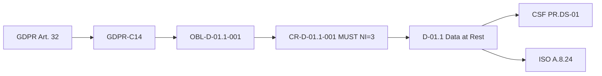

# Specification — Phase 2 Case_01: Unified NIST Matrix

> **Lê-me primeiro.** Este documento fecha 17 decisões tomadas em sessão de
> orquestração. Está escrito para que um Executor execute do início ao fim sem
> perguntas. Se algo parecer ambíguo, o problema é desta spec — sinaliza no
> commit message e decide a interpretação mais alinhada com o §3 (princípio
> arquitectural). Não reinventes decisões já fechadas em §2.

---

## Como ler este documento

1. **Lê §1** (contexto) e **§2** (decisões) — 5 minutos.
2. **Lê §3** (princípio arquitectural) — é o teste de coerência para cada decisão.
3. **Antes de executar qualquer bloco: lê §4** (vocabulário dos frameworks) e
   **§5** (artefactos) — são a especificação detalhada do *quê*.
4. **Lê §6 e §7** — são a especificação do *como* (regras NI e maturidade).
5. **Segue §8** (blocos) em ordem estrita. Não saltes blocos.
6. **Valida com §9** antes de declarar pronto.
7. **Cumpre §11** (checklists) e §13 (branch).

**Convenções tipográficas:**
- `caminho/relativo.md` — caminho relativo à raiz do repo, salvo indicação.
- `DEVE` / `NÃO DEVE` — imperativo normativo (RFC 2119-style).
- `Bloco X` — unidade de trabalho atómica (§8).
- `CR` / `BPR` — Compliance Rule / Best Practice Rule (ver Apêndice A).

> ✅ **UPDATE 2026-08-07 — Baseline NIST mappings concluídos (branch `feature/aegis-baseline-nist-mappings`).**
> Os mapeamentos fundacionais que este spec assumia como pré-requisitos **já existem**:
> - Frozen lists: `00_METHODOLOGY/PREPROCESSING_by_domain/_global/NIST_PF_1.0_subcategories.md` (138 subcats) e `00_METHODOLOGY/PREPROCESSING/NIST_AI_RMF_1.0_subcategories.md` (72 subcats).
> - GDPR→Privacy FW: `00_METHODOLOGY/PREPROCESSING/Regulation/GDPR/02b_SecurityRules_NISTPF.md` (68 SR, 100% cobertura).
> - AI Act→AI RMF: `00_METHODOLOGY/PREPROCESSING/Regulation/AI_Act/02b_SecurityRules_NISTAIRMF.md` (24 SR, 41/72 subcats AI RMF).
>
> **Nota de localização:** as frozen lists vivem em `00_METHODOLOGY/PREPROCESSING/` (ao lado do `NIST_CSF_2.0_subcategories.md` canónico), NÃO em `03_REFERENCE_MATERIAL/Framework_Mappings/NIST_Privacy_Framework/` como o §5.1 abaixo originalmente planeava. Sempre que o §5.1, §5.2 e o Apêndice B referenciam `03_REFERENCE_MATERIAL/.../NIST_PF_1.0_subcategories.md`, ler como `00_METHODOLOGY/PREPROCESSING_by_domain/_global/NIST_PF_1.0_subcategories.md`.
>
> O Bloco 0 deste spec (criar vocabulário Privacy FW) **está portanto dispensado** — passa-se directamente ao Bloco A.

---

## Índice

- §1 Contexto & motivação
- §2 Decisões consolidadas (17)
- §3 Princípio arquitectural
- §4 Especificação dos frameworks (vocabulário)
- §5 Artefactos a produzir
- §6 Regra MUST/SHOULD/COULD (semântica operacional)
- §7 Modelo de maturidade dupla
- §8 Blocos de trabalho (plano de execução)
- §9 Critério "pronto" (validação)
- §10 Riscos & decisões diferidas
- §11 Checklists do Executor
- §12 Apêndices (glossário, caminhos, exemplos)
- §13 Branch & execução

---

## §1 — Contexto & motivação

### 1.1 O que é a AEGIS (resumo de 1 parágrafo)

A AEGIS é uma metodologia de investigação (doutoramento) que mapeia 5 regulamentos
EU (GDPR, CRA, NIS 2, DORA, AI Act) a 38 sub-domínios de segurança, em 3 fases:
**UNDERSTAND** (Phase 1) → **DERIVE** (Phase 2) → **DECOMPOSE** (Phase 3). O
"software" é tooling de validação/linting sobre documentos Markdown estruturados,
não software tradicional. O MANIFESTO declara: *"Regulations are inputs, not
checklists. We derive controls from obligations, not from compliance frameworks."*

### 1.2 O problema actual no Case_01 (3 lacunas)

Após a exploração do Phase 1 (`01_PHASE1_CONTEXT_RICH/`) e Phase 2
(`02_PHASE2_RULES_RICH/`) do Case_01, identificámos três lacunas que este
contracto resolve:

| # | Lacuna | Sintoma observado | Onde |
|---|---|---|---|
| L1 | **MUST/SHOULD informal** | BPR = P3 uniforme, sem `normative_intensity` formal; semântica SHOULD sem consequência operacional (não afecta gate nem maturidade). Case_02/03 usam `MAX(NI)` = 3.000 uniforme (anti-pattern `AP-P2-09`). Contradição `DR-002`: template diz MAX, execução usa AVG. | Doc 11 §4/§5 |
| L2 | **Maturidade deslocada** | Modelo 0-4 vive no Doc 04b com `phase: 1`, mas `PHASE1_STRATEGY.md §7` diz *"Phase 1 does NOT assess control maturity (Phase 2)."* Maturidade é escalar por cartão, não por-controlo, não ancorada a escala comparável. | Doc 04b |
| L3 | **Diferenciação não demonstrável** | MANIFESTO tem retórica forte (*"We are not a compliance checklist tool"*) mas sem demonstração operacional ponto-a-ponto vs. análise compliance+maturidade convencional. | — |

### 1.3 O que JÁ existe e NÃO DEVE ser recriado

O Executor **NÃO DEVE** reconstruir o seguinte — está feito e é input:

| Artefacto | Caminho | Estado | Reutilização |
|---|---|---|---|
| Lista frozen CSF 2.0 (106 subcats) | `00_METHODOLOGY/PREPROCESSING/NIST_CSF_2.0_subcategories.md` | ACTIVE | Vocabulário controlado — só de aqui se tiram IDs CSF |
| Crosswalk AEGIS↔frameworks (38/38) | `03_REFERENCE_MATERIAL/Framework_Mappings/Framework_Crosswalk_ARM.md` | DRAFT v0.1, corpo populado | Promover a ACTIVE (§5.5). Coluna CSF 38/38, ISO 38/38, SSDF 23/38, AI SSDF 16/38, 800-53 VAZIA |
| Doc 11 — 46 cartões (30 CR + 16 BPR) | `02_CASES/Case_01_TinyTask_SaaS/02_PHASE2_RULES_RICH/11_Rules_Catalog.md` | DEEP_ENRICHED | Estender (§5.3). Cada cartão já tem 17 campos (CR) / 15 (BPR) |
| Doc 12 — Excel 14 folhas | `02_CASES/Case_01_TinyTask_SaaS/02_PHASE2_RULES_RICH/12_Rules_Catalog.xlsx` | — | Estender com novas folhas (§5.6) |
| Doc 04b — Security Posture | `02_CASES/Case_01_TinyTask_SaaS/01_PHASE1_CONTEXT_RICH/04b_Security_Posture.md` | ACTIVE, `phase: 1` | Deprecar para input-only (§5.4) |
| Taxonomia 10×38 | `00_METHODOLOGY/TEMPLATES/00_Taxonomy_Reference.md` | ACTIVE | Read-only |
| Phase 1 ontology (54 cláusulas) | `02_CASES/Case_01_TinyTask_SaaS/01_PHASE1_CONTEXT_RICH/phase1_ontology.yaml` | ACTIVE | Read-only — fonte de cláusulas/NI |

### 1.4 O que falta (4 itens)

1. **Vocabulário controlado Privacy FW 1.0** — não existe; tem de ser criado (§5.1).
2. **Matriz unificada + Govern consolidada** — não existe; Doc 13 novo (§5.2).
3. **Maturidade por-controlo em escala comparável** — não existe; modelo novo (§7).
4. **NI formal + maturidade dupla nos cartões** — campos novos no Doc 11 (§5.3).

---

## §2 — Decisões consolidadas (17 respostas)

> Cada decisão tem Justificação (o PORQUÊ) e Implicações práticas (o QUE muda no
> artefacto). O Executor não reabre nenhuma destas.

| # | Decisão | Escolha | Justificação | Implicações |
|---|---|---|---|---|
| D1 | Âmbito de execução | **Só Case_01** | Piloto focado; método estabiliza antes de escalar | Não tocar Case_02/03 |
| D2 | Abordagem ao catálogo | **Híbrido: derivação AEGIS + CSF 2.0 como pivô** | Mantém identidade AEGIS; CSF dá esqueleto comparável | Frameworks = alvo de mapeamento, não fonte |
| D3 | Maturidade | **Mover p/ Phase 2 + expandir por-controlo** | Resolve contradição PHASE1_STRATEGY §7 | Doc 04b deprecado; Doc 13 assume maturidade |
| D4 | Argumento "AEGIS vs. convencional" | **Documento académico separado (tese)** | Repo fica neutro; argumentação vive na escrita | Não escrever argumentação no repo |
| D5 | Frameworks NIST a usar | **CSF 2.0 + Privacy FW 1.0** (não AI RMF neste ciclo) | Case_01 sem IA; Privacy FW cobre GDPR (aplicável) | AI RMF = placeholder; entra em Case_02/03 |
| D6 | Articulação estrutural | **Matriz unificada** | Vista única evita triplicação de camadas | Doc 13 §1 = matriz com colunas de cada framework |
| D7 | Função Govern sobreposta | **Vista Govern consolidada** | Os 3 frameworks têm Govern; fundir evita redundância | Doc 13 §2 = Govern fundida (GV∥Govern-P∥GOVERN) |
| D8 | Papel dos frameworks | **Só alvo de mapeamento** | MANIFESTO intacto; AEGIS deriva da lei | CR/BPR não se derivam de frameworks |
| D9 | AI RMF no Case_01 | **Fora (sem IA); método pronto** | Case_01 = sem IA, AI Act NOT APPLICABLE | Schema com 3ª coluna `pending Case_02/03` |
| D10 | Escala de maturidade | **Tiers 1-4 + 0-4 nos DOIS frameworks** | Comparabilidade directa CSF↔Privacy | Definir 0-4 por-subcat para cada framework |
| D11 | Score por controlo multi-framework | **Dois scores (csf + privacy)** | Preserva dessincronia segurança/privacidade | 4 campos de maturidade por cartão |
| D12 | Govern no Case_01 (2 frameworks) | **2 colunas + 3ª placeholder** | Método completo; AI RMF entra sem refactor | Coluna AI RMF = `pending` |
| D13 | Estrutura do mapeamento | **n:m flexível** | Captura multi-mapping realista | Cada CR/BPR → lista de subcats por framework |
| D14 | Vocabulário Privacy FW | **Lista frozen completa** | Consistência com tratamento CSF | Novo ficheiro espelho do CSF (§5.1) |
| D15 | Onde vive a matriz | **Doc 13 novo consolidado** | Centralização; não fragmenta Doc 11 | Doc 13 = 6 sub-secções (§5.2) |
| D16 | Critério "pronto" | **100% CR + coerência BPR** | MUST tem de mapear; SHOULD pode não mapear | Validação em §9 |
| D17 | Branch | **Nova `feature/aegis-p2-case01-csf2-priv`** | Política 1-branch-per-contract (AGENTS.md) | Branch actual é Case_03 |

---

## §3 — Princípio arquitectural

### 3.1 Frase-mestra

> AEGIS deriva obrigações da lei → traduz em **CR (MUST, NI=3)** e **BPR (SHOULD,
> NI=1-2)** → ancora cada regra aos 38 sub-domínios → mapeia cada sub-domínio em
> paralelo ao **CSF 2.0** (eixo segurança) e ao **Privacy FW 1.0** (eixo
> privacidade), numa **matriz unificada** → mede **maturidade dupla por-controlo**
> (Tiers 1-4 no programa/Function; 0-4 por-subcategoria no controlo) → liga tudo
> a ISO/SSDF via crosswalk já existente.

### 3.2 Diagrama de fluxo

```
         REGULAÇÃO (GDPR + CRA aplicáveis ao Case_01)
              │
              ▼  (derivação AEGIS — intacta, MANIFESTO)
        OBRIGAÇÕES (Doc 08) → CR (MUST, NI=3) + BPR (SHOULD, NI=1-2)
              │                          │
              │   Tensões (Doc 09) ◄─────┤
              │                          │
              ▼                          ▼
        PG/SG (Doc 10) ◄──────────  46 CARTÕES (Doc 11)
              │                          │
              │   38 sub-domínios (Taxonomia D-01.1 … D-10.3)
              │                          │
              │           MATRIZ UNIFICADA (Doc 13) ◄── NESTE CONTRACTO
              │                          │
              │              ┌───────────┴────────────┐
              │              ▼                        ▼
              │        CSF 2.0                 PRIVACY FW 1.1    [AI RMF 1.0]
              │     GV ID PR DE RS RC     Id-P Gv-P Ct-P Cm-P Pt-P   ← placeholder
              │              │                        │               pending C2/C3
              │              └───────────┬────────────┘
              │                          ▼
              │              MATURIDADE DUPLA por-controlo
              │                Programa: T1-T4 (CSF Tiers) por Function
              │                Controlo: 0-4 por-subcategoria
              │                          │
              ▼                          ▼
        CROSSWALK (Framework_Crosswalk_ARM.md, ACTIVE)
              │
              ▼
        ISO 27001 / SSDF / AI SSDF
```

### 3.3 Invariante metodológica (NÃO violar)

> **Frameworks NIST são ALVO de mapeamento, nunca FONTE de controlos.**
> A AEGIS deriva da lei. CR vêm de obrigações; BPR podem apoiar-se em frameworks
> mas a derivação primária é legal. Se o Executor se encontrar a *inventar* um
> CR só porque uma subcategoria CSF "existe", PARAR — está a violar o MANIFESTO.

---

## §4 — Especificação dos frameworks (vocabulário)

> O Executor DEVE usar apenas IDs das listas frozen. **NÃO inventar IDs.** Se um
> mapeamento não encaixar em nenhuma subcategoria, usar `UNMAPPED_CSF` /
> `UNMAPPED_PRIVACY` (espelhando a convenção do CSF).

### 4.1 NIST CSF 2.0 (segurança — eixo principal)

- **Fonte autoritativa:** `00_METHODOLOGY/PREPROCESSING/NIST_CSF_2.0_subcategories.md` (frozen, ACTIVE).
- **Publicação de origem:** NIST CSWP 29 (26 Fevereiro 2024).
- **Estrutura:** 6 Functions, 22 Categories, 106 Subcategories.

| Function | Nome | Categorias | Subcats |
|---|---|---:|---:|
| **GV** | Govern | 6 | 19 |
| **ID** | Identify | 3 | 13 |
| **PR** | Protect | 5 | 22 |
| **DE** | Detect | 3 | 10 |
| **RS** | Respond | 4 | 13 |
| **RC** | Recover | 1 | 6 |

- **Formato do ID:** `XX.YY-NN` (ex: `PR.DS-01`, `GV.OC-03`, `ID.AM-02`).
- **Exemplo de entrada frozen:**
  `| GV.OC-03 | Legal, regulatory, and contractual requirements regarding cybersecurity — including privacy and civil liberties obligations — are understood and managed |`

### 4.2 NIST Privacy Framework 1.0 (privacidade — eixo complementar)

- **Fonte autoritativa:** ✅ **EXISTE** — `00_METHODOLOGY/PREPROCESSING_by_domain/_global/NIST_PF_1.0_subcategories.md` (138 subcats, 5 Functions, 24 Categories, criado no contracto baseline).
- **Publicação de origem:** NIST CSWP 129 (Privacy Framework v1.0, 16 Janeiro 2020; v1.1 reflecte errata/restructuração — 34 subcats marcadas `Moved to` como redirects v1.0→v1.1).
- **Estrutura:** 5 Functions, 24 Categories, 138 Subcategories (104 activas + 34 redirects).

| Function | Nome (sufixo `-P`) | Função no contexto | Subcats |
|---|---|---|---:|
| **Identify-P** (ID-P) | Identify | Compreender o ecossistema de dados pessoal | 25 |
| **Govern-P** (GV-P) | Govern | Política, responsabilidades, risco de privacidade | 37 |
| **Control-P** (CT-P) | Control | Implementar protecção de dados | 20 |
| **Communicate-P** (CM-P) | Communicate | Comunicação com stakeholders/sujeitos | 10 |
| **Protect-P** (PR-P) | Protect | Salvaguardas técnicas | 46 |

- **Formato do ID:** `XX.YY-PN` (ex: `ID.IM-P1`, `GV.PO-P1`, `PR.DS-P1`, `CT.DM-P3`). Segue o padrão `<Function>.<Category>-P<n>`.
- **Mapeamento GDPR→PF já existe:** `00_METHODOLOGY/PREPROCESSING/Regulation/GDPR/02b_SecurityRules_NISTPF.md` (68 SR mapeados, 59/104 subcats activas usadas, 100% cobertura sem UNMAPPED_PF).

### 4.3 NIST AI RMF 1.0 (IA — placeholder neste ciclo para Case_01)

- **Estado neste contracto:** **PLACEHOLDER para Case_01** (sem IA). Mas a frozen list e o mapeamento AI Act→AI RMF **já existem** ao nível do Regulatory Baseline para uso em Case_02/03.
- **Fonte autoritativa:** ✅ **EXISTE** — `00_METHODOLOGY/PREPROCESSING/NIST_AI_RMF_1.0_subcategories.md` (72 subcats, 4 Functions, 19 Categories).
- **Mapeamento AI Act→AI RMF já existe:** `00_METHODOLOGY/PREPROCESSING/Regulation/AI_Act/02b_SecurityRules_NISTAIRMF.md` (24 SR mapeados a 41/72 subcats AI RMF, 100% cobertura sem UNMAPPED_AIRMF).
- **Justificação placeholder no Case_01:** AI Act NOT APPLICABLE; stack determinística. A coluna AI RMF no Doc 13 fica `pending Case_02/03` — mas o método está pronto, herda directamente do baseline.
- **Estrutura:** 4 Functions.

| Function | Nome |
|---|---|
| **GOVERN** | Cultivar cultura de gestão de risco de IA |
| **MAP** | Contextualizar uso de IA |
| **MEASURE** | Analisar/avaliar/medir risco de IA |
| **MANAGE** | Priorizar/acrescentar riscos de IA |

- **Formato do ID:** `GOVERN-1.1`, `MAP-1.1`, etc.
- **O que o Executor faz agora:** Cria a **coluna** no Doc 13 com header `AI RMF` e valor uniforme `pending Case_02/03`. **NÃO mapeia.** Não cria lista frozen AI RMF (fica para o contracto de Case_02/03).

### 4.4 Correspondência Govern (base da Govern consolidada)

Esta tabela é a base do Doc 13 §2 (Vista Govern consolidada). Funde as três
funções Govern num único conjunto de objectivos de governação.

| Conceito de governação | CSF 2.0 | Privacy FW 1.0 | AI RMF 1.0 (placeholder) |
|---|---|---|---|
| Missão/objectivos organizacionais | `GV.OC-*` | `ID-P.BE:*` | `GOVERN-1.*` |
| Requisitos legais/regulatórios | `GV.OC-03`, `GV.LR-*` | `GV-P.PO:*` | `GOVERN-2.*` |
| Política de segurança/privacidade | `GV.PO-*` | `GV-P.PO:1` | `GOVERN-3.*` |
| Papéis e responsabilidades | `GV.RR-*` | `GV-P.PO:2` | `GOVERN-4.*` |
| Gestão de risco | `GV.RM-*` | `ID-P.RA:*`, `GV-P.RM-P:*` | `GOVERN-5.*` |
| Estratégia e melhoria contínua | `GV.STR-*`, `GV.OV-*` | `GV-P.IM:*` | `GOVERN-6.*` |

> **Nota de fidelidade:** Os IDs do Privacy FW acima são aproximados — o
> Executor DEVE confirmá-los contra a lista frozen que criar em §5.1. Se a
> estrutura real diferir (o Privacy FW tem uma organização ligeiramente
> diferente do CSF), mapear pelo *conceito*, não pelo ID literal.

### 4.5 Regras de sourcing (imperativas)

1. O Executor **DEVE** tirar IDs CSF 2.0 de `NIST_CSF_2.0_subcategories.md`.
2. O Executor **DEVE** criar `NIST_PF_1.0_subcategories.md` (§5.1) **ANTES** de qualquer mapeamento Privacy.
3. O Executor **NÃO DEVE** inventar IDs. Se não há correspondência, usar `UNMAPPED_CSF` ou `UNMAPPED_PRIVACY`.
4. O Executor **NÃO DEVE** mapear AI RMF neste contracto (placeholder).

---

## §5 — Artefactos a produzir

> 7 artefactos. Cada um com caminho, acção, schema, exemplo, critério de
> aceitação.

### 5.1 ✅ JÁ EXISTE — `NIST_PF_1.0_subcategories.md`

> **Concluído no contracto baseline** (`feature/aegis-baseline-nist-mappings`).

| Campo | Valor |
|---|---|
| Caminho | `00_METHODOLOGY/PREPROCESSING_by_domain/_global/NIST_PF_1.0_subcategories.md` |
| Acção | ✅ **EXISTENTE** (não recriar) |
| Bloco | 0 (concluído) |

**Frontmatter (já implementado):**

```yaml
---
document_id: AEGIS-PREPROC-PRIVFW-REF
title: NIST Privacy Framework 1.0 Subcategory Reference (Frozen List)
phase: Pre-processing (Regulatory Baseline)
version: 1.0
created: 2026-08-07
updated: 2026-08-07
author: Orchestrator (Bloco 0A)
status: ACTIVE
source: NIST Privacy Framework v1.1 (NIST CSWP 129, January 16, 2020; 1.1 errata)
source_file: "PF 1.0 and 1.1_Core Mapping.xlsx"
source_sheet: "PF 1.1 Core"
chain_version: v2.1
---
```

**Corpo contém:**
- §1 "Authority" (nota de não-invenção de IDs).
- §2 "Function structure" — tabela com 5 Functions + contagem de Categories/Subcats.
- §3 uma secção por Function (`## Identify-P — Identify`), com tabela `| Subcategory ID | Subcategory Description |`.
- Rodapé: total de subcategorias.

**Critério de aceitação:**
- Frontmatter conforme acima.
- Pelo menos as 5 Functions representadas com pelo menos 1 subcategoria cada.
- Nenhum ID inventado — todos extraídos de NIST CSWP 129.
- Sintaxe markdown válida (lint passa).

### 5.2 NOVO — `13_Framework_Mapping_Matrix.md`

| Campo | Valor |
|---|---|
| Caminho | `02_CASES/Case_01_TinyTask_SaaS/02_PHASE2_RULES_RICH/13_Framework_Mapping_Matrix.md` |
| Acção | **NOVO** |
| Bloco | C |

**Frontmatter:**

```yaml
---
document_id: AEGIS-P2-RICH-13
title: Framework Mapping Matrix — Unified NIST (CSF 2.0 + Privacy FW 1.0)
phase: 2
version: 1.0
created: <data>
updated: <data>
author: Executor (Bloco C)
status: ACTIVE
sprint: 6
inputs:
  - 11_Rules_Catalog.md
  - ../../../03_REFERENCE_MATERIAL/Framework_Mappings/Framework_Crosswalk_ARM.md
  - ../../../00_METHODOLOGY/PREPROCESSING_by_domain/_global/NIST_PF_1.0_subcategories.md
  - ../../../00_METHODOLOGY/PREPROCESSING/NIST_AI_RMF_1.0_subcategories.md
  - ../../../00_METHODOLOGY/PREPROCESSING/NIST_CSF_2.0_subcategories.md
outputs: [Phase 3 inputs, 12_Rules_Catalog.xlsx]
traceability: AEGIS Framework Mapping Layer (CSF 2.0 + Privacy FW 1.0)
related_documents: 11_Rules_Catalog.md, 12_Rules_Catalog.xlsx, 04b_Security_Posture.md
case: Case_01_TinyTask_SaaS
tier: MICRO
frameworks_in_scope: [NIST_CSF_2.0, NIST_Privacy_FW_1.0]
frameworks_placeholder: [NIST_AI_RMF_1.0]   # pending Case_02/03
normative_intensity_rule: AVG                # resolve DR-002 — see §6
---
```

**Corpo — 6 sub-secções obrigatórias:**

#### §1 — Matriz Unificada

Tabela principal: linhas = 38 sub-domínios (ou controlos CR/BPR agrupados por sub-domínio), colunas = Functions de cada framework.

```
| Sub-domínio | CSF 2.0 (subcats) | Privacy FW 1.0 (subcats) | AI RMF | ISO 27001 | SSDF |
|-------------|-------------------|--------------------------|--------|-----------|------|
| D-01.1      | PR.DS-01          | (UNMAPPED_PRIVACY)       | pending| A.8.24    | —    |
| D-01.2      | PR.DS-02          | —                        | pending| A.8.24    | —    |
| ...         | ...               | ...                      | ...    | ...       | ...  |
```

- As colunas ISO 27001 e SSDF vêm do crosswalk existente (§5.5) — **não recriar**, referenciar.
- A coluna AI RMF é uniformemente `pending Case_02/03`.
- Para sub-domínios com CR e BPR, listar todos os IDs únicos mapeados.

#### §2 — Vista Govern Consolidada

Aplica a tabela do §4.4 desta spec. Para cada *conceito de governação* (missão, legal, política, papéis, risco, melhoria), mostra as subcategorias dos 2 frameworks activos + coluna AI RMF `pending`.

Formato: sub-secção por conceito. Exemplo:

```markdown
### 2.1 Missão e objectivos organizacionais
| Framework | Subcategoria | Statement (resumo) | Cobertura Case_01 |
|-----------|--------------|--------------------|-------------------|
| CSF 2.0   | GV.OC-01     | Missão compreendida | ✅ CR-D-09.1-001 |
| Privacy FW| ID-P.BE:1    | Ambiente de negócio  | ✅ CR-D-05.1-001 |
| AI RMF    | GOVERN-1.1   | (pending Case_02/03) | ⏳ placeholder    |
```

#### §3 — Mapeamento n:m CR/BPR ↔ Subcategorias

Para cada um dos 46 cartões (30 CR + 16 BPR), uma linha com:

```yaml
rule_id: CR-D-01.1-001
subdomain: D-01.1
normative_intensity: 3          # MUST (ver §6)
priority_label: MUST
csf_subcategories: [PR.DS-01, PR.DS-10]
privacy_subcategories: []        # nenhum relevante
mapping_rationale: >
  PR.DS-01 cobre confidencialidade/integridade de dados em repouso;
  PR.DS-10 cobre integridade de armazenamento. Sem correspondência
  Privacy FW (controlo técnico de cifra, não de privacidade de dado).
```

O Executor DEVE preencher `csf_subcategories` e `privacy_subcategories` para os 30 CR (D16: 100% CR). Para os 16 BPR, mapear onde fizer sentido e justificar `[]` onde não (D16: coerência BPR).

#### §4 — Modelo de Maturidade Dupla

Especifica o modelo (ver §7 desta spec para conteúdo). Tabelas:
- 4.1 Implementation Tiers CSF (T1-T4) aplicados ao programa/Function.
- 4.2 Escala 0-4 por-subcategoria para CSF 2.0.
- 4.3 Escala 0-4 por-subcategoria para Privacy FW 1.0.
- 4.4 Tabela de avaliação por-Function para o Case_01 (avaliação actual vs target).

#### §5 — Aplicação ao Case_01

- 5.1 Avaliação por-controlo: tabela com `rule_id`, `cur_csf`, `tgt_csf`, `cur_priv`, `tgt_priv`, `gap`.
- 5.2 Avaliação por-Function: T1-T4 actual vs target para cada uma das 6 CSF Functions + 5 Privacy Functions.

#### §6 — Gap Analysis

- 6.1 Subcategorias CSF **não cobertas** por nenhum CR/BPR do Case_01 (lista + justificação — se é gap aceitável ou precisa de controlo).
- 6.2 Subcategorias Privacy FW **não cobertas** (idem).
- 6.3 Sub-domínios com baixa maturidade-alvo (tgt < 3) — justificar com proporção MICRO.

**Critério de aceitação (Doc 13):**
- 6 sub-secções presentes e populadas.
- 100% dos CR com mapeamento n:m (D16).
- AI RMF coluna presente mas `pending` (D9, D12).
- Modelo de maturidade §4 definido para os dois frameworks (D10).
- Gap analysis identifica pelo menos as subcats não cobertas.

### 5.3 ESTENDER — `11_Rules_Catalog.md`

| Campo | Valor |
|---|---|
| Caminho | `02_CASES/Case_01_TinyTask_SaaS/02_PHASE2_RULES_RICH/11_Rules_Catalog.md` |
| Acção | **ESTENDER** (46 cartões existentes) |
| Bloco | D |

**Estado actual de cada cartão CR (17 campos numerados):**
1. Description / 2. Scope / 3. Out of Scope / 4. Source Article / 5. NIST CSF Anchors / 6. Verification Criteria / 7. Verification Method / 8. Owner / 9. Status / 10. Dependencies / 11. Risk if not met / 12. Affected Stakeholders / 13. Maturity Score / 14. Implementation Priority / 15. Regulatory Reporting / 16. External Auditor / 17. Supervisory Body.

**Campos NOVOS a adicionar a cada cartão (CR e BPR):**

Substituir o campo "5. NIST CSF Anchors" e "13. Maturity Score" por uma estrutura expandida. **Abordagem recomendada:** manter a numeração 1-17 e adicionar 18-22:

```
18. Normative Intensity: 3 (MUST)              # ver §6
19. CSF Subcategories: [PR.DS-01, PR.DS-10]    # n:m, do vocabulário frozen
20. Privacy FW Subcategories: []               # n:m, do vocabulário frozen
21. Maturity (CSF): cur 1/4 → tgt 3/4          # substitui "Maturity Score" antigo
22. Maturity (Privacy): cur — → tgt —          # "—" se não aplicável
```

> **Decisão de estrutura:** O Executor PODE consolidar os campos 13/21/22 num
> único bloco "Maturity (dual)" se preferir, mas DEVE manter os dois scores
> separados (D11). Manter o campo "13. Maturity Score" legado marcado como
> `(legacy — ver 21/22)` para não quebrar lints existentes.

**Exemplo — cartão CR-D-01.1-001 ANTES (estado actual, linha 533):**

```markdown
13. **Maturity Score:** 1/4 → 3/4
```

**DEPOIS (após Bloco D):**

```markdown
13. **Maturity Score (legacy):** 1/4 → 3/4 *(ver 21/22 para maturidade dupla)*

18. **Normative Intensity:** 3 — MUST (bloqueia gate de conformidade)

19. **CSF Subcategories:** PR.DS-01 (data-at-rest confidentiality),
    PR.DS-10 (storage integrity)

20. **Privacy FW Subcategories:** — (controlo técnico de cifra, sem
    correspondência directa em Privacy FW; os aspectos de privacidade são
    cobertos por CR-D-05.x)

21. **Maturity (CSF):** cur 1/4 → tgt 3/4   *(None→Managed, gap 2)*

22. **Maturity (Privacy):** N/A — não mapeado a Privacy FW
```

**Atualização do frontmatter do Doc 11:**

```yaml
expected_fields_per_card: 22     # era 17
fields_per_card: 22              # era 17
normative_intensity_rule: AVG    # novo — resolve DR-002
frameworks_mapped: [NIST_CSF_2.0, NIST_Privacy_FW_1.0]
```

**Critério de aceitação (Doc 11):**
- 100% dos 30 CR têm campos 18-22 preenchidos (19 e 20 podem ser `[]` com justificação).
- 100% dos 16 BPR têm campo 18 com NI 1-2 (SHOULD/COULD).
- `normative_intensity_rule: AVG` no frontmatter.
- Lint passa.

### 5.4 DEPRECAR — `04b_Security_Posture.md`

| Campo | Valor |
|---|---|
| Caminho | `02_CASES/Case_01_TinyTask_SaaS/01_PHASE1_CONTEXT_RICH/04b_Security_Posture.md` |
| Acção | **DEPRECAR para input-only** |
| Bloco | E |

**O que muda:**
- O Doc 04b deixa de ser o dono do modelo de maturidade. Passa a recolher **só evidência/postura observada** (input qualitativo).
- O modelo de maturidade (avaliação, target, gap) vive no Doc 13 §4-5.
- Isto resolve a contradição `PHASE1_STRATEGY.md §7` ("Phase 1 does NOT assess control maturity").

**Atualizações no Doc 04b:**
1. No frontmatter, adicionar:

```yaml
status: DEPRECATED_FOR_MATURITY   # era ACTIVE
status_history:
  - { date: '2026-08-07', from: ACTIVE, to: DEPRECATED_FOR_MATURITY,
      reason: 'Maturity model moved to Phase 2 Doc 13 — resolves PHASE1_STRATEGY §7 contradiction' }
maturity_owner: 13_Framework_Mapping_Matrix.md   # novo campo
note: >
  Este documento mantém-se como INPUT qualitativo (postura observada).
  A avaliação e o modelo de maturidade foram movidos para
  02_PHASE2_RULES_RICH/13_Framework_Mapping_Matrix.md §4-5.
```

2. No topo do corpo, adicionar banner:

```markdown
> ⚠️ **DEPRECATED FOR MATURITY (2026-08-07).** A avaliação e o modelo de
> maturidade vivem agora em `02_PHASE2_RULES_RICH/13_Framework_Mapping_Matrix.md`
> §4-5. Este documento mantém-se como input qualitativo (postura observada).
> Ver `status_history` no frontmatter.
```

3. **NÃO apagar** conteúdo existente — mantém como evidência input. Apenas desambiguar a propriedade da maturidade.

**Critério de aceitação (Doc 04b):**
- `status: DEPRECATED_FOR_MATURITY` no frontmatter.
- `status_history` com entrada datada.
- Banner de deprecated no topo do corpo.
- `maturity_owner` aponta para Doc 13.

### 5.5 PROMOVER — `Framework_Crosswalk_ARM.md`

| Campo | Valor |
|---|---|
| Caminho | `03_REFERENCE_MATERIAL/Framework_Mappings/Framework_Crosswalk_ARM.md` |
| Acção | **PROMOVER DRAFT → ACTIVE** |
| Bloco | A |

**Atualizações:**

1. Frontmatter:
```yaml
version: 1.0                # era 0.1 (Template)
status: ACTIVE              # era DRAFT
updated: <data>
status_history:
  - { date: '<data>', from: DRAFT, to: ACTIVE,
      reason: 'Promoted — body fully populated (CSF 38/38, ISO 38/38). Used as spine for Phase 2 Doc 13.' }
note_800_53: >
  NIST SP 800-53 Rev 5 column intentionally OUT OF SCOPE for the Case_01
  unified-matrix contract. To be populated in a future contract if needed.
```

2. Adicionar coluna de cobertura do Privacy FW: no topo do §3, adicionar nota:

```markdown
> **Privacy FW 1.0 cross-reference:** Para mapeamento Privacy FW, ver
> `02_CASES/Case_01_TinyTask_SaaS/02_PHASE2_RULES_RICH/13_Framework_Mapping_Matrix.md` §3.
> O crosswalk principal (este doc) cobre CSF/ISO/SSDF/AI SSDF/800-53.
```

3. **NÃO preencher** a coluna NIST 800-53 (decisão: fora de âmbito neste contracto). Declarar explicitamente.

**Critério de aceitação:**
- `status: ACTIVE`, `version: 1.0`.
- `status_history` presente.
- Nota de 800-53 fora-de-âmbito.
- Referência ao Privacy FW (que vive no Doc 13).

### 5.6 ESTENDER — `12_Rules_Catalog.xlsx`

| Campo | Valor |
|---|---|
| Caminho | `02_CASES/Case_01_TinyTask_SaaS/02_PHASE2_RULES_RICH/12_Rules_Catalog.xlsx` |
| Acção | **ESTENDER** (adicionar folhas) |
| Bloco | F |

**Novas folhas a adicionar:**

| Folha | Conteúdo | Origem |
|---|---|---|
| `Unified_Matrix` | Réplica do Doc 13 §1 (matriz sub-domínio × frameworks) | Doc 13 §1 |
| `Govern_Consolidated` | Réplica do Doc 13 §2 | Doc 13 §2 |
| `Mapping_nm` | 46 linhas (CR+BPR) × `{rule_id, subdomain, NI, csf_subcats, priv_subcats}` | Doc 13 §3 |
| `Maturity_Dual` | 46 linhas × `{rule_id, cur_csf, tgt_csf, gap_csf, cur_priv, tgt_priv, gap_priv}` | Doc 13 §5 |
| `Cov_Function` | Visualização por Function (6 CSF + 5 Privacy), contagem de cobertura | Derivado |
| `Heatmap_Maturity` | Sub-domínio × gap (cor = MIN gap) | Derivado §7 |

> **Nota técnica:** Use a skill `xlsx` se disponível. Caso contrário, gerar via `openpyxl` com formatação condicional no Heatmap.

**Critério de aceitação:**
- 6 novas folhas presentes.
- `Mapping_nm` tem 46 linhas (1 por regra).
- `Heatmap_Maturity` com formatação condicional (cor por gap).

### 5.7 NOVO — 4 Visualizações

Bloco F. Formato de cada uma (a renderizar em markdown no Doc 13 e/ou Excel):

#### V1 — Matriz de Cobertura (CR/BPR × CSF + Privacy)
- Tabela 46 linhas × colunas `[rule_id, type(CR/BPR), NI, subdomain, csf_subcats, priv_subcats]`.
- Renderização: tabela markdown no Doc 13 §3 + folha `Mapping_nm` no Excel.

#### V2 — Mapa de Cobertura por Function
- Para cada uma das 11 Functions (6 CSF + 5 Privacy), contar subcats cobertas por CR vs BPR vs GAP.
- Renderização: tabela + (opcional) gráfico de barras. Cores: verde (CR), amarelo (BPR), vermelho (GAP).

#### V3 — Grafo de Rastreabilidade
- **Figura central da tese.** Nodos: Regulação → Cláusula → Obrigação → CR/BPR → sub-domínio → CSF/Privacy → ISO/SSDF.
- Renderização: **Mermaid** (`graph LR`) no Doc 13 §1, ou Graphviz se mais legível.
- Exemplo Mermaid:



- Não é necessário desenhar todos os 46 caminhos — basta um subconjunto representativo (≥5 caminhos) que ilustre a cadeia completa.

#### V4 — Heatmap de Maturidade
- Linhas: 38 sub-domínios (ou 46 controlos).
- Cor: `gap = MIN(gap_csf, gap_priv)` (D11 + decisão técnica).
  - Verde: gap 0 / Amarelo: gap 1 / Laranja: gap 2 / Vermelho: gap 3-4.
- Scores individuais (csf, privacy) ficam visíveis no detalhe (tooltip ou coluna lateral).
- Renderização: Excel com formatação condicional OU markdown tabela colorida.

---

## §6 — Regra MUST/SHOULD/COULD (semântica operacional)

### 6.1 NI → consequência operacional

| NI | Label | Origem típica | Consequência operacional |
|---|---|---|---|
| **3** | **MUST** | Cláusula SHALL; obrigação incondicional | **Bloqueia gate de conformidade.** Falhar = não-conformidade. Tem de mapear (D16). |
| **2** | **SHOULD** | Cláusula SHOULD; recomendado; BPR com base em framework | **Não bloqueia conformidade.** Alimenta gap de maturidade (§7). Escala com proporção. |
| **1** | **COULD** | Cláusula MAY; aspiracional | Aspiracional. Documentado mas sem impacto operacional directo. |

### 6.2 Regra de derivação DR-002 — RESOLVER com AVG

**Estado actual (contradição):**
- `00_METHODOLOGY/CONTEXT/CONTEXT_PHASE2.md` / templates: `DR-002 = MAX(clauseNI)`.
- Execução Case_01: `AVG(clauseNI)` (NI médio 2.842).
- Execução Case_02/03: `MAX` → NI uniforme 3.000 (anti-pattern `AP-P2-09`).

**Resolução deste contracto:** **Adoptar `AVG`.**

**Fórmula:**

```
NI(rule) = AVG( NI(clause) for clause in source_clauses(rule) )
```

**Exemplo numérico (CR-D-01.1-001 — cláusulas NI homogéneo):**
- Source clauses: `GDPR-C04` (NI=3), `GDPR-C14` (NI=3), `CRA-C07` (NI=3).
- `NI = AVG(3, 3, 3) = 3.0 → bucket P1 → MUST.`
- Aqui AVG = MAX; este caso NÃO ilustra a vantagem do AVG.

**Exemplo numérico (CR-D-09.4-001 — cláusulas NI MISTO, ilustra a vantagem do AVG):**
- Source clauses: `GDPR-C13` (NI=3, mandatory), `GDPR-C22` (NI=2, conditional).
- `NI = AVG(3, 2) = 2.5 → bucket P1 (≥ 2.5) → MUST (no limite).`
- `MAX(3, 2) = 3.0 → MUST (perde a sinalização de que há uma cláusula SHOULD).`
- **É aqui que o AVG supera o MAX:** preserva a informação de que uma das duas
  cláusulas é SHOULD. Para o Case_01, apenas 4 das 54 cláusulas têm NI=2 — o
  AVG é a única forma de elas terem impacto na classificação final.

**Justificação da escolha AVG:**
- Preserva diferenciação SHOULD (P0: MAX mata o sinal, ver AP-P2-09).
- Reflecte que um controlo derivado de cláusulas mistas (algumas SHALL, algumas SHOULD) é "maioritariamente obrigatório mas não totalmente".
- Compatível com o bucketing P1/P2/P3 (P1 = NI≥2.5; P2 = 2.0-2.499; P3 < 2.0).

**Bucketing (preservar do Doc 11 §6):**

| Bucket | Intervalo NI | Label operacional |
|---|---|---|
| P1 | NI ≥ 2.5 | MUST (implementar) |
| P2 | 2.0 ≤ NI < 2.5 | SHOULD (implementar se proporcional) |
| P3 | NI < 2.0 | COULD (aspiracional) |

**Documentação obrigatória no Doc 11 frontmatter:**

```yaml
normative_intensity_rule: AVG       # resolve DR-002 contradiction
dr_002_resolution: >
  DR-002 definido como AVG (não MAX). MAX mata diferenciação (AP-P2-09).
  AVG preserva SHOULD. Aplicado retroactivamente a todos os 46 cartões.
```

### 6.3 Instruções de execução (Bloco B)

O Executor DEVE, para cada um dos 46 cartões em Doc 11:
1. Ler as source clauses (campo 4 "Source Article" → clause IDs).
2. Consultar `phase1_ontology.yaml` para o `normative_strength` de cada cláusula (campo `normative_strength: 2|3`).
3. Calcular `NI = AVG(...)`.
4. Atribuir `normative_intensity` (campo 18): inteiro 1-3 + label MUST/SHOULD/COULD.
5. Para BPR (sem cláusula source legal directa): atribuir NI com base na força do framework de origem (BPR tipicamente SHOULD = NI 2, ou COULD = NI 1).

---

## §7 — Modelo de maturidade dupla

### 7.1 Duas escalas (D10)

| Escala | Nível | Aplicação | Framework |
|---|---|---|---|
| **Implementation Tiers (T1-T4)** | Programa / por-Function | Avaliação macro da postura da organização | CSF 2.0 (nativo); Privacy FW adopta a mesma escala |
| **Maturidade por-subcategoria (0-4)** | Por-controlo / por-subcat | Granularidade operacional | Ambos os frameworks |

### 7.2 Implementation Tiers CSF 2.0 (T1-T4) — nível programa/Function

| Tier | Nome | Descrição |
|---|---|---|
| **1** | Partial | Risco não formalizado; práticas ad-hoc; consciência limitada |
| **2** | Risk-Informed | Risco gerido informalmente; práticas definidas mas não consistentes |
| **3** | Repeatable | Práticas formais, repetíveis, com monitorização |
| **4** | Adaptive | Práticas adaptativas, melhoria contínua, automatização |

- **Aplicação ao Case_01:** avaliar cada uma das 6 CSF Functions + 5 Privacy Functions (Doc 13 §4.4).
- **Exemplo esperado para MICRO:** a maioria das Functions em T1-T2 (proporcional a microempresa sem FTE de segurança dedicado).

### 7.3 Escala 0-4 por-subcategoria — nível controlo (CONSTRUÍDA)

> **Desacordo P0 registado (D10 + adaptação):** NIST define Implementation Tiers
> explicitamente ao nível da organização, não por-controlo. A resolução adoptada
> é: Tiers no programa/Function, maturidade 0-4 por-subcategoria no controlo.
> A escala 0-4 por-subcategoria **tem de ser construída** — o NIST não a fornece
> fechada. O Executor DEVE ancorá-la aos *statements* + *informative references*
> de cada subcategoria.

**Escala 0-4 (adoptada para os dois frameworks):**

| Nível | Label | Definição operacional |
|---|---|---|
| **0** | None | Sem controlo implementado |
| **1** | Ad-hoc | Informal, inconsistente, sem documentação |
| **2** | Defined | Documentado mas não totalmente implementado |
| **3** | Managed | Implementado, monitorizado, medido |
| **4** | Optimized | Melhoria contínua, automatizado |

**Como definir o nível-alvo (target) por-subcategoria:**
- O target NÃO é arbitrário. Deriva do:
  1. **Tier de proporção** do sub-domínio (LIGHTWEIGHT → target 2-3; STANDARD → 3; RIGOROUS → 3-4). Ver `proportionality_model.md`.
  2. **NI da regra** (MUST → target ≥ 3; SHOULD → target 2-3; COULD → target 1-2).
  3. **Tipo de empresa** (MICRO → target raramente 4, salvo herança de fornecedor gerido).

**Exemplo de definição por-subcategoria (a incluir no Doc 13 §4.2):**

```markdown
### PR.DS-01 — Data-at-rest confidentiality
| Nível | Critério (ancorado ao statement + informative references) |
|-------|------------------------------------------------------------|
| 0     | Nenhuma cifra em repouso |
| 1     | Cifra em alguns sistemas (ad-hoc) |
| 2     | Política de cifra documentada; maioria dos sistemas cifrada |
| 3     | 100% dos sistemas de produção cifrados; monitorizado (AWS Config) |
| 4     | Cifra automatizada por IaC; rotação de chaves automatizada; auditoria contínua |
```

O Executor DEVE produzir uma tabela destas para **cada subcategoria CSF e Privacy FW efectivamente usada no mapeamento** (não para todas as 106+X do vocabulário — só as que aparecem em Doc 13 §3).

### 7.4 Dois scores por controlo (D11)

Cada controlo mapeado a ambos os frameworks tem **dois scores independentes**:
- `maturity_csf: {cur: X, tgt: Y}`
- `maturity_privacy: {cur: X, tgt: Y}`

Isto preserva a dessincronia segurança/privacidade (ex: uma empresa pode ter
maturidade 3 em cifra mas 1 em gestão de consentimento). **NÃO agregar** num
score único.

### 7.5 Heatmap — decisão técnica

Para o heatmap (V4), usar `gap = MIN(gap_csf, gap_priv)` para a **cor** (representa
o pior caso), mas manter os scores individuais visíveis no detalhe:

```yaml
# Exemplo de linha do heatmap
subdomain: D-01.1
gap_csf: 2          # cur 1 → tgt 3
gap_privacy: 0      # N/A (não mapeado a Privacy)
gap_display: 2      # MIN(2, 0) → ver D11 e decisão técnica
color: ORANGE       # gap 2
```

> **Nota:** Quando `gap_privacy = 0` por N/A (não mapeado), o MIN pode ser
> enganador. **Recomendação:** tratar N/A como "não conta para o MIN" — ou seja,
> `gap_display = gap_csf` quando privacy é N/A. O Executor DEVE documentar esta
> regra no Doc 13 §7.

### 7.6 Ligação maturidade-alvo ↔ proporção

A maturidade-alvo não é livre. Para cada controlo, o `tgt` DEVE ser consistente
com o tier de proporção do sub-domínio (Track B, `07b_Proportionality_Profile.md`):

| Tier proporção (Track B) | Target maturidade esperado |
|---|---|
| LIGHTWEIGHT | 2-3 (MICRO herda muito) |
| MINIMAL | 2 |
| STANDARD | 3 |
| RIGOROUS | 3-4 |
| DEFERRED | não avaliado (D-02.4 no Case_01) |

O Executor DEVE verificar consistência e justificar discrepâncias no Doc 13 §5.

---

## §8 — Blocos de trabalho (plano de execução)

### 8.1 Diagrama de dependências

```
Bloco 0 [fundação, sem deps]  Vocabulário Privacy FW frozen
   │
   ▼
Bloco A [deps: 0]  Promover crosswalk + decidir 800-53 fora-ânbito
   │
   ▼
Bloco B [deps: A]  Formalizar MUST/SHOULD nos 46 cartões (NI, AVG)
   │
   ▼
Bloco C [deps: B, 0]  Doc 13: matriz unificada + Govern + maturidade
   │
   ├─────────────┬───────────┐
   ▼             ▼           ▼
Bloco D       Bloco E     (paralelo)
Estender      Deprecar
Doc 11        04b
   │             │
   └──────┬──────┘
          ▼
Bloco F [deps: C, D]  4 visualizações + Excel
          │
          ▼
Bloco G [deps: D, F]  Validação Validator Tier 1+2
```

### 8.2 Especificação por bloco

#### Bloco 0 — ✅ CONCLUÍDO (contracto baseline)

> O Bloco 0 original (vocabulário Privacy FW) **foi absorvido pelo contracto baseline**
> `feature/aegis-baseline-nist-mappings`. Tanto a frozen list Privacy FW como a AI RMF
> já existem, e os mapeamentos GDPR→PF + AI Act→AI RMF também. **Saltar directamente
> para o Bloco A.**

| Artefacto | Estado | Caminho |
|---|---|---|
| Privacy FW frozen | ✅ ACTIVE | `00_METHODOLOGY/PREPROCESSING_by_domain/_global/NIST_PF_1.0_subcategories.md` |
| AI RMF frozen | ✅ ACTIVE | `00_METHODOLOGY/PREPROCESSING/NIST_AI_RMF_1.0_subcategories.md` |
| GDPR→PF mapping | ✅ ACTIVE | `00_METHODOLOGY/PREPROCESSING/Regulation/GDPR/02b_SecurityRules_NISTPF.md` |
| AI Act→AI RMF mapping | ✅ ACTIVE | `00_METHODOLOGY/PREPROCESSING/Regulation/AI_Act/02b_SecurityRules_NISTAIRMF.md` |
| Passos | (1) Obter NIST CSWP 129. (2) Extrair 5 Functions + todas as Subcategories. (3) Criar ficheiro conforme §5.1. (4) Validar markdown. |
| Commit | `[EXECUTOR] Bloco 0 — Privacy FW 1.0 frozen list` *(já feito no contracto baseline)* |
| Validação | `markdownlint` no ficheiro; confirmar ≥5 Functions. *(passou)* |

#### Bloco A — Crosswalk promotion

| Campo | Valor |
|---|---|
| Deps | Bloco 0 ✅ (concluído) |
| Inputs | `Framework_Crosswalk_ARM.md` (DRAFT) |
| Outputs | `Framework_Crosswalk_ARM.md` (ACTIVE, §5.5) |
| Passos | (1) Atualizar frontmatter (version 1.0, status ACTIVE, status_history). (2) Adicionar nota Privacy FW. (3) Declarar 800-53 fora-de-ânbito. |
| Commit | `[EXECUTOR] Bloco A — crosswalk promoted DRAFT→ACTIVE` |
| Validação | `markdownlint`; frontmatter conforme. |

#### Bloco B — MUST/SHOULD formalization

| Campo | Valor |
|---|---|
| Deps | Bloco A |
| Inputs | Doc 11 (46 cartões), `phase1_ontology.yaml` (NI das cláusulas) |
| Outputs | Doc 11 com campo 18 (NI) em todos os cartões; frontmatter actualizado |
| Passos | (1) Para cada cartão: ler source clauses. (2) Consultar NI das cláusulas em `phase1_ontology.yaml`. (3) Calcular AVG (§6.2). (4) Atribuir campo 18. (5) Atualizar frontmatter (`normative_intensity_rule: AVG`, `dr_002_resolution`). |
| Commit | `[EXECUTOR] Bloco B — NI formal (AVG) em 46 cartões, DR-002 resolvido` |
| Validação | 100% dos 46 cartões com campo 18; AVG aplicado. |

#### Bloco C — Doc 13 (matriz + Govern + maturidade)

| Campo | Valor |
|---|---|
| Deps | Bloco B, Bloco 0 |
| Inputs | Doc 11 (NI + subcats a mapear), CSF frozen, Privacy FW frozen, crosswalk |
| Outputs | `13_Framework_Mapping_Matrix.md` (§5.2) |
| Passos | (1) Criar ficheiro com frontmatter. (2) §1 matriz unificada. (3) §2 Govern consolidada. (4) §3 mapeamento n:m (100% CR). (5) §4 modelo maturidade (Tiers + 0-4 por-subcat). (6) §5 aplicação Case_01. (7) §6 gap analysis. |
| Commit | `[EXECUTOR] Bloco C — Doc 13 unified matrix + dual maturity` |
| Validação | 6 sub-secções; 100% CR mapeados; AI RMF placeholder. |

#### Bloco D — Estender Doc 11 (campos 19-22)

| Campo | Valor |
|---|---|
| Deps | Bloco C |
| Inputs | Doc 13 §3 (mapeamento n:m), Doc 11 (cartões) |
| Outputs | Doc 11 com campos 19-22 em todos os cartões |
| Passos | (1) Para cada cartão: copiar `csf_subcategories` e `privacy_subcategories` do Doc 13 §3. (2) Atribuir `maturity_csf` e `maturity_privacy` (cur/tgt) conforme Doc 13 §5. (3) Atualizar frontmatter (`expected_fields_per_card: 22`). |
| Commit | `[EXECUTOR] Bloco D — Doc 11 estendido (campos 19-22, maturidade dupla)` |
| Validação | 100% CR com campos 19-22; BPR coerência. |

#### Bloco E — Deprecar 04b

| Campo | Valor |
|---|---|
| Deps | Bloco C |
| Inputs | `04b_Security_Posture.md` |
| Outputs | `04b_Security_Posture.md` (DEPRECATED_FOR_MATURITY, §5.4) |
| Passos | (1) Atualizar frontmatter (status, status_history, maturity_owner, note). (2) Adicionar banner. (3) Manter conteúdo como input. |
| Commit | `[EXECUTOR] Bloco E — 04b deprecated for maturity (moved to Doc 13)` |
| Validação | status_history presente; banner no topo. |

#### Bloco F — Visualizações + Excel

| Campo | Valor |
|---|---|
| Deps | Bloco C, Bloco D |
| Inputs | Doc 13, Doc 11 (actualizado) |
| Outputs | 4 visualizações (§5.7) em Doc 13 + 6 folhas Excel (§5.6) |
| Passos | (1) V1 matriz cobertura. (2) V2 mapa por Function. (3) V3 grafo Mermaid. (4) V4 heatmap. (5) Adicionar 6 folhas ao Excel. |
| Commit | `[EXECUTOR] Bloco F — 4 visualizações + Excel sheets` |
| Validação | 4 visualizações renderizam; 6 folhas presentes. |

#### Bloco G — Validação

| Campo | Valor |
|---|---|
| Deps | Bloco D, Bloco F |
| Inputs | Todos os artefactos |
| Outputs | Relatório Validator Tier 1+2 |
| Passos | (1) Pre-flight check (AGENTS.md). (2) `./scripts/test-quick.sh`. (3) Validator Tier 1 (completude/consistência). (4) Validator Tier 2 (realismo/alinhamento). (5) Verificar critério §9. |
| Commit | `[VALIDATOR] Tier 1+2 evaluation — Case_01 unified matrix` |
| Validação | §9 todo verde. |

---

## §9 — Critério "pronto" (validação)

> **D16: 100% CR + coerência BPR.**

### 9.1 Cobertura

- [ ] **100% dos 30 CR** têm:
  - [ ] campo 18 (`normative_intensity`) preenchido com NI calculado por AVG.
  - [ ] campo 19 (`csf_subcategories`) com pelo menos 1 subcat (pode ser `UNMAPPED_CSF` com justificação).
  - [ ] campo 20 (`privacy_subcategories`) — pode ser `[]` com justificação.
  - [ ] campos 21-22 (`maturity_csf`, `maturity_privacy`) com cur/tgt.
- [ ] **16 BPR** têm:
  - [ ] campo 18 com NI 1-2 (SHOULD/COULD).
  - [ ] campos 19-22 mapeados **onde fizer sentido**; `[]` justificado onde não (D16: coerência, não 100%).

### 9.2 Artefactos

- [ ] `NIST_PF_1.0_subcategories.md` criado e ACTIVE.
- [ ] `13_Framework_Mapping_Matrix.md` criado com 6 sub-secções.
- [ ] `Framework_Crosswalk_ARM.md` ACTIVE v1.0.
- [ ] `04b_Security_Posture.md` DEPRECATED_FOR_MATURITY com status_history.
- [ ] `12_Rules_Catalog.xlsx` com 6 folhas novas.

### 9.3 Coerência metodológica

- [ ] DR-002 resolvido com AVG (documentado no frontmatter do Doc 11).
- [ ] Nenhum controlo derivado *de* um framework (invariante §3.3) — CR vêm de obrigações.
- [ ] AI RMF presente apenas como placeholder (D9).
- [ ] Maturidade-alvo consistente com proporção Track B (§7.6).

### 9.4 Lint & Validator

- [ ] `./scripts/test-quick.sh` passa.
- [ ] Validator Tier 1 (completude/consistência): sem findings críticos.
- [ ] Validator Tier 2 (realismo/alinhamento): sem findings críticos.
- [ ] Collection de pytest limpa (se aplicável): `pytest --co -q 2>&1 | grep ERROR` sem output.

---

## §10 — Riscos & decisões diferidas

### 10.1 Riscos

| # | Risco | Mitigação |
|---|---|---|
| R1 | **Propagação ~6 artefactos** (acima do limiar P5 de 3) | Confinado ao Case_01; não fragmenta o método global. Documentar em `PROJECT_STATE.md`. |
| R2 | **Maturidade por-subcategoria = trabalho original** (risco académico) | Ancorar a statements + informative references NIST; justificar a escala 0-4 no Doc 13 §4. É também a maior contribuição potencial para a tese. |
| R3 | **Verbosidade** (4 campos maturidade + 2 listas subcats por cartão) | Aceitável (preserva info); mitigado no heatmap via MIN para cor (§7.5). |
| R4 | **Consistência cross-case** (Case_02/03 dessincronizados) | Aceitável como piloto (D1). Documentar. Retropropagação em contracto futuro. |
| R5 | **Desacordo P0 registado** (NIST Tiers são org-level) | Resolução adoptada documentada em §7.3 e Doc 13 §4 (Tiers no programa, 0-4 no controlo). Defensável academicamente. |

### 10.2 Decisões diferidas (NÃO resolver neste contracto)

| # | Decisão diferida | Porquê | Onde sinalizar |
|---|---|---|---|
| DF1 | `chain_v2_1.md §4.3` — Phase 2 começa de cláusulas cruas ou SecurityRules pré-processadas? | Fica mais premente porque o crosswalk vive no lado pré-processado. Mas é decisão de método global, não de Case_01. | Doc 13 §1 nota de rodapé. |
| DF2 | Preenchimento da coluna NIST 800-53 no crosswalk | 800-53 é pesado; CSF 2.0 já cobre a necessidade de pivô. | `Framework_Crosswalk_ARM.md` nota. |
| DF3 | Retropropagação do método a Case_02/03 | Fora de âmbito (D1). | `PROJECT_STATE.md`. |
| DF4 | AI RMF aplicado (mapeamento real) | Case_01 sem IA. | Coluna AI RMF `pending`. |
| DF5 | Argumento académico "AEGIS vs. convencional" | Vive na tese, não no repo (D4). | — |

---

## §11 — Checklists do Executor

### 11.1 Pre-flight (antes do Bloco 0)

```bash
# 1. Branch correcta
git checkout main
git checkout -b feature/aegis-p2-case01-csf2-priv
git branch --show-current
# Esperado: feature/aegis-p2-case01-csf2-priv

# 2. Working tree limpa (ou só ficheiros novos deste contracto)
git status --short

# 3. Artefactos de input presentes
ls 02_CASES/Case_01_TinyTask_SaaS/02_PHASE2_RULES_RICH/11_Rules_Catalog.md
ls 02_CASES/Case_01_TinyTask_SaaS/01_PHASE1_CONTEXT_RICH/phase1_ontology.yaml
ls 00_METHODOLOGY/PREPROCESSING/NIST_CSF_2.0_subcategories.md
ls 03_REFERENCE_MATERIAL/Framework_Mappings/Framework_Crosswalk_ARM.md
```

### 11.2 Por-bloco (antes de commit)

- [ ] Inputs do bloco presentes?
- [ ] Output conforme schema do §5?
- [ ] Lint passa (`markdownlint` / `test-quick.sh`)?
- [ ] Commit message no formato `[EXECUTOR] Bloco X — descrição`?

### 11.3 Pós-execução (antes de PR)

- [ ] §9 todo verde.
- [ ] `PROJECT_STATE.md` actualizado com estado do contracto.
- [ ] Branch pushed; `./scripts/test-quick.sh` passa.
- [ ] Validator Tier 1+2 report gerado.

### 11.4 Anti-patterns a EVITAR

| Anti-pattern | Porquê evitar |
|---|---|
| ❌ Tocar Case_02/03 | D1 — só Case_01 |
| ❌ Inventar IDs CSF/Privacy | §4.5 — só das listas frozen |
| ❌ Derivar CR de frameworks (não da lei) | §3.3 — invariante metodológica |
| ❌ Mapear AI RMF agora | D9 — placeholder |
| ❌ Escrever argumento académico no repo | D4 — vive na tese |
| ❌ Adicionar catálogo CIS/800-53 enumerado | D2 — derivação AEGIS como núcleo |
| ❌ MAX(NI) em vez de AVG | §6.2 — mata SHOULD (AP-P2-09) |
| ❌ Agregar maturidade num score único | D11 — preservar dessincronia |
| ❌ Preencher coluna 800-53 | DF2 — fora de âmbito |
| ❌ Apagar conteúdo do 04b | §5.4 — só deprecar, manter input |
| ❌ Commit directo em main | AGENTS.md — 1 branch per contract |

---

## §12 — Apêndices

### Apêndice A — Glossário

| Termo | Definição |
|---|---|
| **AEGIS** | Metodologia de mapeamento 5 regulamentos EU × 38 sub-domínios × 3 fases |
| **CR** | Compliance Rule — derivada de obrigação legal, NI tipicamente 3 (MUST) |
| **BPR** | Best Practice Rule — derivada de framework (ISO/NIST), NI tipicamente 1-2 (SHOULD/COULD) |
| **NI** | Normative Intensity — 1 (May/COULD), 2 (Should/SHOULD), 3 (Shall/MUST) |
| **DR-002** | Regra de derivação NI: `AVG(clauseNI)` (resolução deste contracto; era MAX/AVG ambíguo) |
| **Function** | Topo da hierarquia NIST (CSF: 6; Privacy: 5; AI RMF: 4) |
| **Category** | Subdivisão de Function (CSF: 22; Privacy: ~18) |
| **Subcategory** | Unidade atómica mapeável (CSF: 106; Privacy: ~100) |
| **Tier (CSF)** | Implementation Tier 1-4 (Partial/Risk-Informed/Repeatable/Adaptive) — nível programa |
| **Maturity 0-4** | None/Ad-hoc/Defined/Managed/Optimized — nível controlo, por-subcategoria |
| **Govern consolidada** | Vista que funde GV (CSF) + Govern-P (Privacy) + GOVERN (AI RMF) — Doc 13 §2 |
| **Matriz unificada** | Vista única com colunas de cada framework — Doc 13 §1 |
| **Track B** | Camada de proporção (LIGHTWEIGHT/STANDARD/RIGOROUS/DEFERRED) — `07b_Proportionality_Profile.md` |
| **UNMAPPED_CSF / UNMAPPED_PRIVACY** | Marcador para quando não há correspondência numa subcategoria |

### Apêndice B — Caminhos completos referenciados

**Inputs (read-only):**
- `00_METHODOLOGY/PREPROCESSING/NIST_CSF_2.0_subcategories.md` — CSF frozen
- `00_METHODOLOGY/MANIFESTO.md` — filosofia
- `00_METHODOLOGY/PHASE1_STRATEGY.md` — §7 contradição maturidade
- `00_METHODOLOGY/REFERENCE/proportionality_model.md` — Track B
- `00_METHODOLOGY/REFERENCE/key_concepts.md` — NI 1-3
- `00_METHODOLOGY/CONTEXT/CONTEXT_PHASE2.md` — DR-002 ambíguo
- `02_CASES/Case_01_TinyTask_SaaS/01_PHASE1_CONTEXT_RICH/phase1_ontology.yaml` — cláusulas + NI
- `02_CASES/Case_01_TinyTask_SaaS/01_PHASE1_CONTEXT_RICH/04b_Security_Posture.md` — a deprecar
- `02_CASES/Case_01_TinyTask_SaaS/01_PHASE1_CONTEXT_RICH/07b_Proportionality_Profile.md` — Track B por sub-domínio

**Outputs (a produzir/estender):**
- `00_METHODOLOGY/PREPROCESSING_by_domain/_global/NIST_PF_1.0_subcategories.md` — ✅ JÁ EXISTE (baseline)
- `00_METHODOLOGY/PREPROCESSING/NIST_AI_RMF_1.0_subcategories.md` — ✅ JÁ EXISTE (baseline)
- `00_METHODOLOGY/PREPROCESSING/Regulation/GDPR/02b_SecurityRules_NISTPF.md` — ✅ JÁ EXISTE (baseline)
- `00_METHODOLOGY/PREPROCESSING/Regulation/AI_Act/02b_SecurityRules_NISTAIRMF.md` — ✅ JÁ EXISTE (baseline)
- `03_REFERENCE_MATERIAL/Framework_Mappings/Framework_Crosswalk_ARM.md` — PROMOVER
- `02_CASES/Case_01_TinyTask_SaaS/02_PHASE2_RULES_RICH/13_Framework_Mapping_Matrix.md` — NOVO
- `02_CASES/Case_01_TinyTask_SaaS/02_PHASE2_RULES_RICH/11_Rules_Catalog.md` — ESTENDER
- `02_CASES/Case_01_TinyTask_SaaS/02_PHASE2_RULES_RICH/12_Rules_Catalog.xlsx` — ESTENDER
- `02_CASES/Case_01_TinyTask_SaaS/01_PHASE1_CONTEXT_RICH/04b_Security_Posture.md` — DEPRECAR

### Apêndice C — Índice de subcats CSF relevantes (não exaustivo)

> Lista de subcats CSF 2.0 mais prováveis de aparecer no mapeamento Case_01.
> **Não é exaustiva** — o Executor consulta a frozen list completa.

| Function | Subcats prováveis (amostra) |
|---|---|
| GV | GV.OC-01, GV.OC-03, GV.PO-01, GV.RR-01, GV.RM-01 |
| ID | ID.AM-01, ID.AM-02, ID.AM-03, ID.RA-01, ID.RA-04 |
| PR | PR.AA-01, PR.AA-05, PR.DS-01, PR.DS-02, PR.DS-10, PR.PS-01, PR.PS-04 |
| DE | DE.CM-01, DE.CM-03, DE.CM-09 |
| RS | RS.MA-01, RS.MA-02 |
| RC | RC.RP-01 |

### Apêndice D — Exemplo completo de cartão Doc 11 antes/depois

**ANTES (estado actual, CR-D-01.1-001, linhas 509-541 do Doc 11):**

```markdown
5. **NIST CSF Anchors:** PR.DS-01, PR.DS-10, PR.PS-04.
...
13. **Maturity Score:** 1/4 → 3/4
14. **Implementation Priority:** HIGH
15. **Regulatory Reporting (Case_01):** Internal audit only.
16. **External Auditor (Case_01):** AWS SOC 2 / ISO 27001 attestation
17. **Supervisory Body (Case_01):** CNPD + ENISA + PT CSIRT (CNCS)
```

**DEPOIS (após Bloco B + D):**

```markdown
5. **NIST CSF Anchors:** PR.DS-01, PR.DS-10, PR.PS-04.
...
13. **Maturity Score (legacy):** 1/4 → 3/4 *(ver 21/22 para maturidade dupla)*
14. **Implementation Priority:** HIGH
15. **Regulatory Reporting (Case_01):** Internal audit only.
16. **External Auditor (Case_01):** AWS SOC 2 / ISO 27001 attestation
17. **Supervisory Body (Case_01):** CNPD + ENISA + PT CSIRT (CNCS)

18. **Normative Intensity:** 3 — MUST
    *(source clauses GDPR-C04 NI=3, GDPR-C14 NI=3, CRA-C07 NI=3;
    AVG=3.0 → bucket P1 ≥ 2.5 → MUST. Cláusulas homogéneas neste caso;
    ver CR-D-09.4-001 para exemplo onde AVG!=MAX importa.)*

19. **CSF Subcategories:** PR.DS-01 (data-at-rest confidentiality),
    PR.DS-10 (storage integrity), PR.PS-04 (communications integrity)

20. **Privacy FW Subcategories:** —
    *(controlo técnico de cifra; aspectos de privacidade cobertos por
    CR-D-05.x; sem correspondência directa em Privacy FW)*

21. **Maturity (CSF):** cur 1/4 → tgt 3/4
    *(None → Managed; gap 2; consistente com LIGHTWEIGHT Track B + MUST)*

22. **Maturity (Privacy):** N/A — não mapeado a Privacy FW
```

### Apêndice E — Exemplo de linha da matriz unificada (Doc 13 §1)

```markdown
| Sub-domínio | CR/BPR | NI | CSF 2.0 | Privacy FW 1.0 | AI RMF | ISO 27001 | SSDF |
|-------------|--------|----|---------|----------------|--------|-----------|------|
| D-01.1      | CR-D-01.1-001 | 3 (MUST) | PR.DS-01, PR.DS-10, PR.PS-04 | UNMAPPED_PRIVACY | pending | A.8.24, A.8.13 | — |
| D-01.2      | CR-D-01.2-001 | 3 (MUST) | PR.DS-02 | UNMAPPED_PRIVACY | pending | A.8.24 | — |
| D-03.1      | CR-D-03.1-001 | 3 (MUST) | PR.AA-01, PR.AA-05 | CT-P.DS-P:1 (data-action mgmt) | pending | A.5.15, A.8.5 | — |
| ...         | ...    | ...  | ...     | ...            | ...    | ...       | ...  |
```

> **Nota:** A coluna Privacy FW para D-03.1 mostra um mapeamento real
> (`CT-P.DS-P:1`) — acesso a dados pessoais é uma preocupação de privacidade.
> O Executor DEVE fazer este tipo de mapeamento cruzado onde faz sentido.

---

## §13 — Branch & execução

### 13.1 Branch

```bash
git checkout main
git checkout -b feature/aegis-p2-case01-csf2-priv
```

**Política:** 1 branch per contract (AGENTS.md). Branch actual (`feature/aegis-p2-case03-rich`) é de Case_03 — **não misturar**.

### 13.2 Commit por bloco

Cada bloco = 1 commit. Formato: `[EXECUTOR] Bloco X — descrição`.

```bash
# Bloco 0
git add 03_REFERENCE_MATERIAL/Framework_Mappings/NIST_Privacy_Framework/
git commit -m "[EXECUTOR] Bloco 0 — Privacy FW 1.0 frozen list"

# Bloco A
git add 03_REFERENCE_MATERIAL/Framework_Mappings/Framework_Crosswalk_ARM.md
git commit -m "[EXECUTOR] Bloco A — crosswalk promoted DRAFT→ACTIVE"

# ... etc
```

### 13.3 Finalização

```bash
./scripts/test-quick.sh                          # validar
git push -u origin feature/aegis-p2-case01-csf2-priv
./scripts/finish-feature.sh                      # preparar PR
# Validator Tier 1+2 → relatório
# PR para main
```

---

**Fim da especificação.**

> Este documento fecha 17 decisões e especifica 7 artefactos em 8 blocos.
> O Executor lê isto + os ficheiros referenciados e executa sem perguntas.
> Se algo parecer ambíguo: alinha com §3 (princípio), §6 (NI), §7 (maturidade).
> Não reinventes decisões fechadas em §2.
