# Functional Tree — TinyTask SaaS (Phase 3 RICH)

> **Status:** ADJUSTED_FIELDS (Sprint 4). L0 = TinyTask Compliance Map. L1 = 6 UC packages. L2 = 35 UC IDs.

---

## §1 Reconciliation Notes

The Functional Tree (Doc 17) is the visual root of the Phase 3 decomposition. L0 = the platform's compliance boundary; L1 = UC packages; L2 = atomic use case IDs.

**Authoritative sources:**
- `RULE_FREEZE.md` §5 — 35 UC L1 freeze.
- `13_Use_Cases_Catalog.md` §2 (packages) + §3 (UC catalogue).
- `16_Compliance_Gates_Report.md` §2 — gates (L0 traceability anchor).
- `CORPUS_LINKAGE.md` §10 — D-XX.Y coverage matrix.

**Sprint 3 addition:** A Mermaid `flowchart TD` block has been introduced so `gen_drawio.py` can emit `18_Functional_Tree.drawio` (F-00e addressed — Sprint 5 schema uniformity).

---

## §2 Mermaid source (consumed by `gen_drawio.py`)

```mermaid
flowchart TD
    ROOT(L0: TinyTask Compliance Map)
    PKG_DP(L1: PKG-DP Data Protection)
    PKG_SEC(L1: PKG-SEC Security Operations)
    PKG_IAM(L1: PKG-IAM Identity & Access)
    PKG_DEV(L1: PKG-DEV Secure Development)
    PKG_GOV(L1: PKG-GOV Governance & Compliance)
    PKG_TRN(L1: PKG-TRN Training & Awareness)
    UC_1_1_1(L2: U.C.1.1.1 DSAR)
    UC_1_1_2(L2: U.C.1.1.2 Rectification)
    UC_1_2_1(L2: U.C.1.2.1 Erasure)
    UC_1_3_1(L2: U.C.1.3.1 Data Export)
    UC_1_4_1(L2: U.C.1.4.1 Consent)
    UC_1_5_1(L2: U.C.1.5.1 Portability)
    UC_2_1_1(L2: U.C.2.1.1 Vuln-Free Release)
    UC_2_2_1(L2: U.C.2.2.1 Patch Deployment)
    UC_2_3_1(L2: U.C.2.3.1 CVD)
    UC_2_4_1(L2: U.C.2.4.1 Exploit Severity)
    UC_2_4_2(L2: U.C.2.4.2 DoS Resilience)
    UC_2_5_1(L2: U.C.2.5.1 Incident Notification)
    UC_2_6_1(L2: U.C.2.6.1 Data Restoration)
    UC_3_1_1(L2: U.C.3.1.1 Authentication)
    UC_3_1_2(L2: U.C.3.1.2 MFA Privileged)
    UC_3_2_1(L2: U.C.3.2.1 Authorisation)
    UC_3_3_1(L2: U.C.3.3.1 Secure Defaults)
    UC_3_4_1(L2: U.C.3.4.1 Processing Records)
    UC_3_5_1(L2: U.C.3.5.1 Audit Logging)
    UC_3_6_1(L2: U.C.3.6.1 Control Testing)
    UC_4_1_1(L2: U.C.4.1.1 Security by Design)
    UC_4_2_1(L2: U.C.4.2.1 SAST/DAST)
    UC_4_3_1(L2: U.C.4.3.1 Patch Deploy)
    UC_4_4_1(L2: U.C.4.4.1 Fail-Safe)
    UC_4_5_1(L2: U.C.4.5.1 Pre-Launch RA)
    UC_5_1_1(L2: U.C.5.1.1 Policy Review)
    UC_5_1_2(L2: U.C.5.1.2 Tech Docs)
    UC_5_2_1(L2: U.C.5.2.1 DPIA)
    UC_5_3_1(L2: U.C.5.3.1 RoPA)
    UC_5_4_1(L2: U.C.5.4.1 Processor DD)
    UC_5_5_1(L2: U.C.5.5.1 DPA)
    UC_5_6_1(L2: U.C.5.6.1 SBOM)
    UC_6_1_1(L2: U.C.6.1.1 Annual Training)
    UC_6_2_1(L2: U.C.6.2.1 Role-Specific)
    UC_6_3_1(L2: U.C.6.3.1 Phishing Sim)
    ROOT --> PKG_DP
    ROOT --> PKG_SEC
    ROOT --> PKG_IAM
    ROOT --> PKG_DEV
    ROOT --> PKG_GOV
    ROOT --> PKG_TRN
    PKG_DP --> UC_1_1_1
    PKG_DP --> UC_1_1_2
    PKG_DP --> UC_1_2_1
    PKG_DP --> UC_1_3_1
    PKG_DP --> UC_1_4_1
    PKG_DP --> UC_1_5_1
    PKG_SEC --> UC_2_1_1
    PKG_SEC --> UC_2_2_1
    PKG_SEC --> UC_2_3_1
    PKG_SEC --> UC_2_4_1
    PKG_SEC --> UC_2_4_2
    PKG_SEC --> UC_2_5_1
    PKG_SEC --> UC_2_6_1
    PKG_IAM --> UC_3_1_1
    PKG_IAM --> UC_3_1_2
    PKG_IAM --> UC_3_2_1
    PKG_IAM --> UC_3_3_1
    PKG_IAM --> UC_3_4_1
    PKG_IAM --> UC_3_5_1
    PKG_IAM --> UC_3_6_1
    PKG_DEV --> UC_4_1_1
    PKG_DEV --> UC_4_2_1
    PKG_DEV --> UC_4_3_1
    PKG_DEV --> UC_4_4_1
    PKG_DEV --> UC_4_5_1
    PKG_GOV --> UC_5_1_1
    PKG_GOV --> UC_5_1_2
    PKG_GOV --> UC_5_2_1
    PKG_GOV --> UC_5_3_1
    PKG_GOV --> UC_5_4_1
    PKG_GOV --> UC_5_5_1
    PKG_GOV --> UC_5_6_1
    PKG_TRN --> UC_6_1_1
    PKG_TRN --> UC_6_2_1
    PKG_TRN --> UC_6_3_1
```



---

## §3 Tree structure (L0 → L1 → L2)

| Level | Count | Element | Owner | Verification Criteria | Maturity | Priority | Stakeholders | Reporting |
|-------|------:|---------|-------|-----------------------|----------|----------|--------------|-----------|
| L0 | 1 | ROOT: TinyTask Compliance Map | | | | | | |
| L1 | 6 | PKG-DP / PKG-SEC / PKG-IAM / PKG-DEV / PKG-GOV / PKG-TRN | | | | | | |
| L2 | 35 | UC IDs (see `13_Use_Cases_Catalog.md` §3) | | | | | | |
| **Total** | **42** | | | | | | | |

---

## §4 Generation pipeline

The Sprint 3 Mermaid block above is consumed by `scripts/gen_drawio.py`, which:

1. Parses `ROOT(L0) -> PKG_X(L1)` style edges.
2. Emits a minimal `.drawio` XML at `18_Functional_Tree.drawio`.
3. Produces cells with style `rounded=1;whiteSpace=wrap;html=1;fillColor=...`.
4. L0 fill = green, L1 fill = yellow, L2 fill = blue.

Regenerate with:
```bash
python3 scripts/gen_drawio.py --input 17_Functional_Tree.md --output 18_Functional_Tree.drawio
```

---

## §5 Cross-references

- `13_Use_Cases_Catalog.md` §2 + §3 — L1 packages + L2 UCs
- `16_Compliance_Gates_Report.md` §2 — L0 anchor via gates
- `RULE_FREEZE.md` §5 — UC enumeration freeze
- `CORPUS_LINKAGE.md` §10 — D-XX.Y coverage

---

**End of Functional Tree (Phase 3 RICH, ADJUSTED_FIELDS, Sprint 4)**
