# Use Cases Catalog — TinyTask Team Organizer (Phase 3 RICH)

> **Status:** REWRITTEN_PRODUCT_BASELINE.
> Catalog reorganised so the **product** comes first: 23 functional use cases (UC-14..UC-36) and 8 misuse cases describe how TinyTask Team Organizer works and is attacked; 17 security/compliance use cases (UC-01..UC-13) describe how the company secures that product and proves compliance. The 18 non-UC compliance cards (PROC-01..17, CAP-01) are lane cards living exclusively in `Doc32_Process_Capability_Cards.md` (rubric v1.8 §5B rule 6 — UC SEPARATION, 2026-09-05); see the §3.0 Compliance Domain Index.
> Cards follow Cockburn's fully dressed template (Primary Actor · Stakeholders · Preconditions · Trigger · Main Success Scenario · Extensions · Postconditions) with a Security & Compliance Annex folding in the prior property-sheet fields.
>
**LANE NAMING (P7 human decision, 2026-09-05).** The v2.0 freeze on U.C.1.1.1…U.C.6.3.1 ids is **superseded**: UC nomenclature is reserved for the TECHNOLOGY lane; the process/capability compliance UCs were re-laned to PROC-01..17 / CAP-01 (registry: `00_METHODOLOGY/validation/LANE_NAMING_CENSUS_v0.md`; rubric: REALIZATION_CLASS_RUBRIC v1.3 §5B). All ~509 downstream references were renamed in the same pass (Doc21/22/23/24/26/27, Doc29/31, 22_Traceability_Matrix.xlsx via build script, NIST_ANCHORS, CORPUS_LINKAGE, annexes). The former ids remain visible in git history.
>
> **Diagrams:** use-case diagrams in `annexes/A_Use_Case_Diagrams.md` (UC ovals only, rubric v1.8 §5C.5 as amended v1.11 — embedded gallery below; the annex remains the editable source); sequence diagrams in `annexes/B_Sequence_Diagrams.md` (editable source; each §2 product card embeds a derived copy inline — human decision 2026-09-10).

**Use-case diagrams (embedded gallery — editable source: `annexes/A_Use_Case_Diagrams.md`):**


*System-wide.*


*PKG-7 Account & Access (UC-14, UC-15, UC-16, UC-17, UC-18).*


*PKG-8 Team & Task Core (UC-19, UC-20, UC-21, UC-22, UC-23, UC-24).*


*PKG-9 Collaboration (UC-25, UC-26, UC-27, UC-28, UC-29).*


*PKG-10 Platform (UC-30, UC-31, UC-32, UC-33).*


*PKG-11 Self-Service (UC-34, UC-35, UC-36).*


*PKG-DP Data Protection (UC-01, UC-02, UC-03, UC-04).*


*PKG-SEC Security Operations (UC-05, UC-06, UC-07).*


*PKG-IAM Identity & Access (UC-08, UC-09, UC-10).*


*PKG-DEV Secure Development (UC-11, UC-12).*


*PKG-GOV Governance & Compliance (UC-13).*


---

## §1 Actors

### §1.1 Product actors (drive functional UC-14..UC-36)

| ID | Actor | Type | Description | Drives U.C. |
|----|-------|------|-------------|-------------|
| A-FREE-01 | Free-tier User | External (person) | Anonymous or self-registered; uses the product on the free plan; can upgrade. | UC-14, UC-15, UC-16, UC-17, UC-18, UC-19, UC-20, UC-21, UC-22, UC-23, UC-24, UC-25, UC-26, UC-27, UC-28, UC-29, UC-34, UC-35, UC-36 |
| A-MEMBER-01 | Member | External (person) | Authenticated user with member role in at least one workspace. | UC-14, UC-15, UC-16, UC-19, UC-20, UC-21, UC-22, UC-23, UC-24, UC-25, UC-26, UC-27, UC-28, UC-29 |
| A-WSADM-01 | Workspace Admin/Owner | External (person) | Workspace creator/owner; can invite, set roles, manage billing, delete workspace. | UC-18 (invite+roles), UC-19..UC-20, UC-31, UC-32..UC-33, UC-36 |
| A-ENTADM-01 | Enterprise Administrator [ASSUMED] | External (person) | Manages multiple workspaces under one enterprise tenant; SSO + audit view. | UC-33, UC-32 |
| A-MOB-01 | Mobile Client | External (system) | Native mobile app acting on behalf of A-MEMBER-01 or A-FREE-01. | UC-30 |
| A-SYS-01 | System (TinyTask API) | Internal | The product itself (Node.js API + React web). | All UC-14..UC-36 |
| A-EXT-01 | Stripe Checkout | External (system) | Hosted payment processor (no PAN stored). | UC-31 |
| A-EXT-02 | Auth0 IdP | External (system) | OAuth 2.0/OIDC identity provider (auth service). | UC-14, UC-15, UC-16 |

### §1.2 Internal actors (drive security/compliance UC-01..UC-13)

| ID | Actor | FTE | Drives U.C. |
|----|-------|-----|-------------|
| A-CEO-01 | CEO | 0.05 | PROC-10, PROC-12, CAP-01 |
| A-CTO-01 | CTO / CISO | 0.2 | UC-08, UC-09, PROC-19, PROC-20, UC-10, PROC-21, PROC-11, PROC-07 |
| A-DEV-01 | Lead Developer | 0.3 | PROC-03, UC-05, PROC-04, UC-11, UC-12, PROC-21, UC-09, UC-13 |
| A-OPS-01 | Operations Lead | 0.2 | UC-06..PROC-18, PROC-05, UC-07, PROC-20, PROC-07 |
| A-DPO-01 | DPO / Compliance Manager | 0.1 | UC-01, UC-02, UC-03, UC-04, PROC-06, PROC-13, PROC-14, PROC-15..PROC-17 |
| A-RO-01 | Risk Owner | (role) | PROC-09, PROC-12 |

> Resolves F-S5-02: actors now defined in structured form; prior lint "0 actors defined" satisfied.

### §1.3 Misactors (drive MUCs)

| ID | Misactor | Profile |
|----|----------|---------|
| A-MIS-01 | External Attacker | Credential stuffing, scraping, vulnerability exploitation. |
| A-MIS-02 | Malicious Insider | Privileged staff with intent to exfiltrate. |
| A-MIS-03 | Abusive Tenant | Authenticated customer running bulk extraction, scraping, abuse. |
| A-MIS-04 | Compromised Integration | Third-party (e.g., compromised OAuth client) used as pivot. |

---

## §2 Functional Use Cases (UC-14..UC-36) — TinyTask Team Organizer product

> **Tagging convention.** Each card carries a `[ATTESTED]` or `[ASSUMED]` flag and a `Source:` line for traceability:
> - `[ATTESTED] Source: <DocNN §N>` — feature attested in Phase 1 / 00_COMMON.
> - `[ASSUMED]` — feature plausibly required for a B2B SaaS task-management product of this scope; no upstream source; rationale noted inline.
>
> These 23 UCs are the **product surface**. Security and compliance UC-01..UC-13 attach as Security & Compliance Annex; MUCs §4 attach as threat model.
>
> **Template.** Each functional UC is specified in a fully-dressed RUP-style 10-section template (per `03_REFERENCE_MATERIAL/P3_E2_Requirement_Analysis_Bike4All_Maintenance_platform_v1r2.md`), with AEGIS adjustments: §10 Security & Compliance Annex, `[ATTESTED]`/`[ASSUMED]` provenance, and MUC linkage.

### §2.1 PKG-7 Account & Access (5)

| UC ID | D | Title | Primary Owner | Prio |
|-------|---|-------|---------------|------|
| UC-14 | n/a | Sign Up & Account Creation | A-CTO-01 | HIGH |
| UC-15 | n/a | Login (email/password + optional SSO) | A-CTO-01 | CRITICAL |
| UC-16 | n/a | Password Reset & Recovery | A-CTO-01 | HIGH |
| UC-17 | n/a | Session Management (timeout, logout-everywhere) | A-CTO-01 | HIGH |
| UC-18 | n/a | Invite Member & Assign Role | A-WSADM-01 | CRITICAL |

#### Use-Case: {UC-14} Sign Up & Account Creation

##### 1 Brief Description

A visitor creates a TinyTask account with email + password, or federates the sign-up through OAuth at the identity provider. It is triggered when the visitor submits the sign-up form with email + password. On success the account record is provisioned in the customer data store, consent state is recorded, and a verification email activates the account; a workspace may be auto-provisioned (UC-19).

##### 2 Actor Brief Descriptions

###### 2.1 A-FREE-01 (Free-tier User) — Primary Actor:

Submits the sign-up form and confirms the verification email to activate the account.

###### 2.2 A-SYS-01 (System — TinyTask API):

Validates email format and password strength, provisions the account record, records consent, and emits the audit event.

###### 2.3 A-EXT-02 (Auth0 IdP):

Handles the OAuth variant of the sign-up (identity federation).

###### 2.4 A-DPO-01 (DPO / Compliance Manager):

Stakeholder — owns the consent records captured at sign-up (UC-03).

###### 2.5 A-CTO-01 (CTO / CISO):

Stakeholder — owns account provisioning and the password policy (NFR-01).

##### 3 Preconditions

- None (public endpoint).

##### 4 Basic Flow of Events

1. User enters email + password (or OAuth via A-EXT-02).
2. System validates email format and password strength (NFR-01).
3. System creates account record in customer data store (UC-19 workspace may be auto-provisioned).
4. System records consent state per UC-03.
5. System sends verification email; user confirms; account status flips to active.

**Sequence diagram** (derived copy — editable source: Annex B §1):

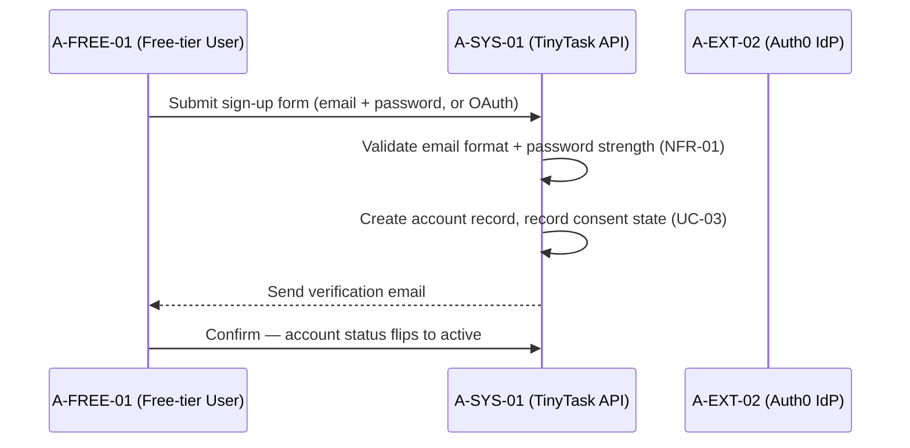


##### 5 Alternative Flows

###### 5.1 <Alternate flow: Email already in use>

Trigger: step 2. The system returns an error and does not disclose which field collided (anti-enumeration).

###### 5.2 <Alternate flow: Workspace creation fails>

Trigger: step 3. The system rolls back account creation and returns an error.

###### 5.3 <Alternate flow: Verification not confirmed within 7 days>

Trigger: step 5. The verification email is not confirmed in 7d, so the unverified account is deleted.

##### 6 Subflows

###### 6.1 <Subflow: Account provisioning>

1. Validate email format and password strength (NFR-01).
2. Create the account record in the customer data store.
3. Auto-provision the workspace via UC-19 (optional path of step 3).

###### 6.2 <Subflow: Consent capture>

1. Record consent state per UC-03.
2. Emit the audit event (UC-10).

##### 7 Key Scenarios

###### 7.1 <Scenario: Account activated>

1. Sign-up completes and the verification email is confirmed — account active, workspace created, consent logged, audit event emitted.

###### 7.2 <Scenario: Anti-enumeration rejection>

1. Sign-up with an email already in use returns a non-committal error; no information about existing accounts is disclosed.

##### 8 Post-conditions

###### 8.1

Account active.

###### 8.2

Workspace created.

###### 8.3

Consent logged.

###### 8.4

Audit event emitted (UC-10).

##### 9 Special Requirements (FURPS+)

**Functional (F):** Email + password and OAuth sign-up; email-format and password-strength validation (NFR-01); consent state recorded per UC-03.

**Usability (U):** N/A — no attested usability constraint for the sign-up form.

**Reliability (R):** Unverified accounts are deleted after 7 days without confirmation; workspace-creation failure rolls back the account (no partial state).

**Performance (P):** N/A — no attested timing constraint.

**Supportability (S):** Password policy anchored in A-EXT-02 (Auth0 default policy with minimum length and breached-password checks, Doc04 §3); anti-enumeration error handling on the public endpoint.

##### 10 Security & Compliance Annex (AEGIS)

- **Provenance:** [ATTESTED] Source: `00_COMMON/01_Company_Context.md §3.5` ("Rule-based task management SaaS, web+mobile"); RBAC owner/member/admin model attested in `01_PHASE1_CONTEXT_RICH/Doc05_Security_Posture.md §4`.
- **Constrained by:** UC-08 (authn), PROC-19 (authz), UC-03 (consent), UC-10 (audit logging).
- **Rules / NFR:** CR-D-03.1-001, CR-D-05.1-001 · FR-01, FR-02, NFR-01, NFR-02, NFR-26.
- **Threats addressed:** MUC-01 (account takeover mitigated by strong password policy + verification step).
- **NIST anchors:** PR.AA-01, PR.DS-10.

#### Use-Case: {UC-15} Login (email/password + optional SSO)

##### 1 Brief Description

A user authenticates to TinyTask with email + password or, optionally, through SSO at the Auth0 identity provider. It is triggered when the user submits credentials at `/login` or initiates the OIDC flow. On success the system issues a session token with a 30-minute idle timeout and logs the authentication event.

##### 2 Actor Brief Descriptions

###### 2.1 A-MEMBER-01 (Member) or A-FREE-01 (Free-tier User) — Primary Actor:

Submits credentials at `/login` or completes the SSO dance to obtain a session.

###### 2.2 A-SYS-01 (System — TinyTask API):

Validates the password path against the IdP or the OIDC token, issues the session token, and logs the authentication event.

###### 2.3 A-EXT-02 (Auth0 IdP):

Stakeholder and system actor — validates passwords and OIDC tokens and hosts the SSO flow.

##### 3 Preconditions

- Active account (UC-14).
- Not locked out.

##### 4 Basic Flow of Events

1. User submits email + password, OR clicks "Login with SSO" and completes OIDC dance at A-EXT-02.
2. System validates credentials against A-EXT-02 (password) or validates the OIDC token.
3. System issues a session token with 30-minute idle timeout.
4. System logs the authentication event.

**Sequence diagram** (derived copy — editable source: Annex B §2):

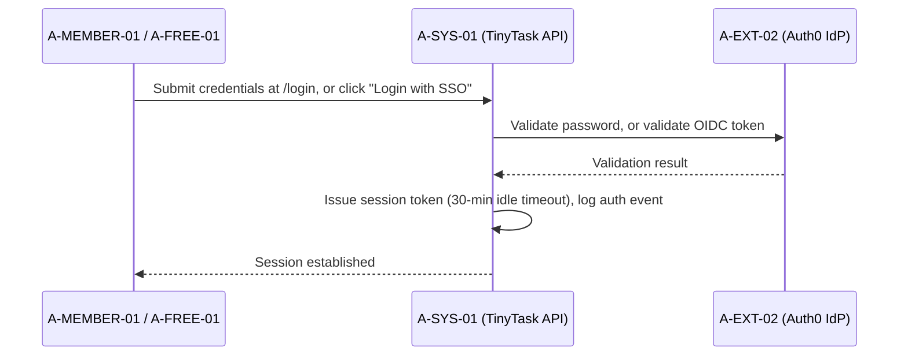


##### 5 Alternative Flows

###### 5.1 <Alternate flow: SSO malformed state parameter>

Trigger: step 1 (SSO variant). The system rejects the request (CSRF guard).

###### 5.2 <Alternate flow: Wrong password>

Trigger: step 2. The lockout counter increments; the account locks after 5 failures (NFR-02).

###### 5.3 <Alternate flow: Account disabled>

Trigger: step 2. The system returns a generic error; the security event is logged.

###### 5.4 <Alternate flow: SSO token rejected>

Trigger: step 2 (SSO variant). A-EXT-02 rejects the token; the system presents the fallback error.

##### 6 Subflows

###### 6.1 <Subflow: SSO (OIDC) dance>

1. User clicks "Login with SSO".
2. System redirects to A-EXT-02 for the OIDC dance.
3. System validates the returned OIDC token (state parameter guards CSRF).

###### 6.2 <Subflow: Session token issuance>

1. Issue a session token with 30-minute idle timeout.
2. Log the authentication event.

##### 7 Key Scenarios

###### 7.1 <Scenario: Login accepted>

1. Valid credentials or a valid OIDC token yield a session; the user is redirected to the last visited workspace.

###### 7.2 <Scenario: Lockout after repeated failures>

1. Five wrong passwords lock the account (NFR-02), blunting credential stuffing (MUC-01).

##### 8 Post-conditions

###### 8.1

Session established.

###### 8.2

User redirected to last visited workspace.

##### 9 Special Requirements (FURPS+)

**Functional (F):** Email/password and optional SSO (OIDC) login; session token with 30-minute idle timeout; authentication event logged.

**Usability (U):** N/A — no attested usability constraint.

**Reliability (R):** Lockout after 5 failed attempts (NFR-02); generic errors avoid disclosing disabled accounts.

**Performance (P):** N/A — no attested timing constraint.

**Supportability (S):** Central IdP A-EXT-02 (Auth0, OAuth 2.0/OIDC) validates all credentials (Doc04 §1, SYS-02); SSO optional for customers attested in Doc05 §6.

##### 10 Security & Compliance Annex (AEGIS)

- **Provenance:** [ATTESTED] Source: `01_PHASE1_CONTEXT_RICH/Doc04_Architecture_DataInventory.md §1` ("SYS-02 Auth Service (Auth0, OAuth 2.0/OIDC)"); `Doc05_Security_Posture.md §6` mentions SSO as optional for customers.
- **Constrained by:** UC-08, UC-09 (MFA for admins), UC-10.
- **Rules / NFR:** CR-D-03.1-001, CR-D-03.2-001 · FR-02, NFR-01, NFR-02, NFR-09.
- **Threats addressed:** MUC-01 (account takeover via credential stuffing).
- **NIST anchors:** PR.AA-01, PR.AA-03.

#### Use-Case: {UC-16} Password Reset & Recovery

##### 1 Brief Description

A user recovers access by requesting a single-use, time-limited reset link delivered to the verified email address. It is triggered when the user clicks "Forgot password" and submits an email. A successful reset replaces the password and invalidates every existing session.

##### 2 Actor Brief Descriptions

###### 2.1 A-MEMBER-01 (Member) or A-FREE-01 (Free-tier User) — Primary Actor:

Requests the reset and sets the new password via the emailed link.

###### 2.2 A-SYS-01 (System — TinyTask API):

Generates the reset token, sends the link, validates the new password, invalidates all sessions, and logs the reset event.

###### 2.3 A-DPO-01 (DPO / Compliance Manager):

Stakeholder — owns the identity-verification audit trail.

##### 3 Preconditions

- Valid account exists.

##### 4 Basic Flow of Events

1. System generates a single-use, time-limited reset token (1-hour expiry).
2. System sends reset link to the verified email address.
3. User clicks link, submits new password.
4. System validates strength, hashes, replaces; invalidates all existing sessions.
5. System logs the reset event.

**Sequence diagram** (derived copy — editable source: Annex B §3):

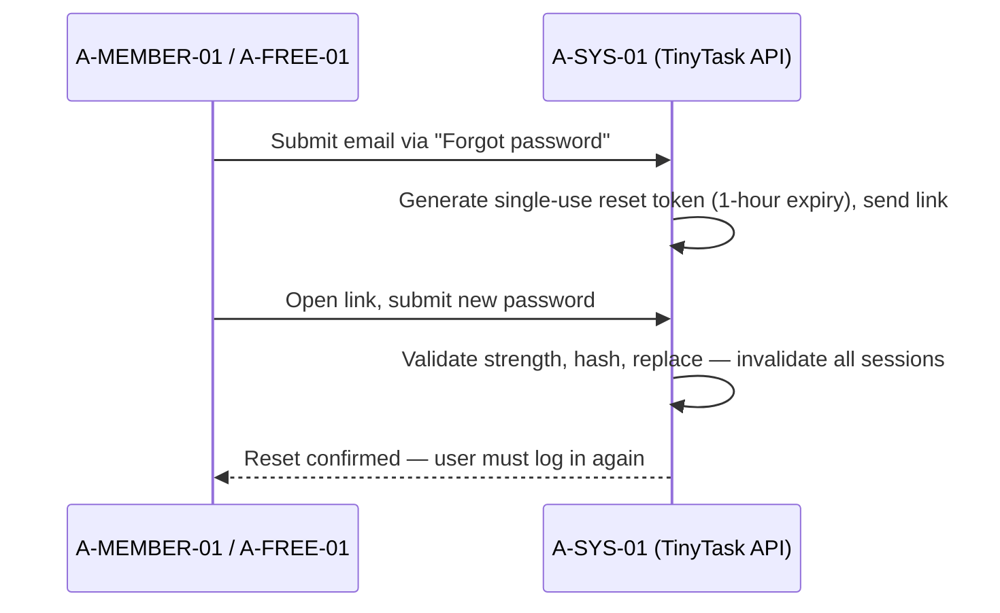


##### 5 Alternative Flows

###### 5.1 <Alternate flow: Email not verified>

Trigger: step 2. The system silently no-ops (no enumeration).

###### 5.2 <Alternate flow: Token expired or reused>

Trigger: step 3. The system rejects the token.

###### 5.3 <Alternate flow: New password matches old>

Trigger: step 4. The system rejects the new password.

##### 6 Subflows

###### 6.1 <Subflow: Reset token lifecycle>

1. Generate a single-use, time-limited reset token (1-hour expiry).
2. Deliver the link to the verified email address only.
3. Reject expired or reused tokens.

###### 6.2 <Subflow: Session invalidation sweep>

1. On password replacement, invalidate all existing sessions.
2. Log the reset event.

##### 7 Key Scenarios

###### 7.1 <Scenario: Successful reset>

1. New password validated, hashed and stored; all sessions invalidated; the user must log in again.

###### 7.2 <Scenario: Enumeration attempt>

1. A reset request against an unverified email silently no-ops — no signal that the address exists.

##### 8 Post-conditions

###### 8.1

Password changed.

###### 8.2

All sessions invalidated; user must log in again.

##### 9 Special Requirements (FURPS+)

**Functional (F):** Single-use reset token with 1-hour expiry delivered to the verified email; strength validation, hash and replace.

**Usability (U):** N/A — no attested usability constraint.

**Reliability (R):** Expired or reused tokens rejected; reset invalidates all existing sessions.

**Performance (P):** N/A — no attested timing constraint.

**Supportability (S):** Silent no-op for unverified emails prevents account enumeration.

##### 10 Security & Compliance Annex (AEGIS)

- **Provenance:** [ATTESTED] Source: `Doc05_Security_Posture.md §6` (account self-service).
- **Constrained by:** UC-08, UC-10.
- **Rules / NFR:** CR-D-03.1-001 · FR-02, NFR-01, NFR-02.
- **Threats addressed:** MUC-01.
- **NIST anchors:** PR.AA-01.

#### Use-Case: {UC-17} Session Management (timeout, logout-everywhere)

##### 1 Brief Description

The system ends authenticated sessions on idle timeout, explicit logout, or a forced security logout. Triggers are (a) the 30-minute idle timeout being reached, (b) the user clicking "Log out", or (c) the security team forcing a logout. In every case the session token is invalidated server-side.

##### 2 Actor Brief Descriptions

###### 2.1 A-MEMBER-01 (Member) or A-FREE-01 (Free-tier User) — Primary Actor:

Experiences the idle timeout, performs the logout, or is logged out by a forced revocation.

###### 2.2 A-SYS-01 (System — TinyTask API):

Detects the trigger, invalidates the session token server-side, redirects to login, and logs the event.

###### 2.3 A-CTO-01 (CTO / CISO):

Stakeholder — owns the session policy.

###### 2.4 A-DEV-01 (Lead Developer):

Stakeholder — owns token revocation.

##### 3 Preconditions

- Active session from UC-15.

##### 4 Basic Flow of Events

1. System detects trigger.
2. System invalidates the session token server-side.
3. System redirects user to login screen (or for forced logout, displays confirmation).
4. System logs the event.

**Sequence diagram** (derived copy — editable source: Annex B §4):

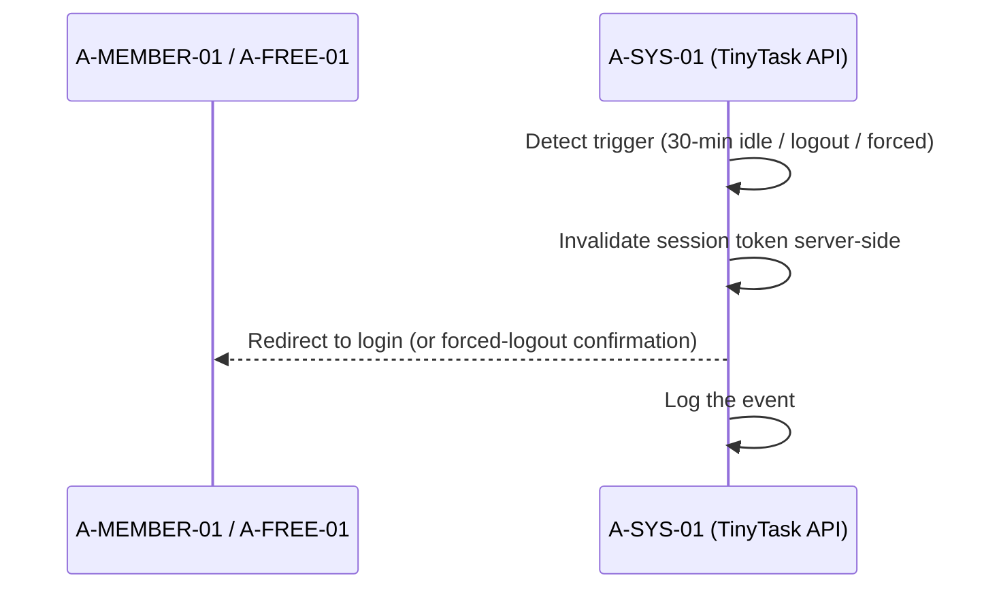


##### 5 Alternative Flows

###### 5.1 <Alternate flow: Multiple devices>

Trigger: step 1 with several active sessions. Each session is invalidated independently.

###### 5.2 <Alternate flow: Forced logout due to incident>

Trigger: step 3 (forced logout). The user is notified and prompted to change password.

##### 6 Subflows

###### 6.1 <Subflow: Server-side token invalidation>

1. Detect the trigger (idle timeout, explicit logout, forced logout).
2. Invalidate the session token server-side.
3. Reject further authenticated requests until re-login.

##### 7 Key Scenarios

###### 7.1 <Scenario: Idle timeout>

1. The session expires after 30 minutes idle; the next request requires re-login.

###### 7.2 <Scenario: Incident-driven forced logout>

1. All sessions are invalidated; the user is notified and prompted to change password.

##### 8 Post-conditions

###### 8.1

No further authenticated requests accepted without re-login.

##### 9 Special Requirements (FURPS+)

**Functional (F):** Idle timeout (30 min), user-initiated logout, security-forced logout; server-side token invalidation.

**Usability (U):** Forced logout displays a confirmation to the user.

**Reliability (R):** Multiple devices have each session invalidated independently.

**Performance (P):** N/A — no attested timing constraint.

**Supportability (S):** Session events are logged (audit trail).

##### 10 Security & Compliance Annex (AEGIS)

- **Provenance:** [ATTESTED] Source: `Doc04_Architecture_DataInventory.md §1` (central IdP); `Doc05_Security_Posture.md §6`.
- **Constrained by:** UC-08, UC-10.
- **Rules / NFR:** CR-D-03.1-001 · FR-02, NFR-01.
- **NIST anchors:** PR.AA-03.

#### Use-Case: {UC-18} Invite Member & Assign Role

##### 1 Brief Description

A workspace admin invites a member by email and assigns the initial role (member/admin). It is triggered when the admin enters the email + role and clicks "Invite". The invitee accepts through a single-use link; if no account exists, sign-up (UC-14) is invoked.

##### 2 Actor Brief Descriptions

###### 2.1 A-WSADM-01 (Workspace Admin/Owner) — Primary Actor:

Enters the invitee email + role and triggers the invitation.

###### 2.2 A-MEMBER-01 (Member — invitee):

Accepts the invitation via the single-use link and receives the assigned role.

###### 2.3 A-SYS-01 (System — TinyTask API):

Validates the email and role, creates the pending membership, sends the invite email, grants the role on acceptance, and logs the grant.

###### 2.4 A-DPO-01 (DPO / Compliance Manager):

Stakeholder — owns the consent records of invited members.

##### 3 Preconditions

- Workspace exists.
- Actor has Admin/Owner role on the workspace.

##### 4 Basic Flow of Events

1. System validates the email and the role.
2. System creates pending membership record (workspace_id, email, role, status=pending).
3. System sends invite email with single-use acceptance link.
4. Invitee accepts → if account exists, role is granted; else UC-14 is invoked.
5. System logs the membership grant event.

**Sequence diagram** (derived copy — editable source: Annex B §5):

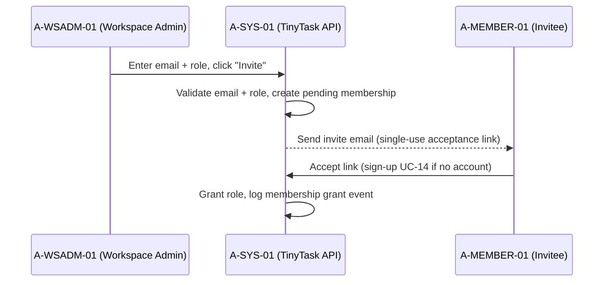


##### 5 Alternative Flows

###### 5.1 <Alternate flow: Email already a member>

Trigger: step 1. The system rejects the invite — no duplicate membership.

###### 5.2 <Alternate flow: Role escalation beyond Admin>

Trigger: step 1 (Owner transfer requested). Requires CEO confirmation.

###### 5.3 <Alternate flow: Invite expires>

Trigger: step 4, no acceptance within 7d. The pending membership is auto-revoked.

##### 6 Subflows

###### 6.1 <Subflow: Pending membership lifecycle>

1. Create the pending membership record (workspace_id, email, role, status=pending).
2. Deliver the single-use acceptance link.
3. On acceptance: grant the role for existing accounts, else invoke UC-14.
4. Auto-revoke the pending membership after 7 days without acceptance.

##### 7 Key Scenarios

###### 7.1 <Scenario: Member joined>

1. Role granted on acceptance; membership active; grant event logged.

###### 7.2 <Scenario: Escalation guarded>

1. Owner-level change is not self-service — CEO confirmation is required before the escalation applies (MUC-02 guard).

##### 8 Post-conditions

###### 8.1

New active membership.

###### 8.2

Or pending membership with audit trail.

##### 9 Special Requirements (FURPS+)

**Functional (F):** Email invite with member/admin roles; pending membership with single-use acceptance link; sign-up invoked for account-less invitees (UC-14).

**Usability (U):** N/A — no attested usability constraint.

**Reliability (R):** Invites expire after 7 days and pending memberships are auto-revoked.

**Performance (P):** N/A — no attested timing constraint.

**Supportability (S):** Least-privilege default roles (PROC-20); CEO confirmation required for Owner-level escalation; grant events audited.

##### 10 Security & Compliance Annex (AEGIS)

- **Provenance:** [ATTESTED] Source: `Doc05_Security_Posture.md §4` ("Basic owner/member/admin model"); `Doc04_Architecture_DataInventory.md §3` (workspace as data object).
- **Constrained by:** PROC-19 (authz), PROC-20 (secure defaults: least-privilege), UC-10 (audit).
- **Rules / NFR:** CR-D-03.3-001 · FR-05, NFR-25.
- **Threats addressed:** MUC-02 (privilege escalation).
- **NIST anchors:** PR.AA-01, PR.AA-05.

### §2.2 PKG-8 Team & Task Core (6)

| UC ID | D | Title | Primary Owner | Prio |
|-------|---|-------|---------------|------|
| UC-19 | n/a | Create Workspace | A-FREE-01 | CRITICAL |
| UC-20 | n/a | Create Project | A-MEMBER-01 | HIGH |
| UC-21 | n/a | Create Task | A-MEMBER-01 | CRITICAL |
| UC-22 | n/a | Assign Task | A-MEMBER-01 | HIGH |
| UC-23 | n/a | Change Task Status & Due Date | A-MEMBER-01 | HIGH |
| UC-24 | n/a | View Project Board (Kanban) | A-MEMBER-01 | MEDIUM |

#### Use-Case: {UC-19} Create Workspace

##### 1 Brief Description

A user creates a workspace — the top-level collaboration container and tenant boundary of the product. It is triggered when the user clicks "New Workspace" from the account dashboard. The creator receives the Owner role and the workspace_id scopes every subsequent query.

##### 2 Actor Brief Descriptions

###### 2.1 A-FREE-01 (Free-tier User) or A-WSADM-01 (Workspace Admin/Owner) — Primary Actor:

Names the workspace and becomes its Owner.

###### 2.2 A-SYS-01 (System — TinyTask API):

Validates name uniqueness, creates the workspace record, grants the Owner role, and logs the event.

###### 2.3 A-MEMBER-01 (Member):

Stakeholder — future invitee of the workspace.

##### 3 Preconditions

- Authenticated account.

##### 4 Basic Flow of Events

1. User enters workspace name and optional description.
2. System validates uniqueness within account and creates workspace record.
3. System grants Owner role to creator.
4. System logs the event.

**Sequence diagram** (derived copy — editable source: Annex B §6):

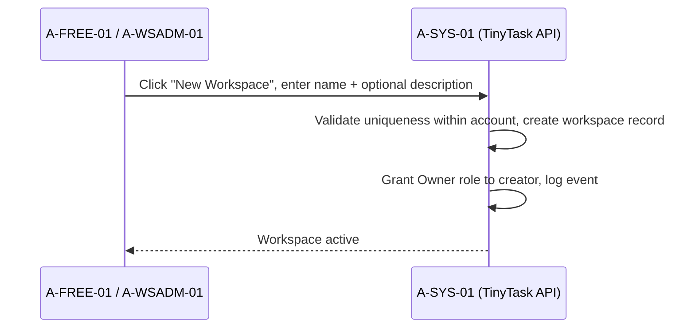


##### 5 Alternative Flows

###### 5.1 <Alternate flow: Free-tier limit reached>

Trigger: step 2 (e.g., 1 workspace allowed on the free plan). The system routes to the UC-31 upgrade flow.

###### 5.2 <Alternate flow: Name conflict>

Trigger: step 2. The system prompts the user to choose another name.

##### 6 Subflows

###### 6.1 <Subflow: Workspace provisioning>

1. Validate name uniqueness within the account.
2. Create the workspace record.
3. Grant the Owner role to the creator.
4. Log the event.

##### 7 Key Scenarios

###### 7.1 <Scenario: Workspace created>

1. Workspace active with the creator as Owner; the workspace_id becomes the tenant scope of all subsequent queries.

###### 7.2 <Scenario: Free-tier limit>

1. The upgrade prompt (UC-31) is shown instead of creating an over-quota workspace.

##### 8 Post-conditions

###### 8.1

Workspace active.

###### 8.2

Creator is Owner.

##### 9 Special Requirements (FURPS+)

**Functional (F):** Workspace creation with per-account name uniqueness; Owner role grant to the creator.

**Usability (U):** N/A — no attested usability constraint.

**Reliability (R):** N/A — no attested availability constraint specific to this UC.

**Performance (P):** N/A — no attested timing constraint.

**Supportability (S):** Free-tier limits enforced; workspace_id scoping defends against cross-tenant injection (MUC-03).

##### 10 Security & Compliance Annex (AEGIS)

- **Provenance:** [ATTESTED] Source: `Doc04_Architecture_DataInventory.md §3` ("Account or workspace lifetime"); `Doc05_Security_Posture.md §4`.
- **Constrained by:** PROC-19, UC-10.
- **Rules / NFR:** CR-D-03.3-001 · FR-01.
- **Threats addressed:** MUC-03 (cross-tenant injection — workspace_id scoped in every subsequent query).
- **NIST anchors:** PR.AA-01, PR.DS-01.

#### Use-Case: {UC-20} Create Project

##### 1 Brief Description

A member creates a project inside a workspace to group tasks. It is triggered when the member clicks "New Project" within a workspace. Projects are always created workspace-scoped.

##### 2 Actor Brief Descriptions

###### 2.1 A-MEMBER-01 (Member) — Primary Actor:

Names the project (with optional description and template) and creates it.

###### 2.2 A-WSADM-01 (Workspace Admin/Owner):

Stakeholder — workspace owner whose storage quota and membership rules apply.

###### 2.3 A-SYS-01 (System — TinyTask API):

Validates name uniqueness, creates the workspace-scoped project record, and logs the event.

##### 3 Preconditions

- Authenticated.
- Member of workspace UC-19.

##### 4 Basic Flow of Events

1. Member enters project name, optional description, optional template.
2. System validates name uniqueness within workspace.
3. System creates project record (workspace_id scoped).
4. System logs the event.

**Sequence diagram** (derived copy — editable source: Annex B §7):

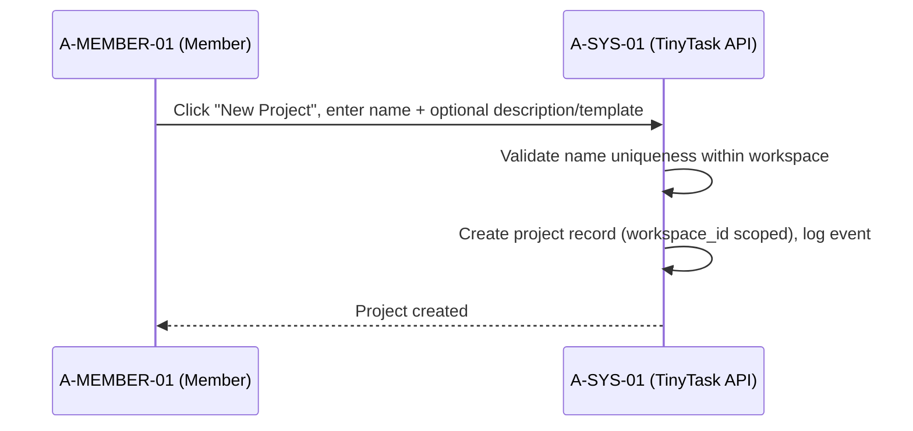


##### 5 Alternative Flows

###### 5.1 <Alternate flow: Member lacks permission>

Trigger: step 1. The system returns 403 with reason.

###### 5.2 <Alternate flow: Workspace storage quota exceeded>

Trigger: step 3. The system prompts via UC-31.

##### 6 Subflows

###### 6.1 <Subflow: Project record creation>

1. Validate name uniqueness within the workspace.
2. Create the project record (workspace_id scoped).
3. Log the event.

##### 7 Key Scenarios

###### 7.1 <Scenario: Project created>

1. Project exists within the workspace, scoped by workspace_id.

###### 7.2 <Scenario: Permission denied>

1. 403 with reason; no record created.

##### 8 Post-conditions

###### 8.1

Project exists within workspace.

##### 9 Special Requirements (FURPS+)

**Functional (F):** Project creation with optional description and template; workspace-scoped name uniqueness.

**Usability (U):** N/A — no attested usability constraint.

**Reliability (R):** Missing permission yields an explicit 403 with reason.

**Performance (P):** N/A — no attested timing constraint.

**Supportability (S):** Quota exhaustion routes to the UC-31 upgrade prompt.

##### 10 Security & Compliance Annex (AEGIS)

- **Provenance:** [ASSUMED] — projects as a workspace-scoped container are the standard data model for a B2B task SaaS; not directly attested but consistent with `Doc04` workspace-as-data-object.
- **Constrained by:** PROC-19, UC-10.
- **Rules / NFR:** CR-D-03.3-001 · FR-05.
- **Threats addressed:** MUC-03.
- **NIST anchors:** PR.AA-01.

#### Use-Case: {UC-21} Create Task

##### 1 Brief Description

A member creates a task on a board with title, description, due date and optional assignee. It is triggered when the member clicks "New Task" on a board. Tasks are persisted project-scoped and always carry the workspace_id tenant boundary; the assignee is notified (UC-26).

##### 2 Actor Brief Descriptions

###### 2.1 A-MEMBER-01 (Member) — Primary Actor:

Enters the task fields and creates the task on a board.

###### 2.2 A-SYS-01 (System — TinyTask API):

Validates the fields, persists the task with tenant scope, notifies the assignee, and logs the event.

###### 2.3 A-MEMBER-01 (assignee):

Stakeholder — receives the in-app + email notification via UC-26.

##### 3 Preconditions

- Authenticated.
- Member of project UC-20 with create permission.

##### 4 Basic Flow of Events

1. Member enters title, description, due date, assignee (optional).
2. System validates title length and due-date format.
3. System persists task (project_id scoped, with workspace_id for tenant boundary).
4. System emits in-app + email notification to assignee (UC-26).
5. System logs the event.

**Sequence diagram** (derived copy — editable source: Annex B §8):

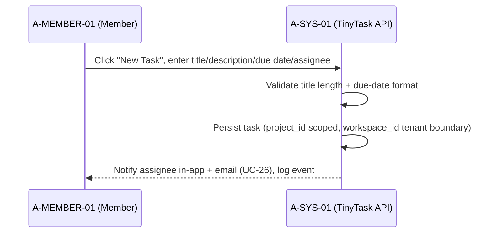


##### 5 Alternative Flows

###### 5.1 <Alternate flow: Title invalid>

Trigger: step 2, title empty or > 200 chars. The system rejects and retains the form state.

###### 5.2 <Alternate flow: Assignee not member of project>

Trigger: step 1. The system rejects the assignment.

###### 5.3 <Alternate flow: Storage quota exceeded>

Trigger: step 3. The system prompts via UC-31.

##### 6 Subflows

###### 6.1 <Subflow: Task field validation>

1. Validate title length (non-empty, ≤ 200 chars).
2. Validate due-date format.
3. Validate the assignee is a member of the project.

###### 6.2 <Subflow: Tenant-scoped persistence and notification>

1. Persist the task (project_id scoped, workspace_id present for the tenant boundary).
2. Emit in-app + email notification to the assignee (UC-26).
3. Log the event.

##### 7 Key Scenarios

###### 7.1 <Scenario: Task created and assignee notified>

1. Task visible on the board; audit entry written; assignee notified.

###### 7.2 <Scenario: Invalid title rejected>

1. Validation failure retains the form state so the member can correct without retyping.

##### 8 Post-conditions

###### 8.1

Task visible on board.

###### 8.2

Audit log entry.

###### 8.3

Assignee notified.

##### 9 Special Requirements (FURPS+)

**Functional (F):** Task fields (title, description, due date, optional assignee); title ≤ 200 chars and due-date format validated; assignee notification (UC-26).

**Usability (U):** Validation failure retains the form state.

**Reliability (R):** Invalid input rejected before persistence — no partial writes.

**Performance (P):** N/A — no attested timing constraint.

**Supportability (S):** workspace_id mandatory in every write — the tenant boundary against MUC-03 (secure defaults, PROC-20).

##### 10 Security & Compliance Annex (AEGIS)

- **Provenance:** [ASSUMED] — "rule-based task management" attested; task CRUD is the central capability. Field schema plausible defaults.
- **Constrained by:** PROC-19 (authz tenant), UC-10 (audit), PROC-20 (secure defaults: workspace_id always in WHERE).
- **Rules / NFR:** CR-D-03.3-001 · FR-09, NFR-14.
- **Threats addressed:** MUC-03 (cross-tenant injection — workspace_id must be present in every write).
- **NIST anchors:** PR.AA-01, PR.DS-01.

#### Use-Case: {UC-22} Assign Task

##### 1 Brief Description

A member assigns an existing task to a project member. It is triggered when the member selects the assignee from the project-member picker and clicks "Assign". The new assignee is notified (UC-26) and the change is logged.

##### 2 Actor Brief Descriptions

###### 2.1 A-MEMBER-01 (Member) — Primary Actor:

Selects the assignee and assigns the task.

###### 2.2 A-MEMBER-01 (assignee):

Stakeholder — receives the assignment notification.

###### 2.3 A-SYS-01 (System — TinyTask API):

Validates project membership, updates the assignee, notifies, and logs.

##### 3 Preconditions

- Task exists (UC-21).
- Actor is author or has assignment permission.

##### 4 Basic Flow of Events

1. System validates assignee is member of the task's project.
2. System updates task.assignee_id.
3. System notifies new assignee (UC-26).
4. System logs the event.

**Sequence diagram** (derived copy — editable source: Annex B §9):

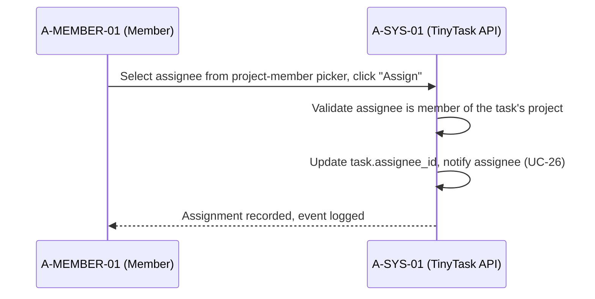


##### 5 Alternative Flows

###### 5.1 <Alternate flow: Assignee removed from project>

Trigger: step 1. The system rejects and suggests reassignment.

###### 5.2 <Alternate flow: Notification fails>

Trigger: step 3. The notification is queued for retry — no task loss.

##### 6 Subflows

###### 6.1 <Subflow: Assignee validation and update>

1. Validate the assignee is a member of the task's project.
2. Update task.assignee_id.
3. Notify the new assignee (UC-26) and log the event.

##### 7 Key Scenarios

###### 7.1 <Scenario: Assignment recorded>

1. task.assignee_id updated; assignee aware via notification.

###### 7.2 <Scenario: Notification outage>

1. Retry queue preserves the assignment until delivery — no task loss.

##### 8 Post-conditions

###### 8.1

Assignment recorded.

###### 8.2

Assignee aware.

##### 9 Special Requirements (FURPS+)

**Functional (F):** Assignee pick limited to project members; task.assignee_id update; assignee notification (UC-26).

**Usability (U):** N/A — no attested usability constraint.

**Reliability (R):** Notification failure degrades to a queued retry — no task loss.

**Performance (P):** N/A — no attested timing constraint.

**Supportability (S):** Assignment event audited.

##### 10 Security & Compliance Annex (AEGIS)

- **Provenance:** [ASSUMED] — standard task-SaaS capability.
- **Constrained by:** PROC-19, UC-10.
- **Rules / NFR:** CR-D-03.3-001 · FR-09.
- **Threats addressed:** MUC-02.
- **NIST anchors:** PR.AA-01.

#### Use-Case: {UC-23} Change Task Status & Due Date

##### 1 Brief Description

A member advances a task through its workflow (todo / in_progress / done) or edits its due date. It is triggered when the member moves a card on the board or edits the due date. Changes persist immediately and propagate to watchers via the activity feed (UC-29).

##### 2 Actor Brief Descriptions

###### 2.1 A-MEMBER-01 (Member) — Primary Actor:

Moves the card to a new status or edits the due date.

###### 2.2 A-SYS-01 (System — TinyTask API):

Validates the transition, persists the change, emits the activity event, and logs.

###### 2.3 Watchers (other members via activity feed UC-29):

Stakeholders — follow the task's state through the activity feed.

##### 3 Preconditions

- Task exists.

##### 4 Basic Flow of Events

1. Member selects new status (todo / in_progress / done) or new due date.
2. System validates the transition (any status transition allowed; due date not in past by default).
3. System persists change; emits activity event.
4. System logs the event.

**Sequence diagram** (derived copy — editable source: Annex B §10):

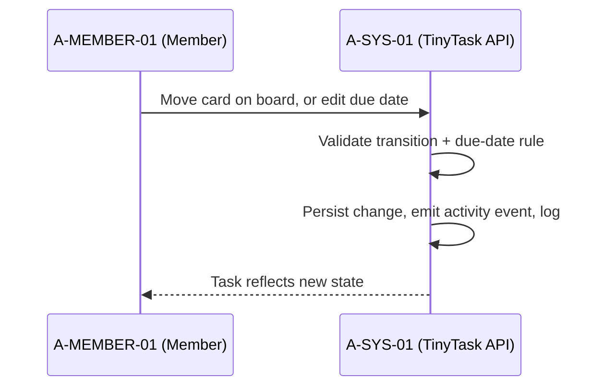


##### 5 Alternative Flows

###### 5.1 <Alternate flow: Transition restricted by workflow>

Trigger: step 2. The system rejects with a hint.

###### 5.2 <Alternate flow: Due date in past>

Trigger: step 2. The system shows a confirm dialog.

##### 6 Subflows

###### 6.1 <Subflow: Status transition>

1. Member selects the new status (todo / in_progress / done).
2. System validates the transition (any transition allowed by default; workflow restrictions reject with a hint).
3. Persist the change and emit the activity event.

##### 7 Key Scenarios

###### 7.1 <Scenario: Card moved to done>

1. Task reflects the new state; activity feed updated for watchers.

###### 7.2 <Scenario: Restricted transition>

1. Rejection with hint; task state unchanged.

##### 8 Post-conditions

###### 8.1

Task reflects new state.

###### 8.2

Activity feed updated.

##### 9 Special Requirements (FURPS+)

**Functional (F):** Status set (todo / in_progress / done) and due-date edit; transition validation; activity event emission.

**Usability (U):** Confirm dialog guards past due dates; restricted transitions return a hint.

**Reliability (R):** Invalid transitions rejected — state never silently diverges.

**Performance (P):** N/A — no attested timing constraint.

**Supportability (S):** Activity events feed UC-29.

##### 10 Security & Compliance Annex (AEGIS)

- **Provenance:** [ASSUMED] — kanban board attested indirectly; status/due as primitives are standard.
- **Constrained by:** UC-10.
- **Rules / NFR:** FR-09, NFR-14.
- **NIST anchors:** PR.DS-01.

#### Use-Case: {UC-24} View Project Board (Kanban)

##### 1 Brief Description

A member views a project's kanban board with tasks arranged in status columns. It is triggered when the member opens the project. The view is read-only — changes happen through the task use cases (UC-21, UC-22, UC-23).

##### 2 Actor Brief Descriptions

###### 2.1 A-MEMBER-01 (Member) — Primary Actor:

Opens the project and reads the board.

###### 2.2 A-SYS-01 (System — TinyTask API):

Queries tasks within the workspace_id + project_id scope and renders the columns.

##### 3 Preconditions

- Authenticated.
- Member of project UC-20.

##### 4 Basic Flow of Events

1. System queries tasks filtered by workspace_id + project_id.
2. System renders columns by status.
3. Member scrolls/views.

**Sequence diagram** (derived copy — editable source: Annex B §11):

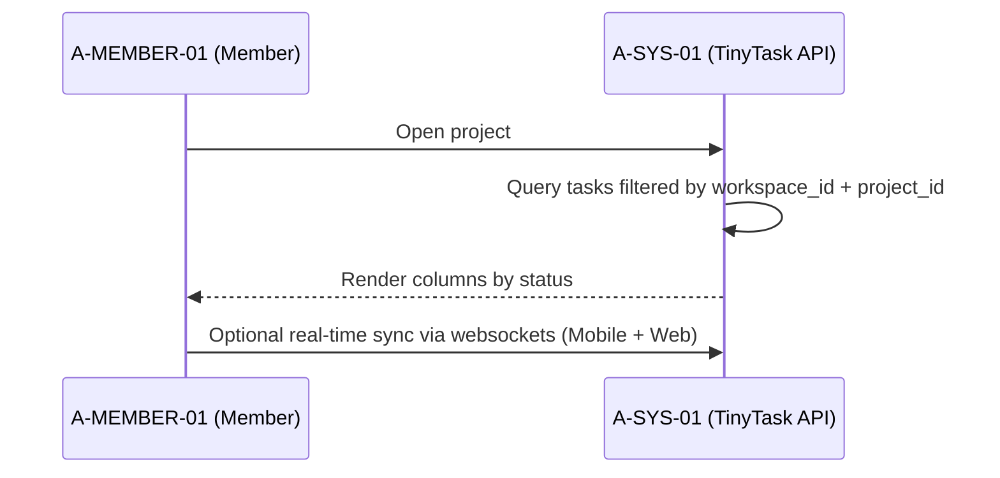


##### 5 Alternative Flows

###### 5.1 <Alternate flow: Pagination and filters>

Trigger: step 1, large boards. Pagination plus filter by assignee/tag applies.

###### 5.2 <Alternate flow: Real-time sync>

Trigger: step 3. Websockets keep Mobile + Web in the same view consistent.

##### 6 Subflows

###### 6.1 <Subflow: Tenant-scoped board query>

1. Query tasks filtered by workspace_id + project_id.
2. Apply pagination and assignee/tag filters.
3. Group tasks by status into columns.

##### 7 Key Scenarios

###### 7.1 <Scenario: Board rendered>

1. Columns reflect task status; the read-only view is scoped to the member's project.

###### 7.2 <Scenario: Cross-tenant read attempt>

1. The workspace_id + project_id filter keeps out-of-scope tasks unreachable (MUC-03).

##### 8 Post-conditions

###### 8.1

Read-only view rendered.

##### 9 Special Requirements (FURPS+)

**Functional (F):** Board render grouped by status; pagination + assignee/tag filters; optional websocket real-time sync.

**Usability (U):** N/A — no attested usability constraint.

**Reliability (R):** N/A — no attested availability constraint specific to this UC.

**Performance (P):** N/A — no attested render-time budget.

**Supportability (S):** Server-side workspace_id + project_id scoping blocks cross-tenant reads (MUC-03); websockets keep Web + Mobile consistent.

##### 10 Security & Compliance Annex (AEGIS)

- **Provenance:** [ASSUMED] — kanban-style board implied by "task management" and Rule-based designation in `01_Company_Context.md §3.5`.
- **Constrained by:** PROC-19 (read scope).
- **Rules / NFR:** CR-D-03.3-001 · NFR-14.
- **Threats addressed:** MUC-03.
- **NIST anchors:** PR.AA-01.

### §2.3 PKG-9 Collaboration (5)

| UC ID | D | Title | Primary Owner | Prio |
|-------|---|-------|---------------|------|
| UC-25 | n/a | Comment on Task | A-MEMBER-01 | MEDIUM |
| UC-26 | n/a | @Mention & In-App Notification | A-MEMBER-01 | HIGH |
| UC-27 | n/a | Attach File to Task | A-MEMBER-01 | MEDIUM |
| UC-28 | n/a | Search & Filter Tasks | A-MEMBER-01 | MEDIUM |
| UC-29 | n/a | Activity Feed (recent events) | A-MEMBER-01 | LOW |

#### Use-Case: {UC-25} Comment on Task

##### 1 Brief Description

A member comments on a task to discuss work with watchers. It is triggered when the member types in the comment box and submits. Comments accept a Markdown subset, are length-limited, and are sanitised before persistence.

##### 2 Actor Brief Descriptions

###### 2.1 A-MEMBER-01 (Member) — Primary Actor:

Writes and submits the comment.

###### 2.2 Watchers (members subscribed to the task):

Stakeholders — notified of new comments via UC-26.

###### 2.3 A-SYS-01 (System — TinyTask API):

Validates and sanitises the comment, persists it task-scoped, notifies watchers, and logs.

##### 3 Preconditions

- Task exists.
- Actor can view the task.

##### 4 Basic Flow of Events

1. Member types comment text (Markdown subset allowed).
2. System validates length (≤ 10 000 chars) and sanitises HTML.
3. System persists comment (task_id scoped).
4. System notifies watchers (UC-26).
5. System logs the event.

**Sequence diagram** (derived copy — editable source: Annex B §12):

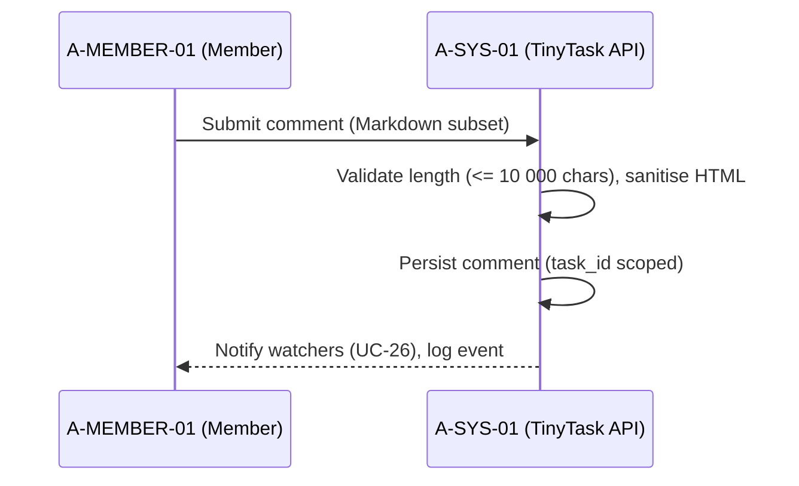


##### 5 Alternative Flows

###### 5.1 <Alternate flow: Profanity / link-spam heuristic>

Trigger: step 2. The comment is flagged for moderator review.

###### 5.2 <Alternate flow: Attachment placeholder without UC-27>

Trigger: step 2. The comment is rejected.

##### 6 Subflows

###### 6.1 <Subflow: Comment sanitisation>

1. Validate length (≤ 10 000 chars).
2. Sanitise HTML from the Markdown subset.
3. Persist the comment (task_id scoped).

##### 7 Key Scenarios

###### 7.1 <Scenario: Comment posted>

1. Comment visible on the task; watchers notified.

###### 7.2 <Scenario: Spam or oversized comment>

1. Flagged for moderator review or rejected before persistence.

##### 8 Post-conditions

###### 8.1

Comment visible.

###### 8.2

Watchers notified.

##### 9 Special Requirements (FURPS+)

**Functional (F):** Comments with a Markdown subset; length ≤ 10 000 chars; HTML sanitisation; watcher notification (UC-26).

**Usability (U):** Markdown subset supported for formatting.

**Reliability (R):** Spam heuristic flags for moderation rather than silently dropping content.

**Performance (P):** N/A — no attested timing constraint.

**Supportability (S):** Sanitisation counters injected-content threats; malicious files are handled at UC-27 (MUC-08).

##### 10 Security & Compliance Annex (AEGIS)

- **Provenance:** [ASSUMED] — comments are standard for task SaaS; not explicitly attested.
- **Constrained by:** PROC-19, UC-10.
- **Rules / NFR:** CR-D-03.3-001 · NFR-14.
- **Threats addressed:** MUC-08 (malicious attachment handled at UC-27).
- **NIST anchors:** PR.DS-01.

#### Use-Case: {UC-26} @Mention & In-App Notification

##### 1 Brief Description

A member draws colleagues into a task with an @username mention; the system creates in-app notifications and sends batched email digests per user preferences. It is triggered when the author types @username in a comment or task description.

##### 2 Actor Brief Descriptions

###### 2.1 A-MEMBER-01 (Member) — Primary Actor:

Types the @username mention and saves the comment or task description.

###### 2.2 Mentioned member(s):

Stakeholders — receive in-app and email notifications.

###### 2.3 A-SYS-01 (System — TinyTask API):

Parses mentions, validates project membership, creates notification rows, sends the batched digest, and logs.

##### 3 Preconditions

- Task exists.
- Mentioned user is project member.

##### 4 Basic Flow of Events

1. System parses mentions on save.
2. System creates in-app notification rows per mention.
3. System sends email digest (batched ≤ 5 min) per user notification preferences.
4. System logs the event.

**Sequence diagram** (derived copy — editable source: Annex B §13):

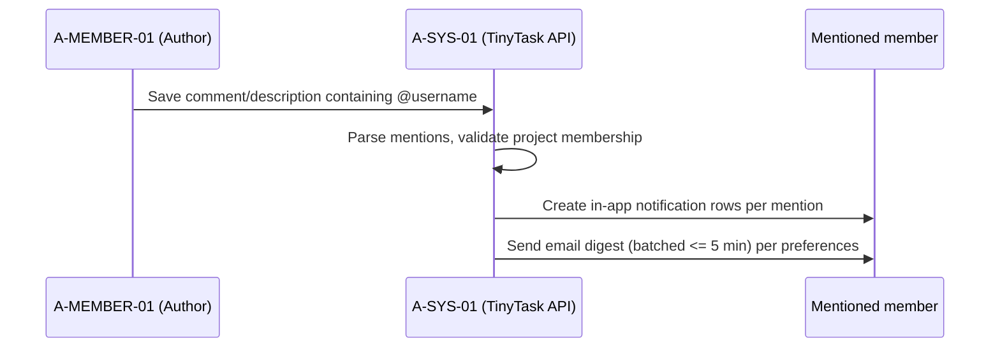


##### 5 Alternative Flows

###### 5.1 <Alternate flow: Mentioned user not in project>

Trigger: step 1. The mention is silently dropped (no leak of project membership).

###### 5.2 <Alternate flow: Project muted>

Trigger: step 3. The user has muted the project, so the notification is suppressed.

##### 6 Subflows

###### 6.1 <Subflow: Mention parsing>

1. Parse @username mentions on save.
2. Validate each mentioned user is a project member.
3. Silently drop non-member mentions (no membership leak).

###### 6.2 <Subflow: Notification delivery>

1. Create in-app notification rows per mention.
2. Send the email digest batched ≤ 5 min per user notification preferences.

##### 7 Key Scenarios

###### 7.1 <Scenario: Mention delivered>

1. In-app notification rows created and email digest sent per preferences.

###### 7.2 <Scenario: Muted project>

1. Notification suppressed for the muted project; in-app state stays consistent.

##### 8 Post-conditions

###### 8.1

Mentioned users have visible + email notifications.

##### 9 Special Requirements (FURPS+)

**Functional (F):** @username parsing on save; in-app notification rows per mention; batched email digest per user notification preferences.

**Usability (U):** User notification preferences and per-project mutes respected.

**Reliability (R):** Non-member mentions silently dropped — no error surfaced to the author.

**Performance (P):** Email digest batched ≤ 5 min.

**Supportability (S):** Membership check prevents leaking project membership.

##### 10 Security & Compliance Annex (AEGIS)

- **Provenance:** [ATTESTED — partial] Source: `Doc04_Architecture_DataInventory.md §2` (in-app account view); email notifications via processor attested in `Doc06_ThirdParty_Landscape.md`.
- **Constrained by:** PROC-19 (membership check), UC-10.
- **Rules / NFR:** CR-D-03.3-001 · NFR-26.
- **NIST anchors:** PR.AA-01.

#### Use-Case: {UC-27} Attach File to Task

##### 1 Brief Description

A member attaches a file to a task. It is triggered when the member drags a file into the task. Uploads pass size/MIME validation and an antivirus scan before landing encrypted in object storage under a workspace-scoped prefix.

##### 2 Actor Brief Descriptions

###### 2.1 A-MEMBER-01 (Member) — Primary Actor:

Drags the file into the task to attach it.

###### 2.2 A-OPS-01 (Operations Lead):

Stakeholder — owns the storage quota and is alerted when the AV scan quarantines a file.

###### 2.3 A-SYS-01 (System — TinyTask API):

Validates size and MIME type, runs the AV scan, writes the encrypted object, creates the attachment record, and logs.

##### 3 Preconditions

- Task exists.
- Actor can comment.

##### 4 Basic Flow of Events

1. System validates size (≤ 25 MB) and MIME type against allowlist.
2. System uploads to object storage with workspace-scoped prefix + server-side encryption (KMS).
3. System creates attachment record (task_id + storage key).
4. System logs the event.

**Sequence diagram** (derived copy — editable source: Annex B §14):

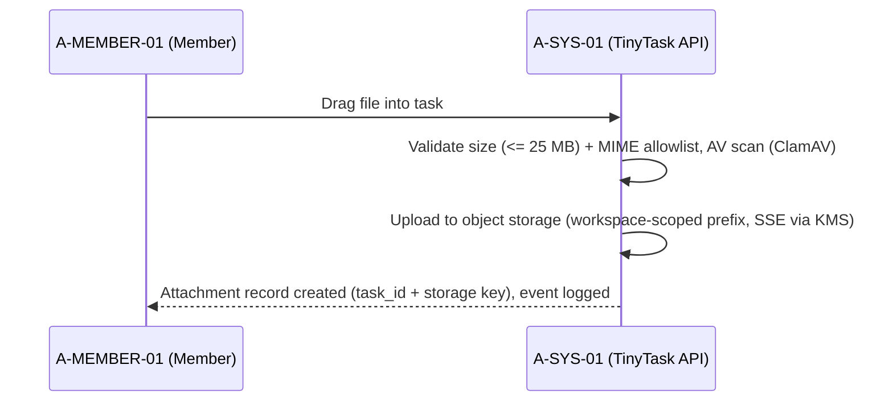


##### 5 Alternative Flows

###### 5.1 <Alternate flow: File exceeds size/MIME>

Trigger: step 1. The upload is rejected with a reason.

###### 5.2 <Alternate flow: AV scan flags the file>

Trigger: step 2, ClamAV flag. The file is quarantined and A-OPS-01 is alerted — it is never served.

##### 6 Subflows

###### 6.1 <Subflow: Upload validation and AV scan>

1. Validate size (≤ 25 MB) and MIME type against the allowlist.
2. AV scan (ClamAV).
3. On flag: quarantine and alert A-OPS-01; never serve the file.

###### 6.2 <Subflow: Encrypted storage write>

1. Upload to object storage with workspace-scoped prefix + server-side encryption (KMS).
2. Create the attachment record (task_id + storage key).
3. Log the event.

##### 7 Key Scenarios

###### 7.1 <Scenario: Clean attachment>

1. File attached, AV-clean, encrypted at rest under the workspace-scoped prefix.

###### 7.2 <Scenario: Malicious attachment (MUC-08)>

1. Polyglot/malware file is quarantined by the AV scan; A-OPS-01 alerted; on AV failure the fail-safe posture (UC-06) keeps it unserved.

##### 8 Post-conditions

###### 8.1

File attached.

###### 8.2

AV-clean.

###### 8.3

Encrypted at rest.

##### 9 Special Requirements (FURPS+)

**Functional (F):** Size ≤ 25 MB and MIME allowlist validation; ClamAV AV scan; workspace-scoped, KMS-encrypted object storage.

**Usability (U):** Rejections carry a reason.

**Reliability (R):** AV-flagged files quarantined, never served; fail-safe on AV failure (UC-06).

**Performance (P):** N/A — no attested upload-throughput constraint.

**Supportability (S):** Encryption at rest per CR-D-01.1-001 (annex); DE.CM-01 monitoring anchor.

##### 10 Security & Compliance Annex (AEGIS)

- **Provenance:** [ASSUMED] — attachments are standard; storage bucket attested in `Doc04` (SYS-05 Backup Store) and `Doc06` (S3-compatible).
- **Constrained by:** PROC-19, UC-10, UC-06 (fail-safe on AV failure).
- **Rules / NFR:** CR-D-03.3-001, CR-D-04.1-001, CR-D-01.1-001 (encryption at rest) · FR-09, NFR-14.
- **Threats addressed:** MUC-08 (malicious attachment).
- **NIST anchors:** PR.DS-01, DE.CM-01.

#### Use-Case: {UC-28} Search & Filter Tasks

##### 1 Brief Description

A member searches and filters tasks across their projects. It is triggered when the member enters a query in the search bar or applies a filter (assignee, status, due date, tag). Every query is workspace-scoped server-side.

##### 2 Actor Brief Descriptions

###### 2.1 A-MEMBER-01 (Member) — Primary Actor:

Enters the query or applies filters and reads the results.

###### 2.2 A-SYS-01 (System — TinyTask API):

Builds the membership-scoped query, returns paginated results, and logs the query metadata.

##### 3 Preconditions

- Authenticated.

##### 4 Basic Flow of Events

1. System builds query: workspace_id in (user's workspaces) AND project_id in (user's projects) AND full-text match.
2. System returns paginated results ordered by relevance.
3. System logs the query (metadata only, no body content).

**Sequence diagram** (derived copy — editable source: Annex B §15):

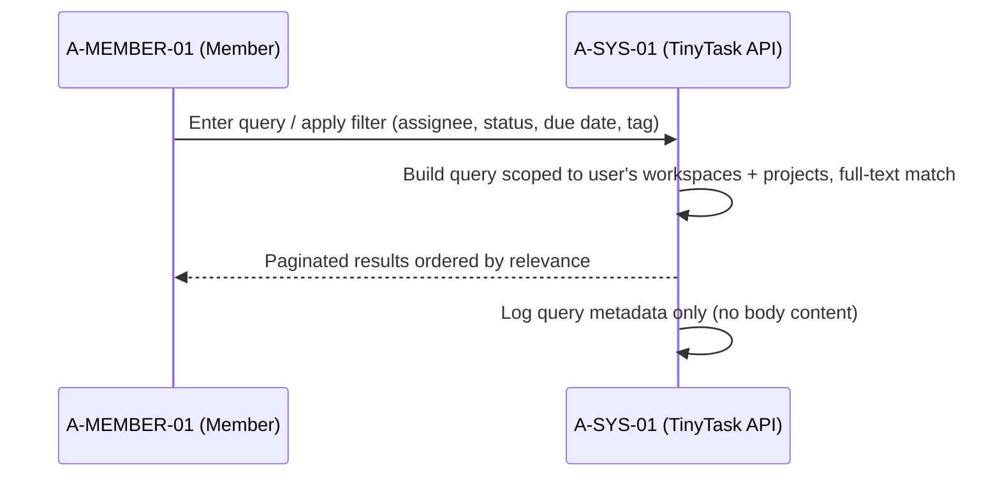


##### 5 Alternative Flows

###### 5.1 <Alternate flow: Rate limit reached>

Trigger: step 1. The system returns the cached result — no error.

###### 5.2 <Alternate flow: Empty result>

Trigger: step 2. The system shows "no tasks".

##### 6 Subflows

###### 6.1 <Subflow: Scope-bounded query construction>

1. Constrain to workspace_id in (user's workspaces).
2. Constrain to project_id in (user's projects).
3. Add the full-text match, order by relevance, paginate.

##### 7 Key Scenarios

###### 7.1 <Scenario: Results returned>

1. Paginated, relevance-ordered results within the caller's memberships.

###### 7.2 <Scenario: Bulk-extraction attempt (MUC-04)>

1. Rate limiting plus membership scoping keep results inside the caller's own projects; only query metadata is logged.

##### 8 Post-conditions

###### 8.1

Search results displayed.

##### 9 Special Requirements (FURPS+)

**Functional (F):** Full-text search with filters (assignee, status, due date, tag), scoped to the user's workspaces and projects; paginated relevance-ordered results.

**Usability (U):** N/A — no attested usability constraint.

**Reliability (R):** Rate-limit hits degrade to the cached result without error.

**Performance (P):** N/A — no attested latency budget.

**Supportability (S):** Only query metadata logged, no body content; server-side scoping prevents cross-tenant extraction (MUC-04).

##### 10 Security & Compliance Annex (AEGIS)

- **Provenance:** [ASSUMED] — standard feature; no attestation.
- **Constrained by:** PROC-19 (scope by membership).
- **Rules / NFR:** CR-D-03.3-001 · NFR-14.
- **Threats addressed:** MUC-04 (prevented: every query is workspace-scoped server-side).
- **NIST anchors:** PR.AA-01.

#### Use-Case: {UC-29} Activity Feed (recent events)

##### 1 Brief Description

A member sees the latest activity across their accessible projects on the dashboard. It is triggered when the member opens the dashboard. The feed renders the last 50 events with timestamp + actor + action.

##### 2 Actor Brief Descriptions

###### 2.1 A-MEMBER-01 (Member) — Primary Actor:

Opens the dashboard and reads the feed.

###### 2.2 A-SYS-01 (System — TinyTask API):

Queries recent events scoped to the user's accessible projects and renders the feed.

##### 3 Preconditions

- Authenticated.

##### 4 Basic Flow of Events

1. System queries recent events scoped to user's accessible projects.
2. System renders last 50 events with timestamp + actor + action.

**Sequence diagram** (derived copy — editable source: Annex B §16):

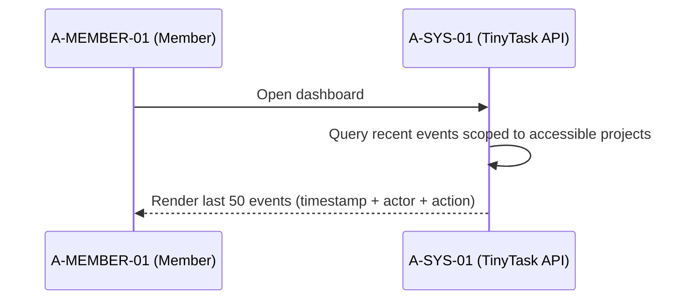


##### 5 Alternative Flows

###### 5.1 <Alternate flow: Filter by project/actor>

Trigger: step 2. The member narrows the feed by project or actor.

##### 6 Subflows

###### 6.1 <Subflow: Accessible-project scope>

1. Collect the user's accessible projects.
2. Query recent events within that scope only.
3. Render the last 50 events (timestamp + actor + action).

##### 7 Key Scenarios

###### 7.1 <Scenario: Feed rendered>

1. Last 50 events shown with timestamp + actor + action.

###### 7.2 <Scenario: Out-of-scope events>

1. Events outside the user's accessible projects are never surfaced.

##### 8 Post-conditions

###### 8.1

Activity feed displayed.

##### 9 Special Requirements (FURPS+)

**Functional (F):** Last 50 events (timestamp + actor + action) across the user's accessible projects; optional project/actor filter.

**Usability (U):** Project/actor filters available on the feed.

**Reliability (R):** N/A — no attested availability constraint specific to this UC.

**Performance (P):** N/A — no attested timing constraint.

**Supportability (S):** Scope bounded by accessible projects (annex anchor PROC-19).

##### 10 Security & Compliance Annex (AEGIS)

- **Provenance:** [ASSUMED] — standard.
- **Constrained by:** PROC-19.
- **Rules / NFR:** CR-D-03.3-001.
- **NIST anchors:** PR.AA-01.

### §2.4 PKG-10 Platform (4)

| UC ID | D | Title | Primary Owner | Prio |
|-------|---|-------|---------------|------|
| UC-30 | n/a | Mobile Sync (offline-first) | A-MOB-01 | MEDIUM |
| UC-31 | n/a | Stripe Checkout (Upgrade Plan) | A-FREE-01 | MEDIUM |
| UC-32 | n/a | Workspace Admin Console | A-WSADM-01 | HIGH |
| UC-33 | n/a | Enterprise SSO [ASSUMED] | A-ENTADM-01 | MEDIUM |

#### Use-Case: {UC-30} Mobile Sync (offline-first)

##### 1 Brief Description

The mobile client synchronises offline mutations with the server and pulls newer server events to stay consistent. It is triggered when the app comes online or a local mutation occurs. The API validates the workspace_id scope of every uploaded mutation before persisting it.

##### 2 Actor Brief Descriptions

###### 2.1 A-MOB-01 (Mobile Client) — Primary Actor:

Native app acting on behalf of A-MEMBER-01 or A-FREE-01; queues mutations offline and reconciles on sync.

###### 2.2 A-SYS-01 (System — TinyTask API):

Validates workspace_id scope, persists mutations, returns the canonical state version, and logs sync events without payload content.

###### 2.3 A-MEMBER-01 (user):

Stakeholder — resolves conflicts when prompted.

##### 3 Preconditions

- Mobile app authenticated against UC-15.

##### 4 Basic Flow of Events

1. Mobile client uploads queued mutations to API; API validates workspace_id scope and persistence.
2. API returns canonical state version.
3. Mobile client reconciles local store and pulls newer server events via /sync.
4. Server logs sync events (no payload content).

**Sequence diagram** (derived copy — editable source: Annex B §17):

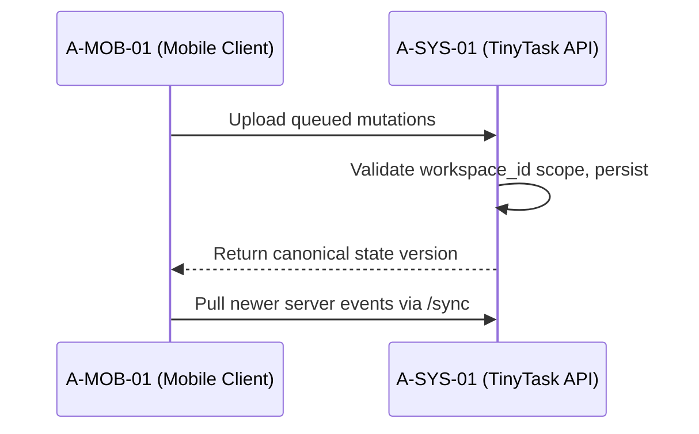


##### 5 Alternative Flows

###### 5.1 <Alternate flow: Server rejects mutation (scope error)>

Trigger: step 1. The mobile rolls back the local change and notifies the user.

###### 5.2 <Alternate flow: Conflict (server version newer)>

Trigger: step 3. The mobile resolves via last-writer-wins with a user prompt for field-level conflicts.

##### 6 Subflows

###### 6.1 <Subflow: Mutation upload validation>

1. Upload the queued mutations.
2. API validates workspace_id scope and persistence.
3. On scope error: the mobile rolls back the local change and notifies the user.

###### 6.2 <Subflow: Reconciliation>

1. Receive the canonical state version.
2. Reconcile the local store.
3. Pull newer server events via /sync (last-writer-wins; user prompt on field-level conflicts).

##### 7 Key Scenarios

###### 7.1 <Scenario: Clean sync>

1. Queued mutations accepted, local and server state consistent, sync events logged without payload content.

###### 7.2 <Scenario: Scope-rejected mutation>

1. The out-of-scope mutation never persists — the mobile rolls back and tells the user (MUC-03 guard).

##### 8 Post-conditions

###### 8.1

Local and server state consistent.

###### 8.2

Conflicts surfaced.

##### 9 Special Requirements (FURPS+)

**Functional (F):** Offline mutation queue; server-side workspace_id scope validation; /sync pull; last-writer-wins conflict resolution with user prompt on field-level conflicts.

**Usability (U):** Conflict prompts and rollback notifications keep the user informed.

**Reliability (R):** Scope errors roll back locally — no silent divergence between client and server.

**Performance (P):** N/A — no attested sync-window budget.

**Supportability (S):** Sync events logged without payload content; mobile channel attested in `01_Company_Context.md §3.2`.

##### 10 Security & Compliance Annex (AEGIS)

- **Provenance:** [ATTESTED] Source: `01_Company_Context.md §3.2` (Mobile App channel).
- **Constrained by:** UC-15, PROC-19, UC-10.
- **Rules / NFR:** CR-D-03.1-001, CR-D-03.3-001 · FR-02.
- **Threats addressed:** MUC-03.
- **NIST anchors:** PR.AA-01, PR.DS-01.

#### Use-Case: {UC-31} Stripe Checkout (Upgrade Plan)

##### 1 Brief Description

A user upgrades a free-tier workspace to a paid plan through Stripe hosted checkout. It is triggered when the user clicks "Upgrade" on a free-tier workspace. No card data (PAN) ever touches TinyTask; the plan flips only after a signed webhook is verified.

##### 2 Actor Brief Descriptions

###### 2.1 A-FREE-01 (Free-tier User) or A-WSADM-01 (Workspace Admin/Owner) — Primary Actor:

Starts the upgrade and completes payment on the Stripe hosted page.

###### 2.2 A-EXT-01 (Stripe Checkout):

External system actor — hosts the payment page and posts the signed webhook.

###### 2.3 A-SYS-01 (System — TinyTask API):

Creates the Checkout Session, verifies the webhook signature, updates the plan, and logs.

###### 2.4 A-DPO-01 (DPO / Compliance Manager):

Stakeholder — billing data minimisation.

##### 3 Preconditions

- Workspace exists.
- User authorised to manage billing.

##### 4 Basic Flow of Events

1. System creates a Checkout Session at A-EXT-01 with workspace_id metadata.
2. User completes payment at Stripe hosted page (no PAN touches TinyTask).
4. Stripe webhook (signed) posts to /webhooks/stripe.
5. System verifies signature, updates workspace.plan = paid.
6. System logs the event.

**Sequence diagram** (derived copy — editable source: Annex B §18):

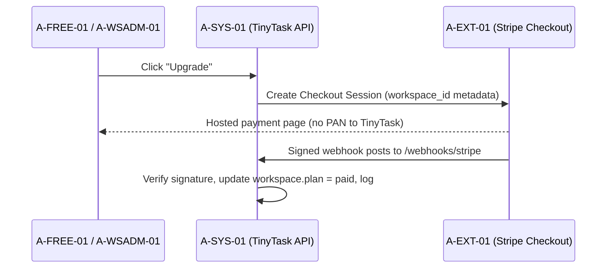


##### 5 Alternative Flows

###### 5.1 <Alternate flow: Webhook signature invalid>

Trigger: step 4. The system returns 400 — no state change.

###### 5.2 <Alternate flow: Webhook replay>

Trigger: step 5. Idempotency applies — the replay is a no-op.

##### 6 Subflows

###### 6.1 <Subflow: Signed webhook intake>

1. Receive the POST to /webhooks/stripe.
2. Verify the signature; reject invalid with 400 (no state change).
3. Apply idempotency: replayed events are no-ops.
4. Update workspace.plan and log the event.

##### 7 Key Scenarios

###### 7.1 <Scenario: Upgrade completed>

1. Plan upgraded on a verified signed webhook; no PAN stored; webhook audited.

###### 7.2 <Scenario: Webhook spoofing attempt (MUC-05)>

1. A forged webhook fails signature verification — 400, no state change.

##### 8 Post-conditions

###### 8.1

Workspace plan upgraded.

###### 8.2

No PAN stored.

###### 8.3

Webhook audited.

##### 9 Special Requirements (FURPS+)

**Functional (F):** Checkout Session with workspace_id metadata; signed-webhook plan update; idempotent replay handling.

**Usability (U):** Payment happens on the Stripe hosted page — no card entry inside the product.

**Reliability (R):** Invalid signature → 400 with no state change; replays are no-ops.

**Performance (P):** N/A — no attested timing constraint.

**Supportability (S):** No PAN stored (attested — card provenance, Doc06 §2); billing metadata minimisation (A-DPO-01).

##### 10 Security & Compliance Annex (AEGIS)

- **Provenance:** [ATTESTED] Source: `Doc06_ThirdParty_Landscape.md §2` (Stripe hosted checkout; "no PAN stored").
- **Constrained by:** PROC-19, UC-10.
- **Rules / NFR:** CR-D-06.1-001, CR-D-06.3-001 (DPA), CR-D-05.1-001 (minimisation) · NFR-40.
- **Threats addressed:** MUC-05 (abusive integration / webhook spoofing).
- **NIST anchors:** PR.AA-01, GV.SC-02.

#### Use-Case: {UC-32} Workspace Admin Console

##### 1 Brief Description

A workspace admin manages membership, roles, billing and the audit view from a single console. It is triggered when the admin opens workspace settings. Every action taken in the console is applied and logged.

##### 2 Actor Brief Descriptions

###### 2.1 A-WSADM-01 (Workspace Admin/Owner) — Primary Actor:

Performs admin actions (invite, change role, remove member, view usage) in the console.

###### 2.2 A-MEMBER-01 (Member):

Stakeholder — managed member affected by role and membership changes.

###### 2.3 A-SYS-01 (System — TinyTask API):

Renders the console views, applies the selected action, and logs it.

##### 3 Preconditions

- Workspace exists.
- Actor is Admin/Owner.

##### 4 Basic Flow of Events

1. System renders membership list, roles, billing summary, audit log filter.
2. Admin performs action: invite (UC-18), change role, remove member, view usage.
3. System applies the action and logs it.

**Sequence diagram** (derived copy — editable source: Annex B §19):

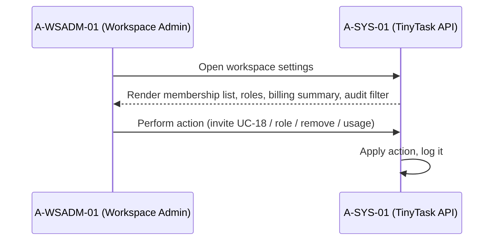


##### 5 Alternative Flows

###### 5.1 <Alternate flow: Large membership list>

Trigger: step 1. The member list is paginated.

###### 5.2 <Alternate flow: Self-demotion of last Owner>

Trigger: step 2. The action is blocked.

##### 6 Subflows

###### 6.1 <Subflow: Admin action application>

1. Admin selects the action (invite UC-18, change role, remove member, view usage).
2. System applies the action.
3. System logs it to the audit trail.

##### 7 Key Scenarios

###### 7.1 <Scenario: Role changed>

1. Role applied and the change recorded in the audit trail.

###### 7.2 <Scenario: Last-Owner self-demotion>

1. Blocked — the workspace is never left without an Owner (MUC-02 guard).

##### 8 Post-conditions

###### 8.1

Admin action applied.

###### 8.2

Audit recorded.

##### 9 Special Requirements (FURPS+)

**Functional (F):** Membership list, roles, billing summary and audit log filter; invite (UC-18), role change, member removal, usage view.

**Usability (U):** N/A — no attested usability constraint.

**Reliability (R):** Self-demotion of the last Owner is blocked.

**Performance (P):** Member list paginated for large workspaces.

**Supportability (S):** Every console action is logged (audit anchor UC-10 in the annex).

##### 10 Security & Compliance Annex (AEGIS)

- **Provenance:** [ATTESTED] Source: `Doc04_Architecture_DataInventory.md §3` (admin actions attested).
- **Constrained by:** PROC-19, UC-10, CAP-01 (DPA display).
- **Rules / NFR:** CR-D-03.3-001, CR-D-06.3-001.
- **Threats addressed:** MUC-02.
- **NIST anchors:** PR.AA-01, PR.AA-05.

#### Use-Case: {UC-33} Enterprise SSO

##### 1 Brief Description

An enterprise administrator configures SAML/OIDC single sign-on so the enterprise tenant's members land on SSO login by default. It is triggered when the enterprise admin configures the IdP (e.g., Okta, Azure AD). The SSO login audit trail stays visible to the admin.

##### 2 Actor Brief Descriptions

###### 2.1 A-ENTADM-01 (Enterprise Administrator) — Primary Actor:

Uploads the SAML/OIDC metadata and manages the enterprise SSO configuration.

###### 2.2 A-MEMBER-01 (enterprise users):

Stakeholders — routed to SSO login by default.

###### 2.3 A-EXT-02 (Auth0 IdP):

Federates the enterprise IdP and validates the resulting tokens.

###### 2.4 A-SYS-01 (System — TinyTask API):

Validates and stores the IdP config per enterprise tenant, routes members to SSO, and exposes the audit trail.

##### 3 Preconditions

- Enterprise contract.
- SAML metadata uploaded.

##### 4 Basic Flow of Events

1. Admin uploads SAML/OIDC metadata.
2. System validates signature and stores IdP config per enterprise tenant.
3. Members from the enterprise domain land on SSO login by default (UC-15 extension).
4. Admin views SSO login audit trail.

**Sequence diagram** (derived copy — editable source: Annex B §20):

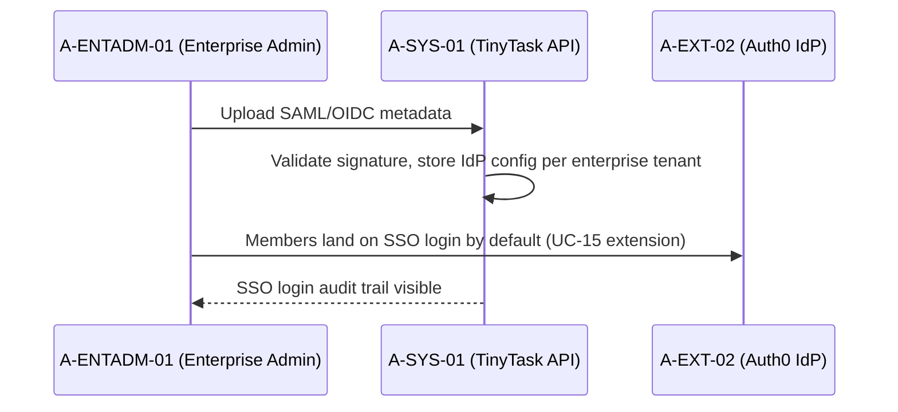


##### 5 Alternative Flows

###### 5.1 <Alternate flow: Metadata signature invalid>

Trigger: step 2. The upload is rejected.

###### 5.2 <Alternate flow: SSO outage>

Trigger: step 3. Fallback password auth for admins (with MFA).

##### 6 Subflows

###### 6.1 <Subflow: IdP metadata onboarding>

1. Admin uploads SAML/OIDC metadata.
2. System validates the signature.
3. System stores the IdP config per enterprise tenant.

##### 7 Key Scenarios

###### 7.1 <Scenario: SSO configured>

1. Enterprise-domain members land on SSO login by default; the admin can audit SSO logins.

###### 7.2 <Scenario: SSO outage>

1. Admins fall back to password authentication with MFA until the IdP recovers.

##### 8 Post-conditions

###### 8.1

Enterprise SSO configured.

###### 8.2

Users routed to IdP.

##### 9 Special Requirements (FURPS+)

**Functional (F):** SAML/OIDC metadata upload with signature validation; per-enterprise-tenant IdP config; default SSO routing; SSO login audit trail.

**Usability (U):** N/A — no attested usability constraint.

**Reliability (R):** Invalid metadata rejected at upload; SSO outage falls back to password auth for admins with MFA.

**Performance (P):** N/A — no attested timing constraint.

**Supportability (S):** Centralised IdP (A-EXT-02) mitigates SSO bypass (MUC-01); admin MFA per UC-09.

##### 10 Security & Compliance Annex (AEGIS)

- **Provenance:** [ASSUMED] — SSO for customers attested as optional in `Doc05_Security_Posture.md §6`; enterprise SSO variant is standard but enterprise tier scope is [ASSUMED].
- **Constrained by:** UC-15, UC-08, UC-09, UC-10.
- **Rules / NFR:** CR-D-03.1-001 · FR-02.
- **Threats addressed:** MUC-01 (SSO bypass mitigated by centralised IdP).
- **NIST anchors:** PR.AA-01.

### §2.5 PKG-11 Self-Service (3)

| UC ID | D | Title | Primary Owner | Prio |
|-------|---|-------|---------------|------|
| UC-34 | n/a | View My Account (data held) | A-MEMBER-01 | HIGH |
| UC-35 | n/a | Export My Data (GDPR portability) | A-MEMBER-01 | CRITICAL |
| UC-36 | n/a | Delete My Account / Workspace | A-FREE-01 / A-WSADM-01 | CRITICAL |

#### Use-Case: {UC-34} View My Account (data held)

##### 1 Brief Description

A member sees which categories of personal data TinyTask holds about them, read-only. It is triggered when the member opens the account page. The read completes with an audit log entry.

##### 2 Actor Brief Descriptions

###### 2.1 A-MEMBER-01 (Member) — Primary Actor:

Opens the account page and reads the data categories held.

###### 2.2 A-SYS-01 (System — TinyTask API):

Returns the data categories held about the user and logs the read.

###### 2.3 A-DPO-01 (DPO / Compliance Manager):

Stakeholder — transparency obligation owner.

##### 3 Preconditions

- Authenticated.

##### 4 Basic Flow of Events

1. System returns list of data categories held about the user (profile, account activity, workspace memberships).
2. Member sees them read-only.

**Sequence diagram** (derived copy — editable source: Annex B §21):

```mermaid
sequenceDiagram
    participant M as A-MEMBER-01 (Member)
    participant SYS as A-SYS-01 (TinyTask API)
    M->>SYS: Open account page
    SYS-->>M: List data categories (profile, account activity, workspace memberships)
    M->>SYS: Read-only view
    SYS->>SYS: Audit log entry
```


##### 5 Alternative Flows

###### 5.1 <Alternate flow: Long activity history>

Trigger: step 2. Pagination applies for long activity history.

##### 6 Subflows

###### 6.1 <Subflow: Data-category inventory>

1. Collect the data categories held about the user (profile, account activity, workspace memberships).
2. Return them read-only.

##### 7 Key Scenarios

###### 7.1 <Scenario: Transparency view rendered>

1. The member sees all declared data categories, read-only.

###### 7.2 <Scenario: Long history>

1. Pagination keeps the activity view manageable.

##### 8 Post-conditions

###### 8.1

Read completed.

###### 8.2

Audit logged.

##### 9 Special Requirements (FURPS+)

**Functional (F):** List of data categories held (profile, account activity, workspace memberships), presented read-only.

**Usability (U):** Read-only presentation of the held data.

**Reliability (R):** N/A — no attested availability constraint specific to this UC.

**Performance (P):** Pagination for long activity history.

**Supportability (S):** Read event audited (annex anchor UC-10); transparency per CR-D-05.4-001 (annex).

##### 10 Security & Compliance Annex (AEGIS)

- **Provenance:** [ATTESTED] Source: `Doc04_Architecture_DataInventory.md §3` ("In-app account view and support request").
- **Constrained by:** UC-02, UC-10.
- **Rules / NFR:** CR-D-05.4-001 (transparency) · FR-07.
- **NIST anchors:** PR.DS-10, CT.DM-P1.

#### Use-Case: {UC-35} Export My Data (GDPR portability)

##### 1 Brief Description

A member exports a machine-readable archive of their personal data (GDPR portability). It is triggered when the member clicks "Export my data" in the account page. The archive is delivered through a signed download link that expires after 24 hours.

##### 2 Actor Brief Descriptions

###### 2.1 A-MEMBER-01 (Member) — Primary Actor:

Requests the export and downloads the archive via the emailed link.

###### 2.2 A-SYS-01 (System — TinyTask API):

Assembles the JSON archive, generates the signed URL, emails the link, and logs the event.

###### 2.3 A-DPO-01 (DPO / Compliance Manager):

Stakeholder — portability obligation owner.

##### 3 Preconditions

- Authenticated.

##### 4 Basic Flow of Events

1. System generates a JSON archive (profile, workspaces owned, tasks authored, comments, attachments metadata).
2. System makes it available via signed download URL (24h expiry).
3. System emails the user the link.
4. System logs the event.

**Sequence diagram** (derived copy — editable source: Annex B §22):

```mermaid
sequenceDiagram
    participant M as A-MEMBER-01 (Member)
    participant SYS as A-SYS-01 (TinyTask API)
    M->>SYS: Click "Export my data"
    SYS->>SYS: Generate JSON archive (profile, workspaces, tasks, comments, attachment metadata)
    SYS->>SYS: Signed download URL (24h expiry), email link, log event
    SYS-->>M: Download archive
```


##### 5 Alternative Flows

###### 5.1 <Alternate flow: Export exceeds 100 MB>

Trigger: step 1. The export becomes an async job; the user is emailed when ready.

###### 5.2 <Alternate flow: URL replayed after 24h>

Trigger: step 2. The system returns 410 Gone.

##### 6 Subflows

###### 6.1 <Subflow: Archive assembly>

1. Collect profile, workspaces owned, tasks authored, comments and attachment metadata.
2. Generate the JSON archive.

###### 6.2 <Subflow: Signed-URL delivery>

1. Generate the signed download URL (24h expiry).
2. Email the link to the user.
3. Reject replays after expiry with 410 Gone.
4. Log the event.

##### 7 Key Scenarios

###### 7.1 <Scenario: Export delivered>

1. Archive generated, link emailed, download consumed or expired.

###### 7.2 <Scenario: Bulk-scraping attempt (MUC-04)>

1. Rate limits, the 24h signed URL and the authentication requirement cap any bulk extraction.

##### 8 Post-conditions

###### 8.1

Data exported.

###### 8.2

URL consumed or expired.

##### 9 Special Requirements (FURPS+)

**Functional (F):** JSON archive (profile, workspaces owned, tasks authored, comments, attachments metadata); signed-URL delivery by email.

**Usability (U):** N/A — no attested usability constraint.

**Reliability (R):** Exports > 100 MB degrade to an async job with email-on-ready; expired URLs return 410 Gone.

**Performance (P):** Signed download URL with 24h expiry window.

**Supportability (S):** Rate-limited, authenticated endpoint mitigates bulk scraping (MUC-04); BG-03 commitment "JSON export endpoint live within 90 days" (Doc03 §3, card provenance).

##### 10 Security & Compliance Annex (AEGIS)

- **Provenance:** [ATTESTED] Source: `Doc03_Company_Context_Assessment.md §3` (BG-03: "JSON export endpoint live within 90 days").
- **Constrained by:** UC-02, UC-10, UC-08.
- **Rules / NFR:** CR-D-05.4-001 · FR-09, NFR-24.
- **Threats addressed:** MUC-04 (bulk scraping — rate-limited + 24h URL + auth required).
- **NIST anchors:** PR.DS-10, CT.DM-P1.

#### Use-Case: {UC-36} Delete My Account / Workspace

##### 1 Brief Description

A user deletes their account, or a workspace owner deletes the workspace. It is triggered when the user clicks "Delete account" / "Delete workspace" and types the confirmation phrase. Deletion is immediate for accounts; workspaces get a 30-day grace period with a cancel link before cryptographic erasure runs across primary + backup (UC-01 cascade).

##### 2 Actor Brief Descriptions

###### 2.1 A-FREE-01 (Free-tier User) or A-WSADM-01 (Workspace Owner for workspace deletion) — Primary Actor:

Confirms the deletion by typing the confirmation phrase.

###### 2.2 A-SYS-01 (System — TinyTask API):

Schedules the deletion, sends the confirmation email, performs the cryptographic erasure, and logs the event.

###### 2.3 A-DPO-01 (DPO / Compliance Manager):

Stakeholder — erasure obligation owner.

###### 2.4 A-MEMBER-01 (workspace co-members):

Stakeholders — lose access when a workspace is deleted.

##### 3 Preconditions

- Authenticated.
- Typed confirmation.
- For workspace, actor is Owner and sole Owner (or transfers ownership first).

##### 4 Basic Flow of Events

1. System requires typing the confirmation phrase.
2. System schedules deletion (immediate for account; 30-day grace for workspace).
3. System sends confirmation email with cancel link (within grace period).
4. After grace, system performs cryptographic erasure across primary + backup (UC-01 cascade).
5. System logs the event.

**Sequence diagram** (derived copy — editable source: Annex B §23):

```mermaid
sequenceDiagram
    participant U as A-FREE-01 / A-WSADM-01
    participant SYS as A-SYS-01 (TinyTask API)
    U->>SYS: Click delete, type confirmation phrase
    SYS->>SYS: Schedule deletion (immediate account / 30-day grace workspace)
    SYS-->>U: Confirmation email with cancel link (within grace)
    SYS->>SYS: After grace — cryptographic erasure primary + backup (UC-01)
    SYS->>SYS: Log the event
```


##### 5 Alternative Flows

###### 5.1 <Alternate flow: Open invoices or active subscription>

Trigger: step 2. Deletion is blocked until resolved.

###### 5.2 <Alternate flow: Legal hold>

Trigger: step 4. Erasure is suspended until the hold is released.

##### 6 Subflows

###### 6.1 <Subflow: Grace-period handling>

1. Schedule the deletion (immediate for account; 30-day grace for workspace).
2. Send the confirmation email with cancel link (within the grace period).
3. Cancellation restores the workspace; expiry proceeds to erasure.

###### 6.2 <Subflow: Cryptographic erasure>

1. After the grace period, perform cryptographic erasure across primary + backup (UC-01 cascade).
2. Issue the erasure receipt.
3. Log the event.

##### 7 Key Scenarios

###### 7.1 <Scenario: Workspace deleted after grace>

1. 30-day grace elapses without cancellation; cryptographic erasure completes; receipt issued.

###### 7.2 <Scenario: Blocked deletion>

1. Open invoices/subscription or a legal hold suspend the flow until resolved.

##### 8 Post-conditions

###### 8.1

Account/workspace deleted.

###### 8.2

Data erased.

###### 8.3

Receipt issued.

##### 9 Special Requirements (FURPS+)

**Functional (F):** Typed confirmation phrase; scheduled deletion (immediate for account, 30-day grace for workspace); cryptographic erasure across primary + backup with receipt.

**Usability (U):** Confirmation email with a cancel link during the grace period.

**Reliability (R):** Open invoices or an active subscription block deletion; legal holds suspend erasure until released.

**Performance (P):** N/A — no attested timing constraint beyond the 30-day grace.

**Supportability (S):** Erasure cascades to UC-01; event logged for audit.

##### 10 Security & Compliance Annex (AEGIS)

- **Provenance:** [ATTESTED] Source: `Doc04_Architecture_DataInventory.md §3` ("Workspace deletion removes active records").
- **Constrained by:** UC-01, UC-10.
- **Rules / NFR:** CR-D-05.3-001, CR-D-05.2-001 · FR-08, NFR-23.
- **Threats addressed:** MUC-04.
- **NIST anchors:** PR.DS-01, CT.DM-P4.

---

## §3 Security & Compliance Use Cases (UC-01..UC-13) — lane-pure (UC cards only)

> Of the 35 L1 security/compliance cards from the v2.0 freeze, the **17 genuine use cases** are retained below with the same `U.C.X.Y.Z` identifiers (so every downstream reference stays valid), in Cockburn form with a **Security & Compliance Annex** consolidating the prior property-sheet fields. The 18 non-UC cards (PROC-01..17, CAP-01) left the catalog per rubric `REALIZATION_CLASS_RUBRIC.md` v1.8 §5B rule 6 (UC SEPARATION campaign, 2026-09-05) — full lane cards live in `Doc32_Process_Capability_Cards.md`; their catalogue-only fields are preserved in the §3.0 Compliance Domain Index so no information is lost.

### §3.0 Compliance Domain Index (lane cards → Doc32)

> The 22 non-UC compliance cards that populated these packages (PROC-01..21, CAP-01) left the catalog per rubric `REALIZATION_CLASS_RUBRIC.md` v1.8 §5B rule 6 (UC SEPARATION, 2026-09-05): the catalog holds UC cards only. Full lane cards (§5C.1 process / §5C.2 capability form + Mermaid diagrams) live in **`Doc32_Process_Capability_Cards.md`** — same IDs. The register below preserves, verbatim, the catalogue-only fields (stakeholders, preconditions, extensions, postconditions, compliance annex) so no information is lost; trigger/activities/roles/SLA/anchors/evidence are carried by the Doc32 cards; per-card NIST CSF/PF anchors are in `NIST_ANCHORS.md` §3.1.

| Package | Domain focus | UCs in this catalog (§3.x) | Lane cards (Doc32) | Rules covered |
|---|---|---|---|---|
| PKG-DP (Data Protection) | Data Protection | UC-01, UC-02, UC-03, UC-04 | PROC-01, PROC-02 | CR-D-01.1-001 / PO-D-01.1-001 · CR-D-01.4-001 / PO-D-01.4-001 |
| PKG-SEC (Security Operations) | Security Operations | UC-05, UC-06, UC-07 | PROC-03, PROC-04, PROC-05, PROC-18 | CR-D-02.1-001 / SO-D-02.1-001 · CR-D-02.3-001 / SO-D-02.3-001 · CR-D-04.3-001 / SO-D-04.3-001 |
| PKG-IAM (Identity & Access) | Identity & Access | UC-08, UC-09, UC-10 | PROC-06, PROC-07, PROC-19, PROC-20 | CR-D-09.4-001 / PO-D-09.4-001 · CR-D-10.3-001 / SO-D-10.3-001 |
| PKG-DEV (Secure Development) | Secure Development | UC-11, UC-12 | PROC-08, PROC-09, PROC-21 | CR-D-07.1-001 / PO-D-07.1-001 · CR-D-09.2-001 / PO-D-09.2-001 |
| PKG-GOV (Governance & Compliance) | Governance & Compliance | UC-13 | CAP-01, PROC-10, PROC-11, PROC-12, PROC-13, PROC-14 | CR-D-06.3-001 / SO-D-06.3-001 · CR-D-09.1-001 / PO-D-09.1-001 · CR-D-09.1-001 / SO-D-09.1-001 · CR-D-09.2-001 / PO-D-09.2-001 · CR-D-09.4-001 / PO-D-09.4-001 · CR-D-06.1-001 / SO-D-06.1-001 |
| PKG-TRN (Training & Awareness) | Training & Awareness | — (0 UCs) | PROC-15, PROC-16, PROC-17 | CR-D-08.1-001 / SO-D-08.1-001 · CR-D-08.2-001 / SO-D-08.2-001 · CR-D-08.1-001 / SO-D-08.1-001 |

**Lane-card compliance register (catalogue-only fields, verbatim):**

- **PROC-01 — Data Subject Access Request (DSAR)** · D-01.1 · CRITICAL · Realises CR-D-01.1-001 / PO-D-01.1-001 · Operational card: Doc32 §PROC-01.
  - Stakeholders: Customer (data subject), Auditor
  - Preconditions: Valid DSAR received (web form or email) with verifiable identity.
  - Extensions:
    - 2a. Identity unverifiable → request additional verification (clock stops).
    - 5a. Manifestation delay (complex request) → +60 days with notice to subject.
  - Postconditions: Subject receives data; audit log entry (PR.DS-10); RoPA updated if new category surfaces.
  - Security & Compliance Annex:
    - **Owner:** DPO · **Status:** TODO · **Verification Method:** TEST
    - **Verification Criteria:** Sample of 10 DSARs completed ≤30d; output fields match RoPA §3; audit log entry present.
    - **Dependencies:** FR-07, NFR-21, NFR-22, NFR-26, NODE-SYS-014, NODE-PROC-006
    - **Risk if not met:** H — non-response ≤30d → CNPD enforcement, GDPR Art. 83 fine up to 4% revenue.
    - **Implementation Status:** PARTIAL (What's missing: operational evidence verification & automated review cadence)
    - **Regulatory Reporting:** CNPD ≤72h if breach of personal data (GDPR Art. 33).
    - **External Auditor:** AWS SOC 2 / ISO 27001 · **Supervisory Body:** CNPD.
    - **Functional UCs this constrains:** UC-34, UC-35, UC-36.
    - **Misuse cases this addresses:** MUC-04 (bulk scraping limited by verified DSAR process + rate limits).
- **PROC-02 — Data Subject Rectification** · D-01.4 · HIGH · Realises CR-D-01.4-001 / PO-D-01.4-001 · Operational card: Doc32 §PROC-02.
  - Stakeholders: Customer, Auditor
  - Preconditions: Verified identity; specific data fields contested.
  - Extensions: 2a. Correction conflicts with audit trail → preserve original + record correction (do not overwrite audit log).
  - Postconditions: Data corrected; integrity preserved; processors notified.
  - Security & Compliance Annex:
    - **Owner:** DPO · **Status:** TODO · **Verification Method:** TEST
    - **Verification Criteria:** All linked stores updated ≤30d; HMAC integrity preserved; processors notified ≤7d.
    - **Dependencies:** FR-11, NFR-06, NFR-28, NODE-SYS-016
    - **Risk if not met:** H — inaccurate data = GDPR Art. 5(1)(d) breach.
    - **Implementation Status:** PARTIAL (What's missing: operational evidence verification & automated review cadence)
    - **Functional UCs this constrains:** UC-34.
- **PROC-03 — Vulnerability-Free Release** · D-02.1 · CRITICAL · Realises CR-D-02.1-001 / SO-D-02.1-001 · Operational card: Doc32 §PROC-03.
  - Stakeholders: A-CTO-01, Auditor
  - Preconditions: Release candidate built; SAST/SCA/container scans configured.
  - Extensions: 3a. Critical CVE → emergency patch path (UC-05).
  - Postconditions: Release published or blocked; SBOM generated (UC-13).
  - Security & Compliance Annex:
    - **Owner:** Lead Developer · **Verification Method:** TEST
    - **Verification Criteria:** 0 critical findings at release; SCA prioritised by CVSS + EPSS; release audit log.
    - **Dependencies:** FR-17, FR-20, NFR-46, NODE-PROC-017, NODE-SYS-009
    - **Risk if not met:** H — unremediated critical = CRA Art. 14 actively-exploited obligation.
    - **Implementation Status:** PARTIAL (What's missing: operational evidence verification & automated review cadence)
    - **Regulatory Reporting:** ENISA ≤24h if actively-exploited (CRA Art. 14).
    - **Functional UCs this constrains:** UC-21, UC-27 (release gating affects task/attachment publishes).
- **PROC-04 — Coordinated Vulnerability Disclosure** · D-02.3 · HIGH · Realises CR-D-02.3-001 / SO-D-02.3-001 · Operational card: Doc32 §PROC-04.
  - Stakeholders: External researcher, CTO, Auditor
  - Preconditions: security.txt published at `/.well-known/security.txt`; dedicated mailbox configured.
  - Extensions: 1a. Report out of scope → redirect politely.
  - Postconditions: CVE assigned; patch released; disclosure published.
  - Security & Compliance Annex:
    - **Owner:** Lead Developer · **Verification Method:** INSPECT
    - **Verification Criteria:** security.txt present; median first response ≤72h; disclosure policy published; CVE assigned.
    - **Dependencies:** NODE-PROC-016, FR-13
    - **Risk if not met:** M — slow disclosure damages researcher trust + CRA reputation.
- **PROC-05 — Incident Notification (24h ENISA, 72h GDPR)** · D-04.3 · CRITICAL · Realises CR-D-04.3-001 / SO-D-04.3-001 · Operational card: Doc32 §PROC-05.
  - Stakeholders: Customer, CTO, Lead Developer, Auditor
  - Preconditions: Incident confirmed via severity matrix.
  - Extensions: 1a. Suspected-only → handled in triage, no notification.
  - Postconditions: Notifications submitted; breach register updated.
  - Security & Compliance Annex:
    - **Owner:** Operations Lead · **Verification Method:** DEMONSTRATE
    - **Verification Criteria:** ENISA median ≤24h; CNPD ≤72h; tabletop quarterly; breach register ≤24h.
    - **Dependencies:** FR-16, NFR-29, NFR-44, NODE-SYS-004, NODE-PROC-001, NODE-ROLE-008
    - **Risk if not met:** H — late notification = GDPR Art. 83 fine + CRA sanctions.
    - **Implementation Status:** PARTIAL (What's missing: operational evidence verification & automated review cadence)
    - **Regulatory Reporting:** CNPD ≤72h + ENISA ≤24h.
- **PROC-06 — Processing & Breach Records** · D-09.4 · HIGH · Realises CR-D-09.4-001 / PO-D-09.4-001 · Operational card: Doc32 §PROC-06.
  - Stakeholders: Customer, Auditor
  - Preconditions: Processing activity exists.
  - Extensions: 3a. Anonymised processing → no RoPA needed.
  - Postconditions: RoPA current; breach register maintained.
  - Security & Compliance Annex:
    - **Owner:** DPO · **Verification Method:** INSPECT
    - **Verification Criteria:** RoPA ≤7d; breach register ≤24h; accessible to supervisory body.
    - **Dependencies:** FR-27, NFR-33, NFR-35, NODE-SYS-014, NODE-SYS-017
    - **Risk if not met:** M — outdated RoPA = GDPR Art. 30 violation.
- **PROC-07 — Control Effectiveness Testing** · D-10.3 · MEDIUM · Realises CR-D-10.3-001 / SO-D-10.3-001 · Operational card: Doc32 §PROC-07.
  - Stakeholders: Lead Developer, Auditor
  - Preconditions: Controls catalog current; pentest vendor contracted.
  - Extensions: 3a. Bug bounty — separate programme.
  - Postconditions: Controls effectiveness validated.
  - Security & Compliance Annex:
    - **Owner:** Operations Lead · **Verification Method:** INSPECT
    - **Verification Criteria:** Annual pentest report published; 100% critical findings remediated; controls catalog updated.
    - **Dependencies:** FR-28, NFR-46, NODE-SYS-009, NODE-PROC-020
    - **Risk if not met:** M — untested controls = undetected drift.
- **PROC-08 — Security by Design (SSDLC)** · D-07.1 · HIGH · Realises CR-D-07.1-001 / PO-D-07.1-001 · Operational card: Doc32 §PROC-08.
  - Stakeholders: CTO, Auditor
  - Preconditions: Feature RFC initiated.
  - Extensions: 3a. Internal tooling → relaxed SSDLC.
  - Postconditions: Feature shipped under SSDLC discipline.
  - Security & Compliance Annex:
    - **Owner:** Lead Developer · **Verification Method:** DEMONSTRATE
    - **Verification Criteria:** Threat model per RFC; secure code review signed off; quarterly SSDLC metrics.
    - **Dependencies:** FR-20, FR-21, NODE-PROC-007, NODE-PROC-009, NODE-PROC-010
    - **Risk if not met:** M — late-discovered design flaws = costly remediation.
- **PROC-09 — Pre-Launch Risk Assessment** · D-09.2 · CRITICAL · Realises CR-D-09.2-001 / PO-D-09.2-001 · Operational card: Doc32 §PROC-09.
  - Stakeholders: CEO, Compliance Manager, Auditor
  - Preconditions: High-risk processing identified.
  - Extensions: 3a. Bug fix with no new risk surface → out of scope.
  - Postconditions: Launch approved; risks tracked.
  - Security & Compliance Annex:
    - **Owner:** Risk Owner · **Verification Method:** DEMONSTRATE
    - **Verification Criteria:** DPIA completed pre-launch; risk register entry per high-risk finding; DPO + RO sign-off.
    - **Dependencies:** FR-25, NFR-31, NFR-41, NODE-PROC-005, NODE-ROLE-006
    - **Risk if not met:** H — unassessed launch = GDPR Art. 35 violation.
    - **Implementation Status:** PARTIAL (What's missing: operational evidence verification & automated review cadence)
    - **Regulatory Reporting:** CNPD ≤72h if breach.
- **CAP-01 — DPAs Binding Processors** · D-06.3 · HIGH · Realises CR-D-06.3-001 / SO-D-06.3-001 · Operational card: Doc32 §CAP-01.
  - Stakeholders: Compliance Manager, CEO, Auditor
  - Preconditions: Processor engaged.
  - Extensions: 3a. Non-data vendors — out of scope.
  - Postconditions: DPA on file.
  - Security & Compliance Annex:
    - **Owner:** Compliance Manager · **Verification Method:** INSPECT
    - **Verification Criteria:** 100% active processors with signed DPAs; annual review; Art. 28 clauses present.
    - **Dependencies:** NODE-PROC-012, NODE-ROLE-011
    - **Risk if not met:** H — missing DPA = GDPR Art. 28 violation.
    - **Functional UCs this constrains:** UC-31, UC-15.
- **PROC-10 — Annual Policy Review** · D-09.1 · HIGH · Realises CR-D-09.1-001 / PO-D-09.1-001 · Operational card: Doc32 §PROC-10.
  - Stakeholders: CEO, Auditor
  - Preconditions: Policies exist.
  - Extensions: 3a. Customer-facing terms — separate legal cycle.
  - Postconditions: Policies current; staff informed.
  - Security & Compliance Annex:
    - **Owner:** Compliance Manager · **Verification Method:** INSPECT
    - **Verification Criteria:** All policies reviewed annually; minutes stored immutably; changes communicated ≤7d.
    - **Dependencies:** FR-25, NFR-38, NODE-PROC-004, NODE-ROLE-001
    - **Risk if not met:** M — stale policy = governance gap.
- **PROC-11 — Technical Documentation Maintenance** · D-09.1 · HIGH · Realises CR-D-09.1-001 / SO-D-09.1-001 · Operational card: Doc32 §PROC-11.
  - Stakeholders: Compliance Manager, CEO, Auditor
  - Preconditions: Documentation baseline exists.
  - Extensions: 3a. Code-level inline docs — separate.
  - Postconditions: Documentation current.
  - Security & Compliance Annex:
    - **Owner:** CTO · **Verification Method:** INSPECT
    - **Verification Criteria:** Docs updated ≤30d; CRA Annex I current; CTO annual review.
    - **Dependencies:** NODE-ROLE-002, FR-25
    - **Risk if not met:** M — outdated docs = CRA Art. 31 gap.
- **PROC-12 — DPIA Pre-Launch** · D-09.2 · CRITICAL · Realises CR-D-09.2-001 / PO-D-09.2-001 · Operational card: Doc32 §PROC-12.
  - Stakeholders: CEO, Auditor
  - Preconditions: High-risk processing identified.
  - Extensions: 3a. Low-risk routine processing — out of scope.
  - Postconditions: DPIA on file; sign-offs recorded.
  - Security & Compliance Annex:
    - **Owner:** Risk Owner · **Verification Method:** DEMONSTRATE
    - **Verification Criteria:** DPIA pre-launch; sign-off recorded; residual risk CEO-accepted where applicable.
    - **Dependencies:** FR-25, NFR-31, NODE-PROC-005, NODE-ROLE-006
    - **Risk if not met:** H — missing DPIA = GDPR Art. 35 + Art. 83.
    - **Implementation Status:** PARTIAL (What's missing: operational evidence verification & automated review cadence)
- **PROC-13 — RoPA Maintenance** · D-09.4 · HIGH · Realises CR-D-09.4-001 / PO-D-09.4-001 · Operational card: Doc32 §PROC-13.
  - Stakeholders: Customer, Auditor
  - Preconditions: Processing activities ongoing.
  - Extensions: 3a. One-off ad-hoc processing — out of scope.
  - Postconditions: RoPA current.
  - Security & Compliance Annex:
    - **Owner:** DPO · **Verification Method:** INSPECT
    - **Verification Criteria:** RoPA ≤7d; annual review; accessible.
    - **Dependencies:** FR-27, NFR-33, NFR-35, NODE-SYS-014, NODE-PROC-006
    - **Risk if not met:** M — outdated RoPA = GDPR Art. 30 violation.
- **PROC-14 — Processor Due Diligence** · D-06.1 · HIGH · Realises CR-D-06.1-001 / SO-D-06.1-001 · Operational card: Doc32 §PROC-14.
  - Stakeholders: Compliance Manager, CEO, Auditor
  - Preconditions: Prospective processor identified.
  - Extensions: 3a. Non-data processors (cleaning, etc.) — out of scope.
  - Postconditions: Processor risk known.
  - Security & Compliance Annex:
    - **Owner:** Procurement Lead · **Verification Method:** INSPECT
    - **Verification Criteria:** Security questionnaire pre-engagement; annual vendor assessment; findings remediated.
    - **Dependencies:** FR-28, NFR-40, NODE-PROC-011, NODE-ROLE-009
    - **Risk if not met:** H — substandard processor = GDPR Art. 28 violation.
    - **Functional UCs this constrains:** UC-31 (Stripe), UC-15 (Auth0).
- **PROC-15 — Annual Awareness Training** · D-08.1 · MEDIUM · Realises CR-D-08.1-001 / SO-D-08.1-001 · Operational card: Doc32 §PROC-15.
  - Stakeholders: All staff, Auditor
  - Preconditions: LMS available.
  - Extensions: 3a. Long-term contractors — same requirement.
  - Postconditions: 100% completion rate.
  - Security & Compliance Annex:
    - **Owner:** Compliance Manager · **Verification Method:** INSPECT
    - **Verification Criteria:** 100% completion (NFR-36); refreshed annually; quiz pass required.
    - **Dependencies:** FR-29, NFR-36, NODE-PROC-018
    - **Risk if not met:** M — untrained staff = phishing risk + GDPR Art. 39 gap.
- **PROC-16 — Role-Specific Training** · D-08.2 · MEDIUM · Realises CR-D-08.2-001 / SO-D-08.2-001 · Operational card: Doc32 §PROC-16.
  - Stakeholders: Engineers, ops, DPO, IAM admin
  - Preconditions: Role taxonomy documented.
  - Extensions: 2a. General awareness — covered in PROC-15.
  - Postconditions: Role-specific competencies maintained.
  - Security & Compliance Annex:
    - **Owner:** Compliance Manager · **Verification Method:** INSPECT
    - **Verification Criteria:** Role curricula per role; tracked; updated annually.
    - **Dependencies:** FR-29, NFR-36, NODE-PROC-019, NODE-ROLE-002, NODE-ROLE-003
    - **Risk if not met:** M — role gaps = competency risk.
- **PROC-17 — Phishing Simulation** · D-08.1 · LOW · Realises CR-D-08.1-001 / SO-D-08.1-001 · Operational card: Doc32 §PROC-17.
  - Stakeholders: All staff with email
  - Preconditions: Phishing simulation vendor.
  - Extensions: 3a. External addresses — out of scope.
  - Postconditions: Click-rate trend reported.
  - Security & Compliance Annex:
    - **Owner:** Compliance Manager · **Verification Method:** TEST
    - **Verification Criteria:** Quarterly execution; click rate trend; re-education for repeat clickers.
    - **Dependencies:** FR-30, NFR-01
    - **Risk if not met:** L — phishing is a leading breach vector.


### §3.1 PKG-DP (Data Protection) — 4 UCs · lane cards: PROC-01, PROC-02 → Doc32

| UC ID | D | Title | Primary rule | CSF | PF | Prio |
|-------|---|-------|--------------|-----|----|----|
| UC-01 | D-05.3 | Data Subject Erasure | CR-D-05.3-001 / PO-D-05.3-001 | GV.SC-04, PR.DS-10, PR.DS-02 | CT.DM-P4, CT.DM-P5 | CRITICAL |
| UC-02 | D-05.1 | Data Subject Data Export (portability) | CR-D-05.4-001 / PO-D-05.4-001 | PR.DS-10, PR.AA-03, PR.DS-02 | CT.DM-P1, CT.DM-P6 | HIGH |
| UC-03 | D-05.2 | Consent Management | CR-D-05.1-001 / PO-D-05.1-001 | GV.OC-03, GV.PO-01, ID.AM-03 | CT.DP-P4, CT.PO-P4, ID.RA-P3 | HIGH |
| UC-04 | D-05.4 | Structured Data Portability | CR-D-05.4-001 / PO-D-05.4-001 | PR.DS-10, PR.AA-03, PR.DS-02 | CT.DM-P1, CT.DM-P6 | MEDIUM |

#### UC-01 — Data Subject Erasure
- **PROC-18 — DoS Resilience** · D-04.2 · HIGH · Realises CR-D-04.2-001 / SO-D-04.2-001 · Operational card: Doc32 §PROC-18.
  - Primary Actor: A-OPS-01 · **Stakeholders:** Lead Developer, Auditor
  - Preconditions: L7 traffic monitoring; rate limiter configured.
  - Trigger: Application-layer DoS signature detected. **Main Success Scenario:** 1. Rate-limit + challenge (CAPTCHA) applied to source. 2. Upstream scrubbing engaged for sustained attack. 3. RTO/RPO targets preserved; availability ≥99.9% monthly.
  - Extensions: 2a. Volumetric DDoS at edge → cloud provider SLA.
  - Postconditions: Service restored; post-mortem filed. **Security & Compliance Annex:**
  - Security & Compliance Annex:
    - **Owner:** Operations Lead · **Verification Method:** TEST
    - **Verification Criteria:** Chaos DoS test quarterly; recovery <24h; availability ≥99.9% monthly; runbook published.
    - **Dependencies:** FR-19, NFR-10, NFR-16, NODE-SYS-005
    - **Risk if not met:** M — sustained outage = GDPR availability principle + revenue loss.
    - **Functional UCs this constrains:** All UC-14, UC-15, UC-16, UC-17, UC-18-11.
    - **Misuse cases this addresses:** MUC-07 (board DoS).
- **PROC-19 — Authorisation / Least Privilege** · D-03.3 · HIGH · Realises CR-D-03.3-001 / SO-D-03.3-001 · Operational card: Doc32 §PROC-19.
  - Primary Actor: A-CTO-01 (role taxonomy owner)
  - Stakeholders: All staff, Auditor
  - Preconditions: Role taxonomy documented.
  - Trigger: Quarterly review OR new role request. **Main Success Scenario:** 1. RBAC matrix documented. 2. Privileges diff'd against last quarter. 3. Deprovisioning within 24h of termination.
  - Extensions: 3a. Customer self-service roles (UC-18, UC-19, UC-20, UC-21, UC-22, UC-23, UC-24) — separate taxonomy.
  - Postconditions: Roles aligned with least privilege. **Security & Compliance Annex:**
  - Security & Compliance Annex:
    - **Owner:** CTO · **Verification Method:** INSPECT
    - **Verification Criteria:** RBAC documented and reviewed quarterly; privilege creep detected; deprovisioning ≤24h.
    - **Dependencies:** FR-05, NFR-25, NODE-ROLE-004
    - **Risk if not met:** M — privilege creep = insider risk + GDPR Art. 32 violation.
    - **Functional UCs this constrains:** UC-18, UC-19, UC-20, UC-21, UC-22, UC-23, UC-24, UC-32.
    - **Misuse cases this addresses:** MUC-02.
- **PROC-20 — Secure System Defaults** · D-03.4 · HIGH · Realises CR-D-03.4-001 / SO-D-03.4-001 · Operational card: Doc32 §PROC-20.
  - Primary Actor: A-OPS-01 · **Stakeholders:** Lead Developer, Auditor
  - Preconditions: CIS benchmark available; production system inventory.
  - Trigger: New service deployed OR quarterly CIS review. **Main Success Scenario:** 1. CIS benchmark scan ≥95% pass rate. 2. Deviations documented + time-bound + security sign-off. 3. Baseline re-evaluated on new service.
  - Extensions: 2a. Dev environments → relaxed baseline.
  - Postconditions: Hardened defaults maintained. **Security & Compliance Annex:**
  - Security & Compliance Annex:
    - **Owner:** Operations Lead · **Verification Method:** TEST
    - **Verification Criteria:** CIS ≥95% compliance quarterly; deviations documented; baseline re-evaluated on new service.
    - **Dependencies:** FR-06, NODE-SYS-008
    - **Risk if not met:** M — misconfiguration = most common breach vector.
- **PROC-21 — Fail-Safe Design** · D-04.1 · HIGH · Realises CR-D-04.1-001 / SO-D-04.1-001 · Operational card: Doc32 §PROC-21.
  - Primary Actor: A-CTO-01 (architecture owner) · **Stakeholders:** Lead Developer, Auditor
  - Preconditions: Component in design or refactor.
  - Trigger: Architecture review OR incident post-mortem. **Main Success Scenario:** 1. Architecture review checklist includes fail-safe. 2. Chaos test injects failures quarterly. 3. Zero fail-open incidents in last 12 months.
  - Extensions: 3a. UI-level graceful degradation — still user-visible.
  - Postconditions: Fail-safe pattern enforced. **Security & Compliance Annex:**
  - Security & Compliance Annex:
    - **Owner:** CTO · **Verification Method:** DEMONSTRATE
    - **Verification Criteria:** Architecture review checklist includes fail-safe; chaos test quarterly; 0 fail-open incidents.
    - **Dependencies:** FR-15, NODE-SYS-005
    - **Risk if not met:** M — fail-open = exploit amplification.
    - **Misuse cases this addresses:** MUC-07 (fail-open in board).


**Primary Actor:** A-DPO-01 · **Stakeholders:** Customer, Auditor
**Preconditions:** Verified identity; no legal-hold on subject data.
**Trigger:** Customer requests deletion (right to be forgotten).
**Main Success Scenario:**
1. DPO logs the erasure ticket.
2. System performs cryptographic erasure across primary store, backups, logs, analytics within 30d.
3. System emits erasure receipt per NIST SP 800-88.
4. System cascades to processors within 30d.
**Extensions:** 2a. Legal-hold data → suspend until hold released.
**Postconditions:** Data erased; receipt issued; audit trail preserved (erasure event, not content).
**Security & Compliance Annex:**
- **Owner:** DPO · **Status:** TODO · **Verification Method:** TEST
- **Verification Criteria:** Primary + backup + log stores fully erased ≤30d; cryptographic erasure verified; processors cascaded.
- **Dependencies:** FR-08, NFR-08, NFR-23, NODE-SYS-015, NODE-PROC-003
- **Risk if not met:** H — incomplete erasure = GDPR Art. 17 violation + reputational damage.
**Implementation Status:** PARTIAL (What's missing: operational evidence verification & automated review cadence)
- **Regulatory Reporting:** CNPD ≤72h if breach of personal data.
- **Functional UCs this constrains:** UC-36.

#### UC-02 — Data Subject Data Export (portability)

**Primary Actor:** A-DPO-01 · **Stakeholders:** Customer, Auditor
**Preconditions:** Verified identity.
**Trigger:** Customer requests portable copy of personal data.
**Main Success Scenario:**
1. DPO validates the request.
2. System generates JSON + CSV + PDF without manual steps.
3. System delivers via authenticated channel ≤30d.
**Extensions:** 2a. Derived/inferred data → excluded.
**Postconditions:** Export delivered; audit logged.
**Security & Compliance Annex:**
- **Owner:** DPO · **Verification Method:** TEST
- **Verification Criteria:** Export ≤30d with all declared fields; all formats generated; customer authenticated.
- **Dependencies:** FR-09, NFR-24, NODE-SYS-014
- **Risk if not met:** H — GDPR Art. 20 violation.
- **Functional UCs this constrains:** UC-35.

#### UC-03 — Consent Management

**Primary Actor:** A-FREE-01 / A-MEMBER-01 (data subject)
**Stakeholders:** A-DPO-01, Auditor
**Preconditions:** Account exists.
**Trigger:** Data subject grants, modifies, or withdraws consent for a specific processing purpose.
**Main Success Scenario:**
1. Subject interacts with consent UI (purpose-specific toggles).
2. System records consent state + timestamp + version of policy.
3. System propagates withdrawal to processors within 7d (NFR-27).
4. Audit log immutable for consent events.
**Extensions:** 3a. Service-essential processing → legitimate interest, not consent.
**Postconditions:** Consent state updated; processors notified on withdrawal.
**Security & Compliance Annex:**
- **Owner:** DPO · **Verification Method:** TEST
- **Verification Criteria:** 100% capture rate for new users; withdrawal propagation ≤7d; immutable audit.
- **Dependencies:** FR-10, NFR-26, NFR-27, NODE-PROC-007
- **Risk if not met:** H — non-propagated withdrawal = GDPR Art. 7(3) violation.
- **Functional UCs this constrains:** UC-14, UC-34.

#### UC-04 — Structured Data Portability

**Primary Actor:** A-DPO-01 · **Stakeholders:** Customer, Auditor
**Preconditions:** Export endpoint operational.
**Trigger:** Customer or integrator requests machine-readable export via documented schema.
**Main Success Scenario:**
1. System exposes versioned JSON Schema + rate-limited endpoint.
2. Caller authenticates; system applies scope (own data only).
3. Endpoint returns schema-validated payload.
**Extensions:** 3a. Schema version drift → 410 with migration pointer.
**Postconditions:** Export delivered; audit logged.
**Security & Compliance Annex:**
- **Owner:** DPO · **Verification Method:** TEST
- **Verification Criteria:** Schema documented + version-pinned; endpoint authenticated; rate limit enforced; passes JSON Schema validator.
- **Dependencies:** FR-09, NFR-24, NODE-SYS-014
- **Risk if not met:** M — minor GDPR Art. 20 risk if endpoint unavailable.
- **Functional UCs this constrains:** UC-35.

### §3.2 PKG-SEC (Security Operations) — 3 UCs · lane cards: PROC-03, PROC-04, PROC-05, PROC-18 → Doc32

| UC ID | D | Title | Primary rule | CSF | PF | Prio |
|-------|---|-------|--------------|-----|----|----|
| UC-05 | D-02.2 | Automated Patch Deployment | CR-D-02.2-001 / SO-D-02.2-001 | GV.OV-02, ID.RA-01, PR.IR-03 | — | CRITICAL |
| UC-06 | D-04.1 | Exploit Severity Limitation | CR-D-04.1-001 / SO-D-04.1-001 | DE.AE-02, DE.CM-01, DE.CM-09 | CM.AW-P7 | CRITICAL |
| UC-07 | D-04.4 | Data Restoration & Recovery | CR-D-04.4-001 / SO-D-04.4-001 | PR.DS-01, PR.DS-10, PR.IR-03 | — | HIGH |

#### UC-05 — Automated Patch Deployment

**Primary Actor:** A-DEV-01 / A-OPS-01
**Stakeholders:** Operations Lead, Auditor
**Preconditions:** Patch candidate built and signed; canary environment ready.
**Trigger:** New CVE feed entry with CVSS ≥ 9 OR scheduled patch window.
**Main Success Scenario:**
1. Triage: Lead Dev assesses severity + exploitability.
2. Build: CI builds patched artifact + SBOM.
3. Canary: deploy to canary; health checks (latency, error rate) over 15 min.
4. Full rollout: if canary healthy, full deploy.
5. Audit log entry; rollback plan ready.
**Extensions:** 3a. Health check fails → automatic rollback.
**Postconditions:** Patch deployed; SBOM published; audit trail complete.
**Security & Compliance Annex:**
- **Owner:** Lead Developer · **Verification Method:** TEST
- **Verification Criteria:** Critical CVE patch median ≤24h monthly; auto-rollback chaos-tested 1×/quarter; patch audit immutable.
- **Dependencies:** FR-18, NFR-12, NODE-PROC-015
- **Risk if not met:** H — extended exposure = CRA Art. 14 trigger.
**Implementation Status:** PARTIAL (What's missing: operational evidence verification & automated review cadence)
- **Regulatory Reporting:** ENISA ≤24h if actively-exploited.
- **Functional UCs this constrains:** All UC-14..UC-36 (availability).

#### UC-06 — Exploit Severity Limitation

**Primary Actor:** A-OPS-01 · **Stakeholders:** Lead Developer, CTO, Auditor
**Preconditions:** Detection signal from SIEM or external report.
**Trigger:** Active exploit detected in production.
**Main Success Scenario:**
1. SIEM raises alert; Ops Lead triages.
2. WAF rules deployed to block exploit pattern.
3. Rate limits applied; circuit breakers engaged.
4. Rollback if exploit vector was a known release.
5. Containment target ≤30 min from detection.
**Extensions:** 1a. Zero-day → invoke PROC-05 incident notification.
**Postconditions:** Exploit contained; root cause investigation initiated.
**Security & Compliance Annex:**
- **Owner:** Operations Lead · **Verification Method:** TEST
- **Verification Criteria:** Median exploit-containment ≤30min quarterly; fail-safe documented + chaos-tested annually; 0 undetected active exploits >24h.
- **Dependencies:** FR-15, NFR-17, NODE-SYS-005, NODE-PROC-002
- **Risk if not met:** H — uncontrolled exploit = GDPR breach + CRA Art. 14(4).
**Implementation Status:** PARTIAL (What's missing: operational evidence verification & automated review cadence)
- **Regulatory Reporting:** CNPD ≤72h + ENISA ≤24h.
- **Functional UCs this constrains:** UC-21, UC-27 (attachment quarantine).

#### UC-07 — Data Restoration & Recovery

**Primary Actor:** A-OPS-01 · **Stakeholders:** Lead Developer, Auditor
**Preconditions:** Backup verified; recovery runbook signed off.
**Trigger:** Quarterly restore test OR actual data loss event.
**Main Success Scenario:**
1. Restore initiated from latest backup snapshot.
2. Integrity verification (HMAC) passes.
3. Service restored; RTO ≤24h, RPO ≤1h.
4. Post-mortem documented.
**Extensions:** 1a. Long-term archival restore → separate SLA.
**Postconditions:** Data restored; metrics recorded.
**Security & Compliance Annex:**
- **Owner:** Operations Lead · **Verification Method:** TEST
- **Verification Criteria:** Quarterly restore test passes RTO/RPO; backup integrity weekly; runbook signed.
- **Dependencies:** FR-19, NFR-14, NFR-15, NFR-16, NODE-SYS-015, NODE-PROC-003
- **Risk if not met:** H — failed restore = data loss + GDPR availability breach.
- **Functional UCs this constrains:** All UC-14, UC-15, UC-16, UC-17, UC-18-11.

### §3.3 PKG-IAM (Identity & Access) — 3 UCs · lane cards: PROC-06, PROC-07, PROC-19, PROC-20 → Doc32

| UC ID | D | Title | Primary rule | CSF | PF | Prio |
|-------|---|-------|--------------|-----|----|----|
| UC-08 | D-03.1 | User Authentication | CR-D-03.1-001 / SO-D-03.1-001 | ID.AM-01, PR.AA-01, PR.AA-03 | — | CRITICAL |
| UC-09 | D-03.2 | MFA for Privileged Accounts | CR-D-03.2-001 / SO-D-03.1-001 | PR.AA-03, PR.AA-04, PR.AA-05 | — | CRITICAL |
| UC-10 | D-10.2 | Audit Logging | CR-D-10.2-001 / SO-D-10.2-001 | DE.CM-01, GV.PO-02, PR.DS-01 | CT.DM-P4, CT.DM-P9 | HIGH |

#### UC-08 — User Authentication

**Primary Actor:** A-MEMBER-01 / A-FREE-01 (any authenticated user) and A-CTO-01 (policy owner)
**Stakeholders:** Customer, CTO, DPO, Lead Developer, Auditor
**Preconditions:** IdP (Auth0) operational.
**Trigger:** Authentication attempt.
**Main Success Scenario:**
1. User submits credentials (or SSO/OIDC token).
2. IdP validates.
3. Session token issued with 30-min idle timeout.
4. Auth event logged.
**Extensions:** 2a. Lockout after 5 failed attempts (NFR-02); 2b. Service-account auth uses mTLS (out of scope here).
**Postconditions:** Session established; audit logged.
**Security & Compliance Annex:**
- **Owner:** CTO · **Verification Method:** TEST
- **Verification Criteria:** Lockout after 5 failures; 30-min idle timeout; 100% auth events logged.
- **Dependencies:** FR-02, FR-06, NFR-01, NFR-02, NODE-SYS-006, NODE-SYS-011
- **Risk if not met:** H — auth bypass = GDPR + CRA critical control failure.
**Implementation Status:** PARTIAL (What's missing: operational evidence verification & automated review cadence)
- **Functional UCs this constrains:** UC-14, UC-15, UC-16, UC-17.
- **Misuse cases this addresses:** MUC-01.

#### UC-09 — MFA for Privileged Accounts

**Primary Actor:** A-CTO-01 / A-DEV-01 / A-OPS-01 (privileged staff)
**Stakeholders:** Lead Developer, CTO, Auditor
**Preconditions:** User has privileged role; FIDO2 token enrolled.
**Trigger:** Privileged session initiation.
**Main Success Scenario:**
1. User authenticates with password + FIDO2 token.
2. PAM records the session.
3. Quarterly access review of privileged accounts.
**Extensions:** 3a. Token lost → re-enrollment with manager sign-off.
**Postconditions:** Privileged session MFA-protected; PAM recording.
**Security & Compliance Annex:**
- **Owner:** CTO · **Verification Method:** DEMONSTRATE
- **Verification Criteria:** 100% privileged sessions MFA-protected; PAM recording; quarterly access review.
- **Dependencies:** FR-03, NFR-01, NODE-SYS-007
- **Risk if not met:** H — privileged compromise = total system takeover.
**Implementation Status:** PARTIAL (What's missing: operational evidence verification & automated review cadence)

#### UC-10 — Audit Logging

**Primary Actor:** A-CTO-01 (logging platform owner) + A-OPS-01
**Stakeholders:** Lead Developer, DPO, Auditor
**Preconditions:** SIEM operational; WORM storage configured.
**Trigger:** Any auth, admin, data access event in production.
**Main Success Scenario:**
1. Event captured with timestamp + actor + action + resource.
2. Shipped to SIEM with WORM storage.
3. Retention ≥12 months.
**Extensions:** 3a. Dev environment logs → shorter retention.
**Postconditions:** Comprehensive audit trail; tamper-evident.
**Security & Compliance Annex:**
- **Owner:** CTO · **Verification Method:** TEST
- **Verification Criteria:** 100% auth + admin events logged; retention ≥12 months; WORM prevents tampering.
- **Dependencies:** FR-26, NFR-32, NFR-37, NODE-SYS-001/002/003
- **Risk if not met:** H — incomplete logs = GDPR accountability gap.
- **Functional UCs this constrains:** All UC-14, UC-15, UC-16, UC-17, UC-18-11.

### §3.4 PKG-DEV (Secure Development) — 2 UCs · lane cards: PROC-08, PROC-09, PROC-21 → Doc32

| UC ID | D | Title | Primary rule | CSF | PF | Prio |
|-------|---|-------|--------------|-----|----|----|
| UC-11 | D-07.2 | SAST/DAST in CI/CD | BPR-D-07.2-001 | ID.RA-04, ID.RA-05, PR.PS-01 | — | HIGH |
| UC-12 | D-02.2 | Security Patch Deployment | CR-D-02.2-001 / SO-D-02.2-001 | GV.OV-02, ID.RA-01, PR.IR-03 | — | CRITICAL |

#### UC-11 — SAST/DAST in CI/CD

**Primary Actor:** A-DEV-01 · **Stakeholders:** CTO, Auditor
**Preconditions:** CI/CD configured with scan stage.
**Trigger:** PR opened.
**Main Success Scenario:**
1. SAST + DAST run automatically.
2. Builds fail on critical findings.
3. False-positive review process documented.
**Extensions:** 3a. Legacy repos without CI integration → out of scope.
**Postconditions:** PR scanned; merge gated.
**Security & Compliance Annex:**
- **Owner:** Lead Developer · **Verification Method:** TEST
- **Verification Criteria:** 100% PRs scanned before merge; critical findings block merge; FP review process documented.
- **Dependencies:** FR-20, FR-21, NODE-SYS-012, NODE-PROC-008, NODE-PROC-013
- **Risk if not met:** H — unscanned code = CRA + GDPR design defect.

#### UC-12 — Security Patch Deployment

**Primary Actor:** A-DEV-01 · **Stakeholders:** Operations Lead, Auditor
**Preconditions:** Patch candidate built and tested.
**Trigger:** Critical CVE disclosed OR scheduled patch window.
**Main Success Scenario:**
1. Change request raised; CTO sign-off.
2. Patch deployed to staging → canary → production.
3. Health checks pass; auto-rollback available.
**Extensions:** 3a. Vendor-managed service → vendor SLA.
**Postconditions:** Patch deployed; CR signed off.
**Security & Compliance Annex:**
- **Owner:** Lead Developer · **Verification Method:** INSPECT
- **Verification Criteria:** Median critical-patch deploy ≤24h; CR signed off; auto-rollback validated.
- **Dependencies:** FR-18, FR-22, NFR-12, NODE-PROC-014, NODE-PROC-015
- **Risk if not met:** H — unpatched = CRA Art. 14 trigger.
**Implementation Status:** PARTIAL (What's missing: operational evidence verification & automated review cadence)
- **Regulatory Reporting:** ENISA ≤24h if actively-exploited.

### §3.5 PKG-GOV (Governance & Compliance) — 1 UCs · lane cards: CAP-01, PROC-10, PROC-11, PROC-12, PROC-13, PROC-14 → Doc32

| UC ID | D | Title | Primary rule | CSF | PF | Prio |
|-------|---|-------|--------------|-----|----|----|
| UC-13 | D-06.2 | SBOM Publication | CR-D-06.2-001 / SO-D-06.2-001 | GV.SC-02, GV.SC-03, ID.AM-02 | — | HIGH |

#### UC-13 — SBOM Publication

**Primary Actor:** A-DEV-01 · **Stakeholders:** CTO, Auditor
**Preconditions:** Release published.
**Trigger:** Each production release.
**Main Success Scenario:**
1. SBOM generated in CycloneDX/SPDX.
2. Published to customer portal.
**Extensions:** 2a. Internal tooling releases — out of scope.
**Postconditions:** SBOM available to customers.
**Security & Compliance Annex:**
- **Owner:** Lead Developer · **Verification Method:** TEST
- **Verification Criteria:** SBOM per release; CycloneDX/SPDX validated; portal accessible.
- **Dependencies:** FR-23, NFR-45, NODE-SYS-013
- **Risk if not met:** M — missing SBOM = CRA Art. 13 transparency gap.

---

## §4 Misuse Cases (MUC-01..08) — Sindre & Opdahl threat model

> Each misuse case (MUC) describes an **attack** by a **misactor** against a **functional UC**. Mitigations cite the UC-01..UC-13 security/compliance UC(s) that address the threat.

### §4.1 MUC inventory

| MUC | Misactor | Target functional UC(s) | Mitigated by U.C. |
|----|----------|-------------------------|-------------------|
| MUC-01 | A-MIS-01 (external attacker) | UC-15 (Login), UC-16 (Password reset) | UC-08, UC-09, UC-06 |
| MUC-02 | A-MIS-03 (abusive tenant) | UC-18 (Invite+roles), UC-32 (Admin console) | PROC-19, UC-10, PROC-11 |
| MUC-03 | A-MIS-01 / A-MIS-03 | UC-21 (Create Task), UC-20 (Create Project), UC-24 (View Board) | PROC-19, PROC-20, PROC-03 |
| MUC-04 | A-MIS-03 | UC-35 (Export), UC-28 (Search) | UC-02, UC-04, PROC-18, UC-10 |
| MUC-05 | A-MIS-04 (compromised integration) | UC-31 (Stripe webhook), UC-15 (SSO callback) | PROC-14, CAP-01, UC-08 |
| MUC-06 | A-MIS-02 (malicious insider) | All UC-14..UC-36 (data access) | UC-09, PROC-19, UC-10, UC-06 |
| MUC-07 | A-MIS-01 | UC-24 (Board), all UC-14..UC-36 (availability) | PROC-18, PROC-21 |
| MUC-08 | A-MIS-01 | UC-27 (Attachment upload) | UC-06, UC-10, UC-11 |

### §4.2 MUC detail cards

#### MUC-01 — Credential Stuffing Against Login

**Misactor:** A-MIS-01 (External Attacker)
**Threatens:** UC-15 (Login), UC-16 (Password reset)
**Preconditions:** Attacker holds a credential dump from a third-party breach.
**Attack Flow:**
1. Attacker submits batches of email/password pairs against /login.
2. Defeated accounts used for further attacks (e.g., workspace exfiltration).
**Impact:** Account takeover; reputational damage; GDPR Art. 32 violation if no notification within 72h (PROC-05).
**Mitigated by:** UC-08 (authn with lockout), UC-09 (MFA for privileged), UC-06 (rate limiting + WAF), UC-10 (auth event logging enables detection).
**NIST anchors:** PR.AA-01, PR.AA-03, DE.CM-01.

#### MUC-02 — Privilege Escalation via Invite/Roles

**Misactor:** A-MIS-03 (Abusive Tenant) or compromised lower-privileged account.
**Threatens:** UC-18, UC-32.
**Preconditions:** Actor has member role in a workspace.
**Attack Flow:**
1. Actor exploits IDOR or unvalidated role-change API to escalate to Admin/Owner.
2. Actor exfiltrates workspace data or plants backdoors.
**Impact:** Full workspace compromise; other tenants unaffected if scope enforcement is correct.
**Mitigated by:** PROC-19 (authz + quarterly reviews), UC-10 (audit of role changes), PROC-11 (documentation of role taxonomy).
**NIST anchors:** PR.AA-01, PR.AA-05.

#### MUC-03 — Cross-Tenant Data Injection/Read

**Misactor:** A-MIS-01 / A-MIS-03
**Threatens:** UC-21, UC-20, UC-24, UC-19, UC-30 (mobile sync).
**Preconditions:** Attacker finds a query missing workspace_id scope.
**Attack Flow:**
1. Attacker probes API endpoints (especially mobile sync UC-30).
2. Sends crafted request without workspace_id or with manipulated IDs.
3. Reads or writes cross-tenant data.
**Impact:** Catastrophic — full data leakage across tenants; GDPR Art. 5(1)(f) breach; CNPD fine up to 4% revenue.
**Mitigated by:** PROC-20 (secure defaults: workspace_id always in WHERE), PROC-19 (RBAC scoped to workspace), PROC-03 (SAST/DAST catches missing scope), UC-11 (CI scan gates).
**NIST anchors:** PR.AA-01, PR.DS-01.

#### MUC-04 — Bulk Data Extraction via Export Endpoint

**Misactor:** A-MIS-03 (Abusive Tenant)
**Threatens:** UC-35 (Export), UC-28 (Search/filter).
**Preconditions:** Attacker has authenticated account.
**Attack Flow:**
1. Attacker iterates through DSAR export or search API with crafted parameters.
2. Exfiltrates large volumes of data.
**Impact:** Competitive intelligence theft; potential GDPR breach if data includes other subjects.
**Mitigated by:** UC-02 (rate-limited export), UC-04 (versioned schema with rate limit), PROC-18 (rate-limit), UC-10 (audit trail enables detection).
**NIST anchors:** PR.AA-03, PR.DS-10, DE.CM-01.

#### MUC-05 — Compromised Third-Party Integration

**Misactor:** A-MIS-04 (Compromised Integration)
**Threatens:** UC-31 (Stripe webhook), UC-15 (SSO callback).
**Preconditions:** Attacker's OAuth client or webhook secret compromised.
**Attack Flow:**
1. Attacker forges Stripe webhook to upgrade arbitrary workspace.
2. Or attacker uses leaked OIDC client secret to mint tokens.
**Impact:** Billing fraud; account takeover via SSO bypass.
**Mitigated by:** PROC-14 (processor due diligence), CAP-01 (binding DPA with security commitments), UC-08 (centralised authn validates token signature).
**NIST anchors:** GV.SC-02, PR.AA-01.

#### MUC-06 — Malicious Insider Exfiltration

**Misactor:** A-MIS-02 (Malicious Insider — privileged staff)
**Threatens:** All UC-14..UC-36 data planes.
**Preconditions:** Insider has privileged role + database/backup access.
**Attack Flow:**
1. Insider copies data from production DB or backup.
2. Exfiltrates via personal device or personal cloud storage.
**Impact:** Mass data breach; insider cannot be excluded by tenant boundary.
**Mitigated by:** UC-09 (MFA + PAM session recording), PROC-19 (least privilege + quarterly reviews), UC-10 (admin action audit), UC-06 (DLP-style anomaly detection on bulk admin reads).
**NIST anchors:** PR.AA-03, PR.AA-04, DE.CM-01.

#### MUC-07 — Board / Service DoS

**Misactor:** A-MIS-01 (External Attacker)
**Threatens:** UC-24 (Board), all UC-14..UC-36 (availability).
**Preconditions:** Attacker identifies expensive endpoint (search, board render, sync).
**Attack Flow:**
1. Attacker hammers endpoint from botnet.
2. Service degrades; legitimate users blocked.
**Impact:** Availability breach; revenue loss; customer churn.
**Mitigated by:** PROC-18 (rate limit + challenge + scrubbing), PROC-21 (fail-safe degradation of non-critical features), UC-07 (restore RTO ≤24h).
**NIST anchors:** PR.IR-03, PR.DS-10.

#### MUC-08 — Malicious Attachment Upload

**Misactor:** A-MIS-01 (External Attacker) with member-level access.
**Threatens:** UC-27 (Attachment upload).
**Preconditions:** Attacker has member access to any workspace.
**Attack Flow:**
1. Attacker uploads polyglot file (e.g., PDF/JS or SVG/HTML) containing malware.
2. File is served to other members; AV in browsers may not catch.
3. Pivot to admin or to other tenants via shared tooling.
**Impact:** Supply-chain compromise within tenant; potentially cross-tenant if shared component used.
**Mitigated by:** UC-06 (fail-safe on AV failure: quarantine, don't serve), UC-10 (audit), UC-11 (SAST/DAST on file-serving code).
**NIST anchors:** PR.DS-01, DE.CM-01.

---

## §5 Relationships

> See `Doc21_Use_Case_Relationships.md` for the full edge catalogue. New relation types added in Fase de Especificação 6:
> - `constrains` — Security U.C. → Functional U.C. (security U.C. restricts how functional U.C. must operate).
> - `threatens` — MUC → Functional U.C. (misuse case targets functional U.C.).
> - `mitigated_by` — MUC → Security U.C. (security U.C. mitigates the threat).
>
> Existing relations preserved verbatim: `«include»`, `«extend»` between the U.C.1-6 cards.

---

## §6 Migration & Backwards Compatibility

### §6.1 ID continuity table (security/compliance UCs)

> **RENUMBER note (2026-09-05):** the RENUMBER campaign (rubric `REALIZATION_CLASS_RUBRIC.md` v1.10 §5B rule 7) supersedes this section for **live** references — the live UC ids are flat `UC-01..UC-36` (13 compliance + 23 product) after the LEDGER-ZERO F3 re-lane (2026-09-06: 4 borderline compliance UCs — formerly UC-07/11/12/16 — moved to `PROC-18..21`, P7 decision) + compact renumber; registry: `00_METHODOLOGY/validation/RENUMBER_REGISTRY_2026-09-05.md`). The table below is a historical record of the v2.0→v3.0 continuity and is kept verbatim.

| v2.0 ID (preserved) | v3.0 package | Section |
|---------------------|--------------|---------|
| PROC-01 … U.C.1.5.1 | PKG-DP | §3.1 |
| PROC-03 … U.C.2.7.1 | PKG-SEC | §3.2 |
| U.C.3.1.1 … PROC-07 | PKG-IAM | §3.3 |
| PROC-08 … PROC-09 | PKG-DEV | §3.4 |
| PROC-10 … U.C.5.6.1 | PKG-GOV | §3.5 |
| PROC-15 … PROC-17 | PKG-TRN | §3.6 |

The 13 UC ids remain live in §3.1–§3.5 (4 borderline re-laned to PROC-18..21, LEDGER-ZERO F3). The 18 re-laned ids (PROC-01..17, CAP-01 — formerly U.C.1.1.1…U.C.6.3.1; registry `00_METHODOLOGY/validation/LANE_NAMING_CENSUS_v0.md`) are lane cards in `Doc32_Process_Capability_Cards.md`, indexed from §3.0. No downstream document requires remapping.

### §6.2 New IDs introduced

| Family | Range | Count | Package |
|--------|-------|------:|---------|
| U.C.7.* | U.C.7.1.1 … U.C.7.5.1 | 5 | PKG-7 Account & Access |
| U.C.8.* | U.C.8.1.1 … U.C.8.3.1 | 6 | PKG-8 Team & Task Core |
| U.C.9.* | U.C.9.1.1 … U.C.9.5.1 | 5 | PKG-9 Collaboration |
| U.C.10.* | U.C.10.1.1 … U.C.10.3.2 | 5 | PKG-10 Platform |
| U.C.11.* | U.C.11.1.1 … U.C.11.3.1 | 3 | PKG-11 Self-Service |
| MUC-* | MUC-01 … MUC-08 | 8 | Misuse cases |

### §6.3 Cross-references

- `RULE_FREEZE.md` §1 (46 rules), §2 (31 goals), §5 (UC enumeration v2 — see v2.0 for security UC counts)
- `CORPUS_LINKAGE.md` §3 (UC-to-D-XX.Y mapping)
- `NIST_ANCHORS.md` §3.1 (per-UC NIST anchors)
- `KG_CHAINS.md` §1 (CH-09: FR-29 → UC-21 → CR-D-04.3)
- `13a_Use_Case_Relationships.md` — `«include»` / `«extend»` graph (security UCs) + new `constrains`/`threatens`/`mitigated_by` (MUCs)
- `13b_Use_Case_Variability.md` — variant catalogue (security UCs) + functional variants (e.g., UC-31 plan tiers)
- `annexes/A_Use_Case_Diagrams.md` — use-case diagrams (UC ovals only, rubric v1.8 §5C.5)
- `annexes/B_Sequence_Diagrams.md` — sequence diagrams (one per §2 product UC; annex-only per §5C.5)
- `Doc32_Process_Capability_Cards.md` — PROC/CAP lane cards (§3.0 Compliance Domain Index)

---

## §7 Resolved findings

| Finding | Status | Resolution |
|---------|--------|------------|
| F-S5-01 (legacy `## 5.` headers vs `## §N`) | PRESERVED | Cosmetic; out of rewrite scope. |
| **F-S5-02 ("0 actors defined" — lint regex doesn't match `**Owner:**)** | **RESOLVED** | Primary Actor field now mandatory on every UC card (§1 Actors catalogue + per-card anatomy). |
| Fase de Especificação 5 product UC absence | RESOLVED | §2 introduces 23 functional U.C.7-11 + 8 MUCs. |

---

## §8 Open work (logged, not in this rewrite)

- KG E4 incremental rebuild on Deucalion (~14h cluster) to surface new UC-14..UC-36 + MUC nodes — see `kg/GRAPHIFY.md` Rebuild procedure. **Logged as follow-up; human approval required (P7).**
- Doc23 (Architectural Nodes) re-anchoring on new functional UCs — out of Phase 3 RICH scope.
- Functional requirements (Doc29 FR-01..30) mapping to UC-14..UC-36 — partly exists (FR-01..05 align with UC-14, UC-15, UC-16, UC-17, UC-18, UC-19, UC-20, UC-21, UC-22, UC-23, UC-24); new FRs for UC-31, UC-34, UC-35, UC-36 may be needed in a future sprint.

---

**End of Use Cases Catalog (Phase 3 RICH, REWRITTEN_PRODUCT_BASELINE, v3.4 — LEDGER-ZERO F3 re-lane)**
---

## Lane Naming (2026-09-05)

v3.0 → v3.1: non-technology UCs re-laned to PROC-*/CAP-* per human decision 2026-09-05 (rubric REALIZATION_CLASS_RUBRIC v1.3 §5B; registry `00_METHODOLOGY/validation/LANE_NAMING_CENSUS_v0.md`). Applied via `scripts/rename_lane_ids.py`.

v3.3 → v3.4 (LEDGER-ZERO F3, 2026-09-06): 4 borderline compliance UCs re-laned per P7 decision 2026-09-06 (rubric v1.8 §5B rule 6 + v1.10 rule 7) — UC-07 DoS Resilience → PROC-18, UC-11 Authorisation / Least Privilege → PROC-19, UC-12 Secure System Defaults → PROC-20, UC-16 Fail-Safe Design → PROC-21 (full cards in Doc32; catalogue-only fields preserved in the §3.0 register). Compact renumber: compliance UCs → UC-01..13, product UCs → UC-14..36 (36 live UCs).

v3.2 → v3.3 (RENUMBER campaign, 2026-09-05): the legacy dotted `U.C.x.y.z` ids flattened to **UC-01..UC-40** per rubric `REALIZATION_CLASS_RUBRIC.md` v1.10 §5B rule 7 — 17 compliance UCs → UC-01..UC-17, 23 product UCs → UC-18..UC-40 (ascending natural order; registry `00_METHODOLOGY/validation/RENUMBER_REGISTRY_2026-09-05.md`). Historical provenance keeps the ids it named. `PROC-01..17` / `CAP-01` unchanged.

v3.1 → v3.2 (UC SEPARATION campaign, 2026-09-05): catalog made **lane-pure** per rubric `REALIZATION_CLASS_RUBRIC.md` v1.8 §5B rule 6 — the 18 PROC/CAP stub cards removed from §3 (full cards already in Doc32; §3.0 Compliance Domain Index preserves their catalogue-only fields); annex A cleared to UC ovals only (§5C.5). Ids unchanged — no renames in this phase.

---

## Lane Cards cross-reference

The PROCESS and CAPABILITY lane cards for the ids re-laned in this catalogue (PROC-01..21 / CAP-01, per `REALIZATION_CLASS_RUBRIC.md` v1.8 §5B/§5C) live exclusively in `Doc32_Process_Capability_Cards.md` (same IDs, one card + one Mermaid diagram each, with an articulation table binding every card to this catalogue and to the downstream documents). Since v3.2 (UC SEPARATION, rubric v1.8 §5B rule 6) this catalogue holds UC cards only; the §3.0 Compliance Domain Index maps each compliance package to its lane cards and preserves the catalogue-only fields.
