# Functional Tree — TinyTask Team Organizer (Phase 3 RICH)

> **Status:** PRODUCT_ROOT_REWRITE.
> The functional tree is now rooted at the **product** (TinyTask Team Organizer), with security/compliance as a transversal layer. L0 = 1 product root. L1 = 11 packages (5 functional PKG-7..11 + 6 security PKG-DP/SEC/IAM/DEV/GOV/TRN). L2 = 23 functional U.C.s + 35 security U.C.s. MUCs (8) rendered as transversal threat-model layer.

---

## §1 Reconciliation Notes

The functional tree is the visual root of the Phase 3 decomposition. In Fase de Especificação 6 we re-root from the old "TinyTask Compliance Map" (compliance-only) to "TinyTask Team Organizer" (product-first), so the tree reads as a product decomposition with security as a transversal layer.

**Authoritative sources:**
- `Doc20_Use_Cases_Catalog.md` §2 (functional UC-14..UC-36) + §3 (security UC-01..UC-13) + §4 (MUCs).
- `Doc21_Use_Case_Relationships.md` §4-§6 (`constrains` / `threatens` / `mitigated_by`).
- `RULE_FREEZE.md` §5 (UC enumeration v2.0).

**Generation pipeline:** Mermaid block (§2) → `scripts/gen_drawio.py` → `18_Functional_Tree.drawio`. Same script as v0.4; only the input Mermaid changes.

---

## §2 Mermaid source (consumed by `gen_drawio.py`)

```mermaid
flowchart TD
    ROOT(L0: TinyTask Team Organizer)
    PKG_7(L1: PKG-7 Account & Access)
    PKG_8(L1: PKG-8 Team & Task Core)
    PKG_9(L1: PKG-9 Collaboration)
    PKG_10(L1: PKG-10 Platform)
    PKG_11(L1: PKG-11 Self-Service)
    PKG_DP(L1: PKG-DP Data Protection)
    PKG_SEC(L1: PKG-SEC Security Operations)
    PKG_IAM(L1: PKG-IAM Identity & Access)
    PKG_DEV(L1: PKG-DEV Secure Development)
    PKG_GOV(L1: PKG-GOV Governance & Compliance)
    PKG_TRN(L1: PKG-TRN Training & Awareness)
    MUC_LAYER(L0+: MUCs Threat Model)
    UC_7_1_1(L2: UC-14 Sign Up)
    UC_7_1_2(L2: UC-15 Login)
    UC_7_1_3(L2: UC-16 Password Reset)
    UC_7_2_1(L2: UC-17 Session Mgmt)
    UC_7_5_1(L2: UC-18 Invite+Roles)
    UC_8_1_1(L2: UC-19 Workspace)
    UC_8_1_2(L2: UC-20 Project)
    UC_8_2_1(L2: UC-21 Create Task)
    UC_8_2_2(L2: UC-22 Assign Task)
    UC_8_2_3(L2: UC-23 Status/Due)
    UC_8_3_1(L2: UC-24 Board View)
    UC_9_1_1(L2: UC-25 Comment)
    UC_9_2_1(L2: UC-26 Mention+Notify)
    UC_9_3_1(L2: UC-27 Attachment)
    UC_9_4_1(L2: UC-28 Search)
    UC_9_5_1(L2: UC-29 Activity Feed)
    UC_10_1_1(L2: UC-30 Mobile Sync)
    UC_10_2_1(L2: UC-31 Stripe Checkout)
    UC_10_3_1(L2: UC-32 Admin Console)
    UC_10_3_2(L2: UC-33 Enterprise SSO)
    UC_11_1_1(L2: UC-34 View Account)
    UC_11_2_1(L2: UC-35 Export Data)
    UC_11_3_1(L2: UC-36 Delete Account)
    UC_1_1_1(L2: PROC-01 DSAR)
    UC_1_1_2(L2: PROC-02 Rectification)
    UC_1_2_1(L2: UC-01 Erasure)
    UC_1_3_1(L2: UC-02 Data Export)
    UC_1_4_1(L2: UC-03 Consent)
    UC_1_5_1(L2: UC-04 Portability)
    UC_2_1_1(L2: PROC-03 Vuln-Free Release)
    UC_2_2_1(L2: UC-05 Patch Deployment)
    UC_2_3_1(L2: PROC-04 CVD)
    UC_2_4_1(L2: UC-06 Exploit Severity)
    UC_2_4_2(L2: PROC-18 DoS Resilience)
    UC_2_5_1(L2: PROC-05 Incident Notification)
    UC_2_6_1(L2: UC-07 Data Restoration)
    UC_3_1_1(L2: UC-08 Authentication)
    UC_3_1_2(L2: UC-09 MFA Privileged)
    UC_3_2_1(L2: PROC-19 Authorisation)
    UC_3_3_1(L2: PROC-20 Secure Defaults)
    UC_3_4_1(L2: PROC-06 Processing Records)
    UC_3_5_1(L2: UC-10 Audit Logging)
    UC_3_6_1(L2: PROC-07 Control Testing)
    UC_4_1_1(L2: PROC-08 Security by Design)
    UC_4_2_1(L2: UC-11 SAST/DAST)
    UC_4_3_1(L2: UC-12 Patch Deploy)
    UC_4_4_1(L2: PROC-21 Fail-Safe)
    UC_4_5_1(L2: PROC-09 Pre-Launch RA)
    UC_5_1_1(L2: PROC-10 Policy Review)
    UC_5_1_2(L2: PROC-11 Tech Docs)
    UC_5_2_1(L2: PROC-12 DPIA)
    UC_5_3_1(L2: PROC-13 RoPA)
    UC_5_4_1(L2: PROC-14 Processor DD)
    UC_5_5_1(L2: CAP-01 DPA)
    UC_5_6_1(L2: UC-13 SBOM)
    UC_6_1_1(L2: PROC-15 Annual Training)
    UC_6_2_1(L2: PROC-16 Role-Specific)
    UC_6_3_1(L2: PROC-17 Phishing Sim)
    MUC_01(L2+: MUC-01 Credential Stuffing)
    MUC_02(L2+: MUC-02 Privilege Escalation)
    MUC_03(L2+: MUC-03 Cross-Tenant)
    MUC_04(L2+: MUC-04 Bulk Extraction)
    MUC_05(L2+: MUC-05 Compromised Integration)
    MUC_06(L2+: MUC-06 Insider Exfiltration)
    MUC_07(L2+: MUC-07 Board DoS)
    MUC_08(L2+: MUC-08 Malicious Attachment)
    ROOT --> PKG_7
    ROOT --> PKG_8
    ROOT --> PKG_9
    ROOT --> PKG_10
    ROOT --> PKG_11
    ROOT --> PKG_DP
    ROOT --> PKG_SEC
    ROOT --> PKG_IAM
    ROOT --> PKG_DEV
    ROOT --> PKG_GOV
    ROOT --> PKG_TRN
    PKG_7 --> UC_7_1_1
    PKG_7 --> UC_7_1_2
    PKG_7 --> UC_7_1_3
    PKG_7 --> UC_7_2_1
    PKG_7 --> UC_7_5_1
    PKG_8 --> UC_8_1_1
    PKG_8 --> UC_8_1_2
    PKG_8 --> UC_8_2_1
    PKG_8 --> UC_8_2_2
    PKG_8 --> UC_8_2_3
    PKG_8 --> UC_8_3_1
    PKG_9 --> UC_9_1_1
    PKG_9 --> UC_9_2_1
    PKG_9 --> UC_9_3_1
    PKG_9 --> UC_9_4_1
    PKG_9 --> UC_9_5_1
    PKG_10 --> UC_10_1_1
    PKG_10 --> UC_10_2_1
    PKG_10 --> UC_10_3_1
    PKG_10 --> UC_10_3_2
    PKG_11 --> UC_11_1_1
    PKG_11 --> UC_11_2_1
    PKG_11 --> UC_11_3_1
    PKG_DP --> UC_1_1_1
    PKG_DP --> UC_1_1_2
    PKG_DP --> UC_1_2_1
    PKG_DP --> UC_1_3_1
    PKG_DP --> UC_1_4_1
    PKG_DP --> UC_1_5_1
    PKG_SEC --> UC_2_1_1
    PKG_SEC --> UC_2_2_1
    PKG_SEC --> UC_2_3_1
    PKG_SEC --> UC_2_4_1
    PKG_SEC --> UC_2_4_2
    PKG_SEC --> UC_2_5_1
    PKG_SEC --> UC_2_6_1
    PKG_IAM --> UC_3_1_1
    PKG_IAM --> UC_3_1_2
    PKG_IAM --> UC_3_2_1
    PKG_IAM --> UC_3_3_1
    PKG_IAM --> UC_3_4_1
    PKG_IAM --> UC_3_5_1
    PKG_IAM --> UC_3_6_1
    PKG_DEV --> UC_4_1_1
    PKG_DEV --> UC_4_2_1
    PKG_DEV --> UC_4_3_1
    PKG_DEV --> UC_4_4_1
    PKG_DEV --> UC_4_5_1
    PKG_GOV --> UC_5_1_1
    PKG_GOV --> UC_5_1_2
    PKG_GOV --> UC_5_2_1
    PKG_GOV --> UC_5_3_1
    PKG_GOV --> UC_5_4_1
    PKG_GOV --> UC_5_5_1
    PKG_GOV --> UC_5_6_1
    PKG_TRN --> UC_6_1_1
    PKG_TRN --> UC_6_2_1
    PKG_TRN --> UC_6_3_1
    MUC_LAYER --> MUC_01
    MUC_LAYER --> MUC_02
    MUC_LAYER --> MUC_03
    MUC_LAYER --> MUC_04
    MUC_LAYER --> MUC_05
    MUC_LAYER --> MUC_06
    MUC_LAYER --> MUC_07
    MUC_LAYER --> MUC_08
```



---

## §3 Tree structure (L0 → L1 → L2)

| Level | Count | Element | Owner |
|-------|------:|---------|-------|
| L0 | 1 | ROOT: TinyTask Team Organizer (product) | — |
| L0+ | 1 | MUC_LAYER: Threat Model (cross-package) | — |
| L1 (functional) | 5 | PKG-7 Account & Access · PKG-8 Team & Task Core · PKG-9 Collaboration · PKG-10 Platform · PKG-11 Self-Service | — |
| L1 (security/compliance) | 6 | PKG-DP Data Protection · PKG-SEC Security Operations · PKG-IAM Identity & Access · PKG-DEV Secure Development · PKG-GOV Governance & Compliance · PKG-TRN Training & Awareness | — |
| L2 (functional) | 23 | UC-14..UC-36 IDs (see Doc20 §2) | — |
| L2 (security/compliance) | 35 | U.C.1-6 IDs (see Doc20 §3; preserved verbatim from v0.4 freeze) | — |
| L2+ (threat model) | 8 | MUC-01..08 (Sindre & Opdahl misuse cases) | — |
| **Total** | **79** | | |

---

## §4 Generation pipeline

The Mermaid block above is consumed by `scripts/gen_drawio.py`, which emits `18_Functional_Tree.drawio`. The script is unchanged from v0.4 (Mermaid → drawio XML).

```bash
python3 scripts/gen_drawio.py --input Doc26_Functional_Tree.md --output 18_Functional_Tree.drawio
```

---

## §5 Cross-references

- `Doc20_Use_Cases_Catalog.md` §2 (functional) + §3 (security) + §4 (MUCs).
- `Doc21_Use_Case_Relationships.md` §4 (constrains) + §5 (threatens) + §6 (mitigated by).
- `RULE_FREEZE.md` §5 (UC enumeration v2.0).
- `CORPUS_LINKAGE.md` §10 (D-XX.Y coverage of security UCs).

---

**End of Functional Tree (Phase 3 RICH, PRODUCT_ROOT_REWRITE, v2.0)**