# Process & Capability Cards — Lane Pilot (Case_01)

> **Purpose.** Operational representation for the PROCESS and CAPABILITY lanes
> (rubric `00_METHODOLOGY/REALIZATION_CLASS_RUBRIC.md` v1.8 §5C). Process cards follow
> the NIST SP 800-218 (SSDF) practice/task shape; capability cards follow the C2M2 /
> ArchiMate capability semantics. Traceability chain: **RULE → CAP → PROC → UC**.
> Since Doc20 v3.2 (UC SEPARATION, rubric v1.8 §5B rule 6) these are the ONLY lane
> artefacts for the 18 re-laned ids — the catalogue holds UC cards only and maps the
> packages to these cards via its §3.0 Compliance Domain Index. Piloted set: 4 of 18
> re-laned ids, completed 22/22 (registry: `LANE_NAMING_CENSUS_v0.md`).

## PROC-01 — Data Subject Access Request (DSAR)

| Field | Content |
|---|---|
| Trigger | Customer submits a verifiable DSAR via web form or email. |
| Activities | 1. DPO logs the DSAR ticket with subject identifier. 2. System retrieves all personal data linked to the subject identifier (profile, workspaces, tasks, comments, attachment metadata). 3. System assembles JSON + CSV + PDF export. 4. DPO reviews the package for third-party data minimisation. 5. System delivers the export to the data subject. |
| Roles | A-DPO-01 (DPO/Compliance Manager) owns steps 1 and 4; system executes steps 2, 3, 5. |
| SLA / Timing | Delivery within 30 days (GDPR Art. 12(3)). |
| Realises | CR-D-01.1-001 / PO-D-01.1-001. |
| Anchors | SAMM: G-PC-A (policy & compliance, stream A) · ASVS: V8 (data protection). |
| Evidence | Ticket records; delivery receipts; audit log entry (PR.DS-10); RoPA update where new categories surface. |

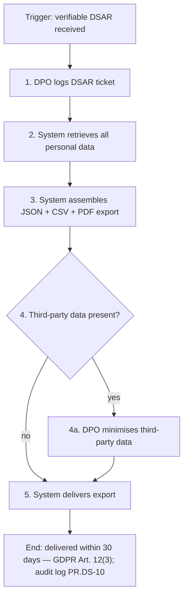

## PROC-05 — Incident Notification (24h ENISA, 72h GDPR)

| Field | Content |
|---|---|
| Trigger | Confirmed security incident (active exploit, data breach, or critical CVE with exploit). |
| Activities | 1. Severity matrix applied; incident classified. 2. ENISA notification prepared; submitted ≤24h when CRA-relevant (active-exploit CVE). 3. CNPD notification prepared; submitted ≤72h when personal-data breach. 4. Breach register entry ≤24h post-detection. 5. Quarterly tabletop exercise keeps the procedure rehearsed. |
| Roles | A-OPS-01 / A-DPO-01 prepare and submit; CTO informed; Auditor consumes evidence. |
| SLA / Timing | 24h (ENISA/CRA) · 72h (GDPR/CNPD) · register ≤24h post-detection. |
| Realises | CR-D-04.3-001 / SO-D-04.3-001. |
| Anchors | SAMM: IR-B (incident response stream B) · ASVS: V7 (error & logging). |
| Evidence | Submitted notifications; breach register entries; tabletop reports (NFR-17 cadence). |

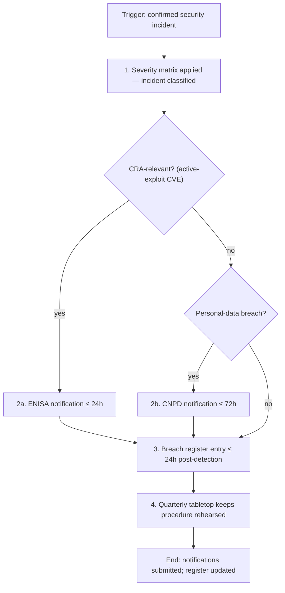

## PROC-09 — Pre-Launch Risk Assessment

| Field | Content |
|---|---|
| Trigger | Feature with personal data or new attack surface enters the release train. |
| Activities | 1. DPIA + cybersecurity risk assessment completed. 2. Risk register entry per high-risk finding. 3. DPO + Risk Owner sign-off before deploy. |
| Roles | A-RO-01 (Risk Owner) + A-DPO-01 sign off; CEO/Compliance Manager informed. |
| SLA / Timing | Gate completes before deploy (per release train). |
| Realises | CR-D-09.2-001 / PO-D-09.2-001. |
| Anchors | SAMM: D-TA-B (threat modelling) · ASVS: V1.1 (secure SDLC). |
| Evidence | Signed risk assessments; risk register entries; launch approvals. |

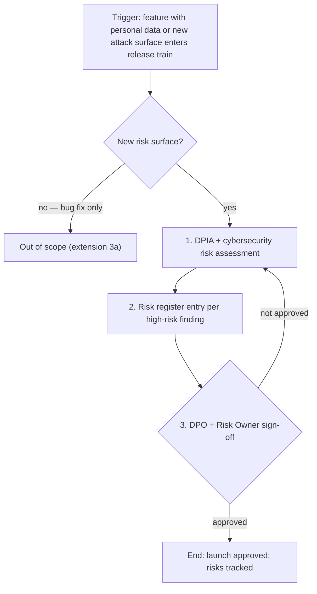

## CAP-01 — DPAs Binding Processors

| Field | Content |
|---|---|
| Owner | A-DPO-01 (DPO) with A-CTO-01 for technical processor assessment. |
| Span | Standing contract-management ability: DPA execution and annual review across all active processors; annual review cycle; GDPR Art. 28 clause library maintained. Contributes PROCs: none in the pilot set (processor due-diligence workflow = PROC-14 in Doc20, full card campaign future). |
| Maturity | PLANNED (1) — Scale A posture model v1.6; current/target pending P1 Folio VIII refresh + EvidenceItem bind |
| Realises | CR-D-06.3-001 / SO-D-06.3-001. |
| Anchors | SAMM: G-SM-B (supplier security stream) · ISO 27002:2022 A.5.20 (last-resort reference). |
| Evidence | Signed DPAs on file; annual review records; Art. 28 clause checklist per processor. |
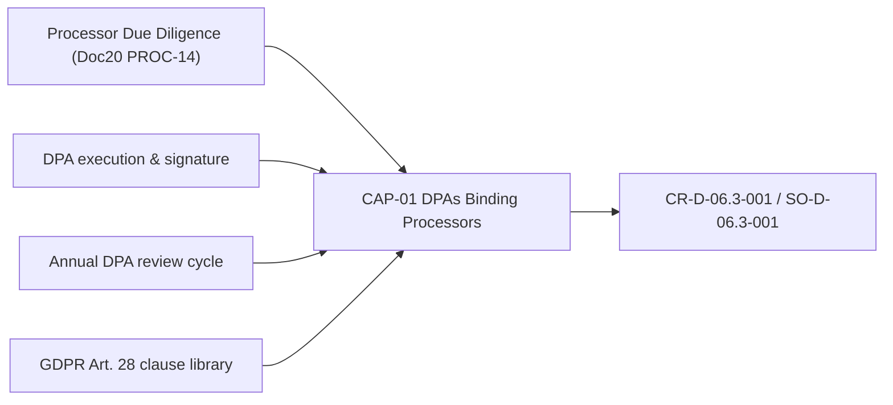

## PROC-02 — Data Subject Rectification

| Field | Content |
|---|---|
| Trigger | Customer requests correction of inaccurate personal data (identity verified; specific fields contested). |
| Activities | 1. DPO validates the request. 2. System applies the correction to primary store and propagates to backup (HMAC integrity re-computed) and analytics stores. 3. DPO notifies processors (AWS, Datadog) via DPA channel. 4. System logs the change. Extension: 2a correction conflicts with audit trail → preserve original + record correction. |
| Roles | A-DPO-01 (DPO) owns steps 1, 3; system executes steps 2, 4; Auditor consumes evidence. |
| SLA / Timing | All linked stores updated ≤30d; processors notified ≤7d. |
| Realises | CR-D-01.4-001 / PO-D-01.4-001. |
| Anchors | SAMM: O-OM-A (data protection, operational management) · ASVS: V8.1 (general data protection). |
| Evidence | Correction tickets; HMAC re-computation records; processor notifications; audit log entry. |

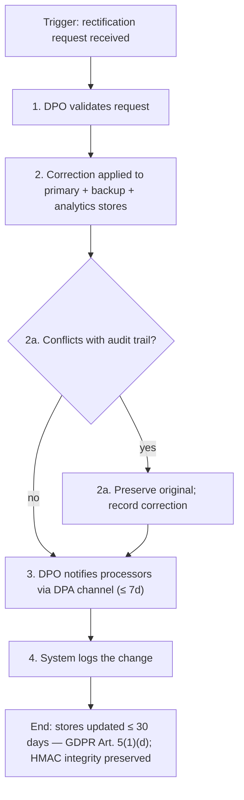

## PROC-03 — Vulnerability-Free Release

| Field | Content |
|---|---|
| Trigger | PR merged to release branch (release candidate built; SAST/SCA/container scans configured). |
| Activities | 1. CI runs SAST + SCA + container scan. 2. Findings prioritised by CVSS + EPSS. 3. Release blocked on critical findings; release proceeds if all clear. 4. Audit log entry per build. Extension: 3a critical CVE → emergency patch path (UC-05). |
| Roles | A-DEV-01 (Lead Developer) owns scan triage and release gating; A-CTO-01 informed; Auditor consumes evidence. |
| SLA / Timing | Per release: 0 critical findings at release; audit log per build. |
| Realises | CR-D-02.1-001 / SO-D-02.1-001. |
| Anchors | SAMM: I-SB-B (software dependencies, secure build) · ASVS: V14.2 (dependency). |
| Evidence | Scan reports; CVSS+EPSS prioritisation records; SBOM (UC-13); build audit log (PR.DS-01). |

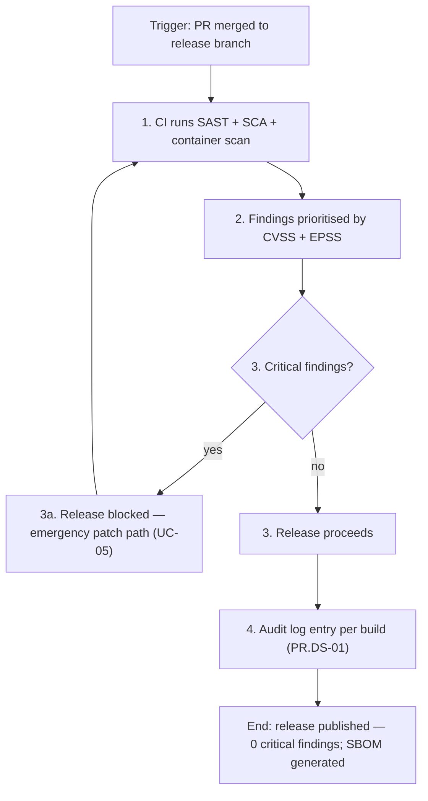

## PROC-04 — Coordinated Vulnerability Disclosure

| Field | Content |
|---|---|
| Trigger | External researcher submits a vulnerability report (security.txt published; dedicated mailbox configured). |
| Activities | 1. Triage: Lead Dev acknowledges report. 2. Reproduce: dev team validates and assigns severity. 3. Fix: develop + test patch. 4. Coordinate: agree disclosure timeline with researcher; publish CVE; release patch. Extension: 1a report out of scope → redirect politely. |
| Roles | A-DEV-01 (Lead Developer) owns triage and coordination; external researcher involved; A-CTO-01 informed. |
| SLA / Timing | Acknowledgement ≤72h; disclosure policy published; CVE assigned. |
| Realises | CR-D-02.3-001 / SO-D-02.3-001. |
| Anchors | SAMM: I-DM-A (defect tracking) · ASVS: no direct CVD section — closest V10.3 (application integrity). |
| Evidence | security.txt; acknowledgement timestamps; CVE records; published disclosures. |

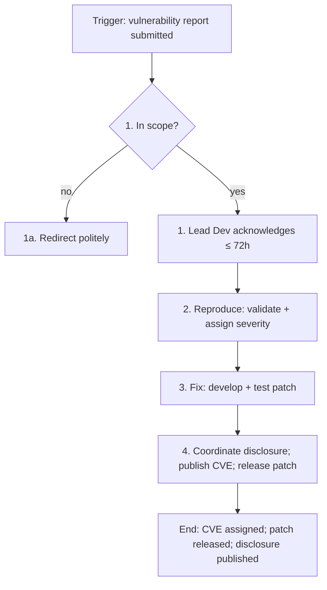

## PROC-06 — Processing & Breach Records

| Field | Content |
|---|---|
| Trigger | Processing change OR breach detection. |
| Activities | 1. RoPA updated on processing change. 2. Breach register entry on detection. 3. RoPA accessible to DPO + supervisory body on request. Extension: 3a anonymised processing → no RoPA needed. |
| Roles | A-DPO-01 (DPO) owns all steps; Auditor consumes evidence. |
| SLA / Timing | RoPA ≤7d of processing change; breach register ≤24h of detection. |
| Realises | CR-D-09.4-001 / PO-D-09.4-001. |
| Anchors | SAMM: G-PC-B (compliance management) · ASVS: V7.1 (log content). |
| Evidence | RoPA version history; breach register entries; supervisory-body access records. |

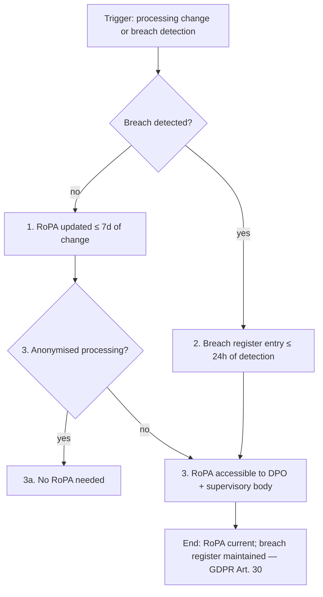

## PROC-07 — Control Effectiveness Testing

| Field | Content |
|---|---|
| Trigger | Annual pentest OR post-incident review (controls catalog current; pentest vendor contracted). |
| Activities | 1. Annual pentest executed; report published. 2. Critical findings remediated within SLA. 3. Controls catalog updated with test outcomes. Extension: 3a bug bounty — separate programme. |
| Roles | A-OPS-01 (Operations Lead) owns execution and catalog update; Lead Developer remediates; Auditor consumes report. |
| SLA / Timing | Pentest annually; 100% critical findings remediated within SLA. |
| Realises | CR-D-10.3-001 / SO-D-10.3-001. |
| Anchors | SAMM: V-RT-A (control verification, requirements-driven testing) · ASVS: V (verification chapters) — ASVS is itself the control-verification baseline. |
| Evidence | Pentest reports; remediation SLA records; updated controls catalog. |

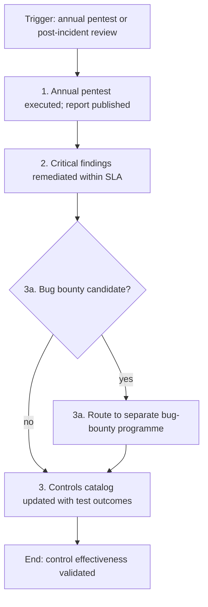

## PROC-08 — Security by Design (SSDLC)

| Field | Content |
|---|---|
| Trigger | New feature RFC created. |
| Activities | 1. Threat model attached to RFC. 2. Secure coding review checklist signed off pre-merge. 3. SSDLC metrics dashboard reviewed quarterly. Extension: 3a internal tooling → relaxed SSDLC. |
| Roles | A-DEV-01 (Lead Developer) owns threat model and review sign-off; A-CTO-01 oversees quarterly metrics. |
| SLA / Timing | Threat model per RFC; checklist pre-merge; quarterly metrics review. |
| Realises | CR-D-07.1-001 / PO-D-07.1-001. |
| Anchors | SAMM: D-TA-B (threat modeling) + D-SR-A (security requirements) · ASVS: V1.1 (secure SDLC). |
| Evidence | RFC threat models; signed review checklists; SSDLC metrics dashboard snapshots. |

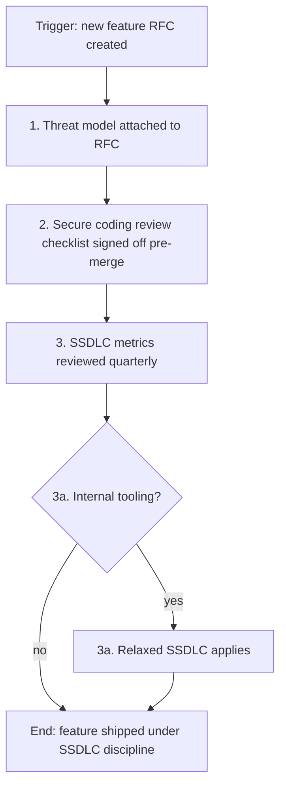

## PROC-10 — Annual Policy Review

| Field | Content |
|---|---|
| Trigger | Annual review cycle (policies exist). |
| Activities | 1. All policies reviewed. 2. Review minutes stored immutably. 3. Changes communicated to staff. Extension: 3a customer-facing terms — separate legal cycle. |
| Roles | A-DPO-01 / A-CTO-01 (Compliance Manager) own the review; CEO informed; staff acknowledge changes. |
| SLA / Timing | Annually; changes communicated to staff ≤7d. |
| Realises | CR-D-09.1-001 / PO-D-09.1-001. |
| Anchors | SAMM: G-PC-A (policy and standards) · ASVS: no policy-review section — governance anchor only. |
| Evidence | Review minutes (immutable store); staff communication records; policy version history. |

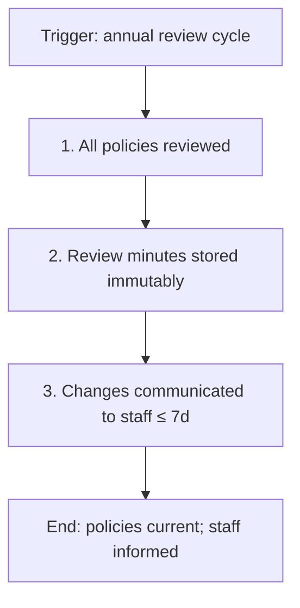

## PROC-11 — Technical Documentation Maintenance

| Field | Content |
|---|---|
| Trigger | Architecture change OR annual review (documentation baseline exists). |
| Activities | 1. Documentation updated on change. 2. CRA Annex I technical file kept current. 3. CTO annual review. Extension: 3a code-level inline docs — separate. |
| Roles | A-CTO-01 (CTO) owns documentation and the annual review; Compliance Manager + CEO informed. |
| SLA / Timing | Docs updated ≤30d of change; annual CTO review. |
| Realises | CR-D-09.1-001 / SO-D-09.1-001. |
| Anchors | SAMM: D-SA-B (technology management, secure architecture) · ASVS: no documentation-maintenance section — governance anchor only. |
| Evidence | Documentation change log; CRA Annex I technical file; annual CTO review record. |

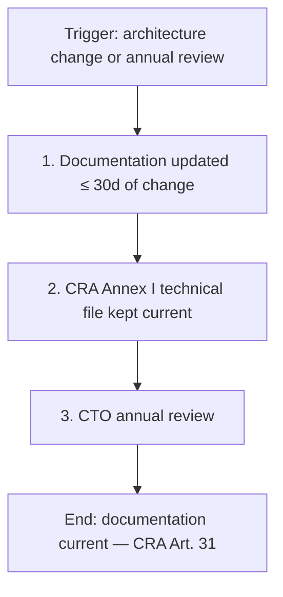

## PROC-12 — DPIA Pre-Launch

| Field | Content |
|---|---|
| Trigger | Feature triggering GDPR Art. 35 list (high-risk processing identified). |
| Activities | 1. DPIA completed pre-launch. 2. Risk Owner + DPO sign-off recorded. 3. Residual risk accepted by CEO where applicable. Extension: 3a low-risk routine processing — out of scope. |
| Roles | A-RO-01 (Risk Owner) + A-DPO-01 co-own; CEO accepts residual risk; Auditor consumes evidence. |
| SLA / Timing | DPIA completed and sign-offs recorded before launch. |
| Realises | CR-D-09.2-001 / PO-D-09.2-001. |
| Anchors | SAMM: D-TA-A (application risk profile) · ASVS: V1.8 (data protection and privacy architecture). |
| Evidence | DPIA documents; sign-off records; CEO residual-risk acceptances. |

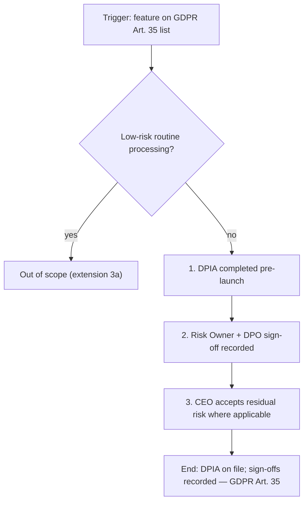

## PROC-13 — RoPA Maintenance

| Field | Content |
|---|---|
| Trigger | Processing change (processing activities ongoing). |
| Activities | 1. RoPA update. 2. Annual full review. 3. Accessible to supervisory body on request. Extension: 3a one-off ad-hoc processing — out of scope. |
| Roles | A-DPO-01 (DPO) owns maintenance; Auditor consumes evidence. |
| SLA / Timing | RoPA update ≤7d; annual full review. |
| Realises | CR-D-09.4-001 / PO-D-09.4-001. |
| Anchors | SAMM: G-PC-B (compliance management) · ASVS: no records-of-processing section — governance anchor only. |
| Evidence | RoPA version history; annual review records; supervisory-body access logs. |

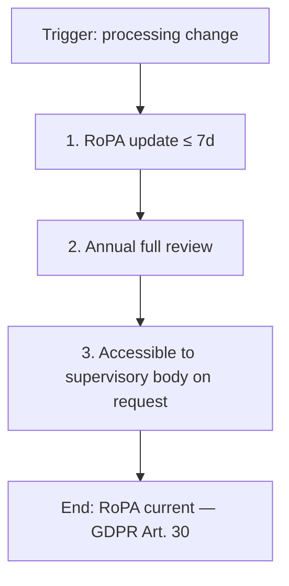

## PROC-14 — Processor Due Diligence

| Field | Content |
|---|---|
| Trigger | Pre-engagement review OR annual reassessment (prospective processor identified). |
| Activities | 1. Security questionnaire completed. 2. Annual vendor security assessment. 3. Findings tracked to remediation. Extension: 3a non-data processors (cleaning, etc.) — out of scope. |
| Roles | A-CTO-01 / A-DPO-01 (Procurement Lead) own assessment; Compliance Manager + CEO informed. |
| SLA / Timing | Questionnaire pre-engagement; assessment annually; findings remediated. |
| Realises | CR-D-06.1-001 / SO-D-06.1-001. |
| Anchors | SAMM: D-SR-B (supplier security) · ASVS: no vendor-due-diligence section — governance anchor only. |
| Evidence | Completed questionnaires; annual assessment reports; finding remediation records. |

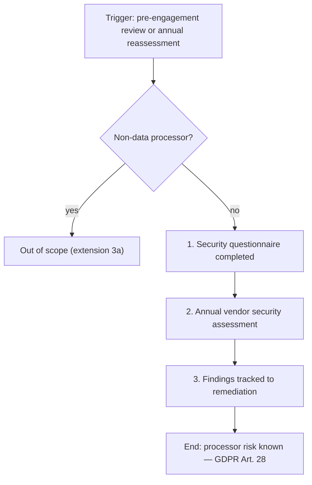

## PROC-15 — Annual Awareness Training

| Field | Content |
|---|---|
| Trigger | Annual cycle (LMS available). |
| Activities | 1. Staff enrolled in annual course. 2. Completion tracked; 100% target. 3. Quiz pass required. Extension: 3a long-term contractors — same requirement. |
| Roles | A-DPO-01 / A-CTO-01 (Compliance Manager) own the programme; all staff participate. |
| SLA / Timing | 100% completion (NFR-36), refreshed annually. |
| Realises | CR-D-08.1-001 / SO-D-08.1-001. |
| Anchors | SAMM: G-EG-A (training and awareness) · ASVS: no training section — SAMM anchor only. |
| Evidence | LMS completion records; quiz results; contractor coverage records. |

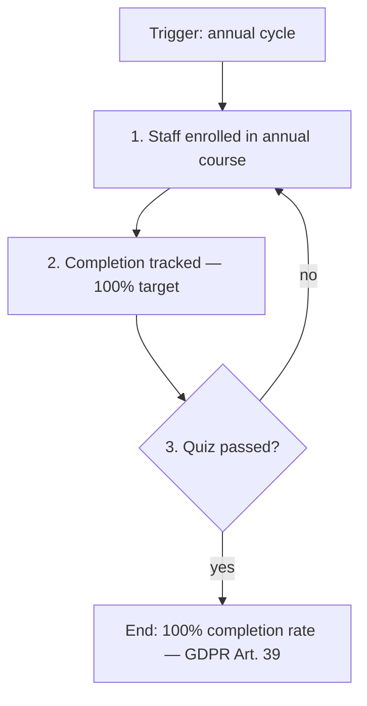

## PROC-16 — Role-Specific Training

| Field | Content |
|---|---|
| Trigger | New role or annual cycle (role taxonomy documented). |
| Activities | 1. Role curricula per role. 2. Completion tracked per role. 3. Updated annually. Extension: 2a general awareness — covered in PROC-15. |
| Roles | A-DPO-01 / A-CTO-01 (Compliance Manager) own curricula; engineers, ops, DPO, IAM admin participate. |
| SLA / Timing | Curricula tracked per role; updated annually. |
| Realises | CR-D-08.2-001 / SO-D-08.2-001. |
| Anchors | SAMM: G-EG-B (organization and culture, education and guidance) · ASVS: no training section — SAMM anchor only. |
| Evidence | Curricula per role; per-role completion records; annual update history. |

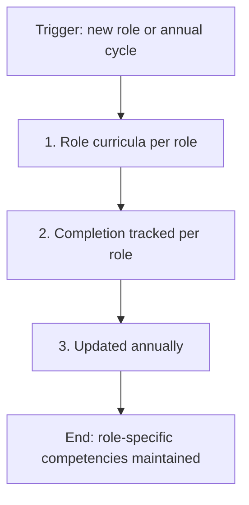

## PROC-17 — Phishing Simulation

| Field | Content |
|---|---|
| Trigger | Quarterly (phishing simulation vendor contracted). |
| Activities | 1. Simulation campaign launched. 2. Click rate tracked + reported. 3. Re-education for repeat clickers. Extension: 3a external addresses — out of scope. |
| Roles | A-DPO-01 / A-CTO-01 (Compliance Manager) own campaigns; all staff with email participate. |
| SLA / Timing | Quarterly execution; click-rate trend reported each cycle. |
| Realises | CR-D-08.1-001 / SO-D-08.1-001. |
| Anchors | SAMM: G-EG-A (training and awareness) · ASVS: no phishing-simulation section — SAMM anchor only. |
| Evidence | Campaign reports; click-rate trends; re-education records. |

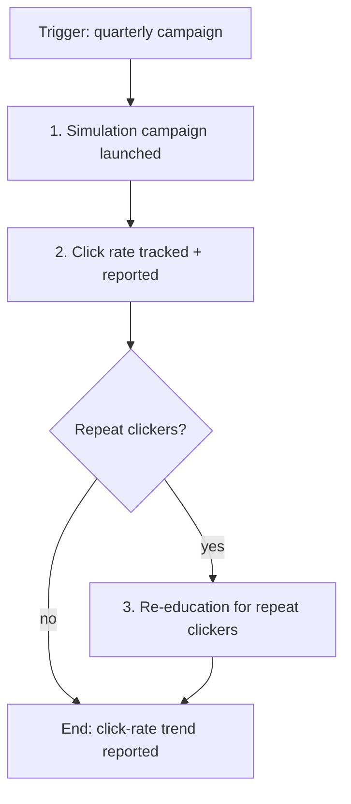


## PROC-18 — DoS Resilience

> Formerly UC-07 — re-laned per rubric v1.8 §5B rule 6 (LEDGER-ZERO F3, P7 decision 2026-09-06).

| Field | Content |
|---|---|
| Trigger | Application-layer DoS signature detected. |
| Activities | 1. Apply rate-limit + CAPTCHA challenge to the offending source. 2. Engage upstream scrubbing for sustained attacks; volumetric DDoS at the edge escalates to the cloud provider SLA. 3. Restore service, preserve RTO/RPO targets, file post-mortem. |
| Roles | Operations Lead (owner); cloud provider (edge volumetric SLA). |
| SLA / Timing | Recovery < 24 h; availability ≥ 99.9 % monthly; chaos DoS test quarterly. |
| Realises | CR-D-04.2-001 / SO-D-04.2-001. |
| Anchors | NIST CSF: DE.CM-09, PR.DS-10, PR.IR-03 · PF: CT.DM-P10, PR.PO-P7. |
| Evidence | Chaos DoS test reports; availability dashboards; published runbook; post-mortems. |

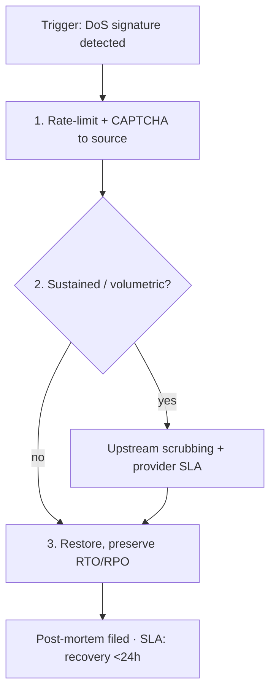

## PROC-19 — Authorisation / Least Privilege

> Formerly UC-11 — re-laned per rubric v1.8 §5B rule 6 (LEDGER-ZERO F3, P7 decision 2026-09-06).

| Field | Content |
|---|---|
| Trigger | Quarterly access review OR new role request. |
| Activities | 1. Document the RBAC matrix against the role taxonomy. 2. Diff privileges against the previous quarter; flag privilege creep. 3. Deprovision access within 24 h of termination. |
| Roles | CTO (role taxonomy owner); all staff (subjects); Auditor (review). |
| SLA / Timing | Review quarterly; deprovisioning ≤ 24 h. |
| Realises | CR-D-03.3-001 / SO-D-03.3-001. |
| Anchors | NIST CSF: ID.AM-01, PR.AA-01, PR.AA-03 · PF: CT.PO-P1. |
| Evidence | RBAC matrix versions; quarterly review records; deprovisioning tickets. |

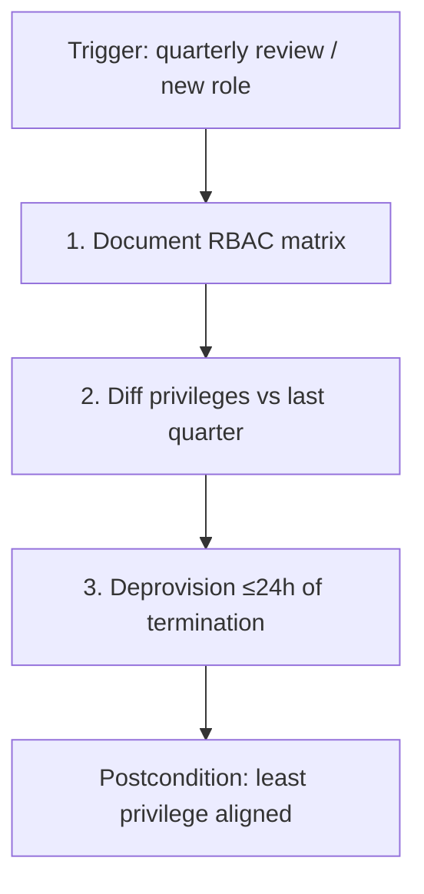

## PROC-20 — Secure System Defaults

> Formerly UC-12 — re-laned per rubric v1.8 §5B rule 6 (LEDGER-ZERO F3, P7 decision 2026-09-06).

| Field | Content |
|---|---|
| Trigger | New service deployed OR quarterly CIS review. |
| Activities | 1. Run the CIS benchmark scan (target ≥ 95 % pass rate). 2. Document deviations, time-bound them, obtain security sign-off. 3. Re-evaluate the hardened baseline on every new service (dev environments → relaxed baseline). |
| Roles | Operations Lead (owner); Lead Developer (service owners). |
| SLA / Timing | CIS compliance ≥ 95 % quarterly; deviations time-bound. |
| Realises | CR-D-03.4-001 / SO-D-03.4-001. |
| Anchors | NIST CSF: GV.PO-01, GV.SC-03, PR.DS-10 · PF: CT.DP-P4, CT.PO-P4. |
| Evidence | CIS scan reports; deviation register; security sign-offs. |

```mermaid
flowchart TD
    T["Trigger: new service / CIS review"] --> A1["1. CIS scan ≥95% pass"]
    A1 --> A2{"2. Deviations?"}
    A2 -->|"yes"| A3["Document + time-bound + sign-off"]
    A2 -->|"no"| A4["3. Baseline re-evaluated"]
    A3 --> A4
    A4 --> E["Postcondition: hardened defaults"]
```

## PROC-21 — Fail-Safe Design

> Formerly UC-16 — re-laned per rubric v1.8 §5B rule 6 (LEDGER-ZERO F3, P7 decision 2026-09-06).

| Field | Content |
|---|---|
| Trigger | Architecture review OR incident post-mortem. |
| Activities | 1. Include the fail-safe checklist in every architecture review. 2. Inject failures quarterly via chaos testing. 3. Track fail-open incidents (target: 0 in the last 12 months); UI-level graceful degradation remains user-visible. |
| Roles | CTO (architecture owner); Lead Developer. |
| SLA / Timing | Chaos test quarterly; 0 fail-open incidents / 12 months. |
| Realises | CR-D-04.1-001 / SO-D-04.1-001. |
| Anchors | NIST CSF: DE.AE-02, DE.CM-01, DE.CM-09 · PF: CM.AW-P7. |
| Evidence | Architecture review checklists; chaos test reports; incident records. |

```mermaid
flowchart TD
    T["Trigger: arch review / post-mortem"] --> A1["1. Fail-safe checklist applied"]
    A1 --> A2["2. Quarterly chaos test"]
    A2 --> A3{"Fail-open?"}
    A3 -->|"yes"| A4["Incident + redesign"]
    A3 -->|"no"| E["0 fail-open / 12 months"]
    A4 --> A2
```

## Articulation with existing artefacts

Per-card binding to the catalogue and the downstream documents. 'Formerly' preserves the pre-LANE-NAMING id (full registry: `00_METHODOLOGY/validation/LANE_NAMING_CENSUS_v0.md`). Ref counts are occurrences of the lane id in the P3 tree (excluding this doc). RENUMBER (2026-09-05, rubric v1.10 §5B rule 7): live UC references in the P3 tree now use flat `UC-01..UC-36` (registry `00_METHODOLOGY/validation/RENUMBER_REGISTRY_2026-09-05.md`); the 'Formerly' column and this table's PROC/CAP ids are unchanged.

| Card | Formerly | Catalogue anchor | Downstream refs (doc: count) |
|---|---|---|---|
| PROC-01 | U.C.1.1.1 | Doc20 §3.0 Compliance Domain Index (PKG-DP) | RULE_FREEZE.md:1, CORPUS_LINKAGE.md:1, Doc21_Use_Case_Relationships.md:2, NIST_ANCHORS.md:1, Doc26_Functional_Tree.md:1, Doc20_Use_Cases_Catalog.md:11, Doc22_Use_Case_Variability.md:2, Doc23_Architectural_Nodes.md:2, Doc27_Risk_Analysis.md:6, Doc24_Requirements_Allocation.md:4, VALIDATOR_SPRINT6.md:1, Doc30_NFR_Review_Report.md:1, Doc28_FR_Review_Report.md:1, Doc31_Non_Functional_Requirements.md:3, Doc29_Functional_Requirements.md:2, A_Use_Case_Diagrams.md:3, build_traceability_matrix_rich.py:3 |
| CAP-01 | U.C.5.5.1 | Doc20 §3.0 Compliance Domain Index (PKG-GOV) | CORPUS_LINKAGE.md:1, Doc21_Use_Case_Relationships.md:2, NIST_ANCHORS.md:1, Doc26_Functional_Tree.md:1, Doc20_Use_Cases_Catalog.md:14, Doc23_Architectural_Nodes.md:4, Doc27_Risk_Analysis.md:3, Doc24_Requirements_Allocation.md:2, Doc30_NFR_Review_Report.md:1, Doc31_Non_Functional_Requirements.md:1, Doc29_Functional_Requirements.md:2, A_Use_Case_Diagrams.md:3, build_traceability_matrix_rich.py:4 |
| PROC-02 | U.C.1.1.2 | Doc20 §3.0 Compliance Domain Index (PKG-DP) | CORPUS_LINKAGE.md:1, Doc21_Use_Case_Relationships.md:1, NIST_ANCHORS.md:1, Doc26_Functional_Tree.md:1, Doc20_Use_Cases_Catalog.md:4, Doc23_Architectural_Nodes.md:2, Doc24_Requirements_Allocation.md:2, SPRINT5_REPORT.md:1, Doc31_Non_Functional_Requirements.md:2, build_traceability_matrix_rich.py:2 |
| PROC-03 | U.C.2.1.1 | Doc20 §3.0 Compliance Domain Index (PKG-SEC) | CORPUS_LINKAGE.md:1, Doc21_Use_Case_Relationships.md:4, NIST_ANCHORS.md:1, Doc26_Functional_Tree.md:1, Doc20_Use_Cases_Catalog.md:8, Doc22_Use_Case_Variability.md:2, Doc23_Architectural_Nodes.md:5, Doc27_Risk_Analysis.md:6, Doc24_Requirements_Allocation.md:2, Doc28_FR_Review_Report.md:1, Doc31_Non_Functional_Requirements.md:2, Doc29_Functional_Requirements.md:4, A_Use_Case_Diagrams.md:1, build_traceability_matrix_rich.py:5 |
| PROC-04 | U.C.2.3.1 | Doc20 §3.0 Compliance Domain Index (PKG-SEC) | CORPUS_LINKAGE.md:1, Doc21_Use_Case_Relationships.md:4, NIST_ANCHORS.md:1, Doc26_Functional_Tree.md:1, Doc20_Use_Cases_Catalog.md:5, Doc23_Architectural_Nodes.md:2, Doc27_Risk_Analysis.md:5, Doc24_Requirements_Allocation.md:2, Doc31_Non_Functional_Requirements.md:1, Doc29_Functional_Requirements.md:2, build_traceability_matrix_rich.py:3 |
| PROC-05 | U.C.2.5.1 | Doc20 §3.0 Compliance Domain Index (PKG-SEC) | CORPUS_LINKAGE.md:1, Doc21_Use_Case_Relationships.md:4, NIST_ANCHORS.md:1, Doc26_Functional_Tree.md:1, Doc20_Use_Cases_Catalog.md:7, Doc22_Use_Case_Variability.md:2, Doc23_Architectural_Nodes.md:12, Doc27_Risk_Analysis.md:9, RICH_VS_LEGACY.md:1, Doc24_Requirements_Allocation.md:4, Doc31_Non_Functional_Requirements.md:9, Doc29_Functional_Requirements.md:2, build_traceability_matrix_rich.py:3 |
| PROC-06 | U.C.3.4.1 | Doc20 §3.0 Compliance Domain Index (PKG-IAM) | CORPUS_LINKAGE.md:1, Doc21_Use_Case_Relationships.md:1, NIST_ANCHORS.md:1, Doc26_Functional_Tree.md:1, Doc20_Use_Cases_Catalog.md:5, Doc29_Functional_Requirements.md:2, A_Use_Case_Diagrams.md:1, build_traceability_matrix_rich.py:3 |
| PROC-07 | U.C.3.6.1 | Doc20 §3.0 Compliance Domain Index (PKG-IAM) | CORPUS_LINKAGE.md:1, Doc21_Use_Case_Relationships.md:2, NIST_ANCHORS.md:1, Doc26_Functional_Tree.md:1, Doc20_Use_Cases_Catalog.md:7, Doc23_Architectural_Nodes.md:4, Doc24_Requirements_Allocation.md:2, Doc29_Functional_Requirements.md:2, build_traceability_matrix_rich.py:3 |
| PROC-08 | U.C.4.1.1 | Doc20 §3.0 Compliance Domain Index (PKG-DEV) | CORPUS_LINKAGE.md:1, Doc21_Use_Case_Relationships.md:2, NIST_ANCHORS.md:1, Doc26_Functional_Tree.md:1, Doc20_Use_Cases_Catalog.md:5, Doc23_Architectural_Nodes.md:8, Doc27_Risk_Analysis.md:8, Doc24_Requirements_Allocation.md:2, Doc31_Non_Functional_Requirements.md:3, Doc29_Functional_Requirements.md:2, A_Use_Case_Diagrams.md:1, build_traceability_matrix_rich.py:3 |
| PROC-09 | U.C.4.5.1 | Doc20 §3.0 Compliance Domain Index (PKG-DEV) | CORPUS_LINKAGE.md:1, Phase_3_Functional_Decomposition_Synthesis.md:1, Doc21_Use_Case_Relationships.md:3, NIST_ANCHORS.md:1, Doc26_Functional_Tree.md:1, Doc20_Use_Cases_Catalog.md:6, Doc22_Use_Case_Variability.md:2, Doc23_Architectural_Nodes.md:4, Doc27_Risk_Analysis.md:2, Doc24_Requirements_Allocation.md:2, Doc31_Non_Functional_Requirements.md:2, Doc29_Functional_Requirements.md:2, build_traceability_matrix_rich.py:3 |
| PROC-10 | U.C.5.1.1 | Doc20 §3.0 Compliance Domain Index (PKG-GOV) | CORPUS_LINKAGE.md:1, Doc21_Use_Case_Relationships.md:2, NIST_ANCHORS.md:1, Doc26_Functional_Tree.md:1, Doc20_Use_Cases_Catalog.md:5, Doc23_Architectural_Nodes.md:6, Doc24_Requirements_Allocation.md:2, Doc29_Functional_Requirements.md:2, A_Use_Case_Diagrams.md:1, build_traceability_matrix_rich.py:3 |
| PROC-11 | U.C.5.1.2 | Doc20 §3.0 Compliance Domain Index (PKG-GOV) | CORPUS_LINKAGE.md:1, Doc21_Use_Case_Relationships.md:3, NIST_ANCHORS.md:1, Doc26_Functional_Tree.md:1, Doc20_Use_Cases_Catalog.md:7, Doc23_Architectural_Nodes.md:2, Doc24_Requirements_Allocation.md:2, VALIDATOR_SPRINT6.md:1, build_traceability_matrix_rich.py:3 |
| PROC-12 | U.C.5.2.1 | Doc20 §3.0 Compliance Domain Index (PKG-GOV) | RULE_FREEZE.md:2, CORPUS_LINKAGE.md:1, Phase_3_Functional_Decomposition_Synthesis.md:1, Doc21_Use_Case_Relationships.md:3, NIST_ANCHORS.md:1, Doc26_Functional_Tree.md:1, Doc20_Use_Cases_Catalog.md:6, Doc23_Architectural_Nodes.md:4, Doc27_Risk_Analysis.md:5, RICH_VS_LEGACY.md:1, Doc24_Requirements_Allocation.md:2, Doc31_Non_Functional_Requirements.md:2, Doc29_Functional_Requirements.md:2, build_traceability_matrix_rich.py:3 |
| PROC-13 | U.C.5.3.1 | Doc20 §3.0 Compliance Domain Index (PKG-GOV) | CORPUS_LINKAGE.md:1, Doc21_Use_Case_Relationships.md:2, NIST_ANCHORS.md:1, Doc26_Functional_Tree.md:1, Doc20_Use_Cases_Catalog.md:5, Doc23_Architectural_Nodes.md:8, Doc27_Risk_Analysis.md:5, Doc24_Requirements_Allocation.md:2, Doc31_Non_Functional_Requirements.md:4, Doc29_Functional_Requirements.md:2, build_traceability_matrix_rich.py:3 |
| PROC-14 | U.C.5.4.1 | Doc20 §3.0 Compliance Domain Index (PKG-GOV) | CORPUS_LINKAGE.md:1, Doc21_Use_Case_Relationships.md:3, NIST_ANCHORS.md:1, Doc26_Functional_Tree.md:1, Doc20_Use_Cases_Catalog.md:7, Doc22_Use_Case_Variability.md:1, Doc23_Architectural_Nodes.md:4, Doc27_Risk_Analysis.md:5, Doc24_Requirements_Allocation.md:2, Doc31_Non_Functional_Requirements.md:6, Doc29_Functional_Requirements.md:2, build_traceability_matrix_rich.py:4 |
| PROC-15 | U.C.6.1.1 | Doc20 §3.0 Compliance Domain Index (PKG-TRN) | CORPUS_LINKAGE.md:1, Doc21_Use_Case_Relationships.md:2, NIST_ANCHORS.md:1, Doc26_Functional_Tree.md:1, Doc20_Use_Cases_Catalog.md:5, Doc22_Use_Case_Variability.md:1, Doc23_Architectural_Nodes.md:2, Doc27_Risk_Analysis.md:3, Doc24_Requirements_Allocation.md:2, Doc31_Non_Functional_Requirements.md:1, Doc29_Functional_Requirements.md:2, A_Use_Case_Diagrams.md:1, build_traceability_matrix_rich.py:3 |
| PROC-16 | U.C.6.2.1 | Doc20 §3.0 Compliance Domain Index (PKG-TRN) | CORPUS_LINKAGE.md:1, Doc21_Use_Case_Relationships.md:1, NIST_ANCHORS.md:1, Doc26_Functional_Tree.md:1, Doc20_Use_Cases_Catalog.md:3, Doc23_Architectural_Nodes.md:2, Doc27_Risk_Analysis.md:3, Doc24_Requirements_Allocation.md:2, Doc31_Non_Functional_Requirements.md:1, Doc29_Functional_Requirements.md:2, build_traceability_matrix_rich.py:3 |
| PROC-17 | U.C.6.3.1 | Doc20 §3.0 Compliance Domain Index (PKG-TRN) | RULE_FREEZE.md:1, CORPUS_LINKAGE.md:1, Doc21_Use_Case_Relationships.md:2, NIST_ANCHORS.md:1, Doc26_Functional_Tree.md:1, Doc20_Use_Cases_Catalog.md:4, Doc22_Use_Case_Variability.md:1, VALIDATOR_SPRINT6.md:1, SPRINT5_REPORT.md:1, Doc29_Functional_Requirements.md:2, build_traceability_matrix_rich.py:3 |
| PROC-18 | UC-07 | Doc20 §3.0 register (PKG-SEC) | whole-case refs: 17 |
| PROC-19 | UC-11 | Doc20 §3.0 register (PKG-IAM) | whole-case refs: 21 |
| PROC-20 | UC-12 | Doc20 §3.0 register (PKG-IAM) | whole-case refs: 18 |
| PROC-21 | UC-16 | Doc20 §3.0 register (PKG-DEV) | whole-case refs: 14 |

## Coverage

22/22 cards present (4 pilot + 14 added): PROC-01 DSAR · PROC-02 Data Subject Rectification · PROC-03 Vulnerability-Free Release · PROC-04 Coordinated Vulnerability Disclosure · PROC-05 Incident Notification · PROC-06 Processing & Breach Records · PROC-07 Control Effectiveness Testing · PROC-08 Security by Design · PROC-09 Pre-Launch Risk Assessment · PROC-10 Annual Policy Review · PROC-11 Technical Documentation Maintenance · PROC-12 DPIA Pre-Launch · PROC-13 RoPA Maintenance · PROC-14 Processor Due Diligence · PROC-15 Annual Awareness Training · PROC-16 Role-Specific Training · PROC-17 Phishing Simulation · CAP-01 DPAs Binding Processors.

