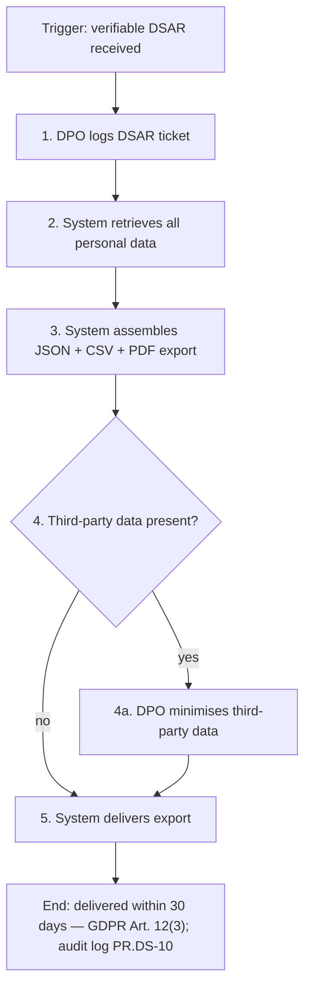
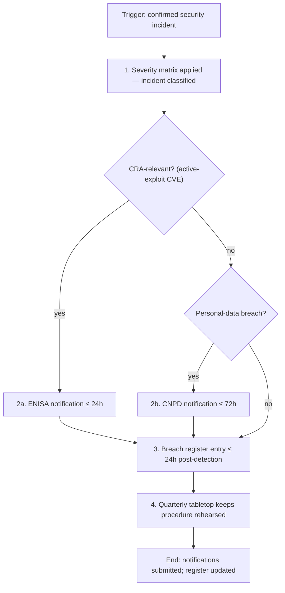
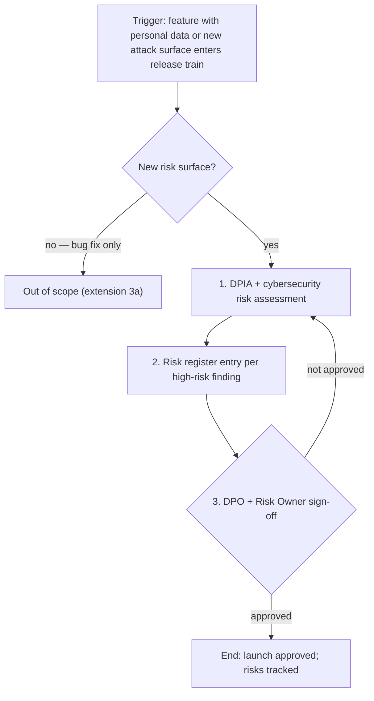
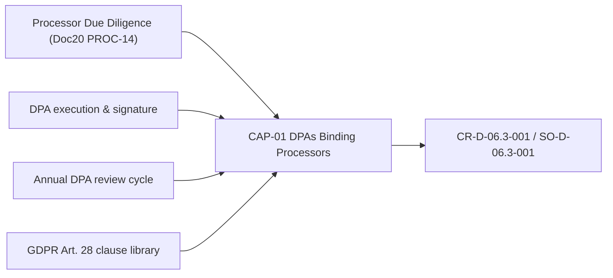

# Process & Capability Cards — Lane Pilot (Case_01)

> **Purpose.** Operational representation for the PROCESS and CAPABILITY lanes
> (rubric `00_METHODOLOGY/REALIZATION_CLASS_RUBRIC.md` v1.4 §5C). Process cards follow
> the NIST SP 800-218 (SSDF) practice/task shape; capability cards follow the C2M2 /
> ArchiMate capability semantics. Traceability chain: **RULE → CAP → PROC → UC**.
> These cards are companions to the catalogue cards in `Doc20_Use_Cases_Catalog.md`
> (same IDs) — they add the operational fields the UC format lacks; narrative stays
> in Doc20. Piloted set: 4 of 18 re-laned ids (registry: `LANE_NAMING_CENSUS_v0.md`).

## PROC-01 — Data Subject Access Request (DSAR)

| Field | Content |
|---|---|
| Trigger | Customer submits a verifiable DSAR via web form or email. |
| Activities | 1. DPO logs the DSAR ticket with subject identifier. 2. System retrieves all personal data linked to the subject identifier (profile, workspaces, tasks, comments, attachment metadata). 3. System assembles JSON + CSV + PDF export. 4. DPO reviews the package for third-party data minimisation. 5. System delivers the export to the data subject. |
| Roles | A-DPO-01 (DPO/Compliance Manager) owns steps 1 and 4; system executes steps 2, 3, 5. |
| SLA / Timing | Delivery within 30 days (GDPR Art. 12(3)). |
| Realises | CR-D-01.1-001 / PO-D-01.1-001. |
| Anchors | SAMM: G-PC-A (policy & compliance, stream A) · ASVS: V8 (data protection). |
| Evidence | Ticket records; delivery receipts; audit log entry (PR.DS-10); RoPA update where new categories surface. |

## PROC-05 — Incident Notification (24h ENISA, 72h GDPR)

| Field | Content |
|---|---|
| Trigger | Confirmed security incident (active exploit, data breach, or critical CVE with exploit). |
| Activities | 1. Severity matrix applied; incident classified. 2. ENISA notification prepared; submitted ≤24h when CRA-relevant (active-exploit CVE). 3. CNPD notification prepared; submitted ≤72h when personal-data breach. 4. Breach register entry ≤24h post-detection. 5. Quarterly tabletop exercise keeps the procedure rehearsed. |
| Roles | A-OPS-01 / A-DPO-01 prepare and submit; CTO informed; Auditor consumes evidence. |
| SLA / Timing | 24h (ENISA/CRA) · 72h (GDPR/CNPD) · register ≤24h post-detection. |
| Realises | CR-D-04.3-001 / SO-D-04.3-001. |
| Anchors | SAMM: IR-B (incident response stream B) · ASVS: V7 (error & logging). |
| Evidence | Submitted notifications; breach register entries; tabletop reports (NFR-17 cadence). |

## PROC-09 — Pre-Launch Risk Assessment

| Field | Content |
|---|---|
| Trigger | Feature with personal data or new attack surface enters the release train. |
| Activities | 1. DPIA + cybersecurity risk assessment completed. 2. Risk register entry per high-risk finding. 3. DPO + Risk Owner sign-off before deploy. |
| Roles | A-RO-01 (Risk Owner) + A-DPO-01 sign off; CEO/Compliance Manager informed. |
| SLA / Timing | Gate completes before deploy (per release train). |
| Realises | CR-D-09.2-001 / PO-D-09.2-001. |
| Anchors | SAMM: D-TA-B (threat modelling) · ASVS: V1.1 (secure SDLC). |
| Evidence | Signed risk assessments; risk register entries; launch approvals. |

## CAP-01 — DPAs Binding Processors

| Field | Content |
|---|---|
| Owner | A-DPO-01 (DPO) with A-CTO-01 for technical processor assessment. |
| Span | Standing contract-management ability: DPA execution and annual review across all active processors; annual review cycle; GDPR Art. 28 clause library maintained. Contributes PROCs: none in the pilot set (processor due-diligence workflow = PROC-14 in Doc20, full card campaign future). |
| Maturity | Scale A (posture model v1.6, `capability` scale); current/target to be bound to EvidenceItems (P1 Folio VIII) in the next maturity refresh. |
| Realises | CR-D-06.3-001 / SO-D-06.3-001. |
| Anchors | SAMM: G-SM-B (supplier security stream) · ISO 27002:2022 A.5.20 (last-resort reference). |
| Evidence | Signed DPAs on file; annual review records; Art. 28 clause checklist per processor. |

