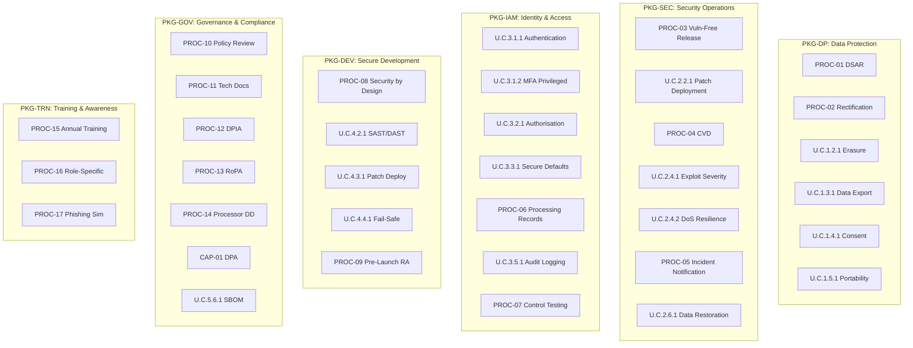
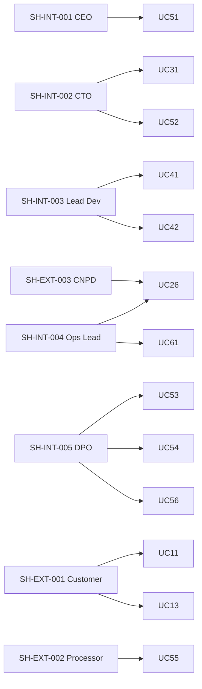

# Annex A — Use Case Diagrams (Phase 3 RICH)

> **RICH context:** All package diagrams link back to `RULE_FREEZE.md` (46 rules + 31 goals) and `KG_CHAINS.md` (12 inference chains). The 35 L1 UCs are the atomic decomposition target; 62 L1+L2 references preserved.

---

## §A.1 Package Diagram (Domain Organization)

---

## §A.2 Actor Diagram (Stakeholder → UC)

---

## §A.3 Cross-references

- `RULE_FREEZE.md` §5 — UC enumeration
- `KG_CHAINS.md` §1 — CH-09 (FR-29 → UC-25 → CR-D-04.3)
- `CORPUS_LINKAGE.md` §3 — UC-to-D-XX.Y
- `13_Use_Cases_Catalog.md` §3 — UC catalogue
- `13a_Use_Case_Relationships.md` §2-§3 — `«include»` / `«extend»`

---

## §A.4 Optional annexes (B, C)

`annexes/B_Sequence_Diagrams.md` and `annexes/C_Class_Diagrams.md` are NOT included in the Phase 3 RICH 15 placeholders. They remain available in legacy `03_PHASE3_DECOMPOSITION/annexes/` but are out of scope for the current RICH rebuild sprint. See `validation/SPRINT3_REPORT.md` §3 for the scope decision.

---

## §A.5 Schema addendum

This annex contains only Mermaid diagrams (no markdown index tables). The UC-family schema inherited from `13_Use_Cases_Catalog.md` §3 covers the 6-column Fase de Especificação 4 addition. The canonical UC card fields now include:

| Owner | Verification Criteria | Implementation Status | Priority | Stakeholders | Reporting |
|-------|-----------------------|----------|----------|--------------|-----------|

These 6 columns are present on every UC index table in `13_Use_Cases_Catalog.md` §3 (per package), and card-level values will be populated in Fase de Especificação 5.

---

**End of Annex A — Use Case Diagrams (Phase 3 RICH, ADJUSTED_FIELDS, Fase de Especificação 4)**
