# Annex A — Use Case Diagrams (Phase 3 RICH)

> **Render note:** use-case diagrams are native **PlantUML** — each diagram is a
> `plantuml` source block (source of truth, editable) plus a committed SVG
> (`svg/*.svg`, rendered via the PlantUML server) embedded as a markdown image, so it
> renders in GitHub / VS Code / `file://`. Reason: Mermaid has no `useCaseDiagram`
> type (mermaid-js/mermaid#4628; rubric v1.9 §5C.5). Mermaid remains in use for
> sequence diagrams and lane-card flowcharts.
>
> **Source of truth:** `../Doc20_Use_Cases_Catalog.md` — §1 actors, §2 functional packages (PKG-7…PKG-11, UC-14..UC-36), §3 security & compliance packages (PKG-DP/SEC/IAM/DEV/GOV, UC-01..UC-13 UCs; lane cards PROC-01..17 / CAP-01 live in `../Doc32_Process_Capability_Cards.md` and are NOT drawn here — UC ovals only, rubric v1.8 §5C.5). Ovals carry the card ID + title; actors are the real actor names from Doc20 §1. Diagrams are native PlantUML (see render note above); the former `useCaseDiagram` reference was `Case_02_SecureBorder_Solutions/03_PHASE3_DECOMPOSITION/Doc21_Use_Cases_Catalog.md` §5.1.
>
> **RENUMBER note (2026-09-05):** oval ids flattened to `UC-01..UC-36` (rubric v1.10 §5B rule 7; registry `00_METHODOLOGY/validation/RENUMBER_REGISTRY_2026-09-05.md`); PlantUML aliases kept as internal slugs; SVGs re-rendered, filenames unchanged.
>
> **Edge convention:** solid `-->` = actor association (Primary Actor / Stakeholders). Dashed `..>` = include/extend, drawn **only** where the card text explicitly invokes or extends another use case.

---

## §1 — System-wide

One oval per package; actors per Doc20 §1. Packages with UC-lane content only (PKG-7…11, PKG-DP/SEC/IAM/DEV/GOV). PKG-TRN Training & Awareness holds no UC cards (its three cards are PROC lane cards in Doc32) — omitted per the UC-ovals-only rule (§5C.5).

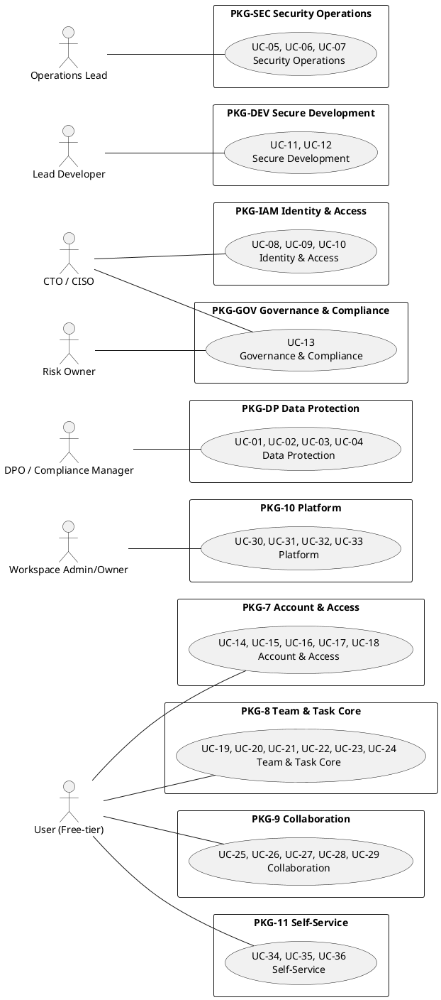

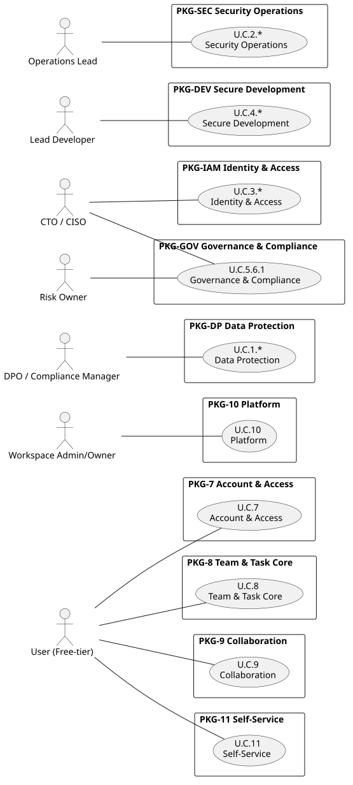

---

## §2 — PKG-7 Account & Access (UC-14, UC-15, UC-16, UC-17, UC-18)

Doc20 §2.1. Cross-package: quota/upgrade flows route to UC-31 (PKG-10).

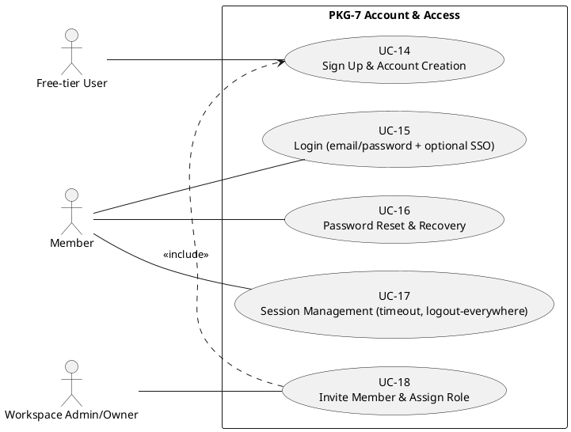

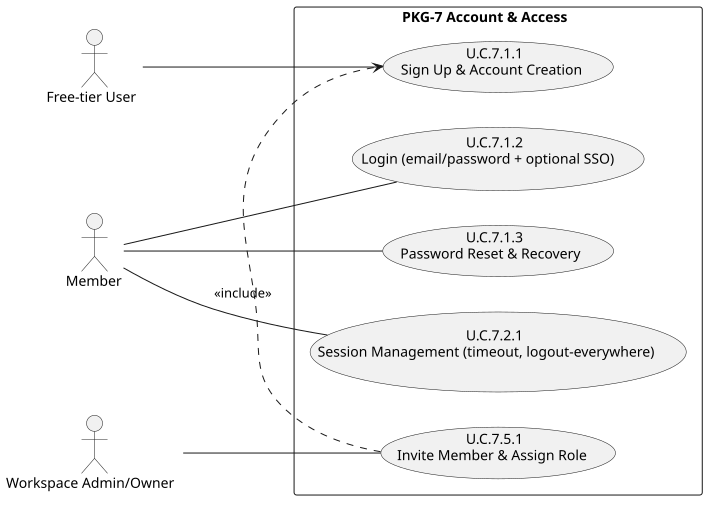

> UC-15/7.1.3/7.2.1 Primary Actor is "Member **or** Free-tier User" (Doc20 cards §2 Actor Brief Descriptions). `UC751 ..> UC711` = invite invokes sign-up for account-less invitees (card flow step 4 / subflow 6.1).

---

## §3 — PKG-8 Team & Task Core (UC-19, UC-20, UC-21, UC-22, UC-23, UC-24)

Doc20 §2.2. Cross-package: assignee notification via UC-26 (PKG-9); free-tier quota routes to UC-31 (PKG-10).

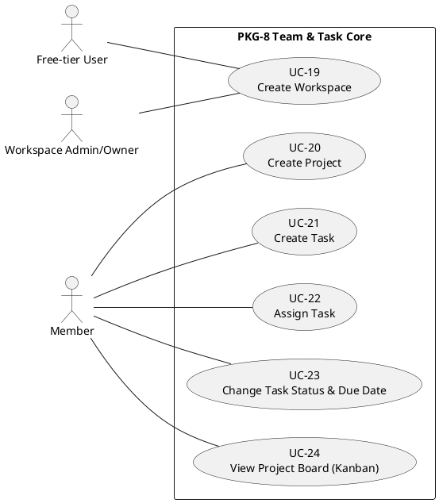

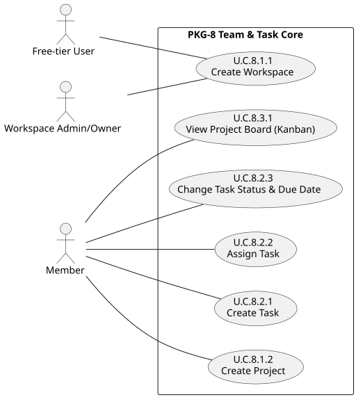

> UC-19 Primary Actor is "Free-tier User **or** Workspace Admin/Owner" (workspace creation on sign-up).

---

## §4 — PKG-9 Collaboration (UC-25, UC-26, UC-27, UC-28, UC-29)

Doc20 §2.3. Cross-package: malicious-attachment handling at UC-27 anchors MUC-08 fail-safe (UC-06, PKG-SEC).

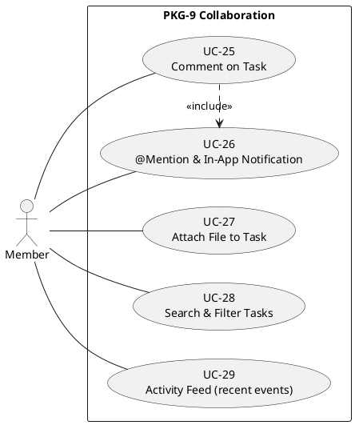

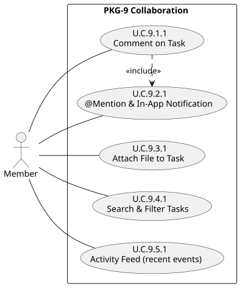

> `UC911 ..> UC921` = comment posts notify watchers via UC-26 (card flow step 4).

---

## §5 — PKG-10 Platform (UC-30, UC-31, UC-32, UC-33)

Doc20 §2.4. Cross-package: UC-33 Enterprise SSO is a "UC-15 extension" (PKG-7); UC-32 console invites via UC-18 (PKG-7).

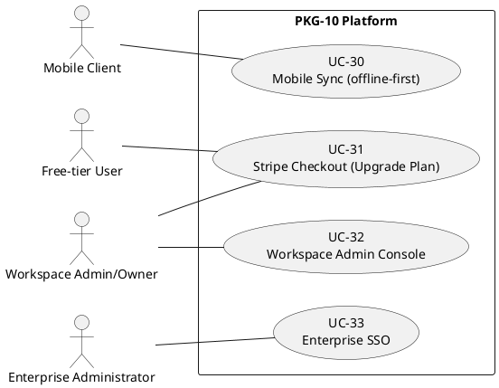

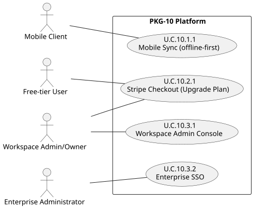

> UC-31 Primary Actor is "Free-tier User **or** Workspace Admin/Owner". A-EXT-01 (Stripe Checkout) is the external system actor inside UC-31's flow.

---

## §6 — PKG-11 Self-Service (UC-34, UC-35, UC-36)

Doc20 §2.5. Cross-package: UC-36 erasure cascades to UC-01 (PKG-DP); exports constrained by UC-02 / UC-10.

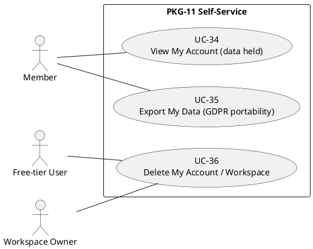

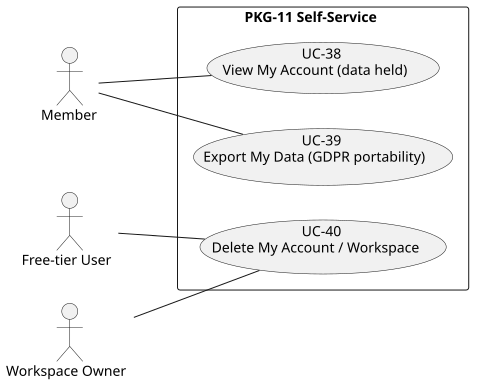

> UC-36 Primary Actor is "Free-tier User **or** Workspace Owner (for workspace deletion)".

---

## §7 — PKG-DP Data Protection (UC-01, UC-02, UC-03, UC-04)

Doc20 §3.1 (4 UC cards; the package's PROC-01..02 lane cards live in Doc32 and are not drawn — §5C.5). No explicit include/extend declared in card bodies.

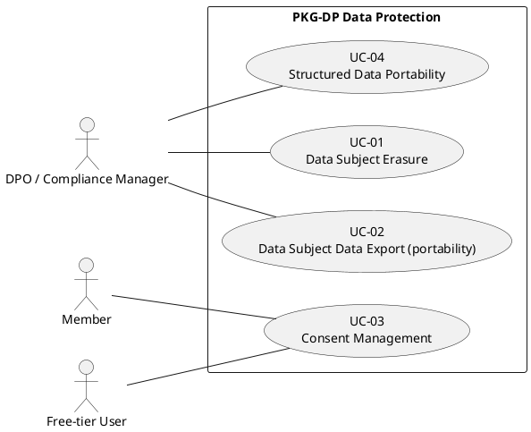

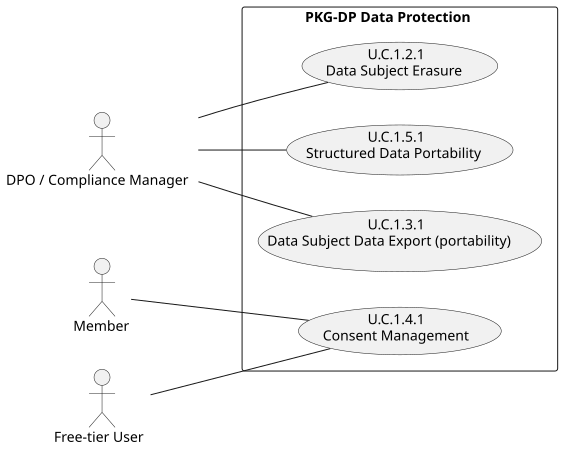

---

## §8 — PKG-SEC Security Operations (UC-05, UC-06, UC-07)

Doc20 §3.2 (3 UC cards; PROC-03..05 + PROC-18 lane cards in Doc32, not drawn — §5C.5; PROC-18 = formerly UC-07, LEDGER-ZERO F3). No explicit include/extend declared in card bodies.

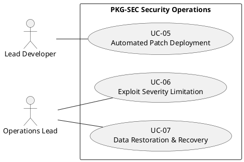

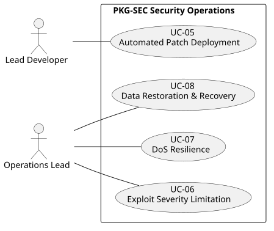

---

## §9 — PKG-IAM Identity & Access (UC-08, UC-09, UC-10)

Doc20 §3.3 (3 UC cards; PROC-06..07 + PROC-19/20 lane cards in Doc32, not drawn — §5C.5; PROC-19/20 = formerly UC-11/12, LEDGER-ZERO F3). No explicit include/extend declared in card bodies.

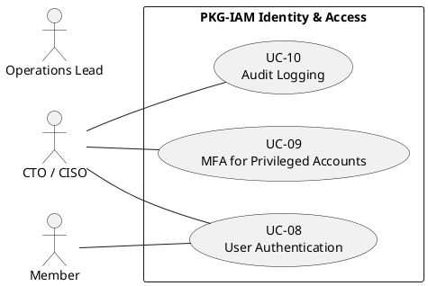

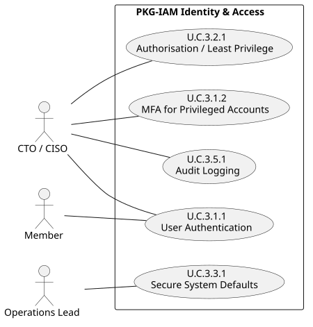

---

## §10 — PKG-DEV Secure Development (UC-11, UC-12)

Doc20 §3.4 (2 UC cards; PROC-08..09 + PROC-21 lane cards in Doc32, not drawn — §5C.5; PROC-21 = formerly UC-16, LEDGER-ZERO F3). No explicit include/extend declared in card bodies.

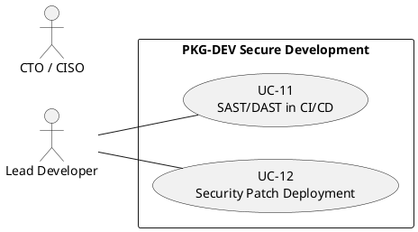

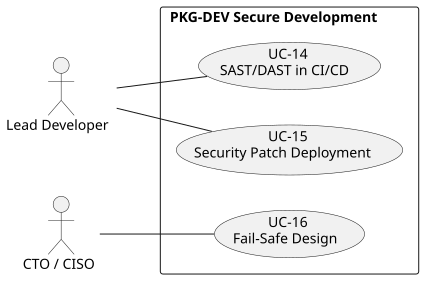

---

## §11 — PKG-GOV Governance & Compliance (UC-13)

Doc20 §3.5 (1 UC card; PROC-10..14 / CAP-01 lane cards in Doc32, not drawn — §5C.5). Substance note: the package's governance/compliance lane (policies, DPIA, RoPA, processor due diligence, DPAs) has no UC ovals here — see Doc32 flowcharts/graph. No explicit include/extend declared in card bodies.

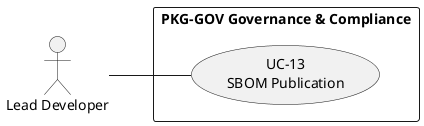

---

## §12 — PKG-TRN Training & Awareness (no UC cards)

PKG-TRN holds no UC-lane cards: its three cards (Annual Awareness Training, Role-Specific Training, Phishing Simulation) are PROCESS lane cards **PROC-15..17**, living in `../Doc32_Process_Capability_Cards.md` with their §5C.4 flowcharts. A use-case diagram would carry UC ovals only (rubric v1.8 §5C.5) — with zero UCs there is nothing to draw, so the former diagram is removed and this note stands in its place (the Doc20 §3.6 section was likewise folded into the §3.0 Compliance Domain Index).

---

## §13 — Cross-references

- `../Doc20_Use_Cases_Catalog.md` §1 — actor catalogue (A-FREE-01, A-MEMBER-01, A-WSADM-01, A-ENTADM-01, A-MOB-01, A-CEO-01, A-CTO-01, A-DEV-01, A-OPS-01, A-DPO-01, A-RO-01)
- `../Doc20_Use_Cases_Catalog.md` §2 — functional packages PKG-7..11 (23 UC-14..UC-36 cards, Cockburn fully-dressed)
- `../Doc20_Use_Cases_Catalog.md` §3 — security & compliance UC packages PKG-DP/SEC/IAM/DEV/GOV (17 UC-01..UC-13 cards) + §3.0 Compliance Domain Index → the 18 PROC/CAP lane cards in `../Doc32_Process_Capability_Cards.md`
- `../RULE_FREEZE.md` §5 — UC enumeration; `../KG_CHAINS.md` §1 — CH-09 (FR-29 → UC-21 → CR-D-04.3)
- Legacy Level 0/Level 1 `graph` diagrams (v0.4 of this annex) — preserved in git history
- Known-good syntax reference: `Case_02_SecureBorder_Solutions/03_PHASE3_DECOMPOSITION/Doc21_Use_Cases_Catalog.md` §5.1

---

**End of Annex A — Use Case Diagrams (Phase 3 RICH, v0.6, UC-ovals-only per rubric v1.8 §5C.5)**
