# Annex B — Sequence Diagrams

> Extracted from the catalogue cards per rubric v1.7 §5C.5 (sequence diagrams are annex-only). One section per product UC card.
> **Render note:** Mermaid ≥ v11 recommended.
> **RENUMBER note (2026-09-05):** section ids flattened to `UC-01..UC-36` (rubric v1.10 §5B rule 7); the 23 product sections map monotonically to UC-14..UC-36, so §1..§23 ordering and the Doc20 pointers are unchanged (registry `00_METHODOLOGY/validation/RENUMBER_REGISTRY_2026-09-05.md`).

## §1 — Use-Case — {UC-14} Sign Up & Account Creation

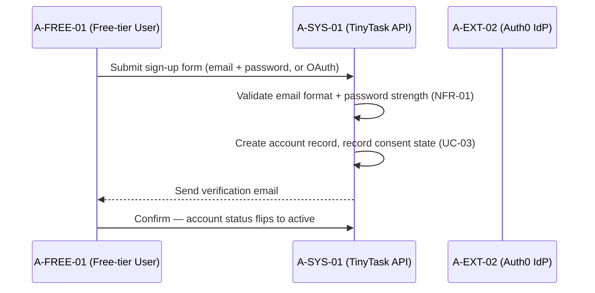

## §2 — Use-Case — {UC-15} Login (email/password + optional SSO)

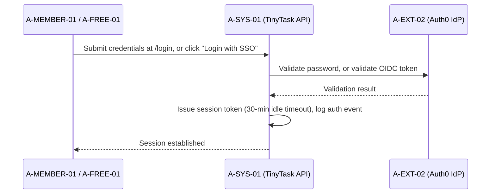

## §3 — Use-Case — {UC-16} Password Reset & Recovery

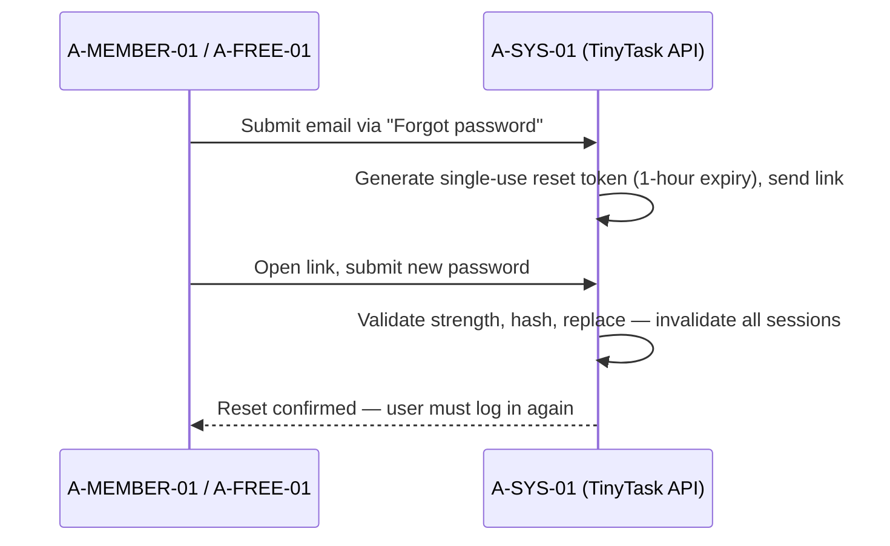

## §4 — Use-Case — {UC-17} Session Management (timeout, logout-everywhere)

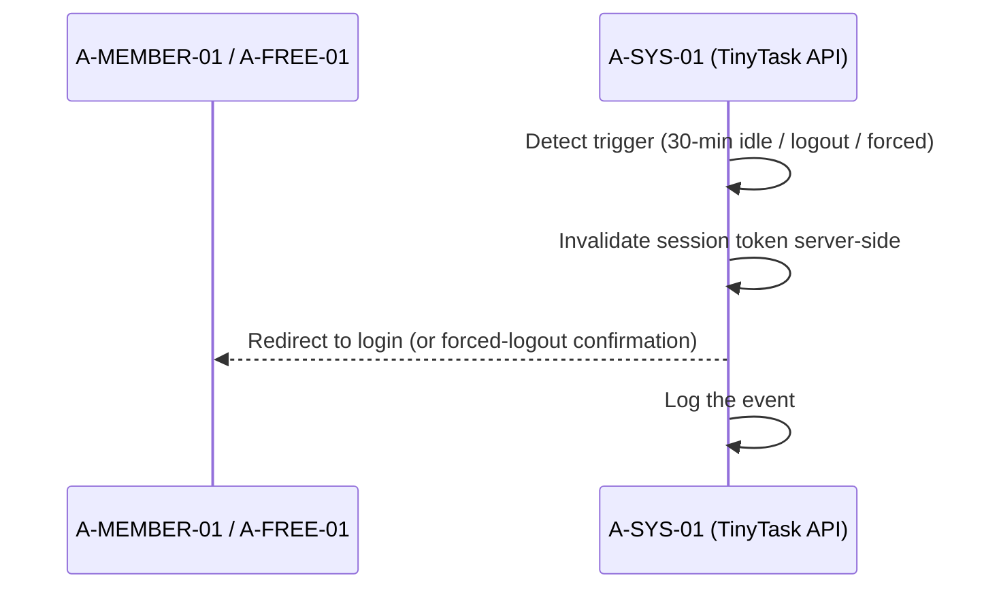

## §5 — Use-Case — {UC-18} Invite Member & Assign Role

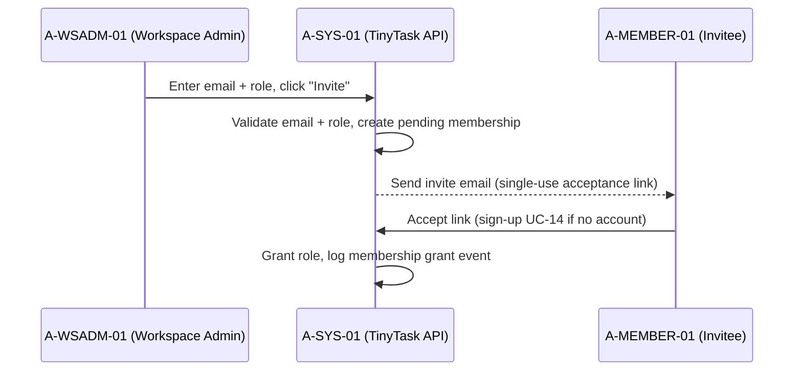

## §6 — Use-Case — {UC-19} Create Workspace

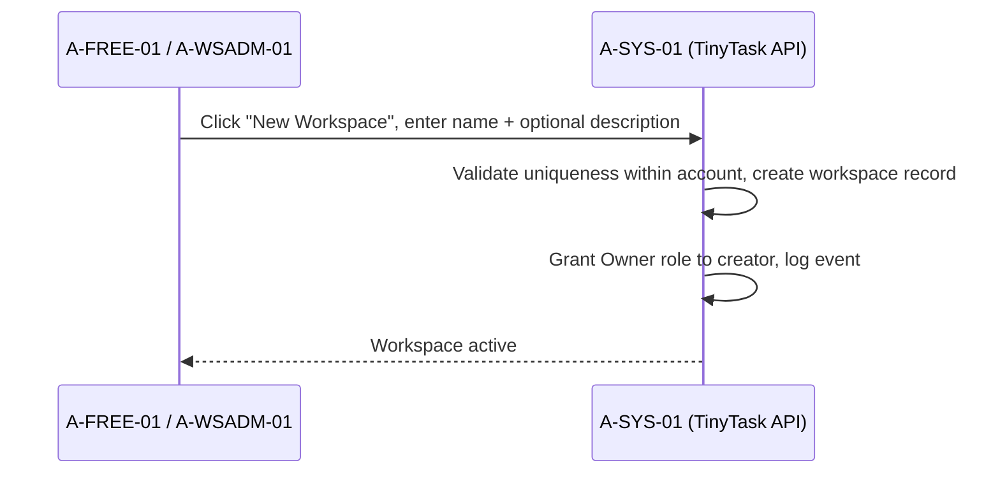

## §7 — Use-Case — {UC-20} Create Project

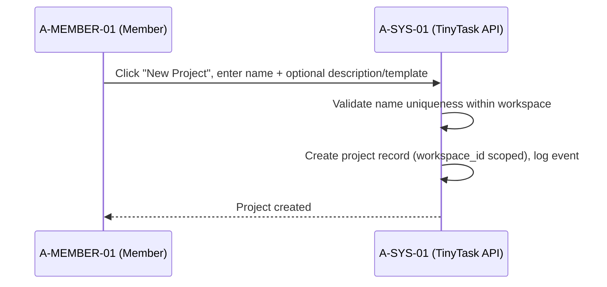

## §8 — Use-Case — {UC-21} Create Task

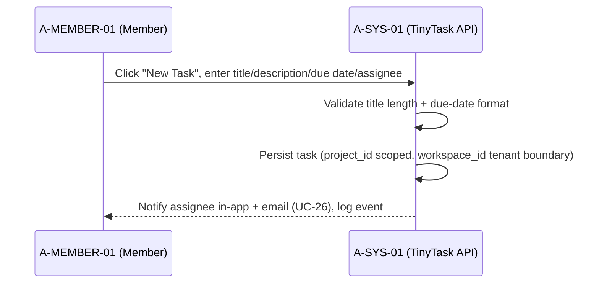

## §9 — Use-Case — {UC-22} Assign Task

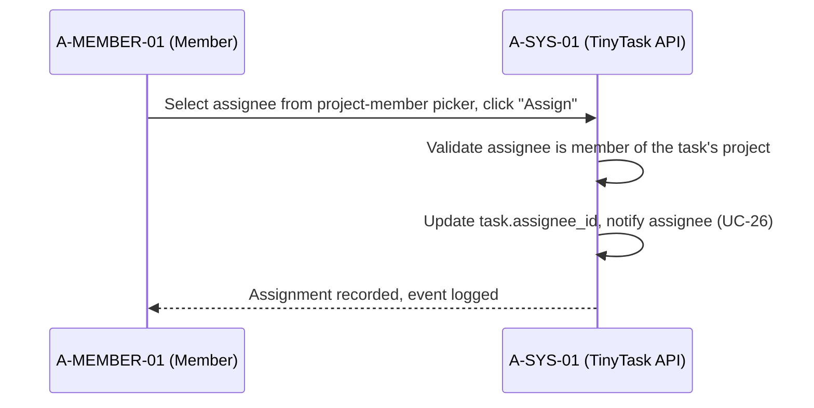

## §10 — Use-Case — {UC-23} Change Task Status & Due Date

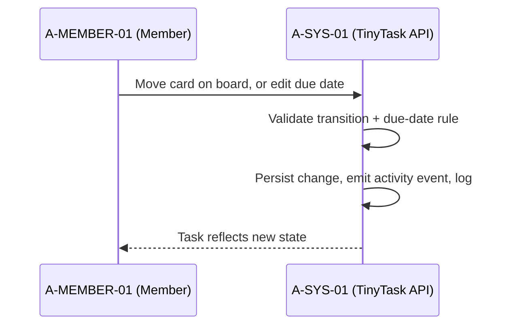

## §11 — Use-Case — {UC-24} View Project Board (Kanban)

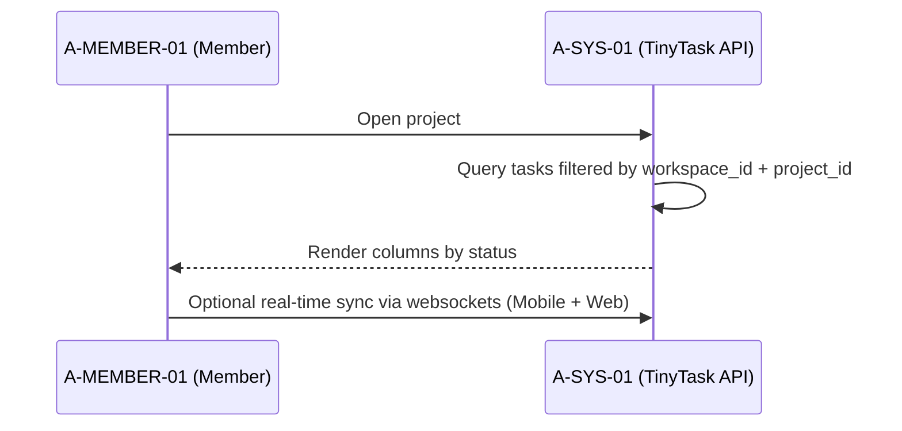

## §12 — Use-Case — {UC-25} Comment on Task

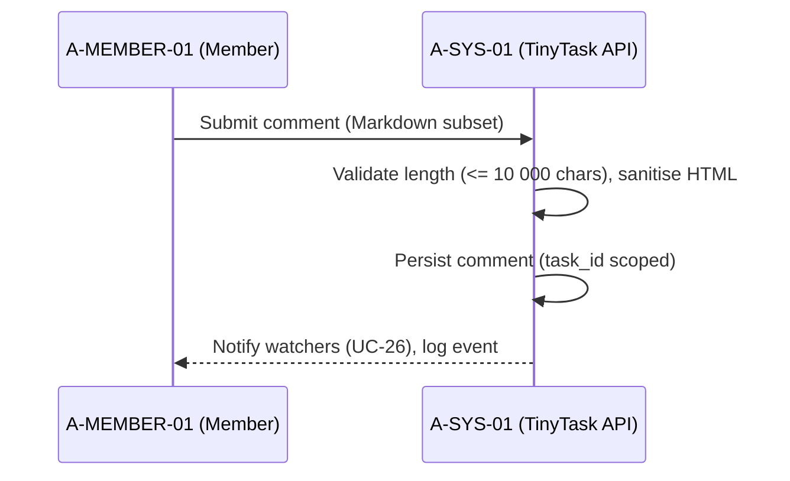

## §13 — Use-Case — {UC-26} @Mention & In-App Notification

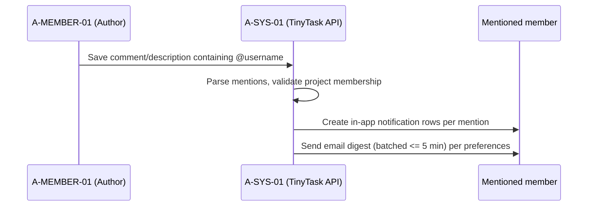

## §14 — Use-Case — {UC-27} Attach File to Task

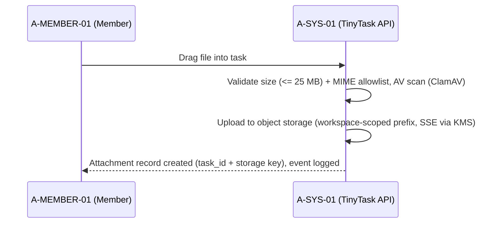

## §15 — Use-Case — {UC-28} Search & Filter Tasks

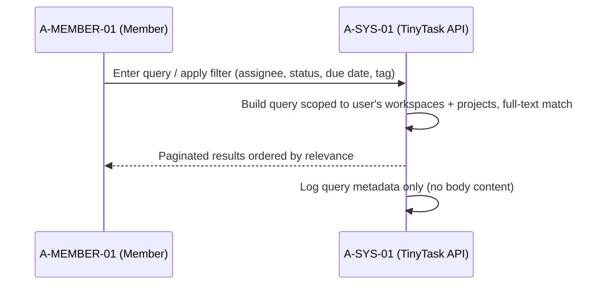

## §16 — Use-Case — {UC-29} Activity Feed (recent events)

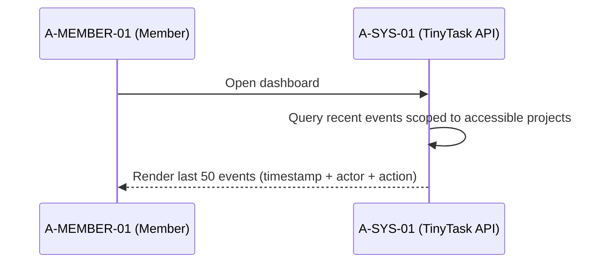

## §17 — Use-Case — {UC-30} Mobile Sync (offline-first)

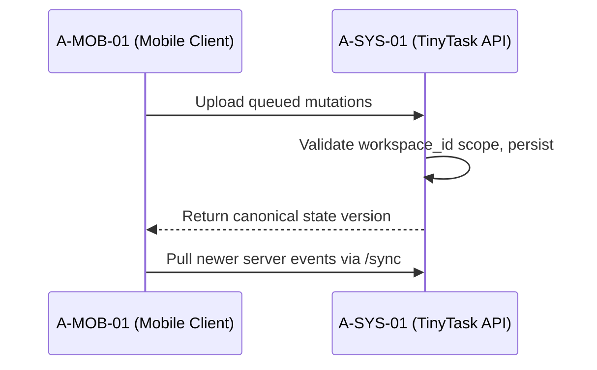

## §18 — Use-Case — {UC-31} Stripe Checkout (Upgrade Plan)

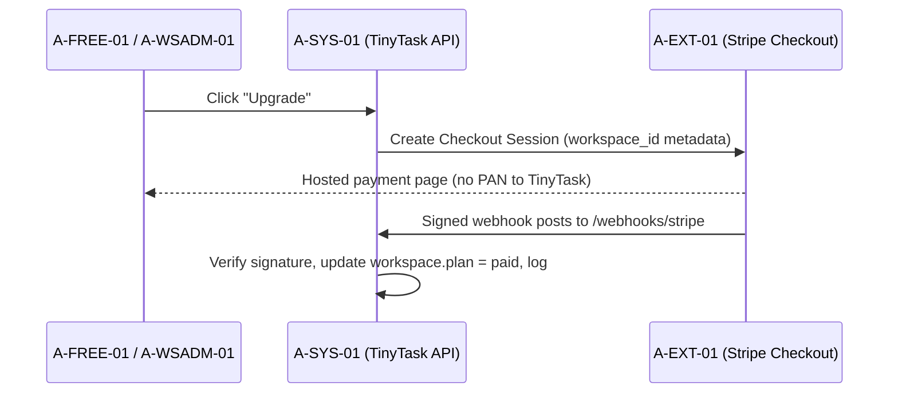

## §19 — Use-Case — {UC-32} Workspace Admin Console

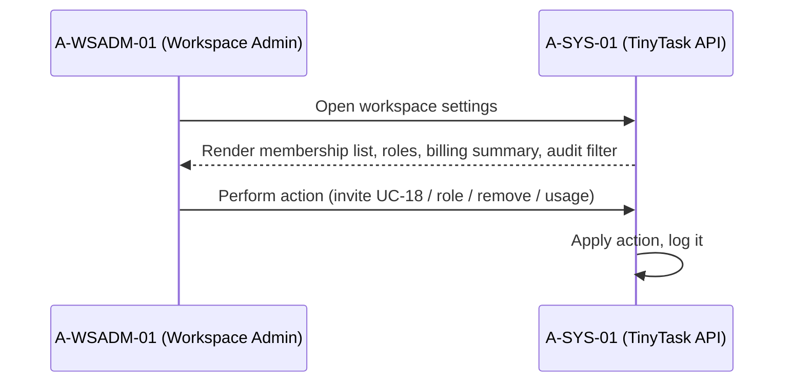

## §20 — Use-Case — {UC-33} Enterprise SSO

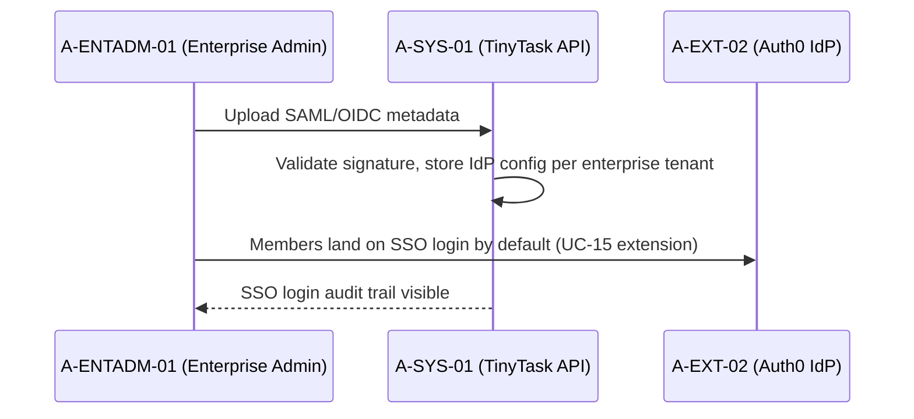

## §21 — Use-Case — {UC-34} View My Account (data held)

```mermaid
sequenceDiagram
    participant M as A-MEMBER-01 (Member)
    participant SYS as A-SYS-01 (TinyTask API)
    M->>SYS: Open account page
    SYS-->>M: List data categories (profile, account activity, workspace memberships)
    M->>SYS: Read-only view
    SYS->>SYS: Audit log entry
```

## §22 — Use-Case — {UC-35} Export My Data (GDPR portability)

```mermaid
sequenceDiagram
    participant M as A-MEMBER-01 (Member)
    participant SYS as A-SYS-01 (TinyTask API)
    M->>SYS: Click "Export my data"
    SYS->>SYS: Generate JSON archive (profile, workspaces, tasks, comments, attachment metadata)
    SYS->>SYS: Signed download URL (24h expiry), email link, log event
    SYS-->>M: Download archive
```

## §23 — Use-Case — {UC-36} Delete My Account / Workspace

```mermaid
sequenceDiagram
    participant U as A-FREE-01 / A-WSADM-01
    participant SYS as A-SYS-01 (TinyTask API)
    U->>SYS: Click delete, type confirmation phrase
    SYS->>SYS: Schedule deletion (immediate account / 30-day grace workspace)
    SYS-->>U: Confirmation email with cancel link (within grace)
    SYS->>SYS: After grace — cryptographic erasure primary + backup (UC-01)
    SYS->>SYS: Log the event
```

