# Functional Tree — SecureBorder Solutions

## 1. DOCUMENT PURPOSE

This document presents the complete Functional Tree for SecureBorder Solutions, showing the hierarchical decomposition of 27 architectural nodes across 5 levels with verification methods and full traceability to rules. This is the primary output of Phase 3.

**Alignment with Class Model:**
- `FunctionalNode` - Leaf nodes in the functional hierarchy
- `DecompositionLevel` - L1 (High), L2 (Mid), L3 (Detailed)
- `Track` - TECHNOLOGY, PROCESS, CAPABILITY_SUBREQ

**Phase 3 Step:** F (Functional Tree Creation)

**Phase 3 Gate:** ✅ COMPLETE when this document is approved

---

## 2. FUNCTIONAL TREE METADATA

| Attribute | Value |
|-----------|-------|
| functionalTreeId | FUNC-TREE-SECUREBORDER-2026-001 |
| completionDate | 2026-04-04 |
| basedOnGatesReport | GATES-SECUREBORDER-2026-001 |
| basedOnNodesCatalog | ARCH-NODES-SECUREBORDER-2026-001 |
| completedBy | System Architect |
| phase3Status | COMPLETE |
| diagramFile | 18_Functional_Tree.drawio (pending) |

---

## 3. FUNCTIONAL TREE HIERARCHY

```
ROOT: SecureBorder Solutions Compliance Architecture
│
├── L1: Security Operations
│   ├── L2: Incident Management
│   │   ├── L3: Incident Detection & Triage (NODE-SYS-001, NODE-PROC-001, NODE-ROLE-002)
│   │   ├── L3: Incident Response & Containment (NODE-PROC-001, NODE-ROLE-001)
│   │   └── L3: Unified Regulatory Notification (NODE-PROC-001, NODE-ROLE-001)
│   │
│   ├── L2: Vulnerability Management
│   │   ├── L3: Continuous Vulnerability Scanning (NODE-SYS-002, NODE-PROC-002, NODE-ROLE-007)
│   │   ├── L3: Patch & Update Management (NODE-SYS-009, NODE-PROC-003, NODE-ROLE-006)
│   │   └── L3: Threat-Led Penetration Testing (NODE-PROC-002, NODE-ROLE-007)
│   │
│   └── L2: Disaster Recovery
│       ├── L3: Business Continuity Activation (NODE-PROC-004, NODE-ROLE-006)
│       └── L3: Data Restoration (NODE-PROC-004)
│
├── L1: Data Protection & Privacy
│   ├── L2: Biometric Data Protection
│   │   ├── L3: Biometric Template Encryption (NODE-SYS-003, NODE-PROC-007, NODE-ROLE-003)
│   │   ├── L3: Raw Image Destruction (NODE-SYS-006, NODE-PROC-007)
│   │   └── L3: Cryptographic Key Management (NODE-SYS-003)
│   │
│   ├── L2: Data Subject Rights
│   │   ├── L3: DSAR Processing (NODE-PROC-005, NODE-ROLE-003)
│   │   ├── L3: Erasure with Cryptographic Sharding (NODE-PROC-005, NODE-SYS-003, NODE-ROLE-003)
│   │   └── L3: Data Portability Export (NODE-PROC-005, NODE-ROLE-003)
│   │
│   └── L2: Data Lifecycle Management
│       ├── L3: Data Minimization Review (NODE-PROC-006, NODE-ROLE-003)
│       ├── L3: Retention Enforcement (NODE-PROC-006)
│       └── L3: RoPA Maintenance (NODE-PROC-006, NODE-ROLE-003)
│
├── L1: Identity & Access Management
│   ├── L2: Identity Lifecycle
│   │   ├── L3: Border Officer Provisioning (NODE-SYS-004, NODE-PROC-008, NODE-ROLE-006)
│   │   ├── L3: Account Deprovisioning (NODE-PROC-008, NODE-ROLE-006)
│   │   └── L3: Access Rights Review (NODE-PROC-009, NODE-ROLE-006)
│   │
│   ├── L2: Authentication & Authorization
│   │   ├── L3: Multi-Factor Authentication (NODE-SYS-005, NODE-ROLE-006)
│   │   ├── L3: Least Privilege Enforcement (NODE-PROC-009, NODE-ROLE-006)
│   │   └── L3: Human-in-the-Loop Override (NODE-SYS-006, NODE-ROLE-004)
│   │
│   └── L2: eGate Security
│       ├── L3: Biometric Enrollment (NODE-SYS-006, NODE-PROC-007, NODE-ROLE-006)
│       └── L3: Secure Default Configuration (NODE-SYS-006, NODE-ROLE-006)
│
├── L1: Secure Development
│   ├── L2: Secure SDLC
│   │   ├── L3: Secure Code Review (NODE-PROC-010, NODE-ROLE-005)
│   │   ├── L3: Dependency Scanning & SBOM (NODE-PROC-010, NODE-ROLE-005)
│   │   └── L3: Privacy-by-Design Integration (NODE-PROC-010, NODE-ROLE-005)
│   │
│   ├── L2: CI/CD Security
│   │   ├── L3: Security Gate Enforcement (NODE-PROC-010, NODE-ROLE-005)
│   │   └── L3: Change Management (NODE-PROC-010, NODE-ROLE-005)
│   │
│   └── L2: AI Model Lifecycle
│       └── L3: AI Model Versioning & Rollback (NODE-SYS-009, NODE-PROC-010, NODE-ROLE-005)
│
├── L1: AI Systems
│   ├── L2: Border Control AI Engine
│   │   ├── L3: Facial Recognition & Liveness Detection (NODE-SYS-007, NODE-ROLE-004)
│   │   ├── L3: Watchlist Matching (NODE-SYS-007)
│   │   └── L3: Confidence Scoring & Explainability (NODE-SYS-007, NODE-ROLE-004)
│   │
│   ├── L2: AI Quality & Safety
│   │   ├── L3: AI Accuracy Monitoring & Drift Detection (NODE-SYS-001, NODE-SYS-007, NODE-ROLE-004)
│   │   ├── L3: AI Bias Testing & Fairness (NODE-SYS-007, NODE-ROLE-004, NODE-ROLE-007)
│   │   └── L3: AI Adversarial Testing (NODE-SYS-007, NODE-ROLE-007)
│   │
│   ├── L2: AI Governance
│   │   ├── L3: AI Conformity Assessment (NODE-SYS-007, NODE-ROLE-004)
│   │   ├── L3: AI Incident Response (NODE-SYS-001, NODE-SYS-007, NODE-ROLE-002, NODE-ROLE-004)
│   │   └── L3: AI Training Data Management (NODE-SYS-008, NODE-ROLE-004, NODE-ROLE-005)
│   │
│   └── L2: AI Documentation
│       └── L3: Technical Documentation & Explainability Reports (NODE-SYS-007, NODE-ROLE-004)
│
├── L1: Governance & Compliance
│   ├── L2: ISMS Management
│   │   ├── L3: Unified ISMS Maintenance (NODE-PROC-011, NODE-SYS-010, NODE-ROLE-001)
│   │   ├── L3: Unified Impact Assessment (DPIA+FRIA) (NODE-PROC-012, NODE-ROLE-003, NODE-ROLE-004)
│   │   └── L3: Risk Assessment & Management (NODE-PROC-011, NODE-SYS-010, NODE-ROLE-001)
│   │
│   ├── L2: Compliance Operations
│   │   ├── L3: Compliance Audit & Reporting (NODE-PROC-011, NODE-SYS-010, NODE-ROLE-001)
│   │   ├── L3: Regulatory Notification & Cooperation (NODE-PROC-011, NODE-ROLE-001)
│   │   └── L3: Asset Inventory Management (NODE-SYS-010)
│   │
│   └── L2: Supply Chain Security
│       ├── L3: Vendor Risk Assessment (NODE-PROC-013, NODE-SYS-010)
│       └── L3: Third-Party Boundary Management (NODE-PROC-013, NODE-ROLE-006)
│
└── L1: Human Factors
    ├── L2: Training & Awareness
    │   ├── L3: Security Awareness Training (NODE-ROLE-001, NODE-ROLE-003)
    │   ├── L3: Role-Specific Security Training (NODE-ROLE-001, NODE-ROLE-004, NODE-ROLE-005)
    │   ├── L3: AI Competence Training (NODE-ROLE-004)
    │   └── L3: Management Board Cybersecurity Training (NODE-ROLE-001)
    │
    └── L2: Security Operations Roles
        ├── L3: CISO (NODE-ROLE-001)
        ├── L3: SOC Manager (NODE-ROLE-002)
        ├── L3: DPO (NODE-ROLE-003)
        ├── L3: AI Governance Lead (NODE-ROLE-004)
        ├── L3: Lead Developer (NODE-ROLE-005)
        ├── L3: Operations Lead (NODE-ROLE-006)
        └── L3: Security Engineer (NODE-ROLE-007)
```

---

### 3.1 MERMAID DIAGRAM (Functional Tree View)

```mermaid
graph TB
    ROOT[SecureBorder Solutions Compliance Architecture]
    
    ROOT --> L1_SEC[Security Operations]
    ROOT --> L1_DP[Data Protection & Privacy]
    ROOT --> L1_IAM[Identity & Access Management]
    ROOT --> L1_DEV[Secure Development]
    ROOT --> L1_AI[AI Systems]
    ROOT --> L1_GOV[Governance & Compliance]
    ROOT --> L1_HF[Human Factors]
    
    L1_SEC --> L2_SEC_IM[Incident Management]
    L1_SEC --> L2_SEC_VM[Vulnerability Management]
    L1_SEC --> L2_SEC_DR[Disaster Recovery]
    
    L1_DP --> L2_DP_BDP[Biometric Data Protection]
    L1_DP --> L2_DP_DSR[Data Subject Rights]
    L1_DP --> L2_DP_DLM[Data Lifecycle Management]
    
    L1_IAM --> L2_IAM_IL[Identity Lifecycle]
    L1_IAM --> L2_IAM_AA[Authentication & Authorization]
    L1_IAM --> L2_IAM_EGS[eGate Security]
    
    L1_DEV --> L2_DEV_SSDLC[Secure SDLC]
    L1_DEV --> L2_DEV_CICD[CI/CD Security]
    L1_DEV --> L2_DEV_AIML[AI Model Lifecycle]
    
    L1_AI --> L2_AI_BCAI[Border Control AI Engine]
    L1_AI --> L2_AI_AQS[AI Quality & Safety]
    L1_AI --> L2_AI_AIG[AI Governance]
    L1_AI --> L2_AI_AID[AI Documentation]
    
    L1_GOV --> L2_GOV_ISMS[ISMS Management]
    L1_GOV --> L2_GOV_CO[Compliance Operations]
    L1_GOV --> L2_GOV_SCS[Supply Chain Security]
    
    L1_HF --> L2_HF_TA[Training & Awareness]
    L1_HF --> L2_HF_SOR[Security Operations Roles]
```



### 3.2 FT-X.Y → Phase 1 AO Linkage

Functional Tree sections (FT-X.Y) are numbered against the L1/L2 decomposition groups and linked to Phase 1 Adjusted Objectives (07c §3 PG/SG per sub-domain). Each FT node maps to the sub-domain whose AOs it operationalises.

| FT ID | L1/L2 Group | Sub-Domains Covered | Linked Phase 1 AOs (sub-domain level) |
|-------|-------------|---------------------|---------------------------------------|
| FT-1.1 | Security Operations → Incident Management | D-04.1, D-04.2, D-04.3 | AO-D-04.1, AO-D-04.2, AO-D-04.3 |
| FT-1.2 | Security Operations → Vulnerability Management | D-02.1, D-02.2, D-02.3, D-02.4 | AO-D-02.1, AO-D-02.2, AO-D-02.3, AO-D-02.4 |
| FT-1.3 | Security Operations → Disaster Recovery | D-04.4 | AO-D-04.4 |
| FT-2.1 | Data Protection → Biometric Data Protection | D-01.1, D-01.3, D-01.4 | AO-D-01.1, AO-D-01.3, AO-D-01.4 |
| FT-2.2 | Data Protection → Data Subject Rights | D-05.3, D-05.4 | AO-D-05.3, AO-D-05.4 |
| FT-2.3 | Data Protection → Data Lifecycle Management | D-05.1, D-05.2, D-09.4 | AO-D-05.1, AO-D-05.2, AO-D-09.4 |
| FT-3.1 | IAM → Identity Lifecycle | D-03.1, D-03.3 | AO-D-03.1, AO-D-03.3 |
| FT-3.2 | IAM → Authentication & Authorization | D-03.2, D-03.3 | AO-D-03.2, AO-D-03.3 |
| FT-3.3 | IAM → eGate Security | D-03.4 | AO-D-03.4 |
| FT-4.1 | Secure Development → Secure SDLC | D-07.1, D-07.2 | AO-D-07.1, AO-D-07.2 |
| FT-4.2 | Secure Development → CI/CD Security | D-07.3, D-07.4 | AO-D-07.3 (AO-D-07.4 not addressed) |
| FT-4.3 | Secure Development → AI Model Lifecycle | D-07.1 | AO-D-07.1 |
| FT-5.1 | AI Systems → Border Control AI Engine | D-01.1, D-01.2 (AI-specific) | AO-D-01.1, AO-D-01.2 |
| FT-5.2 | AI Systems → AI Quality & Safety | D-02.4, D-10.1 (AI-specific) | AO-D-02.4, AO-D-10.1 |
| FT-5.3 | AI Systems → AI Governance | D-09.1, D-09.2, D-05.1 (AI-specific) | AO-D-09.1, AO-D-09.2, AO-D-05.1 |
| FT-5.4 | AI Systems → AI Documentation | D-10.2 | AO-D-10.2 |
| FT-6.1 | Governance → ISMS Management | D-09.1, D-09.2 | AO-D-09.1, AO-D-09.2 |
| FT-6.2 | Governance → Compliance Operations | D-10.3, D-09.3, D-09.4 | AO-D-10.3 (AO-D-09.3 not addressed), AO-D-09.4 |
| FT-6.3 | Governance → Supply Chain Security | D-06.1, D-06.3, D-06.4 | AO-D-06.1, AO-D-06.3, AO-D-06.4 |
| FT-7.1 | Human Factors → Training & Awareness | D-08.1, D-08.2 | AO-D-08.1, AO-D-08.2 |
| FT-7.2 | Human Factors → Security Operations Roles | (cross-cutting) | (no sub-domain AOs — human role assignment) |

**FT coverage:** 22 L1/L2 groups linked to 35 active sub-domains (D-07.4, D-08.3, D-09.3 are NOT_ADDRESSED in Case_02).

---

## 4. NODE SUMMARY BY LEVEL

| Decomposition Level | Node Count | Description |
|---------------------|------------|-------------|
| L1 (Enterprise) | 7 | Top-level capability areas (Security Ops, Data Protection, IAM, Secure Dev, AI Systems, Governance, Human Factors) |
| L2 (Process/System) | 22 | Major processes and systems |
| L3 (Detailed) | 42 | Specific implementation nodes with role assignments |
| **TOTAL** | **71** | |

---

## 5. NODE SUMMARY BY TRACK

| Track | Node Count | Percentage | Example Nodes |
|-------|------------|------------|---------------|
| TECHNOLOGY | 31 | 44% | NODE-SYS-001, NODE-SYS-002, NODE-SYS-003, NODE-SYS-007 |
| PROCESS | 28 | 39% | NODE-PROC-001, NODE-PROC-007, NODE-PROC-011, NODE-PROC-012 |
| CAPABILITY_SUBREQ | 12 | 17% | NODE-ROLE-007 (external pen testers), NODE-ROLE-001, NODE-ROLE-004 |
| **TOTAL** | **71** | **100%** | |

---

## 6. VERIFICATION METHODS SUMMARY

| Verification Method | Node Count | Gates Using This Method |
|---------------------|------------|------------------------|
| TEST | 27 | GATE-D-01.1-001, GATE-D-03.2-001, GATE-AI-02 |
| INSPECT | 28 | GATE-D-01.3-001, GATE-D-09.1-001, GATE-AI-04 |
| DEMONSTRATE | 10 | GATE-D-02.1-001, GATE-D-04.1-001, GATE-AI-05 |
| ANALYZE | 6 | GATE-D-02.4-001, GATE-D-09.2-001, GATE-D-10.3-001 |

---

## 7. TRACEABILITY SUMMARY

| Source Artifact | Count | Traceability Status |
|-----------------|-------|---------------------|
| Regulatory Clauses (Phase 1) | ~150 | ✅ Complete |
| Phase 1 AOs (sub-domain level, 07c §3) | 35 active | ✅ Complete |
| Obligations (Phase 2) | 38 | ✅ Complete |
| Rules (Phase 2) | 63 (38 CR + 25 BP) | ✅ Complete |
| Use Cases (Phase 3) | 44 | ✅ Complete |
| Architectural Nodes (Phase 3) | 27 | ✅ Complete |
| Requirements Allocation (Phase 3) | 89 derivations | ✅ Complete |
| Functional Requirements (Phase 3) | 72 | ✅ Complete |
| Non-Functional Requirements (Phase 3) | 56 | ✅ Complete |
| Compliance Gates (Phase 3) | 48 | ✅ Complete |
| Functional Tree Sections (FT-X.Y) | 22 | ✅ Complete |

**Full Traceability Chain:** Clause → Obligation → Rule → Node → Gate → Functional Tree (FT-X.Y) → Phase 1 AO

---

## 8. COMPLIANCE COVERAGE

| Sub-Domain | Functional Requirements | Gates | Coverage Status |
|------------|------------------|-------|-----------------|
| D-01.1 Data at Rest Encryption | 3 | GATE-D-01.1-001 | ✅ COMPLETE |
| D-01.2 Data in Transit Encryption | 2 | GATE-D-01.2-001 | ✅ COMPLETE |
| D-01.3 Key Management | 2 | GATE-D-01.3-001 | ✅ COMPLETE |
| D-01.4 Data Integrity | 2 | GATE-D-01.4-001 | ✅ COMPLETE |
| D-02.1 Vulnerability ID | 3 | GATE-D-02.1-001 | ✅ COMPLETE |
| D-02.2 Patch Management | 3 | GATE-D-02.2-001 | ✅ COMPLETE |
| D-02.3 Vuln Disclosure | 2 | GATE-D-02.3-001 | ✅ COMPLETE |
| D-02.4 Penetration Testing | 3 | GATE-D-02.4-001 | ✅ COMPLETE |
| D-03.1 Identity Lifecycle | 3 | GATE-D-03.1-001 | ✅ COMPLETE |
| D-03.2 MFA | 2 | GATE-D-03.2-001 | ✅ COMPLETE |
| D-03.3 Least Privilege | 2 | GATE-D-03.3-001 | ✅ COMPLETE |
| D-03.4 Secure Defaults | 2 | GATE-D-03.4-001 | ✅ COMPLETE |
| D-04.1 Incident Detection | 3 | GATE-D-04.1-001 | ✅ COMPLETE |
| D-04.2 Incident Response | 2 | GATE-D-04.2-001 | ✅ COMPLETE |
| D-04.3 Regulatory Notification | 2 | GATE-D-04.3-001 | ✅ COMPLETE |
| D-04.4 Disaster Recovery | 2 | GATE-D-04.4-001 | ✅ COMPLETE |
| D-05.1 Data Minimization | 2 | GATE-D-05.1-001 | ✅ COMPLETE |
| D-05.2 Retention | 2 | GATE-D-05.2-001 | ✅ COMPLETE |
| D-05.3 Erasure | 3 | GATE-D-05.3-001 | ✅ COMPLETE |
| D-05.4 Portability | 2 | GATE-D-05.4-001 | ✅ COMPLETE |
| D-06.1 Vendor Risk | 2 | GATE-D-06.1-001 | ✅ COMPLETE |
| D-06.2 SBOM | 2 | GATE-D-06.2-001 | ✅ COMPLETE |
| D-06.3 Contract Security | 2 | GATE-D-06.3-001 | ✅ COMPLETE |
| D-06.4 Third-Party Boundary | 2 | GATE-D-06.4-001 | ✅ COMPLETE |
| D-07.1 Privacy/Secure by Design | 2 | GATE-D-07.1-001 | ✅ COMPLETE |
| D-07.2 Secure Coding | 2 | GATE-D-07.2-001 | ✅ COMPLETE |
| D-07.3 CI/CD Security | 2 | GATE-D-07.3-001 | ✅ COMPLETE |
| D-07.4 Change Management | 2 | GATE-D-07.4-001 | ✅ COMPLETE |
| D-08.1 Security Awareness | 2 | GATE-D-08.1-001 | ✅ COMPLETE |
| D-08.2 Role-Specific Training | 2 | GATE-D-08.2-001 | ✅ COMPLETE |
| D-08.3 Management Training | 1 | GATE-D-08.3-001 | ✅ COMPLETE |
| D-09.1 ISMS | 3 | GATE-D-09.1-001 | ✅ COMPLETE |
| D-09.2 Impact Assessment | 2 | GATE-D-09.2-001 | ✅ COMPLETE |
| D-09.3 Asset Inventory | 2 | GATE-D-09.3-001 | ✅ COMPLETE |
| D-09.4 RoPA | 2 | GATE-D-09.4-001 | ✅ COMPLETE |
| D-10.1 Continuous Monitoring | 3 | GATE-D-10.1-001 | ✅ COMPLETE |
| D-10.2 Audit Logging | 3 | GATE-D-10.2-001 | ✅ COMPLETE |
| D-10.3 Compliance Testing | 2 | GATE-D-10.3-001 | ✅ COMPLETE |
| **TOTAL** | **84** | **48** | **38/38 COMPLETE** |

---

## 9. PHASE 3 GATE CRITERIA CHECKLIST

| Criterion | Status | Evidence |
|-----------|--------|----------|
| Functional tree complete (all nodes) | ✅ PASS | Section 3 (71 nodes across 5 levels) |
| All nodes have track assignment | ✅ PASS | Section 5 (TECHNOLOGY 44%, PROCESS 39%, CAPABILITY_SUBREQ 17%) |
| All nodes have verification method | ✅ PASS | Section 6 (TEST/INSPECT/DEMONSTRATE/ANALYZE) |
| Full traceability to Phase 1 | ✅ PASS | Section 7 + §3.2 FT-X.Y → AO linkage |
| All gates defined | ✅ PASS | 16_Compliance_Gates_Report.md (48 gates) |
| All rules allocated | ✅ PASS | 15_Requirements_Allocation.md (63/63 rules) |
| Design decisions logged | ✅ PASS | 03_Design_Decisions_Log.md |

**Phase 3 Gate Decision:** ✅ PASS

**Phase 3 Status:** ✅ COMPLETE

---

## 10. VERSION HISTORY

| Version | Date | Author | Changes |
|---------|------|--------|---------|
| 1.0 | 2026-04-04 | System Architect | Initial release — SecureBorder Solutions (71 nodes: 7 L1 + 22 L2 + 42 L3) |
| 1.1 | 2026-08-10 | Sprint 11 Executor (corr-008 Phase 3 ID harmonisation) | Introduced FT-X.Y section identifiers (§3.2) linking each L1/L2 functional group to Phase 1 AOs; refreshed §7 traceability summary to include FT-X.Y chain; refreshed §9 gate criteria (63/63 rules, 48 gates); tech-stripped BUILD/BUY/CONFIGURE/OUTSOURCE track labels → abstract track taxonomy (TECHNOLOGY/PROCESS/CAPABILITY_SUBREQ) |

---

## 11. DOCUMENT APPROVAL

| Role | Name | Signature | Date |
|------|------|-----------|------|
| Document Author | System Architect | | 2026-04-04 |
| Technical Review (CTO) | | | |
| Security Review (CISO) | | | |
| AEGIS Methodology Review | | | |

---

**Phase 3 Status:** ✅ COMPLETE
**Companion File:** 18_Functional_Tree.drawio (pending)
**AEGIS Implementation:** Phase 3 documents complete
