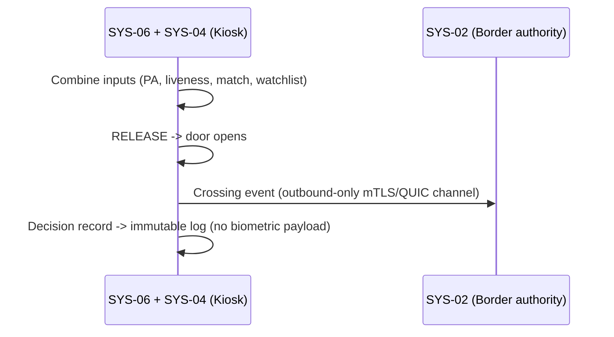
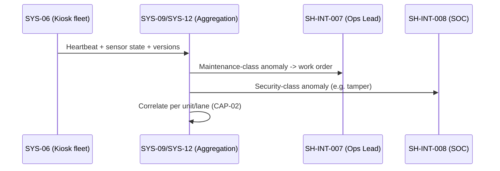
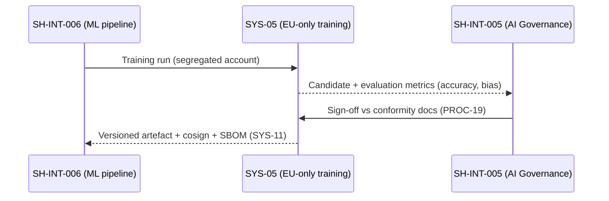

# Use Cases Catalog — SecureBorder Solutions

## 1. DOCUMENT PURPOSE

This document defines the **security and privacy use cases** for SecureBorder Solutions B.V., derived from Phase 1 (Company Context, Compliance Matrix) and Phase 2 (Rules Catalog, Privacy/Security Goals, Strategic Tensions).

**Alignment with Class Model:**
- `UseCase` — Functional security and privacy scenarios
- `BusinessGoal` — Strategic objectives from Phase 1
- `Stakeholder` — Actors from Company Context (450 employees, B2G/B2B)
- `DerivationNode` — Link to requirements allocation

**Phase 3 Step:** B (Use Cases Catalog — Security + Privacy + AI Focus)

**Gate Criteria:**
- [ ] All 38 goals mapped to use cases
- [ ] All 63 rules covered (38 CR + 25 BP)
- [ ] All 9 strategic tensions addressed
- [ ] Stakeholders assigned to use cases
- [ ] AI_Act high-risk requirements explicitly covered
- [ ] GDPR Art. 9 biometric data processing covered

---

## 2. USE CASES CATALOG METADATA

| Attribute | Value |
|-----------|-------|
| useCasesCatalogId | UC-SECUREBORDER-2026-001 |
| completionDate | 2026-04-04 |
| basedOnCompanyContext | CC-SECUREBORDER-2026-001 |
| basedOnRulesCatalog | RULES-SECUREBORDER-2026-001 |
| basedOnGoalsCatalog | GOALS-SECUREBORDER-2026-001 |
| basedOnTensionsReport | STR-TENSION-SECUREBORDER-2026-001 |
| completedBy | System Architect |
| phase3Step | B1+B2+B3+B4 |
| companyProfile | Medium-Large (450 employees), B2G/B2B, GDPR+CRA+NIS2+AI_Act |
| totalUseCases | 44 |
| categories | DP, SEC, IAM, DEV, GOV, AI, TRN |

---

## 3. STAKEHOLDER CATALOG (from Phase 1)

### 3.1 Internal Stakeholders

| Stakeholder ID | Name/Role | Type | Responsibilities | Contact | FTE Allocation |
|----------------|-----------|------|------------------|---------|----------------|
| SH-INT-001 | CEO | Internal | Business decisions, risk acceptance, board-level security committee | ceo@secureborder.eu | 0.05 |
| SH-INT-002 | CTO | Internal | Technical architecture, secure SDLC oversight, AI system design | cto@secureborder.eu | 0.3 |
| SH-INT-003 | CISO | Internal | ISMS management, SOC oversight, incident response, regulatory reporting | ciso@secureborder.eu | 1.0 |
| SH-INT-004 | DPO | Internal | GDPR compliance, DPIA execution, data subject rights, RoPA maintenance | dpo@secureborder.eu | 1.0 |
| SH-INT-005 | AI Governance Lead | Internal | AI_Act conformity, FRIA execution, post-market monitoring, bias testing | ai-gov@secureborder.eu | 1.0 |
| SH-INT-006 | Lead Developer | Internal | Secure coding, code review, CI/CD pipeline, SBOM generation | dev-lead@secureborder.eu | 0.4 |
| SH-INT-007 | Operations Lead | Internal | Infrastructure management, patch deployment, system monitoring | ops-lead@secureborder.eu | 0.5 |
| SH-INT-008 | SOC Manager | Internal | 24/7 SOC operations, incident detection/triage, alert management | soc-mgr@secureborder.eu | 1.0 |
| SH-INT-009 | Security Engineer | Internal | Vulnerability management, penetration testing, security tooling | sec-eng@secureborder.eu | 1.0 |
| SH-INT-010 | Compliance Analyst | Internal | Audit preparation, compliance reporting, vendor assessments | compliance@secureborder.eu | 1.0 |

### 3.2 External Stakeholders

| Stakeholder ID | Name/Role | Type | Responsibilities | Relationship | SLA/Contract |
|----------------|-----------|------|------------------|--------------|--------------|
| SH-EXT-001 | Border Control Officer | External | Operates eGate, reviews AI decisions, human-in-the-loop override | Government authority | Government contract |
| SH-EXT-002 | Traveler (Data Subject) | External | Biometric data subject, privacy rights holder | End user of eGate | GDPR Rights |
| SH-EXT-003 | National Border Authority | External | Controller for biometric data, watchlist management | Government client | B2G contract |
| SH-EXT-004 | Airport Operator | External | Physical infrastructure, network connectivity, physical security | B2B client | B2B contract + SLA |
| SH-EXT-005 | Cloud Provider | External | Remote infrastructure for AI model updates, model hosting | Processor | DPA + SLA (99.99%) |
| SH-EXT-006 | Hardware Supplier | External | eGate kiosk hardware, biometric sensors, cryptographic modules | Supplier | Supply contract + SBOM |
| SH-EXT-007 | Notified Body (CRA) | External | Critical Class conformity assessment, third-party certification | Regulator (CRA) | Assessment contract |
| SH-EXT-008 | ENISA | External | Vulnerability coordination, cybersecurity guidance | Regulator | As required |
| SH-EXT-009 | National CSIRT | External | Incident early warning, threat intelligence sharing | Regulator (NIS 2) | 24h notification |
| SH-EXT-010 | Data Protection Authority | External | GDPR supervision, breach notification recipient, audit | Regulator (GDPR) | 72h notification |
| SH-EXT-011 | AI Market Surveillance Authority | External | AI_Act supervision, conformity verification, post-market oversight | Regulator (AI_Act) | Cooperation |
| SH-EXT-012 | External Auditor | External | ISO 27001/27701 audits, compliance verification | Independent | Annual |
| SH-EXT-013 | Penetration Testing Firm | External | Threat-led penetration testing, AI adversarial testing | Service provider | Annual contract |

### 3.3 Stakeholder → Use Case Summary

| Stakeholder | Primary Use Cases | Support Use Cases | Frequency | FTE Required |
|-------------|-------------------|-------------------|-----------|--------------|
| SH-INT-001 (CEO) | CAP-04, PROC-14 | PROC-07 | Quarterly | 0.05 |
| SH-INT-002 (CTO) | PROC-12, U.C.4.2.1, PROC-19 | PROC-07, PROC-15 | Weekly | 0.3 |
| SH-INT-003 (CISO) | PROC-05, PROC-06, U.C.2.3.1, PROC-15 | U.C.2.4.1, CAP-04 | Daily | 1.0 |
| SH-INT-004 (DPO) | PROC-01, U.C.1.2.1, PROC-02, PROC-17 | PROC-06, PROC-16 | Daily | 1.0 |
| SH-INT-005 (AI Gov) | PROC-19, U.C.6.2.1, PROC-20, U.C.6.4.1 | PROC-17, PROC-06 | Daily | 1.0 |
| SH-INT-006 (Dev Lead) | PROC-12, U.C.4.2.1, U.C.4.3.1 | PROC-13, CAP-03 | Daily | 0.4 |
| SH-INT-007 (Ops Lead) | U.C.2.4.1, PROC-10, U.C.3.5.1 | CAP-02, PROC-11 | Daily | 0.5 |
| SH-INT-008 (SOC Mgr) | PROC-05, CAP-02, PROC-08 | PROC-06, PROC-21 | 24/7 | 1.0 |
| SH-INT-009 (Sec Eng) | U.C.2.3.1, PROC-09 | U.C.4.3.1, PROC-22 | Weekly | 1.0 |
| SH-INT-010 (Compliance) | PROC-16, CAP-05, PROC-18 | PROC-17, PROC-03 | Monthly | 1.0 |
| SH-EXT-001 (Border Officer) | U.C.3.2.1, PROC-20 | PROC-08 | Per shift | N/A |
| SH-EXT-002 (Traveler) | PROC-01, U.C.1.2.1 | U.C.3.3.1 | As needed | N/A |
| SH-EXT-003 (Border Authority) | PROC-18, PROC-03 | U.C.6.4.1 | As required | N/A |

---

## 4. BUSINESS GOALS MAPPING (from Phase 1)

### 4.1 Security Business Goals

| Goal ID | Goal Description | Priority | Related Regulations | Related Stakeholders |
|---------|------------------|----------|---------------------|---------------------|
| BG-001 | CRA Critical Class certification | CRITICAL | CRA | SH-INT-002, SH-INT-003, SH-EXT-007 |
| BG-002 | AI_Act conformity assessment | CRITICAL | AI_Act | SH-INT-005, SH-INT-002, SH-EXT-011 |
| BG-003 | NIS 2 compliance (24h incident reporting) | CRITICAL | NIS 2 | SH-INT-003, SH-INT-008, SH-EXT-009 |
| BG-004 | GDPR Art. 9 biometric data compliance | CRITICAL | GDPR | SH-INT-004, SH-INT-005, SH-EXT-010 |
| BG-005 | 99.99% uptime SLA | HIGH | NIS 2, CRA | SH-INT-007, SH-INT-008, SH-EXT-005 |
| BG-006 | Schengen Area expansion readiness | HIGH | GDPR, AI_Act | SH-INT-001, SH-EXT-003 |
| BG-007 | ISO 27001/27701 maintenance | HIGH | ISO 27001/27701 | SH-INT-003, SH-INT-010, SH-EXT-012 |

---

## 5. SYSTEM OVERVIEW

### 5.1 Use Case Diagram (Level 0)

```mermaid
useCaseDiagram
    actor "Border Control Officer" as BCO
    actor "Traveler" as TRV
    actor "CISO" as CISO
    actor "DPO" as DPO
    actor "AI Governance Lead" as AIG
    actor "SOC Manager" as SOC
    actor "Lead Developer" as DEV
    actor "Operations Lead" as OPS
    actor "Compliance Analyst" as COMP
    actor "National Border Authority" as NBA
    actor "ENISA/CSIRT" as ENISA
    actor "Data Protection Authority" as DPA
    actor "AI Market Surveillance" as AIMS

    package "Data Protection" {
        usecase "UC-DP\nData Subject Rights\n& Privacy" as UCDP
    }
    package "Security Operations" {
        usecase "UC-SEC\nIncident Detection,\nResponse & Recovery" as UCSEC
    }
    package "Identity & Access Mgmt" {
        usecase "UC-IAM\nAuthentication,\nAuthorization & Lifecycle" as UCIAM
    }
    package "Secure Development" {
        usecase "UC-DEV\nSecure SDLC,\nCI/CD & SBOM" as UCDEV
    }
    package "Governance & Compliance" {
        usecase "UC-GOV\nISMS, Audits,\nRisk Assessments" as UCGOV
    }
    package "AI Systems" {
        usecase "UC-AI\nAI Conformity, Monitoring,\nBias & Human Oversight" as UCAI
    }
    package "Training & Awareness" {
        usecase "UC-TRN\nSecurity & AI\nTraining" as UCTRN
    }

    BCO --> UCIAM
    BCO --> UCAI
    TRV --> UCDP
    TRV --> UCIAM
    CISO --> UCSEC
    CISO --> UCGOV
    DPO --> UCDP
    DPO --> UCGOV
    AIG --> UCAI
    AIG --> UCGOV
    SOC --> UCSEC
    SOC --> UCAI
    DEV --> UCDEV
    OPS --> UCIAM
    OPS --> UCSEC
    COMP --> UCGOV
    NBA --> UCGOV
    ENISA --> UCSEC
    DPA --> UCDP
    AIMS --> UCAI
```

### 5.2 Level 0 Use Case Descriptions

| UC ID | Use Case Name | Description | Primary Actors | Business Goals | Priority |
|-------|---------------|-------------|----------------|----------------|----------|
| UC-DP | Data Subject Rights & Privacy | Exercise GDPR data subject rights (access, erasure, portability) and protect biometric data | DPO, Traveler, Border Authority | BG-004, BG-006 | CRITICAL |
| UC-SEC | Security Operations | Detect, respond to, and recover from security incidents; manage vulnerabilities | CISO, SOC Manager, Operations Lead | BG-003, BG-005 | CRITICAL |
| UC-IAM | Identity & Access Management | Manage identities, authentication, authorization for operators and systems | Operations Lead, Border Control Officer | BG-001, BG-003 | CRITICAL |
| UC-DEV | Secure Development | Implement secure SDLC, CI/CD gates, SBOM, dependency management | Lead Developer, CTO | BG-001, BG-007 | HIGH |
| UC-GOV | Governance & Compliance | Maintain ISMS, conduct risk assessments, audits, regulatory reporting | CISO, Compliance Analyst, DPO | BG-001, BG-002, BG-003, BG-004, BG-007 | CRITICAL |
| UC-AI | AI Systems Management | AI conformity assessment, post-market monitoring, bias testing, human oversight | AI Governance Lead, SOC Manager | BG-002, BG-004, BG-006 | CRITICAL |
| UC-TRN | Training & Awareness | Security awareness, role-specific training, AI competence, phishing simulation | All internal staff | BG-003, BG-007 | HIGH |

---

## 6. PRODUCT FUNCTIONAL USE CASES (U.C.8+, PKG-8..12) — GuardianGate product

> **v1.3 (PORT-PARITY-2 Phase 3 restructure, 2026-09-04).** This section models the
> **GuardianGate product itself** as a normal software product: actor-goal use cases in
> fully-dressed form (Cockburn), with security/compliance layered on as an annex per use
> case (constrained-by, rules, threats, anchors) rather than as the use case's reason to
> exist. **Nomenclature is unchanged**: the pre-existing security/compliance use cases
> (U.C.1–U.C.7) keep their IDs and content verbatim (now §7, §9); functional product use
> cases take the free range **U.C.8+**. ID scheme: `U.C.<package>.<group>.<uc>`.
>
> **Template (2026-09-04):** the §6.1 use cases are written fully-dressed in the RUP-style
> per-UC template of `03_REFERENCE_MATERIAL/P3_E2_Requirement_Analysis_Bike4All_Maintenance_platform_v1r2.md`
> (sections 1–10, one Mermaid sequence diagram per UC), adjusted to AEGIS: section 10 is the
> **Security & Compliance Annex (AEGIS)** carrying provenance, constrained-by, rules, threats
> and NIST anchors; MUC linkage is preserved.

### 6.0 Product actors (reuse of existing stakeholder IDs — no new ID scheme)

| Actor (existing SH- ID) | Role in the product | Drives |
|-------------------------|---------------------|--------|
| SH-EXT-002 (Traveler) | Primary product user: crosses the border via the eGate. | U.C.8.1.*, U.C.8.2.*, U.C.8.3.1, U.C.8.4.1 |
| SH-EXT-001 (Border Officer) | Human oversight: handles referrals, manual verification, overrides. | U.C.8.3.2, U.C.9.1.1–PROC-23 (PKG-9) |
| SH-INT-007 (Ops Lead) | Kiosk fleet operations (provisioning, health, OTA supervision, administration). | PROC-24–U.C.10.5.1 (PKG-10), U.C.11.5.1, U.C.12.1.1, U.C.12.3.1, PROC-27 |
| SH-INT-005 (AI Governance Lead) | AI model lifecycle oversight (training, rollout, rollback, drift/bias review). | PROC-25–PROC-26 (PKG-11) |
| SH-INT-008 (SOC Manager) | Consumes security events raised by the journey (tamper, spoofing, lockouts); owns incident response paths. | U.C.9.4.1, U.C.10.4.1, U.C.12.2.1 |
| SH-EXT-003 (National Border Authority) | Data controller; requests and receives audit evidence exports. | U.C.12.2.1 |
| SYS-04 / SYS-06 (kiosk) | The product itself: Edge AI firmware + kiosk hardware acting for the actors above. | All U.C.8.*–U.C.12.* |

### 6.1 PKG-8 — Traveller eGate Journey (7)

| UC ID | Title | Primary Actor | Prio |
|-------|-------|---------------|------|
| U.C.8.1.1 | Scan Travel Document (MRZ + NFC chip) | SH-EXT-002 | CRITICAL |
| U.C.8.2.1 | Capture Facial Biometric Sample | SH-EXT-002 | CRITICAL |
| U.C.8.2.2 | Liveness Detection (Presentation Attack Detection) | SH-EXT-002 | CRITICAL |
| U.C.8.2.3 | Face Match 1:1 Against Chip Portrait | SH-EXT-002 | CRITICAL |
| U.C.8.3.1 | Gate Decision & Release | SH-EXT-002 | CRITICAL |
| U.C.8.3.2 | Referral to Operator Desk | SH-EXT-001 | HIGH |
| U.C.8.4.1 | Traveller Privacy Notice & Consent Capture | SH-EXT-002 | HIGH |

#### Use-Case: {U.C.8.1.1} Scan Travel Document (MRZ + NFC chip)

##### 1 Brief Description

The kiosk reads the traveller's eMRTD passport and establishes an authenticated channel to
its NFC chip, producing the reference portrait and document data used by the rest of the
journey. It is triggered when the traveller confirms start on the kiosk screen and places
the passport on the reader. This is the entry use case of the GuardianGate eGate journey
(PKG-8): without a Passive-Authenticated chip read, the journey never proceeds on the
optical MRZ alone.

##### 2 Actor Brief Descriptions

###### 2.1 SH-EXT-002 (Traveler) — Primary Actor:

Places the passport on the reader and confirms the extracted document data.

###### 2.2 SYS-06 (Kiosk hardware):

Provides the passport MRZ scanner and NFC reader; captures the optical MRZ line and reads
the chip (portrait + MRZ data).

###### 2.3 SYS-04 (Edge AI firmware):

Runs as signed firmware on TPM 2.0 secure boot; performs the in-kiosk document processing
of this use case.

###### 2.4 SH-EXT-001 (Border Officer):

Receives the traveller at the referral desk when the document step fails (U.C.8.3.2).

###### 2.5 National Border Control authority (via SYS-02):

Data controller of the crossing records; downstream consumer of the journey outcome.

##### 3 Preconditions

- Kiosk idle, healthy and enrolled (PKG-10).
- Traveller holds an eMRTD passport.

##### 4 Basic Flow of Events

1. Kiosk displays on-screen instructions (language auto-selected from setting).
2. Traveller places the passport on the MRZ reader; kiosk reads the MRZ optical line.
3. Kiosk derives BAC/PACE keys from the MRZ and opens the NFC chip channel.
4. Kiosk reads the chip (portrait + MRZ data) and validates Passive Authentication against the CSCA chain.
5. Kiosk displays the extracted document data for the traveller to confirm.

```mermaid
sequenceDiagram
    participant TRV as SH-EXT-002 (Traveler)
    participant KIOSK as SYS-06 + SYS-04 (Kiosk)
    TRV->>KIOSK: Confirm start; place passport on reader
    KIOSK->>KIOSK: Read MRZ, derive BAC/PACE, open NFC chip channel
    KIOSK->>KIOSK: Read chip (portrait + MRZ), validate PA vs CSCA
    KIOSK-->>TRV: Display extracted document data for confirmation
```

##### 5 Alternative Flows

###### 5.1 <Alternate flow: MRZ unreadable>

Trigger: step 2 fails optically. The kiosk guides re-placement (max 3 attempts), then
offers referral (U.C.8.3.2).

###### 5.2 <Alternate flow: Chip read fails or Passive Authentication invalid>

Trigger: step 4 fails. The kiosk does NOT continue on MRZ alone; it routes to referral
(U.C.8.3.2) and raises a security event (PROC-05).

###### 5.3 <Alternate flow: MRZ-vs-chip data mismatch>

Trigger: step 5 comparison fails. The case is treated as a suspected forged document:
referral + security event (MUC-C2-03).

##### 6 Subflows

###### 6.1 <Subflow: Chip authentication (BAC/PACE + PA)>

1. Derive BAC/PACE keys from the optical MRZ line.
2. Open the NFC chip channel.
3. Validate Passive Authentication of the chip certificate chain against the CSCA chain.

###### 6.2 <Subflow: Security event raise>

1. Kiosk assembles the event context (kiosk ID, timestamp, reason class).
2. Event is forwarded on the security event pipeline (PROC-05, CR-D-04.1-001).

##### 7 Key Scenarios

###### 7.1 <Scenario: Document accepted>

1. Chip portrait and document data become available to the match step; the traveller confirms and proceeds to U.C.8.2.1.

###### 7.2 <Scenario: Forged/cloned document suspected>

1. MRZ-vs-chip mismatch or invalid PA routes the traveller to the referral desk with a security event raised (MUC-C2-03).

##### 8 Post-conditions

###### 8.1

Chip portrait and document data available to the match step (in-kiosk, transient).

###### 8.2

Attempt logged in the decision log with no biometric payload.

##### 9 Special Requirements (FURPS+)

**Functional (F):** MRZ + NFC chip read with Passive Authentication; no continuation on
MRZ alone when PA fails (privacy/security constraint by design).

**Usability (U):** On-screen instructions with automatic language selection; guided
re-placement on read failure (max 3 attempts).

**Reliability (R):** A security event is raised on every failure path (CR-D-04.1-001);
tamper resistance anchored in signed firmware + TPM 2.0 secure boot (MUC-C2-04).

**Performance (P):** N/A — no attested timing constraint for the document step.

**Supportability (S):** Runs as signed Edge AI firmware with TPM 2.0 secure boot (SYS-04);
firmware lifecycle operated under kiosk fleet operations (PKG-10, SH-INT-007).

##### 10 Security & Compliance Annex (AEGIS)

- **Provenance:** [ATTESTED] `01_PHASE1_CONTEXT_RICH/Doc04_Architecture_DataInventory.md` §1.1 SYS-06 (3D camera + passport MRZ scanner) and SYS-04 (signed Edge AI firmware, TPM 2.0 secure boot); §2.1 STORE-05 (transient on-kiosk template cache, deleted within seconds post-match per Art. 5(1)(c) minimisation).
- **Constrained by:** PROC-01 (data subject rights), PROC-19 / U.C.6.2.1 (AI oversight), PROC-05 (security events).
- **Rules / NFR:** CR-D-01.1-001 (kiosk flash encryption), CR-D-04.1-001 (security event pipeline), BPR-D-01.1-001.
- **Threats addressed:** MUC-C2-03 (forged/cloned eMRTD), MUC-C2-04 (kiosk tamper → TPM secure boot refuses compromised firmware).
- **NIST anchors:** PR.DS-01, DE.CM-01.

#### Use-Case: {U.C.8.2.1} Capture Facial Biometric Sample

##### 1 Brief Description

The kiosk captures the traveller's facial biometric sample and converts it into a
match-ready template entirely in-kiosk. It is triggered when the kiosk prompts the
traveller to look at the camera, after the document step (U.C.8.1.1) has produced the chip
portrait as reference. Raw frames never persist: they are purged immediately after
template creation (STORE-05 policy).

##### 2 Actor Brief Descriptions

###### 2.1 SH-EXT-002 (Traveler) — Primary Actor:

Aligns with the positioning guide; subject of the biometric capture.

###### 2.2 SYS-06 (Kiosk hardware):

3D camera captures the frame burst (3D depth + RGB).

###### 2.3 SYS-04 (Edge AI firmware):

Runs frame quality checks and computes the biometric template in-kiosk (TensorRT CNN face
match + liveness stack).

###### 2.4 SH-EXT-001 (Border Officer):

Receives the traveller on quality-exhaustion or hardware-anomaly referrals.

###### 2.5 SH-INT-005 (AI Governance Lead):

Owns the quality thresholds applied at the frame checks.

##### 3 Preconditions

- U.C.8.1.1 completed (chip portrait available as reference).

##### 4 Basic Flow of Events

1. Traveller aligns with the on-screen positioning guide.
2. Kiosk captures a short burst (3D depth + RGB frames).
3. Kiosk runs frame quality checks (pose, illumination, single face).
4. Kiosk computes the biometric template in-kiosk from the best frame.
5. Kiosk purges raw frames immediately after template creation (STORE-05 policy).

```mermaid
sequenceDiagram
    participant TRV as SH-EXT-002 (Traveler)
    participant KIOSK as SYS-06 + SYS-04 (Kiosk)
    KIOSK->>TRV: Prompt to look at camera
    TRV->>KIOSK: Align with positioning guide
    KIOSK->>KIOSK: Capture burst (3D depth + RGB), run quality checks
    KIOSK->>KIOSK: Compute template in-kiosk; purge raw frames (STORE-05)
```

##### 5 Alternative Flows

###### 5.1 <Alternate flow: Quality below threshold>

Trigger: step 3. Guided re-capture (max 2 retries), then referral (U.C.8.3.2).

###### 5.2 <Alternate flow: More than one face in frame>

Trigger: step 3. Suspected tailgating (MUC-C2-02): security event + referral.

###### 5.3 <Alternate flow: Template computation failure>

Trigger: step 4 (hardware anomaly). Referral; kiosk flagged for health check (PKG-10).

##### 6 Subflows

###### 6.1 <Subflow: Biometric template purge>

1. Template is held in volatile, encrypted memory (CR-D-01.2-001).
2. Raw frames are deleted immediately after template creation.
3. Nothing persists across reboot (STORE-05: no persistence across reboot; immediate purge).

###### 6.2 <Subflow: Guided re-capture>

1. Kiosk shows corrective guidance (pose, illumination, single face).
2. Maximum 2 retries; on exhaustion route to the referral desk (U.C.8.3.2).

##### 7 Key Scenarios

###### 7.1 <Scenario: Live sample captured>

1. One match-ready template exists in volatile, encrypted memory; the journey continues to liveness detection (U.C.8.2.2).

###### 7.2 <Scenario: Suspected tailgating>

1. More than one face in frame raises a security event and routes the case to referral (MUC-C2-02).

##### 8 Post-conditions

###### 8.1

One match-ready template exists in volatile, encrypted memory.

###### 8.2

Raw frames discarded.

##### 9 Special Requirements (FURPS+)

**Functional (F):** In-kiosk burst capture and template computation; immediate purge of
raw frames after template creation (STORE-05 — privacy constraint built into the function).

**Usability (U):** On-screen positioning guide; guided re-capture on quality failure.

**Reliability (R):** Purge guarantee holds on every path, including template computation
failure; template encryption (CR-D-01.2-001) and event monitoring (CR-D-10.1-001).

**Performance (P):** N/A — no attested timing constraint for the capture step.

**Supportability (S):** Capture quality thresholds are configurable and governed by
SH-INT-005 (AI Gov — quality thresholds).

##### 10 Security & Compliance Annex (AEGIS)

- **Provenance:** [ATTESTED] Doc04 §1.1 SYS-04 (TensorRT CNN face match + liveness), SYS-06 (3D camera); §2.1 STORE-05 (no persistence across reboot; immediate purge).
- **Constrained by:** PROC-01 (minimisation), U.C.6.2.1 (AI operating conditions).
- **Rules / NFR:** CR-D-01.2-001 (template encryption), CR-D-10.1-001 (event monitoring).
- **Threats addressed:** MUC-C2-02 (tailgating detection at frame stage).
- **NIST anchors:** PR.DS-01, DE.CM-03.

#### Use-Case: {U.C.8.2.2} Liveness Detection (Presentation Attack Detection)

##### 1 Brief Description

The kiosk certifies that the captured biometric sample comes from a live person present at
the sensor, using a passive+active presentation-attack detection challenge. It is triggered
automatically when template creation completes (U.C.8.2.1). A failed challenge never ends
in a silent automated rejection: the gate stays locked, the SOC is informed and the
traveller is referred to a human.

##### 2 Actor Brief Descriptions

###### 2.1 SH-EXT-002 (Traveler) — Primary Actor:

Subject of the liveness challenge.

###### 2.2 SYS-04 (Edge AI firmware):

Computes the liveness score in-kiosk (CNN liveness on ARM SoC, TPM-bound firmware).

###### 2.3 SH-INT-005 (AI Governance Lead):

Governs the PAD threshold — a governed artefact under AI model change control (PROC-20).

###### 2.4 SH-INT-008 (SOC Manager):

Receives spoof-alert security events.

###### 2.5 SH-EXT-001 (Border Officer):

Receives the traveller after a failed challenge.

##### 3 Preconditions

- U.C.8.2.1 produced a quality template.

##### 4 Basic Flow of Events

1. Kiosk issues a passive+active liveness challenge (micro-movement and depth/texture analysis).
2. Edge CNN computes the liveness score in-kiosk.
3. Score ≥ configured threshold → sample certified as live; continue to U.C.8.2.3.

```mermaid
sequenceDiagram
    participant TRV as SH-EXT-002 (Traveler)
    participant KIOSK as SYS-04 (Edge AI PAD)
    participant SOC as SH-INT-008 (SOC)
    TRV->>KIOSK: Present to sensor
    KIOSK->>KIOSK: Passive+active challenge; CNN liveness score in-kiosk
    KIOSK->>KIOSK: Score >= threshold -> sample certified live
    KIOSK-->>SOC: On failure: spoof security event (kiosk ID + timestamp)
```

##### 5 Alternative Flows

###### 5.1 <Alternate flow: Liveness score below threshold>

Trigger: step 3. One re-challenge; a second failure = suspected presentation attack
(MUC-C2-01): gate stays locked, security event with kiosk ID + timestamp to SOC
(PROC-05), traveller referred (U.C.8.3.2).

###### 5.2 <Alternate flow: Camera/depth sensor anomaly>

Trigger: step 2 (sensor health). Referral; raise maintenance event (PKG-10).

##### 6 Subflows

###### 6.1 <Subflow: Presentation-attack challenge>

1. Issue the passive+active challenge (micro-movement, depth/texture analysis).
2. Compute the liveness score in-kiosk on the ARM SoC.
3. Compare against the configured (governed) threshold.

###### 6.2 <Subflow: Security event raise>

Same reusable fragment as U.C.8.1.1 §6.2: event context (kiosk ID, timestamp, reason
class) forwarded to SOC via the security event pipeline (PROC-05).

##### 7 Key Scenarios

###### 7.1 <Scenario: Live sample certified>

1. Liveness verdict recorded (score bucket); the journey continues to face match (U.C.8.2.3).

###### 7.2 <Scenario: Presentation attack suspected>

1. Gate stays locked; SOC receives the spoof event with kiosk ID + timestamp; traveller referred (MUC-C2-01).

##### 8 Post-conditions

###### 8.1

Liveness verdict recorded in the decision log (score bucket, not raw score).

###### 8.2

On success the sample is certified live and the journey continues (U.C.8.2.3); on failure
the kiosk remains locked and the case is referred.

##### 9 Special Requirements (FURPS+)

**Functional (F):** Passive+active PAD challenge executed fully in-kiosk; verdict recorded
as score bucket only.

**Usability (U):** N/A — fully automated step; the traveller only experiences the
challenge prompt.

**Reliability (R):** Fail-closed behaviour on suspected attack (gate stays locked);
red-team validated PAD path (CR-D-02.4-001) with event monitoring (CR-D-10.1-001).

**Performance (P):** N/A — no attested timing constraint for the liveness step (the ≤ 2 s
end-to-end target belongs to the match step, U.C.8.2.3).

**Supportability (S):** PAD thresholds are governed artefacts under AI model change
control (PROC-20).

##### 10 Security & Compliance Annex (AEGIS)

- **Provenance:** [ATTESTED] Doc04 §1.1 SYS-04 (CNN liveness on ARM SoC, TPM-bound firmware); Doc03 §4 (eGate automated border control product).
- **Constrained by:** PROC-20 (AI model change control — thresholds are governed artefacts), PROC-05.
- **Rules / NFR:** CR-D-01.2-001, CR-D-02.4-001 (red-team validation of the PAD path), CR-D-10.1-001.
- **Threats addressed:** MUC-C2-01 (presentation attack: photo/video/3D mask/deepfake injection).
- **NIST anchors:** PR.AA-01, DE.CM-01.

#### Use-Case: {U.C.8.2.3} Face Match 1:1 Against Chip Portrait

##### 1 Brief Description

The kiosk compares the live biometric template against the chip portrait (1:1 similarity)
and produces the match decision input for the gate decision. It is triggered when the
liveness verdict is "live" (U.C.8.2.3 precondition from U.C.8.2.2). Biometric data is
transient by design: once the verdict exists, template and frames are purged and only the
decision record persists.

##### 2 Actor Brief Descriptions

###### 2.1 SH-EXT-002 (Traveler) — Primary Actor:

Subject of the match; waits while the comparison runs.

###### 2.2 SYS-04 (Edge AI firmware):

CNN face match; computes the 1:1 similarity score (target ≤ 2 s end-to-end).

###### 2.3 SH-EXT-001 (Border Officer):

Receives below-threshold and grey-band referrals with reason "match".

###### 2.4 National Border Control authority (via SYS-02):

Match decisions are shared with the national border control system.

##### 3 Preconditions

- U.C.8.1.1 (reference portrait) + U.C.8.2.2 (live sample) completed.

##### 4 Basic Flow of Events

1. Kiosk compares the live template against the chip portrait (1:1 similarity).
2. Kiosk computes the similarity score (target ≤ 2 s end-to-end).
3. Score ≥ match threshold → decision input TRUE; continue to U.C.8.3.1.
4. Template and frames are purged; only the decision record persists.

```mermaid
sequenceDiagram
    participant KIOSK as SYS-04 (Edge AI)
    participant AUTH as SYS-02 (Border authority)
    KIOSK->>KIOSK: 1:1 live template vs chip portrait; similarity score (<= 2 s)
    KIOSK->>KIOSK: Threshold decision; purge template + frames, keep decision record
    KIOSK-->>AUTH: Match decision shared with national border control
```

##### 5 Alternative Flows

###### 5.1 <Alternate flow: Score below match threshold>

Trigger: step 3. NEVER auto-reject on the biometric alone: referral (U.C.8.3.2) with
reason "match" (AI Act human oversight, Art. 14).

###### 5.2 <Alternate flow: Grey-band score>

Trigger: step 3, score in the configurable grey band → referral regardless.

###### 5.3 <Alternate flow: Chip portrait quality insufficient>

Trigger: step 1. Document-level fallback rules apply; referral.

##### 6 Subflows

###### 6.1 <Subflow: Biometric template purge>

Same reusable fragment as U.C.8.2.1 §6.1, executed after the verdict: template and frames
purged, only the decision record persists (STORE-05; Art. 5(1)(c) minimisation).

###### 6.2 <Subflow: Decision log write>

1. Assemble the decision record (verdict, score bucket, reason class; no biometric payload).
2. Append to the decision log per the content rule CR-D-01.3-001.

##### 7 Key Scenarios

###### 7.1 <Scenario: Match confirmed>

1. Decision input TRUE; the journey continues to gate decision (U.C.8.3.1); no biometric data persisted on kiosk or cloud.

###### 7.2 <Scenario: Below threshold or grey band>

1. Human referral with reason "match" — never an automated rejection on the biometric alone (Art. 14).

##### 8 Post-conditions

###### 8.1

Match verdict in the decision log.

###### 8.2

No biometric data persisted on kiosk or cloud.

##### 9 Special Requirements (FURPS+)

**Functional (F):** 1:1 similarity against the chip portrait; threshold + grey-band
routing to human review; purge-after-verdict.

**Usability (U):** N/A — automated step; the traveller only experiences the waiting time.

**Reliability (R):** No-auto-reject policy on biometric failure (fail-safe to human
oversight); decision log content per CR-D-01.3-001 with event monitoring (CR-D-10.1-001).

**Performance (P):** Match computed with a target of ≤ 2 s end-to-end.

**Supportability (S):** Match and grey-band thresholds remain configurable under the AI
oversight constraint chain (U.C.6.2.1 / PROC-20).

##### 10 Security & Compliance Annex (AEGIS)

- **Provenance:** [ATTESTED] Doc04 §1.1 SYS-04 (CNN face match), SYS-02 (match decisions shared with national border control); Doc02 §gates (AI Act provider role).
- **Constrained by:** U.C.6.2.1, U.C.6.4.1 (AI incident reporting), PROC-01.
- **Rules / NFR:** CR-D-01.3-001 (decision log content), CR-D-10.1-001.
- **Threats addressed:** MUC-C2-01 (residual deepfake risk after PAD), MUC-C2-03 (enrolment-fraud variants).
- **NIST anchors:** PR.AA-01, PR.DS-01.

#### Use-Case: {U.C.8.3.1} Gate Decision & Release

##### 1 Brief Description

The kiosk combines the decision inputs (document PA, liveness, match, watchlist status)
and releases or holds the traveller. It is triggered when all decision inputs are
available. On release the door opens, the crossing event reaches the national border
control system (SYS-02), and the decision record lands in the immutable decision log —
with no biometric payload.

##### 2 Actor Brief Descriptions

###### 2.1 SH-EXT-002 (Traveler) — Primary Actor:

Exits through the gate into the border zone on a RELEASE decision.

###### 2.2 SYS-06 + SYS-04 (Kiosk):

Combines the decision inputs, controls the door interlock and emits the crossing event.

###### 2.3 SYS-02 (National border control gateway):

mTLS gateway to government DBs; receives the crossing event for the crossing record.

###### 2.4 SH-EXT-001 (Border Officer):

Receives watchlist-hit and door-failure referrals.

##### 3 Preconditions

- U.C.8.1.1 ✓ PA; U.C.8.2.2 ✓ live; U.C.8.2.3 ✓ match; watchlist status resolvable.

##### 4 Basic Flow of Events

1. Kiosk combines decision inputs (PA, liveness, match, watchlist status).
2. Decision = RELEASE → door opens; traveller exits into the border zone.
3. Kiosk emits the crossing event to SYS-02 (national border control integration).
4. Decision record written to the immutable decision log (U.C. audit chain) — no biometric payload.



##### 5 Alternative Flows

###### 5.1 <Alternate flow: Watchlist hit>

Trigger: step 1. QUIET referral (U.C.8.3.2) with reason "authority"; the traveller is not
alerted of the reason (officer-display only).

###### 5.2 <Alternate flow: Door obstructed / timed out>

Trigger: step 2. Safe re-lock, assisted retry, then referral.

###### 5.3 <Alternate flow: SYS-02 unreachable>

Trigger: step 3. Offline mode: store-and-forward the crossing event (signed, queued) per
PKG-10 failover policy; gate may stay open under locally cached rules only if policy
allows.

##### 6 Subflows

###### 6.1 <Subflow: Decision log write>

1. Assemble the decision record (inputs, verdict, timestamps; no biometric payload).
2. Append to the immutable decision log (STORE-04 WORM audit chain; log integrity per CR-D-01.4-001).

###### 6.2 <Subflow: Offline store-and-forward>

1. Sign the crossing event locally.
2. Queue it per the PKG-10 failover policy.
3. Forward to SYS-02 when connectivity is restored.

##### 7 Key Scenarios

###### 7.1 <Scenario: Release>

1. Crossing recorded by the authority; kiosk back to idle; decision log complete.

###### 7.2 <Scenario: Watchlist hit>

1. Quiet referral — the traveller is unaware of the reason; the officer sees "authority" only; one-traveller interlock discipline kept (MUC-C2-02).

##### 8 Post-conditions

###### 8.1

Crossing recorded by the authority.

###### 8.2

Kiosk back to idle; decision log complete.

##### 9 Special Requirements (FURPS+)

**Functional (F):** Decision composition and release; crossing-event emission to SYS-02;
offline failover mode with store-and-forward.

**Usability (U):** N/A for the decision logic itself; door UX covered by the assisted
retry on obstruction.

**Reliability (R):** Immutable decision log (STORE-04 WORM audit chain, CR-D-01.4-001);
store-and-forward survives SYS-02 outages (availability discipline, MUC-07-analogue).

**Performance (P):** N/A — no attested timing constraint for the decision step.

**Supportability (S):** Outbound-only kiosk channel (mTLS/QUIC, Doc04 §1.2) keeps the
integration surface minimal to operate and monitor.

##### 10 Security & Compliance Annex (AEGIS)

- **Provenance:** [ATTESTED] Doc04 §1.1 SYS-02 (mTLS gateway to government DBs), §1.2 (outbound-only kiosk channel, mTLS/QUIC); STORE-04 (WORM audit chain).
- **Constrained by:** CAP-02 (continuous monitoring), PROC-18 (authority reporting).
- **Rules / NFR:** CR-D-04.3-001 (notification workflows), CR-D-01.4-001 (log integrity), BPR-D-04.2-001.
- **Threats addressed:** MUC-C2-02 (tailgating: one-traveller interlock), MUC-07-analogue (availability: offline failover).
- **NIST anchors:** PR.DS-01, PR.IR-01.

#### Use-Case: {U.C.8.3.2} Referral to Operator Desk

##### 1 Brief Description

The border officer resolves at the desk every case the kiosk could not: document,
liveness, match, watchlist or quality referrals. It is triggered when the kiosk issues a
queue token and directs the traveller to the desk. The officer — not the AI — is the
decision-maker here, with mandatory reason codes recorded on the immutable audit chain.

##### 2 Actor Brief Descriptions

###### 2.1 SH-EXT-001 (Border Officer) — Primary Actor:

Reviews the reason class and evidence, verifies identity manually and records the
decision.

###### 2.2 SH-EXT-002 (Traveler):

Presents at the desk with the queue token.

###### 2.3 SYS-08 (Officer console):

SSO (Okta+ADFS) with mandatory FIDO2; presents the queue and referral data.

###### 2.4 SH-INT-008 (SOC Manager):

Escalation path for confirmed impostors.

###### 2.5 SH-INT-004 (DPO):

Audits overrides.

##### 3 Preconditions

- Any referral reason raised by U.C.8.1.1–8.3.1 (document, liveness, match, watchlist, quality).

##### 4 Basic Flow of Events

1. Officer console (SYS-08 SSO + FIDO2) shows the queue position and the traveller entry.
2. Officer reviews the reason class, the chip data and the live camera view.
3. Officer verifies identity manually (visual + document cross-check).
4. Officer records the decision (approve / deny) + mandatory reason code.
5. Gate or manual lane proceeds accordingly; decision logged to the immutable audit chain.

```mermaid
sequenceDiagram
    participant OFF as SH-EXT-001 (Border Officer)
    participant CON as SYS-08 (Console, SSO+FIDO2)
    participant LOG as Immutable audit chain
    OFF->>CON: Authenticate (FIDO2); open work item
    CON-->>OFF: Reason class, chip data, live camera view
    OFF->>CON: Record decision (approve/deny) + reason code
    CON->>LOG: Append decision (officer ID, timestamps)
```

##### 5 Alternative Flows

###### 5.1 <Alternate flow: Console MFA failure>

Trigger: step 1. No referral data displayed; fail-closed.

###### 5.2 <Alternate flow: Confirmed impostor>

Trigger: step 4. Deny + escalate to SOC incident flow (PROC-05) + authority
notification (PROC-07 if reportable).

###### 5.3 <Alternate flow: Queue overflow>

Trigger: step 1, all officers busy. Kiosks throttle intake (entry doors locked), SOC
informed.

##### 6 Subflows

###### 6.1 <Subflow: Officer console session>

1. SYS-08 SSO with mandatory FIDO2 authentication (CR-D-03.2-001).
2. The authenticated session binds the officer identity to every recorded action (identity lifecycle per CR-D-03.1-001).

###### 6.2 <Subflow: Decision log write>

Same reusable fragment as U.C.8.3.1 §6.1: officer decision + mandatory reason code
appended to the immutable audit chain (CR-D-10.1-001 event monitoring applies).

##### 7 Key Scenarios

###### 7.1 <Scenario: Identity resolved>

1. Human decision on record with officer ID, reason code and timestamps; gate or manual lane proceeds accordingly.

###### 7.2 <Scenario: Rubber-stamp resistance>

1. Overrides and decision patterns remain auditable (reason codes + audit sampling) against MUC-C2-05.

##### 8 Post-conditions

###### 8.1

Human decision on record with officer ID, reason code and timestamps.

###### 8.2

Where applicable, escalation and notification completed (SOC incident flow, authority
notification if reportable).

##### 9 Special Requirements (FURPS+)

**Functional (F):** Queue management, manual verification workflow, decision recording
with mandatory reason codes, lane dispatch.

**Usability (U):** Console presents reason class, chip data and live camera view in a
single work item.

**Reliability (R):** Fail-closed on console MFA failure; every decision reaches the
immutable audit chain (CR-D-10.1-001 monitoring).

**Performance (P):** N/A — no attested timing constraint for referral handling.

**Supportability (S):** Officer identity lifecycle and MFA governed (CR-D-03.1-001 /
CR-D-03.2-001); SOC playbooks (SYS-12) support the escalation path.

##### 10 Security & Compliance Annex (AEGIS)

- **Provenance:** [ATTESTED] Doc04 §1.1 SYS-08 (Okta+ADFS, FIDO2 mandatory), SYS-12 (SOC playbooks); Doc03 §4 (referral desk operations).
- **Constrained by:** PROC-10 / U.C.3.2.1 (officer authn+MFA), U.C.3.5.1-analogue (override audit), PROC-19 (human oversight duty for AI-assisted decisions).
- **Rules / NFR:** CR-D-03.1-001 (identity lifecycle), CR-D-03.2-001 (MFA), CR-D-10.1-001.
- **Threats addressed:** MUC-C2-05 (rubber-stamp overrides — reason codes + audit sampling), MUC-C2-02.
- **NIST anchors:** PR.AA-01, PR.AA-05, DE.CM-01.

#### Use-Case: {U.C.8.4.1} Traveller Privacy Notice & Consent Capture

##### 1 Brief Description

The kiosk presents the privacy notice and, where consent is the lawful basis, captures the
traveller's acknowledgement before any biometric processing. It is triggered at the first
interaction screen of the journey (same trigger as U.C.8.1.1). Consent refusal never
blocks the right to travel: the traveller is directed to the manual officer lane.

##### 2 Actor Brief Descriptions

###### 2.1 SH-EXT-002 (Traveler) — Primary Actor:

Reads the notice and acknowledges; grants consent where consent-based.

###### 2.2 SYS-06 (Kiosk):

Displays the notice in the selected language; records the consent token.

###### 2.3 SH-INT-004 (DPO):

Owns the notice content.

###### 2.4 National Border Control authority:

Controller for the processing described in the notice.

##### 3 Preconditions

- Kiosk journey started (U.C.8.1.1 trigger).

##### 4 Basic Flow of Events

1. Kiosk displays the privacy notice (selected language): purposes, biometric processing, retention (seconds-to-minutes per STORE-05), controller identity, rights.
2. Traveller acknowledges; where consent is the basis, kiosk records the consent token.
3. Journey continues; acknowledgement reference stored with the decision log.

```mermaid
sequenceDiagram
    participant TRV as SH-EXT-002 (Traveler)
    participant KIOSK as SYS-06 (Kiosk)
    KIOSK->>TRV: Privacy notice (purposes, biometrics, retention, rights)
    TRV->>KIOSK: Acknowledge; consent token where consent-based
    KIOSK->>KIOSK: Link acknowledgement reference to the journey record
```

##### 5 Alternative Flows

###### 5.1 <Alternate flow: Consent declined>

Trigger: step 2, where consent-based. Traveller is directed to the manual officer lane;
the travel right is never blocked by consent refusal.

###### 5.2 <Alternate flow: Language not available>

Trigger: step 1. Pictogram flow + printed notice; referral available.

##### 6 Subflows

###### 6.1 <Subflow: Consent token capture>

1. Render the notice (purposes, biometric processing, retention seconds-to-minutes per STORE-05, controller identity, rights).
2. Record the consent token with the traveller's acknowledgement.
3. Link the acknowledgement reference to the journey record (no biometric data).

##### 7 Key Scenarios

###### 7.1 <Scenario: Informed journey start>

1. Notice/consent evidence linked to the journey record; transparency duties met (GDPR Arts. 12–14).

###### 7.2 <Scenario: Consent refused>

1. Manual officer lane; the right to travel is preserved.

##### 8 Post-conditions

###### 8.1

Notice/consent evidence linked to the journey record (no biometric data).

###### 8.2

Where consent-based, a consent token exists on record before any biometric processing
continues.

##### 9 Special Requirements (FURPS+)

**Functional (F):** Notice display, consent token capture, evidence linkage to the
journey record.

**Usability (U):** Language auto-selection; pictogram + printed-notice fallback when the
language is not available.

**Reliability (R):** Evidence always stored with the journey record — notice-bypass and
accountability gaps prevented (MUC-04-analogue).

**Performance (P):** N/A — no attested timing constraint.

**Supportability (S):** Notice content is a governed artefact owned by the DPO
(SH-INT-004).

##### 10 Security & Compliance Annex (AEGIS)

- **Provenance:** [ATTESTED] Doc04 §2.1 STORE-05 retention policy; Doc02 §gates (GDPR Arts. 12–14 transparency); Doc16 goals.
- **Constrained by:** PROC-01 / PROC-03 (rights & consent records), PROC-02 (transparency).
- **Rules / NFR:** CR-D-01.1-001, BPR-D-01.2-001.
- **Threats addressed:** MUC-04-analogue (notice-bypass / accountability gap).
- **NIST anchors:** GV.PO-P1, PR.DS-01.

### 6.2 PKG-9 — Operator Referral Desk (5)

| UC ID | Title | Primary Actor | Prio |
|-------|-------|---------------|------|
| U.C.9.1.1 | Operator Console Session (SSO/FIDO2, Fail-Closed) | SH-EXT-001 | CRITICAL |
| U.C.9.2.1 | Referral Queue Handling & Triage | SH-EXT-001 | HIGH |
| U.C.9.3.1 | Manual Identity Verification & Override (Reason Codes) | SH-EXT-001 | CRITICAL |
| U.C.9.4.1 | Incident Flag & Gate Lock | SH-EXT-001 | CRITICAL |
| PROC-23 | Shift Handover & Referral Report | SH-EXT-001 | HIGH |

#### Use-Case: {U.C.9.1.1} Operator Console Session (SSO/FIDO2, Fail-Closed)

##### 1 Brief Description

The operator console establishes an authenticated, role-scoped working session for the
border officer before any referral data is shown. It is triggered when the officer opens
the console client at the desk. The session is the trust anchor of PKG-9: without a
successful SSO authentication with mandatory FIDO2, no referral queue, no biometric
evidence and no override action is ever presented — the console fails closed.

##### 2 Actor Brief Descriptions

###### 2.1 SH-EXT-001 (Border Officer) — Primary Actor:

Authenticates and works inside the session; every recorded console action binds to this
identity.

###### 2.2 SYS-08 (SSO / IdP):

Okta + on-prem ADFS SSO (SAML 2.0/OIDC) with mandatory FIDO2 (TOTP fallback per policy)
and adaptive risk-based re-authentication for high-risk actions.

###### 2.3 SYS-08 console client:

Presents the referral work surface only after a valid role-scoped session token exists.

###### 2.4 SH-INT-007 (Ops Lead):

Administers officer roles and console entitlements (PROC-27).

###### 2.5 SH-INT-008 (SOC Manager):

Receives console authentication anomalies from continuous monitoring (CAP-02).

##### 3 Preconditions

- Officer identity exists and is active (identity lifecycle per PROC-10).
- Officer holds a valid FIDO2 authenticator.
- Console client healthy and on the managed network path.

##### 4 Basic Flow of Events

1. Officer opens the console client and is redirected to SSO (SYS-08).
2. SYS-08 authenticates the officer with mandatory FIDO2.
3. SYS-08 releases a role-scoped session token (least-privilege entitlements).
4. Console opens the referral work surface; the session binds the officer identity to every subsequent action.
5. Idle timeout or shift end terminates the session and requires re-authentication.

```mermaid
sequenceDiagram
    participant OFF as SH-EXT-001 (Border Officer)
    participant SSO as SYS-08 (Okta + ADFS)
    participant CON as Console client
    OFF->>SSO: Open console; present FIDO2 assertion
    SSO->>SSO: Verify FIDO2 (mandatory) + risk check
    SSO-->>CON: Role-scoped session token
    CON-->>OFF: Referral work surface (actions bound to officer ID)
```

##### 5 Alternative Flows

###### 5.1 <Alternate flow: FIDO2 unavailable or fails>

Trigger: step 2. No session is established; the console stays locked (fail-closed). The
officer falls back to the physical manual lane; no referral data is ever displayed
(MUC-01).

###### 5.2 <Alternate flow: Risk-based step-up>

Trigger: step 2 risk engine flags an anomaly (new device/location). SYS-08 demands
re-authentication; failure ends the attempt and raises a security event (PROC-05).

###### 5.3 <Alternate flow: Deprovisioned or suspended account>

Trigger: step 3 entitlement lookup fails. Access denied; Ops/HR notified (identity
lifecycle PROC-10).

##### 6 Subflows

###### 6.1 <Subflow: Session binding>

1. The console stamps the officer ID on every queue action, override and annotation.
2. Action events stream to the immutable audit chain (CR-D-10.1-001 monitoring).

###### 6.2 <Subflow: High-risk action step-up>

1. Override-class actions (U.C.9.3.1) trigger adaptive re-authentication before execution.

##### 7 Key Scenarios

###### 7.1 <Scenario: Authenticated session established>

1. The officer works within entitlements; all actions attributable to the officer ID.

###### 7.2 <Scenario: Credential attack resisted>

1. A phished password alone is useless without the FIDO2 factor; anomalies surface in SOC
monitoring (MUC-01).

##### 8 Post-conditions

###### 8.1

An active role-scoped session exists, bound to the officer identity.

###### 8.2

Session events are recorded in the audit chain; no referral data was exposed without
authentication.

##### 9 Special Requirements (FURPS+)

**Functional (F):** SSO with mandatory FIDO2; role-scoped token issuance; fail-closed
console.

**Usability (U):** Single sign-on across console surfaces; no local passwords.

**Reliability (R):** Fail-closed on MFA failure; session terminates on idle timeout or
shift end.

**Performance (P):** N/A — no attested timing constraint for console login.

**Supportability (S):** Identity lifecycle and MFA policy governed via SYS-08
(CR-D-03.1-001 / CR-D-03.2-001); adaptive risk-based re-authentication for high-risk
actions.

##### 10 Security & Compliance Annex (AEGIS)

- **Provenance:** [ATTESTED] Doc04 §1.1 SYS-08 (Okta + on-prem ADFS, FIDO2 mandatory, TOTP fallback, adaptive risk-based re-auth for high-risk actions); Doc04 §1.4 (SYS-08 row: SAML 2.0/OIDC, NIST SP 800-63B password policy).
- **Constrained by:** PROC-10 (identity lifecycle), U.C.3.2.1 (MFA), U.C.3.4.1 (least privilege), U.C.8.3.2 (referral work item origin).
- **Rules / NFR:** CR-D-03.1-001, CR-D-03.2-001, CR-D-03.3-001.
- **Threats addressed:** MUC-01 (credential attack on officer console), MUC-02 (privilege escalation — role-scoped token).
- **NIST anchors:** PR.AA-01, PR.AA-03, PR.AA-05.

#### Use-Case: {U.C.9.2.1} Referral Queue Handling & Triage

##### 1 Brief Description

The console organises every kiosk-raised referral into a single triaged work queue with
claiming, ordering and evidence bundling. It is triggered when a kiosk issues a queue
token (U.C.8.3.2) or when a desk officer opens the queue. Triage keeps the evidence
attached to the work item so that decisions downstream are made on the full case, not on
queue pressure.

##### 2 Actor Brief Descriptions

###### 2.1 SH-EXT-001 (Border Officer) — Primary Actor:

Claims, triages and resolves referral work items.

###### 2.2 SYS-08 console client:

Presents the ordered queue and the per-item evidence bundle.

###### 2.3 SYS-04 / SYS-06 (Kiosk):

Raises referrals with a reason class and queue token (U.C.8.1.1–U.C.8.3.1).

###### 2.4 SH-INT-008 (SOC Manager):

Informed on queue overflow and correlated referral patterns.

##### 3 Preconditions

- Officer session active (U.C.9.1.1).
- At least one referral raised by U.C.8.1.1–U.C.8.3.1 (document, liveness, match,
watchlist or quality).

##### 4 Basic Flow of Events

1. Kiosk issues a queue token and routes the traveller to the desk; the referral enters the queue with its reason class.
2. Console presents the queue ordered by wait time and severity.
3. Officer pulls the next work item; the token is claimed and marked in-service.
4. Officer triages the reason class and proceeds to manual verification (U.C.9.3.1) or dispatches the case to the manual lane.
5. Queue telemetry (depth, wait time, state) is recorded for the SLA dashboard (U.C.12.3.1).

```mermaid
sequenceDiagram
    participant KIOSK as SYS-04/SYS-06 (Kiosk)
    participant CON as Console queue (SYS-08)
    participant OFF as SH-EXT-001 (Border Officer)
    KIOSK->>CON: Referral + reason class + queue token
    CON-->>OFF: Ordered queue; officer claims item
    OFF->>CON: Triage reason class; open work item
    CON->>CON: Record state + queue telemetry (U.C.12.3.1)
```

##### 5 Alternative Flows

###### 5.1 <Alternate flow: Queue overflow>

Trigger: step 2, wait threshold breached. Kiosk intake is throttled (entry doors locked)
and SOC informed (same behaviour as U.C.8.3.2 §5.3); handled as an availability event
(MUC-07).

###### 5.2 <Alternate flow: Traveller no-show>

Trigger: claimed token not presented within the grace period. Item expires and returns to
the waiting state; expiry noted on the queue telemetry.

###### 5.3 <Alternate flow: Correlated referrals>

Trigger: step 1, the same traveller is flagged by multiple kiosks. Items are merged for
one work-up; the correlation is visible to SOC (CAP-02).

##### 6 Subflows

###### 6.1 <Subflow: Reason-class triage>

1. Classify the referral reason (document / liveness / match / watchlist / quality).
2. Attach the evidence bundle (chip data reference, live camera view, journey metrics) to the work item.

###### 6.2 <Subflow: Queue telemetry>

1. Queue depth, wait time and state transitions feed the SLA dashboard (U.C.12.3.1) and the audit chain.

##### 7 Key Scenarios

###### 7.1 <Scenario: Referral resolved in queue>

1. Work item moves to resolved with a decision reference (U.C.9.3.1 record).

###### 7.2 <Scenario: Pressure resisted>

1. Evidence stays attached to the item; habitual non-verification under queue pressure
remains auditable (MUC-C2-05).

##### 8 Post-conditions

###### 8.1

Every referral has an owner, a state (waiting / in-service / resolved) and a decision
reference where resolved.

###### 8.2

Queue telemetry is on record for SLA reporting.

##### 9 Special Requirements (FURPS+)

**Functional (F):** Queue claiming and ordering, state machine, evidence bundling.

**Usability (U):** Single ordered work list with reason class and wait time per item.

**Reliability (R):** Queue state survives console restart; overflow throttling engages
automatically.

**Performance (P):** N/A — no attested queue-latency constraint.

**Supportability (S):** Telemetry feeds the SLA dashboard (U.C.12.3.1) and SOC
correlation (CAP-02).

##### 10 Security & Compliance Annex (AEGIS)

- **Provenance:** [ATTESTED] Doc04 §1.1 SYS-08 (console surface), SYS-09 (audit event sink); Doc03 §4 (referral desk operations); U.C.8.3.2 §5.3 (intake throttling on overflow).
- **Constrained by:** U.C.8.3.2 (referral origin), PROC-05 (security events), CAP-02 (correlation), U.C.12.3.1 (SLA telemetry).
- **Rules / NFR:** CR-D-10.1-001, CR-D-10.2-001.
- **Threats addressed:** MUC-C2-05 (queue pressure as cover), MUC-07 (overflow as availability impact).
- **NIST anchors:** DE.CM-01, DE.AE-02.

#### Use-Case: {U.C.9.3.1} Manual Identity Verification & Override (Reason Codes)

##### 1 Brief Description

The officer performs the human decision the kiosk deferred: verifies the traveller's
identity manually and records an approve/deny/override outcome with a mandatory reason
code. It is triggered when the officer opens a triaged work item (U.C.9.2.1). The officer
— not the AI — is the decision-maker here; this is the product's AI_Act Art. 14
human-oversight point, and every outcome lands on the immutable audit chain.

##### 2 Actor Brief Descriptions

###### 2.1 SH-EXT-001 (Border Officer) — Primary Actor:

Reviews the evidence, verifies identity manually and records the decision with a reason
code.

###### 2.2 SH-EXT-002 (Traveler):

Presents at the desk for manual verification.

###### 2.3 SYS-08 console client:

Presents the evidence bundle; enforces the mandatory reason code before submission.

###### 2.4 SYS-04 (Edge AI firmware):

Source of the journey metrics shown (match score bucket, liveness verdict).

###### 2.5 SH-INT-008 (SOC Manager):

Escalation path for confirmed impostors.

###### 2.6 SH-INT-004 (DPO):

Audits overrides via sampling.

##### 3 Preconditions

- Work item claimed (U.C.9.2.1).
- Officer session active (U.C.9.1.1).

##### 4 Basic Flow of Events

1. Console presents the evidence bundle: reason class, chip data reference, live camera view, journey metrics.
2. Officer verifies identity manually (visual + document cross-check).
3. Officer selects the outcome: approve / deny / override-with-review.
4. Console enforces a mandatory reason code (free-text annotation optional).
5. Decision + officer ID + timestamps append to the immutable audit chain; gate or manual lane proceeds accordingly.

```mermaid
sequenceDiagram
    participant OFF as SH-EXT-001 (Border Officer)
    participant CON as Console (SYS-08)
    participant LOG as Immutable audit chain (STORE-04)
    CON-->>OFF: Evidence bundle (reason class, chip data, live view)
    OFF->>CON: Outcome (approve/deny/override) + mandatory reason code
    CON->>LOG: Append decision (officer ID, timestamps)
    CON-->>OFF: Lane dispatch confirmed
```

##### 5 Alternative Flows

###### 5.1 <Alternate flow: Step-up demanded>

Trigger: step 3, high-risk action (override on a watchlist case). Re-authentication per
U.C.9.1.1 §6.2; failure means no override is executed.

###### 5.2 <Alternate flow: Confirmed impostor>

Trigger: step 3, deny outcome. Escalate to the SOC incident flow (PROC-05) and authority
notification (PROC-07 if reportable).

###### 5.3 <Alternate flow: Dual review on watchlist>

Trigger: step 3, watchlist-referral approval. A second officer must concur before the
approve is recorded (dual review against MUC-C2-05).

##### 6 Subflows

###### 6.1 <Subflow: Reason code enforcement>

1. The console blocks submission without a reason code.
2. The code taxonomy is aligned to the referral reason classes.

###### 6.2 <Subflow: Decision log write>

Same reusable fragment as U.C.8.3.2 §6.2: decision + mandatory reason code appended to
the immutable audit chain (STORE-04, CR-D-10.2-001 traceability).

##### 7 Key Scenarios

###### 7.1 <Scenario: Identity resolved>

1. Human decision on record with officer ID, outcome, reason code and timestamps; lane
proceeds accordingly.

###### 7.2 <Scenario: Rubber-stamp resisted>

1. Reason codes plus DPO/SOC audit sampling make habitual non-verification visible
(MUC-C2-05).

##### 8 Post-conditions

###### 8.1

Human decision recorded with officer ID, outcome, reason code and timestamps.

###### 8.2

Downstream actions completed (lane dispatch, SOC escalation, authority notification where
reportable).

##### 9 Special Requirements (FURPS+)

**Functional (F):** Evidence presentation, outcome recording with mandatory reason code,
lane dispatch.

**Usability (U):** Single work-item view combining evidence and decision controls.

**Reliability (R):** Fail-closed — no decision can be recorded from an unauthenticated
session; audit-chain append is mandatory.

**Performance (P):** N/A — no attested timing constraint for referral handling.

**Supportability (S):** Override logs immutable (STORE-04); audit sampling supported for
DPO/SOC review.

##### 10 Security & Compliance Annex (AEGIS)

- **Provenance:** [ATTESTED] Doc04 §1.1 SYS-09 (immutable WORM STORE-04, hash-chained entries), SYS-08 (console); Doc03 §4 (referral desk operations).
- **Constrained by:** U.C.3.7.1 (documented HITL override procedure), U.C.8.3.2 (referral desk baseline), U.C.6.4.1 (explainability reporting per decision), PROC-07 (reportable escalations).
- **Rules / NFR:** BPR-D-03.1-002 (override documented procedure), CR-D-10.2-001, CR-D-10.1-001.
- **Threats addressed:** MUC-C2-05 (rubber-stamp overrides), MUC-02 (override rights abuse).
- **NIST anchors:** PR.AA-05, DE.CM-09, PR.DS-11.

#### Use-Case: {U.C.9.4.1} Incident Flag & Gate Lock

##### 1 Brief Description

The console raises a security flag and locks the implicated lane when a referral reveals
an attack pattern (suspected impostor, presentation attack, tamper indicator) or when
case integrity requires it. It is triggered by the flag action on a work item. The lock
is fail-closed: the kiosk gate cannot release until SOC explicitly clears the case.

##### 2 Actor Brief Descriptions

###### 2.1 SH-EXT-001 (Border Officer) — Primary Actor:

Flags the case and selects the incident class.

###### 2.2 SH-INT-008 (SOC Manager):

Owns the triage and the clearance decision (PROC-05).

###### 2.3 SYS-06 / SYS-04 (Kiosk):

Enforces the gate lock on the management channel.

###### 2.4 SYS-12 (SOC platform):

Runs the incident playbook and containment tooling.

##### 3 Preconditions

- Active work item (U.C.9.2.1) or observed anomaly.
- Kiosk reachable via the outbound management channel.

##### 4 Basic Flow of Events

1. Officer flags the case selecting an incident class (impostor / spoof / tamper / other).
2. Console raises a security event with kiosk ID, queue token and evidence references (event pipeline per PROC-05).
3. Kiosk gate locked; traveller intake halted for the implicated unit.
4. SOC triages (PROC-05) and decides clearance or escalation to containment (PROC-06).
5. Clearance releases the lock; all state transitions are logged to the audit chain.

```mermaid
sequenceDiagram
    participant OFF as SH-EXT-001 (Border Officer)
    participant SOC as SH-INT-008 (SOC, SYS-12)
    participant KIOSK as SYS-06/SYS-04 (Kiosk)
    OFF->>SOC: Flag case (incident class + evidence refs)
    SOC->>KIOSK: Lock gate; halt intake
    KIOSK-->>SOC: Lock state confirmed
    SOC-->>KIOSK: On clearance: release lock (logged)
```

##### 5 Alternative Flows

###### 5.1 <Alternate flow: SOC unreachable or timeout>

Trigger: step 4, no SOC response. The lock remains (fail-closed); the secondary on-call
is engaged per the SYS-12 playbook.

###### 5.2 <Alternate flow: False flag>

Trigger: step 4, SOC clears the case. Release recorded with a reason code; flag-quality
statistics feed officer training (CAP-08).

##### 6 Subflows

###### 6.1 <Subflow: Gate lock enforcement>

1. Lock command issued via the mTLS management channel.
2. Kiosk confirms the lock state; lock state is visible on the fleet dashboard (U.C.12.3.1).

###### 6.2 <Subflow: Incident record>

Same reusable fragment as PROC-05 triage record; the evidence bundle is attached to the
incident.

##### 7 Key Scenarios

###### 7.1 <Scenario: Lane locked pending SOC>

1. No release without an explicit SOC decision; traveller routed to the manual lane.

###### 7.2 <Scenario: Attack contained>

1. Suspected impostor or spoof held at the desk; SOC escalates (MUC-C2-01 / MUC-02
containment).

##### 8 Post-conditions

###### 8.1

Lane locked with an open incident, or released with the SOC decision recorded.

###### 8.2

All transitions (flag, lock, clearance) are in the audit chain.

##### 9 Special Requirements (FURPS+)

**Functional (F):** Flag taxonomy, lock command path, SOC clearance workflow.

**Usability (U):** One-click flag from the work item.

**Reliability (R):** Fail-closed — lock persists on timeout; lock state reconciled by
fleet monitoring (U.C.10.2.1).

**Performance (P):** N/A — no attested lock-latency constraint; SOC triage inherits the
PROC-05 SLA.

**Supportability (S):** Playbooks maintained in SYS-12; integrates with containment
(PROC-06).

##### 10 Security & Compliance Annex (AEGIS)

- **Provenance:** [ATTESTED] Doc04 §1.1 SYS-12 (Splunk ES + CrowdStrike EDR + custom playbooks, 24/7 staffed), SYS-06 (tamper-evident enclosure); Doc04 §1.2 (outbound-only management channel).
- **Constrained by:** PROC-05 (incident detection & triage), PROC-06 (containment), PROC-21 (AI-specific incident path), U.C.8.3.1 (gate interlock).
- **Rules / NFR:** CR-D-04.1-001, CR-D-04.2-001, CR-D-10.1-001.
- **Threats addressed:** MUC-07 (lane closure control), MUC-C2-01 (spoof containment), MUC-C2-04 (tamper containment).
- **NIST anchors:** DE.AE-02, RS.MI-01, PR.IR-04.

#### Use-Case: {PROC-23} Shift Handover & Referral Report

##### 1 Brief Description

At shift change the outgoing officer produces a referral report — open items, overrides,
flagged incidents — and hands the queue to the incoming officer. It is triggered at shift
end or on demand. The handover keeps the human-oversight record continuous: no work item
is left without an accountable owner across a shift boundary.

##### 2 Actor Brief Descriptions

###### 2.1 SH-EXT-001 (Border Officer, outgoing) — Primary Actor:

Produces the report and transfers queue ownership.

###### 2.2 SH-EXT-001 (Border Officer, incoming):

Authenticates and accepts the queue.

###### 2.3 SYS-08 console client:

Generates the per-shift referral report from queue and decision data.

###### 2.4 SH-INT-010 (Compliance Analyst):

Consumes archived reports for audit sampling.

###### 2.5 SH-INT-004 (DPO):

Uses the override sections for sampling (MUC-C2-05).

##### 3 Preconditions

- Outgoing officer session active (U.C.9.1.1).
- Queue and decision data available for the shift window.

##### 4 Basic Flow of Events

1. Outgoing officer opens the handover view: open items, in-service items, flagged incidents.
2. Console generates the referral report (per-shift summary including overrides and reason codes).
3. Outgoing officer annotates open items with status notes.
4. Incoming officer authenticates (U.C.9.1.1) and accepts the queue; in-service items return to waiting.
5. Report archived to the audit chain; the outgoing session terminates.

```mermaid
sequenceDiagram
    participant OUT as SH-EXT-001 (outgoing)
    participant CON as Console (SYS-08)
    participant IN as SH-EXT-001 (incoming)
    OUT->>CON: Open handover view
    CON-->>OUT: Referral report (items, overrides, incidents)
    OUT->>CON: Annotate + transfer queue
    IN->>CON: Authenticate (U.C.9.1.1); accept queue
    CON->>CON: Archive report to audit chain
```

##### 5 Alternative Flows

###### 5.1 <Alternate flow: Unresolved critical item>

Trigger: step 3, a flagged item is still open. It cannot be silently closed at handover;
it must be escalated to SOC (PROC-05) before the handover completes.

###### 5.2 <Alternate flow: Report export requested>

Trigger: step 2, compliance pulls archived reports for audit sampling (PROC-16).

##### 6 Subflows

###### 6.1 <Subflow: Report generation>

1. Aggregate queue telemetry, decisions and overrides for the shift window.
2. Render the report and archive it (CR-D-10.2-001 traceability).

###### 6.2 <Subflow: Session termination>

1. The outgoing session ends per U.C.9.1.1; queue ownership cannot outlive a session.

##### 7 Key Scenarios

###### 7.1 <Scenario: Clean handover>

1. The incoming officer owns the queue with the full history attached.

###### 7.2 <Scenario: Override pattern review>

1. Per-shift reports feed DPO/SOC sampling of overrides (MUC-C2-05).

##### 8 Post-conditions

###### 8.1

Shift report archived; queue ownership transferred to the incoming officer.

###### 8.2

No orphaned in-service items; no queue without an active accountable session.

##### 9 Special Requirements (FURPS+)

**Functional (F):** Handover view, report generation, queue transfer with ownership.

**Usability (U):** Checklist-style handover flow.

**Reliability (R):** Report archived to the immutable chain; no data loss on session
termination.

**Performance (P):** N/A — no attested handover timing constraint.

**Supportability (S):** Reports reusable for compliance audits (PROC-16) and access/
performance reviews.

##### 10 Security & Compliance Annex (AEGIS)

- **Provenance:** [ATTESTED] Doc03 §3.3 (SH-EXT-001 operates per shift); Doc04 §1.1 SYS-09 (STORE-04, 10-year retention).
- **Constrained by:** U.C.8.3.2 (referral desk baseline), U.C.9.1.1 (session lifecycle), PROC-16 (audit reporting), CAP-02 (monitoring).
- **Rules / NFR:** CR-D-10.2-001, CR-D-10.3-001, BPR-D-10.2-001.
- **Threats addressed:** MUC-C2-05 (sampling input), MUC-02 (no unowned queue across shifts).
- **NIST anchors:** PR.DS-11, DE.AE-03.


### 6.3 PKG-10 — Kiosk Fleet Operations (5)

| UC ID | Title | Primary Actor | Prio |
|-------|-------|---------------|------|
| PROC-24 | Kiosk Provisioning & Enrolment (TPM-Bound Identity) | SH-INT-007 | CRITICAL |
| U.C.10.2.1 | Fleet Health Monitoring | SH-INT-007 | HIGH |
| U.C.10.3.1 | Signed OTA Firmware Update (Cosign, Staged) | SH-INT-007 | CRITICAL |
| U.C.10.4.1 | Tamper Alert Response | SH-INT-008 | CRITICAL |
| U.C.10.5.1 | Offline/Failover Mode (Store-and-Forward Crossing Events) | SH-INT-007 | HIGH |

#### Use-Case: {PROC-24} Kiosk Provisioning & Enrolment (TPM-Bound Identity)

##### 1 Brief Description

Operations provisions a new kiosk into the fleet: hardware is brought up, the TPM-bound
device identity is attested, an mTLS client certificate is enrolled from the internal CA
and the signed firmware baseline is verified. It is triggered when a unit is installed at
an airport or replaced in the field. Enrolment is the birth of the device identity: only
TPM-bound, secure-boot units can ever join the fleet.

##### 2 Actor Brief Descriptions

###### 2.1 SH-INT-007 (Ops Lead) — Primary Actor:

Runs provisioning, approves the enrolment request against the procurement manifest.

###### 2.2 SYS-06 (Kiosk hardware):

Industrial PC with TPM 2.0; provides the hardware root of trust and the secure-boot chain.

###### 2.3 SYS-04 (Edge AI firmware):

Signed firmware verified at boot; runs the attestation client.

###### 2.4 SYS-01 (EU cloud enrolment endpoint):

Terminates the outbound-only enrolment channel; internal CA issues the mTLS certificate.

###### 2.5 SH-EXT-004 (Airport Operator):

Provides the physical installation environment and site network handoff.

##### 3 Preconditions

- Hardware from an audited supplier with SBOM provided (Doc06 §3).
- Unit at the installation site with backhaul available (private LTE/5G or fibre).

##### 4 Basic Flow of Events

1. Unit powers on; TPM 2.0 secure boot verifies the signed firmware chain (SYS-04).
2. Device presents its TPM-bound key to the enrolment endpoint over the outbound-only channel.
3. Ops approves the enrolment request (unit serial vs procurement manifest).
4. Internal CA issues the mTLS client certificate bound to the TPM key; quarterly rotation and OCSP revocation scheduled.
5. Unit registered in the fleet inventory with its SBOM reference; baseline configuration applied (secure defaults, U.C.3.5.1); unit becomes enrolled and healthy for PKG-8.

```mermaid
sequenceDiagram
    participant KIOSK as SYS-06/SYS-04 (Kiosk)
    participant ENR as SYS-01 (Enrolment + internal CA)
    participant OPS as SH-INT-007 (Ops Lead)
    KIOSK->>ENR: Secure boot OK; present TPM-bound key (outbound)
    ENR->>OPS: Enrolment request (serial, attestation)
    OPS->>ENR: Approve (manifest match)
    ENR-->>KIOSK: mTLS certificate (TPM-bound); baseline config
```

##### 5 Alternative Flows

###### 5.1 <Alternate flow: Boot chain invalid>

Trigger: step 1, secure boot verification fails. The unit refuses service; it is
quarantined and handled per U.C.10.4.1.

###### 5.2 <Alternate flow: Serial/manifest mismatch>

Trigger: step 3. Enrolment denied; procurement/supplier review (PROC-17).

###### 5.3 <Alternate flow: Backhaul unavailable>

Trigger: step 2. Enrolment deferred; the unit stays out of production (no bypass or
temporary enrolment exists).

##### 6 Subflows

###### 6.1 <Subflow: TPM key attestation>

1. The TPM-bound key cannot be exported; certificate issuance happens only after
attestation of the boot measurements.

###### 6.2 <Subflow: Fleet inventory registration>

1. Asset record created with unit serial, SBOM reference and certificate fingerprint
(inventory discipline per ID.AM-01).

##### 7 Key Scenarios

###### 7.1 <Scenario: Unit enrolled>

1. Production-ready kiosk with a hardware-bound identity and inventory record.

###### 7.2 <Scenario: Implant resisted>

1. A non-genuine unit or modified firmware cannot enrol or boot into service
(MUC-C2-04).

##### 8 Post-conditions

###### 8.1

Enrolled unit with a TPM-bound certificate and a fleet inventory record.

###### 8.2

No unit is in production without a verified boot chain and an approved enrolment record.

##### 9 Special Requirements (FURPS+)

**Functional (F):** Secure-boot verification, TPM attestation, certificate issuance,
inventory registration.

**Usability (U):** Guided provisioning runbook for field operations.

**Reliability (R):** Fail-closed — enrolment denied on any verification failure;
outbound-only channel only.

**Performance (P):** N/A — no attested provisioning time.

**Supportability (S):** Quarterly certificate rotation via the internal CA; per-unit
CycloneDX SBOM from SYS-11.

##### 10 Security & Compliance Annex (AEGIS)

- **Provenance:** [ATTESTED] Doc04 §1.1 SYS-04 (TPM 2.0 secure boot, signed firmware), SYS-06 (industrial-grade PC); Doc04 §1.4 (SYS-04 row: FIDO device-bound credentials in TPM 2.0, mTLS certificates rotated quarterly via internal CA, OCSP revocation); Doc04 §1.2 (outbound-only channel); Doc06 §3 (Advantech IPC + TPM 2.0, secure-boot obligation).
- **Constrained by:** U.C.3.5.1 (secure default configuration), PROC-10 (identity lifecycle — device identity), U.C.5.8.1 (per-airport boundary), PROC-17 (supplier risk).
- **Rules / NFR:** CR-D-03.4-001, CR-D-03.1-001, CR-D-01.3-001.
- **Threats addressed:** MUC-C2-04 (tamper/implant resisted at birth of trust), MUC-03 (no inbound channels created).
- **NIST anchors:** ID.AM-01, PR.AA-05, PR.PS-01.

#### Use-Case: {U.C.10.2.1} Fleet Health Monitoring

##### 1 Brief Description

Operations monitors the fleet's operational and security health — connectivity, sensors,
door interlocks, firmware/model versions, unit state — from the fleet dashboard, and
anomalies are classified into maintenance-class and security-class events. It runs
continuously and on dashboard open. Health monitoring is what turns a silent fleet into
an observable one: tamper indicators and degraded sensors surface before travellers are
affected.

##### 2 Actor Brief Descriptions

###### 2.1 SH-INT-007 (Ops Lead) — Primary Actor:

Watches the fleet view, triages maintenance-class anomalies, raises work orders.

###### 2.2 SYS-06 (Kiosk fleet):

Emits health telemetry (heartbeat, sensor state, versions) over the outbound channel.

###### 2.3 SYS-09 / SYS-12 (SIEM/SOC platform):

Aggregates telemetry; routes security-class anomalies to SOC.

###### 2.4 SH-INT-008 (SOC Manager):

Receives security-class events (tamper indicators, lock anomalies).

##### 3 Preconditions

- Units enrolled (PROC-24).
- Telemetry channel up (outbound-only mTLS).

##### 4 Basic Flow of Events

1. Units emit health telemetry (heartbeat + sensor state + firmware/model versions).
2. Telemetry is aggregated; the dashboard shows fleet status per site/unit (feeds U.C.12.3.1).
3. Rules classify anomalies: maintenance-class vs security-class.
4. Maintenance-class anomalies become Ops work orders; security-class anomalies raise SOC events (PROC-05), including tamper indicators (U.C.10.4.1).
5. Anomalies are correlated per unit/lane in the SIEM (CAP-02).



##### 5 Alternative Flows

###### 5.1 <Alternate flow: Heartbeat loss>

Trigger: step 1, a unit greys out. Offline/failover state assessed (U.C.10.5.1); site
informed; availability window recorded for SLA (U.C.12.3.1).

###### 5.2 <Alternate flow: Sensor drift>

Trigger: step 3, camera or MRZ reader quality degrades. Unit marked degraded; referral
rate expected to rise; maintenance scheduled before journey impact.

##### 6 Subflows

###### 6.1 <Subflow: Health rule set>

1. Per-component thresholds; tamper-evident enclosure switches are always mapped to the
security class.

###### 6.2 <Subflow: SOC correlation>

Same reusable fragment as CAP-02: unit/lane telemetry correlated with security events.

##### 7 Key Scenarios

###### 7.1 <Scenario: Degraded unit caught early>

1. Maintenance before traveller impact; referral queues stay short.

###### 7.2 <Scenario: Tamper indicator surfaces>

1. Enclosure event classified security-class; SOC response path engages (MUC-C2-04,
U.C.10.4.1).

##### 8 Post-conditions

###### 8.1

Fleet state on record; every anomaly ticketed as maintenance or security class.

###### 8.2

Availability windows on record for SLA reporting.

##### 9 Special Requirements (FURPS+)

**Functional (F):** Telemetry collection, anomaly classification, dashboard.

**Usability (U):** Single fleet view with per-unit drill-down.

**Reliability (R):** 24/7 monitoring; missing heartbeats alerted.

**Performance (P):** N/A — no attested telemetry latency constraint.

**Supportability (S):** SIEM retention per STORE-04/telemetry policy; feeds the SLA
dashboard (U.C.12.3.1).

##### 10 Security & Compliance Annex (AEGIS)

- **Provenance:** [ATTESTED] Doc04 §1.1 SYS-06 (tamper-evident enclosure, LTE/5G failover), SYS-09/SYS-12 (SIEM + EDR telemetry); Doc04 §1.2 (vendor-managed private LTE/5G backhaul, outbound-only).
- **Constrained by:** CAP-02 (continuous monitoring), PROC-05 (security events), U.C.12.3.1 (SLA dashboard), U.C.10.4.1 (tamper response).
- **Rules / NFR:** CR-D-10.1-001, CR-D-04.1-001, BPR-D-10.4-001.
- **Threats addressed:** MUC-C2-04 (tamper indicators surface), MUC-07 (degradation detected early).
- **NIST anchors:** DE.CM-01, DE.AE-02.

#### Use-Case: {U.C.10.3.1} Signed OTA Firmware Update (Cosign, Staged)

##### 1 Brief Description

Operations rolls a signed firmware package to the fleet through staged rings; each kiosk
verifies the cosign signature in the TPM before applying, and a rollback path stays armed
at every ring. It is triggered by an approved release (security patch or feature). No
unsigned artefact can ever reach a booting kiosk.

##### 2 Actor Brief Descriptions

###### 2.1 SH-INT-007 (Ops Lead) — Primary Actor:

Schedules and drives the staged rollout; confirms ring promotions.

###### 2.2 SYS-11 (OTA pipeline):

Distributes cosign-signed packages with CycloneDX SBOM attached.

###### 2.3 SYS-06 / SYS-04 (Kiosk):

Verifies the signature in the TPM; applies atomically; reports the new version.

###### 2.4 SH-INT-006 (Dev Lead):

Release origin; CI/CD gates passed upstream (U.C.4.3.1).

###### 2.5 SH-INT-008 (SOC Manager):

Informed/engaged on rollout anomalies or aborts.

##### 3 Preconditions

- Release artefact signed in SYS-11 with CycloneDX SBOM attached.
- Target units enrolled (PROC-24) and healthy (U.C.10.2.1).

##### 4 Basic Flow of Events

1. Release approved in the pipeline (CI/CD security gates passed, U.C.4.3.1).
2. Ops schedules a staged rollout: canary units, then ring 1, then the full fleet.
3. Each kiosk pulls the package over mTLS; the cosign signature is verified in the TPM and the SBOM manifest checked.
4. Package applied atomically; the unit self-tests and reports its new version.
5. Ring progression is gated on canary health; abort/rollback remains armed until promotion is confirmed.

```mermaid
sequenceDiagram
    participant OPS as SH-INT-007 (Ops Lead)
    participant PIPE as SYS-11 (OTA pipeline)
    participant KIOSK as SYS-06/SYS-04 (Kiosk)
    OPS->>PIPE: Schedule staged rollout (canary -> rings)
    PIPE->>KIOSK: Signed package + CycloneDX SBOM (mTLS)
    KIOSK->>KIOSK: Verify cosign signature in TPM; atomic apply
    KIOSK-->>OPS: New version reported; ring gate on health
```

##### 5 Alternative Flows

###### 5.1 <Alternate flow: Signature invalid>

Trigger: step 3, verification fails. The unit refuses the package and stays on its
current signed version; a security event is raised (MUC-C2-06 attempt).

###### 5.2 <Alternate flow: Canary health regression>

Trigger: step 5, canary metrics regress. Rollout halts automatically; canary units roll
back to the previous version.

###### 5.3 <Alternate flow: Unit offline mid-rollout>

Trigger: step 3. The unit resumes on reconnection (no partial apply); the rollout view
tracks the outstanding units.

##### 6 Subflows

###### 6.1 <Subflow: Staged ring promotion>

1. Promotion to the next ring requires explicit Ops confirmation plus healthy canary
metrics.

###### 6.2 <Subflow: Rollback arming>

1. The previous signed version is retained on the unit until the new version's ring is
confirmed stable.

##### 7 Key Scenarios

###### 7.1 <Scenario: Fleet updated staged>

1. Fleet at the target version with zero failed units; every application logged.

###### 7.2 <Scenario: Forged package resisted>

1. An unsigned or re-signed package never applies (MUC-C2-06).

##### 8 Post-conditions

###### 8.1

Fleet at the target version or held at the last known-good version; per-unit versions on
record.

###### 8.2

All applications and holds logged (package retention per STORE-02: product lifetime + 5
years post-EOL).

##### 9 Special Requirements (FURPS+)

**Functional (F):** Staged distribution, in-TPM signature verification, atomic apply,
rollback.

**Usability (U):** Rollout console with ring/canary view.

**Reliability (R):** Automatic halt on health regression; no partial update states.

**Performance (P):** N/A — no attested rollout window.

**Supportability (S):** Packages and SBOMs retained in STORE-02; versions traceable per
unit.

##### 10 Security & Compliance Annex (AEGIS)

- **Provenance:** [ATTESTED] Doc04 §1.1 SYS-11 (cosign-signed OTA packages, CycloneDX SBOM per release); Doc04 §2.2 FLOW-04 (signature verified in TPM); Doc04 §2.1 STORE-02 (OTA package retention: lifetime of product + 5 years post-EOL).
- **Constrained by:** U.C.2.4.1 (signed OTA patch deployment), U.C.4.2.1 (SBOM), U.C.4.3.1 (CI/CD gates), PROC-13 (change management).
- **Rules / NFR:** CR-D-02.2-001, CR-D-07.3-001, CR-D-06.2-001, CR-D-01.4-001.
- **Threats addressed:** MUC-C2-06 (supply-chain implant), MUC-C2-04 (firmware-swap variant).
- **NIST anchors:** PR.PS-02, PR.DS-12, ID.RA-01.

#### Use-Case: {U.C.10.4.1} Tamper Alert Response

##### 1 Brief Description

When a tamper indicator fires — enclosure switch, TPM measurement anomaly, EDR detection
on the unit — SOC and Operations execute the tamper response: contain the unit, verify
its integrity, then re-image or retire it. It is triggered by a security-class health
event (U.C.10.2.1) or a manual flag (U.C.9.4.1). The unit never keeps serving travellers
while its integrity is in doubt.

##### 2 Actor Brief Descriptions

###### 2.1 SH-INT-008 (SOC Manager) — Primary Actor:

Owns the response: triage, containment decision, closure.

###### 2.2 SH-INT-007 (Ops Lead):

Executes field containment, inspection and re-provisioning.

###### 2.3 SYS-06 (Kiosk hardware):

Tamper-evident enclosure; source of the physical indicator.

###### 2.4 SYS-12 (SOC platform):

Playbooks and EDR telemetry for the triage.

###### 2.5 SH-EXT-004 (Airport Operator):

Coordinates site security for physical inspection.

##### 3 Preconditions

- Unit enrolled (PROC-24).
- Tamper indicator received with unit ID and indicator class.

##### 4 Basic Flow of Events

1. Tamper alert received with unit ID + indicator class.
2. Unit locked (U.C.9.4.1 lock path) and pulled from traveller service.
3. SOC triages per playbook (PROC-05): physical inspection request + EDR/telemetry review.
4. Outcome: verified-false (sensors re-armed) or confirmed tamper (contain: certificate revoked via OCSP, firmware quarantined, unit re-imaged from the signed baseline or retired).
5. Incident record closed on the audit chain; authority notification if reportable (PROC-07).

```mermaid
sequenceDiagram
    participant MON as SYS-09/SYS-12 (Telemetry)
    participant SOC as SH-INT-008 (SOC)
    participant OPS as SH-INT-007 (Ops Lead)
    MON->>SOC: Tamper alert (unit ID + class)
    SOC->>OPS: Contain: lock unit (U.C.9.4.1); revoke cert
    OPS-->>SOC: Inspection result (false / confirmed)
    SOC->>SOC: Re-image from signed baseline or retire; log
```

##### 5 Alternative Flows

###### 5.1 <Alternate flow: Confirmed malware implant>

Trigger: step 4. Unit isolated and forensically imaged; serious-incident assessment
(PROC-07) and a fleet-wide sweep for similar indicators.

###### 5.2 <Alternate flow: False positive>

Trigger: step 4, inspection clears the unit. Enclosure sensors re-armed; event closed
with a reason code.

##### 6 Subflows

###### 6.1 <Subflow: Unit containment>

1. Lock + removal from traveller service + session/certificate revocation (OCSP).

###### 6.2 <Subflow: Re-image from signed baseline>

1. Re-provision per PROC-24 with fresh TPM attestation before any return to service.

##### 7 Key Scenarios

###### 7.1 <Scenario: Tamper contained>

1. The unit never processes travellers while suspect; evidence preserved.

###### 7.2 <Scenario: Implant caught>

1. MUC-C2-04 contained at one unit; fleet sweep prevents spread.

##### 8 Post-conditions

###### 8.1

Unit contained, re-provisioned or retired; incident record complete.

###### 8.2

All response steps logged; reportable events notified per PROC-07.

##### 9 Special Requirements (FURPS+)

**Functional (F):** Alert triage, containment (lock + revoke), re-image, retirement.

**Usability (U):** Playbook-driven console guidance.

**Reliability (R):** Containment is automatic on critical indicators; fail-closed
throughout.

**Performance (P):** N/A — no attested response-time constraint (SOC triage inherits the
PROC-05 SLA).

**Supportability (S):** Playbooks maintained in SYS-12; lessons feed continuity reviews
(PROC-08).

##### 10 Security & Compliance Annex (AEGIS)

- **Provenance:** [ATTESTED] Doc04 §1.1 SYS-06 (tamper-evident enclosure), SYS-12 (Splunk ES + CrowdStrike Falcon EDR + custom playbooks, 24/7 staffed).
- **Constrained by:** PROC-05 (detection & triage), PROC-06 (containment incl. firmware quarantine), U.C.10.2.1 (indicator source), U.C.9.4.1 (lock path).
- **Rules / NFR:** CR-D-04.1-001, CR-D-04.2-001, CR-D-10.1-001.
- **Threats addressed:** MUC-C2-04 (kiosk physical tamper / malware implant).
- **NIST anchors:** DE.AE-02, RS.MI-01, RS.MA-01.

#### Use-Case: {U.C.10.5.1} Offline/Failover Mode (Store-and-Forward Crossing Events)

##### 1 Brief Description

When a kiosk loses its cloud/backhaul channel it enters offline mode: the unit first
fails over to the alternate backhaul, and if that also fails it degrades to a restricted
mode in which audit/crossing events are queued in the on-kiosk encrypted store and
forwarded to the cloud audit sink once connectivity returns. It is triggered by heartbeat
loss detected in fleet monitoring (U.C.10.2.1). No crossing event is ever silently lost.

##### 2 Actor Brief Descriptions

###### 2.1 SH-INT-007 (Ops Lead) — Primary Actor:

Monitors offline windows and decides on prolonged-outage handling.

###### 2.2 SYS-06 (Kiosk hardware):

Provides the alternate LTE/5G failover backhaul and the encrypted local store.

###### 2.3 SYS-04 (Edge AI firmware):

Buffers, sequences and flushes the event queue.

###### 2.4 SYS-09 (Audit sink):

Receives the forwarded events and reconciles completeness.

###### 2.5 SH-INT-008 (SOC Manager):

Engaged on prolonged outages or queue-integrity anomalies.

##### 3 Preconditions

- Unit enrolled and previously in service.
- Loss of primary backhaul detected (heartbeat timeouts).

##### 4 Basic Flow of Events

1. Connectivity loss detected via heartbeat timeouts to SYS-01.
2. Unit switches to the alternate LTE/5G backhaul if available.
3. If still offline: unit enters restricted mode — watchlist-dependent release suspends to the manual lane; crossing/audit events (timestamp + outcome + node ID, no biometric content) queue in the encrypted local store.
4. Queued events are encrypted (HSM-bound key class) and retained until the channel returns.
5. On reconnection: store-and-forward flush to SYS-09 in strict order; completeness reconciled; the offline window is recorded for SLA (U.C.12.3.1).

```mermaid
sequenceDiagram
    participant KIOSK as SYS-06/SYS-04 (Kiosk)
    participant SINK as SYS-09 (Audit sink)
    participant OPS as SH-INT-007 (Ops Lead)
    KIOSK->>KIOSK: Heartbeat loss -> failover -> restricted mode
    KIOSK->>KIOSK: Queue events (encrypted, sequenced)
    KIOSK->>SINK: On reconnect: ordered store-and-forward flush
    SINK-->>OPS: Completeness reconciled; offline window logged
```

##### 5 Alternative Flows

###### 5.1 <Alternate flow: Prolonged outage>

Trigger: step 3, outage beyond the policy window. Unit moved to manual-lane-only; site
and SOC informed; availability event handled (MUC-07).

###### 5.2 <Alternate flow: Queue integrity anomaly on flush>

Trigger: step 5, sequence gap or integrity failure. Flush halted; SOC engaged (possible
tamper, MUC-C2-04).

##### 6 Subflows

###### 6.1 <Subflow: Ordered flush>

1. FIFO ordering with monotonic sequence numbers per unit; duplicates dropped.

###### 6.2 <Subflow: Completeness reconciliation>

1. SYS-09 verifies a gap-free sequence per unit; any gap raises a security event.

##### 7 Key Scenarios

###### 7.1 <Scenario: Brief outage, zero loss>

1. All events arrive in order after reconnection; no manual intervention.

###### 7.2 <Scenario: Extended outage>

1. Lane degrades gracefully to manual processing; the SLA report shows the evidenced
offline window (U.C.12.3.1).

##### 8 Post-conditions

###### 8.1

Event stream complete and ordered in STORE-04; no silent data loss.

###### 8.2

Offline windows on record for SLA and incident review.

##### 9 Special Requirements (FURPS+)

**Functional (F):** Backhaul failover, encrypted local queueing, ordered store-and-
forward, completeness reconciliation.

**Usability (U):** N/A — automated; offline state visible on the fleet dashboard only.

**Reliability (R):** No event loss within queue capacity; completeness verified on
flush.

**Performance (P):** N/A — no attested offline-window limit (policy threshold governs
prolonged-outage handling).

**Supportability (S):** Queue encrypted with the HSM-bound key class; offline windows
reported for SLA accounting.

##### 10 Security & Compliance Annex (AEGIS)

- **Provenance:** [ATTESTED] Doc04 §1.1 SYS-06 (LTE/5G failover); Doc04 §2.2 FLOW-03 (audit event class: timestamp + decision outcome + edge node ID, no biometric data); Doc04 §2.1 STORE-05 (on-kiosk encrypted flash pattern, HSM-bound key). The store-and-forward queue behaviour itself is specified by this use case.
- **Constrained by:** PROC-08 (DR & business continuity), CAP-02 (monitoring), U.C.12.3.1 (SLA window reporting), U.C.10.2.1 (detection).
- **Rules / NFR:** CR-D-04.4-001, CR-D-10.2-001, CR-D-01.1-001, CR-D-01.2-001.
- **Threats addressed:** MUC-07 (graceful degradation instead of lane failure), MUC-C2-04 (queue tamper caught by integrity check).
- **NIST anchors:** PR.DS-11, RC.RP-04, PR.DS-01.

### 6.4 PKG-11 — AI Model Lifecycle (5)

| UC ID | Title | Primary Actor | Prio |
|-------|-------|---------------|------|
| PROC-25 | Model Training & Release Packaging (EU-only, SYS-05) | SH-INT-005 | CRITICAL |
| U.C.11.2.1 | Signed Model Rollout to Fleet (Staged) | SH-INT-005 | CRITICAL |
| U.C.11.3.1 | Model Rollback | SH-INT-005 | HIGH |
| PROC-26 | Drift/Bias Monitoring & Review | SH-INT-005 | HIGH |
| U.C.11.5.1 | Watchlist Cache Sync (SYS-03 sFTP, HSM-Bound) | SH-INT-007 | HIGH |

#### Use-Case: {PROC-25} Model Training & Release Packaging (EU-only, SYS-05)

##### 1 Brief Description

AI Governance and ML engineering train or retrain the face-match/PAD models in the
EU-only training platform and package a release candidate: evaluated artefact, versioned
registry entry, signature and SBOM. It is triggered by a retraining cycle or by a
drift/bias finding (PROC-26). No model reaches the fleet without passing through this
packaging gate.

##### 2 Actor Brief Descriptions

###### 2.1 SH-INT-005 (AI Governance Lead) — Primary Actor:

Owns the release decision against conformity documentation and evaluation gates.

###### 2.2 SH-INT-006 (Dev Lead):

Operates the training/packaging pipeline.

###### 2.3 SYS-05 (Cloud model training):

EU-only training in a segregated account; signed model artefact registry.

###### 2.4 SYS-11 (SBOM pipeline):

Packages the artefact with cosign signature and CycloneDX SBOM.

###### 2.5 SH-INT-004 (DPO):

Reviews training-data minimisation inputs.

##### 3 Preconditions

- Training dataset lineage and representativeness documented (U.C.6.7.1).
- Conformity posture current (PROC-19).

##### 4 Basic Flow of Events

1. Training run executes in SYS-05 (EU region, segregated account, deny-by-default egress).
2. Candidate is evaluated: accuracy, bias across demographic groups (PROC-20), PAD threshold behaviour.
3. Release candidate is packaged: versioned artefact in the signed registry + CycloneDX SBOM (SYS-11).
4. AI Governance signs off against the Annex III technical documentation (PROC-19).
5. The candidate becomes eligible for fleet rollout (U.C.11.2.1).



##### 5 Alternative Flows

###### 5.1 <Alternate flow: Evaluation gate fails>

Trigger: step 2, bias or accuracy gate fails. Candidate rejected; findings feed the
PROC-20 review; no release is produced.

###### 5.2 <Alternate flow: Training data gap>

Trigger: step 1, lineage or representativeness check fails (U.C.6.7.1). Training is
blocked until the dataset governance gap is closed.

##### 6 Subflows

###### 6.1 <Subflow: Evaluation gate>

1. Metrics and the bias report are attached to the artefact record as conformity
evidence.

###### 6.2 <Subflow: Artefact signing>

1. cosign signature produced in SYS-11; signature and hash recorded in the registry.

##### 7 Key Scenarios

###### 7.1 <Scenario: Candidate released for rollout>

1. Fully traceable artefact (version, signature, SBOM, evaluation) enters U.C.11.2.1.

###### 7.2 <Scenario: Non-compliant candidate blocked>

1. Gate evidence prevents an uncontrolled model change at the origin (MUC-C2-06).

##### 8 Post-conditions

###### 8.1

Release candidate versioned, signed and documented — or rejected with recorded reasons.

###### 8.2

Evaluation evidence retained as conformity documentation.

##### 9 Special Requirements (FURPS+)

**Functional (F):** EU-only training, evaluation gates, versioned signed packaging.

**Usability (U):** N/A — engineering workflow.

**Reliability (R):** Training runs in a segregated account with deny-by-default egress.

**Performance (P):** N/A — no attested training-time constraint.

**Supportability (S):** Registry retains artefacts for the lifetime of the model version
(STORE-02).

##### 10 Security & Compliance Annex (AEGIS)

- **Provenance:** [ATTESTED] Doc04 §1.1 SYS-05 (EU-only training, signed model artefact registry); Doc04 §1.2 (separate AWS account segregated from production, deny-by-default egress); SYS-11 (SBOM emission per release).
- **Constrained by:** PROC-19 (conformity assessment), PROC-20 (bias gates), U.C.6.7.1 (training data management), CAP-03 (privacy/secure by design).
- **Rules / NFR:** CR-D-05.1-001, CR-D-07.1-001, CR-D-06.2-001.
- **Threats addressed:** MUC-C2-06 (poisoned artefact blocked at origin), MUC-02 (unauthorised model change).
- **NIST anchors:** PR.PS-06, GV.SC-04, ID.AM-08.

#### Use-Case: {U.C.11.2.1} Signed Model Rollout to Fleet (Staged)

##### 1 Brief Description

AI Governance rolls the signed model artefact to the fleet through staged rings, with
each kiosk verifying the artefact signature in the TPM before loading it and the previous
version retained for rollback. It is triggered when a release candidate is approved
(PROC-25). The fleet never loads an unverified model.

##### 2 Actor Brief Descriptions

###### 2.1 SH-INT-005 (AI Governance Lead) — Primary Actor:

Approves and drives the staged model rollout; decides ring promotions.

###### 2.2 SYS-11 (Distribution):

Distributes the signed artefact over the OTA channel.

###### 2.3 SYS-04 (Edge AI runtime):

Verifies the signature in the TPM; pins and loads the model version.

###### 2.4 SH-INT-007 (Ops Lead):

Schedules rollout windows with firmware maintenance.

###### 2.5 SH-INT-008 (SOC Manager):

Engaged on rollout anomalies or aborts.

##### 3 Preconditions

- Candidate approved and signed (PROC-25).
- Target units enrolled (PROC-24) and healthy (U.C.10.2.1).

##### 4 Basic Flow of Events

1. Approved artefact scheduled for staged rollout (canary units first).
2. Each kiosk pulls the artefact over mTLS; the cosign signature is verified in the TPM and version/hash checked against the registry.
3. Model version pinned per unit; canary units operate live crossings on the candidate.
4. Ring promotion on canary metrics within governed bounds (drift monitoring PROC-26); otherwise auto-halt.
5. Fleet-wide completion recorded; the previous version is retained for rollback (U.C.11.3.1).

```mermaid
sequenceDiagram
    participant AIG as SH-INT-005 (AI Governance)
    participant PIPE as SYS-11 (Distribution)
    participant KIOSK as SYS-04 (Edge AI runtime)
    AIG->>PIPE: Approve staged rollout (canary -> rings)
    PIPE->>KIOSK: Signed model artefact (cosign + SBOM)
    KIOSK->>KIOSK: Verify signature in TPM; pin version
    KIOSK-->>AIG: Canary metrics -> ring gate (vs governed bounds)
```

##### 5 Alternative Flows

###### 5.1 <Alternate flow: Signature or version mismatch>

Trigger: step 2. The load is refused; security event raised (MUC-C2-06 attempt).

###### 5.2 <Alternate flow: Canary regression>

Trigger: step 4, metrics outside governed bounds. Rollout halts; canary units revert;
AI incident path engages (PROC-21).

##### 6 Subflows

###### 6.1 <Subflow: Canary validation>

1. Canary units process live crossings on the candidate while their metrics are compared
against the governed bounds from PROC-26.

###### 6.2 <Subflow: Version pinning>

1. Each unit records its active model version in subsequent audit events (traceability
to U.C.6.4.1 reporting).

##### 7 Key Scenarios

###### 7.1 <Scenario: Fleet model updated>

1. Every crossing event traceable to the exact model version.

###### 7.2 <Scenario: Implanted artefact resisted>

1. An unsigned artefact never loads (MUC-C2-06).

##### 8 Post-conditions

###### 8.1

Fleet on the approved model version; per-unit versions pinned and on record.

###### 8.2

Rollback path armed; rollout evidence archived.

##### 9 Special Requirements (FURPS+)

**Functional (F):** Staged distribution, in-TPM verification, version pinning.

**Usability (U):** Rollout ring view shared with the firmware console (U.C.10.3.1).

**Reliability (R):** Auto-halt on regression; atomic version switch.

**Performance (P):** N/A — no attested rollout window.

**Supportability (S):** Version registry in STORE-02; traceability to conformity
documentation.

##### 10 Security & Compliance Annex (AEGIS)

- **Provenance:** [ATTESTED] Doc04 §2.2 FLOW-04 (signed model artefact, cosign signature, CycloneDX SBOM attached, signature verified in TPM); Doc04 §1.1 SYS-05/SYS-11 (registry + distribution pipeline).
- **Constrained by:** U.C.2.4.1 (signed OTA deployment), U.C.4.6.1 (AI model versioning & rollback), PROC-13 (change management), PROC-21 (AI incident path).
- **Rules / NFR:** CR-D-02.2-001, CR-D-01.4-001, CR-D-07.4-001.
- **Threats addressed:** MUC-C2-06 (OTA/model supply-chain implant).
- **NIST anchors:** PR.DS-12, PR.PS-02, ID.IM-04.

#### Use-Case: {U.C.11.3.1} Model Rollback

##### 1 Brief Description

When a deployed model version misbehaves — drift, a bias finding, an incident — AI
Governance reverts affected units to the previous known-good version. It is triggered by
a PROC-26 review disposition, a PROC-21 incident or a rollout abort. Rollback is the
fast containment lever for the model plane, mirroring firmware rollback on the firmware
plane.

##### 2 Actor Brief Descriptions

###### 2.1 SH-INT-005 (AI Governance Lead) — Primary Actor:

Decides and scopes the rollback; records the trigger.

###### 2.2 SYS-04 (Edge AI runtime):

Reverts to the retained previous signed version.

###### 2.3 SH-INT-008 (SOC Manager):

Links the rollback to the incident record.

###### 2.4 SH-INT-006 (Dev Lead):

Opens the root-cause fix track.

##### 3 Preconditions

- Previous version retained on the unit/registry (per U.C.11.2.1 rollback arming).
- Trigger recorded (review finding, incident or aborted rollout).

##### 4 Basic Flow of Events

1. Rollback decision recorded with trigger and scope (canary / ring / fleet).
2. Units revert to the previous signed version.
3. Version pins updated; subsequent audit events reflect the reverted version.
4. Rollback verified via health and drift metrics (PROC-26).
5. Root-cause ticket opened; any re-release requires fresh packaging (PROC-25).

```mermaid
sequenceDiagram
    participant AIG as SH-INT-005 (AI Governance)
    participant KIOSK as SYS-04 (Edge AI runtime)
    participant SOC as SH-INT-008 (SOC)
    AIG->>KIOSK: Rollback to previous signed version (scope)
    KIOSK->>KIOSK: Revert; update version pins
    KIOSK-->>AIG: Health + drift metrics confirm revert
    AIG->>SOC: Link rollback to incident record
```

##### 5 Alternative Flows

###### 5.1 <Alternate flow: Rollback fails on a unit>

Trigger: step 2. The unit is held out of service (fail-closed) until re-imaged from the
signed baseline (U.C.10.4.1 path).

###### 5.2 <Alternate flow: Partial fleet rollback>

Trigger: mixed-version state during rollout abort. Mixed state flagged on the dashboard
until reconciliation completes.

##### 6 Subflows

###### 6.1 <Subflow: Version reconciliation>

1. Registry and per-unit pins reconciled; mismatches raised as events.

###### 6.2 <Subflow: Incident linkage>

1. The rollback record references the triggering PROC-21 / PROC-05 incident.

##### 7 Key Scenarios

###### 7.1 <Scenario: Fast revert>

1. The bad version is out of production; service continuity via the retained version.

###### 7.2 <Scenario: Supply-chain response>

1. Rollback is the containment step when MUC-C2-06 is confirmed post-rollout.

##### 8 Post-conditions

###### 8.1

Fleet on the known-good version; version state reconciled.

###### 8.2

Incident record updated with the rollback evidence.

##### 9 Special Requirements (FURPS+)

**Functional (F):** Versioned revert with scope control.

**Usability (U):** N/A — engineering/console workflow.

**Reliability (R):** Previous version retained until the new one is confirmed stable;
fail-closed on failed revert.

**Performance (P):** N/A — no attested rollback time.

**Supportability (S):** Rollback history retained in the registry; feeds post-incident
review.

##### 10 Security & Compliance Annex (AEGIS)

- **Provenance:** [ATTESTED] Doc04 §1.1 SYS-05 (model artefact registry); Doc04 §2.1 STORE-02 (model artefact retention: lifetime of model version).
- **Constrained by:** U.C.4.6.1 (AI model versioning & rollback), PROC-21 (AI incident response), U.C.2.4.1 (rollback capability), U.C.11.2.1 (retained previous version).
- **Rules / NFR:** CR-D-04.2-001, CR-D-04.4-001, BPR-D-07.1-002.
- **Threats addressed:** MUC-C2-06 (containment), MUC-07 (service restoration).
- **NIST anchors:** RS.MI-02, RC.RP-04.

#### Use-Case: {PROC-26} Drift/Bias Monitoring & Review

##### 1 Brief Description

AI Governance reviews continuous drift and bias telemetry for the deployed fleet:
accuracy deltas, demographic bias indicators and threshold behaviour, per model version.
It is triggered by the scheduled review cadence (quarterly bias testing, PROC-20) or by
automated drift alerts (degradation beyond governed bounds, U.C.6.2.1). The review turns
post-market telemetry into dispositions: tune, retrain or roll back.

##### 2 Actor Brief Descriptions

###### 2.1 SH-INT-005 (AI Governance Lead) — Primary Actor:

Runs the review, records dispositions.

###### 2.2 SYS-09 / SYS-12 (Telemetry aggregation):

Provides decision metadata and anomaly views.

###### 2.3 SH-INT-008 (SOC Manager):

Receives drift alerts raised as anomaly events.

###### 2.4 SH-EXT-011 (AI Market Surveillance Authority):

Downstream consumer of post-market evidence via PROC-18.

##### 3 Preconditions

- Fleet telemetry flowing (U.C.10.2.1).
- Model versions pinned and traceable (U.C.11.2.1).

##### 4 Basic Flow of Events

1. Drift metrics computed from decision/quality telemetry per model version.
2. Automated alert on degradation beyond the governed bound (per U.C.6.2.1 threshold).
3. AI Governance reviews: true degradation vs data/seasonality effects; bias view per demographic group.
4. Disposition recorded: threshold tune (governed change), retrain (PROC-25) or rollback (U.C.11.3.1).
5. Review record and metrics archived; reportable findings follow PROC-07 / PROC-18.

```mermaid
sequenceDiagram
    participant TEL as SYS-09/SYS-12 (Telemetry)
    participant AIG as SH-INT-005 (AI Governance)
    participant ACT as PROC-25 / U.C.11.3.1
    TEL->>AIG: Drift/bias metrics per model version
    TEL-->>AIG: Alert on governed-bound breach (U.C.6.2.1)
    AIG->>AIG: Review; record disposition
    AIG->>ACT: Retrain or rollback per disposition
```

##### 5 Alternative Flows

###### 5.1 <Alternate flow: Serious incident suspected>

Trigger: step 3. Escalation to the AI incident path (PROC-21) and notification
assessment (PROC-07).

###### 5.2 <Alternate flow: Metric gap>

Trigger: step 1, telemetry loss. Review runs on partial data flagged as incomplete;
completeness restored via the U.C.10.5.1 flush.

##### 6 Subflows

###### 6.1 <Subflow: Drift alert rule>

1. Accuracy-degradation threshold per U.C.6.2.1 (>1% degradation alerting, attested in
§7).

###### 6.2 <Subflow: Bias review cadence>

1. Quarterly documented bias testing (PROC-20) consumes the same metrics.

##### 7 Key Scenarios

###### 7.1 <Scenario: Drift caught early>

1. Threshold tune or retrain scheduled before service impact.

###### 7.2 <Scenario: Bad version detected post-rollout>

1. Review triggers rollback (U.C.11.3.1) — the detection net for MUC-C2-06.

##### 8 Post-conditions

###### 8.1

Disposition on record with the supporting metrics.

###### 8.2

Metrics and reviews archived as post-market conformity evidence.

##### 9 Special Requirements (FURPS+)

**Functional (F):** Drift computation, alerting, bias review, disposition recording.

**Usability (U):** Review dashboard per model version.

**Reliability (R):** Real-time monitoring per the U.C.6.2.1 SLA.

**Performance (P):** N/A — no attested review-latency constraint.

**Supportability (S):** Metrics retained as post-market monitoring evidence (AI_Act
post-market obligations via U.C.6.2.1).

##### 10 Security & Compliance Annex (AEGIS)

- **Provenance:** [ATTESTED] Doc04 §1.1 SYS-09 (decision audit metadata, no biometric content); Doc03 §4 (BG-008 note: AI false-match-rate target moved to Phase 3 as a technical requirement).
- **Constrained by:** U.C.6.2.1 (drift detection), PROC-20 (bias testing), PROC-21 (AI incidents), U.C.8.2.2 (governed PAD thresholds).
- **Rules / NFR:** BPR-D-10.5-001, CR-D-10.1-001, BPR-D-02.4-001.
- **Threats addressed:** MUC-C2-06 (detection net for implanted/degraded models), MUC-02 (threshold tamper becomes visible).
- **NIST anchors:** DE.CM-01, DE.AE-02, GV.OV-02.

#### Use-Case: {U.C.11.5.1} Watchlist Cache Sync (SYS-03 sFTP, HSM-Bound)

##### 1 Brief Description

The fleet's watchlist cache is synchronised from the government watchlist service: the
bilateral sFTP feed delivers update batches to the DMZ, decryption is HSM-bound, and the
isolated cache is readable only through the kiosk read endpoints. It is triggered by the
feed schedule or a controller instruction; the cache mirrors the controller's data 1:1.
The sync keeps the border-security feed fresh without ever widening the attack surface
beyond the DMZ pattern.

##### 2 Actor Brief Descriptions

###### 2.1 SH-INT-007 (Ops Lead) — Primary Actor:

Monitors sync health and staleness; escalates feed failures.

###### 2.2 SYS-03 (Watchlist service):

Government-supplied bilateral sFTP feed.

###### 2.3 SYS-07 (HSM cluster):

HSM-bound decryption and key material for the cache.

###### 2.4 SYS-04 (Kiosk read endpoints):

Consume the cache via the probe path only (FLOW-02).

###### 2.5 SH-EXT-003 (National Border Authority):

Controller of the watchlist data; defines policy and deletion.

##### 3 Preconditions

- Bilateral feed agreement active.
- Cache partition isolated (STORE-03 controls).

##### 4 Basic Flow of Events

1. SYS-03 pushes the update batch over the bilateral sFTP feed to the DMZ segment.
2. Session/decryption keys are bound to the SYS-07 HSM; only the kiosk subservice account can initiate sessions from the inside.
3. The cache is updated in its isolated partition (encrypted, HSM-bound CMK) with 1:1 mirror semantics.
4. Kiosks read the cache through the read endpoints only; the FLOW-02 probe path is unchanged.
5. Sync result and cache version logged; controller-side deletions propagate per policy.

```mermaid
sequenceDiagram
    participant SYS3 as SYS-03 (Gov feed)
    participant CACHE as STORE-03 (Isolated cache)
    participant KIOSK as SYS-04 (Read endpoints)
    SYS3->>CACHE: sFTP batch to DMZ; HSM-bound decryption
    CACHE->>CACHE: 1:1 mirror update (encrypted, HSM CMK)
    KIOSK->>CACHE: Read via subservice endpoints only
    CACHE-->>SYS3: Sync version logged; deletions propagated
```

##### 5 Alternative Flows

###### 5.1 <Alternate flow: Feed failure>

Trigger: step 1. The previous cache is retained; crossing decisions continue on the
last-good cache; sync alert to Ops. Cache flagged stale beyond the policy window →
watchlist-dependent releases suspend to the manual lane.

###### 5.2 <Alternate flow: Batch integrity failure>

Trigger: step 2, decryption/integrity check fails. Batch rejected and re-requested; SOC
informed (MUC-05).

##### 6 Subflows

###### 6.1 <Subflow: Staleness policy>

1. Cache age monitored continuously; beyond the policy window the watchlist-dependent
release path suspends to the manual lane.

###### 6.2 <Subflow: End-of-contract deletion>

1. Cache deleted per the SLA when the contract ends (per STORE-03 policy).

##### 7 Key Scenarios

###### 7.1 <Scenario: Fresh cache, isolation intact>

1. Fleet decides on current watchlist data with the DMZ/HSM pattern unchanged.

###### 7.2 <Scenario: Compromised feed resisted>

1. HSM-bound decryption plus integrity checks block planted data (MUC-05).

##### 8 Post-conditions

###### 8.1

Cache mirrored to the controller's state; sync audited.

###### 8.2

No watchlist data outside the isolated, encrypted partition.

##### 9 Special Requirements (FURPS+)

**Functional (F):** Scheduled sFTP ingest, HSM-bound decryption, isolated cache update,
1:1 mirror with deletion propagation.

**Usability (U):** N/A — automated operations workflow.

**Reliability (R):** Last-good cache retained on feed failure; staleness window enforced.

**Performance (P):** N/A — no attested sync cadence.

**Supportability (S):** Retention per government policy (STORE-03); key lifecycle per
SYS-07 (quarterly ceremonies).

##### 10 Security & Compliance Annex (AEGIS)

- **Provenance:** [ATTESTED] Doc04 §1.1 SYS-03 (bilateral sFTP feed, HSM-bound decryption); Doc04 §1.2 (DMZ termination; only the eGate kiosk subservice account initiates from the inside); Doc04 §2.1 STORE-03 (encrypted isolated cache, 1:1 mirror, deleted on contract end); Doc04 §2.2 FLOW-02.
- **Constrained by:** U.C.8.3.1 (watchlist check at the gate), U.C.3.4.1 (least-privilege read endpoints), U.C.5.8.1 (third-party boundary), PROC-17 (government relationship risk).
- **Rules / NFR:** CR-D-01.1-001, CR-D-01.3-001, CR-D-05.2-001.
- **Threats addressed:** MUC-05 (compromised integration), MUC-03 (injection / cross-tenant read).
- **NIST anchors:** PR.DS-01, PR.DS-02, PR.AA-05.

### 6.5 PKG-12 — Administration & Reporting (4)

| UC ID | Title | Primary Actor | Prio |
|-------|-------|---------------|------|
| U.C.12.1.1 | Kiosk Admin Configuration (TPM-Bound, Dual Control) | SH-INT-007 | HIGH |
| U.C.12.2.1 | Audit Export for Authorities (WORM STORE-04) | SH-EXT-003 | HIGH |
| U.C.12.3.1 | SLA & Fleet Status Dashboard | SH-INT-007 | MEDIUM |
| PROC-27 | User/Role Administration for Console | SH-INT-007 | HIGH |

#### Use-Case: {U.C.12.1.1} Kiosk Admin Configuration (TPM-Bound, Dual Control)

##### 1 Brief Description

Operations performs administrative configuration on kiosk units — settings, threshold
deployment, network profile, feature flags — through the TPM-bound admin channel, and
sensitive changes require a second approver before dispatch. It is triggered by a change
request or a deployment need. Every configuration change is a versioned, attributable
artefact; nothing lands on a unit outside this path.

##### 2 Actor Brief Descriptions

###### 2.1 SH-INT-007 (Ops Lead) — Primary Actor:

Prepares and dispatches configuration changes.

###### 2.2 Second approver (SH-INT-003 delegate or SH-INT-009):

Reviews and approves sensitive change classes (dual control).

###### 2.3 SYS-06 / SYS-04 (Target unit):

Verifies and applies the configuration over the mTLS management channel.

###### 2.4 SH-INT-008 (SOC Manager):

Receives configuration-drift alerts (U.C.10.2.1).

##### 3 Preconditions

- Unit enrolled (PROC-24); admin credentials TPM-bound (FIDO device-bound in TPM 2.0).
- Change prepared as a reviewable version against the current baseline.

##### 4 Basic Flow of Events

1. Admin authenticates via SSO + FIDO2 (SYS-08) to the fleet admin console.
2. Change is prepared as a versioned configuration artefact (diff vs current baseline).
3. Sensitive change classes require a second approver (dual control) before dispatch.
4. Configuration is dispatched over the mTLS management channel; the unit verifies and applies it, secure defaults preserved (U.C.3.5.1).
5. The applied version is recorded per unit; drift against the baseline is alerted (U.C.10.2.1).

```mermaid
sequenceDiagram
    participant OPS as SH-INT-007 (Ops Lead)
    participant APP as Second approver (dual control)
    participant KIOSK as SYS-06/SYS-04 (Unit)
    OPS->>APP: Config version (diff vs baseline)
    APP->>OPS: Approve (sensitive classes)
    OPS->>KIOSK: Dispatch over mTLS management channel
    KIOSK-->>OPS: Applied; version recorded; drift watched
```

##### 5 Alternative Flows

###### 5.1 <Alternate flow: Second approver declines>

Trigger: step 3. The change is not dispatched; the request returns with the reason
recorded.

###### 5.2 <Alternate flow: Apply failure>

Trigger: step 4. The unit stays on its last-known-good configuration; an alert is raised
(fail-safe, no partial configuration).

##### 6 Subflows

###### 6.1 <Subflow: Configuration versioning>

1. Every change is a versioned artefact carrying author and approver identities.

###### 6.2 <Subflow: Drift detection>

1. Periodic baseline comparison per unit; unexplained deviations become security events.

##### 7 Key Scenarios

###### 7.1 <Scenario: Controlled change applied>

1. Author + approver traceable on the audit chain; unit at the approved version.

###### 7.2 <Scenario: Rogue configuration resisted>

1. Single-admin or unapproved changes cannot land (MUC-02).

##### 8 Post-conditions

###### 8.1

Unit at an approved configuration version; change record archived.

###### 8.2

Drift monitoring armed against the new baseline.

##### 9 Special Requirements (FURPS+)

**Functional (F):** Versioned configuration dispatch, dual control on sensitive classes,
drift detection.

**Usability (U):** Diff-based review console.

**Reliability (R):** Fail-safe apply (no partial configuration); last-known-good
retained.

**Performance (P):** N/A — no attested configuration window.

**Supportability (S):** Baselines aligned to secure defaults (CR-D-03.4-001).

##### 10 Security & Compliance Annex (AEGIS)

- **Provenance:** [ATTESTED] Doc04 §1.4 (SYS-04 row: FIDO device-bound credentials stored in TPM 2.0 for kiosk admin); Doc04 §1.1 SYS-07 (dual-control pattern for sensitive key operations); Doc04 §1.2 (zero-trust, named flows only).
- **Constrained by:** U.C.3.5.1 (secure defaults), U.C.3.4.1 (least privilege), PROC-27 (admin entitlements), U.C.10.2.1 (drift alerts).
- **Rules / NFR:** CR-D-03.3-001, CR-D-03.4-001, CR-D-01.3-001.
- **Threats addressed:** MUC-02 (rogue admin change), MUC-C2-04 (configuration-borne implant resisted).
- **NIST anchors:** PR.AA-05, PR.AA-06, PR.PS-01.

#### Use-Case: {U.C.12.2.1} Audit Export for Authorities (WORM STORE-04)

##### 1 Brief Description

The authority — data controller for the crossing records — requests audit evidence
(crossing decisions, referral records, incident history) for a case or period, and the
product exports a signed, tamper-evident evidence bundle from the immutable WORM store.
It is triggered by an authority request or a regulatory procedure. The export proves
integrity independently: the signature chain lets the authority verify the evidence
without trusting SecureBorder's word for it.

##### 2 Actor Brief Descriptions

###### 2.1 SH-EXT-003 (National Border Authority) — Primary Actor:

Requests and receives the evidence bundle; verifies the chain independently.

###### 2.2 SH-INT-010 (Compliance Analyst):

Registers the request, prepares the scoped export.

###### 2.3 SH-INT-008 (SOC Manager):

Approves extraction as STORE-04 owner.

###### 2.4 SH-INT-004 (DPO):

Checks the export scope for data minimisation.

###### 2.5 SYS-09 (WORM store):

Source of the signature-chained records.

##### 3 Preconditions

- Lawful request with a defined scope (case IDs / time window).
- Controller relationship established (bilateral DPA chain).

##### 4 Basic Flow of Events

1. Authority request registered with its scope.
2. Compliance + DPO verify the scope (minimisation: only the requested records).
3. SOC approves the extraction from STORE-04.
4. Signed evidence bundle generated (signature-chained entries + integrity proof).
5. Bundle delivered via the agreed secure channel; the export itself is recorded in the audit chain.

```mermaid
sequenceDiagram
    participant AUTH as SH-EXT-003 (Authority)
    participant COMP as SH-INT-010 + DPO (Scope check)
    participant WORM as SYS-09 STORE-04 (WORM)
    AUTH->>COMP: Evidence request (case/period scope)
    COMP->>WORM: Approved scoped extraction
    WORM-->>AUTH: Signed bundle (signature chain + integrity proof)
    COMP->>COMP: Export recorded in audit chain
```

##### 5 Alternative Flows

###### 5.1 <Alternate flow: Out-of-scope request>

Trigger: step 2. The request is partially fulfilled; the exceedance is documented and
refused.

###### 5.2 <Alternate flow: Integrity verification fails>

Trigger: step 4, chain verification fails on extraction. The export halts; SOC
investigates (tamper attempt, MUC-04).

##### 6 Subflows

###### 6.1 <Subflow: Evidence bundle format>

1. Entries carry the chain signatures enabling independent verification by the
authority.

###### 6.2 <Subflow: Export accounting>

1. Every export is logged (who, what, when, for whom) — the export never weakens the
trail.

##### 7 Key Scenarios

###### 7.1 <Scenario: Evidence delivered>

1. The authority verifies the chain independently; no re-formatting or re-signing needed.

###### 7.2 <Scenario: Over-broad request resisted>

1. Minimisation enforced at export, not just at collection (MUC-04 accountability
limb).

##### 8 Post-conditions

###### 8.1

The authority holds verifiable evidence for the requested scope.

###### 8.2

The export is on record; STORE-04 content unchanged (immutable).

##### 9 Special Requirements (FURPS+)

**Functional (F):** Scoped extraction, chain-signature bundle, export accounting.

**Usability (U):** Request-to-delivery handled as a trackable workflow.

**Reliability (R):** WORM source guarantees immutability; 10-year retention window.

**Performance (P):** N/A — no attested export SLA (statutory clocks run in PROC-07 /
PROC-18).

**Supportability (S):** Bundle format stable across the retention period.

##### 10 Security & Compliance Annex (AEGIS)

- **Provenance:** [ATTESTED] Doc04 §2.1 STORE-04 (immutable, signature-chained by HSM key, 10-year retention); Doc04 §1.1 SYS-09; Doc04 §2.2 FLOW-03 (audit event classes).
- **Constrained by:** PROC-16 (compliance audit & reporting), PROC-18 (regulatory cooperation), PROC-07 (notification evidence), PROC-03 (breach notification evidence).
- **Rules / NFR:** CR-D-10.2-001, CR-D-10.3-001, BPR-D-10.2-001.
- **Threats addressed:** MUC-04 (evidence tampering/exfiltration resisted), MUC-02 (uncontrolled extraction blocked by approval).
- **NIST anchors:** PR.DS-11, PR.DS-12, DE.AE-03.

#### Use-Case: {U.C.12.3.1} SLA & Fleet Status Dashboard

##### 1 Brief Description

Operations and management see fleet availability and SLA posture — uptime against the
99.99% target, referral load, lane/lock status, offline windows, rollout state — in a
live dashboard. It is triggered on open and refreshed continuously. The dashboard is
honest by construction: degraded visibility is shown as degraded, never as
assumed-healthy.

##### 2 Actor Brief Descriptions

###### 2.1 SH-INT-007 (Ops Lead) — Primary Actor:

Uses the dashboard for daily fleet and SLA management.

###### 2.2 SH-INT-003 (CISO):

Consumes the oversight view for management reporting.

###### 2.3 SH-EXT-004 (Airport Operator):

Sees site-level status as the B2B SLA consumer.

###### 2.4 SYS-09 (Telemetry source):

Aggregates fleet and SLA counters.

##### 3 Preconditions

- Fleet enrolled (PROC-24) with telemetry flowing (U.C.10.2.1).

##### 4 Basic Flow of Events

1. Dashboard aggregates per-unit status and SLA counters.
2. Uptime computed against the SLA target; breach windows annotated (offline windows from U.C.10.5.1).
3. Referral queue load and lock states surfaced (PKG-9 telemetry).
4. Threshold breaches alert Ops/SOC.
5. Periodic SLA reports archived for the B2G/B2B contracts.

```mermaid
sequenceDiagram
    participant TEL as SYS-09 (Telemetry)
    participant DASH as SLA & Fleet dashboard
    participant OPS as SH-INT-007 (Ops Lead)
    TEL->>DASH: Unit status + SLA counters
    DASH->>DASH: Uptime vs 99.99%; breach windows annotated
    DASH-->>OPS: Live view + threshold alerts
    DASH->>DASH: Periodic SLA report archived
```

##### 5 Alternative Flows

###### 5.1 <Alternate flow: Telemetry gap>

Trigger: step 1, a site stops reporting. The dashboard marks degraded visibility for
that scope rather than assuming health.

###### 5.2 <Alternate flow: SLA breach event>

Trigger: step 4. The breach is flagged; the report feeds the continuity review
(PROC-08).

##### 6 Subflows

###### 6.1 <Subflow: Uptime accounting>

1. Include/exclude windows follow the contract definitions; annotations are immutable.

###### 6.2 <Subflow: Executive view>

1. Aggregated view supports CEO/CISO board reporting.

##### 7 Key Scenarios

###### 7.1 <Scenario: Healthy fleet at a glance>

1. Sites, units and SLA counters green with drill-down.

###### 7.2 <Scenario: Breach made visible>

1. Offline windows evidenced (MUC-07 impact visibility) — SLA claims are
evidence-backed.

##### 8 Post-conditions

###### 8.1

SLA posture on record with annotated breach windows.

###### 8.2

Periodic reports archived for contract and regulatory use.

##### 9 Special Requirements (FURPS+)

**Functional (F):** Aggregation, uptime accounting, alerting, periodic reporting.

**Usability (U):** Live dashboard with per-site drill-down.

**Reliability (R):** Degraded-visibility honesty (no assumed-healthy gaps).

**Performance (P):** N/A — no attested refresh-latency requirement.

**Supportability (S):** Reports archived; feed contract reviews.

##### 10 Security & Compliance Annex (AEGIS)

- **Provenance:** [ATTESTED] Doc03 §4 BG-005 (99.99% uptime SLA target); Doc04 §1.2 (fleet backhaul telemetry basis); Doc04 §1.1 SYS-09 (aggregation).
- **Constrained by:** CAP-02 (monitoring), PROC-08 (continuity), U.C.10.2.1 (health source), U.C.10.5.1 (offline windows).
- **Rules / NFR:** CR-D-10.1-001, BPR-D-10.4-001.
- **Threats addressed:** MUC-07 (availability impact evidenced and alerted).
- **NIST anchors:** DE.CM-01, GV.OV-03.

#### Use-Case: {PROC-27} User/Role Administration for Console

##### 1 Brief Description

Operations administers console users and roles — officers, supervisors, auditors,
administrators — through joiner/mover/leaver flows tied to the enterprise IdP, with
least-privilege profiles and periodic review. It is triggered by an HR/Ops request or the
review cycle. Entitlements are the boundary of the human-oversight plane: whoever can
work the queue or the override must have exactly the role that says so.

##### 2 Actor Brief Descriptions

###### 2.1 SH-INT-007 (Ops Lead) — Primary Actor:

Executes joiner/mover/leaver flows and role assignments.

###### 2.2 SYS-08 (SSO / IdP):

Source of identity, groups and role assignments.

###### 2.3 SH-EXT-001 (Border Officer):

Affected user; receives/loses entitlements.

###### 2.4 SH-INT-008 (SOC Manager):

Sees privileged entitlement changes streamed from the IdP.

##### 3 Preconditions

- Identity exists in SYS-08 (officer lifecycle per PROC-10).
- Role profile defined for the request (role taxonomy).

##### 4 Basic Flow of Events

1. Request raised (joiner/mover/leaver) with the target role profile.
2. Admin assigns roles/groups in SYS-08; entitlements are picked up by the console at next login (U.C.9.1.1).
3. Sensitive roles (override, export, admin) require step-up approval.
4. The entitlement change is recorded; privileged changes stream to SOC.
5. Quarterly review reconciles entitlements against actual use (PROC-11).

```mermaid
sequenceDiagram
    participant OPS as SH-INT-007 (Ops Lead)
    participant SSO as SYS-08 (IdP)
    participant SOC as SH-INT-008 (SOC)
    OPS->>SSO: Role assignment per approved profile
    SSO->>SSO: Step-up approval for sensitive roles
    SSO-->>SOC: Privileged change event
    SSO-->>OPS: Entitlements effective at next console login
```

##### 5 Alternative Flows

###### 5.1 <Alternate flow: Leaver not processed on time>

Trigger: step 2, employment ended but entitlement active. Deprovisioning alert fires;
sessions are force-revoked.

###### 5.2 <Alternate flow: Separation-of-duties conflict>

Trigger: step 3, requested role combination conflicts with existing duties. The
assignment is rejected with the conflict recorded.

##### 6 Subflows

###### 6.1 <Subflow: Role taxonomy>

1. Officer / supervisor / auditor / admin profiles map to console capabilities.

###### 6.2 <Subflow: Privileged change alerting>

1. Privileged entitlement changes stream to SOC (CAP-02 correlation).

##### 7 Key Scenarios

###### 7.1 <Scenario: Officer onboarded with least privilege>

1. Entitlements exactly match the approved profile from day one.

###### 7.2 <Scenario: Escalation resisted>

1. SoD checks and quarterly review constrain privilege creep (MUC-02).

##### 8 Post-conditions

###### 8.1

Entitlements match approved profiles; changes on the audit chain.

###### 8.2

Review state current for the next cycle.

##### 9 Special Requirements (FURPS+)

**Functional (F):** JML flows, role profiles, SoD checks, review support.

**Usability (U):** Admin console integrated with SYS-08 groups.

**Reliability (R):** Deprovisioning alerts; forced session revocation on leavers.

**Performance (P):** N/A — no attested provisioning SLA (officer identity lifecycle runs
on the PROC-10 24h SLA).

**Supportability (S):** Quarterly review cadence per PROC-11.

##### 10 Security & Compliance Annex (AEGIS)

- **Provenance:** [ATTESTED] Doc04 §1.1 SYS-08 (RBAC via IdP); Doc04 §1.4 (SYS-08: FIDO2 for privileged users, SAML 2.0/OIDC across corporate apps).
- **Constrained by:** PROC-10 (identity lifecycle), U.C.3.4.1 (least privilege), PROC-11 (access rights review), U.C.9.1.1 (session entitlements).
- **Rules / NFR:** CR-D-03.1-001, CR-D-03.2-001, CR-D-03.3-001.
- **Threats addressed:** MUC-02 (privilege escalation), MUC-01 (credential attack surface limited by role scope).
- **NIST anchors:** PR.AA-05, PR.AA-06, DE.CM-09.

## 7. DOMAIN DECOMPOSITION

### 9.1 UC-DP: Data Protection

| UC ID | Use Case Name | Description | Primary Actor | Related Rules | Related Goals | Related PSOs | Priority | Regulation | SLA |
|-------|---------------|-------------|---------------|---------------|---------------|--------------|----------|------------|-----|
| PROC-01 | Data Subject Access Request | Traveler requests access to their biometric and personal data | SH-EXT-002 (Traveler) | CR-D-05.4-001 | PO-D-05.4-001 | PO-D-05.4-001, PO-D-09.4-001 | HIGH | GDPR Art. 15 | 30 days |
| U.C.1.2.1 | Right to Erasure (Cryptographic Sharding) | Traveler requests erasure; token-to-identity mapping destroyed, anonymized logs retained | SH-EXT-002 (Traveler) | CR-D-05.3-001 | PO-D-05.3-001 | PO-D-05.3-001, PO-D-01.1-001, SO-D-10.2-001 | CRITICAL | GDPR Art. 17 | 30 days |
| PROC-02 | Data Portability Export | Export personal data in machine-readable format for transfer to another controller | SH-EXT-002 (Traveler) | CR-D-05.4-001 | PO-D-05.4-001 | PO-D-05.4-001, PO-D-09.4-001 | MEDIUM | GDPR Art. 20 | 30 days |
| PROC-03 | Biometric Data Breach Notification | Notify DPA and affected travelers of biometric data breach | SH-INT-004 (DPO) | CR-D-04.3-001 | PO-D-04.3-001 | PO-D-04.3-001, PO-D-09.4-001 | CRITICAL | GDPR Art. 33/34 | 72h to DPA |
| PROC-04 | Data Minimization Review | Review and minimize data collection fields for AI training and operational processing | SH-INT-004 (DPO) | CR-D-05.1-001 | PO-D-05.1-001 | PO-D-05.1-001, PO-D-07.1-001, SO-D-05.1-001 | HIGH | GDPR Art. 5(1)(c) | Annual |
| CAP-01 | RoPA Maintenance | Maintain records of processing activities for biometric and passport data processing | SH-INT-004 (DPO) | CR-D-09.4-001 | PO-D-09.4-001 | PO-D-09.4-001, PO-D-09.1-001 | HIGH | GDPR Art. 30 | Continuous |

### 9.2 UC-SEC: Security Operations

| UC ID | Use Case Name | Description | Primary Actor | Related Rules | Related Goals | Related PSOs | Priority | Regulation | SLA |
|-------|---------------|-------------|---------------|---------------|---------------|--------------|----------|------------|-----|
| PROC-05 | Incident Detection & Triage | SOC detects and triages security incidents with 24/7 monitoring | SH-INT-008 (SOC Mgr) | CR-D-04.1-001, BPR-D-04.5-001 | SO-D-04.1-001 | SO-D-04.1-001, SO-D-04.1-002, SO-D-04.1-003 | CRITICAL | NIS 2 Art. 21 | 15 min triage |
| PROC-06 | Incident Response & Containment | Respond to and contain security incidents with DoS resilience | SH-INT-003 (CISO) | CR-D-04.2-001, BPR-D-04.2-001 | PO-D-04.2-001 | PO-D-04.2-001, PO-D-04.2-002, SO-D-04.2-001 | CRITICAL | NIS 2 Art. 21 | Containment: 1h |
| U.C.2.3.1 | Vulnerability Scanning & Management | Continuous vulnerability scanning with 24h SLA for critical findings | SH-INT-009 (Sec Eng) | CR-D-02.1-001, BPR-D-02.1-001, BPR-D-02.5-001 | SO-D-02.1-001 | SO-D-02.1-001, SO-D-02.1-002, SO-D-02.1-003 | CRITICAL | CRA Art. 10 | 24h critical |
| U.C.2.4.1 | Patch Deployment (Signed OTA) | Deploy signed firmware and software updates with rollback capability | SH-INT-007 (Ops Lead) | CR-D-02.2-001 | SO-D-02.2-001 | SO-D-02.2-001, SO-D-02.2-002 | CRITICAL | CRA Art. 10 | Critical: 24h |
| PROC-07 | Regulatory Notification (Unified 24h/72h) | Unified incident notification workflow for GDPR/CRA/NIS 2/AI_Act | SH-INT-003 (CISO) | CR-D-04.3-001 | PO-D-04.3-001 | PO-D-04.3-001, PO-D-04.3-002 | CRITICAL | GDPR/CRA/NIS2 | 24h (compound event) / 72h (GDPR-only) |
| CAP-02 | Continuous Security Monitoring | Unified SOC monitoring covering security + AI post-market metrics | SH-INT-008 (SOC Mgr) | CR-D-10.1-001, BPR-D-10.4-001, BPR-D-10.5-001 | SO-D-10.1-001 | SO-D-10.1-001, SO-D-10.1-002, SO-D-10.1-003 | HIGH | NIS 2 Art. 21 | 24/7 |
| PROC-08 | Disaster Recovery & Business Continuity | Activate DR procedures and restore systems after incidents | SH-INT-007 (Ops Lead) | CR-D-04.4-001, BPR-D-04.2-001 | PO-D-04.4-001 | PO-D-04.4-001, PO-D-04.4-002 | HIGH | NIS 2 Art. 21 | RTO: 1h, RPO: 15min |
| PROC-09 | Threat-Led Penetration Testing | Conduct TLPT and adversarial AI testing for border control systems | SH-INT-009 (Sec Eng) | CR-D-02.4-001, BPR-D-02.4-002 | SO-D-02.4-001 | SO-D-02.4-001, SO-D-02.4-002 | HIGH | NIS 2 Art. 21(2)(d) | Annual |

### 9.3 UC-IAM: Identity & Access Management

| UC ID | Use Case Name | Description | Primary Actor | Related Rules | Related Goals | Related PSOs | Priority | Regulation | SLA |
|-------|---------------|-------------|---------------|---------------|---------------|--------------|----------|------------|-----|
| PROC-10 | Border Officer Identity Lifecycle | Provision/deprovision border control officer identities with government IdP integration | SH-INT-007 (Ops Lead) | CR-D-03.1-001 | SO-D-03.1-001 | SO-D-03.1-001, SO-D-03.1-002, SO-D-03.1-003 | HIGH | NIS 2 Art. 21 | 24h |
| U.C.3.2.1 | Multi-Factor Authentication | MFA for all system access points including eGate operator interfaces | SH-EXT-001 (Border Officer) | CR-D-03.2-001 | SO-D-03.2-001 | SO-D-03.2-001, SO-D-03.2-002, SO-D-03.2-003 | CRITICAL | CRA Annex I | Per session |
| U.C.3.3.1 | Biometric Enrollment | Enroll traveler biometric templates using approved cryptographic modules | SH-EXT-002 (Traveler) | CR-D-01.1-001 | PO-D-01.1-001 | PO-D-01.1-001, PO-D-01.1-002, SO-D-01.3-001 | CRITICAL | GDPR Art. 9 | Per enrollment |
| U.C.3.4.1 | Least Privilege Access Enforcement | Enforce role-based access for data processing, administration, and AI oversight | SH-INT-007 (Ops Lead) | CR-D-03.3-001, BPR-D-03.1-001, BPR-D-03.5-001 | PO-D-03.3-001 | PO-D-03.3-001, PO-D-03.3-002, SO-D-03.1-001 | HIGH | NIS 2 Art. 21 | Continuous |
| U.C.3.5.1 | Secure Default Configuration | Ensure eGate ships with secure defaults: no default passwords, unused ports disabled | SH-INT-007 (Ops Lead) | CR-D-03.4-001 | SO-D-03.4-001 | SO-D-03.4-001, SO-D-03.1-001 | HIGH | CRA Annex I | Per deployment |
| PROC-11 | Access Rights Review | Periodic review of access rights for all system users | SH-INT-007 (Ops Lead) | CR-D-03.3-001 | PO-D-03.3-001 | PO-D-03.3-001, PO-D-03.3-002 | MEDIUM | NIS 2 Art. 21 | Quarterly |
| U.C.3.7.1 | Human-in-the-Loop Override | Border officer overrides AI border control decision with documented procedure | SH-EXT-001 (Border Officer) | BPR-D-03.1-002 | SO-D-03.1-001 | SO-D-03.1-001, SO-D-03.1-002, SO-D-03.1-003 | CRITICAL | AI_Act Art. 14 | Real-time |

### 9.4 UC-DEV: Secure Development

| UC ID | Use Case Name | Description | Primary Actor | Related Rules | Related Goals | Related PSOs | Priority | Regulation | SLA |
|-------|---------------|-------------|---------------|---------------|---------------|--------------|----------|------------|-----|
| PROC-12 | Secure Code Review | Static analysis and manual code review for all code changes | SH-INT-006 (Dev Lead) | CR-D-07.2-001 | SO-D-07.2-001 | SO-D-07.2-001, SO-D-07.2-002 | HIGH | CRA Annex I | Per commit |
| U.C.4.2.1 | Dependency Scanning & SBOM | Scan dependencies for vulnerabilities; generate/update SBOM | SH-INT-006 (Dev Lead) | CR-D-02.1-001, CR-D-06.2-001 | SO-D-02.1-001, SO-D-06.2-001 | SO-D-02.1-001, SO-D-06.2-001 | HIGH | CRA Art. 10 | Per build |
| U.C.4.3.1 | CI/CD Security Gate | Blocking security gates in pipeline for critical findings | SH-INT-006 (Dev Lead) | CR-D-07.3-001, BPR-D-07.1-001, BPR-D-07.5-001 | SO-D-07.3-001 | SO-D-07.3-001, PO-D-07.1-001 | CRITICAL | NIS 2 Art. 21 | Per PR |
| PROC-13 | Change Management | Formal change management with documented approval and rollback | SH-INT-006 (Dev Lead) | CR-D-07.4-001 | NOT_ADDRESSED | NOT_ADDRESSED, SO-D-07.2-001 | HIGH | NIS 2 Art. 21 | Per change |
| CAP-03 | Privacy-by-Design Integration | Integrate privacy-by-design and secure-by-default into product design | SH-INT-002 (CTO) | CR-D-07.1-001, BPR-D-07.1-002 | PO-D-07.1-001 | PO-D-07.1-001, PO-D-07.1-002, SO-D-07.1-001 | HIGH | GDPR/CRA | Per design phase |
| U.C.4.6.1 | AI Model Versioning & Rollback | Version AI models with rollback capability for production border control models | SH-INT-006 (Dev Lead) | BPR-D-07.1-002 | PO-D-07.1-001 | PO-D-07.1-001, PO-D-07.1-002, SO-D-02.2-001 | HIGH | AI_Act | Per model update |

### 9.5 UC-GOV: Governance & Compliance

| UC ID | Use Case Name | Description | Primary Actor | Related Rules | Related Goals | Related PSOs | Priority | Regulation | SLA |
|-------|---------------|-------------|---------------|---------------|---------------|--------------|----------|------------|-----|
| CAP-04 | ISMS Maintenance | Maintain unified ISMS with regulation-specific annexes (GDPR, CRA, NIS 2, AI_Act) | SH-INT-003 (CISO) | CR-D-09.1-001, BPR-D-09.1-001, BPR-D-09.5-001 | PO-D-09.1-001 | PO-D-09.1-001, PO-D-09.1-002, SO-D-09.1-001 | CRITICAL | All 4 regs | Continuous |
| PROC-14 | Unified Impact Assessment (DPIA+FRIA) | Conduct unified DPIA+FRIA with dual outputs for biometric AI processing | SH-INT-004 (DPO) | CR-D-09.2-001 | PO-D-09.2-001 | PO-D-09.2-001, PO-D-09.2-002, SO-D-09.2-001 | CRITICAL | GDPR/AI_Act | Prior to launch / Annual / On significant change |
| PROC-15 | Risk Assessment & Management | Conduct security risk assessments with cybersecurity focus | SH-INT-003 (CISO) | CR-D-09.2-001 | PO-D-09.2-001 | PO-D-09.2-001, PO-D-09.2-002 | HIGH | NIS 2 Art. 21 | Annual |
| PROC-16 | Compliance Audit & Reporting | Generate compliance reports and prepare for external audits | SH-INT-010 (Compliance) | CR-D-10.3-001 | PO-D-10.3-001 | PO-D-10.3-001, PO-D-10.3-002, SO-D-10.3-001 | HIGH | All 4 regs | Quarterly |
| PROC-17 | Vendor Risk Assessment | Assess and monitor vendor security risks with unified questionnaire | SH-INT-010 (Compliance) | CR-D-06.1-001, CR-D-06.3-001, BPR-D-06.5-001 | PO-D-06.1-001 | PO-D-06.1-001, PO-D-06.1-002, PO-D-06.3-001 | HIGH | GDPR/NIS 2 | Annual |
| CAP-05 | Asset Inventory Management | Maintain comprehensive inventory of hardware, software, data, AI components | SH-INT-010 (Compliance) | CR-D-09.3-001 | NOT_ADDRESSED | NOT_ADDRESSED, PO-D-09.1-001 | MEDIUM | NIS 2 Art. 21 | Continuous |
| PROC-18 | Regulatory Notification & Cooperation | Cooperate with market surveillance, CSIRT, ENISA, and data protection authorities | SH-INT-010 (Compliance) | CR-D-04.3-001 | PO-D-04.3-001 | PO-D-04.3-001, PO-D-04.3-002 | CRITICAL | All 4 regs | Per regulation |
| U.C.5.8.1 | Third-Party Boundary Management | Enforce physical isolation per airport/country instance | SH-INT-007 (Ops Lead) | CR-D-06.4-001 | SO-D-06.4-001 | SO-D-06.4-001, PO-D-06.1-001 | MEDIUM | NIS 2 | Per deployment |

### 9.6 UC-AI: AI Systems Management (NEW Category for SecureBorder)

| UC ID | Use Case Name | Description | Primary Actor | Related Rules | Related Goals | Related PSOs | Priority | Regulation | SLA |
|-------|---------------|-------------|---------------|---------------|---------------|--------------|----------|------------|-----|
| PROC-19 | AI Conformity Assessment | Prepare and execute AI_Act conformity assessment for high-risk border control AI | SH-INT-005 (AI Gov) | CR-D-09.1-001, CR-D-09.2-001 | PO-D-09.1-001, PO-D-09.2-001 | PO-D-09.1-001, PO-D-09.2-001, PO-D-09.2-002, SO-D-09.1-001 | CRITICAL | AI_Act Art. 9/43 | Before placement |
| U.C.6.2.1 | AI Accuracy Monitoring & Drift Detection | Continuous AI accuracy monitoring with automated drift detection at >1% degradation | SH-INT-005 (AI Gov) | BPR-D-10.5-001, CR-D-10.1-001 | SO-D-10.1-001 | SO-D-10.1-001, SO-D-10.1-002, SO-D-10.1-003 | CRITICAL | AI_Act Art. 61 | Real-time |
| PROC-20 | AI Bias Testing & Fairness Assessment | Quarterly bias testing across demographic groups with documented results | SH-INT-005 (AI Gov) | BPR-D-02.4-001, CR-D-02.4-001 | SO-D-02.4-001 | SO-D-02.4-001, SO-D-02.4-002, PO-D-05.1-001 | HIGH | AI_Act Art. 9 | Quarterly |
| U.C.6.4.1 | AI Explainability Reporting | Generate explainability reports for each border control decision with confidence scores | SH-INT-005 (AI Gov) | BPR-D-10.2-001, CR-D-10.2-001 | SO-D-10.2-001 | SO-D-10.2-001, SO-D-10.2-002, SO-D-10.2-003 | HIGH | AI_Act Art. 13 | Per decision |
| PROC-21 | AI Incident Response | Respond to AI-specific failures (false accept, false reject, model drift) | SH-INT-008 (SOC Mgr) | BPR-D-04.2-001, CR-D-04.2-001 | PO-D-04.2-001 | PO-D-04.2-001, PO-D-04.2-002, SO-D-04.2-001 | CRITICAL | AI_Act Art. 61 | 15 min detection |
| PROC-22 | AI Adversarial Testing | Quarterly red-team exercises targeting biometric spoofing and adversarial attacks | SH-INT-009 (Sec Eng) | BPR-D-02.4-002, CR-D-02.4-001 | SO-D-02.4-001 | SO-D-02.4-001, SO-D-02.4-002 | HIGH | AI_Act Art. 9 | Quarterly |
| U.C.6.7.1 | AI Training Data Management | Version and track lineage of all AI training datasets with representativeness checks | SH-INT-005 (AI Gov) | BPR-D-05.1-001, CR-D-05.1-001 | PO-D-05.1-001 | PO-D-05.1-001, SO-D-05.1-001, SO-D-05.1-002 | HIGH | AI_Act Art. 10 | Per training cycle |

### 9.7 UC-TRN: Training & Awareness

| UC ID | Use Case Name | Description | Primary Actor | Related Rules | Related Goals | Related PSOs | Priority | Regulation | SLA |
|-------|---------------|-------------|---------------|---------------|---------------|--------------|----------|------------|-----|
| CAP-06 | Security Awareness Training | Annual security awareness covering GDPR, CRA, NIS 2 topics | SH-INT-003 (CISO) | CR-D-08.1-001, BPR-D-08.4-001 | PO-D-08.1-001 | PO-D-08.1-001, PO-D-08.1-002 | MEDIUM | GDPR/NIS 2 | Annual |
| CAP-07 | Role-Specific Security Training | Role-specific training for developers, operators, SOC, AI oversight personnel | SH-INT-003 (CISO) | CR-D-08.2-001 | PO-D-08.2-001 | PO-D-08.2-001, PO-D-08.2-002, SO-D-08.2-001 | HIGH | GDPR/NIS 2/AI_Act | On role assignment |
| CAP-08 | AI Competence Training | AI-specific training for human oversight personnel on border control AI operation | SH-INT-005 (AI Gov) | CR-D-08.2-001 | PO-D-08.2-001 | PO-D-08.2-001, PO-D-08.2-002, SO-D-08.2-001 | HIGH | AI_Act Art. 14 | On role assignment |
| CAP-09 | Management Board Cybersecurity Training | NIS 2 management liability training for board members | SH-INT-001 (CEO) | CR-D-08.3-001 | NOT_ADDRESSED | NOT_ADDRESSED, PO-D-08.1-001 | HIGH | NIS 2 Art. 20 | Annual |
| CAP-10 | Phishing Simulation | Quarterly phishing simulation exercises for all staff | SH-INT-003 (CISO) | BPR-D-04.5-001, BPR-D-08.4-001 | SO-D-04.1-001 | SO-D-04.1-001, PO-D-08.1-001 | LOW | Best Practice | Quarterly |

---

## 8. MISUSE CASES (Sindre & Opdahl base + GuardianGate-specific)

> **v1.3 (2026-09-04).** Base misuse cases MUC-01..MUC-08 keep the Case_01 semantics
> (common threat classes), instantiated on GuardianGate targets. GuardianGate-specific
> product threats take IDs **MUC-C2-01+** so the two families never collide.

### 8.1 Misactors

| ID | Misactor | Profile |
|----|----------|---------|
| A-MIS-01 | External Cyber Attacker | Remote attacks on kiosk/cloud: credential attacks, exploitation, DoS. |
| A-MIS-02 | Malicious Insider | Privileged staff (ops, ML, SOC) abusing access. |
| A-MIS-C2-01 | Fraudulent Traveller | Presents spoofed biometrics (photo/video/3D mask/deepfake) or impostor travel. |
| A-MIS-C2-02 | Document-Fraud Syndicate | Forged/cloned eMRTD supply; coordinated crossing fraud. |
| A-MIS-C2-03 | Corrupt/Rubber-Stamp Operator | Referral-desk officer approving without verifying. |
| A-MIS-C2-04 | Supply-Chain Implant | Compromised model artefact / OTA package / vendor component. |

### 8.2 MUC inventory

| MUC | Misactor | Target functional UC(s) | Mitigated by U.C. |
|-----|----------|-------------------------|-------------------|
| MUC-01 (credential attack) | A-MIS-01 | Officer console access path of U.C.8.3.2 | PROC-10, U.C.3.2.1, U.C.2.4.1 |
| MUC-02 (privilege escalation) | A-MIS-01, A-MIS-02 | U.C.8.3.2 (override rights), PKG-12 admin | U.C.3.2.1, U.C.3.5.1-analogue |
| MUC-03 (injection/cross-tenant read) | A-MIS-01 | Kiosk→cloud channels (SYS-02/03 interfaces) | PROC-05, mTLS + DMZ controls (Doc04 §1.2) |
| MUC-04 (data exfiltration/notice bypass) | A-MIS-02 | U.C.8.4.1 evidence, decision logs | PROC-02, STORE-04 WORM, U.C.2.4.1 |
| MUC-05 (compromised integration) | A-MIS-01 | SYS-02/SYS-03 government feeds | PROC-16, mTLS + HSM-bound TLS (Doc04 §1.1) |
| MUC-06 (insider data access) | A-MIS-02 | All U.C.8.* decision data | U.C.3.2.1, CAP-02, dual-control (HSM) |
| MUC-07 (availability/DoS on border lane) | A-MIS-01 | U.C.8.3.1, kiosk fleet availability | U.C.2.4.2, PKG-10 offline failover |
| MUC-08 (malicious content upload) | A-MIS-01 | Referral desk document upload path | U.C.2.4.1, U.C.4.2.1 |
| **MUC-C2-01** | A-MIS-C2-01 | U.C.8.2.2, U.C.8.2.3 | PAD challenge + thresholds (governed), referral, red-team validation |
| **MUC-C2-02** | A-MIS-C2-01 | U.C.8.2.1 (multi-face), U.C.8.3.1 (interlock) | Single-face checks, door interlock, SOC events |
| **MUC-C2-03** | A-MIS-C2-02 | U.C.8.1.1 | Passive Authentication, MRZ-vs-chip cross-check, referral |
| **MUC-C2-04** | A-MIS-01, A-MIS-C2-04 | Kiosk fleet (PKG-10) | TPM 2.0 secure boot, signed OTA, tamper-evident enclosure |
| **MUC-C2-05** | A-MIS-C2-03 | U.C.8.3.2 | Mandatory reason codes, override audit sampling, dual review on watchlist |
| **MUC-C2-06** | A-MIS-C2-04 | PKG-10 OTA, PKG-11 model rollout | cosign-signed artefacts, CycloneDX SBOM, staged rollout + rollback |

### 8.3 MUC detail cards (pilot PKG-8 + massification pass: MUC-01, MUC-02, MUC-07, MUC-C2-04, MUC-C2-06)

#### MUC-C2-01 — Presentation Attack Against Face Match (photo / video / 3D mask / deepfake injection)

**Misactor:** A-MIS-C2-01 (Fraudulent Traveller), possibly equipped by A-MIS-C2-02.
**Threatens:** U.C.8.2.2 (PAD), U.C.8.2.3 (match).
**Preconditions:** Attacker holds the (stolen/lost) genuine eMRTD of the imposted person, plus a reproduction of their face.
**Attack Flow:**
1. Attacker presents a reproduction (printed photo, replayed video, 3D mask, or a deepfake-driven injection attempt) at the camera stage.
2. Goal: pass PAD and match against the genuine chip portrait, releasing the gate for a non-holder.
**Impact:** Illegal border crossing attributed to a genuine identity; authority-level trust damage; AI Act serious-incident exposure.
**Mitigated by:** U.C.8.2.2 (passive+active PAD with governed thresholds), U.C.8.2.3 (grey-band referral, never auto-reject→human decides), CR-D-02.4-001 (TLPT/red-team validation of the PAD path), PROC-05 (spoof events to SOC feed threshold tuning), PROC-20 (model/threshold change control).
**NIST anchors:** PR.AA-01, DE.CM-01, DE.AE-02.

#### MUC-C2-02 — Tailgating / Social Engineering at the Gate

**Misactor:** A-MIS-C2-01 ( Fraudulent Traveller + accomplice).
**Threatens:** U.C.8.2.1 (capture), U.C.8.3.1 (release).
**Preconditions:** Physical access to the kiosk lane; second person following an authenticated traveller.
**Attack Flow:**
1. Accomplice slips through the door behind the authenticated traveller before re-lock.
2. Alternative: distraction during capture so the template is computed with two faces present, degrading match.
**Impact:** One crossing per event without any biometric record; untraceable if door telemetry is not correlated.
**Mitigated by:** U.C.8.2.1 extension 3b (multi-face detection → security event), U.C.8.3.1 (one-traveller door interlock + safe re-lock), CAP-02 (lane telemetry correlation), PKG-10 (door sensors health).
**NIST anchors:** PE.OE-01-analogue (physical), DE.CM-01.

#### MUC-C2-03 — Forged / Cloned eMRTD

**Misactor:** A-MIS-C2-02 (Document-Fraud Syndicate).
**Threatens:** U.C.8.1.1 (document scan).
**Preconditions:** Syndicate produces a forged document with a workable MRZ and, in clone variants, a copied chip.
**Attack Flow:**
1. Present forged document; attempt MRZ-only acceptance if kiosk degrades gracefully.
2. Clone variants: genuine chip data on a different physical document.
**Impact:** Fraudulent crossings at scale; undermines PA trust chain.
**Mitigated by:** U.C.8.1.1 extension 4a/5a (no MRZ-only path; PA against CSCA chain; MRZ-vs-chip mismatch → referral + event), PROC-05, authority watchlist correlation at U.C.8.3.1.
**NIST anchors:** PR.AA-05-analogue (authenticity), DE.AE-02.

#### MUC-C2-05 — Rubber-Stamp Referral Overrides

**Misactor:** A-MIS-C2-03 (Corrupt/Rubber-Stamp Operator), possibly coerced.
**Threatens:** U.C.8.3.2 (manual verification & override).
**Preconditions:** Officer account (or stolen session); queue pressure as cover.
**Attack Flow:**
1. Officer approves referrals without verification (habitual or targeted).
2. Targeted variant: specific traveller always approved regardless of match outcome.
**Impact:** Human oversight becomes a formality — the AI Act Art. 14 safeguard is voided; audit shows approvals without evidence.
**Mitigated by:** U.C.8.3.2 (mandatory reason codes, fail-closed MFA), override audit sampling (DPO + SOC), dual review on watchlist referrals, U.C.3.5.1-analogue (override logs immutable), periodic officer performance review (CR-D-08.2-001 training + competency).
**NIST anchors:** PR.AA-05, DE.CM-09-analogue (personnel), AU.A-06-analogue (audit review).

#### MUC-01 — Credential Attack on the Officer Console

**Misactor:** A-MIS-01 (External Cyber Attacker).
**Threatens:** U.C.9.1.1 (console session), U.C.8.3.2 (referral work).
**Preconditions:** Officer credentials obtainable (phishing, credential stuffing from breach dumps) or an exposed console surface.
**Attack Flow:**
1. Attacker harvests officer credentials (phish / stuffing / infostealer).
2. Password-only access attempted against the console or the SSO.
3. Goal: work the referral queue under a genuine officer identity.
**Impact:** Fraudulent approvals/denials attributed to a real officer; poisoned audit chain; human oversight (AI_Act Art. 14) voided.
**Mitigated by:** U.C.9.1.1 (mandatory FIDO2, fail-closed, adaptive step-up), PROC-10 (identity lifecycle), U.C.3.2.1 (MFA at every access point), PROC-27 (least-privilege roles), CAP-02 (anomalous session monitoring).
**NIST anchors:** PR.AA-01, PR.AA-03, PR.AA-05, DE.CM-01.

#### MUC-02 — Privilege Escalation to Override/Admin Rights

**Misactor:** A-MIS-01 (External, after a foothold), A-MIS-02 (Malicious Insider).
**Threatens:** PROC-27 (role admin), U.C.12.1.1 (kiosk admin config), U.C.9.3.1 (override rights).
**Preconditions:** Initial foothold in the corporate VPC, or an insider with partial privileges.
**Attack Flow:**
1. Escalate role: self-assign override/admin entitlements in SYS-08.
2. Use the gained rights to rubber-stamp approvals or push a rogue kiosk configuration.
3. Goal: influence crossing decisions or fleet behaviour without attribution.
**Impact:** Human oversight and fleet integrity voided at scale; configuration-borne implant of the high-risk AI system.
**Mitigated by:** PROC-27 (SoD checks + quarterly review PROC-11), U.C.12.1.1 (dual control on sensitive configuration), U.C.3.4.1 (least privilege, CR-D-03.3-001), privileged-change alerting to SOC (CAP-02), immutable override logs (STORE-04).
**NIST anchors:** PR.AA-05, PR.AA-06, DE.CM-09.

#### MUC-07 — Denial of Service on the Border Lane

**Misactor:** A-MIS-01 (External Cyber Attacker).
**Threatens:** U.C.8.3.1 (gate release), U.C.10.5.1 (lane availability), fleet availability targets (BG-005).
**Preconditions:** Reachability of kiosk backhaul/cloud endpoints, or the ability to flood session intake (token starts, booked slots).
**Attack Flow:**
1. Flood the lane: session starts, LTE/5G backhaul saturation, or cloud endpoint exhaustion.
2. Kiosks degrade or queue overflow forces intake throttling.
3. Goal: close border lanes and damage the 99.99% SLA.
**Impact:** Border lane downtime; B2G/B2B SLA penalties; NIS 2 significant-incident exposure.
**Mitigated by:** PROC-06 (containment with DoS resilience), U.C.10.5.1 (offline failover — the lane degrades gracefully instead of failing), U.C.10.2.1 (early detection), U.C.9.2.1 (intake throttling + SOC), U.C.12.3.1 (SLA evidence). *(The §8.2 inventory row cites "U.C.2.4.2", which does not exist — the canonical mitigation ids are PROC-06/PROC-08; see massification report.)*
**NIST anchors:** PR.IR-01, DE.CM-01, RS.MI-01.

#### MUC-C2-04 — Kiosk Physical Tamper / Malware Implant

**Misactor:** A-MIS-01 (External, with physical opportunity), A-MIS-C2-04 (Supply-Chain Implant).
**Threatens:** PROC-24 (provisioned trust), U.C.10.3.1 (firmware integrity), the kiosk fleet as biometric capture source.
**Preconditions:** Physical access to an installed unit (airport side), or an implanted component from the hardware supply chain.
**Attack Flow:**
1. Open the enclosure / attach a hardware implant, or attempt a firmware swap in maintenance mode.
2. Alternative: a compromised vendor component activates post-deployment.
3. Goal: capture or alter biometric data at the source, or persist malware inside the trust boundary.
**Impact:** Compromised biometric capture at scale; poisoned evidence chain; authority-level trust damage; CRA vulnerability/incident exposure.
**Mitigated by:** TPM 2.0 secure boot + signed firmware only (PROC-24, U.C.10.3.1), tamper-evident enclosure with security-class alerts (U.C.10.2.1, U.C.10.4.1), EDR on units (SYS-12), transient biometric cache purge (STORE-05), supplier audits + SBOM (PROC-17, Doc06 §3).
**NIST anchors:** PR.DS-12, DE.CM-01, PR.PS-06.

#### MUC-C2-06 — OTA / Model Supply-Chain Implant

**Misactor:** A-MIS-C2-04 (Supply-Chain Implant), possibly with A-MIS-02 complicity.
**Threatens:** U.C.10.3.1 (firmware OTA), U.C.11.2.1 (model rollout), the whole fleet.
**Preconditions:** Write access to the build pipeline (SYS-11) or the model registry (SYS-05), a stolen/compromised signing identity, or a compromised upstream dependency.
**Attack Flow:**
1. Implant malicious code or a backdoored model into a release artefact.
2. Sign it with the compromised identity so fleet-side verification passes.
3. Goal: fleet-wide implant via the trusted update channel.
**Impact:** Compromise of the high-risk AI system at fleet scale; mass crossing-fraud capability; CRA/AI_Act critical incident.
**Mitigated by:** cosign signatures verified in the TPM (FLOW-04), CycloneDX SBOM checks (U.C.4.2.1, CR-D-06.2-001), CI/CD gates (U.C.4.3.1), staged rollout with canary auto-halt (U.C.10.3.1, U.C.11.2.1), rapid rollback (U.C.11.3.1), HSM dual-control signing keys (SYS-07), drift/bias review as detection net (PROC-26).
**NIST anchors:** PR.DS-12, GV.SC-04, DE.AE-02.

## 9. DETAILED USE CASES

### 9.1 U.C.1.2.1: Right to Erasure with Cryptographic Sharding (Detailed)

**Use Case ID:** U.C.1.2.1
**Name:** Right to Erasure (Cryptographic Sharding)
**Description:** Traveler requests erasure of biometric and personal data; token-to-identity mapping destroyed while anonymized AI activity logs retained
**Primary Actor:** SH-EXT-002 (Traveler)
**Supporting Actors:** SH-INT-004 (DPO), SH-INT-005 (AI Governance Lead), System
**GDPR Article:** Art. 17 (Right to Erasure)
**Priority:** CRITICAL
**Frequency:** As needed (unlimited requests per traveler)
**SLA:** 30 days (GDPR maximum), 7 days (target)

**Activation Condition:** CONTEXTUAL — activated by erasure request; cryptographic sharding resolves T-002 when personal data exists in AI logs.

**Preconditions:**
- Traveler has authenticated identity
- One of Art. 17(1) conditions applies
- Biometric data and AI logs exist for this traveler
- Tokenization system is operational

**Postconditions:**
- Token-to-identity mapping destroyed (irreversible)
- Anonymized AI activity logs retained (token-only, no PII)
- Erasure logged for compliance
- Government authority notified (as controller)
- Erasure confirmation sent to traveler

**Main Flow:**
1. Traveler submits erasure request via secure portal or government authority
2. System verifies traveler identity (government IdP or passport verification)
3. System logs erasure request with timestamp
4. DPO validates legal basis for erasure (Art. 17(1) conditions)
5. System identifies all data locations: biometric templates, passport data, AI match logs, audit trails
6. System destroys token-to-identity mapping in encrypted mapping store
7. System verifies anonymized AI logs contain only tokens (no PII)
8. System notifies government authority of erasure completion
9. System confirms erasure to traveler
10. System logs erasure completion with evidence

**Alternative Flows:**
- 4a. Legal basis not valid (e.g., government legal hold) → Partial erasure; retain per government mandate
- 4b. Government authority is controller → Forward request to government; SecureBorder erases only controller-held data
- 7a. AI logs contain PII beyond tokens → Remediate logs before retention

**Exceptions:**
- E1. Legal obligation to retain (government mandate) → Retain per contract; inform traveler of legal basis
- E2. Tokenization not irreversible → Emergency re-tokenization with new salt; destroy old mapping

**Business Rules:**
- BR-ERASE-01: All erasure requests must be logged with timestamp
- BR-ERASE-02: Response within 30 days (GDPR Art. 12(3))
- BR-ERASE-03: Token-to-identity mapping must be truly irreversible (one-way hash with per-traveler salt)
- BR-ERASE-04: Anonymized AI logs retained for minimum 6 months (AI_Act Art. 19(1); Art. 12 = transparency, not retention)
- BR-ERASE-05: Government authority notified as controller for processor-held data

**Related Requirements:**
- NFR: NFR-023 (Erasure within 30 days with cryptographic sharding)
- NFR: NFR-036 (Erasure evidence logging with 6-month retention)
- FR: FR-18 (System shall enable erasure request submission)
- FR: FR-19 (System shall destroy token-to-identity mapping)
- FR: FR-71 (System shall retain anonymized AI logs with tokens only)

**Tension Reference:** T-002 (Erasure vs. AI_Act Art. 19(1) Log Retention — resolved via cryptographic sharding; Art. 12 = transparency, not retention)

---

### 9.2 PROC-05: Incident Detection & Triage (Detailed)

**Use Case ID:** PROC-05
**Name:** Incident Detection & Triage
**Description:** 24/7 SOC detects security incidents through unified monitoring platform covering traditional security and AI post-market metrics
**Primary Actor:** SH-INT-008 (SOC Manager)
**Supporting Actors:** SH-INT-003 (CISO), SH-INT-009 (Security Engineer), SH-INT-005 (AI Governance Lead), Security Monitoring Platform
**Regulation:** NIS 2 Art. 21, CRA Art. 12, AI_Act Art. 61
**Priority:** CRITICAL
**Frequency:** Continuous (24/7)
**SLA:** Detection within 15 minutes, triage within 1 hour

**Activation Condition:** STRUCTURAL — always active. When compound event (EVT-001/EVT-002) detected, multi-path notification activated.

**Preconditions:**
- Security monitoring platform operational with anomaly detection
- Alert thresholds configured for security and AI metrics
- On-call SOC team scheduled
- AI accuracy monitoring integrated into SOC dashboard

**Postconditions:**
- Incident logged with classification
- Alert generated and acknowledged
- Incident response process initiated (PROC-06)
- Evidence preserved for forensics

**Main Flow:**
1. Security monitoring platform collects security events from all sources (eGate endpoints, remote infrastructure, network, AI system)
2. Security monitoring platform correlates events in real-time with anomaly detection
3. Security monitoring platform detects anomaly, known threat pattern, or AI drift alert (>1% accuracy degradation)
4. Security monitoring platform generates alert with severity level (Critical/High/Medium/Low)
5. Security monitoring platform notifies on-call SOC analyst (pager/SMS/email/dashboard)
6. SOC analyst acknowledges alert (within 15 min)
7. SOC analyst performs initial triage: classify incident type
   - Type A: Actively exploited vulnerability → CRA 24h ENISA notification path
   - Type B: Significant incident → NIS 2 24h CSIRT early warning path
   - Type C: Personal data breach → GDPR 72h DPA notification path
   - Type D: AI incident (false accept/drift) → AI_Act market surveillance path
   - Type E: Multiple types → Apply shortest deadline (24h)
8. If Type A/B/E → Trigger PROC-07 (Regulatory Notification, 24h path)
9. If Type C → Trigger PROC-07 (Regulatory Notification, 72h path)
10. If Type D → Trigger PROC-21 (AI Incident Response)
11. SOC logs all actions and preserves evidence

**Alternative Flows:**
- 6a. No response within 15 min → Escalate to CISO
- 7a. False Positive → Tune detection rules; log as FP
- 7b. True Positive → Proceed to PROC-06 (Incident Response)

**Exceptions:**
- E1. Security monitoring platform failure → Manual monitoring until restored; escalate to CISO
- E2. Alert fatigue (>50% false positive rate) → Review and tune thresholds within 24h
- E3. SOC team unavailable → Activate backup SOC (MSSP contract)

**Business Rules:**
- BR-DET-01: All security events must be logged with timestamp
- BR-DET-02: Critical alerts must be acknowledged within 15 min
- BR-DET-03: Incident classification must be completed within 1 hour
- BR-DET-04: All incidents must preserve evidence for forensics
- BR-DET-05: AI drift alerts (>1% degradation) treated as Critical severity

**Related Requirements:**
- NFR: NFR-015 (Real-time event processing, <1s latency)
- NFR: NFR-009 (Detection SLA: 15 min for critical incidents)
- FR: FR-28 (System shall detect anomalies in security events)
- FR: FR-29 (System shall generate alerts with severity classification)
- FR: FR-72 (System shall detect AI accuracy drift >1%)

**Tension Reference:** T-001 (Unified 24h/72h notification workflow), T-005 (Integrated monitoring platform)

---

### 9.3 PROC-07: Regulatory Notification — Unified 24h/72h Workflow (Detailed)

**Use Case ID:** PROC-07
**Name:** Regulatory Notification (Unified 24h/72h Workflow)
**Description:** Unified incident notification workflow satisfying GDPR (72h), CRA (24h), NIS 2 (24h early warning + 72h full + 1mo final), and AI_Act (market surveillance cooperation)
**Primary Actor:** SH-INT-003 (CISO)
**Supporting Actors:** SH-INT-004 (DPO), SH-INT-005 (AI Governance Lead), SH-INT-010 (Compliance Analyst)
**Regulation:** GDPR Art. 33/34, CRA Art. 14, NIS 2 Art. 23, AI_Act Art. 73
**Priority:** CRITICAL
**Frequency:** Per significant incident
**SLA:** 24h early warning (CRA/NIS 2), 72h detailed (GDPR/NIS 2), 1 month final report (NIS 2). 24h (compound event) / 72h (GDPR-only)

**Activation Condition:** CONTEXTUAL — activated when compound event satisfies triggers from 2+ regulations. Max-SLA routing selects notification path based on incident classification. When only one trigger fires, use single-notification path. See T-001.

**Preconditions:**
- Incident classified per PROC-05 triage
- Incident severity assessed
- Notification templates pre-configured per regulation
- Contact information for all authorities current

**Postconditions:**
- Appropriate authorities notified within regulatory deadlines
- Notification evidence logged
- Final report submitted within 1 month
- Travelers notified if personal data breach affects them

**Main Flow:**
1. Incident classification received from PROC-05 (Type A/B/C/D/E)
2. CISO activates unified notification workflow
3. **Early Warning (≤24h):**
   - Type A (exploited vuln): Notify ENISA via security.txt channel
   - Type B (significant incident): Notify national CSIRT
   - Type E (multiple): Notify both ENISA and CSIRT
4. **Detailed Notification (≤72h):**
   - Type C (personal data breach): Notify DPA with Art. 33(3) details
   - Type B/E: Notify CSIRT with full incident details per NIS 2 Art. 23(2)
5. **Traveler Notification (if applicable):**
   - If personal data breach with high risk to travelers: Notify affected travelers (GDPR Art. 34)
6. **AI_Act Cooperation:**
   - Type D (AI incident): Cooperate with market surveillance authority
7. **Final Report (≤1 month):**
   - Submit comprehensive report per NIS 2 Art. 23(3) including root cause, impact, remediation
8. Log all notifications with timestamps and evidence

**Alternative Flows:**
- 3a. Classification uncertain → Default to 24h early warning (conservative)
- 5a. Notification to travelers would compromise investigation → Delay with DPA approval

**Exceptions:**
- E1. Authority contact information unavailable → Use backup channels; log as compliance gap
- E2. 24h deadline missed → Immediate notification; document delay reason; escalate to CEO

**Business Rules:**
- BR-NOTIFY-01: All notifications must be logged with timestamp and recipient
- BR-NOTIFY-02: 24h early warning for CRA/NIS 2 incidents (conservative default)
- BR-NOTIFY-03: 72h detailed notification for GDPR personal data breaches
- BR-NOTIFY-04: 1 month final report per NIS 2 Art. 23(3)
- BR-NOTIFY-05: Traveler notification required for high-risk personal data breaches

**Related Requirements:**
- NFR: NFR-044 (Notification workflow activation within 4h of classification)
- FR: FR-32 (System shall generate pre-filled notification templates per regulation)
- FR: FR-33 (System shall track notification deadlines and escalate)

**Tension Reference:** T-001 (24h vs 72h timing conflict — resolved via unified workflow with classification)

---

### 9.4 U.C.3.3.1: Biometric Enrollment (Detailed)

**Use Case ID:** U.C.3.3.1
**Name:** Biometric Enrollment
**Description:** Enroll traveler biometric templates (facial image) with approved cryptographic protection at eGate kiosk
**Primary Actor:** SH-EXT-002 (Traveler)
**Supporting Actors:** SH-EXT-001 (Border Control Officer), System (eGate kiosk)
**GDPR Article:** Art. 9 (Special Category Data), Art. 5(1)(c) (Data Minimization)
**Priority:** CRITICAL
**Frequency:** Per traveler enrollment (millions annually)
**SLA:** Enrollment within 60 seconds per traveler

**Activation Condition:** STRUCTURAL — always active before market placement.

**Preconditions:**
- Traveler presents valid passport or ID at eGate
- eGate kiosk operational with biometric sensor active
- Cryptographic modules initialized with approved algorithms
- Government watchlist data available for matching

**Postconditions:**
- Biometric template captured and encrypted
- Token generated for traveler identity
- Template stored in encrypted data store
- Enrollment logged (without storing raw facial image)
- Match decision generated (pass/refer)

**Main Flow:**
1. Traveler approaches eGate kiosk and presents passport
2. Border Control Officer initiates enrollment process
3. eGate captures facial image via biometric sensor
4. System extracts biometric features from facial image
5. System generates irreversible token (cryptographic one-way function with per-traveler salt)
6. System encrypts biometric template using approved symmetric encryption with FIPS-grade cryptographic module
7. System stores encrypted template + token in secure data store
8. System compares template against government watchlist
9. System generates match decision (pass/refer) with confidence score
10. System logs enrollment event (token, timestamp, decision — no raw image)
11. System discards raw facial image immediately after template extraction

**Alternative Flows:**
- 3a. Sensor failure → Refer to manual border control
- 8a. Watchlist match → Alert Border Control Officer for manual review
- 8b. Low confidence score → Refer to Border Control Officer for secondary screening

**Exceptions:**
- E1. Cryptographic module failure → Halt enrollment; escalate to Operations Lead
- E2. Data residency violation (data leaving EU) → Block transmission; alert CISO

**Business Rules:**
- BR-BIO-01: Raw facial images must never be stored; only encrypted templates
- BR-BIO-02: Biometric templates must be encrypted with approved strong symmetric encryption
- BR-BIO-03: Tokenization must be irreversible (one-way hash with per-traveler salt)
- BR-BIO-04: Enrollment must complete within 60 seconds
- BR-BIO-05: All enrollment events logged with token (no PII in logs)

**Related Requirements:**
- NFR: NFR-024 (Biometric template encryption with approved cryptographic modules)
- NFR: NFR-019 (Enrollment within 60 seconds)
- FR: FR-03 (System shall capture and encrypt biometric templates)
- FR: FR-04 (System shall discard raw facial images after extraction)

---

### 9.5 PROC-19: AI Conformity Assessment (Detailed)

**Use Case ID:** PROC-19
**Name:** AI Conformity Assessment
**Description:** Prepare and execute AI_Act conformity assessment for high-risk border control AI system (Annex III)
**Primary Actor:** SH-INT-005 (AI Governance Lead)
**Supporting Actors:** SH-INT-002 (CTO), SH-INT-003 (CISO), SH-EXT-007 (Notified Body), SH-EXT-011 (AI Market Surveillance Authority)
**AI_Act Article:** Art. 9, Art. 43 (Conformity Assessment)
**Priority:** CRITICAL
**Frequency:** Before initial market placement; upon significant model change
**SLA:** Complete before eGate deployment at any border crossing

**Activation Condition:** STRUCTURAL — always active before market placement.

**Preconditions:**
- AI system development complete
- Technical documentation prepared (AI_Act Annex IV)
- Quality management system operational
- Risk management system established
- Training data documented and validated

**Postconditions:**
- Conformity assessment completed
- EU Declaration of Conformity issued
- CE marking applied
- Technical documentation submitted to notified body
- Post-market monitoring plan activated

**Main Flow:**
1. AI Governance Lead initiates conformity assessment process
2. Compile technical documentation per AI_Act Annex IV:
   - System description and intended purpose
   - AI system architecture and design specifications
   - Training, validation, and testing data documentation
   - Human oversight measures
   - Accuracy, robustness, and cybersecurity metrics
3. Conduct internal risk assessment (integrated with DPIA+FRIA per PROC-14)
4. Engage Notified Body for third-party conformity assessment
5. Notified Body reviews technical documentation
6. Notified Body conducts independent testing of AI system
7. Notified Body issues conformity certificate (or identifies non-conformities)
8. If non-conformities: remediate and re-assess
9. Issue EU Declaration of Conformity
10. Apply CE marking to eGate system
11. Activate post-market monitoring plan (U.C.6.2.1)

**Alternative Flows:**
- 7a. Non-conformities identified → Remediate within 90 days; re-assess
- 8a. Critical non-conformity (safety/fundamental rights) → Halt deployment; redesign

**Exceptions:**
- E1. Notified Body unavailable → Engage alternative notified body; delay deployment
- E2. Significant model change post-certification → Re-initiate conformity assessment

**Business Rules:**
- BR-AICONF-01: Conformity assessment mandatory before market placement (AI_Act Art. 43)
- BR-AICONF-02: Technical documentation must be maintained for 10 years
- BR-AICONF-03: Significant model changes require re-assessment
- BR-AICONF-04: Post-market monitoring plan must be active before deployment
- BR-AICONF-05: EU Declaration of Conformity must be updated per system version

**Related Requirements:**
- NFR: NFR-038 (Conformity assessment complete before deployment)
- FR: FR-73 (System shall maintain technical documentation per Annex IV)
- FR: FR-74 (System shall support post-market monitoring data collection)

---

### 9.6 PROC-20: AI Bias Testing & Fairness Assessment (Detailed)

**Use Case ID:** PROC-20
**Name:** AI Bias Testing & Fairness Assessment
**Description:** Quarterly bias testing of border control AI across demographic groups (age, gender, ethnicity) with documented results
**Primary Actor:** SH-INT-005 (AI Governance Lead)
**Supporting Actors:** SH-INT-009 (Security Engineer), SH-EXT-013 (Penetration Testing Firm)
**AI_Act Article:** Art. 9 (Risk Management), Art. 10 (Data Quality)
**Priority:** HIGH
**Frequency:** Quarterly
**SLA:** Complete assessment within 2 weeks; report within 1 week of completion

**Preconditions:**
- AI model deployed and processing live data
- Representative test dataset available across demographic groups
- Bias testing suite configured
- Baseline accuracy metrics established

**Postconditions:**
- Bias assessment report generated
- Disparate impact identified and documented
- Remediation plan created (if bias detected)
- Report submitted to AI Market Surveillance Authority (if required)

**Main Flow:**
1. AI Governance Lead initiates quarterly bias assessment
2. Select representative test dataset covering demographic groups:
   - Age groups: 0-18, 18-30, 30-50, 50-70, 70+
   - Gender: Male, Female, Non-binary
   - Ethnicity: All major ethnic groups represented in Schengen traffic
3. Run bias testing suite against AI model:
   - False accept rate by demographic group
   - False reject rate by demographic group
   - Confidence score distribution by demographic group
4. Compare results against baseline and acceptable thresholds:
   - Max 1% disparity in false accept rate between groups
   - Max 2% disparity in false reject rate between groups
5. Generate bias assessment report with findings
6. If bias detected (>threshold):
   - Identify root cause (training data, model architecture, threshold settings)
   - Create remediation plan with timeline
   - Notify AI Market Surveillance Authority if bias affects fundamental rights
7. If no bias: document results and close assessment
8. Store assessment report in technical documentation

**Alternative Flows:**
- 6a. Bias is minor (<2x threshold) → Remediate within next model update cycle
- 6b. Bias is significant (>2x threshold) → Immediate remediation; consider temporary suspension

**Exceptions:**
- E1. Test dataset not representative → Delay assessment; acquire representative data
- E2. Bias testing suite failure → Engage external testing firm

**Business Rules:**
- BR-BIAS-01: Bias assessment must be conducted quarterly
- BR-BIAS-02: Max 1% false accept rate disparity between demographic groups
- BR-BIAS-03: Significant bias must be reported to market surveillance authority
- BR-BIAS-04: Remediation plan must be completed within 90 days of detection

**Related Requirements:**
- NFR: NFR-047 (Max 1% false accept rate disparity)
- FR: FR-75 (System shall support bias testing across demographic groups)
- FR: FR-76 (System shall generate bias assessment reports)

---

### 9.7 PROC-14: Unified Impact Assessment — DPIA+FRIA (Detailed)

**Use Case ID:** PROC-14
**Name:** Unified Impact Assessment (DPIA + FRIA)
**Description:** Conduct unified Data Protection Impact Assessment and Fundamental Rights Impact Assessment with dual outputs for biometric AI border control processing
**Primary Actor:** SH-INT-004 (DPO)
**Supporting Actors:** SH-INT-005 (AI Governance Lead), SH-INT-003 (CISO), SH-INT-002 (CTO)
**Regulation:** GDPR Art. 35 (DPIA), AI_Act Art. 9 + Art. 28 (FRIA)
**Priority:** CRITICAL
**Frequency:** Before initial deployment; upon significant processing change; annual review
**SLA:** Prior to launch / Annual / On significant change

**Activation Condition:** STRUCTURAL — always active. Both GDPR DPIA and AI_Act FRIA triggers permanently satisfied by border control AI business model.

**Preconditions:**
- AI system design complete
- Data processing activities defined
- Risk management framework established
- DPO and AI Governance Lead available

**Postconditions:**
- Unified Impact Assessment document completed
- DPIA section satisfies GDPR Art. 35(7) requirements
- FRIA section satisfies AI_Act fundamental rights analysis
- Risks identified and mitigations documented
- Assessment approved by DPO + AI Governance Lead

**Main Flow:**
1. DPO initiates Unified Impact Assessment
2. **Section A — System Description (shared):**
   - Describe eGate system architecture, AI model, data flows
3. **Section B — Data Processing Description (shared):**
   - Map all personal data processing: biometric templates, passport data, watchlist data
4. **Section C — Necessity & Proportionality (shared):**
   - Assess necessity of biometric processing for border control purpose
   - Evaluate proportionality of processing scope
5. **Section D — Risk Identification (shared):**
   - Identify risks to data subjects (privacy, fundamental rights, discrimination)
   - Identify risks to system security (cybersecurity, AI robustness)
6. **Section E — Mitigation Measures (shared):**
   - Document technical and organizational mitigations
   - Map mitigations to rules catalog
7. **Section F — DPIA-specific (GDPR Art. 35(7)):**
   - Systematic description of processing operations and purposes
   - Assessment of necessity and proportionality
   - Risk assessment for rights and freedoms of data subjects
   - Safeguards, security measures, and risk mitigation measures
8. **Section G — FRIA-specific (AI_Act fundamental rights):**
   - Identify affected fundamental Rights (privacy, non-discrimination, human dignity, free movement)
   - Assess risk to rights holders (travelers, specific demographic groups)
   - Vulnerable persons impact assessment
   - Post-market monitoring plan for fundamental rights
9. Joint review by DPO + AI Governance Lead
10. Approval and publication (summary version for transparency)

**Alternative Flows:**
- 5a. New risk identified during assessment → Add to risk register; update mitigations
- 9a. DPO or AI Lead disagrees → Escalate to CISO; resolve before deployment

**Exceptions:**
- E1. Assessment reveals unacceptable risk → Halt deployment; redesign system
- E2. Significant processing change post-assessment → Re-initiate unified assessment

**Business Rules:**
- BR-UIA-01: Unified assessment mandatory before high-risk AI deployment
- BR-UIA-02: Annual review required for both DPIA and FRIA sections
- BR-UIA-03: Assessment must be approved by both DPO and AI Governance Lead
- BR-UIA-04: Summary version must be published for transparency (AI_Act Art. 13)

**Related Requirements:**
- NFR: NFR-039 (Unified assessment complete before deployment)
- FR: FR-59 (System shall support unified assessment with dual outputs)
- FR: FR-60 (System shall maintain assessment version history)

**Tension Reference:** T-003 (DPIA vs. FRIA trigger mismatch — resolved via unified assessment with dual outputs)

---

## 10. UC TO BUSINESS GOALS

### 8.1 Use Case to Business Goal Matrix

| UC ID | BG-001 CRA Cert | BG-002 AI Conformity | BG-003 NIS 2 | BG-004 GDPR Art.9 | BG-005 99.99% Uptime | BG-006 Schengen | BG-007 ISO 27001 |
|-------|:-:|:-:|:-:|:-:|:-:|:-:|:-:|
| PROC-01 | | | | ● | | ● | |
| U.C.1.2.1 | | | | ● | | | |
| PROC-02 | | | | ● | | ● | |
| PROC-03 | | | | ● | | | |
| PROC-04 | | | | ● | | | |
| CAP-01 | | | | ● | | | ● |
| PROC-05 | ● | | ● | | ● | | ● |
| PROC-06 | ● | ● | ● | | ● | | ● |
| U.C.2.3.1 | ● | | ● | | | | ● |
| U.C.2.4.1 | ● | | ● | | ● | | ● |
| PROC-07 | ● | | ● | ● | | | ● |
| CAP-02 | ● | ● | ● | | ● | | ● |
| PROC-08 | | | ● | | ● | | ● |
| PROC-09 | ● | ● | ● | | | | ● |
| PROC-10 | | | ● | | | | ● |
| U.C.3.2.1 | ● | | ● | | | | ● |
| U.C.3.3.1 | | | | ● | | | |
| U.C.3.4.1 | | | ● | | | | ● |
| U.C.3.5.1 | ● | | | | | | ● |
| PROC-11 | | | ● | | | | ● |
| U.C.3.7.1 | | ● | | | | | |
| PROC-12 | ● | | | | | | ● |
| U.C.4.2.1 | ● | | | | | | ● |
| U.C.4.3.1 | ● | | ● | | | | ● |
| PROC-13 | | | ● | | | | ● |
| CAP-03 | ● | ● | | | | | ● |
| U.C.4.6.1 | | ● | | | | | |
| CAP-04 | ● | ● | ● | ● | | | ● |
| PROC-14 | | ● | | ● | | | |
| PROC-15 | | | ● | | | | ● |
| PROC-16 | ● | ● | ● | ● | | | ● |
| PROC-17 | | | ● | | | | ● |
| CAP-05 | | | ● | | | | ● |
| PROC-18 | ● | ● | ● | ● | | ● | |
| U.C.5.8.1 | | | ● | | | | |
| PROC-19 | | ● | | | | | |
| U.C.6.2.1 | | ● | | | | | |
| PROC-20 | | ● | | | | | |
| U.C.6.4.1 | | ● | | | | | |
| PROC-21 | | ● | | | | | |
| PROC-22 | | ● | | | | | |
| U.C.6.7.1 | | ● | | | | | |
| CAP-06 | | | ● | ● | | | ● |
| CAP-07 | | | ● | | | | ● |
| CAP-08 | | ● | | | | | |
| CAP-09 | | | ● | | | | |
| CAP-10 | | | ● | | | | ● |

---

## 11. UC TO STAKEHOLDERS

### 9.1 Use Case to Stakeholder Matrix

| UC ID | CISO | DPO | AI Gov | SOC Mgr | Dev Lead | Ops Lead | Sec Eng | Compliance | Border Officer | Traveler | Border Authority |
|-------|:----:|:----:|:------:|:--------:|:--------:|:--------:|:-------:|:----------:|:--------------:|:--------:|:----------------:|
| PROC-01 | S | **P** | S | | | | | S | | **P** | S |
| U.C.1.2.1 | S | **P** | S | | | | | | | **P** | S |
| PROC-02 | | **P** | | | | | | S | | **P** | S |
| PROC-03 | S | **P** | S | S | | | | S | | I | I |
| PROC-04 | | **P** | S | | | | | S | | | |
| CAP-01 | | **P** | S | | | | | S | | | I |
| PROC-05 | S | | | **P** | | | S | | | | |
| PROC-06 | **P** | S | S | S | | S | S | | | | |
| U.C.2.3.1 | S | | | | | | **P** | | | | |
| U.C.2.4.1 | S | | | | | **P** | S | | | | |
| PROC-07 | **P** | S | S | S | | | | S | | | |
| CAP-02 | S | | S | **P** | | | | | | | |
| PROC-08 | S | | | S | | **P** | S | | | | |
| PROC-09 | S | | S | | | | **P** | | | | |
| PROC-10 | | | | | | **P** | | S | | S | S |
| U.C.3.2.1 | | | | | | | | | **P** | S | |
| U.C.3.3.1 | S | S | S | | | S | | | | **P** | |
| U.C.3.4.1 | | | | | | **P** | | S | | | |
| U.C.3.5.1 | | | | | | **P** | S | | | | |
| PROC-11 | | | | | | **P** | | S | | | |
| U.C.3.7.1 | | | S | | | | | | **P** | S | |
| PROC-12 | | | | | **P** | | S | | | | |
| U.C.4.2.1 | | | | | **P** | | S | S | | | |
| U.C.4.3.1 | | | | | **P** | | S | | | | |
| PROC-13 | | | | | **P** | | S | S | | | |
| CAP-03 | S | S | S | | **P** | | | | | | |
| U.C.4.6.1 | S | | S | | **P** | | S | | | | |
| CAP-04 | **P** | S | S | S | | | | S | | | |
| PROC-14 | S | **P** | **P** | | | | | S | | | |
| PROC-15 | **P** | S | | | | | | S | | | |
| PROC-16 | S | S | S | | | | | **P** | | | |
| PROC-17 | S | | | | | | | **P** | | | |
| CAP-05 | S | | | | | | | **P** | | | |
| PROC-18 | S | S | S | | | | | **P** | | | I |
| U.C.5.8.1 | | | | | | **P** | | S | | | |
| PROC-19 | S | S | **P** | | S | | | S | | | I |
| U.C.6.2.1 | S | | **P** | S | | | | | | | |
| PROC-20 | S | | **P** | | | | S | | | | |
| U.C.6.4.1 | | | **P** | | | | | S | | | |
| PROC-21 | S | S | S | **P** | | | S | | | | |
| PROC-22 | S | | S | | | | **P** | | | | |
| U.C.6.7.1 | | | **P** | | S | | | | | | |
| CAP-06 | **P** | S | | | | | | S | | | |
| CAP-07 | **P** | | S | | | | | S | | | |
| CAP-08 | | | **P** | | | | | | | | |
| CAP-09 | **P** | | | | | | | | | | |
| CAP-10 | **P** | | | | | | | S | | | |

**Legend:** **P** = Primary, S = Support, I = Informed

---

## 12. REQUIREMENTS PRIORITIZATION

### 5.1 Priority Distribution

| Priority | Count | Percentage | Use Cases |
|----------|-------|------------|-----------|
| **CRITICAL** | 14 | 32% | U.C.1.2.1, PROC-03, PROC-05, PROC-06, U.C.2.3.1, U.C.2.4.1, PROC-07, U.C.3.2.1, U.C.3.3.1, U.C.3.7.1, U.C.4.3.1, CAP-04, PROC-14, PROC-18, PROC-19, U.C.6.2.1, PROC-21 |
| **HIGH** | 22 | 50% | PROC-01, PROC-04, CAP-01, CAP-02, PROC-08, PROC-09, PROC-10, U.C.3.4.1, U.C.3.5.1, PROC-11, PROC-12, U.C.4.2.1, PROC-13, CAP-03, U.C.4.6.1, PROC-15, PROC-16, PROC-17, PROC-20, U.C.6.4.1, PROC-22, U.C.6.7.1, CAP-07, CAP-08, CAP-09 |
| **MEDIUM** | 6 | 14% | PROC-02, PROC-11, CAP-05, U.C.5.8.1, CAP-06 |
| **LOW** | 2 | 4% | CAP-10 |

### 10.2 Implementation Phasing

| Phase | Use Cases | Rationale |
|-------|-----------|-----------|
| **Phase 1 (Immediate)** | All CRITICAL (14 UCs) | Market access requirements: CRA certification, AI_Act conformity, NIS 2 compliance, GDPR Art. 9 |
| **Phase 2 (30 days)** | HIGH priority (22 UCs) | Operational hardening: monitoring, access control, secure development, governance |
| **Phase 3 (60 days)** | MEDIUM priority (6 UCs) | Optimization: portability, asset inventory, third-party boundaries |
| **Phase 4 (90 days)** | LOW priority (2 UCs) | Best practice: phishing simulation |

---

## 13. RULE COVERAGE ANALYSIS

### 11.1 Compliance Rule Coverage

| Rule ID | Covered By Use Cases | Status |
|---------|---------------------|--------|
| CR-D-01.1-001 | U.C.3.3.1 | ✅ |
| CR-D-01.2-001 | U.C.3.3.1, CAP-02 | ✅ |
| CR-D-01.3-001 | U.C.3.3.1, CAP-03 | ✅ |
| CR-D-01.4-001 | U.C.3.3.1, CAP-02 | ✅ |
| CR-D-02.1-001 | U.C.2.3.1, U.C.4.2.1 | ✅ |
| CR-D-02.2-001 | U.C.2.4.1 | ✅ |
| CR-D-02.3-001 | U.C.2.3.1, PROC-07 | ✅ |
| CR-D-02.4-001 | PROC-09, PROC-20, PROC-22 | ✅ |
| CR-D-03.1-001 | PROC-10, U.C.3.7.1 | ✅ |
| CR-D-03.2-001 | U.C.3.2.1 | ✅ |
| CR-D-03.3-001 | U.C.3.4.1, PROC-11 | ✅ |
| CR-D-03.4-001 | U.C.3.5.1 | ✅ |
| CR-D-04.1-001 | PROC-05 | ✅ |
| CR-D-04.2-001 | PROC-06, PROC-21 | ✅ |
| CR-D-04.3-001 | PROC-07, PROC-18 | ✅ |
| CR-D-04.4-001 | PROC-08 | ✅ |
| CR-D-05.1-001 | PROC-04, U.C.6.7.1 | ✅ |
| CR-D-05.2-001 | PROC-04, CAP-01 | ✅ |
| CR-D-05.3-001 | U.C.1.2.1 | ✅ |
| CR-D-05.4-001 | PROC-01, PROC-02 | ✅ |
| CR-D-06.1-001 | PROC-17 | ✅ |
| CR-D-06.2-001 | U.C.4.2.1 | ✅ |
| CR-D-06.3-001 | PROC-17 | ✅ |
| CR-D-06.4-001 | U.C.5.8.1 | ✅ |
| CR-D-07.1-001 | CAP-03 | ✅ |
| CR-D-07.2-001 | PROC-12 | ✅ |
| CR-D-07.3-001 | U.C.4.3.1 | ✅ |
| CR-D-07.4-001 | PROC-13 | ✅ |
| CR-D-08.1-001 | CAP-06 | ✅ |
| CR-D-08.2-001 | CAP-07, CAP-08 | ✅ |
| CR-D-08.3-001 | CAP-09 | ✅ |
| CR-D-09.1-001 | CAP-04, PROC-19 | ✅ |
| CR-D-09.2-001 | PROC-14, PROC-15, PROC-19 | ✅ |
| CR-D-09.3-001 | CAP-05 | ✅ |
| CR-D-09.4-001 | CAP-01 | ✅ |
| CR-D-10.1-001 | CAP-02, U.C.6.2.1 | ✅ |
| CR-D-10.2-001 | CAP-02, U.C.6.4.1 | ✅ |
| CR-D-10.3-001 | PROC-16 | ✅ |

**Compliance Rule Coverage: 38/38 (100%)**

### 11.2 Best Practice Rule Coverage

| Rule ID | Covered By Use Cases | Status |
|---------|---------------------|--------|
| BPR-D-01.1-001 | U.C.3.3.1 | ✅ |
| BPR-D-02.1-001 | U.C.2.3.1 | ✅ |
| BPR-D-03.1-001 | U.C.3.4.1 | ✅ |
| BPR-D-04.5-001 | PROC-05, CAP-10 | ✅ |
| BPR-D-07.1-001 | U.C.4.3.1 | ✅ |
| BPR-D-07.5-001 | U.C.4.3.1 | ✅ |
| BPR-D-09.1-001 | CAP-04 | ✅ |
| BPR-D-09.5-001 | CAP-04 | ✅ |
| BPR-D-10.4-001 | CAP-02 | ✅ |
| BPR-D-10.5-001 | CAP-02, U.C.6.2.1 | ✅ |
| BPR-D-02.4-001 | PROC-20 | ✅ |
| BPR-D-02.4-002 | PROC-22 | ✅ |
| BPR-D-02.5-001 | U.C.2.3.1 | ✅ |
| BPR-D-03.1-002 | U.C.3.7.1 | ✅ |
| BPR-D-03.5-001 | U.C.3.4.1 | ✅ |
| BPR-D-04.2-001 | PROC-06, PROC-08, PROC-21 | ✅ |
| BPR-D-05.1-001 | U.C.6.7.1 | ✅ |
| BPR-D-05.5-001 | PROC-04 | ✅ |
| BPR-D-06.5-001 | PROC-17 | ✅ |
| BPR-D-07.1-002 | CAP-03, U.C.4.6.1 | ✅ |
| BPR-D-08.4-001 | CAP-06, CAP-10 | ✅ |
| BPR-D-10.2-001 | U.C.6.4.1 | ✅ |
| BPR-D-10.5-001 | U.C.6.2.1 | ✅ |
| BPR-D-01.2-001 | U.C.3.3.1 | ✅ |
| BPR-D-04.5-001 | PROC-05 | ✅ |

**Best Practice Rule Coverage: 25/25 (100%)**

### 11.3 Strategic Tension Coverage

| Tension ID | Addressed By Use Cases | Resolution Verified |
|------------|----------------------|---------------------|
| T-001 (24h vs 72h) | PROC-07 | ✅ Unified workflow with classification |
| T-002 (Erasure vs Logging) | U.C.1.2.1 | ✅ Cryptographic sharding |
| T-003 (DPIA vs FRIA) | PROC-14 | ✅ Unified assessment with dual outputs |
| T-004 (Documentation overlap) | CAP-04 | ✅ Unified ISMS with annexes |
| T-005 (Monitoring overlap) | CAP-02 | ✅ Integrated SOC platform |
| T-006 (Supplier overlap) | PROC-17 | ✅ Unified supplier questionnaire |
| T-007 (SDLC overlap) | CAP-03 | ✅ Privacy + secure SDLC merge |
| T-008 (Training overlap) | CAP-06 | ✅ Unified training program |
| T-009 (Monitoring opt-out vs mandatory security) | CAP-02 | ✅ Monotone split: security-event layer mandatory, analytics layer opt-out eligible (per CRA Annex I (2)(l)) |

**Strategic Tension Coverage: 9/9 (100%)**

---

## 14. USE CASE STATISTICS

| Metric | Value |
|--------|-------|
| **Total Use Cases** | **44** |
| **Level 0 Categories** | 7 (DP, SEC, IAM, DEV, GOV, AI, TRN) |
| **Level 1 Use Cases** | 44 |
| **Level 2 Detailed Use Cases** | 7 (U.C.1.2.1, PROC-05, PROC-07, U.C.3.3.1, PROC-19, PROC-20, PROC-14) |
| **CRITICAL Priority** | 14 (32%) |
| **HIGH Priority** | 22 (50%) |
| **MEDIUM Priority** | 6 (14%) |
| **LOW Priority** | 2 (4%) |
| **Compliance Rules Covered** | 38/38 (100%) |
| **Best Practice Rules Covered** | 25/25 (100%) |
| **Strategic Tensions Addressed** | 9/9 (100%) |
| **Goals Mapped** | 38/38 (100%) |
| **Internal Stakeholders** | 10 |
| **External Stakeholders** | 13 |

---

## 15. VERSION HISTORY

| Version | Date | Author | Changes |
|---------|------|--------|---------|
| 1.0 | 2026-04-04 | System Architect | Initial release — SecureBorder Solutions (44 UCs: 6 DP + 8 SEC + 7 IAM + 6 DEV + 8 GOV + 7 AI + 5 TRN) |
| 1.1 | 2026-04-16 | System Architect | Added Activation Condition annotations to detailed UCs (U.C.1.2.1, PROC-05, PROC-07, PROC-19, PROC-14); updated SLA lines for incident notification and impact assessment UCs |
| 1.2 | 2026-08-10 | Sprint 11 Executor (corr-008 Phase 3 ID harmonisation) | Added Related PSOs column to all UC tables (linking to PO/SO from Commit D); migrated BPR-AI-NN → BPR-D-XX.Y-NNN (15 BPR refs updated); tech-stripped SIEM/Cloud/FIPS 140-2/AES-256 mentions; added T-009 (D-10.1 monitoring opt-out) cross-ref; updated §11.2 BPR coverage (15→25) and §11.3 tension coverage (8→9) |
| 1.3 | 2026-09-04 | PORT-PARITY-2 Executor (Phase 3 product-first pilot) | Added §6 Product Functional Use Cases (PKG-8 Traveller eGate Journey, 7 fully-dressed UCs U.C.8.x.y) + §8 Misuse Cases (base MUC-01..08 instantiated + GuardianGate-specific MUC-C2-01..06, 4 pilot cards); compliance UCs U.C.1–7 preserved verbatim (former §6→§7, §7→§9; detail cards unchanged in §9); frontmatter inputs legacy→DocNN |
| 1.4 | 2026-09-04 | PORT-PARITY-2 Executor (Phase 3 massification, C2) | §6 massified: PKG-9 Operator Referral Desk (U.C.9.1.1–9.5.1), PKG-10 Kiosk Fleet Operations (PROC-24–10.5.1), PKG-11 AI Model Lifecycle (PROC-25–11.5.1), PKG-12 Administration & Reporting (U.C.12.1.1–12.4.1) — 19 fully-dressed UCs, same template as §6.1; §6.0 Drives column updated to real package ranges; §8.3 detail cards completed with MUC-01, MUC-02, MUC-07, MUC-C2-04, MUC-C2-06; repaired orphaned v1.3 row (was appended at EOF, outside this table) |

---

## 16. DOCUMENT APPROVAL

| Role | Name | Signature | Date |
|------|------|-----------|------|
| Document Author | System Architect | | 2026-04-04 |
| Technical Review (CTO) | | | |
| Security Review (CISO) | | | |
| Privacy Review (DPO) | | | |
| AI Governance Review | | | |
| AEGIS Methodology Review | | | |

---

**Next Document:** 14_Architectural_Nodes.md
**Phase 3 Step:** B (Use Cases Catalog) COMPLETE (pending final approval)
**Gate Status:** All 63 rules covered (100%), all 38 goals mapped (100%), all 9 tensions addressed (100%)
**Review Status:** DRAFT — awaiting CTO, CISO, DPO, and AI Governance Lead review
---

## Lane Naming (2026-09-05)

v1.2 → v1.3: non-technology UCs re-laned to PROC-*/CAP-* per human decision 2026-09-05 (rubric REALIZATION_CLASS_RUBRIC v1.3 §5B; registry `00_METHODOLOGY/validation/LANE_NAMING_CENSUS_v0.md`). Applied via `scripts/rename_lane_ids.py`.

---

## Lane Cards cross-reference

The PROCESS and CAPABILITY lane cards for the ids re-laned in this catalogue (PROC-*/CAP-*, per `REALIZATION_CLASS_RUBRIC.md` v1.5 §5B/§5C) live in `Doc31_Process_Capability_Cards.md` (same IDs, one card + one Mermaid diagram each, with an articulation table binding every card to this catalogue and to the downstream documents).
