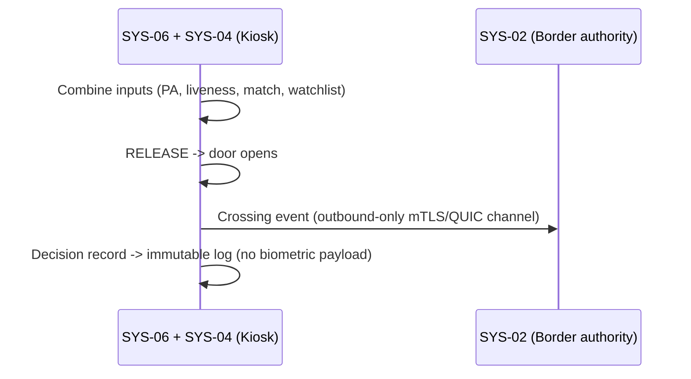

# Use Cases Catalog — SecureBorder Solutions

## 1. DOCUMENT PURPOSE

This document defines the **security and privacy use cases** for SecureBorder Solutions B.V., derived from Phase 1 (Company Context, Compliance Matrix) and Phase 2 (Rules Catalog, Privacy/Security Goals, Strategic Tensions).

**Alignment with Class Model:**
- `UseCase` — Functional security and privacy scenarios
- `BusinessGoal` — Strategic objectives from Phase 1
- `Stakeholder` — Actors from Company Context (450 employees, B2G/B2B)
- `DerivationNode` — Link to requirements allocation

**Phase 3 Step:** B (Use Cases Catalog — Security + Privacy + AI Focus)

**Gate Criteria:**
- [ ] All 38 goals mapped to use cases
- [ ] All 63 rules covered (38 CR + 25 BP)
- [ ] All 9 strategic tensions addressed
- [ ] Stakeholders assigned to use cases
- [ ] AI_Act high-risk requirements explicitly covered
- [ ] GDPR Art. 9 biometric data processing covered

---

## 2. USE CASES CATALOG METADATA

| Attribute | Value |
|-----------|-------|
| useCasesCatalogId | UC-SECUREBORDER-2026-001 |
| completionDate | 2026-04-04 |
| basedOnCompanyContext | CC-SECUREBORDER-2026-001 |
| basedOnRulesCatalog | RULES-SECUREBORDER-2026-001 |
| basedOnGoalsCatalog | GOALS-SECUREBORDER-2026-001 |
| basedOnTensionsReport | STR-TENSION-SECUREBORDER-2026-001 |
| completedBy | System Architect |
| phase3Step | B1+B2+B3+B4 |
| companyProfile | Medium-Large (450 employees), B2G/B2B, GDPR+CRA+NIS2+AI_Act |
| totalUseCases | 44 |
| categories | DP, SEC, IAM, DEV, GOV, AI, TRN |

---

## 3. STAKEHOLDER CATALOG (from Phase 1)

### 3.1 Internal Stakeholders

| Stakeholder ID | Name/Role | Type | Responsibilities | Contact | FTE Allocation |
|----------------|-----------|------|------------------|---------|----------------|
| SH-INT-001 | CEO | Internal | Business decisions, risk acceptance, board-level security committee | ceo@secureborder.eu | 0.05 |
| SH-INT-002 | CTO | Internal | Technical architecture, secure SDLC oversight, AI system design | cto@secureborder.eu | 0.3 |
| SH-INT-003 | CISO | Internal | ISMS management, SOC oversight, incident response, regulatory reporting | ciso@secureborder.eu | 1.0 |
| SH-INT-004 | DPO | Internal | GDPR compliance, DPIA execution, data subject rights, RoPA maintenance | dpo@secureborder.eu | 1.0 |
| SH-INT-005 | AI Governance Lead | Internal | AI_Act conformity, FRIA execution, post-market monitoring, bias testing | ai-gov@secureborder.eu | 1.0 |
| SH-INT-006 | Lead Developer | Internal | Secure coding, code review, CI/CD pipeline, SBOM generation | dev-lead@secureborder.eu | 0.4 |
| SH-INT-007 | Operations Lead | Internal | Infrastructure management, patch deployment, system monitoring | ops-lead@secureborder.eu | 0.5 |
| SH-INT-008 | SOC Manager | Internal | 24/7 SOC operations, incident detection/triage, alert management | soc-mgr@secureborder.eu | 1.0 |
| SH-INT-009 | Security Engineer | Internal | Vulnerability management, penetration testing, security tooling | sec-eng@secureborder.eu | 1.0 |
| SH-INT-010 | Compliance Analyst | Internal | Audit preparation, compliance reporting, vendor assessments | compliance@secureborder.eu | 1.0 |

### 3.2 External Stakeholders

| Stakeholder ID | Name/Role | Type | Responsibilities | Relationship | SLA/Contract |
|----------------|-----------|------|------------------|--------------|--------------|
| SH-EXT-001 | Border Control Officer | External | Operates eGate, reviews AI decisions, human-in-the-loop override | Government authority | Government contract |
| SH-EXT-002 | Traveler (Data Subject) | External | Biometric data subject, privacy rights holder | End user of eGate | GDPR Rights |
| SH-EXT-003 | National Border Authority | External | Controller for biometric data, watchlist management | Government client | B2G contract |
| SH-EXT-004 | Airport Operator | External | Physical infrastructure, network connectivity, physical security | B2B client | B2B contract + SLA |
| SH-EXT-005 | Cloud Provider | External | Remote infrastructure for AI model updates, model hosting | Processor | DPA + SLA (99.99%) |
| SH-EXT-006 | Hardware Supplier | External | eGate kiosk hardware, biometric sensors, cryptographic modules | Supplier | Supply contract + SBOM |
| SH-EXT-007 | Notified Body (CRA) | External | Critical Class conformity assessment, third-party certification | Regulator (CRA) | Assessment contract |
| SH-EXT-008 | ENISA | External | Vulnerability coordination, cybersecurity guidance | Regulator | As required |
| SH-EXT-009 | National CSIRT | External | Incident early warning, threat intelligence sharing | Regulator (NIS 2) | 24h notification |
| SH-EXT-010 | Data Protection Authority | External | GDPR supervision, breach notification recipient, audit | Regulator (GDPR) | 72h notification |
| SH-EXT-011 | AI Market Surveillance Authority | External | AI_Act supervision, conformity verification, post-market oversight | Regulator (AI_Act) | Cooperation |
| SH-EXT-012 | External Auditor | External | ISO 27001/27701 audits, compliance verification | Independent | Annual |
| SH-EXT-013 | Penetration Testing Firm | External | Threat-led penetration testing, AI adversarial testing | Service provider | Annual contract |

### 3.3 Stakeholder → Use Case Summary

| Stakeholder | Primary Use Cases | Support Use Cases | Frequency | FTE Required |
|-------------|-------------------|-------------------|-----------|--------------|
| SH-INT-001 (CEO) | U.C.5.1.1, U.C.5.2.1 | U.C.2.5.1 | Quarterly | 0.05 |
| SH-INT-002 (CTO) | U.C.4.1.1, U.C.4.2.1, U.C.6.1.1 | U.C.2.5.1, U.C.5.3.1 | Weekly | 0.3 |
| SH-INT-003 (CISO) | U.C.2.1.1, U.C.2.2.1, U.C.2.3.1, U.C.5.3.1 | U.C.2.4.1, U.C.5.1.1 | Daily | 1.0 |
| SH-INT-004 (DPO) | U.C.1.1.1, U.C.1.2.1, U.C.1.3.1, U.C.5.5.1 | U.C.2.2.1, U.C.5.4.1 | Daily | 1.0 |
| SH-INT-005 (AI Gov) | U.C.6.1.1, U.C.6.2.1, U.C.6.3.1, U.C.6.4.1 | U.C.5.5.1, U.C.2.2.1 | Daily | 1.0 |
| SH-INT-006 (Dev Lead) | U.C.4.1.1, U.C.4.2.1, U.C.4.3.1 | U.C.4.4.1, U.C.4.5.1 | Daily | 0.4 |
| SH-INT-007 (Ops Lead) | U.C.2.4.1, U.C.3.1.1, U.C.3.5.1 | U.C.2.6.1, U.C.3.6.1 | Daily | 0.5 |
| SH-INT-008 (SOC Mgr) | U.C.2.1.1, U.C.2.6.1, U.C.2.7.1 | U.C.2.2.1, U.C.6.5.1 | 24/7 | 1.0 |
| SH-INT-009 (Sec Eng) | U.C.2.3.1, U.C.2.8.1 | U.C.4.3.1, U.C.6.6.1 | Weekly | 1.0 |
| SH-INT-010 (Compliance) | U.C.5.4.1, U.C.5.6.1, U.C.5.7.1 | U.C.5.5.1, U.C.1.4.1 | Monthly | 1.0 |
| SH-EXT-001 (Border Officer) | U.C.3.2.1, U.C.6.3.1 | U.C.2.7.1 | Per shift | N/A |
| SH-EXT-002 (Traveler) | U.C.1.1.1, U.C.1.2.1 | U.C.3.3.1 | As needed | N/A |
| SH-EXT-003 (Border Authority) | U.C.5.7.1, U.C.1.4.1 | U.C.6.4.1 | As required | N/A |

---

## 4. BUSINESS GOALS MAPPING (from Phase 1)

### 4.1 Security Business Goals

| Goal ID | Goal Description | Priority | Related Regulations | Related Stakeholders |
|---------|------------------|----------|---------------------|---------------------|
| BG-001 | CRA Critical Class certification | CRITICAL | CRA | SH-INT-002, SH-INT-003, SH-EXT-007 |
| BG-002 | AI_Act conformity assessment | CRITICAL | AI_Act | SH-INT-005, SH-INT-002, SH-EXT-011 |
| BG-003 | NIS 2 compliance (24h incident reporting) | CRITICAL | NIS 2 | SH-INT-003, SH-INT-008, SH-EXT-009 |
| BG-004 | GDPR Art. 9 biometric data compliance | CRITICAL | GDPR | SH-INT-004, SH-INT-005, SH-EXT-010 |
| BG-005 | 99.99% uptime SLA | HIGH | NIS 2, CRA | SH-INT-007, SH-INT-008, SH-EXT-005 |
| BG-006 | Schengen Area expansion readiness | HIGH | GDPR, AI_Act | SH-INT-001, SH-EXT-003 |
| BG-007 | ISO 27001/27701 maintenance | HIGH | ISO 27001/27701 | SH-INT-003, SH-INT-010, SH-EXT-012 |

---

## 5. SYSTEM OVERVIEW

### 5.1 Use Case Diagram (Level 0)

```mermaid
useCaseDiagram
    actor "Border Control Officer" as BCO
    actor "Traveler" as TRV
    actor "CISO" as CISO
    actor "DPO" as DPO
    actor "AI Governance Lead" as AIG
    actor "SOC Manager" as SOC
    actor "Lead Developer" as DEV
    actor "Operations Lead" as OPS
    actor "Compliance Analyst" as COMP
    actor "National Border Authority" as NBA
    actor "ENISA/CSIRT" as ENISA
    actor "Data Protection Authority" as DPA
    actor "AI Market Surveillance" as AIMS

    package "Data Protection" {
        usecase "UC-DP\nData Subject Rights\n& Privacy" as UCDP
    }
    package "Security Operations" {
        usecase "UC-SEC\nIncident Detection,\nResponse & Recovery" as UCSEC
    }
    package "Identity & Access Mgmt" {
        usecase "UC-IAM\nAuthentication,\nAuthorization & Lifecycle" as UCIAM
    }
    package "Secure Development" {
        usecase "UC-DEV\nSecure SDLC,\nCI/CD & SBOM" as UCDEV
    }
    package "Governance & Compliance" {
        usecase "UC-GOV\nISMS, Audits,\nRisk Assessments" as UCGOV
    }
    package "AI Systems" {
        usecase "UC-AI\nAI Conformity, Monitoring,\nBias & Human Oversight" as UCAI
    }
    package "Training & Awareness" {
        usecase "UC-TRN\nSecurity & AI\nTraining" as UCTRN
    }

    BCO --> UCIAM
    BCO --> UCAI
    TRV --> UCDP
    TRV --> UCIAM
    CISO --> UCSEC
    CISO --> UCGOV
    DPO --> UCDP
    DPO --> UCGOV
    AIG --> UCAI
    AIG --> UCGOV
    SOC --> UCSEC
    SOC --> UCAI
    DEV --> UCDEV
    OPS --> UCIAM
    OPS --> UCSEC
    COMP --> UCGOV
    NBA --> UCGOV
    ENISA --> UCSEC
    DPA --> UCDP
    AIMS --> UCAI
```

### 5.2 Level 0 Use Case Descriptions

| UC ID | Use Case Name | Description | Primary Actors | Business Goals | Priority |
|-------|---------------|-------------|----------------|----------------|----------|
| UC-DP | Data Subject Rights & Privacy | Exercise GDPR data subject rights (access, erasure, portability) and protect biometric data | DPO, Traveler, Border Authority | BG-004, BG-006 | CRITICAL |
| UC-SEC | Security Operations | Detect, respond to, and recover from security incidents; manage vulnerabilities | CISO, SOC Manager, Operations Lead | BG-003, BG-005 | CRITICAL |
| UC-IAM | Identity & Access Management | Manage identities, authentication, authorization for operators and systems | Operations Lead, Border Control Officer | BG-001, BG-003 | CRITICAL |
| UC-DEV | Secure Development | Implement secure SDLC, CI/CD gates, SBOM, dependency management | Lead Developer, CTO | BG-001, BG-007 | HIGH |
| UC-GOV | Governance & Compliance | Maintain ISMS, conduct risk assessments, audits, regulatory reporting | CISO, Compliance Analyst, DPO | BG-001, BG-002, BG-003, BG-004, BG-007 | CRITICAL |
| UC-AI | AI Systems Management | AI conformity assessment, post-market monitoring, bias testing, human oversight | AI Governance Lead, SOC Manager | BG-002, BG-004, BG-006 | CRITICAL |
| UC-TRN | Training & Awareness | Security awareness, role-specific training, AI competence, phishing simulation | All internal staff | BG-003, BG-007 | HIGH |

---

## 6. PRODUCT FUNCTIONAL USE CASES (U.C.8+, PKG-8..12) — GuardianGate product

> **v1.3 (PORT-PARITY-2 Phase 3 restructure, 2026-09-04).** This section models the
> **GuardianGate product itself** as a normal software product: actor-goal use cases in
> fully-dressed form (Cockburn), with security/compliance layered on as an annex per use
> case (constrained-by, rules, threats, anchors) rather than as the use case's reason to
> exist. **Nomenclature is unchanged**: the pre-existing security/compliance use cases
> (U.C.1–U.C.7) keep their IDs and content verbatim (now §7, §9); functional product use
> cases take the free range **U.C.8+**. ID scheme: `U.C.<package>.<group>.<uc>`.
>
> **Template (2026-09-04):** the §6.1 use cases are written fully-dressed in the RUP-style
> per-UC template of `03_REFERENCE_MATERIAL/P3_E2_Requirement_Analysis_Bike4All_Maintenance_platform_v1r2.md`
> (sections 1–10, one Mermaid sequence diagram per UC), adjusted to AEGIS: section 10 is the
> **Security & Compliance Annex (AEGIS)** carrying provenance, constrained-by, rules, threats
> and NIST anchors; MUC linkage is preserved.

### 6.0 Product actors (reuse of existing stakeholder IDs — no new ID scheme)

| Actor (existing SH- ID) | Role in the product | Drives |
|-------------------------|---------------------|--------|
| SH-EXT-002 (Traveler) | Primary product user: crosses the border via the eGate. | U.C.8.1.*, U.C.8.2.*, U.C.8.3.1, U.C.8.4.1 |
| SH-EXT-001 (Border Officer) | Human oversight: handles referrals, manual verification, overrides. | U.C.8.3.2 |
| SH-INT-007 (Ops Lead) | Kiosk fleet operations (provisioning, health, OTA supervision). | U.C.8 (PKG-10, massification) |
| SH-INT-005 (AI Governance Lead) | AI model lifecycle oversight (rollout, drift, bias review). | U.C.8 (PKG-11, massification) |
| SH-INT-008 (SOC Manager) | Consumes security events raised by the journey (tamper, spoofing, lockouts). | Annex targets |
| SYS-04 / SYS-06 (kiosk) | The product itself: Edge AI firmware + kiosk hardware acting for the actors above. | All U.C.8.* |

### 6.1 PKG-8 — Traveller eGate Journey (7)

| UC ID | Title | Primary Actor | Prio |
|-------|-------|---------------|------|
| U.C.8.1.1 | Scan Travel Document (MRZ + NFC chip) | SH-EXT-002 | CRITICAL |
| U.C.8.2.1 | Capture Facial Biometric Sample | SH-EXT-002 | CRITICAL |
| U.C.8.2.2 | Liveness Detection (Presentation Attack Detection) | SH-EXT-002 | CRITICAL |
| U.C.8.2.3 | Face Match 1:1 Against Chip Portrait | SH-EXT-002 | CRITICAL |
| U.C.8.3.1 | Gate Decision & Release | SH-EXT-002 | CRITICAL |
| U.C.8.3.2 | Referral to Operator Desk | SH-EXT-001 | HIGH |
| U.C.8.4.1 | Traveller Privacy Notice & Consent Capture | SH-EXT-002 | HIGH |

#### Use-Case: {U.C.8.1.1} Scan Travel Document (MRZ + NFC chip)

##### 1 Brief Description

The kiosk reads the traveller's eMRTD passport and establishes an authenticated channel to
its NFC chip, producing the reference portrait and document data used by the rest of the
journey. It is triggered when the traveller confirms start on the kiosk screen and places
the passport on the reader. This is the entry use case of the GuardianGate eGate journey
(PKG-8): without a Passive-Authenticated chip read, the journey never proceeds on the
optical MRZ alone.

##### 2 Actor Brief Descriptions

###### 2.1 SH-EXT-002 (Traveler) — Primary Actor:

Places the passport on the reader and confirms the extracted document data.

###### 2.2 SYS-06 (Kiosk hardware):

Provides the passport MRZ scanner and NFC reader; captures the optical MRZ line and reads
the chip (portrait + MRZ data).

###### 2.3 SYS-04 (Edge AI firmware):

Runs as signed firmware on TPM 2.0 secure boot; performs the in-kiosk document processing
of this use case.

###### 2.4 SH-EXT-001 (Border Officer):

Receives the traveller at the referral desk when the document step fails (U.C.8.3.2).

###### 2.5 National Border Control authority (via SYS-02):

Data controller of the crossing records; downstream consumer of the journey outcome.

##### 3 Preconditions

- Kiosk idle, healthy and enrolled (PKG-10).
- Traveller holds an eMRTD passport.

##### 4 Basic Flow of Events

1. Kiosk displays on-screen instructions (language auto-selected from setting).
2. Traveller places the passport on the MRZ reader; kiosk reads the MRZ optical line.
3. Kiosk derives BAC/PACE keys from the MRZ and opens the NFC chip channel.
4. Kiosk reads the chip (portrait + MRZ data) and validates Passive Authentication against the CSCA chain.
5. Kiosk displays the extracted document data for the traveller to confirm.

```mermaid
sequenceDiagram
    participant TRV as SH-EXT-002 (Traveler)
    participant KIOSK as SYS-06 + SYS-04 (Kiosk)
    TRV->>KIOSK: Confirm start; place passport on reader
    KIOSK->>KIOSK: Read MRZ, derive BAC/PACE, open NFC chip channel
    KIOSK->>KIOSK: Read chip (portrait + MRZ), validate PA vs CSCA
    KIOSK-->>TRV: Display extracted document data for confirmation
```

##### 5 Alternative Flows

###### 5.1 <Alternate flow: MRZ unreadable>

Trigger: step 2 fails optically. The kiosk guides re-placement (max 3 attempts), then
offers referral (U.C.8.3.2).

###### 5.2 <Alternate flow: Chip read fails or Passive Authentication invalid>

Trigger: step 4 fails. The kiosk does NOT continue on MRZ alone; it routes to referral
(U.C.8.3.2) and raises a security event (U.C.2.1.1).

###### 5.3 <Alternate flow: MRZ-vs-chip data mismatch>

Trigger: step 5 comparison fails. The case is treated as a suspected forged document:
referral + security event (MUC-C2-03).

##### 6 Subflows

###### 6.1 <Subflow: Chip authentication (BAC/PACE + PA)>

1. Derive BAC/PACE keys from the optical MRZ line.
2. Open the NFC chip channel.
3. Validate Passive Authentication of the chip certificate chain against the CSCA chain.

###### 6.2 <Subflow: Security event raise>

1. Kiosk assembles the event context (kiosk ID, timestamp, reason class).
2. Event is forwarded on the security event pipeline (U.C.2.1.1, CR-D-04.1-001).

##### 7 Key Scenarios

###### 7.1 <Scenario: Document accepted>

1. Chip portrait and document data become available to the match step; the traveller confirms and proceeds to U.C.8.2.1.

###### 7.2 <Scenario: Forged/cloned document suspected>

1. MRZ-vs-chip mismatch or invalid PA routes the traveller to the referral desk with a security event raised (MUC-C2-03).

##### 8 Post-conditions

###### 8.1

Chip portrait and document data available to the match step (in-kiosk, transient).

###### 8.2

Attempt logged in the decision log with no biometric payload.

##### 9 Special Requirements (FURPS+)

**Functional (F):** MRZ + NFC chip read with Passive Authentication; no continuation on
MRZ alone when PA fails (privacy/security constraint by design).

**Usability (U):** On-screen instructions with automatic language selection; guided
re-placement on read failure (max 3 attempts).

**Reliability (R):** A security event is raised on every failure path (CR-D-04.1-001);
tamper resistance anchored in signed firmware + TPM 2.0 secure boot (MUC-C2-04).

**Performance (P):** N/A — no attested timing constraint for the document step.

**Supportability (S):** Runs as signed Edge AI firmware with TPM 2.0 secure boot (SYS-04);
firmware lifecycle operated under kiosk fleet operations (PKG-10, SH-INT-007).

##### 10 Security & Compliance Annex (AEGIS)

- **Provenance:** [ATTESTED] `01_PHASE1_CONTEXT_RICH/Doc04_Architecture_DataInventory.md` §1.1 SYS-06 (3D camera + passport MRZ scanner) and SYS-04 (signed Edge AI firmware, TPM 2.0 secure boot); §2.1 STORE-05 (transient on-kiosk template cache, deleted within seconds post-match per Art. 5(1)(c) minimisation).
- **Constrained by:** U.C.1.1.1 (data subject rights), U.C.6.1.1 / U.C.6.2.1 (AI oversight), U.C.2.1.1 (security events).
- **Rules / NFR:** CR-D-01.1-001 (kiosk flash encryption), CR-D-04.1-001 (security event pipeline), BPR-D-01.1-001.
- **Threats addressed:** MUC-C2-03 (forged/cloned eMRTD), MUC-C2-04 (kiosk tamper → TPM secure boot refuses compromised firmware).
- **NIST anchors:** PR.DS-01, DE.CM-01.

#### Use-Case: {U.C.8.2.1} Capture Facial Biometric Sample

##### 1 Brief Description

The kiosk captures the traveller's facial biometric sample and converts it into a
match-ready template entirely in-kiosk. It is triggered when the kiosk prompts the
traveller to look at the camera, after the document step (U.C.8.1.1) has produced the chip
portrait as reference. Raw frames never persist: they are purged immediately after
template creation (STORE-05 policy).

##### 2 Actor Brief Descriptions

###### 2.1 SH-EXT-002 (Traveler) — Primary Actor:

Aligns with the positioning guide; subject of the biometric capture.

###### 2.2 SYS-06 (Kiosk hardware):

3D camera captures the frame burst (3D depth + RGB).

###### 2.3 SYS-04 (Edge AI firmware):

Runs frame quality checks and computes the biometric template in-kiosk (TensorRT CNN face
match + liveness stack).

###### 2.4 SH-EXT-001 (Border Officer):

Receives the traveller on quality-exhaustion or hardware-anomaly referrals.

###### 2.5 SH-INT-005 (AI Governance Lead):

Owns the quality thresholds applied at the frame checks.

##### 3 Preconditions

- U.C.8.1.1 completed (chip portrait available as reference).

##### 4 Basic Flow of Events

1. Traveller aligns with the on-screen positioning guide.
2. Kiosk captures a short burst (3D depth + RGB frames).
3. Kiosk runs frame quality checks (pose, illumination, single face).
4. Kiosk computes the biometric template in-kiosk from the best frame.
5. Kiosk purges raw frames immediately after template creation (STORE-05 policy).

```mermaid
sequenceDiagram
    participant TRV as SH-EXT-002 (Traveler)
    participant KIOSK as SYS-06 + SYS-04 (Kiosk)
    KIOSK->>TRV: Prompt to look at camera
    TRV->>KIOSK: Align with positioning guide
    KIOSK->>KIOSK: Capture burst (3D depth + RGB), run quality checks
    KIOSK->>KIOSK: Compute template in-kiosk; purge raw frames (STORE-05)
```

##### 5 Alternative Flows

###### 5.1 <Alternate flow: Quality below threshold>

Trigger: step 3. Guided re-capture (max 2 retries), then referral (U.C.8.3.2).

###### 5.2 <Alternate flow: More than one face in frame>

Trigger: step 3. Suspected tailgating (MUC-C2-02): security event + referral.

###### 5.3 <Alternate flow: Template computation failure>

Trigger: step 4 (hardware anomaly). Referral; kiosk flagged for health check (PKG-10).

##### 6 Subflows

###### 6.1 <Subflow: Biometric template purge>

1. Template is held in volatile, encrypted memory (CR-D-01.2-001).
2. Raw frames are deleted immediately after template creation.
3. Nothing persists across reboot (STORE-05: no persistence across reboot; immediate purge).

###### 6.2 <Subflow: Guided re-capture>

1. Kiosk shows corrective guidance (pose, illumination, single face).
2. Maximum 2 retries; on exhaustion route to the referral desk (U.C.8.3.2).

##### 7 Key Scenarios

###### 7.1 <Scenario: Live sample captured>

1. One match-ready template exists in volatile, encrypted memory; the journey continues to liveness detection (U.C.8.2.2).

###### 7.2 <Scenario: Suspected tailgating>

1. More than one face in frame raises a security event and routes the case to referral (MUC-C2-02).

##### 8 Post-conditions

###### 8.1

One match-ready template exists in volatile, encrypted memory.

###### 8.2

Raw frames discarded.

##### 9 Special Requirements (FURPS+)

**Functional (F):** In-kiosk burst capture and template computation; immediate purge of
raw frames after template creation (STORE-05 — privacy constraint built into the function).

**Usability (U):** On-screen positioning guide; guided re-capture on quality failure.

**Reliability (R):** Purge guarantee holds on every path, including template computation
failure; template encryption (CR-D-01.2-001) and event monitoring (CR-D-10.1-001).

**Performance (P):** N/A — no attested timing constraint for the capture step.

**Supportability (S):** Capture quality thresholds are configurable and governed by
SH-INT-005 (AI Gov — quality thresholds).

##### 10 Security & Compliance Annex (AEGIS)

- **Provenance:** [ATTESTED] Doc04 §1.1 SYS-04 (TensorRT CNN face match + liveness), SYS-06 (3D camera); §2.1 STORE-05 (no persistence across reboot; immediate purge).
- **Constrained by:** U.C.1.1.1 (minimisation), U.C.6.2.1 (AI operating conditions).
- **Rules / NFR:** CR-D-01.2-001 (template encryption), CR-D-10.1-001 (event monitoring).
- **Threats addressed:** MUC-C2-02 (tailgating detection at frame stage).
- **NIST anchors:** PR.DS-01, DE.CM-03.

#### Use-Case: {U.C.8.2.2} Liveness Detection (Presentation Attack Detection)

##### 1 Brief Description

The kiosk certifies that the captured biometric sample comes from a live person present at
the sensor, using a passive+active presentation-attack detection challenge. It is triggered
automatically when template creation completes (U.C.8.2.1). A failed challenge never ends
in a silent automated rejection: the gate stays locked, the SOC is informed and the
traveller is referred to a human.

##### 2 Actor Brief Descriptions

###### 2.1 SH-EXT-002 (Traveler) — Primary Actor:

Subject of the liveness challenge.

###### 2.2 SYS-04 (Edge AI firmware):

Computes the liveness score in-kiosk (CNN liveness on ARM SoC, TPM-bound firmware).

###### 2.3 SH-INT-005 (AI Governance Lead):

Governs the PAD threshold — a governed artefact under AI model change control (U.C.6.3.1).

###### 2.4 SH-INT-008 (SOC Manager):

Receives spoof-alert security events.

###### 2.5 SH-EXT-001 (Border Officer):

Receives the traveller after a failed challenge.

##### 3 Preconditions

- U.C.8.2.1 produced a quality template.

##### 4 Basic Flow of Events

1. Kiosk issues a passive+active liveness challenge (micro-movement and depth/texture analysis).
2. Edge CNN computes the liveness score in-kiosk.
3. Score ≥ configured threshold → sample certified as live; continue to U.C.8.2.3.

```mermaid
sequenceDiagram
    participant TRV as SH-EXT-002 (Traveler)
    participant KIOSK as SYS-04 (Edge AI PAD)
    participant SOC as SH-INT-008 (SOC)
    TRV->>KIOSK: Present to sensor
    KIOSK->>KIOSK: Passive+active challenge; CNN liveness score in-kiosk
    KIOSK->>KIOSK: Score >= threshold -> sample certified live
    KIOSK-->>SOC: On failure: spoof security event (kiosk ID + timestamp)
```

##### 5 Alternative Flows

###### 5.1 <Alternate flow: Liveness score below threshold>

Trigger: step 3. One re-challenge; a second failure = suspected presentation attack
(MUC-C2-01): gate stays locked, security event with kiosk ID + timestamp to SOC
(U.C.2.1.1), traveller referred (U.C.8.3.2).

###### 5.2 <Alternate flow: Camera/depth sensor anomaly>

Trigger: step 2 (sensor health). Referral; raise maintenance event (PKG-10).

##### 6 Subflows

###### 6.1 <Subflow: Presentation-attack challenge>

1. Issue the passive+active challenge (micro-movement, depth/texture analysis).
2. Compute the liveness score in-kiosk on the ARM SoC.
3. Compare against the configured (governed) threshold.

###### 6.2 <Subflow: Security event raise>

Same reusable fragment as U.C.8.1.1 §6.2: event context (kiosk ID, timestamp, reason
class) forwarded to SOC via the security event pipeline (U.C.2.1.1).

##### 7 Key Scenarios

###### 7.1 <Scenario: Live sample certified>

1. Liveness verdict recorded (score bucket); the journey continues to face match (U.C.8.2.3).

###### 7.2 <Scenario: Presentation attack suspected>

1. Gate stays locked; SOC receives the spoof event with kiosk ID + timestamp; traveller referred (MUC-C2-01).

##### 8 Post-conditions

###### 8.1

Liveness verdict recorded in the decision log (score bucket, not raw score).

###### 8.2

On success the sample is certified live and the journey continues (U.C.8.2.3); on failure
the kiosk remains locked and the case is referred.

##### 9 Special Requirements (FURPS+)

**Functional (F):** Passive+active PAD challenge executed fully in-kiosk; verdict recorded
as score bucket only.

**Usability (U):** N/A — fully automated step; the traveller only experiences the
challenge prompt.

**Reliability (R):** Fail-closed behaviour on suspected attack (gate stays locked);
red-team validated PAD path (CR-D-02.4-001) with event monitoring (CR-D-10.1-001).

**Performance (P):** N/A — no attested timing constraint for the liveness step (the ≤ 2 s
end-to-end target belongs to the match step, U.C.8.2.3).

**Supportability (S):** PAD thresholds are governed artefacts under AI model change
control (U.C.6.3.1).

##### 10 Security & Compliance Annex (AEGIS)

- **Provenance:** [ATTESTED] Doc04 §1.1 SYS-04 (CNN liveness on ARM SoC, TPM-bound firmware); Doc03 §4 (eGate automated border control product).
- **Constrained by:** U.C.6.3.1 (AI model change control — thresholds are governed artefacts), U.C.2.1.1.
- **Rules / NFR:** CR-D-01.2-001, CR-D-02.4-001 (red-team validation of the PAD path), CR-D-10.1-001.
- **Threats addressed:** MUC-C2-01 (presentation attack: photo/video/3D mask/deepfake injection).
- **NIST anchors:** PR.AA-01, DE.CM-01.

#### Use-Case: {U.C.8.2.3} Face Match 1:1 Against Chip Portrait

##### 1 Brief Description

The kiosk compares the live biometric template against the chip portrait (1:1 similarity)
and produces the match decision input for the gate decision. It is triggered when the
liveness verdict is "live" (U.C.8.2.3 precondition from U.C.8.2.2). Biometric data is
transient by design: once the verdict exists, template and frames are purged and only the
decision record persists.

##### 2 Actor Brief Descriptions

###### 2.1 SH-EXT-002 (Traveler) — Primary Actor:

Subject of the match; waits while the comparison runs.

###### 2.2 SYS-04 (Edge AI firmware):

CNN face match; computes the 1:1 similarity score (target ≤ 2 s end-to-end).

###### 2.3 SH-EXT-001 (Border Officer):

Receives below-threshold and grey-band referrals with reason "match".

###### 2.4 National Border Control authority (via SYS-02):

Match decisions are shared with the national border control system.

##### 3 Preconditions

- U.C.8.1.1 (reference portrait) + U.C.8.2.2 (live sample) completed.

##### 4 Basic Flow of Events

1. Kiosk compares the live template against the chip portrait (1:1 similarity).
2. Kiosk computes the similarity score (target ≤ 2 s end-to-end).
3. Score ≥ match threshold → decision input TRUE; continue to U.C.8.3.1.
4. Template and frames are purged; only the decision record persists.

```mermaid
sequenceDiagram
    participant KIOSK as SYS-04 (Edge AI)
    participant AUTH as SYS-02 (Border authority)
    KIOSK->>KIOSK: 1:1 live template vs chip portrait; similarity score (<= 2 s)
    KIOSK->>KIOSK: Threshold decision; purge template + frames, keep decision record
    KIOSK-->>AUTH: Match decision shared with national border control
```

##### 5 Alternative Flows

###### 5.1 <Alternate flow: Score below match threshold>

Trigger: step 3. NEVER auto-reject on the biometric alone: referral (U.C.8.3.2) with
reason "match" (AI Act human oversight, Art. 14).

###### 5.2 <Alternate flow: Grey-band score>

Trigger: step 3, score in the configurable grey band → referral regardless.

###### 5.3 <Alternate flow: Chip portrait quality insufficient>

Trigger: step 1. Document-level fallback rules apply; referral.

##### 6 Subflows

###### 6.1 <Subflow: Biometric template purge>

Same reusable fragment as U.C.8.2.1 §6.1, executed after the verdict: template and frames
purged, only the decision record persists (STORE-05; Art. 5(1)(c) minimisation).

###### 6.2 <Subflow: Decision log write>

1. Assemble the decision record (verdict, score bucket, reason class; no biometric payload).
2. Append to the decision log per the content rule CR-D-01.3-001.

##### 7 Key Scenarios

###### 7.1 <Scenario: Match confirmed>

1. Decision input TRUE; the journey continues to gate decision (U.C.8.3.1); no biometric data persisted on kiosk or cloud.

###### 7.2 <Scenario: Below threshold or grey band>

1. Human referral with reason "match" — never an automated rejection on the biometric alone (Art. 14).

##### 8 Post-conditions

###### 8.1

Match verdict in the decision log.

###### 8.2

No biometric data persisted on kiosk or cloud.

##### 9 Special Requirements (FURPS+)

**Functional (F):** 1:1 similarity against the chip portrait; threshold + grey-band
routing to human review; purge-after-verdict.

**Usability (U):** N/A — automated step; the traveller only experiences the waiting time.

**Reliability (R):** No-auto-reject policy on biometric failure (fail-safe to human
oversight); decision log content per CR-D-01.3-001 with event monitoring (CR-D-10.1-001).

**Performance (P):** Match computed with a target of ≤ 2 s end-to-end.

**Supportability (S):** Match and grey-band thresholds remain configurable under the AI
oversight constraint chain (U.C.6.2.1 / U.C.6.3.1).

##### 10 Security & Compliance Annex (AEGIS)

- **Provenance:** [ATTESTED] Doc04 §1.1 SYS-04 (CNN face match), SYS-02 (match decisions shared with national border control); Doc02 §gates (AI Act provider role).
- **Constrained by:** U.C.6.2.1, U.C.6.4.1 (AI incident reporting), U.C.1.1.1.
- **Rules / NFR:** CR-D-01.3-001 (decision log content), CR-D-10.1-001.
- **Threats addressed:** MUC-C2-01 (residual deepfake risk after PAD), MUC-C2-03 (enrolment-fraud variants).
- **NIST anchors:** PR.AA-01, PR.DS-01.

#### Use-Case: {U.C.8.3.1} Gate Decision & Release

##### 1 Brief Description

The kiosk combines the decision inputs (document PA, liveness, match, watchlist status)
and releases or holds the traveller. It is triggered when all decision inputs are
available. On release the door opens, the crossing event reaches the national border
control system (SYS-02), and the decision record lands in the immutable decision log —
with no biometric payload.

##### 2 Actor Brief Descriptions

###### 2.1 SH-EXT-002 (Traveler) — Primary Actor:

Exits through the gate into the border zone on a RELEASE decision.

###### 2.2 SYS-06 + SYS-04 (Kiosk):

Combines the decision inputs, controls the door interlock and emits the crossing event.

###### 2.3 SYS-02 (National border control gateway):

mTLS gateway to government DBs; receives the crossing event for the crossing record.

###### 2.4 SH-EXT-001 (Border Officer):

Receives watchlist-hit and door-failure referrals.

##### 3 Preconditions

- U.C.8.1.1 ✓ PA; U.C.8.2.2 ✓ live; U.C.8.2.3 ✓ match; watchlist status resolvable.

##### 4 Basic Flow of Events

1. Kiosk combines decision inputs (PA, liveness, match, watchlist status).
2. Decision = RELEASE → door opens; traveller exits into the border zone.
3. Kiosk emits the crossing event to SYS-02 (national border control integration).
4. Decision record written to the immutable decision log (U.C. audit chain) — no biometric payload.



##### 5 Alternative Flows

###### 5.1 <Alternate flow: Watchlist hit>

Trigger: step 1. QUIET referral (U.C.8.3.2) with reason "authority"; the traveller is not
alerted of the reason (officer-display only).

###### 5.2 <Alternate flow: Door obstructed / timed out>

Trigger: step 2. Safe re-lock, assisted retry, then referral.

###### 5.3 <Alternate flow: SYS-02 unreachable>

Trigger: step 3. Offline mode: store-and-forward the crossing event (signed, queued) per
PKG-10 failover policy; gate may stay open under locally cached rules only if policy
allows.

##### 6 Subflows

###### 6.1 <Subflow: Decision log write>

1. Assemble the decision record (inputs, verdict, timestamps; no biometric payload).
2. Append to the immutable decision log (STORE-04 WORM audit chain; log integrity per CR-D-01.4-001).

###### 6.2 <Subflow: Offline store-and-forward>

1. Sign the crossing event locally.
2. Queue it per the PKG-10 failover policy.
3. Forward to SYS-02 when connectivity is restored.

##### 7 Key Scenarios

###### 7.1 <Scenario: Release>

1. Crossing recorded by the authority; kiosk back to idle; decision log complete.

###### 7.2 <Scenario: Watchlist hit>

1. Quiet referral — the traveller is unaware of the reason; the officer sees "authority" only; one-traveller interlock discipline kept (MUC-C2-02).

##### 8 Post-conditions

###### 8.1

Crossing recorded by the authority.

###### 8.2

Kiosk back to idle; decision log complete.

##### 9 Special Requirements (FURPS+)

**Functional (F):** Decision composition and release; crossing-event emission to SYS-02;
offline failover mode with store-and-forward.

**Usability (U):** N/A for the decision logic itself; door UX covered by the assisted
retry on obstruction.

**Reliability (R):** Immutable decision log (STORE-04 WORM audit chain, CR-D-01.4-001);
store-and-forward survives SYS-02 outages (availability discipline, MUC-07-analogue).

**Performance (P):** N/A — no attested timing constraint for the decision step.

**Supportability (S):** Outbound-only kiosk channel (mTLS/QUIC, Doc04 §1.2) keeps the
integration surface minimal to operate and monitor.

##### 10 Security & Compliance Annex (AEGIS)

- **Provenance:** [ATTESTED] Doc04 §1.1 SYS-02 (mTLS gateway to government DBs), §1.2 (outbound-only kiosk channel, mTLS/QUIC); STORE-04 (WORM audit chain).
- **Constrained by:** U.C.2.6.1 (continuous monitoring), U.C.5.7.1 (authority reporting).
- **Rules / NFR:** CR-D-04.3-001 (notification workflows), CR-D-01.4-001 (log integrity), BPR-D-04.2-001.
- **Threats addressed:** MUC-C2-02 (tailgating: one-traveller interlock), MUC-07-analogue (availability: offline failover).
- **NIST anchors:** PR.DS-01, PR.IR-01.

#### Use-Case: {U.C.8.3.2} Referral to Operator Desk

##### 1 Brief Description

The border officer resolves at the desk every case the kiosk could not: document,
liveness, match, watchlist or quality referrals. It is triggered when the kiosk issues a
queue token and directs the traveller to the desk. The officer — not the AI — is the
decision-maker here, with mandatory reason codes recorded on the immutable audit chain.

##### 2 Actor Brief Descriptions

###### 2.1 SH-EXT-001 (Border Officer) — Primary Actor:

Reviews the reason class and evidence, verifies identity manually and records the
decision.

###### 2.2 SH-EXT-002 (Traveler):

Presents at the desk with the queue token.

###### 2.3 SYS-08 (Officer console):

SSO (Okta+ADFS) with mandatory FIDO2; presents the queue and referral data.

###### 2.4 SH-INT-008 (SOC Manager):

Escalation path for confirmed impostors.

###### 2.5 SH-INT-004 (DPO):

Audits overrides.

##### 3 Preconditions

- Any referral reason raised by U.C.8.1.1–8.3.1 (document, liveness, match, watchlist, quality).

##### 4 Basic Flow of Events

1. Officer console (SYS-08 SSO + FIDO2) shows the queue position and the traveller entry.
2. Officer reviews the reason class, the chip data and the live camera view.
3. Officer verifies identity manually (visual + document cross-check).
4. Officer records the decision (approve / deny) + mandatory reason code.
5. Gate or manual lane proceeds accordingly; decision logged to the immutable audit chain.

```mermaid
sequenceDiagram
    participant OFF as SH-EXT-001 (Border Officer)
    participant CON as SYS-08 (Console, SSO+FIDO2)
    participant LOG as Immutable audit chain
    OFF->>CON: Authenticate (FIDO2); open work item
    CON-->>OFF: Reason class, chip data, live camera view
    OFF->>CON: Record decision (approve/deny) + reason code
    CON->>LOG: Append decision (officer ID, timestamps)
```

##### 5 Alternative Flows

###### 5.1 <Alternate flow: Console MFA failure>

Trigger: step 1. No referral data displayed; fail-closed.

###### 5.2 <Alternate flow: Confirmed impostor>

Trigger: step 4. Deny + escalate to SOC incident flow (U.C.2.1.1) + authority
notification (U.C.2.5.1 if reportable).

###### 5.3 <Alternate flow: Queue overflow>

Trigger: step 1, all officers busy. Kiosks throttle intake (entry doors locked), SOC
informed.

##### 6 Subflows

###### 6.1 <Subflow: Officer console session>

1. SYS-08 SSO with mandatory FIDO2 authentication (CR-D-03.2-001).
2. The authenticated session binds the officer identity to every recorded action (identity lifecycle per CR-D-03.1-001).

###### 6.2 <Subflow: Decision log write>

Same reusable fragment as U.C.8.3.1 §6.1: officer decision + mandatory reason code
appended to the immutable audit chain (CR-D-10.1-001 event monitoring applies).

##### 7 Key Scenarios

###### 7.1 <Scenario: Identity resolved>

1. Human decision on record with officer ID, reason code and timestamps; gate or manual lane proceeds accordingly.

###### 7.2 <Scenario: Rubber-stamp resistance>

1. Overrides and decision patterns remain auditable (reason codes + audit sampling) against MUC-C2-05.

##### 8 Post-conditions

###### 8.1

Human decision on record with officer ID, reason code and timestamps.

###### 8.2

Where applicable, escalation and notification completed (SOC incident flow, authority
notification if reportable).

##### 9 Special Requirements (FURPS+)

**Functional (F):** Queue management, manual verification workflow, decision recording
with mandatory reason codes, lane dispatch.

**Usability (U):** Console presents reason class, chip data and live camera view in a
single work item.

**Reliability (R):** Fail-closed on console MFA failure; every decision reaches the
immutable audit chain (CR-D-10.1-001 monitoring).

**Performance (P):** N/A — no attested timing constraint for referral handling.

**Supportability (S):** Officer identity lifecycle and MFA governed (CR-D-03.1-001 /
CR-D-03.2-001); SOC playbooks (SYS-12) support the escalation path.

##### 10 Security & Compliance Annex (AEGIS)

- **Provenance:** [ATTESTED] Doc04 §1.1 SYS-08 (Okta+ADFS, FIDO2 mandatory), SYS-12 (SOC playbooks); Doc03 §4 (referral desk operations).
- **Constrained by:** U.C.3.1.1 / U.C.3.2.1 (officer authn+MFA), U.C.3.5.1-analogue (override audit), U.C.6.1.1 (human oversight duty for AI-assisted decisions).
- **Rules / NFR:** CR-D-03.1-001 (identity lifecycle), CR-D-03.2-001 (MFA), CR-D-10.1-001.
- **Threats addressed:** MUC-C2-05 (rubber-stamp overrides — reason codes + audit sampling), MUC-C2-02.
- **NIST anchors:** PR.AA-01, PR.AA-05, DE.CM-01.

#### Use-Case: {U.C.8.4.1} Traveller Privacy Notice & Consent Capture

##### 1 Brief Description

The kiosk presents the privacy notice and, where consent is the lawful basis, captures the
traveller's acknowledgement before any biometric processing. It is triggered at the first
interaction screen of the journey (same trigger as U.C.8.1.1). Consent refusal never
blocks the right to travel: the traveller is directed to the manual officer lane.

##### 2 Actor Brief Descriptions

###### 2.1 SH-EXT-002 (Traveler) — Primary Actor:

Reads the notice and acknowledges; grants consent where consent-based.

###### 2.2 SYS-06 (Kiosk):

Displays the notice in the selected language; records the consent token.

###### 2.3 SH-INT-004 (DPO):

Owns the notice content.

###### 2.4 National Border Control authority:

Controller for the processing described in the notice.

##### 3 Preconditions

- Kiosk journey started (U.C.8.1.1 trigger).

##### 4 Basic Flow of Events

1. Kiosk displays the privacy notice (selected language): purposes, biometric processing, retention (seconds-to-minutes per STORE-05), controller identity, rights.
2. Traveller acknowledges; where consent is the basis, kiosk records the consent token.
3. Journey continues; acknowledgement reference stored with the decision log.

```mermaid
sequenceDiagram
    participant TRV as SH-EXT-002 (Traveler)
    participant KIOSK as SYS-06 (Kiosk)
    KIOSK->>TRV: Privacy notice (purposes, biometrics, retention, rights)
    TRV->>KIOSK: Acknowledge; consent token where consent-based
    KIOSK->>KIOSK: Link acknowledgement reference to the journey record
```

##### 5 Alternative Flows

###### 5.1 <Alternate flow: Consent declined>

Trigger: step 2, where consent-based. Traveller is directed to the manual officer lane;
the travel right is never blocked by consent refusal.

###### 5.2 <Alternate flow: Language not available>

Trigger: step 1. Pictogram flow + printed notice; referral available.

##### 6 Subflows

###### 6.1 <Subflow: Consent token capture>

1. Render the notice (purposes, biometric processing, retention seconds-to-minutes per STORE-05, controller identity, rights).
2. Record the consent token with the traveller's acknowledgement.
3. Link the acknowledgement reference to the journey record (no biometric data).

##### 7 Key Scenarios

###### 7.1 <Scenario: Informed journey start>

1. Notice/consent evidence linked to the journey record; transparency duties met (GDPR Arts. 12–14).

###### 7.2 <Scenario: Consent refused>

1. Manual officer lane; the right to travel is preserved.

##### 8 Post-conditions

###### 8.1

Notice/consent evidence linked to the journey record (no biometric data).

###### 8.2

Where consent-based, a consent token exists on record before any biometric processing
continues.

##### 9 Special Requirements (FURPS+)

**Functional (F):** Notice display, consent token capture, evidence linkage to the
journey record.

**Usability (U):** Language auto-selection; pictogram + printed-notice fallback when the
language is not available.

**Reliability (R):** Evidence always stored with the journey record — notice-bypass and
accountability gaps prevented (MUC-04-analogue).

**Performance (P):** N/A — no attested timing constraint.

**Supportability (S):** Notice content is a governed artefact owned by the DPO
(SH-INT-004).

##### 10 Security & Compliance Annex (AEGIS)

- **Provenance:** [ATTESTED] Doc04 §2.1 STORE-05 retention policy; Doc02 §gates (GDPR Arts. 12–14 transparency); Doc16 goals.
- **Constrained by:** U.C.1.1.1 / U.C.1.4.1 (rights & consent records), U.C.1.3.1 (transparency).
- **Rules / NFR:** CR-D-01.1-001, BPR-D-01.2-001.
- **Threats addressed:** MUC-04-analogue (notice-bypass / accountability gap).
- **NIST anchors:** GV.PO-P1, PR.DS-01.

*PKG-9 (Operator Referral Desk product operations), PKG-10 (Kiosk Fleet Operations), PKG-11 (AI Model Lifecycle) and PKG-12 (Admin & Reporting) will be written in this template (fully-dressed RUP-style, sections 1–10 + AEGIS annex) in the massification pass of this campaign (pending pilot approval).*

## 7. DOMAIN DECOMPOSITION

### 9.1 UC-DP: Data Protection

| UC ID | Use Case Name | Description | Primary Actor | Related Rules | Related Goals | Related PSOs | Priority | Regulation | SLA |
|-------|---------------|-------------|---------------|---------------|---------------|--------------|----------|------------|-----|
| U.C.1.1.1 | Data Subject Access Request | Traveler requests access to their biometric and personal data | SH-EXT-002 (Traveler) | CR-D-05.4-001 | PO-D-05.4-001 | PO-D-05.4-001, PO-D-09.4-001 | HIGH | GDPR Art. 15 | 30 days |
| U.C.1.2.1 | Right to Erasure (Cryptographic Sharding) | Traveler requests erasure; token-to-identity mapping destroyed, anonymized logs retained | SH-EXT-002 (Traveler) | CR-D-05.3-001 | PO-D-05.3-001 | PO-D-05.3-001, PO-D-01.1-001, SO-D-10.2-001 | CRITICAL | GDPR Art. 17 | 30 days |
| U.C.1.3.1 | Data Portability Export | Export personal data in machine-readable format for transfer to another controller | SH-EXT-002 (Traveler) | CR-D-05.4-001 | PO-D-05.4-001 | PO-D-05.4-001, PO-D-09.4-001 | MEDIUM | GDPR Art. 20 | 30 days |
| U.C.1.4.1 | Biometric Data Breach Notification | Notify DPA and affected travelers of biometric data breach | SH-INT-004 (DPO) | CR-D-04.3-001 | PO-D-04.3-001 | PO-D-04.3-001, PO-D-09.4-001 | CRITICAL | GDPR Art. 33/34 | 72h to DPA |
| U.C.1.5.1 | Data Minimization Review | Review and minimize data collection fields for AI training and operational processing | SH-INT-004 (DPO) | CR-D-05.1-001 | PO-D-05.1-001 | PO-D-05.1-001, PO-D-07.1-001, SO-D-05.1-001 | HIGH | GDPR Art. 5(1)(c) | Annual |
| U.C.1.6.1 | RoPA Maintenance | Maintain records of processing activities for biometric and passport data processing | SH-INT-004 (DPO) | CR-D-09.4-001 | PO-D-09.4-001 | PO-D-09.4-001, PO-D-09.1-001 | HIGH | GDPR Art. 30 | Continuous |

### 9.2 UC-SEC: Security Operations

| UC ID | Use Case Name | Description | Primary Actor | Related Rules | Related Goals | Related PSOs | Priority | Regulation | SLA |
|-------|---------------|-------------|---------------|---------------|---------------|--------------|----------|------------|-----|
| U.C.2.1.1 | Incident Detection & Triage | SOC detects and triages security incidents with 24/7 monitoring | SH-INT-008 (SOC Mgr) | CR-D-04.1-001, BPR-D-04.5-001 | SO-D-04.1-001 | SO-D-04.1-001, SO-D-04.1-002, SO-D-04.1-003 | CRITICAL | NIS 2 Art. 21 | 15 min triage |
| U.C.2.2.1 | Incident Response & Containment | Respond to and contain security incidents with DoS resilience | SH-INT-003 (CISO) | CR-D-04.2-001, BPR-D-04.2-001 | PO-D-04.2-001 | PO-D-04.2-001, PO-D-04.2-002, SO-D-04.2-001 | CRITICAL | NIS 2 Art. 21 | Containment: 1h |
| U.C.2.3.1 | Vulnerability Scanning & Management | Continuous vulnerability scanning with 24h SLA for critical findings | SH-INT-009 (Sec Eng) | CR-D-02.1-001, BPR-D-02.1-001, BPR-D-02.5-001 | SO-D-02.1-001 | SO-D-02.1-001, SO-D-02.1-002, SO-D-02.1-003 | CRITICAL | CRA Art. 10 | 24h critical |
| U.C.2.4.1 | Patch Deployment (Signed OTA) | Deploy signed firmware and software updates with rollback capability | SH-INT-007 (Ops Lead) | CR-D-02.2-001 | SO-D-02.2-001 | SO-D-02.2-001, SO-D-02.2-002 | CRITICAL | CRA Art. 10 | Critical: 24h |
| U.C.2.5.1 | Regulatory Notification (Unified 24h/72h) | Unified incident notification workflow for GDPR/CRA/NIS 2/AI_Act | SH-INT-003 (CISO) | CR-D-04.3-001 | PO-D-04.3-001 | PO-D-04.3-001, PO-D-04.3-002 | CRITICAL | GDPR/CRA/NIS2 | 24h (compound event) / 72h (GDPR-only) |
| U.C.2.6.1 | Continuous Security Monitoring | Unified SOC monitoring covering security + AI post-market metrics | SH-INT-008 (SOC Mgr) | CR-D-10.1-001, BPR-D-10.4-001, BPR-D-10.5-001 | SO-D-10.1-001 | SO-D-10.1-001, SO-D-10.1-002, SO-D-10.1-003 | HIGH | NIS 2 Art. 21 | 24/7 |
| U.C.2.7.1 | Disaster Recovery & Business Continuity | Activate DR procedures and restore systems after incidents | SH-INT-007 (Ops Lead) | CR-D-04.4-001, BPR-D-04.2-001 | PO-D-04.4-001 | PO-D-04.4-001, PO-D-04.4-002 | HIGH | NIS 2 Art. 21 | RTO: 1h, RPO: 15min |
| U.C.2.8.1 | Threat-Led Penetration Testing | Conduct TLPT and adversarial AI testing for border control systems | SH-INT-009 (Sec Eng) | CR-D-02.4-001, BPR-D-02.4-002 | SO-D-02.4-001 | SO-D-02.4-001, SO-D-02.4-002 | HIGH | NIS 2 Art. 21(2)(d) | Annual |

### 9.3 UC-IAM: Identity & Access Management

| UC ID | Use Case Name | Description | Primary Actor | Related Rules | Related Goals | Related PSOs | Priority | Regulation | SLA |
|-------|---------------|-------------|---------------|---------------|---------------|--------------|----------|------------|-----|
| U.C.3.1.1 | Border Officer Identity Lifecycle | Provision/deprovision border control officer identities with government IdP integration | SH-INT-007 (Ops Lead) | CR-D-03.1-001 | SO-D-03.1-001 | SO-D-03.1-001, SO-D-03.1-002, SO-D-03.1-003 | HIGH | NIS 2 Art. 21 | 24h |
| U.C.3.2.1 | Multi-Factor Authentication | MFA for all system access points including eGate operator interfaces | SH-EXT-001 (Border Officer) | CR-D-03.2-001 | SO-D-03.2-001 | SO-D-03.2-001, SO-D-03.2-002, SO-D-03.2-003 | CRITICAL | CRA Annex I | Per session |
| U.C.3.3.1 | Biometric Enrollment | Enroll traveler biometric templates using approved cryptographic modules | SH-EXT-002 (Traveler) | CR-D-01.1-001 | PO-D-01.1-001 | PO-D-01.1-001, PO-D-01.1-002, SO-D-01.3-001 | CRITICAL | GDPR Art. 9 | Per enrollment |
| U.C.3.4.1 | Least Privilege Access Enforcement | Enforce role-based access for data processing, administration, and AI oversight | SH-INT-007 (Ops Lead) | CR-D-03.3-001, BPR-D-03.1-001, BPR-D-03.5-001 | PO-D-03.3-001 | PO-D-03.3-001, PO-D-03.3-002, SO-D-03.1-001 | HIGH | NIS 2 Art. 21 | Continuous |
| U.C.3.5.1 | Secure Default Configuration | Ensure eGate ships with secure defaults: no default passwords, unused ports disabled | SH-INT-007 (Ops Lead) | CR-D-03.4-001 | SO-D-03.4-001 | SO-D-03.4-001, SO-D-03.1-001 | HIGH | CRA Annex I | Per deployment |
| U.C.3.6.1 | Access Rights Review | Periodic review of access rights for all system users | SH-INT-007 (Ops Lead) | CR-D-03.3-001 | PO-D-03.3-001 | PO-D-03.3-001, PO-D-03.3-002 | MEDIUM | NIS 2 Art. 21 | Quarterly |
| U.C.3.7.1 | Human-in-the-Loop Override | Border officer overrides AI border control decision with documented procedure | SH-EXT-001 (Border Officer) | BPR-D-03.1-002 | SO-D-03.1-001 | SO-D-03.1-001, SO-D-03.1-002, SO-D-03.1-003 | CRITICAL | AI_Act Art. 14 | Real-time |

### 9.4 UC-DEV: Secure Development

| UC ID | Use Case Name | Description | Primary Actor | Related Rules | Related Goals | Related PSOs | Priority | Regulation | SLA |
|-------|---------------|-------------|---------------|---------------|---------------|--------------|----------|------------|-----|
| U.C.4.1.1 | Secure Code Review | Static analysis and manual code review for all code changes | SH-INT-006 (Dev Lead) | CR-D-07.2-001 | SO-D-07.2-001 | SO-D-07.2-001, SO-D-07.2-002 | HIGH | CRA Annex I | Per commit |
| U.C.4.2.1 | Dependency Scanning & SBOM | Scan dependencies for vulnerabilities; generate/update SBOM | SH-INT-006 (Dev Lead) | CR-D-02.1-001, CR-D-06.2-001 | SO-D-02.1-001, SO-D-06.2-001 | SO-D-02.1-001, SO-D-06.2-001 | HIGH | CRA Art. 10 | Per build |
| U.C.4.3.1 | CI/CD Security Gate | Blocking security gates in pipeline for critical findings | SH-INT-006 (Dev Lead) | CR-D-07.3-001, BPR-D-07.1-001, BPR-D-07.5-001 | SO-D-07.3-001 | SO-D-07.3-001, PO-D-07.1-001 | CRITICAL | NIS 2 Art. 21 | Per PR |
| U.C.4.4.1 | Change Management | Formal change management with documented approval and rollback | SH-INT-006 (Dev Lead) | CR-D-07.4-001 | NOT_ADDRESSED | NOT_ADDRESSED, SO-D-07.2-001 | HIGH | NIS 2 Art. 21 | Per change |
| U.C.4.5.1 | Privacy-by-Design Integration | Integrate privacy-by-design and secure-by-default into product design | SH-INT-002 (CTO) | CR-D-07.1-001, BPR-D-07.1-002 | PO-D-07.1-001 | PO-D-07.1-001, PO-D-07.1-002, SO-D-07.1-001 | HIGH | GDPR/CRA | Per design phase |
| U.C.4.6.1 | AI Model Versioning & Rollback | Version AI models with rollback capability for production border control models | SH-INT-006 (Dev Lead) | BPR-D-07.1-002 | PO-D-07.1-001 | PO-D-07.1-001, PO-D-07.1-002, SO-D-02.2-001 | HIGH | AI_Act | Per model update |

### 9.5 UC-GOV: Governance & Compliance

| UC ID | Use Case Name | Description | Primary Actor | Related Rules | Related Goals | Related PSOs | Priority | Regulation | SLA |
|-------|---------------|-------------|---------------|---------------|---------------|--------------|----------|------------|-----|
| U.C.5.1.1 | ISMS Maintenance | Maintain unified ISMS with regulation-specific annexes (GDPR, CRA, NIS 2, AI_Act) | SH-INT-003 (CISO) | CR-D-09.1-001, BPR-D-09.1-001, BPR-D-09.5-001 | PO-D-09.1-001 | PO-D-09.1-001, PO-D-09.1-002, SO-D-09.1-001 | CRITICAL | All 4 regs | Continuous |
| U.C.5.2.1 | Unified Impact Assessment (DPIA+FRIA) | Conduct unified DPIA+FRIA with dual outputs for biometric AI processing | SH-INT-004 (DPO) | CR-D-09.2-001 | PO-D-09.2-001 | PO-D-09.2-001, PO-D-09.2-002, SO-D-09.2-001 | CRITICAL | GDPR/AI_Act | Prior to launch / Annual / On significant change |
| U.C.5.3.1 | Risk Assessment & Management | Conduct security risk assessments with cybersecurity focus | SH-INT-003 (CISO) | CR-D-09.2-001 | PO-D-09.2-001 | PO-D-09.2-001, PO-D-09.2-002 | HIGH | NIS 2 Art. 21 | Annual |
| U.C.5.4.1 | Compliance Audit & Reporting | Generate compliance reports and prepare for external audits | SH-INT-010 (Compliance) | CR-D-10.3-001 | PO-D-10.3-001 | PO-D-10.3-001, PO-D-10.3-002, SO-D-10.3-001 | HIGH | All 4 regs | Quarterly |
| U.C.5.5.1 | Vendor Risk Assessment | Assess and monitor vendor security risks with unified questionnaire | SH-INT-010 (Compliance) | CR-D-06.1-001, CR-D-06.3-001, BPR-D-06.5-001 | PO-D-06.1-001 | PO-D-06.1-001, PO-D-06.1-002, PO-D-06.3-001 | HIGH | GDPR/NIS 2 | Annual |
| U.C.5.6.1 | Asset Inventory Management | Maintain comprehensive inventory of hardware, software, data, AI components | SH-INT-010 (Compliance) | CR-D-09.3-001 | NOT_ADDRESSED | NOT_ADDRESSED, PO-D-09.1-001 | MEDIUM | NIS 2 Art. 21 | Continuous |
| U.C.5.7.1 | Regulatory Notification & Cooperation | Cooperate with market surveillance, CSIRT, ENISA, and data protection authorities | SH-INT-010 (Compliance) | CR-D-04.3-001 | PO-D-04.3-001 | PO-D-04.3-001, PO-D-04.3-002 | CRITICAL | All 4 regs | Per regulation |
| U.C.5.8.1 | Third-Party Boundary Management | Enforce physical isolation per airport/country instance | SH-INT-007 (Ops Lead) | CR-D-06.4-001 | SO-D-06.4-001 | SO-D-06.4-001, PO-D-06.1-001 | MEDIUM | NIS 2 | Per deployment |

### 9.6 UC-AI: AI Systems Management (NEW Category for SecureBorder)

| UC ID | Use Case Name | Description | Primary Actor | Related Rules | Related Goals | Related PSOs | Priority | Regulation | SLA |
|-------|---------------|-------------|---------------|---------------|---------------|--------------|----------|------------|-----|
| U.C.6.1.1 | AI Conformity Assessment | Prepare and execute AI_Act conformity assessment for high-risk border control AI | SH-INT-005 (AI Gov) | CR-D-09.1-001, CR-D-09.2-001 | PO-D-09.1-001, PO-D-09.2-001 | PO-D-09.1-001, PO-D-09.2-001, PO-D-09.2-002, SO-D-09.1-001 | CRITICAL | AI_Act Art. 9/43 | Before placement |
| U.C.6.2.1 | AI Accuracy Monitoring & Drift Detection | Continuous AI accuracy monitoring with automated drift detection at >1% degradation | SH-INT-005 (AI Gov) | BPR-D-10.5-001, CR-D-10.1-001 | SO-D-10.1-001 | SO-D-10.1-001, SO-D-10.1-002, SO-D-10.1-003 | CRITICAL | AI_Act Art. 61 | Real-time |
| U.C.6.3.1 | AI Bias Testing & Fairness Assessment | Quarterly bias testing across demographic groups with documented results | SH-INT-005 (AI Gov) | BPR-D-02.4-001, CR-D-02.4-001 | SO-D-02.4-001 | SO-D-02.4-001, SO-D-02.4-002, PO-D-05.1-001 | HIGH | AI_Act Art. 9 | Quarterly |
| U.C.6.4.1 | AI Explainability Reporting | Generate explainability reports for each border control decision with confidence scores | SH-INT-005 (AI Gov) | BPR-D-10.2-001, CR-D-10.2-001 | SO-D-10.2-001 | SO-D-10.2-001, SO-D-10.2-002, SO-D-10.2-003 | HIGH | AI_Act Art. 13 | Per decision |
| U.C.6.5.1 | AI Incident Response | Respond to AI-specific failures (false accept, false reject, model drift) | SH-INT-008 (SOC Mgr) | BPR-D-04.2-001, CR-D-04.2-001 | PO-D-04.2-001 | PO-D-04.2-001, PO-D-04.2-002, SO-D-04.2-001 | CRITICAL | AI_Act Art. 61 | 15 min detection |
| U.C.6.6.1 | AI Adversarial Testing | Quarterly red-team exercises targeting biometric spoofing and adversarial attacks | SH-INT-009 (Sec Eng) | BPR-D-02.4-002, CR-D-02.4-001 | SO-D-02.4-001 | SO-D-02.4-001, SO-D-02.4-002 | HIGH | AI_Act Art. 9 | Quarterly |
| U.C.6.7.1 | AI Training Data Management | Version and track lineage of all AI training datasets with representativeness checks | SH-INT-005 (AI Gov) | BPR-D-05.1-001, CR-D-05.1-001 | PO-D-05.1-001 | PO-D-05.1-001, SO-D-05.1-001, SO-D-05.1-002 | HIGH | AI_Act Art. 10 | Per training cycle |

### 9.7 UC-TRN: Training & Awareness

| UC ID | Use Case Name | Description | Primary Actor | Related Rules | Related Goals | Related PSOs | Priority | Regulation | SLA |
|-------|---------------|-------------|---------------|---------------|---------------|--------------|----------|------------|-----|
| U.C.7.1.1 | Security Awareness Training | Annual security awareness covering GDPR, CRA, NIS 2 topics | SH-INT-003 (CISO) | CR-D-08.1-001, BPR-D-08.4-001 | PO-D-08.1-001 | PO-D-08.1-001, PO-D-08.1-002 | MEDIUM | GDPR/NIS 2 | Annual |
| U.C.7.2.1 | Role-Specific Security Training | Role-specific training for developers, operators, SOC, AI oversight personnel | SH-INT-003 (CISO) | CR-D-08.2-001 | PO-D-08.2-001 | PO-D-08.2-001, PO-D-08.2-002, SO-D-08.2-001 | HIGH | GDPR/NIS 2/AI_Act | On role assignment |
| U.C.7.3.1 | AI Competence Training | AI-specific training for human oversight personnel on border control AI operation | SH-INT-005 (AI Gov) | CR-D-08.2-001 | PO-D-08.2-001 | PO-D-08.2-001, PO-D-08.2-002, SO-D-08.2-001 | HIGH | AI_Act Art. 14 | On role assignment |
| U.C.7.4.1 | Management Board Cybersecurity Training | NIS 2 management liability training for board members | SH-INT-001 (CEO) | CR-D-08.3-001 | NOT_ADDRESSED | NOT_ADDRESSED, PO-D-08.1-001 | HIGH | NIS 2 Art. 20 | Annual |
| U.C.7.5.1 | Phishing Simulation | Quarterly phishing simulation exercises for all staff | SH-INT-003 (CISO) | BPR-D-04.5-001, BPR-D-08.4-001 | SO-D-04.1-001 | SO-D-04.1-001, PO-D-08.1-001 | LOW | Best Practice | Quarterly |

---

## 8. MISUSE CASES (Sindre & Opdahl base + GuardianGate-specific)

> **v1.3 (2026-09-04).** Base misuse cases MUC-01..MUC-08 keep the Case_01 semantics
> (common threat classes), instantiated on GuardianGate targets. GuardianGate-specific
> product threats take IDs **MUC-C2-01+** so the two families never collide.

### 8.1 Misactors

| ID | Misactor | Profile |
|----|----------|---------|
| A-MIS-01 | External Cyber Attacker | Remote attacks on kiosk/cloud: credential attacks, exploitation, DoS. |
| A-MIS-02 | Malicious Insider | Privileged staff (ops, ML, SOC) abusing access. |
| A-MIS-C2-01 | Fraudulent Traveller | Presents spoofed biometrics (photo/video/3D mask/deepfake) or impostor travel. |
| A-MIS-C2-02 | Document-Fraud Syndicate | Forged/cloned eMRTD supply; coordinated crossing fraud. |
| A-MIS-C2-03 | Corrupt/Rubber-Stamp Operator | Referral-desk officer approving without verifying. |
| A-MIS-C2-04 | Supply-Chain Implant | Compromised model artefact / OTA package / vendor component. |

### 8.2 MUC inventory

| MUC | Misactor | Target functional UC(s) | Mitigated by U.C. |
|-----|----------|-------------------------|-------------------|
| MUC-01 (credential attack) | A-MIS-01 | Officer console access path of U.C.8.3.2 | U.C.3.1.1, U.C.3.2.1, U.C.2.4.1 |
| MUC-02 (privilege escalation) | A-MIS-01, A-MIS-02 | U.C.8.3.2 (override rights), PKG-12 admin | U.C.3.2.1, U.C.3.5.1-analogue |
| MUC-03 (injection/cross-tenant read) | A-MIS-01 | Kiosk→cloud channels (SYS-02/03 interfaces) | U.C.2.1.1, mTLS + DMZ controls (Doc04 §1.2) |
| MUC-04 (data exfiltration/notice bypass) | A-MIS-02 | U.C.8.4.1 evidence, decision logs | U.C.1.3.1, STORE-04 WORM, U.C.2.4.1 |
| MUC-05 (compromised integration) | A-MIS-01 | SYS-02/SYS-03 government feeds | U.C.5.4.1, mTLS + HSM-bound TLS (Doc04 §1.1) |
| MUC-06 (insider data access) | A-MIS-02 | All U.C.8.* decision data | U.C.3.2.1, U.C.2.6.1, dual-control (HSM) |
| MUC-07 (availability/DoS on border lane) | A-MIS-01 | U.C.8.3.1, kiosk fleet availability | U.C.2.4.2, PKG-10 offline failover |
| MUC-08 (malicious content upload) | A-MIS-01 | Referral desk document upload path | U.C.2.4.1, U.C.4.2.1 |
| **MUC-C2-01** | A-MIS-C2-01 | U.C.8.2.2, U.C.8.2.3 | PAD challenge + thresholds (governed), referral, red-team validation |
| **MUC-C2-02** | A-MIS-C2-01 | U.C.8.2.1 (multi-face), U.C.8.3.1 (interlock) | Single-face checks, door interlock, SOC events |
| **MUC-C2-03** | A-MIS-C2-02 | U.C.8.1.1 | Passive Authentication, MRZ-vs-chip cross-check, referral |
| **MUC-C2-04** | A-MIS-01, A-MIS-C2-04 | Kiosk fleet (PKG-10) | TPM 2.0 secure boot, signed OTA, tamper-evident enclosure |
| **MUC-C2-05** | A-MIS-C2-03 | U.C.8.3.2 | Mandatory reason codes, override audit sampling, dual review on watchlist |
| **MUC-C2-06** | A-MIS-C2-04 | PKG-10 OTA, PKG-11 model rollout | cosign-signed artefacts, CycloneDX SBOM, staged rollout + rollback |

### 8.3 MUC detail cards (pilot: those referenced by PKG-8)

#### MUC-C2-01 — Presentation Attack Against Face Match (photo / video / 3D mask / deepfake injection)

**Misactor:** A-MIS-C2-01 (Fraudulent Traveller), possibly equipped by A-MIS-C2-02.
**Threatens:** U.C.8.2.2 (PAD), U.C.8.2.3 (match).
**Preconditions:** Attacker holds the (stolen/lost) genuine eMRTD of the imposted person, plus a reproduction of their face.
**Attack Flow:**
1. Attacker presents a reproduction (printed photo, replayed video, 3D mask, or a deepfake-driven injection attempt) at the camera stage.
2. Goal: pass PAD and match against the genuine chip portrait, releasing the gate for a non-holder.
**Impact:** Illegal border crossing attributed to a genuine identity; authority-level trust damage; AI Act serious-incident exposure.
**Mitigated by:** U.C.8.2.2 (passive+active PAD with governed thresholds), U.C.8.2.3 (grey-band referral, never auto-reject→human decides), CR-D-02.4-001 (TLPT/red-team validation of the PAD path), U.C.2.1.1 (spoof events to SOC feed threshold tuning), U.C.6.3.1 (model/threshold change control).
**NIST anchors:** PR.AA-01, DE.CM-01, DE.AE-02.

#### MUC-C2-02 — Tailgating / Social Engineering at the Gate

**Misactor:** A-MIS-C2-01 ( Fraudulent Traveller + accomplice).
**Threatens:** U.C.8.2.1 (capture), U.C.8.3.1 (release).
**Preconditions:** Physical access to the kiosk lane; second person following an authenticated traveller.
**Attack Flow:**
1. Accomplice slips through the door behind the authenticated traveller before re-lock.
2. Alternative: distraction during capture so the template is computed with two faces present, degrading match.
**Impact:** One crossing per event without any biometric record; untraceable if door telemetry is not correlated.
**Mitigated by:** U.C.8.2.1 extension 3b (multi-face detection → security event), U.C.8.3.1 (one-traveller door interlock + safe re-lock), U.C.2.6.1 (lane telemetry correlation), PKG-10 (door sensors health).
**NIST anchors:** PE.OE-01-analogue (physical), DE.CM-01.

#### MUC-C2-03 — Forged / Cloned eMRTD

**Misactor:** A-MIS-C2-02 (Document-Fraud Syndicate).
**Threatens:** U.C.8.1.1 (document scan).
**Preconditions:** Syndicate produces a forged document with a workable MRZ and, in clone variants, a copied chip.
**Attack Flow:**
1. Present forged document; attempt MRZ-only acceptance if kiosk degrades gracefully.
2. Clone variants: genuine chip data on a different physical document.
**Impact:** Fraudulent crossings at scale; undermines PA trust chain.
**Mitigated by:** U.C.8.1.1 extension 4a/5a (no MRZ-only path; PA against CSCA chain; MRZ-vs-chip mismatch → referral + event), U.C.2.1.1, authority watchlist correlation at U.C.8.3.1.
**NIST anchors:** PR.AA-05-analogue (authenticity), DE.AE-02.

#### MUC-C2-05 — Rubber-Stamp Referral Overrides

**Misactor:** A-MIS-C2-03 (Corrupt/Rubber-Stamp Operator), possibly coerced.
**Threatens:** U.C.8.3.2 (manual verification & override).
**Preconditions:** Officer account (or stolen session); queue pressure as cover.
**Attack Flow:**
1. Officer approves referrals without verification (habitual or targeted).
2. Targeted variant: specific traveller always approved regardless of match outcome.
**Impact:** Human oversight becomes a formality — the AI Act Art. 14 safeguard is voided; audit shows approvals without evidence.
**Mitigated by:** U.C.8.3.2 (mandatory reason codes, fail-closed MFA), override audit sampling (DPO + SOC), dual review on watchlist referrals, U.C.3.5.1-analogue (override logs immutable), periodic officer performance review (CR-D-08.2-001 training + competency).
**NIST anchors:** PR.AA-05, DE.CM-09-analogue (personnel), AU.A-06-analogue (audit review).

*Remaining base MUC detail cards (MUC-01..08 instantiated) and C2-specific MUC-C2-04/06 cards are written in the massification pass (pending pilot approval).*

## 9. DETAILED USE CASES

### 9.1 U.C.1.2.1: Right to Erasure with Cryptographic Sharding (Detailed)

**Use Case ID:** U.C.1.2.1
**Name:** Right to Erasure (Cryptographic Sharding)
**Description:** Traveler requests erasure of biometric and personal data; token-to-identity mapping destroyed while anonymized AI activity logs retained
**Primary Actor:** SH-EXT-002 (Traveler)
**Supporting Actors:** SH-INT-004 (DPO), SH-INT-005 (AI Governance Lead), System
**GDPR Article:** Art. 17 (Right to Erasure)
**Priority:** CRITICAL
**Frequency:** As needed (unlimited requests per traveler)
**SLA:** 30 days (GDPR maximum), 7 days (target)

**Activation Condition:** CONTEXTUAL — activated by erasure request; cryptographic sharding resolves T-002 when personal data exists in AI logs.

**Preconditions:**
- Traveler has authenticated identity
- One of Art. 17(1) conditions applies
- Biometric data and AI logs exist for this traveler
- Tokenization system is operational

**Postconditions:**
- Token-to-identity mapping destroyed (irreversible)
- Anonymized AI activity logs retained (token-only, no PII)
- Erasure logged for compliance
- Government authority notified (as controller)
- Erasure confirmation sent to traveler

**Main Flow:**
1. Traveler submits erasure request via secure portal or government authority
2. System verifies traveler identity (government IdP or passport verification)
3. System logs erasure request with timestamp
4. DPO validates legal basis for erasure (Art. 17(1) conditions)
5. System identifies all data locations: biometric templates, passport data, AI match logs, audit trails
6. System destroys token-to-identity mapping in encrypted mapping store
7. System verifies anonymized AI logs contain only tokens (no PII)
8. System notifies government authority of erasure completion
9. System confirms erasure to traveler
10. System logs erasure completion with evidence

**Alternative Flows:**
- 4a. Legal basis not valid (e.g., government legal hold) → Partial erasure; retain per government mandate
- 4b. Government authority is controller → Forward request to government; SecureBorder erases only controller-held data
- 7a. AI logs contain PII beyond tokens → Remediate logs before retention

**Exceptions:**
- E1. Legal obligation to retain (government mandate) → Retain per contract; inform traveler of legal basis
- E2. Tokenization not irreversible → Emergency re-tokenization with new salt; destroy old mapping

**Business Rules:**
- BR-ERASE-01: All erasure requests must be logged with timestamp
- BR-ERASE-02: Response within 30 days (GDPR Art. 12(3))
- BR-ERASE-03: Token-to-identity mapping must be truly irreversible (one-way hash with per-traveler salt)
- BR-ERASE-04: Anonymized AI logs retained for minimum 6 months (AI_Act Art. 19(1); Art. 12 = transparency, not retention)
- BR-ERASE-05: Government authority notified as controller for processor-held data

**Related Requirements:**
- NFR: NFR-023 (Erasure within 30 days with cryptographic sharding)
- NFR: NFR-036 (Erasure evidence logging with 6-month retention)
- FR: FR-18 (System shall enable erasure request submission)
- FR: FR-19 (System shall destroy token-to-identity mapping)
- FR: FR-71 (System shall retain anonymized AI logs with tokens only)

**Tension Reference:** T-002 (Erasure vs. AI_Act Art. 19(1) Log Retention — resolved via cryptographic sharding; Art. 12 = transparency, not retention)

---

### 9.2 U.C.2.1.1: Incident Detection & Triage (Detailed)

**Use Case ID:** U.C.2.1.1
**Name:** Incident Detection & Triage
**Description:** 24/7 SOC detects security incidents through unified monitoring platform covering traditional security and AI post-market metrics
**Primary Actor:** SH-INT-008 (SOC Manager)
**Supporting Actors:** SH-INT-003 (CISO), SH-INT-009 (Security Engineer), SH-INT-005 (AI Governance Lead), Security Monitoring Platform
**Regulation:** NIS 2 Art. 21, CRA Art. 12, AI_Act Art. 61
**Priority:** CRITICAL
**Frequency:** Continuous (24/7)
**SLA:** Detection within 15 minutes, triage within 1 hour

**Activation Condition:** STRUCTURAL — always active. When compound event (EVT-001/EVT-002) detected, multi-path notification activated.

**Preconditions:**
- Security monitoring platform operational with anomaly detection
- Alert thresholds configured for security and AI metrics
- On-call SOC team scheduled
- AI accuracy monitoring integrated into SOC dashboard

**Postconditions:**
- Incident logged with classification
- Alert generated and acknowledged
- Incident response process initiated (U.C.2.2.1)
- Evidence preserved for forensics

**Main Flow:**
1. Security monitoring platform collects security events from all sources (eGate endpoints, remote infrastructure, network, AI system)
2. Security monitoring platform correlates events in real-time with anomaly detection
3. Security monitoring platform detects anomaly, known threat pattern, or AI drift alert (>1% accuracy degradation)
4. Security monitoring platform generates alert with severity level (Critical/High/Medium/Low)
5. Security monitoring platform notifies on-call SOC analyst (pager/SMS/email/dashboard)
6. SOC analyst acknowledges alert (within 15 min)
7. SOC analyst performs initial triage: classify incident type
   - Type A: Actively exploited vulnerability → CRA 24h ENISA notification path
   - Type B: Significant incident → NIS 2 24h CSIRT early warning path
   - Type C: Personal data breach → GDPR 72h DPA notification path
   - Type D: AI incident (false accept/drift) → AI_Act market surveillance path
   - Type E: Multiple types → Apply shortest deadline (24h)
8. If Type A/B/E → Trigger U.C.2.5.1 (Regulatory Notification, 24h path)
9. If Type C → Trigger U.C.2.5.1 (Regulatory Notification, 72h path)
10. If Type D → Trigger U.C.6.5.1 (AI Incident Response)
11. SOC logs all actions and preserves evidence

**Alternative Flows:**
- 6a. No response within 15 min → Escalate to CISO
- 7a. False Positive → Tune detection rules; log as FP
- 7b. True Positive → Proceed to U.C.2.2.1 (Incident Response)

**Exceptions:**
- E1. Security monitoring platform failure → Manual monitoring until restored; escalate to CISO
- E2. Alert fatigue (>50% false positive rate) → Review and tune thresholds within 24h
- E3. SOC team unavailable → Activate backup SOC (MSSP contract)

**Business Rules:**
- BR-DET-01: All security events must be logged with timestamp
- BR-DET-02: Critical alerts must be acknowledged within 15 min
- BR-DET-03: Incident classification must be completed within 1 hour
- BR-DET-04: All incidents must preserve evidence for forensics
- BR-DET-05: AI drift alerts (>1% degradation) treated as Critical severity

**Related Requirements:**
- NFR: NFR-015 (Real-time event processing, <1s latency)
- NFR: NFR-009 (Detection SLA: 15 min for critical incidents)
- FR: FR-28 (System shall detect anomalies in security events)
- FR: FR-29 (System shall generate alerts with severity classification)
- FR: FR-72 (System shall detect AI accuracy drift >1%)

**Tension Reference:** T-001 (Unified 24h/72h notification workflow), T-005 (Integrated monitoring platform)

---

### 9.3 U.C.2.5.1: Regulatory Notification — Unified 24h/72h Workflow (Detailed)

**Use Case ID:** U.C.2.5.1
**Name:** Regulatory Notification (Unified 24h/72h Workflow)
**Description:** Unified incident notification workflow satisfying GDPR (72h), CRA (24h), NIS 2 (24h early warning + 72h full + 1mo final), and AI_Act (market surveillance cooperation)
**Primary Actor:** SH-INT-003 (CISO)
**Supporting Actors:** SH-INT-004 (DPO), SH-INT-005 (AI Governance Lead), SH-INT-010 (Compliance Analyst)
**Regulation:** GDPR Art. 33/34, CRA Art. 14, NIS 2 Art. 23, AI_Act Art. 73
**Priority:** CRITICAL
**Frequency:** Per significant incident
**SLA:** 24h early warning (CRA/NIS 2), 72h detailed (GDPR/NIS 2), 1 month final report (NIS 2). 24h (compound event) / 72h (GDPR-only)

**Activation Condition:** CONTEXTUAL — activated when compound event satisfies triggers from 2+ regulations. Max-SLA routing selects notification path based on incident classification. When only one trigger fires, use single-notification path. See T-001.

**Preconditions:**
- Incident classified per U.C.2.1.1 triage
- Incident severity assessed
- Notification templates pre-configured per regulation
- Contact information for all authorities current

**Postconditions:**
- Appropriate authorities notified within regulatory deadlines
- Notification evidence logged
- Final report submitted within 1 month
- Travelers notified if personal data breach affects them

**Main Flow:**
1. Incident classification received from U.C.2.1.1 (Type A/B/C/D/E)
2. CISO activates unified notification workflow
3. **Early Warning (≤24h):**
   - Type A (exploited vuln): Notify ENISA via security.txt channel
   - Type B (significant incident): Notify national CSIRT
   - Type E (multiple): Notify both ENISA and CSIRT
4. **Detailed Notification (≤72h):**
   - Type C (personal data breach): Notify DPA with Art. 33(3) details
   - Type B/E: Notify CSIRT with full incident details per NIS 2 Art. 23(2)
5. **Traveler Notification (if applicable):**
   - If personal data breach with high risk to travelers: Notify affected travelers (GDPR Art. 34)
6. **AI_Act Cooperation:**
   - Type D (AI incident): Cooperate with market surveillance authority
7. **Final Report (≤1 month):**
   - Submit comprehensive report per NIS 2 Art. 23(3) including root cause, impact, remediation
8. Log all notifications with timestamps and evidence

**Alternative Flows:**
- 3a. Classification uncertain → Default to 24h early warning (conservative)
- 5a. Notification to travelers would compromise investigation → Delay with DPA approval

**Exceptions:**
- E1. Authority contact information unavailable → Use backup channels; log as compliance gap
- E2. 24h deadline missed → Immediate notification; document delay reason; escalate to CEO

**Business Rules:**
- BR-NOTIFY-01: All notifications must be logged with timestamp and recipient
- BR-NOTIFY-02: 24h early warning for CRA/NIS 2 incidents (conservative default)
- BR-NOTIFY-03: 72h detailed notification for GDPR personal data breaches
- BR-NOTIFY-04: 1 month final report per NIS 2 Art. 23(3)
- BR-NOTIFY-05: Traveler notification required for high-risk personal data breaches

**Related Requirements:**
- NFR: NFR-044 (Notification workflow activation within 4h of classification)
- FR: FR-32 (System shall generate pre-filled notification templates per regulation)
- FR: FR-33 (System shall track notification deadlines and escalate)

**Tension Reference:** T-001 (24h vs 72h timing conflict — resolved via unified workflow with classification)

---

### 9.4 U.C.3.3.1: Biometric Enrollment (Detailed)

**Use Case ID:** U.C.3.3.1
**Name:** Biometric Enrollment
**Description:** Enroll traveler biometric templates (facial image) with approved cryptographic protection at eGate kiosk
**Primary Actor:** SH-EXT-002 (Traveler)
**Supporting Actors:** SH-EXT-001 (Border Control Officer), System (eGate kiosk)
**GDPR Article:** Art. 9 (Special Category Data), Art. 5(1)(c) (Data Minimization)
**Priority:** CRITICAL
**Frequency:** Per traveler enrollment (millions annually)
**SLA:** Enrollment within 60 seconds per traveler

**Activation Condition:** STRUCTURAL — always active before market placement.

**Preconditions:**
- Traveler presents valid passport or ID at eGate
- eGate kiosk operational with biometric sensor active
- Cryptographic modules initialized with approved algorithms
- Government watchlist data available for matching

**Postconditions:**
- Biometric template captured and encrypted
- Token generated for traveler identity
- Template stored in encrypted data store
- Enrollment logged (without storing raw facial image)
- Match decision generated (pass/refer)

**Main Flow:**
1. Traveler approaches eGate kiosk and presents passport
2. Border Control Officer initiates enrollment process
3. eGate captures facial image via biometric sensor
4. System extracts biometric features from facial image
5. System generates irreversible token (cryptographic one-way function with per-traveler salt)
6. System encrypts biometric template using approved symmetric encryption with FIPS-grade cryptographic module
7. System stores encrypted template + token in secure data store
8. System compares template against government watchlist
9. System generates match decision (pass/refer) with confidence score
10. System logs enrollment event (token, timestamp, decision — no raw image)
11. System discards raw facial image immediately after template extraction

**Alternative Flows:**
- 3a. Sensor failure → Refer to manual border control
- 8a. Watchlist match → Alert Border Control Officer for manual review
- 8b. Low confidence score → Refer to Border Control Officer for secondary screening

**Exceptions:**
- E1. Cryptographic module failure → Halt enrollment; escalate to Operations Lead
- E2. Data residency violation (data leaving EU) → Block transmission; alert CISO

**Business Rules:**
- BR-BIO-01: Raw facial images must never be stored; only encrypted templates
- BR-BIO-02: Biometric templates must be encrypted with approved strong symmetric encryption
- BR-BIO-03: Tokenization must be irreversible (one-way hash with per-traveler salt)
- BR-BIO-04: Enrollment must complete within 60 seconds
- BR-BIO-05: All enrollment events logged with token (no PII in logs)

**Related Requirements:**
- NFR: NFR-024 (Biometric template encryption with approved cryptographic modules)
- NFR: NFR-019 (Enrollment within 60 seconds)
- FR: FR-03 (System shall capture and encrypt biometric templates)
- FR: FR-04 (System shall discard raw facial images after extraction)

---

### 9.5 U.C.6.1.1: AI Conformity Assessment (Detailed)

**Use Case ID:** U.C.6.1.1
**Name:** AI Conformity Assessment
**Description:** Prepare and execute AI_Act conformity assessment for high-risk border control AI system (Annex III)
**Primary Actor:** SH-INT-005 (AI Governance Lead)
**Supporting Actors:** SH-INT-002 (CTO), SH-INT-003 (CISO), SH-EXT-007 (Notified Body), SH-EXT-011 (AI Market Surveillance Authority)
**AI_Act Article:** Art. 9, Art. 43 (Conformity Assessment)
**Priority:** CRITICAL
**Frequency:** Before initial market placement; upon significant model change
**SLA:** Complete before eGate deployment at any border crossing

**Activation Condition:** STRUCTURAL — always active before market placement.

**Preconditions:**
- AI system development complete
- Technical documentation prepared (AI_Act Annex IV)
- Quality management system operational
- Risk management system established
- Training data documented and validated

**Postconditions:**
- Conformity assessment completed
- EU Declaration of Conformity issued
- CE marking applied
- Technical documentation submitted to notified body
- Post-market monitoring plan activated

**Main Flow:**
1. AI Governance Lead initiates conformity assessment process
2. Compile technical documentation per AI_Act Annex IV:
   - System description and intended purpose
   - AI system architecture and design specifications
   - Training, validation, and testing data documentation
   - Human oversight measures
   - Accuracy, robustness, and cybersecurity metrics
3. Conduct internal risk assessment (integrated with DPIA+FRIA per U.C.5.2.1)
4. Engage Notified Body for third-party conformity assessment
5. Notified Body reviews technical documentation
6. Notified Body conducts independent testing of AI system
7. Notified Body issues conformity certificate (or identifies non-conformities)
8. If non-conformities: remediate and re-assess
9. Issue EU Declaration of Conformity
10. Apply CE marking to eGate system
11. Activate post-market monitoring plan (U.C.6.2.1)

**Alternative Flows:**
- 7a. Non-conformities identified → Remediate within 90 days; re-assess
- 8a. Critical non-conformity (safety/fundamental rights) → Halt deployment; redesign

**Exceptions:**
- E1. Notified Body unavailable → Engage alternative notified body; delay deployment
- E2. Significant model change post-certification → Re-initiate conformity assessment

**Business Rules:**
- BR-AICONF-01: Conformity assessment mandatory before market placement (AI_Act Art. 43)
- BR-AICONF-02: Technical documentation must be maintained for 10 years
- BR-AICONF-03: Significant model changes require re-assessment
- BR-AICONF-04: Post-market monitoring plan must be active before deployment
- BR-AICONF-05: EU Declaration of Conformity must be updated per system version

**Related Requirements:**
- NFR: NFR-038 (Conformity assessment complete before deployment)
- FR: FR-73 (System shall maintain technical documentation per Annex IV)
- FR: FR-74 (System shall support post-market monitoring data collection)

---

### 9.6 U.C.6.3.1: AI Bias Testing & Fairness Assessment (Detailed)

**Use Case ID:** U.C.6.3.1
**Name:** AI Bias Testing & Fairness Assessment
**Description:** Quarterly bias testing of border control AI across demographic groups (age, gender, ethnicity) with documented results
**Primary Actor:** SH-INT-005 (AI Governance Lead)
**Supporting Actors:** SH-INT-009 (Security Engineer), SH-EXT-013 (Penetration Testing Firm)
**AI_Act Article:** Art. 9 (Risk Management), Art. 10 (Data Quality)
**Priority:** HIGH
**Frequency:** Quarterly
**SLA:** Complete assessment within 2 weeks; report within 1 week of completion

**Preconditions:**
- AI model deployed and processing live data
- Representative test dataset available across demographic groups
- Bias testing suite configured
- Baseline accuracy metrics established

**Postconditions:**
- Bias assessment report generated
- Disparate impact identified and documented
- Remediation plan created (if bias detected)
- Report submitted to AI Market Surveillance Authority (if required)

**Main Flow:**
1. AI Governance Lead initiates quarterly bias assessment
2. Select representative test dataset covering demographic groups:
   - Age groups: 0-18, 18-30, 30-50, 50-70, 70+
   - Gender: Male, Female, Non-binary
   - Ethnicity: All major ethnic groups represented in Schengen traffic
3. Run bias testing suite against AI model:
   - False accept rate by demographic group
   - False reject rate by demographic group
   - Confidence score distribution by demographic group
4. Compare results against baseline and acceptable thresholds:
   - Max 1% disparity in false accept rate between groups
   - Max 2% disparity in false reject rate between groups
5. Generate bias assessment report with findings
6. If bias detected (>threshold):
   - Identify root cause (training data, model architecture, threshold settings)
   - Create remediation plan with timeline
   - Notify AI Market Surveillance Authority if bias affects fundamental rights
7. If no bias: document results and close assessment
8. Store assessment report in technical documentation

**Alternative Flows:**
- 6a. Bias is minor (<2x threshold) → Remediate within next model update cycle
- 6b. Bias is significant (>2x threshold) → Immediate remediation; consider temporary suspension

**Exceptions:**
- E1. Test dataset not representative → Delay assessment; acquire representative data
- E2. Bias testing suite failure → Engage external testing firm

**Business Rules:**
- BR-BIAS-01: Bias assessment must be conducted quarterly
- BR-BIAS-02: Max 1% false accept rate disparity between demographic groups
- BR-BIAS-03: Significant bias must be reported to market surveillance authority
- BR-BIAS-04: Remediation plan must be completed within 90 days of detection

**Related Requirements:**
- NFR: NFR-047 (Max 1% false accept rate disparity)
- FR: FR-75 (System shall support bias testing across demographic groups)
- FR: FR-76 (System shall generate bias assessment reports)

---

### 9.7 U.C.5.2.1: Unified Impact Assessment — DPIA+FRIA (Detailed)

**Use Case ID:** U.C.5.2.1
**Name:** Unified Impact Assessment (DPIA + FRIA)
**Description:** Conduct unified Data Protection Impact Assessment and Fundamental Rights Impact Assessment with dual outputs for biometric AI border control processing
**Primary Actor:** SH-INT-004 (DPO)
**Supporting Actors:** SH-INT-005 (AI Governance Lead), SH-INT-003 (CISO), SH-INT-002 (CTO)
**Regulation:** GDPR Art. 35 (DPIA), AI_Act Art. 9 + Art. 28 (FRIA)
**Priority:** CRITICAL
**Frequency:** Before initial deployment; upon significant processing change; annual review
**SLA:** Prior to launch / Annual / On significant change

**Activation Condition:** STRUCTURAL — always active. Both GDPR DPIA and AI_Act FRIA triggers permanently satisfied by border control AI business model.

**Preconditions:**
- AI system design complete
- Data processing activities defined
- Risk management framework established
- DPO and AI Governance Lead available

**Postconditions:**
- Unified Impact Assessment document completed
- DPIA section satisfies GDPR Art. 35(7) requirements
- FRIA section satisfies AI_Act fundamental rights analysis
- Risks identified and mitigations documented
- Assessment approved by DPO + AI Governance Lead

**Main Flow:**
1. DPO initiates Unified Impact Assessment
2. **Section A — System Description (shared):**
   - Describe eGate system architecture, AI model, data flows
3. **Section B — Data Processing Description (shared):**
   - Map all personal data processing: biometric templates, passport data, watchlist data
4. **Section C — Necessity & Proportionality (shared):**
   - Assess necessity of biometric processing for border control purpose
   - Evaluate proportionality of processing scope
5. **Section D — Risk Identification (shared):**
   - Identify risks to data subjects (privacy, fundamental rights, discrimination)
   - Identify risks to system security (cybersecurity, AI robustness)
6. **Section E — Mitigation Measures (shared):**
   - Document technical and organizational mitigations
   - Map mitigations to rules catalog
7. **Section F — DPIA-specific (GDPR Art. 35(7)):**
   - Systematic description of processing operations and purposes
   - Assessment of necessity and proportionality
   - Risk assessment for rights and freedoms of data subjects
   - Safeguards, security measures, and risk mitigation measures
8. **Section G — FRIA-specific (AI_Act fundamental rights):**
   - Identify affected fundamental Rights (privacy, non-discrimination, human dignity, free movement)
   - Assess risk to rights holders (travelers, specific demographic groups)
   - Vulnerable persons impact assessment
   - Post-market monitoring plan for fundamental rights
9. Joint review by DPO + AI Governance Lead
10. Approval and publication (summary version for transparency)

**Alternative Flows:**
- 5a. New risk identified during assessment → Add to risk register; update mitigations
- 9a. DPO or AI Lead disagrees → Escalate to CISO; resolve before deployment

**Exceptions:**
- E1. Assessment reveals unacceptable risk → Halt deployment; redesign system
- E2. Significant processing change post-assessment → Re-initiate unified assessment

**Business Rules:**
- BR-UIA-01: Unified assessment mandatory before high-risk AI deployment
- BR-UIA-02: Annual review required for both DPIA and FRIA sections
- BR-UIA-03: Assessment must be approved by both DPO and AI Governance Lead
- BR-UIA-04: Summary version must be published for transparency (AI_Act Art. 13)

**Related Requirements:**
- NFR: NFR-039 (Unified assessment complete before deployment)
- FR: FR-59 (System shall support unified assessment with dual outputs)
- FR: FR-60 (System shall maintain assessment version history)

**Tension Reference:** T-003 (DPIA vs. FRIA trigger mismatch — resolved via unified assessment with dual outputs)

---

## 10. UC TO BUSINESS GOALS

### 8.1 Use Case to Business Goal Matrix

| UC ID | BG-001 CRA Cert | BG-002 AI Conformity | BG-003 NIS 2 | BG-004 GDPR Art.9 | BG-005 99.99% Uptime | BG-006 Schengen | BG-007 ISO 27001 |
|-------|:-:|:-:|:-:|:-:|:-:|:-:|:-:|
| U.C.1.1.1 | | | | ● | | ● | |
| U.C.1.2.1 | | | | ● | | | |
| U.C.1.3.1 | | | | ● | | ● | |
| U.C.1.4.1 | | | | ● | | | |
| U.C.1.5.1 | | | | ● | | | |
| U.C.1.6.1 | | | | ● | | | ● |
| U.C.2.1.1 | ● | | ● | | ● | | ● |
| U.C.2.2.1 | ● | ● | ● | | ● | | ● |
| U.C.2.3.1 | ● | | ● | | | | ● |
| U.C.2.4.1 | ● | | ● | | ● | | ● |
| U.C.2.5.1 | ● | | ● | ● | | | ● |
| U.C.2.6.1 | ● | ● | ● | | ● | | ● |
| U.C.2.7.1 | | | ● | | ● | | ● |
| U.C.2.8.1 | ● | ● | ● | | | | ● |
| U.C.3.1.1 | | | ● | | | | ● |
| U.C.3.2.1 | ● | | ● | | | | ● |
| U.C.3.3.1 | | | | ● | | | |
| U.C.3.4.1 | | | ● | | | | ● |
| U.C.3.5.1 | ● | | | | | | ● |
| U.C.3.6.1 | | | ● | | | | ● |
| U.C.3.7.1 | | ● | | | | | |
| U.C.4.1.1 | ● | | | | | | ● |
| U.C.4.2.1 | ● | | | | | | ● |
| U.C.4.3.1 | ● | | ● | | | | ● |
| U.C.4.4.1 | | | ● | | | | ● |
| U.C.4.5.1 | ● | ● | | | | | ● |
| U.C.4.6.1 | | ● | | | | | |
| U.C.5.1.1 | ● | ● | ● | ● | | | ● |
| U.C.5.2.1 | | ● | | ● | | | |
| U.C.5.3.1 | | | ● | | | | ● |
| U.C.5.4.1 | ● | ● | ● | ● | | | ● |
| U.C.5.5.1 | | | ● | | | | ● |
| U.C.5.6.1 | | | ● | | | | ● |
| U.C.5.7.1 | ● | ● | ● | ● | | ● | |
| U.C.5.8.1 | | | ● | | | | |
| U.C.6.1.1 | | ● | | | | | |
| U.C.6.2.1 | | ● | | | | | |
| U.C.6.3.1 | | ● | | | | | |
| U.C.6.4.1 | | ● | | | | | |
| U.C.6.5.1 | | ● | | | | | |
| U.C.6.6.1 | | ● | | | | | |
| U.C.6.7.1 | | ● | | | | | |
| U.C.7.1.1 | | | ● | ● | | | ● |
| U.C.7.2.1 | | | ● | | | | ● |
| U.C.7.3.1 | | ● | | | | | |
| U.C.7.4.1 | | | ● | | | | |
| U.C.7.5.1 | | | ● | | | | ● |

---

## 11. UC TO STAKEHOLDERS

### 9.1 Use Case to Stakeholder Matrix

| UC ID | CISO | DPO | AI Gov | SOC Mgr | Dev Lead | Ops Lead | Sec Eng | Compliance | Border Officer | Traveler | Border Authority |
|-------|:----:|:----:|:------:|:--------:|:--------:|:--------:|:-------:|:----------:|:--------------:|:--------:|:----------------:|
| U.C.1.1.1 | S | **P** | S | | | | | S | | **P** | S |
| U.C.1.2.1 | S | **P** | S | | | | | | | **P** | S |
| U.C.1.3.1 | | **P** | | | | | | S | | **P** | S |
| U.C.1.4.1 | S | **P** | S | S | | | | S | | I | I |
| U.C.1.5.1 | | **P** | S | | | | | S | | | |
| U.C.1.6.1 | | **P** | S | | | | | S | | | I |
| U.C.2.1.1 | S | | | **P** | | | S | | | | |
| U.C.2.2.1 | **P** | S | S | S | | S | S | | | | |
| U.C.2.3.1 | S | | | | | | **P** | | | | |
| U.C.2.4.1 | S | | | | | **P** | S | | | | |
| U.C.2.5.1 | **P** | S | S | S | | | | S | | | |
| U.C.2.6.1 | S | | S | **P** | | | | | | | |
| U.C.2.7.1 | S | | | S | | **P** | S | | | | |
| U.C.2.8.1 | S | | S | | | | **P** | | | | |
| U.C.3.1.1 | | | | | | **P** | | S | | S | S |
| U.C.3.2.1 | | | | | | | | | **P** | S | |
| U.C.3.3.1 | S | S | S | | | S | | | | **P** | |
| U.C.3.4.1 | | | | | | **P** | | S | | | |
| U.C.3.5.1 | | | | | | **P** | S | | | | |
| U.C.3.6.1 | | | | | | **P** | | S | | | |
| U.C.3.7.1 | | | S | | | | | | **P** | S | |
| U.C.4.1.1 | | | | | **P** | | S | | | | |
| U.C.4.2.1 | | | | | **P** | | S | S | | | |
| U.C.4.3.1 | | | | | **P** | | S | | | | |
| U.C.4.4.1 | | | | | **P** | | S | S | | | |
| U.C.4.5.1 | S | S | S | | **P** | | | | | | |
| U.C.4.6.1 | S | | S | | **P** | | S | | | | |
| U.C.5.1.1 | **P** | S | S | S | | | | S | | | |
| U.C.5.2.1 | S | **P** | **P** | | | | | S | | | |
| U.C.5.3.1 | **P** | S | | | | | | S | | | |
| U.C.5.4.1 | S | S | S | | | | | **P** | | | |
| U.C.5.5.1 | S | | | | | | | **P** | | | |
| U.C.5.6.1 | S | | | | | | | **P** | | | |
| U.C.5.7.1 | S | S | S | | | | | **P** | | | I |
| U.C.5.8.1 | | | | | | **P** | | S | | | |
| U.C.6.1.1 | S | S | **P** | | S | | | S | | | I |
| U.C.6.2.1 | S | | **P** | S | | | | | | | |
| U.C.6.3.1 | S | | **P** | | | | S | | | | |
| U.C.6.4.1 | | | **P** | | | | | S | | | |
| U.C.6.5.1 | S | S | S | **P** | | | S | | | | |
| U.C.6.6.1 | S | | S | | | | **P** | | | | |
| U.C.6.7.1 | | | **P** | | S | | | | | | |
| U.C.7.1.1 | **P** | S | | | | | | S | | | |
| U.C.7.2.1 | **P** | | S | | | | | S | | | |
| U.C.7.3.1 | | | **P** | | | | | | | | |
| U.C.7.4.1 | **P** | | | | | | | | | | |
| U.C.7.5.1 | **P** | | | | | | | S | | | |

**Legend:** **P** = Primary, S = Support, I = Informed

---

## 12. REQUIREMENTS PRIORITIZATION

### 5.1 Priority Distribution

| Priority | Count | Percentage | Use Cases |
|----------|-------|------------|-----------|
| **CRITICAL** | 14 | 32% | U.C.1.2.1, U.C.1.4.1, U.C.2.1.1, U.C.2.2.1, U.C.2.3.1, U.C.2.4.1, U.C.2.5.1, U.C.3.2.1, U.C.3.3.1, U.C.3.7.1, U.C.4.3.1, U.C.5.1.1, U.C.5.2.1, U.C.5.7.1, U.C.6.1.1, U.C.6.2.1, U.C.6.5.1 |
| **HIGH** | 22 | 50% | U.C.1.1.1, U.C.1.5.1, U.C.1.6.1, U.C.2.6.1, U.C.2.7.1, U.C.2.8.1, U.C.3.1.1, U.C.3.4.1, U.C.3.5.1, U.C.3.6.1, U.C.4.1.1, U.C.4.2.1, U.C.4.4.1, U.C.4.5.1, U.C.4.6.1, U.C.5.3.1, U.C.5.4.1, U.C.5.5.1, U.C.6.3.1, U.C.6.4.1, U.C.6.6.1, U.C.6.7.1, U.C.7.2.1, U.C.7.3.1, U.C.7.4.1 |
| **MEDIUM** | 6 | 14% | U.C.1.3.1, U.C.3.6.1, U.C.5.6.1, U.C.5.8.1, U.C.7.1.1 |
| **LOW** | 2 | 4% | U.C.7.5.1 |

### 10.2 Implementation Phasing

| Phase | Use Cases | Rationale |
|-------|-----------|-----------|
| **Phase 1 (Immediate)** | All CRITICAL (14 UCs) | Market access requirements: CRA certification, AI_Act conformity, NIS 2 compliance, GDPR Art. 9 |
| **Phase 2 (30 days)** | HIGH priority (22 UCs) | Operational hardening: monitoring, access control, secure development, governance |
| **Phase 3 (60 days)** | MEDIUM priority (6 UCs) | Optimization: portability, asset inventory, third-party boundaries |
| **Phase 4 (90 days)** | LOW priority (2 UCs) | Best practice: phishing simulation |

---

## 13. RULE COVERAGE ANALYSIS

### 11.1 Compliance Rule Coverage

| Rule ID | Covered By Use Cases | Status |
|---------|---------------------|--------|
| CR-D-01.1-001 | U.C.3.3.1 | ✅ |
| CR-D-01.2-001 | U.C.3.3.1, U.C.2.6.1 | ✅ |
| CR-D-01.3-001 | U.C.3.3.1, U.C.4.5.1 | ✅ |
| CR-D-01.4-001 | U.C.3.3.1, U.C.2.6.1 | ✅ |
| CR-D-02.1-001 | U.C.2.3.1, U.C.4.2.1 | ✅ |
| CR-D-02.2-001 | U.C.2.4.1 | ✅ |
| CR-D-02.3-001 | U.C.2.3.1, U.C.2.5.1 | ✅ |
| CR-D-02.4-001 | U.C.2.8.1, U.C.6.3.1, U.C.6.6.1 | ✅ |
| CR-D-03.1-001 | U.C.3.1.1, U.C.3.7.1 | ✅ |
| CR-D-03.2-001 | U.C.3.2.1 | ✅ |
| CR-D-03.3-001 | U.C.3.4.1, U.C.3.6.1 | ✅ |
| CR-D-03.4-001 | U.C.3.5.1 | ✅ |
| CR-D-04.1-001 | U.C.2.1.1 | ✅ |
| CR-D-04.2-001 | U.C.2.2.1, U.C.6.5.1 | ✅ |
| CR-D-04.3-001 | U.C.2.5.1, U.C.5.7.1 | ✅ |
| CR-D-04.4-001 | U.C.2.7.1 | ✅ |
| CR-D-05.1-001 | U.C.1.5.1, U.C.6.7.1 | ✅ |
| CR-D-05.2-001 | U.C.1.5.1, U.C.1.6.1 | ✅ |
| CR-D-05.3-001 | U.C.1.2.1 | ✅ |
| CR-D-05.4-001 | U.C.1.1.1, U.C.1.3.1 | ✅ |
| CR-D-06.1-001 | U.C.5.5.1 | ✅ |
| CR-D-06.2-001 | U.C.4.2.1 | ✅ |
| CR-D-06.3-001 | U.C.5.5.1 | ✅ |
| CR-D-06.4-001 | U.C.5.8.1 | ✅ |
| CR-D-07.1-001 | U.C.4.5.1 | ✅ |
| CR-D-07.2-001 | U.C.4.1.1 | ✅ |
| CR-D-07.3-001 | U.C.4.3.1 | ✅ |
| CR-D-07.4-001 | U.C.4.4.1 | ✅ |
| CR-D-08.1-001 | U.C.7.1.1 | ✅ |
| CR-D-08.2-001 | U.C.7.2.1, U.C.7.3.1 | ✅ |
| CR-D-08.3-001 | U.C.7.4.1 | ✅ |
| CR-D-09.1-001 | U.C.5.1.1, U.C.6.1.1 | ✅ |
| CR-D-09.2-001 | U.C.5.2.1, U.C.5.3.1, U.C.6.1.1 | ✅ |
| CR-D-09.3-001 | U.C.5.6.1 | ✅ |
| CR-D-09.4-001 | U.C.1.6.1 | ✅ |
| CR-D-10.1-001 | U.C.2.6.1, U.C.6.2.1 | ✅ |
| CR-D-10.2-001 | U.C.2.6.1, U.C.6.4.1 | ✅ |
| CR-D-10.3-001 | U.C.5.4.1 | ✅ |

**Compliance Rule Coverage: 38/38 (100%)**

### 11.2 Best Practice Rule Coverage

| Rule ID | Covered By Use Cases | Status |
|---------|---------------------|--------|
| BPR-D-01.1-001 | U.C.3.3.1 | ✅ |
| BPR-D-02.1-001 | U.C.2.3.1 | ✅ |
| BPR-D-03.1-001 | U.C.3.4.1 | ✅ |
| BPR-D-04.5-001 | U.C.2.1.1, U.C.7.5.1 | ✅ |
| BPR-D-07.1-001 | U.C.4.3.1 | ✅ |
| BPR-D-07.5-001 | U.C.4.3.1 | ✅ |
| BPR-D-09.1-001 | U.C.5.1.1 | ✅ |
| BPR-D-09.5-001 | U.C.5.1.1 | ✅ |
| BPR-D-10.4-001 | U.C.2.6.1 | ✅ |
| BPR-D-10.5-001 | U.C.2.6.1, U.C.6.2.1 | ✅ |
| BPR-D-02.4-001 | U.C.6.3.1 | ✅ |
| BPR-D-02.4-002 | U.C.6.6.1 | ✅ |
| BPR-D-02.5-001 | U.C.2.3.1 | ✅ |
| BPR-D-03.1-002 | U.C.3.7.1 | ✅ |
| BPR-D-03.5-001 | U.C.3.4.1 | ✅ |
| BPR-D-04.2-001 | U.C.2.2.1, U.C.2.7.1, U.C.6.5.1 | ✅ |
| BPR-D-05.1-001 | U.C.6.7.1 | ✅ |
| BPR-D-05.5-001 | U.C.1.5.1 | ✅ |
| BPR-D-06.5-001 | U.C.5.5.1 | ✅ |
| BPR-D-07.1-002 | U.C.4.5.1, U.C.4.6.1 | ✅ |
| BPR-D-08.4-001 | U.C.7.1.1, U.C.7.5.1 | ✅ |
| BPR-D-10.2-001 | U.C.6.4.1 | ✅ |
| BPR-D-10.5-001 | U.C.6.2.1 | ✅ |
| BPR-D-01.2-001 | U.C.3.3.1 | ✅ |
| BPR-D-04.5-001 | U.C.2.1.1 | ✅ |

**Best Practice Rule Coverage: 25/25 (100%)**

### 11.3 Strategic Tension Coverage

| Tension ID | Addressed By Use Cases | Resolution Verified |
|------------|----------------------|---------------------|
| T-001 (24h vs 72h) | U.C.2.5.1 | ✅ Unified workflow with classification |
| T-002 (Erasure vs Logging) | U.C.1.2.1 | ✅ Cryptographic sharding |
| T-003 (DPIA vs FRIA) | U.C.5.2.1 | ✅ Unified assessment with dual outputs |
| T-004 (Documentation overlap) | U.C.5.1.1 | ✅ Unified ISMS with annexes |
| T-005 (Monitoring overlap) | U.C.2.6.1 | ✅ Integrated SOC platform |
| T-006 (Supplier overlap) | U.C.5.5.1 | ✅ Unified supplier questionnaire |
| T-007 (SDLC overlap) | U.C.4.5.1 | ✅ Privacy + secure SDLC merge |
| T-008 (Training overlap) | U.C.7.1.1 | ✅ Unified training program |
| T-009 (Monitoring opt-out vs mandatory security) | U.C.2.6.1 | ✅ Monotone split: security-event layer mandatory, analytics layer opt-out eligible (per CRA Annex I (2)(l)) |

**Strategic Tension Coverage: 9/9 (100%)**

---

## 14. USE CASE STATISTICS

| Metric | Value |
|--------|-------|
| **Total Use Cases** | **44** |
| **Level 0 Categories** | 7 (DP, SEC, IAM, DEV, GOV, AI, TRN) |
| **Level 1 Use Cases** | 44 |
| **Level 2 Detailed Use Cases** | 7 (U.C.1.2.1, U.C.2.1.1, U.C.2.5.1, U.C.3.3.1, U.C.6.1.1, U.C.6.3.1, U.C.5.2.1) |
| **CRITICAL Priority** | 14 (32%) |
| **HIGH Priority** | 22 (50%) |
| **MEDIUM Priority** | 6 (14%) |
| **LOW Priority** | 2 (4%) |
| **Compliance Rules Covered** | 38/38 (100%) |
| **Best Practice Rules Covered** | 25/25 (100%) |
| **Strategic Tensions Addressed** | 9/9 (100%) |
| **Goals Mapped** | 38/38 (100%) |
| **Internal Stakeholders** | 10 |
| **External Stakeholders** | 13 |

---

## 15. VERSION HISTORY

| Version | Date | Author | Changes |
|---------|------|--------|---------|
| 1.0 | 2026-04-04 | System Architect | Initial release — SecureBorder Solutions (44 UCs: 6 DP + 8 SEC + 7 IAM + 6 DEV + 8 GOV + 7 AI + 5 TRN) |
| 1.1 | 2026-04-16 | System Architect | Added Activation Condition annotations to detailed UCs (U.C.1.2.1, U.C.2.1.1, U.C.2.5.1, U.C.6.1.1, U.C.5.2.1); updated SLA lines for incident notification and impact assessment UCs |
| 1.2 | 2026-08-10 | Sprint 11 Executor (corr-008 Phase 3 ID harmonisation) | Added Related PSOs column to all UC tables (linking to PO/SO from Commit D); migrated BPR-AI-NN → BPR-D-XX.Y-NNN (15 BPR refs updated); tech-stripped SIEM/Cloud/FIPS 140-2/AES-256 mentions; added T-009 (D-10.1 monitoring opt-out) cross-ref; updated §11.2 BPR coverage (15→25) and §11.3 tension coverage (8→9) |

---

## 16. DOCUMENT APPROVAL

| Role | Name | Signature | Date |
|------|------|-----------|------|
| Document Author | System Architect | | 2026-04-04 |
| Technical Review (CTO) | | | |
| Security Review (CISO) | | | |
| Privacy Review (DPO) | | | |
| AI Governance Review | | | |
| AEGIS Methodology Review | | | |

---

**Next Document:** 14_Architectural_Nodes.md
**Phase 3 Step:** B (Use Cases Catalog) COMPLETE (pending final approval)
**Gate Status:** All 63 rules covered (100%), all 38 goals mapped (100%), all 9 tensions addressed (100%)
**Review Status:** DRAFT — awaiting CTO, CISO, DPO, and AI Governance Lead review
| 1.3 | 2026-09-04 | PORT-PARITY-2 Executor (Phase 3 product-first pilot) | Added §6 Product Functional Use Cases (PKG-8 Traveller eGate Journey, 7 fully-dressed UCs U.C.8.x.y) + §8 Misuse Cases (base MUC-01..08 instantiated + GuardianGate-specific MUC-C2-01..06, 4 pilot cards); compliance UCs U.C.1–7 preserved verbatim (former §6→§7, §7→§9; detail cards unchanged in §9); frontmatter inputs legacy→DocNN | High |
