# Process & Capability Cards — Lane Pilot (Case_02)

> **Purpose.** Operational representation for the PROCESS and CAPABILITY lanes
> (rubric `00_METHODOLOGY/REALIZATION_CLASS_RUBRIC.md` v1.8 §5C). Process cards follow
> the NIST SP 800-218 (SSDF) practice/task shape; capability cards follow the C2M2 /
> ArchiMate capability semantics. Traceability chain: **RULE → CAP → PROC → UC**.
> Piloted set: 4 of 37 re-laned ids (registry: `LANE_NAMING_CENSUS_v0.md`).
>
> **v1.1 (UC SEPARATION, 2026-09-05).** Lane cards live **exclusively** here per rubric
> v1.8 §5B rule 6 — `Doc21_Use_Cases_Catalog.md` holds UC cards only (the former
> companion model is superseded). The detailed narratives of PROC-05, PROC-07, PROC-14,
> PROC-19, PROC-20 (formerly Doc21 §9) were relocated verbatim under their §5C.1 cards;
> the PROC-23..27 stub-only fields are preserved in Doc21 §6.6, the PROC-01..22/CAP-01..10
> catalogue rows in Doc21 §7.0.

## PROC-05 — Incident Detection & Triage

| Field | Content |
|---|---|
| Trigger | Security event raised on the event pipeline (eGate tamper, spoofing attempt, console anomaly, AI drift signal). |
| Activities | 1. SOC receives event via the security event pipeline. 2. Triage against severity matrix. 3. Clearance decision or escalation to containment (PROC-06). 4. False-positive closure with rationale. |
| Roles | SH-INT-008 (SOC Manager) owns triage and clearance decision; SH-INT-009 (Sec Eng) supports escalation. |
| SLA / Timing | 24/7 coverage; critical incidents escalated within minutes per NIS 2 Art. 23 posture. |
| Realises | CR-D-04.1-001, BPR-D-04.5-001 / SO-D-04.1-001. |
| Anchors | SAMM: IR-A (incident detection) · ASVS: V7 (error & logging). |
| Evidence | Triage records; escalation tickets; false-positive closure log. |

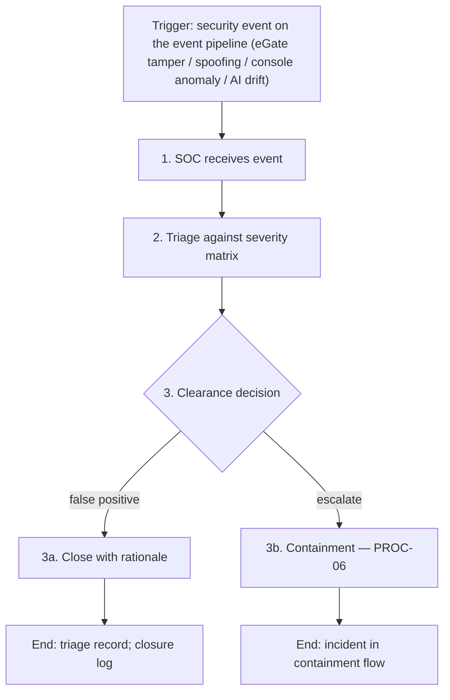
```mermaid
flowchart TD
    T["Trigger: security event on the event pipeline (eGate tamper / spoofing / console anomaly / AI drift)"] --> A1["1. SOC receives event"]
    A1 --> A2["2. Triage against severity matrix"]
    A2 --> D1{"3. Clearance decision"}
    D1 -->|"false positive"| A3["3a. Close with rationale"]
    D1 -->|"escalate"| A4["3b. Containment — PROC-06"]
    A3 --> E["End: triage record; closure log"]
    A4 --> E2["End: incident in containment flow"]
```

### Detailed narrative (from Doc21 §9, verbatim — UC SEPARATION 2026-09-05)

**Use Case ID:** PROC-05
**Name:** Incident Detection & Triage
**Description:** 24/7 SOC detects security incidents through unified monitoring platform covering traditional security and AI post-market metrics
**Primary Actor:** SH-INT-008 (SOC Manager)
**Supporting Actors:** SH-INT-003 (CISO), SH-INT-009 (Security Engineer), SH-INT-005 (AI Governance Lead), Security Monitoring Platform
**Regulation:** NIS 2 Art. 21, CRA Art. 12, AI_Act Art. 61
**Priority:** CRITICAL
**Frequency:** Continuous (24/7)
**SLA:** Detection within 15 minutes, triage within 1 hour

**Activation Condition:** STRUCTURAL — always active. When compound event (EVT-001/EVT-002) detected, multi-path notification activated.

**Preconditions:**
- Security monitoring platform operational with anomaly detection
- Alert thresholds configured for security and AI metrics
- On-call SOC team scheduled
- AI accuracy monitoring integrated into SOC dashboard

**Postconditions:**
- Incident logged with classification
- Alert generated and acknowledged
- Incident response process initiated (PROC-06)
- Evidence preserved for forensics

**Main Flow:**
1. Security monitoring platform collects security events from all sources (eGate endpoints, remote infrastructure, network, AI system)
2. Security monitoring platform correlates events in real-time with anomaly detection
3. Security monitoring platform detects anomaly, known threat pattern, or AI drift alert (>1% accuracy degradation)
4. Security monitoring platform generates alert with severity level (Critical/High/Medium/Low)
5. Security monitoring platform notifies on-call SOC analyst (pager/SMS/email/dashboard)
6. SOC analyst acknowledges alert (within 15 min)
7. SOC analyst performs initial triage: classify incident type
   - Type A: Actively exploited vulnerability → CRA 24h ENISA notification path
   - Type B: Significant incident → NIS 2 24h CSIRT early warning path
   - Type C: Personal data breach → GDPR 72h DPA notification path
   - Type D: AI incident (false accept/drift) → AI_Act market surveillance path
   - Type E: Multiple types → Apply shortest deadline (24h)
8. If Type A/B/E → Trigger PROC-07 (Regulatory Notification, 24h path)
9. If Type C → Trigger PROC-07 (Regulatory Notification, 72h path)
10. If Type D → Trigger PROC-21 (AI Incident Response)
11. SOC logs all actions and preserves evidence

**Alternative Flows:**
- 6a. No response within 15 min → Escalate to CISO
- 7a. False Positive → Tune detection rules; log as FP
- 7b. True Positive → Proceed to PROC-06 (Incident Response)

**Exceptions:**
- E1. Security monitoring platform failure → Manual monitoring until restored; escalate to CISO
- E2. Alert fatigue (>50% false positive rate) → Review and tune thresholds within 24h
- E3. SOC team unavailable → Activate backup SOC (MSSP contract)

**Business Rules:**
- BR-DET-01: All security events must be logged with timestamp
- BR-DET-02: Critical alerts must be acknowledged within 15 min
- BR-DET-03: Incident classification must be completed within 1 hour
- BR-DET-04: All incidents must preserve evidence for forensics
- BR-DET-05: AI drift alerts (>1% degradation) treated as Critical severity

**Related Requirements:**
- NFR: NFR-015 (Real-time event processing, <1s latency)
- NFR: NFR-009 (Detection SLA: 15 min for critical incidents)
- FR: FR-28 (System shall detect anomalies in security events)
- FR: FR-29 (System shall generate alerts with severity classification)
- FR: FR-72 (System shall detect AI accuracy drift >1%)

**Tension Reference:** T-001 (Unified 24h/72h notification workflow), T-005 (Integrated monitoring platform)

## PROC-14 — Unified Impact Assessment (DPIA + FRIA)

| Field | Content |
|---|---|
| Trigger | Prior to launch, annually, or on significant change to biometric AI processing. |
| Activities | 1. DPO initiates the unified assessment. 2. Section A — System Description (shared). 3. Section B — Data Processing Description (shared). 4. Section C — Necessity & Proportionality (shared). 5. Section D — Risk Identification (shared). 6. Section E — Mitigation Measures (shared). 7. Section F — DPIA-specific (GDPR Art. 35(7)) with FRIA-specific outputs (AI Act Art. 27) from the shared sections. |
| Roles | SH-INT-004 (DPO) owns; SH-INT-005 (AI Gov) contributes FRIA content. |
| SLA / Timing | Prior to launch / annual / on significant change. |
| Realises | CR-D-09.2-001 / PO-D-09.2-001 (PO-D-09.2-002, SO-D-09.2-001 downstream). |
| Anchors | SAMM: D-TA-B (threat assessment) · ASVS: V1.1 (secure SDLC). |
| Evidence | Completed DPIA+FRIA dossier with dual outputs; sign-off record. |

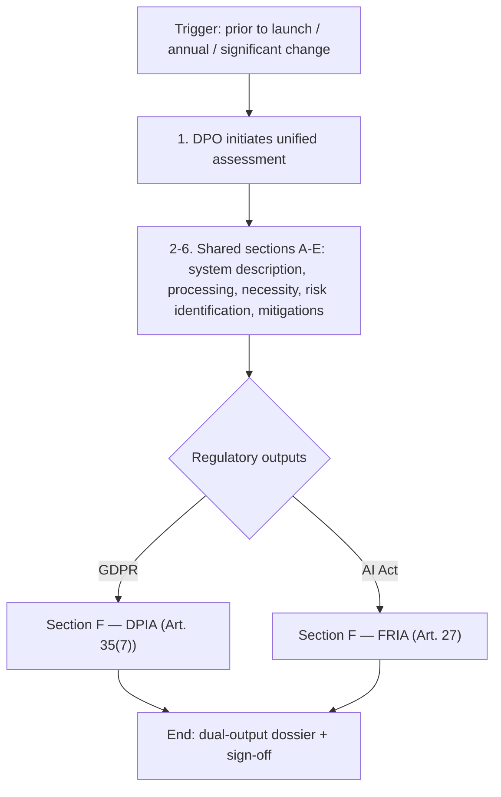
```mermaid
flowchart TD
    T["Trigger: prior to launch / annual / significant change"] --> A0["1. DPO initiates unified assessment"]
    A0 --> A1["2-6. Shared sections A-E: system description, processing, necessity, risk identification, mitigations"]
    A1 --> D1{"Regulatory outputs"}
    D1 -->|"GDPR"| F1["Section F — DPIA (Art. 35(7))"]
    D1 -->|"AI Act"| F2["Section F — FRIA (Art. 27)"]
    F1 --> E["End: dual-output dossier + sign-off"]
    F2 --> E
```

### Detailed narrative (from Doc21 §9, verbatim — UC SEPARATION 2026-09-05)

**Use Case ID:** PROC-14
**Name:** Unified Impact Assessment (DPIA + FRIA)
**Description:** Conduct unified Data Protection Impact Assessment and Fundamental Rights Impact Assessment with dual outputs for biometric AI border control processing
**Primary Actor:** SH-INT-004 (DPO)
**Supporting Actors:** SH-INT-005 (AI Governance Lead), SH-INT-003 (CISO), SH-INT-002 (CTO)
**Regulation:** GDPR Art. 35 (DPIA), AI_Act Art. 9 + Art. 28 (FRIA)
**Priority:** CRITICAL
**Frequency:** Before initial deployment; upon significant processing change; annual review
**SLA:** Prior to launch / Annual / On significant change

**Activation Condition:** STRUCTURAL — always active. Both GDPR DPIA and AI_Act FRIA triggers permanently satisfied by border control AI business model.

**Preconditions:**
- AI system design complete
- Data processing activities defined
- Risk management framework established
- DPO and AI Governance Lead available

**Postconditions:**
- Unified Impact Assessment document completed
- DPIA section satisfies GDPR Art. 35(7) requirements
- FRIA section satisfies AI_Act fundamental rights analysis
- Risks identified and mitigations documented
- Assessment approved by DPO + AI Governance Lead

**Main Flow:**
1. DPO initiates Unified Impact Assessment
2. **Section A — System Description (shared):**
   - Describe eGate system architecture, AI model, data flows
3. **Section B — Data Processing Description (shared):**
   - Map all personal data processing: biometric templates, passport data, watchlist data
4. **Section C — Necessity & Proportionality (shared):**
   - Assess necessity of biometric processing for border control purpose
   - Evaluate proportionality of processing scope
5. **Section D — Risk Identification (shared):**
   - Identify risks to data subjects (privacy, fundamental rights, discrimination)
   - Identify risks to system security (cybersecurity, AI robustness)
6. **Section E — Mitigation Measures (shared):**
   - Document technical and organizational mitigations
   - Map mitigations to rules catalog
7. **Section F — DPIA-specific (GDPR Art. 35(7)):**
   - Systematic description of processing operations and purposes
   - Assessment of necessity and proportionality
   - Risk assessment for rights and freedoms of data subjects
   - Safeguards, security measures, and risk mitigation measures
8. **Section G — FRIA-specific (AI_Act fundamental rights):**
   - Identify affected fundamental Rights (privacy, non-discrimination, human dignity, free movement)
   - Assess risk to rights holders (travelers, specific demographic groups)
   - Vulnerable persons impact assessment
   - Post-market monitoring plan for fundamental rights
9. Joint review by DPO + AI Governance Lead
10. Approval and publication (summary version for transparency)

**Alternative Flows:**
- 5a. New risk identified during assessment → Add to risk register; update mitigations
- 9a. DPO or AI Lead disagrees → Escalate to CISO; resolve before deployment

**Exceptions:**
- E1. Assessment reveals unacceptable risk → Halt deployment; redesign system
- E2. Significant processing change post-assessment → Re-initiate unified assessment

**Business Rules:**
- BR-UIA-01: Unified assessment mandatory before high-risk AI deployment
- BR-UIA-02: Annual review required for both DPIA and FRIA sections
- BR-UIA-03: Assessment must be approved by both DPO and AI Governance Lead
- BR-UIA-04: Summary version must be published for transparency (AI_Act Art. 13)

**Related Requirements:**
- NFR: NFR-039 (Unified assessment complete before deployment)
- FR: FR-59 (System shall support unified assessment with dual outputs)
- FR: FR-60 (System shall maintain assessment version history)

**Tension Reference:** T-003 (DPIA vs. FRIA trigger mismatch — resolved via unified assessment with dual outputs)

## CAP-02 — Continuous Security Monitoring

| Field | Content |
|---|---|
| Owner | SH-INT-008 (SOC Manager). |
| Span | Standing 24/7 unified SOC monitoring covering security + AI post-market metrics. Contributes: PROC-05 (triage), PROC-06 (containment), PROC-18 (authority reporting); UC-27..UC-30 fleet telemetry; SOC competence curriculum (CAP-07). |
| Maturity | PLANNED (1) — Scale A posture model v1.6; current/target pending P1 Folio VIII refresh + EvidenceItem bind |
| Realises | CR-D-10.1-001, BPR-D-10.4-001, BPR-D-10.5-001 / SO-D-10.1-001..003. |
| Anchors | SAMM: O-EM-A (environment management, stream A) · ASVS: V7 (logging) — monitoring outcomes. |
| Evidence | 24/7 coverage rosters; monitoring dashboards; post-market AI metric reports. |

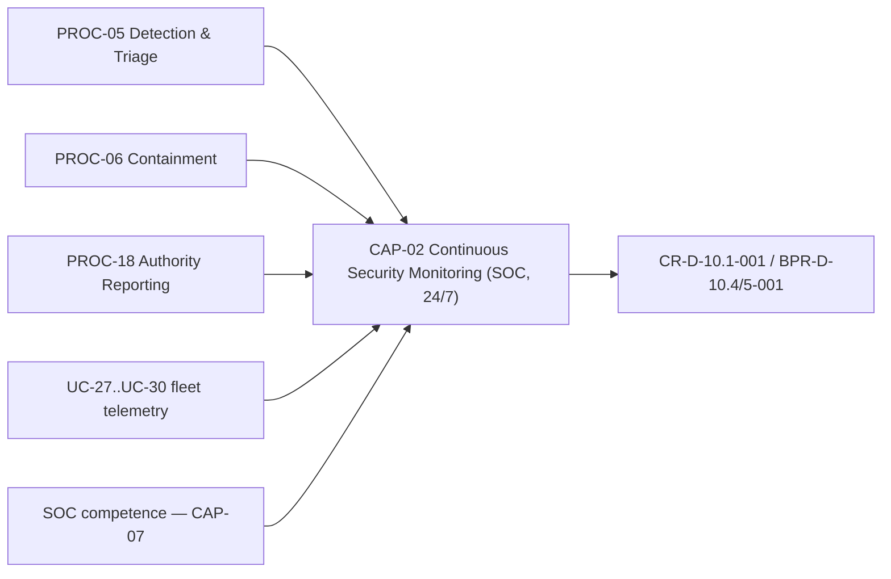
```mermaid
graph LR
    CAP["CAP-02 Continuous Security Monitoring (SOC, 24/7)"] --> R1["CR-D-10.1-001 / BPR-D-10.4/5-001"]
    P1["PROC-05 Detection & Triage"] --> CAP
    P2["PROC-06 Containment"] --> CAP
    P3["PROC-18 Authority Reporting"] --> CAP
    T1["UC-27..UC-30 fleet telemetry"] --> CAP
    C1["SOC competence — CAP-07"] --> CAP
```

## CAP-06 — Security Awareness Training

| Field | Content |
|---|---|
| Owner | SH-INT-003 (CISO). |
| Span | Annual security awareness programme covering GDPR, CRA, NIS 2 topics. Contributes: CAP-07 (role-specific training), CAP-10 (phishing simulation); HR delivery chain. |
| Maturity | PLANNED (1) — Scale A posture model v1.6; current/target pending P1 Folio VIII refresh + EvidenceItem bind |
| Realises | CR-D-08.1-001, BPR-D-08.4-001 / PO-D-08.1-001..002. |
| Anchors | SAMM: G-EG-A (education & guidance, stream A) · ISO 27002:2022 A.6.3. |
| Evidence | Completion records; curriculum versions; annual review sign-off. |
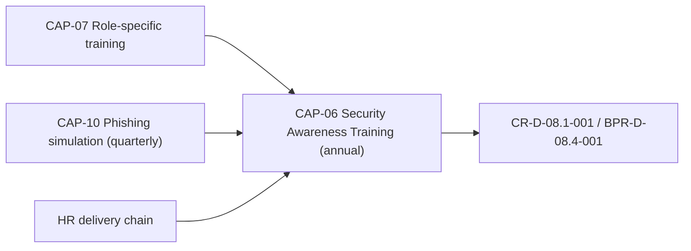
```mermaid
graph LR
    CAP["CAP-06 Security Awareness Training (annual)"] --> R1["CR-D-08.1-001 / BPR-D-08.4-001"]
    P1["CAP-07 Role-specific training"] --> CAP
    P2["CAP-10 Phishing simulation (quarterly)"] --> CAP
    P3["HR delivery chain"] --> CAP
```

## PROC-01 — Data Subject Access Request (DSAR)

| Field | Content |
|---|---|
| Trigger | Traveler requests access to their biometric and personal data (GDPR Art. 15). |
| Activities | 1. Receive request via DSAR channel. 2. Verify traveler identity. 3. Locate personal + biometric data across processing systems. 4. Compile response package (data, purposes, recipients, retention). 5. Deliver within SLA; log the request lifecycle. |
| Roles | SH-EXT-002 (Traveler) initiates; SH-INT-004 (DPO) owns fulfilment. |
| SLA / Timing | 30 days. |
| Realises | CR-D-05.4-001 / PO-D-05.4-001 (PO-D-05.4-001, PO-D-09.4-001 downstream). |
| Anchors | SAMM: G-PC-A (policy & compliance) · ASVS: V8.1 (general data protection), V8.3 (sensitive private data). |
| Evidence | DSAR register; identity-verification record; response package; delivery log. |

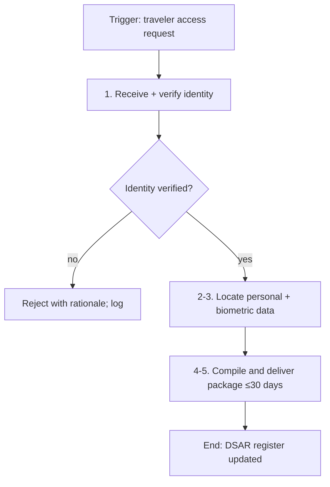
```mermaid
flowchart TD
    T["Trigger: traveler access request"] --> A1["1. Receive + verify identity"]
    A1 --> D1{"Identity verified?"}
    D1 -->|"no"| R1["Reject with rationale; log"]
    D1 -->|"yes"| A2["2-3. Locate personal + biometric data"]
    A2 --> A4["4-5. Compile and deliver package ≤30 days"]
    A4 --> E["End: DSAR register updated"]
```

## PROC-02 — Data Portability Export

| Field | Content |
|---|---|
| Trigger | Traveler requests export of personal data in machine-readable format for transfer to another controller (GDPR Art. 20). |
| Activities | 1. Receive portability request. 2. Verify identity and scope (data provided by the traveler, processed by automated means). 3. Export in structured, commonly used, machine-readable format. 4. Secure delivery to traveler / receiving controller. 5. Log export. |
| Roles | SH-EXT-002 (Traveler) initiates; SH-INT-004 (DPO) owns fulfilment. |
| SLA / Timing | 30 days. |
| Realises | CR-D-05.4-001 / PO-D-05.4-001 (PO-D-05.4-001, PO-D-09.4-001 downstream). |
| Anchors | SAMM: G-PC-A (policy & compliance) · ASVS: V8.1 (general data protection), V12.5 (file download). |
| Evidence | Portability request log; export artefact; secure-delivery receipt. |

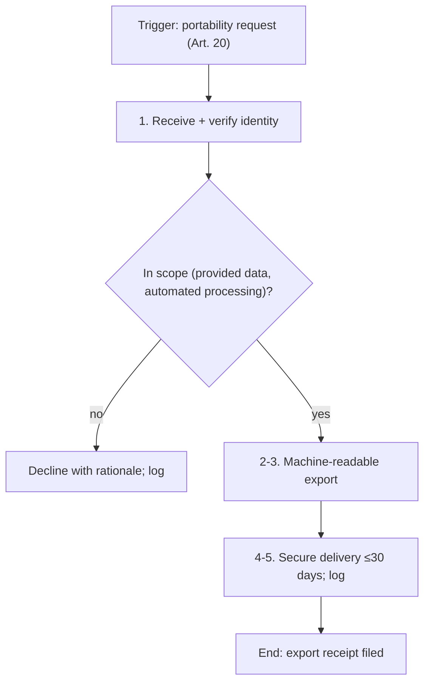
```mermaid
flowchart TD
    T["Trigger: portability request (Art. 20)"] --> A1["1. Receive + verify identity"]
    A1 --> D1{"In scope (provided data, automated processing)?"}
    D1 -->|"no"| R1["Decline with rationale; log"]
    D1 -->|"yes"| A2["2-3. Machine-readable export"]
    A2 --> A4["4-5. Secure delivery ≤30 days; log"]
    A4 --> E["End: export receipt filed"]
```

## PROC-03 — Biometric Breach Notification

| Field | Content |
|---|---|
| Trigger | Confirmed or suspected breach of biometric / personal data. |
| Activities | 1. Receive breach classification from PROC-05/PROC-06. 2. Assess risk to travelers (Art. 33/34 thresholds). 3. Notify DPA within 72h with Art. 33(3) details. 4. Notify affected travelers if high risk (Art. 34). 5. Log all notifications with timestamps. |
| Roles | SH-INT-004 (DPO) owns; SH-INT-003 (CISO) supports with incident detail. |
| SLA / Timing | 72h to DPA. |
| Realises | CR-D-04.3-001 / PO-D-04.3-001 (PO-D-04.3-001, PO-D-09.4-001 downstream). |
| Anchors | SAMM: O-IM-A (incident management) · ASVS: V7.1 (log content). |
| Evidence | Breach notification dossier; DPA acknowledgement; traveler notification records; notification log. |

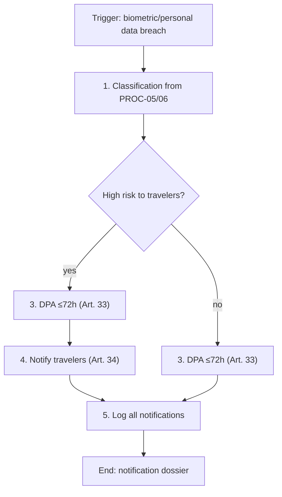
```mermaid
flowchart TD
    T["Trigger: biometric/personal data breach"] --> A1["1. Classification from PROC-05/06"]
    A1 --> D1{"High risk to travelers?"}
    D1 -->|"yes"| A3["3. DPA ≤72h (Art. 33)"] --> A4["4. Notify travelers (Art. 34)"]
    D1 -->|"no"| A3b["3. DPA ≤72h (Art. 33)"]
    A4 --> A5["5. Log all notifications"]
    A3b --> A5 --> E["End: notification dossier"]
```

## PROC-04 — Data Minimization Review

| Field | Content |
|---|---|
| Trigger | Annual review cycle; or new/changed AI training or operational data collection field. |
| Activities | 1. Inventory data fields collected for AI training and operational processing. 2. Assess necessity and proportionality per field (Art. 5(1)(c)). 3. Remove or reduce excessive fields; adjust retention. 4. Update processing records (CAP-01) and rules traceability. 5. Sign-off by DPO. |
| Roles | SH-INT-004 (DPO) owns; SH-INT-002 (CTO) and SH-INT-005 (AI Gov) contribute. |
| SLA / Timing | Annual. |
| Realises | CR-D-05.1-001 / PO-D-05.1-001 (PO-D-05.1-001, PO-D-07.1-001, SO-D-05.1-001 downstream). |
| Anchors | SAMM: D-SR-A (security requirements) · ASVS: V8.1 (general data protection), V8.2 (client-side data protection). |
| Evidence | Minimization review report; field-level necessity decisions; updated processing records. |

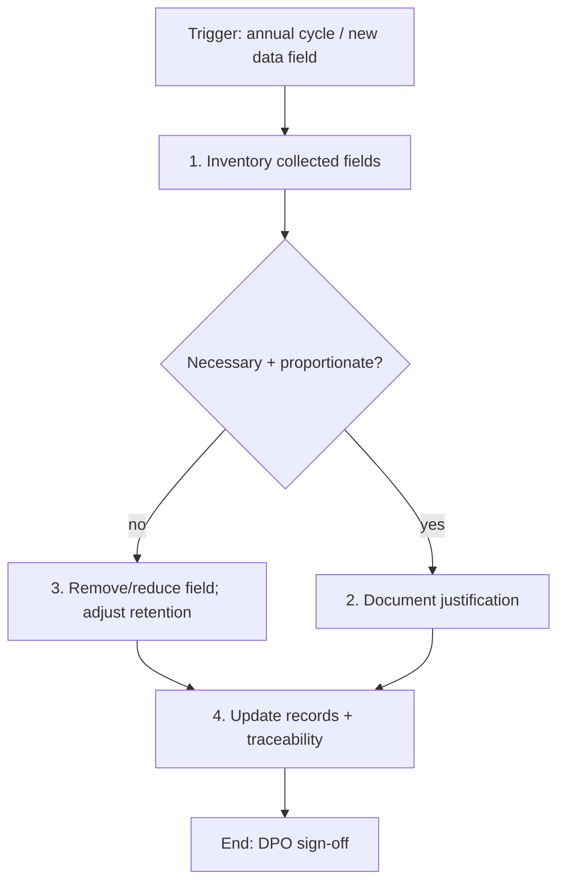
```mermaid
flowchart TD
    T["Trigger: annual cycle / new data field"] --> A1["1. Inventory collected fields"]
    A1 --> D1{"Necessary + proportionate?"}
    D1 -->|"no"| R1["3. Remove/reduce field; adjust retention"]
    D1 -->|"yes"| A2["2. Document justification"]
    R1 --> A4["4. Update records + traceability"]
    A2 --> A4 --> E["End: DPO sign-off"]
```

## PROC-06 — Incident Response & Containment

| Field | Content |
|---|---|
| Trigger | Escalated incident from PROC-05 triage (security event confirmed as incident). |
| Activities | 1. Activate response team per incident classification. 2. Contain affected systems (isolate eGate/kiosk/console segments) with DoS resilience measures. 3. Eradicate cause and preserve forensic evidence. 4. Recover and validate service. 5. Hand off to notification (PROC-07) and lessons-learned. |
| Roles | SH-INT-003 (CISO) owns; SH-INT-008 (SOC Mgr) and SH-INT-009 (Sec Eng) execute. |
| SLA / Timing | Containment: 1h. |
| Realises | CR-D-04.2-001, BPR-D-04.2-001 / PO-D-04.2-001 (PO-D-04.2-002, SO-D-04.2-001 downstream). |
| Anchors | SAMM: O-IM-B (incident management, stream B) · ASVS: V7.2 (log processing). |
| Evidence | Containment actions log; forensic evidence chain; post-incident report. |

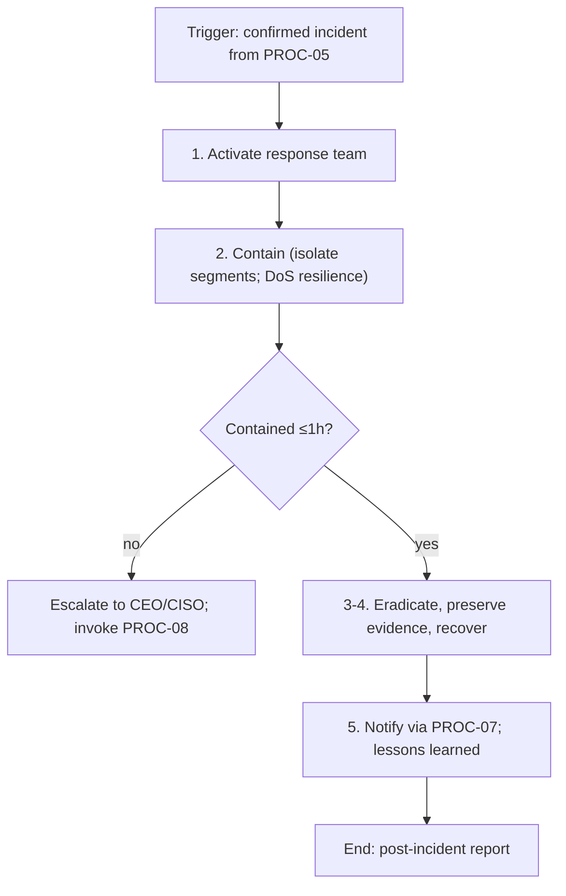
```mermaid
flowchart TD
    T["Trigger: confirmed incident from PROC-05"] --> A1["1. Activate response team"]
    A1 --> A2["2. Contain (isolate segments; DoS resilience)"]
    A2 --> D1{"Contained ≤1h?"}
    D1 -->|"no"| E1["Escalate to CEO/CISO; invoke PROC-08"]
    D1 -->|"yes"| A3["3-4. Eradicate, preserve evidence, recover"]
    A3 --> A5["5. Notify via PROC-07; lessons learned"]
    A5 --> E["End: post-incident report"]
```

## PROC-07 — Regulatory Notification (Unified 24h/72h)

| Field | Content |
|---|---|
| Trigger | Significant incident classified per PROC-05 (Type A/B/C/D/E); compound event satisfying triggers from 2+ regulations (T-001). |
| Activities | 1. Receive classification. 2. ≤24h early warning: Type A → ENISA; Type B → CSIRT; Type E → both. 3. ≤72h detailed: Type C → DPA (Art. 33(3)); Type B/E → CSIRT (NIS 2 Art. 23(2)). 4. Traveler notification if high-risk personal data breach (Art. 34). 5. Type D → cooperate with market surveillance (AI_Act Art. 73). 6. ≤1 month final report (NIS 2 Art. 23(3)). 7. Log all notifications. |
| Roles | SH-INT-003 (CISO) owns; SH-INT-004 (DPO), SH-INT-005 (AI Gov), SH-INT-010 (Compliance) support. |
| SLA / Timing | 24h early warning (CRA/NIS 2) / 72h detailed (GDPR/NIS 2) / 1 month final report. Workflow activation ≤4h of classification (NFR-044). |
| Realises | CR-D-04.3-001 / PO-D-04.3-001 (PO-D-04.3-002 downstream). |
| Anchors | SAMM: O-IM-B (incident management, stream B) · ASVS: V7.1 (log content), V7.2 (log processing). |
| Evidence | Pre-filled notification templates (FR-32); deadline tracker with escalation (FR-33); timestamped notification log (BR-NOTIFY-01..05). |

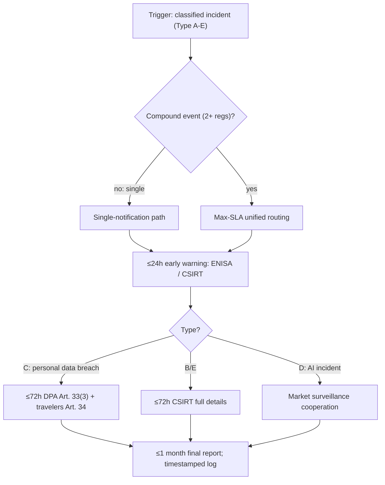
```mermaid
flowchart TD
    T["Trigger: classified incident (Type A-E)"] --> D1{"Compound event (2+ regs)?"}
    D1 -->|"no: single"| S["Single-notification path"]
    D1 -->|"yes"| U["Max-SLA unified routing"]
    S --> E24["≤24h early warning: ENISA / CSIRT"]
    U --> E24
    E24 --> D2{"Type?"}
    D2 -->|"C: personal data breach"| D72["≤72h DPA Art. 33(3) + travelers Art. 34"]
    D2 -->|"B/E"| CS["≤72h CSIRT full details"]
    D2 -->|"D: AI incident"| MS["Market surveillance cooperation"]
    D72 --> F["≤1 month final report; timestamped log"]
    CS --> F
    MS --> F
```

### Detailed narrative (from Doc21 §9, verbatim — UC SEPARATION 2026-09-05)

**Use Case ID:** PROC-07
**Name:** Regulatory Notification (Unified 24h/72h Workflow)
**Description:** Unified incident notification workflow satisfying GDPR (72h), CRA (24h), NIS 2 (24h early warning + 72h full + 1mo final), and AI_Act (market surveillance cooperation)
**Primary Actor:** SH-INT-003 (CISO)
**Supporting Actors:** SH-INT-004 (DPO), SH-INT-005 (AI Governance Lead), SH-INT-010 (Compliance Analyst)
**Regulation:** GDPR Art. 33/34, CRA Art. 14, NIS 2 Art. 23, AI_Act Art. 73
**Priority:** CRITICAL
**Frequency:** Per significant incident
**SLA:** 24h early warning (CRA/NIS 2), 72h detailed (GDPR/NIS 2), 1 month final report (NIS 2). 24h (compound event) / 72h (GDPR-only)

**Activation Condition:** CONTEXTUAL — activated when compound event satisfies triggers from 2+ regulations. Max-SLA routing selects notification path based on incident classification. When only one trigger fires, use single-notification path. See T-001.

**Preconditions:**
- Incident classified per PROC-05 triage
- Incident severity assessed
- Notification templates pre-configured per regulation
- Contact information for all authorities current

**Postconditions:**
- Appropriate authorities notified within regulatory deadlines
- Notification evidence logged
- Final report submitted within 1 month
- Travelers notified if personal data breach affects them

**Main Flow:**
1. Incident classification received from PROC-05 (Type A/B/C/D/E)
2. CISO activates unified notification workflow
3. **Early Warning (≤24h):**
   - Type A (exploited vuln): Notify ENISA via security.txt channel
   - Type B (significant incident): Notify national CSIRT
   - Type E (multiple): Notify both ENISA and CSIRT
4. **Detailed Notification (≤72h):**
   - Type C (personal data breach): Notify DPA with Art. 33(3) details
   - Type B/E: Notify CSIRT with full incident details per NIS 2 Art. 23(2)
5. **Traveler Notification (if applicable):**
   - If personal data breach with high risk to travelers: Notify affected travelers (GDPR Art. 34)
6. **AI_Act Cooperation:**
   - Type D (AI incident): Cooperate with market surveillance authority
7. **Final Report (≤1 month):**
   - Submit comprehensive report per NIS 2 Art. 23(3) including root cause, impact, remediation
8. Log all notifications with timestamps and evidence

**Alternative Flows:**
- 3a. Classification uncertain → Default to 24h early warning (conservative)
- 5a. Notification to travelers would compromise investigation → Delay with DPA approval

**Exceptions:**
- E1. Authority contact information unavailable → Use backup channels; log as compliance gap
- E2. 24h deadline missed → Immediate notification; document delay reason; escalate to CEO

**Business Rules:**
- BR-NOTIFY-01: All notifications must be logged with timestamp and recipient
- BR-NOTIFY-02: 24h early warning for CRA/NIS 2 incidents (conservative default)
- BR-NOTIFY-03: 72h detailed notification for GDPR personal data breaches
- BR-NOTIFY-04: 1 month final report per NIS 2 Art. 23(3)
- BR-NOTIFY-05: Traveler notification required for high-risk personal data breaches

**Related Requirements:**
- NFR: NFR-044 (Notification workflow activation within 4h of classification)
- FR: FR-32 (System shall generate pre-filled notification templates per regulation)
- FR: FR-33 (System shall track notification deadlines and escalate)

**Tension Reference:** T-001 (24h vs 72h timing conflict — resolved via unified workflow with classification)

## PROC-08 — Disaster Recovery & Business Continuity

| Field | Content |
|---|---|
| Trigger | DR invocation after incident, outage, or site loss (per PROC-06 escalation). |
| Activities | 1. Declare disaster and activate DR plan. 2. Fail over to standby systems / store-and-forward kiosk mode. 3. Restore from backups (RPO targets). 4. Validate service restoration and data integrity. 5. Return to normal operations; DR report. |
| Roles | SH-INT-007 (Ops Lead) owns; SH-INT-009 (Sec Eng) supports. |
| SLA / Timing | RTO: 1h, RPO: 15min. |
| Realises | CR-D-04.4-001, BPR-D-04.2-001 / PO-D-04.4-001 (PO-D-04.4-002 downstream). |
| Anchors | SAMM: O-EM-B (environment management, stream B) · ASVS: no direct ASVS mapping (resilience/BC); adjacent V1.11 (business logic) — noted per frozen catalogue. |
| Evidence | DR invocation record; restoration runbook execution log; DR test reports; RTO/RPO attainment evidence. |

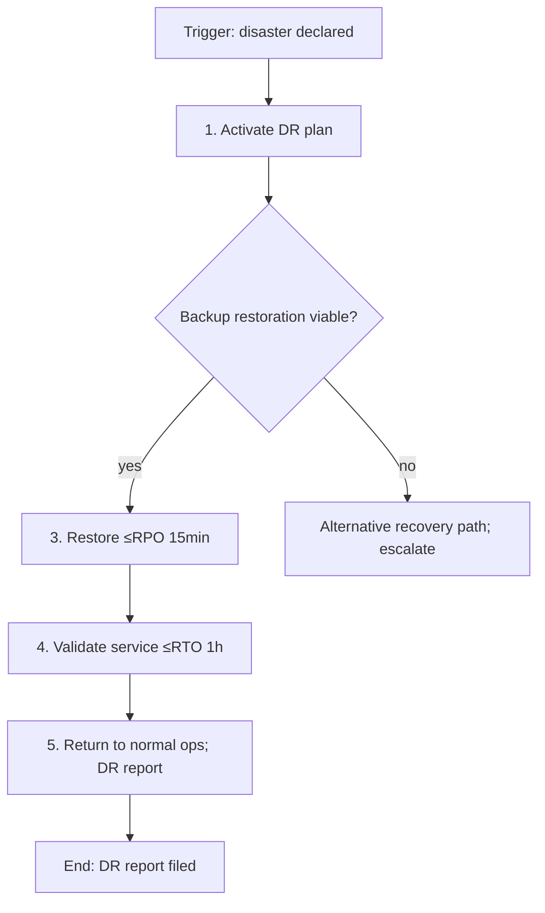
```mermaid
flowchart TD
    T["Trigger: disaster declared"] --> A1["1. Activate DR plan"]
    A1 --> D1{"Backup restoration viable?"}
    D1 -->|"yes"| A3["3. Restore ≤RPO 15min"]
    D1 -->|"no"| E1["Alternative recovery path; escalate"]
    A3 --> A4["4. Validate service ≤RTO 1h"]
    A4 --> A5["5. Return to normal ops; DR report"]
    A5 --> E["End: DR report filed"]
```

## PROC-09 — Threat-Led Penetration Testing

| Field | Content |
|---|---|
| Trigger | Annual TLPT cycle; or major system change requiring adversarial validation. |
| Activities | 1. Define threat intelligence-based scenarios for border control systems. 2. Engage qualified red team. 3. Execute TLPT incl. adversarial AI testing (spoofing, evasion). 4. Document findings and exploit paths. 5. Feed remediation (PROC-06 / UC-02) and re-test. |
| Roles | SH-INT-009 (Sec Eng) owns; SH-INT-003 (CISO) approves scope. |
| SLA / Timing | Annual. |
| Realises | CR-D-02.4-001, BPR-D-02.4-002 / SO-D-02.4-001 (SO-D-02.4-002 downstream). |
| Anchors | SAMM: V-RT-B (requirements-driven testing, stream B) · ASVS: no direct ASVS mapping for adversarial testing (V is prescriptive controls) — noted per frozen catalogue. |
| Evidence | TLPT scope and rules of engagement; findings report; re-test closure records. |

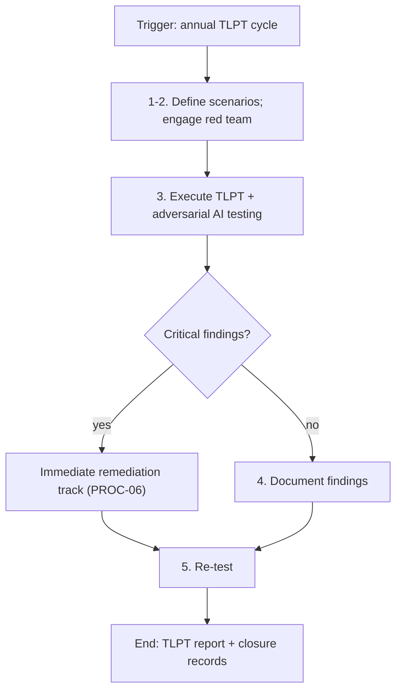
```mermaid
flowchart TD
    T["Trigger: annual TLPT cycle"] --> A1["1-2. Define scenarios; engage red team"]
    A1 --> A3["3. Execute TLPT + adversarial AI testing"]
    A3 --> D1{"Critical findings?"}
    D1 -->|"yes"| R1["Immediate remediation track (PROC-06)"]
    D1 -->|"no"| A4["4. Document findings"]
    R1 --> A5["5. Re-test"]
    A4 --> A5 --> E["End: TLPT report + closure records"]
```

## PROC-10 — Border Officer Identity Lifecycle

| Field | Content |
|---|---|
| Trigger | Officer joining, moving, or leaving border control duty (HR event). |
| Activities | 1. Provision identity in government IdP with role attributes. 2. Issue FIDO/device-bound credentials. 3. Modify entitlements on role change. 4. Deprovision within 24h of exit; revoke sessions and credentials. 5. Record lifecycle events. |
| Roles | SH-INT-007 (Ops Lead) owns; HR and IdP administrators support. |
| SLA / Timing | 24h (provisioning and deprovisioning). |
| Realises | CR-D-03.1-001 / SO-D-03.1-001 (SO-D-03.1-002, SO-D-03.1-003 downstream). |
| Anchors | SAMM: O-EM-A (environment management, stream A) · ASVS: V2.3 (authenticator lifecycle), V4.1 (access control design). |
| Evidence | IdP provisioning records; credential issuance/revocation log; deprovisioning tickets within 24h. |

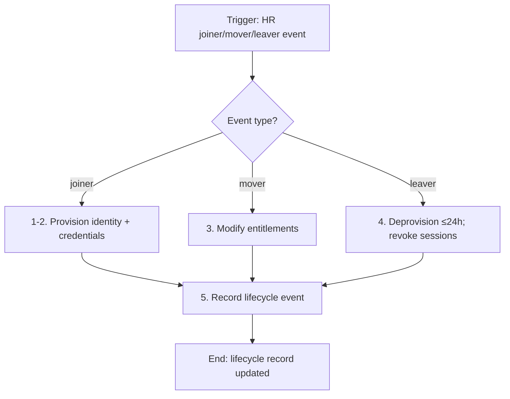
```mermaid
flowchart TD
    T["Trigger: HR joiner/mover/leaver event"] --> D1{"Event type?"}
    D1 -->|"joiner"| P1["1-2. Provision identity + credentials"]
    D1 -->|"mover"| P3["3. Modify entitlements"]
    D1 -->|"leaver"| P4["4. Deprovision ≤24h; revoke sessions"]
    P1 --> P5["5. Record lifecycle event"]
    P3 --> P5
    P4 --> P5 --> E["End: lifecycle record updated"]
```

## PROC-11 — Access Rights Review

| Field | Content |
|---|---|
| Trigger | Quarterly review cycle. |
| Activities | 1. Extract entitlements for all system users per role. 2. Compare against role definitions and current duties. 3. Recertify or revoke excess rights. 4. Track removal of unapproved entitlements to closure. 5. Record review outcome. |
| Roles | SH-INT-007 (Ops Lead) owns; system owners recertify their scopes. |
| SLA / Timing | Quarterly. |
| Realises | CR-D-03.3-001 / PO-D-03.3-001 (PO-D-03.3-002 downstream). |
| Anchors | SAMM: O-EM-A (environment management, stream A) · ASVS: V4.1 (general access control design), V4.2 (operation level access control). |
| Evidence | Quarterly recertification records; revocation tickets; closure evidence. |

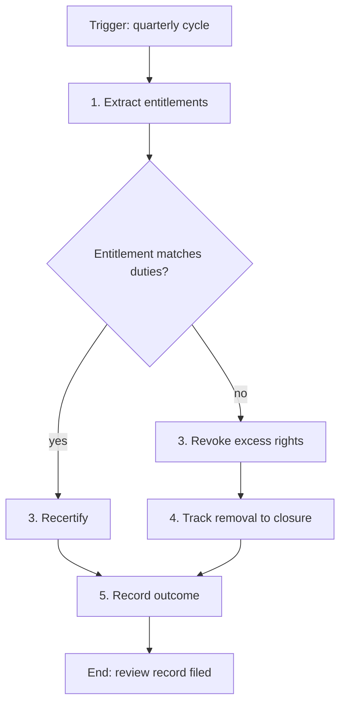
```mermaid
flowchart TD
    T["Trigger: quarterly cycle"] --> A1["1. Extract entitlements"]
    A1 --> D1{"Entitlement matches duties?"}
    D1 -->|"no"| R1["3. Revoke excess rights"]
    D1 -->|"yes"| A2["3. Recertify"]
    R1 --> A4["4. Track removal to closure"]
    A2 --> A5["5. Record outcome"]
    A4 --> A5 --> E["End: review record filed"]
```

## PROC-12 — Secure Code Review

| Field | Content |
|---|---|
| Trigger | Every commit / pull request touching product code. |
| Activities | 1. Run static analysis (SAST) on the change. 2. Manual code review with security checklist. 3. Triage findings by severity. 4. Block merge on critical findings; fix and re-review. 5. Record review and disposition. |
| Roles | SH-INT-006 (Dev Lead) owns; developers participate as reviewers. |
| SLA / Timing | Per commit. |
| Realises | CR-D-07.2-001 / SO-D-07.2-001 (SO-D-07.2-002 downstream). |
| Anchors | SAMM: I-DM-A (defect management) · ASVS: V10.2 (malicious code search), V14.1 (build and deploy). |
| Evidence | SAST reports; review approvals; finding disposition records. |

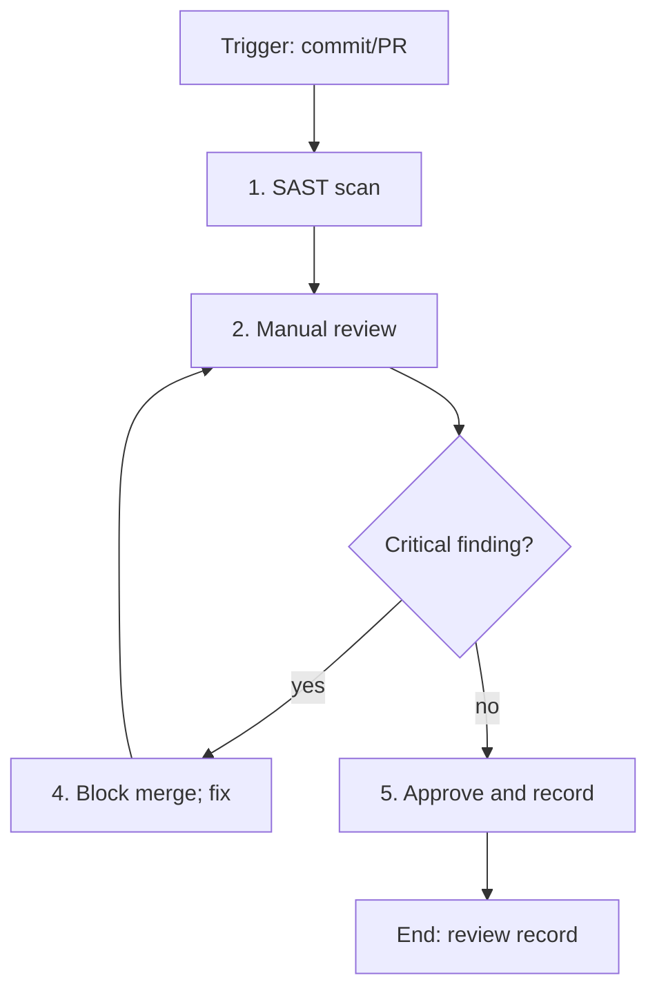
```mermaid
flowchart TD
    T["Trigger: commit/PR"] --> A1["1. SAST scan"]
    A1 --> A2["2. Manual review"]
    A2 --> D1{"Critical finding?"}
    D1 -->|"yes"| B1["4. Block merge; fix"]
    D1 -->|"no"| A5["5. Approve and record"]
    B1 --> A2
    A5 --> E["End: review record"]
```

## PROC-13 — Change Management

| Field | Content |
|---|---|
| Trigger | Any proposed change to production systems, firmware, or configuration. |
| Activities | 1. Log change request with classification (standard/normal/emergency). 2. Assess security and compliance impact. 3. Approve via CAB or pre-approved standard change. 4. Deploy with documented rollback plan. 5. Post-implementation review. |
| Roles | SH-INT-006 (Dev Lead) owns; SH-INT-007 (Ops Lead) executes deployment. |
| SLA / Timing | Per change. |
| Realises | CR-D-07.4-001 / NOT_ADDRESSED (SO-D-07.2-001 downstream). |
| Anchors | SAMM: I-SD-A (secure deployment) · ASVS: V14.1 (build and deploy). |
| Evidence | Change register; approval records; rollback plan; post-implementation review. |

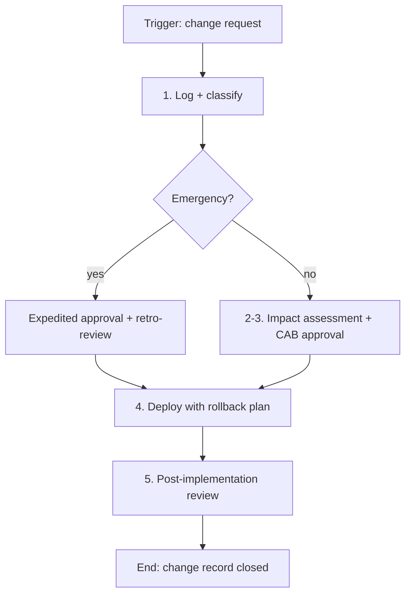
```mermaid
flowchart TD
    T["Trigger: change request"] --> A1["1. Log + classify"]
    A1 --> D1{"Emergency?"}
    D1 -->|"yes"| E1["Expedited approval + retro-review"]
    D1 -->|"no"| A3["2-3. Impact assessment + CAB approval"]
    E1 --> A4["4. Deploy with rollback plan"]
    A3 --> A4
    A4 --> A5["5. Post-implementation review"]
    A5 --> E["End: change record closed"]
```

## PROC-15 — Risk Assessment & Management

| Field | Content |
|---|---|
| Trigger | Annual cycle; new system/service; significant change or incident. |
| Activities | 1. Identify assets and threats (cybersecurity focus). 2. Assess likelihood and impact. 3. Evaluate risk against appetite. 4. Select and implement treatments. 5. Maintain risk register and track treatment plans. |
| Roles | SH-INT-003 (CISO) owns; risk owners accept residual risk. |
| SLA / Timing | Annual. |
| Realises | CR-D-09.2-001 / PO-D-09.2-001 (PO-D-09.2-002 downstream). |
| Anchors | SAMM: D-TA-A (threat assessment) · ASVS: V1.1 (secure SDLC). |
| Evidence | Risk register; treatment plans; risk acceptance records. |

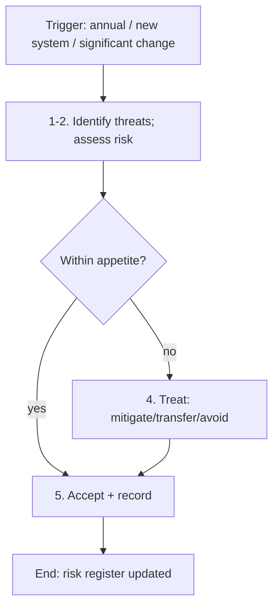
```mermaid
flowchart TD
    T["Trigger: annual / new system / significant change"] --> A1["1-2. Identify threats; assess risk"]
    A1 --> D1{"Within appetite?"}
    D1 -->|"no"| T1["4. Treat: mitigate/transfer/avoid"]
    D1 -->|"yes"| A5["5. Accept + record"]
    T1 --> A5
    A5 --> E["End: risk register updated"]
```

## PROC-16 — Compliance Audit & Reporting

| Field | Content |
|---|---|
| Trigger | Quarterly reporting cycle; external audit; authority request. |
| Activities | 1. Collect compliance evidence against GDPR/CRA/NIS 2/AI_Act annexes. 2. Generate compliance reports per regulation. 3. Run internal audit sampling (uses PROC-23 reports, CAP-02 telemetry). 4. Prepare external audit package. 5. Track findings to closure. |
| Roles | SH-INT-010 (Compliance) owns; SH-INT-003 (CISO) reviews. |
| SLA / Timing | Quarterly. |
| Realises | CR-D-10.3-001 / PO-D-10.3-001 (PO-D-10.3-002, SO-D-10.3-001 downstream). |
| Anchors | SAMM: G-PC-A (policy & compliance) · ASVS: V7.1 (log content). |
| Evidence | Compliance reports; audit packages; finding remediation tracker. |

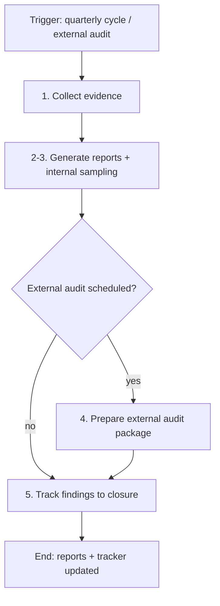
```mermaid
flowchart TD
    T["Trigger: quarterly cycle / external audit"] --> A1["1. Collect evidence"]
    A1 --> A2["2-3. Generate reports + internal sampling"]
    A2 --> D1{"External audit scheduled?"}
    D1 -->|"yes"| A4["4. Prepare external audit package"]
    D1 -->|"no"| A5["5. Track findings to closure"]
    A4 --> A5 --> E["End: reports + tracker updated"]
```

## PROC-17 — Vendor Risk Assessment

| Field | Content |
|---|---|
| Trigger | Vendor onboarding; annual review of critical vendors; vendor incident. |
| Activities | 1. Classify vendor by data/system criticality. 2. Issue unified questionnaire (GDPR/NIS 2 clauses). 3. Assess responses; identify gaps. 4. Contract remediation and DPA/SLA clauses. 5. Continuous monitoring of critical vendors. |
| Roles | SH-INT-010 (Compliance) owns; SH-INT-003 (CISO) approves risk acceptance. |
| SLA / Timing | Annual. |
| Realises | CR-D-06.1-001, CR-D-06.3-001, BPR-D-06.5-001 / PO-D-06.1-001 (PO-D-06.1-002, PO-D-06.3-001 downstream). |
| Anchors | SAMM: G-PC-B (policy & compliance, stream B) · ASVS: no direct ASVS mapping (third-party governance) — noted per frozen catalogue. |
| Evidence | Vendor classification records; completed questionnaires; remediation tracker; monitoring reports. |

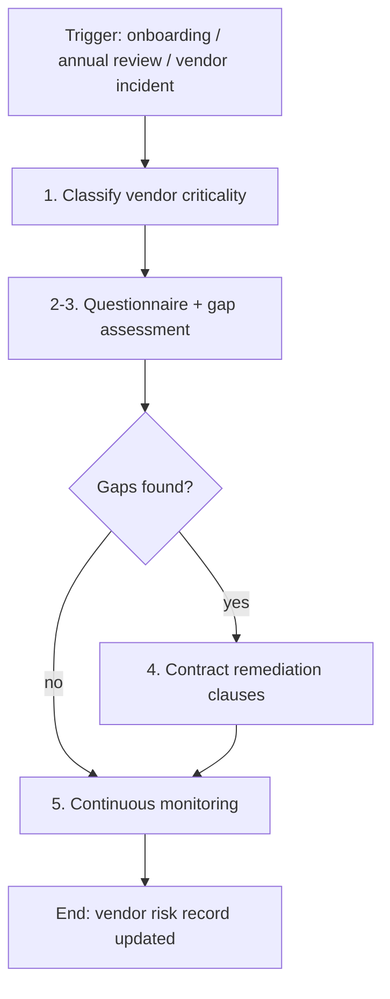
```mermaid
flowchart TD
    T["Trigger: onboarding / annual review / vendor incident"] --> A1["1. Classify vendor criticality"]
    A1 --> A2["2-3. Questionnaire + gap assessment"]
    A2 --> D1{"Gaps found?"}
    D1 -->|"yes"| R1["4. Contract remediation clauses"]
    D1 -->|"no"| A5["5. Continuous monitoring"]
    R1 --> A5 --> E["End: vendor risk record updated"]
```

## PROC-18 — Regulatory Notification & Cooperation

| Field | Content |
|---|---|
| Trigger | Authority request, mandatory reporting duty, or standing cooperation obligation (per regulation). |
| Activities | 1. Identify authority and legal basis (DPA, CSIRT, ENISA, market surveillance). 2. Prepare and submit required information. 3. Coordinate responses to follow-up requests. 4. Log all interactions and deadlines. 5. Escalate conflicts to CISO/CEO. |
| Roles | SH-INT-010 (Compliance) owns; SH-INT-003 (CISO) and SH-INT-004 (DPO) support. |
| SLA / Timing | Per regulation (24h/72h duties routed via PROC-07). |
| Realises | CR-D-04.3-001 / PO-D-04.3-001 (PO-D-04.3-002 downstream). |
| Anchors | SAMM: O-IM-B (incident management, stream B) · ASVS: V7.2 (log processing). |
| Evidence | Authority correspondence log; submission receipts; deadline tracking records. |

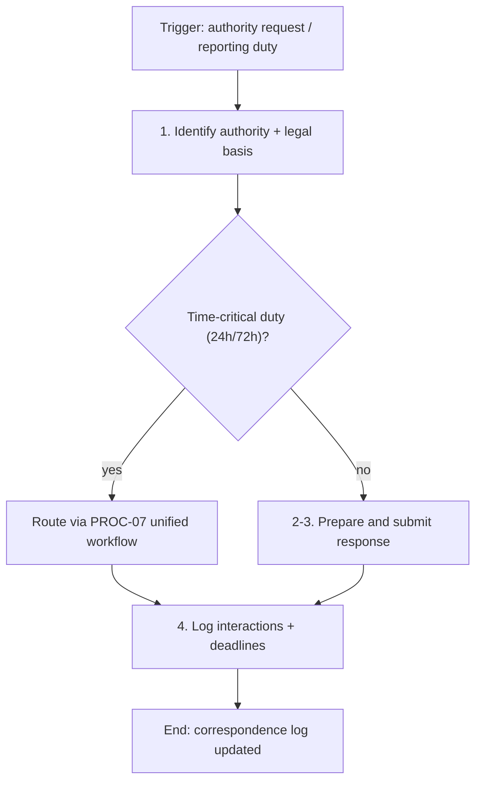
```mermaid
flowchart TD
    T["Trigger: authority request / reporting duty"] --> A1["1. Identify authority + legal basis"]
    A1 --> D1{"Time-critical duty (24h/72h)?"}
    D1 -->|"yes"| R1["Route via PROC-07 unified workflow"]
    D1 -->|"no"| A2["2-3. Prepare and submit response"]
    R1 --> A4["4. Log interactions + deadlines"]
    A2 --> A4 --> E["End: correspondence log updated"]
```

## PROC-19 — AI Conformity Assessment

| Field | Content |
|---|---|
| Trigger | Before initial market placement; upon significant model change (AI_Act Art. 43). |
| Activities | 1. Compile Annex IV technical documentation (architecture, data, oversight, metrics). 2. Internal risk assessment integrated with PROC-14. 3. Engage Notified Body; support independent testing. 4. Remediate non-conformities within 90 days and re-assess. 5. Issue EU DoC; apply CE marking; activate post-market monitoring (UC-13). |
| Roles | SH-INT-005 (AI Gov) owns; SH-INT-002 (CTO), SH-INT-003 (CISO), SH-EXT-007 (Notified Body) participate. |
| SLA / Timing | Complete before eGate deployment at any border crossing. |
| Realises | CR-D-09.1-001, CR-D-09.2-001 / PO-D-09.1-001, PO-D-09.2-001 (PO-D-09.2-002, SO-D-09.1-001 downstream). |
| Anchors | SAMM: G-PC-A (policy & compliance) · ASVS: V1.1 (secure SDLC). |
| Evidence | Annex IV dossier; notified body certificate; EU Declaration of Conformity; post-market monitoring plan. |

```mermaid
flowchart TD
    T["Trigger: pre-placement / significant model change"] --> A1["1-2. Annex IV dossier + integrated risk assessment"]
    A1 --> A3["3. Notified Body review + testing"]
    A3 --> D1{"Non-conformities?"}
    D1 -->|"yes"| R1["4. Remediate ≤90 days; re-assess"]
    R1 --> A3
    D1 -->|"no"| A5["5. DoC + CE marking + post-market plan"]
    A5 --> E["End: conformity certificate issued"]
```

### Detailed narrative (from Doc21 §9, verbatim — UC SEPARATION 2026-09-05)

**Use Case ID:** PROC-19
**Name:** AI Conformity Assessment
**Description:** Prepare and execute AI_Act conformity assessment for high-risk border control AI system (Annex III)
**Primary Actor:** SH-INT-005 (AI Governance Lead)
**Supporting Actors:** SH-INT-002 (CTO), SH-INT-003 (CISO), SH-EXT-007 (Notified Body), SH-EXT-011 (AI Market Surveillance Authority)
**AI_Act Article:** Art. 9, Art. 43 (Conformity Assessment)
**Priority:** CRITICAL
**Frequency:** Before initial market placement; upon significant model change
**SLA:** Complete before eGate deployment at any border crossing

**Activation Condition:** STRUCTURAL — always active before market placement.

**Preconditions:**
- AI system development complete
- Technical documentation prepared (AI_Act Annex IV)
- Quality management system operational
- Risk management system established
- Training data documented and validated

**Postconditions:**
- Conformity assessment completed
- EU Declaration of Conformity issued
- CE marking applied
- Technical documentation submitted to notified body
- Post-market monitoring plan activated

**Main Flow:**
1. AI Governance Lead initiates conformity assessment process
2. Compile technical documentation per AI_Act Annex IV:
   - System description and intended purpose
   - AI system architecture and design specifications
   - Training, validation, and testing data documentation
   - Human oversight measures
   - Accuracy, robustness, and cybersecurity metrics
3. Conduct internal risk assessment (integrated with DPIA+FRIA per PROC-14)
4. Engage Notified Body for third-party conformity assessment
5. Notified Body reviews technical documentation
6. Notified Body conducts independent testing of AI system
7. Notified Body issues conformity certificate (or identifies non-conformities)
8. If non-conformities: remediate and re-assess
9. Issue EU Declaration of Conformity
10. Apply CE marking to eGate system
11. Activate post-market monitoring plan (UC-13)

**Alternative Flows:**
- 7a. Non-conformities identified → Remediate within 90 days; re-assess
- 8a. Critical non-conformity (safety/fundamental rights) → Halt deployment; redesign

**Exceptions:**
- E1. Notified Body unavailable → Engage alternative notified body; delay deployment
- E2. Significant model change post-certification → Re-initiate conformity assessment

**Business Rules:**
- BR-AICONF-01: Conformity assessment mandatory before market placement (AI_Act Art. 43)
- BR-AICONF-02: Technical documentation must be maintained for 10 years
- BR-AICONF-03: Significant model changes require re-assessment
- BR-AICONF-04: Post-market monitoring plan must be active before deployment
- BR-AICONF-05: EU Declaration of Conformity must be updated per system version

**Related Requirements:**
- NFR: NFR-038 (Conformity assessment complete before deployment)
- FR: FR-73 (System shall maintain technical documentation per Annex IV)
- FR: FR-74 (System shall support post-market monitoring data collection)

## PROC-20 — AI Bias Testing & Fairness Assessment

| Field | Content |
|---|---|
| Trigger | Quarterly cycle (AI_Act Art. 9); retraining event. |
| Activities | 1. Select representative dataset across age/gender/ethnicity groups. 2. Run bias suite: false accept / false reject / confidence by group. 3. Compare to thresholds (≤1% FAR disparity, ≤2% FRR disparity). 4. If bias detected: root-cause, remediation plan ≤90 days, notify market surveillance if fundamental rights affected. 5. File report in technical documentation. |
| Roles | SH-INT-005 (AI Gov) owns; SH-INT-009 (Sec Eng), SH-EXT-013 (Pen Test Firm) support. |
| SLA / Timing | Quarterly; assessment ≤2 weeks, report ≤1 week after completion. |
| Realises | BPR-D-02.4-001, CR-D-02.4-001 / SO-D-02.4-001 (SO-D-02.4-002, PO-D-05.1-001 downstream). |
| Anchors | SAMM: V-RT-B (requirements-driven testing, stream B) · ASVS: no direct ASVS mapping for fairness metrics — noted per frozen catalogue. |
| Evidence | Bias assessment reports (FR-76); disparity metrics vs NFR-047; remediation plans; authority notifications. |

```mermaid
flowchart TD
    T["Trigger: quarterly cycle"] --> A1["1-2. Representative dataset + bias suite run"]
    A1 --> D1{"Disparity > threshold?"}
    D1 -->|"yes"| R1["4. Root-cause + remediation plan ≤90 days"]
    R1 --> D2{">2x threshold?"}
    D2 -->|"yes"| S1["Consider temporary suspension; notify authority"]
    D2 -->|"no"| A5["5. File report"]
    S1 --> A5
    D1 -->|"no"| A5 --> E["End: report in technical documentation"]
```

### Detailed narrative (from Doc21 §9, verbatim — UC SEPARATION 2026-09-05)

**Use Case ID:** PROC-20
**Name:** AI Bias Testing & Fairness Assessment
**Description:** Quarterly bias testing of border control AI across demographic groups (age, gender, ethnicity) with documented results
**Primary Actor:** SH-INT-005 (AI Governance Lead)
**Supporting Actors:** SH-INT-009 (Security Engineer), SH-EXT-013 (Penetration Testing Firm)
**AI_Act Article:** Art. 9 (Risk Management), Art. 10 (Data Quality)
**Priority:** HIGH
**Frequency:** Quarterly
**SLA:** Complete assessment within 2 weeks; report within 1 week of completion

**Preconditions:**
- AI model deployed and processing live data
- Representative test dataset available across demographic groups
- Bias testing suite configured
- Baseline accuracy metrics established

**Postconditions:**
- Bias assessment report generated
- Disparate impact identified and documented
- Remediation plan created (if bias detected)
- Report submitted to AI Market Surveillance Authority (if required)

**Main Flow:**
1. AI Governance Lead initiates quarterly bias assessment
2. Select representative test dataset covering demographic groups:
   - Age groups: 0-18, 18-30, 30-50, 50-70, 70+
   - Gender: Male, Female, Non-binary
   - Ethnicity: All major ethnic groups represented in Schengen traffic
3. Run bias testing suite against AI model:
   - False accept rate by demographic group
   - False reject rate by demographic group
   - Confidence score distribution by demographic group
4. Compare results against baseline and acceptable thresholds:
   - Max 1% disparity in false accept rate between groups
   - Max 2% disparity in false reject rate between groups
5. Generate bias assessment report with findings
6. If bias detected (>threshold):
   - Identify root cause (training data, model architecture, threshold settings)
   - Create remediation plan with timeline
   - Notify AI Market Surveillance Authority if bias affects fundamental rights
7. If no bias: document results and close assessment
8. Store assessment report in technical documentation

**Alternative Flows:**
- 6a. Bias is minor (<2x threshold) → Remediate within next model update cycle
- 6b. Bias is significant (>2x threshold) → Immediate remediation; consider temporary suspension

**Exceptions:**
- E1. Test dataset not representative → Delay assessment; acquire representative data
- E2. Bias testing suite failure → Engage external testing firm

**Business Rules:**
- BR-BIAS-01: Bias assessment must be conducted quarterly
- BR-BIAS-02: Max 1% false accept rate disparity between demographic groups
- BR-BIAS-03: Significant bias must be reported to market surveillance authority
- BR-BIAS-04: Remediation plan must be completed within 90 days of detection

**Related Requirements:**
- NFR: NFR-047 (Max 1% false accept rate disparity)
- FR: FR-75 (System shall support bias testing across demographic groups)
- FR: FR-76 (System shall generate bias assessment reports)

## PROC-21 — AI Incident Response

| Field | Content |
|---|---|
| Trigger | AI-specific failure signal: false accept, false reject, model drift (15-min detection SLA). |
| Activities | 1. Detect AI failure via monitoring (UC-13 / CAP-02). 2. Classify AI incident vs security incident. 3. Contain: adjust thresholds, suspend model, fail over. 4. Investigate root cause (data, model, environment). 5. Notify via PROC-07 (Type D) and PROC-26 for drift follow-up. |
| Roles | SH-INT-008 (SOC Mgr) owns; SH-INT-005 (AI Gov) supports root-cause. |
| SLA / Timing | 15 min detection. |
| Realises | BPR-D-04.2-001, CR-D-04.2-001 / PO-D-04.2-001 (PO-D-04.2-002, SO-D-04.2-001 downstream). |
| Anchors | SAMM: O-IM-A (incident management) · ASVS: V7.2 (log processing). |
| Evidence | AI incident tickets; containment decisions; root-cause analyses; notification records. |

```mermaid
flowchart TD
    T["Trigger: AI failure signal (≤15 min detection)"] --> A1["1-2. Detect + classify AI incident"]
    A1 --> D1{"Failures ongoing?"}
    D1 -->|"yes"| C1["3. Contain: threshold adjust / suspend model"]
    D1 -->|"no"| I1["4. Investigate root cause"]
    C1 --> I1
    I1 --> A5["5. Notify PROC-07 (Type D); feed PROC-26"]
    A5 --> E["End: incident record closed"]
```

## PROC-22 — AI Adversarial Testing

| Field | Content |
|---|---|
| Trigger | Quarterly red-team cycle (AI_Act Art. 9); major model change. |
| Activities | 1. Define adversarial scenarios: biometric spoofing (presentation attacks), evasion, poisoning attempts. 2. Execute red-team exercises against face-match/PAD models. 3. Document successful attacks and model robustness. 4. Feed mitigations to PROC-25 (retraining) and PROC-20 (fairness gates). 5. Re-test after fixes. |
| Roles | SH-INT-009 (Sec Eng) owns; SH-EXT-013 (Pen Test Firm) executes; SH-INT-005 (AI Gov) consumes results. |
| SLA / Timing | Quarterly. |
| Realises | BPR-D-02.4-002, CR-D-02.4-001 / SO-D-02.4-001 (SO-D-02.4-002 downstream). |
| Anchors | SAMM: V-RT-B (requirements-driven testing, stream B) · ASVS: no direct ASVS mapping for adversarial ML testing — noted per frozen catalogue. |
| Evidence | Red-team scope and reports; successful-attack records; mitigation tickets; re-test results. |

```mermaid
flowchart TD
    T["Trigger: quarterly cycle"] --> A1["1-2. Scenarios + red-team execution"]
    A1 --> D1{"Attack succeeded?"}
    D1 -->|"yes"| M1["4. Mitigate via PROC-25 retraining / PROC-20 gates"]
    D1 -->|"no"| A3["3. Document robustness"]
    M1 --> A5["5. Re-test"]
    A3 --> A5 --> E["End: adversarial test report"]
```

## PROC-23 — Shift Handover & Referral Report

| Field | Content |
|---|---|
| Trigger | Shift end (or on demand) at the operator referral desk. |
| Activities | 1. Outgoing officer opens handover view (open items, in-service items, flagged incidents). 2. Console generates per-shift referral report incl. overrides and reason codes. 3. Officer annotates open items. 4. Incoming officer authenticates (UC-23) and accepts the queue. 5. Report archived to audit chain; outgoing session terminates. Unresolved critical items escalate to SOC (PROC-05) before handover completes. |
| Roles | SH-EXT-001 (Border Officer, outgoing/incoming); SH-INT-010 (Compliance) and SH-INT-004 (DPO) consume reports for sampling. |
| SLA / Timing | Per shift. |
| Realises | CR-D-10.2-001, CR-D-10.3-001, BPR-D-10.2-001 (rules annex; no goal column for PKG-9 lane). |
| Anchors | SAMM: O-OM-A (operational management) · ASVS: V7.1 (log content). |
| Evidence | Archived per-shift referral reports (audit chain); handover records; SOC/DPO sampling outputs. |

```mermaid
flowchart TD
    T["Trigger: shift end"] --> A1["1-2. Handover view + referral report generated"]
    A1 --> D1{"Unresolved critical item?"}
    D1 -->|"yes"| E1["Escalate to PROC-05 before handover"]
    D1 -->|"no"| A3["3-4. Annotate; incoming officer accepts queue"]
    E1 --> A3
    A3 --> A5["5. Archive report; terminate session"]
    A5 --> E["End: queue ownership transferred"]
```

## PROC-24 — Kiosk Provisioning & Enrolment (TPM-Bound Identity)

| Field | Content |
|---|---|
| Trigger | New kiosk entering the fleet; kiosk replacement. |
| Activities | 1. Bring up hardware (TPM 2.0 secure boot, signed firmware). 2. Enrol TPM-bound device identity via internal CA (mTLS cert, quarterly rotation, OCSP revocation). 3. Establish outbound-only channel. 4. Verify secure default configuration (UC-07). 5. Register kiosk in fleet inventory; record provenance. |
| Roles | SH-INT-007 (Ops Lead) owns; constrained by PROC-10 (device identity), PROC-17 (supplier risk). |
| SLA / Timing | Per deployment. |
| Realises | CR-D-03.4-001, CR-D-03.1-001, CR-D-01.3-001 (rules annex; no goal column for PKG-10 lane). |
| Anchors | SAMM: I-SD-A (secure deployment) · ASVS: V14.1 (build and deploy). |
| Evidence | Provisioning runbook execution log; TPM enrolment certificates; secure-default verification record. |

```mermaid
flowchart TD
    T["Trigger: new kiosk"] --> A1["1. HW bring-up (TPM secure boot)"]
    A1 --> A2["2. TPM-bound identity enrolment"]
    A2 --> D1{"Secure defaults verified?"}
    D1 -->|"no"| B1["Block: remediate config"]
    D1 -->|"yes"| A3["3-5. Outbound-only channel; fleet registration"]
    B1 --> A1
    A3 --> E["End: kiosk in fleet inventory"]
```

## PROC-25 — Model Training & Release Packaging (EU-only, SYS-05)

| Field | Content |
|---|---|
| Trigger | Retraining cycle; or drift/bias finding from PROC-26 / adversarial result from PROC-22. |
| Activities | 1. Train/retrain face-match/PAD models in EU-only training platform (segregated account, deny-by-default egress). 2. Evaluate candidate against accuracy/bias gates (PROC-19/PROC-20 linkage). 3. Package release: versioned registry entry, signature, SBOM. 4. Hand off to staged rollout (UC-31). No model reaches the fleet outside this path. |
| Roles | SH-INT-005 (AI Gov) owns; ML engineering executes; constrained by UC-15 (training data) and CAP-03. |
| SLA / Timing | Per training cycle. |
| Realises | CR-D-05.1-001, CR-D-07.1-001, CR-D-06.2-001 (rules annex; no goal column for PKG-11 lane). |
| Anchors | SAMM: I-SB-A (secure build) · ASVS: V14.2 (dependency), V14.1 (build and deploy). |
| Evidence | Training run records; evaluation/bias gate results; signed release artefacts + SBOM; registry entries. |

```mermaid
flowchart TD
    T["Trigger: retraining / PROC-26 finding"] --> A1["1. Train in EU-only platform"]
    A1 --> D1{"Accuracy + bias gates passed?"}
    D1 -->|"no"| R1["Rework: data/threshold changes"]
    D1 -->|"yes"| A3["3. Package: version + signature + SBOM"]
    R1 --> A1
    A3 --> A4["4. Hand off to staged rollout (UC-31)"]
    A4 --> E["End: signed release candidate"]
```

## PROC-26 — Drift/Bias Monitoring & Review

| Field | Content |
|---|---|
| Trigger | Continuous/real-time drift and bias signals from the deployed fleet. |
| Activities | 1. Collect accuracy and fairness telemetry from fleet decisions (metadata only, no biometric content). 2. Detect drift/bias against baseline (links UC-13 detection). 3. Review findings with AI Governance. 4. Trigger retraining via PROC-25 or threshold review (UC-18); escalate AI incidents via PROC-21. 5. Record review decisions. |
| Roles | SH-INT-005 (AI Gov) owns; SH-INT-008 (SOC Mgr) monitors signals. |
| SLA / Timing | Real-time detection; periodic review cadence. |
| Realises | BPR-D-10.5-001, CR-D-10.1-001, BPR-D-02.4-001 (rules annex; no goal column for PKG-11 lane). |
| Anchors | SAMM: O-OM-B (operational management, stream B) · ASVS: V7.2 (log processing). |
| Evidence | Drift/bias dashboards; review minutes; retraining/threshold-change triggers; AI incident links. |

```mermaid
flowchart TD
    T["Trigger: fleet telemetry signal"] --> A1["1-2. Aggregate + detect drift/bias"]
    A1 --> D1{"Beyond tolerance?"}
    D1 -->|"yes"| R1["4. Trigger PROC-25 retraining / threshold review; PROC-21 if incident"]
    D1 -->|"no"| A3["3. Routine review with AI Gov"]
    R1 --> A5["5. Record decision"]
    A3 --> A5 --> E["End: review record filed"]
```

## PROC-27 — User/Role Administration for Console

| Field | Content |
|---|---|
| Trigger | Access request, role change, or review outcome (PROC-11) for the administration console. |
| Activities | 1. Receive request with role justification. 2. Approve per least-privilege role model. 3. Administer roles via IdP (SAML 2.0/OIDC; FIDO2 for privileged users). 4. Enforce RBAC session entitlements (UC-23 linkage). 5. Log all administrative changes. |
| Roles | SH-INT-007 (Ops Lead) owns; constrained by PROC-10 (identity lifecycle) and UC-06 (least privilege). |
| SLA / Timing | Per request. |
| Realises | CR-D-03.1-001, CR-D-03.2-001, CR-D-03.3-001 (rules annex; no goal column for PKG-12 lane). |
| Anchors | SAMM: O-EM-A (environment management, stream A) · ASVS: V4.1 (access control design), V4.2 (operation level access control). |
| Evidence | Role administration records; approval trail; IdP change log. |

```mermaid
flowchart TD
    T["Trigger: access/role request"] --> A1["1. Request with justification"]
    A1 --> D1{"Least-privilege role exists?"}
    D1 -->|"no"| R1["Reject or define new role via review"]
    D1 -->|"yes"| A3["3. Administer via IdP + FIDO2"]
    R1 --> A5["5. Log change"]
    A3 --> A5 --> E["End: entitlement recorded"]
```

## CAP-01 — RoPA Maintenance

| Field | Content |
|---|---|
| Owner | SH-INT-004 (DPO). |
| Span | Continuous maintenance of records of processing activities for biometric and passport data processing (GDPR Art. 30). Contributes: PROC-04 (minimization), PROC-14 (DPIA), PROC-01/02 (DSAR fulfilment). |
| Maturity | PLANNED (1) — Scale A posture model v1.6; current/target pending P1 Folio VIII refresh + EvidenceItem bind |
| Realises | CR-D-09.4-001 / PO-D-09.4-001 (PO-D-09.1-001 downstream). |
| Anchors | SAMM: G-PC-A (policy & compliance) · ASVS: no direct ASVS mapping (record-keeping governance) — SAMM-only note per frozen catalogue. |
| Evidence | RoPA entries; review timestamps; change-trigger records. |

```mermaid
graph LR
    CAP["CAP-01 RoPA Maintenance (continuous)"] --> R1["CR-D-09.4-001"]
    P1["PROC-04 Minimization"] --> CAP
    P2["PROC-14 DPIA+FRIA"] --> CAP
    P3["PROC-01/02 DSAR + Portability"] --> CAP
```

## CAP-03 — Privacy-by-Design Integration

| Field | Content |
|---|---|
| Owner | SH-INT-002 (CTO). |
| Span | Integrate privacy-by-design and secure-by-default into product design at every design phase (GDPR/CRA). Contributes: PROC-25 (training platform design), PROC-24 (secure defaults), UC-11 (model versioning). |
| Maturity | PLANNED (1) — Scale A posture model v1.6; current/target pending P1 Folio VIII refresh + EvidenceItem bind |
| Realises | CR-D-07.1-001, BPR-D-07.1-002 / PO-D-07.1-001 (PO-D-07.1-002, SO-D-07.1-001 downstream). |
| Anchors | SAMM: D-SA-A (architecture design) · ASVS: V1.8 (data protection and privacy architecture), V1.14 (configuration architecture). |
| Evidence | Design review records; privacy requirements traceability; secure-default configuration baselines. |

```mermaid
graph LR
    CAP["CAP-03 Privacy-by-Design (per design phase)"] --> R1["CR-D-07.1-001 / BPR-D-07.1-002"]
    P1["PROC-25 Training platform"] --> CAP
    P2["PROC-24 Secure defaults"] --> CAP
    P3["Design review gate"] --> CAP
```

## CAP-04 — ISMS Maintenance

| Field | Content |
|---|---|
| Owner | SH-INT-003 (CISO). |
| Span | Maintain the unified ISMS with regulation-specific annexes (GDPR, CRA, NIS 2, AI_Act). Contributes: PROC-15 (risk), PROC-16 (audit), PROC-18 (authority cooperation), CAP-05 (asset inventory). |
| Maturity | PLANNED (1) — Scale A posture model v1.6; current/target pending P1 Folio VIII refresh + EvidenceItem bind |
| Realises | CR-D-09.1-001, BPR-D-09.1-001, BPR-D-09.5-001 / PO-D-09.1-001 (PO-D-09.1-002, SO-D-09.1-001 downstream). |
| Anchors | SAMM: G-SM-A (strategy & metrics) · ASVS: no direct ASVS mapping (management-system governance) — SAMM-only note per frozen catalogue. |
| Evidence | ISMS documentation set; annex updates per regulation; management review minutes. |

```mermaid
graph LR
    CAP["CAP-04 ISMS Maintenance (continuous)"] --> R1["CR-D-09.1-001 / BPR-D-09.1/9.5-001"]
    P1["PROC-15 Risk assessment"] --> CAP
    P2["PROC-16 Compliance audit"] --> CAP
    P3["CAP-05 Asset inventory"] --> CAP
```

## CAP-05 — Asset Inventory Management

| Field | Content |
|---|---|
| Owner | SH-INT-010 (Compliance). |
| Span | Maintain comprehensive inventory of hardware, software, data, and AI components. Contributes: PROC-15 (risk scope), PROC-24 (kiosk fleet registration), PROC-17 (vendor-linked assets). |
| Maturity | PLANNED (1) — Scale A posture model v1.6; current/target pending P1 Folio VIII refresh + EvidenceItem bind |
| Realises | CR-D-09.3-001 / NOT_ADDRESSED (PO-D-09.1-001 downstream). |
| Anchors | SAMM: O-EM-A (environment management, stream A) · ASVS: no direct ASVS mapping (inventory discipline; V1.14 configuration adjacent) — noted per frozen catalogue. |
| Evidence | Inventory records (HW/SW/data/AI); reconciliation reports; owner assignments. |

```mermaid
graph LR
    CAP["CAP-05 Asset Inventory (continuous)"] --> R1["CR-D-09.3-001"]
    P1["PROC-24 Kiosk registration"] --> CAP
    P2["PROC-15 Risk scope"] --> CAP
    P3["PROC-17 Vendor-linked assets"] --> CAP
```

## CAP-07 — Role-Specific Security Training

| Field | Content |
|---|---|
| Owner | SH-INT-003 (CISO). |
| Span | Role-specific training for developers, operators, SOC, and AI oversight personnel, delivered on role assignment (GDPR/NIS 2/AI_Act). Contributes: CAP-06 (awareness baseline), CAP-08 (AI competence). |
| Maturity | PLANNED (1) — Scale A posture model v1.6; current/target pending P1 Folio VIII refresh + EvidenceItem bind |
| Realises | CR-D-08.2-001 / PO-D-08.2-001 (PO-D-08.2-002, SO-D-08.2-001 downstream). |
| Anchors | SAMM: G-EG-A (education & guidance, stream A) · ASVS: no direct ASVS mapping (training capability) — SAMM-only note per frozen catalogue. |
| Evidence | Role-based curricula; assignment-triggered completion records; competence assessments. |

```mermaid
graph LR
    CAP["CAP-07 Role-Specific Training (on role assignment)"] --> R1["CR-D-08.2-001"]
    P1["CAP-06 Awareness baseline"] --> CAP
    P2["CAP-08 AI competence"] --> CAP
    P3["Dev / Ops / SOC / AI oversight tracks"] --> CAP
```

## CAP-08 — AI Competence Training

| Field | Content |
|---|---|
| Owner | SH-INT-005 (AI Gov). |
| Span | AI-specific training for human oversight personnel on border control AI operation (AI_Act Art. 14), on role assignment. Contributes: UC-08 (override competence), PROC-26 (review capability), CAP-07 (curriculum). |
| Maturity | PLANNED (1) — Scale A posture model v1.6; current/target pending P1 Folio VIII refresh + EvidenceItem bind |
| Realises | CR-D-08.2-001 / PO-D-08.2-001 (PO-D-08.2-002, SO-D-08.2-001 downstream). |
| Anchors | SAMM: G-EG-A (education & guidance, stream A) · ASVS: no direct ASVS mapping (AI competence training) — SAMM-only note per frozen catalogue. |
| Evidence | AI oversight curriculum; completion records; override-competence assessment. |

```mermaid
graph LR
    CAP["CAP-08 AI Competence Training (on role assignment)"] --> R1["CR-D-08.2-001 (AI_Act Art. 14)"]
    P1["UC-08 Override competence"] --> CAP
    P2["PROC-26 Review capability"] --> CAP
    P3["CAP-07 Curriculum"] --> CAP
```

## CAP-09 — Management Board Cybersecurity Training

| Field | Content |
|---|---|
| Owner | SH-INT-001 (CEO). |
| Span | NIS 2 Art. 20 management liability training for board members, annually. Contributes: governance approval chain (risk appetite, PROC-07 escalation path). |
| Maturity | PLANNED (1) — Scale A posture model v1.6; current/target pending P1 Folio VIII refresh + EvidenceItem bind |
| Realises | CR-D-08.3-001 / NOT_ADDRESSED (PO-D-08.1-001 downstream). |
| Anchors | SAMM: G-EG-B (education & guidance, stream B) · ASVS: no direct ASVS mapping (executive governance training) — SAMM-only note per frozen catalogue. |
| Evidence | Annual board session records; attendance; liability-awareness materials. |

```mermaid
graph LR
    CAP["CAP-09 Board Cybersecurity Training (annual)"] --> R1["CR-D-08.3-001 (NIS 2 Art. 20)"]
    P1["Risk appetite approvals"] --> CAP
    P2["PROC-07 escalation path"] --> CAP
```

## CAP-10 — Phishing Simulation

| Field | Content |
|---|---|
| Owner | SH-INT-003 (CISO). |
| Span | Quarterly phishing simulation exercises for all staff (Best Practice). Contributes: CAP-06 (awareness programme), SOC detection tuning (BPR-D-04.5-001 reporting loop). |
| Maturity | PLANNED (1) — Scale A posture model v1.6; current/target pending P1 Folio VIII refresh + EvidenceItem bind |
| Realises | BPR-D-04.5-001, BPR-D-08.4-001 / SO-D-04.1-001 (PO-D-08.1-001 downstream). |
| Anchors | SAMM: G-EG-A (education & guidance, stream A) · ASVS: no direct ASVS mapping (staff simulation capability) — SAMM-only note per frozen catalogue. |
| Evidence | Campaign reports (click/report rates); repeat-clicker follow-up records; trend tracking. |

```mermaid
graph LR
    CAP["CAP-10 Phishing Simulation (quarterly)"] --> R1["BPR-D-04.5-001 / BPR-D-08.4-001"]
    P1["CAP-06 Awareness programme"] --> CAP
    P2["SOC detection tuning loop"] --> CAP
```

## Articulation with existing artefacts

Per-card binding to the catalogue and the downstream documents. 'Formerly' preserves the pre-LANE-NAMING id (full registry: `00_METHODOLOGY/validation/LANE_NAMING_CENSUS_v0.md`). Ref counts are word-boundary occurrences of the lane id in the P3 tree (excluding this doc). **v1.1 (UC SEPARATION, 2026-09-05):** catalogue anchors re-pointed from the removed Doc21 stubs/rows to the new index sections (§7.0 Compliance Domain Index for PROC-01..22/CAP-01..10; §6.6 Lane Card Register for PROC-23..27), and all ref counts recomputed on the post-UC-SEPARATION tree. **v1.2 (RENUMBER, 2026-09-05, rubric v1.10 §5B rule 7):** live UC references in the P3 tree now use flat `UC-01..UC-36` (registry `00_METHODOLOGY/validation/RENUMBER_REGISTRY_2026-09-05.md`); the 'Formerly' column and this table's PROC/CAP ids are unchanged.

| Card | Formerly | Catalogue anchor | Downstream refs (doc: count) |
|---|---|---|---|
| PROC-01 | U.C.1.1.1 | Doc21 §7.0 Compliance Domain Index (register row) | Doc21_Use_Cases_Catalog.md:12, Doc24_Architectural_Nodes.md:3, Doc29_Functional_Requirements.md:2, Doc30_Non_Functional_Requirements.md:2 |
| CAP-01 | U.C.1.6.1 | Doc21 §7.0 Compliance Domain Index (register row) | Doc21_Use_Cases_Catalog.md:7, Doc24_Architectural_Nodes.md:3, Doc29_Functional_Requirements.md:2, Doc30_Non_Functional_Requirements.md:3 |
| PROC-02 | U.C.1.3.1 | Doc21 §7.0 Compliance Domain Index (register row) | Doc21_Use_Cases_Catalog.md:8, Doc24_Architectural_Nodes.md:2, Doc29_Functional_Requirements.md:2, Doc30_Non_Functional_Requirements.md:2 |
| CAP-02 | U.C.2.6.1 | Doc21 §7.0 Compliance Domain Index (register row) | Doc21_Use_Cases_Catalog.md:29, Doc24_Architectural_Nodes.md:3, Doc28_Risk_Analysis.md:1, Doc29_Functional_Requirements.md:3, Doc30_Non_Functional_Requirements.md:20 |
| PROC-03 | U.C.1.4.1 | Doc21 §7.0 Compliance Domain Index (register row) | Doc21_Use_Cases_Catalog.md:8, Doc24_Architectural_Nodes.md:1, Doc29_Functional_Requirements.md:3, Doc30_Non_Functional_Requirements.md:2 |
| CAP-03 | U.C.4.5.1 | Doc21 §7.0 Compliance Domain Index (register row) | Doc21_Use_Cases_Catalog.md:10, Doc24_Architectural_Nodes.md:3, Doc29_Functional_Requirements.md:2, Doc30_Non_Functional_Requirements.md:3 |
| PROC-04 | U.C.1.5.1 | Doc21 §7.0 Compliance Domain Index (register row) | Doc21_Use_Cases_Catalog.md:7, Doc24_Architectural_Nodes.md:3, Doc29_Functional_Requirements.md:3, Doc30_Non_Functional_Requirements.md:5 |
| CAP-04 | U.C.5.1.1 | Doc21 §7.0 Compliance Domain Index (register row) | Doc21_Use_Cases_Catalog.md:10, Doc24_Architectural_Nodes.md:4, Doc29_Functional_Requirements.md:2, Doc30_Non_Functional_Requirements.md:7 |
| PROC-05 | U.C.2.1.1 | Doc21 §7.0 Compliance Domain Index (register row) | Doc21_Use_Cases_Catalog.md:36, Doc24_Architectural_Nodes.md:6, Doc29_Functional_Requirements.md:7, Doc30_Non_Functional_Requirements.md:6 |
| CAP-05 | U.C.5.6.1 | Doc21 §7.0 Compliance Domain Index (register row) | Doc21_Use_Cases_Catalog.md:6, Doc24_Architectural_Nodes.md:2, Doc29_Functional_Requirements.md:2 |
| PROC-06 | U.C.2.2.1 | Doc21 §7.0 Compliance Domain Index (register row) | Doc21_Use_Cases_Catalog.md:16, Doc24_Architectural_Nodes.md:4, Doc29_Functional_Requirements.md:3, Doc30_Non_Functional_Requirements.md:3 |
| CAP-06 | U.C.7.1.1 | Doc21 §7.0 Compliance Domain Index (register row) | Doc21_Use_Cases_Catalog.md:8, Doc24_Architectural_Nodes.md:1, Doc29_Functional_Requirements.md:3 |
| PROC-07 | U.C.2.5.1 | Doc21 §7.0 Compliance Domain Index (register row) | Doc21_Use_Cases_Catalog.md:19, Doc24_Architectural_Nodes.md:3, Doc28_Risk_Analysis.md:1, Doc29_Functional_Requirements.md:3, Doc30_Non_Functional_Requirements.md:6 |
| CAP-07 | U.C.7.2.1 | Doc21 §7.0 Compliance Domain Index (register row) | Doc21_Use_Cases_Catalog.md:5, Doc24_Architectural_Nodes.md:1, Doc29_Functional_Requirements.md:3 |
| PROC-08 | U.C.2.7.1 | Doc21 §7.0 Compliance Domain Index (register row) | Doc21_Use_Cases_Catalog.md:13, Doc24_Architectural_Nodes.md:3, Doc29_Functional_Requirements.md:3, Doc30_Non_Functional_Requirements.md:10 |
| CAP-08 | U.C.7.3.1 | Doc21 §7.0 Compliance Domain Index (register row) | Doc21_Use_Cases_Catalog.md:6, Doc24_Architectural_Nodes.md:1, Doc29_Functional_Requirements.md:2 |
| PROC-09 | U.C.2.8.1 | Doc21 §7.0 Compliance Domain Index (register row) | Doc21_Use_Cases_Catalog.md:6, Doc24_Architectural_Nodes.md:4, Doc29_Functional_Requirements.md:2, Doc30_Non_Functional_Requirements.md:1 |
| CAP-09 | U.C.7.4.1 | Doc21 §7.0 Compliance Domain Index (register row) | Doc21_Use_Cases_Catalog.md:5, Doc24_Architectural_Nodes.md:1, Doc29_Functional_Requirements.md:2 |
| PROC-10 | U.C.3.1.1 | Doc21 §7.0 Compliance Domain Index (register row) | Doc21_Use_Cases_Catalog.md:16, Doc24_Architectural_Nodes.md:4, Doc29_Functional_Requirements.md:3 |
| CAP-10 | U.C.7.5.1 | Doc21 §7.0 Compliance Domain Index (register row) | Doc21_Use_Cases_Catalog.md:7, Doc24_Architectural_Nodes.md:1, Doc29_Functional_Requirements.md:2 |
| PROC-11 | U.C.3.6.1 | Doc21 §7.0 Compliance Domain Index (register row) | Doc21_Use_Cases_Catalog.md:9, Doc24_Architectural_Nodes.md:4, Doc29_Functional_Requirements.md:3 |
| PROC-12 | U.C.4.1.1 | Doc21 §7.0 Compliance Domain Index (register row) | Doc21_Use_Cases_Catalog.md:7, Doc24_Architectural_Nodes.md:3, Doc29_Functional_Requirements.md:3, Doc30_Non_Functional_Requirements.md:2 |
| PROC-13 | U.C.4.4.1 | Doc21 §7.0 Compliance Domain Index (register row) | Doc21_Use_Cases_Catalog.md:8, Doc24_Architectural_Nodes.md:3, Doc29_Functional_Requirements.md:3 |
| PROC-14 | U.C.5.2.1 | Doc21 §7.0 Compliance Domain Index (register row) | Doc21_Use_Cases_Catalog.md:9, Doc24_Architectural_Nodes.md:4, Doc28_Risk_Analysis.md:1, Doc29_Functional_Requirements.md:2, Doc30_Non_Functional_Requirements.md:3 |
| PROC-15 | U.C.5.3.1 | Doc21 §7.0 Compliance Domain Index (register row) | Doc21_Use_Cases_Catalog.md:7, Doc24_Architectural_Nodes.md:3, Doc29_Functional_Requirements.md:2 |
| PROC-16 | U.C.5.4.1 | Doc21 §7.0 Compliance Domain Index (register row) | Doc21_Use_Cases_Catalog.md:11, Doc24_Architectural_Nodes.md:3, Doc29_Functional_Requirements.md:4, Doc30_Non_Functional_Requirements.md:9 |
| PROC-17 | U.C.5.5.1 | Doc21 §7.0 Compliance Domain Index (register row) | Doc21_Use_Cases_Catalog.md:14, Doc24_Architectural_Nodes.md:2, Doc29_Functional_Requirements.md:2 |
| PROC-18 | U.C.5.7.1 | Doc21 §7.0 Compliance Domain Index (register row) | Doc21_Use_Cases_Catalog.md:10, Doc24_Architectural_Nodes.md:1, Doc29_Functional_Requirements.md:3, Doc30_Non_Functional_Requirements.md:4 |
| PROC-19 | U.C.6.1.1 | Doc21 §7.0 Compliance Domain Index (register row) | Doc21_Use_Cases_Catalog.md:14, Doc24_Architectural_Nodes.md:3, Doc29_Functional_Requirements.md:3, Doc30_Non_Functional_Requirements.md:7 |
| PROC-20 | U.C.6.3.1 | Doc21 §7.0 Compliance Domain Index (register row) | Doc21_Use_Cases_Catalog.md:17, Doc24_Architectural_Nodes.md:3, Doc29_Functional_Requirements.md:3, Doc30_Non_Functional_Requirements.md:4 |
| PROC-21 | U.C.6.5.1 | Doc21 §7.0 Compliance Domain Index (register row) | Doc21_Use_Cases_Catalog.md:14, Doc24_Architectural_Nodes.md:3, Doc29_Functional_Requirements.md:3, Doc30_Non_Functional_Requirements.md:4 |
| PROC-22 | U.C.6.6.1 | Doc21 §7.0 Compliance Domain Index (register row) | Doc21_Use_Cases_Catalog.md:7, Doc24_Architectural_Nodes.md:3, Doc29_Functional_Requirements.md:2, Doc30_Non_Functional_Requirements.md:4 |
| PROC-23 | U.C.9.5.1 | Doc21 §6.6 Lane Card Register (product PROCs) | Doc21_Use_Cases_Catalog.md:6 |
| PROC-24 | U.C.10.1.1 | Doc21 §6.6 Lane Card Register (product PROCs) | Doc21_Use_Cases_Catalog.md:12 |
| PROC-25 | U.C.11.1.1 | Doc21 §6.6 Lane Card Register (product PROCs) | Doc21_Use_Cases_Catalog.md:6 |
| PROC-26 | U.C.11.4.1 | Doc21 §6.6 Lane Card Register (product PROCs) | Doc21_Use_Cases_Catalog.md:8 |
| PROC-27 | U.C.12.4.1 | Doc21 §6.6 Lane Card Register (product PROCs) | Doc21_Use_Cases_Catalog.md:7 |

## Coverage

37/37 cards present (4 pilot + 33 added): PROC-01 DSAR · PROC-02 Data Portability Export · PROC-03 Biometric Breach Notification · PROC-04 Data Minimization Review · PROC-05 Incident Detection & Triage (pilot) · PROC-06 Incident Response & Containment · PROC-07 Regulatory Notification 24h/72h · PROC-08 Disaster Recovery & BC · PROC-09 Threat-Led Pen Testing · PROC-10 Officer Identity Lifecycle · PROC-11 Access Rights Review · PROC-12 Secure Code Review · PROC-13 Change Management · PROC-14 Unified Impact Assessment DPIA+FRIA (pilot) · PROC-15 Risk Assessment & Management · PROC-16 Compliance Audit & Reporting · PROC-17 Vendor Risk Assessment · PROC-18 Regulatory Notification & Cooperation · PROC-19 AI Conformity Assessment · PROC-20 AI Bias Testing · PROC-21 AI Incident Response · PROC-22 AI Adversarial Testing · PROC-23 Shift Handover · PROC-24 Kiosk Provisioning · PROC-25 Model Training & Release · PROC-26 Human/Drift-Bias Review · PROC-27 Admin Reporting SOP (User/Role Administration) · CAP-01 RoPA Maintenance · CAP-02 Continuous Security Monitoring (pilot) · CAP-03 Privacy-by-Design Integration · CAP-04 ISMS Maintenance · CAP-05 Asset Inventory Management · CAP-06 Security Awareness Training (pilot) · CAP-07 Role-Specific Security Training · CAP-08 AI Competence Training · CAP-09 Management Board Cybersecurity Training · CAP-10 Phishing Simulation.

