# Annex A — Use Case Diagrams

> **v1.1 (UC SEPARATION, 2026-09-05).** Use case diagrams carry **UC ovals only** (rubric
> `REALIZATION_CLASS_RUBRIC.md` v1.8 §5C.5): the PROC-23/24/25/26/27 ovals, their actor
> edges and their per-oval notes were removed — those lane cards are diagrammed only as
> §5C.4 flowcharts in `Doc31_Process_Capability_Cards.md`. Prose may still reference lane
> ids where a sequencing/dependency note needs them.

> **v1.2 (RENUMBER, 2026-09-05, rubric v1.10 §5B rule 7):** UC ovals re-labelled to flat ids
> `UC-16..UC-36` (compliance lane UC-01..UC-15 lives in Doc21 §7; level-0 §5.1 domain labels
> UC-DP..UC-TRN unchanged). Aliases (`UC811`-style) and filenames unchanged. SVGs re-rendered.
> Registry: `00_METHODOLOGY/validation/RENUMBER_REGISTRY_2026-09-05.md`.

> **Render note:** use-case diagrams are native **PlantUML** — each diagram is a
> `plantuml` source block (source of truth, editable) plus a committed SVG
> (`svg/*.svg`, rendered via the PlantUML server) embedded as a markdown image, so it
> renders in GitHub / VS Code / `file://`. Reason: Mermaid has no `useCaseDiagram`
> type (mermaid-js/mermaid#4628; rubric v1.9 §5C.5). Mermaid remains in use for
> sequence diagrams.

## 0. Scope and conventions

Source of truth: `Doc21_Use_Cases_Catalog.md` — system-wide Level 0 diagram in
§5.1, product functional use cases (UC-16..UC-36, PKG-8..12) in §6. This annex adds one
diagram per product package (§2–§6) plus a compact system-wide view (§1).

Conventions (mirroring Doc21 §5.1 syntax):
- `actor "N" as X` — actors use the stakeholder/actor names of Doc21 §3 and §6.0 (SH- IDs in prose).
- `usecase "ID\nTitle" as Y` — one oval per use case, title from the §6.x package tables.
- `-->` — actor association (Primary Actor or Stakeholder per each card's §2 Actor Brief Descriptions).
- `..>` with label `extend` — drawn **only** where a card's Alternative Flows (§5, the
  fully-dressed extension mechanism — the cards carry no separate "Extensions" field)
  explicitly cross-reference another use case. Extension → base direction.
- Precondition/trigger chains between use cases (e.g. UC-16 → UC-17 → UC-18 →
  UC-19 → UC-20; UC-23 → UC-24 → UC-25) are noted in prose, not drawn
  as `include` — they are sequencing, not decomposition.

---

## §1 — System-wide

See Doc21 §5.1 — system-wide diagram (Level 0: 7 packages, 13 actors). The compact copy
below keeps the 5 product packages (PKG-8..12) and their top actors (Doc21 §6.0), with no
per-UC detail.

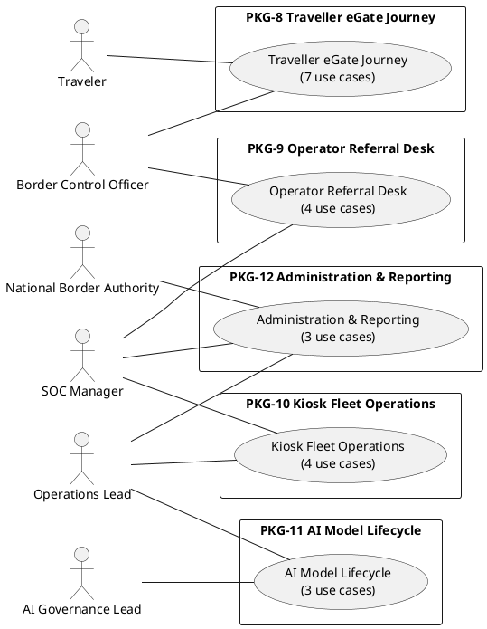

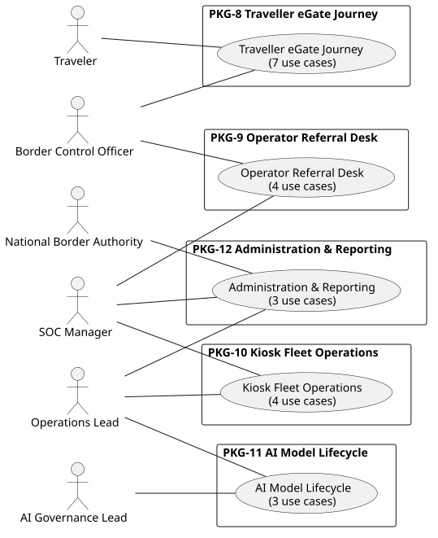

---

## §2 — PKG-8: Traveller eGate Journey (7 use cases)

Primary actor: **Traveler** (SH-EXT-002) on UC-16..UC-20 and UC-22; **Border Control
Officer** (SH-EXT-001) on UC-21. Stakeholders from the cards: SOC Manager (spoof/PA
events, UC-18), DPO (notice content owner, UC-22), National Border Authority
(data controller via SYS-02, UC-16/UC-22). Every failure path extends into the
referral use case (Alternative Flows of UC-16 §5.1–5.3, UC-17 §5.1, UC-18
§5.1, UC-19 §5.1, UC-20 §5.1).

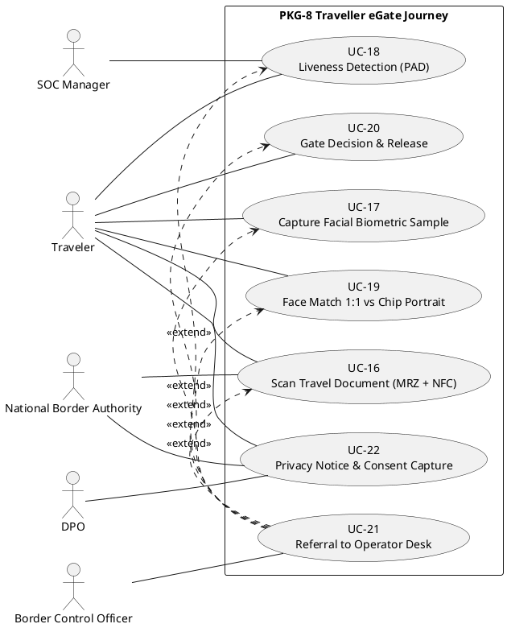

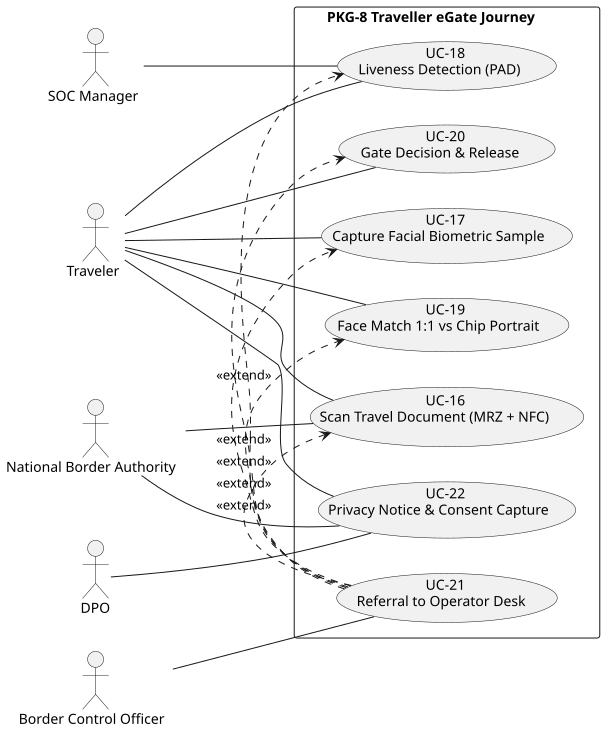

Journey sequencing (preconditions, not drawn): UC-22/UC-16 → UC-17 → UC-18 → UC-19 → UC-20.

#### UC-16 — Scan Travel Document (MRZ + NFC chip)
Primary: Traveler. Stakeholders: Border Officer (referral receiver), National Border Authority (via SYS-02). Extensions: MRZ unreadable / PA invalid / MRZ-chip mismatch → UC-21.

#### UC-17 — Capture Facial Biometric Sample
Primary: Traveler. Stakeholders: Border Officer, AI Governance Lead (quality thresholds). Extensions: quality below threshold / multi-face / template failure → UC-21.

#### UC-18 — Liveness Detection (Presentation Attack Detection)
Primary: Traveler. Stakeholders: SOC Manager (spoof events), Border Officer. Extensions: score below threshold / sensor anomaly → UC-21.

#### UC-19 — Face Match 1:1 Against Chip Portrait
Primary: Traveler. Stakeholders: Border Officer (below-threshold/grey-band), National Border Authority (SYS-02). Extensions: below threshold / grey band → UC-21 (never auto-reject).

#### UC-20 — Gate Decision & Release
Primary: Traveler. Stakeholders: Border Officer (watchlist/door-failure). Extensions: watchlist hit (quiet referral) / door failure → UC-21.

#### UC-21 — Referral to Operator Desk
Primary: Border Control Officer. Stakeholders: Traveler, SOC Manager (impostor escalation), DPO (override audit). Extension target of all PKG-8 failure paths.

#### UC-22 — Traveller Privacy Notice & Consent Capture
Primary: Traveler. Stakeholders: DPO (notice owner), National Border Authority (controller). Extensions: consent declined → manual officer lane (no UC reference — not drawn).

---

## §3 — PKG-9: Operator Referral Desk (4 use cases)

Primary actor: **Border Control Officer** (SH-EXT-001) on all four. Stakeholders from the
cards: Traveler (presents at desk, UC-25), SOC Manager (escalation/clearance, UC-24/
UC-25/UC-26), DPO (override audit, UC-25). One explicit extension: high-risk step-up
re-authentication (UC-23 §6.2) on override actions (UC-25 §5.1). (The shift-handover
lane card PROC-23 — Doc31 — is no longer drawn here: §5C.5 UC ovals only.)

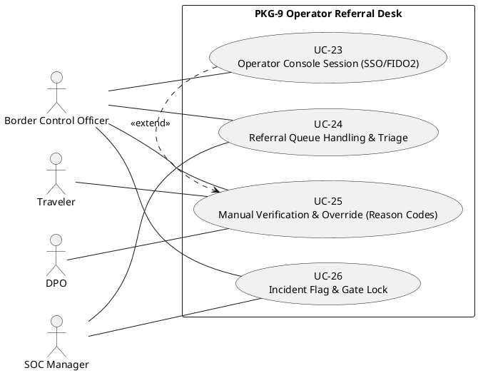

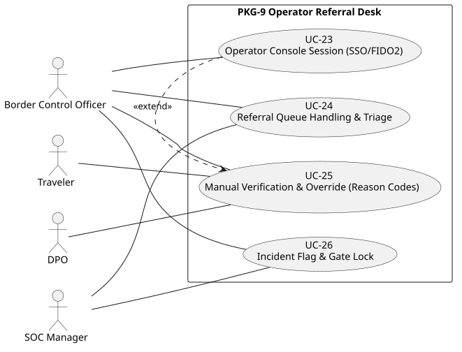

Session chain (preconditions, not drawn): UC-23 → UC-24 (claimed item) → UC-25.

#### UC-23 — Operator Console Session (SSO/FIDO2, Fail-Closed)
Primary: Border Officer. Stakeholders: Ops Lead (role admin via PROC-27), SOC Manager (auth anomalies). Extensions: FIDO2 failure → fail-closed, no UC reference (not drawn).

#### UC-24 — Referral Queue Handling & Triage
Primary: Border Officer. Stakeholders: SOC Manager (overflow, correlation). Extensions: overflow → intake throttle (UC-21 §5.3 behaviour — cross-package, not drawn).

#### UC-25 — Manual Identity Verification & Override (Reason Codes)
Primary: Border Officer. Stakeholders: Traveler, SOC Manager, DPO. Extension: step-up re-auth per UC-23 §6.2 (drawn).

#### UC-26 — Incident Flag & Gate Lock
Primary: Border Officer. Stakeholders: SOC Manager (owns triage/clearance). No cross-UC references in Alternative Flows.

---

## §4 — PKG-10: Kiosk Fleet Operations (4 use cases)

Primary actor: **Operations Lead** (SH-INT-007) on UC-27/UC-28/UC-30;
**SOC Manager** (SH-INT-008) primaries UC-29. Stakeholders from the cards: Dev Lead
(SH-INT-006, OTA co-signing), Airport Operator (SH-EXT-004, physical access). Explicit
extension: heartbeat loss → offline/failover assessment (UC-27 §5.1). (The
provisioning lane card PROC-24 — Doc31 — is no longer drawn here: §5C.5 UC ovals only; its
boot-chain-failure extension into UC-29 is recorded in Doc31 §PROC-24.)

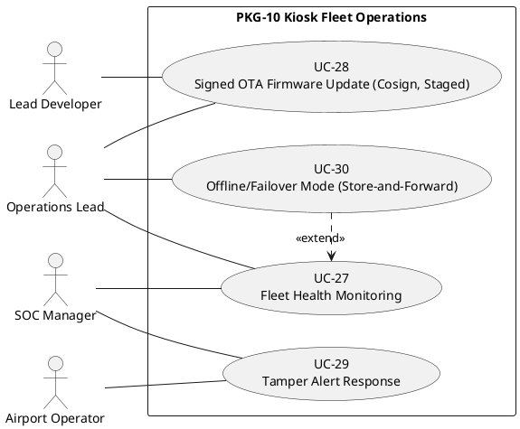

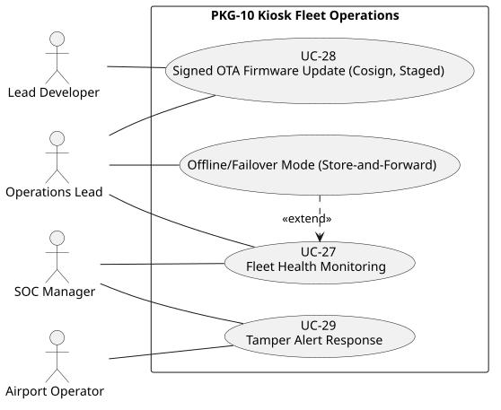

#### UC-27 — Fleet Health Monitoring
Primary: Ops Lead. Stakeholders: SOC Manager (security-class anomalies). Extension: heartbeat loss → UC-30 assessment (drawn); tamper indicators → UC-29 appears in basic flow step 4, not an extension (not drawn).

#### UC-28 — Signed OTA Firmware Update (Cosign, Staged)
Primary: Ops Lead. Stakeholders: Dev Lead, SOC Manager. No cross-UC references in Alternative Flows.

#### UC-29 — Tamper Alert Response
Primary: SOC Manager. Stakeholders: Ops Lead, Airport Operator. Trigger sources UC-27 / UC-26 appear in the trigger/precondition text (not drawn).

#### UC-30 — Offline/Failover Mode (Store-and-Forward Crossing Events)
Primary: Ops Lead. Stakeholders: SOC Manager (backhaul-loss detection). No cross-UC references in Alternative Flows.

---

## §5 — PKG-11: AI Model Lifecycle (3 use cases)

Primary actor: **AI Governance Lead** (SH-INT-005) on UC-31/UC-32;
**Operations Lead** (SH-INT-007) primaries UC-33. Stakeholders from the cards: SOC
Manager (rollback incident link, UC-32), National Border Authority (SH-EXT-003,
watchlist sync, UC-33). **No Alternative Flows block in PKG-11 cross-references
another U.C.** — no dotted arrows. (The training/release lane card PROC-25 and the
drift/bias review lane card PROC-26 — Doc31 — are no longer drawn here: §5C.5 UC ovals
only; their stakeholder sets (Dev Lead, DPO, AI Market Surveillance Authority) belong to
those cards.)

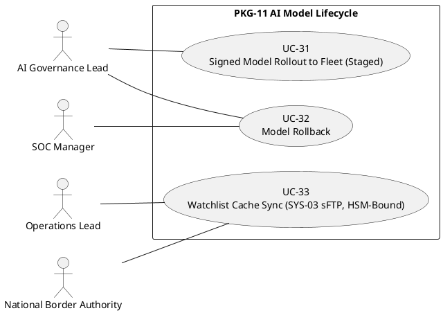

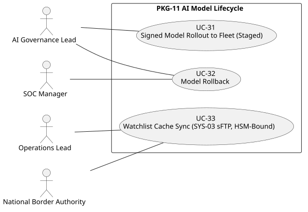

Lifecycle sequencing (preconditions/basic flow, not drawn): training/release packaging gate (PROC-25, Doc31) → UC-31 (rollout eligibility) → UC-32 (rollback arming); drift/bias review dispositions (PROC-26, Doc31) → retrain (PROC-25) or rollback (UC-32).

#### UC-31 — Signed Model Rollout to Fleet (Staged)
Primary: AI Governance Lead. Stakeholders: Ops Lead, SOC Manager. No cross-UC references in Alternative Flows.

#### UC-32 — Model Rollback
Primary: AI Governance Lead. Stakeholders: SOC Manager, Dev Lead. Extensions reference UC-29 path (cross-package, not drawn).

#### UC-33 — Watchlist Cache Sync (SYS-03 sFTP, HSM-Bound)
Primary: Ops Lead. Stakeholders: National Border Authority. No cross-UC references in Alternative Flows.

---

## §6 — PKG-12: Administration & Reporting (3 use cases)

Primary actor: **Operations Lead** (SH-INT-007) on UC-34, UC-36;
**National Border Authority** (SH-EXT-003) primaries UC-35. Stakeholders from the
cards: second approver (CISO delegate or Security Engineer, UC-34 dual control),
SOC Manager (config-drift alerts, audit export), Compliance Analyst and DPO (audit
export), CISO and Airport Operator (dashboard). (The role-administration lane card
PROC-27 — Doc31 — is no longer drawn here: §5C.5 UC ovals only.)
**No Alternative Flows block in PKG-12 cross-references another U.C.** — no dotted arrows.

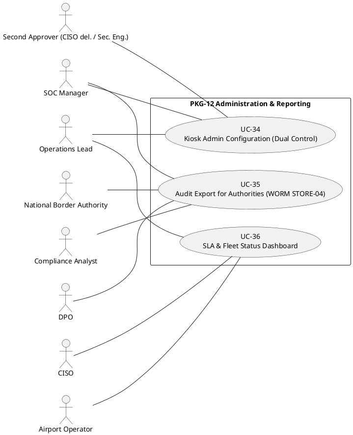

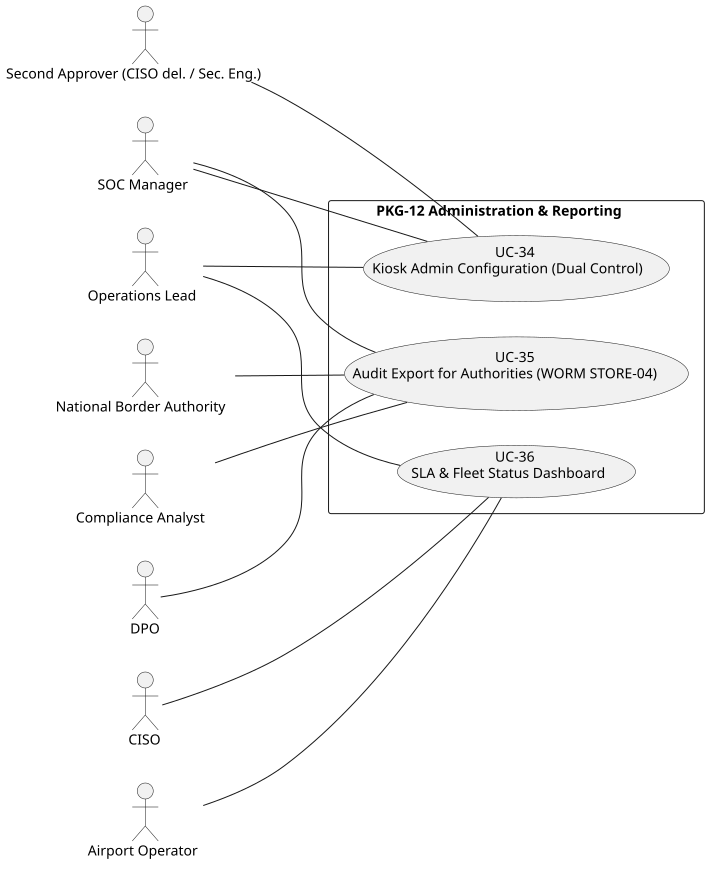

#### UC-34 — Kiosk Admin Configuration (TPM-Bound, Dual Control)
Primary: Ops Lead. Stakeholders: Second Approver, SOC Manager. No cross-UC references in Alternative Flows.

#### UC-35 — Audit Export for Authorities (WORM STORE-04)
Primary: National Border Authority. Stakeholders: Compliance Analyst, SOC Manager, DPO. No cross-UC references in Alternative Flows.

#### UC-36 — SLA & Fleet Status Dashboard
Primary: Ops Lead. Stakeholders: CISO, Airport Operator. Fed by UC-27/UC-30 telemetry (basic-flow/trigger text, not drawn).

---

**Element budget check:** each diagram ≤ 20 elements (actors + ovals): §1 = 11, §2 = 12,
§3 = 8, §4 = 8, §5 = 7, §6 = 11. All aliases defined within their diagram; braces balanced.
Lane cards (PROC-23..27) are diagrammed only in Doc31 §5C.4 flowcharts (UC SEPARATION,
2026-09-05); §3–§6 titles carry the true UC counts (4/4/3/3).
