# Annex B — Sequence Diagrams

> **v1.1 (UC SEPARATION, 2026-09-05).** One section per product UC card (§5C.5), ordered by
> the catalogue's §6 card order — 21 sections, 1:1 with the 21 `**Sequence diagram:**`
> pointers in Doc21. The 5 former PROC sections (PROC-23, PROC-24, PROC-25, PROC-26,
> PROC-27) were removed: lane cards do not carry sequence diagrams (§5C.5); their diagrams
> are the §5C.4 flowcharts in `Doc31_Process_Capability_Cards.md`. The stale "B.1 Critical
> Path Sequences" PLACEHOLDER block and the `[CASE_NAME]` header were replaced by proper
> frontmatter (C3 F1 precedent).

---

## §1 — Use-Case — {U.C.8.1.1} Scan Travel Document (MRZ + NFC chip)

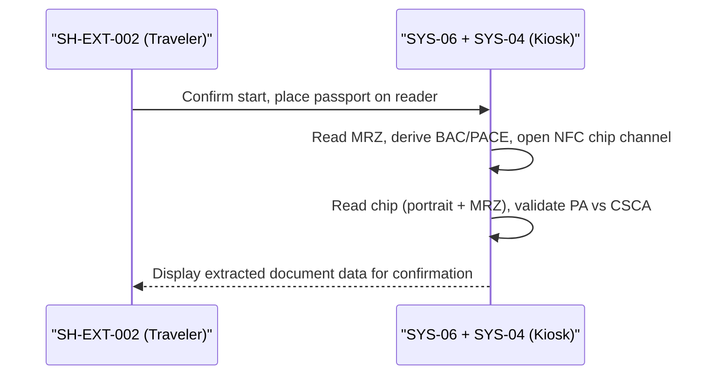

## §2 — Use-Case — {U.C.8.2.1} Capture Facial Biometric Sample

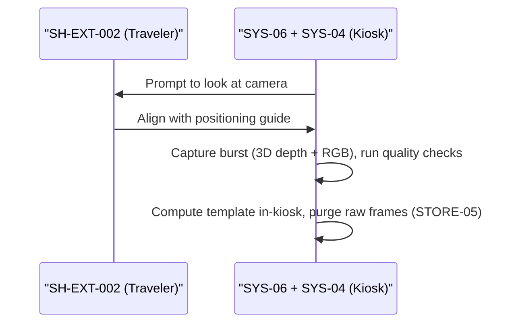

## §3 — Use-Case — {U.C.8.2.2} Liveness Detection (Presentation Attack Detection)

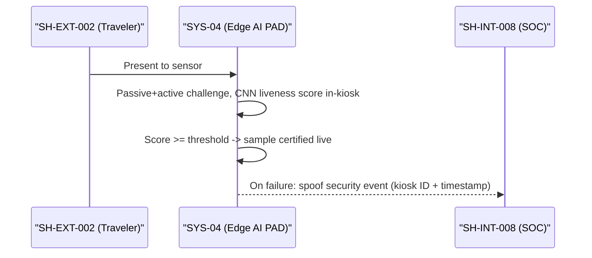

## §4 — Use-Case — {U.C.8.2.3} Face Match 1:1 Against Chip Portrait

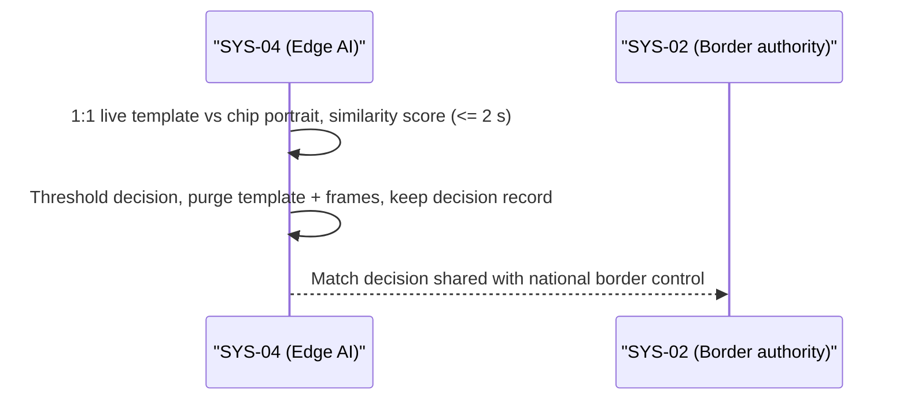

## §5 — Use-Case — {U.C.8.3.1} Gate Decision & Release

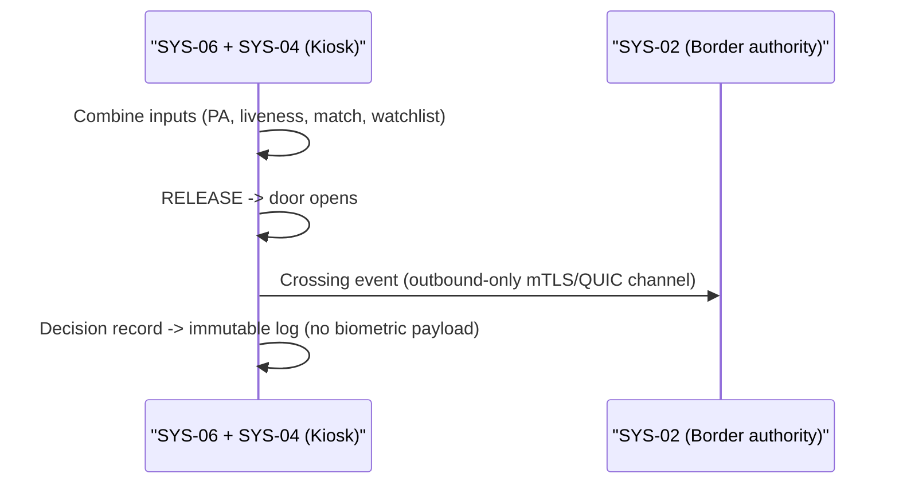

## §6 — Use-Case — {U.C.8.3.2} Referral to Operator Desk

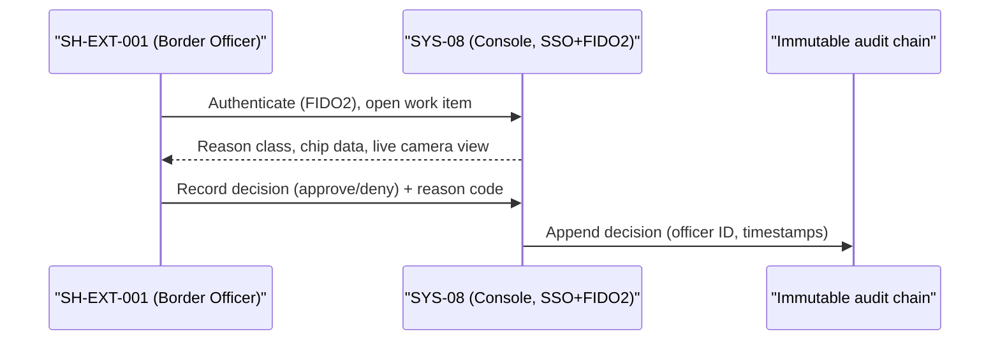

## §7 — Use-Case — {U.C.8.4.1} Traveller Privacy Notice & Consent Capture

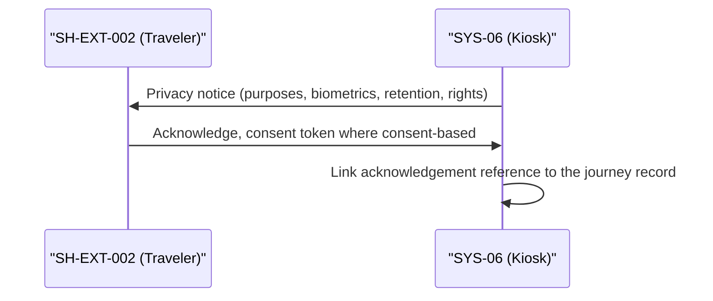

## §8 — Use-Case — {U.C.9.1.1} Operator Console Session (SSO/FIDO2, Fail-Closed)

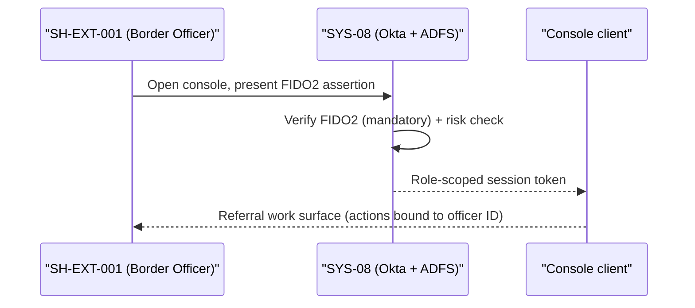

## §9 — Use-Case — {U.C.9.2.1} Referral Queue Handling & Triage

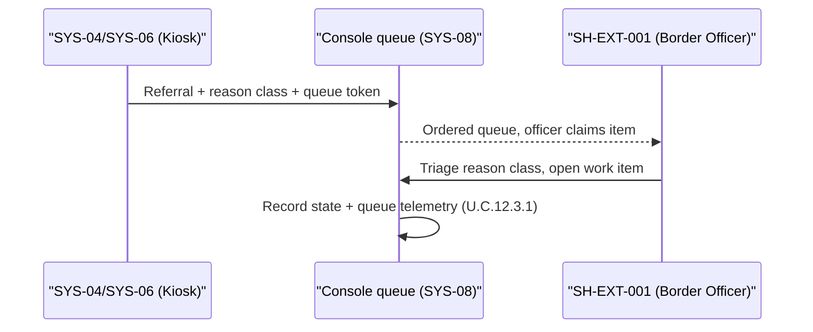

## §10 — Use-Case — {U.C.9.3.1} Manual Identity Verification & Override (Reason Codes)

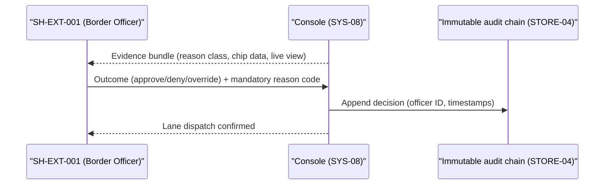

## §11 — Use-Case — {U.C.9.4.1} Incident Flag & Gate Lock

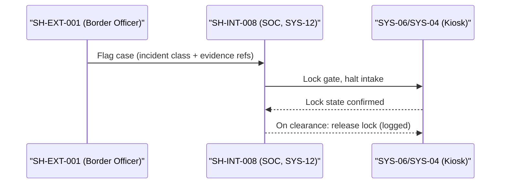

## §12 — Use-Case — {U.C.10.2.1} Fleet Health Monitoring

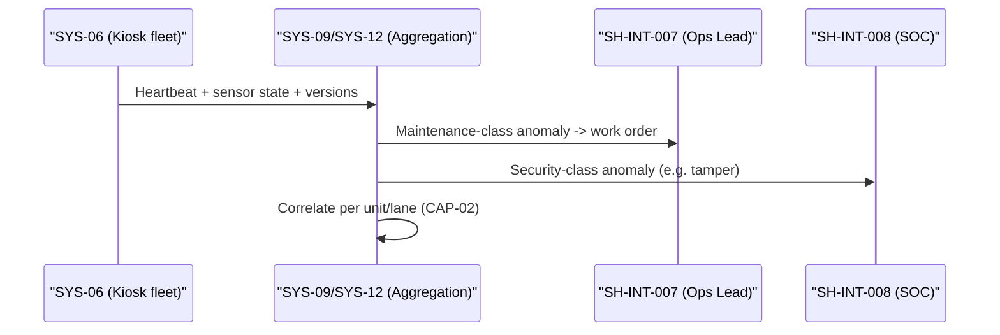

## §13 — Use-Case — {U.C.10.3.1} Signed OTA Firmware Update (Cosign, Staged)

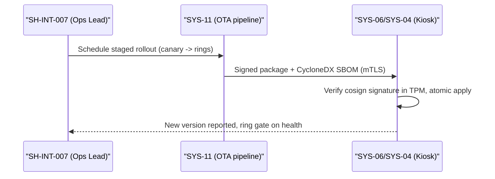

## §14 — Use-Case — {U.C.10.4.1} Tamper Alert Response

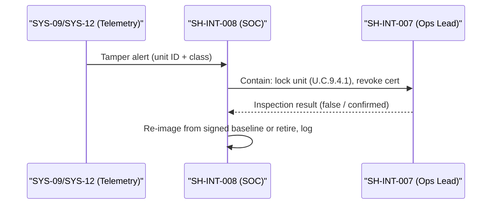

## §15 — Use-Case — {U.C.10.5.1} Offline/Failover Mode (Store-and-Forward Crossing Events)

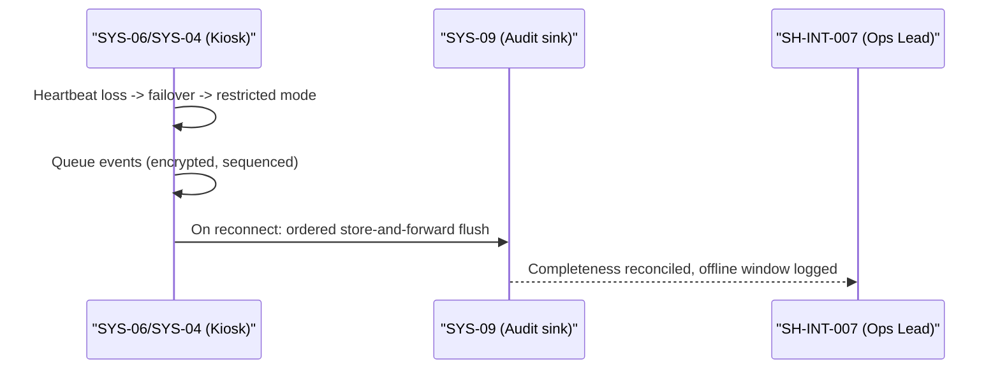

## §16 — Use-Case — {U.C.11.2.1} Signed Model Rollout to Fleet (Staged)

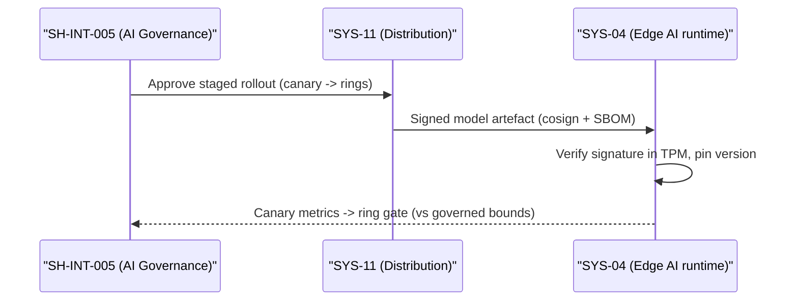

## §17 — Use-Case — {U.C.11.3.1} Model Rollback

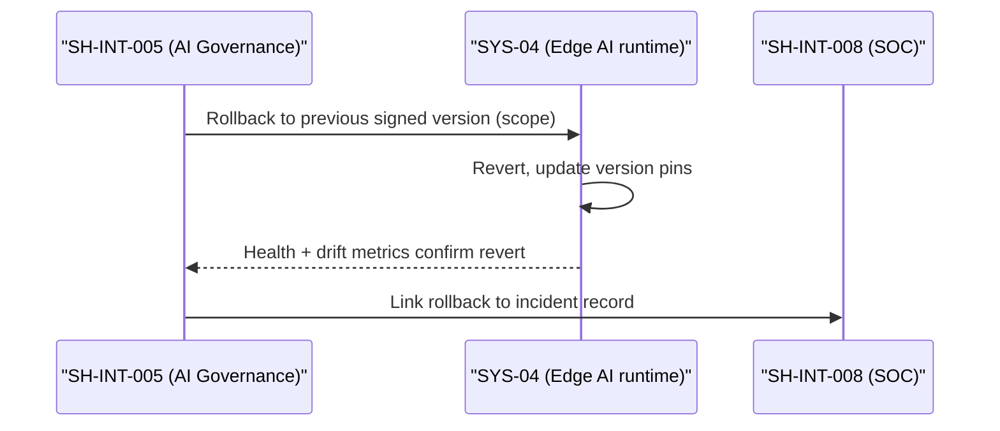

## §18 — Use-Case — {U.C.11.5.1} Watchlist Cache Sync (SYS-03 sFTP, HSM-Bound)

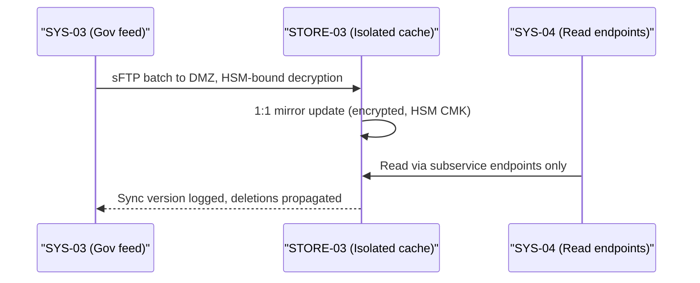

## §19 — Use-Case — {U.C.12.1.1} Kiosk Admin Configuration (TPM-Bound, Dual Control)

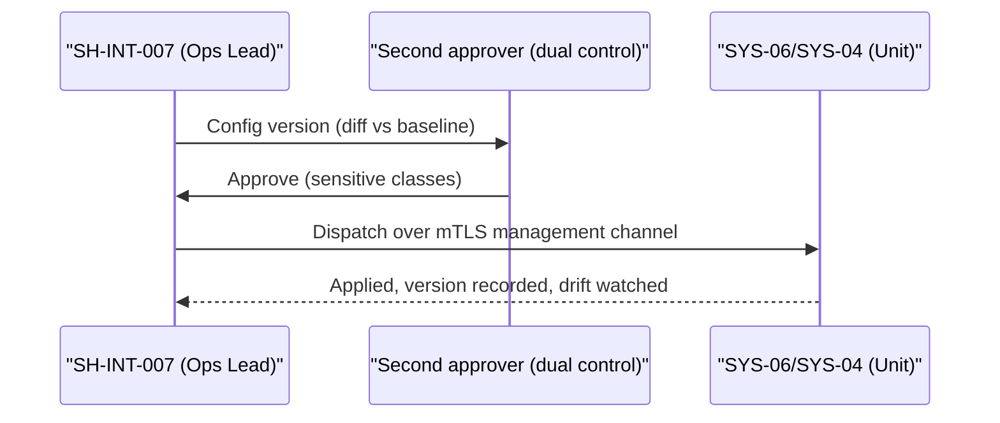

## §20 — Use-Case — {U.C.12.2.1} Audit Export for Authorities (WORM STORE-04)

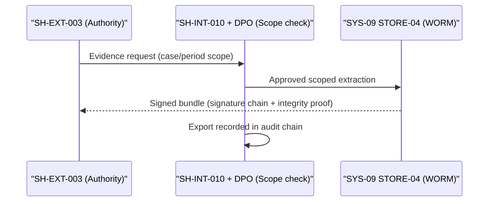

## §21 — Use-Case — {U.C.12.3.1} SLA & Fleet Status Dashboard

```mermaid
sequenceDiagram
    participant TEL as "SYS-09 (Telemetry)"
    participant DASH as "SLA & Fleet dashboard"
    participant OPS as "SH-INT-007 (Ops Lead)"
    TEL->>DASH: Unit status + SLA counters
    DASH->>DASH: Uptime vs 99.99%, breach windows annotated
    DASH-->>OPS: Live view + threshold alerts
    DASH->>DASH: Periodic SLA report archived
```

