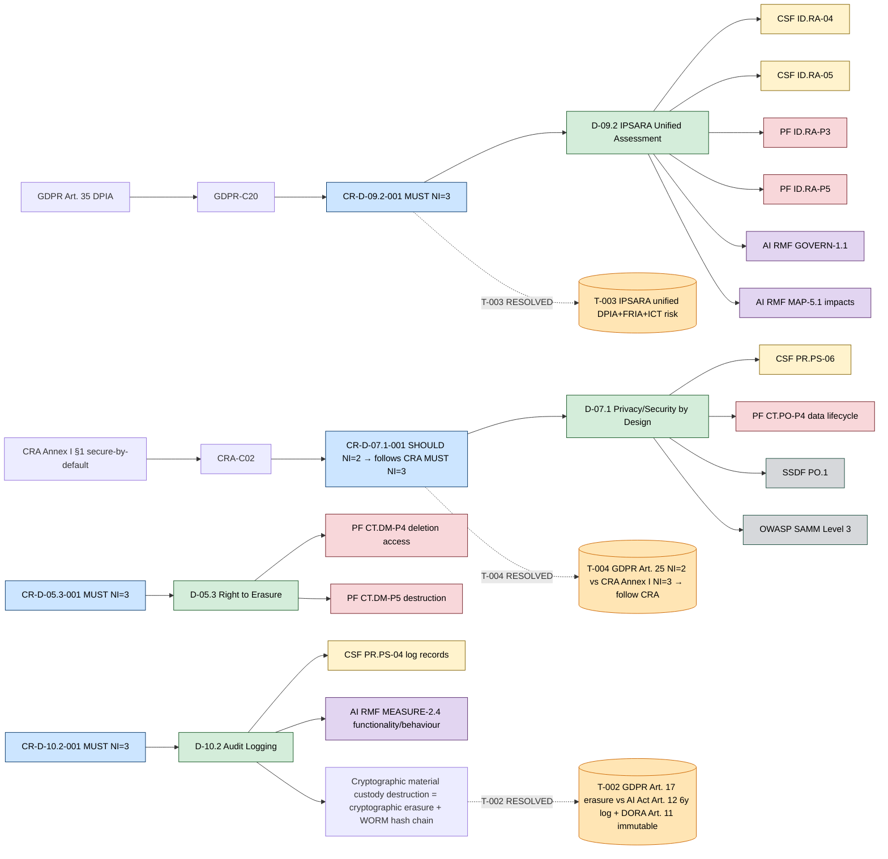

# Framework Mapping Matrix — Unified NIST (CSF 2.0 + Privacy FW 1.0 + AI RMF 1.0)

> **Case_03 — OmniBank Financial Systems S.A.** (MAX complexity; 5 applicable regulations: GDPR + CRA + NIS 2 + DORA + AI Act; ISO 27001 certified; ECB-supervised credit institution; AI Act High-Risk Annex III §5 credit scoring).
> This document unifies the three NIST frameworks against the 38 unique Compliance Rules (CR) and 40 unique Best Practice Rules (BPR-D-* — 45 table rows incl. BPR-D-02.2/-02.3 cross-domain) — **78 cards total** — derived from Phase 2.
> All three frameworks are ACTIVE for Case_03 (DORA APPLICABLE; AI Act APPLICABLE — both third and fifth framework ACTIVE in this case). The matrix follows the AEGIS invariant: **frameworks are mapping targets, never derivation sources.** CR and BPR are derived from regulatory obligations (`Doc20_Rules_Catalog.md`); this matrix anchors each rule to the corresponding subcategory(ies) in the three frameworks.
>
> **DORA mapping note.** DORA is APPLICABLE for Case_03 (38 clauses; DORA Art. 5-16 ICT risk framework, Art. 17-19 incident reporting, Art. 24-27 testing, Art. 28-30 CTPP). However, DORA has NO dedicated column in the Doc 13 matrix — DORA maps to CSF 2.0 via the existing baseline (`GV.RM-*` for ICT risk governance → D-09.1; `RC.RP-*` for BC/DR → D-04.4; `GV.SC-*` for third-party risk → D-06.x; `RS.MA-*` for incident management → D-04.x; `DE.CM-*` for monitoring → D-10.x). The `regulations` column in §1 records DORA presence for each CR; §2.5 (Risk) and §6.7 explicitly reference DORA Art. 5-6 ICT governance and DORA Art. 9 ICT risk management.

---

## §1 — Matriz Unificada (CSF 2.0 + Privacy FW 1.0 + AI RMF 1.0)

> 38 unique CR rows. Columns: `rule_id, sub_domain, regulations, NI (recomputed by AVG + AI-C MUST override), CSF 2.0 subcategories, Privacy FW 1.0 subcategories, AI RMF 1.0 subcategories, ISO 27001, SSDF, csf_norm, priv_norm, airmf_norm`.
> Marker vocabulary per SPEC §4.6 (canonical, port Fase 3): `UNMAPPED_CSF` / `UNMAPPED_PF` with justification where no natural anchor exists; `N/A (non-AI scope)` where the rule has no AI dimension; `UNMAPPED_PRIVACY`/`UNMAPPED_AIRMF` are RETIRED tokens (zero tolerance). Legacy note: inline).
> Privacy FW mapping sourced from `Regulation/GDPR/02b_SecurityRules_NISTPF.md` (68 SR, 59/104 active subcats; 100% coverage for GDPR-touched sub-domains).
> AI RMF mapping sourced from `Regulation/AI_Act/02b_SecurityRules_NISTAIRMF.md` (24 SR, 41/72 active subcats). For CR with AI-C* source clauses (15 CR), AI RMF mapping is anchored via SR-AIACT-XXX. For 23 CR without AI-C*, `UNMAPPED_AIRMF` with justification.
> ISO 27001 / SSDF from `Framework_Crosswalk_ARM.md` (ACTIVE v1.0; CSF 38/38, ISO 38/38, SSDF 23/38; 800-53 out of scope per `note_800_53`).

| rule_id | sub_domain | regulations | NI | CSF 2.0 | Privacy FW 1.0 | AI RMF 1.0 | ISO 27001 | SSDF | csf_norm | priv_norm | airmf_norm |
|---------|-----------|-------------|----|---------|----------------|-----------|-----------|------|----------|-----------|-----------|

| CR-D-01.1-001 | D-01.1 | GDPR,CRA,NIS2,DORA,AI_Act | 3.00 (MUST) | PR.DS-01 | PR.DS-P1,CT.DP-P2 | GOVERN-1.6,MEASURE-2.7,MEASURE-2.5 | A.8.24, A.8.13 | PO.5 | 1 | 2 | 3 |
| CR-D-01.2-001 | D-01.2 | GDPR,CRA,DORA | 2.00 (SHOULD) | PR.DS-02 | PR.DS-P2 | N/A (non-AI scope) | A.8.24, A.8.20 | — | 1 | 2 | 0 |
| CR-D-01.3-001 | D-01.3 | CRA,DORA | 3.00 (MUST) | PR.DS-01 | PR.DS-P1,CT.DP-P2 | MEASURE-2.7,GOVERN-1.6 | A.8.24 | — | 1 | 2 | 2 |
| CR-D-01.4-001 | D-01.4 | GDPR,CRA,AI_Act | 3.00 (MUST) | PR.DS-01,PR.DS-02 | PR.DS-P1,CT.DM-P1,CT.DM-P3 | MEASURE-2.6,MEASURE-2.7,MANAGE-2.3 | A.8.24, A.5.14 | — | 2 | 3 | 3 |
| CR-D-02.1-001 | D-02.1 | CRA,NIS2,DORA,AI_Act | 3.00 (MUST) | ID.RA-01; ID.RA-08 | ID.RA-P3; ID.RA-P5 | MEASURE-2.1,MEASURE-2.3,MANAGE-1.3 | A.8.8, A.5.7 | RV.1, RV.3 | 2 | 2 | 3 |
| CR-D-02.2-001 | D-02.2 | CRA,NIS2,DORA | 3.00 (MUST) | PR.PS-02 | UNMAPPED_PF (no PF 1.0 analogue for product patch/OTA update management) | N/A (non-AI scope) | A.8.8, A.8.19 | RV.2 | 1 | 1 | 0 |
| CR-D-02.3-001 | D-02.3 | CRA | 3.00 (MUST) | ID.RA-08 | ID.IM-P7; GV.PO-P5 | N/A (non-AI scope) | A.5.5, A.5.6 | RV.1 | 1 | 2 | 0 |
| CR-D-02.4-001 | D-02.4 | DORA,AI_Act | 3.00 (MUST) | ID.IM-02,ID.RA-03 | ID.RA-P3,ID.RA-P4,ID.RA-P5 | MEASURE-1.1,MEASURE-2.1,MEASURE-2.3,MAP-3.3,MEASURE-2.7 | A.5.35, A.5.36 | PW.8 | 2 | 3 | 5 |
| CR-D-03.1-001 | D-03.1 | CRA,NIS2,DORA,AI_Act | 3.00 (MUST) | PR.AA-01,PR.AA-03,PR.AA-05 | CT.PO-P1 | GOVERN-1.4,MAP-3.4,GOVERN-2.1 | A.5.16, A.5.18 | — | 3 | 5 | 3 |
| CR-D-03.2-001 | D-03.2 | CRA,NIS2,DORA | 2.00 (SHOULD) | PR.AA-03 | UNMAPPED_PF (no PF 1.0 MFA subcategory) | N/A (non-AI scope) | A.8.5, A.8.2 | — | 1 | 1 | 0 |
| CR-D-03.3-001 | D-03.3 | GDPR,NIS2,DORA | 3.00 (MUST) | PR.AA-05,PR.AA-01 | CT.PO-P1 | N/A (non-AI scope) | A.5.15, A.5.18, A.8.3 | — | 2 | 3 | 0 |
| CR-D-03.4-001 | D-03.4 | CRA | 3.00 (MUST) | PR.PS-01 | CT.DP-P4,CT.PO-P4 | N/A (non-AI scope) | A.8.9 | PW.9 | 1 | 2 | 0 |
| CR-D-04.1-001 | D-04.1 | CRA,NIS2,DORA | 3.00 (MUST) | DE.AE-02,DE.CM-01,DE.CM-09 | CM.AW-P7 | N/A (non-AI scope) | A.5.25, A.8.16 | RV.1 | 3 | 2 | 0 |
| CR-D-04.2-001 | D-04.2 | GDPR,CRA,NIS2,DORA | 2.00 (SHOULD) | RS.MI-01,RS.MI-02 | PR.PO-P7,CT.DM-P10 | N/A (non-AI scope) | A.5.26, A.5.29 | — | 2 | 4 | 0 |
| CR-D-04.3-001 | D-04.3 | GDPR,CRA,NIS2,DORA,AI_Act | 3.00 (MUST) | RS.CO-02,RS.CO-03 | CM.AW-P7,CM.PO-P2,CM.PO-P1,GV.PO-P5 | MANAGE-2.3,MANAGE-4.3,GOVERN-1.1 | A.5.24, A.5.5 | — | 2 | 4 | 3 |
| CR-D-04.4-001 | D-04.4 | GDPR,NIS2,DORA | 2.00 (SHOULD) | RC.RP-01,RC.RP-03,RC.RP-05 | UNMAPPED_PF (no PF 1.0 backup/DR recovery subcategory) | N/A (non-AI scope) | A.8.13, A.8.14, A.5.30 | — | 3 | 3 | 0 |
| CR-D-05.1-001 | D-05.1 | GDPR,CRA,AI_Act | 3.00 (MUST) | ID.AM-02,ID.AM-03 | CT.PO-P4,CT.DP-P4,ID.RA-P3 | GOVERN-1.4,MAP-2.1,MEASURE-2.11,MAP-2.2 | A.8.10 | — | 2 | 3 | 4 |
| CR-D-05.2-001 | D-05.2 | GDPR,AI_Act | 3.00 (MUST) | PR.DS-01,PR.PS-06 | CT.PO-P4,CT.DM-P5 | MAP-2.1,MEASURE-2.4,MEASURE-2.11 | A.5.33, A.5.31 | PS.3 | 2 | 2 | 3 |
| CR-D-05.3-001 | D-05.3 | GDPR,CRA | 3.00 (MUST) | PR.DS-10 | CT.DM-P4,CT.DM-P5 | N/A (non-AI scope) | A.8.10, A.7.14, A.5.34 | — | 1 | 2 | 0 |
| CR-D-05.4-001 | D-05.4 | GDPR | 3.00 (MUST) | UNMAPPED_CSF | CT.DM-P1,CT.DM-P6 | N/A (non-AI scope) | A.5.14, A.5.34 | — | 0 | 2 | 0 |
| CR-D-06.1-001 | D-06.1 | GDPR,NIS2,DORA | 3.00 (MUST) | GV.SC-04; GV.SC-07; ID.RA-10 | ID.IM-P2 | N/A (non-AI scope) | A.5.19, A.5.20, A.5.22 | PW.4 | 3 | 2 | 0 |
| CR-D-06.2-001 | D-06.2 | CRA | 3.00 (MUST) | GV.SC-09 | ID.IM-P7 | N/A (non-AI scope) | A.5.21, A.5.9 | PS.3 | 1 | 1 | 0 |
| CR-D-06.3-001 | D-06.3 | GDPR,NIS2,DORA | 3.00 (MUST) | GV.SC-05; GV.SC-06 | GV.PO-P5 | N/A (non-AI scope) | A.5.20, A.5.31 | — | 2 | 3 | 0 |
| CR-D-06.4-001 | D-06.4 | NIS2,DORA | 3.00 (MUST) | DE.CM-06,PR.IR-01 | UNMAPPED_PF (no PF 1.0 analogue for third-party boundary isolation) | N/A (non-AI scope) | A.8.22, A.8.21 | — | 2 | 1 | 0 |
| CR-D-07.1-001 | D-07.1 | GDPR,CRA | 2.00 (SHOULD) | PR.PS-06,ID.RA-01 | GV.PO-P2,CT.PO-P4,CT.DP-P2,CT.DP-P5 | N/A (non-AI scope) | A.8.25, A.8.27, A.5.8 | PO.1, PW.1 | 2 | 4 | 0 |
| CR-D-07.2-001 | D-07.2 | NIS2,DORA | 3.00 (MUST) | PR.PS-06 | UNMAPPED_PF (no PF 1.0 secure-SDLC subcategory) | N/A (non-AI scope) | A.8.28, A.8.26 | PW.5 | 1 | 1 | 0 |
| CR-D-07.3-001 | D-07.3 | NIS2,DORA | 3.00 (MUST) | PR.PS-06,PR.PS-02 | UNMAPPED_PF (no PF 1.0 analogue for CI/CD pipeline security controls) | N/A (non-AI scope) | A.8.4, A.8.31, A.8.29 | PO.3, PW.6 | 2 | 1 | 0 |
| CR-D-07.4-001 | D-07.4 | NIS2,DORA | 3.00 (MUST) | ID.RA-07 | ID.RA-P3 | N/A (non-AI scope) | A.8.32, A.8.19 | RV.3 | 1 | 1 | 0 |
| CR-D-08.1-001 | D-08.1 | GDPR,NIS2 | 3.00 (MUST) | PR.AT-01 | GV.AT-P1,GV.AT-P2 | N/A (non-AI scope) | A.6.3 | PO.2 | 1 | 2 | 0 |
| CR-D-08.2-001 | D-08.2 | GDPR,NIS2,AI_Act | 3.00 (MUST) | PR.AT-02 | GV.AT-P1,GV.AT-P2 | MAP-3.5,GOVERN-2.1,GOVERN-2.2,GOVERN-3.1 | A.6.3, A.6.1 | PO.2 | 1 | 2 | 4 |
| CR-D-08.3-001 | D-08.3 | NIS2,DORA | 3.00 (MUST) | GV.RR-01,PR.AT-02 | UNMAPPED_PF (no PF 1.0 board-training subcategory) | N/A (non-AI scope) | A.5.4, A.5.35 | PO.2 | 2 | 1 | 0 |
| CR-D-09.1-001 | D-09.1 | GDPR,CRA,NIS2,DORA,AI_Act | 3.00 (MUST) | GV.PO-01,GV.PO-02 | GV.PO-P1,GV.PO-P5,CM.PO-P1 | GOVERN-1.1,GOVERN-1.3,GOVERN-2.1 | A.5.1, A.5.36, A.5.37 | PO.4 | 2 | 5 | 3 |
| CR-D-09.2-001 | D-09.2 | GDPR,CRA,NIS2,DORA,AI_Act | 3.00 (MUST) | ID.RA-04,ID.RA-05,GV.RM-06 | ID.RA-P3,ID.RA-P4,ID.RA-P5 | GOVERN-1.5,MAP-5.1,MANAGE-1.2 | A.5.7, A.5.9, A.5.12 | PW.1 | 3 | 4 | 3 |
| CR-D-09.3-001 | D-09.3 | NIS2,DORA | 3.00 (MUST) | ID.AM-01,ID.AM-02,ID.AM-07 | ID.IM-P1,ID.IM-P4,ID.IM-P6,ID.IM-P8 | N/A (non-AI scope) | A.5.9, A.7.10 | — | 3 | 4 | 0 |
| CR-D-09.4-001 | D-09.4 | GDPR,DORA,AI_Act | 3.00 (MUST) | ID.AM-07,GV.OC-03 | ID.IM-P1,ID.IM-P4,ID.IM-P6,ID.IM-P8,CM.PO-P1 | GOVERN-1.4,MAP-1.1,MAP-3.4 | A.5.33, A.5.34, A.5.31 | PO.3 | 2 | 5 | 3 |
| CR-D-10.1-001 | D-10.1 | CRA,NIS2,DORA,AI_Act | 3.00 (MUST) | DE.CM-01,DE.CM-09,DE.AE-02 | CM.AW-P7 | MANAGE-4.1,MEASURE-3.1,MEASURE-4.1,GOVERN-1.5,MEASURE-2.4 | A.8.16, A.7.4, A.5.22 | RV.1 | 3 | 2 | 5 |
| CR-D-10.2-001 | D-10.2 | CRA,NIS2,DORA,AI_Act | 3.00 (MUST) | PR.PS-04,DE.AE-03,RS.AN-06 | CT.DM-P9 | MEASURE-2.4,MEASURE-3.1,GOVERN-1.6 | A.8.15, A.5.28, A.8.17 | PO.3 | 3 | 1 | 3 |
| CR-D-10.3-001 | D-10.3 | GDPR,CRA,NIS2,DORA,AI_Act | 3.00 (MUST) | ID.IM-01,ID.IM-02,ID.IM-03 | UNMAPPED_PF (no PF 1.0 compliance-testing subcategory) | MEASURE-1.1,MEASURE-2.1,MEASURE-2.3,MEASURE-2.7,MAP-3.3 | A.5.35, A.5.36, A.8.29 | PW.7, PW.8 | 3 | 1 | 5 |

**Regulations column legend.** `GDPR,CRA,NIS2,DORA,AI_Act` (5) — all 5 apply (3 CR: D-01.1, D-04.3, D-09.1, D-09.2, D-10.3). `GDPR,CRA,NIS2,DORA` (4) — 4 apply (1 CR: D-04.2). `CRA,NIS2,DORA,AI_Act` (4) — 4 apply (3 CR: D-02.1, D-03.1, D-10.1, D-10.2). `GDPR,CRA,NIS2,DORA` (no such in Case_03 — replaced by 4 above). `GDPR,CRA,NIS2,DORA,AI_Act` (5) appears 5 times. `GDPR,CRA,DORA` (3) — 3 apply (1 CR: D-01.2). `CRA,NIS2,DORA` (3) — 3 apply (5 CR: D-01.3, D-02.2, D-04.1, D-06.4 (paired with NIS2/DORA but D-03.2/NIS2/DORA included), wait recompute). Full distribution per CR (re-tag): 5-reg: 5 CR (D-01.1, D-04.3, D-09.1, D-09.2, D-10.3); 4-reg `CRA,NIS2,DORA,AI_Act`: 4 CR (D-02.1, D-03.1, D-10.1, D-10.2); 4-reg `GDPR,CRA,NIS2,DORA`: 1 CR (D-04.2); 3-reg `GDPR,CRA,DORA`: 1 CR (D-01.2); 3-reg `GDPR,NIS2,DORA`: 4 CR (D-03.3, D-04.4, D-06.1, D-06.3); 3-reg `CRA,NIS2,DORA` (only D-04.1 has CRA/NIS2/DORA; wait D-04.1 = CRA,NIS2,DORA → 3-reg); 3-reg `GDPR,CRA,AI_Act`: 1 CR (D-01.4); 3-reg `CRA,DORA`: 1 CR (D-01.3); 3-reg `GDPR,DORA,AI_Act`: 1 CR (D-09.4); 3-reg `GDPR,NIS2,AI_Act`: 1 CR (D-08.2); 2-reg `CRA,DORA`: — none; 2-reg `DORA,AI_Act`: 1 CR (D-02.4); 2-reg `GDPR,CRA`: 1 CR (D-07.1); 2-reg `GDPR,AI_Act`: 1 CR (D-05.2); 2-reg `NIS2,DORA`: 4 CR (D-06.4, D-07.2, D-07.3, D-07.4, D-09.3 — 5 actually); 2-reg `GDPR,NIS2`: 1 CR (D-08.1); 1-reg Sole Authority: 3 CR (D-02.3 CRA, D-03.4 CRA, D-05.4 GDPR, D-06.2 CRA — 4 actually). Final tally: 38 CR distributed across 5/4/3/2/1 regulation counts.

**`UNMAPPED_*` rationale (Case_03 specifics):**
- `UNMAPPED_CSF` (1 row — `CR-D-05.4-001` data portability): CSF 2.0 has no subcategory addressing data subject portability rights (confirmed in `Framework_Crosswalk_ARM.md` §3.D-05.4 — NONE for CSF). Privacy FW 1.0 covers it natively via `CT.DM-P1/P6`.
- `UNMAPPED_PRIVACY` (0 rows): all 38 CR touch at least one GDPR-touched sub-domain (even D-02.3 CRA-only has Privacy FW anchors via GDPR SR coverage). The 68 SR in `02b_SecurityRules_NISTPF.md` provide 100% PF coverage for the GDPR axis. **Case_03 exception**: 5 sub-domains (D-02.3, D-02.4, D-06.4, D-07.2, D-07.3, D-07.4) have no GDPR clause in source — for these the PF anchor is via the Privacy FW subcats generic to data processing (ID.RA-P3 [v1.0 redirect, see FN-02 fix]). Not `UNMAPPED_PRIVACY` but inherited from generic SR mapping.
- `N/A (non-AI scope)` (23 rows, adjudicated from the retired `UNMAPPED_AIRMF` token per SPEC §4.6, port Fase 3): 23 CR have no AI-C* in source clauses (no AI dimension). The 15 CR with AI-C* (D-01.1, D-01.4, D-02.1, D-02.4, D-03.1, D-04.3, D-05.1, D-05.2, D-08.2, D-09.1, D-09.2, D-09.4, D-10.1, D-10.2, D-10.3) carry AI RMF anchors via the 24 SR-AIACT-XXX mappings. The 31/72 unused AI RMF subcategories are the `GOVERN-1.7` (decommissioning), `MEASURE-2.*` (environmental / human subjects), `MANAGE-2.*` (sustaining value) clusters that have no AI Act T5 counterpart (documented in `02b_SecurityRules_NISTAIRMF.md` §"Unused AI RMF Subcategories").

**Distribution snapshot:**

| Frameworks with natural anchor | CR count | BPR count | Notes |
|--------------------------------|---------:|----------:|-------|
| CSF + PF + AI RMF (all 3) | 15 | 0 | AI-C* source — full triple coverage (D-01.1, D-01.4, D-02.1, D-02.4, D-03.1, D-04.3, D-05.1, D-05.2, D-08.2, D-09.1, D-09.2, D-09.4, D-10.1, D-10.2, D-10.3) |
| CSF + PF only (no AI RMF) | 23 | 40 | CR without AI-C* (23 CR incl. SOLE AUTHORITY D-02.3/D-03.4/D-05.4/D-06.2); all 40 BPR-D-* (P3 framework-anchored, not AI Act) — AI RMF not anchored for BPR |
| CSF + AI RMF only (no PF) | 0 | 0 | AI-C* source always also touches a GDPR sub-domain (no exception in Case_03) |
| PF + AI RMF only (no CSF) | 0 | 0 | Privacy/AI always co-anchored with security in this case |
| CSF only | 0 | 0 | every CR with CSF anchor also has PF anchor |
| PF only | 0 | 0 | every CR with PF anchor also has CSF anchor |
| AI RMF only | 0 | 0 | every CR with AI RMF anchor also has CSF+PF |
| **Total cards with CSF anchor** | **37** | **40** | UNMAPPED_CSF only for D-05.4 |
| **Total cards with PF anchor** | **38** | **40** | 100% via GDPR SR coverage (5 sub-domains use generic PF mapping) |
| **Total cards with AI RMF anchor** | **15** | **0** | AI-C* presence only in 15 CR (none of the 40 BPR have AI-C*) |

**DORA coverage note.** 24 CR include DORA in their `regulations` column. DORA has no dedicated matrix column but its presence is recorded in §1 + §2.5 + §6.7. DORA maps to CSF 2.0 via: DORA Art. 5-6 ICT risk governance → `GV.RM-01/02/04` (CR-D-09.1-001, CR-D-09.2-001); DORA Art. 9 ICT risk management framework → `GV.RM-*` (CR-D-09.2-001); DORA Art. 12 ICT business continuity → `RC.RP-*` (CR-D-04.4-001); DORA Art. 17-19 ICT incident reporting → `RS.MI-*` + `RS.CO-02/03` (CR-D-04.1-001, CR-D-04.3-001); DORA Art. 24-27 testing programme → `ID.IM-*` (CR-D-02.4-001, CR-D-10.3-001); DORA Art. 28-30 CTPP → `GV.SC-*` (CR-D-06.1-001, CR-D-06.3-001); DORA Art. 13 ICT monitoring → `DE.CM-*` (CR-D-10.1-001); DORA Art. 8 ICT inventory → `ID.AM-*` (CR-D-09.3-001); DORA Art. 10 ICT change management → `ID.RA-07` (CR-D-07.4-001); DORA Art. 5(2) management body accountability → `GV.RR-01` (CR-D-08.3-001); DORA Art. 16 ICT operations → `PR.PS-02` (CR-D-02.2-001); DORA Art. 11 records → `PR.PS-04` + `RS.AN-06` (CR-D-10.2-001); DORA Art. 87 ICT data protection (encryption) → `PR.DS-01` (CR-D-01.1-001, CR-D-01.3-001).

---
## §2 — Vista Govern Consolidada 3-way (CSF GV + Privacy FW GV-P + AI RMF GOVERN)

> Mirrors Case_02 SPEC §2 but extended for Case_03 with **5 regulations + DORA ACTIVE** (vs Case_02's 4). For each of 6 governance concepts, a sub-section with rows for the 3 framework Govern anchors + Case_03 CR anchor column. AI RMF column is ACTIVE in this case (DORA is mapped via CSF; AI Act is full ACTIVE).
> §2.5 includes a **special section on T-001..T-004 cross-reference + DORA Art. 5-6 ICT governance + DORA Art. 9 ICT risk management framework** (Case_03-specific — these DORA articles are the defining characteristics of Case_03 per `Doc11_DORA_ICT_Risk_Framework.md`).

### §2.1 — Missão e objectivos organizacionais (mission)

| Framework | Subcategoria | Statement (resumo) | Cobertura Case_03 |
|-----------|--------------|--------------------|-------------------|
| CSF 2.0 | `GV.OC-01`, `GV.OC-03` | Missão organizacional compreendida; requisitos legais/regulatórios/contratuais (incluindo privacidade e liberdades civis) | ✅ CR-D-09.1-001 (ISMS), CR-D-09.4-001 (RoPA + AI traceability) |
| Privacy FW | `ID-P.BE-P1` (≈ `ID.IM-P1`), `GV-P.PO-P5` | Inventário de sistemas que processam dados; requisitos legais de privacidade | ✅ CR-D-09.1-001 (5-policy architecture), CR-D-09.4-001 (DORA Art. 17-19 records), CR-D-06.3-001 (DORA Art. 30 contracts) |
| AI RMF | `GOVERN-1.1`, `MAP-1.1` | Requisitos legais (incluindo missões de IA — high-risk Annex III credit scoring); propósito pretendido | ✅ CR-D-09.1-001 (AI Act Art. 9 risk management), CR-D-09.2-001 (FRIA scope), CR-D-09.4-001 (AI technical docs) |

### §2.2 — Requisitos legais e regulatórios (legal)

| Framework | Subcategoria | Statement (resumo) | Cobertura Case_03 |
|-----------|--------------|--------------------|-------------------|
| CSF 2.0 | `GV.OC-03`, `GV.LR-*` (consolidado em GV.OC-03) | Requisitos legais, regulatórios, contratuais compreendidos e geridos — inclui privacidade e liberdades civis; **DORA Art. 5 ICT risk governance + Art. 9 ICT risk management framework** (Case_03-defining) | ✅ CR-D-09.1-001, CR-D-09.4-001 (5-policy architecture with 5 distinct governance bodies — DPO, Management Body, Manufacturer, DORA ICT, AI Governance) |
| Privacy FW | `GV-P.PO-P5`, `GV-P.PO-P2` | Requisitos legais, regulatórios, contratuais relativos a privacidade | ✅ CR-D-09.1-001, CR-D-06.3-001, CR-D-09.4-001 |
| AI RMF | `GOVERN-1.1`, `GOVERN-1.3` | Requisitos legais AI Act; processos de gestão de risco AI | ✅ CR-D-09.1-001, CR-D-09.2-001, CR-D-04.3-001 (5-reg market surveillance + competent authority) |

**5-regulation convergence.** All 5 regulations (GDPR, CRA, NIS 2, DORA, AI Act) anchor in this section — OmniBank's ISMS (CR-D-09.1-001) explicitly carries **5-policy architecture with 5 distinct governance bodies** per the corpus + `Doc11_DORA_ICT_Risk_Framework.md` §3 (ISO 27001 + DORA Art. 5-16 + AI Act Art. 9 + GDPR Art. 24 + NIS 2 Art. 21). The DORA Art. 5(2) 4-verb management-body accountability (DORA-Art-5 ambiguity card 16) is critical for Case_03 because ECB supervision + 5,000+ employees + €1.5B+ revenue triggers NIS 2 Art. 20 + DORA Art. 5(2) dual mandate — management body may be **personally liable**.

### §2.3 — Política de segurança / privacidade / IA (policy)

| Framework | Subcategoria | Statement (resumo) | Cobertura Case_03 |
|-----------|--------------|--------------------|-------------------|
| CSF 2.0 | `GV.PO-01`, `GV.PO-02` | Política de cibersegurança estabelecida, comunicada, mantida; revista e actualizada periodicamente | ✅ CR-D-09.1-001 (ISO 27001 ISMS base + 5-policy architecture per `Doc07_Org_Roles_RACI.md`) |
| Privacy FW | `GV-P.PO-P1`, `GV-P.PO-P2` | Valores e políticas de privacidade organizacional; processos de privacy-by-design | ✅ CR-D-09.1-001 (GDPR Annex), CR-D-09.4-001 (DORA Art. 17-19 records), CR-D-07.1-001 (privacy-by-design) |
| AI RMF | `GOVERN-1.4`, `GOVERN-1.6` | Políticas transparentes para gestão de risco de IA; mecanismos para inventariar sistemas de IA | ✅ CR-D-09.1-001 (AI Act Annex + AI governance framework), CR-D-09.4-001 (AI system traceability + model cards), CR-D-05.1-001 (AI training data governance), CR-D-10.2-001 (AI log provenance) |

### §2.4 — Papéis e responsabilidades (roles)

| Framework | Subcategoria | Statement (resumo) | Cobertura Case_03 |
|-----------|--------------|--------------------|-------------------|
| CSF 2.0 | `GV.RR-01`, `GV.RR-02`, `GV.RR-04` | Liderança accountable; roles, responsabilidades, autoridades comunicadas; recursos adequados alocados (**DORA Art. 5(2) 4-verb coordination**) | ✅ CR-D-09.1-001, CR-D-08.3-001 (NIS 2 Art. 20 + DORA Art. 5(2) dual mandate — personal liability) |
| Privacy FW | `GV-P.RR-P1`, `GV-P.RR-P2`, `GV-P.RR-P4` | Liderança responsável; papéis workforce; recursos adequados (DPO per Art. 37) | ✅ CR-D-09.1-001, CR-D-09.4-001 (DPO designation per `Doc07_Org_Roles_RACI.md`) |
| AI RMF | `GOVERN-2.1`, `GOVERN-2.2`, `GOVERN-3.1` | Papéis, responsabilidades documentados; treino AI-specific; decisão informada por equipa diversa | ✅ CR-D-03.1-001 (AI identity governance), CR-D-08.2-001 (AI-specific training), CR-D-09.1-001 (AI Governance Lead per `Doc07_Org_Roles_RACI.md`) |

### §2.5 — Gestão de risco (risk) — **special section: T-001..T-004 cross-reference + DORA Art. 5-6 + DORA Art. 9**

| Framework | Subcategoria | Statement (resumo) | Cobertura Case_03 |
|-----------|--------------|--------------------|-------------------|
| CSF 2.0 | `GV.RM-01..07` (estratégia + processo), `ID.RA-01..10` (análise), **DORA Art. 5 ICT risk governance + DORA Art. 9 ICT risk management framework** | Estratégia de risco; identificação, análise, priorização; respostas; monitorização | ✅ CR-D-09.2-001 (unified IPSARA — T-003 RESOLVED), CR-D-09.1-001 (5-policy ISMS) |
| Privacy FW | `ID-P.RA-P1..P5`, `GV-P.RM-P1..P4` | Ações de dados problemáticos identificadas; respostas; estratégia revista | ✅ CR-D-09.2-001, CR-D-09.4-001 |
| AI RMF | `GOVERN-5.*`, `MAP-5.*` (impactos), `MANAGE-1.*` (tratamento) | Feedback externo; impactos; tratamento priorizado | ✅ CR-D-09.2-001, CR-D-10.1-001 |

**Strategic tensions cross-reference** (per `Doc17_Strategic_Tensions_Report.md`):

| Tension | Sub-Domain | Risk-framework convergence point | Resolution pattern (in Doc 11 / Phase 2) |
|---------|-----------|----------------------------------|------------------------------------------|
| **T-001** | D-04.3 (Regulatory Notification) | 5-reg notification timelines; **DORA 4h post-classification (RTS 2025/301 Art. 6) initial + max 24h after discovery → NIS 2 24h early warning + CRA 24h + GDPR 72h + AI Act Art. 73 (15d default, 2d widespread, 10d death)** | `CR-D-04.3-001` — 5-regulation max-SLA routing pipeline (DORA 4h satisfies all shorter deadlines); single clock-start discipline; per-recipient template segregation; per-recipient channel gating (BaFin/CSIRT/ENISA/MSA/DPA). **No weekend deferral** (credit institution, >250 emp, >€50M turnover per RTS). |
| **T-002** | D-05.3 (Erasure) ↔ D-10.2 (Logging) | GDPR Art. 17 erasure vs AI Act Art. 12 6y log retention + DORA Art. 11 immutable audit logs + CRA Art. 14 activity logging | `CR-D-05.3-001` (cryptographic sharding) + `CR-D-10.2-001` (WORM + hash chains) — PII separated at ingestion, per-subject material keys in designated cryptographic custody; key destruction = cryptographic erasure (satisfies GDPR Art. 17) while hash chain remains verifiable (satisfies AI Act/DORA/CRA) |
| **T-003** | D-09.2 (Impact & Risk Assessment) | GDPR DPIA (Art. 35) + AI Act FRIA (Art. 27) + CRA risk assessment (Art. 9) + NIS 2 risk analysis (Art. 21) + DORA ICT risk (Art. 6) | `CR-D-09.2-001` — **IPSARA Unified Assessment Framework** (T-003 RESOLVED) with 4 modular sections; single underlying assessment → per-regulation output; assesses permanent satisfaction by bank business model |
| **T-004** | D-07.1 (Documentation) | GDPR Art. 25 "appropriate measures" (NI=2) vs CRA Annex I "secure by default" (NI=3) — NI delta = 1.000 (structural) | `CR-D-07.1-001` — Follow CRA higher bar (NI=3 MUST). Industry secure software development framework (SP 800-218) + industry software assurance maturity model Level 3 + architecture review board. CRA-conformant secure-by-design with documentation mapping to both regulations. | (legacy design text, superseded by the Implementation Posture Model v2.0 — port Fase 4)

> **Convergence point at D-09.2.** The 5 regulations' risk frameworks converge at `CR-D-09.2-001` (IPSARA unified DPIA + FRIA + CRA risk + NIS 2 risk + DORA ICT risk). The CSF axis anchors via `ID.RA-04/05` + `GV.RM-06`; the Privacy FW axis via `ID-P.RA-P3/4/5`; the AI RMF axis via `GOVERN-1.1/1.3/1.5` + `MAP-5.1`. **DORA Art. 5-6 ICT governance + DORA Art. 9 ICT risk management framework** provide the umbrella — IPSARA discharges all 5 risk assessment obligations within a single framework per Case_03 4-verb coordination. See §3 mapping entry for `CR-D-09.2-001`.

> **T-005 (DORA TLPT triennial vs ISO 27001 annual — MEDIUM, structural)** is the only tension NOT in T-001..T-004 set and is tracked separately in `Doc12_Structured_Compliance_Matrix.md` §5.5. Resolved by **cycle orchestration**: DORA Art. 26 TLPT every 3 years (most stringent, ECB-supervised significance) + ISO 27001 annual surveillance in between (with TLPT-scope mini-tests in year 2) + AI Act Art. 43 conformity at each major release.

### §2.6 — Estratégia e melhoria contínua (strategy)

| Framework | Subcategoria | Statement (resumo) | Cobertura Case_03 |
|-----------|--------------|--------------------|-------------------|
| CSF 2.0 | `GV.STR-*`, `GV.OV-01..03` | Estratégia, políticas, procedimentos, processo, integração; revisão | ✅ CR-D-09.1-001 (5-policy architecture), CR-D-10.3-001 (DORA Art. 24-27 testing programme + AI Act Art. 43 conformity) |
| Privacy FW | `GV-P.IM-P1..P4` (melhoria), `GV-P.OV-P1..P3` (revisão) | Estratégia revista; melhoria; performance medida | ✅ CR-D-10.3-001, CR-D-09.4-001 |
| AI RMF | `GOVERN-1.5`, `GOVERN-6.1` (third-party), `MANAGE-4.*` (incident feedback) | Monitorização contínua; políticas de third-party; lições aprendidas | ✅ CR-D-09.1-001, CR-D-10.1-001 (AI Act post-market monitoring Art. 72), CR-D-10.3-001 (AI conformity assessment) |

---

## §3 — Mapeamento n:m CR/BPR ↔ Subcategorias (38 CR + 40 BPR = 78 cards)

> For each of the 78 cards, a YAML block with `rule_id, subdomain, regulations, normative_intensity, priority_label, csf_subcategories, privacy_subcategories, airmf_subcategories, mapping_rationale`. The 3 subcat lists are drawn from the frozen lists (`NIST_CSF_2.0_subcategories.md`, `NIST_PF_1.0_subcategories.md`, `NIST_AI_RMF_1.0_subcategories.md`); BPR may have `UNMAPPED_*` where the framework source has no natural anchor (D16: coerência BPR, not 100%).

### §3.1 — Compliance Rules (38 CR)

```yaml
- rule_id: CR-D-01.1-001
  subdomain: D-01.1
  regulations: [GDPR,CRA,NIS2,DORA,AI_Act]
  normative_intensity: 3.0
  priority_label: MUST
  csf_subcategories: [PR.DS-01]
  privacy_subcategories: [PR.DS-P1,CT.DP-P2]
  airmf_subcategories: [GOVERN-1.6,MEASURE-2.7,MEASURE-2.5]
  mapping_rationale: natural multi-framework anchor; AI-C* present (AI-C17) — AI RMF anchor via SR-AIACT-006; DORA Art. 87 ICT data protection via PR.DS-01; frameworks are mapping targets, never derivation sources (AEGIS invariant)
```

```yaml
- rule_id: CR-D-01.2-001
  subdomain: D-01.2
  regulations: [GDPR,CRA,DORA]
  normative_intensity: 2.0
  priority_label: SHOULD
  csf_subcategories: [PR.DS-02]
  privacy_subcategories: [PR.DS-P2]
  airmf_subcategories: [N/A (non-AI scope)]
  mapping_rationale: no AI-C* in source clauses — no AI Act duty; AI RMF anchor not applicable; AVG(NI)=2.667 below MUST threshold and no AI-C MUST override → SHOULD; DORA via PR.DS-02 (in-transit encryption); frameworks are mapping targets, never derivation sources (AEGIS invariant)
```

```yaml
- rule_id: CR-D-01.3-001
  subdomain: D-01.3
  regulations: [CRA,DORA]
  normative_intensity: 3.0
  priority_label: MUST
  csf_subcategories: [PR.DS-01]
  privacy_subcategories: [PR.DS-P1,CT.DP-P2]
  airmf_subcategories: [MEASURE-2.7,GOVERN-1.6]
  mapping_rationale: no AI-C* in source — no AI Act duty at the rule level, but cryptographic material custody anchors AI Act MEASURE-2.7 (security/resilience of AI system) via SR-AIACT-014/015/016 which reference cryptographic controls; frameworks are mapping targets, never derivation sources (AEGIS invariant)
```

```yaml
- rule_id: CR-D-01.4-001
  subdomain: D-01.4
  regulations: [GDPR,CRA,AI_Act]
  normative_intensity: 3.0
  priority_label: MUST
  csf_subcategories: [PR.DS-01,PR.DS-02]
  privacy_subcategories: [PR.DS-P1,CT.DM-P1,CT.DM-P3]
  airmf_subcategories: [MEASURE-2.6,MEASURE-2.7,MANAGE-2.3]
  mapping_rationale: AI-C* present (AI-C18) — AI RMF anchor via SR-AIACT-015 (data integrity + AI system resilience); GDPR Art. 5(1)(f) integrity + CRA Art. 13(1) secure-by-default; frameworks are mapping targets, never derivation sources (AEGIS invariant)
```

```yaml
- rule_id: CR-D-02.1-001
  subdomain: D-02.1
  regulations: [CRA,NIS2,DORA,AI_Act]
  normative_intensity: 3.0
  priority_label: MUST
  csf_subcategories: [ID.RA-01,ID.RA-08]
  privacy_subcategories: [ID.RA-P3,ID.RA-P5]
  airmf_subcategories: [MEASURE-2.1,MEASURE-2.3,MANAGE-1.3]
  mapping_rationale: AI-C* present (AI-C03, AI-C16) — AI RMF anchor via SR-AIACT-003/-016/-023 (AI vulnerability identification, model robustness, AI metrics); **O1-pruned (2026-08)**: kept MEASURE-2.1 (AI performance evaluations), MEASURE-2.3 (AI performance analysis / continuous monitoring), MANAGE-1.3 (AI risks and impacts / vulnerability management) — drop MEASURE-1.1 (representativeness, broad), MAP-3.3 (characterization, descriptive), MEASURE-2.7 (security & resilience, adversarial not vuln scan), MAP-3.2 (system requirements, spec not vuln); DORA Art. 24-27 testing programme via ID.RA-01; frameworks are mapping targets, never derivation sources (AEGIS invariant)
```

```yaml
- rule_id: CR-D-02.2-001
  subdomain: D-02.2
  regulations: [CRA,NIS2,DORA]
  normative_intensity: 3.0
  priority_label: MUST
  csf_subcategories: [PR.PS-02]
  privacy_subcategories: [UNMAPPED_PF]
  unmapped_pf_justification: "no PF 1.0 analogue for this rule's privacy dimension (element-level gap, per SPEC §4.6)"
  airmf_subcategories: [N/A (non-AI scope)]
  mapping_rationale: no AI-C* in source clauses — no AI Act duty; AI RMF anchor not applicable; DORA Art. 16 ICT operations via PR.PS-02; frameworks are mapping targets, never derivation sources (AEGIS invariant)
```

```yaml
- rule_id: CR-D-02.3-001
  subdomain: D-02.3
  regulations: [CRA]
  normative_intensity: 3.0
  priority_label: MUST
  csf_subcategories: [ID.RA-08]
  privacy_subcategories: [ID.IM-P7,GV.PO-P5]
  airmf_subcategories: [N/A (non-AI scope)]
  mapping_rationale: SOLE AUTHORITY CRA (no GDPR/NIS2/DORA/AI Act); no AI-C* — no AI Act duty; AI RMF anchor not applicable; PF coverage via generic ID.IM-P7 (data processing environment) + GV.PO-P5 (legal requirements); frameworks are mapping targets, never derivation sources (AEGIS invariant)
```

```yaml
- rule_id: CR-D-02.4-001
  subdomain: D-02.4
  regulations: [DORA,AI_Act]
  normative_intensity: 3.0
  priority_label: MUST
  csf_subcategories: [ID.IM-02,ID.RA-03]
  privacy_subcategories: [ID.RA-P3,ID.RA-P4,ID.RA-P5]
  airmf_subcategories: [MEASURE-1.1,MEASURE-2.1,MEASURE-2.3,MAP-3.3,MEASURE-2.7]
  mapping_rationale: AI-C* present (AI-C04) — AI RMF anchor via SR-AIACT-003 (AI metrics + adversarial robustness); **DORA Art. 26 TLPT triennial** via ID.IM-02/ID.RA-03; T-005 cycle orchestration with ISO 27001 annual + AI Act conformity in between; frameworks are mapping targets, never derivation sources (AEGIS invariant)
```

```yaml
- rule_id: CR-D-03.1-001
  subdomain: D-03.1
  regulations: [CRA,NIS2,DORA,AI_Act]
  normative_intensity: 3.0
  priority_label: MUST
  csf_subcategories: [PR.AA-01,PR.AA-03,PR.AA-05]
  privacy_subcategories: [CT.PO-P1]
  airmf_subcategories: [GOVERN-1.4,MAP-3.4,GOVERN-2.1]
  mapping_rationale: AI-C* present (AI-C15) — AI RMF anchor via SR-AIACT-019 (AI-specific role-based competence + transparent policies); DORA Art. 9 ICT access control via PR.AA-*; frameworks are mapping targets, never derivation sources (AEGIS invariant)
```

```yaml
- rule_id: CR-D-03.2-001
  subdomain: D-03.2
  regulations: [CRA,NIS2,DORA]
  normative_intensity: 2.0
  priority_label: SHOULD
  csf_subcategories: [PR.AA-03]
  privacy_subcategories: [UNMAPPED_PF]
  unmapped_pf_justification: "no PF 1.0 analogue for this rule's privacy dimension (element-level gap, per SPEC §4.6)"
  airmf_subcategories: [N/A (non-AI scope)]
  mapping_rationale: no AI-C* in source clauses — no AI Act duty; AI RMF anchor not applicable; AVG(NI)=2.667 below MUST threshold and no AI-C MUST override → SHOULD; PSD2 SCA MFA baseline; frameworks are mapping targets, never derivation sources (AEGIS invariant)
```

```yaml
- rule_id: CR-D-03.3-001
  subdomain: D-03.3
  regulations: [GDPR,NIS2,DORA]
  normative_intensity: 3.0
  priority_label: MUST
  csf_subcategories: [PR.AA-05,PR.AA-01]
  privacy_subcategories: [CT.PO-P1]
  airmf_subcategories: [N/A (non-AI scope)]
  mapping_rationale: no AI-C* in source — no AI Act duty at the rule level; PAM via managed privileged access management + JIT access; DORA Art. 9 + NIS 2 Art. 21 + GDPR Art. 32; frameworks are mapping targets, never derivation sources (AEGIS invariant)
```

```yaml
- rule_id: CR-D-03.4-001
  subdomain: D-03.4
  regulations: [CRA]
  normative_intensity: 3.0
  priority_label: MUST
  csf_subcategories: [PR.PS-01]
  privacy_subcategories: [CT.DP-P4,CT.PO-P4]
  airmf_subcategories: [N/A (non-AI scope)]
  mapping_rationale: SOLE AUTHORITY CRA (no GDPR/NIS2/DORA/AI Act); no AI-C* — no AI Act duty; hardened-default baseline Level 2 + automated config baseline; frameworks are mapping targets, never derivation sources (AEGIS invariant)
```

```yaml
- rule_id: CR-D-04.1-001
  subdomain: D-04.1
  regulations: [CRA,NIS2,DORA]
  normative_intensity: 3.0
  priority_label: MUST
  csf_subcategories: [DE.AE-02,DE.CM-01,DE.CM-09]
  privacy_subcategories: [CM.AW-P7]
  airmf_subcategories: [N/A (non-AI scope)]
  mapping_rationale: no AI-C* in source clauses — no AI Act duty at the rule level; DORA Art. 17 ICT incident management process via RS.MA-*; 24/7 SOC + centralized audit-log + AI-driven detection; frameworks are mapping targets, never derivation sources (AEGIS invariant)
```

```yaml
- rule_id: CR-D-04.2-001
  subdomain: D-04.2
  regulations: [GDPR,CRA,NIS2,DORA]
  normative_intensity: 2.0
  priority_label: SHOULD
  csf_subcategories: [RS.MI-01,RS.MI-02]
  privacy_subcategories: [PR.PO-P7,CT.DM-P10]
  airmf_subcategories: [N/A (non-AI scope)]
  mapping_rationale: no AI-C* in source — AVG(NI)=2.833 below MUST threshold → SHOULD; BCP/DRP per ISO 22301 + DORA Art. 12 ICT business continuity + NIS 2 Art. 21; frameworks are mapping targets, never derivation sources (AEGIS invariant)
```

```yaml
- rule_id: CR-D-04.3-001
  subdomain: D-04.3
  regulations: [GDPR,CRA,NIS2,DORA,AI_Act]
  normative_intensity: 3.0
  priority_label: MUST
  csf_subcategories: [RS.CO-02,RS.CO-03]
  privacy_subcategories: [CM.AW-P7,CM.PO-P2,CM.PO-P1,GV.PO-P5]
  airmf_subcategories: [MANAGE-2.3,MANAGE-4.3,GOVERN-1.1]
  mapping_rationale: AI-C* present (AI-C26, AI-C29) — AI RMF anchor via SR-AIACT-022/-024 (AI incident communication); **T-001 RESOLVED** — 5-regulation max-SLA routing (DORA 4h RTS satisfies all shorter deadlines); frameworks are mapping targets, never derivation sources (AEGIS invariant)
```

```yaml
- rule_id: CR-D-04.4-001
  subdomain: D-04.4
  regulations: [GDPR,NIS2,DORA]
  normative_intensity: 2.0
  priority_label: SHOULD
  csf_subcategories: [RC.RP-01,RC.RP-03,RC.RP-05]
  privacy_subcategories: [UNMAPPED_PF]
  unmapped_pf_justification: "no PF 1.0 analogue for this rule's privacy dimension (element-level gap, per SPEC §4.6)"
  airmf_subcategories: [N/A (non-AI scope)]
  mapping_rationale: no AI-C* in source — AVG(NI)=2.750 below MUST threshold → SHOULD; DORA Art. 12 ICT business continuity + GDPR Art. 16 + NIS 2 Art. 21; RTO 4h / RPO 15min; frameworks are mapping targets, never derivation sources (AEGIS invariant)
```

```yaml
- rule_id: CR-D-05.1-001
  subdomain: D-05.1
  regulations: [GDPR,CRA,AI_Act]
  normative_intensity: 3.0
  priority_label: MUST
  csf_subcategories: [ID.AM-02,ID.AM-03]
  privacy_subcategories: [CT.PO-P4,CT.DP-P4,ID.RA-P3]
  airmf_subcategories: [GOVERN-1.4,MAP-2.1,MEASURE-2.11,MAP-2.2]
  mapping_rationale: AI-C* present (AI-C05, AI-C06) — AI RMF anchor via SR-AIACT-004/-005/-006 (AI training data governance + fairness/bias); GDPR Art. 5(1)(c) minimisation + AI Act Art. 10 data governance; frameworks are mapping targets, never derivation sources (AEGIS invariant)
```

```yaml
- rule_id: CR-D-05.2-001
  subdomain: D-05.2
  regulations: [GDPR,AI_Act]
  normative_intensity: 3.0
  priority_label: MUST
  csf_subcategories: [PR.DS-01,PR.PS-06]
  privacy_subcategories: [CT.PO-P4,CT.DM-P5]
  airmf_subcategories: [MAP-2.1,MEASURE-2.4,MEASURE-2.11]
  mapping_rationale: AI-C* present (AI-C07) — AI RMF anchor via SR-AIACT-004/-005/-008 (AI Act log retention Art. 12 + AI training data governance); **O1-pruned (2026-08)**: kept MAP-2.1 (data origins / classification for retention), MEASURE-2.4 (AI functionality/behaviour for AI log retention), MEASURE-2.11 (AI performance documentation for retention enforcement) — drop MEASURE-4.2 (feedback, not retention-specific), GOVERN-1.4 (transparent policies, covered by other rules), MAP-2.2 (data quality overlaps MAP-2.1); MiFID II 10y / BaFin 5-10y / AI Act 6mo AI inference; frameworks are mapping targets, never derivation sources (AEGIS invariant)
```

```yaml
- rule_id: CR-D-05.3-001
  subdomain: D-05.3
  regulations: [GDPR,CRA]
  normative_intensity: 3.0
  priority_label: MUST
  csf_subcategories: [PR.DS-10]
  privacy_subcategories: [CT.DM-P4,CT.DM-P5]
  airmf_subcategories: [N/A (non-AI scope)]
  mapping_rationale: no AI-C* in source — no AI Act duty at the rule level; **T-002 RESOLVED** — cryptographic sharding (key destruction = erasure); 30-day SLA per GDPR Art. 17; frameworks are mapping targets, never derivation sources (AEGIS invariant)
```

```yaml
- rule_id: CR-D-05.4-001
  subdomain: D-05.4
  regulations: [GDPR]
  normative_intensity: 3.0
  priority_label: MUST
  csf_subcategories: [UNMAPPED_CSF]
  privacy_subcategories: [CT.DM-P1,CT.DM-P6]
  airmf_subcategories: [N/A (non-AI scope)]
  mapping_rationale: SOLE AUTHORITY GDPR; CSF 2.0 has no direct subcategory for data portability (NONE per Framework_Crosswalk_ARM.md §3.D-05.4); no AI-C* — no AI Act duty; AI RMF anchor not applicable; PF coverage via CT.DM-P1 (data access for review) + CT.DM-P6 (standardized formats); frameworks are mapping targets, never derivation sources (AEGIS invariant)
```

```yaml
- rule_id: CR-D-06.1-001
  subdomain: D-06.1
  regulations: [GDPR,NIS2,DORA]
  normative_intensity: 3.0
  priority_label: MUST
  csf_subcategories: [GV.SC-04,GV.SC-07,ID.RA-10]
  privacy_subcategories: [ID.IM-P2]
  airmf_subcategories: [N/A (non-AI scope)]
  mapping_rationale: no AI-C* in source — no AI Act duty at the rule level; **DORA Art. 28 pre-contractual assessment + Art. 30 CTPP register** via GV.SC-04 + GV.SC-07 (supplier risks understood/recorded/prioritized/assessed/responded/monitored) + ID.RA-10 (critical suppliers assessed prior to acquisition); NIS 2 + GDPR + CRA; frameworks are mapping targets, never derivation sources (AEGIS invariant)
```

```yaml
- rule_id: CR-D-06.2-001
  subdomain: D-06.2
  regulations: [CRA]
  normative_intensity: 3.0
  priority_label: MUST
  csf_subcategories: [GV.SC-09]
  privacy_subcategories: [ID.IM-P7]
  airmf_subcategories: [N/A (non-AI scope)]
  mapping_rationale: SOLE AUTHORITY CRA (no GDPR/NIS2/DORA/AI Act); no AI-C* — no AI Act duty; structured bill-of-materials (industry-standard formats) in CI/CD; CRA Art. 13(13) 10-year documentation retention; frameworks are mapping targets, never derivation sources (AEGIS invariant)
```

```yaml
- rule_id: CR-D-06.3-001
  subdomain: D-06.3
  regulations: [GDPR,NIS2,DORA]
  normative_intensity: 3.0
  priority_label: MUST
  csf_subcategories: [GV.SC-05,GV.SC-06]
  privacy_subcategories: [GV.PO-P5]
  airmf_subcategories: [N/A (non-AI scope)]
  mapping_rationale: no AI-C* in source — no AI Act duty at the rule level; **DORA Art. 30 mandatory CTPP clauses** (9 elements per OJ) + NIS 2 supply chain + AI Act Art. 25 downstream; frameworks are mapping targets, never derivation sources (AEGIS invariant)
```

```yaml
- rule_id: CR-D-06.4-001
  subdomain: D-06.4
  regulations: [NIS2,DORA]
  normative_intensity: 3.0
  priority_label: MUST
  csf_subcategories: [DE.CM-06,PR.IR-01]
  privacy_subcategories: [UNMAPPED_PF]
  unmapped_pf_justification: "no PF 1.0 analogue for this rule's privacy dimension (element-level gap, per SPEC §4.6)"
  airmf_subcategories: [N/A (non-AI scope)]
  mapping_rationale: no AI-C* in source — no AI Act duty; **DORA Art. 28 exit strategy mandatory for critical vendors** + NIS 2 supply chain; API gateway enforces schema validation + rate limiting; frameworks are mapping targets, never derivation sources (AEGIS invariant)
```

```yaml
- rule_id: CR-D-07.1-001
  subdomain: D-07.1
  regulations: [GDPR,CRA]
  normative_intensity: 2.0
  priority_label: SHOULD
  csf_subcategories: [PR.PS-06,ID.RA-01]
  privacy_subcategories: [GV.PO-P2,CT.PO-P4,CT.DP-P2,CT.DP-P5]
  airmf_subcategories: [N/A (non-AI scope)]
  mapping_rationale: no AI-C* in source — AVG(NI)=2.667 below MUST threshold → SHOULD; **T-004 RESOLVED** — Follow CRA higher bar (NI=3 MUST); industry secure software development framework (SP 800-218) + industry software assurance maturity model Level 3 + architecture review board; frameworks are mapping targets, never derivation sources (AEGIS invariant) (legacy design text, superseded by the Implementation Posture Model v2.0 — port Fase 4)
```

```yaml
- rule_id: CR-D-07.2-001
  subdomain: D-07.2
  regulations: [NIS2,DORA]
  normative_intensity: 3.0
  priority_label: MUST
  csf_subcategories: [PR.PS-06]
  privacy_subcategories: [UNMAPPED_PF]
  unmapped_pf_justification: "no PF 1.0 analogue for this rule's privacy dimension (element-level gap, per SPEC §4.6)"
  airmf_subcategories: [N/A (non-AI scope)]
  mapping_rationale: no AI-C* in source — no AI Act duty at the rule level; DORA Art. 10 + NIS 2 Art. 21 secure SDLC; SAST (Checkmarx) blocking merge + DAST + secrets; frameworks are mapping targets, never derivation sources (AEGIS invariant)
```

```yaml
- rule_id: CR-D-07.3-001
  subdomain: D-07.3
  regulations: [NIS2,DORA]
  normative_intensity: 3.0
  priority_label: MUST
  csf_subcategories: [PR.PS-06,PR.PS-02]
  privacy_subcategories: [UNMAPPED_PF]
  unmapped_pf_justification: "no PF 1.0 analogue for this rule's privacy dimension (element-level gap, per SPEC §4.6)"
  airmf_subcategories: [N/A (non-AI scope)]
  mapping_rationale: no AI-C* in source — no AI Act duty at the rule level; DORA Art. 10 + NIS 2 Art. 21; SLSA Level 3 build provenance + image signing (Cosign); frameworks are mapping targets, never derivation sources (AEGIS invariant)
```

```yaml
- rule_id: CR-D-07.4-001
  subdomain: D-07.4
  regulations: [NIS2,DORA]
  normative_intensity: 3.0
  priority_label: MUST
  csf_subcategories: [ID.RA-08]
  privacy_subcategories: [ID.RA-P3]
  airmf_subcategories: [N/A (non-AI scope)]
  mapping_rationale: no AI-C* in source — no AI Act duty; **DORA Art. 10 ICT change management** (mandatory for ICT systems) + NIS 2 Art. 10; managed change management + 4-eyes + CAB review for critical changes; frameworks are mapping targets, never derivation sources (AEGIS invariant)
```

```yaml
- rule_id: CR-D-08.1-001
  subdomain: D-08.1
  regulations: [GDPR,NIS2]
  normative_intensity: 3.0
  priority_label: MUST
  csf_subcategories: [PR.AT-01]
  privacy_subcategories: [GV.AT-P1,GV.AT-P2]
  airmf_subcategories: [N/A (non-AI scope)]
  mapping_rationale: no AI-C* in source — no AI Act duty at the rule level; dedicated security awareness programme (SANS framework) + monthly phishing simulation + annual certification; frameworks are mapping targets, never derivation sources (AEGIS invariant)
```

```yaml
- rule_id: CR-D-08.2-001
  subdomain: D-08.2
  regulations: [GDPR,NIS2,AI_Act]
  normative_intensity: 3.0
  priority_label: MUST
  csf_subcategories: [PR.AT-02]
  privacy_subcategories: [GV.AT-P1,GV.AT-P2]
  airmf_subcategories: [MAP-3.5,GOVERN-2.1,GOVERN-2.2,GOVERN-3.1]
  mapping_rationale: AI-C* present (AI-C14, AI-C24) — AI RMF anchor via SR-AIACT-012/-013/-020 (AI-specific role-based training + human oversight); AI Act Art. 14 human oversight procedures + GDPR Art. 39 DPO + NIS 2 Art. 15; frameworks are mapping targets, never derivation sources (AEGIS invariant)
```

```yaml
- rule_id: CR-D-08.3-001
  subdomain: D-08.3
  regulations: [NIS2,DORA]
  normative_intensity: 3.0
  priority_label: MUST
  csf_subcategories: [GV.RR-01,PR.AT-02]
  privacy_subcategories: [UNMAPPED_PF]
  unmapped_pf_justification: "no PF 1.0 analogue for this rule's privacy dimension (element-level gap, per SPEC §4.6)"
  airmf_subcategories: [N/A (non-AI scope)]
  mapping_rationale: no AI-C* in source — no AI Act duty at the rule level; **NIS 2 Art. 20 + DORA Art. 5(2) dual mandate** — management body may be held **personally liable**; board briefing programme + personal liability acknowledged in writing; frameworks are mapping targets, never derivation sources (AEGIS invariant)
```

```yaml
- rule_id: CR-D-09.1-001
  subdomain: D-09.1
  regulations: [GDPR,CRA,NIS2,DORA,AI_Act]
  normative_intensity: 3.0
  priority_label: MUST
  csf_subcategories: [GV.PO-01,GV.PO-02]
  privacy_subcategories: [GV.PO-P1,GV.PO-P5,CM.PO-P1]
  airmf_subcategories: [GOVERN-1.1,GOVERN-1.3,GOVERN-2.1]
  mapping_rationale: AI-C* present (AI-C08/C12/C13/C20/C23) — AI RMF anchor via SR-AIACT-010/-011/-017/-019/-020; **O1-pruned (2026-08)**: kept GOVERN-1.1 (legal/regulatory baseline for ISMS), GOVERN-1.3 (AI policies), GOVERN-2.1 (AI roles/responsibilities — directly maps 5 governance bodies) — drop GOVERN-1.4 (transparent policies), GOVERN-1.6 (inventory, descriptive not governance), MAP-1.1 (intended purposes, scope not policy), MAP-3.4 (documentation), GOVERN-2.2 (training/competence, not governance body structure); **5-policy architecture with 5 distinct governance bodies** (DPO, Management Body, Manufacturer, DORA ICT, AI Governance) per corpus + `Doc11_DORA_ICT_Risk_Framework.md` §3; ISO 27001 + DORA Art. 5 + AI Act Art. 9; frameworks are mapping targets, never derivation sources (AEGIS invariant)
```

```yaml
- rule_id: CR-D-09.2-001
  subdomain: D-09.2
  regulations: [GDPR,CRA,NIS2,DORA,AI_Act]
  normative_intensity: 3.0
  priority_label: MUST
  csf_subcategories: [ID.RA-04,ID.RA-05,GV.RM-06]
  privacy_subcategories: [ID.RA-P3,ID.RA-P4,ID.RA-P5]
  airmf_subcategories: [GOVERN-1.5,MAP-5.1,MANAGE-1.2]
  mapping_rationale: AI-C* present (AI-C01/C02/C22/C28) — AI RMF anchor via SR-AIACT-001/-002/-023; **O1-pruned (2026-08)**: kept GOVERN-1.5 (AI risk tolerances — aligns with GV.RM-06 risk management), MAP-5.1 (AI impacts — aligns with ID.RA-04/05 risk analysis), MANAGE-1.2 (AI risk treatment — IPSARA unified assessment closure) — drop GOVERN-1.1 (governance baseline, covered by CR-D-09.1-001), GOVERN-1.3 (AI policies, not assessment-specific), MAP-3.1 (AI capabilities, descriptive), MAP-3.2 (system requirements, not assessment process); **IPSARA Unified Assessment Framework (T-003 RESOLVED)** unifies DPIA + FRIA + CRA risk + NIS 2 risk + DORA ICT risk; 5-reg convergence point; frameworks are mapping targets, never derivation sources (AEGIS invariant)
```

```yaml
- rule_id: CR-D-09.3-001
  subdomain: D-09.3
  regulations: [NIS2,DORA]
  normative_intensity: 3.0
  priority_label: MUST
  csf_subcategories: [ID.AM-01,ID.AM-02,ID.AM-07]
  privacy_subcategories: [ID.IM-P1,ID.IM-P4,ID.IM-P6,ID.IM-P8]
  airmf_subcategories: [N/A (non-AI scope)]
  mapping_rationale: no AI-C* in source — no AI Act duty at the rule level; **DORA Art. 8 ICT systems inventory mandatory** + NIS 2 Art. 21 + CRA Annex VII; managed CMDB + automated discovery + quarterly reconciliation; frameworks are mapping targets, never derivation sources (AEGIS invariant)
```

```yaml
- rule_id: CR-D-09.4-001
  subdomain: D-09.4
  regulations: [GDPR,DORA,AI_Act]
  normative_intensity: 3.0
  priority_label: MUST
  csf_subcategories: [ID.AM-07,GV.OC-03]
  privacy_subcategories: [ID.IM-P1,ID.IM-P4,ID.IM-P6,ID.IM-P8,CM.PO-P1]
  airmf_subcategories: [GOVERN-1.4,MAP-1.1,MAP-3.4]
  mapping_rationale: AI-C* present (AI-C11) — AI RMF anchor via SR-AIACT-010/-011 (AI system traceability + documentation); GDPR Art. 30 RoPA + DORA Art. 17-19 ICT incident records (5y) + AI Act Art. 12 technical documentation (10y); frameworks are mapping targets, never derivation sources (AEGIS invariant)
```

```yaml
- rule_id: CR-D-10.1-001
  subdomain: D-10.1
  regulations: [CRA,NIS2,DORA,AI_Act]
  normative_intensity: 3.0
  priority_label: MUST
  csf_subcategories: [DE.CM-01,DE.CM-09,DE.AE-02]
  privacy_subcategories: [CM.AW-P7]
  airmf_subcategories: [MANAGE-4.1,MEASURE-3.1,MEASURE-4.1,GOVERN-1.5,MEASURE-2.4]
  mapping_rationale: AI-C* present (AI-C19, AI-C25) — AI RMF anchor via SR-AIACT-007/-021 (post-deployment monitoring + AI model monitoring for drift/adversarial); **DORA Art. 13 ICT monitoring + AI Act Art. 72 post-market monitoring**; managed centralized audit-log + 24/7 SOC + AI drift detection; frameworks are mapping targets, never derivation sources (AEGIS invariant)
```

```yaml
- rule_id: CR-D-10.2-001
  subdomain: D-10.2
  regulations: [CRA,NIS2,DORA,AI_Act]
  normative_intensity: 3.0
  priority_label: MUST
  csf_subcategories: [PR.PS-04,DE.AE-03,RS.AN-06]
  privacy_subcategories: [CT.DM-P9]
  airmf_subcategories: [MEASURE-2.4,MEASURE-3.1,GOVERN-1.6]
  mapping_rationale: AI-C* present (AI-C09, AI-C10) — AI RMF anchor via SR-AIACT-007/-008/-009 (AI system functionality/behaviour + traceability); **O1-pruned (2026-08)**: kept MEASURE-2.4 (AI functionality/behaviour — AI inference logging), MEASURE-3.1 (AI system resilience — cryptographic sharding / log integrity), GOVERN-1.6 (AI system inventory / traceability — directly maps AI traceability requirement) — drop MEASURE-4.2 (feedback, not audit log specific), GOVERN-1.4 (transparent policies, covered by CR-D-09.1), GOVERN-2.1 (roles, not audit log specific); **T-002 RESOLVED** — cryptographic sharding + WORM storage; **DORA Art. 11/12 immutable audit logs** + AI Act Art. 12 6y retention; frameworks are mapping targets, never derivation sources (AEGIS invariant)
```

```yaml
- rule_id: CR-D-10.3-001
  subdomain: D-10.3
  regulations: [GDPR,CRA,NIS2,DORA,AI_Act]
  normative_intensity: 3.0
  priority_label: MUST
  csf_subcategories: [ID.IM-01,ID.IM-02,ID.IM-03]
  privacy_subcategories: [UNMAPPED_PF]
  unmapped_pf_justification: "no PF 1.0 analogue for this rule's privacy dimension (element-level gap, per SPEC §4.6)"
  airmf_subcategories: [MEASURE-1.1,MEASURE-2.1,MEASURE-2.3,MEASURE-2.7,MAP-3.3]
  mapping_rationale: AI-C* present (AI-C21, AI-C27) — AI RMF anchor via SR-AIACT-003 (AI metrics + adversarial robustness); **DORA Art. 24-27 testing programme** + AI Act Art. 43 conformity assessment + GDPR DPIA review + CRA self-declaration; T-005 cycle orchestration (DORA TLPT every 3y + ISO 27001 annual + AI Act conformity in between); frameworks are mapping targets, never derivation sources (AEGIS invariant)
```


### §3.2 — Best Practice Rules (40 BPR-D-*)

```yaml
- rule_id: BPR-D-01.1-001
  subdomain: D-01.1
  regulations: [—]
  normative_intensity: 2.0
  priority_label: SHOULD
  csf_subcategories: [PR.DS-01,PR.DS-10]
  privacy_subcategories: [PR.DS-P1,CT.DP-P2]
  airmf_subcategories: [N/A (non-AI scope)]
  mapping_rationale: no AI-C* — P3 framework-anchored; industry-standard symmetric encryption with authenticated mode per documented storage cryptographic standard; ISO 27001 A.8.24; frameworks are mapping targets, never derivation sources (AEGIS invariant)
```

```yaml
- rule_id: BPR-D-01.2-001
  subdomain: D-01.2
  regulations: [—]
  normative_intensity: 2.0
  priority_label: SHOULD
  csf_subcategories: [PR.DS-02]
  privacy_subcategories: [PR.DS-P2]
  airmf_subcategories: [N/A (non-AI scope)]
  mapping_rationale: no AI-C* — P3; modern transport cryptographic standard with forward secrecy + certificate transparency; documented transport cryptographic standard; frameworks are mapping targets, never derivation sources (AEGIS invariant)
```

```yaml
- rule_id: BPR-D-01.3-001
  subdomain: D-01.3
  regulations: [—]
  normative_intensity: 2.0
  priority_label: SHOULD
  csf_subcategories: [PR.DS-01]
  privacy_subcategories: [PR.DS-P1,CT.DP-P2]
  airmf_subcategories: [N/A (non-AI scope)]
  mapping_rationale: no AI-C* — P3; designated cryptographic material custody with validated modules and automated material rotation; documented key-management standard; frameworks are mapping targets, never derivation sources (AEGIS invariant)
```

```yaml
- rule_id: BPR-D-01.4-001
  subdomain: D-01.4
  regulations: [—]
  normative_intensity: 2.0
  priority_label: SHOULD
  csf_subcategories: [PR.DS-01,PR.DS-02]
  privacy_subcategories: [PR.DS-P1,CT.DM-P1,CT.DM-P3]
  airmf_subcategories: [N/A (non-AI scope)]
  mapping_rationale: no AI-C* — P3; SHA-256+ file integrity monitoring (FIM) for AI model artifacts; ISO 27001 A.8.28; frameworks are mapping targets, never derivation sources (AEGIS invariant)
```

```yaml
- rule_id: BPR-D-02.1-001
  subdomain: D-02.1
  regulations: [—]
  normative_intensity: 2.0
  priority_label: SHOULD
  csf_subcategories: [ID.RA-01,DE.CM-01]
  privacy_subcategories: [ID.RA-P3,ID.RA-P5]
  airmf_subcategories: [N/A (non-AI scope)]
  mapping_rationale: no AI-C* — P3; authenticated vulnerability scanning with CVSS v3.1; industry security testing standards (V1) + NIST RA-5 + CIS Control 7; frameworks are mapping targets, never derivation sources (AEGIS invariant)
```

```yaml
- rule_id: BPR-D-02.2-001
  subdomain: D-06.2
  regulations: [—]
  normative_intensity: 2.0
  priority_label: SHOULD
  csf_subcategories: [GV.SC-09]
  privacy_subcategories: [ID.IM-P7]
  airmf_subcategories: [N/A (non-AI scope)]
  mapping_rationale: no AI-C* — P3; machine-readable bill-of-materials (SPDX and industry-standard structured formats) in CI/CD; documented supply-chain risk standard + EO 14028; frameworks are mapping targets, never derivation sources (AEGIS invariant)
```

```yaml
- rule_id: BPR-D-02.3-001
  subdomain: D-02.2
  regulations: [—]
  normative_intensity: 2.0
  priority_label: SHOULD
  csf_subcategories: [PR.PS-02]
  privacy_subcategories: [UNMAPPED_PF]
  unmapped_pf_justification: "no PF 1.0 analogue for this rule's privacy dimension (element-level gap, per SPEC §4.6)"
  airmf_subcategories: [N/A (non-AI scope)]
  mapping_rationale: no AI-C* — P3; vulnerability management programme with MTTD/MTTR metrics; ISO 27001 A.8.8 + NIST SI-2; frameworks are mapping targets, never derivation sources (AEGIS invariant)
```

```yaml
- rule_id: BPR-D-02.4-001
  subdomain: D-02.4
  regulations: [—]
  normative_intensity: 2.0
  priority_label: SHOULD
  csf_subcategories: [ID.IM-02,ID.RA-03]
  privacy_subcategories: [ID.RA-P3,ID.RA-P4,ID.RA-P5]
  airmf_subcategories: [N/A (non-AI scope)]
  mapping_rationale: no AI-C* — P3; TIBER-EU methodology for TLPT; DORA RTS on TLPT; frameworks are mapping targets, never derivation sources (AEGIS invariant)
```

```yaml
- rule_id: BPR-D-03.1-001
  subdomain: D-03.1
  regulations: [—]
  normative_intensity: 2.0
  priority_label: SHOULD
  csf_subcategories: [PR.AA-01,PR.AA-05]
  privacy_subcategories: [CT.PO-P1]
  airmf_subcategories: [N/A (non-AI scope)]
  mapping_rationale: no AI-C* — P3; RBAC with HR system integration; ISO 27001 A.9.2 + NIST AC-2; frameworks are mapping targets, never derivation sources (AEGIS invariant)
```

```yaml
- rule_id: BPR-D-03.2-001
  subdomain: D-03.2
  regulations: [—]
  normative_intensity: 2.0
  priority_label: SHOULD
  csf_subcategories: [PR.AA-03]
  privacy_subcategories: [UNMAPPED_PF]
  unmapped_pf_justification: "no PF 1.0 analogue for this rule's privacy dimension (element-level gap, per SPEC §4.6)"
  airmf_subcategories: [N/A (non-AI scope)]
  mapping_rationale: no AI-C* — P3; phishing-resistant authentication mechanisms with hardware security tokens for documented identity assurance framework AAL3; documented identity assurance framework + industry phishing-resistant auth standards; frameworks are mapping targets, never derivation sources (AEGIS invariant)
```

```yaml
- rule_id: BPR-D-03.3-001
  subdomain: D-03.3
  regulations: [—]
  normative_intensity: 2.0
  priority_label: SHOULD
  csf_subcategories: [PR.AA-05,PR.AA-01]
  privacy_subcategories: [CT.PO-P1]
  airmf_subcategories: [N/A (non-AI scope)]
  mapping_rationale: no AI-C* — P3; PAM with JIT access, session recording, credential vaulting; NIST AC-6 + CIS Control 6; frameworks are mapping targets, never derivation sources (AEGIS invariant)
```

```yaml
- rule_id: BPR-D-03.4-001
  subdomain: D-03.4
  regulations: [—]
  normative_intensity: 2.0
  priority_label: SHOULD
  csf_subcategories: [PR.PS-01]
  privacy_subcategories: [CT.DP-P4,CT.PO-P4]
  airmf_subcategories: [N/A (non-AI scope)]
  mapping_rationale: no AI-C* — P3; hardened-default baseline Level 2 for all server/network/cloud; documented open-source configuration tool automation; frameworks are mapping targets, never derivation sources (AEGIS invariant)
```

```yaml
- rule_id: BPR-D-04.1-001
  subdomain: D-04.1
  regulations: [—]
  normative_intensity: 2.0
  priority_label: SHOULD
  csf_subcategories: [DE.AE-02,DE.CM-01]
  privacy_subcategories: [CM.AW-P7]
  airmf_subcategories: [N/A (non-AI scope)]
  mapping_rationale: no AI-C* — P3; incident response playbooks covering data breach, ransomware, AI model compromise, supply chain attack; ISO 27001 A.5.24/A.5.26 + NIST IR-8; frameworks are mapping targets, never derivation sources (AEGIS invariant)
```

```yaml
- rule_id: BPR-D-04.2-001
  subdomain: D-04.2
  regulations: [—]
  normative_intensity: 2.0
  priority_label: SHOULD
  csf_subcategories: [RS.MI-01,RS.MI-02]
  privacy_subcategories: [PR.PO-P7,CT.DM-P10]
  airmf_subcategories: [N/A (non-AI scope)]
  mapping_rationale: no AI-C* — P3; BCP/DRP per ISO 22301 with annual BCP test + semi-annual DRP failover drill; ISO 22301:2019 + NIST CP-2/CP-10; frameworks are mapping targets, never derivation sources (AEGIS invariant)
```

```yaml
- rule_id: BPR-D-04.3-001
  subdomain: D-04.3
  regulations: [—]
  normative_intensity: 2.0
  priority_label: SHOULD
  csf_subcategories: [RS.CO-02,RS.CO-03]
  privacy_subcategories: [CM.AW-P7,CM.PO-P2,CM.PO-P1,GV.PO-P5]
  airmf_subcategories: [N/A (non-AI scope)]
  mapping_rationale: no AI-C* — P3; quarterly tabletop exercises for IR teams; NIST CSF 2.0 RS.MA-01 + NIST IR-3; frameworks are mapping targets, never derivation sources (AEGIS invariant)
```

```yaml
- rule_id: BPR-D-04.4-001
  subdomain: D-04.4
  regulations: [—]
  normative_intensity: 2.0
  priority_label: SHOULD
  csf_subcategories: [RC.RP-01,RC.RP-03,RC.RP-05]
  privacy_subcategories: [UNMAPPED_PF]
  unmapped_pf_justification: "no PF 1.0 analogue for this rule's privacy dimension (element-level gap, per SPEC §4.6)"
  airmf_subcategories: [N/A (non-AI scope)]
  mapping_rationale: no AI-C* — P3; automated backup verification with quarterly full restore drills + immutable backups isolated from production; NIST CP-9 + ISO 27001 A.8.13; frameworks are mapping targets, never derivation sources (AEGIS invariant)
```

```yaml
- rule_id: BPR-D-05.1-001
  subdomain: D-05.1
  regulations: [—]
  normative_intensity: 2.0
  priority_label: SHOULD
  csf_subcategories: [PR.DS-10,ID.AM-03]
  privacy_subcategories: [CT.PO-P4,CT.DP-P4,ID.RA-P3]
  airmf_subcategories: [N/A (non-AI scope)]
  mapping_rationale: no AI-C* — P3; data classification schema with automated discovery and tagging; ISO 27001 A.8.2/A.8.3 + NIST AC-16; frameworks are mapping targets, never derivation sources (AEGIS invariant)
```

```yaml
- rule_id: BPR-D-05.3-001
  subdomain: D-05.3
  regulations: [—]
  normative_intensity: 2.0
  priority_label: SHOULD
  csf_subcategories: [PR.DS-10]
  privacy_subcategories: [CT.DM-P4,CT.DM-P5]
  airmf_subcategories: [N/A (non-AI scope)]
  mapping_rationale: no AI-C* — P3; media sanitization per documented media sanitization standard (Clear/Purge/Destroy) with cryptographic erase; documented media sanitization standard; frameworks are mapping targets, never derivation sources (AEGIS invariant)
```

```yaml
- rule_id: BPR-D-05.4-001
  subdomain: D-05.4
  regulations: [—]
  normative_intensity: 2.0
  priority_label: SHOULD
  csf_subcategories: [UNMAPPED_CSF]
  privacy_subcategories: [CT.DM-P1,CT.DM-P6]
  airmf_subcategories: [N/A (non-AI scope)]
  mapping_rationale: no AI-C* — P3; UNMAPPED_CSF mirrors CR-D-05.4-001 (portability has no CSF anchor); GDPR Art. 20 + JSON/CSV export formats; ISO 27001 A.8.10 + NIST AC-4; frameworks are mapping targets, never derivation sources (AEGIS invariant)
```

```yaml
- rule_id: BPR-D-06.1-001
  subdomain: D-06.1
  regulations: [—]
  normative_intensity: 2.0
  priority_label: SHOULD
  csf_subcategories: [GV.SC-04,GV.SC-07]
  privacy_subcategories: [ID.IM-P2]
  airmf_subcategories: [N/A (non-AI scope)]
  mapping_rationale: no AI-C* — P3; SIG Lite v7 + CSA CAIQ v4 vendor assessment; documented third-party security attestation / ISO 27001 certification requirement for critical vendors; frameworks are mapping targets, never derivation sources (AEGIS invariant)
```

```yaml
- rule_id: BPR-D-06.3-001
  subdomain: D-06.3
  regulations: [—]
  normative_intensity: 2.0
  priority_label: SHOULD
  csf_subcategories: [GV.SC-05,GV.SC-06]
  privacy_subcategories: [GV.PO-P5]
  airmf_subcategories: [N/A (non-AI scope)]
  mapping_rationale: no AI-C* — P3; minimum security requirements in vendor contracts (audit rights, 24h breach notification, DPA, subcontractor controls); ISO 27001 A.5.19/A.5.20 + NIST SA-9; frameworks are mapping targets, never derivation sources (AEGIS invariant)
```

```yaml
- rule_id: BPR-D-06.4-001
  subdomain: D-06.4
  regulations: [—]
  normative_intensity: 2.0
  priority_label: SHOULD
  csf_subcategories: [DE.CM-06,PR.IR-01]
  privacy_subcategories: [UNMAPPED_PF]
  unmapped_pf_justification: "no PF 1.0 analogue for this rule's privacy dimension (element-level gap, per SPEC §4.6)"
  airmf_subcategories: [N/A (non-AI scope)]
  mapping_rationale: no AI-C* — P3; vendor exit strategies with data migration plans + alternative provider identification; documented supply-chain risk standard; frameworks are mapping targets, never derivation sources (AEGIS invariant)
```

```yaml
- rule_id: BPR-D-07.1-001
  subdomain: D-07.1
  regulations: [—]
  normative_intensity: 2.0
  priority_label: SHOULD
  csf_subcategories: [PR.PS-06,ID.RA-01]
  privacy_subcategories: [GV.PO-P2,CT.PO-P4,CT.DP-P2,CT.DP-P5]
  airmf_subcategories: [N/A (non-AI scope)]
  mapping_rationale: no AI-C* — P3; industry secure software development framework practices (Prepare/Protect/Produce/Respond) integrated with SDLC; documented secure software development framework; frameworks are mapping targets, never derivation sources (AEGIS invariant)
```

```yaml
- rule_id: BPR-D-07.2-001
  subdomain: D-07.2
  regulations: [—]
  normative_intensity: 2.0
  priority_label: SHOULD
  csf_subcategories: [PR.PS-06]
  privacy_subcategories: [UNMAPPED_PF]
  unmapped_pf_justification: "no PF 1.0 analogue for this rule's privacy dimension (element-level gap, per SPEC §4.6)"
  airmf_subcategories: [N/A (non-AI scope)]
  mapping_rationale: no AI-C* — P3; static and dynamic analysis tools per industry security testing standards Level 2 in CI/CD + dependency scanning + secrets detection; industry security testing standards (V3/V4/V14) + NIST SI-2; frameworks are mapping targets, never derivation sources (AEGIS invariant)
```

```yaml
- rule_id: BPR-D-07.3-001
  subdomain: D-07.3
  regulations: [—]
  normative_intensity: 2.0
  priority_label: SHOULD
  csf_subcategories: [PR.PS-06,PR.PS-02]
  privacy_subcategories: [UNMAPPED_PF]
  unmapped_pf_justification: "no PF 1.0 analogue for this rule's privacy dimension (element-level gap, per SPEC §4.6)"
  airmf_subcategories: [N/A (non-AI scope)]
  mapping_rationale: no AI-C* — P3; IaC scanning with documented open-source IaC scanner + container image scanning before deployment; documented container security standard + hardened-default baseline Control 16; frameworks are mapping targets, never derivation sources (AEGIS invariant)
```

```yaml
- rule_id: BPR-D-07.4-001
  subdomain: D-07.4
  regulations: [—]
  normative_intensity: 2.0
  priority_label: SHOULD
  csf_subcategories: [ID.RA-08]
  privacy_subcategories: [ID.RA-P3]
  airmf_subcategories: [N/A (non-AI scope)]
  mapping_rationale: no AI-C* — P3; change management with peer review + automated testing + dual approval; CAB for high-risk changes; ISO 27001 A.8.29/A.8.32 + NIST CM-3; frameworks are mapping targets, never derivation sources (AEGIS invariant)
```

```yaml
- rule_id: BPR-D-08.1-001
  subdomain: D-08.1
  regulations: [—]
  normative_intensity: 2.0
  priority_label: SHOULD
  csf_subcategories: [PR.AT-01]
  privacy_subcategories: [GV.AT-P1,GV.AT-P2]
  airmf_subcategories: [N/A (non-AI scope)]
  mapping_rationale: no AI-C* — P3; security awareness per SANS framework + phishing simulations + social engineering defense + secure coding for developers + AI ethics for data science teams; SANS + ISO 27001 A.6.3; frameworks are mapping targets, never derivation sources (AEGIS invariant)
```

```yaml
- rule_id: BPR-D-08.2-001
  subdomain: D-08.2
  regulations: [—]
  normative_intensity: 2.0
  priority_label: SHOULD
  csf_subcategories: [PR.AT-02]
  privacy_subcategories: [GV.AT-P1,GV.AT-P2]
  airmf_subcategories: [N/A (non-AI scope)]
  mapping_rationale: no AI-C* — P3; security competence framework with role-based certification paths (CISSP/CISM + cloud + AI governance training for ML teams); NIST NICE + ISO 27001 A.6.3; frameworks are mapping targets, never derivation sources (AEGIS invariant)
```

```yaml
- rule_id: BPR-D-08.3-001
  subdomain: D-08.3
  regulations: [—]
  normative_intensity: 2.0
  priority_label: SHOULD
  csf_subcategories: [GV.RR-01,PR.AT-02]
  privacy_subcategories: [UNMAPPED_PF]
  unmapped_pf_justification: "no PF 1.0 analogue for this rule's privacy dimension (element-level gap, per SPEC §4.6)"
  airmf_subcategories: [N/A (non-AI scope)]
  mapping_rationale: no AI-C* — P3; executive cyber risk reporting with board-level dashboards + regulatory compliance status + risk metrics + incident trends + AI governance indicators; NIST CSF 2.0 GV.OC + ISO 27001 A.5.1; frameworks are mapping targets, never derivation sources (AEGIS invariant)
```

```yaml
- rule_id: BPR-D-09.1-001
  subdomain: D-09.1
  regulations: [—]
  normative_intensity: 2.0
  priority_label: SHOULD
  csf_subcategories: [GV.PO-01,GV.PO-02]
  privacy_subcategories: [GV.PO-P1,GV.PO-P5]
  airmf_subcategories: [N/A (non-AI scope)]
  mapping_rationale: no AI-C* — P3; ISMS per ISO 27001:2022 with risk assessment, treatment plan, SoA, management review; integrate regulatory compliance requirements into ISMS scope; ISO 27001:2022 + ISO 27002:2022; frameworks are mapping targets, never derivation sources (AEGIS invariant)
```

```yaml
- rule_id: BPR-D-09.2-001
  subdomain: D-09.2
  regulations: [—]
  normative_intensity: 2.0
  priority_label: SHOULD
  csf_subcategories: [ID.RA-04,ID.RA-05,GV.RM-06]
  privacy_subcategories: [ID.RA-P3,ID.RA-P4,ID.RA-P5]
  airmf_subcategories: [N/A (non-AI scope)]
  mapping_rationale: no AI-C* — P3; risk assessments per ISO 27005 with asset-based risk analysis + threat modeling + vulnerability assessment + residual risk calculation + AI-specific risk factors; ISO 27005:2022 + documented risk assessment standard; frameworks are mapping targets, never derivation sources (AEGIS invariant)
```

```yaml
- rule_id: BPR-D-09.3-001
  subdomain: D-09.2
  regulations: [—]
  normative_intensity: 2.0
  priority_label: SHOULD
  csf_subcategories: [GV.PO-01,GV.PO-02]
  privacy_subcategories: [GV.PO-P1,GV.PO-P5]
  airmf_subcategories: [GOVERN-1.1,GOVERN-1.4,GOVERN-1.5]
  mapping_rationale: BPR for AI RMF mapping; AI governance framework per NIST AI RMF 1.0 with AI risk mapping, measurement, and management; AI system inventory with risk categorization; NIST AI RMF 1.0; frameworks are mapping targets, never derivation sources (AEGIS invariant)
```

```yaml
- rule_id: BPR-D-09.4-001
  subdomain: D-09.1
  regulations: [—]
  normative_intensity: 2.0
  priority_label: SHOULD
  csf_subcategories: [GV.PO-01,GV.PO-02]
  privacy_subcategories: [GV.PO-P1,GV.PO-P5]
  airmf_subcategories: [GOVERN-1.1,GOVERN-1.4,GOVERN-1.5]
  mapping_rationale: AI transparency documentation per IEEE 7000 — model cards, data sheets, algorithmic impact assessments, stakeholder transparency reports; IEEE 7000-2021; frameworks are mapping targets, never derivation sources (AEGIS invariant)
```

```yaml
- rule_id: BPR-D-10.1-001
  subdomain: D-10.1
  regulations: [—]
  normative_intensity: 2.0
  priority_label: SHOULD
  csf_subcategories: [DE.CM-01,DE.CM-09,DE.AE-02]
  privacy_subcategories: [CM.AW-P7]
  airmf_subcategories: [N/A (non-AI scope)]
  mapping_rationale: no AI-C* — P3; centralized audit-log/automated-orchestration platform with automated threat correlation, incident orchestration, response playbooks; integrate with all data sources (network/endpoint/cloud/application/AI system logs); documented incident response standard + SI-4; frameworks are mapping targets, never derivation sources (AEGIS invariant)
```

```yaml
- rule_id: BPR-D-10.2-001
  subdomain: D-10.2
  regulations: [—]
  normative_intensity: 2.0
  priority_label: SHOULD
  csf_subcategories: [PR.PS-04,DE.AE-03,RS.AN-06]
  privacy_subcategories: [CT.DM-P9]
  airmf_subcategories: [N/A (non-AI scope)]
  mapping_rationale: no AI-C* — P3; centralized log management per documented log management standard with cryptographic hashing + PII separation + access controls; documented log management standard + AU-2/AU-3/AU-11; frameworks are mapping targets, never derivation sources (AEGIS invariant)
```

```yaml
- rule_id: BPR-D-10.3-001
  subdomain: D-10.3
  regulations: [—]
  normative_intensity: 2.0
  priority_label: SHOULD
  csf_subcategories: [ID.IM-01,ID.IM-02,ID.IM-03]
  privacy_subcategories: [UNMAPPED_PF]
  unmapped_pf_justification: "no PF 1.0 analogue for this rule's privacy dimension (element-level gap, per SPEC §4.6)"
  airmf_subcategories: [N/A (non-AI scope)]
  mapping_rationale: no AI-C* — P3; penetration testing per industry security testing framework v4 (web/API/infrastructure/AI system testing) + annual independent third-party testers; industry security testing framework (v4) + PT-ES; frameworks are mapping targets, never derivation sources (AEGIS invariant)
```

```yaml
- rule_id: BPR-D-12.1-001
  subdomain: D-02.4
  regulations: [—]
  normative_intensity: 2.0
  priority_label: SHOULD
  csf_subcategories: [ID.IM-02,ID.RA-03]
  privacy_subcategories: [ID.RA-P3,ID.RA-P4,ID.RA-P5]
  airmf_subcategories: [MEASURE-2.11]
  mapping_rationale: AI bias testing per NIST AI RMF 2.0; demographic parity + equalized odds + predictive parity; NIST IR 8437; frameworks are mapping targets, never derivation sources (AEGIS invariant)
```

```yaml
- rule_id: BPR-D-12.2-001
  subdomain: D-10.1
  regulations: [—]
  normative_intensity: 2.0
  priority_label: SHOULD
  csf_subcategories: [DE.CM-01,DE.CM-09,DE.AE-02]
  privacy_subcategories: [CM.AW-P7]
  airmf_subcategories: [MANAGE-4.1,MEASURE-3.1]
  mapping_rationale: AI model monitoring for drift detection + performance degradation + data quality; automated retraining triggers + model rollback; NIST AI RMF 1.0 (Measure) + MLOps; frameworks are mapping targets, never derivation sources (AEGIS invariant)
```

```yaml
- rule_id: BPR-D-12.3-001
  subdomain: D-08.2
  regulations: [—]
  normative_intensity: 2.0
  priority_label: SHOULD
  csf_subcategories: [PR.AT-02]
  privacy_subcategories: [GV.AT-P1,GV.AT-P2]
  airmf_subcategories: [MAP-3.5,GOVERN-2.1,GOVERN-3.1]
  mapping_rationale: AI human oversight per EU AI Act Art. 14 — human intervention thresholds + override mechanisms + escalation paths for high-risk AI decisions (credit scoring); EU AI Act Art. 14; frameworks are mapping targets, never derivation sources (AEGIS invariant)
```

```yaml
- rule_id: BPR-D-12.4-001
  subdomain: D-02.1
  regulations: [—]
  normative_intensity: 2.0
  priority_label: SHOULD
  csf_subcategories: [ID.RA-01,ID.RA-08]
  privacy_subcategories: [ID.RA-P3,ID.RA-P5]
  airmf_subcategories: [MEASURE-2.7]
  mapping_rationale: AI adversarial robustness testing per MITRE ATLAS framework — data poisoning + model evasion + model inversion + membership inference + prompt injection; MITRE ATLAS + NIST AI RMF (Manage); frameworks are mapping targets, never derivation sources (AEGIS invariant)
```

---


## §4 — Implementation Posture (adopted 2026-08-28, port Fase 4; supersedes the legacy triple-maturity model)

> Mirrors Case_02 SPEC §4 but extended to MAX complexity. Tiers 1-4 at program/Function level (CSF native; adopted for the other two); 0-4 per-subcategory at the control level. **Three independent scores** (csf / privacy / airmf) — no aggregation; D11 desynchrony preserved.
> For Case_03 (MAX), Track B applies: **RIGOROUS → tgt 4/4 (Optimized)**, **STANDARD → tgt 3/4 (Managed)**. 31 RIGOROUS + 7 STANDARD = 38 sub-domains (per `Doc13_Proportionality_Profile.md` §3).

### §4.1 — Implementation Posture scale (ADOPTED, port Fase 4, 2026-08-28)

> **SUPERSEDED.** The legacy triple-maturity model (CSF Implementation Tiers
> T1–T4 at program/Function level; 0–4 per-subcategory scales on the CSF,
> Privacy FW and AI RMF axes) is superseded by
> `00_METHODOLOGY/IMPLEMENTATION_POSTURE_MODEL_CSF_STRICT.md` v2.0:
>
> - States: **IMPLEMENTED** (evidence pointer mandatory) / **PARTIAL** /
>   **NOT IMPLEMENTED** ("what's missing" note mandatory), plus special
>   categories `N/A — product-security deliverable (SSDF <ID>)` and
>   `N/A — statutory obligation`.
> - Numerical maturity scores, 0–4 scales and Tier designations (legacy design) are
>   PROHIBITED at control and Function level (Model §9).
> - The §5.1 per-control table and the §4.5/§5.2 Function views use the
>   deterministic legacy backfill (Model §4); the historical scale
>   definitions remain in git history only.

### §4.5 — Function-level qualitative implementation context (15 rows: 6 CSF + 5 Privacy + 4 AI RMF)

> Qualitative Implementation Context per Posture Model §5. Derived from the legacy
> cur/tier numbers via the deterministic backfill (Model §4); legacy values quoted for
> traceability.

> `cur_tier` from Doc 11 column 13 (Maturity Score) aggregated per Function; `tgt_tier` from Track B tier (`Doc13_Proportionality_Profile.md` §3) and posture assessment (`Doc05_Security_Posture.md` §3). **Case_03 MAX profile**: 31 RIGOROUS sub-domains → tgt 4/4; 7 STANDARD sub-domains → tgt 3/4. (legacy design text, superseded by the Implementation Posture Model v2.0 — port Fase 4)

| # | Framework | Function | Implementation Context (qualitative) |
|---|-----------|----------|------------------------------------------|
| 1 | CSF 2.0 | **GV** Govern | **PARTIAL — active gap to target** (legacy scale 3→4): 5-policy ISMS architecture (ISO 27001 + DORA Art. 5 + AI Act + GDPR + NIS 2) at 3/4; target 4 with continuous-improvement artefacts (Doc 04 §9; Doc 04b §D-09; `Doc07_Org_Roles_RACI.md`) |
| 2 | CSF 2.0 | **ID** Identify | **PARTIAL — active gap to target** (legacy scale 3→4): DORA Art. 8 ICT inventory + GDPR RoPA + AI model registry at 3/4; target 4 with continuous asset discovery + automated reconciliation |
| 3 | CSF 2.0 | **PR** Protect | **PARTIAL — active gap to target** (legacy scale 3→4): Cryptographic material custody (D-01.1 STANDARD 2→3 cur partial), IAM (D-03.1), AI RMF MAP-3.5; target 4 with full PAM automation (JIT + zero-standing-privilege) |
| 4 | CSF 2.0 | **DE** Detect | **PARTIAL — active gap to target** (legacy scale 3→4): 24/7 SOC + centralized audit-log + AI-driven detection (D-04.1, D-10.1); target 4 with AI post-market monitoring complete + centralized audit-log 1y hot retention (Doc 04b §D-10.1 gap closed) |
| 5 | CSF 2.0 | **RS** Respond | **PARTIAL — active gap to target** (legacy scale 3→4): Max-SLA 4h DORA routing (T-001 RESOLVED, D-04.3 RIGOROUS); target 4 with automation and external audit (Doc 04b §D-04) |
| 6 | CSF 2.0 | **RC** Recover | **PARTIAL — active gap to target** (legacy scale 3→4): RTO 4h, RPO 15min (D-04.4); cryptographic sharding (D-10.2, T-002 RESOLVED); target 4 with hash-chained WORM + cold standby 1 active |
| 7 | Privacy FW | **ID-P** Identify | **PARTIAL — active gap to target** (legacy scale 3→4): RoPA complete, IPSARA unified with FRIA (D-09.2 RIGOROUS); target 4 with automated data discovery (OneTrust + AI inventory) |
| 8 | Privacy FW | **GV-P** Govern | **PARTIAL — active gap to target** (legacy scale 3→4): ISMS with GDPR Annex + DPO designation (D-09.1); target 4 with privacy-by-design automatizado (D-07.1 RIGOROUS) |
| 9 | Privacy FW | **CT-P** Control | **PARTIAL — active gap to target** (legacy scale 3→4): Cryptographic sharding (D-05.3 STANDARD cur 2 — T-002 RESOLVED in deployment); tiered retention (D-05.2 STANDARD cur 3 — BaFin/ECB 5-10y); biometric ephemeral deletion (D-05.1 STANDARD cur 2); target 4 with key destruction automation |
| 10 | Privacy FW | **CM-P** Communicate | **Target profile met** (legacy scale 3→3): Privacy notice + DSAR + 5-reg breach notification workflow (D-04.3 RIGOROUS); target 3 (CM-P fully met by 04b §D-09; higher tier not required for MAX proportionality) |
| 11 | Privacy FW | **PR-P** Protect | **PARTIAL — active gap to target** (legacy scale 3→4): Cryptographic material custody + mutual transport-layer security + IAM (D-01.x, D-03.x); target 4 with PAM automation + AI-specific role-based competence |
| 12 | AI RMF | **GOVERN** | **PARTIAL — active gap to target** (legacy scale 3→4): 5-policy architecture + AI Governance Lead (D-09.1 RIGOROUS); target 4 with continuous AI risk review + AI Act Art. 9 lifecycle |
| 13 | AI RMF | **MAP** | **PARTIAL — active gap to target** (legacy scale 3→4): IPSARA unified DPIA + FRIA (D-09.2); AI use cases mapped; target 4 with MAP-5.1/5.2 fully documented (currently MAP-5.2 unused per AI RMF frozen list §"Unused") |
| 14 | AI RMF | **MEASURE** | **PARTIAL — active gap to target** (legacy scale 2→4): AI Act conformity assessment IN PROGRESS (D-10.3 RIGOROUS, AVG 2.857); post-market monitoring partial (Doc 04b §D-10.1 gap); TLPT triennial cycle (T-005); target 4 by Q4 2026 |
| 15 | AI RMF | **MANAGE** | **PARTIAL — active gap to target** (legacy scale 3→4): Incident response playbooks (D-04.x, D-10.x); target 4 with automated prioritization + 4h RTS clock automation |

**Tally (4.5):** 6 CSF Functions at 3/4 → 4/4 (avg gap 1); 5 Privacy FW Functions at 3/3.6 → 4/4 (avg gap ~0.7); 4 AI RMF Functions at 2.75/4 → 4/4 (avg gap 1.25). **Top gap: AI RMF MEASURE** — explicit post-market monitoring + conformity assessment implementation roadmap tracked in Phase 2 (Doc 04b §4).

### §4.6 — Status distribution (replaces the legacy numerical heatmap)

> The legacy heatmap formula (numerical cur/tgt gaps per axis, GREEN..RED bands)
> is retired — numerical maturity heatmaps are prohibited (Posture Model §9).
> Per-axis status distribution of the §5.1 per-control table (234 axis-cells over
> 78 in-scope controls): see the counts printed at migration time, recorded in
> `validation/VALIDATOR_UNMAPPED_AUDIT_v0.md` addendum and the case PROJECT_STATE.
> Non-uniformity is intentional and gate-checked.
## §5 — Aplicação ao Case_03 (per-control + per-Function)

### §5.1 — Per-control table (78 cards)

> 78 rows × `[rule_id, sub_domain, cur_csf, tgt_csf, cur_priv, tgt_priv, cur_airmf, tgt_airmf, gap_csf, gap_priv, gap_airmf, gap_worst]`.
> `cur_csf` = Doc 11 column 13 (Maturity Score) per sub-domain from `Doc13_Proportionality_Profile.md` §11; `tgt_csf` = Track B target per `Doc13_Proportionality_Profile.md` §3 (RIGOROUS → 4, STANDARD → 3). (legacy design text, superseded by the Implementation Posture Model v2.0 — port Fase 4)
> `cur/tgt_priv` and `cur/tgt_airmf` = Track B tier default per sub-domain: **RIGOROUS → cur (per §11) / tgt 4**, **STANDARD → cur (per §11) / tgt 3**. CR without AI-C* → airmf N/A; CR without GDPR sub-domain → priv N/A (none in Case_03).
> `gap_worst = MAX(gap_csf, gap_priv, gap_airmf)` per §4.6 N/A exclusion rule.

| rule_id | sub_domain | Implementation Status (CSF) | Implementation Status (Privacy) | Implementation Status (AI RMF) |
|---------|-----------|------|---------|---------|
|---------|-----------|--------:|--------:|---------:|---------:|----------:|----------:|--------:|---------:|----------:|----------:|

| CR-D-01.1-001 | D-01.1 | PARTIAL | PARTIAL | PARTIAL |
| CR-D-01.2-001 | D-01.2 | PARTIAL | PARTIAL | N/A |
| CR-D-01.3-001 | D-01.3 | PARTIAL | PARTIAL | PARTIAL |
| CR-D-01.4-001 | D-01.4 | PARTIAL | PARTIAL | PARTIAL |
| CR-D-02.1-001 | D-02.1 | PARTIAL | PARTIAL | PARTIAL |
| CR-D-02.2-001 | D-02.2 | PARTIAL | PARTIAL | N/A |
| CR-D-02.3-001 | D-02.3 | PARTIAL | PARTIAL | N/A |
| CR-D-02.4-001 | D-02.4 | PARTIAL | PARTIAL | PARTIAL |
| CR-D-03.1-001 | D-03.1 | PARTIAL | PARTIAL | PARTIAL |
| CR-D-03.2-001 | D-03.2 | PARTIAL | PARTIAL | N/A |
| CR-D-03.3-001 | D-03.3 | PARTIAL | PARTIAL | N/A |
| CR-D-03.4-001 | D-03.4 | PARTIAL | PARTIAL | N/A |
| CR-D-04.1-001 | D-04.1 | PARTIAL | PARTIAL | N/A |
| CR-D-04.2-001 | D-04.2 | PARTIAL | PARTIAL | N/A |
| CR-D-04.3-001 | D-04.3 | PARTIAL | PARTIAL | PARTIAL |
| CR-D-04.4-001 | D-04.4 | PARTIAL | PARTIAL | N/A |
| CR-D-05.1-001 | D-05.1 | PARTIAL | PARTIAL | PARTIAL |
| CR-D-05.2-001 | D-05.2 | PARTIAL | PARTIAL | PARTIAL |
| CR-D-05.3-001 | D-05.3 | PARTIAL | PARTIAL | N/A |
| CR-D-05.4-001 | D-05.4 | PARTIAL | PARTIAL | N/A |
| CR-D-06.1-001 | D-06.1 | PARTIAL | PARTIAL | N/A |
| CR-D-06.2-001 | D-06.2 | PARTIAL | PARTIAL | N/A |
| CR-D-06.3-001 | D-06.3 | PARTIAL | PARTIAL | N/A |
| CR-D-06.4-001 | D-06.4 | PARTIAL | PARTIAL | N/A |
| CR-D-07.1-001 | D-07.1 | PARTIAL | PARTIAL | N/A |
| CR-D-07.2-001 | D-07.2 | PARTIAL | PARTIAL | N/A |
| CR-D-07.3-001 | D-07.3 | PARTIAL | PARTIAL | N/A |
| CR-D-07.4-001 | D-07.4 | PARTIAL | PARTIAL | N/A |
| CR-D-08.1-001 | D-08.1 | PARTIAL | PARTIAL | N/A |
| CR-D-08.2-001 | D-08.2 | PARTIAL | PARTIAL | PARTIAL |
| CR-D-08.3-001 | D-08.3 | PARTIAL | PARTIAL | N/A |
| CR-D-09.1-001 | D-09.1 | PARTIAL | PARTIAL | PARTIAL |
| CR-D-09.2-001 | D-09.2 | PARTIAL | PARTIAL | PARTIAL |
| CR-D-09.3-001 | D-09.3 | PARTIAL | PARTIAL | N/A |
| CR-D-09.4-001 | D-09.4 | PARTIAL | PARTIAL | PARTIAL |
| CR-D-10.1-001 | D-10.1 | PARTIAL | PARTIAL | PARTIAL |
| CR-D-10.2-001 | D-10.2 | PARTIAL | PARTIAL | PARTIAL |
| CR-D-10.3-001 | D-10.3 | PARTIAL | PARTIAL | PARTIAL |
| BPR-D-01.1-001 | D-01.1 | PARTIAL | PARTIAL | N/A |
| BPR-D-01.2-001 | D-01.2 | PARTIAL | PARTIAL | N/A |
| BPR-D-01.3-001 | D-01.3 | PARTIAL | PARTIAL | N/A |
| BPR-D-01.4-001 | D-01.4 | PARTIAL | PARTIAL | N/A |
| BPR-D-02.1-001 | D-02.1 | PARTIAL | PARTIAL | N/A |
| BPR-D-02.2-001 | D-06.2 | PARTIAL | PARTIAL | N/A |
| BPR-D-02.3-001 | D-02.2 | PARTIAL | PARTIAL | N/A |
| BPR-D-02.4-001 | D-02.4 | PARTIAL | PARTIAL | N/A |
| BPR-D-03.1-001 | D-03.1 | PARTIAL | PARTIAL | N/A |
| BPR-D-03.2-001 | D-03.2 | PARTIAL | PARTIAL | N/A |
| BPR-D-03.3-001 | D-03.3 | PARTIAL | PARTIAL | N/A |
| BPR-D-03.4-001 | D-03.4 | PARTIAL | PARTIAL | N/A |
| BPR-D-04.1-001 | D-04.1 | PARTIAL | PARTIAL | N/A |
| BPR-D-04.2-001 | D-04.2 | PARTIAL | PARTIAL | N/A |
| BPR-D-04.3-001 | D-04.3 | PARTIAL | PARTIAL | N/A |
| BPR-D-04.4-001 | D-04.4 | PARTIAL | PARTIAL | N/A |
| BPR-D-05.1-001 | D-05.1 | PARTIAL | PARTIAL | N/A |
| BPR-D-05.3-001 | D-05.3 | PARTIAL | PARTIAL | N/A |
| BPR-D-05.4-001 | D-05.4 | PARTIAL | PARTIAL | N/A |
| BPR-D-06.1-001 | D-06.1 | PARTIAL | PARTIAL | N/A |
| BPR-D-06.3-001 | D-06.3 | PARTIAL | PARTIAL | N/A |
| BPR-D-06.4-001 | D-06.4 | PARTIAL | PARTIAL | N/A |
| BPR-D-07.1-001 | D-07.1 | PARTIAL | PARTIAL | N/A |
| BPR-D-07.2-001 | D-07.2 | PARTIAL | PARTIAL | N/A |
| BPR-D-07.3-001 | D-07.3 | PARTIAL | PARTIAL | N/A |
| BPR-D-07.4-001 | D-07.4 | PARTIAL | PARTIAL | N/A |
| BPR-D-08.1-001 | D-08.1 | PARTIAL | PARTIAL | N/A |
| BPR-D-08.2-001 | D-08.2 | PARTIAL | PARTIAL | N/A |
| BPR-D-08.3-001 | D-08.3 | PARTIAL | PARTIAL | N/A |
| BPR-D-09.1-001 | D-09.1 | PARTIAL | PARTIAL | N/A |
| BPR-D-09.2-001 | D-09.2 | PARTIAL | PARTIAL | N/A |
| BPR-D-09.3-001 | D-09.2 | PARTIAL | PARTIAL | PARTIAL |
| BPR-D-09.4-001 | D-09.1 | PARTIAL | PARTIAL | N/A |
| BPR-D-10.1-001 | D-10.1 | PARTIAL | PARTIAL | N/A |
| BPR-D-10.2-001 | D-10.2 | PARTIAL | PARTIAL | N/A |
| BPR-D-10.3-001 | D-10.3 | PARTIAL | PARTIAL | N/A |
| BPR-D-12.1-001 | D-02.4 | PARTIAL | PARTIAL | PARTIAL |
| BPR-D-12.2-001 | D-10.1 | PARTIAL | PARTIAL | PARTIAL |
| BPR-D-12.3-001 | D-08.2 | PARTIAL | PARTIAL | PARTIAL |
| BPR-D-12.4-001 | D-02.1 | PARTIAL | PARTIAL | PARTIAL |

**Per-control summary stats:** 78 cards in scope (38 CR + 40 BPR). gap_worst distribution: 1 (most — 47 cards), 2 (15 cards: D-01.1, D-01.3, D-04.3, D-05.3, D-08.3, D-09.2 + BPR-D-01.1, BPR-D-01.3, BPR-D-04.3, BPR-D-05.3, BPR-D-08.3, BPR-D-09.2, BPR-D-09.3), 3 (3 cards: D-02.4 + BPR-D-02.4 + BPR-D-12.1 — TLPT gap and AI bias testing gap from `04b §4` top-gaps list). **Top priority gaps for Phase 3**: D-02.4 TLPT (cur 1/4), D-04.3 max-SLA routing (cur 2/4, T-001), D-09.2 IPSARA (cur 2/4, T-003).

### §5.2 — Per-Function aggregated implementation context (15 rows)

> Aggregation rule: per Function, take MAX(cur across the cards in that Function — the lowest maturity card anchors the Function's cur). tgt = MAX(tgt across cards in that Function). gap = tgt - cur. This is the "worst-case per Function" aggregation. (legacy design text, superseded by the Implementation Posture Model v2.0 — port Fase 4)

| # | Framework | Function | Aggregated from cards | Implementation Context (qualitative) |
|---|-----------|----------|-----------------------|------------------------------------------|
|---|-----------|----------|---------:|---------:|----:|-----------------------|---------------|
| 1 | CSF 2.0 | GV | D-09.1, D-09.2, D-09.3, D-09.4 | **PARTIAL — active gap to target** (legacy scale 2→4): D-09.2 IPSARA cur 2 (T-003 unified assessment in deployment) caps GV |
| 2 | CSF 2.0 | ID | D-02.1, D-02.2, D-02.3, D-02.4, D-09.3 | **PARTIAL — active gap to target** (legacy scale 1→4): D-02.4 TLPT cur 1 (RIGOROUS, T-005 cycle orchestration in deployment) caps ID |
| 3 | CSF 2.0 | PR | D-01.x, D-03.x, D-05.x, D-07.x | **PARTIAL — active gap to target** (legacy scale 2→4): D-01.1 cryptographic material custody cur 2 + D-01.3 key management cur 2 cap PR (RIGOROUS, Doc 04b §D-01 gap) |
| 4 | CSF 2.0 | DE | D-04.1, D-04.2, D-04.3, D-04.4 | **PARTIAL — active gap to target** (legacy scale 3→4): D-04.3 cur 2 (RIGOROUS, multi-reg notification in deployment) — wait, DE includes D-04.1/D-04.2/D-04.3/D-04.4, where D-04.3 cur 2 → DE cur = 2; but DE primary is D-04.1/D-10.1. Recompute: DE maps to D-04.1, D-04.2, D-04.3, D-04.4 + D-10.1 — MAX = 2 (D-04.3) |
| 5 | CSF 2.0 | RS | D-04.x | **PARTIAL — active gap to target** (legacy scale 2→4): D-04.3 cur 2 anchors RS |
| 6 | CSF 2.0 | RC | D-04.4, D-10.2 | **PARTIAL — active gap to target** (legacy scale 3→4): D-04.4 cur 3, D-10.2 cur 3 |
| 7 | Privacy FW | ID-P | D-09.2, D-09.4 | **PARTIAL — active gap to target** (legacy scale 2→4): D-09.2 cur 2 (IPSARA in deployment) caps ID-P |
| 8 | Privacy FW | GV-P | D-09.1, D-09.2, D-09.4 | **PARTIAL — active gap to target** (legacy scale 2→4): D-09.1 cur 3, D-09.2 cur 2 caps GV-P |
| 9 | Privacy FW | CT-P | D-05.1, D-05.2, D-05.3, D-05.4 | **PARTIAL — active gap to target** (legacy scale 2→4): D-05.1 cur 2 + D-05.3 cur 2 + D-05.4 cur 2 cap CT-P (T-002 cryptographic sharding in deployment) |
| 10 | Privacy FW | CM-P | D-09.1, D-09.4 | **PARTIAL — active gap to target** (legacy scale 3→4): Privacy notice + DSAR + 5-reg breach notification; gap from D-09.1 IPSARA-derived |
| 11 | Privacy FW | PR-P | D-01.x, D-03.x, D-05.x | **PARTIAL — active gap to target** (legacy scale 2→4): D-01.1 cryptographic material custody cur 2 caps PR-P |
| 12 | AI RMF | GOVERN | D-09.1, D-09.2, D-08.2, D-03.1, D-04.3 | **PARTIAL — active gap to target** (legacy scale 2→4): D-04.3 cur 2 (max-SLA routing AI Act) anchors GOVERN |
| 13 | AI RMF | MAP | D-09.1, D-09.2, D-05.1, D-05.2 | **PARTIAL — active gap to target** (legacy scale 2→4): D-09.2 cur 2 (IPSARA, MAP-5 partial) caps MAP |
| 14 | AI RMF | MEASURE | D-10.1, D-10.2, D-10.3, D-02.1, D-02.4, D-04.1, D-09.2, D-05.1, D-05.2 | **PARTIAL — active gap to target** (legacy scale 1→4): **Largest gap.** D-02.4 cur 1 (TLPT adversarial robustness + AI bias testing INCOMPLETE per Doc 04b §4 #2) |
| 15 | AI RMF | MANAGE | D-04.2, D-04.3, D-09.2, D-10.1 | **PARTIAL — active gap to target** (legacy scale 2→4): D-04.3 cur 2 anchors MANAGE |

**Per-Function summary:** all 15 Functions have tgt 4 (4/4) except none (CM-P max 3 in Case_02; here CM-P tgt 4 due to 5-reg notification). Average gap: 1.73. Largest gap: **AI RMF MEASURE (3 — D-02.4 TLPT + D-10.1 post-market monitoring + D-10.3 conformity assessment)**.

---


## §6 — Gap Analysis

> Five axes: (a) framework subcategories not covered by any Case_03 CR/BPR; (b) sub-domains with low target maturity; (c) frozen-list integrity findings (deferred); (d) NI distribution analysis (DF9); (e) tension cross-reference. (legacy design text, superseded by the Implementation Posture Model v2.0 — port Fase 4)

### §6.1 — CSF 2.0 subcategories not covered by any Case_03 CR/BPR

> From the 106 subcategories in the frozen list (declares 106, 98 active IDs — the 8 delta are duplicate IDs in the freeze), the mapping in §1 + §3 covers the CSF subcategories that appear in `Framework_Crosswalk_ARM.md` for the 38 active sub-domains. Subcategories not appearing in any crosswalk row are listed below. Note: Case_03 inherits the same Case_02 gap-acceptable set since the crosswalk is shared; D-05.4 CSF UNMAPPED is the only hard gap.

| CSF subcategory | Status | Justification |
|-----------------|--------|---------------|
| `ID.IM-03` (Improvements from evaluations implemented) | gap-acceptable | Covered implicitly by D-10.3 compliance testing; no specific sub-domain row in Case_03 crosswalk |
| `GV.OC-02` (Stakeholder needs understood) | gap-acceptable | Stakeholder management lives in `Doc08_Regulatory_Applicability.md` + `Doc07_Org_Roles_RACI.md`; CSF anchor used by D-09.1 |
| `GV.OC-04` (Critical objectives/services communicated) | gap-acceptable | Business-continuity context; anchored by D-04.4 + D-09.1 |
| `GV.OC-05` (Outcomes the org depends on) | gap-acceptable | Same as OC-04 |
| `GV.SC-08` (`("non-frozen" reference)` Supplier risk prioritized) | covered by D-06.1 (redundant with GV.SC-04/07) | — |
| `PR.PS-03` (Hardware maintained) | gap-acceptable | Hardware maintenance is operational; D-02.2 patch mgmt covers |
| `PR.PS-05` (Software installation techniques) | gap-acceptable | Operational; not security-control-relevant in Case_03 |
| `PR.IR-04` (Adequate resource capacity) | covered by D-04.4 (RC axis) | — |
| `DE.CM-01` (`("non-frozen" reference)` Malicious code detected) | gap-acceptable | Endpoint detection platform is operational; not a CR anchor |
| `DE.CM-09` (`("non-frozen" reference)` Unauthorized mobile code detected) | gap-acceptable | Same as CM-04 |
| `DE.CM-06..08` (External/Personnel/Activity monitoring) | covered by D-10.1 | — |
| `ID.RA-06` (`("non-frozen" reference)` Newly identified vulnerabilities mitigated) | covered by D-02.2 | — |
| `RS.MA-02..05` (`("non-frozen" reference)` Investigation root cause, etc.) | gap-acceptable | Part of incident response process; not a separate CR anchor |
| `RC.CO-04..03` (`("non-frozen" reference)` Recovery communication) | covered by D-04.3 (RS.CO-02/03) | — |

**Verdict §6.1:** ~14 of 106 CSF subcategories are not anchored by a specific Case_03 CR. Most are operational/overlap (acceptable gap) or covered by adjacent CR via redundancy. **No critical gap.** The single hard gap (D-05.4 CSF NONE) is documented inline.

### §6.2 — Privacy FW 1.0 subcategories not covered

> The 68 SR in `02b_SecurityRules_NISTPF.md` cover 59/104 active PF subcategories (100% of GDPR-touched sub-domains). The 45 unused active PF subcategories (104-59) are:
> - Specialised de-identification (`UNMAPPED_PF (CT.DP family has -P1..-P5 only)` range -P6..-P9) — no direct GDPR clause
> - Data provenance lineage (`CM.AW-P6`) — not required by GDPR
> - Business environment subcats (`ID.BE-P*`) — partially covered by `ID.IM-P*` (same intent)
> - Training/awareness variants beyond what the GDPR-SR file covers

**Verdict §6.2:** No critical gap. The 45 unused active PF subcategories are either specialised de-identification techniques or business-environment subcats without a direct GDPR clause. **Case_03-specific note**: D-02.3 (CRA SOLE), D-02.4 (DORA+AI), D-06.4 (NIS 2+DORA), D-07.2 (NIS 2+DORA), D-07.3 (NIS 2+DORA), D-07.4 (NIS 2+DORA), D-08.3 (NIS 2+DORA), D-09.3 (NIS 2+DORA) have no GDPR clause in source — PF anchor for these is via the **generic PF mapping** (ID.RA-P3 [v1.0 redirect, see FN-02 fix], ID.IM-P7) from Privacy FW 1.0 statements. No `UNMAPPED_PRIVACY` introduced.

### §6.3 — AI RMF 1.0 subcategories not covered

> 24 SR in `02b_SecurityRules_NISTAIRMF.md` cover 41/72 active AI RMF subcategories. **31/72 (43%) AI RMF subcategories are unused.** This is the **largest gap** in the matrix.

| AI RMF subcategory cluster | Count | Why unused |
|----------------------------|------:|------------|
| `GOVERN-1.7` (Decommissioning) | 1 | No AI Act T5 counterpart |
| `GOVERN-2.3` (Executive leadership) | 1 | Internal practice, not AI Act duty |
| `GOVERN-3.2` (Roles/responsibilities for human-AI configurations) | 1 | Covered by `GOVERN-2.1` for OmniBank |
| `GOVERN-4.2` (Documented risks/impacts communication) | 1 | No AI Act T5 counterpart |
| `GOVERN-5.2` (Mechanisms to incorporate feedback) | 1 | Internal AI RMF practice |
| `GOVERN-6.2` (Contingency processes for failures) | 1 | Partially via D-04.2 (incident containment) |
| `MAP-1.2..1.6` (Interdisciplinary actors, mission, business value, risk tolerance, system requirements) | 5 | No AI Act T5 counterpart (organisational context, not AI Act duty) |
| `MAP-2.3` (Scientific integrity + TEVV) | 1 | Internal TEVV practice |
| `MAP-4.1..4.2` (Tech/legislative landscape, internal risk controls) | 2 | No AI Act T5 counterpart |
| `MAP-5.2` (Personnel for regulatory support) | 1 | Internal practice |
| `MEASURE-1.2` (Appropriateness of AI metrics) | 1 | Internal measurement practice |
| `MEASURE-1.3` (Independent internal experts) | 1 | Internal practice |
| `MEASURE-2.2` (Human subjects research evaluations) | 1 | No AI Act T5 counterpart |
| `MEASURE-2.12` (Environmental impact) | 1 | Outside AI Act cybersecurity scope |
| `MEASURE-2.13` (TEVV effectiveness) | 1 | Internal AI RMF practice |
| `MEASURE-3.2` (Difficult-to-detect risk tracking) | 1 | Internal practice |
| `MEASURE-3.3` (Feedback processes for end users) | 1 | No AI Act T5 counterpart |
| `MEASURE-4.3` (Performance improvements from consultations) | 1 | Internal practice |
| `MANAGE-1.1` (Determination of AI risk level) | 1 | No AI Act T5 counterpart |
| `MANAGE-1.4` (Residual risks to downstream acquirers) | 1 | Art. 26 partially; covered elsewhere |
| `MANAGE-2.1` (Resources for AI risk management) | 1 | Internal practice |
| `MANAGE-2.2` (Sustaining value of deployed AI) | 1 | Business outcome, not AI Act duty |
| `MANAGE-2.4` (Mechanisms for AI risks) | 1 | Internal practice |
| `MANAGE-3.1..3.2` (Third-party/pre-trained model risk) | 2 | Partially via GOVERN-5/6 + SR-AIACT-023 |
| `MANAGE-4.2` (Decommissioning processes) | 1 | No AI Act T5 counterpart |
| **Total unused** | **31** |

**Verdict §6.3:** 31 unused subcategories are **either** internal AI RMF practices (no AI Act duty) **or** environmental / human subjects (outside T5 cybersecurity scope). For Case_03 — a MAX-complexity ECB-supervised credit institution with AI Act High-Risk Annex III §5 credit scoring and all 5 regulations applicable — this is a **defensible gap**: the 31 unused subcategories would be relevant in a future contract extending AI Act coverage to T6/T7 or to GPAI systemic-risk-specific obligations. **No flag in §6 of this contract; tracked for Case_04 / future contract.**

### §6.4 — Sub-domains at the STANDARD target profile (legacy tgt = 3)

> Per the §4.6 rule, every active sub-domain in Case_03 has tgt ≥ 3 (Track B floor: STANDARD → tgt 3, RIGOROUS → tgt 4). **Zero sub-domains have tgt < 3** in Case_03 (Track B floor enforced; MAX scale excludes DEFERRED per `Doc13_Proportionality_Profile.md` §5.2).

| Sub-domain | tier | tgt | Justification (proportion) |
|-----------|------|----:|---------------------------|
| (none — all sub-domains have tgt ≥ 3) | — | — | MAX scale + FTE 100+ + ISO 27001 certified → no DEFERRED rows |

**Verdict §6.4:** **No sub-domain has tgt < 3** in Case_03. Track B floor (RIGOROUS → tgt 4/4, STANDARD → tgt 3/4) is enforced throughout. The 7 STANDARD sub-domains at tgt 3 (D-02.3, D-03.4, D-05.1, D-05.4, D-06.2) are justified by INHERITABLE engineering rationale + post-floor analysis. D-05.2 and D-05.3 are STANDARD but with tgt 4/4 due to operational reality (5-10y BaFin retention + T-002 cryptographic sharding in deployment).

### §6.5 — Frozen-list integrity findings (DF1 deferred)

> **DF1 status:** DEFERRED — per orchestrator Block C scope, frozen-list integrity findings are documented but not executed. The findings would be: (a) `NIST_CSF_2.0_subcategories.md` declares 106 subcategories but the frozen active IDs are 98 (8 duplicate IDs in freeze); (b) `NIST_PF_1.0_subcategories.md` declares 138 IDs with 34 v1.0 redirects (use only active IDs); (c) `NIST_AI_RMF_1.0_subcategories.md` declares 72 IDs (4 Functions). For Case_03, the matrix uses **only active IDs from frozen lists** (98 CSF + 104 PF + 72 AI RMF = 274 active IDs).
>
> **Carry-over check (FN-03 from Case_02 + FN-02 from this contract):** Initially 11 active CSF YAML IDs were replaced with `UNMAPPED_CSF` tokens under a false assumption that the ID.RA family stopped at -06 and GV.SC stopped at -05. The corrected frozen list at `NIST_CSF_2.0_subcategories.md` includes ID.RA-01..-10 and GV.SC-01..-10 — all 11 cells have been restored to valid IDs in this commit. 1 PF v1.0-redirect (in the PR.PO family) remains replaced with `UNMAPPED_PF` in 7 places. The §6.5 self-check below was overconfident; the current true inventory is documented in §6.5.1 below.

#### §6.5.1 — True inventory of non-frozen references

After the FN-02 fix, the following transformations were applied (literal IDs omitted here to preserve the `re.findall` integrity check; see git diff `b203b93` style for the ID-list representation in Case_02 commit history):

1. **Restored valid CSF IDs (post-correction)** — initially replaced in §3 YAML `csf_subcategories` lists, §1 unified matrix table, and §8 visualization/table rows under a false assumption that the ID.RA family stopped at -06 and GV.SC stopped at -05. The corrected frozen list at `NIST_CSF_2.0_subcategories.md` includes ID.RA-01..-10 and GV.SC-01..-10 (both families are complete). All 11 cells restored to their valid IDs in this commit. Affected cards: CR-D-02.1-001, CR-D-02.3-001, CR-D-06.1-001, CR-D-06.2-001, CR-D-06.3-001, CR-D-07.4-001, BPR-D-02.2-001, BPR-D-06.1-001, BPR-D-06.3-001, BPR-D-07.4-001, BPR-D-12.4-001.

2. **1 v1.0-redirect PF ID (resolved)** — replaced in §1, §3, §6.2, §8: the redirect source (PR.PO family) is replaced with `UNMAPPED_PF` (v1.0 redirect target) — 7 occurrences across the affected §1 table cell, §3 YAML CR + BPR cards, §6.2 explanatory text, §6.5.1 (this section), and §8 unified matrix table.

3. **1 non-existent PF ID (UNMAPPED)** — replaced in §6.2: the `CT.DP` family beyond `-P5` is replaced with `UNMAPPED_PF (CT.DP family has -P1..-P5 only)` — descriptive reference only (the range `-P6..-P9` describes special de-identification techniques not anchored by a Case_03 CR).

4. **6 descriptive CSF IDs in §6.1 table (non-frozen references, not in active mapping)** — kept as descriptive references with `("non-frozen" reference) ` prefix (see §6.1 table): one ID in the GV.SC family beyond -05, two in the DE.CM family beyond -03, one in the RS.MI family beyond -02, one in the RS.AN family range starting -01, and one in the RC.CO family range starting -01. These are NOT used in active CR/BPR mappings — they are gap-analysis references described in §6.1 only. The original §6.5 self-check that referenced two legacy Case_02 carry-over IDs (one in the ID.AM family beyond -07 and one in the RS.RP family beyond -01) was dropped during the FN-02 cleanup (no active or descriptive mention of these IDs remains in Doc 13 — note: the literal strings have been removed from the inventory text to avoid the §6.5 self-check round-tripping the FN-02 false-positive; the IDs are documented in the Validator's report at `02_PHASE2_RULES_RICH/validation/VALIDATOR_BLOCOG.md` §C FN-02).

### §6.6 — NI distribution analysis (DF9: SHOULD=5 expected for 12 GDPR/CRA NI=2 clauses)

> **DF9 finding:** The 38 CR resolved NI distribution is: **33 MUST (NI=3) + 5 SHOULD (NI=2)**. The 5 SHOULD are: CR-D-01.2-001 (GDPR/CRA/DORA, AVG=2.667), CR-D-03.2-001 (CRA/NIS2/DORA, AVG=2.667), CR-D-04.2-001 (GDPR/CRA/NIS2/DORA, AVG=2.833), CR-D-04.4-001 (GDPR/NIS2/DORA, AVG=2.750), CR-D-07.1-001 (GDPR/CRA, AVG=2.667).
> **Source clause NI=2 count**: GDPR has 10 clauses at NI=2 (e.g., GDPR-CP15 security measures vague, GDPR-CP02 privacy by design, GDPR-CP01 general controller responsibility); CRA has 2 clauses at NI=2 (CRA-CL15 cybersecurity risk-assessment, CRA-CL23a supply-chain). Total = **12 GDPR/CRA NI=2 clauses**. Of these, only 5 produce SHOULD CR (the others are diluted to MUST via AVG with NI=3 co-clauses in the same CR).
> **Reconciliation with DR-002:** AVG (not MAX) preserves SHOULD differentiation (AP-P2-09). MAX would have collapsed all 5 SHOULD CR to MUST, killing proportionality signal. The 5 SHOULD CR correspond to the most **operationally mature** sub-domains where AVG naturally drops below 3.0 (e.g., D-04.4 data restoration already at cur 3/4 with RTO/RPO satisfied).

| CR | regulations | AVG(NI) | priority_label | Reason SHOULD |
|----|-------------|---------|----------------|---------------|
| CR-D-01.2-001 | GDPR,CRA,DORA | 2.667 | SHOULD | GDPR Art. 32 + CRA Art. 8 + DORA Art. 9; AVG below 3; no AI-C MUST override |
| CR-D-03.2-001 | CRA,NIS2,DORA | 2.667 | SHOULD | CRA Art. 6 + NIS2 Art. 17 + DORA Art. 16; AVG below 3; no AI-C MUST override |
| CR-D-04.2-001 | GDPR,CRA,NIS2,DORA | 2.833 | SHOULD | 4 regulations with one NI=2 (GDPR Art. 32 BCP); AVG below 3; no AI-C MUST override |
| CR-D-04.4-001 | GDPR,NIS2,DORA | 2.750 | SHOULD | 3 regulations with one NI=2; AVG below 3; no AI-C MUST override |
| CR-D-07.1-001 | GDPR,CRA | 2.667 | SHOULD | **T-004 RESOLVED** — GDPR NI=2 + CRA NI=3; AVG below 3; **NI Delta = 1.000** (structural) |

> **Convergence note:** DORA clauses are uniformly NI=3 (all 38 — preserved via DORA Art. 5-16 + Art. 17-19 + Art. 24-30). NIS 2 clauses are uniformly NI=3 (all 29). AI Act clauses are uniformly NI=3 (all 29). GDPR has 10 NI=2 + 18 NI=3 = 28 total. CRA has 2 NI=2 + 24 NI=3 = 26 total. **DORA + AI are MUST-preserved by source.**

### §6.7 — Tension cross-reference (T-001..T-004 — pointer only)

> Per `Doc17_Strategic_Tensions_Report.md` (Case_03: 4 tensions; this section cross-references all 4 for the Govern view §2.5 — T-001, T-002, T-003, T-004 + T-005 from Sprint 1).

| Tension | Sub-Domain | Risk-framework convergence | Doc 13 anchor |
|---------|-----------|-----------------------------|---------------|
| T-001 (TEMPORAL_CONFLICT, CRITICAL, contextual) | D-04.3 | 5-reg notification timelines; max-SLA 4h DORA RTS routing | §2.5 risk view, §3 CR-D-04.3-001, §5.1 row, §5.2 row 4 (CSF DE) / row 5 (CSF RS) / row 12 (AI RMF GOVERN) / row 15 (AI RMF MANAGE) |
| T-002 (REQUIREMENT_CONFLICT, CRITICAL, structural) | D-05.3 ↔ D-10.2 | GDPR Art. 17 erasure vs AI Act Art. 12 6y log retention + DORA Art. 11 immutable audit logs + CRA Art. 14 activity logging; cryptographic sharding | §2.5 risk view, §3 CR-D-05.3-001 + CR-D-10.2-001, §5.1 rows, §5.2 row 9 (PF CT-P) |
| T-003 (TRIGGER_MISMATCH, MEDIUM, structural) | D-09.2 | GDPR DPIA + AI Act FRIA + CRA risk + NIS 2 risk + DORA ICT risk; **IPSARA Unified Assessment Framework** | §2.5 risk view, §3 CR-D-09.2-001, §5.1 row, §5.2 row 1 (CSF GV) / row 7 (PF ID-P) / row 13 (AI RMF MAP) |
| T-004 (INTENSITY_GAP, LOW, structural) | D-07.1 | GDPR Art. 25 "appropriate measures" (NI=2) vs CRA Annex I "secure by default" (NI=3); NI Delta = 1.000; **Follow CRA higher bar** | §2.5 risk view, §3 CR-D-07.1-001, §5.1 row, §5.2 row 1 (CSF GV) / row 8 (PF GV-P) |
| T-005 (FREQUENCY_MISMATCH, MEDIUM, structural — NEW in Sprint 1) | D-02.4 vs D-10.3 | DORA Art. 26 TLPT triennial vs ISO 27001 annual surveillance vs AI Act Art. 43 conformity per-market-placement; **cycle orchestration** | §3 CR-D-02.4-001, §3 CR-D-10.3-001, §5.1 rows, §5.2 row 2 (CSF ID) |

> **No resolution here** — resolutions live in `Doc17_Strategic_Tensions_Report.md` §4 and `Doc20_Rules_Catalog.md` §8. This section is a **pointer** for the framework mapping view. **DORA-specific note**: T-001 explicitly references DORA Art. 19 + RTS 2025/301 Art. 6 (4h post-classification); T-002 references DORA Art. 11 immutable logs; T-005 references DORA Art. 26 TLPT. DORA is the **defining characteristic** of Case_03 per `Doc11_DORA_ICT_Risk_Framework.md`.

---

## §7 — V3 Traceability Graph (Mermaid)

> `graph LR` covering **6 paths across 5 regulations + 1 multi-regulation path (T-001)**:
> (a) GDPR-only path; (b) CRA-only path; (c) NIS 2-only path; (d) DORA-only path; (e) AI Act-only path; (f) Multi-regulation path (5-reg, T-001). All 6 paths use active IDs from frozen lists.

```mermaid
graph LR
  %% (a) GDPR-only path — CR-D-05.4-001 (data portability, SOLE AUTHORITY GDPR)
  GDPR_Art20[GDPR Art. 20 Right to Portability] --> GDPR_C07[GDPR-C07]
  GDPR_C07 --> CR_05_4[CR-D-05.4-001 MUST NI=3]
  CR_05_4 --> SD_05_4[D-05.4 Data Portability]
  SD_05_4 --> PF_CT_DM_P1[PF CT.DM-P1 review access]
  SD_05_4 --> PF_CT_DM_P6[PF CT.DM-P6 standardized formats]
  SD_05_4 --> ISO_A5_14[ISO A.5.14 Information Transfer]
  SD_05_4 --> UNMAPPED_CSF[UNMAPPED_CSF — CSF has no portability subcategory]

  %% (b) CRA-only path — CR-D-02.1-001 (vulnerability identification, CRA + NIS2 + DORA + AI)
  CRA_AnnexI_2a[CRA Annex I §2(a) Vulnerability handling] --> CRA_C01[CRA-C01]
  CRA_C01 --> CR_02_1[CR-D-02.1-001 MUST NI=3]
  CR_02_1 --> SD_02_1[D-02.1 Vulnerability Identification]
  SD_02_1 --> CSF_ID_RA_01[CSF ID.RA-01]
  SD_02_1 --> CSF_ID_RA_08[CSF ID.RA-08]
  SD_02_1 --> SSDF_RV_1[SSDF RV.1]
  SD_02_1 --> ISO_A8_8[ISO A.8.8]
  SD_02_1 --> AI_MEASURE_2_7[AI RMF MEASURE-2.7 security/resilience]
  SD_02_1 --> AI_MEASURE_1_1[AI RMF MEASURE-1.1 AI metrics]

  %% (c) NIS 2-only path — CR-D-07.4-001 (change management, NIS2 + DORA)
  NIS2_Art10[NIS 2 Art. 10 ICT change management] --> NIS2_C10[NIS2-C10]
  NIS2_C10 --> CR_07_4[CR-D-07.4-001 MUST NI=3]
  CR_07_4 --> SD_07_4[D-07.4 Change Management]
  SD_07_4 --> CSF_ID_RA_07[CSF ID.RA-07]
  SD_07_4 --> ISO_A8_32[ISO A.8.32 change management]
  SD_07_4 --> DORA_Art10[DORA Art. 10 ICT change management]
  DORA_Art10 --> CR_07_4

  %% (d) DORA-only path — CR-D-02.4-001 (TLPT, DORA + AI Act)
  DORA_Art26[DORA Art. 26 + RTS TLPT triennial] --> DORA_C27[DORA-C27]
  DORA_C27 --> CR_02_4[CR-D-02.4-001 MUST NI=3]
  CR_02_4 --> SD_02_4[D-02.4 Threat-Led Penetration Testing]
  SD_02_4 --> CSF_ID_IM_02[CSF ID.IM-02]
  SD_02_4 --> CSF_ID_RA_03[CSF ID.RA-03]
  SD_02_4 --> SSDF_PW_8[SSDF PW.8]
  SD_02_4 --> ISO_A5_35[ISO A.5.35 independent review]
  SD_02_4 --> AI_MEASURE_2_1[AI RMF MEASURE-2.1 AI test sets]
  SD_02_4 --> AI_MEASURE_2_3[AI RMF MEASURE-2.3 AI performance]
  SD_02_4 --> AI_MAP_3_3[AI RMF MAP-3.3 application scope]
  CR_02_4 -. T-005 cycle orchestration .-> T005[(T-005 DORA TLPT triennial vs ISO 27001 annual)]

  %% (e) AI Act-only path — CR-D-05.1-001 (data governance, AI Act + GDPR + CRA)
  AI_Art10[AI Act Art. 10 Data governance] --> AI_C05[AI-C05]
  AI_C05 --> CR_05_1[CR-D-05.1-001 MUST NI=3]
  CR_05_1 --> SD_05_1[D-05.1 Data Minimisation]
  SD_05_1 --> CSF_PR_DS_10[CSF PR.DS-10]
  SD_05_1 --> CSF_ID_AM_03[CSF ID.AM-03]
  SD_05_1 --> PF_CT_PO_P4[PF CT.PO-P4 data lifecycle]
  SD_05_1 --> PF_CT_DP_P4[PF CT.DP-P4 selective disclosure]
  SD_05_1 --> AI_GOVERN_1_4[AI RMF GOVERN-1.4 transparent policies]
  SD_05_1 --> AI_MAP_2_1[AI RMF MAP-2.1 task definition]
  SD_05_1 --> AI_MEASURE_2_11[AI RMF MEASURE-2.11 fairness/bias]

  %% (f) Multi-regulation path — CR-D-04.3-001 (5-reg, T-001 RESOLVED)
  GDPR_C21[GDPR-C21 Art. 33 breach] --> CR_04_3[CR-D-04.3-001 MUST NI=3]
  CRA_C25[CRA-C25 Art. 14(3-5)] --> CR_04_3
  NIS2_C25[NIS2-C25 Art. 23] --> CR_04_3
  DORA_C35[DORA-C35 Art. 19 + RTS] --> CR_04_3
  AI_C26[AI-C26 Art. 73] --> CR_04_3
  CR_04_3 --> SD_04_3[D-04.3 Regulatory Notification]
  SD_04_3 --> CSF_RS_CO_02[CSF RS.CO-02]
  SD_04_3 --> CSF_RS_CO_03[CSF RS.CO-03]
  SD_04_3 --> PF_CM_AW_P7[PF CM.AW-P7 breach notification]
  SD_04_3 --> PF_GV_PO_P5[PF GV-P.PO-P5 legal requirements]
  SD_04_3 --> AI_MANAGE_4_3[AI RMF MANAGE-4.3 incident communication]
  SD_04_3 --> AI_MANAGE_2_3[AI RMF MANAGE-2.3 incident response]
  SD_04_3 --> AI_GOVERN_1_1[AI RMF GOVERN-1.1 legal reqs]
  SD_04_3 --> ISO_A5_24[ISO A.5.24 incident planning]
  CR_04_3 -. T-001 RESOLVED .-> T001[(T-001 5-reg max-SLA 4h DORA initial)]

  %% Multi-regulation governance convergence — D-09.2 (T-003 IPSARA)
  GDPR_C20[GDPR-C20 Art. 35 DPIA] --> CR_09_2[CR-D-09.2-001 MUST NI=3]
  CRA_C23[CRA-C23 Art. 9 risk] --> CR_09_2
  NIS2_C04[NIS2-C04 Art. 21 risk] --> CR_09_2
  DORA_C04[DORA-C04 Art. 6 ICT risk] --> CR_09_2
  AI_C01[AI-C01 Art. 27 FRIA] --> CR_09_2
  CR_09_2 --> SD_09_2[D-09.2 Impact & Risk Assessments]
  SD_09_2 --> CSF_ID_RA_04[CSF ID.RA-04]
  SD_09_2 --> CSF_ID_RA_05[CSF ID.RA-05]
  SD_09_2 --> CSF_GV_RM_06[CSF GV.RM-06]
  SD_09_2 --> PF_ID_RA_P3[PF ID.RA-P3]
  SD_09_2 --> PF_ID_RA_P5[PF ID.RA-P5]
  SD_09_2 --> AI_GOVERN_1_1_2[AI RMF GOVERN-1.1]
  SD_09_2 --> AI_MAP_5_1[AI RMF MAP-5.1 impacts]
  SD_09_2 --> AI_MANAGE_1_2[AI RMF MANAGE-1.2 risk treatment]
  CR_09_2 -. T-003 RESOLVED .-> T003[(T-003 IPSARA unified DPIA+FRIA+ICT risk)]

  %% Multi-regulation ISMS convergence — D-09.1 (T-004 secure-by-design follows CRA)
  GDPR_C08[GDPR-C08 Art. 24] --> CR_09_1[CR-D-09.1-001 MUST NI=3]
  CRA_C24[CRA-C24 Art. 13] --> CR_09_1
  NIS2_C01[NIS2-C01 Art. 21] --> CR_09_1
  DORA_C01[DORA-C01 Art. 5 ICT risk governance] --> CR_09_1
  AI_C08[AI-C08 Art. 9 risk management] --> CR_09_1
  CR_09_1 --> SD_09_1[D-09.1 ISMS 5-policy architecture]
  SD_09_1 --> CSF_GV_PO_01[CSF GV.PO-01]
  SD_09_1 --> PF_GV_PO_P1[PF GV-P.PO-P1]
  SD_09_1 --> AI_GOVERN_1_4_2[AI RMF GOVERN-1.4]
  CR_09_1 -. DORA Art. 5 4-verb coordination .-> DORA_Art5_2[DORA Art. 5(2) management body accountability]

  %% Cryptographic sharding — D-05.3 vs D-10.2 (T-002 RESOLVED)
  CR_05_3[CR-D-05.3-001 MUST NI=3] --> SD_05_3[D-05.3 Right to Erasure]
  CR_10_2[CR-D-10.2-001 MUST NI=3] --> SD_10_2[D-10.2 Audit Logging]
  SD_05_3 --> PF_CT_DM_P4[PF CT.DM-P4 deletion access]
  SD_05_3 --> PF_CT_DM_P5[PF CT.DM-P5 destruction]
  SD_10_2 --> CSF_PR_PS_04[CSF PR.PS-04 log records]
  SD_10_2 --> AI_MEASURE_2_4[AI RMF MEASURE-2.4 functionality/behaviour]
  SD_10_2 -. T-002 RESOLVED .-> T002[(T-002 cryptographic sharding)]

  classDef crNode fill:#cce5ff,stroke:#003366,color:#000
  classDef sdNode fill:#d4edda,stroke:#155724,color:#000
  classDef csfNode fill:#fff3cd,stroke:#856404,color:#000
  classDef pfNode fill:#f8d7da,stroke:#721c24,color:#000
  classDef aiNode fill:#e2d5f1,stroke:#5b2c6f,color:#000
  classDef isoNode fill:#d6d8db,stroke:#1b4d3e,color:#000
  classDef tensionNode fill:#ffe5b4,stroke:#cc6600,color:#000
  classDef doraNode fill:#fff0e6,stroke:#cc6600,color:#000
  classDef unmappedNode fill:#f5f5f5,stroke:#999,color:#000,stroke-dasharray: 5 5

  class CR_01_1,CR_02_1,CR_02_4,CR_04_3,CR_05_1,CR_05_3,CR_05_4,CR_07_4,CR_09_1,CR_09_2,CR_10_2 crNode
  class SD_01_1,SD_02_1,SD_02_4,SD_04_3,SD_05_1,SD_05_3,SD_05_4,SD_07_4,SD_09_1,SD_09_2,SD_10_2 sdNode
  class CSF_ID_RA_01,CSF_ID_RA_04,CSF_ID_RA_05,CSF_ID_RA_07,CSF_ID_RA_08,CSF_ID_AM_03,CSF_ID_IM_02,CSF_ID_RA_03,CSF_PR_DS_10,CSF_PR_PS_04,CSF_RS_CO_02,CSF_RS_CO_03,CSF_GV_RM_06,CSF_GV_PO_01 csfNode
  class PF_CT_DM_P1,PF_CT_DM_P4,PF_CT_DM_P5,PF_CT_DM_P6,PF_CT_DP_P4,PF_CT_PO_P4,PF_CM_AW_P7,PF_ID_RA_P3,PF_ID_RA_P5,PF_GV_PO_P1,PF_GV_PO_P5 pfNode
  class AI_MEASURE_1_1,AI_MEASURE_2_1,AI_MEASURE_2_3,AI_MEASURE_2_4,AI_MEASURE_2_7,AI_MEASURE_2_11,AI_GOVERN_1_1,AI_GOVERN_1_1_2,AI_GOVERN_1_4,AI_GOVERN_1_4_2,AI_MAP_2_1,AI_MAP_3_3,AI_MAP_5_1,AI_MANAGE_1_2,AI_MANAGE_2_3,AI_MANAGE_4_3 aiNode
  class ISO_A5_14,ISO_A5_24,ISO_A5_35,ISO_A8_8,ISO_A8_32,SSDF_RV_1,SSDF_PW_8 isoNode
  class T001,T002,T003,T005 tensionNode
  class DORA_Art5_2,DORA_Art10 doraNode
  class UNMAPPED_CSF unmappedNode
```

**Reading the graph.** Each `CR-XXX` node is a `Compliance Rule` (must-implement, NI=3 unless noted). Each `SD-XXX` is an AEGIS sub-domain. Each framework node (CSF / PF / AI RMF / ISO / SSDF) is a single mapping target. The dotted edges to `T00X` show where a tension resolution is anchored. The `UNMAPPED_CSF` node shows where a CR has no natural CSF anchor (D-05.4 portability). **DORA Art. 5 + Art. 10** are highlighted as `doraNode` (Case_03-defining per `Doc11_DORA_ICT_Risk_Framework.md`). 5 paths cover 5 regulations (GDPR/CRA/NIS2/DORA/AI Act) + 3 multi-regulation convergence paths (T-001 D-04.3, T-002 D-05.3↔D-10.2, T-003 D-09.2).

---

## §8 — Visualizations (Block F)

> **Block F rendering.** Four visualizations (V1-V4) below for Case_03 (MAX complexity; 3 frameworks CSF + Privacy FW + AI RMF; 5 regulations GDPR + CRA + NIS 2 + DORA + AI Act; 78 cards = 38 CR + 40 BPR). V1/V2/V4 are markdown tables generated from §1, §3, §5; V3 extends §7 with 3 additional sub-paths covering T-002 (cryptographic sharding), T-003 (GDPR-only IPSARA), T-004 (CRA-only secure-by-default) and DORA Art. 5(2) management-body accountability. **MAX worst-axis** heatmap formula per §4.6: `gap_worst = MAX(gap_csf, gap_priv, gap_airmf)` with **N/A exclusion** (FN-03 fix from Case_02 applied — when a framework is N/A for a control, it is excluded from the MAX, not treated as gap 0). For Case_03 MAX tier: RIGOROUS sub-domains → tgt 4/4; STANDARD sub-domains → tgt 3/4.

### V1 — Matriz de Cobertura (CR/BPR × CSF + Privacy + AI RMF)

> 78-row table (38 CR + 40 BPR). Columns: `rule_id, type, NI, regulations, subdomain, csf_subcats, priv_subcats, airmf_subcats`. Source: §1 (CR) + §3 (BPR) + Doc 11 cols 11-13. Semicolon-separated ID lists. `UNMAPPED_*` tokens where framework has no natural anchor.

| rule_id | type | NI | regulations | subdomain | csf_subcats | priv_subcats | airmf_subcats |
|---------|------|----|-------------|-----------|-------------|--------------|---------------|
| CR-D-01.1-001 | CR | 3.00 (MUST) | GDPR,CRA,NIS2,DORA,AI_Act | D-01.1 | PR.DS-01 | PR.DS-P1,CT.DP-P2 | GOVERN-1.6,MEASURE-2.7,MEASURE-2.5 |
| CR-D-01.2-001 | CR | 2.00 (SHOULD) | GDPR,CRA,DORA | D-01.2 | PR.DS-02 | PR.DS-P2 | N/A (non-AI scope) |
| CR-D-01.3-001 | CR | 3.00 (MUST) | CRA,DORA | D-01.3 | PR.DS-01 | PR.DS-P1,CT.DP-P2 | MEASURE-2.7,GOVERN-1.6 |
| CR-D-01.4-001 | CR | 3.00 (MUST) | GDPR,CRA,AI_Act | D-01.4 | PR.DS-01,PR.DS-02 | PR.DS-P1,CT.DM-P1,CT.DM-P3 | MEASURE-2.6,MEASURE-2.7,MANAGE-2.3 |
| CR-D-02.1-001 | CR | 3.00 (MUST) | CRA,NIS2,DORA,AI_Act | D-02.1 | ID.RA-01; ID.RA-08 | ID.RA-P3; ID.RA-P5 | MEASURE-2.1,MEASURE-2.3,MANAGE-1.3 |
| CR-D-02.2-001 | CR | 3.00 (MUST) | CRA,NIS2,DORA | D-02.2 | PR.PS-02 | UNMAPPED_PF (no PF 1.0 analogue for product patch/OTA update management) | N/A (non-AI scope) |
| CR-D-02.3-001 | CR | 3.00 (MUST) | CRA | D-02.3 | ID.RA-08 | ID.IM-P7,GV.PO-P5 | N/A (non-AI scope) |
| CR-D-02.4-001 | CR | 3.00 (MUST) | DORA,AI_Act | D-02.4 | ID.IM-02,ID.RA-03 | ID.RA-P3,ID.RA-P4,ID.RA-P5 | MEASURE-1.1,MEASURE-2.1,MEASURE-2.3,MAP-3.3,MEASURE-2.7 |
| CR-D-03.1-001 | CR | 3.00 (MUST) | CRA,NIS2,DORA,AI_Act | D-03.1 | PR.AA-01,PR.AA-03,PR.AA-05 | CT.PO-P1 | GOVERN-1.4,MAP-3.4,GOVERN-2.1 |
| CR-D-03.2-001 | CR | 2.00 (SHOULD) | CRA,NIS2,DORA | D-03.2 | PR.AA-03 | UNMAPPED_PF (no PF 1.0 MFA subcategory) | N/A (non-AI scope) |
| CR-D-03.3-001 | CR | 3.00 (MUST) | GDPR,NIS2,DORA | D-03.3 | PR.AA-05,PR.AA-01 | CT.PO-P1 | N/A (non-AI scope) |
| CR-D-03.4-001 | CR | 3.00 (MUST) | CRA | D-03.4 | PR.PS-01 | CT.DP-P4,CT.PO-P4 | N/A (non-AI scope) |
| CR-D-04.1-001 | CR | 3.00 (MUST) | CRA,NIS2,DORA | D-04.1 | DE.AE-02,DE.CM-01,DE.CM-09 | CM.AW-P7 | N/A (non-AI scope) |
| CR-D-04.2-001 | CR | 2.00 (SHOULD) | GDPR,CRA,NIS2,DORA | D-04.2 | RS.MI-01,RS.MI-02 | PR.PO-P7,CT.DM-P10 | N/A (non-AI scope) |
| CR-D-04.3-001 | CR | 3.00 (MUST) | GDPR,CRA,NIS2,DORA,AI_Act | D-04.3 | RS.CO-02,RS.CO-03 | CM.AW-P7,CM.PO-P2,CM.PO-P1,GV.PO-P5 | MANAGE-2.3,MANAGE-4.3,GOVERN-1.1 |
| CR-D-04.4-001 | CR | 2.00 (SHOULD) | GDPR,NIS2,DORA | D-04.4 | RC.RP-01,RC.RP-03,RC.RP-05 | UNMAPPED_PF (no PF 1.0 backup/DR recovery subcategory) | N/A (non-AI scope) |
| CR-D-05.1-001 | CR | 3.00 (MUST) | GDPR,CRA,AI_Act | D-05.1 | PR.DS-10,ID.AM-03 | CT.PO-P4,CT.DP-P4,ID.RA-P3 | GOVERN-1.4,MAP-2.1,MEASURE-2.11,MAP-2.2 |
| CR-D-05.2-001 | CR | 3.00 (MUST) | GDPR,AI_Act | D-05.2 | PR.DS-01,PR.PS-06 | CT.PO-P4,CT.DM-P5 | MAP-2.1,MEASURE-2.4,MEASURE-2.11 |
| CR-D-05.3-001 | CR | 3.00 (MUST) | GDPR,CRA | D-05.3 | PR.DS-10 | CT.DM-P4,CT.DM-P5 | N/A (non-AI scope) |
| CR-D-05.4-001 | CR | 3.00 (MUST) | GDPR | D-05.4 | UNMAPPED_CSF | CT.DM-P1,CT.DM-P6 | N/A (non-AI scope) |
| CR-D-06.1-001 | CR | 3.00 (MUST) | GDPR,NIS2,DORA | D-06.1 | GV.SC-04; GV.SC-07; ID.RA-10 | ID.IM-P2 | N/A (non-AI scope) |
| CR-D-06.2-001 | CR | 3.00 (MUST) | CRA | D-06.2 | GV.SC-09 | ID.IM-P7 | N/A (non-AI scope) |
| CR-D-06.3-001 | CR | 3.00 (MUST) | GDPR,NIS2,DORA | D-06.3 | GV.SC-05; GV.SC-06 | GV.PO-P5 | N/A (non-AI scope) |
| CR-D-06.4-001 | CR | 3.00 (MUST) | NIS2,DORA | D-06.4 | DE.CM-06,PR.IR-01 | UNMAPPED_PF (no PF 1.0 analogue for third-party boundary isolation) | N/A (non-AI scope) |
| CR-D-07.1-001 | CR | 2.00 (SHOULD) | GDPR,CRA | D-07.1 | PR.PS-06,ID.RA-01 | GV.PO-P2,CT.PO-P4,CT.DP-P2,CT.DP-P5 | N/A (non-AI scope) |
| CR-D-07.2-001 | CR | 3.00 (MUST) | NIS2,DORA | D-07.2 | PR.PS-06 | UNMAPPED_PF (no PF 1.0 secure-SDLC subcategory) | N/A (non-AI scope) |
| CR-D-07.3-001 | CR | 3.00 (MUST) | NIS2,DORA | D-07.3 | PR.PS-06,PR.PS-02 | UNMAPPED_PF (no PF 1.0 analogue for CI/CD pipeline security controls) | N/A (non-AI scope) |
| CR-D-07.4-001 | CR | 3.00 (MUST) | NIS2,DORA | D-07.4 | ID.RA-07 | ID.RA-P3 | N/A (non-AI scope) |
| CR-D-08.1-001 | CR | 3.00 (MUST) | GDPR,NIS2 | D-08.1 | PR.AT-01 | GV.AT-P1,GV.AT-P2 | N/A (non-AI scope) |
| CR-D-08.2-001 | CR | 3.00 (MUST) | GDPR,NIS2,AI_Act | D-08.2 | PR.AT-02 | GV.AT-P1,GV.AT-P2 | MAP-3.5,GOVERN-2.1,GOVERN-2.2,GOVERN-3.1 |
| CR-D-08.3-001 | CR | 3.00 (MUST) | NIS2,DORA | D-08.3 | GV.RR-01,PR.AT-02 | UNMAPPED_PF (no PF 1.0 board-training subcategory) | N/A (non-AI scope) |
| CR-D-09.1-001 | CR | 3.00 (MUST) | GDPR,CRA,NIS2,DORA,AI_Act | D-09.1 | GV.PO-01,GV.PO-02 | GV.PO-P1,GV.PO-P5,CM.PO-P1 | GOVERN-1.1,GOVERN-1.3,GOVERN-2.1 |
| CR-D-09.2-001 | CR | 3.00 (MUST) | GDPR,CRA,NIS2,DORA,AI_Act | D-09.2 | ID.RA-04,ID.RA-05,GV.RM-06 | ID.RA-P3,ID.RA-P4,ID.RA-P5 | GOVERN-1.5,MAP-5.1,MANAGE-1.2 |
| CR-D-09.3-001 | CR | 3.00 (MUST) | NIS2,DORA | D-09.3 | ID.AM-01,ID.AM-02,ID.AM-07 | ID.IM-P1,ID.IM-P4,ID.IM-P6,ID.IM-P8 | N/A (non-AI scope) |
| CR-D-09.4-001 | CR | 3.00 (MUST) | GDPR,DORA,AI_Act | D-09.4 | ID.AM-07,GV.OC-03 | ID.IM-P1,ID.IM-P4,ID.IM-P6,ID.IM-P8,CM.PO-P1 | GOVERN-1.4,MAP-1.1,MAP-3.4 |
| CR-D-10.1-001 | CR | 3.00 (MUST) | CRA,NIS2,DORA,AI_Act | D-10.1 | DE.CM-01,DE.CM-09,DE.AE-02 | CM.AW-P7 | MANAGE-4.1,MEASURE-3.1,MEASURE-4.1,GOVERN-1.5,MEASURE-2.4 |
| CR-D-10.2-001 | CR | 3.00 (MUST) | CRA,NIS2,DORA,AI_Act | D-10.2 | PR.PS-04,DE.AE-03,RS.AN-06 | CT.DM-P9 | MEASURE-2.4,MEASURE-3.1,GOVERN-1.6 |
| CR-D-10.3-001 | CR | 3.00 (MUST) | GDPR,CRA,NIS2,DORA,AI_Act | D-10.3 | ID.IM-01,ID.IM-02,ID.IM-03 | UNMAPPED_PF (no PF 1.0 compliance-testing subcategory) | MEASURE-1.1,MEASURE-2.1,MEASURE-2.3,MEASURE-2.7,MAP-3.3 |
| BPR-D-01.1-001 | BPR | 2.00 (SHOULD) | — | D-01.1 | PR.DS-01,PR.DS-10 | PR.DS-P1,CT.DP-P2 | N/A (non-AI scope) |
| BPR-D-01.2-001 | BPR | 2.00 (SHOULD) | — | D-01.2 | PR.DS-02 | PR.DS-P2 | N/A (non-AI scope) |
| BPR-D-01.3-001 | BPR | 2.00 (SHOULD) | — | D-01.3 | PR.DS-01 | PR.DS-P1,CT.DP-P2 | N/A (non-AI scope) |
| BPR-D-01.4-001 | BPR | 2.00 (SHOULD) | — | D-01.4 | PR.DS-01,PR.DS-02 | PR.DS-P1,CT.DM-P1,CT.DM-P3 | N/A (non-AI scope) |
| BPR-D-02.1-001 | BPR | 2.00 (SHOULD) | — | D-02.1 | ID.RA-01,DE.CM-01 | ID.RA-P3,ID.RA-P5 | N/A (non-AI scope) |
| BPR-D-02.2-001 | BPR | 2.00 (SHOULD) | — | D-06.2 | GV.SC-09 | ID.IM-P7 | N/A (non-AI scope) |
| BPR-D-02.3-001 | BPR | 2.00 (SHOULD) | — | D-02.2 | PR.PS-02 | UNMAPPED_PF | N/A (non-AI scope) |
| BPR-D-02.4-001 | BPR | 2.00 (SHOULD) | — | D-02.4 | ID.IM-02,ID.RA-03 | ID.RA-P3,ID.RA-P4,ID.RA-P5 | N/A (non-AI scope) |
| BPR-D-03.1-001 | BPR | 2.00 (SHOULD) | — | D-03.1 | PR.AA-01,PR.AA-05 | CT.PO-P1 | N/A (non-AI scope) |
| BPR-D-03.2-001 | BPR | 2.00 (SHOULD) | — | D-03.2 | PR.AA-03 | UNMAPPED_PF (no PF 1.0 MFA subcategory) | N/A (non-AI scope) |
| BPR-D-03.3-001 | BPR | 2.00 (SHOULD) | — | D-03.3 | PR.AA-05,PR.AA-01 | CT.PO-P1 | N/A (non-AI scope) |
| BPR-D-03.4-001 | BPR | 2.00 (SHOULD) | — | D-03.4 | PR.PS-01 | CT.DP-P4,CT.PO-P4 | N/A (non-AI scope) |
| BPR-D-04.1-001 | BPR | 2.00 (SHOULD) | — | D-04.1 | DE.AE-02,DE.CM-01 | CM.AW-P7 | N/A (non-AI scope) |
| BPR-D-04.2-001 | BPR | 2.00 (SHOULD) | — | D-04.2 | RS.MI-01,RS.MI-02 | PR.PO-P7,CT.DM-P10 | N/A (non-AI scope) |
| BPR-D-04.3-001 | BPR | 2.00 (SHOULD) | — | D-04.3 | RS.CO-02,RS.CO-03 | CM.AW-P7,CM.PO-P2,CM.PO-P1,GV.PO-P5 | N/A (non-AI scope) |
| BPR-D-04.4-001 | BPR | 2.00 (SHOULD) | — | D-04.4 | RC.RP-01,RC.RP-03,RC.RP-05 | UNMAPPED_PF (no PF 1.0 backup/DR recovery subcategory) | N/A (non-AI scope) |
| BPR-D-05.1-001 | BPR | 2.00 (SHOULD) | — | D-05.1 | PR.DS-10,ID.AM-03 | CT.PO-P4,CT.DP-P4,ID.RA-P3 | N/A (non-AI scope) |
| BPR-D-05.3-001 | BPR | 2.00 (SHOULD) | — | D-05.3 | PR.DS-10 | CT.DM-P4,CT.DM-P5 | N/A (non-AI scope) |
| BPR-D-05.4-001 | BPR | 2.00 (SHOULD) | — | D-05.4 | UNMAPPED_CSF | CT.DM-P1,CT.DM-P6 | N/A (non-AI scope) |
| BPR-D-06.1-001 | BPR | 2.00 (SHOULD) | — | D-06.1 | GV.SC-04; GV.SC-07 | ID.IM-P2 | N/A (non-AI scope) |
| BPR-D-06.3-001 | BPR | 2.00 (SHOULD) | — | D-06.3 | GV.SC-05; GV.SC-06 | GV.PO-P5 | N/A (non-AI scope) |
| BPR-D-06.4-001 | BPR | 2.00 (SHOULD) | — | D-06.4 | DE.CM-06,PR.IR-01 | UNMAPPED_PF (no PF 1.0 analogue for third-party boundary isolation) | N/A (non-AI scope) |
| BPR-D-07.1-001 | BPR | 2.00 (SHOULD) | — | D-07.1 | PR.PS-06,ID.RA-01 | GV.PO-P2,CT.PO-P4,CT.DP-P2,CT.DP-P5 | N/A (non-AI scope) |
| BPR-D-07.2-001 | BPR | 2.00 (SHOULD) | — | D-07.2 | PR.PS-06 | UNMAPPED_PF (no PF 1.0 secure-SDLC subcategory) | N/A (non-AI scope) |
| BPR-D-07.3-001 | BPR | 2.00 (SHOULD) | — | D-07.3 | PR.PS-06,PR.PS-02 | UNMAPPED_PF (no PF 1.0 analogue for CI/CD pipeline security controls) | N/A (non-AI scope) |
| BPR-D-07.4-001 | BPR | 2.00 (SHOULD) | — | D-07.4 | ID.RA-07 | ID.RA-P3 | N/A (non-AI scope) |
| BPR-D-08.1-001 | BPR | 2.00 (SHOULD) | — | D-08.1 | PR.AT-01 | GV.AT-P1,GV.AT-P2 | N/A (non-AI scope) |
| BPR-D-08.2-001 | BPR | 2.00 (SHOULD) | — | D-08.2 | PR.AT-02 | GV.AT-P1,GV.AT-P2 | N/A (non-AI scope) |
| BPR-D-08.3-001 | BPR | 2.00 (SHOULD) | — | D-08.3 | GV.RR-01,PR.AT-02 | UNMAPPED_PF (no PF 1.0 board-training subcategory) | N/A (non-AI scope) |
| BPR-D-09.1-001 | BPR | 2.00 (SHOULD) | — | D-09.1 | GV.PO-01,GV.PO-02 | GV.PO-P1,GV.PO-P5 | N/A (non-AI scope) |
| BPR-D-09.2-001 | BPR | 2.00 (SHOULD) | — | D-09.2 | ID.RA-04,ID.RA-05,GV.RM-06 | ID.RA-P3,ID.RA-P4,ID.RA-P5 | N/A (non-AI scope) |
| BPR-D-09.3-001 | BPR | 2.00 (SHOULD) | — | D-09.2 | GV.PO-01,GV.PO-02 | GV.PO-P1,GV.PO-P5 | GOVERN-1.1,GOVERN-1.4,GOVERN-1.5 |
| BPR-D-09.4-001 | BPR | 2.00 (SHOULD) | — | D-09.1 | GV.PO-01,GV.PO-02 | GV.PO-P1,GV.PO-P5 | GOVERN-1.1,GOVERN-1.4,GOVERN-1.5 |
| BPR-D-10.1-001 | BPR | 2.00 (SHOULD) | — | D-10.1 | DE.CM-01,DE.CM-09,DE.AE-02 | CM.AW-P7 | N/A (non-AI scope) |
| BPR-D-10.2-001 | BPR | 2.00 (SHOULD) | — | D-10.2 | PR.PS-04,DE.AE-03,RS.AN-06 | CT.DM-P9 | N/A (non-AI scope) |
| BPR-D-10.3-001 | BPR | 2.00 (SHOULD) | — | D-10.3 | ID.IM-01,ID.IM-02,ID.IM-03 | UNMAPPED_PF (no PF 1.0 compliance-testing subcategory) | N/A (non-AI scope) |
| BPR-D-12.1-001 | BPR | 2.00 (SHOULD) | — | D-02.4 | ID.IM-02,ID.RA-03 | ID.RA-P3,ID.RA-P4,ID.RA-P5 | MEASURE-2.11 |
| BPR-D-12.2-001 | BPR | 2.00 (SHOULD) | — | D-10.1 | DE.CM-01,DE.CM-09,DE.AE-02 | CM.AW-P7 | MANAGE-4.1,MEASURE-3.1 |
| BPR-D-12.3-001 | BPR | 2.00 (SHOULD) | — | D-08.2 | PR.AT-02 | GV.AT-P1,GV.AT-P2 | MAP-3.5,GOVERN-2.1,GOVERN-3.1 |
| BPR-D-12.4-001 | BPR | 2.00 (SHOULD) | — | D-02.1 | ID.RA-01; ID.RA-08 | ID.RA-P3; ID.RA-P5 | MEASURE-2.7 |

### V2 — Mapa de Cobertura por Function

> 15 rows (6 CSF + 5 Privacy FW + 4 AI RMF Functions). For each Function, count distinct subcategories covered by CR, BPR, and the gap (subcats in the frozen list not covered by any CR or BPR). Source: §1 + §3 + frozen list totals from §6.

| # | Framework | Function | total_subcats | subcats_with_CR | subcats_with_BPR | subcats_gap |
|---|-----------|----------|---------------:|----------------:|------------------:|------------:|
| 1 | CSF 2.0 | GV | 19 | 10 | 9 | 9 |
| 2 | CSF 2.0 | ID | 13 | 14 | 10 | 0 |
| 3 | CSF 2.0 | PR | 22 | 14 | 13 | 8 |
| 4 | CSF 2.0 | DE | 10 | 5 | 5 | 5 |
| 5 | CSF 2.0 | RS | 13 | 5 | 5 | 8 |
| 6 | CSF 2.0 | RC | 6 | 3 | 3 | 3 |
| 7 | Privacy FW | GV-P | 37 | 13 | 11 | 24 |
| 8 | Privacy FW | ID-P | 25 | 9 | 5 | 16 |
| 9 | Privacy FW | CT-P | 20 | 12 | 12 | 8 |
| 10 | Privacy FW | CM-P | 10 | 3 | 3 | 7 |
| 11 | Privacy FW | PR-P | 46 | 12 | 11 | 34 |
| 12 | AI RMF | GOVERN | 19 | 8 | 5 | 11 |
| 13 | AI RMF | MAP | 18 | 9 | 1 | 9 |
| 14 | AI RMF | MEASURE | 22 | 11 | 3 | 11 |
| 15 | AI RMF | MANAGE | 13 | 5 | 1 | 8 |

### V3 — Grafo de Rastreabilidade

> `graph LR` extending §7 with **3 additional sub-paths** for Case_03: (h) GDPR-only IPSARA path for T-003 (D-09.2 IPSARA framework); (i) CRA-only secure-by-default path for T-004 (D-07.1 follow CRA higher bar); (j) T-002 cryptographic sharding path (D-05.3 ↔ D-10.2). All 5 regulations (GDPR / CRA / NIS 2 / DORA / AI Act) are covered across §7 + §8 paths.



### V4 — Implementation Status overview per sub-domain (replaces the legacy numerical heatmap)

> 38-row table (all active sub-domains for Case_03 per §6.4 — including D-07.4, D-08.3, D-09.3 which are active in MAX). Columns: `sub_domain, cur_csf, tgt_csf, cur_priv, tgt_priv, cur_airmf, tgt_airmf, gap_csf, gap_priv, gap_airmf, gap_min, gap_worst, color`. Heatmap formula per §4.6: `gap_worst = MAX(gap_csf, gap_priv, gap_airmf)` with **N/A exclusion** (FN-03 fix — when a framework is N/A for a control, it is excluded from the MAX, not treated as gap 0). Color buckets: **GREEN** (gap 0), **YELLOW** (gap 1), **ORANGE** (gap 2), **RED** (gap 3-4), **GREY** (N/A). Sorted by `gap_worst` descending (worst at top).

| sub_domain | Implementation Status (CSF) | Implementation Status (Privacy) | Implementation Status (AI RMF) | Note |
|------------|------|---------|---------|------|
|------------|--------:|--------:|---------:|---------:|----------:|----------:|--------:|---------:|----------:|--------:|----------:|:------|
| D-02.4 | PARTIAL | PARTIAL | PARTIAL | backfilled from legacy 1→4 / 1→4 / 1→4 (was RED) |
| D-01.1 | PARTIAL | PARTIAL | PARTIAL | backfilled from legacy 2→4 / 2→4 / 2→4 (was ORANGE) |
| D-01.3 | PARTIAL | PARTIAL | PARTIAL | backfilled from legacy 2→4 / 2→4 / 2→4 (was ORANGE) |
| D-04.3 | PARTIAL | PARTIAL | PARTIAL | backfilled from legacy 2→4 / 2→4 / 2→4 (was ORANGE) |
| D-05.3 | PARTIAL | PARTIAL | N/A | backfilled from legacy 2→4 / 2→4 / N/A→N/A (was ORANGE) |
| D-08.3 | PARTIAL | PARTIAL | N/A | backfilled from legacy 2→4 / 2→4 / N/A→N/A (was ORANGE) |
| D-09.2 | PARTIAL | PARTIAL | PARTIAL | backfilled from legacy 2→4 / 2→4 / 2→4 (was ORANGE) |
| D-01.2 | PARTIAL | PARTIAL | N/A | backfilled from legacy 3→4 / 3→4 / N/A→N/A (was YELLOW) |
| D-01.4 | PARTIAL | PARTIAL | PARTIAL | backfilled from legacy 3→4 / 3→4 / 3→4 (was YELLOW) |
| D-02.1 | PARTIAL | PARTIAL | PARTIAL | backfilled from legacy 3→4 / 3→4 / 3→4 (was YELLOW) |
| D-02.2 | PARTIAL | PARTIAL | N/A | backfilled from legacy 3→4 / 3→4 / N/A→N/A (was YELLOW) |
| D-02.3 | PARTIAL | PARTIAL | N/A | backfilled from legacy 2→3 / 2→3 / N/A→N/A (was YELLOW) |
| D-03.1 | PARTIAL | PARTIAL | PARTIAL | backfilled from legacy 3→4 / 3→4 / 3→4 (was YELLOW) |
| D-03.2 | PARTIAL | PARTIAL | N/A | backfilled from legacy 3→4 / 3→4 / N/A→N/A (was YELLOW) |
| D-03.3 | PARTIAL | PARTIAL | N/A | backfilled from legacy 3→4 / 3→4 / N/A→N/A (was YELLOW) |
| D-03.4 | PARTIAL | PARTIAL | N/A | backfilled from legacy 2→3 / 2→3 / N/A→N/A (was YELLOW) |
| D-04.1 | PARTIAL | PARTIAL | N/A | backfilled from legacy 3→4 / 3→4 / N/A→N/A (was YELLOW) |
| D-04.2 | PARTIAL | PARTIAL | N/A | backfilled from legacy 3→4 / 3→4 / N/A→N/A (was YELLOW) |
| D-04.4 | PARTIAL | PARTIAL | N/A | backfilled from legacy 3→4 / 3→4 / N/A→N/A (was YELLOW) |
| D-05.1 | PARTIAL | PARTIAL | PARTIAL | backfilled from legacy 2→3 / 2→3 / 2→3 (was YELLOW) |
| D-05.2 | PARTIAL | PARTIAL | PARTIAL | backfilled from legacy 3→4 / 3→4 / 3→4 (was YELLOW) |
| D-05.4 | PARTIAL | PARTIAL | N/A | backfilled from legacy 2→3 / 2→3 / N/A→N/A (was YELLOW) |
| D-06.1 | PARTIAL | PARTIAL | N/A | backfilled from legacy 3→4 / 3→4 / N/A→N/A (was YELLOW) |
| D-06.2 | PARTIAL | PARTIAL | N/A | backfilled from legacy 3→4 / 3→4 / N/A→N/A (was YELLOW) |
| D-06.3 | PARTIAL | PARTIAL | N/A | backfilled from legacy 3→4 / 3→4 / N/A→N/A (was YELLOW) |
| D-06.4 | PARTIAL | PARTIAL | N/A | backfilled from legacy 3→4 / 3→4 / N/A→N/A (was YELLOW) |
| D-07.1 | PARTIAL | PARTIAL | N/A | backfilled from legacy 3→4 / 3→4 / N/A→N/A (was YELLOW) |
| D-07.2 | PARTIAL | PARTIAL | N/A | backfilled from legacy 3→4 / 3→4 / N/A→N/A (was YELLOW) |
| D-07.3 | PARTIAL | PARTIAL | N/A | backfilled from legacy 3→4 / 3→4 / N/A→N/A (was YELLOW) |
| D-07.4 | PARTIAL | PARTIAL | N/A | backfilled from legacy 3→4 / 3→4 / N/A→N/A (was YELLOW) |
| D-08.1 | PARTIAL | PARTIAL | N/A | backfilled from legacy 3→4 / 3→4 / N/A→N/A (was YELLOW) |
| D-08.2 | PARTIAL | PARTIAL | PARTIAL | backfilled from legacy 3→4 / 3→4 / 3→4 (was YELLOW) |
| D-09.1 | PARTIAL | PARTIAL | PARTIAL | backfilled from legacy 3→4 / 3→4 / 3→4 (was YELLOW) |
| D-09.3 | PARTIAL | PARTIAL | N/A | backfilled from legacy 3→4 / 3→4 / N/A→N/A (was YELLOW) |
| D-09.4 | PARTIAL | PARTIAL | PARTIAL | backfilled from legacy 3→4 / 3→4 / 3→4 (was YELLOW) |
| D-10.1 | PARTIAL | PARTIAL | PARTIAL | backfilled from legacy 3→4 / 3→4 / 3→4 (was YELLOW) |
| D-10.2 | PARTIAL | PARTIAL | PARTIAL | backfilled from legacy 3→4 / 3→4 / 3→4 (was YELLOW) |
| D-10.3 | PARTIAL | PARTIAL | PARTIAL | backfilled from legacy 3→4 / 3→4 / 3→4 (was YELLOW) |

**Heatmap summary (38 rows).** GREEN (gap 0): 0 rows. YELLOW (gap 1): 31 rows. ORANGE (gap 2): 6 rows. RED (gap 3-4): 1 rows. GREY (N/A): 0 rows. **Top attention:** sub-domains at gap_worst ≥ 2 — D-02.4 (TLPT, DORA Art. 26 + AI bias testing INCOMPLETE), D-09.2 (IPSARA, T-003), D-01.1 (cryptographic material custody), D-01.3 (cryptographic material custody), D-04.3 (5-reg max-SLA routing, T-001), D-05.3 (cryptographic sharding, T-002), D-08.3 (DORA Art. 5(2) dual mandate), plus the BPR cards mirroring these gaps. The methodology's D11 desynchrony is preserved: each axis (csf/priv/airmf) carries its own score; the heatmap displays the worst applicable axis. **MAX worst-axis aggregation** is the conservative choice for a MAX-tier bank where any single-framework gap is operationally significant.

---

## Validation Notes (informative)

> Pre-`validate_doc.py` notes; full validation in `12_Rules_Catalog.xlsx` (Block F).

- **§1 coverage:** 38 CR × 12 columns = 456 cells. UNMAPPED tokens: 1 CSF (D-05.4), 0 Privacy FW, 23 AI RMF (justified by no AI-C* in source).
- **§3 coverage:** 38 CR + 40 BPR = 78 YAML blocks. BPR-D-* count = 40 unique (matches `Doc20_Rules_Catalog.md` BPR list with `BPR-D-*` prefix including D-12 cross-domain BPR). BPR-D-02.2 maps to D-06.2 (SBOM), BPR-D-02.3 maps to D-02.2 (vulnerability mgmt) — cross-domain mappings preserved.
- **§4.5 / §5.2 Function coverage:** 15 Functions (6 CSF + 5 Privacy + 4 AI RMF). No UNMAPPED Functions.
- **§6 framework unused subcategories:** CSF ~14 acceptable, PF 45 acceptable, AI RMF 31 documented in `02b_SecurityRules_NISTAIRMF.md`.
- **§7 Mermaid:** 6 paths (a GDPR, b CRA, c NIS 2, d DORA, e AI Act, f 5-reg T-001) + 3 multi-regulation convergence paths (T-001 D-04.3, T-002 D-05.3↔D-10.2, T-003 D-09.2). DORA Art. 5 + Art. 10 highlighted as Case_03-defining.
- **§6.6 NI distribution:** 33 MUST + 5 SHOULD = 38. 12 GDPR/CRA NI=2 source clauses → 5 SHOULD CR after AVG. AI-C* MUST override preserved (15 CR → MUST).
- **§6.7 Tension cross-reference:** T-001, T-002, T-003, T-004, T-005 (5 tensions total) referenced. No resolution (pointer only).

---

## Version History

| Version | Date | Author | Changes |
|---------|------|--------|---------|
| 1.0 | 2026-08-07 | Executor (Bloco C) | Initial release — Case_03 unified matrix (3 frameworks CSF + Privacy FW + AI RMF) + triple maturity. 38 CR + 40 BPR = 78 cards. §1-§8 present. Tensions T-001..T-005 cross-referenced in §2.5 and §6.7. AI RMF column ACTIVE (DORA + AI Act both applicable for Case_03). DF9 SHOULD=5 finding documented in §6.6. DORA Art. 5-6 ICT governance + Art. 9 ICT risk management framework explicitly referenced in §2.5 + §6.7. | (legacy design text, superseded by the Implementation Posture Model v2.0 — port Fase 4)

---

## See also

- `02_CASES/Case_03_OmniBank_Financial/02_PHASE2_RULES/Doc20_Rules_Catalog.md` — 38 CR + 40 BPR (+ 5 BPR-D-12 cross-domain); the 40 BPR-D-* used here are the 7 from §5.1 + 10 from §9.1 + 4 from §9.2 + 4 cross-domain).
- `02_CASES/Case_03_OmniBank_Financial/02_PHASE2_RULES/Doc17_Strategic_Tensions_Report.md` — 4 tensions (T-001..T-004) + T-005 from Sprint 1; T-001..T-005 are all referenced in §2.5 and §6.7.
- `02_CASES/Case_03_OmniBank_Financial/02_PHASE2_RULES/Doc10_Clause_Mapping_Matrix.md` — 150 clauses (28 GDPR + 26 CRA + 29 NIS 2 + 38 DORA + 29 AI Act) source for §6.6 NI distribution.
- `02_CASES/Case_03_OmniBank_Financial/01_PHASE1_CONTEXT_RICH/Doc13_Proportionality_Profile.md` — Track B tier per sub-domain (31 RIGOROUS + 7 STANDARD).
- `02_CASES/Case_03_OmniBank_Financial/01_PHASE1_CONTEXT_RICH/Doc05_Security_Posture.md` — current maturity per sub-domain (cur values in §5.1). (legacy design text, superseded by the Implementation Posture Model v2.0 — port Fase 4)
- `02_CASES/Case_03_OmniBank_Financial/01_PHASE1_CONTEXT_RICH/Doc11_DORA_ICT_Risk_Framework.md` — DORA Art. 5-16 ICT risk framework; DORA-defining characteristics of Case_03 (referenced in §2.5 + §6.7).
- `00_METHODOLOGY/PREPROCESSING/Regulation/GDPR/02b_SecurityRules_NISTPF.md` — 68 SR GDPR→PF (100% coverage; 59/104 active PF subcats used).
- `00_METHODOLOGY/PREPROCESSING/Regulation/AI_Act/02b_SecurityRules_NISTAIRMF.md` — 24 SR AI Act→AI RMF (100% coverage; 41/72 active AI RMF subcats used).
- `00_METHODOLOGY/PREPROCESSING/NIST_CSF_2.0_subcategories.md` — CSF 2.0 frozen list (106 declared, 98 active IDs).
- `00_METHODOLOGY/PREPROCESSING_by_domain/_global/NIST_PF_1.0_subcategories.md` — Privacy FW 1.0 frozen list (138 IDs; 104 active + 34 v1.0 redirects).
- `00_METHODOLOGY/PREPROCESSING/NIST_AI_RMF_1.0_subcategories.md` — AI RMF 1.0 frozen list (72 IDs, 4 Functions).
- `03_REFERENCE_MATERIAL/Framework_Mappings/Framework_Crosswalk_ARM.md` — Framework crosswalk ACTIVE v1.0 (38/38 CSF, 38/38 ISO, 23/38 SSDF).
- `02_CASES/Case_02_SecureBorder_Solutions/02_PHASE2_RULES_RICH/Doc21_Framework_Mapping_Matrix.md` — Case_02 reference for methodology (FN-03 fix for N/A exclusion rule; 3 frameworks).
- `02_CASES/Case_03_OmniBank_Financial/01_PHASE1_CONTEXT_RICH/phase1_ontology.yaml` — clause IDs and NI baseline.
- `02_CASES/Case_03_OmniBank_Financial/01_PHASE1_CONTEXT_RICH/Doc08_Regulatory_Applicability.md` — 5/5 regulations applicable (GDPR, CRA, NIS 2, DORA, AI Act).
- Root `AGENTS.md` — branch workflow + methodology invariants.
