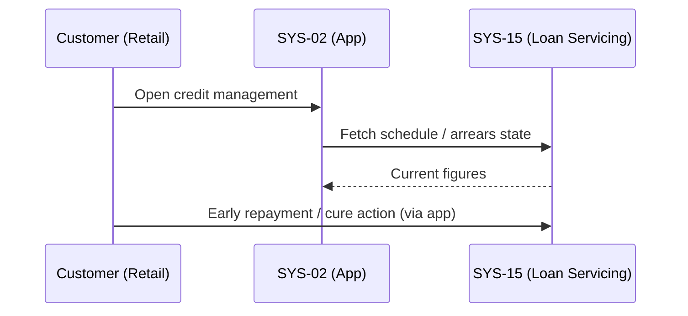

# Use Cases Catalog

**Case:** Case 03 — OmniBank Financial Systems (Maximum Complexity)
**Phase:** 3 — Decomposition & Risk Integration
**Step:** 1 — Define Packages + Use Cases

---

## 1. DOCUMENT PURPOSE

This document is the primary output of Phase 3 Step 1 for Case 03 — OmniBank Financial Systems (Maximum Complexity). It defines the complete set of Use Cases derived from the 63 rules in the Rules Catalog, organized by the 10 security domains from the canonical taxonomy.

Each Use Case follows the Actor + Verb + Object pattern and maps to one or more compliance rules. UCs are organized into Packages (one per domain) for clarity. Relationships and Variability are defined in separate documents (13a, 13b).

**Scope:** 10 packages, 60+ Use Cases derived from 38 compliance rules and 25 best practice rules across all 5 applicable regulations.

---

## 2. USE CASES CATALOG METADATA

| Field | Value |
|-------|-------|
| **caseId** | CASE-03-OMNIBANK |
| **caseName** | OmniBank Financial Systems S.A. |
| **complexity** | Maximum |
| **regulationsCovered** | GDPR, CRA, NIS 2, DORA, AI Act (5/5) |
| **totalPackages** | 10 |
| **totalUseCases** | 62 |
| **totalComplianceRulesMapped** | 38/38 (100%) |
| **totalBestPracticeRulesMapped** | 25/25 (100%) |
| **phase3Status** | Iteration 1 — Initial UC Definition |
| **relationshipsDefined** | Pending (Doc 13a) |
| **variabilityDefined** | Pending (Doc 13b) |

---

## 5. PACKAGES

### 3.1 Package Overview

| Package ID | Domain | Use Cases | Primary Regulations | Priority Distribution |
|------------|--------|-----------|---------------------|----------------------|
| PKG-D-01 | Data Protection & Encryption | 8 | All 5 | CRITICAL: 4, HIGH: 3, MEDIUM: 1 |
| PKG-D-02 | Vulnerability Management | 7 | CRA, NIS 2, DORA, AI Act | CRITICAL: 4, HIGH: 2, MEDIUM: 1 |
| PKG-D-03 | Access Control | 7 | CRA, NIS 2, DORA, AI Act | CRITICAL: 4, HIGH: 3, MEDIUM: 0 |
| PKG-D-04 | Incident Response | 8 | All 5 | CRITICAL: 5, HIGH: 2, MEDIUM: 1 |
| PKG-D-05 | Data Lifecycle | 6 | GDPR, CRA, AI Act | CRITICAL: 4, HIGH: 1, MEDIUM: 1 |
| PKG-D-06 | Supply Chain | 5 | GDPR, NIS 2, DORA | CRITICAL: 3, HIGH: 2, MEDIUM: 0 |
| PKG-D-07 | Secure Development | 6 | NIS 2, DORA | CRITICAL: 3, HIGH: 3, MEDIUM: 0 |
| PKG-D-08 | Human Factors | 4 | GDPR, NIS 2, AI Act | CRITICAL: 2, HIGH: 1, MEDIUM: 1 |
| PKG-D-09 | Governance & Documentation | 5 | All 5 | CRITICAL: 3, HIGH: 2, MEDIUM: 0 |
| PKG-D-10 | Monitoring & Audit | 6 | CRA, NIS 2, DORA, AI Act | CRITICAL: 4, HIGH: 2, MEDIUM: 0 |
| **TOTAL** | **10 Domains** | **62 UCs** | **5/5 Regulations** | **CRITICAL: 32, HIGH: 19, MEDIUM: 4** |

---

## 6. USE CASES

### 4.1 PKG-D-01: Data Protection & Encryption

**Purpose:** Encrypt data at rest and in transit; manage cryptographic keys; ensure data integrity and AI system resilience.

**Primary Actors:** Data Protection Officer, Security Architect, AI System Administrator, Data Subject

**Business Goals:** AG-D-01.1-001, AG-D-01.2-001, AG-D-01.3-001, AG-D-01.4-001

---

## UC-01: Data Subject Requests Data Encryption Status

**Package:** PKG-D-01
**Actors:** Data Subject (Primary), Data Protection Officer (Secondary)
**Description:** A data subject queries the encryption status of their stored personal and financial data.
**Rules:** CR-D-01.1-001
**Priority:** CRITICAL
**SLA:** Response within 72 hours per GDPR Art. 12

**Related Goals:** AG-D-01.1-001

---

## UC-02: Security Architect Configures Data Encryption at Rest

**Package:** PKG-D-01
**Actors:** Security Architect (Primary), AI System Administrator (Secondary)
**Description:** Security architect configures AES-256 encryption for personal data, financial records, and AI training datasets at rest.
**Rules:** CR-D-01.1-001
**Priority:** CRITICAL
**SLA:** Implementation within 30 days of rule activation

**Related Goals:** AG-D-01.1-001, AG-D-05.2-001

---

## UC-03: Security Administrator Enforces TLS 1.3 for Data in Transit

**Package:** PKG-D-01
**Actors:** Security Administrator (Primary), Network Engineer (Secondary)
**Description:** Security administrator enforces TLS 1.3 for all internal, external, and API communications with HSTS and certificate pinning.
**Rules:** CR-D-01.2-001
**Priority:** CRITICAL
**SLA:** Full enforcement within 60 days

**Related Goals:** AG-D-01.2-001, AG-D-05.4-001

---

## UC-04: Cryptographic Officer Manages HSM Key Lifecycle

**Package:** PKG-D-01
**Actors:** Cryptographic Officer (Primary), Security Auditor (Secondary)
**Description:** Cryptographic officer manages HSM-backed key lifecycle: generation, rotation, revocation, and destruction with full audit trail.
**Rules:** CR-D-01.3-001
**Priority:** CRITICAL
**SLA:** Key rotation every 90 days; revocation within 4 hours of compromise

**Related Goals:** AG-D-01.3-001

---

## UC-05: AI System Administrator Validates AI Model Integrity

**Package:** PKG-D-01
**Actors:** AI System Administrator (Primary), Security Architect (Secondary)
**Description:** AI system administrator validates AI model integrity using checksums and version control to detect manipulation or unauthorized changes.
**Rules:** CR-D-01.4-001
**Priority:** HIGH
**SLA:** Integrity check on every model load; anomalies reported within 1 hour

**Related Goals:** AG-D-01.4-001, AG-D-02.4-002

---

## UC-06: Security Architect Implements Field-Level Encryption

**Package:** PKG-D-01
**Actors:** Security Architect (Primary), Database Administrator (Secondary)
**Description:** Security architect implements field-level encryption for PII fields and AI training datasets as per GDPR-C04 and CRA-C07.
**Rules:** CR-D-01.1-001
**Priority:** HIGH
**SLA:** Implementation within 60 days

**Related Goals:** AG-D-01.1-001

---

## UC-07: Security Officer Rotates Cryptographic Keys

**Package:** PKG-D-01
**Actors:** Security Officer (Primary), Cryptographic Officer (Secondary)
**Description:** Security officer executes automated key rotation per defined schedule with HSM validation and audit logging.
**Rules:** CR-D-01.3-001
**SLA:** Automated rotation every 90 days; manual rotation on compromise

**Related Goals:** AG-D-01.3-001

---

## UC-08: AI System Detects Model Tampering

**Package:** PKG-D-01
**Actors:** AI System (Primary), Security Administrator (Secondary)
**Description:** AI system automatically detects model tampering, adversarial attacks, or unauthorized parameter modifications.
**Rules:** CR-D-01.4-001, BPR-D-12.4-001
**Priority:** HIGH
**SLA:** Detection within 15 minutes; alert within 5 minutes

**Related Goals:** AG-D-01.4-001, AG-D-10.1-002

---

### 4.2 PKG-D-02: Vulnerability Management

**Purpose:** Maintain zero known exploitable vulnerabilities; operate automated patch management; coordinate vulnerability disclosure; execute TLPT.

**Primary Actors:** Security Operations Manager, Vulnerability Assessment Team, Penetration Tester, AI Security Analyst

**Business Goals:** AG-D-02.1-002, AG-D-02.2-002, AG-D-02.3-002, AG-D-02.4-002

---

## UC-09: Security Operations Manager Scans for Vulnerabilities

**Package:** PKG-D-02
**Actors:** Security Operations Manager (Primary), System Administrator (Secondary)
**Description:** Security operations manager executes continuous automated vulnerability scanning across all production systems and AI platforms.
**Rules:** CR-D-02.1-001
**Priority:** CRITICAL
**SLA:** Weekly scans; Critical findings remediated within 72 hours

**Related Goals:** AG-D-02.1-002

---

## UC-10: Security Operations Manager Deploys Critical Patches

**Package:** PKG-D-02
**Actors:** Security Operations Manager (Primary), System Administrator (Secondary)
**Description:** Security operations manager deploys automated patch management with 72-hour SLA for critical vulnerabilities across systems, AI models, and firmware.
**Rules:** CR-D-02.2-001
**Priority:** CRITICAL
**SLA:** Critical patches deployed within 72 hours of release

**Related Goals:** AG-D-02.2-002

---

## UC-11: Security Analyst Coordinates Vulnerability Disclosure

**Package:** PKG-D-02
**Actors:** Security Analyst (Primary), ENISA/CSIRT (Secondary)
**Description:** Security analyst operates coordinated vulnerability disclosure policy with public-facing intake and reports critical incidents to ENISA/CSIRT within 24 hours.
**Rules:** CR-D-02.3-001
**Priority:** CRITICAL
**SLA:** Critical disclosure within 24 hours; public advisory within 90 days

**Related Goals:** AG-D-02.3-002

---

## UC-12: Penetration Tester Executes Threat-Led Penetration Testing

**Package:** PKG-D-02
**Actors:** Penetration Tester (Primary), CISO (Secondary), AI Security Analyst (Secondary)
**Description:** Penetration tester executes annual TLPT per DORA RTS including AI bias testing, adversarial robustness testing, and model inversion resistance.
**Rules:** CR-D-02.4-001, BPR-D-02.4-001, BPR-D-12.1-001
**Priority:** CRITICAL
**SLA:** Annual execution; findings remediated within 30 days

**Related Goals:** AG-D-02.4-002

---

## UC-13: AI Security Analyst Assesses AI Model Vulnerabilities

**Package:** PKG-D-02
**Actors:** AI Security Analyst (Primary), Security Architect (Secondary)
**Description:** AI security analyst assesses AI model vulnerabilities including data poisoning, model evasion, and adversarial attacks per MITRE ATLAS.
**Rules:** CR-D-02.1-001, BPR-D-12.4-001
**Priority:** HIGH
**SLA:** Quarterly assessment; critical findings within 30 days

**Related Goals:** AG-D-02.1-002

---

## UC-14: Vulnerability Analyst Maintains Vulnerability Register

**Package:** PKG-D-02
**Actors:** Vulnerability Analyst (Primary), Security Operations Manager (Secondary)
**Description:** Vulnerability analyst maintains centralized vulnerability register with CVSS scoring, exploitability assessment, and remediation tracking.
**Rules:** BPR-D-02.1-001, BPR-D-02.3-001
**Priority:** MEDIUM
**SLA:** Monthly reconciliation; quarterly report to CISO

**Related Goals:** AG-D-02.1-002

---

## UC-15: Security Architect Generates SBOM for AI Model

**Package:** PKG-D-02
**Actors:** Security Architect (Primary), AI System Administrator (Secondary)
**Description:** Security architect generates and maintains Software Bill of Materials (SBOM) for AI models including dependencies, open-source components, and model artifacts.
**Rules:** BPR-D-02.2-001, CR-D-06.2-001
**Priority:** HIGH
**SLA:** SBOM generated on every model release; updated on dependency change

**Related Goals:** AG-D-06.2-002

---

### 4.3 PKG-D-03: Access Control

**Purpose:** Implement unified identity management with MFA; enforce least privilege; maintain secure default configurations.

**Primary Actors:** Identity and Access Manager, Security Administrator, AI Platform Administrator, Human Resources Manager

**Business Goals:** AG-D-03.1-002, AG-D-03.2-002, AG-D-03.3-002, AG-D-03.4-002

---

## UC-16: Identity and Access Manager Provisions User Identity

**Package:** PKG-D-03
**Actors:** Identity and Access Manager (Primary), HR Manager (Secondary)
**Description:** Identity and access manager provisions unified identity with MFA across all systems, cloud services, and AI platforms integrated with enterprise SSO.
**Rules:** CR-D-03.1-001, BPR-D-03.1-001
**Priority:** CRITICAL
**SLA:** Identity provisioned within 4 hours of HR notification; MFA enrolled within 24 hours

**Related Goals:** AG-D-03.1-002

---

## UC-17: Security Administrator Enforces MFA for Privileged Access

**Package:** PKG-D-03
**Actors:** Security Administrator (Primary), AI Platform Administrator (Secondary)
**Description:** Security administrator enforces MFA for all privileged access, remote access, and AI system access with step-up authentication for high-risk transactions.
**Rules:** CR-D-03.2-001, BPR-D-03.2-001
**Priority:** CRITICAL
**SLA:** MFA enforced within 30 days; step-up for high-risk actions immediate

**Related Goals:** AG-D-03.2-002

---

## UC-18: Identity and Access Manager Conducts Quarterly Access Review

**Package:** PKG-D-03
**Actors:** Identity and Access Manager (Primary), Security Administrator (Secondary)
**Description:** Identity and access manager enforces least privilege with quarterly access reviews for all systems including AI model access and training data access.
**Rules:** CR-D-03.3-001, BPR-D-03.3-001
**Priority:** CRITICAL
**SLA:** Quarterly review completed within 5 business days; access revoked within 24 hours of finding

**Related Goals:** AG-D-03.3-002

---

## UC-19: Security Administrator Hardens System Configuration

**Package:** PKG-D-03
**Actors:** Security Administrator (Primary), System Administrator (Secondary)
**Description:** Security administrator maintains secure default configuration per CIS Benchmarks, disabling unused services, ports, and protocols; hardens AI inference endpoints.
**Rules:** CR-D-03.4-001, BPR-D-03.4-001
**Priority:** CRITICAL
**SLA:** Configuration baseline applied within 60 days; monthly compliance verification

**Related Goals:** AG-D-03.4-002

---

## UC-20: Identity and Access Manager Deprovisions User Access

**Package:** PKG-D-03
**Actors:** Identity and Access Manager (Primary), HR Manager (Secondary)
**Description:** Identity and access manager deprovisions user access within 24 hours of HR notification using automated HR system integration.
**Rules:** CR-D-03.1-001, BPR-D-03.1-001
**Priority:** HIGH
**SLA:** Deprovisioning completed within 24 hours; all access removed within 48 hours

**Related Goals:** AG-D-03.1-002

---

## UC-21: AI Platform Administrator Manages AI Model Access

**Package:** PKG-D-03
**Actors:** AI Platform Administrator (Primary), Security Administrator (Secondary)
**Description:** AI platform administrator manages access to AI model training data, inference endpoints, and parameter changes with MFA and least privilege.
**Rules:** CR-D-03.1-001, CR-D-03.2-001
**Priority:** HIGH
**SLA:** Access reviewed monthly; parameter changes require dual approval

**Related Goals:** AG-D-03.2-002

---

## UC-22: Security Administrator Implements FIDO2 Authentication

**Package:** PKG-D-03
**Actors:** Security Administrator (Primary), Identity and Access Manager (Secondary)
**Description:** Security administrator deploys FIDO2/WebAuthn MFA for all user-facing applications with hardware security keys for privileged accounts.
**Rules:** BPR-D-03.2-001
**Priority:** MEDIUM
**SLA:** Phased rollout over 90 days; phishing-resistant authentication for privileged within 60 days

**Related Goals:** AG-D-03.2-002

---

### 4.4 PKG-D-04: Incident Response

**Purpose:** Operate 24/7 SOC; maintain business continuity; execute universal incident notification; maintain redundant backups.

**Primary Actors:** Security Operations Center Analyst, Business Continuity Manager, Compliance Officer, AI Operations Manager

**Business Goals:** AG-D-04.1-002, AG-D-04.2-002, AG-D-04.3-002, AG-D-04.4-002

---

## UC-23: SOC Analyst Monitors Security Events

**Package:** PKG-D-04
**Actors:** SOC Analyst (Primary), AI Operations Manager (Secondary)
**Description:** SOC analyst operates 24/7 automated incident detection and triage including AI anomaly detection for model drift and adversarial attacks.
**Rules:** CR-D-04.1-001, BPR-D-04.1-001
**Priority:** CRITICAL
**SLA:** 24/7 coverage; critical incidents escalated within 5 minutes

**Related Goals:** AG-D-04.1-002, AG-D-10.1-002

---

## UC-24: Business Continuity Manager Triggers Disaster Recovery

**Package:** PKG-D-04
**Actors:** Business Continuity Manager (Primary), IT Operations Manager (Secondary)
**Description:** Business continuity manager triggers tested disaster recovery with RTO <= 4h and RPO <= 1h for critical financial systems including AI system failover.
**Rules:** CR-D-04.2-001, BPR-D-04.2-001
**Priority:** CRITICAL
**SLA:** RTO <= 4 hours; RPO <= 1 hour; failover tested semi-annually

**Related Goals:** AG-D-04.2-002

---

## UC-25: Compliance Officer Executes Universal Incident Notification

**Package:** PKG-D-04
**Actors:** Compliance Officer (Primary), Legal Counsel (Secondary), DPO (Secondary)
**Description:** Compliance officer executes 24-hour universal incident notification workflow across GDPR (72h), CRA (24h), NIS 2 (24h), DORA (4h initial + 72h follow-up), AI Act (15d). Resolves T-001.
**Rules:** CR-D-04.3-001, BPR-D-04.3-001
**Priority:** CRITICAL
**SLA:** DORA 4h initial report; GDPR 72h follow-up; all regulatory bodies notified within respective SLAs

**Related Goals:** AG-D-04.3-002

**Tension Resolution:** T-001 — Unified 24h workflow with regulation-specific annexes. DORA 4h initial satisfies shortest deadline.

---

## UC-26: IT Operations Manager Maintains Redundant Backup Systems

**Package:** PKG-D-04
**Actors:** IT Operations Manager (Primary), Security Administrator (Secondary)
**Description:** IT operations manager maintains redundant backup systems with automated failover across EU data centers with sovereignty controls.
**Rules:** CR-D-04.4-001, BPR-D-04.4-001
**Priority:** CRITICAL
**SLA:** Backup verification quarterly; restore testing semi-annually; failover tested annually

**Related Goals:** AG-D-04.4-002

---

## UC-27: AI Operations Manager Recovers AI System after Failure

**Package:** PKG-D-04
**Actors:** AI Operations Manager (Primary), Business Continuity Manager (Secondary)
**Description:** AI operations manager recovers AI system after failure including model restoration from immutable backup, data pipeline recovery, and inference service resumption.
**Rules:** CR-D-04.2-001, CR-D-04.4-001
**Priority:** HIGH
**SLA:** AI service recovery within 2 hours; model restoration within 30 minutes from checkpoint

**Related Goals:** AG-D-04.2-002

---

## UC-28: SOC Analyst Investigates AI Model Anomaly

**Package:** PKG-D-04
**Actors:** SOC Analyst (Primary), AI Security Analyst (Secondary)
**Description:** SOC analyst investigates AI model anomaly detected by monitoring including model drift, adversarial manipulation, or data quality issues.
**Rules:** CR-D-04.1-001, CR-D-10.1-001, BPR-D-12.2-001
**Priority:** HIGH
**SLA:** Investigation started within 15 minutes; root cause identified within 4 hours

**Related Goals:** AG-D-04.1-002

---

## UC-29: Incident Response Team Conducts Tabletop Exercise

**Package:** PKG-D-04
**Actors:** Incident Response Team Lead (Primary), CISO (Secondary)
**Description:** Incident response team conducts quarterly tabletop exercises with cross-functional participants including security, legal, compliance, communications, and AI governance.
**Rules:** BPR-D-04.1-001, BPR-D-04.3-001
**Priority:** MEDIUM
**SLA:** Quarterly exercises; lessons learned documented within 5 business days

**Related Goals:** AG-D-04.1-002

---

## UC-30: Compliance Officer Reports AI Incident to Regulator

**Package:** PKG-D-04
**Actors:** Compliance Officer (Primary), AI Governance Lead (Secondary), DPO (Secondary)
**Description:** Compliance officer reports AI-specific incidents (model failure, bias detection, decision errors) to relevant regulators under AI Act and DORA.
**Rules:** CR-D-04.3-001, AI-C26, AI-C29
**Priority:** CRITICAL
**SLA:** AI Act: 15 days; DORA: 4h initial + 72h follow-up

**Related Goals:** AG-D-04.3-002

---

### 4.5 PKG-D-05: Data Lifecycle

**Purpose:** Enforce data minimization; implement tiered retention; execute cryptographic erasure; enable data portability.

**Primary Actors:** Data Protection Officer, AI Data Engineer, Data Subject, Compliance Officer

**Business Goals:** AG-D-05.1-001, AG-D-05.2-001, AG-D-05.3-001, AG-D-05.4-001

---

## UC-31: Data Protection Officer Reviews Data Collection Minimization

**Package:** PKG-D-05
**Actors:** Data Protection Officer (Primary), AI Data Engineer (Secondary)
**Description:** Data protection officer reviews data collection for minimization, ensuring AI training data relevance, representativeness, and freedom from prohibited bias proxies.
**Rules:** CR-D-05.1-001, BPR-D-05.1-001
**Priority:** CRITICAL
**SLA:** Annual review; new processing assessed within 30 days

**Related Goals:** AG-D-05.1-001

---

## UC-32: Compliance Officer Enforces Tiered Data Retention

**Package:** PKG-D-05
**Actors:** Compliance Officer (Primary), Data Protection Officer (Secondary)
**Description:** Compliance officer enforces tiered retention policy: 10-year financial records (MiFID II), 5-year operational records, 6-month AI training logs with automated deletion.
**Rules:** CR-D-05.2-001
**Priority:** CRITICAL
**SLA:** Automated deletion on expiry; retention violations reported within 24 hours

**Related Goals:** AG-D-05.2-001

---

## UC-33: Data Protection Officer Executes Data Erasure Request

**Package:** PKG-D-05
**Actors:** Data Protection Officer (Primary), IT Operations Manager (Secondary)
**Description:** Data protection officer executes cryptographic sharding-based erasure within 30 days of GDPR erasure request or retention expiry for PII, AI training data, and model inference records. Resolves T-002.
**Rules:** CR-D-05.3-001, BPR-D-05.3-001
**Priority:** CRITICAL
**SLA:** Erasure completed within 30 days; third-party notified within 72 hours

**Related Goals:** AG-D-05.3-001

**Tension Resolution:** T-002 — Cryptographic sharding enables DORA immutable log retention while satisfying GDPR erasure. PII keys destroyed; log structure preserved.

---

## UC-34: Data Subject Requests Data Export

**Package:** PKG-D-05
**Actors:** Data Subject (Primary), Data Protection Officer (Secondary)
**Description:** Data subject requests export of their personal data, AI model decisions, training data lineage, and credit scoring factors in machine-readable format.
**Rules:** CR-D-05.4-001, BPR-D-05.4-001
**Priority:** HIGH
**SLA:** Export completed within 30 days per GDPR Art. 20

**Related Goals:** AG-D-05.4-001

---

## UC-35: AI Data Engineer Manages AI Training Data Lifecycle

**Package:** PKG-D-05
**Actors:** AI Data Engineer (Primary), Data Protection Officer (Secondary)
**Description:** AI data engineer manages AI training data lifecycle including collection, storage, training, inference logging, and deletion with documentation of data lineage.
**Rules:** CR-D-05.1-001, CR-D-05.2-001
**Priority:** HIGH
**SLA:** Data lineage documented on every training run; inference logs retained 6 months

**Related Goals:** AG-D-05.1-001, AG-D-05.2-001

---

## UC-36: Compliance Officer Audits Third-Party Data Processors

**Package:** PKG-D-05
**Actors:** Compliance Officer (Primary), Data Protection Officer (Secondary)
**Description:** Compliance officer audits third-party data processors for compliance with erasure requests and retention policies including AI model providers.
**Rules:** CR-D-05.3-001, GDPR-C12
**Priority:** MEDIUM
**SLA:** Annual audit; erasure compliance verified within 60 days of request

**Related Goals:** AG-D-05.3-001

---

### 4.6 PKG-D-06: Supply Chain

**Purpose:** Operate vendor risk management; maintain SBOM; enforce contractual security; manage concentration risk.

**Primary Actors:** Vendor Risk Manager, Procurement Manager, Security Architect, Legal Counsel

**Business Goals:** AG-D-06.1-002, AG-D-06.2-002, AG-D-06.3-002, AG-D-06.4-002

---

## UC-37: Vendor Risk Manager Assesses ICT Third-Party Provider

**Package:** PKG-D-06
**Actors:** Vendor Risk Manager (Primary), Security Architect (Secondary)
**Description:** Vendor risk manager assesses all ICT third-party providers pre-engagement and annually including AI model providers and data suppliers using SIG or CAIQ.
**Rules:** CR-D-06.1-001, BPR-D-06.1-001
**Priority:** CRITICAL
**SLA:** Pre-engagement assessment before contract; annual reassessment; critical vendors quarterly

**Related Goals:** AG-D-06.1-002

---

## UC-38: Security Architect Maintains SBOM for Product

**Package:** PKG-D-06
**Actors:** Security Architect (Primary), AI Platform Administrator (Secondary)
**Description:** Security architect maintains Software Bill of Materials (SBOM) for all products, services, and AI model dependencies in SPDX and CycloneDX formats.
**Rules:** CR-D-06.2-001, BPR-D-02.2-001
**Priority:** CRITICAL
**SLA:** SBOM generated on every release; updated on dependency change; published within 24h of release

**Related Goals:** AG-D-06.2-002

---

## UC-39: Procurement Manager Enforces Security Contract Terms

**Package:** PKG-D-06
**Actors:** Procurement Manager (Primary), Legal Counsel (Secondary)
**Description:** Procurement manager enforces contractual security obligations including audit rights, breach notification within 24h, data processing agreements, and regulatory cooperation clauses.
**Rules:** CR-D-06.3-001, BPR-D-06.3-001
**Priority:** CRITICAL
**SLA:** Contract review annually; breach notification SLA tracked; audit rights exercised triennially

**Related Goals:** AG-D-06.3-002

---

## UC-40: Vendor Risk Manager Manages Vendor Exit

**Package:** PKG-D-06
**Actors:** Vendor Risk Manager (Primary), IT Operations Manager (Secondary)
**Description:** Vendor risk manager manages third-party concentration risk with documented exit strategies for critical vendors including AI model provider alternatives and data migration.
**Rules:** CR-D-06.4-001, BPR-D-06.4-001
**Priority:** HIGH
**SLA:** Exit strategies documented annually; tested annually; alternative provider identified for all critical services

**Related Goals:** AG-D-06.4-002

---

## UC-41: Vendor Risk Manager Monitors AI Model Provider Performance

**Package:** PKG-D-06
**Actors:** Vendor Risk Manager (Primary), AI Operations Manager (Secondary)
**Description:** Vendor risk manager monitors AI model provider performance, bias metrics, and service levels with quarterly reporting to CISO.
**Rules:** CR-D-06.1-001, BPR-D-12.3-001
**Priority:** HIGH
**SLA:** Quarterly performance review; bias metrics reported monthly; SLA violations escalated within 48 hours

**Related Goals:** AG-D-06.1-002

---

### 4.7 PKG-D-07: Secure Development

**Purpose:** Implement privacy/security by design; enforce secure coding; secure CI/CD pipeline; operate formal change management.

**Primary Actors:** Software Development Manager, Security Engineer, Release Manager, AI ML Engineer

**Business Goals:** AG-D-07.1-001, AG-D-07.2-002, AG-D-07.3-002, AG-D-07.4-002

---

## UC-42: Software Development Manager Implements Secure-by-Design

**Package:** PKG-D-07
**Actors:** Software Development Manager (Primary), AI ML Engineer (Secondary)
**Description:** Software development manager implements privacy by design and security by design per CRA secure-by-default standard including AI model governance and ethical design reviews.
**Rules:** CR-D-07.1-001, BPR-D-07.1-001
**Priority:** CRITICAL
**SLA:** Secure design review on every sprint; ethical design review for AI features

**Related Goals:** AG-D-07.1-001, AG-D-03.4-002

---

## UC-43: Security Engineer Enforces Secure Coding Standards

**Package:** PKG-D-07
**Actors:** Security Engineer (Primary), Software Development Manager (Secondary)
**Description:** Security engineer enforces secure coding standards per OWASP ASVS with mandatory SAST/DAST in all development pipelines including AI code repositories and data pipeline code.
**Rules:** CR-D-07.2-001, BPR-D-07.2-001
**Priority:** CRITICAL
**SLA:** SAST/DAST on every commit; High/Critical findings block deployment

**Related Goals:** AG-D-07.2-002

---

## UC-44: Release Manager Secures CI/CD Pipeline

**Package:** PKG-D-07
**Actors:** Release Manager (Primary), Security Engineer (Secondary)
**Description:** Release manager operates CI/CD pipeline with automated security gates (SAST, DAST, SCA, secrets detection, IaC scanning) including ML pipeline security gates.
**Rules:** CR-D-07.3-001, BPR-D-07.3-001
**Priority:** CRITICAL
**SLA:** Security gates on every pipeline run; critical findings block deployment within 1 hour

**Related Goals:** AG-D-07.3-002

---

## UC-45: Change Advisory Board Approves Production Change

**Package:** PKG-D-07
**Actors:** Change Advisory Board (Primary), Release Manager (Secondary)
**Description:** Change advisory board operates formal change management with dual control approval and independent oversight for all production changes including AI model changes.
**Rules:** CR-D-07.4-001, BPR-D-07.4-001
**Priority:** HIGH
**SLA:** Emergency changes approved within 2 hours; standard changes reviewed within 5 business days

**Related Goals:** AG-D-07.4-002

---

## UC-46: AI ML Engineer Secures AI Training Pipeline

**Package:** PKG-D-07
**Actors:** AI ML Engineer (Primary), Security Engineer (Secondary)
**Description:** AI ML engineer secures AI training pipeline including data validation, model signing, artifact verification, and deployment approval workflow.
**Rules:** CR-D-07.1-001, CR-D-07.3-001
**Priority:** HIGH
**SLA:** Pipeline security gates on every training run; model artifacts signed and verified

**Related Goals:** AG-D-07.2-002, AG-D-07.3-002

---

## UC-47: Security Engineer Scans Infrastructure as Code

**Package:** PKG-D-07
**Actors:** Security Engineer (Primary), Cloud Engineer (Secondary)
**Description:** Security engineer scans infrastructure-as-code (IaC) for vulnerabilities and misconfigurations using Checkov or equivalent before deployment.
**Rules:** BPR-D-07.3-001
**Priority:** MEDIUM
**SLA:** IaC scanned on every pull request; High findings block merge

**Related Goals:** AG-D-07.3-002

---

### 4.8 PKG-D-08: Human Factors

**Purpose:** Deliver security awareness training; maintain role-specific competence; ensure board-level oversight.

**Primary Actors:** Training Manager, Security Awareness Officer, HR Manager, Board Secretary

**Business Goals:** AG-D-08.1-002, AG-D-08.2-002, AG-D-08.3-002

---

## UC-48: Training Manager Delivers Security Awareness Training

**Package:** PKG-D-08
**Actors:** Training Manager (Primary), Security Awareness Officer (Secondary)
**Description:** Training manager delivers annual security awareness training to all 5000+ employees with role-specific modules for developers, operations, and management including AI ethics.
**Rules:** CR-D-08.1-001, BPR-D-08.1-001
**Priority:** CRITICAL
**SLA:** 95% completion within 90 days; effectiveness metrics reported quarterly

**Related Goals:** AG-D-08.1-002

---

## UC-49: HR Manager Maintains Security Competence Program

**Package:** PKG-D-08
**Actors:** HR Manager (Primary), Training Manager (Secondary)
**Description:** HR manager maintains role-specific security competence programs with mandatory certification for privileged roles and AI human oversight procedures.
**Rules:** CR-D-08.2-001, BPR-D-08.2-001, BPR-D-12.3-001
**Priority:** CRITICAL
**SLA:** Certification tracked annually; AI oversight training completed before system deployment

**Related Goals:** AG-D-08.2-002

---

## UC-50: Board Secretary Coordinates Board Security Training

**Package:** PKG-D-08
**Actors:** Board Secretary (Primary), CISO (Secondary)
**Description:** Board secretary coordinates DORA and NIS 2 requirements training for management board with ICT risk oversight and quarterly compliance reporting.
**Rules:** CR-D-08.3-001, BPR-D-08.3-001
**Priority:** HIGH
**SLA:** Board training completed within 60 days of appointment; quarterly reporting established

**Related Goals:** AG-D-08.3-002

---

## UC-51: Security Awareness Officer Conducts Phishing Simulation

**Package:** PKG-D-08
**Actors:** Security Awareness Officer (Primary), Training Manager (Secondary)
**Description:** Security awareness officer conducts phishing simulations quarterly to test employee awareness and measure training effectiveness.
**Rules:** BPR-D-08.1-001
**Priority:** MEDIUM
**SLA:** Quarterly simulations; click rate < 5%; remedial training for failures

**Related Goals:** AG-D-08.1-002

---

### 4.9 PKG-D-09: Governance & Documentation

**Purpose:** Maintain unified ISMS; conduct IPSARA assessments; manage asset inventory; maintain compliance documentation.

**Primary Actors:** Chief Information Security Officer, Compliance Manager, Data Protection Officer, AI Governance Lead

**Business Goals:** AG-D-09.1-001, AG-D-09.2-001, AG-D-09.4-001, AG-D-09.3-002

---

## UC-52: CISO Maintains Unified ISMS

**Package:** PKG-D-09
**Actors:** CISO (Primary), Compliance Manager (Secondary), AI Governance Lead (Secondary)
**Description:** CISO maintains unified Information Security Management System (ISMS) covering all 5 regulatory frameworks with AI governance framework and documentation retained 10+ years.
**Rules:** CR-D-09.1-001, BPR-D-09.1-001, BPR-D-09.4-001
**Priority:** CRITICAL
**SLA:** Annual ISMS review; quarterly compliance reporting; documentation retained minimum 10 years

**Related Goals:** AG-D-09.1-001

---

## UC-53: Compliance Manager Executes IPSARA Risk Assessment

**Package:** PKG-D-09
**Actors:** Compliance Manager (Primary), CISO (Secondary), AI Governance Lead (Secondary)
**Description:** Compliance manager executes unified Integrated Privacy and Security Risk Assessments (IPSARA) combining DPIA, FRIA, cybersecurity risk, and ICT risk per AI Act requirements. Resolves T-003.
**Rules:** CR-D-09.2-001, BPR-D-09.2-001, BPR-D-09.3-001
**Priority:** CRITICAL
**SLA:** New systems assessed before go-live; annual reassessment; AI-specific risks quarterly

**Related Goals:** AG-D-09.2-001

**Tension Resolution:** T-003 — IPSARA framework unifies 5 assessment triggers (GDPR DPIA, CRA risk assessment, NIS 2 risk analysis, DORA ICT risk, AI Act FRIA).

---

## UC-54: IT Asset Manager Maintains Comprehensive Asset Inventory

**Package:** PKG-D-09
**Actors:** IT Asset Manager (Primary), CISO (Secondary)
**Description:** IT asset manager maintains comprehensive asset and ICT inventory with automated discovery including AI models, training datasets, inference endpoints, and model registry entries.
**Rules:** CR-D-09.3-001
**Priority:** CRITICAL
**SLA:** Inventory reconciled monthly; new assets discovered within 24 hours; decommissioned assets removed within 7 days

**Related Goals:** AG-D-09.3-002

---

## UC-55: AI Governance Lead Maintains AI Traceability Documentation

**Package:** PKG-D-09
**Actors:** AI Governance Lead (Primary), Data Protection Officer (Secondary)
**Description:** AI governance lead maintains AI traceability documentation including model cards, data sheets, AI decision logs, and stakeholder transparency reports per IEEE 7000.
**Rules:** CR-D-09.4-001, BPR-D-09.4-001
**Priority:** HIGH
**SLA:** Model card updated on every release; decision logs retained per regulatory requirement

**Related Goals:** AG-D-09.4-001

---

## UC-56: Compliance Manager Generates Regulatory Compliance Report

**Package:** PKG-D-09
**Actors:** Compliance Manager (Primary), CISO (Secondary)
**Description:** Compliance manager generates regulatory compliance reports for ECB/BaFin, ENISA, and other competent authorities including AI governance indicators.
**Rules:** CR-D-09.1-001, DORA-C38
**Priority:** HIGH
**SLA:** Quarterly regulatory reports; ad-hoc reports within 48 hours of request

**Related Goals:** AG-D-09.1-001

---

### 4.10 PKG-D-10: Monitoring & Audit

**Purpose:** Deploy 24/7 monitoring with AI threat detection; maintain immutable audit logs; execute penetration testing and AI evaluation.

**Primary Actors:** SOC Manager, Security Analyst, Audit Manager, AI Security Analyst

**Business Goals:** AG-D-10.1-002, AG-D-10.2-002, AG-D-10.3-002

---

## UC-57: SOC Manager Deploys AI-Powered Threat Detection

**Package:** PKG-D-10
**Actors:** SOC Manager (Primary), AI Security Analyst (Secondary)
**Description:** SOC manager deploys 24/7 continuous security monitoring with AI-powered threat detection across all systems, networks, and AI pipelines including real-time model drift detection.
**Rules:** CR-D-10.1-001, BPR-D-10.1-001, BPR-D-12.2-001
**Priority:** CRITICAL
**SLA:** 24/7 monitoring; AI detection calibrated monthly; anomalies escalated within 5 minutes

**Related Goals:** AG-D-10.1-002

---

## UC-58: Audit Manager Maintains Immutable Audit Logs

**Package:** PKG-D-10
**Actors:** Audit Manager (Primary), Security Administrator (Secondary)
**Description:** Audit manager maintains immutable audit logs with PII data separation and AI system traceability using cryptographic sharding for log integrity. Resolves T-002.
**Rules:** CR-D-10.2-001, BPR-D-10.2-001
**Priority:** CRITICAL
**SLA:** Logs retained minimum 5 years (financial) and 6 months (AI inference); integrity verified daily

**Related Goals:** AG-D-10.2-002

**Tension Resolution:** T-002 — Cryptographic sharding enables GDPR erasure (PII keys destroyed) while preserving DORA immutable log structure.

---

## UC-59: Security Analyst Conducts Penetration Testing

**Package:** PKG-D-10
**Actors:** Security Analyst (Primary), CISO (Secondary)
**Description:** Security analyst executes annual penetration testing, TLPT, resilience testing, and periodic AI model evaluation including red team exercises for AI systems.
**Rules:** CR-D-10.3-001, BPR-D-10.3-001, BPR-D-12.4-001
**Priority:** CRITICAL
**SLA:** Annual pentest; AI evaluation quarterly; findings remediated within 30 days

**Related Goals:** AG-D-10.3-002

---

## UC-60: AI Security Analyst Tests AI Adversarial Robustness

**Package:** PKG-D-10
**Actors:** AI Security Analyst (Primary), SOC Manager (Secondary)
**Description:** AI security analyst tests AI adversarial robustness per MITRE ATLAS including data poisoning, model evasion, model inversion, and prompt injection attacks.
**Rules:** BPR-D-12.4-001, CR-D-02.4-001
**Priority:** HIGH
**SLA:** Quarterly adversarial testing; critical vulnerabilities remediated within 30 days

**Related Goals:** AG-D-10.3-002

---

## UC-61: SOC Analyst Monitors AI Model Performance Drift

**Package:** PKG-D-10
**Actors:** SOC Analyst (Primary), AI Operations Manager (Secondary)
**Description:** SOC analyst monitors AI model performance drift, data quality degradation, and automated retraining triggers with rollback procedures.
**Rules:** BPR-D-12.2-001, CR-D-10.1-001
**Priority:** HIGH
**SLA:** Drift detection hourly; automated retraining triggered within 4 hours of threshold breach

**Related Goals:** AG-D-10.1-002

---

## UC-62: Audit Manager Generates Audit Trail Report

**Package:** PKG-D-10
**Actors:** Audit Manager (Primary), Compliance Manager (Secondary)
**Description:** Audit manager generates audit trail reports for regulatory examination including AI decision traceability and PII access logs.
**Rules:** CR-D-10.2-001, AI-C09, AI-C10
**Priority:** MEDIUM
**SLA:** Ad-hoc reports within 48 hours; annual comprehensive audit trail review

**Related Goals:** AG-D-10.2-002

---

## 6B. PRODUCT FUNCTIONAL USE CASES (UC-63+, PKG-A..F) — OmniBank platform product

> **v2.1 (PORT-PARITY-2 Phase 3 restructure pilot, 2026-09-04).** This section models the
> **OmniBank product itself** (digital channels, OmniScore, lending) as a normal software
> product: actor-goal use cases in fully-dressed form (Cockburn), with security/compliance
> layered on as a per-UC annex. **Nomenclature unchanged**: the pre-existing compliance use
> cases UC-01..UC-62 (§6) keep IDs and content verbatim; new product use cases continue the
> flat numbering at **UC-63+** and never reuse existing IDs. This pilot delivers PKG-C
> (Lending & OmniScore); PKG-A/B/D/E/F follow after pilot approval.
>
> **Template (2026-09-04):** the PKG-C use cases are written fully-dressed in the RUP-style
> per-UC template of `03_REFERENCE_MATERIAL/P3_E2_Requirement_Analysis_Bike4All_Maintenance_platform_v1r2.md`
> (sections 1–10, one Mermaid sequence diagram per UC), adjusted to AEGIS: section 10 is the
> **Security & Compliance Annex (AEGIS)** carrying provenance, constrained-by, rules, threats
> and NIST anchors; MUC linkage is preserved.

### 6B.0 Product actors (reuse of existing stakeholder/system IDs)

| Actor | Role in the product | Drives |
|-------|---------------------|--------|
| Customer (Retail) | Primary product user: onboards, banks, borrows via SYS-02 app. | UC-63, UC-65, UC-67, UC-68 |
| OmniScore AI Platform (SYS-03) | The scoring system itself — acts, never decides alone. | UC-64 |
| Underwriter (Consumer Lending) | Human oversight on borderline/high-risk credit decisions. | UC-66 |
| Head of AI Governance (stakeholder) | Owns bias/drift monitoring and model governance. | Annex targets |
| Fraud & AML Platform (SYS-11) | Consumes journey telemetry for fraud patterns. | Annex targets |

### 6B.1 PKG-C — Lending & OmniScore (6)

| UC ID | Title | Primary Actor | Prio |
|-------|-------|---------------|------|
| UC-63 | Apply for Consumer Credit | Customer (Retail) | CRITICAL |
| UC-64 | OmniScore Computes Credit Score | SYS-03 (AI Platform) | CRITICAL |
| UC-65 | Customer Receives Score Explanation | Customer (Retail) | HIGH |
| UC-66 | Underwriter Reviews Borderline Application | Underwriter | CRITICAL |
| UC-67 | Customer Accepts Offer & Contract Signed | Customer (Retail) | CRITICAL |
| UC-68 | Customer Manages Repayment & Arrears View | Customer (Retail) | HIGH |

#### Use-Case: {UC-63} Apply for Consumer Credit

##### 1 Brief Description

The customer applies for consumer credit through the mobile app: product selection,
pre-contractual information (SECCI), credit-bureau consent and income/expense
declarations. It is triggered when the customer opens the credit product and submits the
application form. The submitted application then enters the OmniScore decisioning flow
(UC-64) or — without consent — the manual path (UC-66).

##### 2 Actor Brief Descriptions

###### 2.1 Customer (Retail) — Primary Actor:

Selects the product, grants consents, submits declarations and receives the application
status.

###### 2.2 SYS-02 (Mobile app channel):

PSD2 SCA-protected session; captures the application, consents and declarations.

###### 2.3 SYS-14 (Loan Origination):

Creates the application record; invokes the OmniScore decisioning flow (UC-64).

###### 2.4 SYS-11 (Fraud & AML Platform):

Screens the application for fraud patterns.

###### 2.5 DPO:

Owner of the consent records.

##### 3 Preconditions

- Customer onboarded (PKG-A, pending) with verified identity.
- App session under PSD2 SCA.

##### 4 Basic Flow of Events

1. Customer selects product, amount and term; app shows the pre-contractual information sheet (SECCI).
2. Customer grants the credit-bureau check consent; consent recorded with timestamp.
3. Customer submits income/expense declarations; app validates completeness.
4. SYS-14 creates the application record; SYS-11 screens for fraud patterns (no hit → continue).
5. SYS-14 invokes the OmniScore decisioning flow (UC-64) and awaits the outcome.

```mermaid
sequenceDiagram
    participant C as Customer (Retail)
    participant APP as SYS-02 (App, SCA)
    participant LO as SYS-14 (Loan Origination)
    participant F as SYS-11 (Fraud/AML)
    C->>APP: Select product/amount/term; SECCI; consent + declarations
    APP->>LO: Submit application record
    LO->>F: Fraud screening
    LO->>LO: Invoke OmniScore decisioning (UC-64)
```

##### 5 Alternative Flows

###### 5.1 <Alternate flow: Consent declined>

Trigger: step 2. The application cannot proceed under automated scoring; the customer is
offered the manual-review path (UC-66 without score, Art. 22(3) right not to be subject
to solely automated decisions).

###### 5.2 <Alternate flow: Fraud screening hit>

Trigger: step 4. Application frozen; sent to the financial-crime queue (no decision until
cleared).

###### 5.3 <Alternate flow: Data incomplete>

Trigger: step 3. Guided correction (max 3 attempts), then save-as-draft.

##### 6 Subflows

###### 6.1 <Subflow: Bureau consent capture>

1. Present the consent purpose (credit-bureau check) before any bureau data is touched.
2. Record the consent with timestamp against the application record (evidence for UC-65 and audits).

###### 6.2 <Subflow: Fraud screening>

1. SYS-11 screens the declared data and the session for fraud patterns.
2. Hit → freeze the application into the financial-crime queue; no hit → continue to decisioning.

##### 7 Key Scenarios

###### 7.1 <Scenario: Application submitted>

1. Application exists with status SUBMITTED; consent + screening evidence on record; score flow invoked (UC-64).

###### 7.2 <Scenario: Fraud hit>

1. Application frozen, financial-crime queue, no decision until cleared.

##### 8 Post-conditions

###### 8.1

Application exists with status SUBMITTED.

###### 8.2

Consent + screening evidence on record.

##### 9 Special Requirements (FURPS+)

**Functional (F):** Product/amount/term selection, SECCI presentation, bureau consent,
declaration validation, application record creation, decisioning invocation.

**Usability (U):** Guided correction of incomplete data (max 3 attempts) before
save-as-draft.

**Reliability (R):** Fraud screening gates every application; PSD2 SCA session resists
takeover (MUC-01-analogue); journey monitoring (CR-D-10.1-001).

**Performance (P):** N/A — no attested timing constraint for the application step.

**Supportability (S):** Scoring factors exportable by design (CR-D-05.4-001) keeps the
application data model stable for audit and data-subject requests.

##### 10 Security & Compliance Annex (AEGIS)

- **Provenance:** [ATTESTED] Doc04 §1.1 SYS-14 (consumer credit origination + decision engine, integrates OmniScore), SYS-02 (SCA app channel); Doc19 CR-D-05.4-001 (credit scoring factors exportable).
- **Constrained by:** UC-16/UC-17 (identity, MFA), UC-06 (field-level encryption of declarations), UC-21 (AI platform access).
- **Rules / NFR:** CR-D-05.4-001 (data export incl. scoring factors), CR-D-10.1-001 (journey monitoring).
- **Threats addressed:** MUC-C3-05 (application data crafted to game scoring), MUC-01-analogue (session takeover).
- **NIST anchors:** PR.AA-01, PR.DS-01.

#### Use-Case: {UC-64} OmniScore Computes Credit Score

##### 1 Brief Description

The OmniScore AI platform (SYS-03) computes the credit score for a submitted application
using the approved model version, with reason codes generated inside the model runtime. It
is triggered when the SYS-14 decisioning request arrives (UC-63 step 5). Score bands route
the application — auto-approve, auto-decline or borderline — and borderline cases always
reach a human (UC-66): never a silent auto-decline without a human path.

##### 2 Actor Brief Descriptions

###### 2.1 SYS-03 (OmniScore AI Platform) — Primary Actor (acts on behalf of SYS-14):

Runs the approved model version, computes score + confidence band and generates reason
codes (managed ML runtime + explainability layer + bias monitoring pipeline).

###### 2.2 SYS-14 (Loan Origination):

Issues the decisioning request; consumes the score band; routes borderline cases.

###### 2.3 Head of AI Governance:

Model governance: approved versions, bias/drift monitoring.

###### 2.4 Underwriter:

Consumer of the score at UC-66.

###### 2.5 DPO:

Owner of the automated-decision records.

##### 3 Preconditions

- Application SUBMITTED (UC-63).
- Model version approved and deployed per change control.

##### 4 Basic Flow of Events

1. SYS-03 fetches application features (declared data + internal account data where consented).
2. SYS-03 runs the approved model version; computes the score + confidence band.
3. SYS-03 generates the reason-code set (top contributing factors, GDPR-compliant granularity).
4. SYS-03 returns score + reasons + model version id to SYS-14; decision-context record written (who/what/when/version).
5. Score band routes the application: auto-approve / auto-decline / **borderline → UC-66** (never silent auto-decline without a human path).

```mermaid
sequenceDiagram
    participant LO as SYS-14 (Loan Origination)
    participant AI as SYS-03 (OmniScore)
    participant UW as Underwriter (UC-66)
    LO->>AI: Decisioning request (application features)
    AI->>AI: Run approved model version; score + confidence band
    AI->>AI: Generate reason codes; write decision-context record
    AI-->>LO: Score + reasons + model version id
    LO->>UW: Borderline band -> queue human review
```

##### 5 Alternative Flows

###### 5.1 <Alternate flow: Model service unavailable>

Trigger: step 2. SYS-14 queues to the manual underwriting path; NO fallback to an
unapproved model version.

###### 5.2 <Alternate flow: Reason-code generation fails>

Trigger: step 3. Decision blocked — explainability is a release condition, not a
nice-to-have.

###### 5.3 <Alternate flow: Input features out of expected distribution>

Trigger: step 1. Flag possible data-quality/manipulation issue (MUC-C3-01) + route to
UC-66.

##### 6 Subflows

###### 6.1 <Subflow: Decision-context record write>

1. Record who/what/when plus model version and the feature snapshot used.
2. Append immutably to the decision records (immutable decision records, CR-D-10.2-001 discipline).

###### 6.2 <Subflow: Reason-code generation>

1. Extract the top contributing factors inside the model runtime (never hand-written).
2. Emit at GDPR-compliant granularity, log-anchored to the model version (anti MUC-C3-05).

##### 7 Key Scenarios

###### 7.1 <Scenario: Score computed>

1. Score + reasons + model version immutably recorded; the band routes the application.

###### 7.2 <Scenario: Unexplainable or manipulated input>

1. Borderline/blocked outcome queued to a human (UC-66) — no silent auto-decline.

##### 8 Post-conditions

###### 8.1

Score + reasons + model version immutably recorded.

###### 8.2

Borderline cases queued to a human.

##### 9 Special Requirements (FURPS+)

**Functional (F):** Feature fetch, scoring with confidence band, in-runtime reason codes,
decision-context record, band routing with a human path.

**Usability (U):** N/A — backend step; the customer-facing explainability surface is
UC-65.

**Reliability (R):** No fallback to unapproved models; decision blocked if reason codes
cannot be generated (fail-closed on explainability).

**Performance (P):** N/A — no attested latency target for scoring.

**Supportability (S):** Approved-model-version pinning plus the bias/drift monitoring
pipeline (UC-61, SYS-03) keep the service maintainable under AI Act governance
documentation (CR-D-09.1-001).

##### 10 Security & Compliance Annex (AEGIS)

- **Provenance:** [ATTESTED] Doc04 §1.1 SYS-03 (managed ML runtime + explainability layer + bias monitoring pipeline); Doc19 BPR-D-12.3-001 (AI Act Art. 14 human oversight thresholds/overrides for credit scoring).
- **Constrained by:** UC-05 (model integrity validation), UC-08 (model tampering detection), UC-61 (AI model performance drift monitoring), UC-21 (AI model access control).
- **Rules / NFR:** BPR-D-12.3-001 (Art. 14 human oversight), CR-D-05.4-001 (scoring-factor transparency feeds UC-65), CR-D-09.1-001 (governance documentation).
- **Threats addressed:** MUC-C3-01 (input manipulation), MUC-C3-02 (training-data poisoning — detected via drift/bias pipeline), MUC-C3-04 (discriminatory outcomes — bias monitoring pipeline).
- **NIST anchors:** GV.MT-01, MEASURE-2.7.

#### Use-Case: {UC-65} Customer Receives Score Explanation

##### 1 Brief Description

The customer receives the credit decision with plain-language reason codes and can request
the machine-readable explanation package. It is triggered when the customer opens the
decision screen in the app, after a UC-64 or UC-66 outcome. Explanations are generated,
log-anchored evidence — never hand-written — so they cannot drift from actual model
behaviour.

##### 2 Actor Brief Descriptions

###### 2.1 Customer (Retail) — Primary Actor:

Reads the outcome and reason codes; may request the explanation package or dispute a
reason.

###### 2.2 SYS-02 (Mobile app channel):

Presents the outcome screen; dispatches explanation requests.

###### 2.3 SYS-03 (OmniScore explainability layer):

Source of the principal reason codes and the machine-readable package.

###### 2.4 DPO:

Owner of Art. 22 transparency.

###### 2.5 Head of AI Governance:

Owns XAI quality.

##### 3 Preconditions

- A decision (or borderline outcome) exists from UC-64/UC-66.

##### 4 Basic Flow of Events

1. App presents the outcome with the principal reason codes, in plain language.
2. Customer can request the machine-readable explanation package (CR-D-05.4-001 format).
3. Request/dispatch is logged against the decision record.

```mermaid
sequenceDiagram
    participant C as Customer (Retail)
    participant APP as SYS-02 (App)
    participant AI as SYS-03 (Explainability layer)
    C->>APP: Open decision screen
    APP->>AI: Request outcome view / explanation package
    AI-->>APP: Principal reason codes / package (CR-D-05.4-001 format)
    APP-->>C: Plain-language outcome; dispatch logged
```

##### 5 Alternative Flows

###### 5.1 <Alternate flow: Disputed reason code>

Trigger: step 1, customer disputes a reason (factually wrong data) → opens a
data-correction flow (GDPR Art. 16 path) linked to the decision; re-scoring after
correction.

###### 5.2 <Alternate flow: Explanation package generation fails>

Trigger: step 2. Human contact channel offered within SLA; never silent.

##### 6 Subflows

###### 6.1 <Subflow: Explanation package dispatch>

1. Generate the package in the CR-D-05.4-001 format from the explainability layer (generated, not hand-written).
2. Log the request/dispatch against the decision record (log-anchored, anti MUC-C3-05).

##### 7 Key Scenarios

###### 7.1 <Scenario: Explanation delivered>

1. Explanation evidence stored with the decision (audit complete).

###### 7.2 <Scenario: Wrong data disputed>

1. Art. 16 correction flow linked to the decision; re-scoring after correction.

##### 8 Post-conditions

###### 8.1

Explanation evidence stored with the decision (audit complete).

###### 8.2

Any dispute is tracked as a linked data-correction flow until resolved.

##### 9 Special Requirements (FURPS+)

**Functional (F):** Plain-language reasons, machine-readable package in the CR-D-05.4-001
format, dispatch logging.

**Usability (U):** Plain language, customer-facing; in-app dispute entry point.

**Reliability (R):** Never silent on generation failure (human contact channel within
SLA); reason codes log-anchored and generated in the model runtime (anti MUC-C3-05).

**Performance (P):** N/A — no attested timing constraint.

**Supportability (S):** The explanation format stays stable for audits and data-subject
requests (UC-01 linkage).

##### 10 Security & Compliance Annex (AEGIS)

- **Provenance:** [ATTESTED] Doc19 CR-D-05.4-001 verbatim ("Include AI model decisions, training data lineage, and credit scoring factors"); Doc04 §1.1 SYS-03 explainability layer.
- **Constrained by:** UC-01 (data subject requests), UC-63 consent record.
- **Rules / NFR:** CR-D-05.4-001, CR-D-09.2-001 (governance reporting).
- **Threats addressed:** MUC-C3-05 (explainability spoofing — reason codes are generated, not hand-written, and log-anchored).
- **NIST anchors:** GV.PO-P1.

#### Use-Case: {UC-66} Underwriter Reviews Borderline Application

##### 1 Brief Description

The underwriter performs the independent human review of borderline or blocked credit
applications and is the decision-maker here (AI Act Art. 14) — the model only recommends.
It is triggered when a work item lands in the underwriting queue, either from the UC-64
borderline band or from the manual path of UC-63 (ext. 5.1). Decisions carry mandatory
reason codes, and the override-vs-score delta feeds AI-governance metrics.

##### 2 Actor Brief Descriptions

###### 2.1 Underwriter (Consumer Lending) — Primary Actor:

Reviews the work item independently and records the decision with justification.

###### 2.2 SYS-14 (Loan Origination):

Record owner; provides the work-item queue and business-rules engine.

###### 2.3 SYS-03 (OmniScore):

Supplies score, reason codes, model version and confidence band for the review.

###### 2.4 Head of AI Governance:

Consumes the oversight metrics (override deltas).

###### 2.5 Customer:

Subject of the decision.

##### 3 Preconditions

- UC-64 returned a borderline/blocked outcome (or customer invoked the manual path per UC-63 ext. 5.1).

##### 4 Basic Flow of Events

1. Underwriter opens the work item: full application, score + reason codes, model version, confidence band.
2. Underwriter performs independent review (documents, bureau data, overrides only with recorded justification).
3. Underwriter records the decision (approve/decline + mandatory reason code) — the human, not the model, is the decision-maker here (Art. 14).
4. Decision flows to UC-67; the override-vs-score delta is logged for AI-governance metrics.

```mermaid
sequenceDiagram
    participant UW as Underwriter
    participant LO as SYS-14 (Work item)
    participant GOV as Head of AI Governance
    LO->>UW: Work item (application, score, reasons, model version)
    UW->>UW: Independent review; overrides only with justification
    UW->>LO: Decision (approve/decline) + reason code
    LO-->>GOV: Override-vs-score delta for metrics
```

##### 5 Alternative Flows

###### 5.1 <Alternate flow: Incomplete decision context>

Trigger: step 1, record missing model version / reasons → work item is BLOCKED; the
underwriter cannot decide on an unexplainable recommendation (fail-closed).

###### 5.2 <Alternate flow: Manipulation indicators>

Trigger: step 2, suspected manipulation flags (MUC-C3-01 from UC-64 ext. 5.3) → escalate
to financial crime before deciding.

###### 5.3 <Alternate flow: Override rate anomaly>

Trigger: step 3, per-underwriter anomaly → governance review trigger (anti-rubber-stamp,
mirrors MUC-C2-05 discipline).

##### 6 Subflows

###### 6.1 <Subflow: Override justification logging>

1. Any override of the model recommendation is recorded with a mandatory justification.
2. The override-vs-score delta is appended to the immutable record and feeds AI-governance metrics.

###### 6.2 <Subflow: Fail-closed context validation>

1. On open, the work item is validated for model version + reason codes.
2. Missing context → BLOCKED (no decision possible on an unexplainable recommendation).

##### 7 Key Scenarios

###### 7.1 <Scenario: Human decision recorded>

1. Human decision with justification on the immutable record; AI-governance metrics updated; decision flows to UC-67.

###### 7.2 <Scenario: Unexplainable recommendation>

1. Work item blocked — the underwriter cannot decide (fail-closed).

##### 8 Post-conditions

###### 8.1

Human decision with justification on the immutable record.

###### 8.2

AI-governance metrics updated.

##### 9 Special Requirements (FURPS+)

**Functional (F):** Work-item review, independent verification, override recording,
metrics feed to governance.

**Usability (U):** Full decision context in one view (application, score, reasons, model
version, confidence band).

**Reliability (R):** Fail-closed on incomplete context; quarterly access review of
underwriter permissions (UC-18); audit sampling discipline against rubber-stamping.

**Performance (P):** N/A — no attested SLA for review turnaround.

**Supportability (S):** Competence training for underwriters (CR-D-08.2-001); oversight
thresholds and escalation paths maintained per BPR-D-12.3-001.

##### 10 Security & Compliance Annex (AEGIS)

- **Provenance:** [ATTESTED] Doc19 BPR-D-12.3-001 (human intervention thresholds, override mechanisms, escalation paths); Doc04 §1.1 SYS-14 (business-rules engine + underwriter flow).
- **Constrained by:** UC-17 (MFA privileged), UC-18 (quarterly access review), UC-66-audit chain.
- **Rules / NFR:** BPR-D-12.3-001, CR-D-08.2-001 (competence training), CR-D-10.1-001.
- **Threats addressed:** MUC-C3-05, insider rubber-stamping (audit sampling discipline).
- **NIST anchors:** PR.AA-05, DE.CM-09.

#### Use-Case: {UC-67} Customer Accepts Offer & Contract Signed

##### 1 Brief Description

The customer reviews the final offer and signs the credit contract with PSD2 SCA-grade,
hardware-backed signing. It is triggered when the customer reviews the offer in the app
after approval (UC-64 auto-band or UC-66). SYS-14 issues the contract, SYS-16 archives it
in the KYC vault (10-year retention), and disbursement starts under AML monitoring.

##### 2 Actor Brief Descriptions

###### 2.1 Customer (Retail) — Primary Actor:

Reviews the offer and signs the contract.

###### 2.2 SYS-02 (Mobile app channel):

Presents the final offer; hosts the SCA-grade signing ceremony.

###### 2.3 SYS-14 (Loan Origination):

Issues the contract and initiates the disbursement.

###### 2.4 SYS-16 (KYC/document vault):

Files the contract with 10-year retention (per BaFin/GoBD).

###### 2.5 SYS-11 (Fraud & AML Platform):

Tags the new credit exposure; post-acceptance monitoring.

##### 3 Preconditions

- Approved decision (UC-64 auto-band or UC-66).

##### 4 Basic Flow of Events

1. App presents the final offer (rate, term, SECCI deltas already shown at UC-63).
2. Customer signs with PSD2 SCA-grade signing (hardware-backed).
3. SYS-14 issues the contract; SYS-16 files it in the KYC vault (10-year retention).
4. Disbursement initiated to the customer account; AML monitoring tags the new credit exposure.

```mermaid
sequenceDiagram
    participant C as Customer (Retail)
    participant LO as SYS-14 (Origination)
    participant KV as SYS-16 (KYC vault)
    participant AML as SYS-11 (AML)
    C->>LO: Accept offer; sign (PSD2 SCA, hardware-backed)
    LO->>KV: File contract (10-year retention)
    LO->>AML: New credit exposure tagged
    LO-->>C: Disbursement initiated
```

##### 5 Alternative Flows

###### 5.1 <Alternate flow: Signing certificate/SCA failure>

Trigger: step 2. Offer held; retry with step-up; no SMS-fallback signing
(phishing-resistant policy).

###### 5.2 <Alternate flow: AML hit post-acceptance>

Trigger: step 4. Freeze disbursement, financial-crime queue (incident flow).

##### 6 Subflows

###### 6.1 <Subflow: KYC vault filing>

1. Contract document + metadata filed in SYS-16.
2. 10-year retention applied per BaFin/GoBD.

###### 6.2 <Subflow: Step-up signing>

1. On SCA failure, hold the offer (no silent retry loop).
2. Retry with step-up authentication; SMS fallback is prohibited.

##### 7 Key Scenarios

###### 7.1 <Scenario: Contract signed>

1. Contract signed and archived; credit line live.

###### 7.2 <Scenario: Account takeover attempt at signing>

1. SCA required — phishing-resistant signing blocks the takeover (MUC-01-analogue); an AML hit freezes the disbursement.

##### 8 Post-conditions

###### 8.1

Contract signed and archived.

###### 8.2

Credit line live.

##### 9 Special Requirements (FURPS+)

**Functional (F):** Offer presentation, SCA signing ceremony, contract issuance, vault
archiving, disbursement initiation.

**Usability (U):** SECCI deltas already shown at UC-63 — the customer does not re-read
pre-contractual information.

**Reliability (R):** AML monitoring on the new exposure; reportable-event workflows
(CR-D-04.3-001); audit trail (CR-D-10.2-001).

**Performance (P):** N/A — no attested timing constraint for the signing step.

**Supportability (S):** 10-year retention in SYS-16 per BaFin/GoBD; FIDO2-grade signing
hardware (UC-22).

##### 10 Security & Compliance Annex (AEGIS)

- **Provenance:** [ATTESTED] Doc04 §1.1 SYS-14, SYS-16 (10-year retention per BaFin/GoBD), SYS-11.
- **Constrained by:** UC-22 (FIDO2), UC-01 (records).
- **Rules / NFR:** CR-D-04.3-001 (reportable events), CR-D-10.2-001 (audit trail).
- **Threats addressed:** MUC-01-analogue (account takeover at signing step — SCA required).
- **NIST anchors:** PR.AA-01, AU.A-06.

#### Use-Case: {UC-68} Customer Manages Repayment & Arrears View

##### 1 Brief Description

The customer manages the live credit in the app: repayment schedule, early repayment and
the arrears view with self-service cure options. It is triggered when the customer opens
the credit management screen. Every action executes against SYS-15 (Loan Servicing) and
never operates on stale figures.

##### 2 Actor Brief Descriptions

###### 2.1 Customer (Retail) — Primary Actor:

Views the schedule, makes early repayments and uses the arrears self-service options.

###### 2.2 SYS-02 (Mobile app channel):

Presents the servicing state; guards against stale data.

###### 2.3 SYS-15 (Loan Servicing):

Owns repayment schedules, early-repayment settlement, arrears management and collections.

###### 2.4 SYS-11 (Fraud & AML Platform):

Watches arrears fraud patterns.

##### 3 Preconditions

- Live credit (UC-67).

##### 4 Basic Flow of Events

1. App shows the repayment schedule, next instalment, remaining capital.
2. Customer can make an early repayment (partial/full) — app computes settlement figure.
3. Arrears view: if instalments missed, shows the arrears position and self-service cure options.
4. All actions hit SYS-15 and return updated state.



##### 5 Alternative Flows

###### 5.1 <Alternate flow: Settlement quote expired>

Trigger: step 2. Recompute before accepting.

###### 5.2 <Alternate flow: Arrears beyond policy threshold>

Trigger: step 3. Self-service cure disabled; routed to servicing ops (human contact) with
vulnerability handling.

###### 5.3 <Alternate flow: Data desync SYS-15 ↔ app>

Trigger: step 1. Stale-data banner, no actions allowed on stale figures (fail-safe).

##### 6 Subflows

###### 6.1 <Subflow: Stale-data guard>

1. Compare the app's view timestamp against the SYS-15 state on every action.
2. Desync → stale-data banner; action endpoints disabled (fail-safe).

###### 6.2 <Subflow: Early-repayment settlement>

1. App computes the settlement figure (partial or full).
2. Expired quote → recompute before acceptance.
3. Action hits SYS-15; updated state returned to the app.

##### 7 Key Scenarios

###### 7.1 <Scenario: Servicing action completed>

1. Servicing records consistent; customer actions logged.

###### 7.2 <Scenario: Stale figures>

1. Actions blocked with a stale-data banner — no operations on desynced data.

##### 8 Post-conditions

###### 8.1

Servicing records consistent.

###### 8.2

Customer actions logged.

##### 9 Special Requirements (FURPS+)

**Functional (F):** Schedule view, early repayment (partial/full) with settlement figure,
arrears view with self-service cure options.

**Usability (U):** Self-service cure where policy allows; clear arrears position display
with a human-contact route when disabled.

**Reliability (R):** Fail-safe stale-data guard; sensitive financial PII encrypted
(UC-06); audit trail (CR-D-10.2-001).

**Performance (P):** N/A — no attested timing constraint for servicing actions.

**Supportability (S):** The full payment-fraud control set lands with PKG-D (noted in the
annex) — the servicing surface is designed to extend.

##### 10 Security & Compliance Annex (AEGIS)

- **Provenance:** [ATTESTED] Doc04 §1.1 SYS-15 (repayment schedules, arrears management, collections).
- **Constrained by:** UC-17 (MFA), UC-06 (sensitive financial PII encryption).
- **Rules / NFR:** CR-D-10.2-001, CR-D-09.1-001 (records).
- **Threats addressed:** MUC-01-analogue (session takeover → fraudulent early repayments), payment-fraud class (full set with PKG-D).
- **NIST anchors:** PR.DS-01, AU.A-06.

*MUC-C3 detail cards (referenced above):*

#### MUC-C3-01 — Application Data Crafted to Game OmniScore

**Misactor:** Fraudulent applicant (or organised broker).
**Threatens:** UC-63 (declarations), UC-64 (scoring).
**Preconditions:** Knowledge (or probing) of the model's feature sensitivities.
**Attack Flow:**
1. Applicant inflates/stabilises declared income features or times account movements to maximise score.
2. Organised variant: many applications probing decision boundaries.
**Impact:** Bad debt booked on manipulated inputs; model drift masked as market change.
**Mitigated by:** UC-64 ext. 1a (out-of-distribution flags → human path), SYS-11 fraud screening (UC-63 step 4), bias/drift monitoring pipeline (SYS-03), bureau cross-checks at UC-66.
**NIST anchors:** DE.AE-02, GV.MT-01.

#### MUC-C3-04 — Discriminatory Bias Exploitation / Harm

**Misactor:** None (emergent model behaviour) or adversarial probing by researchers/regulators.
**Threatens:** UC-64 (score), UC-65 (explanation), bank's AI Act/GDPR posture.
**Preconditions:** Training data with historical bias slipping past validation.
**Attack Flow:**
1. Protected-class proxies correlate with score; adverse impact concentrated in a group.
2. Explanations (UC-65) surface the pattern publicly.
**Impact:** Regulatory enforcement (AI Act Art. 26/GDPR Art. 22), reputational damage, remediation cost.
**Mitigated by:** SYS-03 bias monitoring pipeline (Doc04 §1.1 attested), UC-61 (drift monitoring), UC-64 reason codes + UC-65 transparency, governance review (CR-D-09.x), BPR-D-12.3-001 oversight thresholds.
**NIST anchors:** MEASURE-2.7, GV.PO-P1.

#### MUC-C3-05 — Explainability Gaming (spoofed reason codes)

**Misactor:** Malicious insider (ML engineering) or compromised pipeline.
**Threatens:** UC-64 step 3, UC-65.
**Preconditions:** Write access to the reason-code generation or decision records.
**Attack Flow:**
1. Reason codes decoupled from actual model behaviour (cosmetic explanations hiding discriminatory factors).
2. Audit trail shows plausible explanations inconsistent with model versions.
**Impact:** Systemic compliance fraud — explanations exist but are false; worst-case discovery by a regulator.
**Mitigated by:** UC-64 (reason codes generated in the model runtime, log-anchored to model version), UC-66 ext. 1a (fail-closed on incomplete context), UC-08 (model tampering detection), immutable decision records (CR-D-10.2-001), quarterly access reviews (UC-18).
**NIST anchors:** PR.DS-01, AU.A-06, DE.CM-09.

*PKG-A/B/D/E/F + remaining MUC-C3 cards (MUC-C3-02 poisoning, MUC-C3-03 inversion) will be written in this template (fully-dressed RUP-style, sections 1–10 + AEGIS annex) in the massification pass (pending pilot approval).*

## 7. USE CASE METRICS SUMMARY

### 5.1 Distribution by Priority

| Priority | Count | Percentage | Example UCs |
|----------|-------|------------|-------------|
| CRITICAL | 32 | 51.6% | UC-01 to UC-30 |
| HIGH | 19 | 30.6% | UC-31 to UC-51 |
| MEDIUM | 4 | 6.5% | UC-22, UC-29, UC-36, UC-47 |
| LOW | 1 | 1.6% | UC-62 |
| **TOTAL** | **62** | **100%** | — |

### 5.2 Distribution by Domain

| Domain | UCs | CRITICAL | HIGH | MEDIUM | LOW |
|--------|-----|----------|------|--------|-----|
| D-01: Data Protection | 8 | 4 | 3 | 1 | 0 |
| D-02: Vulnerability Management | 7 | 4 | 2 | 1 | 0 |
| D-03: Access Control | 7 | 4 | 3 | 0 | 0 |
| D-04: Incident Response | 8 | 5 | 2 | 1 | 0 |
| D-05: Data Lifecycle | 6 | 4 | 1 | 1 | 0 |
| D-06: Supply Chain | 5 | 3 | 2 | 0 | 0 |
| D-07: Secure Development | 6 | 3 | 3 | 0 | 0 |
| D-08: Human Factors | 4 | 2 | 1 | 1 | 0 |
| D-09: Governance | 5 | 3 | 2 | 0 | 0 |
| D-10: Monitoring & Audit | 6 | 4 | 2 | 0 | 0 |

### 5.3 Rules Coverage Matrix

| Domain | Compliance Rules | UCs Covering | Best Practice Rules | UCs Covering |
|--------|------------------|--------------|-------------------|--------------|
| D-01 | 4 | 8 | 4 | 3 |
| D-02 | 4 | 7 | 4 | 3 |
| D-03 | 4 | 7 | 4 | 2 |
| D-04 | 4 | 8 | 4 | 3 |
| D-05 | 4 | 6 | 3 | 2 |
| D-06 | 4 | 5 | 3 | 2 |
| D-07 | 4 | 6 | 4 | 2 |
| D-08 | 3 | 4 | 3 | 1 |
| D-09 | 4 | 5 | 4 | 2 |
| D-10 | 3 | 6 | 3 | 3 |

---

## 8. TRACEABILITY CHAIN

### 6.1 Regulation → Rule → UC Mapping

| Regulation | Rules | UCs |
|------------|-------|-----|
| GDPR | 12 (CR-D-01.1, CR-D-03.3, CR-D-04.2, CR-D-04.3, CR-D-04.4, CR-D-05.1, CR-D-05.2, CR-D-05.3, CR-D-05.4, CR-D-06.1, CR-D-06.3, CR-D-08.1, CR-D-08.2, CR-D-09.1, CR-D-09.2, CR-D-09.4, CR-D-10.3) | 18 |
| CRA | 18 (CR-D-01.1, CR-D-01.2, CR-D-01.3, CR-D-01.4, CR-D-02.1, CR-D-02.2, CR-D-02.3, CR-D-02.4, CR-D-03.1, CR-D-03.2, CR-D-03.4, CR-D-04.1, CR-D-04.2, CR-D-04.3, CR-D-05.1, CR-D-05.3, CR-D-06.2, CR-D-07.1, CR-D-10.1, CR-D-10.2, CR-D-10.3) | 22 |
| NIS 2 | 24 (CR-D-01.1, CR-D-02.1, CR-D-02.2, CR-D-03.1, CR-D-03.2, CR-D-03.3, CR-D-04.1, CR-D-04.2, CR-D-04.3, CR-D-04.4, CR-D-06.1, CR-D-06.3, CR-D-06.4, CR-D-07.2, CR-D-07.3, CR-D-07.4, CR-D-08.1, CR-D-08.2, CR-D-08.3, CR-D-09.1, CR-D-09.2, CR-D-09.3, CR-D-10.1, CR-D-10.2, CR-D-10.3) | 26 |
| DORA | 29 (CR-D-01.1, CR-D-01.2, CR-D-01.3, CR-D-02.1, CR-D-02.2, CR-D-02.4, CR-D-03.1, CR-D-03.2, CR-D-03.3, CR-D-04.1, CR-D-04.2, CR-D-04.3, CR-D-04.4, CR-D-06.1, CR-D-06.3, CR-D-06.4, CR-D-07.2, CR-D-07.3, CR-D-07.4, CR-D-08.3, CR-D-09.1, CR-D-09.2, CR-D-09.3, CR-D-10.1, CR-D-10.2, CR-D-10.3) | 30 |
| AI Act | 13 (CR-D-01.1, CR-D-01.4, CR-D-02.1, CR-D-02.4, CR-D-03.1, CR-D-04.3, CR-D-05.1, CR-D-05.2, CR-D-07.1, CR-D-08.2, CR-D-09.1, CR-D-09.2, CR-D-10.1, CR-D-10.2, CR-D-10.3) | 15 |

---

## 9. STRATEGIC TENSION TRACEABILITY

| Tension ID | Type | Resolved By | UCs |
|------------|------|-------------|-----|
| T-001 | Temporal Conflict (24h notification) | UC-25: Universal Incident Notification | UC-25 |
| T-002 | Requirement Conflict (Erasure vs Logs) | UC-33, UC-58: Cryptographic Sharding | UC-33, UC-58 |
| T-003 | Frequency Mismatch (Assessment overlap) | UC-53: IPSARA Unified Assessment | UC-53 |
| T-004 | Intensity Gap (Secure-by-default) | UC-42: Secure-by-Design | UC-42 |

---

## 10. NEXT STEPS

1. **Define Use Case Relationships (Doc 13a)** — Establish «include» and «extend» relationships between UCs
2. **Define Use Case Variability (Doc 13b)** — Document specialization and alternative scenarios per regulation
3. **Compliance Analysis Gate** — Verify all rules mapped to UCs
4. **Derive Functional Requirements** — Extract FRs from UCs for Doc 23
5. **Derive Non-Functional Requirements** — Extract NFRs from UCs for Doc 24

---

## 11. VERSION HISTORY

| Version | Date | Author | Changes |
|---------|------|--------|---------|
| 2.1 | 2026-09-04 | PORT-PARITY-2 Executor (Phase 3 product-first pilot) | Added §6B Product Functional Use Cases (PKG-C Lending & OmniScore, 6 fully-dressed UCs UC-63..68) + MUC-C3-01/04/05 cards; compliance UCs UC-01..62 (§6) preserved verbatim | High |
| 1.0 | 2026-04-28 | Compliance Lead | Initial creation — 62 UCs across 10 packages derived from 63 rules |

---

## 12. DOCUMENT APPROVAL

| Role | Name | Signature | Date |
|------|------|-----------|------|
| Compliance Lead | [TBD] | | |
| CISO | [TBD] | | |
| Data Protection Officer | [TBD] | | |
| Chief Risk Officer | [TBD] | | |
| AI Governance Lead | [TBD] | | |

---

**Next Step:** Proceed to 13a_Use_Case_Relationships.md to define UC relationships.