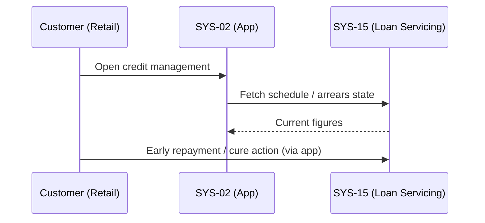
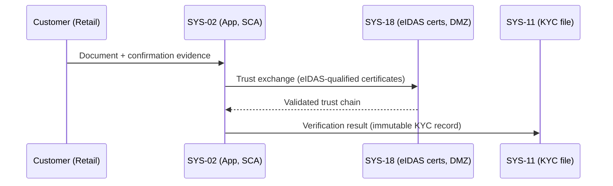
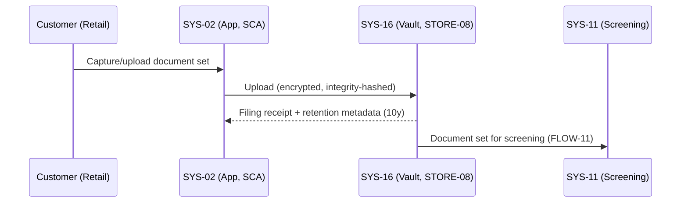
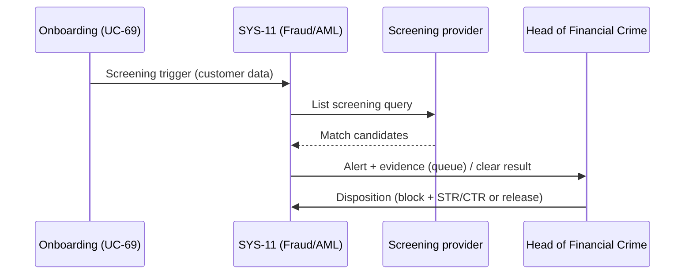
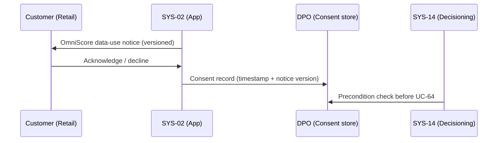
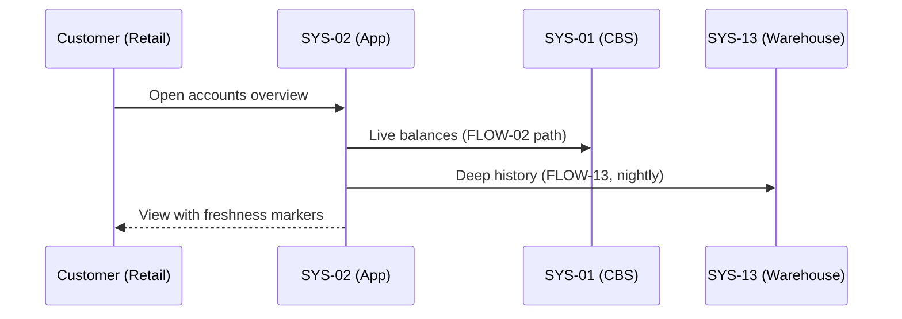
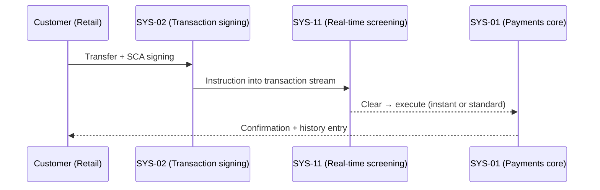
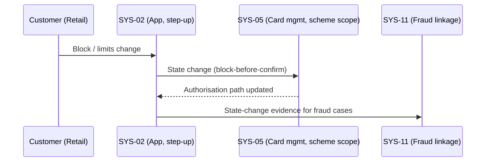
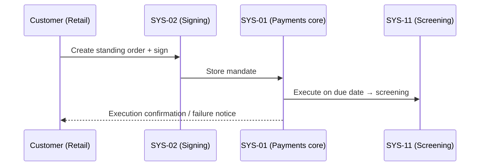
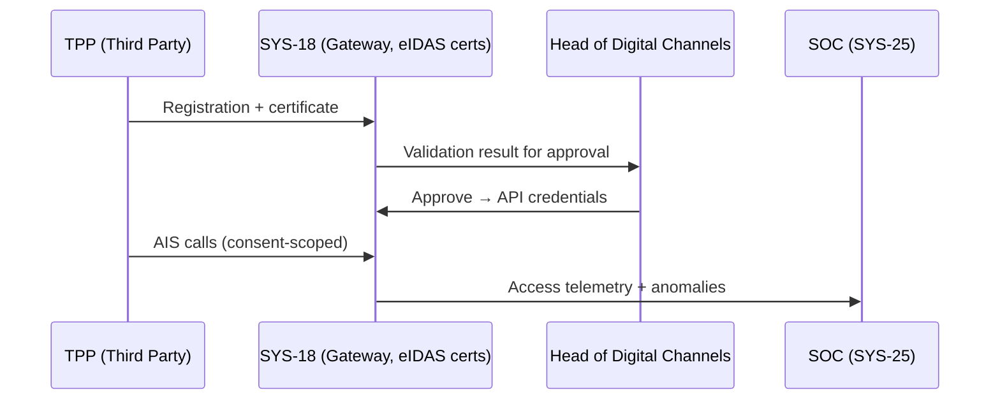

# Use Cases Catalog

**Case:** Case 03 — OmniBank Financial Systems (Maximum Complexity)
**Phase:** 3 — Decomposition & Risk Integration
**Step:** 1 — Define Packages + Use Cases

---

## 1. DOCUMENT PURPOSE

This document is the primary output of Phase 3 Step 1 for Case 03 — OmniBank Financial Systems (Maximum Complexity). It defines the complete set of Use Cases derived from the 63 rules in the Rules Catalog, organized by the 10 security domains from the canonical taxonomy.

Each Use Case follows the Actor + Verb + Object pattern and maps to one or more compliance rules. UCs are organized into Packages (one per domain) for clarity. Relationships and Variability are defined in separate documents (13a, 13b).

**Scope:** 10 packages, 60+ Use Cases derived from 38 compliance rules and 25 best practice rules across all 5 applicable regulations.

---

## 2. USE CASES CATALOG METADATA

| Field | Value |
|-------|-------|
| **caseId** | CASE-03-OMNIBANK |
| **caseName** | OmniBank Financial Systems S.A. |
| **complexity** | Maximum |
| **regulationsCovered** | GDPR, CRA, NIS 2, DORA, AI Act (5/5) |
| **totalPackages** | 10 |
| **totalUseCases** | 62 |
| **totalComplianceRulesMapped** | 38/38 (100%) |
| **totalBestPracticeRulesMapped** | 25/25 (100%) |
| **phase3Status** | Iteration 1 — Initial UC Definition |
| **relationshipsDefined** | Pending (Doc 13a) |
| **variabilityDefined** | Pending (Doc 13b) |

---

## 5. PACKAGES

### 3.1 Package Overview

| Package ID | Domain | Use Cases | Primary Regulations | Priority Distribution |
|------------|--------|-----------|---------------------|----------------------|
| PKG-D-01 | Data Protection & Encryption | 8 | All 5 | CRITICAL: 4, HIGH: 3, MEDIUM: 1 |
| PKG-D-02 | Vulnerability Management | 7 | CRA, NIS 2, DORA, AI Act | CRITICAL: 4, HIGH: 2, MEDIUM: 1 |
| PKG-D-03 | Access Control | 7 | CRA, NIS 2, DORA, AI Act | CRITICAL: 4, HIGH: 3, MEDIUM: 0 |
| PKG-D-04 | Incident Response | 8 | All 5 | CRITICAL: 5, HIGH: 2, MEDIUM: 1 |
| PKG-D-05 | Data Lifecycle | 6 | GDPR, CRA, AI Act | CRITICAL: 4, HIGH: 1, MEDIUM: 1 |
| PKG-D-06 | Supply Chain | 5 | GDPR, NIS 2, DORA | CRITICAL: 3, HIGH: 2, MEDIUM: 0 |
| PKG-D-07 | Secure Development | 6 | NIS 2, DORA | CRITICAL: 3, HIGH: 3, MEDIUM: 0 |
| PKG-D-08 | Human Factors | 4 | GDPR, NIS 2, AI Act | CRITICAL: 2, HIGH: 1, MEDIUM: 1 |
| PKG-D-09 | Governance & Documentation | 5 | All 5 | CRITICAL: 3, HIGH: 2, MEDIUM: 0 |
| PKG-D-10 | Monitoring & Audit | 6 | CRA, NIS 2, DORA, AI Act | CRITICAL: 4, HIGH: 2, MEDIUM: 0 |
| **TOTAL** | **10 Domains** | **62 UCs** | **5/5 Regulations** | **CRITICAL: 32, HIGH: 19, MEDIUM: 4** |

---

## 6. USE CASES

### 4.1 PKG-D-01: Data Protection & Encryption

**Purpose:** Encrypt data at rest and in transit; manage cryptographic keys; ensure data integrity and AI system resilience.

**Primary Actors:** Data Protection Officer, Security Architect, AI System Administrator, Data Subject

**Business Goals:** AG-D-01.1-001, AG-D-01.2-001, AG-D-01.3-001, AG-D-01.4-001

---

## PROC-01: Data Subject Requests Data Encryption Status

**Package:** PKG-D-01
**Actors:** Data Subject (Primary), Data Protection Officer (Secondary)
**Description:** A data subject queries the encryption status of their stored personal and financial data.
**Rules:** CR-D-01.1-001
**Priority:** CRITICAL
**SLA:** Response within 72 hours per GDPR Art. 12

**Related Goals:** AG-D-01.1-001

---

## UC-02: Security Architect Configures Data Encryption at Rest

**Package:** PKG-D-01
**Actors:** Security Architect (Primary), AI System Administrator (Secondary)
**Description:** Security architect configures AES-256 encryption for personal data, financial records, and AI training datasets at rest.
**Rules:** CR-D-01.1-001
**Priority:** CRITICAL
**SLA:** Implementation within 30 days of rule activation

**Related Goals:** AG-D-01.1-001, AG-D-05.2-001

---

## UC-03: Security Administrator Enforces TLS 1.3 for Data in Transit

**Package:** PKG-D-01
**Actors:** Security Administrator (Primary), Network Engineer (Secondary)
**Description:** Security administrator enforces TLS 1.3 for all internal, external, and API communications with HSTS and certificate pinning.
**Rules:** CR-D-01.2-001
**Priority:** CRITICAL
**SLA:** Full enforcement within 60 days

**Related Goals:** AG-D-01.2-001, AG-D-05.4-001

---

## PROC-02: Cryptographic Officer Manages HSM Key Lifecycle

**Package:** PKG-D-01
**Actors:** Cryptographic Officer (Primary), Security Auditor (Secondary)
**Description:** Cryptographic officer manages HSM-backed key lifecycle: generation, rotation, revocation, and destruction with full audit trail.
**Rules:** CR-D-01.3-001
**Priority:** CRITICAL
**SLA:** Key rotation every 90 days; revocation within 4 hours of compromise

**Related Goals:** AG-D-01.3-001

---

## PROC-03: AI System Administrator Validates AI Model Integrity

**Package:** PKG-D-01
**Actors:** AI System Administrator (Primary), Security Architect (Secondary)
**Description:** AI system administrator validates AI model integrity using checksums and version control to detect manipulation or unauthorized changes.
**Rules:** CR-D-01.4-001
**Priority:** HIGH
**SLA:** Integrity check on every model load; anomalies reported within 1 hour

**Related Goals:** AG-D-01.4-001, AG-D-02.4-002

---

## UC-06: Security Architect Implements Field-Level Encryption

**Package:** PKG-D-01
**Actors:** Security Architect (Primary), Database Administrator (Secondary)
**Description:** Security architect implements field-level encryption for PII fields and AI training datasets as per GDPR-C04 and CRA-C07.
**Rules:** CR-D-01.1-001
**Priority:** HIGH
**SLA:** Implementation within 60 days

**Related Goals:** AG-D-01.1-001

---

## PROC-04: Security Officer Rotates Cryptographic Keys

**Package:** PKG-D-01
**Actors:** Security Officer (Primary), Cryptographic Officer (Secondary)
**Description:** Security officer executes automated key rotation per defined schedule with HSM validation and audit logging.
**Rules:** CR-D-01.3-001
**SLA:** Automated rotation every 90 days; manual rotation on compromise

**Related Goals:** AG-D-01.3-001

---

## UC-08: AI System Detects Model Tampering

**Package:** PKG-D-01
**Actors:** AI System (Primary), Security Administrator (Secondary)
**Description:** AI system automatically detects model tampering, adversarial attacks, or unauthorized parameter modifications.
**Rules:** CR-D-01.4-001, BPR-D-12.4-001
**Priority:** HIGH
**SLA:** Detection within 15 minutes; alert within 5 minutes

**Related Goals:** AG-D-01.4-001, AG-D-10.1-002

---

### 4.2 PKG-D-02: Vulnerability Management

**Purpose:** Maintain zero known exploitable vulnerabilities; operate automated patch management; coordinate vulnerability disclosure; execute TLPT.

**Primary Actors:** Security Operations Manager, Vulnerability Assessment Team, Penetration Tester, AI Security Analyst

**Business Goals:** AG-D-02.1-002, AG-D-02.2-002, AG-D-02.3-002, AG-D-02.4-002

---

## PROC-05: Security Operations Manager Scans for Vulnerabilities

**Package:** PKG-D-02
**Actors:** Security Operations Manager (Primary), System Administrator (Secondary)
**Description:** Security operations manager executes continuous automated vulnerability scanning across all production systems and AI platforms.
**Rules:** CR-D-02.1-001
**Priority:** CRITICAL
**SLA:** Weekly scans; Critical findings remediated within 72 hours

**Related Goals:** AG-D-02.1-002

---

## PROC-06: Security Operations Manager Deploys Critical Patches

**Package:** PKG-D-02
**Actors:** Security Operations Manager (Primary), System Administrator (Secondary)
**Description:** Security operations manager deploys automated patch management with 72-hour SLA for critical vulnerabilities across systems, AI models, and firmware.
**Rules:** CR-D-02.2-001
**Priority:** CRITICAL
**SLA:** Critical patches deployed within 72 hours of release

**Related Goals:** AG-D-02.2-002

---

## PROC-07: Security Analyst Coordinates Vulnerability Disclosure

**Package:** PKG-D-02
**Actors:** Security Analyst (Primary), ENISA/CSIRT (Secondary)
**Description:** Security analyst operates coordinated vulnerability disclosure policy with public-facing intake and reports critical incidents to ENISA/CSIRT within 24 hours.
**Rules:** CR-D-02.3-001
**Priority:** CRITICAL
**SLA:** Critical disclosure within 24 hours; public advisory within 90 days

**Related Goals:** AG-D-02.3-002

---

## PROC-08: Penetration Tester Executes Threat-Led Penetration Testing

**Package:** PKG-D-02
**Actors:** Penetration Tester (Primary), CISO (Secondary), AI Security Analyst (Secondary)
**Description:** Penetration tester executes annual TLPT per DORA RTS including AI bias testing, adversarial robustness testing, and model inversion resistance.
**Rules:** CR-D-02.4-001, BPR-D-02.4-001, BPR-D-12.1-001
**Priority:** CRITICAL
**SLA:** Annual execution; findings remediated within 30 days

**Related Goals:** AG-D-02.4-002

---

## PROC-09: AI Security Analyst Assesses AI Model Vulnerabilities

**Package:** PKG-D-02
**Actors:** AI Security Analyst (Primary), Security Architect (Secondary)
**Description:** AI security analyst assesses AI model vulnerabilities including data poisoning, model evasion, and adversarial attacks per MITRE ATLAS.
**Rules:** CR-D-02.1-001, BPR-D-12.4-001
**Priority:** HIGH
**SLA:** Quarterly assessment; critical findings within 30 days

**Related Goals:** AG-D-02.1-002

---

## CAP-01: Vulnerability Analyst Maintains Vulnerability Register

**Package:** PKG-D-02
**Actors:** Vulnerability Analyst (Primary), Security Operations Manager (Secondary)
**Description:** Vulnerability analyst maintains centralized vulnerability register with CVSS scoring, exploitability assessment, and remediation tracking.
**Rules:** BPR-D-02.1-001, BPR-D-02.3-001
**Priority:** MEDIUM
**SLA:** Monthly reconciliation; quarterly report to CISO

**Related Goals:** AG-D-02.1-002

---

## UC-15: Security Architect Generates SBOM for AI Model

**Package:** PKG-D-02
**Actors:** Security Architect (Primary), AI System Administrator (Secondary)
**Description:** Security architect generates and maintains Software Bill of Materials (SBOM) for AI models including dependencies, open-source components, and model artifacts.
**Rules:** BPR-D-02.2-001, CR-D-06.2-001
**Priority:** HIGH
**SLA:** SBOM generated on every model release; updated on dependency change

**Related Goals:** AG-D-06.2-002

---

### 4.3 PKG-D-03: Access Control

**Purpose:** Implement unified identity management with MFA; enforce least privilege; maintain secure default configurations.

**Primary Actors:** Identity and Access Manager, Security Administrator, AI Platform Administrator, Human Resources Manager

**Business Goals:** AG-D-03.1-002, AG-D-03.2-002, AG-D-03.3-002, AG-D-03.4-002

---

## PROC-10: Identity and Access Manager Provisions User Identity

**Package:** PKG-D-03
**Actors:** Identity and Access Manager (Primary), HR Manager (Secondary)
**Description:** Identity and access manager provisions unified identity with MFA across all systems, cloud services, and AI platforms integrated with enterprise SSO.
**Rules:** CR-D-03.1-001, BPR-D-03.1-001
**Priority:** CRITICAL
**SLA:** Identity provisioned within 4 hours of HR notification; MFA enrolled within 24 hours

**Related Goals:** AG-D-03.1-002

---

## UC-17: Security Administrator Enforces MFA for Privileged Access

**Package:** PKG-D-03
**Actors:** Security Administrator (Primary), AI Platform Administrator (Secondary)
**Description:** Security administrator enforces MFA for all privileged access, remote access, and AI system access with step-up authentication for high-risk transactions.
**Rules:** CR-D-03.2-001, BPR-D-03.2-001
**Priority:** CRITICAL
**SLA:** MFA enforced within 30 days; step-up for high-risk actions immediate

**Related Goals:** AG-D-03.2-002

---

## PROC-11: Identity and Access Manager Conducts Quarterly Access Review

**Package:** PKG-D-03
**Actors:** Identity and Access Manager (Primary), Security Administrator (Secondary)
**Description:** Identity and access manager enforces least privilege with quarterly access reviews for all systems including AI model access and training data access.
**Rules:** CR-D-03.3-001, BPR-D-03.3-001
**Priority:** CRITICAL
**SLA:** Quarterly review completed within 5 business days; access revoked within 24 hours of finding

**Related Goals:** AG-D-03.3-002

---

## PROC-12: Security Administrator Hardens System Configuration

**Package:** PKG-D-03
**Actors:** Security Administrator (Primary), System Administrator (Secondary)
**Description:** Security administrator maintains secure default configuration per CIS Benchmarks, disabling unused services, ports, and protocols; hardens AI inference endpoints.
**Rules:** CR-D-03.4-001, BPR-D-03.4-001
**Priority:** CRITICAL
**SLA:** Configuration baseline applied within 60 days; monthly compliance verification

**Related Goals:** AG-D-03.4-002

---

## PROC-13: Identity and Access Manager Deprovisions User Access

**Package:** PKG-D-03
**Actors:** Identity and Access Manager (Primary), HR Manager (Secondary)
**Description:** Identity and access manager deprovisions user access within 24 hours of HR notification using automated HR system integration.
**Rules:** CR-D-03.1-001, BPR-D-03.1-001
**Priority:** HIGH
**SLA:** Deprovisioning completed within 24 hours; all access removed within 48 hours

**Related Goals:** AG-D-03.1-002

---

## UC-21: AI Platform Administrator Manages AI Model Access

**Package:** PKG-D-03
**Actors:** AI Platform Administrator (Primary), Security Administrator (Secondary)
**Description:** AI platform administrator manages access to AI model training data, inference endpoints, and parameter changes with MFA and least privilege.
**Rules:** CR-D-03.1-001, CR-D-03.2-001
**Priority:** HIGH
**SLA:** Access reviewed monthly; parameter changes require dual approval

**Related Goals:** AG-D-03.2-002

---

## UC-22: Security Administrator Implements FIDO2 Authentication

**Package:** PKG-D-03
**Actors:** Security Administrator (Primary), Identity and Access Manager (Secondary)
**Description:** Security administrator deploys FIDO2/WebAuthn MFA for all user-facing applications with hardware security keys for privileged accounts.
**Rules:** BPR-D-03.2-001
**Priority:** MEDIUM
**SLA:** Phased rollout over 90 days; phishing-resistant authentication for privileged within 60 days

**Related Goals:** AG-D-03.2-002

---

### 4.4 PKG-D-04: Incident Response

**Purpose:** Operate 24/7 SOC; maintain business continuity; execute universal incident notification; maintain redundant backups.

**Primary Actors:** Security Operations Center Analyst, Business Continuity Manager, Compliance Officer, AI Operations Manager

**Business Goals:** AG-D-04.1-002, AG-D-04.2-002, AG-D-04.3-002, AG-D-04.4-002

---

## CAP-02: SOC Analyst Monitors Security Events

**Package:** PKG-D-04
**Actors:** SOC Analyst (Primary), AI Operations Manager (Secondary)
**Description:** SOC analyst operates 24/7 automated incident detection and triage including AI anomaly detection for model drift and adversarial attacks.
**Rules:** CR-D-04.1-001, BPR-D-04.1-001
**Priority:** CRITICAL
**SLA:** 24/7 coverage; critical incidents escalated within 5 minutes

**Related Goals:** AG-D-04.1-002, AG-D-10.1-002

---

## PROC-14: Business Continuity Manager Triggers Disaster Recovery

**Package:** PKG-D-04
**Actors:** Business Continuity Manager (Primary), IT Operations Manager (Secondary)
**Description:** Business continuity manager triggers tested disaster recovery with RTO <= 4h and RPO <= 1h for critical financial systems including AI system failover.
**Rules:** CR-D-04.2-001, BPR-D-04.2-001
**Priority:** CRITICAL
**SLA:** RTO <= 4 hours; RPO <= 1 hour; failover tested semi-annually

**Related Goals:** AG-D-04.2-002

---

## PROC-15: Compliance Officer Executes Universal Incident Notification

**Package:** PKG-D-04
**Actors:** Compliance Officer (Primary), Legal Counsel (Secondary), DPO (Secondary)
**Description:** Compliance officer executes 24-hour universal incident notification workflow across GDPR (72h), CRA (24h), NIS 2 (24h), DORA (4h initial + 72h follow-up), AI Act (15d). Resolves T-001.
**Rules:** CR-D-04.3-001, BPR-D-04.3-001
**Priority:** CRITICAL
**SLA:** DORA 4h initial report; GDPR 72h follow-up; all regulatory bodies notified within respective SLAs

**Related Goals:** AG-D-04.3-002

**Tension Resolution:** T-001 — Unified 24h workflow with regulation-specific annexes. DORA 4h initial satisfies shortest deadline.

---

## UC-26: IT Operations Manager Maintains Redundant Backup Systems

**Package:** PKG-D-04
**Actors:** IT Operations Manager (Primary), Security Administrator (Secondary)
**Description:** IT operations manager maintains redundant backup systems with automated failover across EU data centers with sovereignty controls.
**Rules:** CR-D-04.4-001, BPR-D-04.4-001
**Priority:** CRITICAL
**SLA:** Backup verification quarterly; restore testing semi-annually; failover tested annually

**Related Goals:** AG-D-04.4-002

---

## PROC-16: AI Operations Manager Recovers AI System after Failure

**Package:** PKG-D-04
**Actors:** AI Operations Manager (Primary), Business Continuity Manager (Secondary)
**Description:** AI operations manager recovers AI system after failure including model restoration from immutable backup, data pipeline recovery, and inference service resumption.
**Rules:** CR-D-04.2-001, CR-D-04.4-001
**Priority:** HIGH
**SLA:** AI service recovery within 2 hours; model restoration within 30 minutes from checkpoint

**Related Goals:** AG-D-04.2-002

---

## PROC-17: SOC Analyst Investigates AI Model Anomaly

**Package:** PKG-D-04
**Actors:** SOC Analyst (Primary), AI Security Analyst (Secondary)
**Description:** SOC analyst investigates AI model anomaly detected by monitoring including model drift, adversarial manipulation, or data quality issues.
**Rules:** CR-D-04.1-001, CR-D-10.1-001, BPR-D-12.2-001
**Priority:** HIGH
**SLA:** Investigation started within 15 minutes; root cause identified within 4 hours

**Related Goals:** AG-D-04.1-002

---

## PROC-18: Incident Response Team Conducts Tabletop Exercise

**Package:** PKG-D-04
**Actors:** Incident Response Team Lead (Primary), CISO (Secondary)
**Description:** Incident response team conducts quarterly tabletop exercises with cross-functional participants including security, legal, compliance, communications, and AI governance.
**Rules:** BPR-D-04.1-001, BPR-D-04.3-001
**Priority:** MEDIUM
**SLA:** Quarterly exercises; lessons learned documented within 5 business days

**Related Goals:** AG-D-04.1-002

---

## PROC-19: Compliance Officer Reports AI Incident to Regulator

**Package:** PKG-D-04
**Actors:** Compliance Officer (Primary), AI Governance Lead (Secondary), DPO (Secondary)
**Description:** Compliance officer reports AI-specific incidents (model failure, bias detection, decision errors) to relevant regulators under AI Act and DORA.
**Rules:** CR-D-04.3-001, AI-C26, AI-C29
**Priority:** CRITICAL
**SLA:** AI Act: 15 days; DORA: 4h initial + 72h follow-up

**Related Goals:** AG-D-04.3-002

---

### 4.5 PKG-D-05: Data Lifecycle

**Purpose:** Enforce data minimization; implement tiered retention; execute cryptographic erasure; enable data portability.

**Primary Actors:** Data Protection Officer, AI Data Engineer, Data Subject, Compliance Officer

**Business Goals:** AG-D-05.1-001, AG-D-05.2-001, AG-D-05.3-001, AG-D-05.4-001

---

## PROC-20: Data Protection Officer Reviews Data Collection Minimization

**Package:** PKG-D-05
**Actors:** Data Protection Officer (Primary), AI Data Engineer (Secondary)
**Description:** Data protection officer reviews data collection for minimization, ensuring AI training data relevance, representativeness, and freedom from prohibited bias proxies.
**Rules:** CR-D-05.1-001, BPR-D-05.1-001
**Priority:** CRITICAL
**SLA:** Annual review; new processing assessed within 30 days

**Related Goals:** AG-D-05.1-001

---

## PROC-21: Compliance Officer Enforces Tiered Data Retention

**Package:** PKG-D-05
**Actors:** Compliance Officer (Primary), Data Protection Officer (Secondary)
**Description:** Compliance officer enforces tiered retention policy: 10-year financial records (MiFID II), 5-year operational records, 6-month AI training logs with automated deletion.
**Rules:** CR-D-05.2-001
**Priority:** CRITICAL
**SLA:** Automated deletion on expiry; retention violations reported within 24 hours

**Related Goals:** AG-D-05.2-001

---

## UC-33: Data Protection Officer Executes Data Erasure Request

**Package:** PKG-D-05
**Actors:** Data Protection Officer (Primary), IT Operations Manager (Secondary)
**Description:** Data protection officer executes cryptographic sharding-based erasure within 30 days of GDPR erasure request or retention expiry for PII, AI training data, and model inference records. Resolves T-002.
**Rules:** CR-D-05.3-001, BPR-D-05.3-001
**Priority:** CRITICAL
**SLA:** Erasure completed within 30 days; third-party notified within 72 hours

**Related Goals:** AG-D-05.3-001

**Tension Resolution:** T-002 — Cryptographic sharding enables DORA immutable log retention while satisfying GDPR erasure. PII keys destroyed; log structure preserved.

---

## UC-34: Data Subject Requests Data Export

**Package:** PKG-D-05
**Actors:** Data Subject (Primary), Data Protection Officer (Secondary)
**Description:** Data subject requests export of their personal data, AI model decisions, training data lineage, and credit scoring factors in machine-readable format.
**Rules:** CR-D-05.4-001, BPR-D-05.4-001
**Priority:** HIGH
**SLA:** Export completed within 30 days per GDPR Art. 20

**Related Goals:** AG-D-05.4-001

---

## PROC-22: AI Data Engineer Manages AI Training Data Lifecycle

**Package:** PKG-D-05
**Actors:** AI Data Engineer (Primary), Data Protection Officer (Secondary)
**Description:** AI data engineer manages AI training data lifecycle including collection, storage, training, inference logging, and deletion with documentation of data lineage.
**Rules:** CR-D-05.1-001, CR-D-05.2-001
**Priority:** HIGH
**SLA:** Data lineage documented on every training run; inference logs retained 6 months

**Related Goals:** AG-D-05.1-001, AG-D-05.2-001

---

## PROC-23: Compliance Officer Audits Third-Party Data Processors

**Package:** PKG-D-05
**Actors:** Compliance Officer (Primary), Data Protection Officer (Secondary)
**Description:** Compliance officer audits third-party data processors for compliance with erasure requests and retention policies including AI model providers.
**Rules:** CR-D-05.3-001, GDPR-C12
**Priority:** MEDIUM
**SLA:** Annual audit; erasure compliance verified within 60 days of request

**Related Goals:** AG-D-05.3-001

---

### 4.6 PKG-D-06: Supply Chain

**Purpose:** Operate vendor risk management; maintain SBOM; enforce contractual security; manage concentration risk.

**Primary Actors:** Vendor Risk Manager, Procurement Manager, Security Architect, Legal Counsel

**Business Goals:** AG-D-06.1-002, AG-D-06.2-002, AG-D-06.3-002, AG-D-06.4-002

---

## PROC-24: Vendor Risk Manager Assesses ICT Third-Party Provider

**Package:** PKG-D-06
**Actors:** Vendor Risk Manager (Primary), Security Architect (Secondary)
**Description:** Vendor risk manager assesses all ICT third-party providers pre-engagement and annually including AI model providers and data suppliers using SIG or CAIQ.
**Rules:** CR-D-06.1-001, BPR-D-06.1-001
**Priority:** CRITICAL
**SLA:** Pre-engagement assessment before contract; annual reassessment; critical vendors quarterly

**Related Goals:** AG-D-06.1-002

---

## CAP-03: Security Architect Maintains SBOM for Product

**Package:** PKG-D-06
**Actors:** Security Architect (Primary), AI Platform Administrator (Secondary)
**Description:** Security architect maintains Software Bill of Materials (SBOM) for all products, services, and AI model dependencies in SPDX and CycloneDX formats.
**Rules:** CR-D-06.2-001, BPR-D-02.2-001
**Priority:** CRITICAL
**SLA:** SBOM generated on every release; updated on dependency change; published within 24h of release

**Related Goals:** AG-D-06.2-002

---

## PROC-25: Procurement Manager Enforces Security Contract Terms

**Package:** PKG-D-06
**Actors:** Procurement Manager (Primary), Legal Counsel (Secondary)
**Description:** Procurement manager enforces contractual security obligations including audit rights, breach notification within 24h, data processing agreements, and regulatory cooperation clauses.
**Rules:** CR-D-06.3-001, BPR-D-06.3-001
**Priority:** CRITICAL
**SLA:** Contract review annually; breach notification SLA tracked; audit rights exercised triennially

**Related Goals:** AG-D-06.3-002

---

## PROC-26: Vendor Risk Manager Manages Vendor Exit

**Package:** PKG-D-06
**Actors:** Vendor Risk Manager (Primary), IT Operations Manager (Secondary)
**Description:** Vendor risk manager manages third-party concentration risk with documented exit strategies for critical vendors including AI model provider alternatives and data migration.
**Rules:** CR-D-06.4-001, BPR-D-06.4-001
**Priority:** HIGH
**SLA:** Exit strategies documented annually; tested annually; alternative provider identified for all critical services

**Related Goals:** AG-D-06.4-002

---

## PROC-27: Vendor Risk Manager Monitors AI Model Provider Performance

**Package:** PKG-D-06
**Actors:** Vendor Risk Manager (Primary), AI Operations Manager (Secondary)
**Description:** Vendor risk manager monitors AI model provider performance, bias metrics, and service levels with quarterly reporting to CISO.
**Rules:** CR-D-06.1-001, BPR-D-12.3-001
**Priority:** HIGH
**SLA:** Quarterly performance review; bias metrics reported monthly; SLA violations escalated within 48 hours

**Related Goals:** AG-D-06.1-002

---

### 4.7 PKG-D-07: Secure Development

**Purpose:** Implement privacy/security by design; enforce secure coding; secure CI/CD pipeline; operate formal change management.

**Primary Actors:** Software Development Manager, Security Engineer, Release Manager, AI ML Engineer

**Business Goals:** AG-D-07.1-001, AG-D-07.2-002, AG-D-07.3-002, AG-D-07.4-002

---

## PROC-28: Software Development Manager Implements Secure-by-Design

**Package:** PKG-D-07
**Actors:** Software Development Manager (Primary), AI ML Engineer (Secondary)
**Description:** Software development manager implements privacy by design and security by design per CRA secure-by-default standard including AI model governance and ethical design reviews.
**Rules:** CR-D-07.1-001, BPR-D-07.1-001
**Priority:** CRITICAL
**SLA:** Secure design review on every sprint; ethical design review for AI features

**Related Goals:** AG-D-07.1-001, AG-D-03.4-002

---

## PROC-29: Security Engineer Enforces Secure Coding Standards

**Package:** PKG-D-07
**Actors:** Security Engineer (Primary), Software Development Manager (Secondary)
**Description:** Security engineer enforces secure coding standards per OWASP ASVS with mandatory SAST/DAST in all development pipelines including AI code repositories and data pipeline code.
**Rules:** CR-D-07.2-001, BPR-D-07.2-001
**Priority:** CRITICAL
**SLA:** SAST/DAST on every commit; High/Critical findings block deployment

**Related Goals:** AG-D-07.2-002

---

## UC-44: Release Manager Secures CI/CD Pipeline

**Package:** PKG-D-07
**Actors:** Release Manager (Primary), Security Engineer (Secondary)
**Description:** Release manager operates CI/CD pipeline with automated security gates (SAST, DAST, SCA, secrets detection, IaC scanning) including ML pipeline security gates.
**Rules:** CR-D-07.3-001, BPR-D-07.3-001
**Priority:** CRITICAL
**SLA:** Security gates on every pipeline run; critical findings block deployment within 1 hour

**Related Goals:** AG-D-07.3-002

---

## PROC-30: Change Advisory Board Approves Production Change

**Package:** PKG-D-07
**Actors:** Change Advisory Board (Primary), Release Manager (Secondary)
**Description:** Change advisory board operates formal change management with dual control approval and independent oversight for all production changes including AI model changes.
**Rules:** CR-D-07.4-001, BPR-D-07.4-001
**Priority:** HIGH
**SLA:** Emergency changes approved within 2 hours; standard changes reviewed within 5 business days

**Related Goals:** AG-D-07.4-002

---

## UC-46: AI ML Engineer Secures AI Training Pipeline

**Package:** PKG-D-07
**Actors:** AI ML Engineer (Primary), Security Engineer (Secondary)
**Description:** AI ML engineer secures AI training pipeline including data validation, model signing, artifact verification, and deployment approval workflow.
**Rules:** CR-D-07.1-001, CR-D-07.3-001
**Priority:** HIGH
**SLA:** Pipeline security gates on every training run; model artifacts signed and verified

**Related Goals:** AG-D-07.2-002, AG-D-07.3-002

---

## UC-47: Security Engineer Scans Infrastructure as Code

**Package:** PKG-D-07
**Actors:** Security Engineer (Primary), Cloud Engineer (Secondary)
**Description:** Security engineer scans infrastructure-as-code (IaC) for vulnerabilities and misconfigurations using Checkov or equivalent before deployment.
**Rules:** BPR-D-07.3-001
**Priority:** MEDIUM
**SLA:** IaC scanned on every pull request; High findings block merge

**Related Goals:** AG-D-07.3-002

---

### 4.8 PKG-D-08: Human Factors

**Purpose:** Deliver security awareness training; maintain role-specific competence; ensure board-level oversight.

**Primary Actors:** Training Manager, Security Awareness Officer, HR Manager, Board Secretary

**Business Goals:** AG-D-08.1-002, AG-D-08.2-002, AG-D-08.3-002

---

## PROC-31: Training Manager Delivers Security Awareness Training

**Package:** PKG-D-08
**Actors:** Training Manager (Primary), Security Awareness Officer (Secondary)
**Description:** Training manager delivers annual security awareness training to all 5000+ employees with role-specific modules for developers, operations, and management including AI ethics.
**Rules:** CR-D-08.1-001, BPR-D-08.1-001
**Priority:** CRITICAL
**SLA:** 95% completion within 90 days; effectiveness metrics reported quarterly

**Related Goals:** AG-D-08.1-002

---

## CAP-04: HR Manager Maintains Security Competence Program

**Package:** PKG-D-08
**Actors:** HR Manager (Primary), Training Manager (Secondary)
**Description:** HR manager maintains role-specific security competence programs with mandatory certification for privileged roles and AI human oversight procedures.
**Rules:** CR-D-08.2-001, BPR-D-08.2-001, BPR-D-12.3-001
**Priority:** CRITICAL
**SLA:** Certification tracked annually; AI oversight training completed before system deployment

**Related Goals:** AG-D-08.2-002

---

## PROC-32: Board Secretary Coordinates Board Security Training

**Package:** PKG-D-08
**Actors:** Board Secretary (Primary), CISO (Secondary)
**Description:** Board secretary coordinates DORA and NIS 2 requirements training for management board with ICT risk oversight and quarterly compliance reporting.
**Rules:** CR-D-08.3-001, BPR-D-08.3-001
**Priority:** HIGH
**SLA:** Board training completed within 60 days of appointment; quarterly reporting established

**Related Goals:** AG-D-08.3-002

---

## PROC-33: Security Awareness Officer Conducts Phishing Simulation

**Package:** PKG-D-08
**Actors:** Security Awareness Officer (Primary), Training Manager (Secondary)
**Description:** Security awareness officer conducts phishing simulations quarterly to test employee awareness and measure training effectiveness.
**Rules:** BPR-D-08.1-001
**Priority:** MEDIUM
**SLA:** Quarterly simulations; click rate < 5%; remedial training for failures

**Related Goals:** AG-D-08.1-002

---

### 4.9 PKG-D-09: Governance & Documentation

**Purpose:** Maintain unified ISMS; conduct IPSARA assessments; manage asset inventory; maintain compliance documentation.

**Primary Actors:** Chief Information Security Officer, Compliance Manager, Data Protection Officer, AI Governance Lead

**Business Goals:** AG-D-09.1-001, AG-D-09.2-001, AG-D-09.4-001, AG-D-09.3-002

---

## CAP-05: CISO Maintains Unified ISMS

**Package:** PKG-D-09
**Actors:** CISO (Primary), Compliance Manager (Secondary), AI Governance Lead (Secondary)
**Description:** CISO maintains unified Information Security Management System (ISMS) covering all 5 regulatory frameworks with AI governance framework and documentation retained 10+ years.
**Rules:** CR-D-09.1-001, BPR-D-09.1-001, BPR-D-09.4-001
**Priority:** CRITICAL
**SLA:** Annual ISMS review; quarterly compliance reporting; documentation retained minimum 10 years

**Related Goals:** AG-D-09.1-001

---

## PROC-34: Compliance Manager Executes IPSARA Risk Assessment

**Package:** PKG-D-09
**Actors:** Compliance Manager (Primary), CISO (Secondary), AI Governance Lead (Secondary)
**Description:** Compliance manager executes unified Integrated Privacy and Security Risk Assessments (IPSARA) combining DPIA, FRIA, cybersecurity risk, and ICT risk per AI Act requirements. Resolves T-003.
**Rules:** CR-D-09.2-001, BPR-D-09.2-001, BPR-D-09.3-001
**Priority:** CRITICAL
**SLA:** New systems assessed before go-live; annual reassessment; AI-specific risks quarterly

**Related Goals:** AG-D-09.2-001

**Tension Resolution:** T-003 — IPSARA framework unifies 5 assessment triggers (GDPR DPIA, CRA risk assessment, NIS 2 risk analysis, DORA ICT risk, AI Act FRIA).

---

## CAP-06: IT Asset Manager Maintains Comprehensive Asset Inventory

**Package:** PKG-D-09
**Actors:** IT Asset Manager (Primary), CISO (Secondary)
**Description:** IT asset manager maintains comprehensive asset and ICT inventory with automated discovery including AI models, training datasets, inference endpoints, and model registry entries.
**Rules:** CR-D-09.3-001
**Priority:** CRITICAL
**SLA:** Inventory reconciled monthly; new assets discovered within 24 hours; decommissioned assets removed within 7 days

**Related Goals:** AG-D-09.3-002

---

## CAP-07: AI Governance Lead Maintains AI Traceability Documentation

**Package:** PKG-D-09
**Actors:** AI Governance Lead (Primary), Data Protection Officer (Secondary)
**Description:** AI governance lead maintains AI traceability documentation including model cards, data sheets, AI decision logs, and stakeholder transparency reports per IEEE 7000.
**Rules:** CR-D-09.4-001, BPR-D-09.4-001
**Priority:** HIGH
**SLA:** Model card updated on every release; decision logs retained per regulatory requirement

**Related Goals:** AG-D-09.4-001

---

## PROC-35: Compliance Manager Generates Regulatory Compliance Report

**Package:** PKG-D-09
**Actors:** Compliance Manager (Primary), CISO (Secondary)
**Description:** Compliance manager generates regulatory compliance reports for ECB/BaFin, ENISA, and other competent authorities including AI governance indicators.
**Rules:** CR-D-09.1-001, DORA-C38
**Priority:** HIGH
**SLA:** Quarterly regulatory reports; ad-hoc reports within 48 hours of request

**Related Goals:** AG-D-09.1-001

---

### 4.10 PKG-D-10: Monitoring & Audit

**Purpose:** Deploy 24/7 monitoring with AI threat detection; maintain immutable audit logs; execute penetration testing and AI evaluation.

**Primary Actors:** SOC Manager, Security Analyst, Audit Manager, AI Security Analyst

**Business Goals:** AG-D-10.1-002, AG-D-10.2-002, AG-D-10.3-002

---

## UC-57: SOC Manager Deploys AI-Powered Threat Detection

**Package:** PKG-D-10
**Actors:** SOC Manager (Primary), AI Security Analyst (Secondary)
**Description:** SOC manager deploys 24/7 continuous security monitoring with AI-powered threat detection across all systems, networks, and AI pipelines including real-time model drift detection.
**Rules:** CR-D-10.1-001, BPR-D-10.1-001, BPR-D-12.2-001
**Priority:** CRITICAL
**SLA:** 24/7 monitoring; AI detection calibrated monthly; anomalies escalated within 5 minutes

**Related Goals:** AG-D-10.1-002

---

## UC-58: Audit Manager Maintains Immutable Audit Logs

**Package:** PKG-D-10
**Actors:** Audit Manager (Primary), Security Administrator (Secondary)
**Description:** Audit manager maintains immutable audit logs with PII data separation and AI system traceability using cryptographic sharding for log integrity. Resolves T-002.
**Rules:** CR-D-10.2-001, BPR-D-10.2-001
**Priority:** CRITICAL
**SLA:** Logs retained minimum 5 years (financial) and 6 months (AI inference); integrity verified daily

**Related Goals:** AG-D-10.2-002

**Tension Resolution:** T-002 — Cryptographic sharding enables GDPR erasure (PII keys destroyed) while preserving DORA immutable log structure.

---

## PROC-36: Security Analyst Conducts Penetration Testing

**Package:** PKG-D-10
**Actors:** Security Analyst (Primary), CISO (Secondary)
**Description:** Security analyst executes annual penetration testing, TLPT, resilience testing, and periodic AI model evaluation including red team exercises for AI systems.
**Rules:** CR-D-10.3-001, BPR-D-10.3-001, BPR-D-12.4-001
**Priority:** CRITICAL
**SLA:** Annual pentest; AI evaluation quarterly; findings remediated within 30 days

**Related Goals:** AG-D-10.3-002

---

## PROC-37: AI Security Analyst Tests AI Adversarial Robustness

**Package:** PKG-D-10
**Actors:** AI Security Analyst (Primary), SOC Manager (Secondary)
**Description:** AI security analyst tests AI adversarial robustness per MITRE ATLAS including data poisoning, model evasion, model inversion, and prompt injection attacks.
**Rules:** BPR-D-12.4-001, CR-D-02.4-001
**Priority:** HIGH
**SLA:** Quarterly adversarial testing; critical vulnerabilities remediated within 30 days

**Related Goals:** AG-D-10.3-002

---

## UC-61: SOC Analyst Monitors AI Model Performance Drift

**Package:** PKG-D-10
**Actors:** SOC Analyst (Primary), AI Operations Manager (Secondary)
**Description:** SOC analyst monitors AI model performance drift, data quality degradation, and automated retraining triggers with rollback procedures.
**Rules:** BPR-D-12.2-001, CR-D-10.1-001
**Priority:** HIGH
**SLA:** Drift detection hourly; automated retraining triggered within 4 hours of threshold breach

**Related Goals:** AG-D-10.1-002

---

## PROC-38: Audit Manager Generates Audit Trail Report

**Package:** PKG-D-10
**Actors:** Audit Manager (Primary), Compliance Manager (Secondary)
**Description:** Audit manager generates audit trail reports for regulatory examination including AI decision traceability and PII access logs.
**Rules:** CR-D-10.2-001, AI-C09, AI-C10
**Priority:** MEDIUM
**SLA:** Ad-hoc reports within 48 hours; annual comprehensive audit trail review

**Related Goals:** AG-D-10.2-002

---

## 6B. PRODUCT FUNCTIONAL USE CASES (UC-63+, PKG-A..F) — OmniBank platform product

> **v2.1 (PORT-PARITY-2 Phase 3 restructure pilot, 2026-09-04).** This section models the
> **OmniBank product itself** (digital channels, OmniScore, lending) as a normal software
> product: actor-goal use cases in fully-dressed form (Cockburn), with security/compliance
> layered on as a per-UC annex. **Nomenclature unchanged**: the pre-existing compliance use
> cases PROC-01..UC-62 (§6) keep IDs and content verbatim; new product use cases continue the
> flat numbering at **UC-63+** and never reuse existing IDs. This pilot delivers PKG-C
> (Lending & OmniScore, §6B.1); the massification pass (v2.2) delivered PKG-A/B/D/E/F (§6B.2–§6B.6).
>
> **Template (2026-09-04):** the PKG-C and PKG-A/B/D/E/F use cases are written fully-dressed in the RUP-style
> per-UC template of `03_REFERENCE_MATERIAL/P3_E2_Requirement_Analysis_Bike4All_Maintenance_platform_v1r2.md`
> (sections 1–10, one Mermaid sequence diagram per UC), adjusted to AEGIS: section 10 is the
> **Security & Compliance Annex (AEGIS)** carrying provenance, constrained-by, rules, threats
> and NIST anchors; MUC linkage is preserved.

### 6B.0 Product actors (reuse of existing stakeholder/system IDs)

| Actor | Role in the product | Drives |
|-------|---------------------|--------|
| Customer (Retail) | Primary product user: onboards, banks, borrows via SYS-02 app. | UC-63, UC-65, UC-67–81, UC-84–85, UC-90–93 |
| OmniScore AI Platform (SYS-03) | The scoring system itself — acts, never decides alone. | UC-64 |
| Underwriter (Consumer Lending) | Human oversight on borderline/high-risk credit decisions. | PROC-39 |
| Head of AI Governance (stakeholder) | Owns bias/drift monitoring and model governance. | Annex targets |
| Fraud & AML Platform (SYS-11) | Consumes journey telemetry; sanctions/fraud/AML screening. | UC-72, UC-90, Annex targets |
| Customer (Corporate) | Corporate self-service (SME + large corporate) via SYS-21. | UC-86–89 |
| TPP (Third-Party Provider) | PSD2 third party consuming AIS/PIS via SYS-18. | UC-82, UC-83 (counterparty of UC-81) |
| Document vault (SYS-16) | KYC/KYB document filing with 10-year retention. | UC-71, UC-74 (supporting: UC-86, UC-93) |

### 6B.1 PKG-C — Lending & OmniScore (6)

| UC ID | Title | Primary Actor | Prio |
|-------|-------|---------------|------|
| UC-63 | Apply for Consumer Credit | Customer (Retail) | CRITICAL |
| UC-64 | OmniScore Computes Credit Score | SYS-03 (AI Platform) | CRITICAL |
| UC-65 | Customer Receives Score Explanation | Customer (Retail) | HIGH |
| PROC-39 | Underwriter Reviews Borderline Application | Underwriter | CRITICAL |
| UC-67 | Customer Accepts Offer & Contract Signed | Customer (Retail) | CRITICAL |
| UC-68 | Customer Manages Repayment & Arrears View | Customer (Retail) | HIGH |

#### Use-Case: {UC-63} Apply for Consumer Credit

##### 1 Brief Description

The customer applies for consumer credit through the mobile app: product selection,
pre-contractual information (SECCI), credit-bureau consent and income/expense
declarations. It is triggered when the customer opens the credit product and submits the
application form. The submitted application then enters the OmniScore decisioning flow
(UC-64) or — without consent — the manual path (PROC-39).

##### 2 Actor Brief Descriptions

###### 2.1 Customer (Retail) — Primary Actor:

Selects the product, grants consents, submits declarations and receives the application
status.

###### 2.2 SYS-02 (Mobile app channel):

PSD2 SCA-protected session; captures the application, consents and declarations.

###### 2.3 SYS-14 (Loan Origination):

Creates the application record; invokes the OmniScore decisioning flow (UC-64).

###### 2.4 SYS-11 (Fraud & AML Platform):

Screens the application for fraud patterns.

###### 2.5 DPO:

Owner of the consent records.

##### 3 Preconditions

- Customer onboarded (PKG-A, pending) with verified identity.
- App session under PSD2 SCA.

##### 4 Basic Flow of Events

1. Customer selects product, amount and term; app shows the pre-contractual information sheet (SECCI).
2. Customer grants the credit-bureau check consent; consent recorded with timestamp.
3. Customer submits income/expense declarations; app validates completeness.
4. SYS-14 creates the application record; SYS-11 screens for fraud patterns (no hit → continue).
5. SYS-14 invokes the OmniScore decisioning flow (UC-64) and awaits the outcome.

```mermaid
sequenceDiagram
    participant C as Customer (Retail)
    participant APP as SYS-02 (App, SCA)
    participant LO as SYS-14 (Loan Origination)
    participant F as SYS-11 (Fraud/AML)
    C->>APP: Select product/amount/term; SECCI; consent + declarations
    APP->>LO: Submit application record
    LO->>F: Fraud screening
    LO->>LO: Invoke OmniScore decisioning (UC-64)
```

##### 5 Alternative Flows

###### 5.1 <Alternate flow: Consent declined>

Trigger: step 2. The application cannot proceed under automated scoring; the customer is
offered the manual-review path (PROC-39 without score, Art. 22(3) right not to be subject
to solely automated decisions).

###### 5.2 <Alternate flow: Fraud screening hit>

Trigger: step 4. Application frozen; sent to the financial-crime queue (no decision until
cleared).

###### 5.3 <Alternate flow: Data incomplete>

Trigger: step 3. Guided correction (max 3 attempts), then save-as-draft.

##### 6 Subflows

###### 6.1 <Subflow: Bureau consent capture>

1. Present the consent purpose (credit-bureau check) before any bureau data is touched.
2. Record the consent with timestamp against the application record (evidence for UC-65 and audits).

###### 6.2 <Subflow: Fraud screening>

1. SYS-11 screens the declared data and the session for fraud patterns.
2. Hit → freeze the application into the financial-crime queue; no hit → continue to decisioning.

##### 7 Key Scenarios

###### 7.1 <Scenario: Application submitted>

1. Application exists with status SUBMITTED; consent + screening evidence on record; score flow invoked (UC-64).

###### 7.2 <Scenario: Fraud hit>

1. Application frozen, financial-crime queue, no decision until cleared.

##### 8 Post-conditions

###### 8.1

Application exists with status SUBMITTED.

###### 8.2

Consent + screening evidence on record.

##### 9 Special Requirements (FURPS+)

**Functional (F):** Product/amount/term selection, SECCI presentation, bureau consent,
declaration validation, application record creation, decisioning invocation.

**Usability (U):** Guided correction of incomplete data (max 3 attempts) before
save-as-draft.

**Reliability (R):** Fraud screening gates every application; PSD2 SCA session resists
takeover (MUC-01-analogue); journey monitoring (CR-D-10.1-001).

**Performance (P):** N/A — no attested timing constraint for the application step.

**Supportability (S):** Scoring factors exportable by design (CR-D-05.4-001) keeps the
application data model stable for audit and data-subject requests.

##### 10 Security & Compliance Annex (AEGIS)

- **Provenance:** [ATTESTED] Doc04 §1.1 SYS-14 (consumer credit origination + decision engine, integrates OmniScore), SYS-02 (SCA app channel); Doc19 CR-D-05.4-001 (credit scoring factors exportable).
- **Constrained by:** PROC-10/UC-17 (identity, MFA), UC-06 (field-level encryption of declarations), UC-21 (AI platform access).
- **Rules / NFR:** CR-D-05.4-001 (data export incl. scoring factors), CR-D-10.1-001 (journey monitoring).
- **Threats addressed:** MUC-C3-05 (application data crafted to game scoring), MUC-01-analogue (session takeover).
- **NIST anchors:** PR.AA-01, PR.DS-01.

#### Use-Case: {UC-64} OmniScore Computes Credit Score

##### 1 Brief Description

The OmniScore AI platform (SYS-03) computes the credit score for a submitted application
using the approved model version, with reason codes generated inside the model runtime. It
is triggered when the SYS-14 decisioning request arrives (UC-63 step 5). Score bands route
the application — auto-approve, auto-decline or borderline — and borderline cases always
reach a human (PROC-39): never a silent auto-decline without a human path.

##### 2 Actor Brief Descriptions

###### 2.1 SYS-03 (OmniScore AI Platform) — Primary Actor (acts on behalf of SYS-14):

Runs the approved model version, computes score + confidence band and generates reason
codes (managed ML runtime + explainability layer + bias monitoring pipeline).

###### 2.2 SYS-14 (Loan Origination):

Issues the decisioning request; consumes the score band; routes borderline cases.

###### 2.3 Head of AI Governance:

Model governance: approved versions, bias/drift monitoring.

###### 2.4 Underwriter:

Consumer of the score at PROC-39.

###### 2.5 DPO:

Owner of the automated-decision records.

##### 3 Preconditions

- Application SUBMITTED (UC-63).
- Model version approved and deployed per change control.

##### 4 Basic Flow of Events

1. SYS-03 fetches application features (declared data + internal account data where consented).
2. SYS-03 runs the approved model version; computes the score + confidence band.
3. SYS-03 generates the reason-code set (top contributing factors, GDPR-compliant granularity).
4. SYS-03 returns score + reasons + model version id to SYS-14; decision-context record written (who/what/when/version).
5. Score band routes the application: auto-approve / auto-decline / **borderline → PROC-39** (never silent auto-decline without a human path).

```mermaid
sequenceDiagram
    participant LO as SYS-14 (Loan Origination)
    participant AI as SYS-03 (OmniScore)
    participant UW as Underwriter (PROC-39)
    LO->>AI: Decisioning request (application features)
    AI->>AI: Run approved model version; score + confidence band
    AI->>AI: Generate reason codes; write decision-context record
    AI-->>LO: Score + reasons + model version id
    LO->>UW: Borderline band -> queue human review
```

##### 5 Alternative Flows

###### 5.1 <Alternate flow: Model service unavailable>

Trigger: step 2. SYS-14 queues to the manual underwriting path; NO fallback to an
unapproved model version.

###### 5.2 <Alternate flow: Reason-code generation fails>

Trigger: step 3. Decision blocked — explainability is a release condition, not a
nice-to-have.

###### 5.3 <Alternate flow: Input features out of expected distribution>

Trigger: step 1. Flag possible data-quality/manipulation issue (MUC-C3-01) + route to
PROC-39.

##### 6 Subflows

###### 6.1 <Subflow: Decision-context record write>

1. Record who/what/when plus model version and the feature snapshot used.
2. Append immutably to the decision records (immutable decision records, CR-D-10.2-001 discipline).

###### 6.2 <Subflow: Reason-code generation>

1. Extract the top contributing factors inside the model runtime (never hand-written).
2. Emit at GDPR-compliant granularity, log-anchored to the model version (anti MUC-C3-05).

##### 7 Key Scenarios

###### 7.1 <Scenario: Score computed>

1. Score + reasons + model version immutably recorded; the band routes the application.

###### 7.2 <Scenario: Unexplainable or manipulated input>

1. Borderline/blocked outcome queued to a human (PROC-39) — no silent auto-decline.

##### 8 Post-conditions

###### 8.1

Score + reasons + model version immutably recorded.

###### 8.2

Borderline cases queued to a human.

##### 9 Special Requirements (FURPS+)

**Functional (F):** Feature fetch, scoring with confidence band, in-runtime reason codes,
decision-context record, band routing with a human path.

**Usability (U):** N/A — backend step; the customer-facing explainability surface is
UC-65.

**Reliability (R):** No fallback to unapproved models; decision blocked if reason codes
cannot be generated (fail-closed on explainability).

**Performance (P):** N/A — no attested latency target for scoring.

**Supportability (S):** Approved-model-version pinning plus the bias/drift monitoring
pipeline (UC-61, SYS-03) keep the service maintainable under AI Act governance
documentation (CR-D-09.1-001).

##### 10 Security & Compliance Annex (AEGIS)

- **Provenance:** [ATTESTED] Doc04 §1.1 SYS-03 (managed ML runtime + explainability layer + bias monitoring pipeline); Doc19 BPR-D-12.3-001 (AI Act Art. 14 human oversight thresholds/overrides for credit scoring).
- **Constrained by:** PROC-03 (model integrity validation), UC-08 (model tampering detection), UC-61 (AI model performance drift monitoring), UC-21 (AI model access control).
- **Rules / NFR:** BPR-D-12.3-001 (Art. 14 human oversight), CR-D-05.4-001 (scoring-factor transparency feeds UC-65), CR-D-09.1-001 (governance documentation).
- **Threats addressed:** MUC-C3-01 (input manipulation), MUC-C3-02 (training-data poisoning — detected via drift/bias pipeline), MUC-C3-04 (discriminatory outcomes — bias monitoring pipeline).
- **NIST anchors:** GV.MT-01, MEASURE-2.7.

#### Use-Case: {UC-65} Customer Receives Score Explanation

##### 1 Brief Description

The customer receives the credit decision with plain-language reason codes and can request
the machine-readable explanation package. It is triggered when the customer opens the
decision screen in the app, after a UC-64 or PROC-39 outcome. Explanations are generated,
log-anchored evidence — never hand-written — so they cannot drift from actual model
behaviour.

##### 2 Actor Brief Descriptions

###### 2.1 Customer (Retail) — Primary Actor:

Reads the outcome and reason codes; may request the explanation package or dispute a
reason.

###### 2.2 SYS-02 (Mobile app channel):

Presents the outcome screen; dispatches explanation requests.

###### 2.3 SYS-03 (OmniScore explainability layer):

Source of the principal reason codes and the machine-readable package.

###### 2.4 DPO:

Owner of Art. 22 transparency.

###### 2.5 Head of AI Governance:

Owns XAI quality.

##### 3 Preconditions

- A decision (or borderline outcome) exists from UC-64/PROC-39.

##### 4 Basic Flow of Events

1. App presents the outcome with the principal reason codes, in plain language.
2. Customer can request the machine-readable explanation package (CR-D-05.4-001 format).
3. Request/dispatch is logged against the decision record.

```mermaid
sequenceDiagram
    participant C as Customer (Retail)
    participant APP as SYS-02 (App)
    participant AI as SYS-03 (Explainability layer)
    C->>APP: Open decision screen
    APP->>AI: Request outcome view / explanation package
    AI-->>APP: Principal reason codes / package (CR-D-05.4-001 format)
    APP-->>C: Plain-language outcome; dispatch logged
```

##### 5 Alternative Flows

###### 5.1 <Alternate flow: Disputed reason code>

Trigger: step 1, customer disputes a reason (factually wrong data) → opens a
data-correction flow (GDPR Art. 16 path) linked to the decision; re-scoring after
correction.

###### 5.2 <Alternate flow: Explanation package generation fails>

Trigger: step 2. Human contact channel offered within SLA; never silent.

##### 6 Subflows

###### 6.1 <Subflow: Explanation package dispatch>

1. Generate the package in the CR-D-05.4-001 format from the explainability layer (generated, not hand-written).
2. Log the request/dispatch against the decision record (log-anchored, anti MUC-C3-05).

##### 7 Key Scenarios

###### 7.1 <Scenario: Explanation delivered>

1. Explanation evidence stored with the decision (audit complete).

###### 7.2 <Scenario: Wrong data disputed>

1. Art. 16 correction flow linked to the decision; re-scoring after correction.

##### 8 Post-conditions

###### 8.1

Explanation evidence stored with the decision (audit complete).

###### 8.2

Any dispute is tracked as a linked data-correction flow until resolved.

##### 9 Special Requirements (FURPS+)

**Functional (F):** Plain-language reasons, machine-readable package in the CR-D-05.4-001
format, dispatch logging.

**Usability (U):** Plain language, customer-facing; in-app dispute entry point.

**Reliability (R):** Never silent on generation failure (human contact channel within
SLA); reason codes log-anchored and generated in the model runtime (anti MUC-C3-05).

**Performance (P):** N/A — no attested timing constraint.

**Supportability (S):** The explanation format stays stable for audits and data-subject
requests (PROC-01 linkage).

##### 10 Security & Compliance Annex (AEGIS)

- **Provenance:** [ATTESTED] Doc19 CR-D-05.4-001 verbatim ("Include AI model decisions, training data lineage, and credit scoring factors"); Doc04 §1.1 SYS-03 explainability layer.
- **Constrained by:** PROC-01 (data subject requests), UC-63 consent record.
- **Rules / NFR:** CR-D-05.4-001, CR-D-09.2-001 (governance reporting).
- **Threats addressed:** MUC-C3-05 (explainability spoofing — reason codes are generated, not hand-written, and log-anchored).
- **NIST anchors:** GV.PO-P1.

#### Use-Case: {PROC-39} Underwriter Reviews Borderline Application

##### 1 Brief Description

The underwriter performs the independent human review of borderline or blocked credit
applications and is the decision-maker here (AI Act Art. 14) — the model only recommends.
It is triggered when a work item lands in the underwriting queue, either from the UC-64
borderline band or from the manual path of UC-63 (ext. 5.1). Decisions carry mandatory
reason codes, and the override-vs-score delta feeds AI-governance metrics.

##### 2 Actor Brief Descriptions

###### 2.1 Underwriter (Consumer Lending) — Primary Actor:

Reviews the work item independently and records the decision with justification.

###### 2.2 SYS-14 (Loan Origination):

Record owner; provides the work-item queue and business-rules engine.

###### 2.3 SYS-03 (OmniScore):

Supplies score, reason codes, model version and confidence band for the review.

###### 2.4 Head of AI Governance:

Consumes the oversight metrics (override deltas).

###### 2.5 Customer:

Subject of the decision.

##### 3 Preconditions

- UC-64 returned a borderline/blocked outcome (or customer invoked the manual path per UC-63 ext. 5.1).

##### 4 Basic Flow of Events

1. Underwriter opens the work item: full application, score + reason codes, model version, confidence band.
2. Underwriter performs independent review (documents, bureau data, overrides only with recorded justification).
3. Underwriter records the decision (approve/decline + mandatory reason code) — the human, not the model, is the decision-maker here (Art. 14).
4. Decision flows to UC-67; the override-vs-score delta is logged for AI-governance metrics.

```mermaid
sequenceDiagram
    participant UW as Underwriter
    participant LO as SYS-14 (Work item)
    participant GOV as Head of AI Governance
    LO->>UW: Work item (application, score, reasons, model version)
    UW->>UW: Independent review; overrides only with justification
    UW->>LO: Decision (approve/decline) + reason code
    LO-->>GOV: Override-vs-score delta for metrics
```

##### 5 Alternative Flows

###### 5.1 <Alternate flow: Incomplete decision context>

Trigger: step 1, record missing model version / reasons → work item is BLOCKED; the
underwriter cannot decide on an unexplainable recommendation (fail-closed).

###### 5.2 <Alternate flow: Manipulation indicators>

Trigger: step 2, suspected manipulation flags (MUC-C3-01 from UC-64 ext. 5.3) → escalate
to financial crime before deciding.

###### 5.3 <Alternate flow: Override rate anomaly>

Trigger: step 3, per-underwriter anomaly → governance review trigger (anti-rubber-stamp,
mirrors MUC-C2-05 discipline).

##### 6 Subflows

###### 6.1 <Subflow: Override justification logging>

1. Any override of the model recommendation is recorded with a mandatory justification.
2. The override-vs-score delta is appended to the immutable record and feeds AI-governance metrics.

###### 6.2 <Subflow: Fail-closed context validation>

1. On open, the work item is validated for model version + reason codes.
2. Missing context → BLOCKED (no decision possible on an unexplainable recommendation).

##### 7 Key Scenarios

###### 7.1 <Scenario: Human decision recorded>

1. Human decision with justification on the immutable record; AI-governance metrics updated; decision flows to UC-67.

###### 7.2 <Scenario: Unexplainable recommendation>

1. Work item blocked — the underwriter cannot decide (fail-closed).

##### 8 Post-conditions

###### 8.1

Human decision with justification on the immutable record.

###### 8.2

AI-governance metrics updated.

##### 9 Special Requirements (FURPS+)

**Functional (F):** Work-item review, independent verification, override recording,
metrics feed to governance.

**Usability (U):** Full decision context in one view (application, score, reasons, model
version, confidence band).

**Reliability (R):** Fail-closed on incomplete context; quarterly access review of
underwriter permissions (PROC-11); audit sampling discipline against rubber-stamping.

**Performance (P):** N/A — no attested SLA for review turnaround.

**Supportability (S):** Competence training for underwriters (CR-D-08.2-001); oversight
thresholds and escalation paths maintained per BPR-D-12.3-001.

##### 10 Security & Compliance Annex (AEGIS)

- **Provenance:** [ATTESTED] Doc19 BPR-D-12.3-001 (human intervention thresholds, override mechanisms, escalation paths); Doc04 §1.1 SYS-14 (business-rules engine + underwriter flow).
- **Constrained by:** UC-17 (MFA privileged), PROC-11 (quarterly access review), UC-66-audit chain.
- **Rules / NFR:** BPR-D-12.3-001, CR-D-08.2-001 (competence training), CR-D-10.1-001.
- **Threats addressed:** MUC-C3-05, insider rubber-stamping (audit sampling discipline).
- **NIST anchors:** PR.AA-05, DE.CM-09.

#### Use-Case: {UC-67} Customer Accepts Offer & Contract Signed

##### 1 Brief Description

The customer reviews the final offer and signs the credit contract with PSD2 SCA-grade,
hardware-backed signing. It is triggered when the customer reviews the offer in the app
after approval (UC-64 auto-band or PROC-39). SYS-14 issues the contract, SYS-16 archives it
in the KYC vault (10-year retention), and disbursement starts under AML monitoring.

##### 2 Actor Brief Descriptions

###### 2.1 Customer (Retail) — Primary Actor:

Reviews the offer and signs the contract.

###### 2.2 SYS-02 (Mobile app channel):

Presents the final offer; hosts the SCA-grade signing ceremony.

###### 2.3 SYS-14 (Loan Origination):

Issues the contract and initiates the disbursement.

###### 2.4 SYS-16 (KYC/document vault):

Files the contract with 10-year retention (per BaFin/GoBD).

###### 2.5 SYS-11 (Fraud & AML Platform):

Tags the new credit exposure; post-acceptance monitoring.

##### 3 Preconditions

- Approved decision (UC-64 auto-band or PROC-39).

##### 4 Basic Flow of Events

1. App presents the final offer (rate, term, SECCI deltas already shown at UC-63).
2. Customer signs with PSD2 SCA-grade signing (hardware-backed).
3. SYS-14 issues the contract; SYS-16 files it in the KYC vault (10-year retention).
4. Disbursement initiated to the customer account; AML monitoring tags the new credit exposure.

```mermaid
sequenceDiagram
    participant C as Customer (Retail)
    participant LO as SYS-14 (Origination)
    participant KV as SYS-16 (KYC vault)
    participant AML as SYS-11 (AML)
    C->>LO: Accept offer; sign (PSD2 SCA, hardware-backed)
    LO->>KV: File contract (10-year retention)
    LO->>AML: New credit exposure tagged
    LO-->>C: Disbursement initiated
```

##### 5 Alternative Flows

###### 5.1 <Alternate flow: Signing certificate/SCA failure>

Trigger: step 2. Offer held; retry with step-up; no SMS-fallback signing
(phishing-resistant policy).

###### 5.2 <Alternate flow: AML hit post-acceptance>

Trigger: step 4. Freeze disbursement, financial-crime queue (incident flow).

##### 6 Subflows

###### 6.1 <Subflow: KYC vault filing>

1. Contract document + metadata filed in SYS-16.
2. 10-year retention applied per BaFin/GoBD.

###### 6.2 <Subflow: Step-up signing>

1. On SCA failure, hold the offer (no silent retry loop).
2. Retry with step-up authentication; SMS fallback is prohibited.

##### 7 Key Scenarios

###### 7.1 <Scenario: Contract signed>

1. Contract signed and archived; credit line live.

###### 7.2 <Scenario: Account takeover attempt at signing>

1. SCA required — phishing-resistant signing blocks the takeover (MUC-01-analogue); an AML hit freezes the disbursement.

##### 8 Post-conditions

###### 8.1

Contract signed and archived.

###### 8.2

Credit line live.

##### 9 Special Requirements (FURPS+)

**Functional (F):** Offer presentation, SCA signing ceremony, contract issuance, vault
archiving, disbursement initiation.

**Usability (U):** SECCI deltas already shown at UC-63 — the customer does not re-read
pre-contractual information.

**Reliability (R):** AML monitoring on the new exposure; reportable-event workflows
(CR-D-04.3-001); audit trail (CR-D-10.2-001).

**Performance (P):** N/A — no attested timing constraint for the signing step.

**Supportability (S):** 10-year retention in SYS-16 per BaFin/GoBD; FIDO2-grade signing
hardware (UC-22).

##### 10 Security & Compliance Annex (AEGIS)

- **Provenance:** [ATTESTED] Doc04 §1.1 SYS-14, SYS-16 (10-year retention per BaFin/GoBD), SYS-11.
- **Constrained by:** UC-22 (FIDO2), PROC-01 (records).
- **Rules / NFR:** CR-D-04.3-001 (reportable events), CR-D-10.2-001 (audit trail).
- **Threats addressed:** MUC-01-analogue (account takeover at signing step — SCA required).
- **NIST anchors:** PR.AA-01, AU.A-06.

#### Use-Case: {UC-68} Customer Manages Repayment & Arrears View

##### 1 Brief Description

The customer manages the live credit in the app: repayment schedule, early repayment and
the arrears view with self-service cure options. It is triggered when the customer opens
the credit management screen. Every action executes against SYS-15 (Loan Servicing) and
never operates on stale figures.

##### 2 Actor Brief Descriptions

###### 2.1 Customer (Retail) — Primary Actor:

Views the schedule, makes early repayments and uses the arrears self-service options.

###### 2.2 SYS-02 (Mobile app channel):

Presents the servicing state; guards against stale data.

###### 2.3 SYS-15 (Loan Servicing):

Owns repayment schedules, early-repayment settlement, arrears management and collections.

###### 2.4 SYS-11 (Fraud & AML Platform):

Watches arrears fraud patterns.

##### 3 Preconditions

- Live credit (UC-67).

##### 4 Basic Flow of Events

1. App shows the repayment schedule, next instalment, remaining capital.
2. Customer can make an early repayment (partial/full) — app computes settlement figure.
3. Arrears view: if instalments missed, shows the arrears position and self-service cure options.
4. All actions hit SYS-15 and return updated state.



##### 5 Alternative Flows

###### 5.1 <Alternate flow: Settlement quote expired>

Trigger: step 2. Recompute before accepting.

###### 5.2 <Alternate flow: Arrears beyond policy threshold>

Trigger: step 3. Self-service cure disabled; routed to servicing ops (human contact) with
vulnerability handling.

###### 5.3 <Alternate flow: Data desync SYS-15 ↔ app>

Trigger: step 1. Stale-data banner, no actions allowed on stale figures (fail-safe).

##### 6 Subflows

###### 6.1 <Subflow: Stale-data guard>

1. Compare the app's view timestamp against the SYS-15 state on every action.
2. Desync → stale-data banner; action endpoints disabled (fail-safe).

###### 6.2 <Subflow: Early-repayment settlement>

1. App computes the settlement figure (partial or full).
2. Expired quote → recompute before acceptance.
3. Action hits SYS-15; updated state returned to the app.

##### 7 Key Scenarios

###### 7.1 <Scenario: Servicing action completed>

1. Servicing records consistent; customer actions logged.

###### 7.2 <Scenario: Stale figures>

1. Actions blocked with a stale-data banner — no operations on desynced data.

##### 8 Post-conditions

###### 8.1

Servicing records consistent.

###### 8.2

Customer actions logged.

##### 9 Special Requirements (FURPS+)

**Functional (F):** Schedule view, early repayment (partial/full) with settlement figure,
arrears view with self-service cure options.

**Usability (U):** Self-service cure where policy allows; clear arrears position display
with a human-contact route when disabled.

**Reliability (R):** Fail-safe stale-data guard; sensitive financial PII encrypted
(UC-06); audit trail (CR-D-10.2-001).

**Performance (P):** N/A — no attested timing constraint for servicing actions.

**Supportability (S):** The full payment-fraud control set lands with PKG-D (noted in the
annex) — the servicing surface is designed to extend.

##### 10 Security & Compliance Annex (AEGIS)

- **Provenance:** [ATTESTED] Doc04 §1.1 SYS-15 (repayment schedules, arrears management, collections).
- **Constrained by:** UC-17 (MFA), UC-06 (sensitive financial PII encryption).
- **Rules / NFR:** CR-D-10.2-001, CR-D-09.1-001 (records).
- **Threats addressed:** MUC-01-analogue (session takeover → fraudulent early repayments), payment-fraud class (full set with PKG-D).
- **NIST anchors:** PR.DS-01, AU.A-06.

*MUC-C3 detail cards (referenced above):*

#### MUC-C3-01 — Application Data Crafted to Game OmniScore

**Misactor:** Fraudulent applicant (or organised broker).
**Threatens:** UC-63 (declarations), UC-64 (scoring).
**Preconditions:** Knowledge (or probing) of the model's feature sensitivities.
**Attack Flow:**
1. Applicant inflates/stabilises declared income features or times account movements to maximise score.
2. Organised variant: many applications probing decision boundaries.
**Impact:** Bad debt booked on manipulated inputs; model drift masked as market change.
**Mitigated by:** UC-64 ext. 1a (out-of-distribution flags → human path), SYS-11 fraud screening (UC-63 step 4), bias/drift monitoring pipeline (SYS-03), bureau cross-checks at PROC-39.
**NIST anchors:** DE.AE-02, GV.MT-01.

#### MUC-C3-04 — Discriminatory Bias Exploitation / Harm

**Misactor:** None (emergent model behaviour) or adversarial probing by researchers/regulators.
**Threatens:** UC-64 (score), UC-65 (explanation), bank's AI Act/GDPR posture.
**Preconditions:** Training data with historical bias slipping past validation.
**Attack Flow:**
1. Protected-class proxies correlate with score; adverse impact concentrated in a group.
2. Explanations (UC-65) surface the pattern publicly.
**Impact:** Regulatory enforcement (AI Act Art. 26/GDPR Art. 22), reputational damage, remediation cost.
**Mitigated by:** SYS-03 bias monitoring pipeline (Doc04 §1.1 attested), UC-61 (drift monitoring), UC-64 reason codes + UC-65 transparency, governance review (CR-D-09.x), BPR-D-12.3-001 oversight thresholds.
**NIST anchors:** MEASURE-2.7, GV.PO-P1.

#### MUC-C3-05 — Explainability Gaming (spoofed reason codes)

**Misactor:** Malicious insider (ML engineering) or compromised pipeline.
**Threatens:** UC-64 step 3, UC-65.
**Preconditions:** Write access to the reason-code generation or decision records.
**Attack Flow:**
1. Reason codes decoupled from actual model behaviour (cosmetic explanations hiding discriminatory factors).
2. Audit trail shows plausible explanations inconsistent with model versions.
**Impact:** Systemic compliance fraud — explanations exist but are false; worst-case discovery by a regulator.
**Mitigated by:** UC-64 (reason codes generated in the model runtime, log-anchored to model version), PROC-39 ext. 1a (fail-closed on incomplete context), UC-08 (model tampering detection), immutable decision records (CR-D-10.2-001), quarterly access reviews (PROC-11).
**NIST anchors:** PR.DS-01, AU.A-06, DE.CM-09.

### 6B.2 PKG-A — Onboarding & KYC (6)

| UC ID | Title | Primary Actor | Prio |
|-------|-------|---------------|------|
| UC-69 | Open Account via Mobile App | Customer (Retail) | CRITICAL |
| UC-70 | eIDAS Identity Verification | Customer (Retail) | CRITICAL |
| UC-71 | KYC Document Upload & Vault Filing (SYS-16, 10y retention) | Customer (Retail) | CRITICAL |
| UC-72 | Sanctions & PEP Screening | SYS-11 (Fraud & AML Platform) | CRITICAL |
| UC-73 | OmniScore Consent & Data-Use Acknowledgement | Customer (Retail) | HIGH |
| UC-74 | Tax Residency Self-Certification (FATCA/CRS) | Customer (Retail) | HIGH |

#### Use-Case: {UC-69} Open Account via Mobile App

##### 1 Brief Description

The customer opens a new account end-to-end in the mobile app: product selection, personal
data capture, identity verification (UC-70), KYC document filing (UC-71), screening (UC-72)
and data-use acknowledgements (UC-73, UC-74). It is triggered when a prospective customer
starts onboarding. Success produces an active account with SCA-bound credentials — the entry
gate for every PKG-B journey.

##### 2 Actor Brief Descriptions

###### 2.1 Customer (Retail) — Primary Actor:

Provides personal data, identity evidence, documents and acknowledgements; receives the
activated account.

###### 2.2 SYS-02 (Mobile app channel):

PSD2 SCA-protected session; captures the onboarding data and orchestrates the verification
steps.

###### 2.3 SYS-17 (CRM):

Holds the customer 360 record created during onboarding (FLOW-11 onboarding path:
SYS-14 + SYS-17 CRM).

###### 2.4 SYS-11 (Fraud & AML Platform):

Runs the KYC/AML screening step of onboarding (FLOW-11: identity documents + screening).

###### 2.5 SYS-16 (Document vault):

Files the KYC document set (STORE-08; 10-year retention per BaFin/GoBD).

##### 3 Preconditions

- Customer holds a valid government ID document.
- App installed on a device capable of hardware-backed signing (SYS-02 attested capability).

##### 4 Basic Flow of Events

1. Customer selects account type and product conditions; app shows the key information document.
2. Customer enters personal data (identification data, tax ID); app validates completeness.
3. Identity verification runs (UC-70); result recorded against the onboarding record.
4. Customer files the KYC document set in the vault (UC-71).
5. SYS-11 runs sanctions/PEP screening (UC-72); customer acknowledges OmniScore data use (UC-73) and files the tax self-certification (UC-74).
6. Onboarding record completed; account activated; credentials issued under PSD2 SCA (SYS-02).

```mermaid
sequenceDiagram
    participant C as Customer (Retail)
    participant APP as SYS-02 (App, SCA)
    participant CRM as SYS-17 (Customer 360)
    participant F as SYS-11 (KYC/AML)
    C->>APP: Start onboarding; data + product selection
    APP->>CRM: Create onboarding/customer record
    APP->>F: Identity + document + screening steps (UC-70..72)
    F-->>CRM: Screening result anchored to record
    CRM-->>C: Account activated; SCA credentials issued
```

##### 5 Alternative Flows

###### 5.1 <Alternate flow: Identity verification cannot be completed>

Trigger: step 3 (UC-70 remediation exhausted). Onboarding paused; branch/remediation queue
offered. No account activation without a verified identity result (fail-closed).

###### 5.2 <Alternate flow: Screening hit>

Trigger: step 5 (UC-72 true match or open alert). Onboarding blocked pre-activation; routed
to the financial-crime queue. No activation until cleared.

###### 5.3 <Alternate flow: Abandoned onboarding>

Trigger: any step, session abandoned. Draft retained with expiry; personal data captured in
the draft erased after expiry (CR-D-05.3-001 erasure discipline).

##### 6 Subflows

###### 6.1 <Subflow: Onboarding record assembly>

1. Single onboarding record feeds UC-70..UC-74; fields minimised to the declared purpose
   (CR-D-05.1-001 data minimization).
2. Every step appends its evidence (verification, documents, screening, consents) to the same
   record — one auditable chain.

###### 6.2 <Subflow: Credential issuance>

1. Initial credentials bound at first PSD2 SCA login (UC-75); hardware-backed signing key
   enrolled on the customer device.
2. No active account exists before SCA binding succeeds.

##### 7 Key Scenarios

###### 7.1 <Scenario: Account opened>

1. Active account with SCA-bound credentials; complete KYC evidence chain from UC-70..UC-74
   anchored to the onboarding record.

###### 7.2 <Scenario: Blocked onboarding>

1. Screening hit or failed verification; onboarding paused in the correct queue; no activation.

##### 8 Post-conditions

###### 8.1

Account active with SCA-bound credentials on a bound device.

###### 8.2

Complete KYC evidence chain (identity, documents, screening, consents) on record.

##### 9 Special Requirements (FURPS+)

**Functional (F):** Product selection, data capture, verification/document/screening/consent
orchestration (UC-70..UC-74), activation and credential issuance.

**Usability (U):** Guided flow with resumable drafts; explicit status of the onboarding chain.

**Reliability (R):** Every account passes verification and screening before activation
(fail-closed); PSD2 SCA session resists takeover (MUC-01-analogue).

**Performance (P):** N/A — no attested timing constraint for onboarding.

**Supportability (S):** Minimised data model (CR-D-05.1-001) and 10-year KYC retention
(CR-D-05.2-001) keep the onboarding chain auditable and stable for regulator review.

##### 10 Security & Compliance Annex (AEGIS)

- **Provenance:** [ATTESTED] Doc04 §1.1 SYS-02 (mobile channel; PSD2 SCA via open-standard identity delegation; hardware-backed signing), SYS-16 (KYC document vault; 10-year retention per BaFin/GoBD), SYS-11 (fraud detection & AML/KYC), SYS-17 (customer 360); FLOW-11 (onboarding SYS-14 + SYS-17 → KYC/AML SYS-11: identity documents + screening); Doc19 CR-D-05.2-001 (10-year financial record retention).
- **Constrained by:** PROC-10 (identity provisioning), UC-02 (encryption at rest), PROC-20 (data minimization review), PROC-21 (tiered retention).
- **Rules / NFR:** CR-D-05.2-001 (retention), CR-D-05.1-001 (minimization), CR-D-03.1-001 (unified identity + MFA), CR-D-01.1-001 (encryption at rest).
- **Threats addressed:** MUC-01-analogue (session takeover during onboarding), MUC-C3-01 (manipulated declared data — the same data feeds OmniScore downstream, UC-64).
- **NIST anchors:** PR.AA-01, PR.DS-01.

#### Use-Case: {UC-70} eIDAS Identity Verification

##### 1 Brief Description

The customer's identity is verified as the identity anchor of the KYC record: document data
captured in the app, proofing executed, and the trust exchange carried by the open-standard
identity delegation with eIDAS-qualified certificate infrastructure attested for OmniBank
channels. It is triggered inside UC-69 (step 3) and is reusable for re-identification after
credential loss.

##### 2 Actor Brief Descriptions

###### 2.1 Customer (Retail) — Primary Actor:

Presents the identity document and completes the proofing challenge.

###### 2.2 SYS-02 (Mobile app channel):

Captures the document evidence; performs hardware-backed signing; delegates identity per the
attested open-standard identity delegation.

###### 2.3 SYS-18 (Open Banking / PSD2 API Gateway):

Trust anchor: open banking APIs terminate in a DMZ with PSD2-compliant eIDAS-qualified
certificates (Doc04 §2.2).

###### 2.4 SYS-11 (Fraud & AML Platform):

Consumes the verification result into the KYC file (FLOW-11).

###### 2.5 Head of Compliance Operations:

Owns KYC quality (SYS-16 owner); consumes remediation-queue metrics.

##### 3 Preconditions

- UC-69 draft onboarding record exists.
- Valid ID document; device capable of secure capture and hardware-backed signing.

##### 4 Basic Flow of Events

1. App captures the document data and confirmation evidence (photo of document + holder).
2. Proofing is performed against the captured evidence.
3. Trust exchange uses the eIDAS-qualified certificate infrastructure (SYS-18 DMZ attestation) — the counterparty certificate chain is validated before any personal data crosses the boundary.
4. Result (verified/failed + method) recorded immutably against the onboarding record (CR-D-10.2-001 discipline).
5. A verified identity result unlocks the UC-71/UC-72 continuation.



##### 5 Alternative Flows

###### 5.1 <Alternate flow: Document invalid or expired>

Trigger: step 1. Guided re-capture (max 3 attempts), then the branch/remediation path.

###### 5.2 <Alternate flow: Proofing service unavailable>

Trigger: step 2. Onboarding paused fail-closed — there is NO manual override that skips
proofing.

###### 5.3 <Alternate flow: Evidence mismatch>

Trigger: step 2. Remediation queue with human review; no automatic retry beyond the attempt
budget.

##### 6 Subflows

###### 6.1 <Subflow: Certificate-based trust validation>

1. Validate the counterparty certificate chain (eIDAS-qualified, PSD2-compliant) before data
   exchange (CR-D-01.2-001 transport discipline).
2. Invalid/revoked chain → fail-closed; no fallback to unauthenticated exchange.

###### 6.2 <Subflow: Verification evidence logging>

1. Log method, timestamp and outcome to the KYC record (append-only).
2. Evidence is anti-repudiation-grade for later audits (CR-D-10.2-001).

##### 7 Key Scenarios

###### 7.1 <Scenario: Identity verified>

1. Identity anchor on the KYC record; UC-71/UC-72 unlocked; activation possible.

###### 7.2 <Scenario: Unresolvable proofing>

1. Remediation queue; no account; customer guided to the branch path.

##### 8 Post-conditions

###### 8.1

Verified identity result (method + outcome) recorded on the KYC record.

###### 8.2

Fail-closed invariant holds: no account activation without a verified identity result.

##### 9 Special Requirements (FURPS+)

**Functional (F):** Evidence capture, proofing orchestration, certificate trust validation,
result logging.

**Usability (U):** Guided capture with an attempt budget (3) before human remediation.

**Reliability (R):** Fail-closed on proofing or certificate failure; evidence append-only.

**Performance (P):** N/A — no attested verification latency.

**Supportability (S):** The method field keeps the proofing schema open for future eIDAS
wallet integration (open-standard identity delegation attested for SYS-02).

##### 10 Security & Compliance Annex (AEGIS)

- **Provenance:** [ATTESTED] Doc04 §1.1 SYS-02 (PSD2 SCA via open-standard identity delegation; hardware-backed signing); Doc04 §2.2 (SYS-18 open banking APIs terminate in a DMZ with PSD2-compliant eIDAS-qualified certificates); FLOW-11 (identity documents into KYC/AML).
- **Constrained by:** PROC-10 (identity provisioning), UC-22 (FIDO2 authentication), UC-03 (transport security).
- **Rules / NFR:** CR-D-01.2-001 (transport + certificate validation), CR-D-03.1-001 (unified identity), CR-D-10.2-001 (immutable records).
- **Threats addressed:** MUC-01-analogue (proofing-session hijack — SCA-bound, certificate-validated channel); synthetic identity is backstopped by screening (UC-72).
- **NIST anchors:** PR.AA-01, PR.DS-02.

#### Use-Case: {UC-71} KYC Document Upload & Vault Filing (SYS-16, 10y retention)

##### 1 Brief Description

The customer's KYC document set is captured in the app and filed in the document vault
(SYS-16) with encryption, integrity hashing and retention metadata (account lifetime + 10
years per BaFin/GoBD). It is triggered inside UC-69 (step 4); the filed set feeds screening
(FLOW-11) and remains the KYC evidence of record.

##### 2 Actor Brief Descriptions

###### 2.1 Customer (Retail) — Primary Actor:

Captures/uploads the required document set.

###### 2.2 SYS-02 (Mobile app channel):

Validates document class/legibility client-side; uploads over the SCA session.

###### 2.3 SYS-16 (Document vault):

Files documents with encryption (HSM-bound CMK) and integrity hashing; enforces the 10-year
retention metadata (STORE-08 attested).

###### 2.4 SYS-11 (Fraud & AML Platform):

Consumes the filed document set for screening (FLOW-11).

###### 2.5 Head of Compliance Operations:

Owner of the vault (SYS-16); owns the document-class catalogue.

##### 3 Preconditions

- Identity verified (UC-70).
- Required document set defined for the account type.

##### 4 Basic Flow of Events

1. App prompts for the required document set (per account type) with capture guidance.
2. Customer captures/uploads each document; app validates class and legibility.
3. Upload over the authenticated channel; SYS-16 applies encryption with HSM-bound CMK and integrity hashing (STORE-08 attested).
4. Documents filed with retention metadata: account lifetime + 10 years (BaFin/GoBD — CR-D-05.2-001).
5. Filing receipt logged against the onboarding record; SYS-11 screening consumes the set (FLOW-11).



##### 5 Alternative Flows

###### 5.1 <Alternate flow: Unsupported or illegible document>

Trigger: step 2. Guided correction per document class (max 3 attempts), then agent assist
queue.

###### 5.2 <Alternate flow: Vault unavailable>

Trigger: step 3. Upload queued client-side with retry; onboarding paused fail-closed —
onboarding never reaches "verified" with unfilled documents.

###### 5.3 <Alternate flow: Wrong document class>

Trigger: step 2. Routed to the compliance queue for classification instead of silent
acceptance.

##### 6 Subflows

###### 6.1 <Subflow: Integrity stamping>

1. Hash computed at ingest (STORE-08 integrity hashing attested).
2. Any later tamper attempt is detectable against the ingest hash — evidence grade for audits.

###### 6.2 <Subflow: Retention metadata stamping>

1. Documents classified under the legal-obligation retention (account lifetime + 10 years,
   BaFin/GoBD exemption — CR-D-05.2-001).
2. Erasure requests on other personal data are honoured per UC-33 without touching the
   retention-exempt KYC set.

##### 7 Key Scenarios

###### 7.1 <Scenario: Documents filed>

1. Encrypted, hashed, retention-stamped set in SYS-16; screening fed (FLOW-11); onboarding
   continues.

###### 7.2 <Scenario: Incomplete set>

1. Onboarding cannot complete; missing-class checklist drives the customer; compliance queue
   if unresolvable.

##### 8 Post-conditions

###### 8.1

Document set filed in SYS-16 with integrity hash + retention metadata.

###### 8.2

Onboarding cannot reach "active" without a complete filed set.

##### 9 Special Requirements (FURPS+)

**Functional (F):** Upload, class/legibility validation, encryption, integrity hashing,
retention stamping, screening handoff.

**Usability (U):** Guided capture per document class with a progress checklist.

**Reliability (R):** Fail-closed on vault outage; integrity hashing detects any tampering.

**Performance (P):** N/A — no attested upload timing constraint.

**Supportability (S):** Document classes configurable per product without vault schema
change.

##### 10 Security & Compliance Annex (AEGIS)

- **Provenance:** [ATTESTED] Doc04 §1.1 SYS-16 (KYC document vault; 10-year retention per BaFin/GoBD); Doc04 §2 STORE-08 (encryption with HSM-bound CMK; integrity hashing; account lifetime + 10 years); FLOW-11 (documents into KYC/AML screening).
- **Constrained by:** UC-02 (encryption at rest), PROC-02 (HSM key lifecycle), PROC-21 (tiered retention), UC-33 (erasure interplay).
- **Rules / NFR:** CR-D-05.2-001 (retention), CR-D-01.1-001 (encryption at rest), CR-D-01.3-001 (key custody), CR-D-05.3-001 (erasure discipline).
- **Threats addressed:** MUC-01-analogue (hijacked session uploading malicious content — class validation at ingest + integrity hashing).
- **NIST anchors:** PR.DS-01, PR.DS-P1.

#### Use-Case: {UC-72} Sanctions & PEP Screening

##### 1 Brief Description

SYS-11 screens the onboarding customer against sanctions and PEP lists (attested capability)
via the attested screening provider, and the result gates account activation. It is
triggered when identity verification and document filing are complete (UC-69 steps 3–4);
true matches block activation and feed STR/CTR generation.

##### 2 Actor Brief Descriptions

###### 2.1 SYS-11 (Fraud & AML Platform) — Primary Actor:

Executes sanctions/PEP screening and STR/CTR generation (attested capabilities); raises
match alerts.

###### 2.2 Sanctions screening provider (third party):

List provider behind SYS-11 (FLOW-11 attested subprocessor).

###### 2.3 Head of Financial Crime:

Owns match dispositions and the financial-crime queue (SYS-11 owner).

###### 2.4 SYS-16 (Document vault):

Files screening evidence alongside the KYC set.

###### 2.5 Customer (Retail):

Subject of the screening; informed of onboarding status.

##### 3 Preconditions

- Identity verified (UC-70) and document set filed (UC-71).
- Onboarding record carries the customer identification data (name, DOB, identifiers).

##### 4 Basic Flow of Events

1. Onboarding record triggers screening (FLOW-11 path).
2. SYS-11 screens the customer data against sanctions/PEP lists via the screening provider.
3. No hit → result recorded; onboarding continues.
4. Potential match → alert with matched-list evidence into the financial-crime queue.
5. Disposition: true match → activation blocked + STR/CTR generation; false positive → documented disposition.
6. Outcome filed to SYS-16 and anchored immutably to the onboarding record (CR-D-10.2-001).



##### 5 Alternative Flows

###### 5.1 <Alternate flow: Screening provider outage>

Trigger: step 2. Screening unavailable = onboarding paused (fail-closed); screening is a
gate and is never skipped.

###### 5.2 <Alternate flow: List update after account opening>

Trigger: post-activation list change. Retro-screening of the affected population; hits enter
the queue with the same disposition flow.

###### 5.3 <Alternate flow: Analyst disagreement>

Trigger: step 5. Four-eyes escalation (second reviewer) before the disposition is final.

##### 6 Subflows

###### 6.1 <Subflow: Match disposition>

1. Record the match/no-match rationale immutably with the evidence snapshot.
2. Disposition quality (false-positive rate) feeds provider-tuning reviews.

###### 6.2 <Subflow: STR/CTR handoff>

1. True match → STR/CTR generation (attested SYS-11 capability) on the regulatory-reporting
   path.
2. Report events forwarded to the audit sink (CR-D-10.2-001 records discipline).

##### 7 Key Scenarios

###### 7.1 <Scenario: Clean screening>

1. Screening result anchored to the onboarding record; activation proceeds.

###### 7.2 <Scenario: True match>

1. Account blocked pre-activation; STR generated; financial-crime case on record.

##### 8 Post-conditions

###### 8.1

Screening result immutably anchored to the onboarding/KYC record.

###### 8.2

No account activation with an open or true-match screening result.

##### 9 Special Requirements (FURPS+)

**Functional (F):** List screening, match alerting, disposition, STR/CTR generation,
retro-screening.

**Usability (U):** Analyst queue with side-by-side match evidence; guided disposition forms.

**Reliability (R):** Fail-closed on provider outage; every onboarding screened exactly once
per trigger.

**Performance (P):** N/A — no attested screening latency.

**Supportability (S):** Provider abstraction behind SYS-11 allows list-provider change
without flow change (CR-D-06.4-001 exit-strategy discipline).

##### 10 Security & Compliance Annex (AEGIS)

- **Provenance:** [ATTESTED] Doc04 §1.1 SYS-11 (fraud detection & AML/KYC; sanctions screening; STR/CTR generation); FLOW-11 (Sanctions screening provider as subprocessor); Doc04 §1.1 SYS-16 (evidence vault).
- **Constrained by:** PROC-23 (third-party processor audits), PROC-24 (vendor risk assessment), CAP-02 (SOC monitoring), UC-58 (immutable logs).
- **Rules / NFR:** CR-D-06.1-001 (third-party risk incl. TPPs/providers), CR-D-06.3-001 (contractual security obligations), CR-D-06.4-001 (concentration + exit), CR-D-10.2-001 (immutable records).
- **Threats addressed:** MUC-01-analogue (screening-result tampering — immutable anchoring), MUC-C3-01 (manipulated identity data degrading screening quality — document/bureau cross-checks at UC-70).
- **NIST anchors:** DE.AE-02, AU.A-06.

#### Use-Case: {UC-73} OmniScore Consent & Data-Use Acknowledgement

##### 1 Brief Description

Before any scoring-relevant data is processed, the customer receives the OmniScore data-use
notice — what data, for what purpose, the model-in-the-loop and the Art. 22 human path — and
acknowledges or declines it. It is triggered during onboarding (UC-69 step 5) and before
UC-63 scoring; the acknowledgement is recorded with timestamp and notice version as evidence.

##### 2 Actor Brief Descriptions

###### 2.1 Customer (Retail) — Primary Actor:

Reads the notice; acknowledges or declines; may withdraw at any time.

###### 2.2 SYS-02 (Mobile app channel):

Presents the notice; captures the acknowledgement.

###### 2.3 DPO:

Owner of the consent records (consent pattern per UC-63 §2.5).

###### 2.4 SYS-14 (Loan Origination):

Consumes the acknowledgement as a precondition of the decisioning flow (UC-64).

###### 2.5 Head of AI Governance:

Owns the transparency of the AI use described in the notice.

##### 3 Preconditions

- Onboarding record exists (UC-69); the customer has reached a scoring-relevant processing
  step.

##### 4 Basic Flow of Events

1. App presents the OmniScore data-use notice (data categories, purpose, automated scoring, Art. 22 rights incl. the human path).
2. Customer acknowledges or declines.
3. Acknowledgement recorded with timestamp + notice version against the customer/application record.
4. Declined → manual path only (UC-63 ext. 5.1, Art. 22(3)).
5. Withdrawal at any time → recorded; downstream automated scoring stops; documented retention exemptions still apply to kept records (CR-D-05.2-001 interplay).



##### 5 Alternative Flows

###### 5.1 <Alternate flow: Declined>

Trigger: step 2. Application proceeds on the manual path without automated scoring
(Art. 22(3) right not to be subject to solely automated decisions).

###### 5.2 <Alternate flow: Withdrawal mid-application>

Trigger: post-acknowledgement withdrawal. Application rerouted to manual underwriting
(PROC-39); no further automated scoring.

###### 5.3 <Alternate flow: Notice version update>

Trigger: regulatory/model change. Re-acknowledgement requested at the next scoring-relevant
event; old evidence remains on record.

##### 6 Subflows

###### 6.1 <Subflow: Consent record write>

1. Timestamp + notice version + scope recorded at GDPR-compliant granularity.
2. Evidence audit-ready and linked to the application record (feeds UC-63/UC-64 preconditions).

###### 6.2 <Subflow: Withdrawal propagation>

1. Withdrawal flag visible to SYS-14/SYS-03 decisioning; automated scoring blocked.
2. Already-made decisions remain on the documented retention basis (CR-D-05.2-001).

##### 7 Key Scenarios

###### 7.1 <Scenario: Acknowledged>

1. Consent evidence on record before any scoring; UC-64 precondition satisfied.

###### 7.2 <Scenario: Withdrawn>

1. Manual path enforced; withdrawal evidence recorded.

##### 8 Post-conditions

###### 8.1

Consent evidence (timestamp + notice version) on record before any scoring.

###### 8.2

Withdrawal blocks automated scoring within the same application immediately.

##### 9 Special Requirements (FURPS+)

**Functional (F):** Notice presentation, acknowledgement capture, withdrawal propagation.

**Usability (U):** Plain language; declination is one tap — no dark patterns.

**Reliability (R):** Consent checked as a UC-64 precondition (fail-closed).

**Performance (P):** N/A — no attested timing constraint.

**Supportability (S):** Notice versioning supports regulatory/model change without schema
break; historical acknowledgements remain retrievable.

##### 10 Security & Compliance Annex (AEGIS)

- **Provenance:** [ATTESTED] Doc04 §2 credit-scores line (Art. 22 automated decision; "Right to human review (Art. 22)"); Doc04 §1.1 SYS-03 (credit scoring), SYS-02 (app channel); Doc19 CR-D-05.4-001 (transparency incl. scoring factors).
- **Constrained by:** UC-63 (application consent record), PROC-01 (data subject rights), PROC-39 (human path).
- **Rules / NFR:** CR-D-05.1-001 (minimization), CR-D-05.4-001 (scoring-factor transparency), CR-D-09.1-001 (governance documentation).
- **Threats addressed:** MUC-C3-04 (bias harm — informed data subjects plus the human path are first-line mitigation), MUC-C3-05 (spoofed transparency — the notice version is log-anchored).
- **NIST anchors:** GV.PO-P1, CT.DP-P2.

#### Use-Case: {UC-74} Tax Residency Self-Certification (FATCA/CRS)

##### 1 Brief Description

The customer files a tax residency self-certification during onboarding, which is anchored
to the KYC record with the same protection envelope as the document vault. It is triggered
inside UC-69 (step 5); certification status gates account activation and change events
re-trigger certification.

##### 2 Actor Brief Descriptions

###### 2.1 Customer (Retail) — Primary Actor:

Declares residency(ies) and TINs; signs the self-certification.

###### 2.2 SYS-02 (Mobile app channel):

Presents the form; validates field completeness.

###### 2.3 SYS-16 (Document vault):

Files the certification with the KYC record (encryption + retention metadata, STORE-08).

###### 2.4 Head of Compliance Operations:

Owns the tax-reporting obligation and the re-certification process.

##### 3 Preconditions

- Onboarding record exists (UC-69); identity verified (UC-70).

##### 4 Basic Flow of Events

1. App presents the tax residency self-certification form (residency(ies), TINs, explanation fields).
2. Customer completes and signs the certification.
3. Certification filed in SYS-16 with the KYC record (same encryption/retention envelope as UC-71).
4. Profile change events (e.g. address/residency change) open a re-certification task with an SLA.
5. Certification status gates account activation — incomplete/stale blocks activation.

```mermaid
sequenceDiagram
    participant C as Customer (Retail)
    participant APP as SYS-02 (App)
    participant DMS as SYS-16 (Vault)
    participant CO as Head of Compliance Ops
    APP->>C: Self-certification form
    C->>APP: Declare residency + TINs; sign
    APP->>DMS: File certification with KYC record
    CO->>DMS: Re-certification tasks on change events
```

##### 5 Alternative Flows

###### 5.1 <Alternate flow: Missing TIN>

Trigger: step 2. Guided explanation capture (documented reason per form rules); certification
acceptable with the documented explanation.

###### 5.2 <Alternate flow: Indicia of change>

Trigger: step 4. Re-certification task opened with SLA; reporting process protected while
the task ages.

###### 5.3 <Alternate flow: Refusal to certify>

Trigger: step 5. Account cannot activate — the certification is a legal-obligation gate.

##### 6 Subflows

###### 6.1 <Subflow: Re-certification trigger>

1. Profile-change events enqueue a renewal task with SLA tracking.
2. Aged tasks escalate to Compliance Operations before reporting is impaired.

###### 6.2 <Subflow: Filing evidence>

1. Certification anchored to the KYC record; retrievable for audits and regulatory reporting.
2. Prior certification versions retained per CR-D-05.2-001.

##### 7 Key Scenarios

###### 7.1 <Scenario: Certified onboarding>

1. Self-certification on file; account activated.

###### 7.2 <Scenario: Stale certification>

1. Renewal task open with SLA; activation/new products gated until refreshed.

##### 8 Post-conditions

###### 8.1

Signed self-certification filed with the KYC record.

###### 8.2

Activation blocked while certification is missing or stale.

##### 9 Special Requirements (FURPS+)

**Functional (F):** Form capture, TIN validation, filing, re-certification triggers.

**Usability (U):** Guided field help; explanation capture for missing TINs.

**Reliability (R):** Certification is a hard activation gate (fail-closed).

**Performance (P):** N/A — no attested timing constraint.

**Supportability (S):** Form schema versioned; prior certifications remain retrievable
(CR-D-05.2-001).

##### 10 Security & Compliance Annex (AEGIS)

- **Provenance:** [ATTESTED] Doc04 §1.1 SYS-16 (KYC document vault; 10-year retention per BaFin/GoBD); Doc04 §2 government-identifiers line (Tax ID — Art. 6(1)(c) legal obligation; account lifetime + 10 years, BaFin/GoBD exemption; pseudonymisation after closure).
- **Constrained by:** UC-71 (vault filing), PROC-21 (tiered retention), UC-33 (erasure — documented exemption interplay).
- **Rules / NFR:** CR-D-05.2-001 (retention), CR-D-01.1-001 (encryption at rest), CR-D-05.1-001 (minimal fields).
- **Threats addressed:** MUC-01-analogue (hijacked session altering certifications — SCA session + change logging, CR-D-10.2-001).
- **NIST anchors:** PR.DS-01, AU.A-06.

### 6B.3 PKG-B — Digital Banking Core (6)

| UC ID | Title | Primary Actor | Prio |
|-------|-------|---------------|------|
| UC-75 | Login with PSD2 SCA | Customer (Retail) | CRITICAL |
| UC-76 | View Balances & Transactions | Customer (Retail) | HIGH |
| UC-77 | SEPA Transfer (incl. Instant) | Customer (Retail) | CRITICAL |
| UC-78 | Manage Cards (block/limits) | Customer (Retail) | HIGH |
| UC-79 | Standing Orders | Customer (Retail) | MEDIUM |
| UC-80 | Statements & Export | Customer (Retail) | MEDIUM |

#### Use-Case: {UC-75} Login with PSD2 SCA

##### 1 Brief Description

The customer authenticates to the mobile app under mandatory PSD2 SCA: strong cryptographic
key + biometrics, hardware-backed signing and risk-based step-up (all attested SYS-02
capabilities), with behavioural signals feeding fraud detection. It is triggered at every
session start; the resulting SCA session is the trust root for every PKG-B/PKG-D journey.

##### 2 Actor Brief Descriptions

###### 2.1 Customer (Retail) — Primary Actor:

Presents credentials + SCA factor; completes step-up when asked.

###### 2.2 SYS-02 (Mobile app channel):

Enforces PSD2 SCA (strong cryptographic key + biometrics; hardware-backed signing);
customer-set risk-based step-up (attested).

###### 2.3 SYS-24 (Managed identity service):

Validates the session/identity backend (attested identity service for digital channels).

###### 2.4 SYS-11 (Fraud & AML Platform):

Consumes behavioural biometric signals (EU-processed, explicit consent, attested) for
session-risk evaluation.

##### 3 Preconditions

- Account active with SCA-bound credentials (UC-69/UC-75 device binding).

##### 4 Basic Flow of Events

1. Customer opens the app and presents credentials + SCA factor (biometrics / hardware-backed key).
2. Session validated against the managed identity service (SYS-24).
3. Behavioural signals evaluated; session risk computed.
4. Low risk → session established; elevated risk → step-up challenge (attested risk-based step-up).
5. Session bound to the device (hardware-backed signing key) and handed to the product journeys.

```mermaid
sequenceDiagram
    participant C as Customer (Retail)
    participant APP as SYS-02 (SCA, hardware-backed)
    participant ID as SYS-24 (Identity service)
    participant F as SYS-11 (Behavioural signals)
    C->>APP: Credentials + SCA factor
    APP->>ID: Session validation
    ID-->>APP: Valid; risk-based step-up decision
    APP->>F: Behavioural signal check
    APP-->>C: SCA session established (device-bound)
```

##### 5 Alternative Flows

###### 5.1 <Alternate flow: Step-up fails repeatedly>

Trigger: step 4. Session denied; security event logged to the monitoring plane (CAP-02 feed,
CR-D-10.1-001).

###### 5.2 <Alternate flow: Credential recovery>

Trigger: failed authentication, lost device. Re-identification via the UC-70 identity anchor
— never a credential-only reset.

###### 5.3 <Alternate flow: Behavioural anomaly>

Trigger: step 3. Session denied + fraud case raised (SYS-11).

##### 6 Subflows

###### 6.1 <Subflow: Risk-based step-up>

1. Session risk score (behavioural biometrics + device posture) selects the challenge level
   (attested "customer-set; risk-based step-up").
2. Step-up failure count feeds the risk score and the fraud plane.

###### 6.2 <Subflow: Device binding>

1. Hardware-backed signing key enrolled at first SCA (UC-69 subflow 6.2).
2. Re-binding to a new device requires re-identification (UC-70).

##### 7 Key Scenarios

###### 7.1 <Scenario: Session established>

1. SCA session on a bound device; behavioural baseline active; journeys unlocked.

###### 7.2 <Scenario: Takeover attempt>

1. Denied at step-up; security event + fraud case (MUC-01-analogue control holds).

##### 8 Post-conditions

###### 8.1

SCA-authenticated session established on a bound device.

###### 8.2

Failed/denied logins logged as security events.

##### 9 Special Requirements (FURPS+)

**Functional (F):** SCA, session validation, risk evaluation, step-up, device binding.

**Usability (U):** Biometrics as the primary factor; customer-set convenience within the
attested risk-based step-up envelope.

**Reliability (R):** SCA mandatory — no single-factor fallback (attested).

**Performance (P):** N/A — no attested login latency target.

**Supportability (S):** Factor set extensible via the attested open-standard identity
delegation on SYS-02.

##### 10 Security & Compliance Annex (AEGIS)

- **Provenance:** [ATTESTED] Doc04 §1.1 SYS-02 (PSD2 SCA mandatory: strong cryptographic key + biometrics; transaction signing; customer-set; risk-based step-up); §2 SYS-24 (managed identity service for digital channels); behavioural biometrics into SYS-11 (EU region, explicit consent, withdrawal deletes).
- **Constrained by:** UC-70 (identity anchor for recovery), UC-17 (MFA discipline), CAP-02 (security event monitoring).
- **Rules / NFR:** CR-D-03.1-001 (unified identity + MFA), CR-D-03.2-001 (step-up for high-risk transactions), CR-D-01.2-001 (transport security), CR-D-10.1-001 (monitoring).
- **Threats addressed:** MUC-01-analogue (credential theft / session takeover — SCA + risk-based step-up are the control).
- **NIST anchors:** PR.AA-01, DE.AE-02.

#### Use-Case: {UC-76} View Balances & Transactions

##### 1 Brief Description

The customer views account balances and transaction history in the app: live figures from
the core banking backend (FLOW-02 path) and deeper history from the data warehouse (FLOW-13
nightly load), each explicitly freshness-labelled. It is triggered when the customer opens
the accounts overview; every non-live figure carries a staleness marker — no silent stale
data.

##### 2 Actor Brief Descriptions

###### 2.1 Customer (Retail) — Primary Actor:

Views balances and transactions; drills into history; can enter a dispute (UC-84).

###### 2.2 SYS-02 (Mobile app channel):

Renders the overview; fetches account data over the SCA session.

###### 2.3 SYS-01 (CBS mainframe):

Source of live balances and the recent transaction set (FLOW-02 internet banking → CBS).

###### 2.4 SYS-13 (Customer Data Warehouse):

Source of deep history (FLOW-13 nightly load, attested).

##### 3 Preconditions

- SCA session established (UC-75).

##### 4 Basic Flow of Events

1. Customer opens the accounts overview; app fetches live balances via the core banking backend (FLOW-02 path).
2. Customer opens a transaction list (default window, paged).
3. History beyond the hot set is served from the warehouse (FLOW-13) and marked as such.
4. Every view renders freshness markers where data is not live.
5. Customer can select a transaction and start a dispute (UC-84).



##### 5 Alternative Flows

###### 5.1 <Alternate flow: CBS unavailable>

Trigger: step 1. Last-known balances shown with an explicit staleness notice; no fabricated
figures.

###### 5.2 <Alternate flow: Warehouse lag>

Trigger: step 3. Recent history from the core, older from the warehouse, stitched with
visible markers.

###### 5.3 <Alternate flow: Disputed transaction>

Trigger: step 5. Dispute entry point (UC-84) with the transaction context pre-linked.

##### 6 Subflows

###### 6.1 <Subflow: Stale-data guard>

1. Every non-live figure labelled with its source and age (same discipline as UC-68).
2. Labels mandatory — the view cannot suppress them.

###### 6.2 <Subflow: Paging/windowing>

1. Default window with explicit deep-history request.
2. Deep-history requests logged in journey telemetry (CR-D-10.1-001).

##### 7 Key Scenarios

###### 7.1 <Scenario: Overview displayed>

1. Balances + transactions rendered with freshness markers.

###### 7.2 <Scenario: Degraded mode>

1. Explicit staleness notices; no silent stale data.

##### 8 Post-conditions

###### 8.1

Balances/transactions displayed with data-freshness markers.

###### 8.2

Views logged in journey telemetry (CR-D-10.1-001).

##### 9 Special Requirements (FURPS+)

**Functional (F):** Balance fetch, history paging, staleness marking, dispute entry.

**Usability (U):** Single overview; search/filter on transactions.

**Reliability (R):** No silent stale data — degraded mode is explicit.

**Performance (P):** N/A — no attested latency target.

**Supportability (S):** View layer independent of core schema changes (backend façade).

##### 10 Security & Compliance Annex (AEGIS)

- **Provenance:** [ATTESTED] Doc04 §1.1 SYS-01 (CBS mainframe) via FLOW-02 (internet banking → CBS transaction path); SYS-13 (CDW) via FLOW-13 (customer + transaction data, nightly).
- **Constrained by:** UC-75 (SCA session), UC-03 (transport security), UC-06 (field-level encryption of PII at rest).
- **Rules / NFR:** CR-D-01.2-001 (transport), CR-D-01.1-001 (encryption at rest), CR-D-10.1-001 (journey monitoring).
- **Threats addressed:** MUC-01-analogue (hijacked session reading financial data — SCA + step-up on sensitive views).
- **NIST anchors:** PR.DS-02, PR.DS-01.

#### Use-Case: {UC-77} SEPA Transfer (incl. Instant)

##### 1 Brief Description

The customer executes a SEPA credit transfer (standard or instant): instruction created in
the app, authorised with PSD2 SCA transaction signing (hardware-backed, attested), screened
in the real-time fraud stream (FLOW-10, attested) and executed via the payments core. It is
triggered when the customer submits a transfer; held instructions are never silently
executed.

##### 2 Actor Brief Descriptions

###### 2.1 Customer (Retail) — Primary Actor:

Creates the transfer and authorises it with transaction signing.

###### 2.2 SYS-02 (Mobile app channel):

Capture + confirmation summary + SCA transaction signing (attested).

###### 2.3 SYS-11 (Fraud & AML Platform):

Screens the instruction in the real-time transaction stream (FLOW-10 attested).

###### 2.4 SYS-01 (CBS / payments core):

Executes the payment (payments core on-prem, attested); instant variant via the instant
scheme path.

##### 3 Preconditions

- SCA session (UC-75); beneficiary data available; transfer within limits (UC-85).

##### 4 Basic Flow of Events

1. Customer creates the transfer (beneficiary, amount, reference); app validates the IBAN and shows the confirmation summary.
2. Customer approves with SCA transaction signing (hardware-backed key, attested).
3. SYS-11 screens the instruction in the real-time stream (FLOW-10).
4. No flag → execution via the payments core; instant variant uses the instant scheme path when available, else standard SEPA with clear labelling.
5. Confirmation + entry in history (UC-76); signing + screening evidence on the payment record.



##### 5 Alternative Flows

###### 5.1 <Alternate flow: Fraud flag>

Trigger: step 3. Instruction held; customer verification via the alert loop (UC-90); no
silent execution.

###### 5.2 <Alternate flow: Limit breach>

Trigger: step 1. Declined with the limit context surfaced (manage at UC-85).

###### 5.3 <Alternate flow: New beneficiary>

Trigger: step 2. Step-up signing enforced (attested risk-based step-up on transactions).

##### 6 Subflows

###### 6.1 <Subflow: Transaction signing>

1. Every transfer authorised with the hardware-backed signing key (attested PSD2 SCA
   transaction signing).
2. Signing evidence bound to the payment record (CR-D-10.2-001).

###### 6.2 <Subflow: Instant path>

1. Scheme availability checked at instruction time.
2. Fallback to standard SEPA is explicit in the confirmation (never a silent downgrade).

##### 7 Key Scenarios

###### 7.1 <Scenario: Transfer executed>

1. Signed, screened, booked; evidence chain complete.

###### 7.2 <Scenario: Held instruction>

1. Fraud queue; customer contacted before release; nothing executes silently.

##### 8 Post-conditions

###### 8.1

Transfer executed or explicitly held — never ambiguous.

###### 8.2

Signing + screening evidence on the payment record (CR-D-10.2-001).

##### 9 Special Requirements (FURPS+)

**Functional (F):** Transfer creation, IBAN validation, SCA signing, screening, execution,
instant variant.

**Usability (U):** Beneficiary management with validation; decline reasons include limit
context.

**Reliability (R):** No execution without SCA + screening (fail-closed); PSD2 SCA session
resists takeover (MUC-01-analogue).

**Performance (P):** N/A — no attested transfer SLA.

**Supportability (S):** Payment rails abstracted; instant adoption config-driven.

##### 10 Security & Compliance Annex (AEGIS)

- **Provenance:** [ATTESTED] Doc04 §1.1 SYS-02 (transaction signing), SYS-11 (transaction monitoring; FLOW-10 real-time streaming from CBS + Card Mgmt), SYS-01 (CBS mainframe; payments in production on-prem).
- **Constrained by:** UC-75 (SCA session), UC-85 (limits), UC-90 (fraud alert loop), UC-58 (immutable logs).
- **Rules / NFR:** CR-D-03.2-001 (step-up on high-risk transactions), CR-D-10.1-001 (24/7 monitoring), CR-D-10.2-001 (immutable records).
- **Threats addressed:** MUC-01-analogue (authorised-push-payment fraud from a hijacked session — signing + behavioural signals), payment-fraud class (full loop lands with PKG-D/PKG-F: UC-84, UC-85, UC-90).
- **NIST anchors:** PR.AA-01, DE.AE-02.

#### Use-Case: {UC-78} Manage Cards (block/limits)

##### 1 Brief Description

The customer manages card state and spend limits in the app: temporary block/unblock,
permanent block with reissue, per-card limits with step-up on increases. It is triggered
when the customer opens a card detail; state changes apply to the card authorisation path
(SYS-05, card-scheme security-attestation scope, firewall-segmented — attested).

##### 2 Actor Brief Descriptions

###### 2.1 Customer (Retail) — Primary Actor:

Blocks/unblocks the card; sets limits; requests reissue.

###### 2.2 SYS-02 (Mobile app channel):

SCA-protected management surface.

###### 2.3 SYS-05 (Card management):

Executes state/limit changes on the authorisation path (card-scheme security-attestation
scope, isolated via firewall segmentation — attested).

###### 2.4 SYS-11 (Fraud & AML Platform):

Fraud signals inform default states; card state changes feed fraud cases.

##### 3 Preconditions

- SCA session (UC-75); card exists in the customer's portfolio.

##### 4 Basic Flow of Events

1. Customer opens the card detail.
2. Temporary block/unblock executed immediately (block effective before the confirmation is shown).
3. Permanent block → reissue flow offered; fraud linkage if indicated (SYS-11).
4. Per-card limits view/edit; increases require SCA step-up (attested risk-based step-up).
5. Changes confirmed with the authorisation-path state and logged immutably (CR-D-10.2-001).



##### 5 Alternative Flows

###### 5.1 <Alternate flow: Stolen card>

Trigger: step 3. Permanent block + reissue + fraud case linkage (SYS-11).

###### 5.2 <Alternate flow: Limit increase above threshold>

Trigger: step 4. Additional risk validation; out-of-policy increases take the human review
path.

###### 5.3 <Alternate flow: Scheme-scope maintenance window>

Trigger: step 2. Change queued with explicit status (SYS-05 isolation attested) — no silent
pending states.

##### 6 Subflows

###### 6.1 <Subflow: Block propagation>

1. Ordering rule: the block is effective on the authorisation path before the confirmation
   is rendered.
2. Unblock uses the same authoritative path.

###### 6.2 <Subflow: Change logging>

1. Card-state and limit changes append immutably (CR-D-10.2-001).
2. Change evidence is retrievable for disputes (UC-84) and investigations.

##### 7 Key Scenarios

###### 7.1 <Scenario: Card blocked>

1. Authorisation stream reflects the blocked state; evidence on record.

###### 7.2 <Scenario: Limit raise>

1. Step-up + risk validation passed; new limits live.

##### 8 Post-conditions

###### 8.1

Card state change live on the authorisation path.

###### 8.2

Change evidence on record (supports UC-84 disputes).

##### 9 Special Requirements (FURPS+)

**Functional (F):** Block/unblock, permanent block + reissue, limit management.

**Usability (U):** Block reachable in at most two taps from card detail.

**Reliability (R):** Block-before-confirm ordering; SCA step-up on increases.

**Performance (P):** N/A — no attested timing constraint.

**Supportability (S):** Card-state model mirrors the scheme-scope constraints (SYS-05
segmentation attested).

##### 10 Security & Compliance Annex (AEGIS)

- **Provenance:** [ATTESTED] Doc04 §2.2 SYS-05 (card management sits in card-scheme security-attestation scope, isolated via firewall segmentation); Doc04 §1.1 SYS-02 (SCA app channel; risk-based step-up), SYS-11 (fraud platform).
- **Constrained by:** UC-75 (SCA session), UC-77 (payment path), UC-84 (disputes), PROC-12 (hardened configuration baseline).
- **Rules / NFR:** CR-D-03.2-001 (step-up), CR-D-10.2-001 (immutable records), CR-D-01.2-001 (transport).
- **Threats addressed:** MUC-01-analogue (attacker blocking cards or raising limits post-takeover — step-up on increases; blocks are protective and reversible).
- **NIST anchors:** PR.AA-01, AU.A-06.

#### Use-Case: {UC-79} Standing Orders

##### 1 Brief Description

The customer schedules recurring payments as standing orders: mandate created with SCA
signing, stored in the payments core, executed on schedule with the same screening as
on-demand payments, and editable/cancellable with re-signing. It is triggered when the
customer creates a standing order.

##### 2 Actor Brief Descriptions

###### 2.1 Customer (Retail) — Primary Actor:

Creates, edits and cancels standing orders.

###### 2.2 SYS-02 (Mobile app channel):

Mandate capture + SCA signing (attested transaction signing).

###### 2.3 SYS-01 (CBS / payments core):

Stores the mandate and executes on schedule.

###### 2.4 SYS-11 (Fraud & AML Platform):

Screens executions like any payment (FLOW-10 stream).

##### 3 Preconditions

- SCA session (UC-75); within limits at execution time (UC-85).

##### 4 Basic Flow of Events

1. Customer creates the standing order (beneficiary, amount, frequency, start/end); SCA signing.
2. Mandate stored in the payments core (SYS-01).
3. On each due date the core executes; SYS-11 screens the execution (FLOW-10).
4. Failures (e.g. insufficient funds) follow the retry/notification policy — never silent.
5. Customer views/edits/cancels; edits create a new signed mandate version.



##### 5 Alternative Flows

###### 5.1 <Alternate flow: Insufficient funds at execution>

Trigger: step 4. Bounded retry per schedule + in-app notification; no silent failure.

###### 5.2 <Alternate flow: Amendment>

Trigger: step 5. Old mandate superseded as a versioned record; new mandate re-signed.

###### 5.3 <Alternate flow: Cancellation race>

Trigger: step 5, cancellation while an execution is in flight. Core arbitrates; outcome
communicated to the customer.

##### 6 Subflows

###### 6.1 <Subflow: Mandate versioning>

1. Edits create a new signed version; history retained (CR-D-05.2-001 financial-record
   retention).
2. Only the latest version executes.

###### 6.2 <Subflow: Execution monitoring>

1. Execution outcomes surface in-app and into SYS-11 telemetry.
2. Repeated failures raise a service case.

##### 7 Key Scenarios

###### 7.1 <Scenario: Mandate active>

1. Signed mandate executing on schedule with screening evidence.

###### 7.2 <Scenario: Execution failure>

1. Retry + notification; customer informed; nothing silently drops.

##### 8 Post-conditions

###### 8.1

Mandate stored (signed) and executing on schedule.

###### 8.2

Mandate history retained per financial-record retention (CR-D-05.2-001).

##### 9 Special Requirements (FURPS+)

**Functional (F):** Create/edit/cancel, scheduling, execution, failure handling.

**Usability (U):** Next-3-executions preview before signing.

**Reliability (R):** Failures always notified; retries bounded.

**Performance (P):** N/A — no attested timing constraint.

**Supportability (S):** Frequency model supports calendar/regulation changes without schema
break.

##### 10 Security & Compliance Annex (AEGIS)

- **Provenance:** [ATTESTED] Doc04 §1.1 SYS-02 (transaction signing), SYS-01 (CBS mainframe; payments core on-prem), SYS-11 (transaction monitoring; FLOW-10).
- **Constrained by:** UC-77 (signing/screening pattern), UC-85 (limits at execution time), PROC-21 (retention).
- **Rules / NFR:** CR-D-05.2-001 (retention), CR-D-03.2-001 (step-up on signing), CR-D-10.2-001 (records).
- **Threats addressed:** MUC-01-analogue (attacker creating standing orders post-takeover — signing + step-up on creation/edits).
- **NIST anchors:** PR.AA-01, AU.A-06.

#### Use-Case: {UC-80} Statements & Export

##### 1 Brief Description

The customer requests account statements and data exports: generation from the warehouse
history (FLOW-13, attested nightly load) or the live core for current periods, machine-readable
export in the CR-D-05.4-001 portability format, periodic statements archived in the document
vault. It is triggered by an explicit customer request or the periodic statement schedule.

##### 2 Actor Brief Descriptions

###### 2.1 Customer (Retail) — Primary Actor:

Requests statements/exports; downloads via the app.

###### 2.2 SYS-02 (Mobile app channel):

Request surface + authenticated download (SCA session).

###### 2.3 SYS-13 (Customer Data Warehouse):

History source (FLOW-13 attested).

###### 2.4 SYS-16 (Document vault):

Archive of periodic statements (retention metadata per CR-D-05.2-001).

##### 3 Preconditions

- SCA session (UC-75).

##### 4 Basic Flow of Events

1. Customer requests a statement (period, account, format) or the periodic statement is scheduled.
2. Generation from CDW history (FLOW-13) or live core for current periods.
3. Machine-readable export produced in the CR-D-05.4-001 portability format (incl. scoring factors where applicable).
4. Periodic statements filed to SYS-16; download through the SCA session.
5. Request/dispatch logged against the customer record (anti-exfiltration evidence).

```mermaid
sequenceDiagram
    participant C as Customer (Retail)
    participant APP as SYS-02 (App, SCA)
    participant CDW as SYS-13 (Warehouse)
    participant DMS as SYS-16 (Vault)
    C->>APP: Statement/export request
    APP->>CDW: Generate (FLOW-13 history / live core)
    CDW-->>APP: Document + CR-D-05.4-001 export format
    APP->>DMS: Periodic statement archived; download logged
```

##### 5 Alternative Flows

###### 5.1 <Alternate flow: Large period requested>

Trigger: step 2. Async generation with notification; download when ready.

###### 5.2 <Alternate flow: Generation failure>

Trigger: step 2. Human contact channel within SLA (UC-65 pattern) — never silent.

###### 5.3 <Alternate flow: Export on risky session>

Trigger: step 4. Re-authentication (step-up) before the download completes.

##### 6 Subflows

###### 6.1 <Subflow: Portability format export>

1. Export follows the CR-D-05.4-001 standardized format (stable for audits and DSARs,
   UC-34/PROC-01).
2. Scoring-factor inclusion keeps the AI transparency clause satisfied.

###### 6.2 <Subflow: Dispatch logging>

1. Every export logged against the customer record (CR-D-10.2-001).
2. Volume anomalies feed the monitoring plane (step-up + fraud signal).

##### 7 Key Scenarios

###### 7.1 <Scenario: Statement delivered>

1. Document delivered + archived; dispatch logged.

###### 7.2 <Scenario: Abnormal export pattern>

1. Volume anomaly → step-up + monitoring signal before further exports.

##### 8 Post-conditions

###### 8.1

Statement/export delivered and logged.

###### 8.2

Periodic statements archived in SYS-16 per retention rules.

##### 9 Special Requirements (FURPS+)

**Functional (F):** Statement generation, export formats, archiving, dispatch logging.

**Usability (U):** Format choice (PDF/machine-readable); period presets.

**Reliability (R):** Never silent on failure (human channel SLA).

**Performance (P):** N/A — no attested timing constraint.

**Supportability (S):** Export schema follows the CR-D-05.4-001 portability format (stable
for audits and data-subject requests).

##### 10 Security & Compliance Annex (AEGIS)

- **Provenance:** [ATTESTED] Doc04 §1.1 SYS-13 (CDW; FLOW-13), SYS-16 (DMS), SYS-02 (app channel); Doc19 CR-D-05.4-001 (automated data export/portability incl. AI scoring factors).
- **Constrained by:** UC-34 (data export compliance flow), UC-75 (SCA session), UC-58 (log evidence).
- **Rules / NFR:** CR-D-05.4-001 (portability), CR-D-05.2-001 (retention), CR-D-10.2-001 (immutable records).
- **Threats addressed:** MUC-01-analogue (mass export from a hijacked session — volume anomaly detection + step-up).
- **NIST anchors:** PR.DS-01, DE.AE-02.

### 6B.4 PKG-D — Payments & Open Banking (5)

| UC ID | Title | Primary Actor | Prio |
|-------|-------|---------------|------|
| UC-81 | PSD2 Consent Grant/Revoke | Customer (Retail) | CRITICAL |
| UC-82 | TPP Onboarding & AIS Access (SYS-18) | TPP (Third-Party Provider) | HIGH |
| UC-83 | PIS Payment Initiation with SCA | TPP (Third-Party Provider) | CRITICAL |
| UC-84 | Payment Dispute & Chargeback | Customer (Retail) | HIGH |
| UC-85 | Payment Limits Management | Customer (Retail) | MEDIUM |

#### Use-Case: {UC-81} PSD2 Consent Grant/Revoke

##### 1 Brief Description

The customer grants or revokes PSD2 consent for a Third-Party Provider (TPP) at the open
banking gateway: TPP validated via eIDAS-qualified certificates (DMZ, attested), customer
authenticates with SCA, scope + duration are explicit, and revocation cuts TPP access
immediately. It is triggered when a TPP redirects the customer with a consent request or the
customer manages consents in the app.

##### 2 Actor Brief Descriptions

###### 2.1 Customer (Retail) — Primary Actor:

Reviews scope/duration; grants or revokes; sees the active-TPP list.

###### 2.2 SYS-18 (Open Banking / PSD2 API Gateway):

TPP onboarding + consent management (attested); eIDAS-qualified certificates in the DMZ.

###### 2.3 TPP (Third-Party Provider):

Requests and consumes the consented access (inbound and outbound third party — FLOW-03
attested).

###### 2.4 SYS-02 (Mobile app channel):

SCA ceremony for the consent (attested SCA discipline).

##### 3 Preconditions

- Customer active (UC-69); TPP presenting valid eIDAS-qualified credentials (UC-82).

##### 4 Basic Flow of Events

1. TPP redirects the customer to the bank with a consent request (AIS/PIS scope, duration).
2. SYS-18 validates the TPP's eIDAS-qualified certificate (attested DMZ termination).
3. Customer authenticates with SCA and reviews scope + duration; scope can be narrowed to the minimum (CR-D-05.1-001).
4. Grant recorded at SYS-18 consent management; TPP receives the consent token.
5. Revocation at any time in the app → token invalidated; TPP access cut; evidence retained (CR-D-10.2-001).

```mermaid
sequenceDiagram
    participant TPP as TPP (Third Party)
    participant GW as SYS-18 (Consent mgmt, eIDAS certs)
    participant APP as SYS-02 (SCA)
    participant C as Customer (Retail)
    TPP->>GW: Consent request (scope, duration)
    GW->>APP: SCA ceremony + consent screen
    C->>APP: Grant (possibly narrowed scope)
    APP->>GW: Consent recorded; token to TPP
    C->>GW: Revoke anytime → access cut
```

##### 5 Alternative Flows

###### 5.1 <Alternate flow: Unknown or invalid TPP certificate>

Trigger: step 2. Deny fail-closed — no consent ceremony without a valid certificate chain.

###### 5.2 <Alternate flow: Scope narrowing>

Trigger: step 3. Customer deselects consent elements; the minimal granted scope is what is
recorded (CR-D-05.1-001).

###### 5.3 <Alternate flow: Revoke during active access>

Trigger: step 5. Token invalidated immediately; the TPP's next call fails closed; access-log
evidence retained.

##### 6 Subflows

###### 6.1 <Subflow: Consent scope validation>

1. Scope syntax + duration caps validated server-side at SYS-18.
2. The recorded scope is authoritative for enforcement — never the TPP's claim.

###### 6.2 <Subflow: Revocation propagation>

1. Consent token revoked; dependent access fails closed.
2. Customer sees the active-TPP list with per-TPP revoke actions.

##### 7 Key Scenarios

###### 7.1 <Scenario: Consent granted>

1. Scoped, time-boxed, revocable consent at SYS-18 with SCA evidence.

###### 7.2 <Scenario: Consent revoked>

1. Access cut immediately; evidence retained.

##### 8 Post-conditions

###### 8.1

Consent record at SYS-18 (scope, duration, SCA evidence).

###### 8.2

Revocation cuts TPP access immediately.

##### 9 Special Requirements (FURPS+)

**Functional (F):** Consent request validation, SCA ceremony, grant/revoke, active-TPP
listing.

**Usability (U):** One screen per TPP with plain-language scope toggles.

**Reliability (R):** No consent without SCA; no access without consent (attested PSD2 model).

**Performance (P):** N/A — no attested timing constraint.

**Supportability (S):** Consent schema versioned for PSD2 RTS evolution.

##### 10 Security & Compliance Annex (AEGIS)

- **Provenance:** [ATTESTED] Doc04 §1.1 SYS-18 (PSD2 SCA-compliant APIs; TPP onboarding + consent management), SYS-02 (SCA); FLOW-03 (customer consent + account information; TPPs third parties — both inbound and outbound); Doc04 §2.2 (SYS-18 DMZ, PSD2-compliant eIDAS-qualified certificates).
- **Constrained by:** UC-82 (TPP onboarding), UC-75 (SCA), PROC-23 (third-party audits).
- **Rules / NFR:** CR-D-05.1-001 (minimization), CR-D-06.3-001 (third-party obligations), CR-D-10.2-001 (immutable records).
- **Threats addressed:** MUC-01-analogue (consent phishing — customers tricked into granting access; mitigations: plain-language scopes, active-TPP list, one-tap revocation).
- **NIST anchors:** PR.AA-01, AU.A-06.

#### Use-Case: {UC-82} TPP Onboarding & AIS Access (SYS-18)

##### 1 Brief Description

A TPP is onboarded at the open banking gateway and given account-information access strictly
within customer-granted consents: eIDAS-qualified certificate validation, API credentials,
monitored access, suspension path on deviation. It is triggered by a TPP registration request
or an AIS access attempt.

##### 2 Actor Brief Descriptions

###### 2.1 TPP (Third-Party Provider) — Primary Actor:

Registers; consumes AIS APIs within consented scopes.

###### 2.2 SYS-18 (Open Banking / PSD2 API Gateway):

Certificate validation, credential issuance, scoped enforcement (attested TPP onboarding).

###### 2.3 Head of Digital Channels:

Owns SYS-18 (attested ownership); approves TPP registrations.

###### 2.4 Vendor Risk Manager:

Third-party risk assessment for the TPP relationship (PROC-24 discipline).

###### 2.5 SOC (SYS-25):

Consumes AIS access anomalies (SOC tooling attested).

##### 3 Preconditions

- TPP holds valid eIDAS-qualified credentials (PSD2 DMZ attestation).
- Customer consents exist for any AIS scope served (UC-81).

##### 4 Basic Flow of Events

1. TPP registration request with eIDAS-qualified certificate.
2. SYS-18 validates the certificate chain + registration; Head of Digital Channels approves.
3. API credentials issued to the TPP.
4. AIS access served strictly within customer-granted consents (UC-81); access monitored for rate, scope and anomaly patterns.
5. Deviation → throttle/suspend path with human review.



##### 5 Alternative Flows

###### 5.1 <Alternate flow: Certificate revoked or expired>

Trigger: any handshake. Access cut fail-closed; no data leaves without a valid chain.

###### 5.2 <Alternate flow: Scope violation or anomalous volume>

Trigger: step 4. Automatic throttle + human review; suspension if unresolved.

###### 5.3 <Alternate flow: Concentration concern>

Trigger: portfolio review. Many TPPs on one provider stack → exit-strategy review
(CR-D-06.4-001).

##### 6 Subflows

###### 6.1 <Subflow: Certificate lifecycle gate>

1. Certificate chain validated on every handshake with revocation checking.
2. Expired/revoked → immediate fail-closed denial.

###### 6.2 <Subflow: AIS anomaly monitoring>

1. Access patterns evaluated against consent scopes and baselines.
2. Anomalies alert the SOC (CR-D-10.1-001 monitoring discipline).

##### 7 Key Scenarios

###### 7.1 <Scenario: TPP productive>

1. Scoped, monitored AIS access within valid certificates + consents.

###### 7.2 <Scenario: Misbehaving TPP>

1. Suspended pending review; evidence on record.

##### 8 Post-conditions

###### 8.1

TPP access exists only with valid certificates + customer consents.

###### 8.2

All AIS access logged immutably (CR-D-10.2-001).

##### 9 Special Requirements (FURPS+)

**Functional (F):** Registration, certificate validation, credential issuance, scoped AIS
enforcement, monitoring.

**Usability (U):** Developer-facing onboarding documentation with predictable error
semantics.

**Reliability (R):** Fail-closed on certificate problems; no consent, no data.

**Performance (P):** N/A — no attested API latency target.

**Supportability (S):** Gateway abstracts API versioning for TPP ecosystem change.

##### 10 Security & Compliance Annex (AEGIS)

- **Provenance:** [ATTESTED] Doc04 §1.1 SYS-18 (TPP onboarding + consent management; PSD2 SCA-compliant APIs; Head of Digital Channels ownership), SYS-25 (SOC tooling); Doc04 §2.2 (SYS-18 terminates in a DMZ with PSD2-compliant eIDAS-qualified certificates); FLOW-03 (TPPs third parties — inbound and outbound).
- **Constrained by:** UC-81 (consent source), PROC-24 (vendor risk assessment), UC-57 (threat detection).
- **Rules / NFR:** CR-D-06.1-001 (third-party risk incl. TPPs), CR-D-06.3-001 (contractual obligations), CR-D-06.4-001 (concentration + exit), CR-D-10.1-001 (monitoring).
- **Threats addressed:** MUC-01-analogue (stolen TPP credentials — certificate binding + anomaly monitoring).
- **NIST anchors:** DE.CM-09, AU.A-06.

#### Use-Case: {UC-83} PIS Payment Initiation with SCA

##### 1 Brief Description

A TPP initiates a payment on the customer's behalf through the open banking gateway: consent
+ certificate validated, customer performs PSD2 SCA (redirect or decoupled challenge), and
only then does the payment commit to the payments core with the same fraud screening as
in-app transfers. It is triggered by a TPP payment-initiation request.

##### 2 Actor Brief Descriptions

###### 2.1 TPP (Third-Party Provider) — Primary Actor:

Submits the payment initiation; consumes status callbacks.

###### 2.2 SYS-18 (Open Banking / PSD2 API Gateway):

Validates consent + TPP credentials; orchestrates the SCA ceremony; idempotency.

###### 2.3 Customer (Retail):

Approves via SCA on the bound device (redirect to app or decoupled challenge).

###### 2.4 SYS-01 (CBS / payments core):

Executes the committed payment (same execution path as UC-77).

###### 2.5 SYS-11 (Fraud & AML Platform):

Screens the initiation in the real-time stream (FLOW-10 attested).

##### 3 Preconditions

- TPP onboarded (UC-82); consent covers PIS for the target account (UC-81).

##### 4 Basic Flow of Events

1. TPP submits the payment initiation at SYS-18 (consent + certificate validated).
2. Customer performs SCA (redirect into the app or decoupled challenge — attested SCA ceremony).
3. On SCA approval the payment commits to the payments core; SYS-11 screens the instruction (FLOW-10).
4. Status callbacks report the outcome to the TPP.
5. Evidence chain (consent, SCA, screening, commit) recorded on the payment record (CR-D-10.2-001).

```mermaid
sequenceDiagram
    participant TPP as TPP (Third Party)
    participant GW as SYS-18 (Gateway)
    participant APP as SYS-02 (SCA)
    participant CBS as SYS-01 (Payments core)
    TPP->>GW: Payment initiation (consent + cert validated)
    GW->>APP: SCA challenge (redirect/decoupled)
    APP-->>GW: SCA approval
    GW->>CBS: Commit (screened via FLOW-10)
    GW-->>TPP: Status callback
```

##### 5 Alternative Flows

###### 5.1 <Alternate flow: SCA abandoned or failed>

Trigger: step 2. Initiation cancelled; TPP may retry idempotently; nothing commits.

###### 5.2 <Alternate flow: Insufficient funds>

Trigger: step 3. Rejection with reason to the TPP; no partial commit.

###### 5.3 <Alternate flow: TPP suspended mid-flow>

Trigger: any step. Initiation aborted fail-closed.

##### 6 Subflows

###### 6.1 <Subflow: Decoupled SCA>

1. Approval pushed to the customer's bound device.
2. If the TPP session dies mid-flow, the result is reported to both sides — no orphaned
   commitments.

###### 6.2 <Subflow: Duplicate protection>

1. Idempotency key enforced at SYS-18; identical requests collapse.
2. Anti double-charge invariant: exactly-once commit semantics.

##### 7 Key Scenarios

###### 7.1 <Scenario: Payment initiated>

1. Single commit with the full evidence chain on record.

###### 7.2 <Scenario: Abandoned SCA>

1. No commit; retry is safe and idempotent.

##### 8 Post-conditions

###### 8.1

Payment executed only with SCA + valid consent + screening.

###### 8.2

Full evidence chain (consent, SCA, screening, commit) on the payment record.

##### 9 Special Requirements (FURPS+)

**Functional (F):** Initiation, consent check, SCA, commit, callbacks, idempotency.

**Usability (U):** TPP-facing surface with predictable status codes/errors.

**Reliability (R):** Exactly-once commit; failures explicit.

**Performance (P):** N/A — no attested latency target.

**Supportability (S):** Initiation API versioned (PSD2 RTS evolution).

##### 10 Security & Compliance Annex (AEGIS)

- **Provenance:** [ATTESTED] Doc04 §1.1 SYS-18 (PSD2 SCA-compliant APIs; consent management), SYS-02 (transaction signing), SYS-11 (transaction monitoring; FLOW-10 real-time), SYS-01 (payments core).
- **Constrained by:** UC-81 (consent), UC-82 (TPP standing), UC-77 (execution path), UC-58 (immutable logs).
- **Rules / NFR:** CR-D-03.2-001 (step-up/SCA discipline), CR-D-10.1-001 (monitoring), CR-D-10.2-001 (immutable records).
- **Threats addressed:** MUC-01-analogue (fraudulent initiations — SCA is the PSD2 control; behavioural signals assist), payment-fraud class (detection loop lands with UC-90).
- **NIST anchors:** PR.AA-01, DE.AE-02.

#### Use-Case: {UC-84} Payment Dispute & Chargeback

##### 1 Brief Description

The customer disputes a payment/card transaction; the case is managed in the CRM with
evidence, the scheme chargeback path is assessed via card management, and fraud suspicion
links the case to SYS-11 with protective card actions. It is triggered from a transaction
view (UC-76) or a contact-centre contact (SYS-20).

##### 2 Actor Brief Descriptions

###### 2.1 Customer (Retail) — Primary Actor:

Files the dispute; supplies evidence; receives the outcome.

###### 2.2 SYS-17 (CRM):

Case management with SLA tracking (complaint/case handling attested).

###### 2.3 SYS-05 (Card management):

Scheme chargeback path (card-scheme security-attestation scope — attested).

###### 2.4 SYS-20 (Contact centre):

Phone-channel intake with recorded calls (attested).

###### 2.5 SYS-11 (Fraud & AML Platform):

Fraud case linkage and detection input.

##### 3 Preconditions

- Transaction exists in the customer's history (UC-76).

##### 4 Basic Flow of Events

1. Customer selects the transaction and disputes it (in-app from UC-76, or via SYS-20 with a recorded call).
2. Case created in SYS-17 with evidence (receipts, statements, context).
3. Scheme chargeback path assessed via SYS-05 (scheme-scope rules).
4. Fraud suspicion → SYS-11 case linkage + protective card actions (UC-78).
5. Outcome communicated; case + evidence retained (CR-D-10.2-001, CR-D-05.2-001).

```mermaid
sequenceDiagram
    participant C as Customer (Retail)
    participant CRM as SYS-17 (Case)
    participant CARDS as SYS-05 (Scheme path)
    participant F as SYS-11 (Fraud linkage)
    C->>CRM: Dispute + evidence (app or SYS-20)
    CRM->>CARDS: Chargeback assessment
    CARDS-->>CRM: Scheme outcome
    CRM->>F: Fraud linkage if suspected
    CRM-->>C: Outcome communicated
```

##### 5 Alternative Flows

###### 5.1 <Alternate flow: Dispute declined>

Trigger: step 3. Appeal path with additional evidence; second reviewer for the appeal.

###### 5.2 <Alternate flow: Fraud confirmed>

Trigger: step 4. Card blocked/reissued (UC-78); fraud case owned by SYS-11; dispute follows
the fraud outcome.

###### 5.3 <Alternate flow: Phone-channel dispute>

Trigger: step 1 via SYS-20. Recorded call linked to the same case (single thread).

##### 6 Subflows

###### 6.1 <Subflow: Evidence capture>

1. Structured evidence checklist per dispute category; attachments into the case.
2. Evidence immutably anchored (CR-D-10.2-001).

###### 6.2 <Subflow: Case linkage>

1. Dispute ↔ fraud case ↔ card state share identifiers — one investigative thread.
2. Linkage visible in the customer 360 record (SYS-17 attested).

##### 7 Key Scenarios

###### 7.1 <Scenario: Dispute resolved>

1. Outcome + evidence on record; customer informed.

###### 7.2 <Scenario: Fraud-linked dispute>

1. Card safe (blocked/reissued); single case thread end-to-end.

##### 8 Post-conditions

###### 8.1

Dispute case closed with outcome + evidence on record.

###### 8.2

Fraud-linked disputes leave the card in a safe state.

##### 9 Special Requirements (FURPS+)

**Functional (F):** Dispute intake (channels), evidence, scheme-path assessment, outcome,
linkage.

**Usability (U):** Dispute entry from the transaction itself (UC-76 deep link).

**Reliability (R):** No dispute lost — every case carries an SLA state.

**Performance (P):** N/A — no attested SLA numbers for disputes.

**Supportability (S):** Case model mirrors scheme dispute categories.

##### 10 Security & Compliance Annex (AEGIS)

- **Provenance:** [ATTESTED] Doc04 §1.1 SYS-17 (CRM; complaint handling; customer 360), SYS-05 (card management; scheme-scope), SYS-20 (contact centre; call recording), SYS-11 (fraud platform).
- **Constrained by:** UC-76 (transaction context), UC-78 (card state), PROC-40 (complaint interplay), UC-58 (log evidence).
- **Rules / NFR:** CR-D-05.2-001 (retention), CR-D-10.2-001 (immutable records).
- **Threats addressed:** MUC-01-analogue (fraudulent disputes from a hijacked session — SCA session + history checks), first-party misuse (evidence discipline + second reviewer).
- **NIST anchors:** AU.A-06, DE.AE-02.

#### Use-Case: {UC-85} Payment Limits Management

##### 1 Brief Description

The customer views and adjusts payment limits per channel/class: reductions immediate,
increases behind risk-based step-up and thresholds, enforcement authoritative at the payments
core. It is triggered when the customer opens the limits screen or a decline surfaces the
limit context (UC-77).

##### 2 Actor Brief Descriptions

###### 2.1 Customer (Retail) — Primary Actor:

Views and adjusts own limits.

###### 2.2 SYS-02 (Mobile app channel):

Limits surface + step-up ceremony (attested risk-based step-up).

###### 2.3 SYS-01 (CBS / payments core):

Authoritative limits enforcement at execution time.

###### 2.4 SYS-11 (Fraud & AML Platform):

Risk signals inform thresholds and flag abusive change patterns.

##### 3 Preconditions

- SCA session (UC-75).

##### 4 Basic Flow of Events

1. Customer views current limits per channel/class.
2. Customer requests a change; step-up authentication required (attested).
3. Risk rules validate: reductions immediate; increases subject to risk thresholds.
4. Approved change becomes effective on the execution path (payments core authoritative).
5. Change signed and logged immutably (CR-D-10.2-001).

```mermaid
sequenceDiagram
    participant C as Customer (Retail)
    participant APP as SYS-02 (Step-up)
    participant CBS as SYS-01 (Enforcement)
    participant F as SYS-11 (Risk rules)
    C->>APP: Limit change request
    APP->>F: Risk validation (thresholds)
    F-->>APP: Approve / human-review path
    APP->>CBS: Effective change + immutable log
```

##### 5 Alternative Flows

###### 5.1 <Alternate flow: Increase above risk threshold>

Trigger: step 3. Human review path — out-of-threshold increases are never auto-approved.

###### 5.2 <Alternate flow: Risky session>

Trigger: step 2. Change blocked until the session identity is re-verified.

###### 5.3 <Alternate flow: Bulk/corporate-class limits>

Trigger: step 3. Out of retail scope; routed as guidance to the corporate journey family
(PKG-E).

##### 6 Subflows

###### 6.1 <Subflow: Threshold ladder>

1. Limit classes with distinct risk rules; increases ladder per class.
2. Ladder configuration owned by risk, enforced server-side.

###### 6.2 <Subflow: Change evidence>

1. Every change signed + logged (CR-D-10.2-001).
2. History feeds UC-84/UC-90 investigations.

##### 7 Key Scenarios

###### 7.1 <Scenario: Limits adjusted>

1. Approved state effective at the core.

###### 7.2 <Scenario: Blocked change>

1. Risk signals → denial + monitoring case.

##### 8 Post-conditions

###### 8.1

Limits reflect the approved state on the execution path.

###### 8.2

Limit-change history immutable (evidence grade).

##### 9 Special Requirements (FURPS+)

**Functional (F):** View/change limits, risk validation, enforcement sync.

**Usability (U):** Current limits shown next to every decline reason (UC-77).

**Reliability (R):** Enforcement authoritative at the core; client values are hints only.

**Performance (P):** N/A — no attested timing constraint.

**Supportability (S):** Limit classes config-driven (product evolution without redeploy).

##### 10 Security & Compliance Annex (AEGIS)

- **Provenance:** [ATTESTED] Doc04 §1.1 SYS-02 (risk-based step-up attested), SYS-11 (transaction monitoring), SYS-01 (CBS/payments core).
- **Constrained by:** UC-77 (execution path), UC-83 (PIS execution), UC-75 (SCA session).
- **Rules / NFR:** CR-D-03.2-001 (step-up), CR-D-10.1-001 (monitoring), CR-D-10.2-001 (immutable records).
- **Threats addressed:** MUC-01-analogue (attacker raising limits after takeover — step-up + risk thresholds are the control).
- **NIST anchors:** PR.AA-01, DE.AE-02.

### 6B.5 PKG-E — Corporate & Treasury (4)

| UC ID | Title | Primary Actor | Prio |
|-------|-------|---------------|------|
| UC-86 | Corporate Onboarding with Delegated Users (SYS-21) | Customer (Corporate) — Corporate Administrator | CRITICAL |
| UC-87 | Cash Management Dashboard | Customer (Corporate) — Treasurer | HIGH |
| UC-88 | FX Deal Execution (SYS-08) | Customer (Corporate) — Treasurer | CRITICAL |
| UC-89 | Trade Finance Letter of Credit (SYS-07, UCP 600) | Customer (Corporate) — Applicant | HIGH |

#### Use-Case: {UC-86} Corporate Onboarding with Delegated Users (SYS-21)

##### 1 Brief Description

A corporate customer (SME + large corporate, attested SYS-21 scope) is onboarded on the
corporate portal: entity verification with sanctions screening of the company and its
beneficial owners, KYB documents in the vault, and a delegated-user model with
separation-of-duties validation. It is triggered when a corporate administrator starts
onboarding; the delegation graph it produces scopes every PKG-E journey.

##### 2 Actor Brief Descriptions

###### 2.1 Customer (Corporate) — Corporate Administrator — Primary Actor:

Provides entity data and beneficial-ownership structure; creates delegated users and roles.

###### 2.2 SYS-21 (Corporate Banking Portal):

Corporate self-service surface (cash management, FX deals — attested scope).

###### 2.3 SYS-11 (Fraud & AML Platform):

Screening of the entity and beneficial owners (UC-72 pattern at entity level).

###### 2.4 SYS-16 (Document vault):

KYB document filing (STORE-08 envelope).

###### 2.5 Head of Corporate Banking:

Owns SYS-21 (attested); owns the corporate onboarding policy.

##### 3 Preconditions

- Corporate entity data and registry extract available.
- Administrators identifiable with authority to represent the entity.

##### 4 Basic Flow of Events

1. Corporate administrator starts onboarding at SYS-21: company data, registry extract, beneficial-ownership structure.
2. Entity + beneficial owners screened by SYS-11 (sanctions/PEP — UC-72 pattern, entity level).
3. KYB documents filed in SYS-16 (UC-71 pattern: encryption, integrity hashing, retention metadata).
4. Administrator creates delegated users with role templates (least privilege); each user gets own credentials — no sharing.
5. Segregation-of-duties rules validated across the delegation graph before activation.

```mermaid
sequenceDiagram
    participant CA as Corp Administrator
    participant PORTAL as SYS-21 (Corporate portal)
    participant F as SYS-11 (Entity/UBO screening)
    participant CO as Head of Corporate Banking
    CA->>PORTAL: Entity data + UBO structure
    PORTAL->>F: Screening (entity + UBOs)
    F-->>PORTAL: Clear / hit
    PORTAL->>CO: KYB complete → activation approval
    PORTAL->>CA: Delegated users + roles provisioned (SoD validated)
```

##### 5 Alternative Flows

###### 5.1 <Alternate flow: Beneficial-owner screening hit>

Trigger: step 2. Enhanced-due-diligence queue; onboarding blocked until resolved (UC-72
invariant at entity level).

###### 5.2 <Alternate flow: Delegated user leaves the company>

Trigger: post-activation lifecycle. Immediate deprovisioning (PROC-13 pattern) + session
revocation.

###### 5.3 <Alternate flow: Role request violates separation of duties>

Trigger: step 5. Denied with explanation; a dual-role exception requires a second approver
and is logged.

##### 6 Subflows

###### 6.1 <Subflow: Delegation model>

1. Role templates + separation-of-duties constraints (RBAC per BPR-D-03.1-001).
2. Delegation graph wired to quarterly access reviews (PROC-11, CR-D-03.3-001).

###### 6.2 <Subflow: Delegated-user lifecycle>

1. Joiner/mover/leaver handling for delegated users.
2. Leaver events trigger same-day deprovisioning with audit evidence.

##### 7 Key Scenarios

###### 7.1 <Scenario: Corporate onboarded>

1. Entity verified + delegation graph live on SYS-21; PKG-E journeys unlocked.

###### 7.2 <Scenario: Blocked on UBO hit>

1. EDD queue; no activation; financial-crime case on record.

##### 8 Post-conditions

###### 8.1

Corporate customer live on SYS-21 with verified entity + validated delegation graph.

###### 8.2

No delegated user shares credentials; SoD validated at provisioning time.

##### 9 Special Requirements (FURPS+)

**Functional (F):** Entity onboarding, screening, KYB filing, delegation, SoD validation.

**Usability (U):** Bulk user import for large corporates.

**Reliability (R):** Screening gates entity activation (fail-closed).

**Performance (P):** N/A — no attested timing constraint.

**Supportability (S):** Role templates versioned; delegation graph exportable for audits
(CR-D-03.3-001 quarterly reviews).

##### 10 Security & Compliance Annex (AEGIS)

- **Provenance:** [ATTESTED] Doc04 §1.1 SYS-21 (Corporate Banking Portal; corporate customers SME + large corporate; cash management, FX deals; Head of Corporate Banking ownership), SYS-11 (sanctions screening), SYS-16 (KYC document vault).
- **Constrained by:** PROC-10 (identity provisioning), PROC-13 (deprovisioning), UC-72 (screening), PROC-11 (quarterly access review).
- **Rules / NFR:** BPR-D-03.1-001 (RBAC + separation of duties), CR-D-03.3-001 (least privilege + quarterly reviews), CR-D-05.2-001 (retention).
- **Threats addressed:** MUC-01-analogue (dormant delegated credentials — lifecycle + reviews are the control).
- **NIST anchors:** PR.AA-01, AU.A-06.

#### Use-Case: {UC-87} Cash Management Dashboard

##### 1 Brief Description

The corporate treasurer views aggregated balances and positions across accounts and entities
on the SYS-21 cash management surface (attested scope), with drill-down to account level and
scoped exports. It is triggered when the treasurer opens the dashboard; feeder data carries
explicit freshness markers.

##### 2 Actor Brief Descriptions

###### 2.1 Customer (Corporate) — Treasurer — Primary Actor:

Views aggregated positions; drills down; exports within own scope.

###### 2.2 SYS-21 (Corporate Banking Portal):

Cash management surface (attested); enforces delegation-scoped views.

###### 2.3 SYS-01 (CBS):

Account-level source data (position data flows to treasury/risk per FLOW-19 attested).

###### 2.4 SYS-08 (TMS):

Treasury positions context (FX, money market, fixed income; real-time risk positions —
attested).

##### 3 Preconditions

- Corporate onboarded with delegation graph (UC-86); SCA session per the PSD2 discipline
  (UC-75).

##### 4 Basic Flow of Events

1. Treasurer opens the dashboard; SYS-21 aggregates balances/positions across the delegated
   entity scope.
2. Dashboard renders per-source freshness markers (live core vs. aggregated feeds).
3. Treasurer drills down to account/transaction level within delegated rights.
4. Payment batches are view-only here; execution follows the UC-77/UC-83-class flows.
5. Export limited to the user's delegation scope; export logged (CR-D-10.2-001).

```mermaid
sequenceDiagram
    participant T as Treasurer (Corporate)
    participant PORTAL as SYS-21 (Cash mgmt)
    participant CBS as SYS-01 (Accounts)
    participant TMS as SYS-08 (Positions)
    T->>PORTAL: Open dashboard
    PORTAL->>CBS: Account balances
    PORTAL->>TMS: Position context
    PORTAL-->>T: Aggregated view (freshness-marked, scope-filtered)
```

##### 5 Alternative Flows

###### 5.1 <Alternate flow: Feeder system lag>

Trigger: step 2. Staleness markers per source; no silent mixing of live and nightly data.

###### 5.2 <Alternate flow: Permission gap on an entity>

Trigger: step 3. Entity views filtered by delegation roles (UC-86); no cross-entity leakage.

###### 5.3 <Alternate flow: Export anomaly>

Trigger: step 5. Volume anomaly → monitoring flag + step-up before further exports.

##### 6 Subflows

###### 6.1 <Subflow: Aggregation freshness>

1. Per-source freshness markers mandatory in the widget model.
2. Stale aggregates degrade visibly, never silently.

###### 6.2 <Subflow: Scoped export>

1. Export bounded by the requester's delegation scope.
2. Every export logged with scope + volume (CR-D-10.2-001).

##### 7 Key Scenarios

###### 7.1 <Scenario: Dashboard rendered>

1. Aggregated, freshness-labelled, scope-filtered view.

###### 7.2 <Scenario: Scope-filtered view>

1. Delegation roles honoured; attempts outside scope denied + logged.

##### 8 Post-conditions

###### 8.1

Aggregated view displayed with explicit freshness.

###### 8.2

All views/exports within delegation scope + logged.

##### 9 Special Requirements (FURPS+)

**Functional (F):** Aggregation, drill-down, scoped export.

**Usability (U):** Entity/account switcher; saved views.

**Reliability (R):** No silent stale data.

**Performance (P):** N/A — no attested latency target.

**Supportability (S):** Widget model extensible to new feeder systems without redesign.

##### 10 Security & Compliance Annex (AEGIS)

- **Provenance:** [ATTESTED] Doc04 §1.1 SYS-21 (cash management), SYS-08 (TMS; FX, money market, fixed income; real-time risk positions), SYS-01 (CBS; FLOW-19 position data to ALM/Risk/Treasury).
- **Constrained by:** UC-86 (delegation scope), UC-75 (SCA discipline), UC-58 (log evidence).
- **Rules / NFR:** CR-D-01.2-001 (transport), CR-D-03.3-001 (least privilege), CR-D-10.2-001 (immutable records).
- **Threats addressed:** MUC-01-analogue (corporate session takeover → financial-structure exposure — SCA + scoped views).
- **NIST anchors:** PR.DS-02, PR.AA-01.

#### Use-Case: {UC-88} FX Deal Execution (SYS-08)

##### 1 Brief Description

The corporate treasurer requests and executes an FX deal: quote with a validity window from
the Treasury Management System (FX + real-time risk positions, attested), acceptance with SCA
inside the window, booking in TMS with position update and immutable deal record. It is
triggered when the treasurer requests a quote; stale quotes are never executable.

##### 2 Actor Brief Descriptions

###### 2.1 Customer (Corporate) — Treasurer — Primary Actor:

Requests quotes; accepts deals within delegated authority.

###### 2.2 SYS-21 (Corporate Banking Portal):

Corporate FX deal front-end (attested corporate FX deals on SYS-21).

###### 2.3 SYS-08 (Treasury Management System):

Quote generation, execution, booking, real-time risk positions (attested).

###### 2.4 Head of Treasury:

Owns SYS-08 (attested); owns dealer-limit policy and the human review path.

##### 3 Preconditions

- Delegated FX authority in the delegation graph (UC-86); SCA session (UC-75).

##### 4 Basic Flow of Events

1. Treasurer requests a quote (pair, amount, value date) at SYS-21.
2. SYS-08 returns the quote with an explicit validity window.
3. Treasurer accepts within the window; deal confirmed with SCA.
4. SYS-08 books the deal; risk positions update (real-time, attested).
5. Confirmations to the customer + treasury ops; deal record immutable (CR-D-10.2-001).

```mermaid
sequenceDiagram
    participant T as Treasurer (Corporate)
    participant PORTAL as SYS-21 (Corporate FX)
    participant TMS as SYS-08 (TMS)
    participant TO as Treasury Ops
    T->>PORTAL: Quote request (pair, amount, date)
    PORTAL->>TMS: Quote (validity window)
    T->>TMS: Accept in window (SCA)
    TMS->>TO: Booked deal + position update
```

##### 5 Alternative Flows

###### 5.1 <Alternate flow: Quote expired>

Trigger: step 3. Re-quote required — execution on a stale price is impossible (server-side
window arbitration).

###### 5.2 <Alternate flow: Deal above dealer limit>

Trigger: step 3. Human dealer-review path; never auto-accepted.

###### 5.3 <Alternate flow: Settlement failure>

Trigger: step 4. Ops queue; position flagged; customer informed.

##### 6 Subflows

###### 6.1 <Subflow: Quote validity enforcement>

1. Accept/reject arbitrated server-side strictly within the window.
2. Expired quotes rejected with a re-quote action.

###### 6.2 <Subflow: Deal record integrity>

1. Deal + evidence chain append-only (CR-D-10.2-001).
2. Audit-grade record for disputes and regulatory review.

##### 7 Key Scenarios

###### 7.1 <Scenario: Deal executed>

1. Booked in TMS with positions updated and evidence complete.

###### 7.2 <Scenario: Out-of-limit deal>

1. Dealer review path; human decision recorded.

##### 8 Post-conditions

###### 8.1

Deal booked in TMS with full evidence chain.

###### 8.2

No execution outside the quote window or dealer limits.

##### 9 Special Requirements (FURPS+)

**Functional (F):** Quote, accept, execution, booking, position update.

**Usability (U):** Quote state clearly time-boxed in the UI.

**Reliability (R):** Stale quotes never executable (fail-closed); dealer limits enforce the
human path.

**Performance (P):** N/A — no attested latency target.

**Supportability (S):** Instrument set extensible (SYS-08 scope attested: FX, money market,
fixed income — FX first).

##### 10 Security & Compliance Annex (AEGIS)

- **Provenance:** [ATTESTED] Doc04 §1.1 SYS-08 (Treasury Management System; FX; real-time risk positions; Head of Treasury ownership), SYS-21 (corporate FX deals).
- **Constrained by:** UC-75 (SCA), UC-86 (delegated authority), UC-58 (log evidence).
- **Rules / NFR:** CR-D-03.2-001 (step-up on deal confirmation), CR-D-10.2-001 (immutable records), CR-D-10.1-001 (deal-flow monitoring).
- **Threats addressed:** MUC-01-analogue (fraudulent deals via hijacked corporate session — SCA + limits + immutable records).
- **NIST anchors:** PR.AA-01, AU.A-06.

#### Use-Case: {UC-89} Trade Finance Letter of Credit (SYS-07, UCP 600)

##### 1 Brief Description

The corporate applicant requests a letter of credit: bank review with sanctions screening of
the parties, issuance and advice to the beneficiary bank over the SWIFT correspondent channel
(FLOW-24, attested), document examination under ICC UCP 600 (attested SYS-07 compliance
basis), then payment or refusal. It is triggered by an LC issuance request at SYS-07.

##### 2 Actor Brief Descriptions

###### 2.1 Customer (Corporate) — Applicant — Primary Actor:

Submits the LC request, amendments and document-related instructions.

###### 2.2 SYS-07 (Trade Finance System):

LC lifecycle: issuance, guarantees, documentary collections; ICC UCP 600 compliance
(attested).

###### 2.3 SYS-06 (SWIFT):

Correspondent-bank messaging (logically/physically segregated per SWIFT CSP 2024 —
attested); FLOW-24 secure channel.

###### 2.4 SYS-11 (Fraud & AML Platform):

Sanctions screening of parties and documents (attested screening capability).

###### 2.5 Head of Trade Finance:

Owns SYS-07 (attested); owns issuance/examination policy.

##### 3 Preconditions

- Corporate authority for trade finance in the delegation graph (UC-86).
- Credit line/collateral arrangements in place per bank policy.

##### 4 Basic Flow of Events

1. Applicant submits the LC issuance request (terms, documents, beneficiary).
2. Bank review (credit line, collateral, terms) + sanctions screening of all parties (SYS-11).
3. LC issued and advised to the beneficiary bank via the SWIFT correspondent channel (FLOW-24: secure correspondent-banking PKI + HSM-bound signing).
4. Documents presented; examined per UCP 600 (attested compliance basis).
5. Payment or refusal per the examination outcome; the full chain is recorded (CR-D-10.2-001).

```mermaid
sequenceDiagram
    participant AP as Applicant (Corporate)
    participant TF as SYS-07 (Trade Finance, UCP 600)
    participant SW as SYS-06 (SWIFT correspondents)
    participant BB as Beneficiary bank
    AP->>TF: LC issuance request
    TF->>TF: Review + sanctions screening (SYS-11)
    TF->>SW: Issue + advise (FLOW-24 secure channel)
    BB->>TF: Present documents
    TF->>AP: Examination outcome (pay / refuse per UCP 600)
```

##### 5 Alternative Flows

###### 5.1 <Alternate flow: Document discrepancies>

Trigger: step 4. Refusal notice per UCP 600 discipline; applicant amendment cycle.

###### 5.2 <Alternate flow: Sanctions hit on a party>

Trigger: step 2. LC blocked; financial-crime queue (UC-72 pattern); no messages dispatched.

###### 5.3 <Alternate flow: Amendment request>

Trigger: any step before issuance closes. Amended terms re-issued with re-screening.

##### 6 Subflows

###### 6.1 <Subflow: SWIFT dispatch>

1. Correspondent messaging only over the attested secure channel (FLOW-24: PKI +
   HSM-bound signing).
2. No message leaves without completed screening (gate order).

###### 6.2 <Subflow: Document examination record>

1. Per-document findings anchored to the LC case (UCP 600 compliance evidence).
2. Case record immutable (CR-D-10.2-001).

##### 7 Key Scenarios

###### 7.1 <Scenario: LC issued and advised>

1. Screening clear; LC advised over the secure channel; chain on record.

###### 7.2 <Scenario: Discrepant documents>

1. Refusal per UCP 600; amendment path open; evidence anchored.

##### 8 Post-conditions

###### 8.1

LC lifecycle (issuance → examination → settlement/refusal) fully recorded.

###### 8.2

No message leaves without sanctions screening + the secure channel (FLOW-24 attested).

##### 9 Special Requirements (FURPS+)

**Functional (F):** LC issuance, screening, SWIFT advice, examination, settlement/refusal.

**Usability (U):** Applicant sees examination status per document set.

**Reliability (R):** UCP 600 compliance basis is authoritative (attested SYS-07 capability).

**Performance (P):** N/A — no attested SLA for LC processing.

**Supportability (S):** Product family extensible (guarantees, documentary collections —
attested SYS-07 scope).

##### 10 Security & Compliance Annex (AEGIS)

- **Provenance:** [ATTESTED] Doc04 §1.1 SYS-07 (Trade Finance System; letters of credit, guarantees, documentary collections; ICC UCP 600 compliance), SYS-06 (SWIFT segregated per SWIFT CSP 2024), SYS-11 (sanctions screening); FLOW-24 (LCs/guarantees to correspondent banks; secure correspondent-banking PKI + HSM-bound signing).
- **Constrained by:** UC-72 (screening), UC-86 (corporate authority), UC-58 (log evidence).
- **Rules / NFR:** CR-D-06.3-001 (correspondent third-party obligations), CR-D-10.2-001 (immutable records), CR-D-05.2-001 (retention).
- **Threats addressed:** MUC-01-analogue (fraudulent LC instruction from a hijacked corporate session — SCA + delegated authority), documentary-fraud/sanctions-evasion class (SYS-11 screening gate before dispatch).
- **NIST anchors:** PR.DS-02, DE.AE-02.

### 6B.6 PKG-F — Fraud & Customer Service (4)

| UC ID | Title | Primary Actor | Prio |
|-------|-------|---------------|------|
| UC-90 | In-App Fraud Alert Confirm/Deny (SYS-11) | Customer (Retail) | CRITICAL |
| UC-91 | Card Block via Contact Centre (SYS-20) | Customer (Retail) | CRITICAL |
| PROC-40 | Complaint Filing & Handling (SYS-17) | Customer (Retail) | MEDIUM |
| UC-93 | Secure Messaging | Customer (Retail) | MEDIUM |

#### Use-Case: {UC-90} In-App Fraud Alert Confirm/Deny (SYS-11)

##### 1 Brief Description

When SYS-11 flags a suspicious transaction in the real-time stream (FLOW-10, attested), the
customer confirms or denies it in the app: deny blocks the transaction and triggers protective
actions + a fraud case; no response defaults to deny per risk rule (fail-safe default). It is
triggered by a SYS-11 detection on a customer journey.

##### 2 Actor Brief Descriptions

###### 2.1 Customer (Retail) — Primary Actor:

Confirms (genuine) or denies (fraud) with one tap.

###### 2.2 SYS-11 (Fraud & AML Platform):

Detection + alerting (transaction monitoring, real-time stream — attested).

###### 2.3 SYS-02 (Mobile app channel):

Push/in-app alert surface over the SCA-bound device.

###### 2.4 SOC (SYS-25):

Escalation path for unresolved/complex fraud cases (SOC tooling attested).

##### 3 Preconditions

- Customer reachable on the bound device (UC-75); detection raised by SYS-11.

##### 4 Basic Flow of Events

1. SYS-11 flags a suspicious transaction in the real-time stream (FLOW-10 attested).
2. In-app alert with transaction context pushed to the customer.
3. Customer confirms (genuine) → transaction proceeds; confirmation is model feedback.
4. Customer denies (fraud) → transaction blocked + protective card/payment actions (UC-78) + fraud case opened.
5. No response within the risk-tiered window → default-deny (fail-safe default).

```mermaid
sequenceDiagram
    participant F as SYS-11 (Detection)
    participant APP as SYS-02 (Alert surface)
    participant C as Customer (Retail)
    participant SOC as SOC (SYS-25)
    F->>APP: Suspicious transaction flagged
    APP->>C: Fraud alert (context)
    C->>APP: Confirm / Deny
    APP->>F: Release / block + case
    F->>SOC: Escalation if unresolved
```

##### 5 Alternative Flows

###### 5.1 <Alternate flow: Timeout>

Trigger: step 5. Default-deny; documented reversal path if the customer later confirms.

###### 5.2 <Alternate flow: Repeated false alerts>

Trigger: step 3 pattern. Feedback into detection tuning + alert-fatigue review.

###### 5.3 <Alternate flow: Customer unreachable>

Trigger: no app contact. Contact-centre fallback (UC-91 pattern); default-deny applies in the
meantime.

##### 6 Subflows

###### 6.1 <Subflow: Default-deny window>

1. Risk-tiered timeout — higher-risk detections get shorter windows.
2. Timeout outcomes recorded as model-relevant evidence.

###### 6.2 <Subflow: Case creation>

1. Deny/timeout → fraud case with full journey evidence attached.
2. Case feeds detection-quality metrics (CR-D-10.1-001).

##### 7 Key Scenarios

###### 7.1 <Scenario: Fraud denied>

1. Transaction blocked; protective actions applied; case on record.

###### 7.2 <Scenario: Genuine confirmed>

1. Transaction released; confirmation feeds detection tuning.

##### 8 Post-conditions

###### 8.1

Every alert resolved (confirm/deny/timeout) with evidence.

###### 8.2

Denies leave payment/card in a safe state.

##### 9 Special Requirements (FURPS+)

**Functional (F):** Alerting, confirm/deny, protective actions, case creation.

**Usability (U):** One-glance context; one-tap verdicts.

**Reliability (R):** Default-deny on timeout (fail-safe); never silent release.

**Performance (P):** N/A — no attested alert SLA.

**Supportability (S):** Alert taxonomy versioned (detection model evolution).

##### 10 Security & Compliance Annex (AEGIS)

- **Provenance:** [ATTESTED] Doc04 §1.1 SYS-11 (fraud detection; transaction monitoring; FLOW-10 real-time streaming), SYS-02 (app channel), SYS-25 (SOC tooling).
- **Constrained by:** UC-77 (screening path), UC-78 (protective actions), UC-83 (PIS loop), UC-57 (threat detection plane).
- **Rules / NFR:** CR-D-10.1-001 (24/7 monitoring), BPR-D-04.1-001 (incident playbooks), CR-D-10.2-001 (case records).
- **Threats addressed:** MUC-01-analogue (attacker dismissing their own fraud alerts — default-deny window + out-of-band confirmation).
- **NIST anchors:** DE.AE-02, DE.CM-09.

#### Use-Case: {UC-91} Card Block via Contact Centre (SYS-20)

##### 1 Brief Description

A customer blocks a card through the contact centre: caller verification protocol over the
recorded-call platform (attested SYS-20), block executed on the card authorisation path
(SYS-05), asymmetric assurance — blocking is easy, unblocking is strict. It is triggered by an
inbound contact-centre call requesting card protection.

##### 2 Actor Brief Descriptions

###### 2.1 Customer (Retail) — Primary Actor:

Requests the block by phone; completes the verification protocol.

###### 2.2 SYS-20 (Contact Centre Platform):

Agent surface + call recording (attested; documented third-party security attestation scope
for cardholder data).

###### 2.3 SYS-05 (Card management):

Executes the block on the authorisation path (scheme-scope attested).

###### 2.4 SYS-11 (Fraud & AML Platform):

Fraud case linkage when misuse is suspected.

##### 3 Preconditions

- Customer identifiable via the verification protocol (knowledge + possession signals).

##### 4 Basic Flow of Events

1. Customer calls the contact centre to block a card.
2. Agent runs the caller verification protocol (recorded call — attested).
3. Agent executes the block on the card authorisation path (SYS-05); when in doubt, the temporary block is applied first (protective, reversible).
4. Confirmation read back; recorded call retained per policy.
5. Fraud suspicion → SYS-11 case + reissue flow (UC-78 pattern).

```mermaid
sequenceDiagram
    participant C as Customer (Retail)
    participant CC as SYS-20 (Agent, recorded call)
    participant CARDS as SYS-05 (Card mgmt)
    participant F as SYS-11 (Fraud case)
    C->>CC: Block request (phone)
    CC->>CC: Verification protocol
    CC->>CARDS: Block (temporary-first when in doubt)
    CARDS-->>CC: Authorisation path updated
    CC->>F: Case linkage if misuse suspected
```

##### 5 Alternative Flows

###### 5.1 <Alternate flow: Verification fails>

Trigger: step 2. Fail-safe: temporary block applied anyway (protective + reversible);
unblocking requires full re-verification.

###### 5.2 <Alternate flow: Social-engineering indicators>

Trigger: step 2. Agent fails closed; fraud review with the recorded call as evidence.

###### 5.3 <Alternate flow: Contact-centre unavailable>

Trigger: platform outage. IVR/app self-service block (UC-78) takes over.

##### 6 Subflows

###### 6.1 <Subflow: Caller verification>

1. Protocol steps with an asymmetric rule: block easy, unblock strict.
2. Verification outcomes recorded with the call reference.

###### 6.2 <Subflow: Recorded-call evidence>

1. Calls retained in the encrypted + tokenised cardholder-data scope (attested SYS-20).
2. Retention per policy (CR-D-05.2-001); evidence retrievable for fraud cases.

##### 7 Key Scenarios

###### 7.1 <Scenario: Card blocked via phone>

1. Card safe on the authorisation path; recorded evidence retained.

###### 7.2 <Scenario: Suspected social engineering>

1. Blocked + fraud review; recorded evidence attached.

##### 8 Post-conditions

###### 8.1

Card state safe (blocked) with recorded evidence.

###### 8.2

Unblocking requires strict verification (asymmetric assurance).

##### 9 Special Requirements (FURPS+)

**Functional (F):** Caller verification, block execution, case linkage, call recording.

**Usability (U):** Agent script with a verification checklist.

**Reliability (R):** Fail-safe: block first, verify fully later (reversible).

**Performance (P):** N/A — no attested handling-time target.

**Supportability (S):** Script/protocol versioned; recordings retained per CR-D-05.2-001.

##### 10 Security & Compliance Annex (AEGIS)

- **Provenance:** [ATTESTED] Doc04 §1.1 SYS-20 (contact centre; call recording; documented third-party security attestation scope for cardholder data; Head of Customer Service ownership), SYS-05 (card management), SYS-11 (fraud platform).
- **Constrained by:** UC-78 (block path), UC-90 (alert-loop fallback), PROC-23 (third-party attestation-scope audits).
- **Rules / NFR:** CR-D-01.1-001 (encrypted/tokenised recordings), CR-D-05.2-001 (retention), CR-D-06.3-001 (processor obligations).
- **Threats addressed:** MUC-01-analogue (social engineering of the phone channel — verification protocol + recording + asymmetric block/unblock).
- **NIST anchors:** PR.AA-01, AU.A-06.

#### Use-Case: {PROC-40} Complaint Filing & Handling (SYS-17)

##### 1 Brief Description

The customer files a complaint (in-app or via the contact centre); the case is managed in the
CRM (complaint handling attested for SYS-17) with SLA tracking, linked evidence, an outcome
and — where needed — a regulatory escalation path. It is triggered by a customer complaint or
an agent raising one on the customer's behalf.

##### 2 Actor Brief Descriptions

###### 2.1 Customer (Retail) — Primary Actor:

Files the complaint; supplies evidence; tracks status; receives the outcome.

###### 2.2 SYS-17 (CRM):

Case management (complaint handling attested; customer 360 context).

###### 2.3 SYS-20 (Contact centre):

Phone-channel intake with recorded calls (attested).

###### 2.4 Compliance Officer:

Owns the regulatory-escalation path (PROC-15/PROC-19 discipline).

##### 3 Preconditions

- Customer identifiable (UC-75 session or verified phone contact).

##### 4 Basic Flow of Events

1. Customer files the complaint (category, description, evidence) in-app or via SYS-20.
2. Case created in SYS-17 with category-based SLA tracking.
3. Investigation with access to linked records (decisions, disputes, journeys).
4. Outcome + response to the customer; evidence chain retained (CR-D-10.2-001).
5. Unresolved/out-of-SLA or regulatory-relevant cases escalate to the Compliance Officer.

```mermaid
sequenceDiagram
    participant C as Customer (Retail)
    participant CRM as SYS-17 (Case mgmt)
    participant CC as SYS-20 (Phone intake)
    participant CO as Compliance Officer
    C->>CRM: Complaint + evidence (app)
    C->>CC: Alternative intake (recorded call)
    CC->>CRM: Case created
    CRM->>CRM: Investigation + SLA tracking
    CRM->>CO: Escalation (regulatory path) if needed
    CRM-->>C: Outcome + response
```

##### 5 Alternative Flows

###### 5.1 <Alternate flow: Complaint contests an automated decision>

Trigger: step 3 (Art. 22 contest). Linkage to UC-65/PROC-39 evidence + human re-review path.

###### 5.2 <Alternate flow: Complaint reveals a bias pattern>

Trigger: step 3. Pattern flagged to AI governance (bias/drift pipeline — MUC-C3-04
detection value of the channel).

###### 5.3 <Alternate flow: Regulator escalation>

Trigger: step 5. Case handed to Compliance with the full evidence bundle (PROC-19 reporting
discipline).

##### 6 Subflows

###### 6.1 <Subflow: Evidence linkage>

1. Complaint ↔ decision records ↔ dispute cases share identifiers — one thread.
2. Linked evidence immutably anchored (CR-D-10.2-001).

###### 6.2 <Subflow: SLA tracking>

1. Category-based SLAs; breach escalates automatically.
2. SLA metrics feed service governance.

##### 7 Key Scenarios

###### 7.1 <Scenario: Complaint resolved>

1. Outcome + full evidence chain on record; customer informed.

###### 7.2 <Scenario: Systemic-signal complaint>

1. Pattern escalated to the owning governance function (AI governance for model-related
   signals).

##### 8 Post-conditions

###### 8.1

Complaint case closed with outcome + evidence chain.

###### 8.2

Systemic patterns surfaced to their owning governance functions.

##### 9 Special Requirements (FURPS+)

**Functional (F):** Intake (channels), case management, evidence linkage, outcome,
escalation.

**Usability (U):** In-app filing with attachments; status tracking.

**Reliability (R):** No silent case aging — SLA breaches escalate.

**Performance (P):** N/A — no attested SLA numbers.

**Supportability (S):** Category taxonomy versioned; complaint data retained per
CR-D-05.2-001.

##### 10 Security & Compliance Annex (AEGIS)

- **Provenance:** [ATTESTED] Doc04 §1.1 SYS-17 (managed CRM EU instance; customer 360 view; complaint handling), SYS-20 (contact centre channel; call recording).
- **Constrained by:** UC-65 (explanation evidence), PROC-39 (human-decision records), UC-84 (dispute linkage), PROC-19 (regulator reporting path).
- **Rules / NFR:** CR-D-05.2-001 (retention), CR-D-10.2-001 (immutable records), BPR-D-12.3-001 (human oversight/escalation interplay for AI-related complaints).
- **Threats addressed:** MUC-C3-04 (discriminatory patterns surface first through complaints — the channel is wired to AI governance), MUC-C3-05 (complaint evidence is log-anchored and hard to spoof).
- **NIST anchors:** GV.PO-P1, DE.AE-02.

#### Use-Case: {UC-93} Secure Messaging

##### 1 Brief Description

The customer and the bank exchange secure in-app messages: authenticated-session-only
threads, agent responses from the CRM, sensitive attachments routed to the document vault
instead of raw chat storage, transcripts retained per class. It is triggered when the customer
opens a thread; the bank never asks for credentials or SCA factors in messages.

##### 2 Actor Brief Descriptions

###### 2.1 Customer (Retail) — Primary Actor:

Starts threads; sends messages/attachments; reads replies.

###### 2.2 SYS-02 (Mobile app channel):

SCA-protected messaging surface (authenticated sessions only).

###### 2.3 SYS-17 (CRM):

Agent inbox + customer 360 context (attested); transcript retention.

###### 2.4 SYS-16 (Document vault):

Filing of sensitive attachments (STORE-08 envelope).

##### 3 Preconditions

- SCA session (UC-75).

##### 4 Basic Flow of Events

1. Customer opens a secure thread (authenticated session only).
2. Messages exchanged with bank agents in SYS-17 (customer 360 context).
3. Attachments classified: non-sensitive shown inline; sensitive filed to SYS-16 with a reference (UC-71 pattern).
4. Thread transcript retained in the CRM record per retention class.
5. Channel rule surfaced in-thread: the bank never asks for credentials or SCA factors.

```mermaid
sequenceDiagram
    participant C as Customer (Retail)
    participant APP as SYS-02 (App, SCA)
    participant CRM as SYS-17 (Agent inbox)
    participant DMS as SYS-16 (Vault)
    C->>APP: Message (+ attachment)
    APP->>CRM: Thread message
    APP->>DMS: Sensitive attachment → vault reference
    CRM-->>C: Agent reply + transcript retained
```

##### 5 Alternative Flows

###### 5.1 <Alternate flow: Sensitive attachment>

Trigger: step 3. Vault filing with retention metadata; only a reference stays in the thread.

###### 5.2 <Alternate flow: Erasure request on a thread>

Trigger: data-subject request. Crypto-shredding per CR-D-05.3-001 within documented BaFin
retention exemptions (CR-D-05.2-001).

###### 5.3 <Alternate flow: Agent-side mass-view anomaly>

Trigger: monitoring. Access anomaly → flag + review (least-privilege discipline).

##### 6 Subflows

###### 6.1 <Subflow: Attachment routing>

1. Classification decides inline vs. vault (BPR-D-05.1-001 classification discipline).
2. Vault-filed attachments inherit the STORE-08 envelope (encryption + integrity hashing).

###### 6.2 <Subflow: Transcript retention + erasure>

1. Retention class assigned per content classification.
2. Erasure executes via crypto-shredding within the documented constraints (CR-D-05.3-001).

##### 7 Key Scenarios

###### 7.1 <Scenario: Thread resolved>

1. Transcript on record, linked to the customer 360 view.

###### 7.2 <Scenario: Sensitive document exchanged>

1. Vault-anchored reference; nothing sensitive lingers in chat storage.

##### 8 Post-conditions

###### 8.1

Message history retained per class and linked to the customer 360 record.

###### 8.2

No credentials or SCA factors ever exchanged in-thread (channel rule).

##### 9 Special Requirements (FURPS+)

**Functional (F):** Threads, attachments, classification routing, retention/erasure.

**Usability (U):** Threading + search within the customer's own history.

**Reliability (R):** Authenticated-session-only access (no anonymous web mail).

**Performance (P):** N/A — no attested timing constraint.

**Supportability (S):** Message schema versioned; export feeds DSARs (UC-34/PROC-01).

##### 10 Security & Compliance Annex (AEGIS)

- **Provenance:** [ATTESTED] Doc04 §1.1 SYS-02 (SCA app channel), SYS-17 (CRM EU instance; customer 360), SYS-16 (document vault); Doc04 §2 authentication-data line (crypto-shredding of credentials attested at closure).
- **Constrained by:** UC-75 (session), UC-71 (vault filing), UC-33 (erasure interplay), UC-34 (export).
- **Rules / NFR:** CR-D-01.1-001 (encryption at rest), CR-D-05.3-001 (erasure), BPR-D-05.1-001 (classification), CR-D-05.2-001 (retention).
- **Threats addressed:** MUC-01-analogue (hijacked session reading messages — SCA + step-up on sensitive threads), phishing class (in-thread channel-authenticity statement).
- **NIST anchors:** PR.DS-01, CT.DP-P2.

*MUC-C3 detail cards — massification additions (same structure as MUC-C3-01):*

#### MUC-C3-02 — Training-Data Poisoning of OmniScore

**Misactor:** Malicious insider (ML engineering) or compromised upstream data supplier.
**Threatens:** UC-64 (score), UC-46 (secure training pipeline).
**Preconditions:** Write/influence access to the training data flowing into STORE-03
(OmniScore AI training data + explainability logs, EU cloud, immutable WORM for AI Act
Art. 12 documentation — attested).
**Attack Flow:**
1. Poisoned/mislabelled records injected into the training corpus (compromised ingestion or
   insider edit), shaping future scoring behaviour.
2. Trigger pattern planted (feature signature → favourable score band) activated after
   deployment.
**Impact:** Systematically skewed scores at scale; bias/drift signals masked as market
change; systematic credit mispricing and AI Act data-governance breach.
**Mitigated by:** SYS-03 bias + drift monitoring pipeline (out-of-family behaviour flags —
UC-61), UC-46 secure AI training pipeline (provenance + integrity gates on training data),
UC-08 model tampering detection, UC-21 AI model/training-data access control, STORE-03
immutable WORM documentation (attested).
**NIST anchors:** DE.AE-02, MEASURE-2.7.

#### MUC-C3-03 — Model Inversion / Membership Inference

**Misactor:** External adversary/researcher with query access, or malicious insider with
training-artefact access.
**Threatens:** UC-64 (score + confidence), UC-65 (explanation package), training-data
confidentiality.
**Preconditions:** Query access to scoring or explanations (direct or via a TPP-style
integration), or read access to training artefacts.
**Attack Flow:**
1. Confidence/reason-code probing reconstructs feature contributions and approximates the
   model (model extraction/inversion).
2. Membership inference: determine whether a specific person's record was in the training
   set (GDPR-scale privacy harm).
**Impact:** IP loss (model theft); privacy breach on training data (membership); regulatory
exposure (GDPR Art. 5/32, AI Act).
**Mitigated by:** UC-21 access control (inference API + training data), UC-06 field-level
encryption of training datasets, GDPR-compliant granularity of reason codes (UC-64/UC-65 —
minimum-necessary explanation surface), PROC-37 adversarial robustness testing, PROC-11
quarterly access reviews.
**NIST anchors:** PR.DS-01, DE.CM-09.

### 6B.7 MUC-C3 inventory (OmniScore AI threat model)

| MUC ID | Threat | Target UCs | Mitigations |
|--------|--------|------------|-------------|
| MUC-C3-01 | Application data crafted to game OmniScore | UC-63, UC-64, PROC-39 | Out-of-distribution flags → human path (UC-64 ext. 5.3); SYS-11 fraud screening (UC-63 step 4); bureau cross-checks (PROC-39); bias/drift pipeline |
| MUC-C3-02 | Training-data poisoning of OmniScore | UC-64, UC-46 | SYS-03 bias+drift pipeline (UC-61); UC-46 secure training pipeline; UC-08 tampering detection; UC-21 access control; STORE-03 WORM |
| MUC-C3-03 | Model inversion / membership inference | UC-64, UC-65 | UC-21 access control; UC-06 field-level encryption; reason-code granularity (UC-64/65); PROC-37 adversarial testing; PROC-11 access reviews |
| MUC-C3-04 | Discriminatory bias exploitation / harm | UC-64, UC-65, PROC-40 | SYS-03 bias monitoring; UC-61 drift monitoring; BPR-D-12.1-001 bias testing; human path (PROC-39); complaint channel wired to governance (PROC-40) |
| MUC-C3-05 | Explainability gaming (spoofed reason codes) | UC-64, UC-65, PROC-39 | In-runtime reason codes log-anchored to model version; UC-08; PROC-39 fail-closed on incomplete context; CR-D-10.2-001 immutable records; PROC-11 |
| MUC-C3-06 | Model & training-data exfiltration (IP/customer-data theft) | UC-64, UC-46, PROC-22 | UC-21 access control + PROC-11 reviews; UC-06 encryption (STORE-03/STORE-10 HSM-bound CMK — attested); export-anomaly monitoring (UC-57); egress minimisation (CR-D-05.1-001) |

> **Note (MUC-C3-06):** no canonical definition of MUC-C3-06 exists elsewhere in the corpus
> (the MUC-C3 family was introduced in this document's §6B pilot); the row above records the
> sixth threat class implied by the 01–05 set (model/data exfiltration). If the ambiguity
> register later defines MUC-C3-06 differently, this row must be reconciled (P7 — human
> arbiter).

## 7. USE CASE METRICS SUMMARY

### 5.1 Distribution by Priority

| Priority | Count | Percentage | Example UCs |
|----------|-------|------------|-------------|
| CRITICAL | 32 | 51.6% | PROC-01 to PROC-19 |
| HIGH | 19 | 30.6% | PROC-20 to PROC-33 |
| MEDIUM | 4 | 6.5% | UC-22, PROC-18, PROC-23, UC-47 |
| LOW | 1 | 1.6% | PROC-38 |
| **TOTAL** | **62** | **100%** | — |

### 5.2 Distribution by Domain

| Domain | UCs | CRITICAL | HIGH | MEDIUM | LOW |
|--------|-----|----------|------|--------|-----|
| D-01: Data Protection | 8 | 4 | 3 | 1 | 0 |
| D-02: Vulnerability Management | 7 | 4 | 2 | 1 | 0 |
| D-03: Access Control | 7 | 4 | 3 | 0 | 0 |
| D-04: Incident Response | 8 | 5 | 2 | 1 | 0 |
| D-05: Data Lifecycle | 6 | 4 | 1 | 1 | 0 |
| D-06: Supply Chain | 5 | 3 | 2 | 0 | 0 |
| D-07: Secure Development | 6 | 3 | 3 | 0 | 0 |
| D-08: Human Factors | 4 | 2 | 1 | 1 | 0 |
| D-09: Governance | 5 | 3 | 2 | 0 | 0 |
| D-10: Monitoring & Audit | 6 | 4 | 2 | 0 | 0 |

### 5.3 Rules Coverage Matrix

| Domain | Compliance Rules | UCs Covering | Best Practice Rules | UCs Covering |
|--------|------------------|--------------|-------------------|--------------|
| D-01 | 4 | 8 | 4 | 3 |
| D-02 | 4 | 7 | 4 | 3 |
| D-03 | 4 | 7 | 4 | 2 |
| D-04 | 4 | 8 | 4 | 3 |
| D-05 | 4 | 6 | 3 | 2 |
| D-06 | 4 | 5 | 3 | 2 |
| D-07 | 4 | 6 | 4 | 2 |
| D-08 | 3 | 4 | 3 | 1 |
| D-09 | 4 | 5 | 4 | 2 |
| D-10 | 3 | 6 | 3 | 3 |

---

## 8. TRACEABILITY CHAIN

### 6.1 Regulation → Rule → UC Mapping

| Regulation | Rules | UCs |
|------------|-------|-----|
| GDPR | 12 (CR-D-01.1, CR-D-03.3, CR-D-04.2, CR-D-04.3, CR-D-04.4, CR-D-05.1, CR-D-05.2, CR-D-05.3, CR-D-05.4, CR-D-06.1, CR-D-06.3, CR-D-08.1, CR-D-08.2, CR-D-09.1, CR-D-09.2, CR-D-09.4, CR-D-10.3) | 18 |
| CRA | 18 (CR-D-01.1, CR-D-01.2, CR-D-01.3, CR-D-01.4, CR-D-02.1, CR-D-02.2, CR-D-02.3, CR-D-02.4, CR-D-03.1, CR-D-03.2, CR-D-03.4, CR-D-04.1, CR-D-04.2, CR-D-04.3, CR-D-05.1, CR-D-05.3, CR-D-06.2, CR-D-07.1, CR-D-10.1, CR-D-10.2, CR-D-10.3) | 22 |
| NIS 2 | 24 (CR-D-01.1, CR-D-02.1, CR-D-02.2, CR-D-03.1, CR-D-03.2, CR-D-03.3, CR-D-04.1, CR-D-04.2, CR-D-04.3, CR-D-04.4, CR-D-06.1, CR-D-06.3, CR-D-06.4, CR-D-07.2, CR-D-07.3, CR-D-07.4, CR-D-08.1, CR-D-08.2, CR-D-08.3, CR-D-09.1, CR-D-09.2, CR-D-09.3, CR-D-10.1, CR-D-10.2, CR-D-10.3) | 26 |
| DORA | 29 (CR-D-01.1, CR-D-01.2, CR-D-01.3, CR-D-02.1, CR-D-02.2, CR-D-02.4, CR-D-03.1, CR-D-03.2, CR-D-03.3, CR-D-04.1, CR-D-04.2, CR-D-04.3, CR-D-04.4, CR-D-06.1, CR-D-06.3, CR-D-06.4, CR-D-07.2, CR-D-07.3, CR-D-07.4, CR-D-08.3, CR-D-09.1, CR-D-09.2, CR-D-09.3, CR-D-10.1, CR-D-10.2, CR-D-10.3) | 30 |
| AI Act | 13 (CR-D-01.1, CR-D-01.4, CR-D-02.1, CR-D-02.4, CR-D-03.1, CR-D-04.3, CR-D-05.1, CR-D-05.2, CR-D-07.1, CR-D-08.2, CR-D-09.1, CR-D-09.2, CR-D-10.1, CR-D-10.2, CR-D-10.3) | 15 |

---

## 9. STRATEGIC TENSION TRACEABILITY

| Tension ID | Type | Resolved By | UCs |
|------------|------|-------------|-----|
| T-001 | Temporal Conflict (24h notification) | PROC-15: Universal Incident Notification | PROC-15 |
| T-002 | Requirement Conflict (Erasure vs Logs) | UC-33, UC-58: Cryptographic Sharding | UC-33, UC-58 |
| T-003 | Frequency Mismatch (Assessment overlap) | PROC-34: IPSARA Unified Assessment | PROC-34 |
| T-004 | Intensity Gap (Secure-by-default) | PROC-28: Secure-by-Design | PROC-28 |

---

## 10. NEXT STEPS

1. **Define Use Case Relationships (Doc 13a)** — Establish «include» and «extend» relationships between UCs
2. **Define Use Case Variability (Doc 13b)** — Document specialization and alternative scenarios per regulation
3. **Compliance Analysis Gate** — Verify all rules mapped to UCs
4. **Derive Functional Requirements** — Extract FRs from UCs for Doc 23
5. **Derive Non-Functional Requirements** — Extract NFRs from UCs for Doc 24

---

## 11. VERSION HISTORY

| Version | Date | Author | Changes |
|---------|------|--------|---------|
| 2.1 | 2026-09-04 | PORT-PARITY-2 Executor (Phase 3 product-first pilot) | Added §6B Product Functional Use Cases (PKG-C Lending & OmniScore, 6 fully-dressed UCs UC-63..68) + MUC-C3-01/04/05 cards; compliance UCs PROC-01..62 (§6) preserved verbatim | High |
| 2.2 | 2026-09-04 | PORT-PARITY-2 Executor (Phase 3 massification C3) | Added §6B.2–§6B.6 product packages PKG-A/B/D/E/F (25 fully-dressed UCs UC-69..93) + MUC-C3-02/03 detail cards + §6B.7 MUC-C3 inventory table; §6B.0 actor Drives updated; compliance UCs PROC-01..62 (§6) preserved verbatim | High |
| 1.0 | 2026-04-28 | Compliance Lead | Initial creation — 62 UCs across 10 packages derived from 63 rules |

---

## 12. DOCUMENT APPROVAL

| Role | Name | Signature | Date |
|------|------|-----------|------|
| Compliance Lead | [TBD] | | |
| CISO | [TBD] | | |
| Data Protection Officer | [TBD] | | |
| Chief Risk Officer | [TBD] | | |
| AI Governance Lead | [TBD] | | |

---

**Next Step:** Proceed to 13a_Use_Case_Relationships.md to define UC relationships.
---

## Lane Naming (2026-09-05)

v2.2 → v2.3: non-technology UCs re-laned to PROC-*/CAP-* per human decision 2026-09-05 (rubric REALIZATION_CLASS_RUBRIC v1.3 §5B; registry `00_METHODOLOGY/validation/LANE_NAMING_CENSUS_v0.md`). Applied via `scripts/rename_lane_ids.py`.

---

## Lane Cards cross-reference

The PROCESS and CAPABILITY lane cards for the ids re-laned in this catalogue (PROC-*/CAP-*, per `REALIZATION_CLASS_RUBRIC.md` v1.5 §5B/§5C) live in `Doc32_Process_Capability_Cards.md` (same IDs, one card + one Mermaid diagram each, with an articulation table binding every card to this catalogue and to the downstream documents).
