# Use Case Relationships

**Case:** Case 03 — OmniBank Financial Systems (Maximum Complexity)
**Phase:** 3 — Decomposition & Risk Integration
**Step:** 2 — Define Use Case Relationships

---

## 1. DOCUMENT PURPOSE

This document defines the relationships between Use Cases in the Use Cases Catalog (Doc 13). Use Case Relationships form the decomposition graph that enables the dual-loop workflow: the Decomposition Cycle (for requirement elaboration) and the Risk Cycle (for adversarial stress testing).

The relationships follow UML Use Case modeling conventions with stereotypes:
- **`«include»`** — UC includes common functionality (decomposition without detail)
- **`«refine»`** — UC refines another with additional detail (abstraction level increase)
- **`«extend»` [`«alternative»`]** — UC is a mutually exclusive variant
- **`«extend»` [`«specialization»`]** — UC is regulation-specific version

---

## 2. RELATIONSHIP SUMMARY

| Metric | Value |
|--------|-------|
| **Total Use Cases** | 93 (UC-01..93) |
| **Lane distribution** | Technology (UC) 46 · Process (PROC-01..40) 40 · Capability (CAP-01..07) 7 — per `LANE_NAMING_CENSUS_v0` (Case_03) |
| **Phantom supporting UCs** | 21 (UC-98..118 — relationships-only, technology lane) |
| **Total Relationships** | 67 (48 compliance-lane + 19 product-journey §3.11) |
| **«include» relationships** | 12 |
| **«refine» relationships** | 14 |
| **«extend» [`«alternative»`]`** | 8 |
| **«extend» [`«specialization»`]`** | 14 |
| **Orphan UCs (no relationships)** | 0 |
| **Package Distribution** | 10/10 packages have relationships |

---

## 3. RELATIONSHIP DEFINITIONS

> **Phantom use cases (UC-98..118):** supporting system-behaviour UCs defined in relationships only
> (no catalogue card in Doc22); documented per `LANE_NAMING_CENSUS_v0`. They keep UC- ids
> (technology lane) and participate in «include» relationships throughout §3.

### 3.1 PKG-D-01: Data Protection & Encryption

**«include» Relationships:**

| Source UC | «include» Target | Purpose |
|-----------|------------------|---------|
| PROC-39: Configure Data Encryption | UC-99: Authenticate Administrator | Ensures only authenticated admins configure encryption |
| PROC-41: Field-Level Encryption | UC-99: Authenticate Administrator | Ensures only authorized personnel access encryption configuration |
| CAP-08: Detect Model Tampering | UC-99: Authenticate Administrator | Ensures anomaly alerts are authenticated |

**«refine» Relationships:**

| Source UC | «refine» Target | Purpose |
|-----------|-----------------|---------|
| CAP-08.1: Investigate Model Tampering | CAP-08: Detect Model Tampering | Adds detailed flow for investigation procedure |

**«specialization» Relationships:**

| Source UC | «specialization» For | Regulation | Purpose |
|-----------|----------------------|------------|---------|
| PROC-39-GDPR: Configure Encryption (GDPR) | PROC-39: Configure Data Encryption | GDPR | GDPR-specific encryption configuration with field-level controls per Art. 5(1)(f) |

---

### 3.2 PKG-D-02: Vulnerability Management

**«include» Relationships:**

| Source UC | «include» Target | Purpose |
|-----------|------------------|---------|
| PROC-05: Scan Vulnerabilities | UC-100: Authenticate Scanner | Ensures vulnerability scanner is authenticated |
| PROC-06: Deploy Patches | UC-101: Validate Patch Authenticity | Ensures patches are validated before deployment |
| PROC-08: Execute TLPT | UC-102: Prepare Test Environment | Ensures test environment is properly prepared |

**«refine» Relationships:**

| Source UC | «refine» Target | Purpose |
|-----------|-----------------|---------|
| PROC-08.1: Execute TLPT (Financial Systems) | PROC-08: Execute Threat-Led Penetration Testing | Detailed flow for financial sector-specific TLPT per DORA RTS |
| PROC-08.2: Execute AI Model Testing | PROC-08: Execute Threat-Led Penetration Testing | Adds adversarial robustness and bias testing per AI Act |

**«alternative» Relationships:**

| Source UC | «alternative» With | Selection Criteria |
|-----------|---------------------|-------------------|
| CAP-01: Automated SBOM Generation | PROC-42: Manual SBOM Generation | When automated tools unavailable or new dependency discovered |
| PROC-09: Automated AI Vuln Scan | CAP-01: Manual AI Vuln Assessment | When AI model complexity exceeds automated tool capability |

---

### 3.3 PKG-D-03: Access Control

**«include» Relationships:**

| Source UC | «include» Target | Purpose |
|-----------|------------------|---------|
| PROC-10: Provision Identity | UC-99: Authenticate HR Manager | Ensures HR manager is authenticated before provisioning |
| PROC-43: Enforce MFA | UC-99: Authenticate Administrator | Ensures admin authentication before MFA enforcement |
| PROC-11: Quarterly Access Review | UC-103: Generate Access Report | Generates standardized access report for review |

**«refine» Relationships:**

| Source UC | «refine» Target | Purpose |
|-----------|-----------------|---------|
| PROC-11.1: Review AI Platform Access | PROC-11: Quarterly Access Review | Adds AI-specific access review for model training and inference access |
| PROC-44.1: Approve AI Model Parameters | PROC-44: Manage AI Model Access | Adds dual-approval workflow for parameter changes |

**«specialization» Relationships:**

| Source UC | «specialization» For | Regulation | Purpose |
|-----------|----------------------|------------|---------|
| PROC-10-DORA: Provision Identity (DORA) | PROC-10: Provision Identity | DORA | DORA-specific IAM controls for financial entities under ECB supervision |
| PROC-43-AI: Enforce MFA (AI Act) | PROC-43: Enforce MFA | AI Act | AI Act-specific MFA for high-risk AI system access per Annex III |

---

### 3.4 PKG-D-04: Incident Response

**«include» Relationships:**

| Source UC | «include» Target | Purpose |
|-----------|------------------|---------|
| CAP-02: Monitor Security Events | UC-104: Correlate Security Alerts | Correlates alerts across multiple sources |
| PROC-15: Universal Notification | UC-105: Classify Incident Severity | Classifies incident before notification routing |
| PROC-19: Report AI Incident | UC-105: Classify Incident Severity | Ensures AI incidents are properly classified |

**«refine» Relationships:**

| Source UC | «refine» Target | Purpose |
|-----------|-----------------|---------|
| PROC-15.1: Notify GDPR Authority | PROC-15: Universal Notification | Detailed GDPR-specific notification flow for 72-hour DPA notification |
| PROC-15.2: Notify DORA Authority | PROC-15: Universal Notification | Detailed DORA-specific notification for 4-hour initial, 72-hour follow-up to competent authority |
| PROC-17.1: Investigate AI Model Anomaly | PROC-17: Investigate AI Anomaly | Adds detailed AI-specific investigation including model versioning and data provenance |

**«specialization» Relationships:**

| Source UC | «specialization» For | Regulation | Purpose |
|-----------|----------------------|------------|---------|
| PROC-15-NIS2: Notify NIS2 Authority | PROC-15: Universal Notification | NIS 2 | NIS 2-specific notification for essential entities to national CSIRT |
| PROC-15-CRA: Notify CRA Authority | PROC-15: Universal Notification | CRA | CRA-specific notification for product security incidents to ENISA |
| PROC-15-AI: Notify AI Act Authority | PROC-15: Universal Notification | AI Act | AI Act-specific notification for incidents involving high-risk AI systems |

---

### 3.5 PKG-D-05: Data Lifecycle

**«include» Relationships:**

| Source UC | «include» Target | Purpose |
|-----------|------------------|---------|
| UC-01: Execute Data Erasure | UC-106: Identify Data Locations | Identifies all locations where subject data exists |
| UC-01: Execute Data Erasure | UC-107: Notify Third Parties | Notifies third-party processors of erasure request |

**«refine» Relationships:**

| Source UC | «refine» Target | Purpose |
|-----------|-----------------|---------|
| UC-01.1: Execute Cryptographic Sharding Erasure | UC-01: Execute Data Erasure | Adds cryptographic sharding detail for T-002 resolution |
| UC-02.1: Export AI Decision Data | UC-02: Data Subject Export | Adds AI-specific export for model decisions and credit scoring factors |

**«alternative» Relationships:**

| Source UC | «alternative» With | Selection Criteria |
|-----------|---------------------|-------------------|
| PROC-22-Auto: Automated Data Lifecycle | PROC-22-Manual: Manual Data Lifecycle | When automation systems unavailable |
| PROC-21-Standard: Standard Retention | PROC-21-Financial: Extended Financial Retention | When MiFID II 10-year retention applies |

---

### 3.6 PKG-D-06: Supply Chain

**«include» Relationships:**

| Source UC | «include» Target | Purpose |
|-----------|------------------|---------|
| PROC-24: Assess ICT Provider | UC-108: Validate Provider Credentials | Validates provider certifications and attestations |
| PROC-26: Manage Vendor Exit | UC-109: Transfer Data | Ensures data is properly transferred before exit |

**«refine» Relationships:**

| Source UC | «refine» Target | Purpose |
|-----------|-----------------|---------|
| PROC-24.1: Assess AI Model Provider | PROC-24: Assess ICT Provider | Adds AI-specific assessment for model providers including bias testing and adversarial robustness |

**«specialization» Relationships:**

| Source UC | «specialization» For | Regulation | Purpose |
|-----------|----------------------|------------|---------|
| PROC-24-DORA: Assess ICT Provider (DORA) | PROC-24: Assess ICT Provider | DORA | DORA-specific ICT risk assessment for financial entity third-party providers |
| PROC-25-DORA: Enforce Contract Terms (DORA) | PROC-25: Enforce Security Terms | DORA | DORA-specific contractual requirements for ICT third-party arrangements |

---

### 3.7 PKG-D-07: Secure Development

**«include» Relationships:**

| Source UC | «include» Target | Purpose |
|-----------|------------------|---------|
| PROC-28: Implement Secure-by-Design | UC-110: Conduct Threat Modeling | Ensures threat modeling is performed during design |
| PROC-46: Secure CI/CD Pipeline | UC-111: Scan Dependencies | Scans dependencies for known vulnerabilities |
| PROC-47: Secure AI Training Pipeline | UC-112: Validate Training Data | Validates training data quality and provenance |

**«refine» Relationships:**

| Source UC | «refine» Target | Purpose |
|-----------|-----------------|---------|
| PROC-29.1: SAST Integration | PROC-29: Enforce Secure Coding | Adds detailed SAST configuration and triage workflow |
| PROC-46.1: AI Deployment Gate | PROC-46: Secure CI/CD | Adds AI-specific deployment gates including model signing and bias testing |

**«specialization» Relationships:**

| Source UC | «specialization» For | Regulation | Purpose |
|-----------|----------------------|------------|---------|
| PROC-28-CRA: Secure-by-Design (CRA) | PROC-28: Implement Secure-by-Design | CRA | CRA secure-by-default standard (higher bar than GDPR) |
| PROC-46-NIS2: Secure CI/CD (NIS 2) | PROC-46: Secure CI/CD | NIS 2 | NIS 2 secure development requirements for essential entities |

---

### 3.8 PKG-D-08: Human Factors

**«include» Relationships:**

| Source UC | «include» Target | Purpose |
|-----------|------------------|---------|
| PROC-31: Security Awareness Training | UC-113: Validate Training Completion | Validates training completion and effectiveness |
| CAP-04: Security Competence Program | UC-114: Assess Competence | Assesses role-specific security competence |

**«alternative» Relationships:**

| Source UC | «alternative» With | Selection Criteria |
|-----------|---------------------|-------------------|
| PROC-31-Online: Online Training Delivery | PROC-31-Classroom: Classroom Training | When employee location or schedule prevents classroom attendance |
| CAP-04-Standard: Standard Certification | CAP-04-AI: AI-Specific Certification | When role involves AI system operation or oversight |

**«specialization» Relationships:**

| Source UC | «specialization» For | Regulation | Purpose |
|-----------|----------------------|------------|---------|
| CAP-04-AI: AI Human Oversight | CAP-04: Security Competence | AI Act | AI Act-specific human oversight competence for high-risk AI decisions |

---

### 3.9 PKG-D-09: Governance & Documentation

**«include» Relationships:**

| Source UC | «include» Target | Purpose |
|-----------|------------------|---------|
| CAP-05: Maintain Unified ISMS | UC-115: Conduct Internal Audit | Ensures regular internal audits of ISMS effectiveness |
| PROC-34: Execute IPSARA | UC-116: Document Risk Treatment | Documents risk treatment plan from assessment |

**«refine» Relationships:**

| Source UC | «refine» Target | Purpose |
|-----------|-----------------|---------|
| PROC-34.1: Execute DPIA | PROC-34: Execute IPSARA | Adds GDPR-specific Data Protection Impact Assessment detail |
| PROC-34.2: Execute FRIA | PROC-34: Execute IPSARA | Adds AI Act-specific Fundamental Rights Impact Assessment detail |
| CAP-07.1: Maintain AI Model Card | CAP-07: AI Traceability Documentation | Adds model card detail per AI Act Annex IV requirements |

**«specialization» Relationships:**

| Source UC | «specialization» For | Regulation | Purpose |
|-----------|----------------------|------------|---------|
| CAP-05-DORA: Maintain ISMS (DORA) | CAP-05: Maintain Unified ISMS | DORA | DORA-specific ISMS requirements for financial entities |
| PROC-34-GDPR: Execute DPIA | PROC-34: Execute IPSARA | GDPR | GDPR-specific DPIA for processing likely to result in high risk |

---

### 3.10 PKG-D-10: Monitoring & Audit

**«include» Relationships:**

| Source UC | «include» Target | Purpose |
|-----------|------------------|---------|
| PROC-49: AI-Powered Threat Detection | UC-104: Correlate Security Alerts | Integrates AI detection with SIEM correlation |
| PROC-36: Penetration Testing | UC-117: Document Test Results | Documents penetration test results for remediation |
| PROC-50: Monitor AI Model Drift | UC-118: Trigger Automated Response | Triggers automated response to detected drift |

**«refine» Relationships:**

| Source UC | «refine» Target | Purpose |
|-----------|-----------------|---------|
| PROC-49.1: Configure AI Detection Rules | PROC-49: AI-Powered Threat Detection | Adds AI-specific detection rule configuration and tuning |
| PROC-37.1: Red Team AI Attack | PROC-37: AI Adversarial Robustness Testing | Adds red team exercise for AI-specific attack scenarios |

**«alternative» Relationships:**

| Source UC | «alternative» With | Selection Criteria |
|-----------|---------------------|-------------------|
| CAP-10-Cloud: Cloud Log Storage | CAP-10-OnPrem: On-Premise Log Storage | When financial data sovereignty requires on-premise storage |
| PROC-36-Internal: Internal Pentest | PROC-36-External: External Pentest | When independent verification required for regulatory examination |

### 3.11 Product Journey Relationships (PKG-A..F, UC-03..33)

> Source: Doc22 §4 (Product Functional Use Cases, formerly §6B). Journey relationships sequence the
> OmniBank platform product chains (onboarding → banking core → lending → payments →
> corporate → service). Lane note: UC-06 (Underwriter Review) and UC-32 (Complaint
> Handling) are process-lane members of the product journeys per `LANE_NAMING_CENSUS_v0`.

**Journey relationships:**

| Source | Relationship | Target | Journey (Doc22 §4) |
|--------|--------------|--------|---------------------|
| UC-09: Open Account via Mobile App | «include» | UC-10: eIDAS Identity Verification | PKG-A onboarding chain (UC-09 step 3) |
| UC-09: Open Account via Mobile App | «include» | UC-11: KYC Document Upload & Vault Filing | PKG-A onboarding chain (UC-09 step 4) |
| UC-09: Open Account via Mobile App | «include» | UC-12: Sanctions & PEP Screening | PKG-A onboarding chain (UC-09 step 5) |
| UC-09: Open Account via Mobile App | «include» | UC-13: OmniScore Consent & Data-Use Acknowledgement | PKG-A onboarding chain (UC-09 step 5) |
| UC-09: Open Account via Mobile App | «include» | UC-14: Tax Residency Self-Certification | PKG-A onboarding chain (UC-09 step 5) |
| UC-10..UC-14: Onboarding chain | «precedes» | UC-15: Login with PSD2 SCA | Account activation + credential issuance before first SCA login (PKG-A → PKG-B) |
| UC-15: Login with PSD2 SCA | «precedes» | UC-16..UC-20: Banking Core usage | Onboarded, SCA-bound access gates digital banking core (PKG-B) |
| UC-09..UC-14: Onboarding chain | «precedes» | UC-03: Apply for Consumer Credit | Onboarded customer with verified identity is a UC-03 precondition (PKG-A → PKG-C) |
| UC-13: OmniScore Consent Acknowledgement | «precedes» | UC-03: Apply for Consumer Credit | Consent record required before scoring (PKG-A → PKG-C) |
| UC-03: Apply for Consumer Credit | «include» | UC-04: OmniScore Computes Credit Score | SYS-14 decisioning request triggers scoring (PKG-C) |
| UC-04: OmniScore Computes Credit Score | «precedes» | UC-05: Customer Receives Score Explanation | Score bands route explanation (PKG-C) |
| UC-03/UC-04: Credit application + OmniScore | «precedes» | UC-07: Customer Accepts Offer & Contract Signed | OmniScore feeds the lending decision (PKG-C) |
| UC-07: Customer Accepts Offer & Contract Signed | «precedes» | UC-08: Customer Manages Repayment & Arrears View | Contract signed before repayment lifecycle (PKG-C) |
| UC-06: Underwriter Review | «extend» | UC-03: Apply for Consumer Credit | Manual/borderline path of the lending decision (PKG-C) |
| UC-21: PSD2 Consent Grant/Revoke | «precedes» | UC-22: TPP Onboarding & AIS Access | Consent gates AIS access (PKG-D) |
| UC-21: PSD2 Consent Grant/Revoke | «precedes» | UC-23: PIS Payment Initiation with SCA | Consent gates PIS initiation (PKG-D) |
| UC-26: Corporate Onboarding with Delegated Users | «precedes» | UC-27/UC-28/UC-29: Treasury services | Corporate onboarding gates cash management, FX, trade finance (PKG-E) |
| UC-18: Manage Cards (block/limits) | «extend» | UC-31: Card Block via Contact Centre | Contact centre is the alternative blocking channel (PKG-B → PKG-F) |
| UC-30: In-App Fraud Alert Confirm/Deny | «precedes» | UC-18: Manage Cards (block/limits) | Confirmed fraud alert triggers card block (PKG-F → PKG-B) |


---

## 4. RELATIONSHIP GRAPH METRICS

### 4.1 Package-Level Relationship Distribution

| Package | UCs | Relationships | «include» | «refine» | «extend» Alt | «extend» Spec | Avg per UC |
|---------|-----|---------------|----------|----------|--------------|---------------|------------|
| PKG-D-01 | 8 | 4 | 2 | 1 | 0 | 1 | 0.50 |
| PKG-D-02 | 7 | 5 | 2 | 2 | 2 | 0 | 0.71 |
| PKG-D-03 | 7 | 6 | 2 | 2 | 0 | 2 | 0.86 |
| PKG-D-04 | 8 | 9 | 2 | 3 | 0 | 4 | 1.13 |
| PKG-D-05 | 6 | 4 | 2 | 2 | 2 | 0 | 0.67 |
| PKG-D-06 | 5 | 4 | 2 | 1 | 0 | 2 | 0.80 |
| PKG-D-07 | 6 | 6 | 3 | 2 | 0 | 2 | 1.00 |
| PKG-D-08 | 4 | 4 | 2 | 0 | 2 | 1 | 1.00 |
| PKG-D-09 | 5 | 7 | 2 | 3 | 0 | 3 | 1.40 |
| PKG-D-10 | 6 | 8 | 3 | 3 | 2 | 1 | 1.33 |
| **TOTAL** | **62** | **48** | **12** | **14** | **8** | **14** | **0.77** |

### 4.2 Relationship Type Summary

| Type | Stereo | Count | % of Total | Purpose |
|------|--------|-------|------------|---------|
| Include | «include» | 12 | 25% | Common functionality decomposition |
| Refine | «refine» | 14 | 29% | Abstraction level increase with detail |
| Alternative | «extend» [«alternative»] | 8 | 17% | Mutually exclusive variants |
| Specialization | «extend» [«specialization»] | 14 | 29% | Regulation-specific versions |

### 4.3 Orphan Analysis

| Metric | Value | Status |
|--------|-------|--------|
| **Orphan UCs (no relationships)** | 0 | ✅ PASS — All UCs have at least one relationship |
| **UCs with single relationship** | 18 | Normal |
| **UCs with multiple relationships** | 44 | Normal — reflects complex regulatory mapping |

---

## 5. RELATIONSHIP VALIDATION RULES

All relationships must satisfy the following OCL-like constraints:

### 5.1 Relationship Well-Formedness

```ocl
-- Every UC must have at least one relationship
context UseCase
inv: self.relationships->notEmpty()

-- «include» must be to a UC at same or lower abstraction level
context UseCaseRelationship
inv: if self.type = #include then
    self.target.level <= self.source.level
endif

-- «refine» must be to a UC at lower abstraction level
context UseCaseRelationship
inv: if self.type = #refine then
    self.target.level < self.source.level
endif

-- «extend» [«alternative»] must be between UCs at same level
context UseCaseRelationship
inv: if self.stereotype = 'alternative' then
    self.target.level = self.source.level
endif

-- «extend» [«specialization»] must be between UCs at same level
context UseCaseRelationship
inv: if self.stereotype = 'specialization' then
    self.target.level = self.source.level
endif
```

### 5.2 Multi-Regulation Coverage

Each multi-regulation rule must have relationships covering all applicable regulations:

```ocl
-- For rules with multiple regulations, ensure regulation-specific UCs exist
context ComplianceRule
inv: self.applicableRegulations->forAll(reg |
    self.useCases->exists(u |
        u.specializations.regulation = reg
    )
)
```

---

## 6. MERMAID DIAGRAM — RELATIONSHIP OVERVIEW

```mermaid
graph TD
    subgraph PKG-D-01["PKG-D-01: Data Protection"]
        UC02["PROC-39: Configure Encryption"]
        UC08["CAP-08: Detect Model Tampering"]
        UC99["UC-99: Authenticate Admin"]
    end

    subgraph PKG-D-02["PKG-D-02: Vulnerability"]
        UC09["PROC-05: Scan Vulnerabilities"]
        UC12["PROC-08: Execute TLPT"]
        UC100["UC-100: Authenticate Scanner"]
    end

    subgraph PKG-D-04["PKG-D-04: Incident Response"]
        UC25["PROC-15: Universal Notification"]
        UC105["UC-105: Classify Severity"]
    end

    UC02 -. "«include»" .-> UC99
    UC08 -. "«refine»" .-> UC08.1
    UC09 -. "«include»" .-> UC100
    UC12 -. "«refine»" .-> UC12.1
    UC25 -. "«include»" .-> UC105

    UC25 -. "«extend» [«specialization»]" .-> UC25-NIS2
    UC25 -. "«extend» [«specialization»]" .-> UC25-CRA
    UC25 -. "«extend» [«specialization»]" .-> UC25-AI

    style UC02 fill:#b8d4e3
    style UC08 fill:#b8d4e3
    style UC25 fill:#ff9999
    style UC99 fill:#e8e8e8
    style UC100 fill:#e8e8e8
    style UC105 fill:#e8e8e8
```



---

## 7. CRITICAL PATH ANALYSIS

### 7.1 Core UCs (Most Relationships)

| UC ID | UC Name | Relationships | Type |
|-------|---------|---------------|------|
| PROC-15 | Universal Notification | 6 | CRITICAL |
| PROC-34 | IPSARA Assessment | 5 | CRITICAL |
| CAP-05 | Maintain Unified ISMS | 4 | CRITICAL |
| UC-01 | Data Erasure | 4 | CRITICAL |
| PROC-49 | AI-Powered Threat Detection | 4 | CRITICAL |
| PROC-46 | Secure CI/CD | 4 | CRITICAL |
| CAP-04 | Security Competence | 4 | CRITICAL |

### 7.2 Critical Path Length

Longest dependency chains (Decomposition Cycle):

```
PROC-15 → UC-105 → [Regulatory Specializations]
Length: 2

PROC-34 → UC-116 → PROC-34.1 (DPIA) / PROC-34.2 (FRIA)
Length: 2

PROC-46 → UC-111 → PROC-46.1 (AI Deployment Gate)
Length: 3 (longest)
```

---

## 8. REGULATORY COVERAGE VIA RELATIONSHIPS

| Regulation | Specializations | Coverage |
|------------|----------------|----------|
| GDPR | PROC-39-GDPR, PROC-15-GDPR, UC-01-GDPR, PROC-34-GDPR | 4 |
| CRA | PROC-15-CRA, PROC-28-CRA, PROC-46-CRA | 3 |
| NIS 2 | PROC-10-DORA, PROC-15-NIS2, PROC-24-DORA, PROC-46-NIS2 | 4 |
| DORA | PROC-10-DORA, PROC-15-DORA, PROC-24-DORA, PROC-25-DORA, CAP-05-DORA | 5 |
| AI Act | PROC-43-AI, PROC-15-AI, CAP-04-AI | 3 |

---

## 9. STOP CONDITION CHECK — SC2 (Relationship Completeness)

| Check | Value | Threshold | Status |
|-------|-------|-----------|--------|
| Total UCs | 62 | — | — |
| UCs with relationships | 62 | — | — |
| Orphan UCs | 0 | 0 | ✅ PASS |
| Relationship coverage | 100% | 100% | ✅ PASS |

**SC2: PASS — All UCs have proper relationships, no orphan UCs.**

---

## 10. NEXT STEPS

1. **Define Use Case Variability (Doc 13b)** — Document alternative scenarios and specialization matrix
2. **Compliance Analysis Gate** — Verify SC1 (Rule Coverage) and SC4 (Variability Complete)
3. **Iteration 1 Complete** — Proceed to Iteration 2 for detailed flows on complex UCs

---

## 11. VERSION HISTORY

| Version | Date | Author | Changes |
|---------|------|--------|---------|
| 1.0 | 2026-04-28 | Compliance Lead | Initial creation — 48 relationships across 62 UCs |

---
| 1.1 | 2026-09-05 | Compliance Lead | Lane census alignment (T46/P40/C7, UC-01..93): totals fixed; phantom UC-98..118 made explicit; stray pre-rename UC ids → PROC/CAP; §3.11 product-journey relationships (PKG-A..F) added |

## 12. DOCUMENT APPROVAL

| Role | Name | Signature | Date |
|------|------|-----------|------|
| Compliance Lead | [TBD] | | |
| CISO | [TBD] | | |
| Data Protection Officer | [TBD] | | |
| AI Governance Lead | [TBD] | | |

---

**Next Step:** Proceed to 13b_Use_Case_Variability.md to define variability scenarios.