# Architectural Nodes

**Case:** Case 03 — OmniBank Financial Systems (Maximum Complexity)
**Phase:** 3 — Decomposition & Risk Integration
**Step:** 4 — Define Architectural Nodes

---

## 1. DOCUMENT PURPOSE

This document defines the architectural nodes derived from the Use Cases Catalog (Doc 13). Architectural nodes represent the structural components that implement the use cases, organized hierarchically across two tracks: **Technology** and **Process**.

Nodes are the bridge between use cases (what the system must do) and requirements allocation (how it is allocated to implementation components). Each node is traceable to the UCs it satisfies and the rules it implements.

---

## 2. NODE DEFINITION STRUCTURE

Each node follows this structure:

| Field | Description | Example |
|-------|-------------|---------|
| Node ID | Unique identifier | NODE-TECH-001 |
| Node Type | TECHNOLOGY, PROCESS, CAPABILITY_SUBREQ, IT_SYSTEM, HUMAN_ROLE | TECHNOLOGY |
| Node Name | Descriptive name | Encryption Management System |
| Description | Brief description | |
| Decomposition Level | L1, L2, L3 | L2 |
| Track | Implementation approach | TECHNOLOGY, PROCESS, CAPABILITY_SUBREQ |
| Related Use Cases | Linked use cases | UC-02, UC-03 |
| Related Rules | Compliance rules | CR-D-01.1-001 |
| Parent Node | Hierarchical parent (if any) | |
| Child Nodes | Hierarchical children (if any) | |

---

## 3. NODE CATALOG SUMMARY

| Metric | Value |
|--------|-------|
| **Total Nodes** | 31 |
| **Technology Nodes** | 15 (48%) |
| **Process Nodes** | 10 (32%) |
| **IT System Nodes** | 3 (10%) |
| **Human Role Nodes** | 3 (10%) |
| **By Complexity — CRITICAL** | 8 |
| **By Complexity — HIGH** | 12 |
| **By Complexity — MEDIUM** | 6 |
| **By Complexity — LOW** | 2 |

---

## 4. TECHNOLOGY NODES

### 4.1 Data Protection & Encryption

| Node ID | Node Name | Description | Level | Track | Related Use Cases | Related Rules |
|---------|-----------|-------------|-------|-------|-------------------|---------------|
| NODE-TECH-001 | Encryption Management System | Centralized encryption management with AES-256 at rest and TLS 1.3 in transit | L1 | TECHNOLOGY | UC-02, UC-03, UC-06 | CR-D-01.1-001, CR-D-01.2-001 |
| NODE-TECH-002 | HSM Key Management Service | HSM-backed cryptographic key lifecycle management | L2 | TECHNOLOGY | PROC-02, PROC-04 | CR-D-01.3-001 |
| NODE-TECH-003 | AI Model Integrity Service | AI model integrity validation with checksums and version control | L2 | TECHNOLOGY | PROC-03, UC-08 | CR-D-01.4-001 |

### 4.2 Vulnerability Management

| Node ID | Node Name | Description | Level | Track | Related Use Cases | Related Rules |
|---------|-----------|-------------|-------|-------|-------------------|---------------|
| NODE-TECH-004 | Vulnerability Assessment Platform | Continuous automated vulnerability scanning | L1 | TECHNOLOGY | PROC-05, PROC-09, CAP-01 | CR-D-02.1-001 |
| NODE-TECH-005 | AI Vulnerability Assessment Module | AI-specific vulnerability assessment per MITRE ATLAS | L2 | TECHNOLOGY | PROC-09 | CR-D-02.1-001 |
| NODE-TECH-006 | Patch Management Service | Automated patch management with 72-hour SLA | L2 | TECHNOLOGY | PROC-06 | CR-D-02.2-001 |
| NODE-TECH-007 | Penetration Testing Framework | Annual TLPT per DORA RTS including AI testing | L1 | TECHNOLOGY | PROC-08 | CR-D-02.4-001 |

### 4.3 Access Control

| Node ID | Node Name | Description | Level | Track | Related Use Cases | Related Rules |
|---------|-----------|-------------|-------|-------|-------------------|---------------|
| NODE-TECH-008 | Identity and Access Management Platform | Unified identity management with MFA across all systems | L1 | TECHNOLOGY | PROC-10, UC-17, PROC-11, PROC-13 | CR-D-03.1-001, CR-D-03.2-001 |
| NODE-TECH-009 | MFA Enforcement Service | MFA enforcement for privileged and AI system access | L2 | TECHNOLOGY | UC-17, UC-22 | CR-D-03.2-001 |
| NODE-TECH-010 | Access Review Automation | Least privilege with quarterly access reviews | L2 | TECHNOLOGY | PROC-11 | CR-D-03.3-001 |
| NODE-TECH-011 | Configuration Hardening Service | CIS Benchmarks L2 configuration enforcement | L1 | TECHNOLOGY | PROC-12 | CR-D-03.4-001 |

### 4.4 Incident Response

| Node ID | Node Name | Description | Level | Track | Related Use Cases | Related Rules |
|---------|-----------|-------------|-------|-------|-------------------|---------------|
| NODE-TECH-012 | Security Operations Center Platform | 24/7 SOC with automated incident detection and triage | L1 | TECHNOLOGY | CAP-02, PROC-17 | CR-D-04.1-001 |
| NODE-TECH-013 | AI Anomaly Detection Module | AI-specific anomaly detection for model drift | L2 | TECHNOLOGY | PROC-17 | CR-D-10.1-001 |
| NODE-TECH-014 | AI System Recovery Module | AI system recovery including model restoration | L2 | TECHNOLOGY | PROC-16 | CR-D-04.2-001 |

### 4.5 Data Lifecycle

| Node ID | Node Name | Description | Level | Track | Related Use Cases | Related Rules |
|---------|-----------|-------------|-------|-------|-------------------|---------------|
| NODE-TECH-015 | Data Lifecycle Management Platform | Centralized data lifecycle management | L1 | TECHNOLOGY | PROC-20, PROC-21, UC-33, UC-34, PROC-22 | CR-D-05.1-001, CR-D-05.2-001, CR-D-05.3-001, CR-D-05.4-001 |
| NODE-TECH-016 | Cryptographic Erasure Service | Cryptographic sharding-based erasure | L2 | TECHNOLOGY | UC-33 | CR-D-05.3-001 |
| NODE-TECH-017 | AI Training Data Management | AI training data lifecycle management | L2 | TECHNOLOGY | PROC-20, PROC-22 | CR-D-05.1-001, CR-D-05.2-001 |

### 4.6 Supply Chain

| Node ID | Node Name | Description | Level | Track | Related Use Cases | Related Rules |
|---------|-----------|-------------|-------|-------|-------------------|---------------|
| NODE-TECH-018 | SBOM Management System | SBOM management in SPDX and CycloneDX formats | L1 | TECHNOLOGY | CAP-03 | CR-D-06.2-001 |

### 4.7 Monitoring & Audit

| Node ID | Node Name | Description | Level | Track | Related Use Cases | Related Rules |
|---------|-----------|-------------|-------|-------|-------------------|---------------|
| NODE-TECH-019 | AI-Powered Security Monitoring Platform | 24/7 monitoring with AI-powered threat detection | L1 | TECHNOLOGY | UC-57, UC-61, PROC-38 | CR-D-10.1-001 |
| NODE-TECH-020 | AI Model Drift Detection Module | AI model performance drift detection | L2 | TECHNOLOGY | UC-61 | BPR-D-12.2-001 |
| NODE-TECH-021 | Immutable Audit Logging System | Immutable audit logs with cryptographic sharding | L1 | TECHNOLOGY | UC-58, PROC-38 | CR-D-10.2-001 |

---

## 5. PROCESS NODES

### 5.1 Data Protection & Encryption

| Node ID | Node Name | Description | Level | Track | Related Use Cases | Related Rules | NIST Anchors |
| --------- | ----------- | ------------- | ------- | ------- | ------------------- | --------------- | --- |
| NODE-PROC-001 | Data Subject Request Handling | Process for handling data subject requests | L1 | PROCESS | PROC-01 | CR-D-05.4-001 | PF: CT.DM-P1,CT.DM-P6 |

### 5.2 Vulnerability Management

| Node ID | Node Name | Description | Level | Track | Related Use Cases | Related Rules | NIST Anchors |
| --------- | ----------- | ------------- | ------- | ------- | ------------------- | --------------- | --- |
| NODE-PROC-002 | Vulnerability Disclosure Process | Coordinated vulnerability disclosure with ENISA/CSIRT | L1 | PROCESS | PROC-07 | CR-D-02.3-001 | PF: GV.PO-P5,ID.IM-P7 |
| NODE-PROC-003 | Vulnerability Register Maintenance | Centralized vulnerability register maintenance | L2 | PROCESS | CAP-01 | BPR-D-02.1-001 | — |
| NODE-PROC-004 | SBOM Generation Process | Software Bill of Materials generation process | L2 | PROCESS | UC-15 | BPR-D-02.2-001 | — |

### 5.3 Incident Response

| Node ID | Node Name | Description | Level | Track | Related Use Cases | Related Rules | NIST Anchors |
| --------- | ----------- | ------------- | ------- | ------- | ------------------- | --------------- | --- |
| NODE-PROC-005 | Business Continuity Management | Business continuity with disaster recovery procedures | L1 | PROCESS | PROC-14, PROC-16 | CR-D-04.2-001 | CSF: RS.MI-01,RS.MI-02 | PF: CT.DM-P10,PR.PO-P7 |
| NODE-PROC-006 | Universal Incident Notification | 24-hour universal incident notification workflow | L1 | PROCESS | PROC-15, PROC-19 | CR-D-04.3-001 | — |
| NODE-PROC-007 | GDPR Notification Process | GDPR authority notification process | L2 | PROCESS | PROC-15 | GDPR Art. 33 | — |
| NODE-PROC-008 | DORA Notification Process | DORA authority notification process | L2 | PROCESS | PROC-15 | DORA Art. 14 | — |
| NODE-PROC-009 | AI Act Notification Process | AI Act incident reporting process | L2 | PROCESS | PROC-19 | AI Act Art. 73 | — |
| NODE-PROC-010 | Tabletop Exercise Process | Quarterly tabletop exercise coordination | L2 | PROCESS | PROC-18 | BPR-D-04.1-001 | — |

### 5.4 Supply Chain

| Node ID | Node Name | Description | Level | Track | Related Use Cases | Related Rules | NIST Anchors |
| --------- | ----------- | ------------- | ------- | ------- | ------------------- | --------------- | --- |
| NODE-PROC-011 | Vendor Risk Management | Comprehensive vendor risk management process | L1 | PROCESS | PROC-24, PROC-26, PROC-27 | CR-D-06.1-001, CR-D-06.4-001 | CSF: DE.CM-06,GV.SC-04,PR.IR-01 | PF: ID.IM-P2 |
| NODE-PROC-012 | AI Model Provider Assessment | AI model provider assessment process | L2 | PROCESS | PROC-24, PROC-27 | CR-D-06.1-001 | — |
| NODE-PROC-013 | Security Contract Enforcement | Contractual security obligations enforcement | L2 | PROCESS | PROC-25 | CR-D-06.3-001 | CSF: GV.SC-05 | PF: GV.PO-P5 |

### 5.5 Secure Development

| Node ID | Node Name | Description | Level | Track | Related Use Cases | Related Rules | NIST Anchors |
| --------- | ----------- | ------------- | ------- | ------- | ------------------- | --------------- | --- |
| NODE-PROC-014 | Secure Development Lifecycle | Privacy and security by design implementation | L1 | PROCESS | PROC-28, PROC-29, UC-44, PROC-30, UC-46, UC-47 | CR-D-07.1-001, CR-D-07.2-001, CR-D-07.3-001, CR-D-07.4-001 | CSF: ID.RA-01,PR.PS-02,PR.PS-06 | PF: CT.DP-P2,CT.DP-P5,CT.PO-P4,GV.PO-P2,ID.RA-P3 |

### 5.6 Human Factors

| Node ID | Node Name | Description | Level | Track | Related Use Cases | Related Rules | NIST Anchors |
| --------- | ----------- | ------------- | ------- | ------- | ------------------- | --------------- | --- |
| NODE-PROC-015 | Security Awareness Training | Annual security awareness training delivery | L1 | PROCESS | PROC-31, PROC-33 | CR-D-08.1-001 | CSF: PR.AT-01 | PF: GV.AT-P1,GV.AT-P2 |
| NODE-PROC-016 | Security Competence Management | Role-specific security competence programs | L1 | PROCESS | CAP-04 | CR-D-08.2-001 | — |
| NODE-PROC-017 | Board Security Training | Management board DORA and NIS 2 training | L2 | PROCESS | PROC-32 | CR-D-08.3-001 | CSF: GV.RR-01,PR.AT-02 |
| NODE-PROC-018 | Phishing Simulation Process | Quarterly phishing simulation coordination | L2 | PROCESS | PROC-33 | BPR-D-08.1-001 | — |

### 5.7 Governance & Documentation

| Node ID | Node Name | Description | Level | Track | Related Use Cases | Related Rules | NIST Anchors |
| --------- | ----------- | ------------- | ------- | ------- | ------------------- | --------------- | --- |
| NODE-PROC-019 | ISMS Management | Unified ISMS covering all 5 regulatory frameworks | L1 | PROCESS | CAP-05, PROC-34, CAP-06, CAP-07, PROC-35 | CR-D-09.1-001, CR-D-09.2-001, CR-D-09.3-001, CR-D-09.4-001 | CSF: GV.OC-03,GV.PO-01,GV.PO-02,GV.RM-06,ID.AM-01 | PF: CM.PO-P1,GV.PO-P1,GV.PO-P5,ID.IM-P1,ID.IM-P4 | AI: GOVERN-1.1,GOVERN-1.3,GOVERN-1.4,GOVERN-1.5,GOVERN-1.6 |
| NODE-PROC-020 | IPSARA Assessment | Unified privacy and security risk assessments | L2 | PROCESS | PROC-34 | CR-D-09.2-001 | — |
| NODE-PROC-021 | AI Governance Documentation | AI traceability documentation maintenance | L2 | PROCESS | CAP-07 | CR-D-09.4-001 | CSF: GV.OC-03,ID.AM-07 | PF: CM.PO-P1,ID.IM-P1,ID.IM-P4,ID.IM-P6,ID.IM-P8 | AI: GOVERN-1.4,MAP-1.1,MAP-3.4 |
| NODE-PROC-022 | Regulatory Compliance Reporting | Regulatory compliance report generation | L2 | PROCESS | PROC-35 | CR-D-09.1-001 | — |

---

## 6. IT SYSTEM NODES

| Node ID | Node Name | Description | Level | Track | Related Use Cases | Related Rules | NIST Anchors |
| --------- | ----------- | ------------- | ------- | ------- | ------------------- | --------------- | --- |
| NODE-SYS-001 | SIEM Platform | Security information and event management | L1 | IT_SYSTEM | CAP-02, PROC-17 | CR-D-10.1-001 | CSF: DE.AE-02,DE.CM-01,DE.CM-09 | PF: CM.AW-P7 | AI: GOVERN-1.5,MANAGE-4.1,MEASURE-2.4,MEASURE-3.1,MEASURE-4.1 |
| NODE-SYS-002 | Identity Provider (IdP) | Central identity management system | L1 | IT_SYSTEM | PROC-10, UC-17, PROC-13 | CR-D-03.1-001 | — |
| NODE-SYS-003 | GRC Platform | Governance, risk, and compliance platform | L1 | IT_SYSTEM | CAP-05, PROC-34, PROC-35 | CR-D-09.1-001 | CSF: GV.PO-01,GV.PO-02 | PF: CM.PO-P1,GV.PO-P1,GV.PO-P5 | AI: GOVERN-1.1,GOVERN-1.3,GOVERN-1.4,GOVERN-1.6,GOVERN-2.1 |

---

## 7. HUMAN ROLE NODES

| Node ID | Node Name | Description | Level | Track | Related Use Cases | Required Competencies | NIST Anchors |
| --------- | ----------- | ------------- | ------- | ------- | ------------------- | ---------------------- | --- |
| NODE-ROLE-001 | CISO | Chief Information Security Officer | L1 | HUMAN_ROLE | CAP-05, PROC-34 | Security leadership, risk management | — |
| NODE-ROLE-002 | Data Protection Officer | GDPR compliance and privacy oversight | L1 | HUMAN_ROLE | PROC-01, PROC-20, UC-33 | GDPR, privacy law | — |
| NODE-ROLE-003 | AI Governance Lead | AI governance and oversight | L2 | HUMAN_ROLE | PROC-34, CAP-07 | AI Act, ML governance | — |

---

## 8. CAPABILITY SUB-REQUIREMENTS

| Node ID | Node Name | Description | Level | Track | Related Use Cases | Related Rules |
|---------|-----------|-------------|-------|-------|-------------------|---------------|
| NODE-CS-001 | Multi-Regulation Incident Correlation | Correlates incident data across all 5 regulations | L1 | CAPABILITY_SUBREQ | PROC-15 | CR-D-04.3-001 |
| NODE-CS-002 | AI Decision Audit Trail | AI decision traceability across regulatory frameworks | L1 | CAPABILITY_SUBREQ | UC-58, PROC-38 | AI-C09, AI-C10 |
| NODE-CS-003 | Cryptographic Sharding Engine | Enables GDPR erasure and DORA log retention simultaneously | L1 | CAPABILITY_SUBREQ | UC-33, UC-58 | CR-D-05.3-001, CR-D-10.2-001 |

---

## 9. TRACK DISTRIBUTION

| Track | Count | Percentage | Example Nodes |
|-------|-------|------------|---------------|
| TECHNOLOGY | 21 | 68% | NODE-TECH-001, NODE-TECH-008 |
| PROCESS | 22 | 71% | NODE-PROC-001, NODE-PROC-014 |
| IT_SYSTEM | 3 | 10% | NODE-SYS-001, NODE-SYS-002 |
| HUMAN_ROLE | 3 | 10% | NODE-ROLE-001, NODE-ROLE-002 |
| CAPABILITY_SUBREQ | 3 | 10% | NODE-CS-001, NODE-CS-002 |
| **TOTAL** | **52** | **100%** | — |

---

## 10. NODE HIERARCHY DIAGRAM

```mermaid
graph TD
    subgraph Tech["Technology Nodes"]
        TECH001[NODE-TECH-001: Encryption Mgmt]
        TECH002[NODE-TECH-002: HSM Key Mgmt]
        TECH003[NODE-TECH-003: AI Model Integrity]
        TECH004[NODE-TECH-004: Vuln Assessment]
        TECH012[NODE-TECH-012: SOC Platform]
        TECH019[NODE-TECH-019: AI Monitoring]
    end
    
    subgraph Proc["Process Nodes"]
        PROC006[NODE-PROC-006: Universal Notification]
        PROC011[NODE-PROC-011: Vendor Risk Mgmt]
        PROC014[NODE-PROC-014: Secure SDLC]
        PROC019[NODE-PROC-019: ISMS Management]
    end
    
    subgraph CS["Capability Sub-Requirements"]
        CS001[NODE-CS-001: Multi-Reg Correlation]
        CS002[NODE-CS-002: AI Audit Trail]
        CS003[NODE-CS-003: Crypto Sharding]
    end
    
    TECH001 --> TECH002
    TECH001 --> TECH003
    TECH004 --> TECH005
    TECH012 --> TECH013
    TECH019 --> TECH020
    
    CS003 -.-> TECH016
    CS003 -.-> PROC006
```

---

## 11. COMPLEXITY DISTRIBUTION BY DOMAIN

| Domain | Nodes | CRITICAL | HIGH | MEDIUM | LOW |
|--------|-------|----------|------|--------|-----|
| D-01 | 5 | 3 | 2 | 0 | 0 |
| D-02 | 7 | 3 | 3 | 0 | 1 |
| D-03 | 4 | 2 | 2 | 0 | 0 |
| D-04 | 6 | 3 | 2 | 1 | 0 |
| D-05 | 3 | 2 | 1 | 0 | 0 |
| D-06 | 3 | 0 | 3 | 0 | 0 |
| D-07 | 1 | 1 | 0 | 0 | 0 |
| D-08 | 4 | 0 | 2 | 2 | 0 |
| D-09 | 3 | 2 | 1 | 0 | 0 |
| D-10 | 3 | 2 | 1 | 0 | 0 |
| CS | 3 | 2 | 1 | 0 | 0 |

---

## 12. TRACEABILITY — NODES TO RULES

| Rule ID | Nodes |
|---------|-------|
| CR-D-01.1-001 | NODE-TECH-001 |
| CR-D-01.2-001 | NODE-TECH-001 |
| CR-D-01.3-001 | NODE-TECH-002 |
| CR-D-01.4-001 | NODE-TECH-003 |
| CR-D-02.1-001 | NODE-TECH-004, NODE-TECH-005 |
| CR-D-02.2-001 | NODE-TECH-006 |
| CR-D-02.3-001 | NODE-PROC-002 |
| CR-D-02.4-001 | NODE-TECH-007 |
| CR-D-03.1-001 | NODE-TECH-008, NODE-SYS-002 |
| CR-D-03.2-001 | NODE-TECH-009 |
| CR-D-03.3-001 | NODE-TECH-010 |
| CR-D-03.4-001 | NODE-TECH-011 |
| CR-D-04.1-001 | NODE-TECH-012, NODE-TECH-013 |
| CR-D-04.2-001 | NODE-PROC-005, NODE-TECH-014 |
| CR-D-04.3-001 | NODE-PROC-006, NODE-CS-001 |
| CR-D-04.4-001 | NODE-TECH-014 |
| CR-D-05.1-001 | NODE-TECH-015, NODE-TECH-017 |
| CR-D-05.2-001 | NODE-TECH-015, NODE-TECH-017 |
| CR-D-05.3-001 | NODE-TECH-016, NODE-CS-003 |
| CR-D-05.4-001 | NODE-TECH-015, NODE-PROC-001 |
| CR-D-06.1-001 | NODE-PROC-011, NODE-PROC-012 |
| CR-D-06.2-001 | NODE-TECH-018 |
| CR-D-06.3-001 | NODE-PROC-013 |
| CR-D-06.4-001 | NODE-PROC-011 |
| CR-D-07.1-001 | NODE-PROC-014 |
| CR-D-07.2-001 | NODE-PROC-014 |
| CR-D-07.3-001 | NODE-PROC-014 |
| CR-D-07.4-001 | NODE-PROC-014 |
| CR-D-08.1-001 | NODE-PROC-015 |
| CR-D-08.2-001 | NODE-PROC-016 |
| CR-D-08.3-001 | NODE-PROC-017 |
| CR-D-09.1-001 | NODE-PROC-019, NODE-SYS-003 |
| CR-D-09.2-001 | NODE-PROC-020 |
| CR-D-09.3-001 | NODE-PROC-019 |
| CR-D-09.4-001 | NODE-PROC-021 |
| CR-D-10.1-001 | NODE-TECH-019, NODE-TECH-020 |
| CR-D-10.2-001 | NODE-TECH-021, NODE-CS-003 |
| CR-D-10.3-001 | NODE-TECH-007 |

---

## 13. NEXT STEPS

1. **Requirements Allocation (Doc 15)** — Map rules to nodes with derivation formulas
2. **Compliance Gates Report (Doc 16)** — Define compliance verification points
3. **Functional Requirements (Doc 23)** — Derive FRs from nodes
4. **Non-Functional Requirements (Doc 24)** — Derive NFRs from nodes

---

## 14. VERSION HISTORY

| Version | Date | Author | Changes |
|---------|------|--------|---------|
| 1.0 | 2026-04-28 | Security Architect | Initial creation — 28 nodes across 10 domains + 3 cross-domain CS |
| 2.0 | 2026-05-05 | Security Architect | Restructured to canonical format with NODE-{TYPE}-NNN IDs |

---

## 15. DOCUMENT APPROVAL

| Role | Name | Signature | Date |
|------|------|-----------|------|
| Security Architect | [TBD] | | |
| CISO | [TBD] | | |
| Compliance Lead | [TBD] | | |
| AI Governance Lead | [TBD] | | |

---

**Next Step:** Proceed to 15_Requirements_Allocation.md to map rules to nodes.
