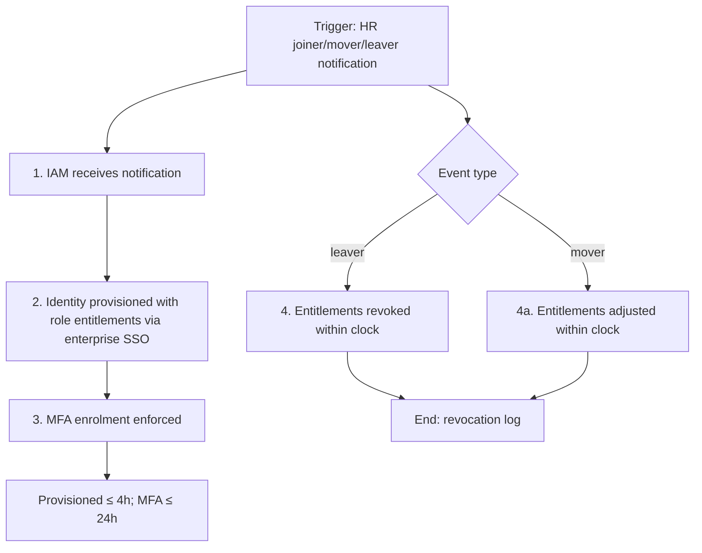
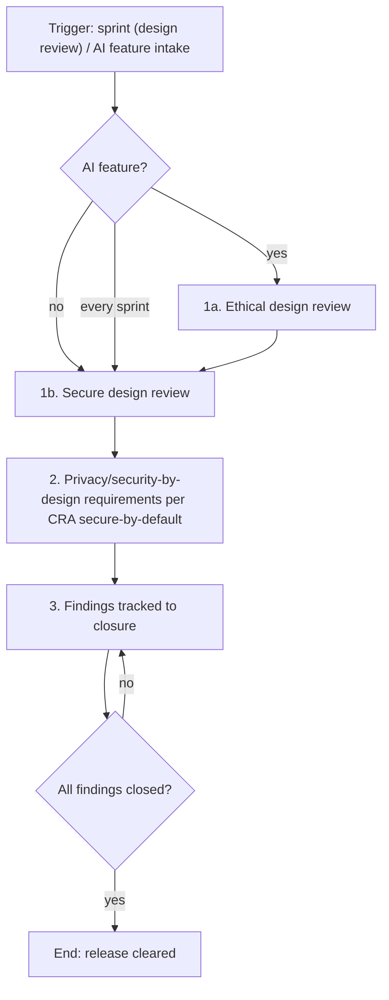
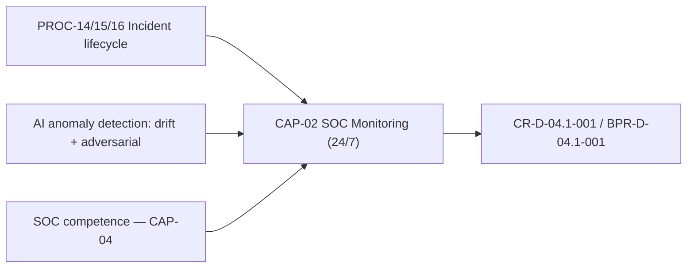
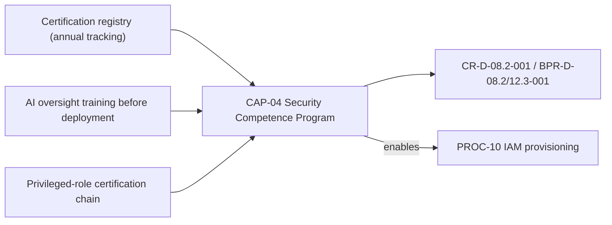

# Process & Capability Cards — Lane Pilot (Case_03)

> **Purpose.** Operational representation for the PROCESS and CAPABILITY lanes
> (rubric `00_METHODOLOGY/REALIZATION_CLASS_RUBRIC.md` v1.4 §5C). Process cards follow
> the NIST SP 800-218 (SSDF) practice/task shape; capability cards follow the C2M2 /
> ArchiMate capability semantics. Traceability chain: **RULE → CAP → PROC → UC**.
> These cards are companions to the catalogue cards in `Doc22_Use_Cases_Catalog.md`
> (same IDs). Piloted set: 4 of 47 re-laned ids (registry: `LANE_NAMING_CENSUS_v0.md`).

## PROC-10 — Identity and Access Manager Provisions User Identity

| Field | Content |
|---|---|
| Trigger | HR notification of joiner/mover/leaver event. |
| Activities | 1. IAM receives HR notification. 2. Identity provisioned with role-appropriate entitlements across systems, cloud services and AI platforms via enterprise SSO. 3. MFA enrolment enforced. 4. Leaver/mover: entitlements revoked or adjusted within the clock. |
| Roles | Identity and Access Manager (Primary); HR Manager (Secondary, source of truth for the event). |
| SLA / Timing | Identity provisioned within 4 hours of HR notification; MFA enrolled within 24 hours. |
| Realises | CR-D-03.1-001, BPR-D-03.1-001 / AG-D-03.1-002. |
| Anchors | SAMM: O-EM-B (environment stream B) · ASVS: V2.2 (general authenticator security), V4.1 (access control). |
| Evidence | Provisioning tickets with timestamps; MFA enrolment records; revocation logs. |

## PROC-28 — Software Development Manager Implements Secure-by-Design

| Field | Content |
|---|---|
| Trigger | Every sprint (design review); AI feature intake (ethical design review). |
| Activities | 1. Secure design review per sprint. 2. Privacy-by-design and security-by-design requirements applied per CRA secure-by-default standard. 3. AI model governance and ethical design review for AI features. 4. Findings tracked to closure before release. |
| Roles | Software Development Manager (Primary); AI ML Engineer (Secondary); Security Engineer (reviews). |
| SLA / Timing | Secure design review on every sprint; ethical design review for AI features. |
| Realises | CR-D-07.1-001, BPR-D-07.1-001 / AG-D-07.1-001, AG-D-03.4-002. |
| Anchors | SAMM: D-SA-A (architecture design) · SSDF PW.1 (design software with security in mind) · ASVS V1.1. |
| Evidence | Sprint design-review records; ethical-review minutes; finding-closure tracker. |

## CAP-02 — SOC Analyst Monitors Security Events

| Field | Content |
|---|---|
| Owner | AI Operations Manager (accountable) with SOC Analyst team (operational). |
| Span | Standing 24/7 automated incident detection and triage including AI anomaly detection for model drift and adversarial attacks. Contributes: PROC-14/15/16 (incident lifecycle PROCs), U.C. monitoring stack (SYS), SOC competence curriculum (CAP-04). |
| Maturity | Scale A (posture model v1.6, `capability` scale); current/target to be bound to EvidenceItems (P1 Folio VIII) in the next maturity refresh. |
| Realises | CR-D-04.1-001, BPR-D-04.1-001. |
| Anchors | SAMM: O-EM-A (environment management, stream A) · ASVS: V7 (logging) — monitoring outcomes. |
| Evidence | Coverage rosters; detection/triage dashboards; drift and adversarial-alert reports. |

## CAP-04 — HR Manager Maintains Security Competence Program

| Field | Content |
|---|---|
| Owner | HR Manager (Primary); Training Manager (Secondary). |
| Span | Role-specific security competence programmes with mandatory certification for privileged roles and AI human-oversight procedures. Contributes: CAP-06 (asset inventory competence linkage), role certification chain; feeds PROC-10 (provisioning requires certification). |
| Maturity | Scale A (posture model v1.6, `capability` scale); current/target to be bound to EvidenceItems (P1 Folio VIII) in the next maturity refresh. |
| Realises | CR-D-08.2-001, BPR-D-08.2-001, BPR-D-12.3-001. |
| Anchors | SAMM: G-EG-A/B (education & guidance) · ISO 27002:2022 A.6.3. |
| Evidence | Certification registry (annual tracking); AI-oversight training completion before deployment; programme curricula. |

