# Process & Capability Cards — Lane Pilot (Case_03)

> **Purpose.** Operational representation for the PROCESS and CAPABILITY lanes
> (rubric `00_METHODOLOGY/REALIZATION_CLASS_RUBRIC.md` v1.4 §5C). Process cards follow
> the NIST SP 800-218 (SSDF) practice/task shape; capability cards follow the C2M2 /
> ArchiMate capability semantics. Traceability chain: **RULE → CAP → PROC → UC**.
> These cards are companions to the catalogue cards in `Doc22_Use_Cases_Catalog.md`
> (same IDs). Piloted set: 4 of 47 re-laned ids (registry: `LANE_NAMING_CENSUS_v0.md`).

## PROC-10 — Identity and Access Manager Provisions User Identity

| Field | Content |
|---|---|
| Trigger | HR notification of joiner/mover/leaver event. |
| Activities | 1. IAM receives HR notification. 2. Identity provisioned with role-appropriate entitlements across systems, cloud services and AI platforms via enterprise SSO. 3. MFA enrolment enforced. 4. Leaver/mover: entitlements revoked or adjusted within the clock. |
| Roles | Identity and Access Manager (Primary); HR Manager (Secondary, source of truth for the event). |
| SLA / Timing | Identity provisioned within 4 hours of HR notification; MFA enrolled within 24 hours. |
| Realises | CR-D-03.1-001, BPR-D-03.1-001 / AG-D-03.1-002. |
| Anchors | SAMM: O-EM-B (environment stream B) · ASVS: V2.2 (general authenticator security), V4.1 (access control). |
| Evidence | Provisioning tickets with timestamps; MFA enrolment records; revocation logs. |

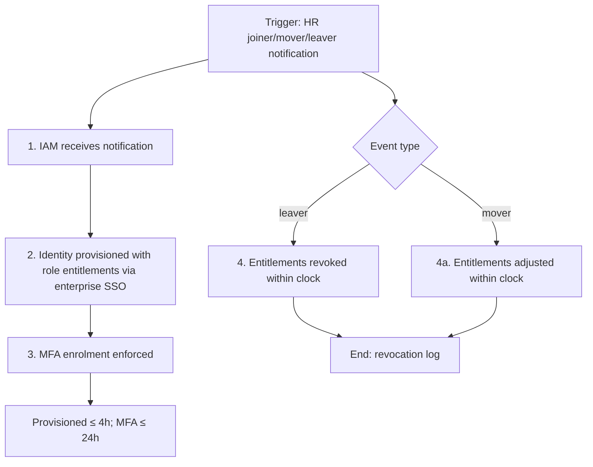
```mermaid
flowchart TD
    T["Trigger: HR joiner/mover/leaver notification"] --> A1["1. IAM receives notification"]
    A1 --> A2["2. Identity provisioned with role entitlements via enterprise SSO"]
    A2 --> A3["3. MFA enrolment enforced"]
    A3 --> E1["Provisioned ≤ 4h; MFA ≤ 24h"]
    T --> D1{"Event type"}
    D1 -->|"leaver"| A4["4. Entitlements revoked within clock"]
    D1 -->|"mover"| A5["4a. Entitlements adjusted within clock"]
    A4 --> E2["End: revocation log"]
    A5 --> E2
```

## PROC-28 — Software Development Manager Implements Secure-by-Design

| Field | Content |
|---|---|
| Trigger | Every sprint (design review); AI feature intake (ethical design review). |
| Activities | 1. Secure design review per sprint. 2. Privacy-by-design and security-by-design requirements applied per CRA secure-by-default standard. 3. AI model governance and ethical design review for AI features. 4. Findings tracked to closure before release. |
| Roles | Software Development Manager (Primary); AI ML Engineer (Secondary); Security Engineer (reviews). |
| SLA / Timing | Secure design review on every sprint; ethical design review for AI features. |
| Realises | CR-D-07.1-001, BPR-D-07.1-001 / AG-D-07.1-001, AG-D-03.4-002. |
| Anchors | SAMM: D-SA-A (architecture design) · SSDF PW.1 (design software with security in mind) · ASVS V1.1. |
| Evidence | Sprint design-review records; ethical-review minutes; finding-closure tracker. |

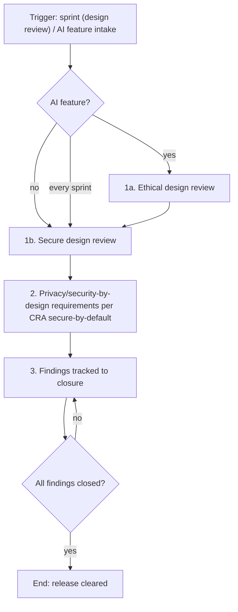
```mermaid
flowchart TD
    T["Trigger: sprint (design review) / AI feature intake"] --> D1{"AI feature?"}
    D1 -->|"yes"| A1["1a. Ethical design review"]
    D1 -->|"no"| A2
    D1 -->|"every sprint"| A2["1b. Secure design review"]
    A1 --> A2
    A2 --> A3["2. Privacy/security-by-design requirements per CRA secure-by-default"]
    A3 --> A4["3. Findings tracked to closure"]
    A4 --> D2{"All findings closed?"}
    D2 -->|"no"| A4
    D2 -->|"yes"| E["End: release cleared"]
```

## CAP-02 — SOC Analyst Monitors Security Events

| Field | Content |
|---|---|
| Owner | AI Operations Manager (accountable) with SOC Analyst team (operational). |
| Span | Standing 24/7 automated incident detection and triage including AI anomaly detection for model drift and adversarial attacks. Contributes: PROC-14/15/16 (incident lifecycle PROCs), U.C. monitoring stack (SYS), SOC competence curriculum (CAP-04). |
| Maturity | Scale A (posture model v1.6, `capability` scale); current/target to be bound to EvidenceItems (P1 Folio VIII) in the next maturity refresh. |
| Realises | CR-D-04.1-001, BPR-D-04.1-001. |
| Anchors | SAMM: O-EM-A (environment management, stream A) · ASVS: V7 (logging) — monitoring outcomes. |
| Evidence | Coverage rosters; detection/triage dashboards; drift and adversarial-alert reports. |

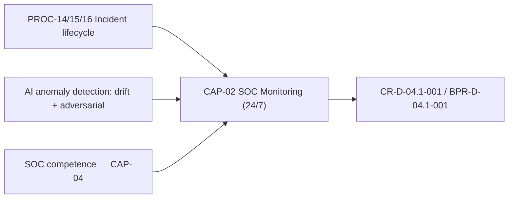
```mermaid
graph LR
    CAP["CAP-02 SOC Monitoring (24/7)"] --> R1["CR-D-04.1-001 / BPR-D-04.1-001"]
    P1["PROC-14/15/16 Incident lifecycle"] --> CAP
    A1["AI anomaly detection: drift + adversarial"] --> CAP
    C1["SOC competence — CAP-04"] --> CAP
```

## CAP-04 — HR Manager Maintains Security Competence Program

| Field | Content |
|---|---|
| Owner | HR Manager (Primary); Training Manager (Secondary). |
| Span | Role-specific security competence programmes with mandatory certification for privileged roles and AI human-oversight procedures. Contributes: CAP-06 (asset inventory competence linkage), role certification chain; feeds PROC-10 (provisioning requires certification). |
| Maturity | Scale A (posture model v1.6, `capability` scale); current/target to be bound to EvidenceItems (P1 Folio VIII) in the next maturity refresh. |
| Realises | CR-D-08.2-001, BPR-D-08.2-001, BPR-D-12.3-001. |
| Anchors | SAMM: G-EG-A/B (education & guidance) · ISO 27002:2022 A.6.3. |
| Evidence | Certification registry (annual tracking); AI-oversight training completion before deployment; programme curricula. |
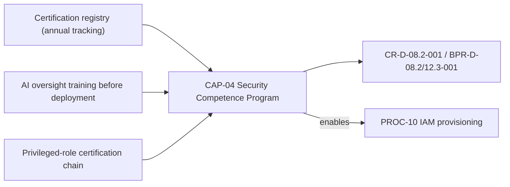
```mermaid
graph LR
    CAP["CAP-04 Security Competence Program"] --> R1["CR-D-08.2-001 / BPR-D-08.2/12.3-001"]
    P1["Certification registry (annual tracking)"] --> CAP
    P2["AI oversight training before deployment"] --> CAP
    P3["Privileged-role certification chain"] --> CAP
    CAP -->|"enables"| PROC10["PROC-10 IAM provisioning"]
```

## PROC-01 — Data Subject Requests Data Encryption Status

| Field | Content |
|---|---|
| Trigger | Data subject queries the encryption status of their stored personal and financial data. |
| Activities | 1. Request received and identity verified. 2. Encryption status of the data subject's stored records queried. 3. Response compiled and returned within the clock. |
| Roles | Data Subject (Primary); Data Protection Officer (Secondary). |
| SLA / Timing | Response within 72 hours per GDPR Art. 12. |
| Realises | CR-D-01.1-001 |
| Anchors | SAMM: O-OM-A (data protection) · ASVS: V8 (data protection). |
| Evidence | Request/response records with timestamps (activities derived from description + rules — catalogue card is a summary). |

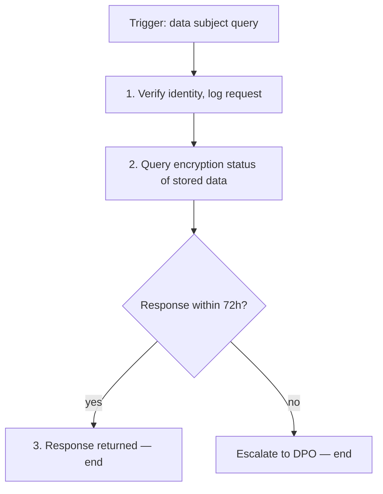
```mermaid
flowchart TD
    T["Trigger: data subject query"] --> A1["1. Verify identity, log request"]
    A1 --> A2["2. Query encryption status of stored data"]
    A2 --> D1{"Response within 72h?"}
    D1 -->|"yes"| E["3. Response returned — end"]
    D1 -->|"no"| ESC["Escalate to DPO — end"]
```

## PROC-02 — Cryptographic Officer Manages HSM Key Lifecycle

| Field | Content |
|---|---|
| Trigger | Key lifecycle schedule (generation/rotation); compromise or end-of-life event (revocation/destruction). |
| Activities | 1. Keys generated in HSM. 2. Scheduled rotation executed. 3. Compromised keys revoked. 4. End-of-life keys destroyed — full audit trail maintained throughout. |
| Roles | Cryptographic Officer (Primary); Security Auditor (Secondary). |
| SLA / Timing | Key rotation every 90 days; revocation within 4 hours of compromise. |
| Realises | CR-D-01.3-001 |
| Anchors | SAMM: O-OM-A (data protection) · ASVS: V6 (stored cryptography). |
| Evidence | HSM key-lifecycle logs; rotation and revocation audit trail (activities derived from description + rules — catalogue card is a summary). |

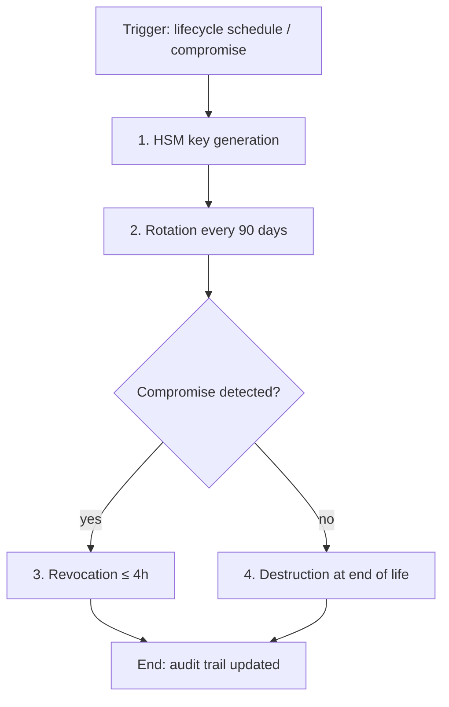
```mermaid
flowchart TD
    T["Trigger: lifecycle schedule / compromise"] --> A1["1. HSM key generation"]
    A1 --> A2["2. Rotation every 90 days"]
    A2 --> D1{"Compromise detected?"}
    D1 -->|"yes"| A3["3. Revocation ≤ 4h"]
    D1 -->|"no"| A4["4. Destruction at end of life"]
    A3 --> E["End: audit trail updated"]
    A4 --> E
```

## PROC-03 — AI System Administrator Validates AI Model Integrity

| Field | Content |
|---|---|
| Trigger | Every AI model load. |
| Activities | 1. Model checksum computed and compared against baseline. 2. Version-control provenance verified. 3. Manipulation or unauthorised change checked. 4. Anomalies reported. |
| Roles | AI System Administrator (Primary); Security Architect (Secondary). |
| SLA / Timing | Integrity check on every model load; anomalies reported within 1 hour. |
| Realises | CR-D-01.4-001 |
| Anchors | SAMM: O-EM-A (configuration hardening) · ASVS: V6 (stored cryptography), V14 (configuration). |
| Evidence | Integrity-check records per model load; anomaly reports (activities derived from description + rules — catalogue card is a summary). |

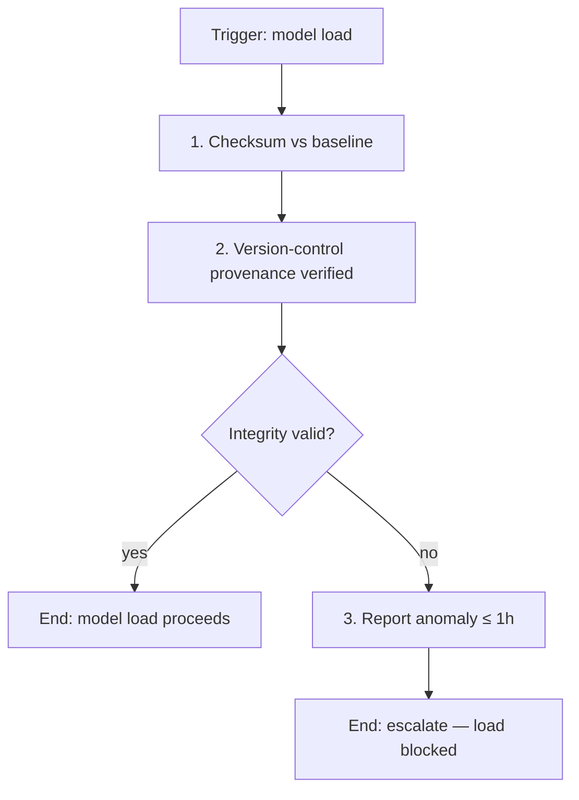
```mermaid
flowchart TD
    T["Trigger: model load"] --> A1["1. Checksum vs baseline"]
    A1 --> A2["2. Version-control provenance verified"]
    A2 --> D1{"Integrity valid?"}
    D1 -->|"yes"| E["End: model load proceeds"]
    D1 -->|"no"| A3["3. Report anomaly ≤ 1h"]
    A3 --> ESC["End: escalate — load blocked"]
```

## PROC-04 — Security Officer Rotates Cryptographic Keys

| Field | Content |
|---|---|
| Trigger | Defined rotation schedule; compromise event (manual rotation). |
| Activities | 1. Automated key rotation executed per schedule. 2. HSM validation of new keys. 3. Audit logging of the rotation event. |
| Roles | Security Officer (Primary); Cryptographic Officer (Secondary). |
| SLA / Timing | Automated rotation every 90 days; manual rotation on compromise. |
| Realises | CR-D-01.3-001 |
| Anchors | SAMM: O-OM-A (data protection) · ASVS: V6 (stored cryptography). |
| Evidence | Rotation logs; HSM validation records (activities derived from description + rules — catalogue card is a summary). |

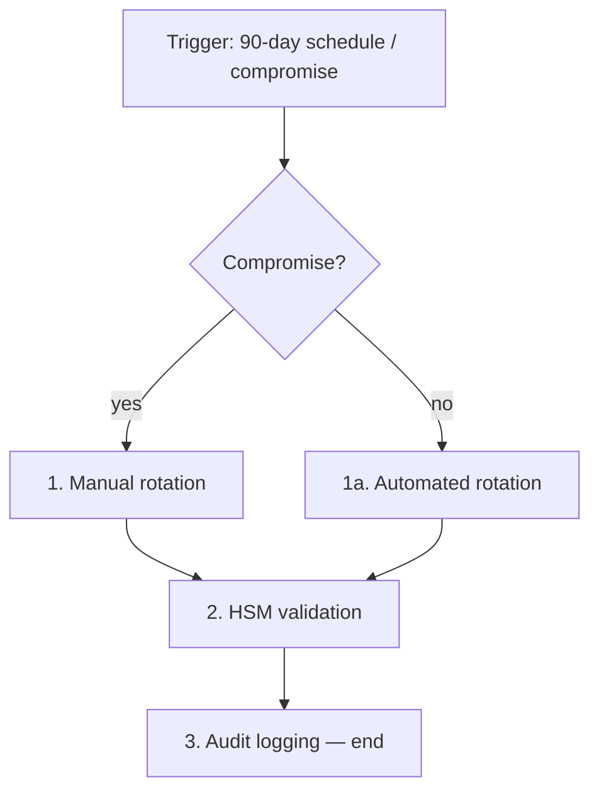
```mermaid
flowchart TD
    T["Trigger: 90-day schedule / compromise"] --> D1{"Compromise?"}
    D1 -->|"yes"| A1["1. Manual rotation"]
    D1 -->|"no"| A2["1a. Automated rotation"]
    A1 --> A3["2. HSM validation"]
    A2 --> A3
    A3 --> A4["3. Audit logging — end"]
```

## PROC-05 — Security Operations Manager Scans for Vulnerabilities

| Field | Content |
|---|---|
| Trigger | Weekly scan schedule (continuous automated scanning). |
| Activities | 1. Automated vulnerability scan across production systems and AI platforms. 2. Findings scored and triaged. 3. Critical findings routed to remediation. |
| Roles | Security Operations Manager (Primary); System Administrator (Secondary). |
| SLA / Timing | Weekly scans; Critical findings remediated within 72 hours. |
| Realises | CR-D-02.1-001 |
| Anchors | SAMM: V-ST-A (scalable baseline) · ASVS: V14 (configuration). |
| Evidence | Weekly scan reports; remediation tickets with timestamps (activities derived from description + rules — catalogue card is a summary). |

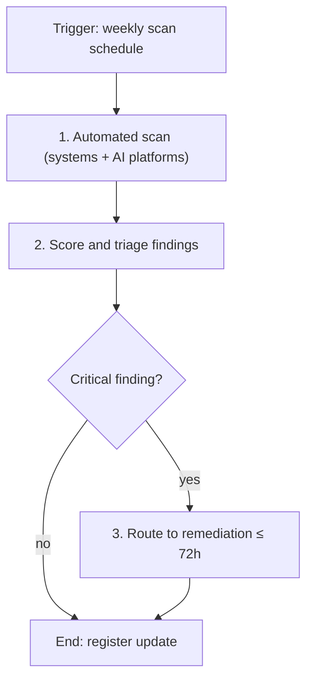
```mermaid
flowchart TD
    T["Trigger: weekly scan schedule"] --> A1["1. Automated scan (systems + AI platforms)"]
    A1 --> A2["2. Score and triage findings"]
    A2 --> D1{"Critical finding?"}
    D1 -->|"yes"| A3["3. Route to remediation ≤ 72h"]
    D1 -->|"no"| E["End: register update"]
    A3 --> E
```

## PROC-06 — Security Operations Manager Deploys Critical Patches

| Field | Content |
|---|---|
| Trigger | Patch release for a critical vulnerability. |
| Activities | 1. Automated patch management triggered. 2. Patches deployed across systems, AI models, and firmware. 3. Deployment verified within the 72-hour SLA. |
| Roles | Security Operations Manager (Primary); System Administrator (Secondary). |
| SLA / Timing | Critical patches deployed within 72 hours of release. |
| Realises | CR-D-02.2-001 |
| Anchors | SAMM: O-EM-B (patching and updating) · ASVS: V14 (configuration). |
| Evidence | Patch deployment records; SLA compliance reports (activities derived from description + rules — catalogue card is a summary). |

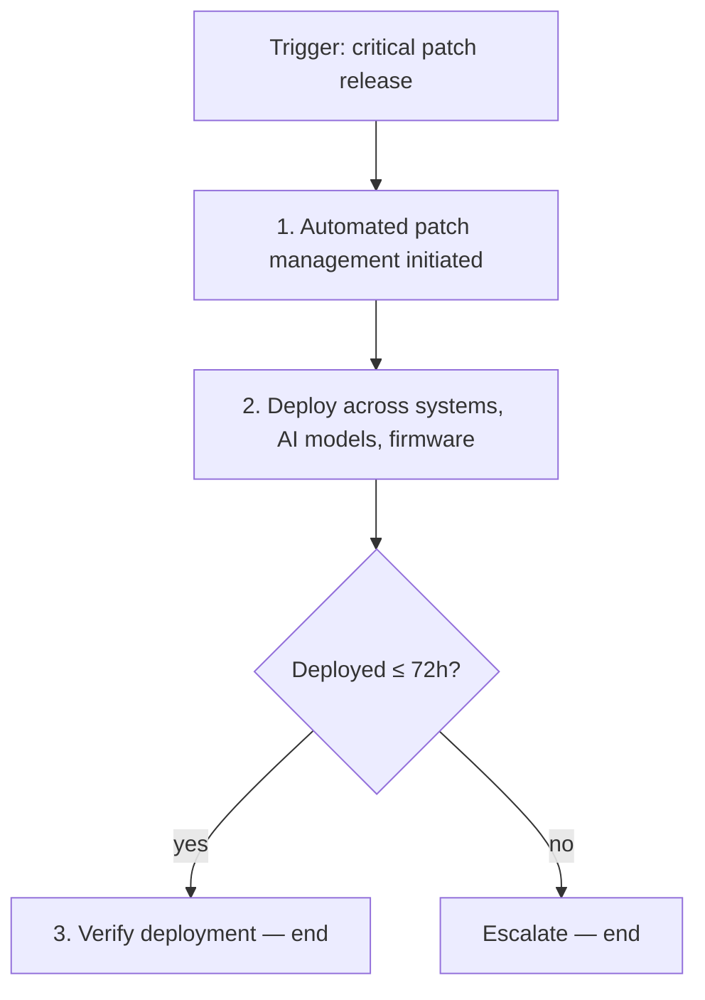
```mermaid
flowchart TD
    T["Trigger: critical patch release"] --> A1["1. Automated patch management initiated"]
    A1 --> A2["2. Deploy across systems, AI models, firmware"]
    A2 --> D1{"Deployed ≤ 72h?"}
    D1 -->|"yes"| E["3. Verify deployment — end"]
    D1 -->|"no"| ESC["Escalate — end"]
```

## PROC-07 — Security Analyst Coordinates Vulnerability Disclosure

| Field | Content |
|---|---|
| Trigger | Vulnerability intake via public-facing disclosure channel. |
| Activities | 1. Report received and validated. 2. Coordinated disclosure operated per policy. 3. Critical incidents reported to ENISA/CSIRT. 4. Public advisory published. |
| Roles | Security Analyst (Primary); ENISA/CSIRT (Secondary). |
| SLA / Timing | Critical disclosure within 24 hours; public advisory within 90 days. |
| Realises | CR-D-02.3-001 |
| Anchors | SAMM: O-IM-B (incident response) · SAMM-only with note: ASVS does not map (disclosure governance is out of ASVS scope). |
| Evidence | Disclosure records; ENISA/CSIRT notification receipts; advisory copies (activities derived from description + rules — catalogue card is a summary). |

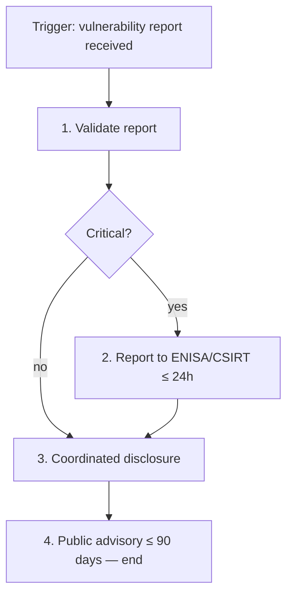
```mermaid
flowchart TD
    T["Trigger: vulnerability report received"] --> A1["1. Validate report"]
    A1 --> D1{"Critical?"}
    D1 -->|"yes"| A2["2. Report to ENISA/CSIRT ≤ 24h"]
    D1 -->|"no"| A3["3. Coordinated disclosure"]
    A2 --> A3
    A3 --> A4["4. Public advisory ≤ 90 days — end"]
```

## PROC-08 — Penetration Tester Executes Threat-Led Penetration Testing

| Field | Content |
|---|---|
| Trigger | Annual TLPT schedule (per DORA RTS). |
| Activities | 1. TLPT executed per DORA RTS. 2. AI bias testing performed. 3. Adversarial robustness and model inversion resistance tested. 4. Findings tracked to remediation. |
| Roles | Penetration Tester (Primary); CISO (Secondary); AI Security Analyst (Secondary). |
| SLA / Timing | Annual execution; findings remediated within 30 days. |
| Realises | CR-D-02.4-001, BPR-D-02.4-001, BPR-D-12.1-001 |
| Anchors | SAMM: V-RT-B (misuse/abuse testing) · SAMM-only with note: ASVS does not map (TLPT execution is out of ASVS scope). |
| Evidence | TLPT reports; remediation tracker (activities derived from description + rules — catalogue card is a summary). |

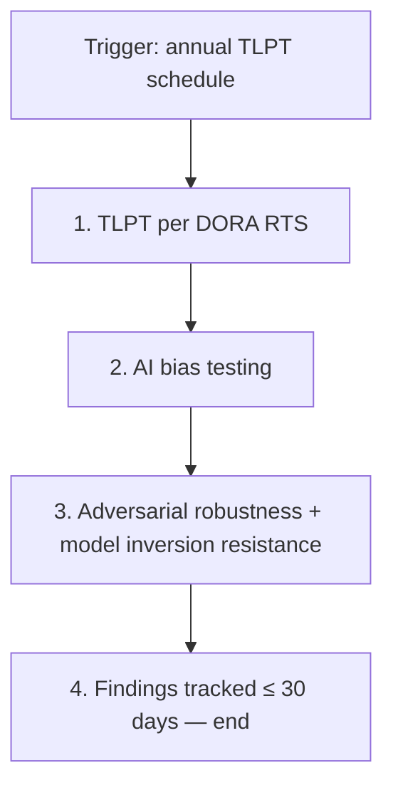
```mermaid
flowchart TD
    T["Trigger: annual TLPT schedule"] --> A1["1. TLPT per DORA RTS"]
    A1 --> A2["2. AI bias testing"]
    A2 --> A3["3. Adversarial robustness + model inversion resistance"]
    A3 --> A4["4. Findings tracked ≤ 30 days — end"]
```

## PROC-09 — AI Security Analyst Assesses AI Model Vulnerabilities

| Field | Content |
|---|---|
| Trigger | Quarterly assessment schedule. |
| Activities | 1. Model vulnerabilities assessed per MITRE ATLAS. 2. Data poisoning scenarios evaluated. 3. Model evasion and adversarial attack vectors tested. 4. Critical findings reported. |
| Roles | AI Security Analyst (Primary); Security Architect (Secondary). |
| SLA / Timing | Quarterly assessment; critical findings within 30 days. |
| Realises | CR-D-02.1-001, BPR-D-12.4-001 |
| Anchors | SAMM: V-RT-B (misuse/abuse testing) · SAMM-only with note: ASVS does not map (AI/ATLAS threat classes out of ASVS scope). |
| Evidence | ATLAS-aligned assessment reports; critical-finding tickets (activities derived from description + rules — catalogue card is a summary). |

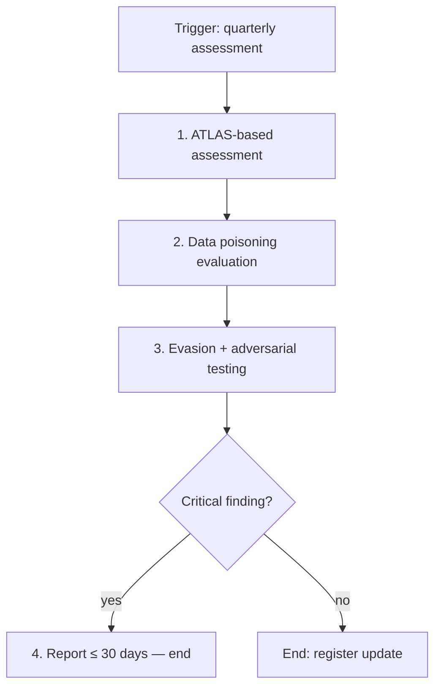
```mermaid
flowchart TD
    T["Trigger: quarterly assessment"] --> A1["1. ATLAS-based assessment"]
    A1 --> A2["2. Data poisoning evaluation"]
    A2 --> A3["3. Evasion + adversarial testing"]
    A3 --> D1{"Critical finding?"}
    D1 -->|"yes"| A4["4. Report ≤ 30 days — end"]
    D1 -->|"no"| E["End: register update"]
```

## PROC-11 — Identity and Access Manager Conducts Quarterly Access Review

| Field | Content |
|---|---|
| Trigger | Quarterly review schedule. |
| Activities | 1. Entitlements reviewed across all systems including AI model and training data access. 2. Least privilege enforced. 3. Excess access revoked. |
| Roles | Identity and Access Manager (Primary); Security Administrator (Secondary). |
| SLA / Timing | Quarterly review completed within 5 business days; access revoked within 24 hours of finding. |
| Realises | CR-D-03.3-001, BPR-D-03.3-001 |
| Anchors | SAMM: V-RT-A (control verification) · ASVS: V4 (access control). |
| Evidence | Review completion records; revocation tickets with timestamps (activities derived from description + rules — catalogue card is a summary). |

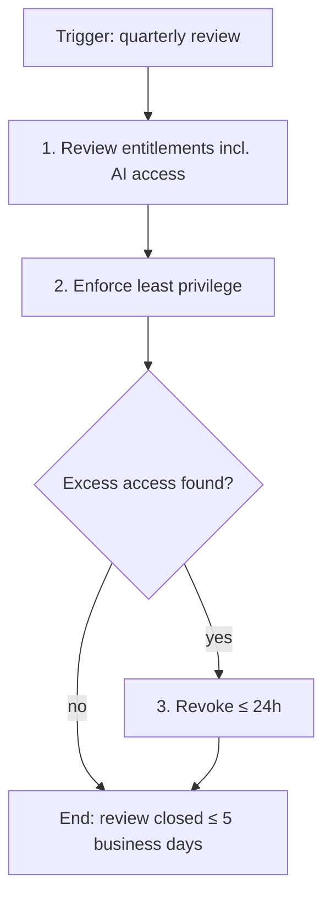
```mermaid
flowchart TD
    T["Trigger: quarterly review"] --> A1["1. Review entitlements incl. AI access"]
    A1 --> A2["2. Enforce least privilege"]
    A2 --> D1{"Excess access found?"}
    D1 -->|"yes"| A3["3. Revoke ≤ 24h"]
    D1 -->|"no"| E["End: review closed ≤ 5 business days"]
    A3 --> E
```

## PROC-12 — Security Administrator Hardens System Configuration

| Field | Content |
|---|---|
| Trigger | Configuration baseline application; monthly compliance verification. |
| Activities | 1. Secure default configuration applied per CIS Benchmarks. 2. Unused services, ports and protocols disabled. 3. AI inference endpoints hardened. 4. Compliance verified monthly. |
| Roles | Security Administrator (Primary); System Administrator (Secondary). |
| SLA / Timing | Configuration baseline applied within 60 days; monthly compliance verification. |
| Realises | CR-D-03.4-001, BPR-D-03.4-001 |
| Anchors | SAMM: O-EM-A (configuration hardening) · ASVS: V14 (configuration). |
| Evidence | Baseline application records; monthly verification reports (activities derived from description + rules — catalogue card is a summary). |

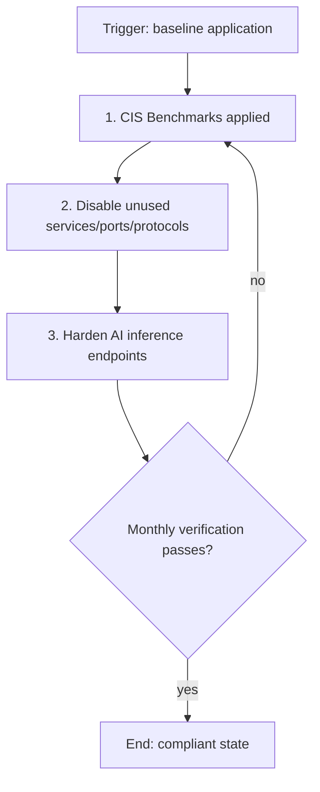
```mermaid
flowchart TD
    T["Trigger: baseline application"] --> A1["1. CIS Benchmarks applied"]
    A1 --> A2["2. Disable unused services/ports/protocols"]
    A2 --> A3["3. Harden AI inference endpoints"]
    A3 --> D1{"Monthly verification passes?"}
    D1 -->|"no"| A1
    D1 -->|"yes"| E["End: compliant state"]
```

## PROC-13 — Identity and Access Manager Deprovisions User Access

| Field | Content |
|---|---|
| Trigger | HR notification of leaver event. |
| Activities | 1. HR notification received via automated HR system integration. 2. Access deprovisioned. 3. Residual access removed and confirmed. |
| Roles | Identity and Access Manager (Primary); HR Manager (Secondary). |
| SLA / Timing | Deprovisioning completed within 24 hours; all access removed within 48 hours. |
| Realises | CR-D-03.1-001, BPR-D-03.1-001 |
| Anchors | SAMM: O-EM-A (configuration hardening) · ASVS: V2 (authentication), V4 (access control). |
| Evidence | Deprovisioning logs with timestamps; residual-access confirmation (activities derived from description + rules — catalogue card is a summary). |

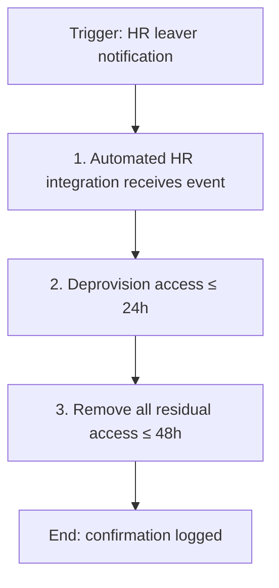
```mermaid
flowchart TD
    T["Trigger: HR leaver notification"] --> A1["1. Automated HR integration receives event"]
    A1 --> A2["2. Deprovision access ≤ 24h"]
    A2 --> A3["3. Remove all residual access ≤ 48h"]
    A3 --> E["End: confirmation logged"]
```

## PROC-14 — Business Continuity Manager Triggers Disaster Recovery

| Field | Content |
|---|---|
| Trigger | Disaster event affecting critical financial systems. |
| Activities | 1. Disaster recovery invoked. 2. Failover to redundant systems including AI system failover. 3. Recovery validated against RTO/RPO. 4. Failover tested semi-annually. |
| Roles | Business Continuity Manager (Primary); IT Operations Manager (Secondary). |
| SLA / Timing | RTO <= 4 hours; RPO <= 1 hour; failover tested semi-annually. |
| Realises | CR-D-04.2-001, BPR-D-04.2-001 |
| Anchors | SAMM: O-IM-B (incident response) · SAMM-only with note: ASVS does not map (business continuity out of ASVS scope). |
| Evidence | DR invocation and recovery records with RTO/RPO metrics; semi-annual test reports (activities derived from description + rules — catalogue card is a summary). |

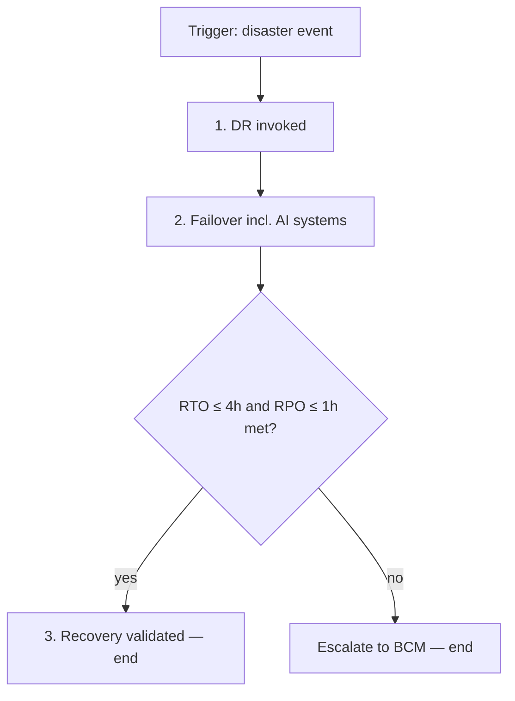
```mermaid
flowchart TD
    T["Trigger: disaster event"] --> A1["1. DR invoked"]
    A1 --> A2["2. Failover incl. AI systems"]
    A2 --> D1{"RTO ≤ 4h and RPO ≤ 1h met?"}
    D1 -->|"yes"| E["3. Recovery validated — end"]
    D1 -->|"no"| ESC["Escalate to BCM — end"]
```

## PROC-15 — Compliance Officer Executes Universal Incident Notification

| Field | Content |
|---|---|
| Trigger | Confirmed incident requiring regulatory notification. |
| Activities | 1. Incident classified against regulatory triggers. 2. Universal 24h workflow executed with regulation-specific annexes (GDPR 72h, CRA 24h, NIS 2 24h, DORA 4h+72h, AI Act 15d). 3. All regulators notified within respective SLAs. |
| Roles | Compliance Officer (Primary); Legal Counsel (Secondary); DPO (Secondary). |
| SLA / Timing | DORA 4h initial report; GDPR 72h follow-up; all regulatory bodies notified within respective SLAs. |
| Realises | CR-D-04.3-001, BPR-D-04.3-001 |
| Anchors | SAMM: O-IM-B (incident response) · ASVS: V7 (error handling and logging) — notification evidence. |
| Evidence | Notification records with per-regulator timestamps (activities derived from description + rules — catalogue card is a summary; resolves T-001). |

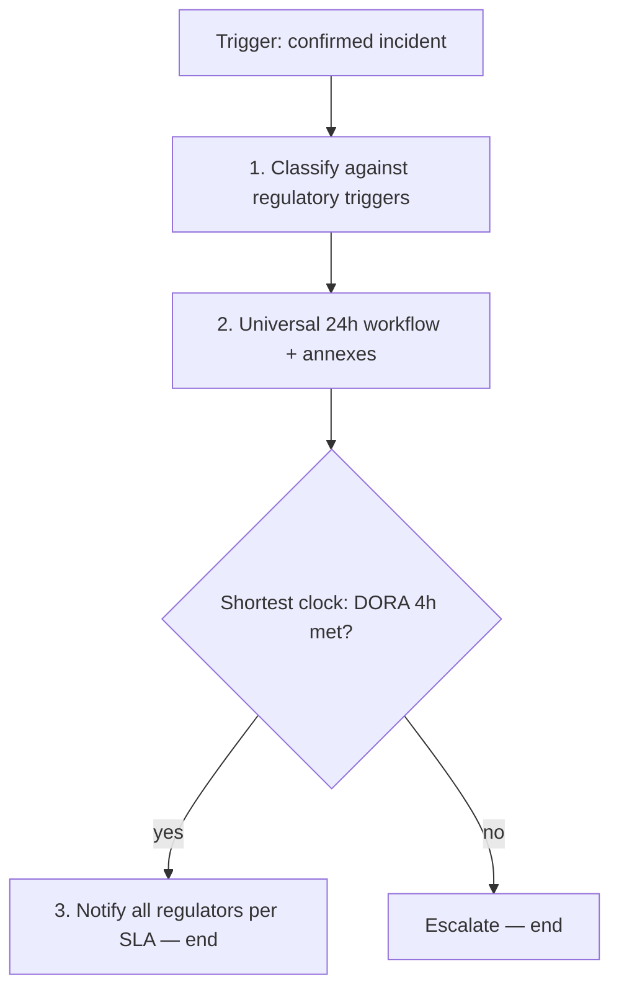
```mermaid
flowchart TD
    T["Trigger: confirmed incident"] --> A1["1. Classify against regulatory triggers"]
    A1 --> A2["2. Universal 24h workflow + annexes"]
    A2 --> D1{"Shortest clock: DORA 4h met?"}
    D1 -->|"yes"| A3["3. Notify all regulators per SLA — end"]
    D1 -->|"no"| ESC["Escalate — end"]
```

## PROC-16 — AI Operations Manager Recovers AI System after Failure

| Field | Content |
|---|---|
| Trigger | AI system failure. |
| Activities | 1. Model restored from immutable backup. 2. Data pipelines recovered. 3. Inference service resumed. 4. Recovery validated. |
| Roles | AI Operations Manager (Primary); Business Continuity Manager (Secondary). |
| SLA / Timing | AI service recovery within 2 hours; model restoration within 30 minutes from checkpoint. |
| Realises | CR-D-04.2-001, CR-D-04.4-001 |
| Anchors | SAMM: O-IM-B (incident response) · SAMM-only with note: ASVS does not map (recovery/continuity out of ASVS scope). |
| Evidence | Recovery records with timestamps; checkpoint restoration logs (activities derived from description + rules — catalogue card is a summary). |

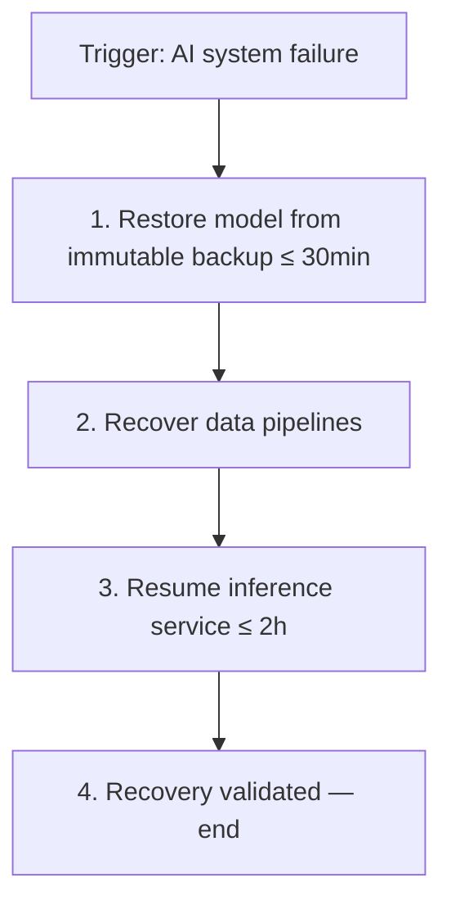
```mermaid
flowchart TD
    T["Trigger: AI system failure"] --> A1["1. Restore model from immutable backup ≤ 30min"]
    A1 --> A2["2. Recover data pipelines"]
    A2 --> A3["3. Resume inference service ≤ 2h"]
    A3 --> E["4. Recovery validated — end"]
```

## PROC-17 — SOC Analyst Investigates AI Model Anomaly

| Field | Content |
|---|---|
| Trigger | AI model anomaly detected by monitoring (drift, adversarial manipulation, data quality). |
| Activities | 1. Investigation started. 2. Anomaly triaged against drift/manipulation/data-quality categories. 3. Root cause identified. 4. Findings handed to response. |
| Roles | SOC Analyst (Primary); AI Security Analyst (Secondary). |
| SLA / Timing | Investigation started within 15 minutes; root cause identified within 4 hours. |
| Realises | CR-D-04.1-001, CR-D-10.1-001, BPR-D-12.2-001 |
| Anchors | SAMM: O-IM-A (incident detection) · ASVS: V7 (error handling and logging). |
| Evidence | Investigation tickets with timestamps; root-cause reports (activities derived from description + rules — catalogue card is a summary). |

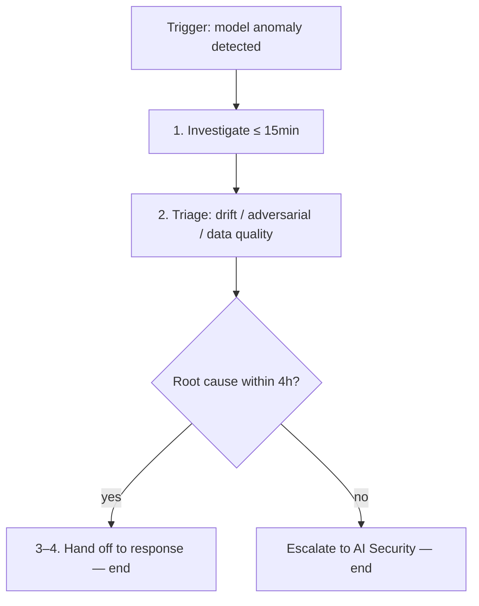
```mermaid
flowchart TD
    T["Trigger: model anomaly detected"] --> A1["1. Investigate ≤ 15min"]
    A1 --> A2["2. Triage: drift / adversarial / data quality"]
    A2 --> D1{"Root cause within 4h?"}
    D1 -->|"yes"| E["3–4. Hand off to response — end"]
    D1 -->|"no"| ESC["Escalate to AI Security — end"]
```

## PROC-18 — Incident Response Team Conducts Tabletop Exercise

| Field | Content |
|---|---|
| Trigger | Quarterly exercise schedule. |
| Activities | 1. Cross-functional tabletop exercise conducted (security, legal, compliance, communications, AI governance). 2. Response decisions rehearsed. 3. Lessons learned documented. |
| Roles | Incident Response Team Lead (Primary); CISO (Secondary). |
| SLA / Timing | Quarterly exercises; lessons learned documented within 5 business days. |
| Realises | BPR-D-04.1-001, BPR-D-04.3-001 |
| Anchors | SAMM: O-IM-B (incident response) · SAMM-only with note: ASVS does not map (exercise governance out of ASVS scope). |
| Evidence | Exercise reports; lessons-learned documents (activities derived from description + rules — catalogue card is a summary). |

```mermaid
flowchart TD
    T["Trigger: quarterly schedule"] --> A1["1. Cross-functional tabletop"]
    A1 --> A2["2. Rehearse response decisions"]
    A2 --> A3["3. Document lessons ≤ 5 business days — end"]
```

## PROC-19 — Compliance Officer Reports AI Incident to Regulator

| Field | Content |
|---|---|
| Trigger | AI-specific incident: model failure, bias detection, or decision errors. |
| Activities | 1. AI incident assessed against AI Act and DORA triggers. 2. Report prepared with AI governance lead and DPO. 3. Relevant regulators notified. |
| Roles | Compliance Officer (Primary); AI Governance Lead (Secondary); DPO (Secondary). |
| SLA / Timing | AI Act: 15 days; DORA: 4h initial + 72h follow-up. |
| Realises | CR-D-04.3-001, AI-C26, AI-C29 |
| Anchors | SAMM: O-IM-B (incident response) · SAMM-only with note: ASVS does not map (regulatory reporting out of ASVS scope). |
| Evidence | Regulatory notification records with timestamps (activities derived from description + rules — catalogue card is a summary). |

```mermaid
flowchart TD
    T["Trigger: AI incident (failure/bias/error)"] --> A1["1. Assess AI Act + DORA triggers"]
    A1 --> A2["2. Prepare report with governance + DPO"]
    A2 --> D1{"DORA clock (4h) applicable?"}
    D1 -->|"yes"| A3["3a. Initial report ≤ 4h; follow-up ≤ 72h"]
    D1 -->|"no"| A4["3b. AI Act report ≤ 15 days"]
    A3 --> E["End: notification logged"]
    A4 --> E
```

## PROC-20 — Data Protection Officer Reviews Data Collection Minimization

| Field | Content |
|---|---|
| Trigger | Annual review; new processing activity (within 30 days). |
| Activities | 1. Data collection reviewed for minimization. 2. AI training data relevance and representativeness verified. 3. Prohibited bias proxies screened. 4. Findings recorded. |
| Roles | Data Protection Officer (Primary); AI Data Engineer (Secondary). |
| SLA / Timing | Annual review; new processing assessed within 30 days. |
| Realises | CR-D-05.1-001, BPR-D-05.1-001 |
| Anchors | SAMM: G-PC-B (compliance management) · ASVS: V8 (data protection). |
| Evidence | Minimization review records; bias-proxy screening results (activities derived from description + rules — catalogue card is a summary). |

```mermaid
flowchart TD
    T["Trigger: annual review / new processing"] --> A1["1. Review collection for minimization"]
    A1 --> A2["2. Verify training data relevance + representativeness"]
    A2 --> D1{"Prohibited bias proxy present?"}
    D1 -->|"yes"| A3["3. Flag and remediate"]
    D1 -->|"no"| E["4. Record findings — end"]
    A3 --> E
```

## PROC-21 — Compliance Officer Enforces Tiered Data Retention

| Field | Content |
|---|---|
| Trigger | Retention expiry per tier; retention violation event. |
| Activities | 1. Tiered retention enforced (10y financial, 5y operational, 6-month AI training logs). 2. Automated deletion on expiry. 3. Violations reported. |
| Roles | Compliance Officer (Primary); Data Protection Officer (Secondary). |
| SLA / Timing | Automated deletion on expiry; retention violations reported within 24 hours. |
| Realises | CR-D-05.2-001 |
| Anchors | SAMM: O-OM-A (data protection) · ASVS: V8 (data protection). |
| Evidence | Deletion logs per tier; violation reports (activities derived from description + rules — catalogue card is a summary). |

```mermaid
flowchart TD
    T["Trigger: retention expiry"] --> A1["1. Check tier (10y/5y/6mo)"]
    A1 --> A2["2. Automated deletion on expiry"]
    A2 --> D1{"Violation detected?"}
    D1 -->|"yes"| A3["3. Report ≤ 24h — end"]
    D1 -->|"no"| E["End: deletion logged"]
```

## PROC-22 — AI Data Engineer Manages AI Training Data Lifecycle

| Field | Content |
|---|---|
| Trigger | AI training run; data lifecycle stage transition. |
| Activities | 1. Collection and storage managed. 2. Training and inference logging performed. 3. Data lineage documented per training run. 4. Deletion per retention tier. |
| Roles | AI Data Engineer (Primary); Data Protection Officer (Secondary). |
| SLA / Timing | Data lineage documented on every training run; inference logs retained 6 months. |
| Realises | CR-D-05.1-001, CR-D-05.2-001 |
| Anchors | SAMM: O-OM-A (data protection) · ASVS: V8 (data protection). |
| Evidence | Lineage documentation per training run; inference log retention records (activities derived from description + rules — catalogue card is a summary). |

```mermaid
flowchart TD
    T["Trigger: training run / lifecycle stage"] --> A1["1. Collection + storage managed"]
    A1 --> A2["2. Training + inference logging"]
    A2 --> A3["3. Lineage documented per run"]
    A3 --> D1{"Retention expired (6mo logs)?"}
    D1 -->|"yes"| A4["4. Delete per tier — end"]
    D1 -->|"no"| E["End: retain within tier"]
```

## PROC-23 — Compliance Officer Audits Third-Party Data Processors

| Field | Content |
|---|---|
| Trigger | Annual audit schedule; erasure request requiring processor verification. |
| Activities | 1. Third-party data processors audited incl. AI model providers. 2. Erasure-request compliance verified. 3. Retention policy adherence checked. |
| Roles | Compliance Officer (Primary); Data Protection Officer (Secondary). |
| SLA / Timing | Annual audit; erasure compliance verified within 60 days of request. |
| Realises | CR-D-05.3-001, GDPR-C12 |
| Anchors | SAMM: D-SR-B (supplier security) · SAMM D-SR-B with note: ASVS does not map (third-party audit governance out of ASVS scope). |
| Evidence | Audit reports; erasure-compliance confirmations (activities derived from description + rules — catalogue card is a summary). |

```mermaid
flowchart TD
    T["Trigger: annual audit / erasure request"] --> A1["1. Audit processors incl. AI providers"]
    A1 --> A2["2. Verify erasure compliance ≤ 60d of request"]
    A2 --> A3["3. Check retention adherence — end"]
```

## PROC-24 — Vendor Risk Manager Assesses ICT Third-Party Provider

| Field | Content |
|---|---|
| Trigger | Pre-engagement; annual reassessment; quarterly for critical vendors. |
| Activities | 1. ICT third-party provider assessed using SIG or CAIQ. 2. AI model providers and data suppliers included. 3. Risk rating recorded before contract. |
| Roles | Vendor Risk Manager (Primary); Security Architect (Secondary). |
| SLA / Timing | Pre-engagement assessment before contract; annual reassessment; critical vendors quarterly. |
| Realises | CR-D-06.1-001, BPR-D-06.1-001 |
| Anchors | SAMM: D-SR-B (supplier security) · SAMM-only with note: ASVS does not map (vendor assessment governance out of ASVS scope). |
| Evidence | SIG/CAIQ assessment records; reassessment calendar (activities derived from description + rules — catalogue card is a summary). |

```mermaid
flowchart TD
    T["Trigger: pre-engagement / reassessment"] --> A1["1. SIG/CAIQ assessment"]
    A1 --> D1{"Critical vendor?"}
    D1 -->|"yes"| A2["2. Quarterly cadence"]
    D1 -->|"no"| A3["2a. Annual cadence"]
    A2 --> A4["3. Risk rating before contract — end"]
    A3 --> A4
```

## PROC-25 — Procurement Manager Enforces Security Contract Terms

| Field | Content |
|---|---|
| Trigger | Annual contract review; vendor breach event; audit-rights window. |
| Activities | 1. Contractual security obligations enforced (audit rights, 24h breach notification, DPAs, regulatory cooperation clauses). 2. Breach notification SLA tracked. 3. Audit rights exercised. |
| Roles | Procurement Manager (Primary); Legal Counsel (Secondary). |
| SLA / Timing | Contract review annually; breach notification SLA tracked; audit rights exercised triennially. |
| Realises | CR-D-06.3-001, BPR-D-06.3-001 |
| Anchors | SAMM: D-SR-B (supplier security) · SAMM-only with note: ASVS does not map (contract governance out of ASVS scope). |
| Evidence | Contract register with SLA tracking; audit-rights exercise records (activities derived from description + rules — catalogue card is a summary). |

```mermaid
flowchart TD
    T["Trigger: annual review / breach"] --> A1["1. Enforce obligations (audit, 24h notice, DPA)"]
    A1 --> D1{"Vendor breach?"}
    D1 -->|"yes"| A2["2. Check 24h notification SLA"]
    D1 -->|"no"| A3["2a. Continue SLA tracking"]
    A2 --> A4["3. Audit rights per triennial cycle — end"]
    A3 --> A4
```

## PROC-26 — Vendor Risk Manager Manages Vendor Exit

| Field | Content |
|---|---|
| Trigger | Annual exit-strategy cycle; concentration-risk review; vendor exit event. |
| Activities | 1. Documented exit strategies maintained for critical vendors. 2. AI model provider alternatives identified. 3. Data migration planned. 4. Exit strategies tested annually. |
| Roles | Vendor Risk Manager (Primary); IT Operations Manager (Secondary). |
| SLA / Timing | Exit strategies documented annually; tested annually; alternative provider identified for all critical services. |
| Realises | CR-D-06.4-001, BPR-D-06.4-001 |
| Anchors | SAMM: O-OM-B (system decommissioning / legacy management) · SAMM-only with note: ASVS does not map (exit strategy governance out of ASVS scope). |
| Evidence | Exit strategy documents; annual test records; alternative-provider register (activities derived from description + rules — catalogue card is a summary). |

```mermaid
flowchart TD
    T["Trigger: annual cycle / exit event"] --> A1["1. Maintain exit strategies (critical vendors)"]
    A1 --> A2["2. Identify AI provider alternatives"]
    A2 --> A3["3. Plan data migration"]
    A3 --> D1{"Tested this year?"}
    D1 -->|"yes"| E["End: strategy current"]
    D1 -->|"no"| A4["4. Execute annual test — end"]
```

## PROC-27 — Vendor Risk Manager Monitors AI Model Provider Performance

| Field | Content |
|---|---|
| Trigger | Quarterly performance review; monthly bias-metric reporting; SLA violation event. |
| Activities | 1. AI model provider performance monitored. 2. Bias metrics tracked. 3. Service levels reviewed with quarterly reporting to CISO. 4. SLA violations escalated. |
| Roles | Vendor Risk Manager (Primary); AI Operations Manager (Secondary). |
| SLA / Timing | Quarterly performance review; bias metrics reported monthly; SLA violations escalated within 48 hours. |
| Realises | CR-D-06.1-001, BPR-D-12.3-001 |
| Anchors | SAMM: D-SR-B (supplier security) · SAMM-only with note: ASVS does not map (provider performance governance out of ASVS scope). |
| Evidence | Quarterly CISO reports; monthly bias-metric reports; escalation records (activities derived from description + rules — catalogue card is a summary). |

```mermaid
flowchart TD
    T["Trigger: quarterly review / violation"] --> A1["1. Monitor performance + bias metrics"]
    A1 --> A2["2. Report to CISO quarterly"]
    A2 --> D1{"SLA violation?"}
    D1 -->|"yes"| A3["3. Escalate ≤ 48h — end"]
    D1 -->|"no"| E["End: metrics logged"]
```

## PROC-29 — Security Engineer Enforces Secure Coding Standards

| Field | Content |
|---|---|
| Trigger | Every commit (pipeline scan). |
| Activities | 1. Secure coding standards enforced per OWASP ASVS. 2. SAST/DAST run in all pipelines incl. AI code repositories and data pipeline code. 3. High/Critical findings block deployment. |
| Roles | Security Engineer (Primary); Software Development Manager (Secondary). |
| SLA / Timing | SAST/DAST on every commit; High/Critical findings block deployment. |
| Realises | CR-D-07.2-001, BPR-D-07.2-001 |
| Anchors | SAMM: G-PC-A (policy and standards), I-DM-A (defect tracking) · ASVS: V1.1 (secure development lifecycle), V5 (validation and encoding). |
| Evidence | Pipeline scan results per commit; blocked-deployment records (activities derived from description + rules — catalogue card is a summary). |

```mermaid
flowchart TD
    T["Trigger: commit"] --> A1["1. SAST/DAST on pipeline"]
    A1 --> D1{"High/Critical finding?"}
    D1 -->|"yes"| A2["2. Block deployment"]
    D1 -->|"no"| E["End: build proceeds"]
    A2 --> A3["3. Remediate and rescan"]
    A3 --> D1
```

## PROC-30 — Change Advisory Board Approves Production Change

| Field | Content |
|---|---|
| Trigger | Production change request (standard or emergency); AI model change. |
| Activities | 1. Change submitted to CAB. 2. Dual control approval applied with independent oversight. 3. AI model changes included in scope. 4. Approval recorded. |
| Roles | Change Advisory Board (Primary); Release Manager (Secondary). |
| SLA / Timing | Emergency changes approved within 2 hours; standard changes reviewed within 5 business days. |
| Realises | CR-D-07.4-001, BPR-D-07.4-001 |
| Anchors | SAMM: I-SD-A (deployment process) · ASVS: V14 (configuration). |
| Evidence | CAB minutes; approval records with timestamps (activities derived from description + rules — catalogue card is a summary). |

```mermaid
flowchart TD
    T["Trigger: change request"] --> D1{"Emergency?"}
    D1 -->|"yes"| A1["1. CAB approval ≤ 2h"]
    D1 -->|"no"| A2["1a. Review ≤ 5 business days"]
    A1 --> A3["2. Dual control + independent oversight"]
    A2 --> A3
    A3 --> E["End: approval recorded"]
```

## PROC-31 — Training Manager Delivers Security Awareness Training

| Field | Content |
|---|---|
| Trigger | Annual training cycle. |
| Activities | 1. Annual awareness training delivered to all 5000+ employees. 2. Role-specific modules for developers, operations, management incl. AI ethics. 3. Completion and effectiveness tracked. |
| Roles | Training Manager (Primary); Security Awareness Officer (Secondary). |
| SLA / Timing | 95% completion within 90 days; effectiveness metrics reported quarterly. |
| Realises | CR-D-08.1-001, BPR-D-08.1-001 |
| Anchors | SAMM: G-EG-A (training and awareness) · SAMM-only with note: ASVS does not map (awareness training out of ASVS scope). |
| Evidence | Completion dashboards (95% target); quarterly effectiveness reports (activities derived from description + rules — catalogue card is a summary). |

```mermaid
flowchart TD
    T["Trigger: annual cycle"] --> A1["1. Deliver training to 5000+ employees"]
    A1 --> A2["2. Role-specific modules incl. AI ethics"]
    A2 --> D1{"95% completion ≤ 90 days?"}
    D1 -->|"no"| A1
    D1 -->|"yes"| E["End: quarterly metrics reported"]
```

## PROC-32 — Board Secretary Coordinates Board Security Training

| Field | Content |
|---|---|
| Trigger | Board member appointment (within 60 days); quarterly reporting cycle. |
| Activities | 1. DORA and NIS 2 requirements training coordinated for management board. 2. ICT risk oversight capability built. 3. Quarterly compliance reporting established. |
| Roles | Board Secretary (Primary); CISO (Secondary). |
| SLA / Timing | Board training completed within 60 days of appointment; quarterly reporting established. |
| Realises | CR-D-08.3-001, BPR-D-08.3-001 |
| Anchors | SAMM: G-EG-B (organization and culture) · SAMM-only with note: ASVS does not map (board training out of ASVS scope). |
| Evidence | Board training completion records; quarterly compliance reports (activities derived from description + rules — catalogue card is a summary). |

```mermaid
flowchart TD
    T["Trigger: appointment / quarterly cycle"] --> A1["1. DORA + NIS 2 board training"]
    A1 --> A2["2. ICT risk oversight"]
    A2 --> E["3. Quarterly compliance reporting — end"]
```

## PROC-33 — Security Awareness Officer Conducts Phishing Simulation

| Field | Content |
|---|---|
| Trigger | Quarterly simulation schedule. |
| Activities | 1. Phishing simulation launched. 2. Employee awareness measured. 3. Failures routed to remedial training. 4. Click rate reported. |
| Roles | Security Awareness Officer (Primary); Training Manager (Secondary). |
| SLA / Timing | Quarterly simulations; click rate < 5%; remedial training for failures. |
| Realises | BPR-D-08.1-001 |
| Anchors | SAMM: G-EG-A (training and awareness) · SAMM-only with note: ASVS does not map (simulation exercises out of ASVS scope). |
| Evidence | Quarterly click-rate reports; remedial training records (activities derived from description + rules — catalogue card is a summary). |

```mermaid
flowchart TD
    T["Trigger: quarterly schedule"] --> A1["1. Launch phishing simulation"]
    A1 --> A2["2. Measure awareness"]
    A2 --> D1{"Click rate < 5%?"}
    D1 -->|"no"| A3["3. Remedial training for failures"]
    D1 -->|"yes"| E["End: report metrics"]
    A3 --> E
```

## PROC-34 — Compliance Manager Executes IPSARA Risk Assessment

| Field | Content |
|---|---|
| Trigger | New system before go-live; annual reassessment; quarterly for AI-specific risks. |
| Activities | 1. IPSARA executed combining DPIA, FRIA, cybersecurity risk and ICT risk (resolves T-003). 2. Risks assessed per AI Act requirements. 3. Treatment recorded. |
| Roles | Compliance Manager (Primary); CISO (Secondary); AI Governance Lead (Secondary). |
| SLA / Timing | New systems assessed before go-live; annual reassessment; AI-specific risks quarterly. |
| Realises | CR-D-09.2-001, BPR-D-09.2-001, BPR-D-09.3-001 |
| Anchors | SAMM: D-TA-A (application risk profile) · ASVS: V1 (architecture, design and threat modeling) — assessment context. |
| Evidence | IPSARA reports; go-live gate records (activities derived from description + rules — catalogue card is a summary). |

```mermaid
flowchart TD
    T["Trigger: new system / annual / quarterly AI"] --> A1["1. Unified IPSARA (DPIA+FRIA+cyber+ICT)"]
    A1 --> D1{"Before go-live?"}
    D1 -->|"yes"| A2["2. Complete assessment — gate"]
    D1 -->|"no"| A3["2a. Reassessment cycle"]
    A2 --> E["3. Treatment recorded — end"]
    A3 --> E
```

## PROC-35 — Compliance Manager Generates Regulatory Compliance Report

| Field | Content |
|---|---|
| Trigger | Quarterly reporting cycle; ad-hoc regulator request. |
| Activities | 1. Compliance report generated for ECB/BaFin, ENISA and other competent authorities. 2. AI governance indicators included. 3. Report submitted. |
| Roles | Compliance Manager (Primary); CISO (Secondary). |
| SLA / Timing | Quarterly regulatory reports; ad-hoc reports within 48 hours of request. |
| Realises | CR-D-09.1-001, DORA-C38 |
| Anchors | SAMM: G-PC-B (compliance management) · SAMM-only with note: ASVS does not map (regulatory reporting out of ASVS scope). |
| Evidence | Submitted reports with timestamps; AI governance indicator packs (activities derived from description + rules — catalogue card is a summary). |

```mermaid
flowchart TD
    T["Trigger: quarterly cycle / ad-hoc request"] --> A1["1. Compile report (ECB/BaFin, ENISA)"]
    A1 --> A2["2. Include AI governance indicators"]
    A2 --> E["3. Submit — end"]
```

## PROC-36 — Security Analyst Conducts Penetration Testing

| Field | Content |
|---|---|
| Trigger | Annual pentest schedule; quarterly AI model evaluation. |
| Activities | 1. Annual penetration testing and TLPT executed. 2. Resilience testing performed. 3. Periodic AI model evaluation incl. red team exercises. 4. Findings remediated. |
| Roles | Security Analyst (Primary); CISO (Secondary). |
| SLA / Timing | Annual pentest; AI evaluation quarterly; findings remediated within 30 days. |
| Realises | CR-D-10.3-001, BPR-D-10.3-001, BPR-D-12.4-001 |
| Anchors | SAMM: V-RT-B (misuse/abuse testing) · SAMM-only with note: ASVS does not map (test execution out of ASVS scope). |
| Evidence | Pentest/TLPT reports; AI red-team records; remediation tracker (activities derived from description + rules — catalogue card is a summary). |

```mermaid
flowchart TD
    T["Trigger: annual pentest / quarterly AI eval"] --> A1["1. Pentest + TLPT"]
    A1 --> A2["2. Resilience testing"]
    A2 --> A3["3. AI red team exercises"]
    A3 --> A4["4. Remediate findings ≤ 30 days — end"]
```

## PROC-37 — AI Security Analyst Tests AI Adversarial Robustness

| Field | Content |
|---|---|
| Trigger | Quarterly adversarial testing schedule. |
| Activities | 1. Robustness tested per MITRE ATLAS. 2. Data poisoning and model evasion scenarios executed. 3. Model inversion and prompt injection attacks tested. 4. Critical vulnerabilities remediated. |
| Roles | AI Security Analyst (Primary); SOC Manager (Secondary). |
| SLA / Timing | Quarterly adversarial testing; critical vulnerabilities remediated within 30 days. |
| Realises | BPR-D-12.4-001, CR-D-02.4-001 |
| Anchors | SAMM: V-RT-B (misuse/abuse testing) · SAMM-only with note: ASVS does not map (AI adversarial testing out of ASVS scope). |
| Evidence | ATLAS test reports; remediation tickets (activities derived from description + rules — catalogue card is a summary). |

```mermaid
flowchart TD
    T["Trigger: quarterly schedule"] --> A1["1. ATLAS robustness testing"]
    A1 --> A2["2. Poisoning + evasion scenarios"]
    A2 --> A3["3. Inversion + prompt injection tests"]
    A3 --> D1{"Critical vulnerability?"}
    D1 -->|"yes"| A4["4. Remediate ≤ 30 days — end"]
    D1 -->|"no"| E["End: results logged"]
```

## PROC-38 — Audit Manager Generates Audit Trail Report

| Field | Content |
|---|---|
| Trigger | Regulatory examination request; annual comprehensive review. |
| Activities | 1. Audit trail data compiled from immutable logs. 2. AI decision traceability included. 3. PII access logs included. 4. Report delivered. |
| Roles | Audit Manager (Primary); Compliance Manager (Secondary). |
| SLA / Timing | Ad-hoc reports within 48 hours; annual comprehensive audit trail review. |
| Realises | CR-D-10.2-001, AI-C09, AI-C10 |
| Anchors | SAMM: G-PC-B (compliance management) · ASVS: V7 (error handling and logging). |
| Evidence | Delivered reports; annual review records (activities derived from description + rules — catalogue card is a summary). |

```mermaid
flowchart TD
    T["Trigger: examination request / annual review"] --> A1["1. Compile from immutable logs"]
    A1 --> A2["2. Add AI decision traceability + PII access logs"]
    A2 --> D1{"Ad-hoc request?"}
    D1 -->|"yes"| A3["3. Deliver ≤ 48h — end"]
    D1 -->|"no"| A4["3a. Annual comprehensive review — end"]
```

## PROC-39 — Underwriter Reviews Borderline Application

| Field | Content |
|---|---|
| Trigger | Work item lands in the underwriting queue (UC-64 borderline band, or manual path of UC-63 ext. 5.1). |
| Activities | 1. Underwriter opens work item (application, score, reason codes, model version, confidence band). 2. Independent review; overrides only with recorded justification. 3. Decision recorded (approve/decline + mandatory reason code) — human decides per AI Act Art. 14. 4. Override-vs-score delta logged for AI-governance metrics. Fail-closed on missing context; manipulation indicators escalate to financial crime. |
| Roles | Underwriter, Consumer Lending (Primary); SYS-14 Loan Origination (record owner); SYS-03 OmniScore; Head of AI Governance (metrics); Customer (subject). |
| SLA / Timing | No attested SLA for review turnaround (FURPS+ P: N/A). |
| Realises | BPR-D-12.3-001, CR-D-08.2-001, CR-D-10.1-001 |
| Anchors | SAMM: G-EG-A (training and awareness — underwriter competence), G-PC-A (policy and standards — oversight thresholds) · ASVS: V7 (error handling and logging — decision records); note: human-oversight decision-making itself has no ASVS mapping. NIST anchors: PR.AA-05, DE.CM-09. |
| Evidence | Immutable decision records with justification; AI-governance override-delta metrics; blocked work-item logs. |

```mermaid
flowchart TD
    T["Trigger: work item in underwriting queue"] --> D1{"Model version + reason codes present?"}
    D1 -->|"no"| B["BLOCKED — fail-closed"]
    D1 -->|"yes"| A1["1. Independent review"]
    A1 --> D2{"Manipulation indicators?"}
    D2 -->|"yes"| ESC["Escalate to financial crime"]
    D2 -->|"no"| A2["2. Decision + mandatory reason code (Art. 14)"]
    A2 --> A3["3. Override delta logged — end"]
```

## PROC-40 — Complaint Filing & Handling (SYS-17)

| Field | Content |
|---|---|
| Trigger | Customer files a complaint (in-app or via SYS-20 contact centre) or an agent raises one on the customer's behalf. |
| Activities | 1. Complaint filed with category, description, evidence. 2. Case created in SYS-17 with category-based SLA tracking. 3. Investigation with linked records (decisions, disputes, journeys); Art. 22 contests link to UC-65/PROC-39; bias patterns flagged to AI governance. 4. Outcome + response; evidence chain immutably anchored (CR-D-10.2-001). 5. Unresolved/out-of-SLA/regulatory cases escalate to Compliance Officer (PROC-19 path). |
| Roles | Customer, Retail (Primary); SYS-17 CRM (case management); SYS-20 Contact centre (phone intake); Compliance Officer (regulatory escalation). |
| SLA / Timing | Category-based SLAs; no attested SLA numbers (FURPS+ P: N/A); SLA breaches escalate automatically. |
| Realises | CR-D-05.2-001, CR-D-10.2-001, BPR-D-12.3-001 |
| Anchors | SAMM: O-IM-B (incident response — escalation handling) · ASVS: V7 (error handling and logging — evidence chain); note: complaint governance itself has no ASVS mapping. NIST anchors: GV.PO-P1, DE.AE-02. |
| Evidence | Case records with outcomes; immutable evidence chains; systemic-pattern escalations to AI governance. |

```mermaid
flowchart TD
    T["Trigger: complaint filed (app / SYS-20)"] --> A1["1. Case created in SYS-17"]
    A1 --> A2["2. Investigation + evidence linkage"]
    A2 --> D1{"Within category SLA?"}
    D1 -->|"no"| A3["3. Auto-escalate to Compliance (PROC-19 path)"]
    D1 -->|"yes"| A4["4. Outcome + response to customer"]
    A3 --> E["End: evidence chain retained"]
    A4 --> E
```

## CAP-01 — Vulnerability Analyst Maintains Vulnerability Register

| Field | Content |
|---|---|
| Owner | Vulnerability Analyst (Primary); Security Operations Manager (Secondary). |
| Span | Centralized vulnerability register with CVSS scoring, exploitability assessment and remediation tracking. Contributes: PROC-05 (scan findings land in register), PROC-06 (patch tracking), PROC-08/09 (test findings); feeds quarterly CISO reporting. |
| Maturity | Scale A (posture model v1.6, `capability` scale); current/target to be bound to EvidenceItems (P1 Folio VIII) in the next maturity refresh. |
| Realises | BPR-D-02.1-001, BPR-D-02.3-001 |
| Anchors | SAMM: I-DM-A (defect tracking) · SAMM-only with note: ASVS does not map (vulnerability register governance out of ASVS scope). |
| Evidence | Register with CVSS entries; monthly reconciliation records; quarterly CISO reports. |

```mermaid
graph LR
    CAP["CAP-01 Vulnerability Register"] --> R1["BPR-D-02.1-001 / BPR-D-02.3-001"]
    P1["PROC-05 scan findings"] --> CAP
    P2["PROC-06 patch tracking"] --> CAP
    P3["PROC-08/09 test findings"] --> CAP
    CAP -->|"quarterly report"| CISO["CISO"]
```

## CAP-03 — Security Architect Maintains SBOM for Product

| Field | Content |
|---|---|
| Owner | Security Architect (Primary); AI Platform Administrator (Secondary). |
| Span | SBOM for all products, services and AI model dependencies in SPDX and CycloneDX formats. Contributes: PROC-24 (vendor assessment input), PROC-29 (dependency scanning); CRA compliance evidence. |
| Maturity | Scale A (posture model v1.6, `capability` scale); current/target to be bound to EvidenceItems (P1 Folio VIII) in the next maturity refresh. |
| Realises | CR-D-06.2-001, BPR-D-02.2-001 |
| Anchors | SAMM: I-SB-B (software dependencies) · SAMM-only with note: ASVS does not map (SBOM generation out of ASVS scope). |
| Evidence | SBOM artefacts per release (SPDX/CycloneDX); publication records within 24h of release. |

```mermaid
graph LR
    CAP["CAP-03 SBOM Maintenance"] --> R1["CR-D-06.2-001 / BPR-D-02.2-001"]
    P1["Release-triggered SBOM generation"] --> CAP
    P2["Dependency-change updates"] --> CAP
    CAP -->|"input to"| PROC24["PROC-24 vendor assessment"]
```

## CAP-05 — CISO Maintains Unified ISMS

| Field | Content |
|---|---|
| Owner | CISO (Primary); Compliance Manager (Secondary); AI Governance Lead (Secondary). |
| Span | Unified ISMS covering all 5 regulatory frameworks with AI governance framework; documentation retained 10+ years. Contributes: PROC-34 (IPSARA), PROC-35 (regulatory reporting), CAP-07 (AI traceability). |
| Maturity | Scale A (posture model v1.6, `capability` scale); current/target to be bound to EvidenceItems (P1 Folio VIII) in the next maturity refresh. |
| Realises | CR-D-09.1-001, BPR-D-09.1-001, BPR-D-09.4-001 |
| Anchors | SAMM: G-SM-A (create and promote), G-PC-A (policy and standards) · SAMM-only with note: ASVS does not map (ISMS governance out of ASVS scope). |
| Evidence | ISMS documentation with annual review records; quarterly compliance reports; 10-year retention proof. |

```mermaid
graph LR
    CAP["CAP-05 Unified ISMS"] --> R1["CR-D-09.1-001 / BPR-D-09.1/09.4-001"]
    P1["5-framework coverage + AI governance"] --> CAP
    P2["10+ year documentation retention"] --> CAP
    CAP -->|"hosts"| PROC34["PROC-34 IPSARA / PROC-35 reports"]
```

## CAP-06 — IT Asset Manager Maintains Comprehensive Asset Inventory

| Field | Content |
|---|---|
| Owner | IT Asset Manager (Primary); CISO (Secondary). |
| Span | Comprehensive asset and ICT inventory with automated discovery including AI models, training datasets, inference endpoints and model registry entries. Contributes: PROC-12 (hardening scope), PROC-05 (scan scope); discovery within 24h. |
| Maturity | Scale A (posture model v1.6, `capability` scale); current/target to be bound to EvidenceItems (P1 Folio VIII) in the next maturity refresh. |
| Realises | CR-D-09.3-001 |
| Anchors | SAMM: O-EM-A (configuration hardening — inventory as hardening prerequisite) · SAMM-only with note: ASVS does not map (asset inventory governance out of ASVS scope). |
| Evidence | Monthly reconciliation records; discovery logs (new assets ≤ 24h); decommissioning records (≤ 7 days). |

```mermaid
graph LR
    CAP["CAP-06 Asset Inventory"] --> R1["CR-D-09.3-001"]
    P1["Automated discovery incl. AI assets"] --> CAP
    P2["Monthly reconciliation"] --> CAP
    CAP -->|"scope feed"| PROC12["PROC-05 scans / PROC-12 hardening"]
```

## CAP-07 — AI Governance Lead Maintains AI Traceability Documentation

| Field | Content |
|---|---|
| Owner | AI Governance Lead (Primary); Data Protection Officer (Secondary). |
| Span | AI traceability documentation: model cards, data sheets, AI decision logs and stakeholder transparency reports per IEEE 7000. Contributes: PROC-39 (override metrics), PROC-40 (bias-pattern escalation), CAP-05 (ISMS AI framework). |
| Maturity | Scale A (posture model v1.6, `capability` scale); current/target to be bound to EvidenceItems (P1 Folio VIII) in the next maturity refresh. |
| Realises | CR-D-09.4-001, BPR-D-09.4-001 |
| Anchors | SAMM: G-PC-A (policy and standards) · SAMM-only with note: ASVS does not map (AI traceability/documentation out of ASVS scope). |
| Evidence | Model cards updated per release; decision logs per regulatory retention; transparency reports. |

```mermaid
graph LR
    CAP["CAP-07 AI Traceability Docs"] --> R1["CR-D-09.4-001 / BPR-D-09.4-001"]
    P1["Model cards + data sheets (IEEE 7000)"] --> CAP
    P2["AI decision logs + transparency reports"] --> CAP
    CAP -->|"evidence for"| PROC39["PROC-39 / PROC-40"]
```

## Articulation with existing artefacts

Per-card binding to the catalogue and the downstream documents. 'Formerly' preserves the pre-LANE-NAMING id (full registry: `00_METHODOLOGY/validation/LANE_NAMING_CENSUS_v0.md`). Ref counts are occurrences of the lane id in the P3 tree (excluding this doc).

| Card | Formerly | Catalogue anchor | Downstream refs (doc: count) |
|---|---|---|---|
| PROC-01 | UC-01 | Doc22_Use_Cases_Catalog.md:87 | Doc22_Use_Cases_Catalog.md:11, Doc25_Architectural_Nodes.md:2, RICH_LINT_BASELINE.md:2 |
| CAP-01 | UC-14 | Doc22_Use_Cases_Catalog.md:265 | Doc22_Use_Cases_Catalog.md:1, Doc23_Use_Case_Relationships.md:2, Doc24_Use_Case_Variability.md:2, Doc25_Architectural_Nodes.md:2, Doc27_Compliance_Gates_Report.md:1, Doc29_Risk_Analysis.md:2, Doc30_Functional_Requirements.md:2 |
| PROC-02 | UC-04 | Doc22_Use_Cases_Catalog.md:126 | Doc22_Use_Cases_Catalog.md:2, Doc25_Architectural_Nodes.md:1, Doc26_Requirements_Allocation.md:1, Doc27_Compliance_Gates_Report.md:1, Doc29_Risk_Analysis.md:1, Doc30_Functional_Requirements.md:3, Doc31_Non_Functional_Requirements.md:1 |
| CAP-02 | UC-23 | Doc22_Use_Cases_Catalog.md:402 | Doc22_Use_Cases_Catalog.md:4, Doc23_Use_Case_Relationships.md:1, Doc25_Architectural_Nodes.md:2, Doc26_Requirements_Allocation.md:1, Doc27_Compliance_Gates_Report.md:1, Doc29_Risk_Analysis.md:1, Doc30_Functional_Requirements.md:3, Doc31_Non_Functional_Requirements.md:2 |
| PROC-03 | UC-05 | Doc22_Use_Cases_Catalog.md:139 | Doc22_Use_Cases_Catalog.md:2, Doc25_Architectural_Nodes.md:1, Doc26_Requirements_Allocation.md:1, Doc27_Compliance_Gates_Report.md:1, Doc29_Risk_Analysis.md:4, Doc30_Functional_Requirements.md:2, Doc31_Non_Functional_Requirements.md:3 |
| CAP-03 | UC-38 | Doc22_Use_Cases_Catalog.md:621 | Doc22_Use_Cases_Catalog.md:1, Doc25_Architectural_Nodes.md:1, Doc26_Requirements_Allocation.md:1, Doc27_Compliance_Gates_Report.md:1, Doc29_Risk_Analysis.md:3, Doc30_Functional_Requirements.md:2, Doc31_Non_Functional_Requirements.md:1 |
| PROC-04 | UC-07 | Doc22_Use_Cases_Catalog.md:165 | Doc22_Use_Cases_Catalog.md:1, Doc25_Architectural_Nodes.md:1, Doc26_Requirements_Allocation.md:1, Doc27_Compliance_Gates_Report.md:1, Doc29_Risk_Analysis.md:1, Doc30_Functional_Requirements.md:2, Doc31_Non_Functional_Requirements.md:1 |
| CAP-04 | UC-49 | Doc22_Use_Cases_Catalog.md:784 | Doc22_Use_Cases_Catalog.md:1, Doc23_Use_Case_Relationships.md:3, Doc24_Use_Case_Variability.md:3, Doc25_Architectural_Nodes.md:1, Doc26_Requirements_Allocation.md:1, Doc27_Compliance_Gates_Report.md:1, Doc29_Risk_Analysis.md:2, Doc30_Functional_Requirements.md:2 |
| PROC-05 | UC-09 | Doc22_Use_Cases_Catalog.md:200 | Doc22_Use_Cases_Catalog.md:1, Doc23_Use_Case_Relationships.md:2, Doc25_Architectural_Nodes.md:1, Doc26_Requirements_Allocation.md:1, Doc27_Compliance_Gates_Report.md:1, Doc29_Risk_Analysis.md:1, Doc30_Functional_Requirements.md:2, Doc31_Non_Functional_Requirements.md:1 |
| CAP-05 | UC-52 | Doc22_Use_Cases_Catalog.md:833 | Doc22_Use_Cases_Catalog.md:1, Doc23_Use_Case_Relationships.md:3, Doc24_Use_Case_Variability.md:3, Doc25_Architectural_Nodes.md:3, Doc26_Requirements_Allocation.md:1, Doc27_Compliance_Gates_Report.md:1, Doc29_Risk_Analysis.md:1, Doc30_Functional_Requirements.md:2, Doc31_Non_Functional_Requirements.md:2 |
| PROC-06 | UC-10 | Doc22_Use_Cases_Catalog.md:213 | Doc22_Use_Cases_Catalog.md:1, Doc23_Use_Case_Relationships.md:1, Doc25_Architectural_Nodes.md:1, Doc26_Requirements_Allocation.md:1, Doc27_Compliance_Gates_Report.md:1, Doc29_Risk_Analysis.md:4, Doc30_Functional_Requirements.md:2, Doc31_Non_Functional_Requirements.md:3 |
| CAP-06 | UC-54 | Doc22_Use_Cases_Catalog.md:861 | Doc22_Use_Cases_Catalog.md:1, Doc25_Architectural_Nodes.md:1, Doc26_Requirements_Allocation.md:1, Doc27_Compliance_Gates_Report.md:1, Doc29_Risk_Analysis.md:1, Doc30_Functional_Requirements.md:2 |
| PROC-07 | UC-11 | Doc22_Use_Cases_Catalog.md:226 | Doc22_Use_Cases_Catalog.md:1, Doc25_Architectural_Nodes.md:1, Doc26_Requirements_Allocation.md:1, Doc27_Compliance_Gates_Report.md:1, Doc29_Risk_Analysis.md:1, Doc30_Functional_Requirements.md:2 |
| CAP-07 | UC-55 | Doc22_Use_Cases_Catalog.md:874 | Doc22_Use_Cases_Catalog.md:1, Doc23_Use_Case_Relationships.md:2, Doc25_Architectural_Nodes.md:3, Doc26_Requirements_Allocation.md:1, Doc27_Compliance_Gates_Report.md:2, Doc29_Risk_Analysis.md:2, Doc30_Functional_Requirements.md:4, Doc31_Non_Functional_Requirements.md:3 |
| PROC-08 | UC-12 | Doc22_Use_Cases_Catalog.md:239 | Doc22_Use_Cases_Catalog.md:1, Doc23_Use_Case_Relationships.md:6, Doc25_Architectural_Nodes.md:1, Doc26_Requirements_Allocation.md:1, Doc27_Compliance_Gates_Report.md:1, Doc29_Risk_Analysis.md:1, Doc30_Functional_Requirements.md:6, Doc31_Non_Functional_Requirements.md:4 |
| PROC-09 | UC-13 | Doc22_Use_Cases_Catalog.md:252 | Doc22_Use_Cases_Catalog.md:1, Doc23_Use_Case_Relationships.md:1, Doc25_Architectural_Nodes.md:2, Doc29_Risk_Analysis.md:2, Doc30_Functional_Requirements.md:2 |
| PROC-10 | UC-16 | Doc22_Use_Cases_Catalog.md:301 | Doc22_Use_Cases_Catalog.md:5, Doc23_Use_Case_Relationships.md:2, Doc25_Architectural_Nodes.md:2, Doc26_Requirements_Allocation.md:1, Doc27_Compliance_Gates_Report.md:1, Doc29_Risk_Analysis.md:4, Doc30_Functional_Requirements.md:4 |
| PROC-11 | UC-18 | Doc22_Use_Cases_Catalog.md:327 | Doc22_Use_Cases_Catalog.md:10, Doc23_Use_Case_Relationships.md:3, Doc25_Architectural_Nodes.md:2, Doc26_Requirements_Allocation.md:1, Doc27_Compliance_Gates_Report.md:2, Doc29_Risk_Analysis.md:2, Doc30_Functional_Requirements.md:5, Doc31_Non_Functional_Requirements.md:2 |
| PROC-12 | UC-19 | Doc22_Use_Cases_Catalog.md:340 | Doc22_Use_Cases_Catalog.md:2, Doc25_Architectural_Nodes.md:1, Doc26_Requirements_Allocation.md:1, Doc27_Compliance_Gates_Report.md:1, Doc29_Risk_Analysis.md:1, Doc31_Non_Functional_Requirements.md:1 |
| PROC-13 | UC-20 | Doc22_Use_Cases_Catalog.md:353 | Doc22_Use_Cases_Catalog.md:3, Doc25_Architectural_Nodes.md:2, Doc26_Requirements_Allocation.md:1, Doc27_Compliance_Gates_Report.md:1, Doc29_Risk_Analysis.md:1, Doc30_Functional_Requirements.md:2 |
| PROC-14 | UC-24 | Doc22_Use_Cases_Catalog.md:415 | Doc22_Use_Cases_Catalog.md:1, Doc25_Architectural_Nodes.md:1, Doc26_Requirements_Allocation.md:1, Doc27_Compliance_Gates_Report.md:1, Doc29_Risk_Analysis.md:1, Doc30_Functional_Requirements.md:2, Doc31_Non_Functional_Requirements.md:3 |
| PROC-15 | UC-25 | Doc22_Use_Cases_Catalog.md:428 | Doc22_Use_Cases_Catalog.md:4, Doc23_Use_Case_Relationships.md:11, Doc24_Use_Case_Variability.md:3, Doc25_Architectural_Nodes.md:4, Doc26_Requirements_Allocation.md:1, Doc27_Compliance_Gates_Report.md:1, Doc29_Risk_Analysis.md:2, Doc30_Functional_Requirements.md:4, Doc31_Non_Functional_Requirements.md:1 |
| PROC-16 | UC-27 | Doc22_Use_Cases_Catalog.md:456 | Doc22_Use_Cases_Catalog.md:1, Doc24_Use_Case_Variability.md:1, Doc25_Architectural_Nodes.md:2, Doc27_Compliance_Gates_Report.md:1, Doc29_Risk_Analysis.md:1, Doc30_Functional_Requirements.md:3, Doc31_Non_Functional_Requirements.md:3 |
| PROC-17 | UC-28 | Doc22_Use_Cases_Catalog.md:469 | Doc22_Use_Cases_Catalog.md:1, Doc23_Use_Case_Relationships.md:2, Doc25_Architectural_Nodes.md:3, Doc29_Risk_Analysis.md:1, Doc30_Functional_Requirements.md:4, Doc31_Non_Functional_Requirements.md:1 |
| PROC-18 | UC-29 | Doc22_Use_Cases_Catalog.md:482 | Doc22_Use_Cases_Catalog.md:2, Doc24_Use_Case_Variability.md:1, Doc25_Architectural_Nodes.md:1, Doc27_Compliance_Gates_Report.md:1, Doc30_Functional_Requirements.md:2 |
| PROC-19 | UC-30 | Doc22_Use_Cases_Catalog.md:495 | Doc22_Use_Cases_Catalog.md:5, Doc23_Use_Case_Relationships.md:1, Doc25_Architectural_Nodes.md:2, Doc29_Risk_Analysis.md:2, Doc31_Non_Functional_Requirements.md:1 |
| PROC-20 | UC-31 | Doc22_Use_Cases_Catalog.md:518 | Doc22_Use_Cases_Catalog.md:3, Doc25_Architectural_Nodes.md:3, Doc26_Requirements_Allocation.md:1, Doc27_Compliance_Gates_Report.md:1, Doc29_Risk_Analysis.md:4, Doc30_Functional_Requirements.md:3, Doc31_Non_Functional_Requirements.md:3 |
| PROC-21 | UC-32 | Doc22_Use_Cases_Catalog.md:531 | Doc22_Use_Cases_Catalog.md:5, Doc25_Architectural_Nodes.md:1, Doc26_Requirements_Allocation.md:1, Doc27_Compliance_Gates_Report.md:1, Doc29_Risk_Analysis.md:1, Doc30_Functional_Requirements.md:3, Doc31_Non_Functional_Requirements.md:1 |
| PROC-22 | UC-35 | Doc22_Use_Cases_Catalog.md:572 | Doc22_Use_Cases_Catalog.md:2, Doc25_Architectural_Nodes.md:2, Doc26_Requirements_Allocation.md:1, Doc27_Compliance_Gates_Report.md:1, Doc29_Risk_Analysis.md:5, Doc30_Functional_Requirements.md:3, Doc31_Non_Functional_Requirements.md:2 |
| PROC-23 | UC-36 | Doc22_Use_Cases_Catalog.md:585 | Doc22_Use_Cases_Catalog.md:5 |
| PROC-24 | UC-37 | Doc22_Use_Cases_Catalog.md:608 | Doc22_Use_Cases_Catalog.md:4, Doc23_Use_Case_Relationships.md:4, Doc24_Use_Case_Variability.md:3, Doc25_Architectural_Nodes.md:2, Doc26_Requirements_Allocation.md:1, Doc27_Compliance_Gates_Report.md:1, Doc29_Risk_Analysis.md:2, Doc30_Functional_Requirements.md:4, Doc31_Non_Functional_Requirements.md:1 |
| PROC-25 | UC-39 | Doc22_Use_Cases_Catalog.md:634 | Doc22_Use_Cases_Catalog.md:1, Doc23_Use_Case_Relationships.md:1, Doc25_Architectural_Nodes.md:1, Doc26_Requirements_Allocation.md:1, Doc27_Compliance_Gates_Report.md:1, Doc29_Risk_Analysis.md:1, Doc30_Functional_Requirements.md:2, Doc31_Non_Functional_Requirements.md:1 |
| PROC-26 | UC-40 | Doc22_Use_Cases_Catalog.md:647 | Doc22_Use_Cases_Catalog.md:1, Doc23_Use_Case_Relationships.md:1, Doc25_Architectural_Nodes.md:1, Doc26_Requirements_Allocation.md:1, Doc27_Compliance_Gates_Report.md:1, Doc29_Risk_Analysis.md:1, Doc30_Functional_Requirements.md:2, Doc31_Non_Functional_Requirements.md:1 |
| PROC-27 | UC-41 | Doc22_Use_Cases_Catalog.md:660 | Doc22_Use_Cases_Catalog.md:1, Doc25_Architectural_Nodes.md:2, Doc26_Requirements_Allocation.md:1, Doc27_Compliance_Gates_Report.md:1, Doc29_Risk_Analysis.md:2 |
| PROC-28 | UC-42 | Doc22_Use_Cases_Catalog.md:683 | Doc22_Use_Cases_Catalog.md:3, Doc23_Use_Case_Relationships.md:2, Doc24_Use_Case_Variability.md:3, Doc25_Architectural_Nodes.md:1, Doc26_Requirements_Allocation.md:1, Doc27_Compliance_Gates_Report.md:1, Doc29_Risk_Analysis.md:1, Doc30_Functional_Requirements.md:3, Doc31_Non_Functional_Requirements.md:1 |
| PROC-29 | UC-43 | Doc22_Use_Cases_Catalog.md:696 | Doc22_Use_Cases_Catalog.md:1, Doc23_Use_Case_Relationships.md:2, Doc25_Architectural_Nodes.md:1, Doc26_Requirements_Allocation.md:1, Doc27_Compliance_Gates_Report.md:2, Doc29_Risk_Analysis.md:7, Doc30_Functional_Requirements.md:4 |
| PROC-30 | UC-45 | Doc22_Use_Cases_Catalog.md:722 | Doc22_Use_Cases_Catalog.md:1, Doc25_Architectural_Nodes.md:1, Doc26_Requirements_Allocation.md:1, Doc27_Compliance_Gates_Report.md:1, Doc29_Risk_Analysis.md:1, Doc30_Functional_Requirements.md:2, Doc31_Non_Functional_Requirements.md:1 |
| PROC-31 | UC-48 | Doc22_Use_Cases_Catalog.md:771 | Doc22_Use_Cases_Catalog.md:1, Doc23_Use_Case_Relationships.md:1, Doc25_Architectural_Nodes.md:1, Doc26_Requirements_Allocation.md:1, Doc27_Compliance_Gates_Report.md:1, Doc29_Risk_Analysis.md:2, Doc30_Functional_Requirements.md:3, Doc31_Non_Functional_Requirements.md:1 |
| PROC-32 | UC-50 | Doc22_Use_Cases_Catalog.md:797 | Doc22_Use_Cases_Catalog.md:1, Doc25_Architectural_Nodes.md:1, Doc26_Requirements_Allocation.md:1, Doc27_Compliance_Gates_Report.md:1, Doc29_Risk_Analysis.md:1, Doc30_Functional_Requirements.md:3 |
| PROC-33 | UC-51 | Doc22_Use_Cases_Catalog.md:810 | Doc22_Use_Cases_Catalog.md:2, Doc25_Architectural_Nodes.md:2, Doc27_Compliance_Gates_Report.md:1, Doc29_Risk_Analysis.md:1, Doc30_Functional_Requirements.md:2 |
| PROC-34 | UC-53 | Doc22_Use_Cases_Catalog.md:846 | Doc22_Use_Cases_Catalog.md:3, Doc23_Use_Case_Relationships.md:10, Doc24_Use_Case_Variability.md:1, Doc25_Architectural_Nodes.md:5, Doc26_Requirements_Allocation.md:1, Doc27_Compliance_Gates_Report.md:3, Doc29_Risk_Analysis.md:4, Doc30_Functional_Requirements.md:8, Doc31_Non_Functional_Requirements.md:5 |
| PROC-35 | UC-56 | Doc22_Use_Cases_Catalog.md:887 | Doc22_Use_Cases_Catalog.md:1, Doc25_Architectural_Nodes.md:3, Doc29_Risk_Analysis.md:1, Doc30_Functional_Requirements.md:2, Doc31_Non_Functional_Requirements.md:1 |
| PROC-36 | UC-59 | Doc22_Use_Cases_Catalog.md:938 | Doc22_Use_Cases_Catalog.md:1, Doc23_Use_Case_Relationships.md:1, Doc26_Requirements_Allocation.md:1, Doc27_Compliance_Gates_Report.md:1, Doc29_Risk_Analysis.md:1, Doc30_Functional_Requirements.md:2 |
| PROC-37 | UC-60 | Doc22_Use_Cases_Catalog.md:951 | Doc22_Use_Cases_Catalog.md:3, Doc23_Use_Case_Relationships.md:2, Doc27_Compliance_Gates_Report.md:1, Doc29_Risk_Analysis.md:2, Doc30_Functional_Requirements.md:4, Doc31_Non_Functional_Requirements.md:1 |
| PROC-38 | UC-62 | Doc22_Use_Cases_Catalog.md:977 | Doc22_Use_Cases_Catalog.md:2, Doc25_Architectural_Nodes.md:3, Doc29_Risk_Analysis.md:1, Doc30_Functional_Requirements.md:2, Doc31_Non_Functional_Requirements.md:3, RICH_LINT_BASELINE.md:3 |
| PROC-39 | UC-66 | Doc22_Use_Cases_Catalog.md:? | Doc22_Use_Cases_Catalog.md:26 |
| PROC-40 | UC-92 | Doc22_Use_Cases_Catalog.md:? | Doc22_Use_Cases_Catalog.md:5 |

## Coverage

47/47 cards present (4 pilot + 43 added). One-line titles:

- PROC-01 — Data Subject Requests Data Encryption Status
- PROC-02 — Cryptographic Officer Manages HSM Key Lifecycle
- PROC-03 — AI System Administrator Validates AI Model Integrity
- PROC-04 — Security Officer Rotates Cryptographic Keys
- PROC-05 — Security Operations Manager Scans for Vulnerabilities
- PROC-06 — Security Operations Manager Deploys Critical Patches
- PROC-07 — Security Analyst Coordinates Vulnerability Disclosure
- PROC-08 — Penetration Tester Executes Threat-Led Penetration Testing
- PROC-09 — AI Security Analyst Assesses AI Model Vulnerabilities
- PROC-10 — Identity and Access Manager Provisions User Identity (pilot)
- PROC-11 — Identity and Access Manager Conducts Quarterly Access Review
- PROC-12 — Security Administrator Hardens System Configuration
- PROC-13 — Identity and Access Manager Deprovisions User Access
- PROC-14 — Business Continuity Manager Triggers Disaster Recovery
- PROC-15 — Compliance Officer Executes Universal Incident Notification
- PROC-16 — AI Operations Manager Recovers AI System after Failure
- PROC-17 — SOC Analyst Investigates AI Model Anomaly
- PROC-18 — Incident Response Team Conducts Tabletop Exercise
- PROC-19 — Compliance Officer Reports AI Incident to Regulator
- PROC-20 — Data Protection Officer Reviews Data Collection Minimization
- PROC-21 — Compliance Officer Enforces Tiered Data Retention
- PROC-22 — AI Data Engineer Manages AI Training Data Lifecycle
- PROC-23 — Compliance Officer Audits Third-Party Data Processors
- PROC-24 — Vendor Risk Manager Assesses ICT Third-Party Provider
- PROC-25 — Procurement Manager Enforces Security Contract Terms
- PROC-26 — Vendor Risk Manager Manages Vendor Exit
- PROC-27 — Vendor Risk Manager Monitors AI Model Provider Performance
- PROC-28 — Software Development Manager Implements Secure-by-Design (pilot)
- PROC-29 — Security Engineer Enforces Secure Coding Standards
- PROC-30 — Change Advisory Board Approves Production Change
- PROC-31 — Training Manager Delivers Security Awareness Training
- PROC-32 — Board Secretary Coordinates Board Security Training
- PROC-33 — Security Awareness Officer Conducts Phishing Simulation
- PROC-34 — Compliance Manager Executes IPSARA Risk Assessment
- PROC-35 — Compliance Manager Generates Regulatory Compliance Report
- PROC-36 — Security Analyst Conducts Penetration Testing
- PROC-37 — AI Security Analyst Tests AI Adversarial Robustness
- PROC-38 — Audit Manager Generates Audit Trail Report
- PROC-39 — Underwriter Reviews Borderline Application
- PROC-40 — Complaint Filing & Handling (SYS-17)
- CAP-01 — Vulnerability Analyst Maintains Vulnerability Register
- CAP-02 — SOC Analyst Monitors Security Events (pilot)
- CAP-03 — Security Architect Maintains SBOM for Product
- CAP-04 — HR Manager Maintains Security Competence Program (pilot)
- CAP-05 — CISO Maintains Unified ISMS
- CAP-06 — IT Asset Manager Maintains Comprehensive Asset Inventory
- CAP-07 — AI Governance Lead Maintains AI Traceability Documentation
